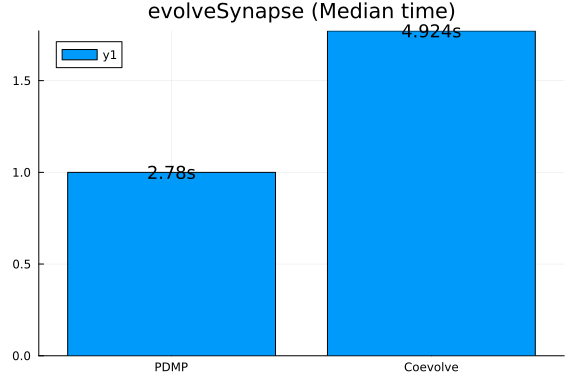

```julia
using Synapse
using PiecewiseDeterministicMarkovProcesses, JumpProcesses, OrdinaryDiffEq, Plots
using BenchmarkTools
fmt = :png
```

```
:png
```


# Model and example solutions

Here we implement the stochastic model of hippocampal synaptic plasticity with geometrical readount of enzyme dinamics from Rodrigues et al. [1].


## Parameters and initial conditions

```julia
p_synapse = SynapseParams(t_end = 1000.0);
glu = 0.0;
events_sorted_times = [500.0];
is_pre_or_post_event = [true];
events_bap = events_sorted_times[is_pre_or_post_event.==false];
bap_by_epsp = Float64[];
nu = buildTransitionMatrix();
```


```julia
xc0 = initial_conditions_continuous_temp(p_synapse);
xd0 = initial_conditions_discrete(p_synapse);
```


## Algorithms to benchmark

`CoevolveSynced` allow us to save at regular intervals. Thus, rather than saving when a jump occurs, we save at the same average frequency as obtained with `PDMP`.

```julia
solver = AutoTsit5(Rosenbrock23());
algorithms = [
    (
        label = "PDMP",
        agg = nothing,
        solver = (CHV(solver), CHV(solver)),
        saveat = [],
    ),
    (
        label = "Coevolve",
        agg = Coevolve(),
        solver = (solver, solver),
        saveat = 1 / p_synapse.sampling_rate,
    ),
];
```


## Example solutions

```julia
results = []

for algo in algorithms
    push!(
        results,
        evolveSynapse(
            xc0,
            xd0,
            p_synapse,
            events_sorted_times,
            is_pre_or_post_event,
            bap_by_epsp,
            [true],
            nu,
            algo.solver,
            algo.agg;
            save_positions = (false, true),
            saveat = algo.saveat,
            save_everystep = false,
        ),
    )
end
```

```
1.480813 seconds (71.08 k allocations: 17.020 MiB)
  2.444074 seconds (206.73 k allocations: 39.771 MiB)
```


```julia
fig = plot(xlabel = "Voltage", ylabel = "Time");
for (i, algo) in enumerate(algorithms)
    res = results[i]
    plot!(res.t, res.Vsp, label = algo.label)
end
title!("Vsp")
```


```julia
fig = plot(xlabel = "N", ylabel = "Time");
for (i, algo) in enumerate(algorithms)
    res = results[i]
    plot!(res.t, res.XD[1, :], label = algo.label)
end
title!("2line-Go, AMPA")
```


# Benchmarking performance

```julia
bs = Vector{BenchmarkTools.Trial}()

for algo in algorithms
    push!(
        bs,
        @benchmark(
            evolveSynapse(
                xc0,
                xd0,
                p_synapse,
                events_sorted_times,
                is_pre_or_post_event,
                bap_by_epsp,
                [true],
                nu,
                $(algo).solver,
                $(algo).agg;
                save_positions = (false, true),
                saveat = $(algo).saveat,
                save_everystep = false,
            ),
            samples = 50,
            evals = 1,
            seconds = 500,
        )
    )
end
```

```
1.743844 seconds (83.03 k allocations: 19.412 MiB)
  1.402157 seconds (68.57 k allocations: 16.386 MiB)
  1.532363 seconds (75.10 k allocations: 18.684 MiB)
  1.706722 seconds (80.38 k allocations: 18.779 MiB, 0.74% gc time)
  1.814529 seconds (86.46 k allocations: 20.989 MiB)
  1.462198 seconds (70.63 k allocations: 16.681 MiB)
  1.577648 seconds (75.58 k allocations: 17.711 MiB)
  1.612157 seconds (77.17 k allocations: 18.127 MiB)
  1.666225 seconds (78.96 k allocations: 18.527 MiB, 0.90% gc time)
  1.483661 seconds (74.25 k allocations: 18.929 MiB)
  1.928646 seconds (91.56 k allocations: 22.198 MiB)
  1.710139 seconds (80.27 k allocations: 18.418 MiB)
  1.543551 seconds (73.88 k allocations: 17.309 MiB)
  1.459835 seconds (71.01 k allocations: 17.017 MiB, 0.76% gc time)
  1.505540 seconds (75.53 k allocations: 19.317 MiB)
  1.818771 seconds (86.68 k allocations: 21.009 MiB)
  1.753132 seconds (84.63 k allocations: 20.858 MiB)
  1.398246 seconds (68.21 k allocations: 16.216 MiB)
  1.556026 seconds (74.40 k allocations: 17.559 MiB, 1.00% gc time)
  1.551480 seconds (76.34 k allocations: 19.042 MiB)
  1.538067 seconds (75.29 k allocations: 18.720 MiB)
  1.872685 seconds (88.85 k allocations: 21.388 MiB)
  1.470212 seconds (71.24 k allocations: 16.892 MiB)
  1.224661 seconds (62.06 k allocations: 15.310 MiB, 0.65% gc time)
  1.703790 seconds (81.60 k allocations: 19.151 MiB)
  1.280838 seconds (64.28 k allocations: 15.713 MiB)
  1.503228 seconds (72.47 k allocations: 17.021 MiB)
  1.416111 seconds (69.11 k allocations: 16.491 MiB)
  1.427776 seconds (69.17 k allocations: 16.460 MiB, 0.83% gc time)
  1.771260 seconds (83.52 k allocations: 19.348 MiB)
  1.823370 seconds (86.08 k allocations: 20.685 MiB)
  1.557331 seconds (74.50 k allocations: 17.339 MiB)
  1.753256 seconds (84.00 k allocations: 20.593 MiB)
  1.699803 seconds (80.87 k allocations: 19.729 MiB, 0.90% gc time)
  1.427968 seconds (70.20 k allocations: 16.792 MiB)
  1.788821 seconds (84.03 k allocations: 19.425 MiB)
  1.269309 seconds (63.82 k allocations: 15.551 MiB)
  1.564945 seconds (74.52 k allocations: 17.320 MiB)
  1.354212 seconds (67.03 k allocations: 16.150 MiB)
  1.471074 seconds (71.48 k allocations: 16.983 MiB)
  1.481052 seconds (71.68 k allocations: 17.008 MiB)
  1.503966 seconds (72.89 k allocations: 17.214 MiB)
  1.712515 seconds (82.66 k allocations: 20.321 MiB)
  1.823859 seconds (85.55 k allocations: 19.812 MiB)
  1.377948 seconds (68.00 k allocations: 16.339 MiB)
  1.546164 seconds (74.64 k allocations: 17.653 MiB)
  1.192294 seconds (59.63 k allocations: 14.488 MiB, 0.70% gc time)
  1.791159 seconds (85.01 k allocations: 20.548 MiB)
  1.458871 seconds (71.02 k allocations: 16.862 MiB)
  1.317014 seconds (65.84 k allocations: 16.024 MiB)
  1.053792 seconds (54.58 k allocations: 13.517 MiB)
  2.541883 seconds (206.41 k allocations: 39.895 MiB, 1.88% gc time)
  2.500507 seconds (204.32 k allocations: 39.592 MiB)
  2.412786 seconds (199.40 k allocations: 38.667 MiB)
  2.521936 seconds (210.98 k allocations: 40.606 MiB)
  2.481230 seconds (211.93 k allocations: 41.185 MiB, 0.63% gc time)
  2.622445 seconds (222.22 k allocations: 43.071 MiB, 0.43% gc time)
  2.584629 seconds (220.57 k allocations: 42.733 MiB)
  2.451739 seconds (206.00 k allocations: 39.711 MiB)
  2.496172 seconds (205.83 k allocations: 39.817 MiB)
  2.424949 seconds (211.01 k allocations: 40.978 MiB)
  2.443854 seconds (209.07 k allocations: 40.673 MiB, 0.44% gc time)
  2.639029 seconds (223.44 k allocations: 43.279 MiB, 0.42% gc time)
  2.430420 seconds (204.23 k allocations: 39.397 MiB)
  2.436178 seconds (201.34 k allocations: 38.980 MiB)
  2.552548 seconds (223.04 k allocations: 43.037 MiB)
  2.668244 seconds (231.86 k allocations: 44.546 MiB, 0.36% gc time)
  2.400691 seconds (200.85 k allocations: 38.810 MiB, 0.46% gc time)
  2.518246 seconds (209.82 k allocations: 40.375 MiB, 0.45% gc time)
  2.609381 seconds (222.52 k allocations: 43.120 MiB)
  2.593504 seconds (225.97 k allocations: 43.584 MiB)
  2.486629 seconds (216.48 k allocations: 41.940 MiB)
  2.497178 seconds (219.43 k allocations: 42.396 MiB)
  2.509257 seconds (213.43 k allocations: 41.487 MiB, 0.42% gc time)
  2.602570 seconds (214.29 k allocations: 41.241 MiB, 0.48% gc time)
  2.438302 seconds (204.57 k allocations: 39.449 MiB)
  2.430194 seconds (217.29 k allocations: 41.928 MiB)
  2.595882 seconds (222.95 k allocations: 43.139 MiB)
  2.460827 seconds (212.67 k allocations: 41.320 MiB)
  2.492851 seconds (214.37 k allocations: 41.578 MiB, 0.65% gc time)
  2.554285 seconds (217.54 k allocations: 42.218 MiB, 0.42% gc time)
  2.462492 seconds (201.55 k allocations: 39.069 MiB)
  2.486362 seconds (215.03 k allocations: 41.723 MiB)
  2.513452 seconds (211.96 k allocations: 40.761 MiB)
  2.450070 seconds (205.37 k allocations: 39.622 MiB)
  2.406613 seconds (204.61 k allocations: 39.357 MiB, 0.44% gc time)
  2.460771 seconds (207.39 k allocations: 39.903 MiB, 0.50% gc time)
  2.682317 seconds (221.83 k allocations: 42.519 MiB)
  2.467149 seconds (209.17 k allocations: 40.218 MiB)
  2.413236 seconds (201.70 k allocations: 38.991 MiB)
  2.452500 seconds (201.46 k allocations: 38.998 MiB, 0.72% gc time)
  2.558878 seconds (215.97 k allocations: 41.982 MiB, 0.83% gc time)
  2.518942 seconds (216.40 k allocations: 41.990 MiB)
  2.727408 seconds (240.56 k allocations: 45.987 MiB)
  2.557795 seconds (224.79 k allocations: 43.328 MiB)
  2.280340 seconds (191.08 k allocations: 37.137 MiB)
  2.528231 seconds (208.37 k allocations: 40.234 MiB)
  2.525951 seconds (214.08 k allocations: 41.635 MiB, 0.48% gc time)
  2.501824 seconds (208.88 k allocations: 40.201 MiB, 0.64% gc time)
  2.536619 seconds (214.46 k allocations: 41.144 MiB)
  2.666969 seconds (219.78 k allocations: 42.306 MiB)
  2.444814 seconds (200.86 k allocations: 38.983 MiB)
```


```julia
labels = [a.label for a in algorithms]
medtimes = [text(string(round(median(b).time/1e9, digits=3),"s"), :center, 12) for b in bs]
relmedtimes = [median(b).time for b in bs]
relmedtimes ./= relmedtimes[1]
bar(labels, relmedtimes, markeralpha=0, series_annotation=medtimes, fmt=fmt)
title!("evolveSynapse (Median time)")
```



```julia
medmem = [text(string(round(median(b).memory/1e6, digits=3),"Mb"), :center, 12) for b in bs]
relmedmem = Float64[median(b).memory for b in bs]
relmedmem ./= relmedmem[1]
bar(labels, relmedmem, markeralpha=0, series_annotation=medmem, fmt=fmt)
title!("evolveSynapse (Median memory)")
```


# References

[1] Y. E. Rodrigues, C. M. Tigaret, H. Marie, C. O’Donnell, and R. Veltz, "A stochastic model of hippocampal synaptic plasticity with geometrical readout of enzyme dynamics." bioRxiv, p. 2021.03.30.437703, Mar. 30, 2021. doi: 10.1101/2021.03.30.437703.

