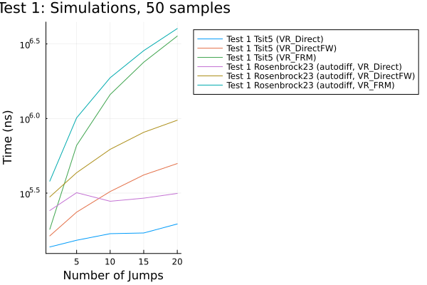
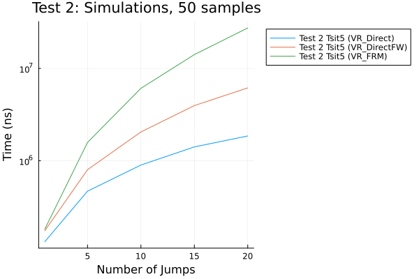
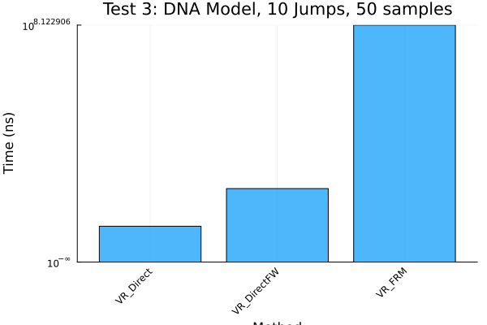
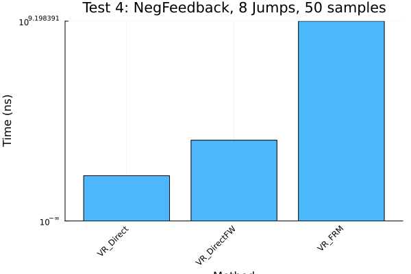

```julia
using DiffEqBase, Catalyst, JumpProcesses, OrdinaryDiffEq, StochasticDiffEq
using Random, LinearSolve, StableRNGs, BenchmarkTools, Plots, LinearAlgebra
fmt = :png
width_px, height_px = default(:size)
rng = StableRNG(12345)
```

```
StableRNGs.LehmerRNG(state=0x00000000000000000000000000006073)
```


# Introduction

This document benchmarks the performance of variable rate jumps in `JumpProcesses.jl`, comparing the `VR_Direct`, `VR_DirectFW`, and `VR_FRM` aggregators for variable rate jumps.

The test cases are:

1. **Scalar ODE with Variable Rate Jumps**: Solved with `Tsit5` and `Rosenbrock23` (autodiff).
2. **Complex ODE with Variable Rate Jump**: Solved with `Tsit5`.
3. **DNA Gene Model**: ODE with 10 variable rate jumps from the RSSA paper, solved with `Tsit5`.
4. **Negative Feedback Gene Expression**: Variable rate jumps solved with `Tsit5`, from Marchetti et al. (2017).

For benchmarking, we vary the number of jumps from 1 to 20 for Tests 1 and 2 and use a fixed number of jumps for Test 3 (10) and Test 4 (8), running 50 trajectories. Benchmarking saves only at the final time with `save_positions=(false, false)`.

# Benchmark and Plot Test 1

We benchmark Test 1 for 1 to 20 jumps, running 50 trajectories, and plot mean execution times as a line plot.

```julia
let
    algorithms = Tuple{Any, Any, String, String}[
        (VR_Direct(), Tsit5(), "VR_Direct", "Test 1 Tsit5 (VR_Direct)"),
        (VR_DirectFW(), Tsit5(), "VR_DirectFW", "Test 1 Tsit5 (VR_DirectFW)"),
        (VR_FRM(), Tsit5(), "VR_FRM", "Test 1 Tsit5 (VR_FRM)"),
        (VR_Direct(), Rosenbrock23(), "VR_Direct", "Test 1 Rosenbrock23 (autodiff, VR_Direct)"),
        (VR_DirectFW(), Rosenbrock23(), "VR_DirectFW", "Test 1 Rosenbrock23 (autodiff, VR_DirectFW)"),
        (VR_FRM(), Rosenbrock23(), "VR_FRM", "Test 1 Rosenbrock23 (autodiff, VR_FRM)"),
    ]

    function create_test1_problem(num_jumps, vr_aggregator, solver)
        f = (du, u, p, t) -> (du[1] = u[1])
        prob = ODEProblem(f, [0.2], (0.0, 10.0))
        jumps = [VariableRateJump((u, p, t) -> u[1], (integrator) -> (integrator.u[1] = integrator.u[1] / 2.0); interp_points=20) for _ in 1:num_jumps]
        jump_prob = JumpProblem(prob, Direct(), jumps...; vr_aggregator=vr_aggregator, rng=rng, save_positions=(false, false))
        ensemble_prob = EnsembleProblem(jump_prob)
        return ensemble_prob, jump_prob
    end

    num_jumps_range = append!([1], 5:5:20)
    bs = Vector{Vector{BenchmarkTools.Trial}}()
    errors = Dict{String, Vector{String}}()

    for (algo, stepper, agg_name, label) in algorithms
        @info "Benchmarking $label"
        push!(bs, Vector{BenchmarkTools.Trial}())
        errors[label] = String[]
        _bs = bs[end]
        for var in num_jumps_range
            ensemble_prob, jump_prob = create_test1_problem(var, algo, stepper)
            trial = try
                @benchmark(
                    solve($jump_prob, $stepper, saveat=[$jump_prob.prob.tspan[2]]),
                    samples=50,
                    evals=1,
                    seconds=100
                )
            catch e
                push!(errors[label], "Error at Num Jumps = $var: $(sprint(showerror, e))")
                BenchmarkTools.Trial(BenchmarkTools.Parameters(samples=50, evals=1, seconds=100))
            end
            push!(_bs, trial)
            mean_time = length(trial) > 0 ? "$(BenchmarkTools.prettytime(mean(trial.times)))" : "nan"
            println("algo=$label, Num Jumps = $var, length = $(length(trial.times)), mean time = $mean_time")
        end
    end

    # Log errors
    for (label, err_list) in errors
        if !isempty(err_list)
            @warn "Errors for $label:"
            for err in err_list
                println(err)
            end
        end
    end

    # Plot results
    fig = plot(
        yscale=:log10,
        xlabel="Number of Jumps",
        ylabel="Time (ns)",
        legend_position=:outertopright,
        title="Test 1: Simulations, 50 samples"
    )
    for (i, (algo, stepper, agg_name, label)) in enumerate(algorithms)
        _bs, _vars = [], []
        for (j, b) in enumerate(bs[i])
            if length(b) == 50
                push!(_bs, mean(b.times))
                push!(_vars, num_jumps_range[j])
            end
        end
        if !isempty(_bs)
            plot!(_vars, _bs, label=label)
        else
            @warn "No valid data for $label in Test 1"
        end
    end
    display(plot(fig, layout=(1, 1), format=fmt, size=(width_px, height_px)))
end
```

```
algo=Test 1 Tsit5 (VR_Direct), Num Jumps = 1, length = 50, mean time = 137.
690 μs
algo=Test 1 Tsit5 (VR_Direct), Num Jumps = 5, length = 50, mean time = 152.
699 μs
algo=Test 1 Tsit5 (VR_Direct), Num Jumps = 10, length = 50, mean time = 169
.023 μs
algo=Test 1 Tsit5 (VR_Direct), Num Jumps = 15, length = 50, mean time = 170
.835 μs
algo=Test 1 Tsit5 (VR_Direct), Num Jumps = 20, length = 50, mean time = 196
.389 μs
algo=Test 1 Tsit5 (VR_DirectFW), Num Jumps = 1, length = 50, mean time = 16
3.329 μs
algo=Test 1 Tsit5 (VR_DirectFW), Num Jumps = 5, length = 50, mean time = 23
5.684 μs
algo=Test 1 Tsit5 (VR_DirectFW), Num Jumps = 10, length = 50, mean time = 3
24.002 μs
algo=Test 1 Tsit5 (VR_DirectFW), Num Jumps = 15, length = 50, mean time = 4
18.490 μs
algo=Test 1 Tsit5 (VR_DirectFW), Num Jumps = 20, length = 50, mean time = 4
99.062 μs
algo=Test 1 Tsit5 (VR_FRM), Num Jumps = 1, length = 50, mean time = 180.745
 μs
algo=Test 1 Tsit5 (VR_FRM), Num Jumps = 5, length = 50, mean time = 660.600
 μs
algo=Test 1 Tsit5 (VR_FRM), Num Jumps = 10, length = 50, mean time = 1.448 
ms
algo=Test 1 Tsit5 (VR_FRM), Num Jumps = 15, length = 50, mean time = 2.385 
ms
algo=Test 1 Tsit5 (VR_FRM), Num Jumps = 20, length = 50, mean time = 3.570 
ms
algo=Test 1 Rosenbrock23 (autodiff, VR_Direct), Num Jumps = 1, length = 50,
 mean time = 241.615 μs
algo=Test 1 Rosenbrock23 (autodiff, VR_Direct), Num Jumps = 5, length = 50,
 mean time = 318.209 μs
algo=Test 1 Rosenbrock23 (autodiff, VR_Direct), Num Jumps = 10, length = 50
, mean time = 278.782 μs
algo=Test 1 Rosenbrock23 (autodiff, VR_Direct), Num Jumps = 15, length = 50
, mean time = 292.455 μs
algo=Test 1 Rosenbrock23 (autodiff, VR_Direct), Num Jumps = 20, length = 50
, mean time = 314.673 μs
algo=Test 1 Rosenbrock23 (autodiff, VR_DirectFW), Num Jumps = 1, length = 5
0, mean time = 298.060 μs
algo=Test 1 Rosenbrock23 (autodiff, VR_DirectFW), Num Jumps = 5, length = 5
0, mean time = 433.248 μs
algo=Test 1 Rosenbrock23 (autodiff, VR_DirectFW), Num Jumps = 10, length = 
50, mean time = 621.597 μs
algo=Test 1 Rosenbrock23 (autodiff, VR_DirectFW), Num Jumps = 15, length = 
50, mean time = 808.563 μs
algo=Test 1 Rosenbrock23 (autodiff, VR_DirectFW), Num Jumps = 20, length = 
50, mean time = 974.370 μs
algo=Test 1 Rosenbrock23 (autodiff, VR_FRM), Num Jumps = 1, length = 50, me
an time = 379.978 μs
algo=Test 1 Rosenbrock23 (autodiff, VR_FRM), Num Jumps = 5, length = 50, me
an time = 1.011 ms
algo=Test 1 Rosenbrock23 (autodiff, VR_FRM), Num Jumps = 10, length = 50, m
ean time = 1.878 ms
algo=Test 1 Rosenbrock23 (autodiff, VR_FRM), Num Jumps = 15, length = 50, m
ean time = 2.852 ms
algo=Test 1 Rosenbrock23 (autodiff, VR_FRM), Num Jumps = 20, length = 50, m
ean time = 4.011 ms
```





# Benchmark and Plot Test 2

We benchmark Test 2 for 1 to 20 jumps, running 50 trajectories, and plot mean execution times as a line plot.

```julia
let
    algorithms = Tuple{Any, Any, String, String}[
        (VR_Direct(), Tsit5(), "VR_Direct", "Test 2 Tsit5 (VR_Direct)"),
        (VR_DirectFW(), Tsit5(), "VR_DirectFW", "Test 2 Tsit5 (VR_DirectFW)"),
        (VR_FRM(), Tsit5(), "VR_FRM", "Test 2 Tsit5 (VR_FRM)"),
    ]

    function create_test2_problem(num_jumps, vr_aggregator, solver)
        f4 = (dx, x, p, t) -> (dx[1] = x[1])
        rate4 = (x, p, t) -> t
        affect4! = (integrator) -> (integrator.u[1] = integrator.u[1] * 0.5)
        prob = ODEProblem(f4, [1.0 + 0.0im], (0.0, 6.0))
        jumps = [VariableRateJump(rate4, affect4!) for _ in 1:num_jumps]
        jump_prob = JumpProblem(prob, Direct(), jumps...; vr_aggregator=vr_aggregator, rng=rng, save_positions=(false, false))
        ensemble_prob = EnsembleProblem(jump_prob)
        return ensemble_prob, jump_prob
    end

    num_jumps_range = append!([1], 5:5:20)
    bs = Vector{Vector{BenchmarkTools.Trial}}()
    errors = Dict{String, Vector{String}}()

    for (algo, stepper, agg_name, label) in algorithms
        @info "Benchmarking $label"
        push!(bs, Vector{BenchmarkTools.Trial}())
        errors[label] = String[]
        _bs = bs[end]
        for var in num_jumps_range
            ensemble_prob, jump_prob = create_test2_problem(var, algo, stepper)
            trial = try
                @benchmark(
                    solve($jump_prob, $stepper, saveat=[$jump_prob.prob.tspan[2]]),
                    samples=50,
                    evals=1,
                    seconds=100
                )
            catch e
                push!(errors[label], "Error at Num Jumps = $var: $(sprint(showerror, e))")
                BenchmarkTools.Trial(BenchmarkTools.Parameters(samples=50, evals=1, seconds=100))
            end
            push!(_bs, trial)
            mean_time = length(trial) > 0 ? "$(BenchmarkTools.prettytime(mean(trial.times)))" : "nan"
            println("algo=$label, Num Jumps = $var, length = $(length(trial.times)), mean time = $mean_time")
        end
    end

    # Log errors
    for (label, err_list) in errors
        if !isempty(err_list)
            @warn "Errors for $label:"
            for err in err_list
                println(err)
            end
        end
    end

    # Plot results
    fig = plot(
        yscale=:log10,
        xlabel="Number of Jumps",
        ylabel="Time (ns)",
        legend_position=:outertopright,
        title="Test 2: Simulations, 50 samples"
    )
    for (i, (algo, stepper, agg_name, label)) in enumerate(algorithms)
        _bs, _vars = [], []
        for (j, b) in enumerate(bs[i])
            if length(b) == 50
                push!(_bs, mean(b.times))
                push!(_vars, num_jumps_range[j])
            end
        end
        if !isempty(_bs)
            plot!(_vars, _bs, label=label)
        else
            @warn "No valid data for $label in Test 2"
        end
    end
    display(plot(fig, layout=(1, 1), format=fmt, size=(width_px, height_px)))
end
```

```
algo=Test 2 Tsit5 (VR_Direct), Num Jumps = 1, length = 50, mean time = 132.
579 μs
algo=Test 2 Tsit5 (VR_Direct), Num Jumps = 5, length = 50, mean time = 468.
060 μs
algo=Test 2 Tsit5 (VR_Direct), Num Jumps = 10, length = 50, mean time = 898
.817 μs
algo=Test 2 Tsit5 (VR_Direct), Num Jumps = 15, length = 50, mean time = 1.4
13 ms
algo=Test 2 Tsit5 (VR_Direct), Num Jumps = 20, length = 50, mean time = 1.8
56 ms
algo=Test 2 Tsit5 (VR_DirectFW), Num Jumps = 1, length = 50, mean time = 17
4.360 μs
algo=Test 2 Tsit5 (VR_DirectFW), Num Jumps = 5, length = 50, mean time = 79
9.879 μs
algo=Test 2 Tsit5 (VR_DirectFW), Num Jumps = 10, length = 50, mean time = 2
.051 ms
algo=Test 2 Tsit5 (VR_DirectFW), Num Jumps = 15, length = 50, mean time = 3
.959 ms
algo=Test 2 Tsit5 (VR_DirectFW), Num Jumps = 20, length = 50, mean time = 6
.155 ms
algo=Test 2 Tsit5 (VR_FRM), Num Jumps = 1, length = 50, mean time = 181.273
 μs
algo=Test 2 Tsit5 (VR_FRM), Num Jumps = 5, length = 50, mean time = 1.578 m
s
algo=Test 2 Tsit5 (VR_FRM), Num Jumps = 10, length = 50, mean time = 6.093 
ms
algo=Test 2 Tsit5 (VR_FRM), Num Jumps = 15, length = 50, mean time = 14.118
 ms
algo=Test 2 Tsit5 (VR_FRM), Num Jumps = 20, length = 50, mean time = 27.447
 ms
```





# Benchmark and Plot Test 3

We benchmark Test 3 for fixed 10 jumps, running 50 trajectories, and plot mean execution times as a bar plot.

```julia
let
    algorithms = Tuple{Any, Any, String, String}[
        (VR_Direct(), Tsit5(), "VR_Direct", "Test 3 Tsit5 (VR_Direct, DNA Model)"),
        (VR_DirectFW(), Tsit5(), "VR_DirectFW", "Test 3 Tsit5 (VR_DirectFW, DNA Model)"),
        (VR_FRM(), Tsit5(), "VR_FRM", "Test 3 Tsit5 (VR_FRM, DNA Model)"),
    ]

    function create_test3_problem(num_jumps, vr_aggregator, solver)
        r = [0.043, 0.0007, 0.0715, 0.0039, 0.0199, 0.4791, 0.00019, 0.8765, 0.083, 0.5]
        k = -log(2) / 30
        u0 = [10.0, 10.0, 30.0, 0.0, 0.0, 0.0]  # [DNA, M, D, RNA, DNAD, DNA2D]
        tspan = (0.0, 120.0)
        
        function f_dna(du, u, p, t)
            du .= 0.0
            nothing
        end
        
        function rate1(u, p, t) r[1] * u[4] end
        function affect1!(integrator) integrator.u[2] += 1; nothing end
        jump1 = VariableRateJump(rate1, affect1!)
        
        function rate2(u, p, t) r[2] * u[2] end
        function affect2!(integrator) integrator.u[2] -= 1; nothing end
        jump2 = VariableRateJump(rate2, affect2!)
        
        function rate3(u, p, t) r[3] * u[5] end
        function affect3!(integrator) integrator.u[4] += 1; nothing end
        jump3 = VariableRateJump(rate3, affect3!)
        
        function rate4(u, p, t) r[4] * u[4] end
        function affect4!(integrator) integrator.u[4] -= 1; nothing end
        jump4 = VariableRateJump(rate4, affect4!)
        
        function rate5(u, p, t) r[5] * exp(k * t) * u[1] * u[3] end
        function affect5!(integrator) integrator.u[1] -= 1; integrator.u[3] -= 1; integrator.u[5] += 1; nothing end
        jump5 = VariableRateJump(rate5, affect5!)
        
        function rate6(u, p, t) r[6] * u[5] end
        function affect6!(integrator) integrator.u[5] -= 1; integrator.u[1] += 1; integrator.u[3] += 1; nothing end
        jump6 = VariableRateJump(rate6, affect6!)
        
        function rate7(u, p, t) r[7] * exp(k * t) * u[5] * u[3] end
        function affect7!(integrator) integrator.u[5] -= 1; integrator.u[3] -= 1; integrator.u[6] += 1; nothing end
        jump7 = VariableRateJump(rate7, affect7!)
        
        function rate8(u, p, t) r[8] * u[6] end
        function affect8!(integrator) integrator.u[6] -= 1; integrator.u[1] += 1; integrator.u[3] += 1; nothing end
        jump8 = VariableRateJump(rate8, affect8!)
        
        function rate9(u, p, t) r[9] * exp(k * t) * u[2] * (u[2] - 1) / 2 end
        function affect9!(integrator) integrator.u[2] -= 2; integrator.u[3] += 1; nothing end
        jump9 = VariableRateJump(rate9, affect9!)
        
        function rate10(u, p, t) r[10] * u[3] end
        function affect10!(integrator) integrator.u[3] -= 1; integrator.u[2] += 2; nothing end
        jump10 = VariableRateJump(rate10, affect10!)
        
        prob = ODEProblem(f_dna, u0, tspan)
        jumps = (jump1, jump2, jump3, jump4, jump5, jump6, jump7, jump8, jump9, jump10)
        jump_prob = JumpProblem(prob, Direct(), jumps...; vr_aggregator=vr_aggregator, rng=rng, save_positions=(false, false))
        ensemble_prob = EnsembleProblem(jump_prob)
        return ensemble_prob, jump_prob
    end

    num_jumps_range = [10]
    bs = Vector{Vector{BenchmarkTools.Trial}}()
    errors = Dict{String, Vector{String}}()

    for (algo, stepper, agg_name, label) in algorithms
        @info "Benchmarking $label"
        push!(bs, Vector{BenchmarkTools.Trial}())
        errors[label] = String[]
        _bs = bs[end]
        for var in num_jumps_range
            ensemble_prob, jump_prob = create_test3_problem(var, algo, stepper)
            trial = try
                @benchmark(
                    solve($jump_prob, $stepper, saveat=[$jump_prob.prob.tspan[2]]),
                    samples=50,
                    evals=1,
                    seconds=100
                )
            catch e
                push!(errors[label], "Error at Num Jumps = $var: $(sprint(showerror, e))")
                BenchmarkTools.Trial(BenchmarkTools.Parameters(samples=50, evals=1, seconds=100))
            end
            push!(_bs, trial)
            mean_time = length(trial) > 0 ? "$(BenchmarkTools.prettytime(mean(trial.times)))" : "nan"
            println("algo=$label, Num Jumps = $var, length = $(length(trial.times)), mean time = $mean_time")
        end
    end

    # Log errors
    for (label, err_list) in errors
        if !isempty(err_list)
            @warn "Errors for $label:"
            for err in err_list
                println(err)
            end
        end
    end

    # Plot results
    fig = plot(
        yscale=:log10,
        xlabel="Method",
        ylabel="Time (ns)",
        title="Test 3: DNA Model, 10 Jumps, 50 samples",
        xticks=(1:length(algorithms), [split(a[3], " (")[1] for a in algorithms]),
        xrotation=45
    )
    means = []
    for (i, (algo, stepper, agg_name, label)) in enumerate(algorithms)
        b = bs[i][1]  # Single jump count (10)
        if length(b) == 50
            push!(means, mean(b.times))
        else
            push!(means, NaN)
            @warn "No valid data for $label in Test 3"
        end
    end
    bar!(1:length(algorithms), means, label="", fillalpha=0.7)
    display(plot(fig, layout=(1, 1), format=fmt, size=(width_px, height_px)))
end
```

```
algo=Test 3 Tsit5 (VR_Direct, DNA Model), Num Jumps = 10, length = 50, mean
 time = 20.086 ms
algo=Test 3 Tsit5 (VR_DirectFW, DNA Model), Num Jumps = 10, length = 50, me
an time = 41.157 ms
algo=Test 3 Tsit5 (VR_FRM, DNA Model), Num Jumps = 10, length = 50, mean ti
me = 132.711 ms
```





# Benchmark and Plot Test 4

We benchmark Test 4 for fixed 8 jumps, running 50 trajectories, and plot mean execution times as a bar plot.

```julia
let
    algorithms = Tuple{Any, Any, String, String}[
        #(Direct(), SSAStepper(), "Direct", "Test 4 SSAStepper (Direct, NegFeedback, Constant Rate)"),
        (VR_Direct(), Tsit5(), "VR_Direct", "Test 4 Tsit5 (VR_Direct, NegFeedback, Variable Rate)"),
        (VR_DirectFW(), Tsit5(), "VR_DirectFW", "Test 4 Tsit5 (VR_DirectFW, NegFeedback, Variable Rate)"),
        (VR_FRM(), Tsit5(), "VR_FRM", "Test 4 Tsit5 (VR_FRM, NegFeedback, Variable Rate)"),
    ]

    function create_test4_problem(num_jumps, aggregator, solver)
        rn = @reaction_network begin
            c1, G --> G + M
            c2, M --> M + P
            c3, M --> 0
            c4, P --> 0
            c5, 2P --> P2
            c6, P2 --> 2P
            c7, P2 + G --> P2G
            c8, P2G --> P2 + G
        end
        rnpar = [:c1 => 0.09, :c2 => 0.05, :c3 => 0.001, :c4 => 0.0009, :c5 => 0.00001,
                 :c6 => 0.0005, :c7 => 0.005, :c8 => 0.9]
        u0 = [:G => 500, :M => 0, :P => 0, :P2 => 0, :P2G => 0]
        tspan = (0.0, 100.0)

        if aggregator isa Direct
            prob = DiscreteProblem(rn, u0, tspan, rnpar)
            jump_prob = JumpProblem(rn, prob, Direct(), rng=rng, save_positions=(false, false))
            ensemble_prob = EnsembleProblem(jump_prob)
        else
            function f_gene(du, u, p, t)
                du .= 0.0
                nothing
            end
            u0_numeric = [500.0, 0.0, 0.0, 0.0, 0.0]
            p_numeric = [0.09, 0.05, 0.001, 0.0009, 0.00001, 0.0005, 0.005, 0.9]
            var_rate = true
            prob = ODEProblem(f_gene, u0_numeric, tspan, (p_numeric, var_rate))

            function rate1(u, p, t) p[1][1] * (p[2] ? (1 + 0.1 * sin(t)) : 1.0) * u[1] end
            function affect1!(integrator) integrator.u[2] += 1; nothing end
            jump1 = VariableRateJump(rate1, affect1!)

            function rate2(u, p, t) p[1][2] * u[2] end
            function affect2!(integrator) integrator.u[3] += 1; nothing end
            jump2 = VariableRateJump(rate2, affect2!)

            function rate3(u, p, t) p[1][3] * u[2] end
            function affect3!(integrator) integrator.u[2] -= 1; nothing end
            jump3 = VariableRateJump(rate3, affect3!)

            function rate4(u, p, t) p[1][4] * u[3] end
            function affect4!(integrator) integrator.u[3] -= 1; nothing end
            jump4 = VariableRateJump(rate4, affect4!)

            function rate5(u, p, t) p[1][5] * (p[2] ? (1 + 0.1 * cos(t)) : 1.0) * u[3] * (u[3] - 1) / 2 end
            function affect5!(integrator) integrator.u[3] -= 2; integrator.u[4] += 1; nothing end
            jump5 = VariableRateJump(rate5, affect5!)

            function rate6(u, p, t) p[1][6] * u[4] end
            function affect6!(integrator) integrator.u[4] -= 1; integrator.u[3] += 2; nothing end
            jump6 = VariableRateJump(rate6, affect6!)

            function rate7(u, p, t) p[1][7] * u[4] * u[1] end
            function affect7!(integrator) integrator.u[4] -= 1; integrator.u[1] -= 1; integrator.u[5] += 1; nothing end
            jump7 = VariableRateJump(rate7, affect7!)

            function rate8(u, p, t) p[1][8] * u[5] end
            function affect8!(integrator) integrator.u[5] -= 1; integrator.u[4] += 1; integrator.u[1] += 1; nothing end
            jump8 = VariableRateJump(rate8, affect8!)

            jumps = (jump1, jump2, jump3, jump4, jump5, jump6, jump7, jump8)
            jump_prob = JumpProblem(prob, Direct(), jumps...; vr_aggregator=aggregator, rng=rng, save_positions=(false, false))
            ensemble_prob = EnsembleProblem(jump_prob)
        end
        return ensemble_prob, jump_prob
    end

    num_jumps_range = [8]
    bs = Vector{Vector{BenchmarkTools.Trial}}()
    errors = Dict{String, Vector{String}}()

    for (algo, stepper, agg_name, label) in algorithms
        @info "Benchmarking $label"
        push!(bs, Vector{BenchmarkTools.Trial}())
        errors[label] = String[]
        _bs = bs[end]
        for var in num_jumps_range
            ensemble_prob, jump_prob = create_test4_problem(var, algo, stepper)
            trial = try
                @benchmark(
                    solve($jump_prob, $stepper, saveat=[$jump_prob.prob.tspan[2]]),
                    samples=50,
                    evals=1,
                    seconds=1000
                )
            catch e
                push!(errors[label], "Error at Num Jumps = $var: $(sprint(showerror, e))")
                BenchmarkTools.Trial(BenchmarkTools.Parameters(samples=10, evals=1, seconds=1000))
            end
            push!(_bs, trial)
            mean_time = length(trial) > 0 ? "$(BenchmarkTools.prettytime(mean(trial.times)))" : "nan"
            println("algo=$label, Num Jumps = $var, length = $(length(trial.times)), mean time = $mean_time")
        end
    end

    # Log errors
    for (label, err_list) in errors
        if !isempty(err_list)
            @warn "Errors for $label:"
            for err in err_list
                println(err)
            end
        end
    end

    # Plot results
    fig = plot(
        yscale=:log10,
        xlabel="Method",
        ylabel="Time (ns)",
        title="Test 4: NegFeedback, 8 Jumps, 50 samples",
        xticks=(1:length(algorithms), [split(a[3], " (")[1] for a in algorithms]),
        xrotation=45
    )
    means = []
    for (i, (algo, stepper, agg_name, label)) in enumerate(algorithms)
        b = bs[i][1]  # Single jump count (8)
        if length(b) == 50
            push!(means, mean(b.times))
        else
            push!(means, NaN)
            @warn "No valid data for $label in Test 4"
        end
    end
    bar!(1:length(algorithms), means, label="", fillalpha=0.7)
    display(plot(fig, layout=(1, 1), format=fmt, size=(width_px, height_px)))
end
```

```
algo=Test 4 Tsit5 (VR_Direct, NegFeedback, Variable Rate), Num Jumps = 8, l
ength = 50, mean time = 357.787 ms
algo=Test 4 Tsit5 (VR_DirectFW, NegFeedback, Variable Rate), Num Jumps = 8,
 length = 50, mean time = 638.580 ms
algo=Test 4 Tsit5 (VR_FRM, NegFeedback, Variable Rate), Num Jumps = 8, leng
th = 50, mean time = 1.579 s
```





## Appendix

These benchmarks are a part of the SciMLBenchmarks.jl repository, found at: [https://github.com/SciML/SciMLBenchmarks.jl](https://github.com/SciML/SciMLBenchmarks.jl). For more information on high-performance scientific machine learning, check out the SciML Open Source Software Organization [https://sciml.ai](https://sciml.ai).

To locally run this benchmark, do the following commands:
```
using SciMLBenchmarks
SciMLBenchmarks.weave_file("benchmarks/HybridJumps","VR_Aggregator_Benchmark.jmd")
```

Computer Information:

```
Julia Version 1.12.7
Commit 6d172b025e4 (2026-08-15 08:05 UTC)
Build Info:
  Official https://julialang.org release
Platform Info:
  OS: Linux (x86_64-linux-gnu)
  CPU: 128 × AMD EPYC 7502 32-Core Processor
  WORD_SIZE: 64
  LLVM: libLLVM-18.1.7 (ORCJIT, znver2)
  GC: Built with stock GC
Threads: 128 default, 1 interactive, 128 GC (on 128 virtual cores)
Environment:
  JULIA_NUM_THREADS = auto

```

Package Information:

```
Status `~/github-runners/amdci3-1/_work/SciMLBenchmarks.jl/SciMLBenchmarks.jl/benchmarks/HybridJumps/Project.toml`
  [6e4b80f9] BenchmarkTools v1.8.0
⌃ [479239e8] Catalyst v16.4.3
  [8f4d0f93] Conda v1.10.3
  [864edb3b] DataStructures v0.19.6
⌃ [2b5f629d] DiffEqBase v7.21.2
  [459566f4] DiffEqCallbacks v4.19.4
  [31c24e10] Distributions v0.25.131
  [86223c79] Graphs v1.15.0
  [ccbc3e58] JumpProcesses v9.33.1
⌅ [b4f0291d] LazySets v5.3.0
⌃ [7ed4a6bd] LinearSolve v5.18.1
  [1dea7af3] OrdinaryDiffEq v7.8.1
⌅ [d96e819e] Parameters v0.12.3
  [86206cdf] PiecewiseDeterministicMarkovProcesses v0.0.12
  [91a5bcdd] Plots v1.41.7
  [438e738f] PyCall v1.96.4
⌃ [731186ca] RecursiveArrayTools v4.5.2
  [31c91b34] SciMLBenchmarks v0.2.1 [loaded: `/home/crackauc/github-runners/amdci3-1/_work/SciMLBenchmarks.jl/SciMLBenchmarks.jl/src/SciMLBenchmarks.jl` (v0.2.1) expected `/home/crackauc/.julia/packages/SciMLBenchmarks/ceJyd/src/SciMLBenchmarks.jl` (v0.2.1)]
  [a6db7da4] SciMLLogging v2.1.0
⌃ [860ef19b] StableRNGs v1.0.4
⌃ [90137ffa] StaticArrays v1.9.22
  [789caeaf] StochasticDiffEq v7.2.0
  [37e2e46d] LinearAlgebra v1.12.0
  [2f01184e] SparseArrays v1.12.0
Info Packages marked with ⌃ and ⌅ have new versions available. Those with ⌃ may be upgradable, but those with ⌅ are restricted by compatibility constraints from upgrading. To see why use `status --outdated`
```

And the full manifest:

```
Status `~/github-runners/amdci3-1/_work/SciMLBenchmarks.jl/SciMLBenchmarks.jl/benchmarks/HybridJumps/Manifest.toml`
  [47edcb42] ADTypes v1.24.0
  [14f7f29c] AMD v0.5.4
  [6e696c72] AbstractPlutoDingetjes v1.4.1
  [1520ce14] AbstractTrees v0.4.5
  [7d9f7c33] Accessors v0.1.45
⌃ [79e6a3ab] Adapt v4.7.1
  [66dad0bd] AliasTables v1.1.3
  [ec485272] ArnoldiMethod v0.4.0
  [4fba245c] ArrayInterface v7.30.2
⌃ [4c555306] ArrayLayouts v1.13.0
⌃ [aae01518] BandedMatrices v1.13.0
  [6e4b80f9] BenchmarkTools v1.8.0
  [e2ed5e7c] Bijections v0.2.2
  [b2a6c25c] BinaryHeaps v1.1.0
  [caf10ac8] BipartiteGraphs v0.1.14
⌃ [8e7c35d0] BlockArrays v1.10.0
⌃ [70df07ce] BracketingNonlinearSolve v1.12.7
  [fa961155] CEnum v0.5.0
  [96374032] CRlibm v1.0.2
⌃ [479239e8] Catalyst v16.4.3
  [523fee87] CodecBzip2 v0.8.5
  [944b1d66] CodecZlib v0.7.9
  [35d6a980] ColorSchemes v3.31.0
  [3da002f7] ColorTypes v0.12.3
  [c3611d14] ColorVectorSpace v0.11.0
⌃ [5ae59095] Colors v0.13.1
⌅ [861a8166] Combinatorics v1.0.2
  [38540f10] CommonSolve v0.2.14
  [bbf7d656] CommonSubexpressions v0.3.1
  [f70d9fcc] CommonWorldInvalidations v1.2.2
  [34da2185] Compat v4.18.1
  [b152e2b5] CompositeTypes v0.1.4
  [a33af91c] CompositionsBase v0.1.2
  [2569d6c7] ConcreteStructs v0.2.8
  [8f4d0f93] Conda v1.10.3
  [187b0558] ConstructionBase v1.6.0
  [d38c429a] Contour v0.6.3
  [a8cc5b0e] Crayons v4.2.0
  [9a962f9c] DataAPI v1.16.0
  [a93c6f00] DataFrames v1.8.2
  [864edb3b] DataStructures v0.19.6
  [e2d170a0] DataValueInterfaces v1.0.0
  [8bb1440f] DelimitedFiles v1.9.1
⌃ [2b5f629d] DiffEqBase v7.21.2
  [459566f4] DiffEqCallbacks v4.19.4
⌃ [77a26b50] DiffEqNoiseProcess v5.36.3
  [163ba53b] DiffResults v1.1.0
  [b552c78f] DiffRules v1.16.0
  [a0c0ee7d] DifferentiationInterface v0.7.21
  [8d63f2c5] DispatchDoctor v0.4.29
  [31c24e10] Distributions v0.25.131
  [ffbed154] DocStringExtensions v0.9.5
⌃ [5b8099bc] DomainSets v0.8.2
  [7c1d4256] DynamicPolynomials v0.6.8
  [06fc5a27] DynamicQuantities v1.13.0
  [4e289a0a] EnumX v1.0.7
⌃ [f151be2c] EnzymeCore v0.8.21
  [90fa49ef] ErrorfreeArithmetic v0.5.2
  [e2ba6199] ExprTools v0.1.11
  [55351af7] ExproniconLite v0.10.14
⌃ [c87230d0] FFMPEG v0.4.5
  [7034ab61] FastBroadcast v1.4.0
  [9aa1b823] FastClosures v0.3.2
  [a4df4552] FastPower v1.5.0
  [fa42c844] FastRounding v0.3.1
  [1a297f60] FillArrays v1.17.1
  [64ca27bc] FindFirstFunctions v3.4.0
  [6a86dc24] FiniteDiff v2.33.0
⌅ [53c48c17] FixedPointNumbers v0.8.6
  [1fa38f19] Format v1.3.7
  [f6369f11] ForwardDiff v1.4.6
  [a85aefff] FunctionMaps v0.1.2
  [069b7b12] FunctionWrappers v1.1.3
  [77dc65aa] FunctionWrappersWrappers v1.13.0
  [60bf3e95] GLPK v1.2.1
  [46192b85] GPUArraysCore v0.2.1
  [28b8d3ca] GR v0.73.27
  [a0844989] Gamma v1.2.0
  [86223c79] Graphs v1.15.0
⌅ [eafb193a] Highlights v0.5.3
  [34004b35] HypergeometricFunctions v0.3.30
  [3263718b] ImplicitDiscreteSolve v2.3.0
  [d25df0c9] Inflate v0.1.5
⌅ [842dd82b] InlineStrings v1.4.6
  [18e54dd8] IntegerMathUtils v0.1.4
⌅ [d1acc4aa] IntervalArithmetic v0.21.2
⌃ [8197267c] IntervalSets v0.7.14
  [3587e190] InverseFunctions v0.1.17
  [41ab1584] InvertedIndices v1.3.1
  [92d709cd] IrrationalConstants v0.2.6
  [82899510] IteratorInterfaceExtensions v1.0.0
  [1019f520] JLFzf v0.1.11
  [692b3bcd] JLLWrappers v1.8.0
⌅ [682c06a0] JSON v0.21.4
  [ae98c720] Jieko v0.2.1
⌃ [4076af6c] JuMP v1.31.2
  [ccbc3e58] JumpProcesses v9.33.1
  [ba0b0d4f] Krylov v0.10.10
  [2faa5264] LHLFactorization v2.2.2
  [7f56f5a3] LSODA v1.2.0
  [b964fa9f] LaTeXStrings v1.4.1
  [23fbe1c1] Latexify v0.16.12
⌅ [b4f0291d] LazySets v5.3.0
⌃ [87fe0de2] LineSearch v0.1.18
⌃ [7ed4a6bd] LinearSolve v5.18.1
  [2ab3a3ac] LogExpFunctions v1.0.2
  [e6f89c97] LoggingExtras v1.2.0
  [1914dd2f] MacroTools v0.5.16
  [b8f27783] MathOptInterface v1.54.0
  [bb5d69b7] MaybeInplace v0.1.8
  [442fdcdd] Measures v0.3.3
  [e1d29d7a] Missings v1.2.0
⌃ [7771a370] ModelingToolkitBase v1.77.0
⌅ [2e0e35c7] Moshi v0.3.9
  [46d2c3a1] MuladdMacro v0.2.7
  [102ac46a] MultivariatePolynomials v0.5.20
  [ffc61752] Mustache v1.1.0
  [d8a4904e] MutableArithmetics v1.8.1
  [77ba4419] NaNMath v1.1.4
  [8913a72c] NonlinearSolve v4.32.0
⌃ [be0214bd] NonlinearSolveBase v2.54.0
  [5959db7a] NonlinearSolveFirstOrder v2.10.0
  [9a2c21bd] NonlinearSolveQuasiNewton v1.15.3
  [26075421] NonlinearSolveSpectralMethods v1.8.3
  [6fe1bfb0] OffsetArrays v1.17.0
⌅ [bac558e1] OrderedCollections v1.8.2 [loaded: v2.0.2]
  [1dea7af3] OrdinaryDiffEq v7.8.1
⌃ [6ad6398a] OrdinaryDiffEqBDF v2.4.11
⌃ [bbf590c4] OrdinaryDiffEqCore v4.18.0
  [50262376] OrdinaryDiffEqDefault v2.6.2
⌃ [4302a76b] OrdinaryDiffEqDifferentiation v3.12.3
⌃ [127b3ac7] OrdinaryDiffEqNonlinearSolve v2.9.8
⌃ [43230ef6] OrdinaryDiffEqRosenbrock v2.7.4
  [b4bd8bb3] OrdinaryDiffEqRosenbrockTableaus v2.4.2
⌃ [2d112036] OrdinaryDiffEqSDIRK v2.9.6
⌃ [b1df2697] OrdinaryDiffEqTsit5 v2.1.4
⌃ [79d7bb75] OrdinaryDiffEqVerner v2.4.1
  [90014a1f] PDMats v0.11.41
⌅ [d96e819e] Parameters v0.12.3
⌅ [69de0a69] Parsers v2.8.8
  [86206cdf] PiecewiseDeterministicMarkovProcesses v0.0.12
  [ccf2f8ad] PlotThemes v3.3.0
⌃ [995b91a9] PlotUtils v1.5.0
  [91a5bcdd] Plots v1.41.7
  [e409e4f3] PoissonRandom v0.4.13
  [2dfb63ee] PooledArrays v1.4.3
  [d236fae5] PreallocationTools v1.7.1
  [aea7be01] PrecompileTools v1.3.4
  [21216c6a] Preferences v1.6.0
⌃ [08abe8d2] PrettyTables v3.4.8
  [27ebfcd6] Primes v0.5.7
  [43287f4e] PtrArrays v1.4.0
  [0c0d3e7f] PureKLU v1.6.0
  [438e738f] PyCall v1.96.4
  [1fd47b50] QuadGK v2.11.3
  [379f33d0] ReachabilityBase v0.3.6
  [988b38a3] ReadOnlyArrays v0.2.0
  [795d4caa] ReadOnlyDicts v1.0.1
⌃ [3cdcf5f2] RecipesBase v1.3.4
  [01d81517] RecipesPipeline v0.6.12
⌃ [731186ca] RecursiveArrayTools v4.5.2
  [189a3867] Reexport v1.2.2
  [05181044] RelocatableFolders v1.0.1
  [ae029012] Requires v1.3.1
  [ae5879a3] ResettableStacks v1.4.0
  [9fe22ead] RespecializeParams v1.3.0
  [79098fc4] Rmath v0.9.0
⌃ [f2b01f46] Roots v3.0.8
  [5eaf0fd0] RoundingEmulator v0.2.1
⌃ [7e49a35a] RuntimeGeneratedFunctions v0.5.26
  [9dfe8606] SCCNonlinearSolve v1.15.4
⌃ [0bca4576] SciMLBase v3.56.0
  [31c91b34] SciMLBenchmarks v0.2.1 [loaded: `/home/crackauc/github-runners/amdci3-1/_work/SciMLBenchmarks.jl/SciMLBenchmarks.jl/src/SciMLBenchmarks.jl` (v0.2.1) expected `/home/crackauc/.julia/packages/SciMLBenchmarks/ceJyd/src/SciMLBenchmarks.jl` (v0.2.1)]
  [19f34311] SciMLJacobianOperators v0.1.19
  [a6db7da4] SciMLLogging v2.1.0
⌃ [c0aeaf25] SciMLOperators v1.30.1
  [431bcebd] SciMLPublic v1.3.0
  [53ae85a6] SciMLStructures v1.10.5
  [6c6a2e73] Scratch v1.3.0
  [91c51154] SentinelArrays v1.4.10
  [3cc68bcd] SetRounding v0.2.1
  [efcf1570] Setfield v1.1.2
  [992d4aef] Showoff v1.1.1
⌃ [727e6d20] SimpleNonlinearSolve v2.14.5
  [699a6c99] SimpleTraits v0.9.6
  [ed01d8cd] Sobol v1.5.0
  [a2af1166] SortingAlgorithms v1.2.3
  [a57abbd0] SparseColumnPivotedQR v2.1.8
  [0a514795] SparseMatrixColorings v0.4.28
  [276daf66] SpecialFunctions v2.9.0
⌃ [860ef19b] StableRNGs v1.0.4
  [0c0c59c1] StarAlgebras v0.3.0
⌃ [90137ffa] StaticArrays v1.9.22
  [1e83bf80] StaticArraysCore v1.4.4
  [10745b16] Statistics v1.11.5
  [82ae8749] StatsAPI v1.8.0
  [2913bbd2] StatsBase v0.34.13
  [4c63d2b9] StatsFuns v2.2.1
  [789caeaf] StochasticDiffEq v7.2.0
  [19c5a474] StochasticDiffEqCore v2.2.3
  [0520c28c] StochasticDiffEqHighOrder v2.2.0
  [ebf54054] StochasticDiffEqIIF v2.1.0
  [5080b986] StochasticDiffEqImplicit v2.2.1
  [aefaaa88] StochasticDiffEqLeaping v2.1.0
  [90dbc90e] StochasticDiffEqLevyArea v2.1.1
  [d15fe365] StochasticDiffEqLowOrder v2.0.5
  [8c95a807] StochasticDiffEqMilstein v2.1.1
  [db241ea8] StochasticDiffEqROCK v2.1.1
⌃ [49714585] StochasticDiffEqRODE v2.1.1
  [af2a2fcd] StochasticDiffEqWeak v2.2.1
  [69024149] StringEncodings v0.3.7
⌅ [892a3eda] StringManipulation v0.5.0
  [c3572dad] Sundials v6.7.1
  [2efcf032] SymbolicIndexingInterface v0.3.55
  [19f23fe9] SymbolicLimits v1.2.1
⌃ [d1185830] SymbolicUtils v4.48.0
⌃ [0c5d862f] Symbolics v7.41.1
  [3783bdb8] TableTraits v1.0.1
  [bd369af6] Tables v1.14.0
  [ed4db957] TaskLocalValues v0.1.3
  [62fd8b95] TensorCore v0.1.1
  [8ea1fca8] TermInterface v2.0.0
  [1c621080] TestItems v1.1.0
  [a759f4b9] TimerOutputs v1.2.2
  [3bb67fe8] TranscodingStreams v0.11.3
  [410a4b4d] Tricks v0.1.13
  [781d530d] TruncatedStacktraces v1.4.0
  [3a884ed6] UnPack v1.0.2
  [1cfade01] UnicodeFun v0.4.1
  [41fe7b60] Unzip v0.2.0
  [81def892] VersionParsing v1.3.0
  [d30d5f5c] WeakCacheSets v0.1.0
  [44d3d7a6] Weave v0.10.12
  [ddb6d928] YAML v0.4.17
  [6e34b625] Bzip2_jll v1.0.9+0
  [4e9b3aee] CRlibm_jll v1.0.1+0
⌃ [83423d85] Cairo_jll v1.18.7+0
  [ee1fde0b] Dbus_jll v1.16.2+0
  [2702e6a9] EpollShim_jll v0.0.20230411+1
  [2e619515] Expat_jll v2.8.4+0
⌅ [b22a6f82] FFMPEG_jll v8.1.2+0
  [a3f928ae] Fontconfig_jll v2.17.1+0
  [d7e528f0] FreeType2_jll v2.14.3+1
  [559328eb] FriBidi_jll v1.0.17+0
  [0656b61e] GLFW_jll v3.5.1+0
⌅ [e8aa6df9] GLPK_jll v5.0.1+1
  [d2c73de3] GR_jll v0.73.27+0
⌅ [b0724c58] GettextRuntime_jll v0.22.4+0
  [61579ee1] Ghostscript_jll v9.55.1+0
  [7746bdde] Glib_jll v2.88.3+0
  [3b182d85] Graphite2_jll v1.3.16+0
  [2e76f6c2] HarfBuzz_jll v100.14004.0+0
  [1d5cc7b8] IntelOpenMP_jll v2025.2.0+0
  [aacddb02] JpegTurbo_jll v3.2.0+1
  [c1c5ebd0] LAME_jll v3.100.3+0
  [88015f11] LERC_jll v4.2.0+0
  [1d63c593] LLVMOpenMP_jll v23.1.1+0
  [aae0fff6] LSODA_jll v0.1.2+0
⌅ [e9f186c6] Libffi_jll v3.4.7+0
  [7e76a0d4] Libglvnd_jll v1.7.1+1
  [94ce4f54] Libiconv_jll v1.18.0+0
  [4b2f31a3] Libmount_jll v2.42.0+0
  [89763e89] Libtiff_jll v4.7.3+0
  [38a345b3] Libuuid_jll v2.42.0+0
  [856f044c] MKL_jll v2025.2.0+0
  [e7412a2a] Ogg_jll v1.3.6+0
  [656ef2d0] OpenBLAS32_jll v0.3.34+0
  [efe28fd5] OpenSpecFun_jll v0.5.6+0
  [91d4177d] Opus_jll v1.6.1+0
  [36c8627f] Pango_jll v1.58.2+0
  [30392449] Pixman_jll v0.46.4+0
  [c0090381] Qt6Base_jll v6.10.2+2
  [629bc702] Qt6Declarative_jll v6.10.2+2
  [ce943373] Qt6ShaderTools_jll v6.10.2+1
  [6de9746b] Qt6Svg_jll v6.10.2+0
  [e99dba38] Qt6Wayland_jll v6.10.2+1
  [f50d1b31] Rmath_jll v0.5.2+0
  [ca45d3f4] SuiteSparse32_jll v7.12.1+1
  [fb77eaff] Sundials_jll v7.5.0+0
  [a44049a8] Vulkan_Loader_jll v1.3.243+0
  [a2964d1f] Wayland_jll v1.24.0+0
  [ffd25f8a] XZ_jll v5.8.4+0
  [f67eecfb] Xorg_libICE_jll v1.1.2+0
  [c834827a] Xorg_libSM_jll v1.2.6+0
  [4f6342f7] Xorg_libX11_jll v1.8.13+0
  [0c0b7dd1] Xorg_libXau_jll v1.0.13+0
  [935fb764] Xorg_libXcursor_jll v1.2.4+0
  [a3789734] Xorg_libXdmcp_jll v1.1.6+0
  [1082639a] Xorg_libXext_jll v1.3.8+0
  [d091e8ba] Xorg_libXfixes_jll v6.0.2+0
  [a51aa0fd] Xorg_libXi_jll v1.8.4+0
  [d1454406] Xorg_libXinerama_jll v1.1.7+0
  [ec84b674] Xorg_libXrandr_jll v1.5.6+0
  [ea2f1a96] Xorg_libXrender_jll v0.9.12+0
  [a65dc6b1] Xorg_libpciaccess_jll v0.19.0+0
  [c7cfdc94] Xorg_libxcb_jll v1.17.1+0
  [cc61e674] Xorg_libxkbfile_jll v1.2.0+0
  [e920d4aa] Xorg_xcb_util_cursor_jll v0.1.6+0
  [12413925] Xorg_xcb_util_image_jll v0.4.1+0
  [2def613f] Xorg_xcb_util_jll v0.4.1+0
  [975044d2] Xorg_xcb_util_keysyms_jll v0.4.1+0
  [0d47668e] Xorg_xcb_util_renderutil_jll v0.3.10+0
  [c22f9ab0] Xorg_xcb_util_wm_jll v0.4.2+0
  [35661453] Xorg_xkbcomp_jll v1.4.7+0
  [33bec58e] Xorg_xkeyboard_config_jll v2.47.0+2
  [c5fb5394] Xorg_xtrans_jll v1.6.0+0
  [3161d3a3] Zstd_jll v1.5.7+1
  [35ca27e7] eudev_jll v3.2.14+0
⌅ [214eeab7] fzf_jll v0.61.1+0
  [a4ae2306] libaom_jll v3.15.1+0
  [0ac62f75] libass_jll v0.17.5+0
  [1183f4f0] libdecor_jll v0.2.2+0
  [8e53e030] libdrm_jll v2.4.134+0
  [2db6ffa8] libevdev_jll v1.13.4+0
  [f638f0a6] libfdk_aac_jll v2.0.4+0
  [36db933b] libinput_jll v1.28.1+0
⌃ [b53b4c65] libpng_jll v1.6.58+0
  [9a156e7d] libva_jll v2.23.0+0
  [f27f6e37] libvorbis_jll v1.3.8+0
  [009596ad] mtdev_jll v1.1.7+0
  [1317d2d5] oneTBB_jll v2022.3.0+0
⌅ [1270edf5] x264_jll v10164.0.1+0
  [dfaa095f] x265_jll v4.1.0+0
  [d8fb68d0] xkbcommon_jll v1.13.0+0
  [0dad84c5] ArgTools v1.1.2
  [56f22d72] Artifacts v1.11.0
  [2a0f44e3] Base64 v1.11.0
  [ade2ca70] Dates v1.11.0
  [8ba89e20] Distributed v1.11.0
  [f43a241f] Downloads v1.7.0
  [7b1f6079] FileWatching v1.11.0
  [9fa8497b] Future v1.11.0
  [b77e0a4c] InteractiveUtils v1.11.0
  [ac6e5ff7] JuliaSyntaxHighlighting v1.12.0
  [4af54fe1] LazyArtifacts v1.11.0
  [b27032c2] LibCURL v0.6.4
  [76f85450] LibGit2 v1.11.0
  [8f399da3] Libdl v1.11.0
  [37e2e46d] LinearAlgebra v1.12.0
  [56ddb016] Logging v1.11.0
  [d6f4376e] Markdown v1.11.0
  [a63ad114] Mmap v1.11.0
  [ca575930] NetworkOptions v1.3.0
  [44cfe95a] Pkg v1.12.1
  [de0858da] Printf v1.11.0
  [9abbd945] Profile v1.11.0
  [3fa0cd96] REPL v1.11.0
  [9a3f8284] Random v1.11.0
  [ea8e919c] SHA v0.7.0
  [9e88b42a] Serialization v1.11.0
  [1a1011a3] SharedArrays v1.11.0
  [6462fe0b] Sockets v1.11.0
  [2f01184e] SparseArrays v1.12.0
  [f489334b] StyledStrings v1.11.0
  [4607b0f0] SuiteSparse
  [fa267f1f] TOML v1.0.3
  [a4e569a6] Tar v1.10.0
  [8dfed614] Test v1.11.0
  [cf7118a7] UUIDs v1.11.0
  [4ec0a83e] Unicode v1.11.0
  [e66e0078] CompilerSupportLibraries_jll v1.3.1+2
  [781609d7] GMP_jll v6.3.0+2
  [deac9b47] LibCURL_jll v8.15.0+0
  [e37daf67] LibGit2_jll v1.9.0+0
  [29816b5a] LibSSH2_jll v1.11.3+1
  [14a3606d] MozillaCACerts_jll v2025.11.4
  [4536629a] OpenBLAS_jll v0.3.29+0
  [05823500] OpenLibm_jll v0.8.7+0
  [458c3c95] OpenSSL_jll v3.5.6+0
  [efcefdf7] PCRE2_jll v10.44.0+1
  [bea87d4a] SuiteSparse_jll v7.8.3+2
  [83775a58] Zlib_jll v1.3.1+2
  [8e850b90] libblastrampoline_jll v5.15.0+0
  [8e850ede] nghttp2_jll v1.64.0+1
  [3f19e933] p7zip_jll v17.7.0+0
Info Packages marked with ⌃ and ⌅ have new versions available. Those with ⌃ may be upgradable, but those with ⌅ are restricted by compatibility constraints from upgrading. To see why use `status --outdated -m`
```

