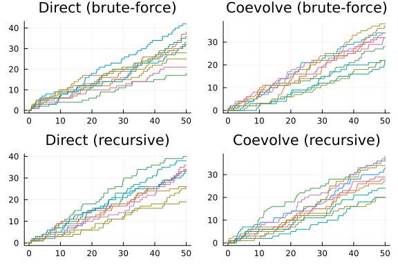
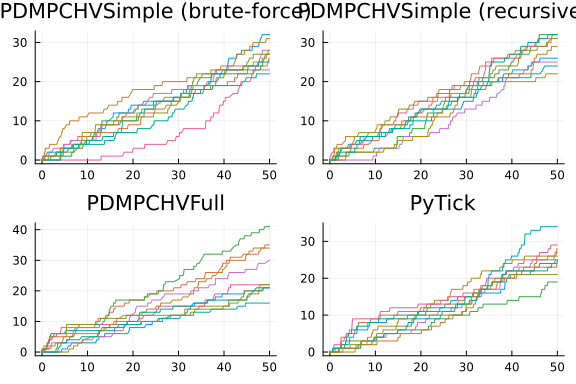
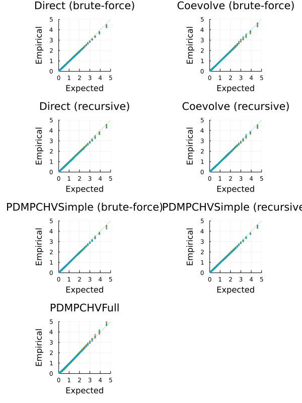

```julia
using JumpProcesses, Graphs, Statistics, BenchmarkTools, Plots
using OrdinaryDiffEq: Tsit5
fmt = :png
width_px, height_px = default(:size);
```


# Model and example solutions

Let a graph with ``V`` nodes, then the multivariate Hawkes process is characterized by ``V`` point processes such that the conditional intensity rate of node ``i`` connected to a set of nodes ``E_i`` in the graph is given by:
```math
  \lambda_i^\ast (t) = \lambda + \sum_{j \in E_i} \sum_{t_{n_j} < t} \alpha \exp \left[-\beta (t - t_{n_j}) \right]
```
This process is known as self-exciting, because the occurrence of an event ``j`` at ``t_{n_j}`` will increase the conditional intensity of all the processes connected to it by ``\alpha``. The excited intensity then decreases at a rate proportional to ``\beta``.

The conditional intensity of this process has a recursive formulation which can significantly speed the simulation. The recursive formulation for the univariate case is derived in Laub et al. [2]. We derive the compound case here. Let ``t_{N_i} = \max \{ t_{n_j} < t \mid j \in E_i \}`` and
```math
\begin{split}
  \phi_i^\ast (t)
    &= \sum_{j \in E_i} \sum_{t_{n_j} < t} \alpha \exp \left[-\beta (t - t_{N_i} + t_{N_i} - t_{n_j}) \right] \\
    &= \exp \left[ -\beta (t - t_{N_i}) \right] \sum_{j \in E_i} \sum_{t_{n_j} \leq t_{N_i}} \alpha \exp \left[-\beta (t_{N_i} - t_{n_j}) \right] \\
    &= \exp \left[ -\beta (t - t_{N_i}) \right] \left( \alpha + \phi^\ast (t_{N_i}) \right)
\end{split}
```
Then the conditional intensity can be re-written in terms of ``\phi_i^\ast (t_{N_i})``
```math
  \lambda_i^\ast (t) = \lambda + \phi_i^\ast (t) = \lambda + \exp \left[ -\beta (t - t_{N_i}) \right] \left( \alpha + \phi_i^\ast (t_{N_i}) \right)
```

In Julia, we define a factory for the conditional intensity ``\lambda_i`` which returns the brute-force or recursive versions of the intensity given node ``i`` and network ``g``.

```julia
function hawkes_rate(i::Int, g; use_recursion = false)

    @inline @inbounds function rate_recursion(u, p, t)
        λ, α, β, h, urate, ϕ = p
        urate[i] = λ + exp(-β*(t - h[i]))*ϕ[i]
        return urate[i]
    end

    @inline @inbounds function rate_brute(u, p, t)
        λ, α, β, h, urate = p
        x = zero(typeof(t))
        for j in g[i]
            for _t in reverse(h[j])
                ϕij = α * exp(-β * (t - _t))
                if ϕij ≈ 0
                    break
                end
                x += ϕij
            end
        end
        urate[i] = λ + x
        return urate[i]
    end

    if use_recursion
        return rate_recursion
    else
        return rate_brute
    end

end
```

```
hawkes_rate (generic function with 1 method)
```


Given the rate factory, we can create a jump factory which will create all the jumps in our model.

```julia
function hawkes_jump(i::Int, g; use_recursion = false)
    rate = hawkes_rate(i, g; use_recursion)
    urate = rate
    @inbounds rateinterval(u, p, t) = p[5][i] == p[1] ? typemax(t) : 2 / p[5][i]
    @inbounds lrate(u, p, t) = p[1]
    @inbounds function affect_recursion!(integrator)
        λ, α, β, h, _, ϕ  = integrator.p
        for j in g[i]
          ϕ[j] *= exp(-β*(integrator.t - h[j]))
          ϕ[j] += α
          h[j] = integrator.t
        end
        integrator.u[i] += 1
    end
    @inbounds function affect_brute!(integrator)
        push!(integrator.p[4][i], integrator.t)
        integrator.u[i] += 1
    end
    return VariableRateJump(
        rate,
        use_recursion ? affect_recursion! : affect_brute!;
        lrate,
        urate,
        rateinterval,
    )
end

function hawkes_jump(u, g; use_recursion = false)
    return [hawkes_jump(i, g; use_recursion) for i = 1:length(u)]
end
```

```
hawkes_jump (generic function with 2 methods)
```


We can then create a factory for Multivariate Hawkes `JumpProblem`s. We can define two types of `JumpProblem`s depending on the aggregator. The `Direct()` aggregator expects an `ODEProblem` since it cannot handle the `SSAStepper` with `VariableRateJump`s.


```julia
function f!(du, u, p, t)
    du .= 0
    nothing
end

function hawkes_problem(
    p,
    agg;
    u = [0.0],
    tspan = (0.0, 50.0),
    save_positions = (false, true),
    g = [[1]],
    use_recursion = false,
)
    oprob = ODEProblem(f!, u, tspan, p)
    jumps = hawkes_jump(u, g; use_recursion)
    jprob = JumpProblem(oprob, agg, jumps...; save_positions = save_positions)
    return jprob
end
```

```
hawkes_problem (generic function with 1 method)
```


The `Coevolve()` aggregator knows how to handle the `SSAStepper`, so it accepts a `DiscreteProblem`.

```julia
function hawkes_problem(
    p,
    agg::Coevolve;
    u = [0.0],
    tspan = (0.0, 50.0),
    save_positions = (false, true),
    g = [[1]],
    use_recursion = false,
)
    dprob = DiscreteProblem(u, tspan, p)
    jumps = hawkes_jump(u, g; use_recursion)
    jprob =
        JumpProblem(dprob, agg, jumps...; dep_graph = g, save_positions = save_positions)
    return jprob
end
```

```
hawkes_problem (generic function with 2 methods)
```


Lets solve the problems defined so far. We sample a random graph sampled from the Erdős-Rényi model. This model assumes that the probability of an edge between two nodes is independent of other edges, which we fix at ``0.2``. For illustration purposes, we fix ``V = 10``.

```julia
V = 10
G = erdos_renyi(V, 0.2, seed = 9103)
g = [neighbors(G, i) for i = 1:nv(G)]
```

```
10-element Vector{Vector{Int64}}:
 [4, 7]
 [8, 9]
 [4, 5]
 [1, 3]
 [3]
 []
 [1, 8, 9]
 [2, 7]
 [2, 7, 10]
 [9]
```


We fix the Hawkes parameters at ``\lambda = 0.5 , \alpha = 0.1 , \beta = 2.0`` which ensures the process does not explode.

```julia
tspan = (0.0, 50.0)
u = [0.0 for i = 1:nv(G)]
p = (0.5, 0.1, 2.0)
```

```
(0.5, 0.1, 2.0)
```


Now, we instantiate the problems, find their solutions and plot the results.


```julia
algorithms = Tuple{Any, Any, Bool, String}[
  (Direct(), Tsit5(), false, "Direct (brute-force)"),
  (Coevolve(), SSAStepper(), false, "Coevolve (brute-force)"),
  (Direct(), Tsit5(), true, "Direct (recursive)"),
  (Coevolve(), SSAStepper(), true, "Coevolve (recursive)"),
]

let fig = []
  for (i, (algo, stepper, use_recursion, label)) in enumerate(algorithms)
    @info label
    if use_recursion
        h = zeros(eltype(tspan), nv(G))
        urate = zeros(eltype(tspan), nv(G))
        ϕ = zeros(eltype(tspan), nv(G))
        _p = (p[1], p[2], p[3], h, ϕ, urate)
    else
        h = [eltype(tspan)[] for _ = 1:nv(G)]
        urate = zeros(eltype(tspan), nv(G))
        _p = (p[1], p[2], p[3], h, urate)
    end
    jump_prob = hawkes_problem(_p, algo; u, tspan, g, use_recursion)
    sol = solve(jump_prob, stepper)
    push!(fig, plot(sol.t, sol[1:V, :]', title=label, legend=false, format=fmt))
  end
  fig = plot(fig..., layout=(2,2), format=fmt, size=(width_px, 2*height_px/2))
end
```




## Alternative libraries

We benchmark `JumpProcesses.jl` against `PiecewiseDeterministicMarkovProcesses.jl` and Python `Tick` library.

In order to compare with the `PiecewiseDeterministicMarkovProcesses.jl`, we need to reformulate our jump problem as a Piecewise Deterministic Markov Process (PDMP). In this setting, we have two options.

The simple version only requires the conditional intensity. Like above, we define a brute-force and recursive approach. Following the library's specification we define the following functions.

```julia
function hawkes_rate_simple_recursion(rate, xc, xd, p, t, issum::Bool)
  λ, _, β, h, ϕ, g = p
  for i in 1:length(g)
    rate[i] = λ + exp(-β * (t - h[i])) * ϕ[i]
  end
  if issum
    return sum(rate)
  end
  return 0.0
end

function hawkes_rate_simple_brute(rate, xc, xd, p, t, issum::Bool)
  λ, α, β, h, g = p
  for i in 1:length(g)
    x = zero(typeof(t))
    for j in g[i]
        for _t in reverse(h[j])
            ϕij = α * exp(-β * (t - _t))
            if ϕij ≈ 0
                break
            end
            x += ϕij
        end
    end
    rate[i] = λ + x
  end
  if issum
    return sum(rate)
  end
  return 0.0
end

function hawkes_affect_simple_recursion!(xc, xd, p, t, i::Int64)
  _, α, β, h, ϕ, g = p
  for j in g[i]
      ϕ[j] *= exp(-β * (t - h[j]))
      ϕ[j] += α
      h[j] = t
  end
end

function hawkes_affect_simple_brute!(xc, xd, p, t, i::Int64)
  push!(p[4][i], t)
end
```

```
hawkes_affect_simple_brute! (generic function with 1 method)
```


Since this is a library for PDMP, we also need to define the ODE problem. In the simple version, we simply set it to zero.

```julia
function hawkes_drate_simple(dxc, xc, xd, p, t)
    dxc .= 0
end
```

```
hawkes_drate_simple (generic function with 1 method)
```


Next, we create a factory for the Multivariate Hawkes `PDMPCHVSimple` problem.

```julia
import LinearAlgebra: I
using PiecewiseDeterministicMarkovProcesses
const PDMP = PiecewiseDeterministicMarkovProcesses

struct PDMPCHVSimple end

function hawkes_problem(p,
                        agg::PDMPCHVSimple;
                        u = [0.0],
                        tspan = (0.0, 50.0),
                        save_positions = (false, true),
                        g = [[1]],
                        use_recursion = true)
    xd0 = Array{Int}(u)
    xc0 = copy(u)
    nu = one(eltype(xd0)) * I(length(xd0))
    if use_recursion
      jprob = PDMPProblem(hawkes_drate_simple, hawkes_rate_simple_recursion,
          hawkes_affect_simple_recursion!, nu, xc0, xd0, p, tspan)
    else
      jprob = PDMPProblem(hawkes_drate_simple, hawkes_rate_simple_brute,
          hawkes_affect_simple_brute!, nu, xc0, xd0, p, tspan)
    end
    return jprob
end

push!(algorithms, (PDMPCHVSimple(), CHV(Tsit5()), false, "PDMPCHVSimple (brute-force)"));
push!(algorithms, (PDMPCHVSimple(), CHV(Tsit5()), true, "PDMPCHVSimple (recursive)"));
```


The full version requires that we describe how the conditional intensity changes with time which we derive below:
```math
\begin{split}
  \frac{d \lambda_i^\ast (t)}{d t}
    &= -\beta \sum_{j \in E_i} \sum_{t_{n_j} < t} \alpha \exp \left[-\beta (t - t_{n_j}) \right] \\
    &= -\beta \left( \lambda_i^\ast (t) - \lambda \right)
\end{split}
```

```julia
function hawkes_drate_full(dxc, xc, xd, p, t)
    λ, α, β, _, _, g = p
    for i = 1:length(g)
        dxc[i] = -β * (xc[i] - λ)
    end
end
```

```
hawkes_drate_full (generic function with 1 method)
```


Next, we need to define the intensity rate and the jumps according to library's specification.

```julia
function hawkes_rate_full(rate, xc, xd, p, t, issum::Bool)
    λ, α, β, _, _, g = p
    if issum
        return sum(@view(xc[1:length(g)]))
    end
    rate[1:length(g)] .= @view xc[1:length(g)]
    return 0.0
end

function hawkes_affect_full!(xc, xd, p, t, i::Int64)
    λ, α, β, _, _, g = p
    for j in g[i]
        xc[i] += α
    end
end
```

```
hawkes_affect_full! (generic function with 1 method)
```


Finally, we create a factory for the Multivariate Hawkes `PDMPCHVFull` problem.

```julia
struct PDMPCHVFull end

function hawkes_problem(
    p,
    agg::PDMPCHVFull;
    u = [0.0],
    tspan = (0.0, 50.0),
    save_positions = (false, true),
    g = [[1]],
    use_recursion = true,
)
    xd0 = Array{Int}(u)
    xc0 = [p[1] for i = 1:length(u)]
    nu = one(eltype(xd0)) * I(length(xd0))
    jprob = PDMPProblem(hawkes_drate_full, hawkes_rate_full, hawkes_affect_full!, nu, xc0, xd0, p, tspan)
    return jprob
end

push!(algorithms, (PDMPCHVFull(), CHV(Tsit5()), true, "PDMPCHVFull"));
```


The Python `Tick` library can be accessed with the `PyCall.jl`. We install the required Python dependencies with `Conda.jl` and define a factory for the Multivariate Hawkes `PyTick` problem.

```julia
const BENCHMARK_PYTHON::Bool = tryparse(Bool, get(ENV, "SCIMLBENCHMARK_PYTHON", "true"))
const REBUILD_PYCALL::Bool = tryparse(Bool, get(ENV, "SCIMLBENCHMARK_REBUILD_PYCALL", "true"))

struct PyTick end

if BENCHMARK_PYTHON
  if REBUILD_PYCALL
    using Pkg, Conda

    # PyCall only works with Conda.ROOTENV
    # tick requires python=3.8
    Conda.add("python=3.8", Conda.ROOTENV)
    Conda.add("numpy", Conda.ROOTENV)
    Conda.pip_interop(true, Conda.ROOTENV)
    Conda.pip("install", "tick", Conda.ROOTENV)

    # rebuild PyCall to ensure it links to the python provided by Conda.jl
    ENV["PYTHON"] = ""
    Pkg.build("PyCall")
  end

  ENV["PYTHON"] = ""
  using PyCall
  @info "PyCall" PyCall.libpython PyCall.pyversion PyCall.conda

  function hawkes_problem(
      p,
      agg::PyTick;
      u = [0.0],
      tspan = (0.0, 50.0),
      save_positions = (false, true),
      g = [[1]],
      use_recursion = true,
  )
      λ, α, β = p
      SimuHawkesSumExpKernels = pyimport("tick.hawkes")[:SimuHawkesSumExpKernels]
      jprob = SimuHawkesSumExpKernels(
          baseline = fill(λ, length(u)),
          adjacency = [i in j ? α / β : 0.0 for j in g, i = 1:length(u), u = 1:1],
          decays = [β],
          end_time = tspan[2],
          verbose = false,
          force_simulation = true,
      )
      return jprob
  end

  push!(algorithms, (PyTick(), nothing, true, "PyTick"));
end
```

```
Collecting package metadata (current_repodata.json): ...working... done
Solving environment: ...working... failed with initial frozen solve. Retryi
ng with flexible solve.
Solving environment: ...working... failed with repodata from current_repoda
ta.json, will retry with next repodata source.
Collecting package metadata (repodata.json): ...working... done
Solving environment: ...working... done

## Package Plan ##

  environment location: /cache/julia-buildkite-plugin/depots/5b300254-1738-
4989-ae0a-f4d2d937f953/conda/3/x86_64

  added / updated specs:
    - python=3.8


The following packages will be downloaded:

    package                    |            build
    ---------------------------|-----------------
    brotli-python-1.1.0        |   py38h17151c0_1         343 KB  conda-for
ge
    cffi-1.16.0                |   py38h6d47a40_0         234 KB  conda-for
ge
    conda-23.3.1               |   py38h578d9bd_0         932 KB  conda-for
ge
    cryptography-41.0.7        |   py38he241bfc_1         1.9 MB  conda-for
ge
    jsonpointer-2.4            |   py38h578d9bd_3          16 KB  conda-for
ge
    libmambapy-1.4.2           |   py38h7fa060d_0         261 KB  conda-for
ge
    mamba-1.4.2                |   py38haad2881_0          49 KB  conda-for
ge
    numpy-1.24.4               |   py38h59b608b_0         6.4 MB  conda-for
ge
    pycosat-0.6.6              |   py38h01eb140_0          83 KB  conda-for
ge
    python-3.8.18              |hd12c33a_0_cpython        23.3 MB  conda-fo
rge
    python_abi-3.8             |           4_cp38           6 KB  conda-for
ge
    ruamel-1.0                 |   py38h578d9bd_8           7 KB  conda-for
ge
    ruamel.yaml-0.16.0         |   py38h516909a_1         172 KB  conda-for
ge
    zstandard-0.22.0           |   py38ha98ab4e_0         393 KB  conda-for
ge
    ------------------------------------------------------------
                                           Total:        34.0 MB

The following NEW packages will be INSTALLED:

  ruamel             conda-forge/linux-64::ruamel-1.0-py38h578d9bd_8 

The following packages will be REMOVED:

  ruamel.yaml.clib-0.2.7-py310h2372a71_2

The following packages will be DOWNGRADED:

  brotli-python                       1.1.0-py310hc6cd4ac_1 --> 1.1.0-py38h
17151c0_1 
  cffi                               1.16.0-py310h2fee648_0 --> 1.16.0-py38
h6d47a40_0 
  conda                              23.3.1-py310hff52083_0 --> 23.3.1-py38
h578d9bd_0 
  cryptography                       41.0.7-py310hb8475ec_1 --> 41.0.7-py38
he241bfc_1 
  jsonpointer                           2.4-py310hff52083_3 --> 2.4-py38h57
8d9bd_3 
  libmambapy                          1.4.2-py310h1428755_0 --> 1.4.2-py38h
7fa060d_0 
  mamba                               1.4.2-py310h51d5547_0 --> 1.4.2-py38h
aad2881_0 
  numpy                              1.26.2-py310hb13e2d6_0 --> 1.24.4-py38
h59b608b_0 
  pycosat                             0.6.6-py310h2372a71_0 --> 0.6.6-py38h
01eb140_0 
  python                         3.10.12-hd12c33a_0_cpython --> 3.8.18-hd12
c33a_0_cpython 
  python_abi                                   3.10-4_cp310 --> 3.8-4_cp38 
  ruamel.yaml                       0.17.40-py310h2372a71_0 --> 0.16.0-py38
h516909a_1 
  zstandard                          0.22.0-py310h1275a96_0 --> 0.22.0-py38
ha98ab4e_0 


Preparing transaction: ...working... done
Verifying transaction: ...working... done
Executing transaction: ...working... done
Collecting package metadata (current_repodata.json): ...working... done
Solving environment: ...working... done

# All requested packages already installed.

Collecting tick
  Downloading tick-0.7.0.1-cp38-cp38-manylinux2014_x86_64.whl (10.8 MB)
     ━━━━━━━━━━━━━━━━━━━━━━━━━━━━━━━━━━━━━━━━ 10.8/10.8 MB 12.3 MB/s eta 0:
00:00
Requirement already satisfied: numpy in /cache/julia-buildkite-plugin/depot
s/5b300254-1738-4989-ae0a-f4d2d937f953/conda/3/x86_64/lib/python3.8/site-pa
ckages (from tick) (1.24.4)
Collecting scipy (from tick)
  Downloading scipy-1.10.1-cp38-cp38-manylinux_2_17_x86_64.manylinux2014_x8
6_64.whl (34.5 MB)
     ━━━━━━━━━━━━━━━━━━━━━━━━━━━━━━━━━━━━━━━━ 34.5/34.5 MB 79.3 MB/s eta 0:
00:00
Collecting numpydoc (from tick)
  Obtaining dependency information for numpydoc from https://files.pythonho
sted.org/packages/9c/94/09c437fd4a5fb5adf0468c0865c781dbc11d399544b55f1163d
5d4414afb/numpydoc-1.6.0-py3-none-any.whl.metadata
  Downloading numpydoc-1.6.0-py3-none-any.whl.metadata (4.2 kB)
Collecting matplotlib (from tick)
  Obtaining dependency information for matplotlib from https://files.python
hosted.org/packages/3c/25/c63fb77ceece3fbd85142381f97c7aeae6aeaf9a2993a2032
2fc9ae1ca7b/matplotlib-3.7.4-cp38-cp38-manylinux_2_12_x86_64.manylinux2010_
x86_64.whl.metadata
  Downloading matplotlib-3.7.4-cp38-cp38-manylinux_2_12_x86_64.manylinux201
0_x86_64.whl.metadata (5.7 kB)
Collecting sphinx (from tick)
  Obtaining dependency information for sphinx from https://files.pythonhost
ed.org/packages/48/17/325cf6a257d84751a48ae90752b3d8fe0be8f9535b6253add61c4
9d0d9bc/sphinx-7.1.2-py3-none-any.whl.metadata
  Downloading sphinx-7.1.2-py3-none-any.whl.metadata (5.8 kB)
Collecting pandas (from tick)
  Obtaining dependency information for pandas from https://files.pythonhost
ed.org/packages/f8/7f/5b047effafbdd34e52c9e2d7e44f729a0655efafb22198c45cf69
2cdc157/pandas-2.0.3-cp38-cp38-manylinux_2_17_x86_64.manylinux2014_x86_64.w
hl.metadata
  Downloading pandas-2.0.3-cp38-cp38-manylinux_2_17_x86_64.manylinux2014_x8
6_64.whl.metadata (18 kB)
Collecting dill (from tick)
  Obtaining dependency information for dill from https://files.pythonhosted
.org/packages/f5/3a/74a29b11cf2cdfcd6ba89c0cecd70b37cd1ba7b77978ce611eb7a14
6a832/dill-0.3.7-py3-none-any.whl.metadata
  Downloading dill-0.3.7-py3-none-any.whl.metadata (9.9 kB)
Collecting scikit-learn (from tick)
  Obtaining dependency information for scikit-learn from https://files.pyth
onhosted.org/packages/3f/48/6fdd99f5717045f9984616b5c2ec683d6286d30c0ac2345
63062132b83ab/scikit_learn-1.3.2-cp38-cp38-manylinux_2_17_x86_64.manylinux2
014_x86_64.whl.metadata
  Downloading scikit_learn-1.3.2-cp38-cp38-manylinux_2_17_x86_64.manylinux2
014_x86_64.whl.metadata (11 kB)
Collecting contourpy>=1.0.1 (from matplotlib->tick)
  Obtaining dependency information for contourpy>=1.0.1 from https://files.
pythonhosted.org/packages/8e/71/7f20855592cc929bc206810432b991ec4c702dc26b0
567b132e52c85536f/contourpy-1.1.1-cp38-cp38-manylinux_2_17_x86_64.manylinux
2014_x86_64.whl.metadata
  Downloading contourpy-1.1.1-cp38-cp38-manylinux_2_17_x86_64.manylinux2014
_x86_64.whl.metadata (5.9 kB)
Collecting cycler>=0.10 (from matplotlib->tick)
  Obtaining dependency information for cycler>=0.10 from https://files.pyth
onhosted.org/packages/e7/05/c19819d5e3d95294a6f5947fb9b9629efb316b96de511b4
18c53d245aae6/cycler-0.12.1-py3-none-any.whl.metadata
  Downloading cycler-0.12.1-py3-none-any.whl.metadata (3.8 kB)
Collecting fonttools>=4.22.0 (from matplotlib->tick)
  Obtaining dependency information for fonttools>=4.22.0 from https://files
.pythonhosted.org/packages/68/d9/8a3d067a681d37c3f83f8cce96ecdb414bf4b1b627
b5cf0a39ec80dff6c5/fonttools-4.46.0-cp38-cp38-manylinux_2_17_x86_64.manylin
ux2014_x86_64.whl.metadata
  Downloading fonttools-4.46.0-cp38-cp38-manylinux_2_17_x86_64.manylinux201
4_x86_64.whl.metadata (156 kB)
     ━━━━━━━━━━━━━━━━━━━━━━━━━━━━━━━━━━━━━━ 156.2/156.2 kB 79.4 MB/s eta 0:
00:00
Collecting kiwisolver>=1.0.1 (from matplotlib->tick)
  Obtaining dependency information for kiwisolver>=1.0.1 from https://files
.pythonhosted.org/packages/d2/55/7021ffcc8cb26a520bb051aa0a3d08daf200cde945
e5863d5768161e2d3d/kiwisolver-1.4.5-cp38-cp38-manylinux_2_5_x86_64.manylinu
x1_x86_64.whl.metadata
  Downloading kiwisolver-1.4.5-cp38-cp38-manylinux_2_5_x86_64.manylinux1_x8
6_64.whl.metadata (6.4 kB)
Requirement already satisfied: packaging>=20.0 in /cache/julia-buildkite-pl
ugin/depots/5b300254-1738-4989-ae0a-f4d2d937f953/conda/3/x86_64/lib/python3
.8/site-packages (from matplotlib->tick) (23.2)
Collecting pillow>=6.2.0 (from matplotlib->tick)
  Obtaining dependency information for pillow>=6.2.0 from https://files.pyt
honhosted.org/packages/1e/74/638f982ab43fb3b19c8a151b1a0065cafefe436f8590c1
c57d5fdf2475f1/Pillow-10.1.0-cp38-cp38-manylinux_2_28_x86_64.whl.metadata
  Downloading Pillow-10.1.0-cp38-cp38-manylinux_2_28_x86_64.whl.metadata (9
.5 kB)
Collecting pyparsing>=2.3.1 (from matplotlib->tick)
  Obtaining dependency information for pyparsing>=2.3.1 from https://files.
pythonhosted.org/packages/39/92/8486ede85fcc088f1b3dba4ce92dd29d126fd96b000
8ea213167940a2475/pyparsing-3.1.1-py3-none-any.whl.metadata
  Downloading pyparsing-3.1.1-py3-none-any.whl.metadata (5.1 kB)
Collecting python-dateutil>=2.7 (from matplotlib->tick)
  Downloading python_dateutil-2.8.2-py2.py3-none-any.whl (247 kB)
     ━━━━━━━━━━━━━━━━━━━━━━━━━━━━━━━━━━━━━━ 247.7/247.7 kB 96.8 MB/s eta 0:
00:00
Collecting importlib-resources>=3.2.0 (from matplotlib->tick)
  Obtaining dependency information for importlib-resources>=3.2.0 from http
s://files.pythonhosted.org/packages/93/e8/facde510585869b5ec694e8e0363ffe4e
ba067cb357a8398a55f6a1f8023/importlib_resources-6.1.1-py3-none-any.whl.meta
data
  Downloading importlib_resources-6.1.1-py3-none-any.whl.metadata (4.1 kB)
Collecting Jinja2>=2.10 (from numpydoc->tick)
  Downloading Jinja2-3.1.2-py3-none-any.whl (133 kB)
     ━━━━━━━━━━━━━━━━━━━━━━━━━━━━━━━━━━━━━━ 133.1/133.1 kB 74.1 MB/s eta 0:
00:00
Collecting tabulate>=0.8.10 (from numpydoc->tick)
  Downloading tabulate-0.9.0-py3-none-any.whl (35 kB)
Collecting tomli>=1.1.0 (from numpydoc->tick)
  Downloading tomli-2.0.1-py3-none-any.whl (12 kB)
Collecting sphinxcontrib-applehelp (from sphinx->tick)
  Downloading sphinxcontrib_applehelp-1.0.4-py3-none-any.whl (120 kB)
     ━━━━━━━━━━━━━━━━━━━━━━━━━━━━━━━━━━━━━━ 120.6/120.6 kB 70.2 MB/s eta 0:
00:00
Collecting sphinxcontrib-devhelp (from sphinx->tick)
  Downloading sphinxcontrib_devhelp-1.0.2-py2.py3-none-any.whl (84 kB)
     ━━━━━━━━━━━━━━━━━━━━━━━━━━━━━━━━━━━━━━━━ 84.7/84.7 kB 54.3 MB/s eta 0:
00:00
Collecting sphinxcontrib-jsmath (from sphinx->tick)
  Downloading sphinxcontrib_jsmath-1.0.1-py2.py3-none-any.whl (5.1 kB)
Collecting sphinxcontrib-htmlhelp>=2.0.0 (from sphinx->tick)
  Downloading sphinxcontrib_htmlhelp-2.0.1-py3-none-any.whl (99 kB)
     ━━━━━━━━━━━━━━━━━━━━━━━━━━━━━━━━━━━━━━━━ 99.8/99.8 kB 61.3 MB/s eta 0:
00:00
Collecting sphinxcontrib-serializinghtml>=1.1.5 (from sphinx->tick)
  Downloading sphinxcontrib_serializinghtml-1.1.5-py2.py3-none-any.whl (94 
kB)
     ━━━━━━━━━━━━━━━━━━━━━━━━━━━━━━━━━━━━━━━━ 94.0/94.0 kB 60.2 MB/s eta 0:
00:00
Collecting sphinxcontrib-qthelp (from sphinx->tick)
  Downloading sphinxcontrib_qthelp-1.0.3-py2.py3-none-any.whl (90 kB)
     ━━━━━━━━━━━━━━━━━━━━━━━━━━━━━━━━━━━━━━━━ 90.6/90.6 kB 55.3 MB/s eta 0:
00:00
Collecting Pygments>=2.13 (from sphinx->tick)
  Obtaining dependency information for Pygments>=2.13 from https://files.py
thonhosted.org/packages/97/9c/372fef8377a6e340b1704768d20daaded98bf13282b53
27beb2e2fe2c7ef/pygments-2.17.2-py3-none-any.whl.metadata
  Downloading pygments-2.17.2-py3-none-any.whl.metadata (2.6 kB)
Collecting docutils<0.21,>=0.18.1 (from sphinx->tick)
  Obtaining dependency information for docutils<0.21,>=0.18.1 from https://
files.pythonhosted.org/packages/26/87/f238c0670b94533ac0353a4e2a1a771a0cc73
277b88bff23d3ae35a256c1/docutils-0.20.1-py3-none-any.whl.metadata
  Downloading docutils-0.20.1-py3-none-any.whl.metadata (2.8 kB)
Collecting snowballstemmer>=2.0 (from sphinx->tick)
  Downloading snowballstemmer-2.2.0-py2.py3-none-any.whl (93 kB)
     ━━━━━━━━━━━━━━━━━━━━━━━━━━━━━━━━━━━━━━━━ 93.0/93.0 kB 57.9 MB/s eta 0:
00:00
Collecting babel>=2.9 (from sphinx->tick)
  Obtaining dependency information for babel>=2.9 from https://files.python
hosted.org/packages/86/14/5dc2eb02b7cc87b2f95930310a2cc5229198414919a116b56
4832c747bc1/Babel-2.13.1-py3-none-any.whl.metadata
  Downloading Babel-2.13.1-py3-none-any.whl.metadata (1.6 kB)
Collecting alabaster<0.8,>=0.7 (from sphinx->tick)
  Downloading alabaster-0.7.13-py3-none-any.whl (13 kB)
Collecting imagesize>=1.3 (from sphinx->tick)
  Downloading imagesize-1.4.1-py2.py3-none-any.whl (8.8 kB)
Requirement already satisfied: requests>=2.25.0 in /cache/julia-buildkite-p
lugin/depots/5b300254-1738-4989-ae0a-f4d2d937f953/conda/3/x86_64/lib/python
3.8/site-packages (from sphinx->tick) (2.31.0)
Collecting importlib-metadata>=4.8 (from sphinx->tick)
  Obtaining dependency information for importlib-metadata>=4.8 from https:/
/files.pythonhosted.org/packages/73/26/9777cfe0cdc8181a32eaf542f4a2a435e5ab
a5dd38f41cfc0a532dc51027/importlib_metadata-7.0.0-py3-none-any.whl.metadata
  Downloading importlib_metadata-7.0.0-py3-none-any.whl.metadata (4.9 kB)
Collecting pytz>=2020.1 (from pandas->tick)
  Obtaining dependency information for pytz>=2020.1 from https://files.pyth
onhosted.org/packages/32/4d/aaf7eff5deb402fd9a24a1449a8119f00d74ae9c2efa79f
8ef9994261fc2/pytz-2023.3.post1-py2.py3-none-any.whl.metadata
  Downloading pytz-2023.3.post1-py2.py3-none-any.whl.metadata (22 kB)
Collecting tzdata>=2022.1 (from pandas->tick)
  Downloading tzdata-2023.3-py2.py3-none-any.whl (341 kB)
     ━━━━━━━━━━━━━━━━━━━━━━━━━━━━━━━━━━━━━ 341.8/341.8 kB 120.8 MB/s eta 0:
00:00
Collecting joblib>=1.1.1 (from scikit-learn->tick)
  Obtaining dependency information for joblib>=1.1.1 from https://files.pyt
honhosted.org/packages/10/40/d551139c85db202f1f384ba8bcf96aca2f329440a844f9
24c8a0040b6d02/joblib-1.3.2-py3-none-any.whl.metadata
  Downloading joblib-1.3.2-py3-none-any.whl.metadata (5.4 kB)
Collecting threadpoolctl>=2.0.0 (from scikit-learn->tick)
  Obtaining dependency information for threadpoolctl>=2.0.0 from https://fi
les.pythonhosted.org/packages/81/12/fd4dea011af9d69e1cad05c75f3f7202cdcbeac
9b712eea58ca779a72865/threadpoolctl-3.2.0-py3-none-any.whl.metadata
  Downloading threadpoolctl-3.2.0-py3-none-any.whl.metadata (10.0 kB)
Collecting zipp>=0.5 (from importlib-metadata>=4.8->sphinx->tick)
  Obtaining dependency information for zipp>=0.5 from https://files.pythonh
osted.org/packages/d9/66/48866fc6b158c81cc2bfecc04c480f105c6040e8b077bc54c6
34b4a67926/zipp-3.17.0-py3-none-any.whl.metadata
  Downloading zipp-3.17.0-py3-none-any.whl.metadata (3.7 kB)
Collecting MarkupSafe>=2.0 (from Jinja2>=2.10->numpydoc->tick)
  Obtaining dependency information for MarkupSafe>=2.0 from https://files.p
ythonhosted.org/packages/de/e2/32c14301bb023986dff527a49325b6259cab4ebb4633
f69de54af312fc45/MarkupSafe-2.1.3-cp38-cp38-manylinux_2_17_x86_64.manylinux
2014_x86_64.whl.metadata
  Downloading MarkupSafe-2.1.3-cp38-cp38-manylinux_2_17_x86_64.manylinux201
4_x86_64.whl.metadata (3.0 kB)
Collecting six>=1.5 (from python-dateutil>=2.7->matplotlib->tick)
  Downloading six-1.16.0-py2.py3-none-any.whl (11 kB)
Requirement already satisfied: charset-normalizer<4,>=2 in /cache/julia-bui
ldkite-plugin/depots/5b300254-1738-4989-ae0a-f4d2d937f953/conda/3/x86_64/li
b/python3.8/site-packages (from requests>=2.25.0->sphinx->tick) (3.3.2)
Requirement already satisfied: idna<4,>=2.5 in /cache/julia-buildkite-plugi
n/depots/5b300254-1738-4989-ae0a-f4d2d937f953/conda/3/x86_64/lib/python3.8/
site-packages (from requests>=2.25.0->sphinx->tick) (3.6)
Requirement already satisfied: urllib3<3,>=1.21.1 in /cache/julia-buildkite
-plugin/depots/5b300254-1738-4989-ae0a-f4d2d937f953/conda/3/x86_64/lib/pyth
on3.8/site-packages (from requests>=2.25.0->sphinx->tick) (2.1.0)
Requirement already satisfied: certifi>=2017.4.17 in /cache/julia-buildkite
-plugin/depots/5b300254-1738-4989-ae0a-f4d2d937f953/conda/3/x86_64/lib/pyth
on3.8/site-packages (from requests>=2.25.0->sphinx->tick) (2023.11.17)
Downloading dill-0.3.7-py3-none-any.whl (115 kB)
   ━━━━━━━━━━━━━━━━━━━━━━━━━━━━━━━━━━━━━━━━ 115.3/115.3 kB 63.8 MB/s eta 0:
00:00
Downloading matplotlib-3.7.4-cp38-cp38-manylinux_2_12_x86_64.manylinux2010_
x86_64.whl (9.2 MB)
   ━━━━━━━━━━━━━━━━━━━━━━━━━━━━━━━━━━━━━━━━ 9.2/9.2 MB 145.3 MB/s eta 0:00:
00
Downloading numpydoc-1.6.0-py3-none-any.whl (61 kB)
   ━━━━━━━━━━━━━━━━━━━━━━━━━━━━━━━━━━━━━━━━ 61.7/61.7 kB 40.2 MB/s eta 0:00
:00
Downloading sphinx-7.1.2-py3-none-any.whl (3.2 MB)
   ━━━━━━━━━━━━━━━━━━━━━━━━━━━━━━━━━━━━━━━━ 3.2/3.2 MB 64.3 MB/s eta 0:00:0
0
Downloading pandas-2.0.3-cp38-cp38-manylinux_2_17_x86_64.manylinux2014_x86_
64.whl (12.4 MB)
   ━━━━━━━━━━━━━━━━━━━━━━━━━━━━━━━━━━━━━━━━ 12.4/12.4 MB 105.2 MB/s eta 0:0
0:00
Downloading scikit_learn-1.3.2-cp38-cp38-manylinux_2_17_x86_64.manylinux201
4_x86_64.whl (11.1 MB)
   ━━━━━━━━━━━━━━━━━━━━━━━━━━━━━━━━━━━━━━━━ 11.1/11.1 MB 141.2 MB/s eta 0:0
0:00
Downloading Babel-2.13.1-py3-none-any.whl (10.1 MB)
   ━━━━━━━━━━━━━━━━━━━━━━━━━━━━━━━━━━━━━━━━ 10.1/10.1 MB 156.8 MB/s eta 0:0
0:00
Downloading contourpy-1.1.1-cp38-cp38-manylinux_2_17_x86_64.manylinux2014_x
86_64.whl (301 kB)
   ━━━━━━━━━━━━━━━━━━━━━━━━━━━━━━━━━━━━━━━ 301.1/301.1 kB 112.3 MB/s eta 0:
00:00
Downloading cycler-0.12.1-py3-none-any.whl (8.3 kB)
Downloading docutils-0.20.1-py3-none-any.whl (572 kB)
   ━━━━━━━━━━━━━━━━━━━━━━━━━━━━━━━━━━━━━━━ 572.7/572.7 kB 143.8 MB/s eta 0:
00:00
Downloading fonttools-4.46.0-cp38-cp38-manylinux_2_17_x86_64.manylinux2014_
x86_64.whl (4.7 MB)
   ━━━━━━━━━━━━━━━━━━━━━━━━━━━━━━━━━━━━━━━━ 4.7/4.7 MB 158.4 MB/s eta 0:00:
00
Downloading importlib_metadata-7.0.0-py3-none-any.whl (23 kB)
Downloading importlib_resources-6.1.1-py3-none-any.whl (33 kB)
Downloading joblib-1.3.2-py3-none-any.whl (302 kB)
   ━━━━━━━━━━━━━━━━━━━━━━━━━━━━━━━━━━━━━━━ 302.2/302.2 kB 115.4 MB/s eta 0:
00:00
Downloading kiwisolver-1.4.5-cp38-cp38-manylinux_2_5_x86_64.manylinux1_x86_
64.whl (1.2 MB)
   ━━━━━━━━━━━━━━━━━━━━━━━━━━━━━━━━━━━━━━━━ 1.2/1.2 MB 146.0 MB/s eta 0:00:
00
Downloading Pillow-10.1.0-cp38-cp38-manylinux_2_28_x86_64.whl (3.6 MB)
   ━━━━━━━━━━━━━━━━━━━━━━━━━━━━━━━━━━━━━━━━ 3.6/3.6 MB 154.9 MB/s eta 0:00:
00
Downloading pygments-2.17.2-py3-none-any.whl (1.2 MB)
   ━━━━━━━━━━━━━━━━━━━━━━━━━━━━━━━━━━━━━━━━ 1.2/1.2 MB 155.4 MB/s eta 0:00:
00
Downloading pyparsing-3.1.1-py3-none-any.whl (103 kB)
   ━━━━━━━━━━━━━━━━━━━━━━━━━━━━━━━━━━━━━━━━ 103.1/103.1 kB 65.4 MB/s eta 0:
00:00
Downloading pytz-2023.3.post1-py2.py3-none-any.whl (502 kB)
   ━━━━━━━━━━━━━━━━━━━━━━━━━━━━━━━━━━━━━━━ 502.5/502.5 kB 139.2 MB/s eta 0:
00:00
Downloading threadpoolctl-3.2.0-py3-none-any.whl (15 kB)
Downloading MarkupSafe-2.1.3-cp38-cp38-manylinux_2_17_x86_64.manylinux2014_
x86_64.whl (25 kB)
Downloading zipp-3.17.0-py3-none-any.whl (7.4 kB)
Installing collected packages: snowballstemmer, pytz, zipp, tzdata, tomli, 
threadpoolctl, tabulate, sphinxcontrib-serializinghtml, sphinxcontrib-qthel
p, sphinxcontrib-jsmath, sphinxcontrib-htmlhelp, sphinxcontrib-devhelp, sph
inxcontrib-applehelp, six, scipy, pyparsing, Pygments, pillow, MarkupSafe, 
kiwisolver, joblib, imagesize, fonttools, docutils, dill, cycler, contourpy
, babel, alabaster, scikit-learn, python-dateutil, Jinja2, importlib-resour
ces, importlib-metadata, sphinx, pandas, matplotlib, numpydoc, tick
Successfully installed Jinja2-3.1.2 MarkupSafe-2.1.3 Pygments-2.17.2 alabas
ter-0.7.13 babel-2.13.1 contourpy-1.1.1 cycler-0.12.1 dill-0.3.7 docutils-0
.20.1 fonttools-4.46.0 imagesize-1.4.1 importlib-metadata-7.0.0 importlib-r
esources-6.1.1 joblib-1.3.2 kiwisolver-1.4.5 matplotlib-3.7.4 numpydoc-1.6.
0 pandas-2.0.3 pillow-10.1.0 pyparsing-3.1.1 python-dateutil-2.8.2 pytz-202
3.3.post1 scikit-learn-1.3.2 scipy-1.10.1 six-1.16.0 snowballstemmer-2.2.0 
sphinx-7.1.2 sphinxcontrib-applehelp-1.0.4 sphinxcontrib-devhelp-1.0.2 sphi
nxcontrib-htmlhelp-2.0.1 sphinxcontrib-jsmath-1.0.1 sphinxcontrib-qthelp-1.
0.3 sphinxcontrib-serializinghtml-1.1.5 tabulate-0.9.0 threadpoolctl-3.2.0 
tick-0.7.0.1 tomli-2.0.1 tzdata-2023.3 zipp-3.17.0
8-element Vector{Tuple{Any, Any, Bool, String}}:
 (JumpProcesses.Direct(), Tsit5(; stage_limiter! = trivial_limiter!, step_l
imiter! = trivial_limiter!, thread = static(false),), 0, "Direct (brute-for
ce)")
 (JumpProcesses.Coevolve(), JumpProcesses.SSAStepper(), 0, "Coevolve (brute
-force)")
 (JumpProcesses.Direct(), Tsit5(; stage_limiter! = trivial_limiter!, step_l
imiter! = trivial_limiter!, thread = static(false),), 1, "Direct (recursive
)")
 (JumpProcesses.Coevolve(), JumpProcesses.SSAStepper(), 1, "Coevolve (recur
sive)")
 (Main.var"##WeaveSandBox#349".PDMPCHVSimple(), PiecewiseDeterministicMarko
vProcesses.CHV{OrdinaryDiffEq.Tsit5{typeof(OrdinaryDiffEq.trivial_limiter!)
, typeof(OrdinaryDiffEq.trivial_limiter!), Static.False}}(Tsit5(; stage_lim
iter! = trivial_limiter!, step_limiter! = trivial_limiter!, thread = static
(false),)), 0, "PDMPCHVSimple (brute-force)")
 (Main.var"##WeaveSandBox#349".PDMPCHVSimple(), PiecewiseDeterministicMarko
vProcesses.CHV{OrdinaryDiffEq.Tsit5{typeof(OrdinaryDiffEq.trivial_limiter!)
, typeof(OrdinaryDiffEq.trivial_limiter!), Static.False}}(Tsit5(; stage_lim
iter! = trivial_limiter!, step_limiter! = trivial_limiter!, thread = static
(false),)), 1, "PDMPCHVSimple (recursive)")
 (Main.var"##WeaveSandBox#349".PDMPCHVFull(), PiecewiseDeterministicMarkovP
rocesses.CHV{OrdinaryDiffEq.Tsit5{typeof(OrdinaryDiffEq.trivial_limiter!), 
typeof(OrdinaryDiffEq.trivial_limiter!), Static.False}}(Tsit5(; stage_limit
er! = trivial_limiter!, step_limiter! = trivial_limiter!, thread = static(f
alse),)), 1, "PDMPCHVFull")
 (Main.var"##WeaveSandBox#349".PyTick(), nothing, 1, "PyTick")
```


Now, we instantiate the problems, find their solutions and plot the results.

```julia
let fig = []
  for (i, (algo, stepper, use_recursion, label)) in enumerate(algorithms[5:end])
    @info label
    if algo isa PyTick
        _p = (p[1], p[2], p[3])
        jump_prob = hawkes_problem(_p, algo; u, tspan, g, use_recursion)
        jump_prob.reset()
        jump_prob.simulate()
        t = tspan[1]:0.1:tspan[2]
        N = [[sum(jumps .< _t) for _t in t] for jumps in jump_prob.timestamps]
        push!(fig, plot(t, N, title=label, legend=false, format=fmt))
    elseif algo isa PDMPCHVSimple
        if use_recursion
          h = zeros(eltype(tspan), nv(G))
          ϕ = zeros(eltype(tspan), nv(G))
          _p = (p[1], p[2], p[3], h, ϕ, g)
        else
          h = [eltype(tspan)[] for _ in 1:nv(G)]
          _p = (p[1], p[2], p[3], h, g)
        end
        jump_prob = hawkes_problem(_p, algo; u, tspan, g, use_recursion)
        sol = solve(jump_prob, stepper)
        push!(fig, plot(sol.time, sol.xd[1:V, :]', title=label, legend=false, format=fmt))
    elseif algo isa PDMPCHVFull
        _p = (p[1], p[2], p[3], nothing, nothing, g)
        jump_prob = hawkes_problem(_p, algo; u, tspan, g, use_recursion)
        sol = solve(jump_prob, stepper)
        push!(fig, plot(sol.time, sol.xd[1:V, :]', title=label, legend=false, format=fmt))
    end
  end
  fig = plot(fig..., layout=(2,2), format=fmt, size=(width_px, 2*height_px/2))
end
```




# Correctness: QQ-Plots

We check that the algorithms produce correct simulation by inspecting their QQ-plots. Point process theory says that transforming the simulated points using the compensator should produce points whose inter-arrival duration is distributed according to the exponential distribution (see Section 7.4 [1]).

The compensator of any point process is the integral of the conditional intensity ``\Lambda_i^\ast(t) = \int_0^t \lambda_i^\ast(u) du``. The compensator for the Multivariate Hawkes process is defined below.
```math
    \Lambda_i^\ast(t) = \lambda t + \frac{\alpha}{\beta} \sum_{j \in E_i} \sum_{t_{n_j} < t} ( 1 - \exp \left[-\beta (t - t_{n_j}) \right])
```

```julia
function hawkes_Λ(i::Int, g, p)
    @inline @inbounds function Λ(t, h)
        λ, α, β = p
        x = λ * t
        for j in g[i]
            for _t in h[j]
                if _t >= t
                    break
                end
                x += (α / β) * (1 - exp(-β * (t - _t)))
            end
        end
        return x
    end
    return Λ
end

function hawkes_Λ(g, p)
    return [hawkes_Λ(i, g, p) for i = 1:length(g)]
end

Λ = hawkes_Λ(g, p)
```

```
10-element Vector{Main.var"##WeaveSandBox#349".var"#Λ#33"{Int64, Vector{Vec
tor{Int64}}, Tuple{Float64, Float64, Float64}}}:
 (::Main.var"##WeaveSandBox#349".var"#Λ#33"{Int64, Vector{Vector{Int64}}, T
uple{Float64, Float64, Float64}}) (generic function with 1 method)
 (::Main.var"##WeaveSandBox#349".var"#Λ#33"{Int64, Vector{Vector{Int64}}, T
uple{Float64, Float64, Float64}}) (generic function with 1 method)
 (::Main.var"##WeaveSandBox#349".var"#Λ#33"{Int64, Vector{Vector{Int64}}, T
uple{Float64, Float64, Float64}}) (generic function with 1 method)
 (::Main.var"##WeaveSandBox#349".var"#Λ#33"{Int64, Vector{Vector{Int64}}, T
uple{Float64, Float64, Float64}}) (generic function with 1 method)
 (::Main.var"##WeaveSandBox#349".var"#Λ#33"{Int64, Vector{Vector{Int64}}, T
uple{Float64, Float64, Float64}}) (generic function with 1 method)
 (::Main.var"##WeaveSandBox#349".var"#Λ#33"{Int64, Vector{Vector{Int64}}, T
uple{Float64, Float64, Float64}}) (generic function with 1 method)
 (::Main.var"##WeaveSandBox#349".var"#Λ#33"{Int64, Vector{Vector{Int64}}, T
uple{Float64, Float64, Float64}}) (generic function with 1 method)
 (::Main.var"##WeaveSandBox#349".var"#Λ#33"{Int64, Vector{Vector{Int64}}, T
uple{Float64, Float64, Float64}}) (generic function with 1 method)
 (::Main.var"##WeaveSandBox#349".var"#Λ#33"{Int64, Vector{Vector{Int64}}, T
uple{Float64, Float64, Float64}}) (generic function with 1 method)
 (::Main.var"##WeaveSandBox#349".var"#Λ#33"{Int64, Vector{Vector{Int64}}, T
uple{Float64, Float64, Float64}}) (generic function with 1 method)
```


We need a method for extracting the history from a simulation run. Below, we define such functions for each type of algorithm.

```julia
"""
Given an ODE solution `sol`, recover the timestamp in which events occurred. It
returns a vector with the history of each process in `sol`.

It assumes that `JumpProblem` was initialized with `save_positions` equal to
`(true, false)`, `(false, true)` or `(true, true)` such the system's state is
saved before and/or after the jump occurs; and, that `sol.u` is a
non-decreasing series that counts the total number of events observed as a
function of time.
"""
function histories(u, t)
    _u = permutedims(reduce(hcat, u))
    k = size(_u)[2]
    # computes a mask that show when total counts change
    mask = cat(fill(0.0, 1, k), _u[2:end, :] .- _u[1:end-1, :], dims = 1) .≈ 1
    h = Vector{typeof(t)}(undef, k)
    @inbounds for i = 1:k
        h[i] = t[mask[:, i]]
    end
    return h
end

function histories(sol::S) where {S<:ODESolution}
    # get u and permute the dimensions to get a matrix n x k with n obsevations and k processes.
    if sol.u[1] isa ExtendedJumpArray
        u = map((u) -> u.u, sol.u)
    else
        u = sol.u
    end
    return histories(u, sol.t)
end

function histories(sol::S) where {S<:PDMP.PDMPResult}
    return histories(sol.xd.u, sol.time)
end

function histories(sols)
    map(histories, sols)
end
```

```
histories (generic function with 4 methods)
```


We also need to compute the quantiles of the empirical distribution given a history of events `hs`, the compensator `Λ` and the target quantiles `quant`.

```julia
import Distributions: Exponential

"""
Computes the empirical and expected quantiles given a history of events `hs`,
the compensator `Λ` and the target quantiles `quant`.

The history `hs` is a vector with the history of each process. Alternatively,
the function also takes a vector of histories containing the histories from
multiple runs.

The compensator `Λ` can either be an homogeneous compensator function that
equally applies to all the processes in `hs`. Alternatively, it accepts a
vector of compensator that applies to each process.
"""
function qq(hs, Λ, quant = 0.01:0.01:0.99)
    _hs = apply_Λ(hs, Λ)
    T = typeof(hs[1][1][1])
    Δs = Vector{Vector{T}}(undef, length(hs[1]))
    for k = 1:length(Δs)
        _Δs = Vector{Vector{T}}(undef, length(hs))
        for i = 1:length(_Δs)
            _Δs[i] = _hs[i][k][2:end] .- _hs[i][k][1:end-1]
        end
        Δs[k] = reduce(vcat, _Δs)
    end
    empirical_quant = map((_Δs) -> quantile(_Δs, quant), Δs)
    expected_quant = quantile(Exponential(1.0), quant)
    return empirical_quant, expected_quant
end

"""
Compute the compensator `Λ` value for each timestamp recorded in history `hs`.

The history `hs` is a vector with the history of each process. Alternatively,
the function also takes a vector of histories containing the histories from
multiple runs.

The compensator `Λ` can either be an homogeneous compensator function that
equally applies to all the processes in `hs`. Alternatively, it accepts a
vector of compensator that applies to each process.
"""
function apply_Λ(hs::V, Λ) where {V<:Vector{<:Number}}
    _hs = similar(hs)
    @inbounds for n = 1:length(hs)
        _hs[n] = Λ(hs[n], hs)
    end
    return _hs
end

function apply_Λ(k::Int, hs::V, Λ::A) where {V<:Vector{<:Vector{<:Number}},A<:Array}
    @inbounds hsk = hs[k]
    @inbounds Λk = Λ[k]
    _hs = similar(hsk)
    @inbounds for n = 1:length(hsk)
        _hs[n] = Λk(hsk[n], hs)
    end
    return _hs
end

function apply_Λ(hs::V, Λ) where {V<:Vector{<:Vector{<:Number}}}
    _hs = similar(hs)
    @inbounds for k = 1:length(_hs)
        _hs[k] = apply_Λ(hs[k], Λ)
    end
    return _hs
end

function apply_Λ(hs::V, Λ::A) where {V<:Vector{<:Vector{<:Number}},A<:Array}
    _hs = similar(hs)
    @inbounds for k = 1:length(_hs)
        _hs[k] = apply_Λ(k, hs, Λ)
    end
    return _hs
end

function apply_Λ(hs::V, Λ) where {V<:Vector{<:Vector{<:Vector{<:Number}}}}
    return map((_hs) -> apply_Λ(_hs, Λ), hs)
end
```

```
apply_Λ (generic function with 5 methods)
```


We can construct QQ-plots with a Plot recipe as following.

```julia
@userplot QQPlot
@recipe function f(x::QQPlot)
    empirical_quant, expected_quant = x.args
    max_empirical_quant = maximum(maximum, empirical_quant)
    max_expected_quant = maximum(expected_quant)
    upperlim = ceil(maximum([max_empirical_quant, max_expected_quant]))
    @series begin
        seriestype := :line
        linecolor := :lightgray
        label --> ""
        (x) -> x
    end
    @series begin
        seriestype := :scatter
        aspect_ratio := :equal
        xlims := (0.0, upperlim)
        ylims := (0.0, upperlim)
        xaxis --> "Expected"
        yaxis --> "Empirical"
        markerstrokewidth --> 0
        markerstrokealpha --> 0
        markersize --> 1.5
        size --> (400, 500)
        label --> permutedims(["quantiles $i" for i = 1:length(empirical_quant)])
        expected_quant, empirical_quant
    end
end
```


Now, we simulate all of the algorithms we defined in the previous Section ``250`` times to produce their QQ-plots.

```julia
let fig = []
    for (i, (algo, stepper, use_recursion, label)) in enumerate(algorithms)
        @info label
        if algo isa PyTick
            _p = (p[1], p[2], p[3])
        elseif algo isa PDMPCHVSimple
            if use_recursion
                h = zeros(eltype(tspan), nv(G))
                ϕ = zeros(eltype(tspan), nv(G))
                _p = (p[1], p[2], p[3], h, ϕ, g)
            else
                h = [eltype(tspan)[] for _ in 1:nv(G)]
                _p = (p[1], p[2], p[3], h, g)
            end
        elseif algo isa PDMPCHVFull
            _p = (p[1], p[2], p[3], nothing, nothing, g)
        else
            if use_recursion
                h = zeros(eltype(tspan), nv(G))
                ϕ = zeros(eltype(tspan), nv(G))
                urate = zeros(eltype(tspan), nv(G))
                _p = (p[1], p[2], p[3], h, urate, ϕ)
            else
                h = [eltype(tspan)[] for _ = 1:nv(G)]
                urate = zeros(eltype(tspan), nv(G))
                _p = (p[1], p[2], p[3], h, urate)
            end
        end
        jump_prob = hawkes_problem(_p, algo; u, tspan, g, use_recursion)
        runs = Vector{Vector{Vector{Number}}}(undef, 250)
        for n = 1:length(runs)
            if algo isa PyTick
                jump_prob.reset()
                jump_prob.simulate()
                runs[n] = jump_prob.timestamps
            else
                if ~(algo isa PDMPCHVFull)
                    if use_recursion
                        h .= 0
                        ϕ .= 0
                    else
                        for _h in h empty!(_h) end
                    end
                    if ~(algo isa PDMPCHVSimple)
                        urate .= 0
                    end
                end
                runs[n] = histories(solve(jump_prob, stepper))
            end
        end
        qqs = qq(runs, Λ)
        push!(fig, qqplot(qqs..., legend = false, aspect_ratio = :equal, title=label, fmt=fmt))
    end
    fig = plot(fig..., layout = (4, 2), fmt=fmt, size=(width_px, 4*height_px/2))
end
```




# Benchmarking performance

In this Section we benchmark all the algorithms introduced in the first Section.

We generate networks in the range from ``1`` to ``95`` nodes and simulate the Multivariate Hawkes process ``25`` units of time.

 and simulate models in the range from ``1`` to ``95`` nodes for ``25`` units of time. We fix the Hawkes parameters at ``\lambda = 0.5 , \alpha = 0.1 , \beta = 5.0`` which ensures the process does not explode. We simulate ``50`` trajectories with a limit of ten seconds to complete execution for each configuration.

```julia
tspan = (0.0, 25.0)
p = (0.5, 0.1, 5.0)
Vs = append!([1], 5:5:95)
Gs = [erdos_renyi(V, 0.2, seed = 6221) for V in Vs]

bs = Vector{Vector{BenchmarkTools.Trial}}()

for (algo, stepper, use_recursion, label) in algorithms
    @info label
    global _stepper = stepper
    push!(bs, Vector{BenchmarkTools.Trial}())
    _bs = bs[end]
    for (i, G) in enumerate(Gs)
        local g = [neighbors(G, i) for i = 1:nv(G)]
        local u = [0.0 for i = 1:nv(G)]
        if algo isa PyTick
            _p = (p[1], p[2], p[3])
        elseif algo isa PDMPCHVSimple
            if use_recursion
              global h = zeros(eltype(tspan), nv(G))
              global ϕ = zeros(eltype(tspan), nv(G))
              _p = (p[1], p[2], p[3], h, ϕ, g)
            else
              global h = [eltype(tspan)[] for _ in 1:nv(G)]
              _p = (p[1], p[2], p[3], h, g)
            end
        elseif algo isa PDMPCHVFull
            _p = (p[1], p[2], p[3], nothing, nothing, g)
        else
            if use_recursion
                global h = zeros(eltype(tspan), nv(G))
                global urate = zeros(eltype(tspan), nv(G))
                global ϕ = zeros(eltype(tspan), nv(G))
                _p = (p[1], p[2], p[3], h, urate, ϕ)
            else
                global h = [eltype(tspan)[] for _ = 1:nv(G)]
                global urate = zeros(eltype(tspan), nv(G))
                _p = (p[1], p[2], p[3], h, urate)
            end
        end
        global jump_prob = hawkes_problem(_p, algo; u, tspan, g, use_recursion)
        trial = try
            if algo isa PyTick
                @benchmark(
                    jump_prob.simulate(),
                    setup = (jump_prob.reset()),
                    samples = 50,
                    evals = 1,
                    seconds = 10,
                )
            else
                if algo isa PDMPCHVFull
                    @benchmark(
                        solve(jump_prob, _stepper),
                        setup = (),
                        samples = 50,
                        evals = 1,
                        seconds = 10,
                    )
                elseif algo isa PDMPCHVSimple
                    if use_recursion
                        @benchmark(solve(jump_prob, _stepper),
                                   setup=(h .= 0; ϕ .= 0),
                                   samples=50,
                                   evals=1,
                                   seconds=10,)
                    else
                        @benchmark(solve(jump_prob, _stepper),
                                   setup=([empty!(_h) for _h in h]),
                                   samples=50,
                                   evals=1,
                                   seconds=10,)
                    end
                else
                    if use_recursion
                        @benchmark(
                            solve(jump_prob, _stepper),
                            setup = (h .= 0; urate .= 0; ϕ .= 0),
                            samples = 50,
                            evals = 1,
                            seconds = 10,
                        )
                    else
                        @benchmark(
                            solve(jump_prob, _stepper),
                            setup = ([empty!(_h) for _h in h]; urate .= 0),
                            samples = 50,
                            evals = 1,
                            seconds = 10,
                        )
                    end
                end
            end
        catch e
            BenchmarkTools.Trial(
                BenchmarkTools.Parameters(samples = 50, evals = 1, seconds = 10),
            )
        end
        push!(_bs, trial)
        if (nv(G) == 1 || nv(G) % 10 == 0)
            median_time =
                length(trial) > 0 ? "$(BenchmarkTools.prettytime(median(trial.times)))" :
                "nan"
            println("algo=$(label), V = $(nv(G)), length = $(length(trial.times)), median time = $median_time")
        end
    end
end
```

```
algo=Direct (brute-force), V = 1, length = 50, median time = 74.075 μs
algo=Direct (brute-force), V = 10, length = 50, median time = 9.975 ms
algo=Direct (brute-force), V = 20, length = 50, median time = 89.599 ms
algo=Direct (brute-force), V = 30, length = 37, median time = 274.177 ms
algo=Direct (brute-force), V = 40, length = 7, median time = 1.862 s
algo=Direct (brute-force), V = 50, length = 3, median time = 3.594 s
algo=Direct (brute-force), V = 60, length = 2, median time = 6.865 s
algo=Direct (brute-force), V = 70, length = 1, median time = 10.648 s
algo=Direct (brute-force), V = 80, length = 1, median time = 15.462 s
algo=Direct (brute-force), V = 90, length = 1, median time = 27.859 s
algo=Coevolve (brute-force), V = 1, length = 50, median time = 4.895 μs
algo=Coevolve (brute-force), V = 10, length = 50, median time = 205.198 μs
algo=Coevolve (brute-force), V = 20, length = 50, median time = 1.454 ms
algo=Coevolve (brute-force), V = 30, length = 50, median time = 3.250 ms
algo=Coevolve (brute-force), V = 40, length = 50, median time = 8.374 ms
algo=Coevolve (brute-force), V = 50, length = 50, median time = 16.775 ms
algo=Coevolve (brute-force), V = 60, length = 50, median time = 36.906 ms
algo=Coevolve (brute-force), V = 70, length = 50, median time = 58.521 ms
algo=Coevolve (brute-force), V = 80, length = 50, median time = 83.251 ms
algo=Coevolve (brute-force), V = 90, length = 50, median time = 138.815 ms
algo=Direct (recursive), V = 1, length = 50, median time = 76.619 μs
algo=Direct (recursive), V = 10, length = 50, median time = 3.816 ms
algo=Direct (recursive), V = 20, length = 50, median time = 16.157 ms
algo=Direct (recursive), V = 30, length = 50, median time = 45.741 ms
algo=Direct (recursive), V = 40, length = 9, median time = 1.187 s
algo=Direct (recursive), V = 50, length = 5, median time = 2.417 s
algo=Direct (recursive), V = 60, length = 3, median time = 4.135 s
algo=Direct (recursive), V = 70, length = 2, median time = 6.771 s
algo=Direct (recursive), V = 80, length = 1, median time = 10.589 s
algo=Direct (recursive), V = 90, length = 1, median time = 16.992 s
algo=Coevolve (recursive), V = 1, length = 50, median time = 5.015 μs
algo=Coevolve (recursive), V = 10, length = 50, median time = 73.460 μs
algo=Coevolve (recursive), V = 20, length = 50, median time = 265.759 μs
algo=Coevolve (recursive), V = 30, length = 50, median time = 502.033 μs
algo=Coevolve (recursive), V = 40, length = 50, median time = 913.460 μs
algo=Coevolve (recursive), V = 50, length = 50, median time = 1.512 ms
algo=Coevolve (recursive), V = 60, length = 50, median time = 2.184 ms
algo=Coevolve (recursive), V = 70, length = 50, median time = 3.047 ms
algo=Coevolve (recursive), V = 80, length = 50, median time = 4.006 ms
algo=Coevolve (recursive), V = 90, length = 50, median time = 5.344 ms
algo=PDMPCHVSimple (brute-force), V = 1, length = 50, median time = 203.078
 μs
algo=PDMPCHVSimple (brute-force), V = 10, length = 50, median time = 5.124 
ms
algo=PDMPCHVSimple (brute-force), V = 20, length = 50, median time = 48.864
 ms
algo=PDMPCHVSimple (brute-force), V = 30, length = 50, median time = 129.48
2 ms
algo=PDMPCHVSimple (brute-force), V = 40, length = 31, median time = 320.76
4 ms
algo=PDMPCHVSimple (brute-force), V = 50, length = 15, median time = 680.96
8 ms
algo=PDMPCHVSimple (brute-force), V = 60, length = 8, median time = 1.291 s
algo=PDMPCHVSimple (brute-force), V = 70, length = 5, median time = 2.163 s
algo=PDMPCHVSimple (brute-force), V = 80, length = 4, median time = 3.303 s
algo=PDMPCHVSimple (brute-force), V = 90, length = 2, median time = 5.613 s
algo=PDMPCHVSimple (recursive), V = 1, length = 50, median time = 201.489 μ
s
algo=PDMPCHVSimple (recursive), V = 10, length = 50, median time = 471.597 
μs
algo=PDMPCHVSimple (recursive), V = 20, length = 50, median time = 964.129 
μs
algo=PDMPCHVSimple (recursive), V = 30, length = 50, median time = 1.643 ms
algo=PDMPCHVSimple (recursive), V = 40, length = 50, median time = 2.572 ms
algo=PDMPCHVSimple (recursive), V = 50, length = 50, median time = 3.640 ms
algo=PDMPCHVSimple (recursive), V = 60, length = 50, median time = 5.074 ms
algo=PDMPCHVSimple (recursive), V = 70, length = 50, median time = 6.917 ms
algo=PDMPCHVSimple (recursive), V = 80, length = 50, median time = 9.098 ms
algo=PDMPCHVSimple (recursive), V = 90, length = 50, median time = 11.781 m
s
algo=PDMPCHVFull, V = 1, length = 50, median time = 197.889 μs
algo=PDMPCHVFull, V = 10, length = 50, median time = 607.301 μs
algo=PDMPCHVFull, V = 20, length = 50, median time = 902.315 μs
algo=PDMPCHVFull, V = 30, length = 50, median time = 1.327 ms
algo=PDMPCHVFull, V = 40, length = 50, median time = 1.630 ms
algo=PDMPCHVFull, V = 50, length = 50, median time = 1.978 ms
algo=PDMPCHVFull, V = 60, length = 50, median time = 2.560 ms
algo=PDMPCHVFull, V = 70, length = 50, median time = 2.976 ms
algo=PDMPCHVFull, V = 80, length = 50, median time = 3.185 ms
algo=PDMPCHVFull, V = 90, length = 50, median time = 3.918 ms
algo=PyTick, V = 1, length = 50, median time = 30.725 μs
algo=PyTick, V = 10, length = 50, median time = 175.734 μs
algo=PyTick, V = 20, length = 50, median time = 1.247 ms
algo=PyTick, V = 30, length = 50, median time = 3.685 ms
algo=PyTick, V = 40, length = 50, median time = 9.340 ms
algo=PyTick, V = 50, length = 50, median time = 21.650 ms
algo=PyTick, V = 60, length = 50, median time = 46.895 ms
algo=PyTick, V = 70, length = 50, median time = 89.545 ms
algo=PyTick, V = 80, length = 50, median time = 147.136 ms
algo=PyTick, V = 90, length = 43, median time = 233.441 ms
```


```julia
let fig = plot(
        yscale = :log10,
        xlabel = "V",
        ylabel = "Time (ns)",
        legend_position = :outertopright,
)
    for (i, (algo, stepper, use_recursion, label)) in enumerate(algorithms)
        _bs, _Vs = [], []
        for (j, b) in enumerate(bs[i])
            if length(b) == 50
                push!(_bs, median(b.times))
                push!(_Vs, Vs[j])
            end
        end
        plot!(_Vs, _bs, label=label)
    end
    title!("Simulations, 50 samples: nodes × time")
end
```


# References

[1] D. J. Daley and D. Vere-Jones. An Introduction to the Theory of Point Processes: Volume I: Elementary Theory and Methods. Probability and Its Applications, An Introduction to the Theory of Point Processes. Springer-Verlag, 2 edition. doi:10.1007/b97277.

[2] Patrick J. Laub, Young Lee, and Thomas Taimre. The Elements of Hawkes Processes. Springer International Publishing. doi:10.1007/978-3-030-84639-8.
