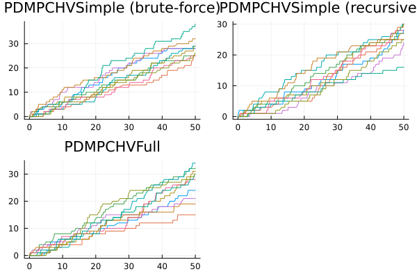
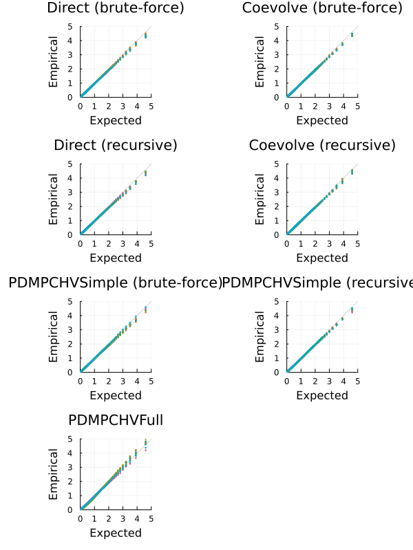

```julia
using JumpProcesses, Graphs, Statistics, BenchmarkTools, Plots
using OrdinaryDiffEq: Tsit5
fmt = :png
width_px, height_px = default(:size);
```


# Model and example solutions

Let a graph with ``V`` nodes, then the multivariate Hawkes process is characterized by ``V`` point processes such that the conditional intensity rate of node ``i`` connected to a set of nodes ``E_i`` in the graph is given by:
```math
  \lambda_i^\ast (t) = \lambda + \sum_{j \in E_i} \sum_{t_{n_j} < t} \alpha \exp \left[-\beta (t - t_{n_j}) \right]
```
This process is known as self-exciting, because the occurrence of an event ``j`` at ``t_{n_j}`` will increase the conditional intensity of all the processes connected to it by ``\alpha``. The excited intensity then decreases at a rate proportional to ``\beta``.

The conditional intensity of this process has a recursive formulation which can significantly speed the simulation. The recursive formulation for the univariate case is derived in Laub et al. [2]. We derive the compound case here. Let ``t_{N_i} = \max \{ t_{n_j} < t \mid j \in E_i \}`` and
```math
\begin{split}
  \phi_i^\ast (t)
    &= \sum_{j \in E_i} \sum_{t_{n_j} < t} \alpha \exp \left[-\beta (t - t_{N_i} + t_{N_i} - t_{n_j}) \right] \\
    &= \exp \left[ -\beta (t - t_{N_i}) \right] \sum_{j \in E_i} \sum_{t_{n_j} \leq t_{N_i}} \alpha \exp \left[-\beta (t_{N_i} - t_{n_j}) \right] \\
    &= \exp \left[ -\beta (t - t_{N_i}) \right] \left( \alpha + \phi^\ast (t_{N_i}) \right)
\end{split}
```
Then the conditional intensity can be re-written in terms of ``\phi_i^\ast (t_{N_i})``
```math
  \lambda_i^\ast (t) = \lambda + \phi_i^\ast (t) = \lambda + \exp \left[ -\beta (t - t_{N_i}) \right] \left( \alpha + \phi_i^\ast (t_{N_i}) \right)
```

In Julia, we define a factory for the conditional intensity ``\lambda_i`` which returns the brute-force or recursive versions of the intensity given node ``i`` and network ``g``.

```julia
function hawkes_rate(i::Int, g; use_recursion = false)

    @inline @inbounds function rate_recursion(u, p, t)
        λ, α, β, h, urate, ϕ = p
        urate[i] = λ + exp(-β*(t - h[i]))*ϕ[i]
        return urate[i]
    end

    @inline @inbounds function rate_brute(u, p, t)
        λ, α, β, h, urate = p
        x = zero(typeof(t))
        for j in g[i]
            for _t in reverse(h[j])
                ϕij = α * exp(-β * (t - _t))
                if ϕij ≈ 0
                    break
                end
                x += ϕij
            end
        end
        urate[i] = λ + x
        return urate[i]
    end

    if use_recursion
        return rate_recursion
    else
        return rate_brute
    end

end
```

```
hawkes_rate (generic function with 1 method)
```


Given the rate factory, we can create a jump factory which will create all the jumps in our model.

```julia
function hawkes_jump(i::Int, g; use_recursion = false)
    rate = hawkes_rate(i, g; use_recursion)
    urate = rate
    @inbounds rateinterval(u, p, t) = p[5][i] == p[1] ? typemax(t) : 2 / p[5][i]
    @inbounds lrate(u, p, t) = p[1]
    @inbounds function affect_recursion!(integrator)
        λ, α, β, h, _, ϕ  = integrator.p
        for j in g[i]
          ϕ[j] *= exp(-β*(integrator.t - h[j]))
          ϕ[j] += α
          h[j] = integrator.t
        end
        integrator.u[i] += 1
    end
    @inbounds function affect_brute!(integrator)
        push!(integrator.p[4][i], integrator.t)
        integrator.u[i] += 1
    end
    return VariableRateJump(
        rate,
        use_recursion ? affect_recursion! : affect_brute!;
        lrate,
        urate,
        rateinterval,
    )
end

function hawkes_jump(u, g; use_recursion = false)
    return [hawkes_jump(i, g; use_recursion) for i = 1:length(u)]
end
```

```
hawkes_jump (generic function with 2 methods)
```


We can then create a factory for Multivariate Hawkes `JumpProblem`s. We can define two types of `JumpProblem`s depending on the aggregator. The `Direct()` aggregator expects an `ODEProblem` since it cannot handle the `SSAStepper` with `VariableRateJump`s.


```julia
function f!(du, u, p, t)
    du .= 0
    nothing
end

function hawkes_problem(
    p,
    agg;
    u = [0.0],
    tspan = (0.0, 50.0),
    save_positions = (false, true),
    g = [[1]],
    use_recursion = false,
)
    oprob = ODEProblem(f!, u, tspan, p)
    jumps = hawkes_jump(u, g; use_recursion)
    jprob = JumpProblem(oprob, agg, jumps...; save_positions = save_positions)
    return jprob
end
```

```
hawkes_problem (generic function with 1 method)
```


The `Coevolve()` aggregator knows how to handle the `SSAStepper`, so it accepts a `DiscreteProblem`.

```julia
function hawkes_problem(
    p,
    agg::Coevolve;
    u = [0.0],
    tspan = (0.0, 50.0),
    save_positions = (false, true),
    g = [[1]],
    use_recursion = false,
)
    dprob = DiscreteProblem(u, tspan, p)
    jumps = hawkes_jump(u, g; use_recursion)
    jprob =
        JumpProblem(dprob, agg, jumps...; dep_graph = g, save_positions = save_positions)
    return jprob
end
```

```
hawkes_problem (generic function with 2 methods)
```


Lets solve the problems defined so far. We sample a random graph sampled from the Erdős-Rényi model. This model assumes that the probability of an edge between two nodes is independent of other edges, which we fix at ``0.2``. For illustration purposes, we fix ``V = 10``.

```julia
V = 10
G = erdos_renyi(V, 0.2, seed = 9103)
g = [neighbors(G, i) for i = 1:nv(G)]
```

```
10-element Vector{Vector{Int64}}:
 [4, 7]
 [8, 9]
 [4, 5]
 [1, 3]
 [3]
 []
 [1, 8, 9]
 [2, 7]
 [2, 7, 10]
 [9]
```


We fix the Hawkes parameters at ``\lambda = 0.5 , \alpha = 0.1 , \beta = 2.0`` which ensures the process does not explode.

```julia
tspan = (0.0, 50.0)
u = [0.0 for i = 1:nv(G)]
p = (0.5, 0.1, 2.0)
```

```
(0.5, 0.1, 2.0)
```


Now, we instantiate the problems, find their solutions and plot the results.


```julia
algorithms = Tuple{Any, Any, Bool, String}[
  (Direct(), Tsit5(), false, "Direct (brute-force)"),
  (Coevolve(), SSAStepper(), false, "Coevolve (brute-force)"),
  (Direct(), Tsit5(), true, "Direct (recursive)"),
  (Coevolve(), SSAStepper(), true, "Coevolve (recursive)"),
]

let fig = []
  for (i, (algo, stepper, use_recursion, label)) in enumerate(algorithms)
    @info label
    if use_recursion
        h = zeros(eltype(tspan), nv(G))
        urate = zeros(eltype(tspan), nv(G))
        ϕ = zeros(eltype(tspan), nv(G))
        _p = (p[1], p[2], p[3], h, ϕ, urate)
    else
        h = [eltype(tspan)[] for _ = 1:nv(G)]
        urate = zeros(eltype(tspan), nv(G))
        _p = (p[1], p[2], p[3], h, urate)
    end
    jump_prob = hawkes_problem(_p, algo; u, tspan, g, use_recursion)
    sol = solve(jump_prob, stepper)
    push!(fig, plot(sol.t, sol[1:V, :]', title=label, legend=false, format=fmt))
  end
  fig = plot(fig..., layout=(2,2), format=fmt, size=(width_px, 2*height_px/2))
end
```


## Alternative libraries

We benchmark `JumpProcesses.jl` against `PiecewiseDeterministicMarkovProcesses.jl` and Python `Tick` library.

In order to compare with the `PiecewiseDeterministicMarkovProcesses.jl`, we need to reformulate our jump problem as a Piecewise Deterministic Markov Process (PDMP). In this setting, we have two options.

The simple version only requires the conditional intensity. Like above, we define a brute-force and recursive approach. Following the library's specification we define the following functions.

```julia
function hawkes_rate_simple_recursion(rate, xc, xd, p, t, issum::Bool)
  λ, _, β, h, ϕ, g = p
  for i in 1:length(g)
    rate[i] = λ + exp(-β * (t - h[i])) * ϕ[i]
  end
  if issum
    return sum(rate)
  end
  return 0.0
end

function hawkes_rate_simple_brute(rate, xc, xd, p, t, issum::Bool)
  λ, α, β, h, g = p
  for i in 1:length(g)
    x = zero(typeof(t))
    for j in g[i]
        for _t in reverse(h[j])
            ϕij = α * exp(-β * (t - _t))
            if ϕij ≈ 0
                break
            end
            x += ϕij
        end
    end
    rate[i] = λ + x
  end
  if issum
    return sum(rate)
  end
  return 0.0
end

function hawkes_affect_simple_recursion!(xc, xd, p, t, i::Int64)
  _, α, β, h, ϕ, g = p
  for j in g[i]
      ϕ[j] *= exp(-β * (t - h[j]))
      ϕ[j] += α
      h[j] = t
  end
end

function hawkes_affect_simple_brute!(xc, xd, p, t, i::Int64)
  push!(p[4][i], t)
end
```

```
hawkes_affect_simple_brute! (generic function with 1 method)
```


Since this is a library for PDMP, we also need to define the ODE problem. In the simple version, we simply set it to zero.

```julia
function hawkes_drate_simple(dxc, xc, xd, p, t)
    dxc .= 0
end
```

```
hawkes_drate_simple (generic function with 1 method)
```


Next, we create a factory for the Multivariate Hawkes `PDMPCHVSimple` problem.

```julia
import LinearAlgebra: I
using PiecewiseDeterministicMarkovProcesses
const PDMP = PiecewiseDeterministicMarkovProcesses

struct PDMPCHVSimple end

function hawkes_problem(p,
                        agg::PDMPCHVSimple;
                        u = [0.0],
                        tspan = (0.0, 50.0),
                        save_positions = (false, true),
                        g = [[1]],
                        use_recursion = true)
    xd0 = Array{Int}(u)
    xc0 = copy(u)
    nu = one(eltype(xd0)) * I(length(xd0))
    if use_recursion
      jprob = PDMPProblem(hawkes_drate_simple, hawkes_rate_simple_recursion,
          hawkes_affect_simple_recursion!, nu, xc0, xd0, p, tspan)
    else
      jprob = PDMPProblem(hawkes_drate_simple, hawkes_rate_simple_brute,
          hawkes_affect_simple_brute!, nu, xc0, xd0, p, tspan)
    end
    return jprob
end

push!(algorithms, (PDMPCHVSimple(), CHV(Tsit5()), false, "PDMPCHVSimple (brute-force)"));
push!(algorithms, (PDMPCHVSimple(), CHV(Tsit5()), true, "PDMPCHVSimple (recursive)"));
```


The full version requires that we describe how the conditional intensity changes with time which we derive below:
```math
\begin{split}
  \frac{d \lambda_i^\ast (t)}{d t}
    &= -\beta \sum_{j \in E_i} \sum_{t_{n_j} < t} \alpha \exp \left[-\beta (t - t_{n_j}) \right] \\
    &= -\beta \left( \lambda_i^\ast (t) - \lambda \right)
\end{split}
```

```julia
function hawkes_drate_full(dxc, xc, xd, p, t)
    λ, α, β, _, _, g = p
    for i = 1:length(g)
        dxc[i] = -β * (xc[i] - λ)
    end
end
```

```
hawkes_drate_full (generic function with 1 method)
```


Next, we need to define the intensity rate and the jumps according to library's specification.

```julia
function hawkes_rate_full(rate, xc, xd, p, t, issum::Bool)
    λ, α, β, _, _, g = p
    if issum
        return sum(@view(xc[1:length(g)]))
    end
    rate[1:length(g)] .= @view xc[1:length(g)]
    return 0.0
end

function hawkes_affect_full!(xc, xd, p, t, i::Int64)
    λ, α, β, _, _, g = p
    for j in g[i]
        xc[i] += α
    end
end
```

```
hawkes_affect_full! (generic function with 1 method)
```


Finally, we create a factory for the Multivariate Hawkes `PDMPCHVFull` problem.

```julia
struct PDMPCHVFull end

function hawkes_problem(
    p,
    agg::PDMPCHVFull;
    u = [0.0],
    tspan = (0.0, 50.0),
    save_positions = (false, true),
    g = [[1]],
    use_recursion = true,
)
    xd0 = Array{Int}(u)
    xc0 = [p[1] for i = 1:length(u)]
    nu = one(eltype(xd0)) * I(length(xd0))
    jprob = PDMPProblem(hawkes_drate_full, hawkes_rate_full, hawkes_affect_full!, nu, xc0, xd0, p, tspan)
    return jprob
end

push!(algorithms, (PDMPCHVFull(), CHV(Tsit5()), true, "PDMPCHVFull"));
```


The Python `Tick` library can be accessed with the `PyCall.jl`. We install the required Python dependencies with `Conda.jl` and define a factory for the Multivariate Hawkes `PyTick` problem.

```julia
const BENCHMARK_PYTHON::Bool = tryparse(Bool, get(ENV, "SCIMLBENCHMARK_PYTHON", "true"))
const REBUILD_PYCALL::Bool = tryparse(Bool, get(ENV, "SCIMLBENCHMARK_REBUILD_PYCALL", "true"))

struct PyTick end

if BENCHMARK_PYTHON
  if REBUILD_PYCALL
    using Pkg, Conda

    # PyCall only works with Conda.ROOTENV
    # tick requires python=3.8
    Conda.add("python=3.8", Conda.ROOTENV)
    Conda.add("numpy", Conda.ROOTENV)
    Conda.pip_interop(true, Conda.ROOTENV)
    Conda.pip("install", "tick", Conda.ROOTENV)

    # rebuild PyCall to ensure it links to the python provided by Conda.jl
    ENV["PYTHON"] = ""
    Pkg.build("PyCall")
  end

  ENV["PYTHON"] = ""
  using PyCall
  @info "PyCall" PyCall.libpython PyCall.pyversion PyCall.conda

  function hawkes_problem(
      p,
      agg::PyTick;
      u = [0.0],
      tspan = (0.0, 50.0),
      save_positions = (false, true),
      g = [[1]],
      use_recursion = true,
  )
      λ, α, β = p
      SimuHawkesSumExpKernels = pyimport("tick.hawkes")[:SimuHawkesSumExpKernels]
      jprob = SimuHawkesSumExpKernels(
          baseline = fill(λ, length(u)),
          adjacency = [i in j ? α / β : 0.0 for j in g, i = 1:length(u), u = 1:1],
          decays = [β],
          end_time = tspan[2],
          verbose = false,
          force_simulation = true,
      )
      return jprob
  end

  push!(algorithms, (PyTick(), nothing, true, "PyTick"));
end
```

```
Channels:
 - conda-forge
Platform: linux-64
Collecting package metadata (repodata.json): ...working... done
Solving environment: ...working... failed
Error: failed process: Process(setenv(`/cache/julia-buildkite-plugin/depots
/5b300254-1738-4989-ae0a-f4d2d937f953/conda/3/x86_64/bin/conda install -q -
y python=3.8`,["DBUS_SESSION_BUS_ADDRESS=unix:path=/run/user/21581/bus", "B
UILDKITE_PULL_REQUEST_REPO=", "BUILDKITE_SOURCE=webhook", "BUILDKITE_PLUGIN
_COPPERMIND_INPUTS_0=benchmarks/Jumps", "BUILDKITE_GIT_CLONE_FLAGS=-v", "BU
ILDKITE_PLUGIN_CRYPTIC_BASE64_AGENT_PUBLIC_KEY_SECRET=LS0tLS1CRUdJTiBQVUJMS
UMgS0VZLS0tLS0KTUlJQklqQU5CZ2txaGtpRzl3MEJBUUVGQUFPQ0FROEFNSUlCQ2dLQ0FRRUF0
WHNKMzFGbTFKN29IYzlveGZaWQpKY3FxRk5yaXRMUUhxaDVJUHNGS3YySis1K1FVQkZNYURjMHI
3czZ3NDNSMDFobkVNT1lYNDAreUVDT3h5bHErClo3dHdxWlNxS2U1MThwc0RyeWRna0xJNzRnQU
VZWWNTZGdvTGt4YWpWNy9rb0hFTDgrczRKdFRVNUJ6d1RFdXAKTllTZGNQOFhQSmJLekY1RE5qd
WJmeFA5ZjdSN2x6SUx2NWl2Z2lxZTVtbUxGd1lwb0hTRVFVNXRlT09IQStLYwpjUDZ3K2d1Q0Vx
MUZFb0N2MDRyaTFXaWpVZXorMytEWVM4UCtROGRxMGJYUWZUS1Vyc0thMkdnLzVmZ0h5Z0R1CmR
HT2ZsdzUvVEljR3VVbGNsd1hZb2tTRkpSWUJFa2pUOXBCZ2JNNEcyL2tXNGFmZ3d4bHNuN3VsUW
5QNDZVLzEKZFFJREFRQUIKLS0tLS1FTkQgUFVCTElDIEtFWS0tLS0tCg==", "BUILDKITE_ENV
_FILE=/tmp/job-env-01932c0f-c8f9-4d0e-9298-a730caee04f11669525855", "BUILDK
ITE_BUILD_NUMBER=2992", "BUILDKITE_GIT_CLONE_MIRROR_FLAGS=-v", "BUILDKITE_A
GENT_DEBUG=false", "BUILDKITE_AGENT_META_DATA_QUEUE=juliaecosystem", "BUILD
KITE_PLUGINS_PATH=/etc/buildkite-agent/plugins", "BUILDKITE_COMMAND_EVAL=tr
ue", "BUILDKITE_AGENT_META_DATA_SANDBOX_CAPABLE=true", "BUILDKITE_ORGANIZAT
ION_SLUG=julialang", "BUILDKITE_PLUGIN_COPPERMIND_INPUTS_1=src/**/*.jl", "B
UILDKITE_PIPELINE_PROVIDER=github", "BUILDKITE_AGENT_EXPERIMENT=resolve-com
mit-after-checkout", "BUILDKITE_CONFIG_PATH=/etc/buildkite-agent/buildkite-
agent.cfg", "BUILDKITE_PIPELINE_TEAMS=sciml-full-access", "BUILDKITE_AGENT_
META_DATA_CRYPTIC_CAPABLE=true", "BUILDKITE_AGENT_ACCESS_TOKEN=bkaj_eyJhbGc
iOiJIUzUxMiJ9.eyJzdWIiOiIwMTkzMmMwZi1jOGY5LTRkMGUtOTI5OC1hNzMwY2FlZTA0ZjEiL
CJhdWQiOiIwMTkzMmMwZi1lMjljLTQxNjgtODAxYS1iYTJiOTNmZGIzOWQiLCJpc3MiOiJidWls
ZGtpdGUiLCJleHAiOjE3MzIyMTk0NjksImlhdCI6MTczMTYxMTA2OX0.UjzPVJwQuujMelPKGde
dsRg3LWIUzgTWBiyjb-nW-P608INjk0EmcFMFAJ7e-EfEji5QZ9J6Ph2u3u3spOotbw", "BUIL
DKITE_PLUGIN_CRYPTIC_BASE64_SIGNED_JOB_ID_SECRET=FcrpZjWNYOhL50TDbfl6lfndP0
Hb140fEjruCqoscrSm+b2r/xcL0FuuKw4sWFXqDNtpNubXYVH/xgK6BCHVvLGxyekfysWDdcDLw
oF0UXUzT1wMK+9ItWfUcOhMofMBYuhndkL/Lu5GdCdid3chkLa/qsgNhUoTT5yESXAgrNDUirkV
PeGB4IGMtoRH5DmY+d6f6ZW2i3CQUpj/Wu3dwTmEPfbN1HYCi4q1mSruqHn0L/ITj2UW9e0g2Nf
rUr2Q+6ek/NrcjR86oq5l3dDO0P7lAQMLZm51G/BMaMejdLUORYGirO9QTlGoa6x0hPUv+j/liq
o47ptkWx4HlxzmeQ==", "BUILDKITE_PLUGIN_COPPERMIND_S3_PREFIX=s3://julialang-
buildkite-artifacts/scimlbenchmarks", "BUILDKITE_BUILD_CREATOR_EMAIL=accoun
ts@chrisrackauckas.com", "XKB_CONFIG_ROOT=/cache/julia-buildkite-plugin/dep
ots/5b300254-1738-4989-ae0a-f4d2d937f953/artifacts/f8b49c7c45b400e3f5c4002d
19645d4b88712c0c/share/X11/xkb", "BUILDKITE_SSH_KEYSCAN=true", "BUILDKITE_P
ROJECT_SLUG=julialang/scimlbenchmarks-dot-jl", "BUILDKITE_INITIAL_JOB_ID=01
932a9f-f85d-4a88-9013-67267301d144", "BUILDKITE_BIN_PATH=/usr/bin", "PWD=/c
ache/build/exclusive-amdci1-0/julialang/scimlbenchmarks-dot-jl", "GRDIR=/ca
che/julia-buildkite-plugin/depots/5b300254-1738-4989-ae0a-f4d2d937f953/arti
facts/231c36cbc48a78caf7818ee7f4cd260eb3d642e3", "BUILDKITE_GIT_CHECKOUT_FL
AGS=-f", "BUILDKITE_COMPUTE_TYPE=self-hosted", "BUILDKITE_GIT_SUBMODULES=tr
ue", "BUILDKITE_AGENT_META_DATA_OS=linux", "CI=true", "BUILDKITE_STEP_KEY=b
enchmark-benchmarks-Jumps", "BUILDKITE_STEP_IDENTIFIER=benchmark-benchmarks
-Jumps", "BUILDKITE_PLUGIN_COPPERMIND_OUTPUTS_0=markdown/**/figures/*.png",
 "CONDA_PREFIX=/cache/julia-buildkite-plugin/depots/5b300254-1738-4989-ae0a
-f4d2d937f953/conda/3/x86_64", "BUILDKITE_PLUGIN_COPPERMIND_INPUTS_2=./*.to
ml", "BUILDKITE_PLUGIN_COPPERMIND_OUTPUTS_3=markdown/**/*.svg", "BUILDKITE_
AGENT_PID=2", "BUILDKITE_LAST_HOOK_EXIT_STATUS=0", "BUILDKITE_AGENT_META_DA
TA_EXCLUSIVE=true", "BUILDKITE_PLUGIN_COPPERMIND_OUTPUTS_6=script/**/*.jl",
 "BUILDKITE_BUILD_CREATOR=Christopher Rackauckas", "BUILDKITE_REBUILT_FROM_
BUILD_ID=", "OPENBLAS_DEFAULT_NUM_THREADS=1", "BUILDKITE_BRANCH=master", "J
ULIA_DEPOT_PATH=/cache/julia-buildkite-plugin/depots/5b300254-1738-4989-ae0
a-f4d2d937f953", "BUILDKITE_PLUGIN_COPPERMIND_OUTPUTS_5=pdf/**/*.pdf", "BUI
LDKITE_AGENT_DEBUG_HTTP=false", "SHELL=/shells/bash", "BUILDKITE=true", "BU
ILDKITE_PLUGIN_CRYPTIC_PRIVILEGED=true", "BUILDKITE_HOOKS_PATH=/hooks", "BU
ILDKITE_PIPELINE_DEFAULT_BRANCH=master", "BUILDKITE_PLUGIN_NAME=COPPERMIND"
, "BUILDKITE_REBUILT_FROM_BUILD_NUMBER=", "HOME=/root", "BUILDKITE_PLUGIN_C
OPPERMIND_OUTPUTS_4=notebook/**/*.ipynb", "BUILDKITE_S3_DEFAULT_REGION=us-e
ast-1", "BUILDKITE_TRIGGERED_FROM_BUILD_PIPELINE_SLUG=", "BUILDKITE_BUILD_C
HECKOUT_PATH=/cache/build/exclusive-amdci1-0/julialang/scimlbenchmarks-dot-
jl", "BUILDKITE_SCRIPT_PATH=# Clear out these secrets as they're not needed
 during the actual build\nBUILDKITE_S3_ACCESS_KEY_ID=\"\" BUILDKITE_S3_SECR
ET_ACCESS_KEY=\"\" ./.buildkite/build_benchmark.sh \"benchmarks/Jumps\"\n",
 "INVOCATION_ID=29966b88abb442929836d952ccb5d133", "BUILDKITE_PLUGIN_COPPER
MIND_OUTPUTS_2=markdown/**/*.pdf", "LANG=en_US.UTF-8", "BUILDKITE_PIPELINE_
NAME=SciMLBenchmarks.jl", "SHLVL=3", "XDG_RUNTIME_DIR=/run/user/21581", "OL
DPWD=/cache/julia-buildkite-plugin/depots/5b300254-1738-4989-ae0a-f4d2d937f
953", "FONTCONFIG_FILE=/cache/julia-buildkite-plugin/depots/5b300254-1738-4
989-ae0a-f4d2d937f953/artifacts/558980a93131f08be5335521b84e137ee3172296/et
c/fonts/fonts.conf", "BUILDKITE_PLUGIN_CONFIGURATION={\"inputs\":[\"benchma
rks/Jumps\",\"src/**/*.jl\",\"./*.toml\"],\"outputs\":[\"markdown/**/figure
s/*.png\",\"markdown/**/*.md\",\"markdown/**/*.pdf\",\"markdown/**/*.svg\",
\"notebook/**/*.ipynb\",\"pdf/**/*.pdf\",\"script/**/*.jl\"],\"s3_prefix\":
\"s3://julialang-buildkite-artifacts/scimlbenchmarks\"}", "BUILDKITE_BUILD_
PATH=/cache/build", "BUILDKITE_BUILD_AUTHOR_EMAIL=accounts@chrisrackauckas.
com", "BUILDKITE_TIMEOUT=10080", "BUILDKITE_GIT_MIRRORS_PATH=/cache/repos",
 "BUILDKITE_STRICT_SINGLE_HOOKS=false", "BUILDKITE_LABEL=:hammer: benchmark
s/Jumps", "FONTCONFIG_PATH=/cache/julia-buildkite-plugin/depots/5b300254-17
38-4989-ae0a-f4d2d937f953/artifacts/558980a93131f08be5335521b84e137ee317229
6/etc/fonts", "JOURNAL_STREAM=8:665652457", "BUILDKITE_AGENT_META_DATA_SAND
BOX_JL=true", "BUILDKITE_BUILD_CREATOR_TEAMS=juliagpu-full-access:sciml-ful
l-access", "BUILDKITE_PROJECT_PROVIDER=github", "QT_ACCESSIBILITY=1", "BUIL
DKITE_S3_SECRET_ACCESS_KEY=", "GKS_USE_CAIRO_PNG=true", "BUILDKITE_REPO_MIR
ROR=/cache/repos/https---github-com-SciML-SciMLBenchmarks-jl-git", "GIT_TER
MINAL_PROMPT=0", "BUILDKITE_JOB_ID=01932c0f-c8f9-4d0e-9298-a730caee04f1", "
SYSTEMD_EXEC_PID=2037392", "BUILDKITE_REDACTED_VARS=*_PASSWORD,*_SECRET,*_T
OKEN,*_PRIVATE_KEY,*_ACCESS_KEY,*_SECRET_KEY,*_CONNECTION_STRING", "BUILDKI
TE_BUILD_AUTHOR=Christopher Rackauckas", "USER=sabae", "GKSwstype=100", "BU
ILDKITE_REPO=https://github.com/SciML/SciMLBenchmarks.jl.git", "BUILDKITE_G
IT_FETCH_FLAGS=-v --prune --tags", "BUILDKITE_LOCAL_HOOKS_ENABLED=true", "M
ANAGERPID=59175", "BUILDKITE_S3_ACCESS_KEY_ID=", "BUILDKITE_GIT_MIRRORS_LOC
K_TIMEOUT=300", "BUILDKITE_AGENT_ID=01932c0f-e29c-4168-801a-ba2b93fdb39d", 
"BUILDKITE_GIT_MIRRORS_SKIP_UPDATE=false", "BUILDKITE_ARTIFACT_PATHS=", "BU
ILDKITE_BUILD_URL=https://buildkite.com/julialang/scimlbenchmarks-dot-jl/bu
ilds/2992", "BUILDKITE_MESSAGE=Merge pull request #1118 from vyudu/bump-fro
m-master\n\nbump Jumps to Catalyst v14, MTK v9", "BUILDKITE_RETRY_COUNT=0",
 "LOGNAME=sabae", "JULIA_CPU_THREADS=128", "BUILDKITE_PLUGIN_JULIA_CACHE_DI
R=/cache/julia-buildkite-plugin", "BUILDKITE_PLUGIN_COPPERMIND_INPUT_HASH=8
fc44555206ed51dae31cc3691aa0f1881935a8c065d3945f1e0700f64d8f0b1", "BUILDKIT
E_PLUGIN_CRYPTIC_BASE64_AGENT_PRIVATE_KEY_SECRET=LS0tLS1CRUdJTiBSU0EgUFJJVk
FURSBLRVktLS0tLQpNSUlFcFFJQkFBS0NBUUVBdFhzSjMxRm0xSjdvSGM5b3hmWllKY3FxRk5ya
XRMUUhxaDVJUHNGS3YySis1K1FVCkJGTWFEYzByN3M2dzQzUjAxaG5FTU9ZWDQwK3lFQ094eWxx
K1o3dHdxWlNxS2U1MThwc0RyeWRna0xJNzRnQUUKWVljU2Rnb0xreGFqVjcva29IRUw4K3M0SnR
UVTVCendURXVwTllTZGNQOFhQSmJLekY1RE5qdWJmeFA5ZjdSNwpseklMdjVpdmdpcWU1bW1MRn
dZcG9IU0VRVTV0ZU9PSEErS2NjUDZ3K2d1Q0VxMUZFb0N2MDRyaTFXaWpVZXorCjMrRFlTOFArU
ThkcTBiWFFmVEtVcnNLYTJHZy81ZmdIeWdEdWRHT2ZsdzUvVEljR3VVbGNsd1hZb2tTRkpSWUIK
RWtqVDlwQmdiTTRHMi9rVzRhZmd3eGxzbjd1bFFuUDQ2VS8xZFFJREFRQUJBb0lCQVFDTU5sVjR
UbUlPWC8raQpHSDh3ZzVXekRSTy9MU1greXlFbzFHQ282NW9lcDdDNDVNUjZXdUpFUzRKbjdSVk
poczVHSkg0cDhYdi9TYkdmCk9wVEFiTCt6VVdSSUFPNC9tMWRSYTJhN1NzY1d4RDN6N0dOMkhtK
3E5elBlSHAxd3pIZU5aZ29BR0htM3RyUU0KMGpidUczN09OSG1YdGQ1MEYyVHo1TmcwN0hURkJw
V3hMMjJwNm9aZzgyUEk0OXIrdUpWWmZ5MU5HZVRnaFA4cgp2dVRVTVJIcldZa25YbUR1eDVSMHN
IdDFoU2FvTXBFbSsrMWc1V09rSzZDTGFJbEV0ZitWVVBvR0piYlNYRzNJCmo5N1h5a3NGUDhGZ2
4wMWx4ZktGV1p4MXlnTVdsUm00SFNCTWVkc1FpWStqeG5Sd3BtRnh5L2pIOVhFTUppT0wKQSsvV
FdCbUJBb0dCQU52cXROQjRuVS9zODIxTU9oalRPTmtFOGNJOENxV1BRRTZXcEFOYVY5UkVVcGVC
ZzhmMgpjTXg2VFMweE9EU0JRUk9PRnNEUG9pc1E0VVRGQmFialBLTU41d2IzNFVKYmN4V0ZwcGl
LUHJMa09Zdmtqb01VCkNSb1pKK05Lb253RWh5bWJ0TG0yMHhmUUZCamY1R1QvMHJZUWcxUkN1OV
llSmE0Z3NWYWtSNGh4QW9HQkFOTkIKMzhxenJhTTBDeHhrSnZkVmlTY3g2MFowN2g4OHFISy9SV
2dVK3ZZaitwZy9ibXBwMmdiUXZkYTJxaS84UEl2OApSb0JwcmY2Y285TmdSa2JmY05xZmFnM1Z5
SDhBNW1iUE1nK0s4YmFuKzlwU003WkREVW1sdU03R3ZRSW5OVnBCCnBJcE1uWEk5eDZSSFlpOFF
2MHhXOXcyUmpmS09TbElYZFlITjZwOUZBb0dCQUp0NXdwMkVPRXR5VE9NZnVnOGsKL1pMSVlSY2
VGYlRZb3ZFc3BRWE4wRHc4bFZ1UmNCWmx6M2R3bTdGd2s3ampESndEbjJodklzcHBvNmxYMVZnW
QpYUjAxemZocU5QSVI3em52QkVuaHF0UVViKzdNQmtqN1dEZ0FRdWY1TXdpVXR1NGVxOVdFUUpj
Y1A2a2FXTUZpCjc1aFI4bGNXMnU5VTN2VE5Iak1QNzVheEFvR0JBSm5HdExsZlMwQ21USVF4SHZ
BaE1rSDJvMVZaSGxCY25oMVEKdjV3QTBhRkVGVkNuczU4QVNEVjMwd2d0VlBxeTkvdkoraVBWU1
ZNeUFFcUlKUC9IKytVWDcySDh3UUk1ekh6Lwp5MmZtOHdYTGg1ZW5DSDllbFppTGFsZ1I4RmxWN
Hc4OUF5R3NuVnNnUDJlRWtxTEI1UTRUcTZnVDBLakVETE51CjRobEhvOGFsQW9HQUhBVGltTGRk
S0JFTkN2MXZyNnZ0d3JCZGRCbWlGSWFwaVcvMk5acWxCTFp1bEp6MEwzdCsKM3FvSUF0Uisxd2x
pWkQwZGJnRGdVeVRMcnN5Y1RDSkZIczNIZTFXb3NCSzcxTmlncFZhWEVzWnFpOHNENjlvUQo2Qk
FnaEdvbnNGbTEydzhhRGNDdm92WUxLTlhVV1BFT1c0akdvd2k0Tmx4NGZidHlkYXpIUEdnPQotL
S0tLUVORCBSU0EgUFJJVkFURSBLRVktLS0tLQo=", "BUILDKITE_PIPELINE_SLUG=scimlben
chmarks-dot-jl", "BUILDKITE_SHELL=/bin/bash -e -c", "BUILDKITE_PLUGINS_ENAB
LED=true", "LANGUAGE=en_US", "GKS_FONTPATH=/cache/julia-buildkite-plugin/de
pots/5b300254-1738-4989-ae0a-f4d2d937f953/artifacts/231c36cbc48a78caf7818ee
7f4cd260eb3d642e3", "BUILDKITE_AGENT_NAME=exclusive-amdci1.0", "BUILDKITE_S
TEP_ID=01932c0f-c852-4546-99ae-4f7dfa9978b5", "BUILDKITE_PLUGIN_COPPERMIND_
OUTPUTS_1=markdown/**/*.md", "BUILDKITE_TAG=", "OPENBLAS_MAIN_FREE=1", "PAT
H=/cache/julia-buildkite-plugin/julia_installs/bin/linux/x64/1.10/julia-1.1
0-latest-linux-x86_64/bin:/usr/local/sbin:/usr/local/bin:/usr/sbin:/usr/bin
:/sbin:/bin:/usr/games:/usr/local/games:/snap/bin:/usr/bin:/usr/local/bin:/
usr/bin:/bin", "GKS_ENCODING=utf8", "BUILDKITE_AGENT_META_DATA_NUM_CPUS=128
", "BUILDKITE_TRIGGERED_FROM_BUILD_NUMBER=", "BUILDKITE_AGENT_META_DATA_CON
FIG_GITSHA=2a413ab3", "BUILDKITE_COMMAND=# Clear out these secrets as they'
re not needed during the actual build\nBUILDKITE_S3_ACCESS_KEY_ID=\"\" BUIL
DKITE_S3_SECRET_ACCESS_KEY=\"\" ./.buildkite/build_benchmark.sh \"benchmark
s/Jumps\"\n", "LIBDECOR_PLUGIN_DIR=/cache/julia-buildkite-plugin/depots/5b3
00254-1738-4989-ae0a-f4d2d937f953/artifacts/38e215c51e5c0f77bc7a8813ba45866
32a8fc750/lib/libdecor/plugins-1", "BUILDKITE_PLUGIN_VALIDATION=false", "BU
ILDKITE_AGENT_META_DATA_ARCH=x86_64", "CONDARC=/cache/julia-buildkite-plugi
n/depots/5b300254-1738-4989-ae0a-f4d2d937f953/conda/3/x86_64/condarc-julia.
yml", "FORCE_SANDBOX_MODE=unprivileged", "BUILDKITE_TRIGGERED_FROM_BUILD_ID
=", "TERM=xterm-256color", "PYTHONIOENCODING=UTF-8", "BUILDKITE_PULL_REQUES
T_BASE_BRANCH=", "BUILDKITE_PIPELINE_ID=5b300254-1738-4989-ae0a-f4d2d937f95
3", "_=/cache/julia-buildkite-plugin/julia_installs/bin/linux/x64/1.10/juli
a-1.10-latest-linux-x86_64/bin/julia", "BUILDKITE_BUILD_ID=01932a9f-f83d-41
89-a228-5ba7eda1c9a4", "BUILDKITE_AGENT_ENDPOINT=https://agent.buildkite.co
m/v3", "BUILDKITE_PLUGINS=[{\"github.com/staticfloat/cryptic-buildkite-plug
in#v2\":{\"files\":[\".buildkite/secrets/token.toml\"],\"variables\":[\"BUI
LDKITE_S3_ACCESS_KEY_ID=\\\"U2FsdGVkX1+x3xs1ZRRZRt3FmwFQmYYKnpV7o8xKkX5Ib6y
0o5fv0+rskVAj+JKu\\\"\",\"BUILDKITE_S3_SECRET_ACCESS_KEY=\\\"U2FsdGVkX1+LWh
1yX7LsMBlecEJLc08eJrgOhurhd47CY1/jS3wCGVCQmS1t6f2j70spBoFdfc9kn2naj8HH5A==\
\\"\",\"BUILDKITE_S3_DEFAULT_REGION=\\\"U2FsdGVkX18ccoE9FmtkwsCm1x0MLMBlN/F
LcAyKkY4=\\\"\"]}},{\"github.com/JuliaCI/julia-buildkite-plugin#v1\":{\"ver
sion\":\"1.10\"}},{\"github.com/staticfloat/sandbox-buildkite-plugin\":{\"g
id\":1000,\"uid\":1000,\"rootfs_url\":\"https://github.com/thazhemadam/open
modelica-rootfs-image/releases/download/v1.23.0/rootfs-openmodelica-v1.23.0
.amd64.tar.gz\",\"workspaces\":[\"/cache/julia-buildkite-plugin:/cache/juli
a-buildkite-plugin\"],\"rootfs_treehash\":\"82970243dc4f188e599a976abc20951
f4aba2912\"}},{\"github.com/staticfloat/coppermind-buildkite-plugin#v1\":{\
"inputs\":[\"benchmarks/Jumps\",\"src/**/*.jl\",\"./*.toml\"],\"outputs\":[
\"markdown/**/figures/*.png\",\"markdown/**/*.md\",\"markdown/**/*.pdf\",\"
markdown/**/*.svg\",\"notebook/**/*.ipynb\",\"pdf/**/*.pdf\",\"script/**/*.
jl\"],\"s3_prefix\":\"s3://julialang-buildkite-artifacts/scimlbenchmarks\"}
}]", "BUILDKITE_SOCKETS_PATH=/root/.buildkite-agent/sockets", "SANDBOX_PERS
ISTENCE_DIR=/cache/sandbox_persistence", "BUILDKITE_GIT_CLEAN_FLAGS=-ffxdq"
, "BUILDKITE_COMMIT=a12642c0a0a805b4a25c02875c200aec928ca53c", "BUILDKITE_P
ULL_REQUEST=false", "BUILDKITE_ORGANIZATION_ID=d409823c-5fa7-41c8-9033-7269
c5fde4f3", "GKS_QT=env LD_LIBRARY_PATH=/cache/julia-buildkite-plugin/depots
/5b300254-1738-4989-ae0a-f4d2d937f953/artifacts/f839432e3d2904a5c847b217ef0
c0f489377ecc5/lib:/cache/julia-buildkite-plugin/depots/5b300254-1738-4989-a
e0a-f4d2d937f953/artifacts/2def0eca464bd6d89ccac85338474402359d4930/lib:/ca
che/julia-buildkite-plugin/depots/5b300254-1738-4989-ae0a-f4d2d937f953/arti
facts/d00220164876dea2cb19993200662745eed5e2db/lib:/cache/julia-buildkite-p
lugin/julia_installs/bin/linux/x64/1.10/julia-1.10-latest-linux-x86_64/bin/
../lib/julia:/cache/julia-buildkite-plugin/depots/5b300254-1738-4989-ae0a-f
4d2d937f953/artifacts/cb697355f42d1d0c8f70b15c0c3dc28952f774b4/lib:/cache/j
ulia-buildkite-plugin/depots/5b300254-1738-4989-ae0a-f4d2d937f953/artifacts
/dc526f26fb179a3f68eb13fcbe5d2d2a5aa7eeac/lib:/cache/julia-buildkite-plugin
/depots/5b300254-1738-4989-ae0a-f4d2d937f953/artifacts/c9fd7a94d3c09eac4f3c
a94d21bf40ccf65eccf5/lib:/cache/julia-buildkite-plugin/depots/5b300254-1738
-4989-ae0a-f4d2d937f953/artifacts/b757190a3c47fcb65f573f631fdd549b98fcf2e4/
lib:/cache/julia-buildkite-plugin/depots/5b300254-1738-4989-ae0a-f4d2d937f9
53/artifacts/b3ddd583e7aec92a77cf5961fad01fd7063c1d40/lib:/cache/julia-buil
dkite-plugin/depots/5b300254-1738-4989-ae0a-f4d2d937f953/artifacts/7099954f
fb0b6e1641832a06a08e479498ce479f/lib:/cache/julia-buildkite-plugin/depots/5
b300254-1738-4989-ae0a-f4d2d937f953/artifacts/0803f8d074309498cdf55effdb9c5
5bc3ef88dde/lib:/cache/julia-buildkite-plugin/depots/5b300254-1738-4989-ae0
a-f4d2d937f953/artifacts/f92cfdafb94fa8c50330be3684c9aeb80bd14750/lib:/cach
e/julia-buildkite-plugin/depots/5b300254-1738-4989-ae0a-f4d2d937f953/artifa
cts/1308e48c3f4f2fd9adaa56b9bd4a86a995d50abd/lib:/cache/julia-buildkite-plu
gin/depots/5b300254-1738-4989-ae0a-f4d2d937f953/artifacts/558980a93131f08be
5335521b84e137ee3172296/lib:/cache/julia-buildkite-plugin/depots/5b300254-1
738-4989-ae0a-f4d2d937f953/artifacts/d75cfbd8954fdbc933ebead40a9c8b91513c02
3a/lib:/cache/julia-buildkite-plugin/depots/5b300254-1738-4989-ae0a-f4d2d93
7f953/artifacts/9cfb24edca23321a2dcebb63b4e196181359ecd6/lib:/cache/julia-b
uildkite-plugin/depots/5b300254-1738-4989-ae0a-f4d2d937f953/artifacts/aae09
3c71ea1b1dc04c457afcae880d26c532115/lib:/cache/julia-buildkite-plugin/depot
s/5b300254-1738-4989-ae0a-f4d2d937f953/artifacts/bd965e3c7f9460155f06361da3
80c63fa0351ef6/lib:/cache/julia-buildkite-plugin/depots/5b300254-1738-4989-
ae0a-f4d2d937f953/artifacts/060cf7829c3363638c29228ea4ab0bd033d8eab0/lib:/c
ache/julia-buildkite-plugin/depots/5b300254-1738-4989-ae0a-f4d2d937f953/art
ifacts/77d0e7c90e6a2fd6f2f8457bbb7b86ed86d140d9/lib:/cache/julia-buildkite-
plugin/depots/5b300254-1738-4989-ae0a-f4d2d937f953/artifacts/1e69ef9fbf05e2
896d3cb70eac8080c4d10f8696/lib:/cache/julia-buildkite-plugin/depots/5b30025
4-1738-4989-ae0a-f4d2d937f953/artifacts/e200b9737b27598b95b404cbc34e74f95b2
bf5d0/lib:/cache/julia-buildkite-plugin/depots/5b300254-1738-4989-ae0a-f4d2
d937f953/artifacts/a8e2d77aed043a035fd970326d8f070080efa8fa/lib:/cache/juli
a-buildkite-plugin/depots/5b300254-1738-4989-ae0a-f4d2d937f953/artifacts/6f
98018cad6a09e91f90658f188c6be47e48a0c7/lib:/cache/julia-buildkite-plugin/de
pots/5b300254-1738-4989-ae0a-f4d2d937f953/artifacts/d4f3ff9736df0dda120f8dc
1d27174b0d5696fb1/lib:/cache/julia-buildkite-plugin/depots/5b300254-1738-49
89-ae0a-f4d2d937f953/artifacts/2ab21f29b30c228bd0e5215585f822730cad5a72/lib
:/cache/julia-buildkite-plugin/depots/5b300254-1738-4989-ae0a-f4d2d937f953/
artifacts/62c010876222f83fe8878bf2af0e362083d20ee3/lib:/cache/julia-buildki
te-plugin/depots/5b300254-1738-4989-ae0a-f4d2d937f953/artifacts/75b657b8767
88e58671ab6b88e49019aa36b67cd/lib:/cache/julia-buildkite-plugin/depots/5b30
0254-1738-4989-ae0a-f4d2d937f953/artifacts/bd1f25e7053ebc00ee7d82f3c5ec4cf1
e9a51e17/lib:/cache/julia-buildkite-plugin/depots/5b300254-1738-4989-ae0a-f
4d2d937f953/artifacts/cf5d5f8a6109be3f9c460a39768f57a3e53ff11d/lib:/cache/j
ulia-buildkite-plugin/depots/5b300254-1738-4989-ae0a-f4d2d937f953/artifacts
/c8a20a2030f10b70947d8d2a6bff7f8b5f343fe9/lib:/cache/julia-buildkite-plugin
/depots/5b300254-1738-4989-ae0a-f4d2d937f953/artifacts/0631e2a6a31b5692eec7
a575836451b16b734ec0/lib:/cache/julia-buildkite-plugin/depots/5b300254-1738
-4989-ae0a-f4d2d937f953/artifacts/4abd0521d210cb9e48ea5e711873ba34dc05fc70/
lib:/cache/julia-buildkite-plugin/depots/5b300254-1738-4989-ae0a-f4d2d937f9
53/artifacts/1cf7375e8ec1bbe1219934488737c12237ba2012/lib:/cache/julia-buil
dkite-plugin/depots/5b300254-1738-4989-ae0a-f4d2d937f953/artifacts/587de110
e5f58fd435dc35b294df31bb7a75f692/lib:/cache/julia-buildkite-plugin/depots/5
b300254-1738-4989-ae0a-f4d2d937f953/artifacts/fc239b3ff5739aeab252bd154fa4d
d045fefe629/lib:/cache/julia-buildkite-plugin/depots/5b300254-1738-4989-ae0
a-f4d2d937f953/artifacts/c951fb23b5652def1dea483af7095a38f3b3cefd/lib:/cach
e/julia-buildkite-plugin/depots/5b300254-1738-4989-ae0a-f4d2d937f953/artifa
cts/85dab0a3f6b9cc2e5d61165ee376bf46260812a4/lib:/cache/julia-buildkite-plu
gin/depots/5b300254-1738-4989-ae0a-f4d2d937f953/artifacts/5b83972689fb7dea5
e89326f1c0ba60d68e962fb/lib:/cache/julia-buildkite-plugin/depots/5b300254-1
738-4989-ae0a-f4d2d937f953/artifacts/9d7f5887309a96013a2c75f48b5e137e60ccae
8f/lib:/cache/julia-buildkite-plugin/depots/5b300254-1738-4989-ae0a-f4d2d93
7f953/artifacts/74fd55820a62aa47ebf4d942aa59096980a1851d/lib:/cache/julia-b
uildkite-plugin/depots/5b300254-1738-4989-ae0a-f4d2d937f953/artifacts/aa526
99bd1491b7de9c72fc1eab21e2e4bd649e2/lib:/cache/julia-buildkite-plugin/depot
s/5b300254-1738-4989-ae0a-f4d2d937f953/artifacts/951960aa7e4599865406f43215
1003dd82cde65d/lib:/cache/julia-buildkite-plugin/depots/5b300254-1738-4989-
ae0a-f4d2d937f953/artifacts/37dda4e57d9de95c99d1f8c6b3d8f4eca88c39a2/lib:/c
ache/julia-buildkite-plugin/depots/5b300254-1738-4989-ae0a-f4d2d937f953/art
ifacts/136b88dafbb4b6b7bfa6d4cff225f7d697015bd1/lib:/cache/julia-buildkite-
plugin/depots/5b300254-1738-4989-ae0a-f4d2d937f953/artifacts/38e215c51e5c0f
77bc7a8813ba4586632a8fc750/lib:/cache/julia-buildkite-plugin/depots/5b30025
4-1738-4989-ae0a-f4d2d937f953/artifacts/f0d193662fead3500b523f94b4f1878daab
59a93/lib:/cache/julia-buildkite-plugin/depots/5b300254-1738-4989-ae0a-f4d2
d937f953/artifacts/05616da88f6b36c7c94164d4070776aef18ce46b/lib:/cache/juli
a-buildkite-plugin/depots/5b300254-1738-4989-ae0a-f4d2d937f953/artifacts/2d
f316da869cd97f7d70029428ee1e2e521407cd/lib:/cache/julia-buildkite-plugin/de
pots/5b300254-1738-4989-ae0a-f4d2d937f953/artifacts/7190f0cb0832b80761cc6d5
13dd9b935f3e26358/lib:/cache/julia-buildkite-plugin/depots/5b300254-1738-49
89-ae0a-f4d2d937f953/artifacts/4daa3879a820580557ef34945e2ae243dfcbba11/lib
:/cache/julia-buildkite-plugin/depots/5b300254-1738-4989-ae0a-f4d2d937f953/
artifacts/3643539f491c217e13c1595daad81dd1426fba07/lib:/cache/julia-buildki
te-plugin/depots/5b300254-1738-4989-ae0a-f4d2d937f953/artifacts/71f3593804f
b3a115f7fcb71b20c4e1f9b32290f/lib:/cache/julia-buildkite-plugin/depots/5b30
0254-1738-4989-ae0a-f4d2d937f953/artifacts/fbef68f6f587b5d3709af5b95701b92e
3b890e4b/lib:/cache/julia-buildkite-plugin/depots/5b300254-1738-4989-ae0a-f
4d2d937f953/artifacts/0ef7836563e0bb993333653a46424119858e5f1d/lib:/cache/j
ulia-buildkite-plugin/depots/5b300254-1738-4989-ae0a-f4d2d937f953/artifacts
/4c45bf9c8292490acd9463bbfbf168277d9720b6/lib:/cache/julia-buildkite-plugin
/depots/5b300254-1738-4989-ae0a-f4d2d937f953/artifacts/2efdb7b239e9f244a3a9
33925294ea27cc6a61c2/lib:/cache/julia-buildkite-plugin/depots/5b300254-1738
-4989-ae0a-f4d2d937f953/artifacts/872754c2f795d19a3e2e205b2bbaea659f28d11e/
lib:/cache/julia-buildkite-plugin/depots/5b300254-1738-4989-ae0a-f4d2d937f9
53/artifacts/7da37be2742b3d1cfe1c14bf5bbd85aed4887f46/lib:/cache/julia-buil
dkite-plugin/depots/5b300254-1738-4989-ae0a-f4d2d937f953/artifacts/c35cb3f6
f3043a4e962fd56b61ad91b4adb557f7/lib:/cache/julia-buildkite-plugin/depots/5
b300254-1738-4989-ae0a-f4d2d937f953/artifacts/13befbe35cffe7da192c7001ece18
b4be3aa3720/lib:/cache/julia-buildkite-plugin/depots/5b300254-1738-4989-ae0
a-f4d2d937f953/artifacts/cacd8c147f866d6672e1aca9bb01fb919a81e96a/lib:/cach
e/julia-buildkite-plugin/depots/5b300254-1738-4989-ae0a-f4d2d937f953/artifa
cts/b7dc5dce963737414a564aca8d4b82ee388f4fa1/lib:/cache/julia-buildkite-plu
gin/depots/5b300254-1738-4989-ae0a-f4d2d937f953/artifacts/0d364e900393f710a
03a5bafe2852d76e4d2c2cd/lib:/cache/julia-buildkite-plugin/depots/5b300254-1
738-4989-ae0a-f4d2d937f953/artifacts/1a2adcee7d99fea18ead33c350332626b262e2
9a/lib:/cache/julia-buildkite-plugin/depots/5b300254-1738-4989-ae0a-f4d2d93
7f953/artifacts/40eea58ff37ecc8fb6f21f41079a33b511b3ff92/lib:/cache/julia-b
uildkite-plugin/depots/5b300254-1738-4989-ae0a-f4d2d937f953/artifacts/79cc5
446ced978de84b6e673e01da0ebfdd6e4a5/lib:/cache/julia-buildkite-plugin/depot
s/5b300254-1738-4989-ae0a-f4d2d937f953/artifacts/fce445d991cf502908d681348e
ec2174c5e31ba8/lib:/cache/julia-buildkite-plugin/depots/5b300254-1738-4989-
ae0a-f4d2d937f953/artifacts/b0d2538004dda9eb6449b72b0b85703aeac30a66/lib:/c
ache/julia-buildkite-plugin/depots/5b300254-1738-4989-ae0a-f4d2d937f953/art
ifacts/f03dd5ac03468009d5a99bbfcdf336c2dc372de4/lib:/cache/julia-buildkite-
plugin/depots/5b300254-1738-4989-ae0a-f4d2d937f953/artifacts/eae77862e95d04
dfafb9fbe9ae39e688b35d756a/lib:/cache/julia-buildkite-plugin/depots/5b30025
4-1738-4989-ae0a-f4d2d937f953/artifacts/231c36cbc48a78caf7818ee7f4cd260eb3d
642e3/lib:/cache/julia-buildkite-plugin/julia_installs/bin/linux/x64/1.10/j
ulia-1.10-latest-linux-x86_64/bin/../lib/julia:/cache/julia-buildkite-plugi
n/julia_installs/bin/linux/x64/1.10/julia-1.10-latest-linux-x86_64/bin/../l
ib /cache/julia-buildkite-plugin/depots/5b300254-1738-4989-ae0a-f4d2d937f95
3/artifacts/231c36cbc48a78caf7818ee7f4cd260eb3d642e3/bin/gksqt"]), ProcessE
xited(1)) [1]
```


Now, we instantiate the problems, find their solutions and plot the results.

```julia
let fig = []
  for (i, (algo, stepper, use_recursion, label)) in enumerate(algorithms[5:end])
    @info label
    if algo isa PyTick
        _p = (p[1], p[2], p[3])
        jump_prob = hawkes_problem(_p, algo; u, tspan, g, use_recursion)
        jump_prob.reset()
        jump_prob.simulate()
        t = tspan[1]:0.1:tspan[2]
        N = [[sum(jumps .< _t) for _t in t] for jumps in jump_prob.timestamps]
        push!(fig, plot(t, N, title=label, legend=false, format=fmt))
    elseif algo isa PDMPCHVSimple
        if use_recursion
          h = zeros(eltype(tspan), nv(G))
          ϕ = zeros(eltype(tspan), nv(G))
          _p = (p[1], p[2], p[3], h, ϕ, g)
        else
          h = [eltype(tspan)[] for _ in 1:nv(G)]
          _p = (p[1], p[2], p[3], h, g)
        end
        jump_prob = hawkes_problem(_p, algo; u, tspan, g, use_recursion)
        sol = solve(jump_prob, stepper)
        push!(fig, plot(sol.time, sol.xd[1:V, :]', title=label, legend=false, format=fmt))
    elseif algo isa PDMPCHVFull
        _p = (p[1], p[2], p[3], nothing, nothing, g)
        jump_prob = hawkes_problem(_p, algo; u, tspan, g, use_recursion)
        sol = solve(jump_prob, stepper)
        push!(fig, plot(sol.time, sol.xd[1:V, :]', title=label, legend=false, format=fmt))
    end
  end
  fig = plot(fig..., layout=(2,2), format=fmt, size=(width_px, 2*height_px/2))
end
```




# Correctness: QQ-Plots

We check that the algorithms produce correct simulation by inspecting their QQ-plots. Point process theory says that transforming the simulated points using the compensator should produce points whose inter-arrival duration is distributed according to the exponential distribution (see Section 7.4 [1]).

The compensator of any point process is the integral of the conditional intensity ``\Lambda_i^\ast(t) = \int_0^t \lambda_i^\ast(u) du``. The compensator for the Multivariate Hawkes process is defined below.
```math
    \Lambda_i^\ast(t) = \lambda t + \frac{\alpha}{\beta} \sum_{j \in E_i} \sum_{t_{n_j} < t} ( 1 - \exp \left[-\beta (t - t_{n_j}) \right])
```

```julia
function hawkes_Λ(i::Int, g, p)
    @inline @inbounds function Λ(t, h)
        λ, α, β = p
        x = λ * t
        for j in g[i]
            for _t in h[j]
                if _t >= t
                    break
                end
                x += (α / β) * (1 - exp(-β * (t - _t)))
            end
        end
        return x
    end
    return Λ
end

function hawkes_Λ(g, p)
    return [hawkes_Λ(i, g, p) for i = 1:length(g)]
end

Λ = hawkes_Λ(g, p)
```

```
10-element Vector{Main.var"##WeaveSandBox#225".var"#Λ#33"{Int64, Vector{Vec
tor{Int64}}, Tuple{Float64, Float64, Float64}}}:
 (::Main.var"##WeaveSandBox#225".var"#Λ#33"{Int64, Vector{Vector{Int64}}, T
uple{Float64, Float64, Float64}}) (generic function with 1 method)
 (::Main.var"##WeaveSandBox#225".var"#Λ#33"{Int64, Vector{Vector{Int64}}, T
uple{Float64, Float64, Float64}}) (generic function with 1 method)
 (::Main.var"##WeaveSandBox#225".var"#Λ#33"{Int64, Vector{Vector{Int64}}, T
uple{Float64, Float64, Float64}}) (generic function with 1 method)
 (::Main.var"##WeaveSandBox#225".var"#Λ#33"{Int64, Vector{Vector{Int64}}, T
uple{Float64, Float64, Float64}}) (generic function with 1 method)
 (::Main.var"##WeaveSandBox#225".var"#Λ#33"{Int64, Vector{Vector{Int64}}, T
uple{Float64, Float64, Float64}}) (generic function with 1 method)
 (::Main.var"##WeaveSandBox#225".var"#Λ#33"{Int64, Vector{Vector{Int64}}, T
uple{Float64, Float64, Float64}}) (generic function with 1 method)
 (::Main.var"##WeaveSandBox#225".var"#Λ#33"{Int64, Vector{Vector{Int64}}, T
uple{Float64, Float64, Float64}}) (generic function with 1 method)
 (::Main.var"##WeaveSandBox#225".var"#Λ#33"{Int64, Vector{Vector{Int64}}, T
uple{Float64, Float64, Float64}}) (generic function with 1 method)
 (::Main.var"##WeaveSandBox#225".var"#Λ#33"{Int64, Vector{Vector{Int64}}, T
uple{Float64, Float64, Float64}}) (generic function with 1 method)
 (::Main.var"##WeaveSandBox#225".var"#Λ#33"{Int64, Vector{Vector{Int64}}, T
uple{Float64, Float64, Float64}}) (generic function with 1 method)
```


We need a method for extracting the history from a simulation run. Below, we define such functions for each type of algorithm.

```julia
"""
Given an ODE solution `sol`, recover the timestamp in which events occurred. It
returns a vector with the history of each process in `sol`.

It assumes that `JumpProblem` was initialized with `save_positions` equal to
`(true, false)`, `(false, true)` or `(true, true)` such the system's state is
saved before and/or after the jump occurs; and, that `sol.u` is a
non-decreasing series that counts the total number of events observed as a
function of time.
"""
function histories(u, t)
    _u = permutedims(reduce(hcat, u))
    k = size(_u)[2]
    # computes a mask that show when total counts change
    mask = cat(fill(0.0, 1, k), _u[2:end, :] .- _u[1:end-1, :], dims = 1) .≈ 1
    h = Vector{typeof(t)}(undef, k)
    @inbounds for i = 1:k
        h[i] = t[mask[:, i]]
    end
    return h
end

function histories(sol::S) where {S<:ODESolution}
    # get u and permute the dimensions to get a matrix n x k with n obsevations and k processes.
    if sol.u[1] isa ExtendedJumpArray
        u = map((u) -> u.u, sol.u)
    else
        u = sol.u
    end
    return histories(u, sol.t)
end

function histories(sol::S) where {S<:PDMP.PDMPResult}
    return histories(sol.xd.u, sol.time)
end

function histories(sols)
    map(histories, sols)
end
```

```
histories (generic function with 4 methods)
```


We also need to compute the quantiles of the empirical distribution given a history of events `hs`, the compensator `Λ` and the target quantiles `quant`.

```julia
import Distributions: Exponential

"""
Computes the empirical and expected quantiles given a history of events `hs`,
the compensator `Λ` and the target quantiles `quant`.

The history `hs` is a vector with the history of each process. Alternatively,
the function also takes a vector of histories containing the histories from
multiple runs.

The compensator `Λ` can either be an homogeneous compensator function that
equally applies to all the processes in `hs`. Alternatively, it accepts a
vector of compensator that applies to each process.
"""
function qq(hs, Λ, quant = 0.01:0.01:0.99)
    _hs = apply_Λ(hs, Λ)
    T = typeof(hs[1][1][1])
    Δs = Vector{Vector{T}}(undef, length(hs[1]))
    for k = 1:length(Δs)
        _Δs = Vector{Vector{T}}(undef, length(hs))
        for i = 1:length(_Δs)
            _Δs[i] = _hs[i][k][2:end] .- _hs[i][k][1:end-1]
        end
        Δs[k] = reduce(vcat, _Δs)
    end
    empirical_quant = map((_Δs) -> quantile(_Δs, quant), Δs)
    expected_quant = quantile(Exponential(1.0), quant)
    return empirical_quant, expected_quant
end

"""
Compute the compensator `Λ` value for each timestamp recorded in history `hs`.

The history `hs` is a vector with the history of each process. Alternatively,
the function also takes a vector of histories containing the histories from
multiple runs.

The compensator `Λ` can either be an homogeneous compensator function that
equally applies to all the processes in `hs`. Alternatively, it accepts a
vector of compensator that applies to each process.
"""
function apply_Λ(hs::V, Λ) where {V<:Vector{<:Number}}
    _hs = similar(hs)
    @inbounds for n = 1:length(hs)
        _hs[n] = Λ(hs[n], hs)
    end
    return _hs
end

function apply_Λ(k::Int, hs::V, Λ::A) where {V<:Vector{<:Vector{<:Number}},A<:Array}
    @inbounds hsk = hs[k]
    @inbounds Λk = Λ[k]
    _hs = similar(hsk)
    @inbounds for n = 1:length(hsk)
        _hs[n] = Λk(hsk[n], hs)
    end
    return _hs
end

function apply_Λ(hs::V, Λ) where {V<:Vector{<:Vector{<:Number}}}
    _hs = similar(hs)
    @inbounds for k = 1:length(_hs)
        _hs[k] = apply_Λ(hs[k], Λ)
    end
    return _hs
end

function apply_Λ(hs::V, Λ::A) where {V<:Vector{<:Vector{<:Number}},A<:Array}
    _hs = similar(hs)
    @inbounds for k = 1:length(_hs)
        _hs[k] = apply_Λ(k, hs, Λ)
    end
    return _hs
end

function apply_Λ(hs::V, Λ) where {V<:Vector{<:Vector{<:Vector{<:Number}}}}
    return map((_hs) -> apply_Λ(_hs, Λ), hs)
end
```

```
apply_Λ (generic function with 5 methods)
```


We can construct QQ-plots with a Plot recipe as following.

```julia
@userplot QQPlot
@recipe function f(x::QQPlot)
    empirical_quant, expected_quant = x.args
    max_empirical_quant = maximum(maximum, empirical_quant)
    max_expected_quant = maximum(expected_quant)
    upperlim = ceil(maximum([max_empirical_quant, max_expected_quant]))
    @series begin
        seriestype := :line
        linecolor := :lightgray
        label --> ""
        (x) -> x
    end
    @series begin
        seriestype := :scatter
        aspect_ratio := :equal
        xlims := (0.0, upperlim)
        ylims := (0.0, upperlim)
        xaxis --> "Expected"
        yaxis --> "Empirical"
        markerstrokewidth --> 0
        markerstrokealpha --> 0
        markersize --> 1.5
        size --> (400, 500)
        label --> permutedims(["quantiles $i" for i = 1:length(empirical_quant)])
        expected_quant, empirical_quant
    end
end
```


Now, we simulate all of the algorithms we defined in the previous Section ``250`` times to produce their QQ-plots.

```julia
let fig = []
    for (i, (algo, stepper, use_recursion, label)) in enumerate(algorithms)
        @info label
        if algo isa PyTick
            _p = (p[1], p[2], p[3])
        elseif algo isa PDMPCHVSimple
            if use_recursion
                h = zeros(eltype(tspan), nv(G))
                ϕ = zeros(eltype(tspan), nv(G))
                _p = (p[1], p[2], p[3], h, ϕ, g)
            else
                h = [eltype(tspan)[] for _ in 1:nv(G)]
                _p = (p[1], p[2], p[3], h, g)
            end
        elseif algo isa PDMPCHVFull
            _p = (p[1], p[2], p[3], nothing, nothing, g)
        else
            if use_recursion
                h = zeros(eltype(tspan), nv(G))
                ϕ = zeros(eltype(tspan), nv(G))
                urate = zeros(eltype(tspan), nv(G))
                _p = (p[1], p[2], p[3], h, urate, ϕ)
            else
                h = [eltype(tspan)[] for _ = 1:nv(G)]
                urate = zeros(eltype(tspan), nv(G))
                _p = (p[1], p[2], p[3], h, urate)
            end
        end
        jump_prob = hawkes_problem(_p, algo; u, tspan, g, use_recursion)
        runs = Vector{Vector{Vector{Number}}}(undef, 250)
        for n = 1:length(runs)
            if algo isa PyTick
                jump_prob.reset()
                jump_prob.simulate()
                runs[n] = jump_prob.timestamps
            else
                if ~(algo isa PDMPCHVFull)
                    if use_recursion
                        h .= 0
                        ϕ .= 0
                    else
                        for _h in h empty!(_h) end
                    end
                    if ~(algo isa PDMPCHVSimple)
                        urate .= 0
                    end
                end
                runs[n] = histories(solve(jump_prob, stepper))
            end
        end
        qqs = qq(runs, Λ)
        push!(fig, qqplot(qqs..., legend = false, aspect_ratio = :equal, title=label, fmt=fmt))
    end
    fig = plot(fig..., layout = (4, 2), fmt=fmt, size=(width_px, 4*height_px/2))
end
```




# Benchmarking performance

In this Section we benchmark all the algorithms introduced in the first Section.

We generate networks in the range from ``1`` to ``95`` nodes and simulate the Multivariate Hawkes process ``25`` units of time.

 and simulate models in the range from ``1`` to ``95`` nodes for ``25`` units of time. We fix the Hawkes parameters at ``\lambda = 0.5 , \alpha = 0.1 , \beta = 5.0`` which ensures the process does not explode. We simulate ``50`` trajectories with a limit of ten seconds to complete execution for each configuration.

```julia
tspan = (0.0, 25.0)
p = (0.5, 0.1, 5.0)
Vs = append!([1], 5:5:95)
Gs = [erdos_renyi(V, 0.2, seed = 6221) for V in Vs]

bs = Vector{Vector{BenchmarkTools.Trial}}()

for (algo, stepper, use_recursion, label) in algorithms
    @info label
    global _stepper = stepper
    push!(bs, Vector{BenchmarkTools.Trial}())
    _bs = bs[end]
    for (i, G) in enumerate(Gs)
        local g = [neighbors(G, i) for i = 1:nv(G)]
        local u = [0.0 for i = 1:nv(G)]
        if algo isa PyTick
            _p = (p[1], p[2], p[3])
        elseif algo isa PDMPCHVSimple
            if use_recursion
              global h = zeros(eltype(tspan), nv(G))
              global ϕ = zeros(eltype(tspan), nv(G))
              _p = (p[1], p[2], p[3], h, ϕ, g)
            else
              global h = [eltype(tspan)[] for _ in 1:nv(G)]
              _p = (p[1], p[2], p[3], h, g)
            end
        elseif algo isa PDMPCHVFull
            _p = (p[1], p[2], p[3], nothing, nothing, g)
        else
            if use_recursion
                global h = zeros(eltype(tspan), nv(G))
                global urate = zeros(eltype(tspan), nv(G))
                global ϕ = zeros(eltype(tspan), nv(G))
                _p = (p[1], p[2], p[3], h, urate, ϕ)
            else
                global h = [eltype(tspan)[] for _ = 1:nv(G)]
                global urate = zeros(eltype(tspan), nv(G))
                _p = (p[1], p[2], p[3], h, urate)
            end
        end
        global jump_prob = hawkes_problem(_p, algo; u, tspan, g, use_recursion)
        trial = try
            if algo isa PyTick
                @benchmark(
                    jump_prob.simulate(),
                    setup = (jump_prob.reset()),
                    samples = 50,
                    evals = 1,
                    seconds = 10,
                )
            else
                if algo isa PDMPCHVFull
                    @benchmark(
                        solve(jump_prob, _stepper),
                        setup = (),
                        samples = 50,
                        evals = 1,
                        seconds = 10,
                    )
                elseif algo isa PDMPCHVSimple
                    if use_recursion
                        @benchmark(solve(jump_prob, _stepper),
                                   setup=(h .= 0; ϕ .= 0),
                                   samples=50,
                                   evals=1,
                                   seconds=10,)
                    else
                        @benchmark(solve(jump_prob, _stepper),
                                   setup=([empty!(_h) for _h in h]),
                                   samples=50,
                                   evals=1,
                                   seconds=10,)
                    end
                else
                    if use_recursion
                        @benchmark(
                            solve(jump_prob, _stepper),
                            setup = (h .= 0; urate .= 0; ϕ .= 0),
                            samples = 50,
                            evals = 1,
                            seconds = 10,
                        )
                    else
                        @benchmark(
                            solve(jump_prob, _stepper),
                            setup = ([empty!(_h) for _h in h]; urate .= 0),
                            samples = 50,
                            evals = 1,
                            seconds = 10,
                        )
                    end
                end
            end
        catch e
            BenchmarkTools.Trial(
                BenchmarkTools.Parameters(samples = 50, evals = 1, seconds = 10),
            )
        end
        push!(_bs, trial)
        if (nv(G) == 1 || nv(G) % 10 == 0)
            median_time =
                length(trial) > 0 ? "$(BenchmarkTools.prettytime(median(trial.times)))" :
                "nan"
            println("algo=$(label), V = $(nv(G)), length = $(length(trial.times)), median time = $median_time")
        end
    end
end
```

```
algo=Direct (brute-force), V = 1, length = 50, median time = 88.794 μs
algo=Direct (brute-force), V = 10, length = 50, median time = 10.740 ms
algo=Direct (brute-force), V = 20, length = 1, median time = 89.599 ms
algo=Direct (brute-force), V = 30, length = 1, median time = 254.719 ms
algo=Direct (brute-force), V = 40, length = 1, median time = 1.680 s
algo=Direct (brute-force), V = 50, length = 1, median time = 3.240 s
algo=Direct (brute-force), V = 60, length = 1, median time = 5.744 s
algo=Direct (brute-force), V = 70, length = 1, median time = 9.486 s
algo=Direct (brute-force), V = 80, length = 1, median time = 15.459 s
algo=Direct (brute-force), V = 90, length = 1, median time = 23.377 s
algo=Coevolve (brute-force), V = 1, length = 50, median time = 4.480 μs
algo=Coevolve (brute-force), V = 10, length = 50, median time = 218.244 μs
algo=Coevolve (brute-force), V = 20, length = 50, median time = 1.326 ms
algo=Coevolve (brute-force), V = 30, length = 50, median time = 3.271 ms
algo=Coevolve (brute-force), V = 40, length = 50, median time = 8.327 ms
algo=Coevolve (brute-force), V = 50, length = 50, median time = 16.669 ms
algo=Coevolve (brute-force), V = 60, length = 50, median time = 29.502 ms
algo=Coevolve (brute-force), V = 70, length = 50, median time = 50.410 ms
algo=Coevolve (brute-force), V = 80, length = 50, median time = 77.171 ms
algo=Coevolve (brute-force), V = 90, length = 50, median time = 121.249 ms
algo=Direct (recursive), V = 1, length = 50, median time = 97.629 μs
algo=Direct (recursive), V = 10, length = 50, median time = 4.831 ms
algo=Direct (recursive), V = 20, length = 1, median time = 23.309 ms
algo=Direct (recursive), V = 30, length = 1, median time = 63.943 ms
algo=Direct (recursive), V = 40, length = 1, median time = 1.094 s
algo=Direct (recursive), V = 50, length = 1, median time = 2.101 s
algo=Direct (recursive), V = 60, length = 1, median time = 3.595 s
algo=Direct (recursive), V = 70, length = 1, median time = 5.605 s
algo=Direct (recursive), V = 80, length = 1, median time = 9.526 s
algo=Direct (recursive), V = 90, length = 1, median time = 13.272 s
algo=Coevolve (recursive), V = 1, length = 50, median time = 4.845 μs
algo=Coevolve (recursive), V = 10, length = 50, median time = 72.394 μs
algo=Coevolve (recursive), V = 20, length = 50, median time = 245.483 μs
algo=Coevolve (recursive), V = 30, length = 50, median time = 465.017 μs
algo=Coevolve (recursive), V = 40, length = 50, median time = 854.604 μs
algo=Coevolve (recursive), V = 50, length = 50, median time = 1.456 ms
algo=Coevolve (recursive), V = 60, length = 50, median time = 2.173 ms
algo=Coevolve (recursive), V = 70, length = 50, median time = 3.073 ms
algo=Coevolve (recursive), V = 80, length = 50, median time = 3.970 ms
algo=Coevolve (recursive), V = 90, length = 50, median time = 5.462 ms
algo=PDMPCHVSimple (brute-force), V = 1, length = 50, median time = 59.594 
μs
algo=PDMPCHVSimple (brute-force), V = 10, length = 50, median time = 5.293 
ms
algo=PDMPCHVSimple (brute-force), V = 20, length = 50, median time = 41.880
 ms
algo=PDMPCHVSimple (brute-force), V = 30, length = 50, median time = 115.63
6 ms
algo=PDMPCHVSimple (brute-force), V = 40, length = 33, median time = 305.12
2 ms
algo=PDMPCHVSimple (brute-force), V = 50, length = 15, median time = 644.45
0 ms
algo=PDMPCHVSimple (brute-force), V = 60, length = 8, median time = 1.112 s
algo=PDMPCHVSimple (brute-force), V = 70, length = 5, median time = 1.904 s
algo=PDMPCHVSimple (brute-force), V = 80, length = 2, median time = 3.270 s
algo=PDMPCHVSimple (brute-force), V = 90, length = 2, median time = 5.238 s
algo=PDMPCHVSimple (recursive), V = 1, length = 50, median time = 60.960 μs
algo=PDMPCHVSimple (recursive), V = 10, length = 50, median time = 334.538 
μs
algo=PDMPCHVSimple (recursive), V = 20, length = 50, median time = 819.379 
μs
algo=PDMPCHVSimple (recursive), V = 30, length = 50, median time = 1.593 ms
algo=PDMPCHVSimple (recursive), V = 40, length = 50, median time = 2.477 ms
algo=PDMPCHVSimple (recursive), V = 50, length = 50, median time = 3.679 ms
algo=PDMPCHVSimple (recursive), V = 60, length = 50, median time = 5.193 ms
algo=PDMPCHVSimple (recursive), V = 70, length = 50, median time = 7.151 ms
algo=PDMPCHVSimple (recursive), V = 80, length = 50, median time = 9.497 ms
algo=PDMPCHVSimple (recursive), V = 90, length = 50, median time = 12.471 m
s
algo=PDMPCHVFull, V = 1, length = 50, median time = 59.025 μs
algo=PDMPCHVFull, V = 10, length = 50, median time = 466.091 μs
algo=PDMPCHVFull, V = 20, length = 50, median time = 749.215 μs
algo=PDMPCHVFull, V = 30, length = 50, median time = 1.224 ms
algo=PDMPCHVFull, V = 40, length = 50, median time = 1.532 ms
algo=PDMPCHVFull, V = 50, length = 50, median time = 1.899 ms
algo=PDMPCHVFull, V = 60, length = 50, median time = 2.501 ms
algo=PDMPCHVFull, V = 70, length = 50, median time = 3.052 ms
algo=PDMPCHVFull, V = 80, length = 50, median time = 3.643 ms
algo=PDMPCHVFull, V = 90, length = 50, median time = 4.366 ms
```


```julia
let fig = plot(
        yscale = :log10,
        xlabel = "V",
        ylabel = "Time (ns)",
        legend_position = :outertopright,
)
    for (i, (algo, stepper, use_recursion, label)) in enumerate(algorithms)
        _bs, _Vs = [], []
        for (j, b) in enumerate(bs[i])
            if length(b) == 50
                push!(_bs, median(b.times))
                push!(_Vs, Vs[j])
            end
        end
        plot!(_Vs, _bs, label=label)
    end
    title!("Simulations, 50 samples: nodes × time")
end
```


# References

[1] D. J. Daley and D. Vere-Jones. An Introduction to the Theory of Point Processes: Volume I: Elementary Theory and Methods. Probability and Its Applications, An Introduction to the Theory of Point Processes. Springer-Verlag, 2 edition. doi:10.1007/b97277.

[2] Patrick J. Laub, Young Lee, and Thomas Taimre. The Elements of Hawkes Processes. Springer International Publishing. doi:10.1007/978-3-030-84639-8.
