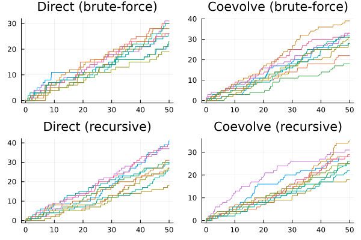

```julia
using JumpProcesses, Graphs, Statistics, BenchmarkTools, Plots
using OrdinaryDiffEq: Tsit5
fmt = :png
width_px, height_px = default(:size);
```


# Model and example solutions

Let a graph with ``V`` nodes, then the multivariate Hawkes process is characterized by ``V`` point processes such that the conditional intensity rate of node ``i`` connected to a set of nodes ``E_i`` in the graph is given by:
```math
  \lambda_i^\ast (t) = \lambda + \sum_{j \in E_i} \sum_{t_{n_j} < t} \alpha \exp \left[-\beta (t - t_{n_j}) \right]
```
This process is known as self-exciting, because the occurrence of an event ``j`` at ``t_{n_j}`` will increase the conditional intensity of all the processes connected to it by ``\alpha``. The excited intensity then decreases at a rate proportional to ``\beta``.

The conditional intensity of this process has a recursive formulation which can significantly speed the simulation. The recursive formulation for the univariate case is derived in Laub et al. [2]. We derive the compound case here. Let ``t_{N_i} = \max \{ t_{n_j} < t \mid j \in E_i \}`` and
```math
\begin{split}
  \phi_i^\ast (t)
    &= \sum_{j \in E_i} \sum_{t_{n_j} < t} \alpha \exp \left[-\beta (t - t_{N_i} + t_{N_i} - t_{n_j}) \right] \\
    &= \exp \left[ -\beta (t - t_{N_i}) \right] \sum_{j \in E_i} \sum_{t_{n_j} \leq t_{N_i}} \alpha \exp \left[-\beta (t_{N_i} - t_{n_j}) \right] \\
    &= \exp \left[ -\beta (t - t_{N_i}) \right] \left( \alpha + \phi^\ast (t_{N_i}) \right)
\end{split}
```
Then the conditional intensity can be re-written in terms of ``\phi_i^\ast (t_{N_i})``
```math
  \lambda_i^\ast (t) = \lambda + \phi_i^\ast (t) = \lambda + \exp \left[ -\beta (t - t_{N_i}) \right] \left( \alpha + \phi_i^\ast (t_{N_i}) \right)
```

In Julia, we define a factory for the conditional intensity ``\lambda_i`` which returns the brute-force or recursive versions of the intensity given node ``i`` and network ``g``.

```julia
function hawkes_rate(i::Int, g; use_recursion = false)

    @inline @inbounds function rate_recursion(u, p, t)
        λ, α, β, h, urate, ϕ = p
        urate[i] = λ + exp(-β*(t - h[i]))*ϕ[i]
        return urate[i]
    end

    @inline @inbounds function rate_brute(u, p, t)
        λ, α, β, h, urate = p
        x = zero(typeof(t))
        for j in g[i]
            for _t in reverse(h[j])
                ϕij = α * exp(-β * (t - _t))
                if ϕij ≈ 0
                    break
                end
                x += ϕij
            end
        end
        urate[i] = λ + x
        return urate[i]
    end

    if use_recursion
        return rate_recursion
    else
        return rate_brute
    end

end
```

```
hawkes_rate (generic function with 1 method)
```


Given the rate factory, we can create a jump factory which will create all the jumps in our model.

```julia
function hawkes_jump(i::Int, g; use_recursion = false)
    rate = hawkes_rate(i, g; use_recursion)
    urate = rate
    @inbounds rateinterval(u, p, t) = p[5][i] == p[1] ? typemax(t) : 2 / p[5][i]
    @inbounds lrate(u, p, t) = p[1]
    @inbounds function affect_recursion!(integrator)
        λ, α, β, h, _, ϕ  = integrator.p
        for j in g[i]
          ϕ[j] *= exp(-β*(integrator.t - h[j]))
          ϕ[j] += α
          h[j] = integrator.t
        end
        integrator.u[i] += 1
    end
    @inbounds function affect_brute!(integrator)
        push!(integrator.p[4][i], integrator.t)
        integrator.u[i] += 1
    end
    return VariableRateJump(
        rate,
        use_recursion ? affect_recursion! : affect_brute!;
        lrate,
        urate,
        rateinterval,
    )
end

function hawkes_jump(u, g; use_recursion = false)
    return [hawkes_jump(i, g; use_recursion) for i = 1:length(u)]
end
```

```
hawkes_jump (generic function with 2 methods)
```


We can then create a factory for Multivariate Hawkes `JumpProblem`s. We can define two types of `JumpProblem`s depending on the aggregator. The `Direct()` aggregator expects an `ODEProblem` since it cannot handle the `SSAStepper` with `VariableRateJump`s.


```julia
function f!(du, u, p, t)
    du .= 0
    nothing
end

function hawkes_problem(
    p,
    agg;
    u = [0.0],
    tspan = (0.0, 50.0),
    save_positions = (false, true),
    g = [[1]],
    use_recursion = false,
)
    oprob = ODEProblem(f!, u, tspan, p)
    jumps = hawkes_jump(u, g; use_recursion)
    jprob = JumpProblem(oprob, agg, jumps...; save_positions = save_positions)
    return jprob
end
```

```
hawkes_problem (generic function with 1 method)
```


The `Coevolve()` aggregator knows how to handle the `SSAStepper`, so it accepts a `DiscreteProblem`.

```julia
function hawkes_problem(
    p,
    agg::Coevolve;
    u = [0.0],
    tspan = (0.0, 50.0),
    save_positions = (false, true),
    g = [[1]],
    use_recursion = false,
)
    dprob = DiscreteProblem(u, tspan, p)
    jumps = hawkes_jump(u, g; use_recursion)
    jprob =
        JumpProblem(dprob, agg, jumps...; dep_graph = g, save_positions = save_positions)
    return jprob
end
```

```
hawkes_problem (generic function with 2 methods)
```


Lets solve the problems defined so far. We sample a random graph sampled from the Erdős-Rényi model. This model assumes that the probability of an edge between two nodes is independent of other edges, which we fix at ``0.2``. For illustration purposes, we fix ``V = 10``.

```julia
V = 10
G = erdos_renyi(V, 0.2, seed = 9103)
g = [neighbors(G, i) for i = 1:nv(G)]
```

```
10-element Vector{Vector{Int64}}:
 [4, 7]
 [8, 9]
 [4, 5]
 [1, 3]
 [3]
 []
 [1, 8, 9]
 [2, 7]
 [2, 7, 10]
 [9]
```


We fix the Hawkes parameters at ``\lambda = 0.5 , \alpha = 0.1 , \beta = 2.0`` which ensures the process does not explode.

```julia
tspan = (0.0, 50.0)
u = [0.0 for i = 1:nv(G)]
p = (0.5, 0.1, 2.0)
```

```
(0.5, 0.1, 2.0)
```


Now, we instantiate the problems, find their solutions and plot the results.


```julia
algorithms = Tuple{Any, Any, Bool, String}[
  (Direct(), Tsit5(), false, "Direct (brute-force)"),
  (Coevolve(), SSAStepper(), false, "Coevolve (brute-force)"),
  (Direct(), Tsit5(), true, "Direct (recursive)"),
  (Coevolve(), SSAStepper(), true, "Coevolve (recursive)"),
]

let fig = []
  for (i, (algo, stepper, use_recursion, label)) in enumerate(algorithms)
    @info label
    if use_recursion
        h = zeros(eltype(tspan), nv(G))
        urate = zeros(eltype(tspan), nv(G))
        ϕ = zeros(eltype(tspan), nv(G))
        _p = (p[1], p[2], p[3], h, ϕ, urate)
    else
        h = [eltype(tspan)[] for _ = 1:nv(G)]
        urate = zeros(eltype(tspan), nv(G))
        _p = (p[1], p[2], p[3], h, urate)
    end
    jump_prob = hawkes_problem(_p, algo; u, tspan, g, use_recursion)
    sol = solve(jump_prob, stepper)
    push!(fig, plot(sol.t, sol[1:V, :]', title=label, legend=false, format=fmt))
  end
  fig = plot(fig..., layout=(2,2), format=fmt, size=(width_px, 2*height_px/2))
end
```




## Alternative libraries

We benchmark `JumpProcesses.jl` against `PiecewiseDeterministicMarkovProcesses.jl` and Python `Tick` library.

In order to compare with the `PiecewiseDeterministicMarkovProcesses.jl`, we need to reformulate our jump problem as a Piecewise Deterministic Markov Process (PDMP). In this setting, we have two options.

The simple version only requires the conditional intensity. Like above, we define a brute-force and recursive approach. Following the library's specification we define the following functions.

```julia
function hawkes_rate_simple_recursion(rate, xc, xd, p, t, issum::Bool)
  λ, _, β, h, ϕ, g = p
  for i in 1:length(g)
    rate[i] = λ + exp(-β * (t - h[i])) * ϕ[i]
  end
  if issum
    return sum(rate)
  end
  return 0.0
end

function hawkes_rate_simple_brute(rate, xc, xd, p, t, issum::Bool)
  λ, α, β, h, g = p
  for i in 1:length(g)
    x = zero(typeof(t))
    for j in g[i]
        for _t in reverse(h[j])
            ϕij = α * exp(-β * (t - _t))
            if ϕij ≈ 0
                break
            end
            x += ϕij
        end
    end
    rate[i] = λ + x
  end
  if issum
    return sum(rate)
  end
  return 0.0
end

function hawkes_affect_simple_recursion!(xc, xd, p, t, i::Int64)
  _, α, β, h, ϕ, g = p
  for j in g[i]
      ϕ[j] *= exp(-β * (t - h[j]))
      ϕ[j] += α
      h[j] = t
  end
end

function hawkes_affect_simple_brute!(xc, xd, p, t, i::Int64)
  push!(p[4][i], t)
end
```

```
hawkes_affect_simple_brute! (generic function with 1 method)
```


Since this is a library for PDMP, we also need to define the ODE problem. In the simple version, we simply set it to zero.

```julia
function hawkes_drate_simple(dxc, xc, xd, p, t)
    dxc .= 0
end
```

```
hawkes_drate_simple (generic function with 1 method)
```


Next, we create a factory for the Multivariate Hawkes `PDMPCHVSimple` problem.

```julia
import LinearAlgebra: I
using PiecewiseDeterministicMarkovProcesses
const PDMP = PiecewiseDeterministicMarkovProcesses

struct PDMPCHVSimple end

function hawkes_problem(p,
                        agg::PDMPCHVSimple;
                        u = [0.0],
                        tspan = (0.0, 50.0),
                        save_positions = (false, true),
                        g = [[1]],
                        use_recursion = true)
    xd0 = Array{Int}(u)
    xc0 = copy(u)
    nu = one(eltype(xd0)) * I(length(xd0))
    if use_recursion
      jprob = PDMPProblem(hawkes_drate_simple, hawkes_rate_simple_recursion,
          hawkes_affect_simple_recursion!, nu, xc0, xd0, p, tspan)
    else
      jprob = PDMPProblem(hawkes_drate_simple, hawkes_rate_simple_brute,
          hawkes_affect_simple_brute!, nu, xc0, xd0, p, tspan)
    end
    return jprob
end

push!(algorithms, (PDMPCHVSimple(), CHV(Tsit5()), false, "PDMPCHVSimple (brute-force)"));
push!(algorithms, (PDMPCHVSimple(), CHV(Tsit5()), true, "PDMPCHVSimple (recursive)"));
```


The full version requires that we describe how the conditional intensity changes with time which we derive below:
```math
\begin{split}
  \frac{d \lambda_i^\ast (t)}{d t}
    &= -\beta \sum_{j \in E_i} \sum_{t_{n_j} < t} \alpha \exp \left[-\beta (t - t_{n_j}) \right] \\
    &= -\beta \left( \lambda_i^\ast (t) - \lambda \right)
\end{split}
```

```julia
function hawkes_drate_full(dxc, xc, xd, p, t)
    λ, α, β, _, _, g = p
    for i = 1:length(g)
        dxc[i] = -β * (xc[i] - λ)
    end
end
```

```
hawkes_drate_full (generic function with 1 method)
```


Next, we need to define the intensity rate and the jumps according to library's specification.

```julia
function hawkes_rate_full(rate, xc, xd, p, t, issum::Bool)
    λ, α, β, _, _, g = p
    if issum
        return sum(@view(xc[1:length(g)]))
    end
    rate[1:length(g)] .= @view xc[1:length(g)]
    return 0.0
end

function hawkes_affect_full!(xc, xd, p, t, i::Int64)
    λ, α, β, _, _, g = p
    for j in g[i]
        xc[i] += α
    end
end
```

```
hawkes_affect_full! (generic function with 1 method)
```


Finally, we create a factory for the Multivariate Hawkes `PDMPCHVFull` problem.

```julia
struct PDMPCHVFull end

function hawkes_problem(
    p,
    agg::PDMPCHVFull;
    u = [0.0],
    tspan = (0.0, 50.0),
    save_positions = (false, true),
    g = [[1]],
    use_recursion = true,
)
    xd0 = Array{Int}(u)
    xc0 = [p[1] for i = 1:length(u)]
    nu = one(eltype(xd0)) * I(length(xd0))
    jprob = PDMPProblem(hawkes_drate_full, hawkes_rate_full, hawkes_affect_full!, nu, xc0, xd0, p, tspan)
    return jprob
end

push!(algorithms, (PDMPCHVFull(), CHV(Tsit5()), true, "PDMPCHVFull"));
```


The Python `Tick` library can be accessed with the `PyCall.jl`. We install the required Python dependencies with `Conda.jl` and define a factory for the Multivariate Hawkes `PyTick` problem.

```julia
const BENCHMARK_PYTHON::Bool = tryparse(Bool, get(ENV, "SCIMLBENCHMARK_PYTHON", "true"))
const REBUILD_PYCALL::Bool = tryparse(Bool, get(ENV, "SCIMLBENCHMARK_REBUILD_PYCALL", "true"))

struct PyTick end

if BENCHMARK_PYTHON
  if REBUILD_PYCALL
    using Pkg, Conda

    # PyCall only works with Conda.ROOTENV
    # tick requires python=3.8
    Conda.add("python=3.8", Conda.ROOTENV)
    Conda.add("numpy", Conda.ROOTENV)
    Conda.pip_interop(true, Conda.ROOTENV)
    Conda.pip("install", "tick", Conda.ROOTENV)

    # rebuild PyCall to ensure it links to the python provided by Conda.jl
    ENV["PYTHON"] = ""
    Pkg.build("PyCall")
  end

  ENV["PYTHON"] = ""
  using PyCall
  @info "PyCall" PyCall.libpython PyCall.pyversion PyCall.conda

  function hawkes_problem(
      p,
      agg::PyTick;
      u = [0.0],
      tspan = (0.0, 50.0),
      save_positions = (false, true),
      g = [[1]],
      use_recursion = true,
  )
      λ, α, β = p
      SimuHawkesSumExpKernels = pyimport("tick.hawkes")[:SimuHawkesSumExpKernels]
      jprob = SimuHawkesSumExpKernels(
          baseline = fill(λ, length(u)),
          adjacency = [i in j ? α / β : 0.0 for j in g, i = 1:length(u), u = 1:1],
          decays = [β],
          end_time = tspan[2],
          verbose = false,
          force_simulation = true,
      )
      return jprob
  end

  push!(algorithms, (PyTick(), nothing, true, "PyTick"));
end
```

```
Channels:
 - conda-forge
Platform: linux-64
Collecting package metadata (repodata.json): ...working... done
Solving environment: ...working... failed
Error: failed process: Process(setenv(`/cache/julia-buildkite-plugin/depots
/5b300254-1738-4989-ae0a-f4d2d937f953/conda/3/x86_64/bin/conda install -q -
y python=3.8`,["DBUS_SESSION_BUS_ADDRESS=unix:path=/run/user/21581/bus", "B
UILDKITE_PULL_REQUEST_REPO=", "BUILDKITE_SOURCE=webhook", "BUILDKITE_PLUGIN
_COPPERMIND_INPUTS_0=benchmarks/Jumps", "BUILDKITE_GIT_CLONE_FLAGS=-v", "BU
ILDKITE_PLUGIN_CRYPTIC_BASE64_AGENT_PUBLIC_KEY_SECRET=LS0tLS1CRUdJTiBQVUJMS
UMgS0VZLS0tLS0KTUlJQklqQU5CZ2txaGtpRzl3MEJBUUVGQUFPQ0FROEFNSUlCQ2dLQ0FRRUF0
WHNKMzFGbTFKN29IYzlveGZaWQpKY3FxRk5yaXRMUUhxaDVJUHNGS3YySis1K1FVQkZNYURjMHI
3czZ3NDNSMDFobkVNT1lYNDAreUVDT3h5bHErClo3dHdxWlNxS2U1MThwc0RyeWRna0xJNzRnQU
VZWWNTZGdvTGt4YWpWNy9rb0hFTDgrczRKdFRVNUJ6d1RFdXAKTllTZGNQOFhQSmJLekY1RE5qd
WJmeFA5ZjdSN2x6SUx2NWl2Z2lxZTVtbUxGd1lwb0hTRVFVNXRlT09IQStLYwpjUDZ3K2d1Q0Vx
MUZFb0N2MDRyaTFXaWpVZXorMytEWVM4UCtROGRxMGJYUWZUS1Vyc0thMkdnLzVmZ0h5Z0R1CmR
HT2ZsdzUvVEljR3VVbGNsd1hZb2tTRkpSWUJFa2pUOXBCZ2JNNEcyL2tXNGFmZ3d4bHNuN3VsUW
5QNDZVLzEKZFFJREFRQUIKLS0tLS1FTkQgUFVCTElDIEtFWS0tLS0tCg==", "BUILDKITE_ENV
_FILE=/tmp/job-env-01948d8b-9d50-4213-988c-df9b2a12d5fa59504781", "BUILDKIT
E_BUILD_NUMBER=3119", "BUILDKITE_GIT_CLONE_MIRROR_FLAGS=-v", "BUILDKITE_AGE
NT_DEBUG=false", "BUILDKITE_AGENT_META_DATA_QUEUE=juliaecosystem", "BUILDKI
TE_PLUGINS_PATH=/etc/buildkite-agent/plugins", "BUILDKITE_COMMAND_EVAL=true
", "BUILDKITE_AGENT_META_DATA_SANDBOX_CAPABLE=true", "BUILDKITE_ORGANIZATIO
N_SLUG=julialang", "BUILDKITE_PLUGIN_COPPERMIND_INPUTS_1=src/**/*.jl", "BUI
LDKITE_PIPELINE_PROVIDER=github", "BUILDKITE_AGENT_EXPERIMENT=resolve-commi
t-after-checkout", "BUILDKITE_CONFIG_PATH=/etc/buildkite-agent/buildkite-ag
ent.cfg", "BUILDKITE_PIPELINE_TEAMS=sciml-full-access", "BUILDKITE_AGENT_ME
TA_DATA_CRYPTIC_CAPABLE=true", "BUILDKITE_AGENT_ACCESS_TOKEN=bkaj_eyJhbGciO
iJIUzUxMiJ9.eyJzdWIiOiIwMTk0OGQ4Yi05ZDUwLTQyMTMtOTg4Yy1kZjliMmExMmQ1ZmEiLCJ
hdWQiOiIwMTk0OGRiNi1hN2UxLTQxNWYtODcxYi1hODRmMDM5NzlhOWUiLCJpc3MiOiJidWlsZG
tpdGUiLCJleHAiOjE3MzgxNTI3NTYsImlhdCI6MTczNzU0NDM1Niwib3JnYW5pemF0aW9uX2lkI
joiZDQwOTgyM2MtNWZhNy00MWM4LTkwMzMtNzI2OWM1ZmRlNGYzIn0.iak80kBLgJPm8STf-e8C
grQsbKhLqCSf34kZz2lG1145z7TQqsASzmmNir-4_Lrbtyt7lusr-OoILgPvYRXnRw", "BUILD
KITE_PLUGIN_CRYPTIC_BASE64_SIGNED_JOB_ID_SECRET=NaOhkp6CvOqsYTsaDXbXsWZCege
pRFjhgb2+ydKOkT6Xv63BHiGDDZ0/xLiU1fZJ4pZ6XURYI05eWzkhdTXQDkU51tSYu/um6nZG8y
mRoSPsZfmQ+j2Po5/Bn7JgEJ+odKUO50rJp/dEKL2PeuSlPlCGH+zrMspw0ec2F9dN1a7PFuN+F
oPmHCPVgchW6XF8Kg5+G3bho6plqiGo+U8YSBrpjvWb+ZElf6LEb+3+LxI7nbfKaQefmPjl90fb
sC+SDLAn9eYmUMGRFqBkI3Ud6/IgdTOd0QpJcxL2Z61ZoWCqBguow1kYWKVkkzC/hL0HonXoSUw
Mxa3nVonp4jBo1w==", "BUILDKITE_PLUGIN_COPPERMIND_S3_PREFIX=s3://julialang-b
uildkite-artifacts/scimlbenchmarks", "BUILDKITE_BUILD_CREATOR_EMAIL=account
s@chrisrackauckas.com", "XKB_CONFIG_ROOT=/cache/julia-buildkite-plugin/depo
ts/5b300254-1738-4989-ae0a-f4d2d937f953/artifacts/f8b49c7c45b400e3f5c4002d1
9645d4b88712c0c/share/X11/xkb", "BUILDKITE_SSH_KEYSCAN=true", "BUILDKITE_PR
OJECT_SLUG=julialang/scimlbenchmarks-dot-jl", "BUILDKITE_INITIAL_JOB_ID=019
48d8b-4f0c-41a2-b3e6-cc08e43c5c98", "BUILDKITE_BIN_PATH=/usr/bin", "PWD=/ca
che/build/exclusive-amdci3-0/julialang/scimlbenchmarks-dot-jl", "GRDIR=/cac
he/julia-buildkite-plugin/depots/5b300254-1738-4989-ae0a-f4d2d937f953/artif
acts/cac6855585def46d7fa06ba4243521b00fa28a8d", "BUILDKITE_GIT_CHECKOUT_FLA
GS=-f", "BUILDKITE_COMPUTE_TYPE=self-hosted", "BUILDKITE_GIT_SUBMODULES=tru
e", "BUILDKITE_AGENT_META_DATA_OS=linux", "CI=true", "BUILDKITE_STEP_KEY=be
nchmark-benchmarks-Jumps", "BUILDKITE_STEP_IDENTIFIER=benchmark-benchmarks-
Jumps", "BUILDKITE_PLUGIN_COPPERMIND_OUTPUTS_0=markdown/**/figures/*.png", 
"CONDA_PREFIX=/cache/julia-buildkite-plugin/depots/5b300254-1738-4989-ae0a-
f4d2d937f953/conda/3/x86_64", "BUILDKITE_PLUGIN_COPPERMIND_INPUTS_2=./*.tom
l", "BUILDKITE_PLUGIN_COPPERMIND_OUTPUTS_3=markdown/**/*.svg", "BUILDKITE_A
GENT_PID=2", "BUILDKITE_LAST_HOOK_EXIT_STATUS=0", "BUILDKITE_AGENT_META_DAT
A_EXCLUSIVE=true", "BUILDKITE_PLUGIN_COPPERMIND_OUTPUTS_6=script/**/*.jl", 
"BUILDKITE_BUILD_CREATOR=Christopher Rackauckas", "BUILDKITE_REBUILT_FROM_B
UILD_ID=", "OPENBLAS_DEFAULT_NUM_THREADS=1", "BUILDKITE_BRANCH=master", "JU
LIA_DEPOT_PATH=/cache/julia-buildkite-plugin/depots/5b300254-1738-4989-ae0a
-f4d2d937f953", "BUILDKITE_PLUGIN_COPPERMIND_OUTPUTS_5=pdf/**/*.pdf", "BUIL
DKITE_AGENT_DEBUG_HTTP=false", "SHELL=/shells/bash", "BUILDKITE=true", "BUI
LDKITE_PLUGIN_CRYPTIC_PRIVILEGED=true", "BUILDKITE_HOOKS_PATH=/hooks", "BUI
LDKITE_PIPELINE_DEFAULT_BRANCH=master", "BUILDKITE_PLUGIN_NAME=COPPERMIND",
 "BUILDKITE_REBUILT_FROM_BUILD_NUMBER=", "HOME=/root", "BUILDKITE_PLUGIN_CO
PPERMIND_OUTPUTS_4=notebook/**/*.ipynb", "BUILDKITE_S3_DEFAULT_REGION=us-ea
st-1", "BUILDKITE_TRIGGERED_FROM_BUILD_PIPELINE_SLUG=", "BUILDKITE_BUILD_CH
ECKOUT_PATH=/cache/build/exclusive-amdci3-0/julialang/scimlbenchmarks-dot-j
l", "BUILDKITE_SCRIPT_PATH=# Clear out these secrets as they're not needed 
during the actual build\nBUILDKITE_S3_ACCESS_KEY_ID=\"\" BUILDKITE_S3_SECRE
T_ACCESS_KEY=\"\" ./.buildkite/build_benchmark.sh \"benchmarks/Jumps\"\n", 
"INVOCATION_ID=ed9a44182cac424599c57d13973a3cde", "BUILDKITE_PLUGIN_COPPERM
IND_OUTPUTS_2=markdown/**/*.pdf", "LANG=en_US.UTF-8", "BUILDKITE_PIPELINE_N
AME=SciMLBenchmarks.jl", "SHLVL=3", "XDG_RUNTIME_DIR=/run/user/21581", "OLD
PWD=/cache/julia-buildkite-plugin/depots/5b300254-1738-4989-ae0a-f4d2d937f9
53", "FONTCONFIG_FILE=/cache/julia-buildkite-plugin/depots/5b300254-1738-49
89-ae0a-f4d2d937f953/artifacts/bd752d7807f5f10e2dce3d2b2b683589fa03d31a/etc
/fonts/fonts.conf", "BUILDKITE_PLUGIN_CONFIGURATION={\"inputs\":[\"benchmar
ks/Jumps\",\"src/**/*.jl\",\"./*.toml\"],\"outputs\":[\"markdown/**/figures
/*.png\",\"markdown/**/*.md\",\"markdown/**/*.pdf\",\"markdown/**/*.svg\",\
"notebook/**/*.ipynb\",\"pdf/**/*.pdf\",\"script/**/*.jl\"],\"s3_prefix\":\
"s3://julialang-buildkite-artifacts/scimlbenchmarks\"}", "BUILDKITE_BUILD_P
ATH=/cache/build", "BUILDKITE_BUILD_AUTHOR_EMAIL=accounts@chrisrackauckas.c
om", "BUILDKITE_TIMEOUT=10080", "BUILDKITE_GIT_MIRRORS_PATH=/cache/repos", 
"BUILDKITE_STRICT_SINGLE_HOOKS=false", "BUILDKITE_LABEL=:hammer: benchmarks
/Jumps", "FONTCONFIG_PATH=/cache/julia-buildkite-plugin/depots/5b300254-173
8-4989-ae0a-f4d2d937f953/artifacts/bd752d7807f5f10e2dce3d2b2b683589fa03d31a
/etc/fonts", "JOURNAL_STREAM=8:667266937", "BUILDKITE_AGENT_META_DATA_SANDB
OX_JL=true", "BUILDKITE_BUILD_CREATOR_TEAMS=juliagpu-full-access:sciml-full
-access", "BUILDKITE_PROJECT_PROVIDER=github", "BUILDKITE_S3_SECRET_ACCESS_
KEY=", "GKS_USE_CAIRO_PNG=true", "BUILDKITE_REPO_MIRROR=/cache/repos/https-
--github-com-SciML-SciMLBenchmarks-jl-git", "GIT_TERMINAL_PROMPT=0", "BUILD
KITE_JOB_ID=01948d8b-9d50-4213-988c-df9b2a12d5fa", "SYSTEMD_EXEC_PID=923513
", "BUILDKITE_REDACTED_VARS=*_PASSWORD,*_SECRET,*_TOKEN,*_PRIVATE_KEY,*_ACC
ESS_KEY,*_SECRET_KEY,*_CONNECTION_STRING", "BUILDKITE_BUILD_AUTHOR=Christop
her Rackauckas", "USER=sabae", "GKSwstype=100", "BUILDKITE_REPO=https://git
hub.com/SciML/SciMLBenchmarks.jl.git", "BUILDKITE_GIT_FETCH_FLAGS=-v --prun
e --tags", "BUILDKITE_LOCAL_HOOKS_ENABLED=true", "MANAGERPID=7863", "BUILDK
ITE_S3_ACCESS_KEY_ID=", "BUILDKITE_GIT_MIRRORS_LOCK_TIMEOUT=300", "BUILDKIT
E_AGENT_ID=01948db6-a7e1-415f-871b-a84f03979a9e", "BUILDKITE_GIT_MIRRORS_SK
IP_UPDATE=false", "BUILDKITE_ARTIFACT_PATHS=", "BUILDKITE_BUILD_URL=https:/
/buildkite.com/julialang/scimlbenchmarks-dot-jl/builds/3119", "BUILDKITE_ME
SSAGE=Merge pull request #1115 from vyudu/egfr\n\nTesting JumpProcesses - E
GFR benchmark", "BUILDKITE_RETRY_COUNT=0", "LOGNAME=sabae", "JULIA_CPU_THRE
ADS=128", "BUILDKITE_PLUGIN_JULIA_CACHE_DIR=/cache/julia-buildkite-plugin",
 "BUILDKITE_PLUGIN_COPPERMIND_INPUT_HASH=3ba2386f3eae02e3ee81c8c48e1ebcdbf0
f3e613444fc4e53135d91b12a5cfbb", "BUILDKITE_PLUGIN_CRYPTIC_BASE64_AGENT_PRI
VATE_KEY_SECRET=LS0tLS1CRUdJTiBSU0EgUFJJVkFURSBLRVktLS0tLQpNSUlFcFFJQkFBS0N
BUUVBdFhzSjMxRm0xSjdvSGM5b3hmWllKY3FxRk5yaXRMUUhxaDVJUHNGS3YySis1K1FVCkJGTW
FEYzByN3M2dzQzUjAxaG5FTU9ZWDQwK3lFQ094eWxxK1o3dHdxWlNxS2U1MThwc0RyeWRna0xJN
zRnQUUKWVljU2Rnb0xreGFqVjcva29IRUw4K3M0SnRUVTVCendURXVwTllTZGNQOFhQSmJLekY1
RE5qdWJmeFA5ZjdSNwpseklMdjVpdmdpcWU1bW1MRndZcG9IU0VRVTV0ZU9PSEErS2NjUDZ3K2d
1Q0VxMUZFb0N2MDRyaTFXaWpVZXorCjMrRFlTOFArUThkcTBiWFFmVEtVcnNLYTJHZy81ZmdIeW
dEdWRHT2ZsdzUvVEljR3VVbGNsd1hZb2tTRkpSWUIKRWtqVDlwQmdiTTRHMi9rVzRhZmd3eGxzb
jd1bFFuUDQ2VS8xZFFJREFRQUJBb0lCQVFDTU5sVjRUbUlPWC8raQpHSDh3ZzVXekRSTy9MU1gr
eXlFbzFHQ282NW9lcDdDNDVNUjZXdUpFUzRKbjdSVkpoczVHSkg0cDhYdi9TYkdmCk9wVEFiTCt
6VVdSSUFPNC9tMWRSYTJhN1NzY1d4RDN6N0dOMkhtK3E5elBlSHAxd3pIZU5aZ29BR0htM3RyUU
0KMGpidUczN09OSG1YdGQ1MEYyVHo1TmcwN0hURkJwV3hMMjJwNm9aZzgyUEk0OXIrdUpWWmZ5M
U5HZVRnaFA4cgp2dVRVTVJIcldZa25YbUR1eDVSMHNIdDFoU2FvTXBFbSsrMWc1V09rSzZDTGFJ
bEV0ZitWVVBvR0piYlNYRzNJCmo5N1h5a3NGUDhGZ24wMWx4ZktGV1p4MXlnTVdsUm00SFNCTWV
kc1FpWStqeG5Sd3BtRnh5L2pIOVhFTUppT0wKQSsvVFdCbUJBb0dCQU52cXROQjRuVS9zODIxTU
9oalRPTmtFOGNJOENxV1BRRTZXcEFOYVY5UkVVcGVCZzhmMgpjTXg2VFMweE9EU0JRUk9PRnNEU
G9pc1E0VVRGQmFialBLTU41d2IzNFVKYmN4V0ZwcGlLUHJMa09Zdmtqb01VCkNSb1pKK05Lb253
RWh5bWJ0TG0yMHhmUUZCamY1R1QvMHJZUWcxUkN1OVllSmE0Z3NWYWtSNGh4QW9HQkFOTkIKMzh
xenJhTTBDeHhrSnZkVmlTY3g2MFowN2g4OHFISy9SV2dVK3ZZaitwZy9ibXBwMmdiUXZkYTJxaS
84UEl2OApSb0JwcmY2Y285TmdSa2JmY05xZmFnM1Z5SDhBNW1iUE1nK0s4YmFuKzlwU003WkREV
W1sdU03R3ZRSW5OVnBCCnBJcE1uWEk5eDZSSFlpOFF2MHhXOXcyUmpmS09TbElYZFlITjZwOUZB
b0dCQUp0NXdwMkVPRXR5VE9NZnVnOGsKL1pMSVlSY2VGYlRZb3ZFc3BRWE4wRHc4bFZ1UmNCWmx
6M2R3bTdGd2s3ampESndEbjJodklzcHBvNmxYMVZnWQpYUjAxemZocU5QSVI3em52QkVuaHF0UV
ViKzdNQmtqN1dEZ0FRdWY1TXdpVXR1NGVxOVdFUUpjY1A2a2FXTUZpCjc1aFI4bGNXMnU5VTN2V
E5Iak1QNzVheEFvR0JBSm5HdExsZlMwQ21USVF4SHZBaE1rSDJvMVZaSGxCY25oMVEKdjV3QTBh
RkVGVkNuczU4QVNEVjMwd2d0VlBxeTkvdkoraVBWU1ZNeUFFcUlKUC9IKytVWDcySDh3UUk1ekh
6Lwp5MmZtOHdYTGg1ZW5DSDllbFppTGFsZ1I4RmxWNHc4OUF5R3NuVnNnUDJlRWtxTEI1UTRUcT
ZnVDBLakVETE51CjRobEhvOGFsQW9HQUhBVGltTGRkS0JFTkN2MXZyNnZ0d3JCZGRCbWlGSWFwa
VcvMk5acWxCTFp1bEp6MEwzdCsKM3FvSUF0Uisxd2xpWkQwZGJnRGdVeVRMcnN5Y1RDSkZIczNI
ZTFXb3NCSzcxTmlncFZhWEVzWnFpOHNENjlvUQo2QkFnaEdvbnNGbTEydzhhRGNDdm92WUxLTlh
VV1BFT1c0akdvd2k0Tmx4NGZidHlkYXpIUEdnPQotLS0tLUVORCBSU0EgUFJJVkFURSBLRVktLS
0tLQo=", "BUILDKITE_PIPELINE_SLUG=scimlbenchmarks-dot-jl", "BUILDKITE_SHELL
=/bin/bash -e -c", "BUILDKITE_PLUGINS_ENABLED=true", "LANGUAGE=en_US", "GKS
_FONTPATH=/cache/julia-buildkite-plugin/depots/5b300254-1738-4989-ae0a-f4d2
d937f953/artifacts/cac6855585def46d7fa06ba4243521b00fa28a8d", "BUILDKITE_AG
ENT_NAME=exclusive-amdci3.0", "BUILDKITE_STEP_ID=01948d8b-9d26-4245-b7e4-1e
6633f5d19f", "BUILDKITE_PLUGIN_COPPERMIND_OUTPUTS_1=markdown/**/*.md", "BUI
LDKITE_TAG=", "OPENBLAS_MAIN_FREE=1", "PATH=/cache/julia-buildkite-plugin/j
ulia_installs/bin/linux/x64/1.10/julia-1.10-latest-linux-x86_64/bin:/usr/lo
cal/sbin:/usr/local/bin:/usr/sbin:/usr/bin:/sbin:/bin:/usr/games:/usr/local
/games:/snap/bin:/usr/bin:/usr/local/bin:/usr/bin:/bin", "GKS_ENCODING=utf8
", "BUILDKITE_AGENT_META_DATA_NUM_CPUS=128", "BUILDKITE_TRIGGERED_FROM_BUIL
D_NUMBER=", "BUILDKITE_AGENT_META_DATA_CONFIG_GITSHA=f1058577", "BUILDKITE_
COMMAND=# Clear out these secrets as they're not needed during the actual b
uild\nBUILDKITE_S3_ACCESS_KEY_ID=\"\" BUILDKITE_S3_SECRET_ACCESS_KEY=\"\" .
/.buildkite/build_benchmark.sh \"benchmarks/Jumps\"\n", "LIBDECOR_PLUGIN_DI
R=/cache/julia-buildkite-plugin/depots/5b300254-1738-4989-ae0a-f4d2d937f953
/artifacts/38e215c51e5c0f77bc7a8813ba4586632a8fc750/lib/libdecor/plugins-1"
, "BUILDKITE_PLUGIN_VALIDATION=false", "BUILDKITE_AGENT_META_DATA_ARCH=x86_
64", "CONDARC=/cache/julia-buildkite-plugin/depots/5b300254-1738-4989-ae0a-
f4d2d937f953/conda/3/x86_64/condarc-julia.yml", "FORCE_SANDBOX_MODE=unprivi
leged", "BUILDKITE_TRIGGERED_FROM_BUILD_ID=", "TERM=xterm-256color", "PYTHO
NIOENCODING=UTF-8", "BUILDKITE_PULL_REQUEST_BASE_BRANCH=", "BUILDKITE_PIPEL
INE_ID=5b300254-1738-4989-ae0a-f4d2d937f953", "_=/cache/julia-buildkite-plu
gin/julia_installs/bin/linux/x64/1.10/julia-1.10-latest-linux-x86_64/bin/ju
lia", "BUILDKITE_BUILD_ID=01948d8b-4f01-487a-a3b5-5fe7a3c6faa5", "BUILDKITE
_AGENT_ENDPOINT=https://agent.buildkite.com/v3", "BUILDKITE_PLUGINS=[{\"git
hub.com/staticfloat/cryptic-buildkite-plugin#v2\":{\"files\":[\".buildkite/
secrets/token.toml\"],\"variables\":[\"BUILDKITE_S3_ACCESS_KEY_ID=\\\"U2Fsd
GVkX1+x3xs1ZRRZRt3FmwFQmYYKnpV7o8xKkX5Ib6y0o5fv0+rskVAj+JKu\\\"\",\"BUILDKI
TE_S3_SECRET_ACCESS_KEY=\\\"U2FsdGVkX1+LWh1yX7LsMBlecEJLc08eJrgOhurhd47CY1/
jS3wCGVCQmS1t6f2j70spBoFdfc9kn2naj8HH5A==\\\"\",\"BUILDKITE_S3_DEFAULT_REGI
ON=\\\"U2FsdGVkX18ccoE9FmtkwsCm1x0MLMBlN/FLcAyKkY4=\\\"\"]}},{\"github.com/
JuliaCI/julia-buildkite-plugin#v1\":{\"version\":\"1.10\"}},{\"github.com/s
taticfloat/sandbox-buildkite-plugin\":{\"gid\":1000,\"uid\":1000,\"rootfs_u
rl\":\"https://github.com/thazhemadam/openmodelica-rootfs-image/releases/do
wnload/v1.23.0/rootfs-openmodelica-v1.23.0.amd64.tar.gz\",\"workspaces\":[\
"/cache/julia-buildkite-plugin:/cache/julia-buildkite-plugin\"],\"rootfs_tr
eehash\":\"82970243dc4f188e599a976abc20951f4aba2912\"}},{\"github.com/stati
cfloat/coppermind-buildkite-plugin#v1\":{\"inputs\":[\"benchmarks/Jumps\",\
"src/**/*.jl\",\"./*.toml\"],\"outputs\":[\"markdown/**/figures/*.png\",\"m
arkdown/**/*.md\",\"markdown/**/*.pdf\",\"markdown/**/*.svg\",\"notebook/**
/*.ipynb\",\"pdf/**/*.pdf\",\"script/**/*.jl\"],\"s3_prefix\":\"s3://julial
ang-buildkite-artifacts/scimlbenchmarks\"}}]", "BUILDKITE_SOCKETS_PATH=/roo
t/.buildkite-agent/sockets", "SANDBOX_PERSISTENCE_DIR=/cache/sandbox_persis
tence", "BUILDKITE_GIT_CLEAN_FLAGS=-ffxdq", "BUILDKITE_COMMIT=d44f9459eeac4
6f1151a3bfaba382886676e6690", "BUILDKITE_PULL_REQUEST=false", "BUILDKITE_OR
GANIZATION_ID=d409823c-5fa7-41c8-9033-7269c5fde4f3", "GKS_QT=env LD_LIBRARY
_PATH=/cache/julia-buildkite-plugin/depots/5b300254-1738-4989-ae0a-f4d2d937
f953/artifacts/f839432e3d2904a5c847b217ef0c0f489377ecc5/lib:/cache/julia-bu
ildkite-plugin/depots/5b300254-1738-4989-ae0a-f4d2d937f953/artifacts/5acd76
6faaca59c3c1f3cfa67e2bf6dcf1e3e883/lib:/cache/julia-buildkite-plugin/depots
/5b300254-1738-4989-ae0a-f4d2d937f953/artifacts/08ab7db13fbc32076a77781b2f8
bd372cf4c9a8d/lib:/cache/julia-buildkite-plugin/julia_installs/bin/linux/x6
4/1.10/julia-1.10-latest-linux-x86_64/bin/../lib/julia:/cache/julia-buildki
te-plugin/depots/5b300254-1738-4989-ae0a-f4d2d937f953/artifacts/0ccc8805e50
47cf9fbd848c4f7d4c15715aad7c9/lib:/cache/julia-buildkite-plugin/depots/5b30
0254-1738-4989-ae0a-f4d2d937f953/artifacts/dc526f26fb179a3f68eb13fcbe5d2d2a
5aa7eeac/lib:/cache/julia-buildkite-plugin/depots/5b300254-1738-4989-ae0a-f
4d2d937f953/artifacts/812bb7cf607c01b79ab9407ffed3a3e924c1af83/lib:/cache/j
ulia-buildkite-plugin/depots/5b300254-1738-4989-ae0a-f4d2d937f953/artifacts
/6d8a1f48d4b47dc03fa048d88680be84ae15e5fc/lib:/cache/julia-buildkite-plugin
/depots/5b300254-1738-4989-ae0a-f4d2d937f953/artifacts/b3ddd583e7aec92a77cf
5961fad01fd7063c1d40/lib:/cache/julia-buildkite-plugin/depots/5b300254-1738
-4989-ae0a-f4d2d937f953/artifacts/494c807a751dcd5c5f898d9954115592fcb3e955/
lib:/cache/julia-buildkite-plugin/depots/5b300254-1738-4989-ae0a-f4d2d937f9
53/artifacts/a0f4f1441f9fabbc6b0c3a1bf38bfa415fce0bab/lib:/cache/julia-buil
dkite-plugin/depots/5b300254-1738-4989-ae0a-f4d2d937f953/artifacts/2b18d04d
0b7fdaa8e5ddbf432b44048a3571f05b/lib:/cache/julia-buildkite-plugin/depots/5
b300254-1738-4989-ae0a-f4d2d937f953/artifacts/96bc7b9ddb319d1a051535c85184a
a2bf42dbd8b/lib:/cache/julia-buildkite-plugin/depots/5b300254-1738-4989-ae0
a-f4d2d937f953/artifacts/bd752d7807f5f10e2dce3d2b2b683589fa03d31a/lib:/cach
e/julia-buildkite-plugin/depots/5b300254-1738-4989-ae0a-f4d2d937f953/artifa
cts/0a1006d282bce91b5cd408c714cbb95d3bb4f515/lib:/cache/julia-buildkite-plu
gin/depots/5b300254-1738-4989-ae0a-f4d2d937f953/artifacts/59eff635528e6914e
1a96db241e950195574903b/lib:/cache/julia-buildkite-plugin/depots/5b300254-1
738-4989-ae0a-f4d2d937f953/artifacts/2bb2b0081086bcb24e6bd287b7416b6b61d856
a3/lib:/cache/julia-buildkite-plugin/depots/5b300254-1738-4989-ae0a-f4d2d93
7f953/artifacts/d632a0145c0b967e10f0612438e65bf33ce26882/lib:/cache/julia-b
uildkite-plugin/depots/5b300254-1738-4989-ae0a-f4d2d937f953/artifacts/2b9ac
56bc0585f3b03cd92f988f0d07c6ab12822/lib:/cache/julia-buildkite-plugin/depot
s/5b300254-1738-4989-ae0a-f4d2d937f953/artifacts/8223b86c51229362d4689de6a5
127d0b80ea77bd/lib:/cache/julia-buildkite-plugin/depots/5b300254-1738-4989-
ae0a-f4d2d937f953/artifacts/e2512e1cd411449b9bede7b4294c7409c9973345/lib:/c
ache/julia-buildkite-plugin/depots/5b300254-1738-4989-ae0a-f4d2d937f953/art
ifacts/d4f3ff9736df0dda120f8dc1d27174b0d5696fb1/lib:/cache/julia-buildkite-
plugin/depots/5b300254-1738-4989-ae0a-f4d2d937f953/artifacts/b8a470e4553346
122607f94ec60d83c77f061cd6/lib:/cache/julia-buildkite-plugin/depots/5b30025
4-1738-4989-ae0a-f4d2d937f953/artifacts/eb13375496c29fe52101a0e6710c54ff87a
a0e20/lib:/cache/julia-buildkite-plugin/depots/5b300254-1738-4989-ae0a-f4d2
d937f953/artifacts/3ded11a619b50414af902abd0a7a5bb6426b5b92/lib:/cache/juli
a-buildkite-plugin/depots/5b300254-1738-4989-ae0a-f4d2d937f953/artifacts/bd
1f25e7053ebc00ee7d82f3c5ec4cf1e9a51e17/lib:/cache/julia-buildkite-plugin/de
pots/5b300254-1738-4989-ae0a-f4d2d937f953/artifacts/cf5d5f8a6109be3f9c460a3
9768f57a3e53ff11d/lib:/cache/julia-buildkite-plugin/depots/5b300254-1738-49
89-ae0a-f4d2d937f953/artifacts/c8a20a2030f10b70947d8d2a6bff7f8b5f343fe9/lib
:/cache/julia-buildkite-plugin/depots/5b300254-1738-4989-ae0a-f4d2d937f953/
artifacts/0631e2a6a31b5692eec7a575836451b16b734ec0/lib:/cache/julia-buildki
te-plugin/depots/5b300254-1738-4989-ae0a-f4d2d937f953/artifacts/4abd0521d21
0cb9e48ea5e711873ba34dc05fc70/lib:/cache/julia-buildkite-plugin/depots/5b30
0254-1738-4989-ae0a-f4d2d937f953/artifacts/0b5269206a6849e48487ed04136c30b1
f12443e7/lib:/cache/julia-buildkite-plugin/depots/5b300254-1738-4989-ae0a-f
4d2d937f953/artifacts/587de110e5f58fd435dc35b294df31bb7a75f692/lib:/cache/j
ulia-buildkite-plugin/depots/5b300254-1738-4989-ae0a-f4d2d937f953/artifacts
/fc239b3ff5739aeab252bd154fa4dd045fefe629/lib:/cache/julia-buildkite-plugin
/depots/5b300254-1738-4989-ae0a-f4d2d937f953/artifacts/c951fb23b5652def1dea
483af7095a38f3b3cefd/lib:/cache/julia-buildkite-plugin/depots/5b300254-1738
-4989-ae0a-f4d2d937f953/artifacts/85dab0a3f6b9cc2e5d61165ee376bf46260812a4/
lib:/cache/julia-buildkite-plugin/depots/5b300254-1738-4989-ae0a-f4d2d937f9
53/artifacts/5b83972689fb7dea5e89326f1c0ba60d68e962fb/lib:/cache/julia-buil
dkite-plugin/depots/5b300254-1738-4989-ae0a-f4d2d937f953/artifacts/66340992
0d88c928b764932f501919306eb3a558/lib:/cache/julia-buildkite-plugin/depots/5
b300254-1738-4989-ae0a-f4d2d937f953/artifacts/a7c26f0f974654c19a165fb76317f
44001aa0a29/lib:/cache/julia-buildkite-plugin/depots/5b300254-1738-4989-ae0
a-f4d2d937f953/artifacts/ab035e8b0b866b38237e59b109fbea663bf2a846/lib:/cach
e/julia-buildkite-plugin/depots/5b300254-1738-4989-ae0a-f4d2d937f953/artifa
cts/951960aa7e4599865406f432151003dd82cde65d/lib:/cache/julia-buildkite-plu
gin/depots/5b300254-1738-4989-ae0a-f4d2d937f953/artifacts/ac4708c3ef4040501
4c1080c17818cfa7d017563/lib:/cache/julia-buildkite-plugin/depots/5b300254-1
738-4989-ae0a-f4d2d937f953/artifacts/a58c60683d9991d236f2a2d707edcc09974ca6
2b/lib:/cache/julia-buildkite-plugin/depots/5b300254-1738-4989-ae0a-f4d2d93
7f953/artifacts/38e215c51e5c0f77bc7a8813ba4586632a8fc750/lib:/cache/julia-b
uildkite-plugin/depots/5b300254-1738-4989-ae0a-f4d2d937f953/artifacts/b9b76
2dad2f49b75527e933ac66eea5af4cc8a30/lib:/cache/julia-buildkite-plugin/depot
s/5b300254-1738-4989-ae0a-f4d2d937f953/artifacts/4667462ed75b7b8e3a82c128fb
1bfc71edbc2f39/lib:/cache/julia-buildkite-plugin/depots/5b300254-1738-4989-
ae0a-f4d2d937f953/artifacts/50f053314e373517d1763bb91d3520bc7a5e665d/lib:/c
ache/julia-buildkite-plugin/depots/5b300254-1738-4989-ae0a-f4d2d937f953/art
ifacts/b91557c233ebb402f9a2c3f8dec9573990211818/lib:/cache/julia-buildkite-
plugin/depots/5b300254-1738-4989-ae0a-f4d2d937f953/artifacts/f2af068a5dffc0
225d3e1e01e896cd11792ecfe0/lib:/cache/julia-buildkite-plugin/depots/5b30025
4-1738-4989-ae0a-f4d2d937f953/artifacts/55f9376d5c77106b4813c4fb45a6b37a77d
4d823/lib:/cache/julia-buildkite-plugin/depots/5b300254-1738-4989-ae0a-f4d2
d937f953/artifacts/d03aca19e34a4289ab7f118cf0b212ca46eb49be/lib:/cache/juli
a-buildkite-plugin/depots/5b300254-1738-4989-ae0a-f4d2d937f953/artifacts/e3
e8d2abb72b0145ee6de4b7be33e5a5c67e5f59/lib:/cache/julia-buildkite-plugin/de
pots/5b300254-1738-4989-ae0a-f4d2d937f953/artifacts/f04f41a07edc6a87194afc6
b58e284f94924d43a/lib:/cache/julia-buildkite-plugin/depots/5b300254-1738-49
89-ae0a-f4d2d937f953/artifacts/f7ee295b548ab3df8b28b6d67cd65b5eeef8dad1/lib
:/cache/julia-buildkite-plugin/depots/5b300254-1738-4989-ae0a-f4d2d937f953/
artifacts/21ed7b5e888fb9b18f44ba3f4652f14d8beda78c/lib:/cache/julia-buildki
te-plugin/depots/5b300254-1738-4989-ae0a-f4d2d937f953/artifacts/872754c2f79
5d19a3e2e205b2bbaea659f28d11e/lib:/cache/julia-buildkite-plugin/depots/5b30
0254-1738-4989-ae0a-f4d2d937f953/artifacts/7da37be2742b3d1cfe1c14bf5bbd85ae
d4887f46/lib:/cache/julia-buildkite-plugin/depots/5b300254-1738-4989-ae0a-f
4d2d937f953/artifacts/c35cb3f6f3043a4e962fd56b61ad91b4adb557f7/lib:/cache/j
ulia-buildkite-plugin/depots/5b300254-1738-4989-ae0a-f4d2d937f953/artifacts
/13befbe35cffe7da192c7001ece18b4be3aa3720/lib:/cache/julia-buildkite-plugin
/depots/5b300254-1738-4989-ae0a-f4d2d937f953/artifacts/cacd8c147f866d6672e1
aca9bb01fb919a81e96a/lib:/cache/julia-buildkite-plugin/depots/5b300254-1738
-4989-ae0a-f4d2d937f953/artifacts/b7dc5dce963737414a564aca8d4b82ee388f4fa1/
lib:/cache/julia-buildkite-plugin/depots/5b300254-1738-4989-ae0a-f4d2d937f9
53/artifacts/0d364e900393f710a03a5bafe2852d76e4d2c2cd/lib:/cache/julia-buil
dkite-plugin/depots/5b300254-1738-4989-ae0a-f4d2d937f953/artifacts/1a2adcee
7d99fea18ead33c350332626b262e29a/lib:/cache/julia-buildkite-plugin/depots/5
b300254-1738-4989-ae0a-f4d2d937f953/artifacts/40eea58ff37ecc8fb6f21f41079a3
3b511b3ff92/lib:/cache/julia-buildkite-plugin/depots/5b300254-1738-4989-ae0
a-f4d2d937f953/artifacts/79cc5446ced978de84b6e673e01da0ebfdd6e4a5/lib:/cach
e/julia-buildkite-plugin/depots/5b300254-1738-4989-ae0a-f4d2d937f953/artifa
cts/fce445d991cf502908d681348eec2174c5e31ba8/lib:/cache/julia-buildkite-plu
gin/depots/5b300254-1738-4989-ae0a-f4d2d937f953/artifacts/b0d2538004dda9eb6
449b72b0b85703aeac30a66/lib:/cache/julia-buildkite-plugin/depots/5b300254-1
738-4989-ae0a-f4d2d937f953/artifacts/f03dd5ac03468009d5a99bbfcdf336c2dc372d
e4/lib:/cache/julia-buildkite-plugin/depots/5b300254-1738-4989-ae0a-f4d2d93
7f953/artifacts/eae77862e95d04dfafb9fbe9ae39e688b35d756a/lib:/cache/julia-b
uildkite-plugin/depots/5b300254-1738-4989-ae0a-f4d2d937f953/artifacts/cac68
55585def46d7fa06ba4243521b00fa28a8d/lib:/cache/julia-buildkite-plugin/julia
_installs/bin/linux/x64/1.10/julia-1.10-latest-linux-x86_64/bin/../lib/juli
a:/cache/julia-buildkite-plugin/julia_installs/bin/linux/x64/1.10/julia-1.1
0-latest-linux-x86_64/bin/../lib /cache/julia-buildkite-plugin/depots/5b300
254-1738-4989-ae0a-f4d2d937f953/artifacts/cac6855585def46d7fa06ba4243521b00
fa28a8d/bin/gksqt"]), ProcessExited(1)) [1]
```


Now, we instantiate the problems, find their solutions and plot the results.

```julia
let fig = []
  for (i, (algo, stepper, use_recursion, label)) in enumerate(algorithms[5:end])
    @info label
    if algo isa PyTick
        _p = (p[1], p[2], p[3])
        jump_prob = hawkes_problem(_p, algo; u, tspan, g, use_recursion)
        jump_prob.reset()
        jump_prob.simulate()
        t = tspan[1]:0.1:tspan[2]
        N = [[sum(jumps .< _t) for _t in t] for jumps in jump_prob.timestamps]
        push!(fig, plot(t, N, title=label, legend=false, format=fmt))
    elseif algo isa PDMPCHVSimple
        if use_recursion
          h = zeros(eltype(tspan), nv(G))
          ϕ = zeros(eltype(tspan), nv(G))
          _p = (p[1], p[2], p[3], h, ϕ, g)
        else
          h = [eltype(tspan)[] for _ in 1:nv(G)]
          _p = (p[1], p[2], p[3], h, g)
        end
        jump_prob = hawkes_problem(_p, algo; u, tspan, g, use_recursion)
        sol = solve(jump_prob, stepper)
        push!(fig, plot(sol.time, sol.xd[1:V, :]', title=label, legend=false, format=fmt))
    elseif algo isa PDMPCHVFull
        _p = (p[1], p[2], p[3], nothing, nothing, g)
        jump_prob = hawkes_problem(_p, algo; u, tspan, g, use_recursion)
        sol = solve(jump_prob, stepper)
        push!(fig, plot(sol.time, sol.xd[1:V, :]', title=label, legend=false, format=fmt))
    end
  end
  fig = plot(fig..., layout=(2,2), format=fmt, size=(width_px, 2*height_px/2))
end
```


# Correctness: QQ-Plots

We check that the algorithms produce correct simulation by inspecting their QQ-plots. Point process theory says that transforming the simulated points using the compensator should produce points whose inter-arrival duration is distributed according to the exponential distribution (see Section 7.4 [1]).

The compensator of any point process is the integral of the conditional intensity ``\Lambda_i^\ast(t) = \int_0^t \lambda_i^\ast(u) du``. The compensator for the Multivariate Hawkes process is defined below.
```math
    \Lambda_i^\ast(t) = \lambda t + \frac{\alpha}{\beta} \sum_{j \in E_i} \sum_{t_{n_j} < t} ( 1 - \exp \left[-\beta (t - t_{n_j}) \right])
```

```julia
function hawkes_Λ(i::Int, g, p)
    @inline @inbounds function Λ(t, h)
        λ, α, β = p
        x = λ * t
        for j in g[i]
            for _t in h[j]
                if _t >= t
                    break
                end
                x += (α / β) * (1 - exp(-β * (t - _t)))
            end
        end
        return x
    end
    return Λ
end

function hawkes_Λ(g, p)
    return [hawkes_Λ(i, g, p) for i = 1:length(g)]
end

Λ = hawkes_Λ(g, p)
```

```
10-element Vector{Main.var"##WeaveSandBox#225".var"#Λ#33"{Int64, Vector{Vec
tor{Int64}}, Tuple{Float64, Float64, Float64}}}:
 (::Main.var"##WeaveSandBox#225".var"#Λ#33"{Int64, Vector{Vector{Int64}}, T
uple{Float64, Float64, Float64}}) (generic function with 1 method)
 (::Main.var"##WeaveSandBox#225".var"#Λ#33"{Int64, Vector{Vector{Int64}}, T
uple{Float64, Float64, Float64}}) (generic function with 1 method)
 (::Main.var"##WeaveSandBox#225".var"#Λ#33"{Int64, Vector{Vector{Int64}}, T
uple{Float64, Float64, Float64}}) (generic function with 1 method)
 (::Main.var"##WeaveSandBox#225".var"#Λ#33"{Int64, Vector{Vector{Int64}}, T
uple{Float64, Float64, Float64}}) (generic function with 1 method)
 (::Main.var"##WeaveSandBox#225".var"#Λ#33"{Int64, Vector{Vector{Int64}}, T
uple{Float64, Float64, Float64}}) (generic function with 1 method)
 (::Main.var"##WeaveSandBox#225".var"#Λ#33"{Int64, Vector{Vector{Int64}}, T
uple{Float64, Float64, Float64}}) (generic function with 1 method)
 (::Main.var"##WeaveSandBox#225".var"#Λ#33"{Int64, Vector{Vector{Int64}}, T
uple{Float64, Float64, Float64}}) (generic function with 1 method)
 (::Main.var"##WeaveSandBox#225".var"#Λ#33"{Int64, Vector{Vector{Int64}}, T
uple{Float64, Float64, Float64}}) (generic function with 1 method)
 (::Main.var"##WeaveSandBox#225".var"#Λ#33"{Int64, Vector{Vector{Int64}}, T
uple{Float64, Float64, Float64}}) (generic function with 1 method)
 (::Main.var"##WeaveSandBox#225".var"#Λ#33"{Int64, Vector{Vector{Int64}}, T
uple{Float64, Float64, Float64}}) (generic function with 1 method)
```


We need a method for extracting the history from a simulation run. Below, we define such functions for each type of algorithm.

```julia
"""
Given an ODE solution `sol`, recover the timestamp in which events occurred. It
returns a vector with the history of each process in `sol`.

It assumes that `JumpProblem` was initialized with `save_positions` equal to
`(true, false)`, `(false, true)` or `(true, true)` such the system's state is
saved before and/or after the jump occurs; and, that `sol.u` is a
non-decreasing series that counts the total number of events observed as a
function of time.
"""
function histories(u, t)
    _u = permutedims(reduce(hcat, u))
    k = size(_u)[2]
    # computes a mask that show when total counts change
    mask = cat(fill(0.0, 1, k), _u[2:end, :] .- _u[1:end-1, :], dims = 1) .≈ 1
    h = Vector{typeof(t)}(undef, k)
    @inbounds for i = 1:k
        h[i] = t[mask[:, i]]
    end
    return h
end

function histories(sol::S) where {S<:ODESolution}
    # get u and permute the dimensions to get a matrix n x k with n obsevations and k processes.
    if sol.u[1] isa ExtendedJumpArray
        u = map((u) -> u.u, sol.u)
    else
        u = sol.u
    end
    return histories(u, sol.t)
end

function histories(sol::S) where {S<:PDMP.PDMPResult}
    return histories(sol.xd.u, sol.time)
end

function histories(sols)
    map(histories, sols)
end
```

```
histories (generic function with 4 methods)
```


We also need to compute the quantiles of the empirical distribution given a history of events `hs`, the compensator `Λ` and the target quantiles `quant`.

```julia
import Distributions: Exponential

"""
Computes the empirical and expected quantiles given a history of events `hs`,
the compensator `Λ` and the target quantiles `quant`.

The history `hs` is a vector with the history of each process. Alternatively,
the function also takes a vector of histories containing the histories from
multiple runs.

The compensator `Λ` can either be an homogeneous compensator function that
equally applies to all the processes in `hs`. Alternatively, it accepts a
vector of compensator that applies to each process.
"""
function qq(hs, Λ, quant = 0.01:0.01:0.99)
    _hs = apply_Λ(hs, Λ)
    T = typeof(hs[1][1][1])
    Δs = Vector{Vector{T}}(undef, length(hs[1]))
    for k = 1:length(Δs)
        _Δs = Vector{Vector{T}}(undef, length(hs))
        for i = 1:length(_Δs)
            _Δs[i] = _hs[i][k][2:end] .- _hs[i][k][1:end-1]
        end
        Δs[k] = reduce(vcat, _Δs)
    end
    empirical_quant = map((_Δs) -> quantile(_Δs, quant), Δs)
    expected_quant = quantile(Exponential(1.0), quant)
    return empirical_quant, expected_quant
end

"""
Compute the compensator `Λ` value for each timestamp recorded in history `hs`.

The history `hs` is a vector with the history of each process. Alternatively,
the function also takes a vector of histories containing the histories from
multiple runs.

The compensator `Λ` can either be an homogeneous compensator function that
equally applies to all the processes in `hs`. Alternatively, it accepts a
vector of compensator that applies to each process.
"""
function apply_Λ(hs::V, Λ) where {V<:Vector{<:Number}}
    _hs = similar(hs)
    @inbounds for n = 1:length(hs)
        _hs[n] = Λ(hs[n], hs)
    end
    return _hs
end

function apply_Λ(k::Int, hs::V, Λ::A) where {V<:Vector{<:Vector{<:Number}},A<:Array}
    @inbounds hsk = hs[k]
    @inbounds Λk = Λ[k]
    _hs = similar(hsk)
    @inbounds for n = 1:length(hsk)
        _hs[n] = Λk(hsk[n], hs)
    end
    return _hs
end

function apply_Λ(hs::V, Λ) where {V<:Vector{<:Vector{<:Number}}}
    _hs = similar(hs)
    @inbounds for k = 1:length(_hs)
        _hs[k] = apply_Λ(hs[k], Λ)
    end
    return _hs
end

function apply_Λ(hs::V, Λ::A) where {V<:Vector{<:Vector{<:Number}},A<:Array}
    _hs = similar(hs)
    @inbounds for k = 1:length(_hs)
        _hs[k] = apply_Λ(k, hs, Λ)
    end
    return _hs
end

function apply_Λ(hs::V, Λ) where {V<:Vector{<:Vector{<:Vector{<:Number}}}}
    return map((_hs) -> apply_Λ(_hs, Λ), hs)
end
```

```
apply_Λ (generic function with 5 methods)
```


We can construct QQ-plots with a Plot recipe as following.

```julia
@userplot QQPlot
@recipe function f(x::QQPlot)
    empirical_quant, expected_quant = x.args
    max_empirical_quant = maximum(maximum, empirical_quant)
    max_expected_quant = maximum(expected_quant)
    upperlim = ceil(maximum([max_empirical_quant, max_expected_quant]))
    @series begin
        seriestype := :line
        linecolor := :lightgray
        label --> ""
        (x) -> x
    end
    @series begin
        seriestype := :scatter
        aspect_ratio := :equal
        xlims := (0.0, upperlim)
        ylims := (0.0, upperlim)
        xaxis --> "Expected"
        yaxis --> "Empirical"
        markerstrokewidth --> 0
        markerstrokealpha --> 0
        markersize --> 1.5
        size --> (400, 500)
        label --> permutedims(["quantiles $i" for i = 1:length(empirical_quant)])
        expected_quant, empirical_quant
    end
end
```


Now, we simulate all of the algorithms we defined in the previous Section ``250`` times to produce their QQ-plots.

```julia
let fig = []
    for (i, (algo, stepper, use_recursion, label)) in enumerate(algorithms)
        @info label
        if algo isa PyTick
            _p = (p[1], p[2], p[3])
        elseif algo isa PDMPCHVSimple
            if use_recursion
                h = zeros(eltype(tspan), nv(G))
                ϕ = zeros(eltype(tspan), nv(G))
                _p = (p[1], p[2], p[3], h, ϕ, g)
            else
                h = [eltype(tspan)[] for _ in 1:nv(G)]
                _p = (p[1], p[2], p[3], h, g)
            end
        elseif algo isa PDMPCHVFull
            _p = (p[1], p[2], p[3], nothing, nothing, g)
        else
            if use_recursion
                h = zeros(eltype(tspan), nv(G))
                ϕ = zeros(eltype(tspan), nv(G))
                urate = zeros(eltype(tspan), nv(G))
                _p = (p[1], p[2], p[3], h, urate, ϕ)
            else
                h = [eltype(tspan)[] for _ = 1:nv(G)]
                urate = zeros(eltype(tspan), nv(G))
                _p = (p[1], p[2], p[3], h, urate)
            end
        end
        jump_prob = hawkes_problem(_p, algo; u, tspan, g, use_recursion)
        runs = Vector{Vector{Vector{Number}}}(undef, 250)
        for n = 1:length(runs)
            if algo isa PyTick
                jump_prob.reset()
                jump_prob.simulate()
                runs[n] = jump_prob.timestamps
            else
                if ~(algo isa PDMPCHVFull)
                    if use_recursion
                        h .= 0
                        ϕ .= 0
                    else
                        for _h in h empty!(_h) end
                    end
                    if ~(algo isa PDMPCHVSimple)
                        urate .= 0
                    end
                end
                runs[n] = histories(solve(jump_prob, stepper))
            end
        end
        qqs = qq(runs, Λ)
        push!(fig, qqplot(qqs..., legend = false, aspect_ratio = :equal, title=label, fmt=fmt))
    end
    fig = plot(fig..., layout = (4, 2), fmt=fmt, size=(width_px, 4*height_px/2))
end
```


# Benchmarking performance

In this Section we benchmark all the algorithms introduced in the first Section.

We generate networks in the range from ``1`` to ``95`` nodes and simulate the Multivariate Hawkes process ``25`` units of time.

 and simulate models in the range from ``1`` to ``95`` nodes for ``25`` units of time. We fix the Hawkes parameters at ``\lambda = 0.5 , \alpha = 0.1 , \beta = 5.0`` which ensures the process does not explode. We simulate ``50`` trajectories with a limit of ten seconds to complete execution for each configuration.

```julia
tspan = (0.0, 25.0)
p = (0.5, 0.1, 5.0)
Vs = append!([1], 5:5:95)
Gs = [erdos_renyi(V, 0.2, seed = 6221) for V in Vs]

bs = Vector{Vector{BenchmarkTools.Trial}}()

for (algo, stepper, use_recursion, label) in algorithms
    @info label
    global _stepper = stepper
    push!(bs, Vector{BenchmarkTools.Trial}())
    _bs = bs[end]
    for (i, G) in enumerate(Gs)
        local g = [neighbors(G, i) for i = 1:nv(G)]
        local u = [0.0 for i = 1:nv(G)]
        if algo isa PyTick
            _p = (p[1], p[2], p[3])
        elseif algo isa PDMPCHVSimple
            if use_recursion
              global h = zeros(eltype(tspan), nv(G))
              global ϕ = zeros(eltype(tspan), nv(G))
              _p = (p[1], p[2], p[3], h, ϕ, g)
            else
              global h = [eltype(tspan)[] for _ in 1:nv(G)]
              _p = (p[1], p[2], p[3], h, g)
            end
        elseif algo isa PDMPCHVFull
            _p = (p[1], p[2], p[3], nothing, nothing, g)
        else
            if use_recursion
                global h = zeros(eltype(tspan), nv(G))
                global urate = zeros(eltype(tspan), nv(G))
                global ϕ = zeros(eltype(tspan), nv(G))
                _p = (p[1], p[2], p[3], h, urate, ϕ)
            else
                global h = [eltype(tspan)[] for _ = 1:nv(G)]
                global urate = zeros(eltype(tspan), nv(G))
                _p = (p[1], p[2], p[3], h, urate)
            end
        end
        global jump_prob = hawkes_problem(_p, algo; u, tspan, g, use_recursion)
        trial = try
            if algo isa PyTick
                @benchmark(
                    jump_prob.simulate(),
                    setup = (jump_prob.reset()),
                    samples = 50,
                    evals = 1,
                    seconds = 10,
                )
            else
                if algo isa PDMPCHVFull
                    @benchmark(
                        solve(jump_prob, _stepper),
                        setup = (),
                        samples = 50,
                        evals = 1,
                        seconds = 10,
                    )
                elseif algo isa PDMPCHVSimple
                    if use_recursion
                        @benchmark(solve(jump_prob, _stepper),
                                   setup=(h .= 0; ϕ .= 0),
                                   samples=50,
                                   evals=1,
                                   seconds=10,)
                    else
                        @benchmark(solve(jump_prob, _stepper),
                                   setup=([empty!(_h) for _h in h]),
                                   samples=50,
                                   evals=1,
                                   seconds=10,)
                    end
                else
                    if use_recursion
                        @benchmark(
                            solve(jump_prob, _stepper),
                            setup = (h .= 0; urate .= 0; ϕ .= 0),
                            samples = 50,
                            evals = 1,
                            seconds = 10,
                        )
                    else
                        @benchmark(
                            solve(jump_prob, _stepper),
                            setup = ([empty!(_h) for _h in h]; urate .= 0),
                            samples = 50,
                            evals = 1,
                            seconds = 10,
                        )
                    end
                end
            end
        catch e
            BenchmarkTools.Trial(
                BenchmarkTools.Parameters(samples = 50, evals = 1, seconds = 10),
            )
        end
        push!(_bs, trial)
        if (nv(G) == 1 || nv(G) % 10 == 0)
            median_time =
                length(trial) > 0 ? "$(BenchmarkTools.prettytime(median(trial.times)))" :
                "nan"
            println("algo=$(label), V = $(nv(G)), length = $(length(trial.times)), median time = $median_time")
        end
    end
end
```

```
algo=Direct (brute-force), V = 1, length = 50, median time = 91.014 μs
algo=Direct (brute-force), V = 10, length = 50, median time = 10.653 ms
algo=Direct (brute-force), V = 20, length = 50, median time = 87.156 ms
algo=Direct (brute-force), V = 30, length = 36, median time = 277.982 ms
algo=Direct (brute-force), V = 40, length = 7, median time = 1.638 s
algo=Direct (brute-force), V = 50, length = 4, median time = 3.061 s
algo=Direct (brute-force), V = 60, length = 2, median time = 5.864 s
algo=Direct (brute-force), V = 70, length = 2, median time = 9.722 s
algo=Direct (brute-force), V = 80, length = 1, median time = 13.729 s
algo=Direct (brute-force), V = 90, length = 1, median time = 24.593 s
algo=Coevolve (brute-force), V = 1, length = 50, median time = 4.770 μs
algo=Coevolve (brute-force), V = 10, length = 50, median time = 208.828 μs
algo=Coevolve (brute-force), V = 20, length = 50, median time = 1.387 ms
algo=Coevolve (brute-force), V = 30, length = 50, median time = 3.331 ms
algo=Coevolve (brute-force), V = 40, length = 50, median time = 8.497 ms
algo=Coevolve (brute-force), V = 50, length = 50, median time = 17.334 ms
algo=Coevolve (brute-force), V = 60, length = 50, median time = 30.987 ms
algo=Coevolve (brute-force), V = 70, length = 50, median time = 52.492 ms
algo=Coevolve (brute-force), V = 80, length = 50, median time = 77.400 ms
algo=Coevolve (brute-force), V = 90, length = 50, median time = 125.731 ms
algo=Direct (recursive), V = 1, length = 50, median time = 90.249 μs
algo=Direct (recursive), V = 10, length = 50, median time = 4.807 ms
algo=Direct (recursive), V = 20, length = 50, median time = 22.666 ms
algo=Direct (recursive), V = 30, length = 50, median time = 75.103 ms
algo=Direct (recursive), V = 40, length = 11, median time = 930.458 ms
algo=Direct (recursive), V = 50, length = 6, median time = 1.823 s
algo=Direct (recursive), V = 60, length = 4, median time = 2.990 s
algo=Direct (recursive), V = 70, length = 2, median time = 5.203 s
algo=Direct (recursive), V = 80, length = 2, median time = 7.991 s
algo=Direct (recursive), V = 90, length = 1, median time = 11.201 s
algo=Coevolve (recursive), V = 1, length = 50, median time = 4.975 μs
algo=Coevolve (recursive), V = 10, length = 50, median time = 73.200 μs
algo=Coevolve (recursive), V = 20, length = 50, median time = 247.934 μs
algo=Coevolve (recursive), V = 30, length = 50, median time = 470.967 μs
algo=Coevolve (recursive), V = 40, length = 50, median time = 858.394 μs
algo=Coevolve (recursive), V = 50, length = 50, median time = 1.412 ms
algo=Coevolve (recursive), V = 60, length = 50, median time = 2.196 ms
algo=Coevolve (recursive), V = 70, length = 50, median time = 3.052 ms
algo=Coevolve (recursive), V = 80, length = 50, median time = 4.014 ms
algo=Coevolve (recursive), V = 90, length = 50, median time = 5.317 ms
algo=PDMPCHVSimple (brute-force), V = 1, length = 50, median time = 68.734 
μs
algo=PDMPCHVSimple (brute-force), V = 10, length = 50, median time = 4.959 
ms
algo=PDMPCHVSimple (brute-force), V = 20, length = 50, median time = 39.322
 ms
algo=PDMPCHVSimple (brute-force), V = 30, length = 50, median time = 112.71
4 ms
algo=PDMPCHVSimple (brute-force), V = 40, length = 35, median time = 288.63
0 ms
algo=PDMPCHVSimple (brute-force), V = 50, length = 18, median time = 579.25
9 ms
algo=PDMPCHVSimple (brute-force), V = 60, length = 10, median time = 1.095 
s
algo=PDMPCHVSimple (brute-force), V = 70, length = 6, median time = 1.730 s
algo=PDMPCHVSimple (brute-force), V = 80, length = 4, median time = 2.841 s
algo=PDMPCHVSimple (brute-force), V = 90, length = 3, median time = 4.446 s
algo=PDMPCHVSimple (recursive), V = 1, length = 50, median time = 67.910 μs
algo=PDMPCHVSimple (recursive), V = 10, length = 50, median time = 350.838 
μs
algo=PDMPCHVSimple (recursive), V = 20, length = 50, median time = 824.585 
μs
algo=PDMPCHVSimple (recursive), V = 30, length = 50, median time = 1.570 ms
algo=PDMPCHVSimple (recursive), V = 40, length = 50, median time = 2.472 ms
algo=PDMPCHVSimple (recursive), V = 50, length = 50, median time = 3.665 ms
algo=PDMPCHVSimple (recursive), V = 60, length = 50, median time = 5.236 ms
algo=PDMPCHVSimple (recursive), V = 70, length = 50, median time = 7.116 ms
algo=PDMPCHVSimple (recursive), V = 80, length = 50, median time = 9.477 ms
algo=PDMPCHVSimple (recursive), V = 90, length = 50, median time = 12.203 m
s
algo=PDMPCHVFull, V = 1, length = 50, median time = 66.635 μs
algo=PDMPCHVFull, V = 10, length = 50, median time = 486.906 μs
algo=PDMPCHVFull, V = 20, length = 50, median time = 758.091 μs
algo=PDMPCHVFull, V = 30, length = 50, median time = 1.210 ms
algo=PDMPCHVFull, V = 40, length = 50, median time = 1.523 ms
algo=PDMPCHVFull, V = 50, length = 50, median time = 1.897 ms
algo=PDMPCHVFull, V = 60, length = 50, median time = 2.504 ms
algo=PDMPCHVFull, V = 70, length = 50, median time = 2.996 ms
algo=PDMPCHVFull, V = 80, length = 50, median time = 3.597 ms
algo=PDMPCHVFull, V = 90, length = 50, median time = 4.419 ms
```


```julia
let fig = plot(
        yscale = :log10,
        xlabel = "V",
        ylabel = "Time (ns)",
        legend_position = :outertopright,
)
    for (i, (algo, stepper, use_recursion, label)) in enumerate(algorithms)
        _bs, _Vs = [], []
        for (j, b) in enumerate(bs[i])
            if length(b) == 50
                push!(_bs, median(b.times))
                push!(_Vs, Vs[j])
            end
        end
        plot!(_Vs, _bs, label=label)
    end
    title!("Simulations, 50 samples: nodes × time")
end
```


# References

[1] D. J. Daley and D. Vere-Jones. An Introduction to the Theory of Point Processes: Volume I: Elementary Theory and Methods. Probability and Its Applications, An Introduction to the Theory of Point Processes. Springer-Verlag, 2 edition. doi:10.1007/b97277.

[2] Patrick J. Laub, Young Lee, and Thomas Taimre. The Elements of Hawkes Processes. Springer International Publishing. doi:10.1007/978-3-030-84639-8.
