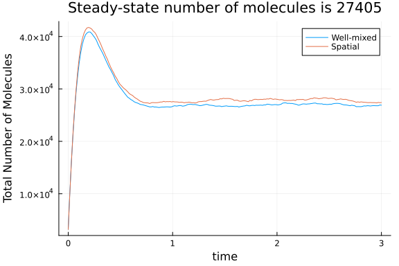
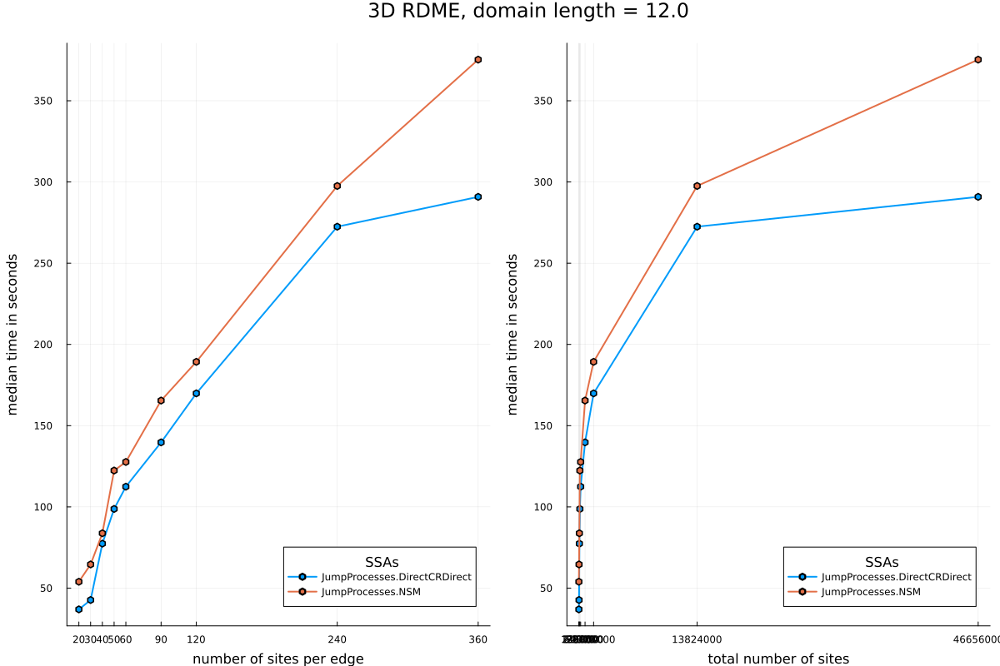
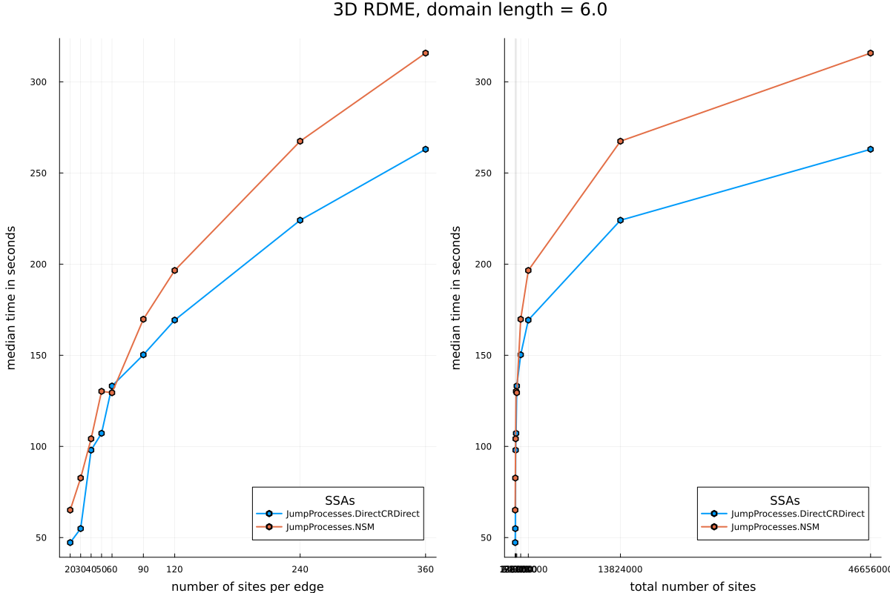

```julia
using Catalyst, JumpProcesses, BenchmarkTools, Plots, Random
using SymbolicIndexingInterface: parameter_values
```


# Model description and setup

Here we implement the model from [^1] (8 species and 12 reactions) for different
mesh sizes, and benchmark the performance of JumpProcesses.jl's spatial
stochastic simulation algorithms (SSAs). Below, the value `N` will denote the
number of subvolumes along one dimension of a cubic grid, representing the
reaction volume. In [^1] this value ranges from 20 to 60.

We first define some helper functions to convert concentration units into number
units, as needed for spatial SSAs.

```julia
invmicromolar_to_cubicmicrometer(invconcen) = invconcen / (6.02214076e2)
micromolar_to_invcubicmicrometer(concen) = (6.02214076e2) * concen
```

```
micromolar_to_invcubicmicrometer (generic function with 1 method)
```


Next we create a well-mixed model with the desired chemistry

```julia
rn = @reaction_network begin
    @parameters k₁ ka kd k₄
    k₁, EA --> EA + A
    k₁, EB --> EB + B
    (ka, kd), EA + B <--> EAB
    (ka, kd), EAB + B <--> EAB₂
    (ka, kd), EB + A <--> EBA
    (ka, kd), EBA + A <--> EBA₂
    k₄, A --> ∅
    k₄, B --> ∅
end
```

```
Model ##ReactionSystem#234:
Unknowns (8): see unknowns(##ReactionSystem#234)
  EA(t)
  A(t)
  EB(t)
  B(t)
  ⋮
Parameters (4): see parameters(##ReactionSystem#234)
  k₁
  ka
  kd
  k₄
```


Let's next make a function to calculate the spatial transport rates, mesh/graph
that will represent our domain, and initial condition. We use a cubic lattice of
size `N` by `N` by `N` with reflecting boundary conditions

```julia
# domain_len is the physical length of each side of the cubic domain
# units should be in μm (6.0 or 12.0 in Sanft)
# D is the diffusivity in units of (μm)^2 s⁻¹
function transport_model(rn, N; domain_len = 6.0, D = 1.0, rng = Random.default_rng())
    # topology
    h = domain_len / N
    dims = (N, N, N)
    num_nodes = prod(dims)

    # Cartesian grid with reflecting BC at boundaries
    grid = CartesianGrid(dims)

    # Cartesian grid hopping rate to neighbors
    hopping_rate = D / h^2

    # this indicates we have a uniform rate of D/h^2 along each edge at each site
    hopping_constants = hopping_rate * ones(numspecies(rn))

    # figure out the indices of species EA and EB
    @unpack EA, EB = rn
    EAidx = findfirst(isequal(EA), species(rn))
    EBidx = findfirst(isequal(EB), species(rn))

    # spatial initial condition
    # initial concentration of 12.3 nM = 12.3 * 1e-3 μM
    num_molecules = trunc(Int, micromolar_to_invcubicmicrometer(12.3*1e-3) * (domain_len^3))
    u0 = zeros(Int, 8, num_nodes)
    rand_EA = rand(rng, 1:num_nodes, num_molecules)
    rand_EB = rand(rng, 1:num_nodes, num_molecules)
    for i in 1:num_molecules
        u0[EAidx, rand_EA[i]] += 1
        u0[EBidx, rand_EB[i]] += 1
    end

    grid, hopping_constants, h, u0
end
```

```
transport_model (generic function with 1 method)
```


Finally, let's make a function to setup the well-mixed model from the reaction
model in a cube of side length `h`:

```julia
function wellmixed_model(rn, u0, end_time, h)
    kaval = invmicromolar_to_cubicmicrometer(46.2) / h^3
    parameters = [:k₁ => 150, :ka => kaval, :kd => 3.82, :k₄ => 6.0]

    # well-mixed initial condition corresponding to the spatial initial condition
    u0wm = species(rn) .=> vec(sum(u0, dims = 2))
    jprobwm = JumpProblem(
        rn, u0wm, (0.0, end_time), parameters;
        aggregator = Direct(), save_positions = (false, false)
    )
    majumps = jprobwm.massaction_jump
    return majumps, parameter_values(jprobwm), jprobwm, u0wm
end
```

```
wellmixed_model (generic function with 1 method)
```


# Model Solution

Let's look at one example to check our model seems reasonable. We'll plot the
total number of molecules in the system to verify we get around 28,000
molecules, as reported in Sanft [^1], when using a domain length of 6 μm.

```julia
end_time = 3.0
grid, hopping_constants, h, u0 = transport_model(rn, 60)
majumps, parameters_wm, jprobwm, u0wm = wellmixed_model(rn, u0, end_time, 6.0)
sol = solve(jprobwm, SSAStepper(); saveat = end_time/200)
Ntot = [sum(u) for u in sol.u]
plt = plot(sol.t, Ntot, label = "Well-mixed", ylabel = "Total Number of Molecules",
    xlabel = "time")

# spatial model
majumps, parameters_wm, jprobwm, u0wm = wellmixed_model(rn, u0, end_time, h)
dprob = DiscreteProblem(u0, (0.0, end_time), copy(parameters_wm))
jprob = JumpProblem(dprob, DirectCRDirect(), majumps; hopping_constants,
    spatial_system = grid, save_positions = (false, false))
spatial_sol = solve(jprob, SSAStepper(); saveat = end_time/200)
Ntot = [sum(vec(u)) for u in spatial_sol.u]
plot!(plt, spatial_sol.t, Ntot, label = "Spatial",
    title = "Steady-state number of molecules is $(Ntot[end])")
```




# Benchmarking performance of the methods

We can now run the solvers and record the performance with `BenchmarkTools`.
Let's first create a `DiscreteCallback` to terminate simulations once we reach
`10^8` events:

```julia
Base.@kwdef mutable struct EventCallback
    n::Int = 0
end

function (ecb::EventCallback)(u, t, integ)
    ecb.n += 1
    ecb.n == 10^8
end

function (ecb::EventCallback)(integ)
    # save the final state
    terminate!(integ)
    nothing
end
```


We next create a function to run and return our benchmarking results.

```julia
function benchmark_and_save!(bench_dict, end_times, Nv, algs, domain_len)
    @assert length(end_times) == length(Nv)

    # callback for terminating simulations
    ecb = EventCallback()
    cb = DiscreteCallback(ecb, ecb)

    for (end_time, N) in zip(end_times, Nv)
        names = ["$s"[1:(end - 2)] for s in algs]

        grid, hopping_constants, h, u0 = transport_model(rn, N; domain_len)

        # we create a well-mixed model within a domain of the size of *one* voxel, h
        majumps, parameters_wm, jprobwm, u0wm = wellmixed_model(rn, u0, end_time, h)

        # the spatial problem
        dprob = DiscreteProblem(u0, (0.0, end_time), copy(parameters_wm))

        @show N

        # benchmarking and saving
        benchmarks = Vector{BenchmarkTools.Trial}(undef, length(algs))

        # callback for terminating simulations

        for (i, alg) in enumerate(algs)
            name = names[i]
            println("benchmarking $name")
            jp = JumpProblem(dprob, alg, majumps, hopping_constants = hopping_constants,
                spatial_system = grid, save_positions = (false, false))
            b = @benchmarkable solve($jp, SSAStepper(); saveat = $(dprob.tspan[2]), callback) setup=(callback=deepcopy($cb)) samples=3 seconds=300
            bench_dict[name, N] = run(b)
        end
    end
end
```

```
benchmark_and_save! (generic function with 1 method)
```


Finally, let's make a function to plot the benchmarking data.

```julia
function fetch_and_plot(bench_dict, domain_len)
    names = unique([key[1] for key in keys(bench_dict)])
    Nv = sort(unique([key[2] for key in keys(bench_dict)]))

    plt1 = plot()
    plt2 = plot()

    medtimes = [Float64[] for i in 1:length(names)]
    for (i, name) in enumerate(names)
        for N in Nv
            try
                push!(medtimes[i], median(bench_dict[name, N]).time/1e9)
            catch
                break
            end
        end
        len = length(medtimes[i])
        plot!(plt1, Nv[1:len], medtimes[i], marker = :hex, label = name, lw = 2)
        plot!(plt2, (Nv .^ 3)[1:len], medtimes[i], marker = :hex, label = name, lw = 2)
    end

    plot!(plt1, xlabel = "number of sites per edge", ylabel = "median time in seconds",
        xticks = Nv, legend = :bottomright)
    plot!(plt2, xlabel = "total number of sites", ylabel = "median time in seconds",
        xticks = (Nv .^ 3, string.(Nv .^ 3)), legend = :bottomright)
    plot(plt1, plt2; size = (1200, 800), legendtitle = "SSAs",
        plot_title = "3D RDME, domain length = $domain_len", left_margin = 5Plots.mm)
end
```

```
fetch_and_plot (generic function with 1 method)
```


We are now ready to run the benchmarks and plot the results. We start with a
domain length of `12` μm, analogous to Fig. 6 in [^1]:

```julia
bench_dict = Dict{Tuple{String, Int}, BenchmarkTools.Trial}()
algs = [NSM(), DirectCRDirect()]
Nv = [20, 30, 40, 50, 60, 90, 120, 240, 360]
end_times = 20000.0 * ones(length(Nv))
domain_len = 12.0
benchmark_and_save!(bench_dict, end_times, Nv, algs, domain_len)
```

```
N = 20
benchmarking JumpProcesses.NSM
benchmarking JumpProcesses.DirectCRDirect
N = 30
benchmarking JumpProcesses.NSM
benchmarking JumpProcesses.DirectCRDirect
N = 40
benchmarking JumpProcesses.NSM
benchmarking JumpProcesses.DirectCRDirect
N = 50
benchmarking JumpProcesses.NSM
benchmarking JumpProcesses.DirectCRDirect
N = 60
benchmarking JumpProcesses.NSM
benchmarking JumpProcesses.DirectCRDirect
N = 90
benchmarking JumpProcesses.NSM
benchmarking JumpProcesses.DirectCRDirect
N = 120
benchmarking JumpProcesses.NSM
benchmarking JumpProcesses.DirectCRDirect
N = 240
benchmarking JumpProcesses.NSM
benchmarking JumpProcesses.DirectCRDirect
N = 360
benchmarking JumpProcesses.NSM
benchmarking JumpProcesses.DirectCRDirect
```


```julia
plt=fetch_and_plot(bench_dict, domain_len)
```




We next consider a domain of length `6` μm, analogous to Fig. 7 in [^1].

```julia
bench_dict = Dict{Tuple{String, Int}, BenchmarkTools.Trial}()
domain_len = 6.0
benchmark_and_save!(bench_dict, end_times, Nv, algs, domain_len)
```

```
N = 20
benchmarking JumpProcesses.NSM
benchmarking JumpProcesses.DirectCRDirect
N = 30
benchmarking JumpProcesses.NSM
benchmarking JumpProcesses.DirectCRDirect
N = 40
benchmarking JumpProcesses.NSM
benchmarking JumpProcesses.DirectCRDirect
N = 50
benchmarking JumpProcesses.NSM
benchmarking JumpProcesses.DirectCRDirect
N = 60
benchmarking JumpProcesses.NSM
benchmarking JumpProcesses.DirectCRDirect
N = 90
benchmarking JumpProcesses.NSM
benchmarking JumpProcesses.DirectCRDirect
N = 120
benchmarking JumpProcesses.NSM
benchmarking JumpProcesses.DirectCRDirect
N = 240
benchmarking JumpProcesses.NSM
benchmarking JumpProcesses.DirectCRDirect
N = 360
benchmarking JumpProcesses.NSM
benchmarking JumpProcesses.DirectCRDirect
```


```julia
plt=fetch_and_plot(bench_dict, domain_len)
```




# References

[^1]: Sanft, Kevin R and Othmer, Hans G. *Constant-complexity stochastic simulation algorithm with optimal binning*. J. Chem. Phys., 143(7), 11 pp. (2015).

## Appendix

These benchmarks are a part of the SciMLBenchmarks.jl repository, found at: [https://github.com/SciML/SciMLBenchmarks.jl](https://github.com/SciML/SciMLBenchmarks.jl). For more information on high-performance scientific machine learning, check out the SciML Open Source Software Organization [https://sciml.ai](https://sciml.ai).

To locally run this benchmark, do the following commands:

```
using SciMLBenchmarks
SciMLBenchmarks.weave_file("benchmarks/Jumps","Spatial_Signaling_Sanft.jmd")
```

Computer Information:

```
Julia Version 1.10.9
Commit 5595d20a287 (2025-03-10 12:51 UTC)
Build Info:
  Official https://julialang.org/ release
Platform Info:
  OS: Linux (x86_64-linux-gnu)
  CPU: 128 × AMD EPYC 7502 32-Core Processor
  WORD_SIZE: 64
  LIBM: libopenlibm
  LLVM: libLLVM-15.0.7 (ORCJIT, znver2)
Threads: 128 default, 0 interactive, 64 GC (on 128 virtual cores)
Environment:
  JULIA_LOAD_PATH = @:/home/crackauc/sandbox/tmp_20260825_180339_53321/jumps-refresh:@stdlib
  JULIA_PKG_PRECOMPILE_AUTO = 0

```

Package Information:

```
Status `~/sandbox/tmp_20260825_180339_53321/jumps-refresh/benchmarks/Jumps/Project.toml`
  [6e4b80f9] BenchmarkTools v1.8.0
  [479239e8] Catalyst v16.4.0
  [8f4d0f93] Conda v1.10.3
  [a93c6f00] DataFrames v1.8.2
  [0c46a032] DifferentialEquations v8.1.1
  [31c24e10] Distributions v0.25.131
  [86223c79] Graphs v1.14.0
  [faf0f6d7] JumpProblemLibrary v2.0.3
⌃ [ccbc3e58] JumpProcesses v9.30.1
  [961ee093] ModelingToolkit v11.40.0
  [1dea7af3] OrdinaryDiffEq v7.8.1
  [86206cdf] PiecewiseDeterministicMarkovProcesses v0.0.12
  [91a5bcdd] Plots v1.41.7
  [438e738f] PyCall v1.96.4
  [b4db0fb7] ReactionNetworkImporters v1.5.0
⌃ [31c91b34] SciMLBenchmarks v0.1.3
  [860ef19b] StableRNGs v1.0.4
  [f3b207a7] StatsPlots v0.15.8
  [c3572dad] Sundials v6.6.0
  [2efcf032] SymbolicIndexingInterface v0.3.55
  [37e2e46d] LinearAlgebra
  [9a3f8284] Random
  [10745b16] Statistics v1.10.0
Info Packages marked with ⌃ have new versions available and may be upgradable.
```

And the full manifest:

```
Status `~/sandbox/tmp_20260825_180339_53321/jumps-refresh/benchmarks/Jumps/Manifest.toml`
  [47edcb42] ADTypes v1.24.0
  [14f7f29c] AMD v0.5.3
  [621f4979] AbstractFFTs v1.5.0
  [6e696c72] AbstractPlutoDingetjes v1.4.0
  [1520ce14] AbstractTrees v0.4.5
  [7d9f7c33] Accessors v0.1.45
  [79e6a3ab] Adapt v4.7.0
  [66dad0bd] AliasTables v1.1.3
  [ec485272] ArnoldiMethod v0.4.0
  [7d9fca2a] Arpack v0.5.4
  [4fba245c] ArrayInterface v7.30.0
  [4c555306] ArrayLayouts v1.12.2
  [13072b0f] AxisAlgorithms v1.1.0
  [aae01518] BandedMatrices v1.12.0
  [6e4b80f9] BenchmarkTools v1.8.0
  [e2ed5e7c] Bijections v0.2.2
  [b2a6c25c] BinaryHeaps v1.1.0
  [caf10ac8] BipartiteGraphs v0.1.12
  [8e7c35d0] BlockArrays v1.10.0
  [70df07ce] BracketingNonlinearSolve v1.12.6
  [fa961155] CEnum v0.5.0
  [479239e8] Catalyst v16.4.0
  [d360d2e6] ChainRulesCore v1.26.1
  [aaaa29a8] Clustering v0.15.8
  [35d6a980] ColorSchemes v3.31.0
  [3da002f7] ColorTypes v0.12.1
  [c3611d14] ColorVectorSpace v0.11.0
  [5ae59095] Colors v0.13.1
⌅ [861a8166] Combinatorics v1.0.2
  [38540f10] CommonSolve v0.2.14
  [bbf7d656] CommonSubexpressions v0.3.1
  [f70d9fcc] CommonWorldInvalidations v1.2.0
  [34da2185] Compat v4.18.1
  [b152e2b5] CompositeTypes v0.1.4
  [a33af91c] CompositionsBase v0.1.2
  [2569d6c7] ConcreteStructs v0.2.8
  [8f4d0f93] Conda v1.10.3
  [187b0558] ConstructionBase v1.6.0
  [d38c429a] Contour v0.6.3
  [a8cc5b0e] Crayons v4.2.0
  [9a962f9c] DataAPI v1.16.0
  [a93c6f00] DataFrames v1.8.2
  [864edb3b] DataStructures v0.19.6
  [e2d170a0] DataValueInterfaces v1.0.0
  [8bb1440f] DelimitedFiles v1.9.1
⌃ [2b5f629d] DiffEqBase v7.19.0
  [459566f4] DiffEqCallbacks v4.19.3
  [163ba53b] DiffResults v1.1.0
  [b552c78f] DiffRules v1.16.0
  [0c46a032] DifferentialEquations v8.1.1
  [a0c0ee7d] DifferentiationInterface v0.7.21
  [8d63f2c5] DispatchDoctor v0.4.28
  [b4f34e82] Distances v0.10.12
  [31c24e10] Distributions v0.25.131
  [ffbed154] DocStringExtensions v0.9.5
  [5b8099bc] DomainSets v0.8.1
  [7c1d4256] DynamicPolynomials v0.6.7
  [06fc5a27] DynamicQuantities v1.13.0
  [4e289a0a] EnumX v1.0.7
  [f151be2c] EnzymeCore v0.8.21
  [e2ba6199] ExprTools v0.1.11
  [55351af7] ExproniconLite v0.10.14
  [c87230d0] FFMPEG v0.4.5
  [b86e33f2] FFTA v0.3.1
  [7034ab61] FastBroadcast v1.4.0
  [9aa1b823] FastClosures v0.3.2
  [a4df4552] FastPower v1.5.0
  [1a297f60] FillArrays v1.17.0
  [64ca27bc] FindFirstFunctions v3.2.1
  [6a86dc24] FiniteDiff v2.33.0
⌅ [53c48c17] FixedPointNumbers v0.8.6
  [1fa38f19] Format v1.3.7
  [f6369f11] ForwardDiff v1.4.5
  [a85aefff] FunctionMaps v0.1.2
  [069b7b12] FunctionWrappers v1.1.3
  [77dc65aa] FunctionWrappersWrappers v1.13.0
  [46192b85] GPUArraysCore v0.2.0
  [28b8d3ca] GR v0.73.27
  [a0844989] Gamma v1.2.0
  [d7ba0133] Git v1.5.0
  [86223c79] Graphs v1.14.0
  [42e2da0e] Grisu v1.0.2
⌅ [eafb193a] Highlights v0.5.3
  [34004b35] HypergeometricFunctions v0.3.30
  [7073ff75] IJulia v1.34.4
  [3263718b] ImplicitDiscreteSolve v2.2.0
  [d25df0c9] Inflate v0.1.5
  [842dd82b] InlineStrings v1.4.5
  [18e54dd8] IntegerMathUtils v0.1.4
  [a98d9a8b] Interpolations v0.16.3
  [8197267c] IntervalSets v0.7.14
  [3587e190] InverseFunctions v0.1.17
  [41ab1584] InvertedIndices v1.3.1
  [92d709cd] IrrationalConstants v0.2.6
  [82899510] IteratorInterfaceExtensions v1.0.0
  [1019f520] JLFzf v0.1.11
  [692b3bcd] JLLWrappers v1.8.0
⌅ [682c06a0] JSON v0.21.4
  [ae98c720] Jieko v0.2.1
  [faf0f6d7] JumpProblemLibrary v2.0.3
⌃ [ccbc3e58] JumpProcesses v9.30.1
  [5ab0869b] KernelDensity v0.6.12
  [ba0b0d4f] Krylov v0.10.9
  [2faa5264] LHLFactorization v2.2.1
  [7f56f5a3] LSODA v1.2.0
  [b964fa9f] LaTeXStrings v1.4.1
  [23fbe1c1] Latexify v0.16.12
  [87fe0de2] LineSearch v0.1.16
⌃ [7ed4a6bd] LinearSolve v5.14.1
  [2ab3a3ac] LogExpFunctions v1.0.1
  [e6f89c97] LoggingExtras v1.2.0
  [1914dd2f] MacroTools v0.5.16
  [bb5d69b7] MaybeInplace v0.1.8
  [442fdcdd] Measures v0.3.3
  [e1d29d7a] Missings v1.2.0
  [961ee093] ModelingToolkit v11.40.0
⌃ [7771a370] ModelingToolkitBase v1.68.0
  [6bb917b9] ModelingToolkitTearing v1.20.6
  [2e0e35c7] Moshi v0.3.12
  [46d2c3a1] MuladdMacro v0.2.7
  [102ac46a] MultivariatePolynomials v0.5.19
  [6f286f6a] MultivariateStats v0.10.5
  [ffc61752] Mustache v1.0.21
  [d8a4904e] MutableArithmetics v1.8.0
  [77ba4419] NaNMath v1.1.4
  [b8a86587] NearestNeighbors v0.4.29
⌃ [8913a72c] NonlinearSolve v4.28.1
⌃ [be0214bd] NonlinearSolveBase v2.48.2
  [5959db7a] NonlinearSolveFirstOrder v2.4.1
  [9a2c21bd] NonlinearSolveQuasiNewton v1.15.2
  [26075421] NonlinearSolveSpectralMethods v1.8.1
  [510215fc] Observables v0.5.5
  [6fe1bfb0] OffsetArrays v1.17.0
⌅ [bac558e1] OrderedCollections v1.8.2
  [1dea7af3] OrdinaryDiffEq v7.8.1
⌃ [6ad6398a] OrdinaryDiffEqBDF v2.4.5
⌃ [bbf590c4] OrdinaryDiffEqCore v4.15.2
  [50262376] OrdinaryDiffEqDefault v2.6.0
⌃ [4302a76b] OrdinaryDiffEqDifferentiation v3.11.0
⌃ [127b3ac7] OrdinaryDiffEqNonlinearSolve v2.9.2
  [43230ef6] OrdinaryDiffEqRosenbrock v2.7.1
  [b4bd8bb3] OrdinaryDiffEqRosenbrockTableaus v2.4.2
  [2d112036] OrdinaryDiffEqSDIRK v2.9.1
  [b1df2697] OrdinaryDiffEqTsit5 v2.1.4
  [79d7bb75] OrdinaryDiffEqVerner v2.4.1
  [90014a1f] PDMats v0.11.41
⌅ [d96e819e] Parameters v0.12.3
⌅ [69de0a69] Parsers v2.8.7
  [86206cdf] PiecewiseDeterministicMarkovProcesses v0.0.12
  [ccf2f8ad] PlotThemes v3.3.0
  [995b91a9] PlotUtils v1.4.4
  [91a5bcdd] Plots v1.41.7
  [e409e4f3] PoissonRandom v0.4.13
  [2dfb63ee] PooledArrays v1.4.3
  [d236fae5] PreallocationTools v1.7.1
⌅ [aea7be01] PrecompileTools v1.2.1
  [21216c6a] Preferences v1.5.2
  [08abe8d2] PrettyTables v3.4.8
  [27ebfcd6] Primes v0.5.7
  [43287f4e] PtrArrays v1.4.0
  [0c0d3e7f] PureKLU v1.4.1
  [438e738f] PyCall v1.96.4
  [1fd47b50] QuadGK v2.11.3
  [c84ed2f1] Ratios v0.4.5
  [b4db0fb7] ReactionNetworkImporters v1.5.0
  [988b38a3] ReadOnlyArrays v0.2.0
  [795d4caa] ReadOnlyDicts v1.0.1
  [3cdcf5f2] RecipesBase v1.3.4
  [01d81517] RecipesPipeline v0.6.12
  [731186ca] RecursiveArrayTools v4.5.1
  [189a3867] Reexport v1.2.2
  [05181044] RelocatableFolders v1.0.1
  [ae029012] Requires v1.3.1
  [9fe22ead] RespecializeParams v1.3.0
  [79098fc4] Rmath v0.9.0
  [f2b01f46] Roots v3.0.7
  [7e49a35a] RuntimeGeneratedFunctions v0.5.25
⌃ [9dfe8606] SCCNonlinearSolve v1.15.1
  [0bca4576] SciMLBase v3.50.0
⌃ [31c91b34] SciMLBenchmarks v0.1.3
  [19f34311] SciMLJacobianOperators v0.1.18
  [a6db7da4] SciMLLogging v2.1.0
  [c0aeaf25] SciMLOperators v1.30.0
  [431bcebd] SciMLPublic v1.3.0
  [53ae85a6] SciMLStructures v1.10.5
  [6c6a2e73] Scratch v1.3.0
  [91c51154] SentinelArrays v1.4.10
  [efcf1570] Setfield v1.1.2
  [992d4aef] Showoff v1.0.3
  [727e6d20] SimpleNonlinearSolve v2.14.1
  [699a6c99] SimpleTraits v0.9.6
  [a2af1166] SortingAlgorithms v1.2.3
  [a57abbd0] SparseColumnPivotedQR v2.1.7
  [0a514795] SparseMatrixColorings v0.4.27
  [276daf66] SpecialFunctions v2.9.0
  [860ef19b] StableRNGs v1.0.4
  [0c0c59c1] StarAlgebras v0.3.0
  [64909d44] StateSelection v1.11.1
  [90137ffa] StaticArrays v1.9.19
  [1e83bf80] StaticArraysCore v1.4.4
  [82ae8749] StatsAPI v1.8.0
  [2913bbd2] StatsBase v0.34.13
  [4c63d2b9] StatsFuns v2.2.1
  [f3b207a7] StatsPlots v0.15.8
  [69024149] StringEncodings v0.3.7
⌅ [892a3eda] StringManipulation v0.5.0
  [c3572dad] Sundials v6.6.0
  [2efcf032] SymbolicIndexingInterface v0.3.55
  [19f23fe9] SymbolicLimits v1.2.0
⌅ [d1185830] SymbolicUtils v4.45.0
  [0c5d862f] Symbolics v7.39.0
  [ab02a1b2] TableOperations v1.2.0
  [3783bdb8] TableTraits v1.0.1
  [bd369af6] Tables v1.14.0
  [ed4db957] TaskLocalValues v0.1.3
  [62fd8b95] TensorCore v0.1.1
  [8ea1fca8] TermInterface v2.0.0
  [1c621080] TestItems v1.1.0
  [a759f4b9] TimerOutputs v1.2.0
  [410a4b4d] Tricks v0.1.13
  [781d530d] TruncatedStacktraces v1.4.0
  [3a884ed6] UnPack v1.0.2
  [1cfade01] UnicodeFun v0.4.1
  [41fe7b60] Unzip v0.2.0
  [81def892] VersionParsing v1.3.0
  [d30d5f5c] WeakCacheSets v0.1.0
  [44d3d7a6] Weave v0.10.12
  [cc8bc4a8] Widgets v0.6.8
  [efce3f68] WoodburyMatrices v1.1.0
  [ddb6d928] YAML v0.4.16
  [c2297ded] ZMQ v1.5.1
⌅ [68821587] Arpack_jll v3.5.2+0
  [6e34b625] Bzip2_jll v1.0.9+0
  [83423d85] Cairo_jll v1.18.7+0
  [ee1fde0b] Dbus_jll v1.16.2+0
  [2702e6a9] EpollShim_jll v0.0.20230411+1
  [2e619515] Expat_jll v2.8.3+0
⌅ [b22a6f82] FFMPEG_jll v8.1.2+0
  [a3f928ae] Fontconfig_jll v2.17.1+0
  [d7e528f0] FreeType2_jll v2.14.3+1
  [559328eb] FriBidi_jll v1.0.17+0
  [0656b61e] GLFW_jll v3.5.1+0
  [d2c73de3] GR_jll v0.73.27+0
⌅ [b0724c58] GettextRuntime_jll v0.22.4+0
  [61579ee1] Ghostscript_jll v9.55.1+0
  [020c3dae] Git_LFS_jll v3.7.1+0
  [f8c6e375] Git_jll v2.55.0+0
  [7746bdde] Glib_jll v2.88.3+0
  [3b182d85] Graphite2_jll v1.3.16+0
  [2e76f6c2] HarfBuzz_jll v100.14003.0+0
  [1d5cc7b8] IntelOpenMP_jll v2025.2.0+0
  [aacddb02] JpegTurbo_jll v3.2.0+1
  [c1c5ebd0] LAME_jll v3.100.3+0
  [88015f11] LERC_jll v4.1.0+0
  [1d63c593] LLVMOpenMP_jll v22.1.7+0
  [aae0fff6] LSODA_jll v0.1.2+0
⌅ [e9f186c6] Libffi_jll v3.4.7+0
  [7e76a0d4] Libglvnd_jll v1.7.1+1
  [94ce4f54] Libiconv_jll v1.18.0+0
  [4b2f31a3] Libmount_jll v2.42.0+0
  [89763e89] Libtiff_jll v4.7.3+0
  [38a345b3] Libuuid_jll v2.42.0+0
  [856f044c] MKL_jll v2025.2.0+0
  [e7412a2a] Ogg_jll v1.3.6+0
⌅ [656ef2d0] OpenBLAS32_jll v0.3.24+0
  [9bd350c2] OpenSSH_jll v10.5.1+0
  [458c3c95] OpenSSL_jll v3.5.8+0
  [efe28fd5] OpenSpecFun_jll v0.5.6+0
  [91d4177d] Opus_jll v1.6.1+0
  [36c8627f] Pango_jll v1.58.2+0
  [30392449] Pixman_jll v0.46.4+0
  [c0090381] Qt6Base_jll v6.10.2+2
  [629bc702] Qt6Declarative_jll v6.10.2+2
  [ce943373] Qt6ShaderTools_jll v6.10.2+1
  [6de9746b] Qt6Svg_jll v6.10.2+0
  [e99dba38] Qt6Wayland_jll v6.10.2+1
  [f50d1b31] Rmath_jll v0.5.2+0
⌅ [ca45d3f4] SuiteSparse32_jll v5.10.1+0
  [fb77eaff] Sundials_jll v7.5.0+0
  [a44049a8] Vulkan_Loader_jll v1.3.243+0
  [a2964d1f] Wayland_jll v1.24.0+0
  [ffd25f8a] XZ_jll v5.8.3+0
  [f67eecfb] Xorg_libICE_jll v1.1.2+0
  [c834827a] Xorg_libSM_jll v1.2.6+0
  [4f6342f7] Xorg_libX11_jll v1.8.13+0
  [0c0b7dd1] Xorg_libXau_jll v1.0.13+0
  [935fb764] Xorg_libXcursor_jll v1.2.4+0
  [a3789734] Xorg_libXdmcp_jll v1.1.6+0
  [1082639a] Xorg_libXext_jll v1.3.8+0
  [d091e8ba] Xorg_libXfixes_jll v6.0.2+0
  [a51aa0fd] Xorg_libXi_jll v1.8.4+0
  [d1454406] Xorg_libXinerama_jll v1.1.7+0
  [ec84b674] Xorg_libXrandr_jll v1.5.6+0
  [ea2f1a96] Xorg_libXrender_jll v0.9.12+0
  [a65dc6b1] Xorg_libpciaccess_jll v0.19.0+0
  [c7cfdc94] Xorg_libxcb_jll v1.17.1+0
  [cc61e674] Xorg_libxkbfile_jll v1.2.0+0
  [e920d4aa] Xorg_xcb_util_cursor_jll v0.1.6+0
  [12413925] Xorg_xcb_util_image_jll v0.4.1+0
  [2def613f] Xorg_xcb_util_jll v0.4.1+0
  [975044d2] Xorg_xcb_util_keysyms_jll v0.4.1+0
  [0d47668e] Xorg_xcb_util_renderutil_jll v0.3.10+0
  [c22f9ab0] Xorg_xcb_util_wm_jll v0.4.2+0
  [35661453] Xorg_xkbcomp_jll v1.4.7+0
  [33bec58e] Xorg_xkeyboard_config_jll v2.47.0+2
  [c5fb5394] Xorg_xtrans_jll v1.6.0+0
  [8f1865be] ZeroMQ_jll v4.3.6+0
  [3161d3a3] Zstd_jll v1.5.7+1
  [35ca27e7] eudev_jll v3.2.14+0
⌅ [214eeab7] fzf_jll v0.61.1+0
  [a4ae2306] libaom_jll v3.14.1+0
  [0ac62f75] libass_jll v0.17.5+0
  [1183f4f0] libdecor_jll v0.2.2+0
  [8e53e030] libdrm_jll v2.4.134+0
  [2db6ffa8] libevdev_jll v1.13.4+0
  [f638f0a6] libfdk_aac_jll v2.0.4+0
  [36db933b] libinput_jll v1.28.1+0
  [b53b4c65] libpng_jll v1.6.58+0
  [a9144af2] libsodium_jll v1.0.21+0
  [9a156e7d] libva_jll v2.23.0+0
  [f27f6e37] libvorbis_jll v1.3.8+0
  [009596ad] mtdev_jll v1.1.7+0
  [1317d2d5] oneTBB_jll v2022.3.0+0
⌅ [1270edf5] x264_jll v10164.0.1+0
  [dfaa095f] x265_jll v4.1.0+0
  [d8fb68d0] xkbcommon_jll v1.13.0+0
  [0dad84c5] ArgTools v1.1.1
  [56f22d72] Artifacts
  [2a0f44e3] Base64
  [ade2ca70] Dates
  [8ba89e20] Distributed
  [f43a241f] Downloads v1.6.0
  [7b1f6079] FileWatching
  [9fa8497b] Future
  [b77e0a4c] InteractiveUtils
  [4af54fe1] LazyArtifacts
  [b27032c2] LibCURL v0.6.4
  [76f85450] LibGit2
  [8f399da3] Libdl
  [37e2e46d] LinearAlgebra
  [56ddb016] Logging
  [d6f4376e] Markdown
  [a63ad114] Mmap
  [ca575930] NetworkOptions v1.2.0
  [44cfe95a] Pkg v1.10.0
  [de0858da] Printf
  [9abbd945] Profile
  [3fa0cd96] REPL
  [9a3f8284] Random
  [ea8e919c] SHA v0.7.0
  [9e88b42a] Serialization
  [1a1011a3] SharedArrays
  [6462fe0b] Sockets
  [2f01184e] SparseArrays v1.10.0
  [10745b16] Statistics v1.10.0
  [4607b0f0] SuiteSparse
  [fa267f1f] TOML v1.0.3
  [a4e569a6] Tar v1.10.0
  [8dfed614] Test
  [cf7118a7] UUIDs
  [4ec0a83e] Unicode
  [e66e0078] CompilerSupportLibraries_jll v1.1.1+0
  [deac9b47] LibCURL_jll v8.4.0+0
  [e37daf67] LibGit2_jll v1.6.4+0
  [29816b5a] LibSSH2_jll v1.11.0+1
  [c8ffd9c3] MbedTLS_jll v2.28.2+1
  [14a3606d] MozillaCACerts_jll v2023.1.10
  [4536629a] OpenBLAS_jll v0.3.23+4
  [05823500] OpenLibm_jll v0.8.1+4
  [efcefdf7] PCRE2_jll v10.42.0+1
  [bea87d4a] SuiteSparse_jll v7.2.1+1
  [83775a58] Zlib_jll v1.2.13+1
  [8e850b90] libblastrampoline_jll v5.11.0+0
  [8e850ede] nghttp2_jll v1.52.0+1
  [3f19e933] p7zip_jll v17.4.0+2
Info Packages marked with ⌃ and ⌅ have new versions available. Those with ⌃ may be upgradable, but those with ⌅ are restricted by compatibility constraints from upgrading. To see why use `status --outdated -m`
```

