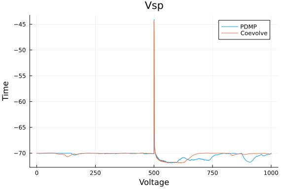
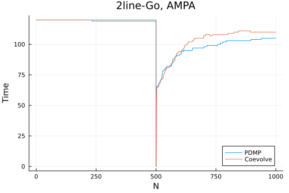

```julia
using Synapse
using PiecewiseDeterministicMarkovProcesses, JumpProcesses, OrdinaryDiffEq, Plots
using BenchmarkTools
fmt = :png
```

```
:png
```


# Model and example solutions

Here we implement the stochastic model of hippocampal synaptic plasticity with geometrical readount of enzyme dinamics from Rodrigues et al. [1].


## Parameters and initial conditions

```julia
p_synapse = SynapseParams(t_end = 1000.0);
glu = 0.0;
events_sorted_times = [500.0];
is_pre_or_post_event = [true];
events_bap = events_sorted_times[is_pre_or_post_event.==false];
bap_by_epsp = Float64[];
nu = buildTransitionMatrix();
```


```julia
xc0 = initial_conditions_continuous_temp(p_synapse);
xd0 = initial_conditions_discrete(p_synapse);
```


## Algorithms to benchmark

`CoevolveSynced` allow us to save at regular intervals. Thus, rather than saving when a jump occurs, we save at the same average frequency as obtained with `PDMP`.

```julia
solver = AutoTsit5(Rosenbrock23());
algorithms = [
    (
        label = "PDMP",
        agg = nothing,
        solver = (CHV(solver), CHV(solver)),
        saveat = [],
    ),
    (
        label = "Coevolve",
        agg = Coevolve(),
        solver = (solver, solver),
        saveat = 1 / p_synapse.sampling_rate,
    ),
];
```


## Example solutions

```julia
results = []

for algo in algorithms
    push!(
        results,
        evolveSynapse(
            xc0,
            xd0,
            p_synapse,
            events_sorted_times,
            is_pre_or_post_event,
            bap_by_epsp,
            [true],
            nu,
            algo.solver,
            algo.agg;
            save_positions = (false, true),
            saveat = algo.saveat,
            save_everystep = false,
        ),
    )
end
```

```
1.752197 seconds (83.19 k allocations: 20.114 MiB)
  2.592594 seconds (206.16 k allocations: 39.800 MiB, 4.97% gc time)
```


```julia
fig = plot(xlabel = "Voltage", ylabel = "Time");
for (i, algo) in enumerate(algorithms)
    res = results[i]
    plot!(res.t, res.Vsp, label = algo.label)
end
title!("Vsp")
```



```julia
fig = plot(xlabel = "N", ylabel = "Time");
for (i, algo) in enumerate(algorithms)
    res = results[i]
    plot!(res.t, res.XD[1, :], label = algo.label)
end
title!("2line-Go, AMPA")
```




# Benchmarking perfomance

```julia
bs = Vector{BenchmarkTools.Trial}()

for algo in algorithms
    push!(
        bs,
        @benchmark(
            evolveSynapse(
                xc0,
                xd0,
                p_synapse,
                events_sorted_times,
                is_pre_or_post_event,
                bap_by_epsp,
                [true],
                nu,
                $(algo).solver,
                $(algo).agg;
                save_positions = (false, true),
                saveat = $(algo).saveat,
                save_everystep = false,
            ),
            samples = 50,
            evals = 1,
            seconds = 500,
        )
    )
end
```

```
1.920312 seconds (91.39 k allocations: 22.298 MiB)
  1.777722 seconds (84.69 k allocations: 20.587 MiB)
  1.732228 seconds (82.22 k allocations: 19.888 MiB)
  1.797556 seconds (84.34 k allocations: 20.280 MiB)
  1.580937 seconds (76.41 k allocations: 18.898 MiB)
  1.681221 seconds (80.12 k allocations: 18.821 MiB)
  1.596548 seconds (76.92 k allocations: 18.303 MiB)
  1.491859 seconds (73.40 k allocations: 18.337 MiB)
  1.659034 seconds (78.66 k allocations: 18.522 MiB)
  1.592783 seconds (78.16 k allocations: 19.668 MiB)
  1.519852 seconds (73.66 k allocations: 17.593 MiB)
  1.802103 seconds (84.50 k allocations: 19.601 MiB)
  1.685646 seconds (80.93 k allocations: 19.802 MiB)
  1.569136 seconds (75.00 k allocations: 17.597 MiB)
  1.541260 seconds (73.78 k allocations: 17.294 MiB)
  1.496324 seconds (73.42 k allocations: 18.381 MiB)
  1.554781 seconds (74.53 k allocations: 17.638 MiB)
  1.353970 seconds (66.93 k allocations: 16.217 MiB)
  1.161315 seconds (58.82 k allocations: 14.337 MiB)
  1.420855 seconds (69.07 k allocations: 16.518 MiB)
  1.422035 seconds (70.39 k allocations: 17.792 MiB)
  1.813527 seconds (86.31 k allocations: 21.057 MiB)
  1.412556 seconds (69.22 k allocations: 16.637 MiB)
  1.842774 seconds (86.48 k allocations: 19.980 MiB)
  1.496493 seconds (72.11 k allocations: 16.990 MiB)
  1.468570 seconds (71.37 k allocations: 17.042 MiB)
  1.706756 seconds (80.66 k allocations: 18.797 MiB)
  1.252664 seconds (62.37 k allocations: 15.107 MiB)
  1.791741 seconds (82.58 k allocations: 20.103 MiB, 3.14% gc time)
  1.371469 seconds (67.24 k allocations: 16.159 MiB)
  1.503042 seconds (73.03 k allocations: 17.403 MiB)
  1.616457 seconds (78.05 k allocations: 19.212 MiB)
  1.508771 seconds (73.23 k allocations: 17.567 MiB)
  1.425240 seconds (68.42 k allocations: 16.077 MiB)
  1.551965 seconds (75.01 k allocations: 17.741 MiB)
  1.447663 seconds (70.63 k allocations: 16.872 MiB)
  1.471721 seconds (70.95 k allocations: 16.747 MiB)
  1.578028 seconds (75.84 k allocations: 17.928 MiB)
  1.444950 seconds (69.24 k allocations: 16.169 MiB)
  1.446069 seconds (69.26 k allocations: 16.210 MiB)
  1.468291 seconds (72.15 k allocations: 18.047 MiB)
  1.322205 seconds (65.56 k allocations: 15.857 MiB)
  1.540576 seconds (74.43 k allocations: 17.688 MiB)
  1.526924 seconds (75.94 k allocations: 19.420 MiB)
  1.355725 seconds (66.18 k allocations: 15.765 MiB)
  1.701425 seconds (80.54 k allocations: 20.029 MiB, 2.48% gc time)
  1.379791 seconds (66.80 k allocations: 15.743 MiB)
  1.628650 seconds (77.63 k allocations: 18.199 MiB)
  1.555712 seconds (75.02 k allocations: 17.818 MiB)
  1.552654 seconds (74.67 k allocations: 17.667 MiB)
  1.439698 seconds (71.43 k allocations: 18.137 MiB)
  2.660428 seconds (224.58 k allocations: 42.975 MiB)
  2.434448 seconds (203.75 k allocations: 39.417 MiB)
  2.516652 seconds (209.66 k allocations: 40.504 MiB)
  2.590599 seconds (217.00 k allocations: 42.139 MiB, 2.28% gc time)
  2.589649 seconds (225.47 k allocations: 43.581 MiB)
  2.545721 seconds (212.22 k allocations: 40.935 MiB)
  2.501623 seconds (211.81 k allocations: 40.784 MiB)
  2.450929 seconds (209.75 k allocations: 40.319 MiB)
  2.646452 seconds (224.59 k allocations: 43.552 MiB)
  2.474547 seconds (212.06 k allocations: 40.719 MiB)
  2.480001 seconds (209.09 k allocations: 40.279 MiB)
  2.422441 seconds (207.62 k allocations: 40.450 MiB, 1.59% gc time)
  2.472373 seconds (205.58 k allocations: 39.802 MiB)
  2.484825 seconds (207.05 k allocations: 40.017 MiB)
  2.455366 seconds (211.65 k allocations: 40.630 MiB)
  2.610446 seconds (229.99 k allocations: 44.249 MiB)
  2.687965 seconds (220.23 k allocations: 42.219 MiB, 2.53% gc time)
  2.472290 seconds (206.25 k allocations: 39.894 MiB)
  2.342054 seconds (198.97 k allocations: 38.502 MiB)
  2.420923 seconds (198.71 k allocations: 38.525 MiB, 2.04% gc time)
  2.468954 seconds (203.99 k allocations: 39.545 MiB)
  2.503505 seconds (215.74 k allocations: 41.932 MiB)
  2.424058 seconds (202.67 k allocations: 39.255 MiB)
  2.650696 seconds (227.60 k allocations: 44.040 MiB)
  2.723781 seconds (228.79 k allocations: 44.247 MiB, 1.77% gc time)
  2.319974 seconds (193.56 k allocations: 37.636 MiB)
  2.521131 seconds (212.83 k allocations: 40.965 MiB)
  2.487553 seconds (207.63 k allocations: 40.011 MiB, 1.74% gc time)
  2.608883 seconds (217.97 k allocations: 41.906 MiB)
  2.392152 seconds (201.65 k allocations: 38.989 MiB)
  2.482578 seconds (213.47 k allocations: 40.964 MiB)
  2.442069 seconds (207.10 k allocations: 39.917 MiB)
  2.615963 seconds (214.25 k allocations: 41.257 MiB, 2.22% gc time)
  2.440737 seconds (203.26 k allocations: 39.370 MiB)
  2.360221 seconds (194.33 k allocations: 37.861 MiB)
  2.589534 seconds (223.97 k allocations: 43.369 MiB)
  2.584262 seconds (224.74 k allocations: 43.416 MiB)
  2.378555 seconds (203.00 k allocations: 39.143 MiB)
  2.447000 seconds (213.09 k allocations: 41.438 MiB)
  2.402597 seconds (199.92 k allocations: 38.794 MiB)
  2.514050 seconds (210.64 k allocations: 40.511 MiB, 1.79% gc time)
  2.515307 seconds (217.78 k allocations: 42.263 MiB)
  2.412185 seconds (207.70 k allocations: 39.910 MiB)
  2.481011 seconds (219.07 k allocations: 42.378 MiB)
  2.456012 seconds (211.20 k allocations: 40.546 MiB)
  2.488041 seconds (211.87 k allocations: 40.700 MiB)
  2.428857 seconds (204.46 k allocations: 39.495 MiB)
  2.490686 seconds (213.19 k allocations: 40.942 MiB)
  2.528742 seconds (206.65 k allocations: 39.980 MiB, 1.64% gc time)
  2.520927 seconds (213.27 k allocations: 41.009 MiB)
  2.498835 seconds (217.46 k allocations: 42.123 MiB)
```


```julia
labels = [a.label for a in algorithms]
medtimes = [text(string(round(median(b).time/1e9, digits=3),"s"), :center, 12) for b in bs]
relmedtimes = [median(b).time for b in bs]
relmedtimes ./= relmedtimes[1]
bar(labels, relmedtimes, markeralpha=0, series_annotation=medtimes, fmt=fmt)
title!("evolveSynapse (Median time)")
```


```julia
medmem = [text(string(round(median(b).memory/1e6, digits=3),"Mb"), :center, 12) for b in bs]
relmedmem = Float64[median(b).memory for b in bs]
relmedmem ./= relmedmem[1]
bar(labels, relmedmem, markeralpha=0, series_annotation=medmem, fmt=fmt)
title!("evolveSynapse (Median memory)")
```


# References

[1] Y. E. Rodrigues, C. M. Tigaret, H. Marie, C. O’Donnell, and R. Veltz, "A stochastic model of hippocampal synaptic plasticity with geometrical readout of enzyme dynamics." bioRxiv, p. 2021.03.30.437703, Mar. 30, 2021. doi: 10.1101/2021.03.30.437703.

