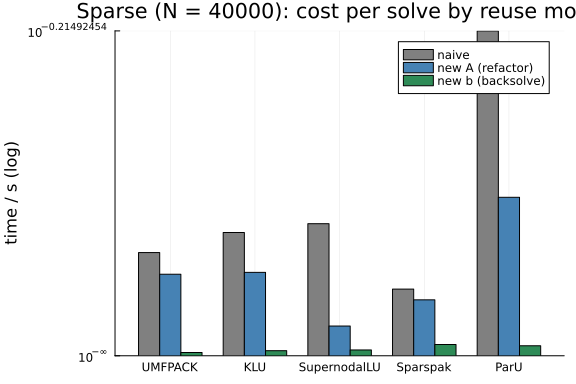

LinearSolve.jl's headline API difference from `A \ b` is the **cache**: build a
problem once with `init`, then call `solve!` repeatedly while updating `b` or `A`
in place. Every downstream SciML solver (ODE Jacobians, Newton iterations) leans on
this. This benchmark quantifies what it's worth, for each algorithm family:

1. **Naive** — `solve(LinearProblem(A, b), alg)` from scratch every time. What you
   pay without the cache.
2. **Cached, new `b`** — `cache.b = b′; solve!(cache)`. Direct methods skip
   factorization entirely: this isolates the backsolve.
3. **Cached, new `A`** (same sparsity) — `cache.A = A′; solve!(cache)`. Forces
   numeric refactorization but reuses symbolic analysis, orderings, and workspaces
   (this path exercises the recent direct-BLAS workspace reuse and sparse
   symbolic-reuse work in LinearSolve v5).

Also reported: **allocations per cached re-solve** — for direct methods a warm cache
should allocate (near) zero, which is what makes the API safe inside tight loops.

CI budget note: two fixed problem sizes per family, three modes, ~10 algorithms —
minutes, not hours.

```julia
using BenchmarkTools, Random
using LinearAlgebra, SparseArrays, LinearSolve, Sparspak
using RecursiveFactorization, FastLapackInterface
import Pardiso
import ParU_jll
using Plots

BenchmarkTools.DEFAULT_PARAMETERS.seconds = 0.5
BenchmarkTools.DEFAULT_PARAMETERS.samples = 20

# Same FD generator as the folder's other sparse documents.
A ⊕ B = kron(I(size(B, 1)), A) + kron(B, I(size(A, 1)))
function lattice(n; Tv = Float64)
    d = fill(2 * one(Tv), n); d[1] = one(Tv); d[end] = one(Tv)
    spdiagm(1 => -ones(Tv, n - 1), 0 => d, -1 => -ones(Tv, n - 1))
end
lattice(L...; Tv = Float64) = lattice(L[1]; Tv) ⊕ lattice(L[2:end]...; Tv)
function fdmatrix(N; dim = 2, Tv = Float64, δ = 1.0e-2)
    n = N^(1 / dim) |> ceil |> Int
    lattice([n for i in 1:dim]...; Tv) + Tv(δ) * I
end

# (family, name, alg). Dense algs get a dense A; sparse algs the 2-D FD matrix.
algs = [
    (:dense,  "LU",           LUFactorization()),
    (:dense,  "RFLU",         RFLUFactorization()),
    (:dense,  "MKL LU",       MKLLUFactorization()),
    (:sparse, "UMFPACK",      UMFPACKFactorization()),
    (:sparse, "KLU",          KLUFactorization()),
    (:sparse, "SupernodalLU", SupernodalLUFactorization()),
    (:sparse, "Sparspak",     SparspakFactorization()),
    (:sparse, "ParU",         ParUFactorization()),
]

const DENSE_N = 500
const SPARSE_N = 40_000    # ~200×200 grid, 2-D

function make_problem(family)
    rng = MersenneTwister(123)
    A = family === :dense ? (rand(rng, DENSE_N, DENSE_N) + DENSE_N * I) :
        fdmatrix(SPARSE_N; dim = 2)
    n = size(A, 1)
    b = rand(rng, n)
    # Same-sparsity update: scale values, keep the pattern (dense: fresh matrix).
    A2 = family === :dense ? (rand(rng, n, n) + n * I) :
        SparseMatrixCSC(n, n, copy(A.colptr), copy(A.rowval), 1.1 .* A.nzval)
    b2 = rand(rng, n)
    return A, A2, b, b2
end
```

```
make_problem (generic function with 1 method)
```


## Methodology

For each algorithm we measure four numbers:

```julia
function bench_reuse(family, alg)
    A, A2, b, b2 = make_problem(family)

    # Correctness gate on both the fresh solve and the A-update path — a cache
    # that silently returns the OLD factorization's answer after `cache.A = A2`
    # would be fast and wrong, which is the failure mode this guards against.
    # NOTE: `cache.A = X` hands the backend the array itself, and several
    # factorizations (RFLU, MKL) factorize it IN PLACE — the caller's matrix is
    # destroyed. Others (LU) copy into an internal workspace. Always assign a copy
    # if you still need the matrix; this benchmark does, so its residual checks
    # test the solve rather than the wreckage.
    cache = init(LinearProblem(copy(A), b), alg)
    u1 = copy(solve!(cache).u)
    cache.b = b2
    u2 = copy(solve!(cache).u)
    cache.A = copy(A2)
    u3 = copy(solve!(cache).u)
    r1 = norm(A * u1 - b) / norm(b)
    r2 = norm(A * u2 - b2) / norm(b2)
    r3 = norm(A2 * u3 - b2) / norm(b2)
    if !(r1 < 1e-8 && r2 < 1e-8 && r3 < 1e-8)
        @warn "correctness gate failed" alg r1 r2 r3
        return nothing
    end

    t_naive = @belapsed solve(LinearProblem($A, $b), $alg).u

    t_newb = @belapsed solve!(c).u setup=(
        c = init(LinearProblem($A, $b), $alg); solve!(c); c.b = $b2) evals=1

    t_newA = @belapsed solve!(c).u setup=(
        c = init(LinearProblem($A, $b), $alg); solve!(c); c.A = copy($A2)) evals=1

    # Steady-state allocations: repeated solve! on a warm cache, same b.
    warm = init(LinearProblem(A, b), alg)
    solve!(warm); solve!(warm)
    allocs = @allocated solve!(warm)

    return (; t_naive, t_newb, t_newA, allocs)
end

results = []
for (family, name, alg) in algs
    r = try
        bench_reuse(family, alg)
    catch e
        @warn "$name failed" exception=(e,)
        nothing
    end
    r === nothing || push!(results, (; family, name, r...))
    r === nothing || @info name t_naive=r.t_naive t_newb=r.t_newb t_newA=r.t_newA allocs=r.allocs
end
```


## Results

```julia
using Printf
println("alg           | family |  naive (s) | new-b (s) | new-A (s) | b-speedup | A-speedup | allocs/solve")
println("--------------+--------+------------+-----------+-----------+-----------+-----------+-------------")
for r in results
    @printf("%-13s | %-6s | %10.3g | %9.3g | %9.3g | %8.1fx | %8.2fx | %d\n",
        r.name, r.family, r.t_naive, r.t_newb, r.t_newA,
        r.t_naive / r.t_newb, r.t_naive / r.t_newA, r.allocs)
end
```

```
alg           | family |  naive (s) | new-b (s) | new-A (s) | b-speedup | A
-speedup | allocs/solve
--------------+--------+------------+-----------+-----------+-----------+--
---------+-------------
LU            | dense  |    0.00476 |   5.7e-05 |   0.00449 |     83.6x |  
   1.06x | 0
RFLU          | dense  |    0.00223 |  5.72e-05 |    0.0019 |     39.0x |  
   1.17x | 0
MKL LU        | dense  |    0.00279 |    0.0001 |   0.00228 |     27.8x |  
   1.22x | 0
UMFPACK       | sparse |      0.194 |   0.00617 |     0.153 |     31.4x |  
   1.27x | 0
KLU           | sparse |      0.231 |   0.00952 |     0.156 |     24.3x |  
   1.48x | 0
SupernodalLU  | sparse |      0.248 |    0.0109 |    0.0559 |     22.7x |  
   4.44x | 0
Sparspak      | sparse |      0.125 |    0.0211 |     0.105 |      5.9x |  
   1.19x | 965928
ParU          | sparse |       0.61 |    0.0188 |     0.297 |     32.5x |  
   2.05x | 968360
```


```julia
sparse_res = filter(r -> r.family === :sparse, results)
vals = hcat([ [r.t_naive for r in sparse_res],
              [r.t_newA  for r in sparse_res],
              [r.t_newb  for r in sparse_res] ]...)
p = plot()   # grouped bars via repeated bar! calls keep deps minimal
xs = 1:length(sparse_res)
w = 0.25
for (k, (lab, col)) in enumerate(zip(("naive", "new A (refactor)", "new b (backsolve)"),
                                     (:gray, :steelblue, :seagreen)))
    bar!(p, xs .+ (k - 2) * w, vals[:, k]; bar_width = w, label = lab, color = col)
end
plot!(p; xticks = (xs, [r.name for r in sparse_res]), yscale = :log10,
    ylabel = "time / s (log)", title = "Sparse (N = $(SPARSE_N)): cost per solve by reuse mode",
    legend = :topright)
p
```




## Krylov warm start

For iterative methods the cache carries a different asset: the previous solution.
With `warm_start`, repeated solves against slowly-varying right-hand sides start
from the last `u` instead of zero — the payoff is *iterations*, which we report
directly (time follows iterations for a fixed operator).

```julia
A = fdmatrix(SPARSE_N; dim = 2)
n = size(A, 1)
rng = MersenneTwister(42)
b = rand(rng, n)
db = 0.01 .* rand(rng, n)   # small perturbation: the "time-stepping" regime

for (label, ws) in (("WarmStart.Previous", KrylovJL_GMRES(warm_start = WarmStart.Previous)),
                    ("WarmStart.None", KrylovJL_GMRES(warm_start = WarmStart.None)))
    cache = init(LinearProblem(A, b), ws; reltol = 1e-8)
    iters = Int[]
    for step in 1:5
        sol = solve!(cache)
        push!(iters, sol.iters)
        cache.b = cache.b .+ db
    end
    println(rpad(label, 18), " iters per step: ", iters)
end
```

```
WarmStart.Previous iters per step: [224, 159, 159, 159, 159]
WarmStart.None     iters per step: [224, 224, 224, 224, 224]
```


## Reading the result

* **new-b speedup is the headline.** For direct methods this is
  factor-time / backsolve-time — typically one to two orders of magnitude. If your
  workload solves against many right-hand sides (adjoints, multiple loads), the
  cache API is the difference.
* **new-A speedup measures symbolic reuse.** Same-pattern refactorization skips
  ordering/analysis; how much that's worth varies strongly by algorithm — this
  column is effectively a benchmark of each backend's refactorization path.
* **allocs/solve near zero** is what makes `solve!` safe inside hot loops. Nonzero
  values here are worth filing as issues.
* **`cache.A = X` aliasing differs by backend.** Some factorizations (RFLU, MKL LU)
  factorize the assigned array in place, destroying it; others (LU) copy into a
  reused workspace. If you need your matrix afterwards, assign a copy. This
  benchmark's correctness gate is what surfaced the difference.
* **Warm start** converts cache reuse into iteration savings for Krylov methods in
  the time-stepping regime; with a fixed matrix and slowly-moving `b`, the
  iteration counts tell the story without timing noise.

What this does *not* show: changed-sparsity-pattern updates (a rebuild, by design),
and multi-threaded interactions. Problem sizes are fixed per family; the size
dependence of these ratios is covered by the SparseDirect document's sweep.

## Appendix


## Appendix

These benchmarks are a part of the SciMLBenchmarks.jl repository, found at: [https://github.com/SciML/SciMLBenchmarks.jl](https://github.com/SciML/SciMLBenchmarks.jl). For more information on high-performance scientific machine learning, check out the SciML Open Source Software Organization [https://sciml.ai](https://sciml.ai).

To locally run this benchmark, do the following commands:

```
using SciMLBenchmarks
SciMLBenchmarks.weave_file("benchmarks/LinearSolve","CacheReuse.jmd")
```

Computer Information:

```
Julia Version 1.12.7
Commit 6d172b025e4 (2026-08-15 08:05 UTC)
Build Info:
  Official https://julialang.org release
Platform Info:
  OS: Linux (x86_64-linux-gnu)
  CPU: 128 × AMD EPYC 7502 32-Core Processor
  WORD_SIZE: 64
  LLVM: libLLVM-18.1.7 (ORCJIT, znver2)
  GC: Built with stock GC
Threads: 128 default, 1 interactive, 128 GC (on 128 virtual cores)
Environment:
  JULIA_NUM_THREADS = auto

```

Package Information:

```
Status `/julia/github-runners/amdci1-1/_work/SciMLBenchmarks.jl/SciMLBenchmarks.jl/benchmarks/LinearSolve/Project.toml`
  [6e4b80f9] BenchmarkTools v1.8.0
  [29a986be] FastLapackInterface v2.1.1
⌃ [7ed4a6bd] LinearSolve v5.5.0
  [b51810bb] MatrixDepot v1.1.0
  [46dd5b70] Pardiso v1.1.2
⌃ [91a5bcdd] Plots v1.41.6
⌃ [b7e1f0a2] PureUMFPACK v0.1.4
⌃ [f2c3362d] RecursiveFactorization v0.2.26
⌃ [31c91b34] SciMLBenchmarks v0.1.3 [loaded: v0.1.5]
  [e56a9233] Sparspak v0.3.15
  [10745b16] Statistics v1.11.1
  [3d5dd08c] VectorizationBase v0.21.74
  [856f044c] MKL_jll v2025.2.0+0
⌃ [9e0b026c] ParU_jll v1.0.0+0
  [37e2e46d] LinearAlgebra v1.12.0
  [44cfe95a] Pkg v1.12.1
  [9a3f8284] Random v1.11.0
  [2f01184e] SparseArrays v1.12.0
Info Packages marked with ⌃ have new versions available and may be upgradable.
```

And the full manifest:

```
Status `/julia/github-runners/amdci1-1/_work/SciMLBenchmarks.jl/SciMLBenchmarks.jl/benchmarks/LinearSolve/Manifest.toml`
⌃ [47edcb42] ADTypes v1.22.3
  [14f7f29c] AMD v0.5.3
  [7d9f7c33] Accessors v0.1.45
  [79e6a3ab] Adapt v4.7.0
  [66dad0bd] AliasTables v1.1.3
⌃ [4fba245c] ArrayInterface v7.28.1
  [6e4b80f9] BenchmarkTools v1.8.0
  [d1d4a3ce] BitFlags v0.1.10
  [62783981] BitTwiddlingConvenienceFunctions v0.1.6
  [2a0fbf3d] CPUSummary v0.2.7
  [79a69506] ChannelBuffers v0.4.2
  [0b6fb165] ChunkCodecCore v1.0.1
  [4c0bbee4] ChunkCodecLibZlib v1.1.0
  [55437552] ChunkCodecLibZstd v1.0.0
  [fb6a15b2] CloseOpenIntervals v0.1.13
⌃ [944b1d66] CodecZlib v0.7.8
  [35d6a980] ColorSchemes v3.31.0
  [3da002f7] ColorTypes v0.12.1
  [c3611d14] ColorVectorSpace v0.11.0
  [5ae59095] Colors v0.13.1
⌃ [38540f10] CommonSolve v0.2.12
⌃ [f70d9fcc] CommonWorldInvalidations v1.1.1
  [34da2185] Compat v4.18.1
  [a33af91c] CompositionsBase v0.1.2
⌃ [2569d6c7] ConcreteStructs v0.2.6
⌃ [f0e56b4a] ConcurrentUtilities v2.5.1
  [8f4d0f93] Conda v1.10.3
  [187b0558] ConstructionBase v1.6.0
  [d38c429a] Contour v0.6.3
  [adafc99b] CpuId v0.3.1
  [a8cc5b0e] Crayons v4.2.0
  [9a962f9c] DataAPI v1.16.0
  [a93c6f00] DataFrames v1.8.2
  [864edb3b] DataStructures v0.19.6
  [e2d170a0] DataValueInterfaces v1.0.0
  [8bb1440f] DelimitedFiles v1.9.1
  [ffbed154] DocStringExtensions v0.9.5
  [4e289a0a] EnumX v1.0.7
  [460bff9d] ExceptionUnwrapping v0.1.11
  [e2ba6199] ExprTools v0.1.11
  [c87230d0] FFMPEG v0.4.5
  [29a986be] FastLapackInterface v2.1.1
  [5789e2e9] FileIO v1.20.0
  [64ca27bc] FindFirstFunctions v3.2.1
⌅ [53c48c17] FixedPointNumbers v0.8.6
  [1fa38f19] Format v1.3.7
  [069b7b12] FunctionWrappers v1.1.3
⌃ [77dc65aa] FunctionWrappersWrappers v1.12.0
  [46192b85] GPUArraysCore v0.2.0
  [28b8d3ca] GR v0.73.26
  [d7ba0133] Git v1.5.0
  [42e2da0e] Grisu v1.0.2
  [f67ccb44] HDF5 v0.17.3
⌅ [cd3eb016] HTTP v1.11.0
  [076d061b] HashArrayMappedTries v0.2.0
⌅ [eafb193a] Highlights v0.5.3
  [3e5b6fbb] HostCPUFeatures v0.1.18
  [7073ff75] IJulia v1.34.4
  [615f187c] IfElse v0.1.1
  [842dd82b] InlineStrings v1.4.5
  [3587e190] InverseFunctions v0.1.17
  [41ab1584] InvertedIndices v1.3.1
  [92d709cd] IrrationalConstants v0.2.6
  [82899510] IteratorInterfaceExtensions v1.0.0
  [033835bb] JLD2 v0.6.5
  [1019f520] JLFzf v0.1.11
  [692b3bcd] JLLWrappers v1.8.0
⌅ [682c06a0] JSON v0.21.4
⌃ [ba0b0d4f] Krylov v0.10.8
⌃ [b964fa9f] LaTeXStrings v1.4.0
⌃ [23fbe1c1] Latexify v0.16.11
  [10f19ff3] LayoutPointers v0.1.17
⌃ [7ed4a6bd] LinearSolve v5.5.0
  [2ab3a3ac] LogExpFunctions v1.0.1
  [e6f89c97] LoggingExtras v1.2.0
  [bdcacae8] LoopVectorization v0.12.174
  [23992714] MAT v0.12.1
  [3da0fdf6] MPIPreferences v0.1.12
  [1914dd2f] MacroTools v0.5.16
  [d125e4d3] ManualMemory v0.1.8
  [b51810bb] MatrixDepot v1.1.0
  [739be429] MbedTLS v1.1.10
  [442fdcdd] Measures v0.3.3
  [e1d29d7a] Missings v1.2.0
⌃ [46d2c3a1] MuladdMacro v0.2.6
  [ffc61752] Mustache v1.0.21
  [77ba4419] NaNMath v1.1.4
  [6fe1bfb0] OffsetArrays v1.17.0
  [4d8831e6] OpenSSL v1.6.1
⌅ [bac558e1] OrderedCollections v1.8.2
  [46dd5b70] Pardiso v1.1.2
⌃ [69de0a69] Parsers v2.8.6 [loaded: v2.8.7]
  [ccf2f8ad] PlotThemes v3.3.0
  [995b91a9] PlotUtils v1.4.4
⌃ [91a5bcdd] Plots v1.41.6
  [f517fe37] Polyester v0.7.19
  [1d0040c9] PolyesterWeave v0.2.2
  [2dfb63ee] PooledArrays v1.4.3
⌃ [d236fae5] PreallocationTools v1.4.0
  [aea7be01] PrecompileTools v1.3.4
  [21216c6a] Preferences v1.5.2
⌃ [08abe8d2] PrettyTables v3.4.2
  [43287f4e] PtrArrays v1.4.0
⌃ [0c0d3e7f] PureKLU v1.1.1
⌃ [b7e1f0a2] PureUMFPACK v0.1.4
  [3cdcf5f2] RecipesBase v1.3.4
  [01d81517] RecipesPipeline v0.6.12
⌃ [731186ca] RecursiveArrayTools v4.3.5
⌃ [f2c3362d] RecursiveFactorization v0.2.26
  [189a3867] Reexport v1.2.2
  [05181044] RelocatableFolders v1.0.1
  [ae029012] Requires v1.3.1
⌃ [7e49a35a] RuntimeGeneratedFunctions v0.5.22
  [94e857df] SIMDTypes v0.1.0
  [476501e8] SLEEFPirates v0.6.46
⌃ [0bca4576] SciMLBase v3.39.1
⌃ [31c91b34] SciMLBenchmarks v0.1.3 [loaded: v0.1.5]
⌃ [a6db7da4] SciMLLogging v2.0.3
⌃ [c0aeaf25] SciMLOperators v1.25.0
  [431bcebd] SciMLPublic v1.2.4
  [53ae85a6] SciMLStructures v1.10.4
  [7e506255] ScopedValues v1.6.2
  [6c6a2e73] Scratch v1.3.0
  [91c51154] SentinelArrays v1.4.10
  [efcf1570] Setfield v1.1.2
  [992d4aef] Showoff v1.0.3
  [777ac1f9] SimpleBufferStream v1.2.0
  [a2af1166] SortingAlgorithms v1.2.3
⌃ [bd59d7e1] SparseBandedMatrices v1.3.3
⌃ [a57abbd0] SparseColumnPivotedQR v2.1.4
  [e56a9233] Sparspak v0.3.15
  [860ef19b] StableRNGs v1.0.4
⌃ [aedffcd0] Static v1.4.4
  [0d7ed370] StaticArrayInterface v1.10.0
  [1e83bf80] StaticArraysCore v1.4.4
  [10745b16] Statistics v1.11.1
  [82ae8749] StatsAPI v1.8.0
  [2913bbd2] StatsBase v0.34.12
  [7792a7ef] StrideArraysCore v0.5.9
  [69024149] StringEncodings v0.3.7
⌅ [892a3eda] StringManipulation v0.4.6
⌃ [2efcf032] SymbolicIndexingInterface v0.3.51
  [3783bdb8] TableTraits v1.0.1
  [bd369af6] Tables v1.13.0
  [62fd8b95] TensorCore v0.1.1
  [8290d209] ThreadingUtilities v0.5.6
  [3bb67fe8] TranscodingStreams v0.11.3
⌃ [d5829a12] TriangularSolve v0.2.1
⌃ [5c2747f8] URIs v1.6.1
  [3a884ed6] UnPack v1.0.2
  [1cfade01] UnicodeFun v0.4.1
  [41fe7b60] Unzip v0.2.0
  [3d5dd08c] VectorizationBase v0.21.74
  [33b4df10] VectorizedRNG v0.2.26
  [81def892] VersionParsing v1.3.0
  [44d3d7a6] Weave v0.10.12
  [ddb6d928] YAML v0.4.16
  [c2297ded] ZMQ v1.5.1
  [6e34b625] Bzip2_jll v1.0.9+0
  [83423d85] Cairo_jll v1.18.7+0
  [ee1fde0b] Dbus_jll v1.16.2+0
  [2702e6a9] EpollShim_jll v0.0.20230411+1
⌃ [2e619515] Expat_jll v2.8.2+0
⌅ [b22a6f82] FFMPEG_jll v8.1.2+0
  [a3f928ae] Fontconfig_jll v2.17.1+0
  [d7e528f0] FreeType2_jll v2.14.3+1
  [559328eb] FriBidi_jll v1.0.17+0
  [0656b61e] GLFW_jll v3.4.1+1
  [d2c73de3] GR_jll v0.73.26+0
⌅ [b0724c58] GettextRuntime_jll v0.22.4+0
  [61579ee1] Ghostscript_jll v9.55.1+0
  [020c3dae] Git_LFS_jll v3.7.1+0
⌃ [f8c6e375] Git_jll v2.54.0+0
⌃ [7746bdde] Glib_jll v2.86.3+0
  [3b182d85] Graphite2_jll v1.3.16+0
⌅ [0234f1f7] HDF5_jll v2.1.2+0
⌅ [2e76f6c2] HarfBuzz_jll v8.5.1+0
  [e33a78d0] Hwloc_jll v2.14.0+0
  [1d5cc7b8] IntelOpenMP_jll v2025.2.0+0
⌃ [aacddb02] JpegTurbo_jll v3.2.0+0
  [c1c5ebd0] LAME_jll v3.100.3+0
  [88015f11] LERC_jll v4.1.0+0
  [1d63c593] LLVMOpenMP_jll v22.1.7+0
⌅ [e9f186c6] Libffi_jll v3.4.7+0
  [7e76a0d4] Libglvnd_jll v1.7.1+1
  [94ce4f54] Libiconv_jll v1.18.0+0
  [4b2f31a3] Libmount_jll v2.42.0+0
  [89763e89] Libtiff_jll v4.7.3+0
  [38a345b3] Libuuid_jll v2.42.0+0
  [856f044c] MKL_jll v2025.2.0+0
⌅ [b5ada748] MPIABI_jll v0.1.5+0
  [7cb0a576] MPICH_jll v5.0.1+0
  [f1f71cc9] MPItrampoline_jll v5.5.6+0
  [c8ffd9c3] MbedTLS_jll v2.28.1010+0
  [9237b28f] MicrosoftMPI_jll v10.1.4+3
  [e7412a2a] Ogg_jll v1.3.6+0
  [fe0851c0] OpenMPI_jll v5.0.11+0
⌃ [9bd350c2] OpenSSH_jll v10.4.1+0
  [91d4177d] Opus_jll v1.6.1+0
⌃ [36c8627f] Pango_jll v1.57.1+0
⌃ [9e0b026c] ParU_jll v1.0.0+0
  [30392449] Pixman_jll v0.46.4+0
  [c0090381] Qt6Base_jll v6.10.2+2
  [629bc702] Qt6Declarative_jll v6.10.2+2
  [ce943373] Qt6ShaderTools_jll v6.10.2+1
  [6de9746b] Qt6Svg_jll v6.10.2+0
  [e99dba38] Qt6Wayland_jll v6.10.2+1
  [a44049a8] Vulkan_Loader_jll v1.3.243+0
  [a2964d1f] Wayland_jll v1.24.0+0
⌅ [02c8fc9c] XML2_jll v2.13.9+0
  [ffd25f8a] XZ_jll v5.8.3+0
  [f67eecfb] Xorg_libICE_jll v1.1.2+0
  [c834827a] Xorg_libSM_jll v1.2.6+0
  [4f6342f7] Xorg_libX11_jll v1.8.13+0
  [0c0b7dd1] Xorg_libXau_jll v1.0.13+0
  [935fb764] Xorg_libXcursor_jll v1.2.4+0
  [a3789734] Xorg_libXdmcp_jll v1.1.6+0
  [1082639a] Xorg_libXext_jll v1.3.8+0
  [d091e8ba] Xorg_libXfixes_jll v6.0.2+0
⌃ [a51aa0fd] Xorg_libXi_jll v1.8.3+0
  [d1454406] Xorg_libXinerama_jll v1.1.7+0
  [ec84b674] Xorg_libXrandr_jll v1.5.6+0
  [ea2f1a96] Xorg_libXrender_jll v0.9.12+0
  [a65dc6b1] Xorg_libpciaccess_jll v0.19.0+0
  [c7cfdc94] Xorg_libxcb_jll v1.17.1+0
  [cc61e674] Xorg_libxkbfile_jll v1.2.0+0
  [e920d4aa] Xorg_xcb_util_cursor_jll v0.1.6+0
  [12413925] Xorg_xcb_util_image_jll v0.4.1+0
  [2def613f] Xorg_xcb_util_jll v0.4.1+0
  [975044d2] Xorg_xcb_util_keysyms_jll v0.4.1+0
  [0d47668e] Xorg_xcb_util_renderutil_jll v0.3.10+0
  [c22f9ab0] Xorg_xcb_util_wm_jll v0.4.2+0
  [35661453] Xorg_xkbcomp_jll v1.4.7+0
  [33bec58e] Xorg_xkeyboard_config_jll v2.47.0+2
  [c5fb5394] Xorg_xtrans_jll v1.6.0+0
  [8f1865be] ZeroMQ_jll v4.3.6+0
  [3161d3a3] Zstd_jll v1.5.7+1
⌅ [2b3700d1] aws_c_auth_jll v0.9.6+0
  [70f11efc] aws_c_cal_jll v0.9.13+0
  [73048d1d] aws_c_common_jll v0.12.6+0
  [73a04cd5] aws_c_compression_jll v0.3.2+0
  [3254fc65] aws_c_http_jll v0.10.13+0
  [13c41daa] aws_c_io_jll v0.26.3+0
⌅ [bd1f34fb] aws_c_s3_jll v0.11.5+0
  [1282aa60] aws_c_sdkutils_jll v0.2.4+1
  [b2a88e68] aws_checksums_jll v0.2.10+0
  [c4b69c83] dlfcn_win32_jll v1.4.2+0
  [35ca27e7] eudev_jll v3.2.14+0
⌅ [214eeab7] fzf_jll v0.61.1+0
  [477f73a3] libaec_jll v1.1.7+0
⌃ [a4ae2306] libaom_jll v3.13.3+0
  [0ac62f75] libass_jll v0.17.4+0
  [1183f4f0] libdecor_jll v0.2.2+0
  [8e53e030] libdrm_jll v2.4.134+0
  [2db6ffa8] libevdev_jll v1.13.4+0
  [f638f0a6] libfdk_aac_jll v2.0.4+0
  [36db933b] libinput_jll v1.28.1+0
  [b53b4c65] libpng_jll v1.6.58+0
  [a9144af2] libsodium_jll v1.0.21+0
  [9a156e7d] libva_jll v2.23.0+0
  [f27f6e37] libvorbis_jll v1.3.8+0
⌅ [9aeb927a] mpif_jll v0.1.7+0
  [009596ad] mtdev_jll v1.1.7+0
  [1317d2d5] oneTBB_jll v2022.3.0+0
  [cddc5d3d] s2n_tls_jll v1.7.3+0
⌅ [1270edf5] x264_jll v10164.0.1+0
  [dfaa095f] x265_jll v4.1.0+0
  [d8fb68d0] xkbcommon_jll v1.13.0+0
  [0dad84c5] ArgTools v1.1.2
  [56f22d72] Artifacts v1.11.0
  [2a0f44e3] Base64 v1.11.0
  [ade2ca70] Dates v1.11.0
  [8ba89e20] Distributed v1.11.0
  [f43a241f] Downloads v1.7.0
  [7b1f6079] FileWatching v1.11.0
  [9fa8497b] Future v1.11.0
  [b77e0a4c] InteractiveUtils v1.11.0
  [ac6e5ff7] JuliaSyntaxHighlighting v1.12.0
  [4af54fe1] LazyArtifacts v1.11.0
  [b27032c2] LibCURL v0.6.4
  [76f85450] LibGit2 v1.11.0
  [8f399da3] Libdl v1.11.0
  [37e2e46d] LinearAlgebra v1.12.0
  [56ddb016] Logging v1.11.0
  [d6f4376e] Markdown v1.11.0
  [a63ad114] Mmap v1.11.0
  [ca575930] NetworkOptions v1.3.0
  [44cfe95a] Pkg v1.12.1
  [de0858da] Printf v1.11.0
  [9abbd945] Profile v1.11.0
  [3fa0cd96] REPL v1.11.0
  [9a3f8284] Random v1.11.0
  [ea8e919c] SHA v0.7.0
  [9e88b42a] Serialization v1.11.0
  [6462fe0b] Sockets v1.11.0
  [2f01184e] SparseArrays v1.12.0
  [f489334b] StyledStrings v1.11.0
  [fa267f1f] TOML v1.0.3
  [a4e569a6] Tar v1.10.0
  [8dfed614] Test v1.11.0
  [cf7118a7] UUIDs v1.11.0
  [4ec0a83e] Unicode v1.11.0
  [e66e0078] CompilerSupportLibraries_jll v1.3.0+1
  [deac9b47] LibCURL_jll v8.15.0+0
  [e37daf67] LibGit2_jll v1.9.0+0
  [29816b5a] LibSSH2_jll v1.11.3+1
  [14a3606d] MozillaCACerts_jll v2025.11.4
  [4536629a] OpenBLAS_jll v0.3.29+0
  [05823500] OpenLibm_jll v0.8.7+0
  [458c3c95] OpenSSL_jll v3.5.4+0
  [efcefdf7] PCRE2_jll v10.44.0+1
  [bea87d4a] SuiteSparse_jll v7.8.3+2
  [83775a58] Zlib_jll v1.3.1+2
  [8e850b90] libblastrampoline_jll v5.15.0+0
  [8e850ede] nghttp2_jll v1.64.0+1
  [3f19e933] p7zip_jll v17.7.0+0
Info Packages marked with ⌃ and ⌅ have new versions available. Those with ⌃ may be upgradable, but those with ⌅ are restricted by compatibility constraints from upgrading. To see why use `status --outdated -m`
```

