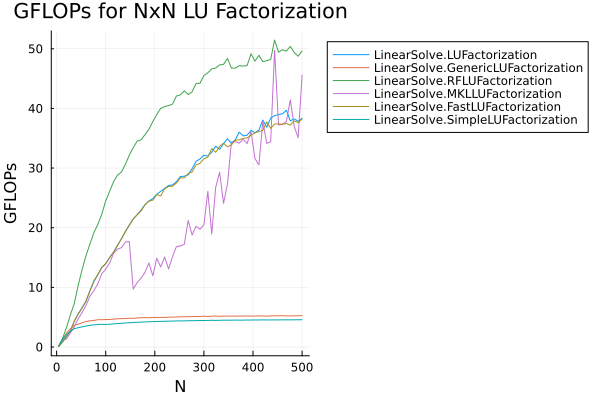

```julia
using BenchmarkTools, Random, VectorizationBase
using LinearAlgebra, LinearSolve, MKL_jll
nc = min(Int(VectorizationBase.num_cores()), Threads.nthreads())
BLAS.set_num_threads(nc)
BenchmarkTools.DEFAULT_PARAMETERS.seconds = 0.5

function luflop(m, n = m; innerflop = 2)
    sum(1:min(m, n)) do k
        invflop = 1
        scaleflop = isempty((k + 1):m) ? 0 : sum((k + 1):m)
        updateflop = isempty((k + 1):n) ? 0 :
                     sum((k + 1):n) do j
            isempty((k + 1):m) ? 0 : sum((k + 1):m) do i
                innerflop
            end
        end
        invflop + scaleflop + updateflop
    end
end

algs = [LUFactorization(), GenericLUFactorization(), RFLUFactorization(), MKLLUFactorization(), FastLUFactorization(), SimpleLUFactorization()]
res = [Float64[] for i in 1:length(algs)]

ns = 4:8:500
for i in 1:length(ns)
    n = ns[i]
    @info "$n × $n"
    rng = MersenneTwister(123)
    global A = rand(rng, n, n)
    global b = rand(rng, n)
    global u0= rand(rng, n)
    
    for j in 1:length(algs)
        bt = @belapsed solve(prob, $(algs[j])).u setup=(prob = LinearProblem(copy(A), copy(b); u0 = copy(u0), alias_A=true, alias_b=true))
        push!(res[j], luflop(n) / bt / 1e9)
    end
end

using Plots
__parameterless_type(T) = Base.typename(T).wrapper
parameterless_type(x) = __parameterless_type(typeof(x))
parameterless_type(::Type{T}) where {T} = __parameterless_type(T)

p = plot(ns, res[1]; ylabel = "GFLOPs", xlabel = "N", title = "GFLOPs for NxN LU Factorization", label = string(Symbol(parameterless_type(algs[1]))), legend=:outertopright)
for i in 2:length(res)
    plot!(p, ns, res[i]; label = string(Symbol(parameterless_type(algs[i]))))
end
p
```


