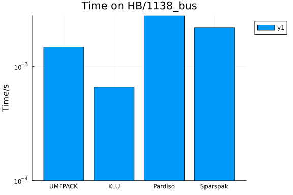
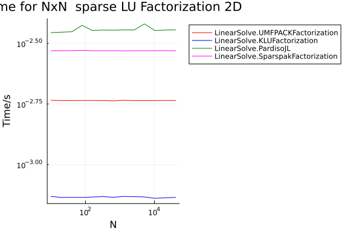
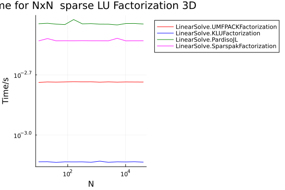

```julia
using BenchmarkTools, Random, VectorizationBase
using LinearAlgebra, SparseArrays, LinearSolve, Sparspak
import Pardiso
using Plots
using MatrixDepot

BenchmarkTools.DEFAULT_PARAMETERS.seconds = 0.5

# Why do I need to set this ?
BenchmarkTools.DEFAULT_PARAMETERS.samples = 10

algs = [
    UMFPACKFactorization(),
    KLUFactorization(),
    MKLPardisoFactorize(),
    SparspakFactorization(),
]
cols = [:red, :blue, :green, :magenta, :turqoise] # one color per alg

__parameterless_type(T) = Base.typename(T).wrapper
parameterless_type(x) = __parameterless_type(typeof(x))
parameterless_type(::Type{T}) where {T} = __parameterless_type(T)

#
# kmax=12 gives ≈ 40_000 unknowns max, can be watched in real time
# kmax=15 gives ≈ 328_000 unknows, you can go make a coffee.
# Main culprit is KLU factorization in 3D.
#
function run_and_plot(dim; kmax = 12)
    ns = [10 * 2^k for k in 0:kmax]

    res = [Float64[] for i in 1:length(algs)]

    for i in 1:length(ns)
        rng = MersenneTwister(123)
        A = mdopen("HB/1138_bus").A
        A = convert(SparseMatrixCSC, A)
        n = size(A, 1)
        @info "dim=$(dim): $n × $n"
        b = rand(rng, n)
        u0 = rand(rng, n)

        for j in 1:length(algs)
            bt = @belapsed solve(prob, $(algs[j])).u setup=(prob = LinearProblem(copy($A),
                copy($b);
                u0 = copy($u0),
                alias_A = true,
                alias_b = true))
            push!(res[j], bt)
        end
    end

    p = plot(;
        ylabel = "Time/s",
        xlabel = "N",
        yscale = :log10,
        xscale = :log10,
        title = "Time for NxN  sparse LU Factorization $(dim)D",
        label = string(Symbol(parameterless_type(algs[1]))),
        legend = :outertopright)

    for i in 1:length(algs)
        plot!(p, ns, res[i];
            linecolor = cols[i],
            label = "$(string(Symbol(parameterless_type(algs[i]))))")
    end
    p
end
```

```
run_and_plot (generic function with 1 method)
```


```julia
run_and_plot(1)
```



```julia
run_and_plot(2)
```



```julia
run_and_plot(3)
```




## Appendix


## Appendix

These benchmarks are a part of the SciMLBenchmarks.jl repository, found at: [https://github.com/SciML/SciMLBenchmarks.jl](https://github.com/SciML/SciMLBenchmarks.jl). For more information on high-performance scientific machine learning, check out the SciML Open Source Software Organization [https://sciml.ai](https://sciml.ai).

To locally run this benchmark, do the following commands:

```
using SciMLBenchmarks
SciMLBenchmarks.weave_file("benchmarks/LinearSolve","MatrixDepot.jmd")
```

Computer Information:

```
Julia Version 1.10.2
Commit bd47eca2c8a (2024-03-01 10:14 UTC)
Build Info:
  Official https://julialang.org/ release
Platform Info:
  OS: Linux (x86_64-linux-gnu)
  CPU: 128 × AMD EPYC 7502 32-Core Processor
  WORD_SIZE: 64
  LIBM: libopenlibm
  LLVM: libLLVM-15.0.7 (ORCJIT, znver2)
Threads: 1 default, 0 interactive, 1 GC (on 128 virtual cores)
Environment:
  JULIA_CPU_THREADS = 128
  JULIA_DEPOT_PATH = /cache/julia-buildkite-plugin/depots/5b300254-1738-4989-ae0a-f4d2d937f953

```

Package Information:

```
Status `/cache/build/exclusive-amdci1-0/julialang/scimlbenchmarks-dot-jl/benchmarks/LinearSolve/Project.toml`
⌃ [6e4b80f9] BenchmarkTools v1.3.2
⌃ [7ed4a6bd] LinearSolve v2.5.0
  [b51810bb] MatrixDepot v1.0.11
⌃ [46dd5b70] Pardiso v0.5.4
⌃ [91a5bcdd] Plots v1.38.17
  [31c91b34] SciMLBenchmarks v0.1.3
  [e56a9233] Sparspak v0.3.9
⌃ [3d5dd08c] VectorizationBase v0.21.64
⌅ [856f044c] MKL_jll v2022.2.0+0
  [37e2e46d] LinearAlgebra
  [44cfe95a] Pkg v1.10.0
  [9a3f8284] Random
  [2f01184e] SparseArrays v1.10.0
Info Packages marked with ⌃ and ⌅ have new versions available. Those with ⌃ may be upgradable, but those with ⌅ are restricted by compatibility constraints from upgrading. To see why use `status --outdated`
Warning The project dependencies or compat requirements have changed since the manifest was last resolved. It is recommended to `Pkg.resolve()` or consider `Pkg.update()` if necessary.
```

And the full manifest:

```
Status `/cache/build/exclusive-amdci1-0/julialang/scimlbenchmarks-dot-jl/benchmarks/LinearSolve/Manifest.toml`
⌅ [47edcb42] ADTypes v0.1.6
⌅ [79e6a3ab] Adapt v3.6.2
⌃ [4fba245c] ArrayInterface v7.4.11
  [30b0a656] ArrayInterfaceCore v0.1.29
⌃ [6e4b80f9] BenchmarkTools v1.3.2
⌃ [d1d4a3ce] BitFlags v0.1.7
  [62783981] BitTwiddlingConvenienceFunctions v0.1.5
  [e1450e63] BufferedStreams v1.2.1
⌃ [2a0fbf3d] CPUSummary v0.2.3
  [79a69506] ChannelBuffers v0.4.1
  [fb6a15b2] CloseOpenIntervals v0.1.12
⌃ [944b1d66] CodecZlib v0.7.2
⌃ [35d6a980] ColorSchemes v3.23.0
⌃ [3da002f7] ColorTypes v0.11.4
  [c3611d14] ColorVectorSpace v0.10.0
  [5ae59095] Colors v0.12.10
  [38540f10] CommonSolve v0.2.4
⌃ [34da2185] Compat v4.9.0
⌃ [f0e56b4a] ConcurrentUtilities v2.2.1
⌃ [8f4d0f93] Conda v1.9.1
⌃ [187b0558] ConstructionBase v1.5.3
⌃ [d38c429a] Contour v0.6.2
  [adafc99b] CpuId v0.3.1
  [a8cc5b0e] Crayons v4.1.1
⌃ [9a962f9c] DataAPI v1.15.0
  [a93c6f00] DataFrames v1.6.1
⌃ [864edb3b] DataStructures v0.18.15
  [e2d170a0] DataValueInterfaces v1.0.0
  [8bb1440f] DelimitedFiles v1.9.1
  [ffbed154] DocStringExtensions v0.9.3
  [4e289a0a] EnumX v1.0.4
⌃ [460bff9d] ExceptionUnwrapping v0.1.9
  [e2ba6199] ExprTools v0.1.10
  [c87230d0] FFMPEG v0.4.1
⌃ [29a986be] FastLapackInterface v2.0.0
  [53c48c17] FixedPointNumbers v0.8.4
⌃ [59287772] Formatting v0.4.2
  [069b7b12] FunctionWrappers v1.1.3
  [77dc65aa] FunctionWrappersWrappers v0.1.3
⌃ [46192b85] GPUArraysCore v0.1.5
⌅ [28b8d3ca] GR v0.72.9
⌃ [d7ba0133] Git v1.3.0
  [42e2da0e] Grisu v1.0.2
  [f67ccb44] HDF5 v0.17.2
⌃ [cd3eb016] HTTP v1.9.14
  [eafb193a] Highlights v0.5.2
  [3e5b6fbb] HostCPUFeatures v0.1.16
  [7073ff75] IJulia v1.24.2
  [615f187c] IfElse v0.1.1
  [842dd82b] InlineStrings v1.4.0
  [41ab1584] InvertedIndices v1.3.0
  [92d709cd] IrrationalConstants v0.2.2
  [82899510] IteratorInterfaceExtensions v1.0.0
⌃ [1019f520] JLFzf v0.1.5
  [692b3bcd] JLLWrappers v1.5.0
  [682c06a0] JSON v0.21.4
⌅ [ef3ab10e] KLU v0.4.0
⌃ [ba0b0d4f] Krylov v0.9.3
⌃ [b964fa9f] LaTeXStrings v1.3.0
⌃ [23fbe1c1] Latexify v0.16.1
⌃ [10f19ff3] LayoutPointers v0.1.14
  [50d2b5c4] Lazy v0.15.1
⌃ [7ed4a6bd] LinearSolve v2.5.0
⌃ [2ab3a3ac] LogExpFunctions v0.3.26
⌃ [e6f89c97] LoggingExtras v1.0.1
⌃ [bdcacae8] LoopVectorization v0.12.165
  [23992714] MAT v0.10.6
  [3da0fdf6] MPIPreferences v0.1.10
⌃ [1914dd2f] MacroTools v0.5.11
  [d125e4d3] ManualMemory v0.1.8
  [b51810bb] MatrixDepot v1.0.11
⌃ [739be429] MbedTLS v1.1.7
  [442fdcdd] Measures v0.3.2
⌃ [e1d29d7a] Missings v1.1.0
⌃ [ffc61752] Mustache v1.0.17
  [77ba4419] NaNMath v1.0.2
⌃ [6fe1bfb0] OffsetArrays v1.12.10
⌃ [4d8831e6] OpenSSL v1.4.1
⌃ [bac558e1] OrderedCollections v1.6.2
⌃ [46dd5b70] Pardiso v0.5.4
⌃ [69de0a69] Parsers v2.7.2
  [b98c9c47] Pipe v1.3.0
  [ccf2f8ad] PlotThemes v3.1.0
⌃ [995b91a9] PlotUtils v1.3.5
⌃ [91a5bcdd] Plots v1.38.17
⌃ [f517fe37] Polyester v0.7.5
  [1d0040c9] PolyesterWeave v0.2.1
  [2dfb63ee] PooledArrays v1.4.3
⌃ [aea7be01] PrecompileTools v1.2.0
⌃ [21216c6a] Preferences v1.4.0
  [08abe8d2] PrettyTables v2.3.1
  [3cdcf5f2] RecipesBase v1.3.4
  [01d81517] RecipesPipeline v0.6.12
⌅ [731186ca] RecursiveArrayTools v2.38.7
⌃ [f2c3362d] RecursiveFactorization v0.2.20
  [189a3867] Reexport v1.2.2
⌃ [05181044] RelocatableFolders v1.0.0
  [ae029012] Requires v1.3.0
⌃ [7e49a35a] RuntimeGeneratedFunctions v0.5.12
  [94e857df] SIMDTypes v0.1.0
⌃ [476501e8] SLEEFPirates v0.6.39
⌅ [0bca4576] SciMLBase v1.94.0
  [31c91b34] SciMLBenchmarks v0.1.3
⌃ [c0aeaf25] SciMLOperators v0.3.6
⌃ [6c6a2e73] Scratch v1.2.0
  [91c51154] SentinelArrays v1.4.1
  [efcf1570] Setfield v1.1.1
  [992d4aef] Showoff v1.0.3
  [777ac1f9] SimpleBufferStream v1.1.0
  [66db9d55] SnoopPrecompile v1.0.3
  [b85f4697] SoftGlobalScope v1.1.0
⌃ [a2af1166] SortingAlgorithms v1.1.1
  [e56a9233] Sparspak v0.3.9
⌃ [aedffcd0] Static v0.8.8
⌃ [0d7ed370] StaticArrayInterface v1.4.0
  [1e83bf80] StaticArraysCore v1.4.2
⌃ [82ae8749] StatsAPI v1.6.0
⌃ [2913bbd2] StatsBase v0.34.0
⌅ [7792a7ef] StrideArraysCore v0.4.17
  [69024149] StringEncodings v0.3.7
  [892a3eda] StringManipulation v0.3.4
⌅ [2efcf032] SymbolicIndexingInterface v0.2.2
  [3783bdb8] TableTraits v1.0.1
⌃ [bd369af6] Tables v1.10.1
  [62fd8b95] TensorCore v0.1.1
  [8290d209] ThreadingUtilities v0.5.2
⌅ [3bb67fe8] TranscodingStreams v0.9.13
⌅ [d5829a12] TriangularSolve v0.1.19
⌃ [410a4b4d] Tricks v0.1.7
  [781d530d] TruncatedStacktraces v1.4.0
⌃ [5c2747f8] URIs v1.5.0
  [3a884ed6] UnPack v1.0.2
  [1cfade01] UnicodeFun v0.4.1
⌃ [1986cc42] Unitful v1.16.3
  [45397f5d] UnitfulLatexify v1.6.3
  [41fe7b60] Unzip v0.2.0
⌃ [3d5dd08c] VectorizationBase v0.21.64
  [81def892] VersionParsing v1.3.0
  [44d3d7a6] Weave v0.10.12
  [ddb6d928] YAML v0.4.9
  [c2297ded] ZMQ v1.2.2
⌃ [6e34b625] Bzip2_jll v1.0.8+0
⌃ [83423d85] Cairo_jll v1.16.1+1
  [2702e6a9] EpollShim_jll v0.0.20230411+0
  [2e619515] Expat_jll v2.5.0+0
⌅ [b22a6f82] FFMPEG_jll v4.4.2+2
  [a3f928ae] Fontconfig_jll v2.13.93+0
  [d7e528f0] FreeType2_jll v2.13.1+0
  [559328eb] FriBidi_jll v1.0.10+0
⌃ [0656b61e] GLFW_jll v3.3.8+0
⌅ [d2c73de3] GR_jll v0.72.9+1
  [78b55507] Gettext_jll v0.21.0+0
⌃ [f8c6e375] Git_jll v2.36.1+2
⌃ [7746bdde] Glib_jll v2.74.0+2
  [3b182d85] Graphite2_jll v1.3.14+0
⌃ [0234f1f7] HDF5_jll v1.12.2+2
  [2e76f6c2] HarfBuzz_jll v2.8.1+1
⌅ [1d5cc7b8] IntelOpenMP_jll v2023.2.0+0
⌃ [aacddb02] JpegTurbo_jll v2.1.91+0
  [c1c5ebd0] LAME_jll v3.100.1+0
  [88015f11] LERC_jll v3.0.0+1
⌃ [1d63c593] LLVMOpenMP_jll v15.0.4+0
  [dd4b983a] LZO_jll v2.10.1+0
⌅ [e9f186c6] Libffi_jll v3.2.2+1
  [d4300ac3] Libgcrypt_jll v1.8.7+0
  [7e76a0d4] Libglvnd_jll v1.6.0+0
  [7add5ba3] Libgpg_error_jll v1.42.0+0
⌃ [94ce4f54] Libiconv_jll v1.16.1+2
⌃ [4b2f31a3] Libmount_jll v2.35.0+0
⌅ [89763e89] Libtiff_jll v4.5.1+1
⌃ [38a345b3] Libuuid_jll v2.36.0+0
⌅ [856f044c] MKL_jll v2022.2.0+0
  [e7412a2a] Ogg_jll v1.3.5+1
⌅ [458c3c95] OpenSSL_jll v1.1.22+0
  [91d4177d] Opus_jll v1.3.2+0
  [30392449] Pixman_jll v0.42.2+0
⌅ [c0090381] Qt6Base_jll v6.4.2+3
⌃ [a2964d1f] Wayland_jll v1.21.0+0
⌃ [2381bf8a] Wayland_protocols_jll v1.25.0+0
⌃ [02c8fc9c] XML2_jll v2.10.3+0
  [aed1982a] XSLT_jll v1.1.34+0
⌃ [ffd25f8a] XZ_jll v5.4.4+0
  [4f6342f7] Xorg_libX11_jll v1.8.6+0
  [0c0b7dd1] Xorg_libXau_jll v1.0.11+0
  [935fb764] Xorg_libXcursor_jll v1.2.0+4
  [a3789734] Xorg_libXdmcp_jll v1.1.4+0
  [1082639a] Xorg_libXext_jll v1.3.4+4
  [d091e8ba] Xorg_libXfixes_jll v5.0.3+4
  [a51aa0fd] Xorg_libXi_jll v1.7.10+4
  [d1454406] Xorg_libXinerama_jll v1.1.4+4
  [ec84b674] Xorg_libXrandr_jll v1.5.2+4
  [ea2f1a96] Xorg_libXrender_jll v0.9.10+4
  [14d82f49] Xorg_libpthread_stubs_jll v0.1.1+0
  [c7cfdc94] Xorg_libxcb_jll v1.15.0+0
  [cc61e674] Xorg_libxkbfile_jll v1.1.2+0
  [12413925] Xorg_xcb_util_image_jll v0.4.0+1
  [2def613f] Xorg_xcb_util_jll v0.4.0+1
  [975044d2] Xorg_xcb_util_keysyms_jll v0.4.0+1
  [0d47668e] Xorg_xcb_util_renderutil_jll v0.3.9+1
  [c22f9ab0] Xorg_xcb_util_wm_jll v0.4.1+1
  [35661453] Xorg_xkbcomp_jll v1.4.6+0
  [33bec58e] Xorg_xkeyboard_config_jll v2.39.0+0
  [c5fb5394] Xorg_xtrans_jll v1.5.0+0
⌃ [8f1865be] ZeroMQ_jll v4.3.4+0
⌃ [3161d3a3] Zstd_jll v1.5.5+0
⌅ [214eeab7] fzf_jll v0.29.0+0
  [a4ae2306] libaom_jll v3.4.0+0
  [0ac62f75] libass_jll v0.15.1+0
  [f638f0a6] libfdk_aac_jll v2.0.2+0
⌃ [b53b4c65] libpng_jll v1.6.38+0
  [a9144af2] libsodium_jll v1.0.20+0
  [f27f6e37] libvorbis_jll v1.3.7+1
  [1270edf5] x264_jll v2021.5.5+0
  [dfaa095f] x265_jll v3.5.0+0
⌃ [d8fb68d0] xkbcommon_jll v1.4.1+0
  [0dad84c5] ArgTools v1.1.1
  [56f22d72] Artifacts
  [2a0f44e3] Base64
  [ade2ca70] Dates
  [8ba89e20] Distributed
  [f43a241f] Downloads v1.6.0
  [7b1f6079] FileWatching
  [9fa8497b] Future
  [b77e0a4c] InteractiveUtils
  [4af54fe1] LazyArtifacts
  [b27032c2] LibCURL v0.6.4
  [76f85450] LibGit2
  [8f399da3] Libdl
  [37e2e46d] LinearAlgebra
  [56ddb016] Logging
  [d6f4376e] Markdown
  [a63ad114] Mmap
  [ca575930] NetworkOptions v1.2.0
  [44cfe95a] Pkg v1.10.0
  [de0858da] Printf
  [9abbd945] Profile
  [3fa0cd96] REPL
  [9a3f8284] Random
  [ea8e919c] SHA v0.7.0
  [9e88b42a] Serialization
  [6462fe0b] Sockets
  [2f01184e] SparseArrays v1.10.0
  [10745b16] Statistics v1.10.0
  [4607b0f0] SuiteSparse
  [fa267f1f] TOML v1.0.3
  [a4e569a6] Tar v1.10.0
  [8dfed614] Test
  [cf7118a7] UUIDs
  [4ec0a83e] Unicode
  [e66e0078] CompilerSupportLibraries_jll v1.1.0+0
  [deac9b47] LibCURL_jll v8.4.0+0
  [e37daf67] LibGit2_jll v1.6.4+0
  [29816b5a] LibSSH2_jll v1.11.0+1
  [c8ffd9c3] MbedTLS_jll v2.28.2+1
  [14a3606d] MozillaCACerts_jll v2023.1.10
  [4536629a] OpenBLAS_jll v0.3.23+4
  [05823500] OpenLibm_jll v0.8.1+2
  [efcefdf7] PCRE2_jll v10.42.0+1
  [bea87d4a] SuiteSparse_jll v7.2.1+1
  [83775a58] Zlib_jll v1.2.13+1
  [8e850b90] libblastrampoline_jll v5.8.0+1
  [8e850ede] nghttp2_jll v1.52.0+1
  [3f19e933] p7zip_jll v17.4.0+2
Info Packages marked with ⌃ and ⌅ have new versions available. Those with ⌃ may be upgradable, but those with ⌅ are restricted by compatibility constraints from upgrading. To see why use `status --outdated -m`
Warning The project dependencies or compat requirements have changed since the manifest was last resolved. It is recommended to `Pkg.resolve()` or consider `Pkg.update()` if necessary.
```

