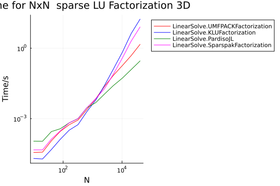

```julia
using BenchmarkTools, Random, VectorizationBase
using LinearAlgebra, SparseArrays, LinearSolve, Sparspak
import Pardiso
using Plots

BenchmarkTools.DEFAULT_PARAMETERS.seconds = 0.5

# Why do I need to set this ?
BenchmarkTools.DEFAULT_PARAMETERS.samples = 10

# Sparse matrix generation on  a n-dimensional rectangular grid. After
# https://discourse.julialang.org/t/seven-lines-of-julia-examples-sought/50416/135
# by A. Braunstein.

A ⊕ B = kron(I(size(B, 1)), A) + kron(B, I(size(A, 1)))

function lattice(n; Tv = Float64)
    d = fill(2 * one(Tv), n)
    d[1] = one(Tv)
    d[end] = one(Tv)
    spdiagm(1 => -ones(Tv, n - 1), 0 => d, -1 => -ones(Tv, n - 1))
end

lattice(L...; Tv = Float64) = lattice(L[1]; Tv) ⊕ lattice(L[2:end]...; Tv)

#
# Create a matrix similar to that of a finite difference discretization in a `dim`-dimensional
# unit cube of  ``-Δu + δu`` with approximately N unknowns. It is strictly diagonally dominant.
#
function fdmatrix(N; dim = 2, Tv = Float64, δ = 1.0e-2)
    n = N^(1 / dim) |> ceil |> Int
    lattice([n for i in 1:dim]...; Tv) + Tv(δ) * I
end

algs = [
    UMFPACKFactorization(),
    KLUFactorization(),
    SparspakFactorization(),
]
cols = [:red, :blue, :green, :magenta, :turqoise] # one color per alg

__parameterless_type(T) = Base.typename(T).wrapper
parameterless_type(x) = __parameterless_type(typeof(x))
parameterless_type(::Type{T}) where {T} = __parameterless_type(T)

#
# kmax=12 gives ≈ 40_000 unknowns max, can be watched in real time
# kmax=15 gives ≈ 328_000 unknows, you can go make a coffee.
# Main culprit is KLU factorization in 3D.
#
function run_and_plot(dim; kmax = 12)
    ns = [10 * 2^k for k in 0:kmax]

    res = [Float64[] for i in 1:length(algs)]

    for i in 1:length(ns)
        rng = MersenneTwister(123)
        A = fdmatrix(ns[i]; dim)
        n = size(A, 1)
        @info "dim=$(dim): $n × $n"
        b = rand(rng, n)
        u0 = rand(rng, n)

        for j in 1:length(algs)
            bt = @belapsed solve(prob, $(algs[j])).u setup=(prob = LinearProblem(copy($A),
                copy($b);
                u0 = copy($u0),
                alias_A = true,
                alias_b = true))
            push!(res[j], bt)
        end
    end

    p = plot(;
        ylabel = "Time/s",
        xlabel = "N",
        yscale = :log10,
        xscale = :log10,
        title = "Time for NxN  sparse LU Factorization $(dim)D",
        label = string(Symbol(parameterless_type(algs[1]))),
        legend = :outertopright)

    for i in 1:length(algs)
        plot!(p, ns, res[i];
            linecolor = cols[i],
            label = "$(string(Symbol(parameterless_type(algs[i]))))")
    end
    p
end
```

```
run_and_plot (generic function with 1 method)
```


```julia
run_and_plot(1)
```


```julia
run_and_plot(2)
```


```julia
run_and_plot(3)
```


