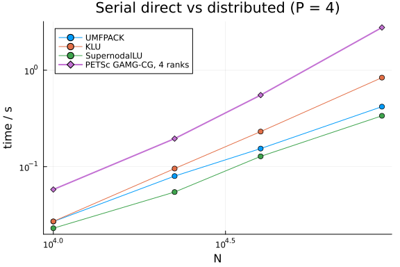

The most actionable question about a distributed linear solver is not how it
scales but **when to reach for it at all**: below some problem size, a good
serial sparse direct factorization wins outright, because the distributed solve
pays MPI setup and communication that a single process never does. This document
measures that crossover for 2-D finite-difference Laplacians: the best serial
direct solvers available through `LinearSolve.jl` against the distributed
PETSc GAMG-CG path at a fixed rank count, across a size sweep.

The output is a rule of thumb of the form "below N, use a serial factorization;
above it, the distributed solve pays." It is a property of this problem class and
this hardware, not a universal constant, and the document says so.

```julia
using MPI            # provides mpiexec()
using LinearAlgebra, SparseArrays, LinearSolve
using BenchmarkTools
using Plots
using Printf

BenchmarkTools.DEFAULT_PARAMETERS.seconds = 0.5
BenchmarkTools.DEFAULT_PARAMETERS.samples = 5

const WORKER = joinpath(@__DIR__, "run_solve.jl")
const PROJECT = Base.active_project()
const MPIEXEC_ARGS = `-launcher fork`   # MPICH_jll hydra PMI workaround; see run_solve.jl
const P_DIST = 4                        # fixed rank count for the distributed line

# Serial solves run in-process; one BLAS thread to match the one-thread-per-rank
# discipline of the distributed worker, so the comparison is core-for-core fair:
# 1 serial core against P_DIST distributed cores, which is exactly the tradeoff
# a user weighs.
BLAS.set_num_threads(1)

# Same 2-D 5-point Laplacian the worker builds (kept in sync with run_solve.jl).
function laplacian_2d(m::Int)
    n = m * m
    I_ = Int[]; J_ = Int[]; V = Float64[]
    lin(i, j) = (j - 1) * m + i
    @inbounds for j in 1:m, i in 1:m
        k = lin(i, j)
        push!(I_, k); push!(J_, k); push!(V, 4.0)
        if i > 1
            push!(I_, k); push!(J_, lin(i - 1, j)); push!(V, -1.0)
        end
        if i < m
            push!(I_, k); push!(J_, lin(i + 1, j)); push!(V, -1.0)
        end
        if j > 1
            push!(I_, k); push!(J_, lin(i, j - 1)); push!(V, -1.0)
        end
        if j < m
            push!(I_, k); push!(J_, lin(i, j + 1)); push!(V, -1.0)
        end
    end
    return sparse(I_, J_, V, n, n)
end

serial_algs = [
    ("UMFPACK", UMFPACKFactorization()),
    ("KLU", KLUFactorization()),
    ("SupernodalLU", SupernodalLUFactorization()),
]

# Target unknown counts (the worker rounds to a square grid). Modest for CI;
# the closing section describes raising the range on dedicated hardware.
const SIZES = [10_000, 22_500, 40_000, 90_000]
```

```
4-element Vector{Int64}:
 10000
 22500
 40000
 90000
```


## Methodology

Serial entries time a full `solve` (setup + factorization + solve, fresh per
sample) behind a correctness gate. The distributed entry launches the same
worker the scaling documents use, which itself gates on the true residual and
reports the end-to-end assemble/solve/gather time along with the iteration
count. Both sides therefore pay their honest setup costs: factorization for the
direct solvers, MPI launch + PETSc setup + communication for the distributed
solve.

```julia
function bench_serial(A, b, alg)
    ref = A \ b
    sol = solve(LinearProblem(A, b), alg)
    err = norm(sol.u - ref) / norm(ref)
    err < 1e-8 || return NaN
    return @belapsed solve(LinearProblem($A, $b), $alg).u evals=1
end

function bench_dist(N)
    cmd = `$(mpiexec()) $(MPIEXEC_ARGS) -n $P_DIST $(Base.julia_cmd()) --project=$(PROJECT) $(WORKER) $N cg gamg`
    out = read(addenv(cmd, "OMP_NUM_THREADS" => "1"), String)
    f = split(strip(last(filter(!isempty, split(out, '\n')))), ',')
    return (time = parse(Float64, f[6]), iters = parse(Int, f[8]),
        n = parse(Int, f[2]), retcode = f[9])
end

rows = []
for N in SIZES
    m = round(Int, sqrt(N))
    A = laplacian_2d(m)
    n = size(A, 1)
    rng_b = ones(n)   # deterministic RHS, matching the worker
    @info "n=$n"
    serial = [(name, bench_serial(A, rng_b, alg)) for (name, alg) in serial_algs]
    dist = bench_dist(N)
    push!(rows, (; n, serial, dist))
end
```


## Results

```julia
println("    N    | " * join([rpad(name, 10) for (name, _) in serial_algs], "| ") *
        "| dist P=$(P_DIST) | dist iters")
println("-"^78)
for r in rows
    svals = join([@sprintf("%9.3g ", t) for (_, t) in r.serial], "| ")
    @printf("%8d | %s| %9.3g | %d (%s)\n", r.n, svals, r.dist.time,
        r.dist.iters, r.dist.retcode)
end

best_serial = [minimum(filter(!isnan, [t for (_, t) in r.serial]); init = Inf) for r in rows]
dist_times = [r.dist.time for r in rows]
ns = [r.n for r in rows]
cross = findfirst(i -> dist_times[i] < best_serial[i], 1:length(rows))
println()
println(cross === nothing ?
    "No crossover in the measured range: the best serial factorization wins throughout." :
    "Crossover: the distributed solve first beats the best serial factorization at N = $(ns[cross]).")
```

```
N    | UMFPACK   | KLU       | SupernodalLU| dist P=4 | dist iters
---------------------------------------------------------------------------
---
   10000 |     0.027 |    0.0271 |     0.023 |     0.058 | 12 (Success)
   22500 |    0.0798 |    0.0955 |    0.0545 |     0.195 | 12 (Success)
   40000 |     0.154 |     0.231 |     0.128 |     0.552 | 13 (Success)
   90000 |     0.419 |     0.838 |     0.337 |      2.77 | 14 (Success)

No crossover in the measured range: the best serial factorization wins thro
ughout.
```


```julia
p = plot(; xlabel = "N", ylabel = "time / s", xscale = :log10, yscale = :log10,
    title = "Serial direct vs distributed (P = $(P_DIST))", legend = :topleft)
for (j, (name, _)) in enumerate(serial_algs)
    ys = [r.serial[j][2] for r in rows]
    mask = .!isnan.(ys)
    any(mask) && plot!(p, ns[mask], ys[mask]; marker = :circle, label = name)
end
plot!(p, ns, dist_times; marker = :diamond, linewidth = 2,
    label = "PETSc GAMG-CG, $(P_DIST) ranks")
p
```




## Reading the result

Where the diamond line crosses below the best serial curve is the size at which
distribution starts paying on this problem class. Below it, the winning move is a
serial factorization (and, for repeated solves, its cached reuse — see the
CacheReuse document in the LinearSolve folder). The distributed iteration counts
are printed so a reader can check that GAMG stays algorithmically flat across the
sweep; if iterations grew, the crossover would be an artifact of solver strength
rather than parallelism.

Scope: 2-D FD Laplacians (SPD, well-conditioned, planar sparsity), one fixed rank
count, modest sizes chosen to fit a CI budget. The conclusions transfer to
problems of similar structure, not to arbitrary sparse systems. On dedicated
hardware, extending `SIZES` upward and adding rank counts turns the single
crossover point into a crossover *frontier*; that is the intended follow-up once
this baseline is established.

## Appendix


## Appendix

These benchmarks are a part of the SciMLBenchmarks.jl repository, found at: [https://github.com/SciML/SciMLBenchmarks.jl](https://github.com/SciML/SciMLBenchmarks.jl). For more information on high-performance scientific machine learning, check out the SciML Open Source Software Organization [https://sciml.ai](https://sciml.ai).

To locally run this benchmark, do the following commands:

```
using SciMLBenchmarks
SciMLBenchmarks.weave_file("benchmarks/LinearSolveDistributed","SerialCrossover.jmd")
```

Computer Information:

```
Julia Version 1.12.6
Commit 15346901f00 (2026-04-09 19:20 UTC)
Build Info:
  Official https://julialang.org release
Platform Info:
  OS: Linux (x86_64-linux-gnu)
  CPU: 128 × AMD EPYC 7502 32-Core Processor
  WORD_SIZE: 64
  LLVM: libLLVM-18.1.7 (ORCJIT, znver2)
  GC: Built with stock GC
Threads: 128 default, 1 interactive, 128 GC (on 128 virtual cores)
Environment:
  JULIA_NUM_THREADS = auto

```

Package Information:

```
Status `~/github-runners/amdci3-1/_work/SciMLBenchmarks.jl/SciMLBenchmarks.jl/benchmarks/LinearSolveDistributed/Project.toml`
  [6e4b80f9] BenchmarkTools v1.8.0
⌃ [7ed4a6bd] LinearSolve v5.5.0
  [da04e1cc] MPI v0.20.26
  [3da0fdf6] MPIPreferences v0.1.12
  [ace2c81b] PETSc v0.4.10
  [91a5bcdd] Plots v1.41.6
⌃ [0bca4576] SciMLBase v3.36.0
⌃ [31c91b34] SciMLBenchmarks v0.1.3 [loaded: v0.1.5]
  [a0a7dd2c] SparseMatricesCSR v0.6.12
  [37e2e46d] LinearAlgebra v1.12.0
  [de0858da] Printf v1.11.0
  [2f01184e] SparseArrays v1.12.0
Info Packages marked with ⌃ have new versions available and may be upgradable.
```

And the full manifest:

```
Status `~/github-runners/amdci3-1/_work/SciMLBenchmarks.jl/SciMLBenchmarks.jl/benchmarks/LinearSolveDistributed/Manifest.toml`
⌃ [47edcb42] ADTypes v1.22.2
  [14f7f29c] AMD v0.5.3
  [7d9f7c33] Accessors v0.1.45
  [79e6a3ab] Adapt v4.7.0
  [66dad0bd] AliasTables v1.1.3
⌃ [4fba245c] ArrayInterface v7.27.0
  [a9b6321e] Atomix v1.1.3
  [6e4b80f9] BenchmarkTools v1.8.0
  [d1d4a3ce] BitFlags v0.1.10
  [62783981] BitTwiddlingConvenienceFunctions v0.1.6
  [2a0fbf3d] CPUSummary v0.2.7
  [fb6a15b2] CloseOpenIntervals v0.1.13
  [944b1d66] CodecZlib v0.7.8
  [35d6a980] ColorSchemes v3.31.0
  [3da002f7] ColorTypes v0.12.1
  [c3611d14] ColorVectorSpace v0.11.0
  [5ae59095] Colors v0.13.1
⌃ [38540f10] CommonSolve v0.2.11
  [bbf7d656] CommonSubexpressions v0.3.1
⌃ [f70d9fcc] CommonWorldInvalidations v1.1.1
  [34da2185] Compat v4.18.1
  [a33af91c] CompositionsBase v0.1.2
⌃ [2569d6c7] ConcreteStructs v0.2.6
⌃ [f0e56b4a] ConcurrentUtilities v2.5.1
  [8f4d0f93] Conda v1.10.3
  [187b0558] ConstructionBase v1.6.0
  [d38c429a] Contour v0.6.3
  [adafc99b] CpuId v0.3.1
⌃ [a8cc5b0e] Crayons v4.1.1
  [9a962f9c] DataAPI v1.16.0
⌃ [864edb3b] DataStructures v0.19.5
  [e2d170a0] DataValueInterfaces v1.0.0
  [8bb1440f] DelimitedFiles v1.9.1
  [163ba53b] DiffResults v1.1.0
  [b552c78f] DiffRules v1.16.0
  [ffbed154] DocStringExtensions v0.9.5
  [4e289a0a] EnumX v1.0.7
  [460bff9d] ExceptionUnwrapping v0.1.11
⌃ [e2ba6199] ExprTools v0.1.10
  [c87230d0] FFMPEG v0.4.5
⌃ [64ca27bc] FindFirstFunctions v3.2.0
⌅ [53c48c17] FixedPointNumbers v0.8.6
  [1fa38f19] Format v1.3.7
⌃ [f6369f11] ForwardDiff v1.4.1
  [069b7b12] FunctionWrappers v1.1.3
⌃ [77dc65aa] FunctionWrappersWrappers v1.10.1
  [46192b85] GPUArraysCore v0.2.0
  [28b8d3ca] GR v0.73.26
  [d7ba0133] Git v1.5.0
  [42e2da0e] Grisu v1.0.2
⌅ [cd3eb016] HTTP v1.11.0
⌅ [eafb193a] Highlights v0.5.3
  [7073ff75] IJulia v1.34.4
  [615f187c] IfElse v0.1.1
  [3587e190] InverseFunctions v0.1.17
  [92d709cd] IrrationalConstants v0.2.6
  [82899510] IteratorInterfaceExtensions v1.0.0
  [1019f520] JLFzf v0.1.11
  [692b3bcd] JLLWrappers v1.8.0
⌅ [682c06a0] JSON v0.21.4
⌃ [ba0b0d4f] Krylov v0.10.8
  [b964fa9f] LaTeXStrings v1.4.0
⌃ [23fbe1c1] Latexify v0.16.10
  [10f19ff3] LayoutPointers v0.1.17
⌃ [7ed4a6bd] LinearSolve v5.5.0
  [2ab3a3ac] LogExpFunctions v1.0.1
  [e6f89c97] LoggingExtras v1.2.0
  [da04e1cc] MPI v0.20.26
  [3da0fdf6] MPIPreferences v0.1.12
  [1914dd2f] MacroTools v0.5.16
  [d125e4d3] ManualMemory v0.1.8
  [299715c1] MarchingCubes v0.1.11
  [739be429] MbedTLS v1.1.10
  [442fdcdd] Measures v0.3.3
  [e1d29d7a] Missings v1.2.0
⌃ [46d2c3a1] MuladdMacro v0.2.6
  [ffc61752] Mustache v1.0.21
  [77ba4419] NaNMath v1.1.4
  [6fe1bfb0] OffsetArrays v1.17.0
  [4d8831e6] OpenSSL v1.6.1
⌅ [bac558e1] OrderedCollections v1.8.2
  [ace2c81b] PETSc v0.4.10
⌃ [69de0a69] Parsers v2.8.6 [loaded: v2.8.7]
  [eebad327] PkgVersion v0.3.3
  [ccf2f8ad] PlotThemes v3.3.0
  [995b91a9] PlotUtils v1.4.4
  [91a5bcdd] Plots v1.41.6
  [f517fe37] Polyester v0.7.19
  [1d0040c9] PolyesterWeave v0.2.2
⌃ [d236fae5] PreallocationTools v1.3.0
  [aea7be01] PrecompileTools v1.3.4
  [21216c6a] Preferences v1.5.2
  [43287f4e] PtrArrays v1.4.0
⌃ [0c0d3e7f] PureKLU v1.1.1
  [3cdcf5f2] RecipesBase v1.3.4
  [01d81517] RecipesPipeline v0.6.12
⌃ [731186ca] RecursiveArrayTools v4.3.4
  [189a3867] Reexport v1.2.2
  [05181044] RelocatableFolders v1.0.1
  [ae029012] Requires v1.3.1
⌃ [7e49a35a] RuntimeGeneratedFunctions v0.5.22
  [94e857df] SIMDTypes v0.1.0
⌃ [0bca4576] SciMLBase v3.36.0
⌃ [31c91b34] SciMLBenchmarks v0.1.3 [loaded: v0.1.5]
⌃ [a6db7da4] SciMLLogging v2.0.3
⌃ [c0aeaf25] SciMLOperators v1.24.3
⌃ [431bcebd] SciMLPublic v1.2.3
⌃ [53ae85a6] SciMLStructures v1.10.3
  [6c6a2e73] Scratch v1.3.0
  [efcf1570] Setfield v1.1.2
  [992d4aef] Showoff v1.0.3
  [777ac1f9] SimpleBufferStream v1.2.0
  [a2af1166] SortingAlgorithms v1.2.3
⌃ [a57abbd0] SparseColumnPivotedQR v2.1.4
  [a0a7dd2c] SparseMatricesCSR v0.6.12
⌃ [276daf66] SpecialFunctions v2.8.0
  [860ef19b] StableRNGs v1.0.4
⌃ [aedffcd0] Static v1.4.4
  [0d7ed370] StaticArrayInterface v1.10.0
  [90137ffa] StaticArrays v1.9.18
  [1e83bf80] StaticArraysCore v1.4.4
  [10745b16] Statistics v1.11.1
  [82ae8749] StatsAPI v1.8.0
  [2913bbd2] StatsBase v0.34.12
  [7792a7ef] StrideArraysCore v0.5.9
  [69024149] StringEncodings v0.3.7
⌃ [2efcf032] SymbolicIndexingInterface v0.3.51
  [3783bdb8] TableTraits v1.0.1
  [bd369af6] Tables v1.13.0
  [62fd8b95] TensorCore v0.1.1
  [8290d209] ThreadingUtilities v0.5.6
  [3bb67fe8] TranscodingStreams v0.11.3
  [781d530d] TruncatedStacktraces v1.4.0
⌃ [5c2747f8] URIs v1.6.1
  [1cfade01] UnicodeFun v0.4.1
  [b8865327] UnicodePlots v3.8.4
  [013be700] UnsafeAtomics v0.3.1
  [41fe7b60] Unzip v0.2.0
  [81def892] VersionParsing v1.3.0
  [44d3d7a6] Weave v0.10.12
  [ddb6d928] YAML v0.4.16
  [c2297ded] ZMQ v1.5.1
  [6e34b625] Bzip2_jll v1.0.9+0
  [83423d85] Cairo_jll v1.18.7+0
  [ee1fde0b] Dbus_jll v1.16.2+0
  [2702e6a9] EpollShim_jll v0.0.20230411+1
  [2e619515] Expat_jll v2.8.2+0
⌅ [b22a6f82] FFMPEG_jll v8.1.2+0
  [a3f928ae] Fontconfig_jll v2.17.1+0
  [d7e528f0] FreeType2_jll v2.14.3+1
  [559328eb] FriBidi_jll v1.0.17+0
  [0656b61e] GLFW_jll v3.4.1+1
  [d2c73de3] GR_jll v0.73.26+0
⌅ [b0724c58] GettextRuntime_jll v0.22.4+0
  [61579ee1] Ghostscript_jll v9.55.1+0
  [020c3dae] Git_LFS_jll v3.7.1+0
⌃ [f8c6e375] Git_jll v2.54.0+0
⌃ [7746bdde] Glib_jll v2.86.3+0
  [3b182d85] Graphite2_jll v1.3.16+0
⌅ [2e76f6c2] HarfBuzz_jll v8.5.1+0
  [e33a78d0] Hwloc_jll v2.14.0+0
  [1d5cc7b8] IntelOpenMP_jll v2025.2.0+0
⌃ [aacddb02] JpegTurbo_jll v3.2.0+0
  [c1c5ebd0] LAME_jll v3.100.3+0
  [88015f11] LERC_jll v4.1.0+0
  [1d63c593] LLVMOpenMP_jll v22.1.7+0
⌅ [e9f186c6] Libffi_jll v3.4.7+0
  [7e76a0d4] Libglvnd_jll v1.7.1+1
  [94ce4f54] Libiconv_jll v1.18.0+0
  [4b2f31a3] Libmount_jll v2.42.0+0
  [89763e89] Libtiff_jll v4.7.3+0
  [38a345b3] Libuuid_jll v2.42.0+0
  [856f044c] MKL_jll v2025.2.0+0
  [b5ada748] MPIABI_jll v0.1.5+0
  [7cb0a576] MPICH_jll v5.0.1+0
  [f1f71cc9] MPItrampoline_jll v5.5.6+0
  [c8ffd9c3] MbedTLS_jll v2.28.1010+0
  [9237b28f] MicrosoftMPI_jll v10.1.4+3
  [e7412a2a] Ogg_jll v1.3.6+0
⌃ [656ef2d0] OpenBLAS32_jll v0.3.33+2
  [fe0851c0] OpenMPI_jll v5.0.11+0
⌃ [9bd350c2] OpenSSH_jll v10.4.1+0
  [efe28fd5] OpenSpecFun_jll v0.5.6+0
  [91d4177d] Opus_jll v1.6.1+0
  [8fa3689e] PETSc_jll v3.22.1+0
⌃ [36c8627f] Pango_jll v1.57.1+0
  [30392449] Pixman_jll v0.46.4+0
  [c0090381] Qt6Base_jll v6.10.2+2
  [629bc702] Qt6Declarative_jll v6.10.2+2
  [ce943373] Qt6ShaderTools_jll v6.10.2+1
  [6de9746b] Qt6Svg_jll v6.10.2+0
  [e99dba38] Qt6Wayland_jll v6.10.2+1
⌃ [aabda75e] SCALAPACK32_jll v2.2.300+0
  [a44049a8] Vulkan_Loader_jll v1.3.243+0
  [a2964d1f] Wayland_jll v1.24.0+0
⌅ [02c8fc9c] XML2_jll v2.13.9+0
  [ffd25f8a] XZ_jll v5.8.3+0
  [f67eecfb] Xorg_libICE_jll v1.1.2+0
  [c834827a] Xorg_libSM_jll v1.2.6+0
  [4f6342f7] Xorg_libX11_jll v1.8.13+0
  [0c0b7dd1] Xorg_libXau_jll v1.0.13+0
  [935fb764] Xorg_libXcursor_jll v1.2.4+0
  [a3789734] Xorg_libXdmcp_jll v1.1.6+0
  [1082639a] Xorg_libXext_jll v1.3.8+0
  [d091e8ba] Xorg_libXfixes_jll v6.0.2+0
⌃ [a51aa0fd] Xorg_libXi_jll v1.8.3+0
  [d1454406] Xorg_libXinerama_jll v1.1.7+0
  [ec84b674] Xorg_libXrandr_jll v1.5.6+0
  [ea2f1a96] Xorg_libXrender_jll v0.9.12+0
  [a65dc6b1] Xorg_libpciaccess_jll v0.19.0+0
  [c7cfdc94] Xorg_libxcb_jll v1.17.1+0
  [cc61e674] Xorg_libxkbfile_jll v1.2.0+0
  [e920d4aa] Xorg_xcb_util_cursor_jll v0.1.6+0
  [12413925] Xorg_xcb_util_image_jll v0.4.1+0
  [2def613f] Xorg_xcb_util_jll v0.4.1+0
  [975044d2] Xorg_xcb_util_keysyms_jll v0.4.1+0
  [0d47668e] Xorg_xcb_util_renderutil_jll v0.3.10+0
  [c22f9ab0] Xorg_xcb_util_wm_jll v0.4.2+0
  [35661453] Xorg_xkbcomp_jll v1.4.7+0
  [33bec58e] Xorg_xkeyboard_config_jll v2.47.0+2
  [c5fb5394] Xorg_xtrans_jll v1.6.0+0
  [8f1865be] ZeroMQ_jll v4.3.6+0
  [3161d3a3] Zstd_jll v1.5.7+1
  [35ca27e7] eudev_jll v3.2.14+0
⌅ [214eeab7] fzf_jll v0.61.1+0
⌃ [a4ae2306] libaom_jll v3.13.3+0
  [0ac62f75] libass_jll v0.17.4+0
  [1183f4f0] libdecor_jll v0.2.2+0
⌃ [8e53e030] libdrm_jll v2.4.125+1
  [2db6ffa8] libevdev_jll v1.13.4+0
  [f638f0a6] libfdk_aac_jll v2.0.4+0
  [36db933b] libinput_jll v1.28.1+0
  [b53b4c65] libpng_jll v1.6.58+0
  [a9144af2] libsodium_jll v1.0.21+0
  [9a156e7d] libva_jll v2.23.0+0
  [f27f6e37] libvorbis_jll v1.3.8+0
  [9aeb927a] mpif_jll v0.1.7+0
  [009596ad] mtdev_jll v1.1.7+0
  [1317d2d5] oneTBB_jll v2022.3.0+0
⌅ [1270edf5] x264_jll v10164.0.1+0
  [dfaa095f] x265_jll v4.1.0+0
  [d8fb68d0] xkbcommon_jll v1.13.0+0
  [0dad84c5] ArgTools v1.1.2
  [56f22d72] Artifacts v1.11.0
  [2a0f44e3] Base64 v1.11.0
  [ade2ca70] Dates v1.11.0
  [8ba89e20] Distributed v1.11.0
  [f43a241f] Downloads v1.7.0
  [7b1f6079] FileWatching v1.11.0
  [9fa8497b] Future v1.11.0
  [b77e0a4c] InteractiveUtils v1.11.0
  [ac6e5ff7] JuliaSyntaxHighlighting v1.12.0
  [4af54fe1] LazyArtifacts v1.11.0
  [b27032c2] LibCURL v0.6.4
  [76f85450] LibGit2 v1.11.0
  [8f399da3] Libdl v1.11.0
  [37e2e46d] LinearAlgebra v1.12.0
  [56ddb016] Logging v1.11.0
  [d6f4376e] Markdown v1.11.0
  [a63ad114] Mmap v1.11.0
  [ca575930] NetworkOptions v1.3.0
  [44cfe95a] Pkg v1.12.1
  [de0858da] Printf v1.11.0
  [9abbd945] Profile v1.11.0
  [3fa0cd96] REPL v1.11.0
  [9a3f8284] Random v1.11.0
  [ea8e919c] SHA v0.7.0
  [9e88b42a] Serialization v1.11.0
  [6462fe0b] Sockets v1.11.0
  [2f01184e] SparseArrays v1.12.0
  [f489334b] StyledStrings v1.11.0
  [4607b0f0] SuiteSparse
  [fa267f1f] TOML v1.0.3
  [a4e569a6] Tar v1.10.0
  [8dfed614] Test v1.11.0
  [cf7118a7] UUIDs v1.11.0
  [4ec0a83e] Unicode v1.11.0
  [e66e0078] CompilerSupportLibraries_jll v1.3.0+1
  [deac9b47] LibCURL_jll v8.15.0+0
  [e37daf67] LibGit2_jll v1.9.0+0
  [29816b5a] LibSSH2_jll v1.11.3+1
  [14a3606d] MozillaCACerts_jll v2025.5.20
  [4536629a] OpenBLAS_jll v0.3.29+0
  [05823500] OpenLibm_jll v0.8.7+0
  [458c3c95] OpenSSL_jll v3.5.4+0
  [efcefdf7] PCRE2_jll v10.44.0+1
  [bea87d4a] SuiteSparse_jll v7.8.3+2
  [83775a58] Zlib_jll v1.3.1+2
  [8e850b90] libblastrampoline_jll v5.15.0+0
  [8e850ede] nghttp2_jll v1.64.0+1
  [3f19e933] p7zip_jll v17.7.0+0
Info Packages marked with ⌃ and ⌅ have new versions available. Those with ⌃ may be upgradable, but those with ⌅ are restricted by compatibility constraints from upgrading. To see why use `status --outdated -m`
```

