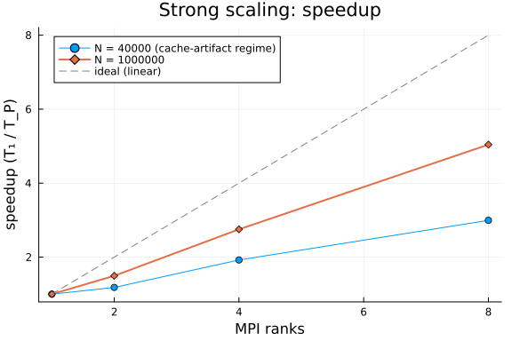
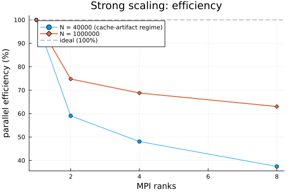

**Strong scaling** fixes the problem size and grows the number of MPI ranks. The
question it answers is the one a prospective user asks first: *if I throw more cores at
my linear solve, does it actually get faster — and how far does that hold before
communication overhead eats the gains?*

We solve a fixed 2-D finite-difference Laplacian with PETSc's CG via `LinearSolve.jl`'s
`PETScAlgorithm`, across a range of rank counts. The matrix is a replicated
`SparseMatrixCSC`; each rank row-owns its slice, PETSc solves the distributed system, and
the full solution is gathered back. All correctness
checking (residual `< 1e-6`) happens inside `run_solve.jl` on each worker — a nonzero exit
would throw here, so any row that returns has already passed.

**Preconditioner choice matters for a scaling study.** PETSc's default block-Jacobi
preconditioning is *rank-dependent* — its block structure follows the row partition, so
the iteration count (and thus the work) changes with the number of ranks. That silently
corrupts strong scaling into "different algorithm per rank count," which shows up as
impossible superlinear speedup. We therefore avoid it, use GAMG (whose strength is
near partition-independent — see below), and print the iteration count in the table for
every rank count precisely so this invariance is visible and auditable.

```julia
using MPI            # provides mpiexec()
using Plots

const WORKER = joinpath(@__DIR__, "run_solve.jl")
const PROJECT = Base.active_project()

# MPICH_jll 5.x hydra fails to bootstrap PMI on a single node; `-launcher fork`
# makes it spawn ranks with fork() instead. One place, reused by every mpiexec call.
const MPIEXEC_ARGS = `-launcher fork`

# Run run_solve.jl under `mpiexec -n P`, return the CSV line rank 0 prints:
#   ranks,N,nnz,solver,pc,time_s,residual,iters,retcode
# OMP_NUM_THREADS=1 forces one thread per rank so parallelism comes only from the
# rank count — otherwise the -n 1 baseline oversubscribes all cores and fakes
# superlinear speedup (see run_solve.jl for the full rationale).
function run_ranks(P; N, solver = "cg", pc = "none")
    cmd = `$(mpiexec()) $(MPIEXEC_ARGS) -n $P $(Base.julia_cmd()) --project=$(PROJECT) $(WORKER) $N $solver $pc`
    out = read(addenv(cmd, "OMP_NUM_THREADS" => "1"), String)
    line = strip(last(filter(!isempty, split(out, '\n'))))
    fields = split(line, ',')
    return (ranks = parse(Int, fields[1]),
            N = parse(Int, fields[2]),
            nnz = parse(Int, fields[3]),
            time = parse(Float64, fields[6]),
            residual = parse(Float64, fields[7]),
            iters = parse(Int, fields[8]),
            retcode = fields[9])
end
```

```
run_ranks (generic function with 1 method)
```


## Run the rank sweep

We run the sweep at **two problem sizes on purpose**. At small `N` the per-rank slice
of the matrix and multigrid hierarchy drops into cache as ranks are added, and on a
generic (JLL) PETSc build that produces spectacular but meaningless superlinear
"speedup" — an artifact worth *showing* rather than hiding, because it is exactly what
a naive benchmark would report as a triumph. At large `N` the working set exceeds
cache at every rank count and the curve measures the solver and the network, not the
memory hierarchy. The contrast between the two curves is the content.

We solve with PETSc's CG under **GAMG** (smoothed-aggregation algebraic multigrid).
GAMG is the right preconditioner for a scaling study of an elliptic problem for two
reasons. First, it is *algorithmically scalable*: iteration count stays roughly constant
as `N` grows, instead of the `O(√N)` growth of unpreconditioned or Jacobi CG — so the
solve cost tracks the parallel hardware, not the conditioning. Second, it makes the
benchmark measure what a real user would actually run: nobody solves a large Laplacian
with plain CG. (An earlier draft used unpreconditioned CG and produced impossible
superlinear speedup; the root cause was a slow serial baseline — hundreds of iterations,
each dominated by per-iteration overhead on this JLL PETSc build — being chipped away by
parallelism. GAMG removes that confound by collapsing the iteration count.)

```julia
const RANKS = [1, 2, 4, 8]
const N_SMALL = 40_000       # cache-artifact regime, kept deliberately (see text)
const N_LARGE = 1_000_000    # honest regime: working set exceeds cache everywhere

res_small = [run_ranks(P; N = N_SMALL, solver = "cg", pc = "gamg") for P in RANKS]
res_large = [run_ranks(P; N = N_LARGE, solver = "cg", pc = "gamg") for P in RANKS]
```

```
4-element Vector{@NamedTuple{ranks::Int64, N::Int64, nnz::Int64, time::Floa
t64, residual::Float64, iters::Int64, retcode::SubString{String}}}:
 (ranks = 1, N = 1000000, nnz = 4996000, time = 4.988570993, residual = 6.2
69221372956215e-9, iters = 17, retcode = "Success")
 (ranks = 2, N = 1000000, nnz = 4996000, time = 3.336496851, residual = 5.5
75851590361861e-9, iters = 17, retcode = "Success")
 (ranks = 4, N = 1000000, nnz = 4996000, time = 1.812886093, residual = 6.5
14614408118603e-9, iters = 17, retcode = "Success")
 (ranks = 8, N = 1000000, nnz = 4996000, time = 0.98943032, residual = 4.61
0859765975969e-9, iters = 17, retcode = "Success")
```


## Speedup and efficiency

Speedup is `T₁ / T_P`; parallel efficiency is `T₁ / (P · T_P)` — the fraction of ideal
linear scaling actually achieved. Efficiency near 1.0 means near-perfect scaling; it
falls as communication and the serial fraction (Amdahl) start to dominate — and it
rises *above* 1.0 when the memory hierarchy, not the solver, dominates the ratio.

```julia
using Printf

function report(results, N)
    t1 = results[1].time
    speedup = [t1 / r.time for r in results]
    efficiency = [t1 / (r.ranks * r.time) for r in results]
    println("N = $N")
    println("ranks |  time (s)  | iters | speedup | efficiency | residual  | retcode")
    println("------+------------+-------+---------+------------+-----------+--------")
    for (r, s, e) in zip(results, speedup, efficiency)
        @printf("%5d | %10.4g | %5d | %7.2f | %9.1f%% | %9.2e | %s\n",
            r.ranks, r.time, r.iters, s, 100 * e, r.residual, r.retcode)
    end
    # Auditability annotations (informational, not failures):
    #  * iters spread: GAMG's aggregation is partition-dependent, so iteration
    #    counts can drift a little with rank count; a large spread means the
    #    preconditioner strength is changing with P and the ratios are
    #    contaminated by algorithm change, not just parallel work.
    #  * superlinear efficiency: expected for the small-N series (cache and
    #    working-set effects on a generic JLL PETSc build); if the LARGE series
    #    trips it too, the honest regime has not been reached yet.
    itset = [r.iters for r in results]
    if maximum(itset) - minimum(itset) > 0.25 * minimum(itset)
        @warn "GAMG iteration count varies >25% across ranks at N=$N" iters = itset
    end
    if maximum(efficiency) > 1.10
        @warn "Superlinear efficiency at N=$N — cache/working-set regime, not a marketing number." efficiency
    end
    return speedup, efficiency
end

sp_small, eff_small = report(res_small, N_SMALL)
println()
sp_large, eff_large = report(res_large, N_LARGE)
```

```
N = 40000
ranks |  time (s)  | iters | speedup | efficiency | residual  | retcode
------+------------+-------+---------+------------+-----------+--------
    1 |     0.1416 |    13 |    1.00 |     100.0% |  4.86e-09 | Success
    2 |     0.1199 |    13 |    1.18 |      59.1% |  8.30e-09 | Success
    4 |    0.07363 |    13 |    1.92 |      48.1% |  3.79e-09 | Success
    8 |    0.04728 |    13 |    3.00 |      37.4% |  5.32e-09 | Success

N = 1000000
ranks |  time (s)  | iters | speedup | efficiency | residual  | retcode
------+------------+-------+---------+------------+-----------+--------
    1 |      4.989 |    17 |    1.00 |     100.0% |  6.27e-09 | Success
    2 |      3.336 |    17 |    1.50 |      74.8% |  5.58e-09 | Success
    4 |      1.813 |    17 |    2.75 |      68.8% |  6.51e-09 | Success
    8 |     0.9894 |    17 |    5.04 |      63.0% |  4.61e-09 | Success
([1.0, 1.4951523156705055, 2.7517288660672627, 5.041861859458683], [1.0, 0.
7475761578352528, 0.6879322165168157, 0.6302327324323354])
```


## Plots

```julia
p1 = plot(RANKS, sp_small;
    marker = :circle, label = "N = $(N_SMALL) (cache-artifact regime)",
    xlabel = "MPI ranks", ylabel = "speedup (T₁ / T_P)",
    title = "Strong scaling: speedup", legend = :topleft)
plot!(p1, RANKS, sp_large; marker = :diamond, linewidth = 2,
    label = "N = $(N_LARGE)")
plot!(p1, RANKS, RANKS; linestyle = :dash, color = :gray, label = "ideal (linear)")
p1
```



```julia
p2 = plot(RANKS, 100 .* eff_small;
    marker = :circle, label = "N = $(N_SMALL) (cache-artifact regime)",
    xlabel = "MPI ranks", ylabel = "parallel efficiency (%)",
    title = "Strong scaling: efficiency", legend = :topleft)
plot!(p2, RANKS, 100 .* eff_large; marker = :diamond, linewidth = 2,
    label = "N = $(N_LARGE)")
hline!(p2, [100]; linestyle = :dash, color = :gray, label = "ideal (100%)")
p2
```




## Reading the result

The two curves against the dashed ideal are the whole story. The small-`N` series
shoots far above ideal: each added rank shrinks the per-rank working set into faster
cache, so the ratio measures the memory hierarchy, not parallel efficiency — a number
that looks like a triumph and means nothing. The large-`N` series is the honest one:
how close to linear adding ranks gets when the working set exceeds cache at every
rank count, and where communication starts to bend the curve away. The point where
its efficiency drops below ~70% is a reasonable practical ceiling for this problem
size on this hardware.

Larger systems amortize communication better still: extending `N_LARGE` toward
`4_000_000` and `RANKS` beyond 8 charts the fuller envelope, at proportionally larger
run cost. The size dependence in the other direction — when to prefer a serial
factorization outright — is the subject of the crossover companion document.

## Appendix


## Appendix

These benchmarks are a part of the SciMLBenchmarks.jl repository, found at: [https://github.com/SciML/SciMLBenchmarks.jl](https://github.com/SciML/SciMLBenchmarks.jl). For more information on high-performance scientific machine learning, check out the SciML Open Source Software Organization [https://sciml.ai](https://sciml.ai).

To locally run this benchmark, do the following commands:
```
using SciMLBenchmarks
SciMLBenchmarks.weave_file("benchmarks/LinearSolveDistributed","StrongScaling.jmd")
```

Computer Information:

```
Julia Version 1.12.7
Commit 6d172b025e4 (2026-08-15 08:05 UTC)
Build Info:
  Official https://julialang.org release
Platform Info:
  OS: Linux (x86_64-linux-gnu)
  CPU: 128 × AMD EPYC 7502 32-Core Processor
  WORD_SIZE: 64
  LLVM: libLLVM-18.1.7 (ORCJIT, znver2)
  GC: Built with stock GC
Threads: 128 default, 1 interactive, 128 GC (on 128 virtual cores)
Environment:
  JULIA_NUM_THREADS = auto

```

Package Information:

```
Status `~/github-runners/amdci3-1/_work/SciMLBenchmarks.jl/SciMLBenchmarks.jl/benchmarks/LinearSolveDistributed/Project.toml`
  [6e4b80f9] BenchmarkTools v1.8.0
⌃ [7ed4a6bd] LinearSolve v5.16.0
  [da04e1cc] MPI v0.20.27
  [3da0fdf6] MPIPreferences v0.1.12
  [ace2c81b] PETSc v0.4.10
  [91a5bcdd] Plots v1.41.7
  [0bca4576] SciMLBase v3.53.1
⌃ [31c91b34] SciMLBenchmarks v0.1.3 [loaded: v0.2.1]
  [a0a7dd2c] SparseMatricesCSR v0.6.12
  [37e2e46d] LinearAlgebra v1.12.0
  [de0858da] Printf v1.11.0
  [2f01184e] SparseArrays v1.12.0
Info Packages marked with ⌃ have new versions available and may be upgradable.
```

And the full manifest:

```
Status `~/github-runners/amdci3-1/_work/SciMLBenchmarks.jl/SciMLBenchmarks.jl/benchmarks/LinearSolveDistributed/Manifest.toml`
  [47edcb42] ADTypes v1.24.0
  [14f7f29c] AMD v0.5.4
  [7d9f7c33] Accessors v0.1.45
  [79e6a3ab] Adapt v4.7.0
  [66dad0bd] AliasTables v1.1.3
  [4fba245c] ArrayInterface v7.30.1
⌃ [a9b6321e] Atomix v1.1.3
  [6e4b80f9] BenchmarkTools v1.8.0
  [62783981] BitTwiddlingConvenienceFunctions v0.1.6
  [2a0fbf3d] CPUSummary v0.2.7
  [fb6a15b2] CloseOpenIntervals v0.1.13
  [35d6a980] ColorSchemes v3.31.0
  [3da002f7] ColorTypes v0.12.1
  [c3611d14] ColorVectorSpace v0.11.0
  [5ae59095] Colors v0.13.1
  [38540f10] CommonSolve v0.2.14
  [bbf7d656] CommonSubexpressions v0.3.1
  [f70d9fcc] CommonWorldInvalidations v1.2.2
  [34da2185] Compat v4.18.1
  [a33af91c] CompositionsBase v0.1.2
  [2569d6c7] ConcreteStructs v0.2.8
  [8f4d0f93] Conda v1.10.3
  [187b0558] ConstructionBase v1.6.0
  [d38c429a] Contour v0.6.3
  [adafc99b] CpuId v0.3.1
  [a8cc5b0e] Crayons v4.2.0
  [9a962f9c] DataAPI v1.16.0
  [864edb3b] DataStructures v0.19.6
  [e2d170a0] DataValueInterfaces v1.0.0
  [8bb1440f] DelimitedFiles v1.9.1
  [163ba53b] DiffResults v1.1.0
  [b552c78f] DiffRules v1.16.0
  [ffbed154] DocStringExtensions v0.9.5
  [4e289a0a] EnumX v1.0.7
  [e2ba6199] ExprTools v0.1.11
  [c87230d0] FFMPEG v0.4.5
  [64ca27bc] FindFirstFunctions v3.2.1
⌅ [53c48c17] FixedPointNumbers v0.8.6
  [1fa38f19] Format v1.3.7
  [f6369f11] ForwardDiff v1.4.5
  [069b7b12] FunctionWrappers v1.1.3
  [77dc65aa] FunctionWrappersWrappers v1.13.0
  [46192b85] GPUArraysCore v0.2.0
  [28b8d3ca] GR v0.73.27
  [d7ba0133] Git v1.5.0
⌅ [eafb193a] Highlights v0.5.3
  [7073ff75] IJulia v1.34.4
  [615f187c] IfElse v0.1.1
  [3587e190] InverseFunctions v0.1.17
  [92d709cd] IrrationalConstants v0.2.6
  [82899510] IteratorInterfaceExtensions v1.0.0
  [1019f520] JLFzf v0.1.11
  [692b3bcd] JLLWrappers v1.8.0
⌅ [682c06a0] JSON v0.21.4
  [ba0b0d4f] Krylov v0.10.9
  [2faa5264] LHLFactorization v2.2.2
  [b964fa9f] LaTeXStrings v1.4.1
  [23fbe1c1] Latexify v0.16.12
  [10f19ff3] LayoutPointers v0.1.17
⌃ [7ed4a6bd] LinearSolve v5.16.0
  [2ab3a3ac] LogExpFunctions v1.0.1
  [e6f89c97] LoggingExtras v1.2.0
  [da04e1cc] MPI v0.20.27
  [3da0fdf6] MPIPreferences v0.1.12
  [1914dd2f] MacroTools v0.5.16
  [d125e4d3] ManualMemory v0.1.8
  [299715c1] MarchingCubes v0.1.11
  [442fdcdd] Measures v0.3.3
  [e1d29d7a] Missings v1.2.0
  [ffc61752] Mustache v1.0.21
  [77ba4419] NaNMath v1.1.4
  [6fe1bfb0] OffsetArrays v1.17.0
  [bac558e1] OrderedCollections v2.0.1
  [ace2c81b] PETSc v0.4.10
⌅ [69de0a69] Parsers v2.8.8
  [eebad327] PkgVersion v0.3.3
  [ccf2f8ad] PlotThemes v3.3.0
  [995b91a9] PlotUtils v1.4.4
  [91a5bcdd] Plots v1.41.7
  [f517fe37] Polyester v0.7.19
  [1d0040c9] PolyesterWeave v0.2.2
  [d236fae5] PreallocationTools v1.7.1
  [aea7be01] PrecompileTools v1.3.4
  [21216c6a] Preferences v1.5.2
  [43287f4e] PtrArrays v1.4.0
  [0c0d3e7f] PureKLU v1.4.1
  [3cdcf5f2] RecipesBase v1.3.4
  [01d81517] RecipesPipeline v0.6.12
  [731186ca] RecursiveArrayTools v4.5.1
  [189a3867] Reexport v1.2.2
  [05181044] RelocatableFolders v1.0.1
  [ae029012] Requires v1.3.1
  [7e49a35a] RuntimeGeneratedFunctions v0.5.26
  [94e857df] SIMDTypes v0.1.0
  [0bca4576] SciMLBase v3.53.1
⌃ [31c91b34] SciMLBenchmarks v0.1.3 [loaded: v0.2.1]
  [a6db7da4] SciMLLogging v2.1.0
  [c0aeaf25] SciMLOperators v1.30.0
  [431bcebd] SciMLPublic v1.3.0
  [53ae85a6] SciMLStructures v1.10.5
  [6c6a2e73] Scratch v1.3.0
  [efcf1570] Setfield v1.1.2
  [992d4aef] Showoff v1.1.1
  [a2af1166] SortingAlgorithms v1.2.3
  [a57abbd0] SparseColumnPivotedQR v2.1.8
  [a0a7dd2c] SparseMatricesCSR v0.6.12
  [276daf66] SpecialFunctions v2.9.0
  [860ef19b] StableRNGs v1.0.4
  [aedffcd0] Static v1.4.6
  [0d7ed370] StaticArrayInterface v1.10.0
  [90137ffa] StaticArrays v1.9.20
  [1e83bf80] StaticArraysCore v1.4.4
  [10745b16] Statistics v1.11.5
  [82ae8749] StatsAPI v1.8.0
  [2913bbd2] StatsBase v0.34.13
  [7792a7ef] StrideArraysCore v0.5.9
  [69024149] StringEncodings v0.3.7
  [2efcf032] SymbolicIndexingInterface v0.3.55
  [3783bdb8] TableTraits v1.0.1
  [bd369af6] Tables v1.14.0
  [62fd8b95] TensorCore v0.1.1
  [8290d209] ThreadingUtilities v0.5.6
  [1cfade01] UnicodeFun v0.4.1
  [b8865327] UnicodePlots v3.8.4
  [013be700] UnsafeAtomics v0.3.2
  [41fe7b60] Unzip v0.2.0
  [81def892] VersionParsing v1.3.0
  [44d3d7a6] Weave v0.10.12
  [ddb6d928] YAML v0.4.16
  [c2297ded] ZMQ v1.5.1
  [6e34b625] Bzip2_jll v1.0.9+0
  [83423d85] Cairo_jll v1.18.7+0
  [ee1fde0b] Dbus_jll v1.16.2+0
  [2702e6a9] EpollShim_jll v0.0.20230411+1
  [2e619515] Expat_jll v2.8.4+0
⌅ [b22a6f82] FFMPEG_jll v8.1.2+0
  [a3f928ae] Fontconfig_jll v2.17.1+0
  [d7e528f0] FreeType2_jll v2.14.3+1
  [559328eb] FriBidi_jll v1.0.17+0
  [0656b61e] GLFW_jll v3.5.1+0
  [d2c73de3] GR_jll v0.73.27+0
⌅ [b0724c58] GettextRuntime_jll v0.22.4+0
  [61579ee1] Ghostscript_jll v9.55.1+0
  [020c3dae] Git_LFS_jll v3.7.1+0
  [f8c6e375] Git_jll v2.55.0+0
  [7746bdde] Glib_jll v2.88.3+0
  [3b182d85] Graphite2_jll v1.3.16+0
  [2e76f6c2] HarfBuzz_jll v100.14004.0+0
  [e33a78d0] Hwloc_jll v2.14.0+0
  [1d5cc7b8] IntelOpenMP_jll v2025.2.0+0
  [aacddb02] JpegTurbo_jll v3.2.0+1
  [c1c5ebd0] LAME_jll v3.100.3+0
  [88015f11] LERC_jll v4.2.0+0
  [1d63c593] LLVMOpenMP_jll v22.1.7+0
⌅ [e9f186c6] Libffi_jll v3.4.7+0
  [7e76a0d4] Libglvnd_jll v1.7.1+1
  [94ce4f54] Libiconv_jll v1.18.0+0
  [4b2f31a3] Libmount_jll v2.42.0+0
  [89763e89] Libtiff_jll v4.7.3+0
  [38a345b3] Libuuid_jll v2.42.0+0
  [856f044c] MKL_jll v2025.2.0+0
  [b5ada748] MPIABI_jll v1.0.0+0
  [7cb0a576] MPICH_jll v5.0.1+0
  [f1f71cc9] MPItrampoline_jll v5.5.6+0
  [9237b28f] MicrosoftMPI_jll v10.1.4+3
  [e7412a2a] Ogg_jll v1.3.6+0
  [656ef2d0] OpenBLAS32_jll v0.3.34+0
  [fe0851c0] OpenMPI_jll v5.0.11+0
  [9bd350c2] OpenSSH_jll v10.5.1+0
  [efe28fd5] OpenSpecFun_jll v0.5.6+0
  [91d4177d] Opus_jll v1.6.1+0
  [8fa3689e] PETSc_jll v3.22.2+0
  [36c8627f] Pango_jll v1.58.2+0
  [30392449] Pixman_jll v0.46.4+0
  [c0090381] Qt6Base_jll v6.10.2+2
  [629bc702] Qt6Declarative_jll v6.10.2+2
  [ce943373] Qt6ShaderTools_jll v6.10.2+1
  [6de9746b] Qt6Svg_jll v6.10.2+0
  [e99dba38] Qt6Wayland_jll v6.10.2+1
  [aabda75e] SCALAPACK32_jll v2.2.302+0
  [a44049a8] Vulkan_Loader_jll v1.3.243+0
  [a2964d1f] Wayland_jll v1.24.0+0
⌅ [02c8fc9c] XML2_jll v2.13.9+0
  [ffd25f8a] XZ_jll v5.8.3+0
  [f67eecfb] Xorg_libICE_jll v1.1.2+0
  [c834827a] Xorg_libSM_jll v1.2.6+0
  [4f6342f7] Xorg_libX11_jll v1.8.13+0
  [0c0b7dd1] Xorg_libXau_jll v1.0.13+0
  [935fb764] Xorg_libXcursor_jll v1.2.4+0
  [a3789734] Xorg_libXdmcp_jll v1.1.6+0
  [1082639a] Xorg_libXext_jll v1.3.8+0
  [d091e8ba] Xorg_libXfixes_jll v6.0.2+0
  [a51aa0fd] Xorg_libXi_jll v1.8.4+0
  [d1454406] Xorg_libXinerama_jll v1.1.7+0
  [ec84b674] Xorg_libXrandr_jll v1.5.6+0
  [ea2f1a96] Xorg_libXrender_jll v0.9.12+0
  [a65dc6b1] Xorg_libpciaccess_jll v0.19.0+0
  [c7cfdc94] Xorg_libxcb_jll v1.17.1+0
  [cc61e674] Xorg_libxkbfile_jll v1.2.0+0
  [e920d4aa] Xorg_xcb_util_cursor_jll v0.1.6+0
  [12413925] Xorg_xcb_util_image_jll v0.4.1+0
  [2def613f] Xorg_xcb_util_jll v0.4.1+0
  [975044d2] Xorg_xcb_util_keysyms_jll v0.4.1+0
  [0d47668e] Xorg_xcb_util_renderutil_jll v0.3.10+0
  [c22f9ab0] Xorg_xcb_util_wm_jll v0.4.2+0
  [35661453] Xorg_xkbcomp_jll v1.4.7+0
  [33bec58e] Xorg_xkeyboard_config_jll v2.47.0+2
  [c5fb5394] Xorg_xtrans_jll v1.6.0+0
  [8f1865be] ZeroMQ_jll v4.3.6+0
  [3161d3a3] Zstd_jll v1.5.7+1
  [35ca27e7] eudev_jll v3.2.14+0
⌅ [214eeab7] fzf_jll v0.61.1+0
  [a4ae2306] libaom_jll v3.14.1+0
  [0ac62f75] libass_jll v0.17.5+0
  [1183f4f0] libdecor_jll v0.2.2+0
  [8e53e030] libdrm_jll v2.4.134+0
  [2db6ffa8] libevdev_jll v1.13.4+0
  [f638f0a6] libfdk_aac_jll v2.0.4+0
  [36db933b] libinput_jll v1.28.1+0
  [b53b4c65] libpng_jll v1.6.58+0
  [a9144af2] libsodium_jll v1.0.21+0
  [9a156e7d] libva_jll v2.23.0+0
  [f27f6e37] libvorbis_jll v1.3.8+0
  [9aeb927a] mpif_jll v1.0.0+0
  [009596ad] mtdev_jll v1.1.7+0
  [1317d2d5] oneTBB_jll v2022.3.0+0
⌅ [1270edf5] x264_jll v10164.0.1+0
  [dfaa095f] x265_jll v4.1.0+0
  [d8fb68d0] xkbcommon_jll v1.13.0+0
  [0dad84c5] ArgTools v1.1.2
  [56f22d72] Artifacts v1.11.0
  [2a0f44e3] Base64 v1.11.0
  [ade2ca70] Dates v1.11.0
  [8ba89e20] Distributed v1.11.0
  [f43a241f] Downloads v1.7.0
  [7b1f6079] FileWatching v1.11.0
  [9fa8497b] Future v1.11.0
  [b77e0a4c] InteractiveUtils v1.11.0
  [ac6e5ff7] JuliaSyntaxHighlighting v1.12.0
  [4af54fe1] LazyArtifacts v1.11.0
  [b27032c2] LibCURL v0.6.4
  [76f85450] LibGit2 v1.11.0
  [8f399da3] Libdl v1.11.0
  [37e2e46d] LinearAlgebra v1.12.0
  [56ddb016] Logging v1.11.0
  [d6f4376e] Markdown v1.11.0
  [a63ad114] Mmap v1.11.0
  [ca575930] NetworkOptions v1.3.0
  [44cfe95a] Pkg v1.12.1
  [de0858da] Printf v1.11.0
  [9abbd945] Profile v1.11.0
  [3fa0cd96] REPL v1.11.0
  [9a3f8284] Random v1.11.0
  [ea8e919c] SHA v0.7.0
  [9e88b42a] Serialization v1.11.0
  [6462fe0b] Sockets v1.11.0
  [2f01184e] SparseArrays v1.12.0
  [f489334b] StyledStrings v1.11.0
  [4607b0f0] SuiteSparse
  [fa267f1f] TOML v1.0.3
  [a4e569a6] Tar v1.10.0
  [8dfed614] Test v1.11.0
  [cf7118a7] UUIDs v1.11.0
  [4ec0a83e] Unicode v1.11.0
  [e66e0078] CompilerSupportLibraries_jll v1.3.0+1
  [deac9b47] LibCURL_jll v8.15.0+0
  [e37daf67] LibGit2_jll v1.9.0+0
  [29816b5a] LibSSH2_jll v1.11.3+1
  [14a3606d] MozillaCACerts_jll v2025.5.20
  [4536629a] OpenBLAS_jll v0.3.29+0
  [05823500] OpenLibm_jll v0.8.7+0
  [458c3c95] OpenSSL_jll v3.5.4+0
  [efcefdf7] PCRE2_jll v10.44.0+1
  [bea87d4a] SuiteSparse_jll v7.8.3+2
  [83775a58] Zlib_jll v1.3.1+2
  [8e850b90] libblastrampoline_jll v5.15.0+0
  [8e850ede] nghttp2_jll v1.64.0+1
  [3f19e933] p7zip_jll v17.7.0+0
Info Packages marked with ⌃ and ⌅ have new versions available. Those with ⌃ may be upgradable, but those with ⌅ are restricted by compatibility constraints from upgrading. To see why use `status --outdated -m`
```

