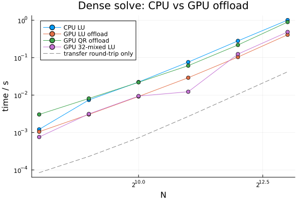

Should you move your dense solve to the GPU? The answer is size-dependent, and
the honest accounting has to separate **transfer** from **compute**: offload
pays PCIe both ways (H2D for the matrix, D2H for the solution), and below some
`N` that overhead swamps any factorization speedup. This benchmark measures the
crossover on the folder's GPU runner, with transfer cost reported explicitly —
a GPU benchmark that hides transfer is marketing, not evidence.

Compared, all through the same `LinearProblem` API:

* `LUFactorization` — CPU baseline (BLAS, all cores)
* `CudaOffloadLUFactorization` — full-precision GPU offload
* `CudaOffloadQRFactorization` — QR variant
* `CUDAOffload32MixedLUFactorization` — Float32 factorization with Float64
  refinement of the result; its correctness gate is accordingly looser, and its
  win condition (bandwidth-bound GPUs) is precisely what this document tests

```julia
using BenchmarkTools, Random, Printf
using LinearAlgebra, LinearSolve
using CUDA

BenchmarkTools.DEFAULT_PARAMETERS.seconds = 0.5
BenchmarkTools.DEFAULT_PARAMETERS.samples = 5

@assert CUDA.functional() "This benchmark requires a functional CUDA GPU"
println("GPU: ", CUDA.name(CUDA.device()))

algs = [
    ("CPU LU", LUFactorization(), 1e-10),
    ("GPU LU offload", CudaOffloadLUFactorization(), 1e-10),
    ("GPU QR offload", CudaOffloadQRFactorization(), 1e-10),
    ("GPU 32-mixed LU", CUDAOffload32MixedLUFactorization(), 1e-4),
]

ns = [256, 512, 1024, 2048, 4096, 8192]
```

```
GPU: Tesla V100-PCIE-32GB
6-element Vector{Int64}:
  256
  512
 1024
 2048
 4096
 8192
```


## Methodology

Per size: a correctness gate against a reference solve, then the end-to-end
solve time (`evals=1`, fresh problem per sample — the full cost a user pays),
and separately the pure **round-trip transfer time** for the same data
(`CuArray(A)` up, `Array(x)` down). Transfer is measured with `CUDA.@sync` so
asynchronous copies can't hide.

```julia
res_time = fill(NaN, length(ns), length(algs))
res_xfer = fill(NaN, length(ns))

for (i, n) in enumerate(ns)
    rng = MersenneTwister(123)
    A = rand(rng, n, n) + n * I
    b = rand(rng, n)
    ref = A \ b
    @info "n=$n"

    for (j, (name, alg, tol)) in enumerate(algs)
        try
            sol = solve(LinearProblem(A, b), alg)
            err = norm(sol.u - ref) / norm(ref)
            if !(err < tol)
                @warn "correctness gate failed — omitted" name n err
                continue
            end
            res_time[i, j] = @belapsed solve(LinearProblem($A, $b), $alg).u evals=1
        catch e
            @warn "$name failed at n=$n" exception=(e,)
        end
    end

    # Round-trip transfer for the same data, isolated.
    res_xfer[i] = @belapsed begin
        Ag = CuArray($A)
        bg = CuArray($b)
        CUDA.@sync Ag
        Array(bg)
    end evals=1
end
```


## Results

```julia
using Plots
p = plot(; xlabel = "N", ylabel = "time / s", xscale = :log2, yscale = :log10,
    title = "Dense solve: CPU vs GPU offload", legend = :topleft)
for (j, (name, _, _)) in enumerate(algs)
    mask = .!isnan.(res_time[:, j])
    any(mask) && plot!(p, ns[mask], res_time[mask, j];
        marker = :circle, label = name)
end
plot!(p, ns, res_xfer; linestyle = :dash, color = :gray,
    label = "transfer round-trip only")
p
```



```julia
println("   N   | CPU LU (s) | GPU LU (s) | 32-mixed (s) | transfer (s) | transfer % of GPU LU")
println("-------+------------+------------+--------------+--------------+---------------------")
for (i, n) in enumerate(ns)
    tcpu, tgpu, tmix = res_time[i, 1], res_time[i, 2], res_time[i, 4]
    @printf("%6d | %10.4g | %10.4g | %12.4g | %12.4g | %18.1f%%\n",
        n, tcpu, tgpu, tmix, res_xfer[i],
        isnan(tgpu) ? NaN : 100 * res_xfer[i] / tgpu)
end

# Crossover: first size where the best GPU variant beats CPU.
best_gpu = [minimum(filter(!isnan, res_time[i, 2:end]); init = Inf) for i in 1:length(ns)]
cross = findfirst(i -> best_gpu[i] < res_time[i, 1], 1:length(ns))
println()
println(cross === nothing ?
    "No crossover in the measured range — CPU wins throughout." :
    "Crossover: GPU offload first beats CPU at N = $(ns[cross]).")
```

```
N   | CPU LU (s) | GPU LU (s) | 32-mixed (s) | transfer (s) | transfer %
 of GPU LU
-------+------------+------------+--------------+--------------+-----------
----------
   256 |   0.001213 |   0.001049 |    0.0007586 |    8.444e-05 |           
     8.1%
   512 |   0.007409 |   0.003039 |     0.003134 |    0.0002292 |           
     7.5%
  1024 |    0.02227 |   0.009174 |     0.009402 |    0.0007221 |           
     7.9%
  2048 |    0.07606 |     0.0291 |      0.01228 |     0.002688 |           
     9.2%
  4096 |     0.2807 |     0.1039 |       0.1247 |      0.01054 |           
    10.1%
  8192 |      1.009 |      0.409 |       0.4864 |      0.04193 |           
    10.3%

Crossover: GPU offload first beats CPU at N = 256.
```


## Reading the result

The dashed transfer line is the floor no offload algorithm can beat: where a
solver's curve approaches it, the algorithm is transfer-bound and further GPU
speedup is irrelevant at that size. The stated crossover `N` is the actionable
number — below it, stay on the CPU; above it, offload pays. The 32-mixed
variant's gap to full-precision GPU LU shows what halving the factorization's
memory traffic buys; its residual (gated at 1e-4) is the accuracy price.

Caveats: one GPU model per run (the runner's), `Float64` inputs, well-conditioned
random matrices (no pivoting stress). The size dependence of the crossover on
GPU generation is deliberately out of scope — this document publishes from a
fixed runner precisely so the number is stable.

## Appendix


## Appendix

These benchmarks are a part of the SciMLBenchmarks.jl repository, found at: [https://github.com/SciML/SciMLBenchmarks.jl](https://github.com/SciML/SciMLBenchmarks.jl). For more information on high-performance scientific machine learning, check out the SciML Open Source Software Organization [https://sciml.ai](https://sciml.ai).

To locally run this benchmark, do the following commands:

```
using SciMLBenchmarks
SciMLBenchmarks.weave_file("benchmarks/LinearSolveGPU","DenseGPUOffload.jmd")
```

Computer Information:

```
Julia Version 1.12.6
Commit 15346901f00 (2026-04-09 19:20 UTC)
Build Info:
  Official https://julialang.org release
Platform Info:
  OS: Linux (x86_64-linux-gnu)
  CPU: 128 × AMD EPYC 9354 32-Core Processor
  WORD_SIZE: 64
  LLVM: libLLVM-18.1.7 (ORCJIT, znver4)
  GC: Built with stock GC
Threads: 58 default, 1 interactive, 58 GC (on 58 virtual cores)
Environment:
  JULIA_CPU_THREADS = 58
  JULIA_NUM_PRECOMPILE_TASKS = 58
  JULIA_NUM_THREADS = auto

```

Package Information:

```
Status `~/_work/SciMLBenchmarks.jl/SciMLBenchmarks.jl/benchmarks/LinearSolveGPU/Project.toml`
  [6e4b80f9] BenchmarkTools v1.8.0
⌃ [052768ef] CUDA v6.2.0
⌅ [45b445bb] CUDSS v0.7.0
⌃ [7ed4a6bd] LinearSolve v5.9.0
  [91a5bcdd] Plots v1.41.6
⌃ [31c91b34] SciMLBenchmarks v0.1.3 [loaded: v0.1.5]
  [37e2e46d] LinearAlgebra v1.12.0
  [de0858da] Printf v1.11.0
  [9a3f8284] Random v1.11.0
  [2f01184e] SparseArrays v1.12.0
Info Packages marked with ⌃ and ⌅ have new versions available. Those with ⌃ may be upgradable, but those with ⌅ are restricted by compatibility constraints from upgrading. To see why use `status --outdated`
```

And the full manifest:

```
Status `~/_work/SciMLBenchmarks.jl/SciMLBenchmarks.jl/benchmarks/LinearSolveGPU/Manifest.toml`
⌃ [47edcb42] ADTypes v1.22.4
  [14f7f29c] AMD v0.5.3
  [621f4979] AbstractFFTs v1.5.0
  [7d9f7c33] Accessors v0.1.45
  [79e6a3ab] Adapt v4.7.0
  [66dad0bd] AliasTables v1.1.3
  [4fba245c] ArrayInterface v7.28.1
  [a9b6321e] Atomix v1.1.3
  [ab4f0b2a] BFloat16s v0.6.1
  [6e4b80f9] BenchmarkTools v1.8.0
  [d1d4a3ce] BitFlags v0.1.10
  [fa961155] CEnum v0.5.0
⌃ [052768ef] CUDA v6.2.0
⌅ [bd0ed864] CUDACore v6.2.0
⌅ [9ec180c6] CUDATools v6.2.0
  [1af6417a] CUDA_Runtime_Discovery v2.1.0
⌅ [45b445bb] CUDSS v0.7.0
⌅ [9e67e8f6] CUPTI v6.2.0
  [944b1d66] CodecZlib v0.7.8
  [35d6a980] ColorSchemes v3.31.0
  [3da002f7] ColorTypes v0.12.1
  [c3611d14] ColorVectorSpace v0.11.0
  [5ae59095] Colors v0.13.1
  [38540f10] CommonSolve v0.2.13
  [34da2185] Compat v4.18.1
  [a33af91c] CompositionsBase v0.1.2
  [2569d6c7] ConcreteStructs v0.2.7
  [f0e56b4a] ConcurrentUtilities v2.6.0
  [8f4d0f93] Conda v1.10.3
  [187b0558] ConstructionBase v1.6.0
  [d38c429a] Contour v0.6.3
  [a8cc5b0e] Crayons v4.2.0
  [9a962f9c] DataAPI v1.16.0
  [864edb3b] DataStructures v0.19.6
  [e2d170a0] DataValueInterfaces v1.0.0
  [8bb1440f] DelimitedFiles v1.9.1
  [ffbed154] DocStringExtensions v0.9.5
  [4e289a0a] EnumX v1.0.7
  [460bff9d] ExceptionUnwrapping v0.1.11
  [e2ba6199] ExprTools v0.1.11
  [c87230d0] FFMPEG v0.4.5
  [64ca27bc] FindFirstFunctions v3.2.1
⌅ [53c48c17] FixedPointNumbers v0.8.6
  [1fa38f19] Format v1.3.7
  [069b7b12] FunctionWrappers v1.1.3
  [77dc65aa] FunctionWrappersWrappers v1.12.1
  [0c68f7d7] GPUArrays v11.5.10
  [46192b85] GPUArraysCore v0.2.0
⌅ [61eb1bfa] GPUCompiler v1.23.0
⌅ [096a3bc2] GPUToolbox v1.1.1
  [28b8d3ca] GR v0.73.26
  [d7ba0133] Git v1.5.0
  [42e2da0e] Grisu v1.0.2
⌅ [cd3eb016] HTTP v1.11.0
  [076d061b] HashArrayMappedTries v0.2.0
⌅ [eafb193a] Highlights v0.5.3
  [7073ff75] IJulia v1.34.4
  [3587e190] InverseFunctions v0.1.17
  [92d709cd] IrrationalConstants v0.2.6
  [82899510] IteratorInterfaceExtensions v1.0.0
  [1019f520] JLFzf v0.1.11
  [692b3bcd] JLLWrappers v1.8.0
⌅ [682c06a0] JSON v0.21.4
  [63c18a36] KernelAbstractions v0.9.42
  [ba0b0d4f] Krylov v0.10.9
⌃ [929cbde3] LLVM v9.11.0
  [8b046642] LLVMLoopInfo v1.0.0
  [b964fa9f] LaTeXStrings v1.4.0
  [23fbe1c1] Latexify v0.16.11
⌃ [7ed4a6bd] LinearSolve v5.9.0
  [2ab3a3ac] LogExpFunctions v1.0.1
  [e6f89c97] LoggingExtras v1.2.0
  [1914dd2f] MacroTools v0.5.16
  [739be429] MbedTLS v1.1.10
  [442fdcdd] Measures v0.3.3
  [e1d29d7a] Missings v1.2.0
  [ffc61752] Mustache v1.0.21
⌅ [611af6d1] NVML v6.2.0
  [5da4648a] NVTX v1.0.3
  [77ba4419] NaNMath v1.1.4
  [4d8831e6] OpenSSL v1.6.1
⌅ [bac558e1] OrderedCollections v1.8.2
  [69de0a69] Parsers v2.8.7
  [ccf2f8ad] PlotThemes v3.3.0
  [995b91a9] PlotUtils v1.4.4
  [91a5bcdd] Plots v1.41.6
⌃ [d236fae5] PreallocationTools v1.4.1
  [aea7be01] PrecompileTools v1.3.4
  [21216c6a] Preferences v1.5.2
  [08abe8d2] PrettyTables v3.4.6
  [43287f4e] PtrArrays v1.4.0
⌃ [0c0d3e7f] PureKLU v1.4.0
  [74087812] Random123 v1.7.1
  [e6cf234a] RandomNumbers v1.6.0
  [3cdcf5f2] RecipesBase v1.3.4
  [01d81517] RecipesPipeline v0.6.12
⌃ [731186ca] RecursiveArrayTools v4.3.6
  [189a3867] Reexport v1.2.2
  [05181044] RelocatableFolders v1.0.1
  [ae029012] Requires v1.3.1
  [7e49a35a] RuntimeGeneratedFunctions v0.5.24
⌃ [0bca4576] SciMLBase v3.44.0
⌃ [31c91b34] SciMLBenchmarks v0.1.3 [loaded: v0.1.5]
  [a6db7da4] SciMLLogging v2.0.4
  [c0aeaf25] SciMLOperators v1.26.1
  [431bcebd] SciMLPublic v1.2.4
  [53ae85a6] SciMLStructures v1.10.4
  [7e506255] ScopedValues v1.6.2
  [6c6a2e73] Scratch v1.3.0
  [efcf1570] Setfield v1.1.2
  [992d4aef] Showoff v1.0.3
  [777ac1f9] SimpleBufferStream v1.2.0
  [a2af1166] SortingAlgorithms v1.2.3
  [a57abbd0] SparseColumnPivotedQR v2.1.6
  [860ef19b] StableRNGs v1.0.4
  [90137ffa] StaticArrays v1.9.18
  [1e83bf80] StaticArraysCore v1.4.4
  [10745b16] Statistics v1.11.1
  [82ae8749] StatsAPI v1.8.0
  [2913bbd2] StatsBase v0.34.12
  [69024149] StringEncodings v0.3.7
  [892a3eda] StringManipulation v0.4.7
⌃ [2efcf032] SymbolicIndexingInterface v0.3.53
  [3783bdb8] TableTraits v1.0.1
  [bd369af6] Tables v1.13.0
  [62fd8b95] TensorCore v0.1.1
  [e689c965] Tracy v0.1.6
  [3bb67fe8] TranscodingStreams v0.11.3
⌃ [5c2747f8] URIs v1.6.3
  [1cfade01] UnicodeFun v0.4.1
  [013be700] UnsafeAtomics v0.3.1
  [41fe7b60] Unzip v0.2.0
  [81def892] VersionParsing v1.3.0
  [44d3d7a6] Weave v0.10.12
  [ddb6d928] YAML v0.4.16
  [c2297ded] ZMQ v1.5.1
⌅ [182d3088] cuBLAS v6.2.0
⌅ [533571aa] cuFFT v6.2.0
⌅ [20fd9a0b] cuRAND v6.2.0
⌅ [887afef0] cuSOLVER v6.2.0
⌅ [b26da814] cuSPARSE v6.2.0
  [6e34b625] Bzip2_jll v1.0.9+0
⌅ [d1e2174e] CUDA_Compiler_jll v0.4.4+1
  [4ee394cb] CUDA_Driver_jll v13.3.0+1
⌅ [76a88914] CUDA_Runtime_jll v0.23.0+1
⌅ [4889d778] CUDSS_jll v0.7.1+0
  [83423d85] Cairo_jll v1.18.7+0
  [ee1fde0b] Dbus_jll v1.16.2+0
  [2702e6a9] EpollShim_jll v0.0.20230411+1
  [2e619515] Expat_jll v2.8.2+0
⌅ [b22a6f82] FFMPEG_jll v8.1.2+0
  [a3f928ae] Fontconfig_jll v2.17.1+0
  [d7e528f0] FreeType2_jll v2.14.3+1
  [559328eb] FriBidi_jll v1.0.17+0
  [0656b61e] GLFW_jll v3.4.1+1
  [d2c73de3] GR_jll v0.73.26+0
⌅ [b0724c58] GettextRuntime_jll v0.22.4+0
  [61579ee1] Ghostscript_jll v9.55.1+0
  [020c3dae] Git_LFS_jll v3.7.1+0
  [f8c6e375] Git_jll v2.55.0+0
  [7746bdde] Glib_jll v2.88.3+0
  [3b182d85] Graphite2_jll v1.3.16+0
⌅ [2e76f6c2] HarfBuzz_jll v8.5.1+0
  [1d5cc7b8] IntelOpenMP_jll v2025.2.0+0
⌃ [aacddb02] JpegTurbo_jll v3.2.0+0
  [9c1d0b0a] JuliaNVTXCallbacks_jll v0.2.1+0
  [c1c5ebd0] LAME_jll v3.100.3+0
  [88015f11] LERC_jll v4.1.0+0
⌅ [dad2f222] LLVMExtra_jll v0.0.44+0
  [1d63c593] LLVMOpenMP_jll v22.1.7+0
  [ad6e5548] LibTracyClient_jll v0.13.1+0
⌅ [e9f186c6] Libffi_jll v3.4.7+0
  [7e76a0d4] Libglvnd_jll v1.7.1+1
  [94ce4f54] Libiconv_jll v1.18.0+0
  [4b2f31a3] Libmount_jll v2.42.0+0
  [89763e89] Libtiff_jll v4.7.3+0
  [38a345b3] Libuuid_jll v2.42.0+0
  [856f044c] MKL_jll v2025.2.0+0
  [c8ffd9c3] MbedTLS_jll v2.28.1010+0
  [ef6e0fe3] NVPTX_LLVM_Backend_jll v22.1.7+1
  [e98f9f5b] NVTX_jll v3.2.2+0
  [e7412a2a] Ogg_jll v1.3.6+0
⌃ [9bd350c2] OpenSSH_jll v10.4.1+0
  [91d4177d] Opus_jll v1.6.1+0
  [36c8627f] Pango_jll v1.58.0+0
  [30392449] Pixman_jll v0.46.4+0
  [c0090381] Qt6Base_jll v6.10.2+2
  [629bc702] Qt6Declarative_jll v6.10.2+2
  [ce943373] Qt6ShaderTools_jll v6.10.2+1
  [6de9746b] Qt6Svg_jll v6.10.2+0
  [e99dba38] Qt6Wayland_jll v6.10.2+1
  [a44049a8] Vulkan_Loader_jll v1.3.243+0
  [a2964d1f] Wayland_jll v1.24.0+0
  [ffd25f8a] XZ_jll v5.8.3+0
  [f67eecfb] Xorg_libICE_jll v1.1.2+0
  [c834827a] Xorg_libSM_jll v1.2.6+0
  [4f6342f7] Xorg_libX11_jll v1.8.13+0
  [0c0b7dd1] Xorg_libXau_jll v1.0.13+0
  [935fb764] Xorg_libXcursor_jll v1.2.4+0
  [a3789734] Xorg_libXdmcp_jll v1.1.6+0
  [1082639a] Xorg_libXext_jll v1.3.8+0
  [d091e8ba] Xorg_libXfixes_jll v6.0.2+0
  [a51aa0fd] Xorg_libXi_jll v1.8.4+0
  [d1454406] Xorg_libXinerama_jll v1.1.7+0
  [ec84b674] Xorg_libXrandr_jll v1.5.6+0
  [ea2f1a96] Xorg_libXrender_jll v0.9.12+0
  [a65dc6b1] Xorg_libpciaccess_jll v0.19.0+0
  [c7cfdc94] Xorg_libxcb_jll v1.17.1+0
  [cc61e674] Xorg_libxkbfile_jll v1.2.0+0
  [e920d4aa] Xorg_xcb_util_cursor_jll v0.1.6+0
  [12413925] Xorg_xcb_util_image_jll v0.4.1+0
  [2def613f] Xorg_xcb_util_jll v0.4.1+0
  [975044d2] Xorg_xcb_util_keysyms_jll v0.4.1+0
  [0d47668e] Xorg_xcb_util_renderutil_jll v0.3.10+0
  [c22f9ab0] Xorg_xcb_util_wm_jll v0.4.2+0
  [35661453] Xorg_xkbcomp_jll v1.4.7+0
  [33bec58e] Xorg_xkeyboard_config_jll v2.47.0+2
  [c5fb5394] Xorg_xtrans_jll v1.6.0+0
  [8f1865be] ZeroMQ_jll v4.3.6+0
  [3161d3a3] Zstd_jll v1.5.7+1
  [1e29f10c] demumble_jll v1.3.0+0
  [35ca27e7] eudev_jll v3.2.14+0
⌅ [214eeab7] fzf_jll v0.61.1+0
⌃ [a4ae2306] libaom_jll v3.13.3+0
  [0ac62f75] libass_jll v0.17.4+0
  [1183f4f0] libdecor_jll v0.2.2+0
  [8e53e030] libdrm_jll v2.4.134+0
  [2db6ffa8] libevdev_jll v1.13.4+0
  [f638f0a6] libfdk_aac_jll v2.0.4+0
  [36db933b] libinput_jll v1.28.1+0
  [b53b4c65] libpng_jll v1.6.58+0
  [a9144af2] libsodium_jll v1.0.21+0
  [9a156e7d] libva_jll v2.23.0+0
  [f27f6e37] libvorbis_jll v1.3.8+0
  [009596ad] mtdev_jll v1.1.7+0
  [1317d2d5] oneTBB_jll v2022.3.0+0
⌅ [1270edf5] x264_jll v10164.0.1+0
  [dfaa095f] x265_jll v4.1.0+0
  [d8fb68d0] xkbcommon_jll v1.13.0+0
  [0dad84c5] ArgTools v1.1.2
  [56f22d72] Artifacts v1.11.0
  [2a0f44e3] Base64 v1.11.0
  [ade2ca70] Dates v1.11.0
  [8ba89e20] Distributed v1.11.0
  [f43a241f] Downloads v1.7.0
  [7b1f6079] FileWatching v1.11.0
  [9fa8497b] Future v1.11.0
  [b77e0a4c] InteractiveUtils v1.11.0
  [ac6e5ff7] JuliaSyntaxHighlighting v1.12.0
  [4af54fe1] LazyArtifacts v1.11.0
  [b27032c2] LibCURL v0.6.4
  [76f85450] LibGit2 v1.11.0
  [8f399da3] Libdl v1.11.0
  [37e2e46d] LinearAlgebra v1.12.0
  [56ddb016] Logging v1.11.0
  [d6f4376e] Markdown v1.11.0
  [a63ad114] Mmap v1.11.0
  [ca575930] NetworkOptions v1.3.0
  [44cfe95a] Pkg v1.12.1
  [de0858da] Printf v1.11.0
  [9abbd945] Profile v1.11.0
  [3fa0cd96] REPL v1.11.0
  [9a3f8284] Random v1.11.0
  [ea8e919c] SHA v0.7.0
  [9e88b42a] Serialization v1.11.0
  [6462fe0b] Sockets v1.11.0
  [2f01184e] SparseArrays v1.12.0
  [f489334b] StyledStrings v1.11.0
  [fa267f1f] TOML v1.0.3
  [a4e569a6] Tar v1.10.0
  [8dfed614] Test v1.11.0
  [cf7118a7] UUIDs v1.11.0
  [4ec0a83e] Unicode v1.11.0
  [e66e0078] CompilerSupportLibraries_jll v1.3.0+1
  [deac9b47] LibCURL_jll v8.15.0+0
  [e37daf67] LibGit2_jll v1.9.0+0
  [29816b5a] LibSSH2_jll v1.11.3+1
  [14a3606d] MozillaCACerts_jll v2025.5.20
  [4536629a] OpenBLAS_jll v0.3.29+0
  [05823500] OpenLibm_jll v0.8.7+0
  [458c3c95] OpenSSL_jll v3.5.4+0
  [efcefdf7] PCRE2_jll v10.44.0+1
  [bea87d4a] SuiteSparse_jll v7.8.3+2
  [83775a58] Zlib_jll v1.3.1+2
  [8e850b90] libblastrampoline_jll v5.15.0+0
  [8e850ede] nghttp2_jll v1.64.0+1
  [3f19e933] p7zip_jll v17.7.0+0
Info Packages marked with ⌃ and ⌅ have new versions available. Those with ⌃ may be upgradable, but those with ⌅ are restricted by compatibility constraints from upgrading. To see why use `status --outdated -m`
```

