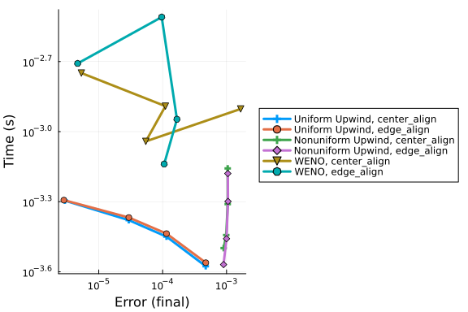
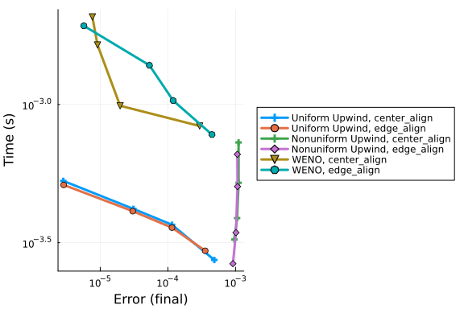

This benchmark is for the MethodOfLines package, which is an automatic PDE discretization package.
It is concerned with comparing the performance of various discretization methods for the Burgers equation.

```julia
using MethodOfLines, DomainSets, OrdinaryDiffEq, ModelingToolkit, DiffEqDevTools,
      LinearAlgebra,
      LinearSolve, Plots, RecursiveFactorization
```


Here is the burgers equation with a Dirichlet and Neumann boundary conditions,

```julia
# pdesys1 has Dirichlet BCs, pdesys2 has Neumann BCs
const N = 30

@parameters x t
@variables u(..)
Dx = Differential(x)
Dt = Differential(t)
x_min = 0.0
x_max = 1.0
t_min = 0.0
t_max = 20.0

solver = FBDF()

analytic_u(p, t, x) = x / (t + 1)

analytic = [u(t, x) ~ analytic_u([], t, x)]

eq = Dt(u(t, x)) ~ -u(t, x) * Dx(u(t, x))

bcs1 = [u(0, x) ~ x,
    u(t, x_min) ~ analytic_u([], t, x_min),
    u(t, x_max) ~ analytic_u([], t, x_max)]

bcs2 = [u(0, x) ~ x,
    Dx(u(t, x_min)) ~ 1 / (t + 1),
    Dx(u(t, x_max)) ~ 1 / (t + 1)]

domains = [t ∈ Interval(t_min, t_max),
    x ∈ Interval(x_min, x_max)]

@named pdesys1 = PDESystem(eq, bcs1, domains, [t, x], [u(t, x)], analytic = analytic)
@named pdesys2 = PDESystem(eq, bcs2, domains, [t, x], [u(t, x)], analytic = analytic)
```

```
PDESystem
Equations: Symbolics.Equation[Differential(t, 1)(u(t, x)) ~ -Differential(x
, 1)(u(t, x))*u(t, x)]
Boundary Conditions: Symbolics.Equation[u(0, x) ~ x, Differential(x, 1)(u(t
, 0.0)) ~ 1 / (1 + t), Differential(x, 1)(u(t, 1.0)) ~ 1 / (1 + t)]
Domain: Symbolics.VarDomainPairing[Symbolics.VarDomainPairing(t, 0.0 .. 20.
0), Symbolics.VarDomainPairing(x, 0.0 .. 1.0)]
Dependent Variables: Symbolics.Num[u(t, x)]
Independent Variables: Symbolics.Num[t, x]
Parameters: SciMLBase.NullParameters()
Default Parameter ValuesModelingToolkitBase.AtomicArrayDict{SymbolicUtils.B
asicSymbolicImpl.var"typeof(BasicSymbolicImpl)"{SymbolicUtils.SymReal}, Dic
t{SymbolicUtils.BasicSymbolicImpl.var"typeof(BasicSymbolicImpl)"{SymbolicUt
ils.SymReal}, SymbolicUtils.BasicSymbolicImpl.var"typeof(BasicSymbolicImpl)
"{SymbolicUtils.SymReal}}}()
```


Here is a uniform discretization with the Upwind scheme:

```julia
discupwind1 = MOLFiniteDifference([x => N], t, advection_scheme = UpwindScheme())
discupwind2 = MOLFiniteDifference([x => N-1], t, advection_scheme = UpwindScheme(), grid_align = edge_align)
```

```
MethodOfLines.MOLFiniteDifference{MethodOfLines.EdgeAlignedGrid}(Dict{Symbo
lics.Num, Int64}(x => 29), t, 2, MethodOfLines.UpwindScheme(1), MethodOfLin
es.EdgeAlignedGrid(), true, true, Any[], Base.Pairs{Symbol, Union{}, Tuple{
}, @NamedTuple{}}())
```


Here is a uniform discretization with the WENO scheme:

```julia
discweno1 = MOLFiniteDifference([x => N], t, advection_scheme = WENOScheme())
discweno2 = MOLFiniteDifference([x => N-1], t, advection_scheme = WENOScheme(), grid_align = edge_align)
```

```
MethodOfLines.MOLFiniteDifference{MethodOfLines.EdgeAlignedGrid}(Dict{Symbo
lics.Num, Int64}(x => 29), t, 2, MethodOfLines.FunctionalScheme{typeof(Meth
odOfLines.weno_f), Vector{MethodOfLines.WENONonUniformBoundary}, Vector{Met
hodOfLines.WENONonUniformBoundary}, Vector{Float64}}(MethodOfLines.weno_f, 
MethodOfLines.WENONonUniformBoundary[MethodOfLines.WENONonUniformBoundary{1
}(), MethodOfLines.WENONonUniformBoundary{2}()], MethodOfLines.WENONonUnifo
rmBoundary[MethodOfLines.WENONonUniformBoundary{5}(), MethodOfLines.WENONon
UniformBoundary{4}()], 5, 5, true, [1.0e-6], "WENO"), MethodOfLines.EdgeAli
gnedGrid(), true, true, Any[], Base.Pairs{Symbol, Union{}, Tuple{}, @NamedT
uple{}}())
```


Here is a non-uniform discretization with the Upwind scheme, using tanh (nonuniform WENO is not implemented yet):

```julia

gridnu1 = chebyspace(N, domains[2])
gridnu2 = chebyspace(N-1, domains[2])

discnu1 = MOLFiniteDifference([gridnu1], t, advection_scheme = UpwindScheme())
discnu2 = MOLFiniteDifference([gridnu2], t, advection_scheme = UpwindScheme(), grid_align = edge_align)
```

```
MethodOfLines.MOLFiniteDifference{MethodOfLines.EdgeAlignedGrid}(Dict{Symbo
licUtils.BasicSymbolicImpl.var"typeof(BasicSymbolicImpl)"{SymbolicUtils.Sym
Real}, Vector{Float64}}(x => [0.0, 0.0065867387292369295, 0.018225003740388
49, 0.03551164009160429, 0.05824397777698853, 0.08615550092155477, 0.118918
97243618177, 0.15615027057328829, 0.19741289240311743, 0.24222307141148913 
 …  0.7577769285885109, 0.8025871075968827, 0.8438497294267115, 0.881081027
5638182, 0.9138444990784453, 0.9417560222230115, 0.9644883599083958, 0.9817
749962596114, 0.9934132612707631, 1.0]), t, 2, MethodOfLines.UpwindScheme(1
), MethodOfLines.EdgeAlignedGrid(), true, true, Any[], Base.Pairs{Symbol, U
nion{}, Tuple{}, @NamedTuple{}}())
```


Here are the problems for pdesys1:

```julia
probupwind1 = discretize(pdesys1, discupwind1; analytic = pdesys1.analytic_func)
probupwind2 = discretize(pdesys1, discupwind2; analytic = pdesys1.analytic_func)

probweno1 = discretize(pdesys1, discweno1; analytic = pdesys1.analytic_func)
probweno2 = discretize(pdesys1, discweno2; analytic = pdesys1.analytic_func)

probnu1 = discretize(pdesys1, discnu1; analytic = pdesys1.analytic_func)
probnu2 = discretize(pdesys1, discnu2; analytic = pdesys1.analytic_func)

probs1 = [probupwind1, probupwind2, probnu1, probnu2, probweno1, probweno2]
```

```
6-element Vector{SciMLBase.ODEProblem{Vector{Float64}, Tuple{Float64, Float
64}, true, ModelingToolkitBase.MTKParameters{StaticArraysCore.SVector{0, Fl
oat64}, Vector{Float64}, Tuple{}, Tuple{}, Tuple{}, Tuple{}}, F, Base.Pairs
{Symbol, Union{}, Tuple{}, @NamedTuple{}}, SciMLBase.StandardODEProblem} wh
ere F}:
 SciMLBase.ODEProblem{Vector{Float64}, Tuple{Float64, Float64}, true, Model
ingToolkitBase.MTKParameters{StaticArraysCore.SVector{0, Float64}, Vector{F
loat64}, Tuple{}, Tuple{}, Tuple{}, Tuple{}}, SciMLBase.ODEFunction{true, S
ciMLBase.AutoDespecialize, ModelingToolkitBase.GeneratedFunctionWrapper{Tup
le{2, 3, true}, RuntimeGeneratedFunctions.RuntimeGeneratedFunction{(:___mtk
unknowns___, :___mtkparameters___, :__argₛᵧₘ9671596506859111994), MethodOfL
ines.var"#_RGF_ModTag", MethodOfLines.var"#_RGF_ModTag", (0xfbde25a3, 0x4b1
ee8bf, 0xfe0afe1d, 0x1f56901d, 0xaeb527f4), Nothing}, RuntimeGeneratedFunct
ions.RuntimeGeneratedFunction{(:__argₛᵧₘ1401282876548370056, :___mtkunknown
s___, :___mtkparameters___, :__argₛᵧₘ9671596506859111994), MethodOfLines.va
r"#_RGF_ModTag", MethodOfLines.var"#_RGF_ModTag", (0x58e942ec, 0x0b910bfc, 
0x9456cffd, 0xcd827dd1, 0x38726dd4), Nothing}}, LinearAlgebra.UniformScalin
g{Bool}, MethodOfLines.var"#68#76"{Vector{MethodOfLines.var"#66#74"{Vector{
Float64}, RuntimeGeneratedFunctions.RuntimeGeneratedFunction{(Symbol("##arg
#5964805160111424296"), :t, :x), ModelingToolkitBase.var"#_RGF_ModTag", Mod
elingToolkitBase.var"#_RGF_ModTag", (0xc731b114, 0x1e999b40, 0x6414cef2, 0x
36f76a81, 0x1c55a673), Nothing}}}}, Nothing, Nothing, Nothing, Nothing, Not
hing, Nothing, Nothing, Nothing, Nothing, Nothing, Nothing, ModelingToolkit
Base.ObservedFunctionCache{ModelingToolkitBase.System, Nothing}, Nothing, M
odelingToolkitBase.System, Union{Nothing, SciMLBase.OverrideInitData}, Unio
n{Nothing, SciMLBase.ODENLStepData}}, Base.Pairs{Symbol, Union{}, Tuple{}, 
@NamedTuple{}}, SciMLBase.StandardODEProblem}(SciMLBase.ODEFunction{true, S
ciMLBase.AutoDespecialize, ModelingToolkitBase.GeneratedFunctionWrapper{Tup
le{2, 3, true}, RuntimeGeneratedFunctions.RuntimeGeneratedFunction{(:___mtk
unknowns___, :___mtkparameters___, :__argₛᵧₘ9671596506859111994), MethodOfL
ines.var"#_RGF_ModTag", MethodOfLines.var"#_RGF_ModTag", (0xfbde25a3, 0x4b1
ee8bf, 0xfe0afe1d, 0x1f56901d, 0xaeb527f4), Nothing}, RuntimeGeneratedFunct
ions.RuntimeGeneratedFunction{(:__argₛᵧₘ1401282876548370056, :___mtkunknown
s___, :___mtkparameters___, :__argₛᵧₘ9671596506859111994), MethodOfLines.va
r"#_RGF_ModTag", MethodOfLines.var"#_RGF_ModTag", (0x58e942ec, 0x0b910bfc, 
0x9456cffd, 0xcd827dd1, 0x38726dd4), Nothing}}, LinearAlgebra.UniformScalin
g{Bool}, MethodOfLines.var"#68#76"{Vector{MethodOfLines.var"#66#74"{Vector{
Float64}, RuntimeGeneratedFunctions.RuntimeGeneratedFunction{(Symbol("##arg
#5964805160111424296"), :t, :x), ModelingToolkitBase.var"#_RGF_ModTag", Mod
elingToolkitBase.var"#_RGF_ModTag", (0xc731b114, 0x1e999b40, 0x6414cef2, 0x
36f76a81, 0x1c55a673), Nothing}}}}, Nothing, Nothing, Nothing, Nothing, Not
hing, Nothing, Nothing, Nothing, Nothing, Nothing, Nothing, ModelingToolkit
Base.ObservedFunctionCache{ModelingToolkitBase.System, Nothing}, Nothing, M
odelingToolkitBase.System, Union{Nothing, SciMLBase.OverrideInitData}, Unio
n{Nothing, SciMLBase.ODENLStepData}}(ModelingToolkitBase.GeneratedFunctionW
rapper{Tuple{2, 3, true}, RuntimeGeneratedFunctions.RuntimeGeneratedFunctio
n{(:___mtkunknowns___, :___mtkparameters___, :__argₛᵧₘ9671596506859111994),
 MethodOfLines.var"#_RGF_ModTag", MethodOfLines.var"#_RGF_ModTag", (0xfbde2
5a3, 0x4b1ee8bf, 0xfe0afe1d, 0x1f56901d, 0xaeb527f4), Nothing}, RuntimeGene
ratedFunctions.RuntimeGeneratedFunction{(:__argₛᵧₘ1401282876548370056, :___
mtkunknowns___, :___mtkparameters___, :__argₛᵧₘ9671596506859111994), Method
OfLines.var"#_RGF_ModTag", MethodOfLines.var"#_RGF_ModTag", (0x58e942ec, 0x
0b910bfc, 0x9456cffd, 0xcd827dd1, 0x38726dd4), Nothing}}(RuntimeGeneratedFu
nctions.RuntimeGeneratedFunction{(:___mtkunknowns___, :___mtkparameters___,
 :__argₛᵧₘ9671596506859111994), MethodOfLines.var"#_RGF_ModTag", MethodOfLi
nes.var"#_RGF_ModTag", (0xfbde25a3, 0x4b1ee8bf, 0xfe0afe1d, 0x1f56901d, 0xa
eb527f4), Nothing}(nothing), RuntimeGeneratedFunctions.RuntimeGeneratedFunc
tion{(:__argₛᵧₘ1401282876548370056, :___mtkunknowns___, :___mtkparameters__
_, :__argₛᵧₘ9671596506859111994), MethodOfLines.var"#_RGF_ModTag", MethodOf
Lines.var"#_RGF_ModTag", (0x58e942ec, 0x0b910bfc, 0x9456cffd, 0xcd827dd1, 0
x38726dd4), Nothing}(nothing)), LinearAlgebra.UniformScaling{Bool}(true), M
ethodOfLines.var"#68#76"{Vector{MethodOfLines.var"#66#74"{Vector{Float64}, 
RuntimeGeneratedFunctions.RuntimeGeneratedFunction{(Symbol("##arg#596480516
0111424296"), :t, :x), ModelingToolkitBase.var"#_RGF_ModTag", ModelingToolk
itBase.var"#_RGF_ModTag", (0xc731b114, 0x1e999b40, 0x6414cef2, 0x36f76a81, 
0x1c55a673), Nothing}}}}(MethodOfLines.var"#66#74"{Vector{Float64}, Runtime
GeneratedFunctions.RuntimeGeneratedFunction{(Symbol("##arg#5964805160111424
296"), :t, :x), ModelingToolkitBase.var"#_RGF_ModTag", ModelingToolkitBase.
var"#_RGF_ModTag", (0xc731b114, 0x1e999b40, 0x6414cef2, 0x36f76a81, 0x1c55a
673), Nothing}}[MethodOfLines.var"#66#74"{Vector{Float64}, RuntimeGenerated
Functions.RuntimeGeneratedFunction{(Symbol("##arg#5964805160111424296"), :t
, :x), ModelingToolkitBase.var"#_RGF_ModTag", ModelingToolkitBase.var"#_RGF
_ModTag", (0xc731b114, 0x1e999b40, 0x6414cef2, 0x36f76a81, 0x1c55a673), Not
hing}}([0.9655172413793104], RuntimeGeneratedFunctions.RuntimeGeneratedFunc
tion{(Symbol("##arg#5964805160111424296"), :t, :x), ModelingToolkitBase.var
"#_RGF_ModTag", ModelingToolkitBase.var"#_RGF_ModTag", (0xc731b114, 0x1e999
b40, 0x6414cef2, 0x36f76a81, 0x1c55a673), Nothing}(nothing)), MethodOfLines
.var"#66#74"{Vector{Float64}, RuntimeGeneratedFunctions.RuntimeGeneratedFun
ction{(Symbol("##arg#5964805160111424296"), :t, :x), ModelingToolkitBase.va
r"#_RGF_ModTag", ModelingToolkitBase.var"#_RGF_ModTag", (0xc731b114, 0x1e99
9b40, 0x6414cef2, 0x36f76a81, 0x1c55a673), Nothing}}([0.9310344827586207], 
RuntimeGeneratedFunctions.RuntimeGeneratedFunction{(Symbol("##arg#596480516
0111424296"), :t, :x), ModelingToolkitBase.var"#_RGF_ModTag", ModelingToolk
itBase.var"#_RGF_ModTag", (0xc731b114, 0x1e999b40, 0x6414cef2, 0x36f76a81, 
0x1c55a673), Nothing}(nothing)), MethodOfLines.var"#66#74"{Vector{Float64},
 RuntimeGeneratedFunctions.RuntimeGeneratedFunction{(Symbol("##arg#59648051
60111424296"), :t, :x), ModelingToolkitBase.var"#_RGF_ModTag", ModelingTool
kitBase.var"#_RGF_ModTag", (0xc731b114, 0x1e999b40, 0x6414cef2, 0x36f76a81,
 0x1c55a673), Nothing}}([0.896551724137931], RuntimeGeneratedFunctions.Runt
imeGeneratedFunction{(Symbol("##arg#5964805160111424296"), :t, :x), Modelin
gToolkitBase.var"#_RGF_ModTag", ModelingToolkitBase.var"#_RGF_ModTag", (0xc
731b114, 0x1e999b40, 0x6414cef2, 0x36f76a81, 0x1c55a673), Nothing}(nothing)
), MethodOfLines.var"#66#74"{Vector{Float64}, RuntimeGeneratedFunctions.Run
timeGeneratedFunction{(Symbol("##arg#5964805160111424296"), :t, :x), Modeli
ngToolkitBase.var"#_RGF_ModTag", ModelingToolkitBase.var"#_RGF_ModTag", (0x
c731b114, 0x1e999b40, 0x6414cef2, 0x36f76a81, 0x1c55a673), Nothing}}([0.862
0689655172413], RuntimeGeneratedFunctions.RuntimeGeneratedFunction{(Symbol(
"##arg#5964805160111424296"), :t, :x), ModelingToolkitBase.var"#_RGF_ModTag
", ModelingToolkitBase.var"#_RGF_ModTag", (0xc731b114, 0x1e999b40, 0x6414ce
f2, 0x36f76a81, 0x1c55a673), Nothing}(nothing)), MethodOfLines.var"#66#74"{
Vector{Float64}, RuntimeGeneratedFunctions.RuntimeGeneratedFunction{(Symbol
("##arg#5964805160111424296"), :t, :x), ModelingToolkitBase.var"#_RGF_ModTa
g", ModelingToolkitBase.var"#_RGF_ModTag", (0xc731b114, 0x1e999b40, 0x6414c
ef2, 0x36f76a81, 0x1c55a673), Nothing}}([0.8275862068965517], RuntimeGenera
tedFunctions.RuntimeGeneratedFunction{(Symbol("##arg#5964805160111424296"),
 :t, :x), ModelingToolkitBase.var"#_RGF_ModTag", ModelingToolkitBase.var"#_
RGF_ModTag", (0xc731b114, 0x1e999b40, 0x6414cef2, 0x36f76a81, 0x1c55a673), 
Nothing}(nothing)), MethodOfLines.var"#66#74"{Vector{Float64}, RuntimeGener
atedFunctions.RuntimeGeneratedFunction{(Symbol("##arg#5964805160111424296")
, :t, :x), ModelingToolkitBase.var"#_RGF_ModTag", ModelingToolkitBase.var"#
_RGF_ModTag", (0xc731b114, 0x1e999b40, 0x6414cef2, 0x36f76a81, 0x1c55a673),
 Nothing}}([0.7931034482758621], RuntimeGeneratedFunctions.RuntimeGenerated
Function{(Symbol("##arg#5964805160111424296"), :t, :x), ModelingToolkitBase
.var"#_RGF_ModTag", ModelingToolkitBase.var"#_RGF_ModTag", (0xc731b114, 0x1
e999b40, 0x6414cef2, 0x36f76a81, 0x1c55a673), Nothing}(nothing)), MethodOfL
ines.var"#66#74"{Vector{Float64}, RuntimeGeneratedFunctions.RuntimeGenerate
dFunction{(Symbol("##arg#5964805160111424296"), :t, :x), ModelingToolkitBas
e.var"#_RGF_ModTag", ModelingToolkitBase.var"#_RGF_ModTag", (0xc731b114, 0x
1e999b40, 0x6414cef2, 0x36f76a81, 0x1c55a673), Nothing}}([0.758620689655172
4], RuntimeGeneratedFunctions.RuntimeGeneratedFunction{(Symbol("##arg#59648
05160111424296"), :t, :x), ModelingToolkitBase.var"#_RGF_ModTag", ModelingT
oolkitBase.var"#_RGF_ModTag", (0xc731b114, 0x1e999b40, 0x6414cef2, 0x36f76a
81, 0x1c55a673), Nothing}(nothing)), MethodOfLines.var"#66#74"{Vector{Float
64}, RuntimeGeneratedFunctions.RuntimeGeneratedFunction{(Symbol("##arg#5964
805160111424296"), :t, :x), ModelingToolkitBase.var"#_RGF_ModTag", Modeling
ToolkitBase.var"#_RGF_ModTag", (0xc731b114, 0x1e999b40, 0x6414cef2, 0x36f76
a81, 0x1c55a673), Nothing}}([0.7241379310344828], RuntimeGeneratedFunctions
.RuntimeGeneratedFunction{(Symbol("##arg#5964805160111424296"), :t, :x), Mo
delingToolkitBase.var"#_RGF_ModTag", ModelingToolkitBase.var"#_RGF_ModTag",
 (0xc731b114, 0x1e999b40, 0x6414cef2, 0x36f76a81, 0x1c55a673), Nothing}(not
hing)), MethodOfLines.var"#66#74"{Vector{Float64}, RuntimeGeneratedFunction
s.RuntimeGeneratedFunction{(Symbol("##arg#5964805160111424296"), :t, :x), M
odelingToolkitBase.var"#_RGF_ModTag", ModelingToolkitBase.var"#_RGF_ModTag"
, (0xc731b114, 0x1e999b40, 0x6414cef2, 0x36f76a81, 0x1c55a673), Nothing}}([
0.6896551724137931], RuntimeGeneratedFunctions.RuntimeGeneratedFunction{(Sy
mbol("##arg#5964805160111424296"), :t, :x), ModelingToolkitBase.var"#_RGF_M
odTag", ModelingToolkitBase.var"#_RGF_ModTag", (0xc731b114, 0x1e999b40, 0x6
414cef2, 0x36f76a81, 0x1c55a673), Nothing}(nothing)), MethodOfLines.var"#66
#74"{Vector{Float64}, RuntimeGeneratedFunctions.RuntimeGeneratedFunction{(S
ymbol("##arg#5964805160111424296"), :t, :x), ModelingToolkitBase.var"#_RGF_
ModTag", ModelingToolkitBase.var"#_RGF_ModTag", (0xc731b114, 0x1e999b40, 0x
6414cef2, 0x36f76a81, 0x1c55a673), Nothing}}([0.6551724137931034], RuntimeG
eneratedFunctions.RuntimeGeneratedFunction{(Symbol("##arg#59648051601114242
96"), :t, :x), ModelingToolkitBase.var"#_RGF_ModTag", ModelingToolkitBase.v
ar"#_RGF_ModTag", (0xc731b114, 0x1e999b40, 0x6414cef2, 0x36f76a81, 0x1c55a6
73), Nothing}(nothing))  …  MethodOfLines.var"#66#74"{Vector{Float64}, Runt
imeGeneratedFunctions.RuntimeGeneratedFunction{(Symbol("##arg#5964805160111
424296"), :t, :x), ModelingToolkitBase.var"#_RGF_ModTag", ModelingToolkitBa
se.var"#_RGF_ModTag", (0xc731b114, 0x1e999b40, 0x6414cef2, 0x36f76a81, 0x1c
55a673), Nothing}}([0.3448275862068966], RuntimeGeneratedFunctions.RuntimeG
eneratedFunction{(Symbol("##arg#5964805160111424296"), :t, :x), ModelingToo
lkitBase.var"#_RGF_ModTag", ModelingToolkitBase.var"#_RGF_ModTag", (0xc731b
114, 0x1e999b40, 0x6414cef2, 0x36f76a81, 0x1c55a673), Nothing}(nothing)), M
ethodOfLines.var"#66#74"{Vector{Float64}, RuntimeGeneratedFunctions.Runtime
GeneratedFunction{(Symbol("##arg#5964805160111424296"), :t, :x), ModelingTo
olkitBase.var"#_RGF_ModTag", ModelingToolkitBase.var"#_RGF_ModTag", (0xc731
b114, 0x1e999b40, 0x6414cef2, 0x36f76a81, 0x1c55a673), Nothing}}([0.3103448
275862069], RuntimeGeneratedFunctions.RuntimeGeneratedFunction{(Symbol("##a
rg#5964805160111424296"), :t, :x), ModelingToolkitBase.var"#_RGF_ModTag", M
odelingToolkitBase.var"#_RGF_ModTag", (0xc731b114, 0x1e999b40, 0x6414cef2, 
0x36f76a81, 0x1c55a673), Nothing}(nothing)), MethodOfLines.var"#66#74"{Vect
or{Float64}, RuntimeGeneratedFunctions.RuntimeGeneratedFunction{(Symbol("##
arg#5964805160111424296"), :t, :x), ModelingToolkitBase.var"#_RGF_ModTag", 
ModelingToolkitBase.var"#_RGF_ModTag", (0xc731b114, 0x1e999b40, 0x6414cef2,
 0x36f76a81, 0x1c55a673), Nothing}}([0.27586206896551724], RuntimeGenerated
Functions.RuntimeGeneratedFunction{(Symbol("##arg#5964805160111424296"), :t
, :x), ModelingToolkitBase.var"#_RGF_ModTag", ModelingToolkitBase.var"#_RGF
_ModTag", (0xc731b114, 0x1e999b40, 0x6414cef2, 0x36f76a81, 0x1c55a673), Not
hing}(nothing)), MethodOfLines.var"#66#74"{Vector{Float64}, RuntimeGenerate
dFunctions.RuntimeGeneratedFunction{(Symbol("##arg#5964805160111424296"), :
t, :x), ModelingToolkitBase.var"#_RGF_ModTag", ModelingToolkitBase.var"#_RG
F_ModTag", (0xc731b114, 0x1e999b40, 0x6414cef2, 0x36f76a81, 0x1c55a673), No
thing}}([0.2413793103448276], RuntimeGeneratedFunctions.RuntimeGeneratedFun
ction{(Symbol("##arg#5964805160111424296"), :t, :x), ModelingToolkitBase.va
r"#_RGF_ModTag", ModelingToolkitBase.var"#_RGF_ModTag", (0xc731b114, 0x1e99
9b40, 0x6414cef2, 0x36f76a81, 0x1c55a673), Nothing}(nothing)), MethodOfLine
s.var"#66#74"{Vector{Float64}, RuntimeGeneratedFunctions.RuntimeGeneratedFu
nction{(Symbol("##arg#5964805160111424296"), :t, :x), ModelingToolkitBase.v
ar"#_RGF_ModTag", ModelingToolkitBase.var"#_RGF_ModTag", (0xc731b114, 0x1e9
99b40, 0x6414cef2, 0x36f76a81, 0x1c55a673), Nothing}}([0.20689655172413793]
, RuntimeGeneratedFunctions.RuntimeGeneratedFunction{(Symbol("##arg#5964805
160111424296"), :t, :x), ModelingToolkitBase.var"#_RGF_ModTag", ModelingToo
lkitBase.var"#_RGF_ModTag", (0xc731b114, 0x1e999b40, 0x6414cef2, 0x36f76a81
, 0x1c55a673), Nothing}(nothing)), MethodOfLines.var"#66#74"{Vector{Float64
}, RuntimeGeneratedFunctions.RuntimeGeneratedFunction{(Symbol("##arg#596480
5160111424296"), :t, :x), ModelingToolkitBase.var"#_RGF_ModTag", ModelingTo
olkitBase.var"#_RGF_ModTag", (0xc731b114, 0x1e999b40, 0x6414cef2, 0x36f76a8
1, 0x1c55a673), Nothing}}([0.1724137931034483], RuntimeGeneratedFunctions.R
untimeGeneratedFunction{(Symbol("##arg#5964805160111424296"), :t, :x), Mode
lingToolkitBase.var"#_RGF_ModTag", ModelingToolkitBase.var"#_RGF_ModTag", (
0xc731b114, 0x1e999b40, 0x6414cef2, 0x36f76a81, 0x1c55a673), Nothing}(nothi
ng)), MethodOfLines.var"#66#74"{Vector{Float64}, RuntimeGeneratedFunctions.
RuntimeGeneratedFunction{(Symbol("##arg#5964805160111424296"), :t, :x), Mod
elingToolkitBase.var"#_RGF_ModTag", ModelingToolkitBase.var"#_RGF_ModTag", 
(0xc731b114, 0x1e999b40, 0x6414cef2, 0x36f76a81, 0x1c55a673), Nothing}}([0.
13793103448275862], RuntimeGeneratedFunctions.RuntimeGeneratedFunction{(Sym
bol("##arg#5964805160111424296"), :t, :x), ModelingToolkitBase.var"#_RGF_Mo
dTag", ModelingToolkitBase.var"#_RGF_ModTag", (0xc731b114, 0x1e999b40, 0x64
14cef2, 0x36f76a81, 0x1c55a673), Nothing}(nothing)), MethodOfLines.var"#66#
74"{Vector{Float64}, RuntimeGeneratedFunctions.RuntimeGeneratedFunction{(Sy
mbol("##arg#5964805160111424296"), :t, :x), ModelingToolkitBase.var"#_RGF_M
odTag", ModelingToolkitBase.var"#_RGF_ModTag", (0xc731b114, 0x1e999b40, 0x6
414cef2, 0x36f76a81, 0x1c55a673), Nothing}}([0.10344827586206896], RuntimeG
eneratedFunctions.RuntimeGeneratedFunction{(Symbol("##arg#59648051601114242
96"), :t, :x), ModelingToolkitBase.var"#_RGF_ModTag", ModelingToolkitBase.v
ar"#_RGF_ModTag", (0xc731b114, 0x1e999b40, 0x6414cef2, 0x36f76a81, 0x1c55a6
73), Nothing}(nothing)), MethodOfLines.var"#66#74"{Vector{Float64}, Runtime
GeneratedFunctions.RuntimeGeneratedFunction{(Symbol("##arg#5964805160111424
296"), :t, :x), ModelingToolkitBase.var"#_RGF_ModTag", ModelingToolkitBase.
var"#_RGF_ModTag", (0xc731b114, 0x1e999b40, 0x6414cef2, 0x36f76a81, 0x1c55a
673), Nothing}}([0.06896551724137931], RuntimeGeneratedFunctions.RuntimeGen
eratedFunction{(Symbol("##arg#5964805160111424296"), :t, :x), ModelingToolk
itBase.var"#_RGF_ModTag", ModelingToolkitBase.var"#_RGF_ModTag", (0xc731b11
4, 0x1e999b40, 0x6414cef2, 0x36f76a81, 0x1c55a673), Nothing}(nothing)), Met
hodOfLines.var"#66#74"{Vector{Float64}, RuntimeGeneratedFunctions.RuntimeGe
neratedFunction{(Symbol("##arg#5964805160111424296"), :t, :x), ModelingTool
kitBase.var"#_RGF_ModTag", ModelingToolkitBase.var"#_RGF_ModTag", (0xc731b1
14, 0x1e999b40, 0x6414cef2, 0x36f76a81, 0x1c55a673), Nothing}}([0.034482758
620689655], RuntimeGeneratedFunctions.RuntimeGeneratedFunction{(Symbol("##a
rg#5964805160111424296"), :t, :x), ModelingToolkitBase.var"#_RGF_ModTag", M
odelingToolkitBase.var"#_RGF_ModTag", (0xc731b114, 0x1e999b40, 0x6414cef2, 
0x36f76a81, 0x1c55a673), Nothing}(nothing))]), nothing, nothing, nothing, n
othing, nothing, nothing, nothing, nothing, nothing, nothing, nothing, Mode
lingToolkitBase.ObservedFunctionCache{ModelingToolkitBase.System, Nothing}(
Model pdesys1:
Equations (28):
  28 standard: see equations(pdesys1)
Unknowns (28): see unknowns(pdesys1)
  (u(t))[29]
  (u(t))[28]
  (u(t))[27]
  (u(t))[26]
  ⋮
Observed (3): see observed(pdesys1), Dict{Any, Any}(), false, false, Method
OfLines, false, nothing), nothing, Model pdesys1:
Equations (28):
  28 standard: see equations(pdesys1)
Unknowns (28): see unknowns(pdesys1)
  (u(t))[29]
  (u(t))[28]
  (u(t))[27]
  (u(t))[26]
  ⋮
Observed (3): see observed(pdesys1), nothing, nothing), [0.9655172413793104
, 0.9310344827586207, 0.896551724137931, 0.8620689655172413, 0.827586206896
5517, 0.7931034482758621, 0.7586206896551724, 0.7241379310344828, 0.6896551
724137931, 0.6551724137931034  …  0.3448275862068966, 0.3103448275862069, 0
.27586206896551724, 0.2413793103448276, 0.20689655172413793, 0.172413793103
4483, 0.13793103448275862, 0.10344827586206896, 0.06896551724137931, 0.0344
82758620689655], (0.0, 20.0), ModelingToolkitBase.MTKParameters{StaticArray
sCore.SVector{0, Float64}, Vector{Float64}, Tuple{}, Tuple{}, Tuple{}, Tupl
e{}}(Float64[], [0.0, 0.0, 0.0, 0.0, 0.0, 0.0, 0.0, 0.0, 0.0, 0.0  …  0.0, 
0.0, 0.0, 0.0, 0.0, 0.0, 0.0, 0.0, 0.0, 0.0], (), (), (), ()), Base.Pairs{S
ymbol, Union{}, Tuple{}, @NamedTuple{}}(), SciMLBase.StandardODEProblem())
 SciMLBase.ODEProblem{Vector{Float64}, Tuple{Float64, Float64}, true, Model
ingToolkitBase.MTKParameters{StaticArraysCore.SVector{0, Float64}, Vector{F
loat64}, Tuple{}, Tuple{}, Tuple{}, Tuple{}}, SciMLBase.ODEFunction{true, S
ciMLBase.AutoDespecialize, ModelingToolkitBase.GeneratedFunctionWrapper{Tup
le{2, 3, true}, RuntimeGeneratedFunctions.RuntimeGeneratedFunction{(:___mtk
unknowns___, :___mtkparameters___, :__argₛᵧₘ9671596506859111994), MethodOfL
ines.var"#_RGF_ModTag", MethodOfLines.var"#_RGF_ModTag", (0xb0722e7e, 0x084
24914, 0x08d950c1, 0x57bacf70, 0xac946a41), Nothing}, RuntimeGeneratedFunct
ions.RuntimeGeneratedFunction{(:__argₛᵧₘ1401282876548370056, :___mtkunknown
s___, :___mtkparameters___, :__argₛᵧₘ9671596506859111994), MethodOfLines.va
r"#_RGF_ModTag", MethodOfLines.var"#_RGF_ModTag", (0xfc68b427, 0x0b1fb10d, 
0x8c1fd396, 0x50af7694, 0x85f207f0), Nothing}}, LinearAlgebra.UniformScalin
g{Bool}, MethodOfLines.var"#68#76"{Vector{MethodOfLines.var"#66#74"{Vector{
Float64}, RuntimeGeneratedFunctions.RuntimeGeneratedFunction{(Symbol("##arg
#5964805160111424296"), :t, :x), ModelingToolkitBase.var"#_RGF_ModTag", Mod
elingToolkitBase.var"#_RGF_ModTag", (0xc731b114, 0x1e999b40, 0x6414cef2, 0x
36f76a81, 0x1c55a673), Nothing}}}}, Nothing, Nothing, Nothing, Nothing, Not
hing, Nothing, Nothing, Nothing, Nothing, Nothing, Nothing, ModelingToolkit
Base.ObservedFunctionCache{ModelingToolkitBase.System, Nothing}, Nothing, M
odelingToolkitBase.System, Union{Nothing, SciMLBase.OverrideInitData}, Unio
n{Nothing, SciMLBase.ODENLStepData}}, Base.Pairs{Symbol, Union{}, Tuple{}, 
@NamedTuple{}}, SciMLBase.StandardODEProblem}(SciMLBase.ODEFunction{true, S
ciMLBase.AutoDespecialize, ModelingToolkitBase.GeneratedFunctionWrapper{Tup
le{2, 3, true}, RuntimeGeneratedFunctions.RuntimeGeneratedFunction{(:___mtk
unknowns___, :___mtkparameters___, :__argₛᵧₘ9671596506859111994), MethodOfL
ines.var"#_RGF_ModTag", MethodOfLines.var"#_RGF_ModTag", (0xb0722e7e, 0x084
24914, 0x08d950c1, 0x57bacf70, 0xac946a41), Nothing}, RuntimeGeneratedFunct
ions.RuntimeGeneratedFunction{(:__argₛᵧₘ1401282876548370056, :___mtkunknown
s___, :___mtkparameters___, :__argₛᵧₘ9671596506859111994), MethodOfLines.va
r"#_RGF_ModTag", MethodOfLines.var"#_RGF_ModTag", (0xfc68b427, 0x0b1fb10d, 
0x8c1fd396, 0x50af7694, 0x85f207f0), Nothing}}, LinearAlgebra.UniformScalin
g{Bool}, MethodOfLines.var"#68#76"{Vector{MethodOfLines.var"#66#74"{Vector{
Float64}, RuntimeGeneratedFunctions.RuntimeGeneratedFunction{(Symbol("##arg
#5964805160111424296"), :t, :x), ModelingToolkitBase.var"#_RGF_ModTag", Mod
elingToolkitBase.var"#_RGF_ModTag", (0xc731b114, 0x1e999b40, 0x6414cef2, 0x
36f76a81, 0x1c55a673), Nothing}}}}, Nothing, Nothing, Nothing, Nothing, Not
hing, Nothing, Nothing, Nothing, Nothing, Nothing, Nothing, ModelingToolkit
Base.ObservedFunctionCache{ModelingToolkitBase.System, Nothing}, Nothing, M
odelingToolkitBase.System, Union{Nothing, SciMLBase.OverrideInitData}, Unio
n{Nothing, SciMLBase.ODENLStepData}}(ModelingToolkitBase.GeneratedFunctionW
rapper{Tuple{2, 3, true}, RuntimeGeneratedFunctions.RuntimeGeneratedFunctio
n{(:___mtkunknowns___, :___mtkparameters___, :__argₛᵧₘ9671596506859111994),
 MethodOfLines.var"#_RGF_ModTag", MethodOfLines.var"#_RGF_ModTag", (0xb0722
e7e, 0x08424914, 0x08d950c1, 0x57bacf70, 0xac946a41), Nothing}, RuntimeGene
ratedFunctions.RuntimeGeneratedFunction{(:__argₛᵧₘ1401282876548370056, :___
mtkunknowns___, :___mtkparameters___, :__argₛᵧₘ9671596506859111994), Method
OfLines.var"#_RGF_ModTag", MethodOfLines.var"#_RGF_ModTag", (0xfc68b427, 0x
0b1fb10d, 0x8c1fd396, 0x50af7694, 0x85f207f0), Nothing}}(RuntimeGeneratedFu
nctions.RuntimeGeneratedFunction{(:___mtkunknowns___, :___mtkparameters___,
 :__argₛᵧₘ9671596506859111994), MethodOfLines.var"#_RGF_ModTag", MethodOfLi
nes.var"#_RGF_ModTag", (0xb0722e7e, 0x08424914, 0x08d950c1, 0x57bacf70, 0xa
c946a41), Nothing}(nothing), RuntimeGeneratedFunctions.RuntimeGeneratedFunc
tion{(:__argₛᵧₘ1401282876548370056, :___mtkunknowns___, :___mtkparameters__
_, :__argₛᵧₘ9671596506859111994), MethodOfLines.var"#_RGF_ModTag", MethodOf
Lines.var"#_RGF_ModTag", (0xfc68b427, 0x0b1fb10d, 0x8c1fd396, 0x50af7694, 0
x85f207f0), Nothing}(nothing)), LinearAlgebra.UniformScaling{Bool}(true), M
ethodOfLines.var"#68#76"{Vector{MethodOfLines.var"#66#74"{Vector{Float64}, 
RuntimeGeneratedFunctions.RuntimeGeneratedFunction{(Symbol("##arg#596480516
0111424296"), :t, :x), ModelingToolkitBase.var"#_RGF_ModTag", ModelingToolk
itBase.var"#_RGF_ModTag", (0xc731b114, 0x1e999b40, 0x6414cef2, 0x36f76a81, 
0x1c55a673), Nothing}}}}(MethodOfLines.var"#66#74"{Vector{Float64}, Runtime
GeneratedFunctions.RuntimeGeneratedFunction{(Symbol("##arg#5964805160111424
296"), :t, :x), ModelingToolkitBase.var"#_RGF_ModTag", ModelingToolkitBase.
var"#_RGF_ModTag", (0xc731b114, 0x1e999b40, 0x6414cef2, 0x36f76a81, 0x1c55a
673), Nothing}}[MethodOfLines.var"#66#74"{Vector{Float64}, RuntimeGenerated
Functions.RuntimeGeneratedFunction{(Symbol("##arg#5964805160111424296"), :t
, :x), ModelingToolkitBase.var"#_RGF_ModTag", ModelingToolkitBase.var"#_RGF
_ModTag", (0xc731b114, 0x1e999b40, 0x6414cef2, 0x36f76a81, 0x1c55a673), Not
hing}}([0.9827586206896551], RuntimeGeneratedFunctions.RuntimeGeneratedFunc
tion{(Symbol("##arg#5964805160111424296"), :t, :x), ModelingToolkitBase.var
"#_RGF_ModTag", ModelingToolkitBase.var"#_RGF_ModTag", (0xc731b114, 0x1e999
b40, 0x6414cef2, 0x36f76a81, 0x1c55a673), Nothing}(nothing)), MethodOfLines
.var"#66#74"{Vector{Float64}, RuntimeGeneratedFunctions.RuntimeGeneratedFun
ction{(Symbol("##arg#5964805160111424296"), :t, :x), ModelingToolkitBase.va
r"#_RGF_ModTag", ModelingToolkitBase.var"#_RGF_ModTag", (0xc731b114, 0x1e99
9b40, 0x6414cef2, 0x36f76a81, 0x1c55a673), Nothing}}([0.9482758620689655], 
RuntimeGeneratedFunctions.RuntimeGeneratedFunction{(Symbol("##arg#596480516
0111424296"), :t, :x), ModelingToolkitBase.var"#_RGF_ModTag", ModelingToolk
itBase.var"#_RGF_ModTag", (0xc731b114, 0x1e999b40, 0x6414cef2, 0x36f76a81, 
0x1c55a673), Nothing}(nothing)), MethodOfLines.var"#66#74"{Vector{Float64},
 RuntimeGeneratedFunctions.RuntimeGeneratedFunction{(Symbol("##arg#59648051
60111424296"), :t, :x), ModelingToolkitBase.var"#_RGF_ModTag", ModelingTool
kitBase.var"#_RGF_ModTag", (0xc731b114, 0x1e999b40, 0x6414cef2, 0x36f76a81,
 0x1c55a673), Nothing}}([0.9137931034482759], RuntimeGeneratedFunctions.Run
timeGeneratedFunction{(Symbol("##arg#5964805160111424296"), :t, :x), Modeli
ngToolkitBase.var"#_RGF_ModTag", ModelingToolkitBase.var"#_RGF_ModTag", (0x
c731b114, 0x1e999b40, 0x6414cef2, 0x36f76a81, 0x1c55a673), Nothing}(nothing
)), MethodOfLines.var"#66#74"{Vector{Float64}, RuntimeGeneratedFunctions.Ru
ntimeGeneratedFunction{(Symbol("##arg#5964805160111424296"), :t, :x), Model
ingToolkitBase.var"#_RGF_ModTag", ModelingToolkitBase.var"#_RGF_ModTag", (0
xc731b114, 0x1e999b40, 0x6414cef2, 0x36f76a81, 0x1c55a673), Nothing}}([0.87
93103448275862], RuntimeGeneratedFunctions.RuntimeGeneratedFunction{(Symbol
("##arg#5964805160111424296"), :t, :x), ModelingToolkitBase.var"#_RGF_ModTa
g", ModelingToolkitBase.var"#_RGF_ModTag", (0xc731b114, 0x1e999b40, 0x6414c
ef2, 0x36f76a81, 0x1c55a673), Nothing}(nothing)), MethodOfLines.var"#66#74"
{Vector{Float64}, RuntimeGeneratedFunctions.RuntimeGeneratedFunction{(Symbo
l("##arg#5964805160111424296"), :t, :x), ModelingToolkitBase.var"#_RGF_ModT
ag", ModelingToolkitBase.var"#_RGF_ModTag", (0xc731b114, 0x1e999b40, 0x6414
cef2, 0x36f76a81, 0x1c55a673), Nothing}}([0.8448275862068966], RuntimeGener
atedFunctions.RuntimeGeneratedFunction{(Symbol("##arg#5964805160111424296")
, :t, :x), ModelingToolkitBase.var"#_RGF_ModTag", ModelingToolkitBase.var"#
_RGF_ModTag", (0xc731b114, 0x1e999b40, 0x6414cef2, 0x36f76a81, 0x1c55a673),
 Nothing}(nothing)), MethodOfLines.var"#66#74"{Vector{Float64}, RuntimeGene
ratedFunctions.RuntimeGeneratedFunction{(Symbol("##arg#5964805160111424296"
), :t, :x), ModelingToolkitBase.var"#_RGF_ModTag", ModelingToolkitBase.var"
#_RGF_ModTag", (0xc731b114, 0x1e999b40, 0x6414cef2, 0x36f76a81, 0x1c55a673)
, Nothing}}([0.8103448275862069], RuntimeGeneratedFunctions.RuntimeGenerate
dFunction{(Symbol("##arg#5964805160111424296"), :t, :x), ModelingToolkitBas
e.var"#_RGF_ModTag", ModelingToolkitBase.var"#_RGF_ModTag", (0xc731b114, 0x
1e999b40, 0x6414cef2, 0x36f76a81, 0x1c55a673), Nothing}(nothing)), MethodOf
Lines.var"#66#74"{Vector{Float64}, RuntimeGeneratedFunctions.RuntimeGenerat
edFunction{(Symbol("##arg#5964805160111424296"), :t, :x), ModelingToolkitBa
se.var"#_RGF_ModTag", ModelingToolkitBase.var"#_RGF_ModTag", (0xc731b114, 0
x1e999b40, 0x6414cef2, 0x36f76a81, 0x1c55a673), Nothing}}([0.77586206896551
72], RuntimeGeneratedFunctions.RuntimeGeneratedFunction{(Symbol("##arg#5964
805160111424296"), :t, :x), ModelingToolkitBase.var"#_RGF_ModTag", Modeling
ToolkitBase.var"#_RGF_ModTag", (0xc731b114, 0x1e999b40, 0x6414cef2, 0x36f76
a81, 0x1c55a673), Nothing}(nothing)), MethodOfLines.var"#66#74"{Vector{Floa
t64}, RuntimeGeneratedFunctions.RuntimeGeneratedFunction{(Symbol("##arg#596
4805160111424296"), :t, :x), ModelingToolkitBase.var"#_RGF_ModTag", Modelin
gToolkitBase.var"#_RGF_ModTag", (0xc731b114, 0x1e999b40, 0x6414cef2, 0x36f7
6a81, 0x1c55a673), Nothing}}([0.7413793103448276], RuntimeGeneratedFunction
s.RuntimeGeneratedFunction{(Symbol("##arg#5964805160111424296"), :t, :x), M
odelingToolkitBase.var"#_RGF_ModTag", ModelingToolkitBase.var"#_RGF_ModTag"
, (0xc731b114, 0x1e999b40, 0x6414cef2, 0x36f76a81, 0x1c55a673), Nothing}(no
thing)), MethodOfLines.var"#66#74"{Vector{Float64}, RuntimeGeneratedFunctio
ns.RuntimeGeneratedFunction{(Symbol("##arg#5964805160111424296"), :t, :x), 
ModelingToolkitBase.var"#_RGF_ModTag", ModelingToolkitBase.var"#_RGF_ModTag
", (0xc731b114, 0x1e999b40, 0x6414cef2, 0x36f76a81, 0x1c55a673), Nothing}}(
[0.7068965517241379], RuntimeGeneratedFunctions.RuntimeGeneratedFunction{(S
ymbol("##arg#5964805160111424296"), :t, :x), ModelingToolkitBase.var"#_RGF_
ModTag", ModelingToolkitBase.var"#_RGF_ModTag", (0xc731b114, 0x1e999b40, 0x
6414cef2, 0x36f76a81, 0x1c55a673), Nothing}(nothing)), MethodOfLines.var"#6
6#74"{Vector{Float64}, RuntimeGeneratedFunctions.RuntimeGeneratedFunction{(
Symbol("##arg#5964805160111424296"), :t, :x), ModelingToolkitBase.var"#_RGF
_ModTag", ModelingToolkitBase.var"#_RGF_ModTag", (0xc731b114, 0x1e999b40, 0
x6414cef2, 0x36f76a81, 0x1c55a673), Nothing}}([0.6724137931034483], Runtime
GeneratedFunctions.RuntimeGeneratedFunction{(Symbol("##arg#5964805160111424
296"), :t, :x), ModelingToolkitBase.var"#_RGF_ModTag", ModelingToolkitBase.
var"#_RGF_ModTag", (0xc731b114, 0x1e999b40, 0x6414cef2, 0x36f76a81, 0x1c55a
673), Nothing}(nothing))  …  MethodOfLines.var"#66#74"{Vector{Float64}, Run
timeGeneratedFunctions.RuntimeGeneratedFunction{(Symbol("##arg#596480516011
1424296"), :t, :x), ModelingToolkitBase.var"#_RGF_ModTag", ModelingToolkitB
ase.var"#_RGF_ModTag", (0xc731b114, 0x1e999b40, 0x6414cef2, 0x36f76a81, 0x1
c55a673), Nothing}}([0.3275862068965517], RuntimeGeneratedFunctions.Runtime
GeneratedFunction{(Symbol("##arg#5964805160111424296"), :t, :x), ModelingTo
olkitBase.var"#_RGF_ModTag", ModelingToolkitBase.var"#_RGF_ModTag", (0xc731
b114, 0x1e999b40, 0x6414cef2, 0x36f76a81, 0x1c55a673), Nothing}(nothing)), 
MethodOfLines.var"#66#74"{Vector{Float64}, RuntimeGeneratedFunctions.Runtim
eGeneratedFunction{(Symbol("##arg#5964805160111424296"), :t, :x), ModelingT
oolkitBase.var"#_RGF_ModTag", ModelingToolkitBase.var"#_RGF_ModTag", (0xc73
1b114, 0x1e999b40, 0x6414cef2, 0x36f76a81, 0x1c55a673), Nothing}}([0.293103
44827586204], RuntimeGeneratedFunctions.RuntimeGeneratedFunction{(Symbol("#
#arg#5964805160111424296"), :t, :x), ModelingToolkitBase.var"#_RGF_ModTag",
 ModelingToolkitBase.var"#_RGF_ModTag", (0xc731b114, 0x1e999b40, 0x6414cef2
, 0x36f76a81, 0x1c55a673), Nothing}(nothing)), MethodOfLines.var"#66#74"{Ve
ctor{Float64}, RuntimeGeneratedFunctions.RuntimeGeneratedFunction{(Symbol("
##arg#5964805160111424296"), :t, :x), ModelingToolkitBase.var"#_RGF_ModTag"
, ModelingToolkitBase.var"#_RGF_ModTag", (0xc731b114, 0x1e999b40, 0x6414cef
2, 0x36f76a81, 0x1c55a673), Nothing}}([0.25862068965517243], RuntimeGenerat
edFunctions.RuntimeGeneratedFunction{(Symbol("##arg#5964805160111424296"), 
:t, :x), ModelingToolkitBase.var"#_RGF_ModTag", ModelingToolkitBase.var"#_R
GF_ModTag", (0xc731b114, 0x1e999b40, 0x6414cef2, 0x36f76a81, 0x1c55a673), N
othing}(nothing)), MethodOfLines.var"#66#74"{Vector{Float64}, RuntimeGenera
tedFunctions.RuntimeGeneratedFunction{(Symbol("##arg#5964805160111424296"),
 :t, :x), ModelingToolkitBase.var"#_RGF_ModTag", ModelingToolkitBase.var"#_
RGF_ModTag", (0xc731b114, 0x1e999b40, 0x6414cef2, 0x36f76a81, 0x1c55a673), 
Nothing}}([0.22413793103448276], RuntimeGeneratedFunctions.RuntimeGenerated
Function{(Symbol("##arg#5964805160111424296"), :t, :x), ModelingToolkitBase
.var"#_RGF_ModTag", ModelingToolkitBase.var"#_RGF_ModTag", (0xc731b114, 0x1
e999b40, 0x6414cef2, 0x36f76a81, 0x1c55a673), Nothing}(nothing)), MethodOfL
ines.var"#66#74"{Vector{Float64}, RuntimeGeneratedFunctions.RuntimeGenerate
dFunction{(Symbol("##arg#5964805160111424296"), :t, :x), ModelingToolkitBas
e.var"#_RGF_ModTag", ModelingToolkitBase.var"#_RGF_ModTag", (0xc731b114, 0x
1e999b40, 0x6414cef2, 0x36f76a81, 0x1c55a673), Nothing}}([0.189655172413793
1], RuntimeGeneratedFunctions.RuntimeGeneratedFunction{(Symbol("##arg#59648
05160111424296"), :t, :x), ModelingToolkitBase.var"#_RGF_ModTag", ModelingT
oolkitBase.var"#_RGF_ModTag", (0xc731b114, 0x1e999b40, 0x6414cef2, 0x36f76a
81, 0x1c55a673), Nothing}(nothing)), MethodOfLines.var"#66#74"{Vector{Float
64}, RuntimeGeneratedFunctions.RuntimeGeneratedFunction{(Symbol("##arg#5964
805160111424296"), :t, :x), ModelingToolkitBase.var"#_RGF_ModTag", Modeling
ToolkitBase.var"#_RGF_ModTag", (0xc731b114, 0x1e999b40, 0x6414cef2, 0x36f76
a81, 0x1c55a673), Nothing}}([0.15517241379310345], RuntimeGeneratedFunction
s.RuntimeGeneratedFunction{(Symbol("##arg#5964805160111424296"), :t, :x), M
odelingToolkitBase.var"#_RGF_ModTag", ModelingToolkitBase.var"#_RGF_ModTag"
, (0xc731b114, 0x1e999b40, 0x6414cef2, 0x36f76a81, 0x1c55a673), Nothing}(no
thing)), MethodOfLines.var"#66#74"{Vector{Float64}, RuntimeGeneratedFunctio
ns.RuntimeGeneratedFunction{(Symbol("##arg#5964805160111424296"), :t, :x), 
ModelingToolkitBase.var"#_RGF_ModTag", ModelingToolkitBase.var"#_RGF_ModTag
", (0xc731b114, 0x1e999b40, 0x6414cef2, 0x36f76a81, 0x1c55a673), Nothing}}(
[0.1206896551724138], RuntimeGeneratedFunctions.RuntimeGeneratedFunction{(S
ymbol("##arg#5964805160111424296"), :t, :x), ModelingToolkitBase.var"#_RGF_
ModTag", ModelingToolkitBase.var"#_RGF_ModTag", (0xc731b114, 0x1e999b40, 0x
6414cef2, 0x36f76a81, 0x1c55a673), Nothing}(nothing)), MethodOfLines.var"#6
6#74"{Vector{Float64}, RuntimeGeneratedFunctions.RuntimeGeneratedFunction{(
Symbol("##arg#5964805160111424296"), :t, :x), ModelingToolkitBase.var"#_RGF
_ModTag", ModelingToolkitBase.var"#_RGF_ModTag", (0xc731b114, 0x1e999b40, 0
x6414cef2, 0x36f76a81, 0x1c55a673), Nothing}}([0.08620689655172414], Runtim
eGeneratedFunctions.RuntimeGeneratedFunction{(Symbol("##arg#596480516011142
4296"), :t, :x), ModelingToolkitBase.var"#_RGF_ModTag", ModelingToolkitBase
.var"#_RGF_ModTag", (0xc731b114, 0x1e999b40, 0x6414cef2, 0x36f76a81, 0x1c55
a673), Nothing}(nothing)), MethodOfLines.var"#66#74"{Vector{Float64}, Runti
meGeneratedFunctions.RuntimeGeneratedFunction{(Symbol("##arg#59648051601114
24296"), :t, :x), ModelingToolkitBase.var"#_RGF_ModTag", ModelingToolkitBas
e.var"#_RGF_ModTag", (0xc731b114, 0x1e999b40, 0x6414cef2, 0x36f76a81, 0x1c5
5a673), Nothing}}([0.05172413793103448], RuntimeGeneratedFunctions.RuntimeG
eneratedFunction{(Symbol("##arg#5964805160111424296"), :t, :x), ModelingToo
lkitBase.var"#_RGF_ModTag", ModelingToolkitBase.var"#_RGF_ModTag", (0xc731b
114, 0x1e999b40, 0x6414cef2, 0x36f76a81, 0x1c55a673), Nothing}(nothing)), M
ethodOfLines.var"#66#74"{Vector{Float64}, RuntimeGeneratedFunctions.Runtime
GeneratedFunction{(Symbol("##arg#5964805160111424296"), :t, :x), ModelingTo
olkitBase.var"#_RGF_ModTag", ModelingToolkitBase.var"#_RGF_ModTag", (0xc731
b114, 0x1e999b40, 0x6414cef2, 0x36f76a81, 0x1c55a673), Nothing}}([0.0172413
79310344827], RuntimeGeneratedFunctions.RuntimeGeneratedFunction{(Symbol("#
#arg#5964805160111424296"), :t, :x), ModelingToolkitBase.var"#_RGF_ModTag",
 ModelingToolkitBase.var"#_RGF_ModTag", (0xc731b114, 0x1e999b40, 0x6414cef2
, 0x36f76a81, 0x1c55a673), Nothing}(nothing))]), nothing, nothing, nothing,
 nothing, nothing, nothing, nothing, nothing, nothing, nothing, nothing, Mo
delingToolkitBase.ObservedFunctionCache{ModelingToolkitBase.System, Nothing
}(Model pdesys1:
Equations (29):
  29 standard: see equations(pdesys1)
Unknowns (29): see unknowns(pdesys1)
  (u(t))[30]
  (u(t))[29]
  (u(t))[28]
  (u(t))[27]
  ⋮
Observed (3): see observed(pdesys1), Dict{Any, Any}(), false, false, Method
OfLines, false, nothing), nothing, Model pdesys1:
Equations (29):
  29 standard: see equations(pdesys1)
Unknowns (29): see unknowns(pdesys1)
  (u(t))[30]
  (u(t))[29]
  (u(t))[28]
  (u(t))[27]
  ⋮
Observed (3): see observed(pdesys1), nothing, nothing), [0.9827586206896551
, 0.9482758620689655, 0.9137931034482759, 0.8793103448275862, 0.84482758620
68966, 0.8103448275862069, 0.7758620689655172, 0.7413793103448276, 0.706896
5517241379, 0.6724137931034483  …  0.3275862068965517, 0.29310344827586204,
 0.25862068965517243, 0.22413793103448276, 0.1896551724137931, 0.1551724137
9310345, 0.1206896551724138, 0.08620689655172414, 0.05172413793103448, 0.01
7241379310344827], (0.0, 20.0), ModelingToolkitBase.MTKParameters{StaticArr
aysCore.SVector{0, Float64}, Vector{Float64}, Tuple{}, Tuple{}, Tuple{}, Tu
ple{}}(Float64[], [0.0, 0.0, 0.0, 0.0, 0.0, 0.0, 0.0, 0.0, 0.0, 0.0  …  0.0
, 0.0, 0.0, 0.0, 0.0, 0.0, 0.0, 0.0, 0.0, 0.0], (), (), (), ()), Base.Pairs
{Symbol, Union{}, Tuple{}, @NamedTuple{}}(), SciMLBase.StandardODEProblem()
)
 SciMLBase.ODEProblem{Vector{Float64}, Tuple{Float64, Float64}, true, Model
ingToolkitBase.MTKParameters{StaticArraysCore.SVector{0, Float64}, Vector{F
loat64}, Tuple{}, Tuple{}, Tuple{}, Tuple{}}, SciMLBase.ODEFunction{true, S
ciMLBase.AutoDespecialize, ModelingToolkitBase.GeneratedFunctionWrapper{Tup
le{2, 3, true}, RuntimeGeneratedFunctions.RuntimeGeneratedFunction{(:___mtk
unknowns___, :___mtkparameters___, :__argₛᵧₘ9671596506859111994), MethodOfL
ines.var"#_RGF_ModTag", MethodOfLines.var"#_RGF_ModTag", (0x1faf51c5, 0x37a
70b04, 0x3714b3c0, 0xa5d10529, 0x4f542f64), Nothing}, RuntimeGeneratedFunct
ions.RuntimeGeneratedFunction{(:__argₛᵧₘ1401282876548370056, :___mtkunknown
s___, :___mtkparameters___, :__argₛᵧₘ9671596506859111994), MethodOfLines.va
r"#_RGF_ModTag", MethodOfLines.var"#_RGF_ModTag", (0x07a5d224, 0xe4e8445b, 
0x5696b5fd, 0x3743e109, 0x9bf90232), Nothing}}, LinearAlgebra.UniformScalin
g{Bool}, MethodOfLines.var"#68#76"{Vector{MethodOfLines.var"#66#74"{Vector{
Float64}, RuntimeGeneratedFunctions.RuntimeGeneratedFunction{(Symbol("##arg
#5964805160111424296"), :t, :x), ModelingToolkitBase.var"#_RGF_ModTag", Mod
elingToolkitBase.var"#_RGF_ModTag", (0xc731b114, 0x1e999b40, 0x6414cef2, 0x
36f76a81, 0x1c55a673), Nothing}}}}, Nothing, Nothing, Nothing, Nothing, Not
hing, Nothing, Nothing, Nothing, Nothing, Nothing, Nothing, ModelingToolkit
Base.ObservedFunctionCache{ModelingToolkitBase.System, Nothing}, Nothing, M
odelingToolkitBase.System, Union{Nothing, SciMLBase.OverrideInitData}, Unio
n{Nothing, SciMLBase.ODENLStepData}}, Base.Pairs{Symbol, Union{}, Tuple{}, 
@NamedTuple{}}, SciMLBase.StandardODEProblem}(SciMLBase.ODEFunction{true, S
ciMLBase.AutoDespecialize, ModelingToolkitBase.GeneratedFunctionWrapper{Tup
le{2, 3, true}, RuntimeGeneratedFunctions.RuntimeGeneratedFunction{(:___mtk
unknowns___, :___mtkparameters___, :__argₛᵧₘ9671596506859111994), MethodOfL
ines.var"#_RGF_ModTag", MethodOfLines.var"#_RGF_ModTag", (0x1faf51c5, 0x37a
70b04, 0x3714b3c0, 0xa5d10529, 0x4f542f64), Nothing}, RuntimeGeneratedFunct
ions.RuntimeGeneratedFunction{(:__argₛᵧₘ1401282876548370056, :___mtkunknown
s___, :___mtkparameters___, :__argₛᵧₘ9671596506859111994), MethodOfLines.va
r"#_RGF_ModTag", MethodOfLines.var"#_RGF_ModTag", (0x07a5d224, 0xe4e8445b, 
0x5696b5fd, 0x3743e109, 0x9bf90232), Nothing}}, LinearAlgebra.UniformScalin
g{Bool}, MethodOfLines.var"#68#76"{Vector{MethodOfLines.var"#66#74"{Vector{
Float64}, RuntimeGeneratedFunctions.RuntimeGeneratedFunction{(Symbol("##arg
#5964805160111424296"), :t, :x), ModelingToolkitBase.var"#_RGF_ModTag", Mod
elingToolkitBase.var"#_RGF_ModTag", (0xc731b114, 0x1e999b40, 0x6414cef2, 0x
36f76a81, 0x1c55a673), Nothing}}}}, Nothing, Nothing, Nothing, Nothing, Not
hing, Nothing, Nothing, Nothing, Nothing, Nothing, Nothing, ModelingToolkit
Base.ObservedFunctionCache{ModelingToolkitBase.System, Nothing}, Nothing, M
odelingToolkitBase.System, Union{Nothing, SciMLBase.OverrideInitData}, Unio
n{Nothing, SciMLBase.ODENLStepData}}(ModelingToolkitBase.GeneratedFunctionW
rapper{Tuple{2, 3, true}, RuntimeGeneratedFunctions.RuntimeGeneratedFunctio
n{(:___mtkunknowns___, :___mtkparameters___, :__argₛᵧₘ9671596506859111994),
 MethodOfLines.var"#_RGF_ModTag", MethodOfLines.var"#_RGF_ModTag", (0x1faf5
1c5, 0x37a70b04, 0x3714b3c0, 0xa5d10529, 0x4f542f64), Nothing}, RuntimeGene
ratedFunctions.RuntimeGeneratedFunction{(:__argₛᵧₘ1401282876548370056, :___
mtkunknowns___, :___mtkparameters___, :__argₛᵧₘ9671596506859111994), Method
OfLines.var"#_RGF_ModTag", MethodOfLines.var"#_RGF_ModTag", (0x07a5d224, 0x
e4e8445b, 0x5696b5fd, 0x3743e109, 0x9bf90232), Nothing}}(RuntimeGeneratedFu
nctions.RuntimeGeneratedFunction{(:___mtkunknowns___, :___mtkparameters___,
 :__argₛᵧₘ9671596506859111994), MethodOfLines.var"#_RGF_ModTag", MethodOfLi
nes.var"#_RGF_ModTag", (0x1faf51c5, 0x37a70b04, 0x3714b3c0, 0xa5d10529, 0x4
f542f64), Nothing}(nothing), RuntimeGeneratedFunctions.RuntimeGeneratedFunc
tion{(:__argₛᵧₘ1401282876548370056, :___mtkunknowns___, :___mtkparameters__
_, :__argₛᵧₘ9671596506859111994), MethodOfLines.var"#_RGF_ModTag", MethodOf
Lines.var"#_RGF_ModTag", (0x07a5d224, 0xe4e8445b, 0x5696b5fd, 0x3743e109, 0
x9bf90232), Nothing}(nothing)), LinearAlgebra.UniformScaling{Bool}(true), M
ethodOfLines.var"#68#76"{Vector{MethodOfLines.var"#66#74"{Vector{Float64}, 
RuntimeGeneratedFunctions.RuntimeGeneratedFunction{(Symbol("##arg#596480516
0111424296"), :t, :x), ModelingToolkitBase.var"#_RGF_ModTag", ModelingToolk
itBase.var"#_RGF_ModTag", (0xc731b114, 0x1e999b40, 0x6414cef2, 0x36f76a81, 
0x1c55a673), Nothing}}}}(MethodOfLines.var"#66#74"{Vector{Float64}, Runtime
GeneratedFunctions.RuntimeGeneratedFunction{(Symbol("##arg#5964805160111424
296"), :t, :x), ModelingToolkitBase.var"#_RGF_ModTag", ModelingToolkitBase.
var"#_RGF_ModTag", (0xc731b114, 0x1e999b40, 0x6414cef2, 0x36f76a81, 0x1c55a
673), Nothing}}[MethodOfLines.var"#66#74"{Vector{Float64}, RuntimeGenerated
Functions.RuntimeGeneratedFunction{(Symbol("##arg#5964805160111424296"), :t
, :x), ModelingToolkitBase.var"#_RGF_ModTag", ModelingToolkitBase.var"#_RGF
_ModTag", (0xc731b114, 0x1e999b40, 0x6414cef2, 0x36f76a81, 0x1c55a673), Not
hing}}([0.9938441702975689], RuntimeGeneratedFunctions.RuntimeGeneratedFunc
tion{(Symbol("##arg#5964805160111424296"), :t, :x), ModelingToolkitBase.var
"#_RGF_ModTag", ModelingToolkitBase.var"#_RGF_ModTag", (0xc731b114, 0x1e999
b40, 0x6414cef2, 0x36f76a81, 0x1c55a673), Nothing}(nothing)), MethodOfLines
.var"#66#74"{Vector{Float64}, RuntimeGeneratedFunctions.RuntimeGeneratedFun
ction{(Symbol("##arg#5964805160111424296"), :t, :x), ModelingToolkitBase.va
r"#_RGF_ModTag", ModelingToolkitBase.var"#_RGF_ModTag", (0xc731b114, 0x1e99
9b40, 0x6414cef2, 0x36f76a81, 0x1c55a673), Nothing}}([0.9829629131445341], 
RuntimeGeneratedFunctions.RuntimeGeneratedFunction{(Symbol("##arg#596480516
0111424296"), :t, :x), ModelingToolkitBase.var"#_RGF_ModTag", ModelingToolk
itBase.var"#_RGF_ModTag", (0xc731b114, 0x1e999b40, 0x6414cef2, 0x36f76a81, 
0x1c55a673), Nothing}(nothing)), MethodOfLines.var"#66#74"{Vector{Float64},
 RuntimeGeneratedFunctions.RuntimeGeneratedFunction{(Symbol("##arg#59648051
60111424296"), :t, :x), ModelingToolkitBase.var"#_RGF_ModTag", ModelingTool
kitBase.var"#_RGF_ModTag", (0xc731b114, 0x1e999b40, 0x6414cef2, 0x36f76a81,
 0x1c55a673), Nothing}}([0.9667902132486008], RuntimeGeneratedFunctions.Run
timeGeneratedFunction{(Symbol("##arg#5964805160111424296"), :t, :x), Modeli
ngToolkitBase.var"#_RGF_ModTag", ModelingToolkitBase.var"#_RGF_ModTag", (0x
c731b114, 0x1e999b40, 0x6414cef2, 0x36f76a81, 0x1c55a673), Nothing}(nothing
)), MethodOfLines.var"#66#74"{Vector{Float64}, RuntimeGeneratedFunctions.Ru
ntimeGeneratedFunction{(Symbol("##arg#5964805160111424296"), :t, :x), Model
ingToolkitBase.var"#_RGF_ModTag", ModelingToolkitBase.var"#_RGF_ModTag", (0
xc731b114, 0x1e999b40, 0x6414cef2, 0x36f76a81, 0x1c55a673), Nothing}}([0.94
55032620941839], RuntimeGeneratedFunctions.RuntimeGeneratedFunction{(Symbol
("##arg#5964805160111424296"), :t, :x), ModelingToolkitBase.var"#_RGF_ModTa
g", ModelingToolkitBase.var"#_RGF_ModTag", (0xc731b114, 0x1e999b40, 0x6414c
ef2, 0x36f76a81, 0x1c55a673), Nothing}(nothing)), MethodOfLines.var"#66#74"
{Vector{Float64}, RuntimeGeneratedFunctions.RuntimeGeneratedFunction{(Symbo
l("##arg#5964805160111424296"), :t, :x), ModelingToolkitBase.var"#_RGF_ModT
ag", ModelingToolkitBase.var"#_RGF_ModTag", (0xc731b114, 0x1e999b40, 0x6414
cef2, 0x36f76a81, 0x1c55a673), Nothing}}([0.919335283972712], RuntimeGenera
tedFunctions.RuntimeGeneratedFunction{(Symbol("##arg#5964805160111424296"),
 :t, :x), ModelingToolkitBase.var"#_RGF_ModTag", ModelingToolkitBase.var"#_
RGF_ModTag", (0xc731b114, 0x1e999b40, 0x6414cef2, 0x36f76a81, 0x1c55a673), 
Nothing}(nothing)), MethodOfLines.var"#66#74"{Vector{Float64}, RuntimeGener
atedFunctions.RuntimeGeneratedFunction{(Symbol("##arg#5964805160111424296")
, :t, :x), ModelingToolkitBase.var"#_RGF_ModTag", ModelingToolkitBase.var"#
_RGF_ModTag", (0xc731b114, 0x1e999b40, 0x6414cef2, 0x36f76a81, 0x1c55a673),
 Nothing}}([0.8885729807284855], RuntimeGeneratedFunctions.RuntimeGenerated
Function{(Symbol("##arg#5964805160111424296"), :t, :x), ModelingToolkitBase
.var"#_RGF_ModTag", ModelingToolkitBase.var"#_RGF_ModTag", (0xc731b114, 0x1
e999b40, 0x6414cef2, 0x36f76a81, 0x1c55a673), Nothing}(nothing)), MethodOfL
ines.var"#66#74"{Vector{Float64}, RuntimeGeneratedFunctions.RuntimeGenerate
dFunction{(Symbol("##arg#5964805160111424296"), :t, :x), ModelingToolkitBas
e.var"#_RGF_ModTag", ModelingToolkitBase.var"#_RGF_ModTag", (0xc731b114, 0x
1e999b40, 0x6414cef2, 0x36f76a81, 0x1c55a673), Nothing}}([0.853553390593273
7], RuntimeGeneratedFunctions.RuntimeGeneratedFunction{(Symbol("##arg#59648
05160111424296"), :t, :x), ModelingToolkitBase.var"#_RGF_ModTag", ModelingT
oolkitBase.var"#_RGF_ModTag", (0xc731b114, 0x1e999b40, 0x6414cef2, 0x36f76a
81, 0x1c55a673), Nothing}(nothing)), MethodOfLines.var"#66#74"{Vector{Float
64}, RuntimeGeneratedFunctions.RuntimeGeneratedFunction{(Symbol("##arg#5964
805160111424296"), :t, :x), ModelingToolkitBase.var"#_RGF_ModTag", Modeling
ToolkitBase.var"#_RGF_ModTag", (0xc731b114, 0x1e999b40, 0x6414cef2, 0x36f76
a81, 0x1c55a673), Nothing}}([0.8146601955249188], RuntimeGeneratedFunctions
.RuntimeGeneratedFunction{(Symbol("##arg#5964805160111424296"), :t, :x), Mo
delingToolkitBase.var"#_RGF_ModTag", ModelingToolkitBase.var"#_RGF_ModTag",
 (0xc731b114, 0x1e999b40, 0x6414cef2, 0x36f76a81, 0x1c55a673), Nothing}(not
hing)), MethodOfLines.var"#66#74"{Vector{Float64}, RuntimeGeneratedFunction
s.RuntimeGeneratedFunction{(Symbol("##arg#5964805160111424296"), :t, :x), M
odelingToolkitBase.var"#_RGF_ModTag", ModelingToolkitBase.var"#_RGF_ModTag"
, (0xc731b114, 0x1e999b40, 0x6414cef2, 0x36f76a81, 0x1c55a673), Nothing}}([
0.7723195175075135], RuntimeGeneratedFunctions.RuntimeGeneratedFunction{(Sy
mbol("##arg#5964805160111424296"), :t, :x), ModelingToolkitBase.var"#_RGF_M
odTag", ModelingToolkitBase.var"#_RGF_ModTag", (0xc731b114, 0x1e999b40, 0x6
414cef2, 0x36f76a81, 0x1c55a673), Nothing}(nothing)), MethodOfLines.var"#66
#74"{Vector{Float64}, RuntimeGeneratedFunctions.RuntimeGeneratedFunction{(S
ymbol("##arg#5964805160111424296"), :t, :x), ModelingToolkitBase.var"#_RGF_
ModTag", ModelingToolkitBase.var"#_RGF_ModTag", (0xc731b114, 0x1e999b40, 0x
6414cef2, 0x36f76a81, 0x1c55a673), Nothing}}([0.7269952498697734], RuntimeG
eneratedFunctions.RuntimeGeneratedFunction{(Symbol("##arg#59648051601114242
96"), :t, :x), ModelingToolkitBase.var"#_RGF_ModTag", ModelingToolkitBase.v
ar"#_RGF_ModTag", (0xc731b114, 0x1e999b40, 0x6414cef2, 0x36f76a81, 0x1c55a6
73), Nothing}(nothing))  …  MethodOfLines.var"#66#74"{Vector{Float64}, Runt
imeGeneratedFunctions.RuntimeGeneratedFunction{(Symbol("##arg#5964805160111
424296"), :t, :x), ModelingToolkitBase.var"#_RGF_ModTag", ModelingToolkitBa
se.var"#_RGF_ModTag", (0xc731b114, 0x1e999b40, 0x6414cef2, 0x36f76a81, 0x1c
55a673), Nothing}}([0.27300475013022657], RuntimeGeneratedFunctions.Runtime
GeneratedFunction{(Symbol("##arg#5964805160111424296"), :t, :x), ModelingTo
olkitBase.var"#_RGF_ModTag", ModelingToolkitBase.var"#_RGF_ModTag", (0xc731
b114, 0x1e999b40, 0x6414cef2, 0x36f76a81, 0x1c55a673), Nothing}(nothing)), 
MethodOfLines.var"#66#74"{Vector{Float64}, RuntimeGeneratedFunctions.Runtim
eGeneratedFunction{(Symbol("##arg#5964805160111424296"), :t, :x), ModelingT
oolkitBase.var"#_RGF_ModTag", ModelingToolkitBase.var"#_RGF_ModTag", (0xc73
1b114, 0x1e999b40, 0x6414cef2, 0x36f76a81, 0x1c55a673), Nothing}}([0.227680
48249248646], RuntimeGeneratedFunctions.RuntimeGeneratedFunction{(Symbol("#
#arg#5964805160111424296"), :t, :x), ModelingToolkitBase.var"#_RGF_ModTag",
 ModelingToolkitBase.var"#_RGF_ModTag", (0xc731b114, 0x1e999b40, 0x6414cef2
, 0x36f76a81, 0x1c55a673), Nothing}(nothing)), MethodOfLines.var"#66#74"{Ve
ctor{Float64}, RuntimeGeneratedFunctions.RuntimeGeneratedFunction{(Symbol("
##arg#5964805160111424296"), :t, :x), ModelingToolkitBase.var"#_RGF_ModTag"
, ModelingToolkitBase.var"#_RGF_ModTag", (0xc731b114, 0x1e999b40, 0x6414cef
2, 0x36f76a81, 0x1c55a673), Nothing}}([0.18533980447508125], RuntimeGenerat
edFunctions.RuntimeGeneratedFunction{(Symbol("##arg#5964805160111424296"), 
:t, :x), ModelingToolkitBase.var"#_RGF_ModTag", ModelingToolkitBase.var"#_R
GF_ModTag", (0xc731b114, 0x1e999b40, 0x6414cef2, 0x36f76a81, 0x1c55a673), N
othing}(nothing)), MethodOfLines.var"#66#74"{Vector{Float64}, RuntimeGenera
tedFunctions.RuntimeGeneratedFunction{(Symbol("##arg#5964805160111424296"),
 :t, :x), ModelingToolkitBase.var"#_RGF_ModTag", ModelingToolkitBase.var"#_
RGF_ModTag", (0xc731b114, 0x1e999b40, 0x6414cef2, 0x36f76a81, 0x1c55a673), 
Nothing}}([0.1464466094067262], RuntimeGeneratedFunctions.RuntimeGeneratedF
unction{(Symbol("##arg#5964805160111424296"), :t, :x), ModelingToolkitBase.
var"#_RGF_ModTag", ModelingToolkitBase.var"#_RGF_ModTag", (0xc731b114, 0x1e
999b40, 0x6414cef2, 0x36f76a81, 0x1c55a673), Nothing}(nothing)), MethodOfLi
nes.var"#66#74"{Vector{Float64}, RuntimeGeneratedFunctions.RuntimeGenerated
Function{(Symbol("##arg#5964805160111424296"), :t, :x), ModelingToolkitBase
.var"#_RGF_ModTag", ModelingToolkitBase.var"#_RGF_ModTag", (0xc731b114, 0x1
e999b40, 0x6414cef2, 0x36f76a81, 0x1c55a673), Nothing}}([0.1114270192715145
5], RuntimeGeneratedFunctions.RuntimeGeneratedFunction{(Symbol("##arg#59648
05160111424296"), :t, :x), ModelingToolkitBase.var"#_RGF_ModTag", ModelingT
oolkitBase.var"#_RGF_ModTag", (0xc731b114, 0x1e999b40, 0x6414cef2, 0x36f76a
81, 0x1c55a673), Nothing}(nothing)), MethodOfLines.var"#66#74"{Vector{Float
64}, RuntimeGeneratedFunctions.RuntimeGeneratedFunction{(Symbol("##arg#5964
805160111424296"), :t, :x), ModelingToolkitBase.var"#_RGF_ModTag", Modeling
ToolkitBase.var"#_RGF_ModTag", (0xc731b114, 0x1e999b40, 0x6414cef2, 0x36f76
a81, 0x1c55a673), Nothing}}([0.08066471602728797], RuntimeGeneratedFunction
s.RuntimeGeneratedFunction{(Symbol("##arg#5964805160111424296"), :t, :x), M
odelingToolkitBase.var"#_RGF_ModTag", ModelingToolkitBase.var"#_RGF_ModTag"
, (0xc731b114, 0x1e999b40, 0x6414cef2, 0x36f76a81, 0x1c55a673), Nothing}(no
thing)), MethodOfLines.var"#66#74"{Vector{Float64}, RuntimeGeneratedFunctio
ns.RuntimeGeneratedFunction{(Symbol("##arg#5964805160111424296"), :t, :x), 
ModelingToolkitBase.var"#_RGF_ModTag", ModelingToolkitBase.var"#_RGF_ModTag
", (0xc731b114, 0x1e999b40, 0x6414cef2, 0x36f76a81, 0x1c55a673), Nothing}}(
[0.054496737905816106], RuntimeGeneratedFunctions.RuntimeGeneratedFunction{
(Symbol("##arg#5964805160111424296"), :t, :x), ModelingToolkitBase.var"#_RG
F_ModTag", ModelingToolkitBase.var"#_RGF_ModTag", (0xc731b114, 0x1e999b40, 
0x6414cef2, 0x36f76a81, 0x1c55a673), Nothing}(nothing)), MethodOfLines.var"
#66#74"{Vector{Float64}, RuntimeGeneratedFunctions.RuntimeGeneratedFunction
{(Symbol("##arg#5964805160111424296"), :t, :x), ModelingToolkitBase.var"#_R
GF_ModTag", ModelingToolkitBase.var"#_RGF_ModTag", (0xc731b114, 0x1e999b40,
 0x6414cef2, 0x36f76a81, 0x1c55a673), Nothing}}([0.03320978675139913], Runt
imeGeneratedFunctions.RuntimeGeneratedFunction{(Symbol("##arg#5964805160111
424296"), :t, :x), ModelingToolkitBase.var"#_RGF_ModTag", ModelingToolkitBa
se.var"#_RGF_ModTag", (0xc731b114, 0x1e999b40, 0x6414cef2, 0x36f76a81, 0x1c
55a673), Nothing}(nothing)), MethodOfLines.var"#66#74"{Vector{Float64}, Run
timeGeneratedFunctions.RuntimeGeneratedFunction{(Symbol("##arg#596480516011
1424296"), :t, :x), ModelingToolkitBase.var"#_RGF_ModTag", ModelingToolkitB
ase.var"#_RGF_ModTag", (0xc731b114, 0x1e999b40, 0x6414cef2, 0x36f76a81, 0x1
c55a673), Nothing}}([0.017037086855465844], RuntimeGeneratedFunctions.Runti
meGeneratedFunction{(Symbol("##arg#5964805160111424296"), :t, :x), Modeling
ToolkitBase.var"#_RGF_ModTag", ModelingToolkitBase.var"#_RGF_ModTag", (0xc7
31b114, 0x1e999b40, 0x6414cef2, 0x36f76a81, 0x1c55a673), Nothing}(nothing))
, MethodOfLines.var"#66#74"{Vector{Float64}, RuntimeGeneratedFunctions.Runt
imeGeneratedFunction{(Symbol("##arg#5964805160111424296"), :t, :x), Modelin
gToolkitBase.var"#_RGF_ModTag", ModelingToolkitBase.var"#_RGF_ModTag", (0xc
731b114, 0x1e999b40, 0x6414cef2, 0x36f76a81, 0x1c55a673), Nothing}}([0.0061
5582970243117], RuntimeGeneratedFunctions.RuntimeGeneratedFunction{(Symbol(
"##arg#5964805160111424296"), :t, :x), ModelingToolkitBase.var"#_RGF_ModTag
", ModelingToolkitBase.var"#_RGF_ModTag", (0xc731b114, 0x1e999b40, 0x6414ce
f2, 0x36f76a81, 0x1c55a673), Nothing}(nothing))]), nothing, nothing, nothin
g, nothing, nothing, nothing, nothing, nothing, nothing, nothing, nothing, 
ModelingToolkitBase.ObservedFunctionCache{ModelingToolkitBase.System, Nothi
ng}(Model pdesys1:
Equations (28):
  28 standard: see equations(pdesys1)
Unknowns (28): see unknowns(pdesys1)
  (u(t))[29]
  (u(t))[28]
  (u(t))[27]
  (u(t))[26]
  ⋮
Observed (3): see observed(pdesys1), Dict{Any, Any}(), false, false, Method
OfLines, false, nothing), nothing, Model pdesys1:
Equations (28):
  28 standard: see equations(pdesys1)
Unknowns (28): see unknowns(pdesys1)
  (u(t))[29]
  (u(t))[28]
  (u(t))[27]
  (u(t))[26]
  ⋮
Observed (3): see observed(pdesys1), nothing, nothing), [0.9938441702975689
, 0.9829629131445341, 0.9667902132486008, 0.9455032620941839, 0.91933528397
2712, 0.8885729807284855, 0.8535533905932737, 0.8146601955249188, 0.7723195
175075135, 0.7269952498697734  …  0.27300475013022657, 0.22768048249248646,
 0.18533980447508125, 0.1464466094067262, 0.11142701927151455, 0.0806647160
2728797, 0.054496737905816106, 0.03320978675139913, 0.017037086855465844, 0
.00615582970243117], (0.0, 20.0), ModelingToolkitBase.MTKParameters{StaticA
rraysCore.SVector{0, Float64}, Vector{Float64}, Tuple{}, Tuple{}, Tuple{}, 
Tuple{}}(Float64[], [0.0, 0.0, 0.0, 0.0, 0.0, 0.0, 0.0, 0.0, 0.0, 0.0  …  0
.0, 0.0, 0.0, 0.0, 0.0, 0.0, 0.0, 0.0, 0.0, 0.0], (), (), (), ()), Base.Pai
rs{Symbol, Union{}, Tuple{}, @NamedTuple{}}(), SciMLBase.StandardODEProblem
())
 SciMLBase.ODEProblem{Vector{Float64}, Tuple{Float64, Float64}, true, Model
ingToolkitBase.MTKParameters{StaticArraysCore.SVector{0, Float64}, Vector{F
loat64}, Tuple{}, Tuple{}, Tuple{}, Tuple{}}, SciMLBase.ODEFunction{true, S
ciMLBase.AutoDespecialize, ModelingToolkitBase.GeneratedFunctionWrapper{Tup
le{2, 3, true}, RuntimeGeneratedFunctions.RuntimeGeneratedFunction{(:___mtk
unknowns___, :___mtkparameters___, :__argₛᵧₘ9671596506859111994), MethodOfL
ines.var"#_RGF_ModTag", MethodOfLines.var"#_RGF_ModTag", (0x977658a1, 0x58f
ee92b, 0xdc4e3bb9, 0x51460bec, 0x6dd8fc9b), Nothing}, RuntimeGeneratedFunct
ions.RuntimeGeneratedFunction{(:__argₛᵧₘ1401282876548370056, :___mtkunknown
s___, :___mtkparameters___, :__argₛᵧₘ9671596506859111994), MethodOfLines.va
r"#_RGF_ModTag", MethodOfLines.var"#_RGF_ModTag", (0x3ff5e1f2, 0xd90c91a0, 
0xd909cf25, 0xfedd8e1b, 0xc982d4ca), Nothing}}, LinearAlgebra.UniformScalin
g{Bool}, MethodOfLines.var"#68#76"{Vector{MethodOfLines.var"#66#74"{Vector{
Float64}, RuntimeGeneratedFunctions.RuntimeGeneratedFunction{(Symbol("##arg
#5964805160111424296"), :t, :x), ModelingToolkitBase.var"#_RGF_ModTag", Mod
elingToolkitBase.var"#_RGF_ModTag", (0xc731b114, 0x1e999b40, 0x6414cef2, 0x
36f76a81, 0x1c55a673), Nothing}}}}, Nothing, Nothing, Nothing, Nothing, Not
hing, Nothing, Nothing, Nothing, Nothing, Nothing, Nothing, ModelingToolkit
Base.ObservedFunctionCache{ModelingToolkitBase.System, Nothing}, Nothing, M
odelingToolkitBase.System, Union{Nothing, SciMLBase.OverrideInitData}, Unio
n{Nothing, SciMLBase.ODENLStepData}}, Base.Pairs{Symbol, Union{}, Tuple{}, 
@NamedTuple{}}, SciMLBase.StandardODEProblem}(SciMLBase.ODEFunction{true, S
ciMLBase.AutoDespecialize, ModelingToolkitBase.GeneratedFunctionWrapper{Tup
le{2, 3, true}, RuntimeGeneratedFunctions.RuntimeGeneratedFunction{(:___mtk
unknowns___, :___mtkparameters___, :__argₛᵧₘ9671596506859111994), MethodOfL
ines.var"#_RGF_ModTag", MethodOfLines.var"#_RGF_ModTag", (0x977658a1, 0x58f
ee92b, 0xdc4e3bb9, 0x51460bec, 0x6dd8fc9b), Nothing}, RuntimeGeneratedFunct
ions.RuntimeGeneratedFunction{(:__argₛᵧₘ1401282876548370056, :___mtkunknown
s___, :___mtkparameters___, :__argₛᵧₘ9671596506859111994), MethodOfLines.va
r"#_RGF_ModTag", MethodOfLines.var"#_RGF_ModTag", (0x3ff5e1f2, 0xd90c91a0, 
0xd909cf25, 0xfedd8e1b, 0xc982d4ca), Nothing}}, LinearAlgebra.UniformScalin
g{Bool}, MethodOfLines.var"#68#76"{Vector{MethodOfLines.var"#66#74"{Vector{
Float64}, RuntimeGeneratedFunctions.RuntimeGeneratedFunction{(Symbol("##arg
#5964805160111424296"), :t, :x), ModelingToolkitBase.var"#_RGF_ModTag", Mod
elingToolkitBase.var"#_RGF_ModTag", (0xc731b114, 0x1e999b40, 0x6414cef2, 0x
36f76a81, 0x1c55a673), Nothing}}}}, Nothing, Nothing, Nothing, Nothing, Not
hing, Nothing, Nothing, Nothing, Nothing, Nothing, Nothing, ModelingToolkit
Base.ObservedFunctionCache{ModelingToolkitBase.System, Nothing}, Nothing, M
odelingToolkitBase.System, Union{Nothing, SciMLBase.OverrideInitData}, Unio
n{Nothing, SciMLBase.ODENLStepData}}(ModelingToolkitBase.GeneratedFunctionW
rapper{Tuple{2, 3, true}, RuntimeGeneratedFunctions.RuntimeGeneratedFunctio
n{(:___mtkunknowns___, :___mtkparameters___, :__argₛᵧₘ9671596506859111994),
 MethodOfLines.var"#_RGF_ModTag", MethodOfLines.var"#_RGF_ModTag", (0x97765
8a1, 0x58fee92b, 0xdc4e3bb9, 0x51460bec, 0x6dd8fc9b), Nothing}, RuntimeGene
ratedFunctions.RuntimeGeneratedFunction{(:__argₛᵧₘ1401282876548370056, :___
mtkunknowns___, :___mtkparameters___, :__argₛᵧₘ9671596506859111994), Method
OfLines.var"#_RGF_ModTag", MethodOfLines.var"#_RGF_ModTag", (0x3ff5e1f2, 0x
d90c91a0, 0xd909cf25, 0xfedd8e1b, 0xc982d4ca), Nothing}}(RuntimeGeneratedFu
nctions.RuntimeGeneratedFunction{(:___mtkunknowns___, :___mtkparameters___,
 :__argₛᵧₘ9671596506859111994), MethodOfLines.var"#_RGF_ModTag", MethodOfLi
nes.var"#_RGF_ModTag", (0x977658a1, 0x58fee92b, 0xdc4e3bb9, 0x51460bec, 0x6
dd8fc9b), Nothing}(nothing), RuntimeGeneratedFunctions.RuntimeGeneratedFunc
tion{(:__argₛᵧₘ1401282876548370056, :___mtkunknowns___, :___mtkparameters__
_, :__argₛᵧₘ9671596506859111994), MethodOfLines.var"#_RGF_ModTag", MethodOf
Lines.var"#_RGF_ModTag", (0x3ff5e1f2, 0xd90c91a0, 0xd909cf25, 0xfedd8e1b, 0
xc982d4ca), Nothing}(nothing)), LinearAlgebra.UniformScaling{Bool}(true), M
ethodOfLines.var"#68#76"{Vector{MethodOfLines.var"#66#74"{Vector{Float64}, 
RuntimeGeneratedFunctions.RuntimeGeneratedFunction{(Symbol("##arg#596480516
0111424296"), :t, :x), ModelingToolkitBase.var"#_RGF_ModTag", ModelingToolk
itBase.var"#_RGF_ModTag", (0xc731b114, 0x1e999b40, 0x6414cef2, 0x36f76a81, 
0x1c55a673), Nothing}}}}(MethodOfLines.var"#66#74"{Vector{Float64}, Runtime
GeneratedFunctions.RuntimeGeneratedFunction{(Symbol("##arg#5964805160111424
296"), :t, :x), ModelingToolkitBase.var"#_RGF_ModTag", ModelingToolkitBase.
var"#_RGF_ModTag", (0xc731b114, 0x1e999b40, 0x6414cef2, 0x36f76a81, 0x1c55a
673), Nothing}}[MethodOfLines.var"#66#74"{Vector{Float64}, RuntimeGenerated
Functions.RuntimeGeneratedFunction{(Symbol("##arg#5964805160111424296"), :t
, :x), ModelingToolkitBase.var"#_RGF_ModTag", ModelingToolkitBase.var"#_RGF
_ModTag", (0xc731b114, 0x1e999b40, 0x6414cef2, 0x36f76a81, 0x1c55a673), Not
hing}}([0.9967066306353816], RuntimeGeneratedFunctions.RuntimeGeneratedFunc
tion{(Symbol("##arg#5964805160111424296"), :t, :x), ModelingToolkitBase.var
"#_RGF_ModTag", ModelingToolkitBase.var"#_RGF_ModTag", (0xc731b114, 0x1e999
b40, 0x6414cef2, 0x36f76a81, 0x1c55a673), Nothing}(nothing)), MethodOfLines
.var"#66#74"{Vector{Float64}, RuntimeGeneratedFunctions.RuntimeGeneratedFun
ction{(Symbol("##arg#5964805160111424296"), :t, :x), ModelingToolkitBase.va
r"#_RGF_ModTag", ModelingToolkitBase.var"#_RGF_ModTag", (0xc731b114, 0x1e99
9b40, 0x6414cef2, 0x36f76a81, 0x1c55a673), Nothing}}([0.9875941287651873], 
RuntimeGeneratedFunctions.RuntimeGeneratedFunction{(Symbol("##arg#596480516
0111424296"), :t, :x), ModelingToolkitBase.var"#_RGF_ModTag", ModelingToolk
itBase.var"#_RGF_ModTag", (0xc731b114, 0x1e999b40, 0x6414cef2, 0x36f76a81, 
0x1c55a673), Nothing}(nothing)), MethodOfLines.var"#66#74"{Vector{Float64},
 RuntimeGeneratedFunctions.RuntimeGeneratedFunction{(Symbol("##arg#59648051
60111424296"), :t, :x), ModelingToolkitBase.var"#_RGF_ModTag", ModelingTool
kitBase.var"#_RGF_ModTag", (0xc731b114, 0x1e999b40, 0x6414cef2, 0x36f76a81,
 0x1c55a673), Nothing}}([0.9731316780840036], RuntimeGeneratedFunctions.Run
timeGeneratedFunction{(Symbol("##arg#5964805160111424296"), :t, :x), Modeli
ngToolkitBase.var"#_RGF_ModTag", ModelingToolkitBase.var"#_RGF_ModTag", (0x
c731b114, 0x1e999b40, 0x6414cef2, 0x36f76a81, 0x1c55a673), Nothing}(nothing
)), MethodOfLines.var"#66#74"{Vector{Float64}, RuntimeGeneratedFunctions.Ru
ntimeGeneratedFunction{(Symbol("##arg#5964805160111424296"), :t, :x), Model
ingToolkitBase.var"#_RGF_ModTag", ModelingToolkitBase.var"#_RGF_ModTag", (0
xc731b114, 0x1e999b40, 0x6414cef2, 0x36f76a81, 0x1c55a673), Nothing}}([0.95
31221910657036], RuntimeGeneratedFunctions.RuntimeGeneratedFunction{(Symbol
("##arg#5964805160111424296"), :t, :x), ModelingToolkitBase.var"#_RGF_ModTa
g", ModelingToolkitBase.var"#_RGF_ModTag", (0xc731b114, 0x1e999b40, 0x6414c
ef2, 0x36f76a81, 0x1c55a673), Nothing}(nothing)), MethodOfLines.var"#66#74"
{Vector{Float64}, RuntimeGeneratedFunctions.RuntimeGeneratedFunction{(Symbo
l("##arg#5964805160111424296"), :t, :x), ModelingToolkitBase.var"#_RGF_ModT
ag", ModelingToolkitBase.var"#_RGF_ModTag", (0xc731b114, 0x1e999b40, 0x6414
cef2, 0x36f76a81, 0x1c55a673), Nothing}}([0.9278002606507284], RuntimeGener
atedFunctions.RuntimeGeneratedFunction{(Symbol("##arg#5964805160111424296")
, :t, :x), ModelingToolkitBase.var"#_RGF_ModTag", ModelingToolkitBase.var"#
_RGF_ModTag", (0xc731b114, 0x1e999b40, 0x6414cef2, 0x36f76a81, 0x1c55a673),
 Nothing}(nothing)), MethodOfLines.var"#66#74"{Vector{Float64}, RuntimeGene
ratedFunctions.RuntimeGeneratedFunction{(Symbol("##arg#5964805160111424296"
), :t, :x), ModelingToolkitBase.var"#_RGF_ModTag", ModelingToolkitBase.var"
#_RGF_ModTag", (0xc731b114, 0x1e999b40, 0x6414cef2, 0x36f76a81, 0x1c55a673)
, Nothing}}([0.8974627633211318], RuntimeGeneratedFunctions.RuntimeGenerate
dFunction{(Symbol("##arg#5964805160111424296"), :t, :x), ModelingToolkitBas
e.var"#_RGF_ModTag", ModelingToolkitBase.var"#_RGF_ModTag", (0xc731b114, 0x
1e999b40, 0x6414cef2, 0x36f76a81, 0x1c55a673), Nothing}(nothing)), MethodOf
Lines.var"#66#74"{Vector{Float64}, RuntimeGeneratedFunctions.RuntimeGenerat
edFunction{(Symbol("##arg#5964805160111424296"), :t, :x), ModelingToolkitBa
se.var"#_RGF_ModTag", ModelingToolkitBase.var"#_RGF_ModTag", (0xc731b114, 0
x1e999b40, 0x6414cef2, 0x36f76a81, 0x1c55a673), Nothing}}([0.86246537849526
5], RuntimeGeneratedFunctions.RuntimeGeneratedFunction{(Symbol("##arg#59648
05160111424296"), :t, :x), ModelingToolkitBase.var"#_RGF_ModTag", ModelingT
oolkitBase.var"#_RGF_ModTag", (0xc731b114, 0x1e999b40, 0x6414cef2, 0x36f76a
81, 0x1c55a673), Nothing}(nothing)), MethodOfLines.var"#66#74"{Vector{Float
64}, RuntimeGeneratedFunctions.RuntimeGeneratedFunction{(Symbol("##arg#5964
805160111424296"), :t, :x), ModelingToolkitBase.var"#_RGF_ModTag", Modeling
ToolkitBase.var"#_RGF_ModTag", (0xc731b114, 0x1e999b40, 0x6414cef2, 0x36f76
a81, 0x1c55a673), Nothing}}([0.8232184185117971], RuntimeGeneratedFunctions
.RuntimeGeneratedFunction{(Symbol("##arg#5964805160111424296"), :t, :x), Mo
delingToolkitBase.var"#_RGF_ModTag", ModelingToolkitBase.var"#_RGF_ModTag",
 (0xc731b114, 0x1e999b40, 0x6414cef2, 0x36f76a81, 0x1c55a673), Nothing}(not
hing)), MethodOfLines.var"#66#74"{Vector{Float64}, RuntimeGeneratedFunction
s.RuntimeGeneratedFunction{(Symbol("##arg#5964805160111424296"), :t, :x), M
odelingToolkitBase.var"#_RGF_ModTag", ModelingToolkitBase.var"#_RGF_ModTag"
, (0xc731b114, 0x1e999b40, 0x6414cef2, 0x36f76a81, 0x1c55a673), Nothing}}([
0.7801820180926968], RuntimeGeneratedFunctions.RuntimeGeneratedFunction{(Sy
mbol("##arg#5964805160111424296"), :t, :x), ModelingToolkitBase.var"#_RGF_M
odTag", ModelingToolkitBase.var"#_RGF_ModTag", (0xc731b114, 0x1e999b40, 0x6
414cef2, 0x36f76a81, 0x1c55a673), Nothing}(nothing)), MethodOfLines.var"#66
#74"{Vector{Float64}, RuntimeGeneratedFunctions.RuntimeGeneratedFunction{(S
ymbol("##arg#5964805160111424296"), :t, :x), ModelingToolkitBase.var"#_RGF_
ModTag", ModelingToolkitBase.var"#_RGF_ModTag", (0xc731b114, 0x1e999b40, 0x
6414cef2, 0x36f76a81, 0x1c55a673), Nothing}}([0.7338607396843215], RuntimeG
eneratedFunctions.RuntimeGeneratedFunction{(Symbol("##arg#59648051601114242
96"), :t, :x), ModelingToolkitBase.var"#_RGF_ModTag", ModelingToolkitBase.v
ar"#_RGF_ModTag", (0xc731b114, 0x1e999b40, 0x6414cef2, 0x36f76a81, 0x1c55a6
73), Nothing}(nothing))  …  MethodOfLines.var"#66#74"{Vector{Float64}, Runt
imeGeneratedFunctions.RuntimeGeneratedFunction{(Symbol("##arg#5964805160111
424296"), :t, :x), ModelingToolkitBase.var"#_RGF_ModTag", ModelingToolkitBa
se.var"#_RGF_ModTag", (0xc731b114, 0x1e999b40, 0x6414cef2, 0x36f76a81, 0x1c
55a673), Nothing}}([0.26613926031567836], RuntimeGeneratedFunctions.Runtime
GeneratedFunction{(Symbol("##arg#5964805160111424296"), :t, :x), ModelingTo
olkitBase.var"#_RGF_ModTag", ModelingToolkitBase.var"#_RGF_ModTag", (0xc731
b114, 0x1e999b40, 0x6414cef2, 0x36f76a81, 0x1c55a673), Nothing}(nothing)), 
MethodOfLines.var"#66#74"{Vector{Float64}, RuntimeGeneratedFunctions.Runtim
eGeneratedFunction{(Symbol("##arg#5964805160111424296"), :t, :x), ModelingT
oolkitBase.var"#_RGF_ModTag", ModelingToolkitBase.var"#_RGF_ModTag", (0xc73
1b114, 0x1e999b40, 0x6414cef2, 0x36f76a81, 0x1c55a673), Nothing}}([0.219817
98190730328], RuntimeGeneratedFunctions.RuntimeGeneratedFunction{(Symbol("#
#arg#5964805160111424296"), :t, :x), ModelingToolkitBase.var"#_RGF_ModTag",
 ModelingToolkitBase.var"#_RGF_ModTag", (0xc731b114, 0x1e999b40, 0x6414cef2
, 0x36f76a81, 0x1c55a673), Nothing}(nothing)), MethodOfLines.var"#66#74"{Ve
ctor{Float64}, RuntimeGeneratedFunctions.RuntimeGeneratedFunction{(Symbol("
##arg#5964805160111424296"), :t, :x), ModelingToolkitBase.var"#_RGF_ModTag"
, ModelingToolkitBase.var"#_RGF_ModTag", (0xc731b114, 0x1e999b40, 0x6414cef
2, 0x36f76a81, 0x1c55a673), Nothing}}([0.17678158148820286], RuntimeGenerat
edFunctions.RuntimeGeneratedFunction{(Symbol("##arg#5964805160111424296"), 
:t, :x), ModelingToolkitBase.var"#_RGF_ModTag", ModelingToolkitBase.var"#_R
GF_ModTag", (0xc731b114, 0x1e999b40, 0x6414cef2, 0x36f76a81, 0x1c55a673), N
othing}(nothing)), MethodOfLines.var"#66#74"{Vector{Float64}, RuntimeGenera
tedFunctions.RuntimeGeneratedFunction{(Symbol("##arg#5964805160111424296"),
 :t, :x), ModelingToolkitBase.var"#_RGF_ModTag", ModelingToolkitBase.var"#_
RGF_ModTag", (0xc731b114, 0x1e999b40, 0x6414cef2, 0x36f76a81, 0x1c55a673), 
Nothing}}([0.13753462150473503], RuntimeGeneratedFunctions.RuntimeGenerated
Function{(Symbol("##arg#5964805160111424296"), :t, :x), ModelingToolkitBase
.var"#_RGF_ModTag", ModelingToolkitBase.var"#_RGF_ModTag", (0xc731b114, 0x1
e999b40, 0x6414cef2, 0x36f76a81, 0x1c55a673), Nothing}(nothing)), MethodOfL
ines.var"#66#74"{Vector{Float64}, RuntimeGeneratedFunctions.RuntimeGenerate
dFunction{(Symbol("##arg#5964805160111424296"), :t, :x), ModelingToolkitBas
e.var"#_RGF_ModTag", ModelingToolkitBase.var"#_RGF_ModTag", (0xc731b114, 0x
1e999b40, 0x6414cef2, 0x36f76a81, 0x1c55a673), Nothing}}([0.102537236678868
27], RuntimeGeneratedFunctions.RuntimeGeneratedFunction{(Symbol("##arg#5964
805160111424296"), :t, :x), ModelingToolkitBase.var"#_RGF_ModTag", Modeling
ToolkitBase.var"#_RGF_ModTag", (0xc731b114, 0x1e999b40, 0x6414cef2, 0x36f76
a81, 0x1c55a673), Nothing}(nothing)), MethodOfLines.var"#66#74"{Vector{Floa
t64}, RuntimeGeneratedFunctions.RuntimeGeneratedFunction{(Symbol("##arg#596
4805160111424296"), :t, :x), ModelingToolkitBase.var"#_RGF_ModTag", Modelin
gToolkitBase.var"#_RGF_ModTag", (0xc731b114, 0x1e999b40, 0x6414cef2, 0x36f7
6a81, 0x1c55a673), Nothing}}([0.07219973934927165], RuntimeGeneratedFunctio
ns.RuntimeGeneratedFunction{(Symbol("##arg#5964805160111424296"), :t, :x), 
ModelingToolkitBase.var"#_RGF_ModTag", ModelingToolkitBase.var"#_RGF_ModTag
", (0xc731b114, 0x1e999b40, 0x6414cef2, 0x36f76a81, 0x1c55a673), Nothing}(n
othing)), MethodOfLines.var"#66#74"{Vector{Float64}, RuntimeGeneratedFuncti
ons.RuntimeGeneratedFunction{(Symbol("##arg#5964805160111424296"), :t, :x),
 ModelingToolkitBase.var"#_RGF_ModTag", ModelingToolkitBase.var"#_RGF_ModTa
g", (0xc731b114, 0x1e999b40, 0x6414cef2, 0x36f76a81, 0x1c55a673), Nothing}}
([0.04687780893429641], RuntimeGeneratedFunctions.RuntimeGeneratedFunction{
(Symbol("##arg#5964805160111424296"), :t, :x), ModelingToolkitBase.var"#_RG
F_ModTag", ModelingToolkitBase.var"#_RGF_ModTag", (0xc731b114, 0x1e999b40, 
0x6414cef2, 0x36f76a81, 0x1c55a673), Nothing}(nothing)), MethodOfLines.var"
#66#74"{Vector{Float64}, RuntimeGeneratedFunctions.RuntimeGeneratedFunction
{(Symbol("##arg#5964805160111424296"), :t, :x), ModelingToolkitBase.var"#_R
GF_ModTag", ModelingToolkitBase.var"#_RGF_ModTag", (0xc731b114, 0x1e999b40,
 0x6414cef2, 0x36f76a81, 0x1c55a673), Nothing}}([0.02686832191599639], Runt
imeGeneratedFunctions.RuntimeGeneratedFunction{(Symbol("##arg#5964805160111
424296"), :t, :x), ModelingToolkitBase.var"#_RGF_ModTag", ModelingToolkitBa
se.var"#_RGF_ModTag", (0xc731b114, 0x1e999b40, 0x6414cef2, 0x36f76a81, 0x1c
55a673), Nothing}(nothing)), MethodOfLines.var"#66#74"{Vector{Float64}, Run
timeGeneratedFunctions.RuntimeGeneratedFunction{(Symbol("##arg#596480516011
1424296"), :t, :x), ModelingToolkitBase.var"#_RGF_ModTag", ModelingToolkitB
ase.var"#_RGF_ModTag", (0xc731b114, 0x1e999b40, 0x6414cef2, 0x36f76a81, 0x1
c55a673), Nothing}}([0.01240587123481271], RuntimeGeneratedFunctions.Runtim
eGeneratedFunction{(Symbol("##arg#5964805160111424296"), :t, :x), ModelingT
oolkitBase.var"#_RGF_ModTag", ModelingToolkitBase.var"#_RGF_ModTag", (0xc73
1b114, 0x1e999b40, 0x6414cef2, 0x36f76a81, 0x1c55a673), Nothing}(nothing)),
 MethodOfLines.var"#66#74"{Vector{Float64}, RuntimeGeneratedFunctions.Runti
meGeneratedFunction{(Symbol("##arg#5964805160111424296"), :t, :x), Modeling
ToolkitBase.var"#_RGF_ModTag", ModelingToolkitBase.var"#_RGF_ModTag", (0xc7
31b114, 0x1e999b40, 0x6414cef2, 0x36f76a81, 0x1c55a673), Nothing}}([0.00329
33693646184647], RuntimeGeneratedFunctions.RuntimeGeneratedFunction{(Symbol
("##arg#5964805160111424296"), :t, :x), ModelingToolkitBase.var"#_RGF_ModTa
g", ModelingToolkitBase.var"#_RGF_ModTag", (0xc731b114, 0x1e999b40, 0x6414c
ef2, 0x36f76a81, 0x1c55a673), Nothing}(nothing))]), nothing, nothing, nothi
ng, nothing, nothing, nothing, nothing, nothing, nothing, nothing, nothing,
 ModelingToolkitBase.ObservedFunctionCache{ModelingToolkitBase.System, Noth
ing}(Model pdesys1:
Equations (28):
  28 standard: see equations(pdesys1)
Unknowns (28): see unknowns(pdesys1)
  (u(t))[29]
  (u(t))[28]
  (u(t))[27]
  (u(t))[26]
  ⋮
Observed (3): see observed(pdesys1), Dict{Any, Any}(), false, false, Method
OfLines, false, nothing), nothing, Model pdesys1:
Equations (28):
  28 standard: see equations(pdesys1)
Unknowns (28): see unknowns(pdesys1)
  (u(t))[29]
  (u(t))[28]
  (u(t))[27]
  (u(t))[26]
  ⋮
Observed (3): see observed(pdesys1), nothing, nothing), [0.9967066306353816
, 0.9875941287651873, 0.9731316780840036, 0.9531221910657036, 0.92780026065
07284, 0.8974627633211318, 0.862465378495265, 0.8232184185117971, 0.7801820
180926968, 0.7338607396843215  …  0.26613926031567836, 0.21981798190730328,
 0.17678158148820286, 0.13753462150473503, 0.10253723667886827, 0.072199739
34927165, 0.04687780893429641, 0.02686832191599639, 0.01240587123481271, 0.
0032933693646184647], (0.0, 20.0), ModelingToolkitBase.MTKParameters{Static
ArraysCore.SVector{0, Float64}, Vector{Float64}, Tuple{}, Tuple{}, Tuple{},
 Tuple{}}(Float64[], [0.0, 0.0, 0.0, 0.0, 0.0, 0.0, 0.0, 0.0, 0.0, 0.0  …  
0.0, 0.0, 0.0, 0.0, 0.0, 0.0, 0.0, 0.0, 0.0, 0.0], (), (), (), ()), Base.Pa
irs{Symbol, Union{}, Tuple{}, @NamedTuple{}}(), SciMLBase.StandardODEProble
m())
 SciMLBase.ODEProblem{Vector{Float64}, Tuple{Float64, Float64}, true, Model
ingToolkitBase.MTKParameters{StaticArraysCore.SVector{0, Float64}, Vector{F
loat64}, Tuple{}, Tuple{}, Tuple{}, Tuple{}}, SciMLBase.ODEFunction{true, S
ciMLBase.AutoDespecialize, ModelingToolkitBase.GeneratedFunctionWrapper{Tup
le{2, 3, true}, RuntimeGeneratedFunctions.RuntimeGeneratedFunction{(:___mtk
unknowns___, :___mtkparameters___, :__argₛᵧₘ9671596506859111994), MethodOfL
ines.var"#_RGF_ModTag", MethodOfLines.var"#_RGF_ModTag", (0x34c88b04, 0x1c2
6062c, 0x33c3ab91, 0xe52d1dfd, 0xd5445186), Nothing}, RuntimeGeneratedFunct
ions.RuntimeGeneratedFunction{(:__argₛᵧₘ1401282876548370056, :___mtkunknown
s___, :___mtkparameters___, :__argₛᵧₘ9671596506859111994), MethodOfLines.va
r"#_RGF_ModTag", MethodOfLines.var"#_RGF_ModTag", (0x195a8c3d, 0xdf54b0ed, 
0xf3db185b, 0xa3584a0d, 0xd91c20cc), Nothing}}, LinearAlgebra.UniformScalin
g{Bool}, MethodOfLines.var"#68#76"{Vector{MethodOfLines.var"#66#74"{Vector{
Float64}, RuntimeGeneratedFunctions.RuntimeGeneratedFunction{(Symbol("##arg
#5964805160111424296"), :t, :x), ModelingToolkitBase.var"#_RGF_ModTag", Mod
elingToolkitBase.var"#_RGF_ModTag", (0xc731b114, 0x1e999b40, 0x6414cef2, 0x
36f76a81, 0x1c55a673), Nothing}}}}, Nothing, Nothing, Nothing, Nothing, Not
hing, Nothing, Nothing, Nothing, Nothing, Nothing, Nothing, ModelingToolkit
Base.ObservedFunctionCache{ModelingToolkitBase.System, Nothing}, Nothing, M
odelingToolkitBase.System, Union{Nothing, SciMLBase.OverrideInitData}, Unio
n{Nothing, SciMLBase.ODENLStepData}}, Base.Pairs{Symbol, Union{}, Tuple{}, 
@NamedTuple{}}, SciMLBase.StandardODEProblem}(SciMLBase.ODEFunction{true, S
ciMLBase.AutoDespecialize, ModelingToolkitBase.GeneratedFunctionWrapper{Tup
le{2, 3, true}, RuntimeGeneratedFunctions.RuntimeGeneratedFunction{(:___mtk
unknowns___, :___mtkparameters___, :__argₛᵧₘ9671596506859111994), MethodOfL
ines.var"#_RGF_ModTag", MethodOfLines.var"#_RGF_ModTag", (0x34c88b04, 0x1c2
6062c, 0x33c3ab91, 0xe52d1dfd, 0xd5445186), Nothing}, RuntimeGeneratedFunct
ions.RuntimeGeneratedFunction{(:__argₛᵧₘ1401282876548370056, :___mtkunknown
s___, :___mtkparameters___, :__argₛᵧₘ9671596506859111994), MethodOfLines.va
r"#_RGF_ModTag", MethodOfLines.var"#_RGF_ModTag", (0x195a8c3d, 0xdf54b0ed, 
0xf3db185b, 0xa3584a0d, 0xd91c20cc), Nothing}}, LinearAlgebra.UniformScalin
g{Bool}, MethodOfLines.var"#68#76"{Vector{MethodOfLines.var"#66#74"{Vector{
Float64}, RuntimeGeneratedFunctions.RuntimeGeneratedFunction{(Symbol("##arg
#5964805160111424296"), :t, :x), ModelingToolkitBase.var"#_RGF_ModTag", Mod
elingToolkitBase.var"#_RGF_ModTag", (0xc731b114, 0x1e999b40, 0x6414cef2, 0x
36f76a81, 0x1c55a673), Nothing}}}}, Nothing, Nothing, Nothing, Nothing, Not
hing, Nothing, Nothing, Nothing, Nothing, Nothing, Nothing, ModelingToolkit
Base.ObservedFunctionCache{ModelingToolkitBase.System, Nothing}, Nothing, M
odelingToolkitBase.System, Union{Nothing, SciMLBase.OverrideInitData}, Unio
n{Nothing, SciMLBase.ODENLStepData}}(ModelingToolkitBase.GeneratedFunctionW
rapper{Tuple{2, 3, true}, RuntimeGeneratedFunctions.RuntimeGeneratedFunctio
n{(:___mtkunknowns___, :___mtkparameters___, :__argₛᵧₘ9671596506859111994),
 MethodOfLines.var"#_RGF_ModTag", MethodOfLines.var"#_RGF_ModTag", (0x34c88
b04, 0x1c26062c, 0x33c3ab91, 0xe52d1dfd, 0xd5445186), Nothing}, RuntimeGene
ratedFunctions.RuntimeGeneratedFunction{(:__argₛᵧₘ1401282876548370056, :___
mtkunknowns___, :___mtkparameters___, :__argₛᵧₘ9671596506859111994), Method
OfLines.var"#_RGF_ModTag", MethodOfLines.var"#_RGF_ModTag", (0x195a8c3d, 0x
df54b0ed, 0xf3db185b, 0xa3584a0d, 0xd91c20cc), Nothing}}(RuntimeGeneratedFu
nctions.RuntimeGeneratedFunction{(:___mtkunknowns___, :___mtkparameters___,
 :__argₛᵧₘ9671596506859111994), MethodOfLines.var"#_RGF_ModTag", MethodOfLi
nes.var"#_RGF_ModTag", (0x34c88b04, 0x1c26062c, 0x33c3ab91, 0xe52d1dfd, 0xd
5445186), Nothing}(nothing), RuntimeGeneratedFunctions.RuntimeGeneratedFunc
tion{(:__argₛᵧₘ1401282876548370056, :___mtkunknowns___, :___mtkparameters__
_, :__argₛᵧₘ9671596506859111994), MethodOfLines.var"#_RGF_ModTag", MethodOf
Lines.var"#_RGF_ModTag", (0x195a8c3d, 0xdf54b0ed, 0xf3db185b, 0xa3584a0d, 0
xd91c20cc), Nothing}(nothing)), LinearAlgebra.UniformScaling{Bool}(true), M
ethodOfLines.var"#68#76"{Vector{MethodOfLines.var"#66#74"{Vector{Float64}, 
RuntimeGeneratedFunctions.RuntimeGeneratedFunction{(Symbol("##arg#596480516
0111424296"), :t, :x), ModelingToolkitBase.var"#_RGF_ModTag", ModelingToolk
itBase.var"#_RGF_ModTag", (0xc731b114, 0x1e999b40, 0x6414cef2, 0x36f76a81, 
0x1c55a673), Nothing}}}}(MethodOfLines.var"#66#74"{Vector{Float64}, Runtime
GeneratedFunctions.RuntimeGeneratedFunction{(Symbol("##arg#5964805160111424
296"), :t, :x), ModelingToolkitBase.var"#_RGF_ModTag", ModelingToolkitBase.
var"#_RGF_ModTag", (0xc731b114, 0x1e999b40, 0x6414cef2, 0x36f76a81, 0x1c55a
673), Nothing}}[MethodOfLines.var"#66#74"{Vector{Float64}, RuntimeGenerated
Functions.RuntimeGeneratedFunction{(Symbol("##arg#5964805160111424296"), :t
, :x), ModelingToolkitBase.var"#_RGF_ModTag", ModelingToolkitBase.var"#_RGF
_ModTag", (0xc731b114, 0x1e999b40, 0x6414cef2, 0x36f76a81, 0x1c55a673), Not
hing}}([0.9310344827586207], RuntimeGeneratedFunctions.RuntimeGeneratedFunc
tion{(Symbol("##arg#5964805160111424296"), :t, :x), ModelingToolkitBase.var
"#_RGF_ModTag", ModelingToolkitBase.var"#_RGF_ModTag", (0xc731b114, 0x1e999
b40, 0x6414cef2, 0x36f76a81, 0x1c55a673), Nothing}(nothing)), MethodOfLines
.var"#66#74"{Vector{Float64}, RuntimeGeneratedFunctions.RuntimeGeneratedFun
ction{(Symbol("##arg#5964805160111424296"), :t, :x), ModelingToolkitBase.va
r"#_RGF_ModTag", ModelingToolkitBase.var"#_RGF_ModTag", (0xc731b114, 0x1e99
9b40, 0x6414cef2, 0x36f76a81, 0x1c55a673), Nothing}}([0.896551724137931], R
untimeGeneratedFunctions.RuntimeGeneratedFunction{(Symbol("##arg#5964805160
111424296"), :t, :x), ModelingToolkitBase.var"#_RGF_ModTag", ModelingToolki
tBase.var"#_RGF_ModTag", (0xc731b114, 0x1e999b40, 0x6414cef2, 0x36f76a81, 0
x1c55a673), Nothing}(nothing)), MethodOfLines.var"#66#74"{Vector{Float64}, 
RuntimeGeneratedFunctions.RuntimeGeneratedFunction{(Symbol("##arg#596480516
0111424296"), :t, :x), ModelingToolkitBase.var"#_RGF_ModTag", ModelingToolk
itBase.var"#_RGF_ModTag", (0xc731b114, 0x1e999b40, 0x6414cef2, 0x36f76a81, 
0x1c55a673), Nothing}}([0.8620689655172413], RuntimeGeneratedFunctions.Runt
imeGeneratedFunction{(Symbol("##arg#5964805160111424296"), :t, :x), Modelin
gToolkitBase.var"#_RGF_ModTag", ModelingToolkitBase.var"#_RGF_ModTag", (0xc
731b114, 0x1e999b40, 0x6414cef2, 0x36f76a81, 0x1c55a673), Nothing}(nothing)
), MethodOfLines.var"#66#74"{Vector{Float64}, RuntimeGeneratedFunctions.Run
timeGeneratedFunction{(Symbol("##arg#5964805160111424296"), :t, :x), Modeli
ngToolkitBase.var"#_RGF_ModTag", ModelingToolkitBase.var"#_RGF_ModTag", (0x
c731b114, 0x1e999b40, 0x6414cef2, 0x36f76a81, 0x1c55a673), Nothing}}([0.827
5862068965517], RuntimeGeneratedFunctions.RuntimeGeneratedFunction{(Symbol(
"##arg#5964805160111424296"), :t, :x), ModelingToolkitBase.var"#_RGF_ModTag
", ModelingToolkitBase.var"#_RGF_ModTag", (0xc731b114, 0x1e999b40, 0x6414ce
f2, 0x36f76a81, 0x1c55a673), Nothing}(nothing)), MethodOfLines.var"#66#74"{
Vector{Float64}, RuntimeGeneratedFunctions.RuntimeGeneratedFunction{(Symbol
("##arg#5964805160111424296"), :t, :x), ModelingToolkitBase.var"#_RGF_ModTa
g", ModelingToolkitBase.var"#_RGF_ModTag", (0xc731b114, 0x1e999b40, 0x6414c
ef2, 0x36f76a81, 0x1c55a673), Nothing}}([0.7931034482758621], RuntimeGenera
tedFunctions.RuntimeGeneratedFunction{(Symbol("##arg#5964805160111424296"),
 :t, :x), ModelingToolkitBase.var"#_RGF_ModTag", ModelingToolkitBase.var"#_
RGF_ModTag", (0xc731b114, 0x1e999b40, 0x6414cef2, 0x36f76a81, 0x1c55a673), 
Nothing}(nothing)), MethodOfLines.var"#66#74"{Vector{Float64}, RuntimeGener
atedFunctions.RuntimeGeneratedFunction{(Symbol("##arg#5964805160111424296")
, :t, :x), ModelingToolkitBase.var"#_RGF_ModTag", ModelingToolkitBase.var"#
_RGF_ModTag", (0xc731b114, 0x1e999b40, 0x6414cef2, 0x36f76a81, 0x1c55a673),
 Nothing}}([0.7586206896551724], RuntimeGeneratedFunctions.RuntimeGenerated
Function{(Symbol("##arg#5964805160111424296"), :t, :x), ModelingToolkitBase
.var"#_RGF_ModTag", ModelingToolkitBase.var"#_RGF_ModTag", (0xc731b114, 0x1
e999b40, 0x6414cef2, 0x36f76a81, 0x1c55a673), Nothing}(nothing)), MethodOfL
ines.var"#66#74"{Vector{Float64}, RuntimeGeneratedFunctions.RuntimeGenerate
dFunction{(Symbol("##arg#5964805160111424296"), :t, :x), ModelingToolkitBas
e.var"#_RGF_ModTag", ModelingToolkitBase.var"#_RGF_ModTag", (0xc731b114, 0x
1e999b40, 0x6414cef2, 0x36f76a81, 0x1c55a673), Nothing}}([0.724137931034482
8], RuntimeGeneratedFunctions.RuntimeGeneratedFunction{(Symbol("##arg#59648
05160111424296"), :t, :x), ModelingToolkitBase.var"#_RGF_ModTag", ModelingT
oolkitBase.var"#_RGF_ModTag", (0xc731b114, 0x1e999b40, 0x6414cef2, 0x36f76a
81, 0x1c55a673), Nothing}(nothing)), MethodOfLines.var"#66#74"{Vector{Float
64}, RuntimeGeneratedFunctions.RuntimeGeneratedFunction{(Symbol("##arg#5964
805160111424296"), :t, :x), ModelingToolkitBase.var"#_RGF_ModTag", Modeling
ToolkitBase.var"#_RGF_ModTag", (0xc731b114, 0x1e999b40, 0x6414cef2, 0x36f76
a81, 0x1c55a673), Nothing}}([0.6896551724137931], RuntimeGeneratedFunctions
.RuntimeGeneratedFunction{(Symbol("##arg#5964805160111424296"), :t, :x), Mo
delingToolkitBase.var"#_RGF_ModTag", ModelingToolkitBase.var"#_RGF_ModTag",
 (0xc731b114, 0x1e999b40, 0x6414cef2, 0x36f76a81, 0x1c55a673), Nothing}(not
hing)), MethodOfLines.var"#66#74"{Vector{Float64}, RuntimeGeneratedFunction
s.RuntimeGeneratedFunction{(Symbol("##arg#5964805160111424296"), :t, :x), M
odelingToolkitBase.var"#_RGF_ModTag", ModelingToolkitBase.var"#_RGF_ModTag"
, (0xc731b114, 0x1e999b40, 0x6414cef2, 0x36f76a81, 0x1c55a673), Nothing}}([
0.6551724137931034], RuntimeGeneratedFunctions.RuntimeGeneratedFunction{(Sy
mbol("##arg#5964805160111424296"), :t, :x), ModelingToolkitBase.var"#_RGF_M
odTag", ModelingToolkitBase.var"#_RGF_ModTag", (0xc731b114, 0x1e999b40, 0x6
414cef2, 0x36f76a81, 0x1c55a673), Nothing}(nothing)), MethodOfLines.var"#66
#74"{Vector{Float64}, RuntimeGeneratedFunctions.RuntimeGeneratedFunction{(S
ymbol("##arg#5964805160111424296"), :t, :x), ModelingToolkitBase.var"#_RGF_
ModTag", ModelingToolkitBase.var"#_RGF_ModTag", (0xc731b114, 0x1e999b40, 0x
6414cef2, 0x36f76a81, 0x1c55a673), Nothing}}([0.6206896551724138], RuntimeG
eneratedFunctions.RuntimeGeneratedFunction{(Symbol("##arg#59648051601114242
96"), :t, :x), ModelingToolkitBase.var"#_RGF_ModTag", ModelingToolkitBase.v
ar"#_RGF_ModTag", (0xc731b114, 0x1e999b40, 0x6414cef2, 0x36f76a81, 0x1c55a6
73), Nothing}(nothing))  …  MethodOfLines.var"#66#74"{Vector{Float64}, Runt
imeGeneratedFunctions.RuntimeGeneratedFunction{(Symbol("##arg#5964805160111
424296"), :t, :x), ModelingToolkitBase.var"#_RGF_ModTag", ModelingToolkitBa
se.var"#_RGF_ModTag", (0xc731b114, 0x1e999b40, 0x6414cef2, 0x36f76a81, 0x1c
55a673), Nothing}}([0.3793103448275862], RuntimeGeneratedFunctions.RuntimeG
eneratedFunction{(Symbol("##arg#5964805160111424296"), :t, :x), ModelingToo
lkitBase.var"#_RGF_ModTag", ModelingToolkitBase.var"#_RGF_ModTag", (0xc731b
114, 0x1e999b40, 0x6414cef2, 0x36f76a81, 0x1c55a673), Nothing}(nothing)), M
ethodOfLines.var"#66#74"{Vector{Float64}, RuntimeGeneratedFunctions.Runtime
GeneratedFunction{(Symbol("##arg#5964805160111424296"), :t, :x), ModelingTo
olkitBase.var"#_RGF_ModTag", ModelingToolkitBase.var"#_RGF_ModTag", (0xc731
b114, 0x1e999b40, 0x6414cef2, 0x36f76a81, 0x1c55a673), Nothing}}([0.3448275
862068966], RuntimeGeneratedFunctions.RuntimeGeneratedFunction{(Symbol("##a
rg#5964805160111424296"), :t, :x), ModelingToolkitBase.var"#_RGF_ModTag", M
odelingToolkitBase.var"#_RGF_ModTag", (0xc731b114, 0x1e999b40, 0x6414cef2, 
0x36f76a81, 0x1c55a673), Nothing}(nothing)), MethodOfLines.var"#66#74"{Vect
or{Float64}, RuntimeGeneratedFunctions.RuntimeGeneratedFunction{(Symbol("##
arg#5964805160111424296"), :t, :x), ModelingToolkitBase.var"#_RGF_ModTag", 
ModelingToolkitBase.var"#_RGF_ModTag", (0xc731b114, 0x1e999b40, 0x6414cef2,
 0x36f76a81, 0x1c55a673), Nothing}}([0.3103448275862069], RuntimeGeneratedF
unctions.RuntimeGeneratedFunction{(Symbol("##arg#5964805160111424296"), :t,
 :x), ModelingToolkitBase.var"#_RGF_ModTag", ModelingToolkitBase.var"#_RGF_
ModTag", (0xc731b114, 0x1e999b40, 0x6414cef2, 0x36f76a81, 0x1c55a673), Noth
ing}(nothing)), MethodOfLines.var"#66#74"{Vector{Float64}, RuntimeGenerated
Functions.RuntimeGeneratedFunction{(Symbol("##arg#5964805160111424296"), :t
, :x), ModelingToolkitBase.var"#_RGF_ModTag", ModelingToolkitBase.var"#_RGF
_ModTag", (0xc731b114, 0x1e999b40, 0x6414cef2, 0x36f76a81, 0x1c55a673), Not
hing}}([0.27586206896551724], RuntimeGeneratedFunctions.RuntimeGeneratedFun
ction{(Symbol("##arg#5964805160111424296"), :t, :x), ModelingToolkitBase.va
r"#_RGF_ModTag", ModelingToolkitBase.var"#_RGF_ModTag", (0xc731b114, 0x1e99
9b40, 0x6414cef2, 0x36f76a81, 0x1c55a673), Nothing}(nothing)), MethodOfLine
s.var"#66#74"{Vector{Float64}, RuntimeGeneratedFunctions.RuntimeGeneratedFu
nction{(Symbol("##arg#5964805160111424296"), :t, :x), ModelingToolkitBase.v
ar"#_RGF_ModTag", ModelingToolkitBase.var"#_RGF_ModTag", (0xc731b114, 0x1e9
99b40, 0x6414cef2, 0x36f76a81, 0x1c55a673), Nothing}}([0.2413793103448276],
 RuntimeGeneratedFunctions.RuntimeGeneratedFunction{(Symbol("##arg#59648051
60111424296"), :t, :x), ModelingToolkitBase.var"#_RGF_ModTag", ModelingTool
kitBase.var"#_RGF_ModTag", (0xc731b114, 0x1e999b40, 0x6414cef2, 0x36f76a81,
 0x1c55a673), Nothing}(nothing)), MethodOfLines.var"#66#74"{Vector{Float64}
, RuntimeGeneratedFunctions.RuntimeGeneratedFunction{(Symbol("##arg#5964805
160111424296"), :t, :x), ModelingToolkitBase.var"#_RGF_ModTag", ModelingToo
lkitBase.var"#_RGF_ModTag", (0xc731b114, 0x1e999b40, 0x6414cef2, 0x36f76a81
, 0x1c55a673), Nothing}}([0.20689655172413793], RuntimeGeneratedFunctions.R
untimeGeneratedFunction{(Symbol("##arg#5964805160111424296"), :t, :x), Mode
lingToolkitBase.var"#_RGF_ModTag", ModelingToolkitBase.var"#_RGF_ModTag", (
0xc731b114, 0x1e999b40, 0x6414cef2, 0x36f76a81, 0x1c55a673), Nothing}(nothi
ng)), MethodOfLines.var"#66#74"{Vector{Float64}, RuntimeGeneratedFunctions.
RuntimeGeneratedFunction{(Symbol("##arg#5964805160111424296"), :t, :x), Mod
elingToolkitBase.var"#_RGF_ModTag", ModelingToolkitBase.var"#_RGF_ModTag", 
(0xc731b114, 0x1e999b40, 0x6414cef2, 0x36f76a81, 0x1c55a673), Nothing}}([0.
1724137931034483], RuntimeGeneratedFunctions.RuntimeGeneratedFunction{(Symb
ol("##arg#5964805160111424296"), :t, :x), ModelingToolkitBase.var"#_RGF_Mod
Tag", ModelingToolkitBase.var"#_RGF_ModTag", (0xc731b114, 0x1e999b40, 0x641
4cef2, 0x36f76a81, 0x1c55a673), Nothing}(nothing)), MethodOfLines.var"#66#7
4"{Vector{Float64}, RuntimeGeneratedFunctions.RuntimeGeneratedFunction{(Sym
bol("##arg#5964805160111424296"), :t, :x), ModelingToolkitBase.var"#_RGF_Mo
dTag", ModelingToolkitBase.var"#_RGF_ModTag", (0xc731b114, 0x1e999b40, 0x64
14cef2, 0x36f76a81, 0x1c55a673), Nothing}}([0.13793103448275862], RuntimeGe
neratedFunctions.RuntimeGeneratedFunction{(Symbol("##arg#596480516011142429
6"), :t, :x), ModelingToolkitBase.var"#_RGF_ModTag", ModelingToolkitBase.va
r"#_RGF_ModTag", (0xc731b114, 0x1e999b40, 0x6414cef2, 0x36f76a81, 0x1c55a67
3), Nothing}(nothing)), MethodOfLines.var"#66#74"{Vector{Float64}, RuntimeG
eneratedFunctions.RuntimeGeneratedFunction{(Symbol("##arg#59648051601114242
96"), :t, :x), ModelingToolkitBase.var"#_RGF_ModTag", ModelingToolkitBase.v
ar"#_RGF_ModTag", (0xc731b114, 0x1e999b40, 0x6414cef2, 0x36f76a81, 0x1c55a6
73), Nothing}}([0.10344827586206896], RuntimeGeneratedFunctions.RuntimeGene
ratedFunction{(Symbol("##arg#5964805160111424296"), :t, :x), ModelingToolki
tBase.var"#_RGF_ModTag", ModelingToolkitBase.var"#_RGF_ModTag", (0xc731b114
, 0x1e999b40, 0x6414cef2, 0x36f76a81, 0x1c55a673), Nothing}(nothing)), Meth
odOfLines.var"#66#74"{Vector{Float64}, RuntimeGeneratedFunctions.RuntimeGen
eratedFunction{(Symbol("##arg#5964805160111424296"), :t, :x), ModelingToolk
itBase.var"#_RGF_ModTag", ModelingToolkitBase.var"#_RGF_ModTag", (0xc731b11
4, 0x1e999b40, 0x6414cef2, 0x36f76a81, 0x1c55a673), Nothing}}([0.0689655172
4137931], RuntimeGeneratedFunctions.RuntimeGeneratedFunction{(Symbol("##arg
#5964805160111424296"), :t, :x), ModelingToolkitBase.var"#_RGF_ModTag", Mod
elingToolkitBase.var"#_RGF_ModTag", (0xc731b114, 0x1e999b40, 0x6414cef2, 0x
36f76a81, 0x1c55a673), Nothing}(nothing))]), nothing, nothing, nothing, not
hing, nothing, nothing, nothing, nothing, nothing, nothing, nothing, Modeli
ngToolkitBase.ObservedFunctionCache{ModelingToolkitBase.System, Nothing}(Mo
del pdesys1:
Equations (26):
  26 standard: see equations(pdesys1)
Unknowns (26): see unknowns(pdesys1)
  (u(t))[28]
  (u(t))[27]
  (u(t))[26]
  (u(t))[25]
  ⋮
Observed (5): see observed(pdesys1), Dict{Any, Any}(), false, false, Method
OfLines, false, nothing), nothing, Model pdesys1:
Equations (26):
  26 standard: see equations(pdesys1)
Unknowns (26): see unknowns(pdesys1)
  (u(t))[28]
  (u(t))[27]
  (u(t))[26]
  (u(t))[25]
  ⋮
Observed (5): see observed(pdesys1), nothing, nothing), [0.9310344827586207
, 0.896551724137931, 0.8620689655172413, 0.8275862068965517, 0.793103448275
8621, 0.7586206896551724, 0.7241379310344828, 0.6896551724137931, 0.6551724
137931034, 0.6206896551724138  …  0.3793103448275862, 0.3448275862068966, 0
.3103448275862069, 0.27586206896551724, 0.2413793103448276, 0.2068965517241
3793, 0.1724137931034483, 0.13793103448275862, 0.10344827586206896, 0.06896
551724137931], (0.0, 20.0), ModelingToolkitBase.MTKParameters{StaticArraysC
ore.SVector{0, Float64}, Vector{Float64}, Tuple{}, Tuple{}, Tuple{}, Tuple{
}}(Float64[], [0.0, 0.0, 0.0, 0.0, 0.0, 0.0, 0.0, 0.0, 0.0, 0.0  …  0.0, 0.
0, 0.0, 0.0, 0.0, 0.0, 0.0, 0.0, 0.0, 0.0], (), (), (), ()), Base.Pairs{Sym
bol, Union{}, Tuple{}, @NamedTuple{}}(), SciMLBase.StandardODEProblem())
 SciMLBase.ODEProblem{Vector{Float64}, Tuple{Float64, Float64}, true, Model
ingToolkitBase.MTKParameters{StaticArraysCore.SVector{0, Float64}, Vector{F
loat64}, Tuple{}, Tuple{}, Tuple{}, Tuple{}}, SciMLBase.ODEFunction{true, S
ciMLBase.AutoDespecialize, ModelingToolkitBase.GeneratedFunctionWrapper{Tup
le{2, 3, true}, RuntimeGeneratedFunctions.RuntimeGeneratedFunction{(:___mtk
unknowns___, :___mtkparameters___, :__argₛᵧₘ9671596506859111994), MethodOfL
ines.var"#_RGF_ModTag", MethodOfLines.var"#_RGF_ModTag", (0xd46f0f8d, 0xf1a
c4dee, 0xe650d42e, 0xff6fcfae, 0xcc625dab), Nothing}, RuntimeGeneratedFunct
ions.RuntimeGeneratedFunction{(:__argₛᵧₘ1401282876548370056, :___mtkunknown
s___, :___mtkparameters___, :__argₛᵧₘ9671596506859111994), MethodOfLines.va
r"#_RGF_ModTag", MethodOfLines.var"#_RGF_ModTag", (0xf36df8c9, 0xeb5cabd4, 
0x84eb75ca, 0xb1fb0dc4, 0x45157073), Nothing}}, LinearAlgebra.Diagonal{Floa
t64, Vector{Float64}}, MethodOfLines.var"#68#76"{Vector{MethodOfLines.var"#
66#74"{Vector{Float64}, RuntimeGeneratedFunctions.RuntimeGeneratedFunction{
(Symbol("##arg#5964805160111424296"), :t, :x), ModelingToolkitBase.var"#_RG
F_ModTag", ModelingToolkitBase.var"#_RGF_ModTag", (0xc731b114, 0x1e999b40, 
0x6414cef2, 0x36f76a81, 0x1c55a673), Nothing}}}}, Nothing, Nothing, Nothing
, Nothing, Nothing, Nothing, Nothing, Nothing, Nothing, Nothing, Nothing, M
odelingToolkitBase.ObservedFunctionCache{ModelingToolkitBase.System, Nothin
g}, Nothing, ModelingToolkitBase.System, Union{Nothing, SciMLBase.OverrideI
nitData}, Union{Nothing, SciMLBase.ODENLStepData}}, Base.Pairs{Symbol, Unio
n{}, Tuple{}, @NamedTuple{}}, SciMLBase.StandardODEProblem}(SciMLBase.ODEFu
nction{true, SciMLBase.AutoDespecialize, ModelingToolkitBase.GeneratedFunct
ionWrapper{Tuple{2, 3, true}, RuntimeGeneratedFunctions.RuntimeGeneratedFun
ction{(:___mtkunknowns___, :___mtkparameters___, :__argₛᵧₘ96715965068591119
94), MethodOfLines.var"#_RGF_ModTag", MethodOfLines.var"#_RGF_ModTag", (0xd
46f0f8d, 0xf1ac4dee, 0xe650d42e, 0xff6fcfae, 0xcc625dab), Nothing}, Runtime
GeneratedFunctions.RuntimeGeneratedFunction{(:__argₛᵧₘ1401282876548370056, 
:___mtkunknowns___, :___mtkparameters___, :__argₛᵧₘ9671596506859111994), Me
thodOfLines.var"#_RGF_ModTag", MethodOfLines.var"#_RGF_ModTag", (0xf36df8c9
, 0xeb5cabd4, 0x84eb75ca, 0xb1fb0dc4, 0x45157073), Nothing}}, LinearAlgebra
.Diagonal{Float64, Vector{Float64}}, MethodOfLines.var"#68#76"{Vector{Metho
dOfLines.var"#66#74"{Vector{Float64}, RuntimeGeneratedFunctions.RuntimeGene
ratedFunction{(Symbol("##arg#5964805160111424296"), :t, :x), ModelingToolki
tBase.var"#_RGF_ModTag", ModelingToolkitBase.var"#_RGF_ModTag", (0xc731b114
, 0x1e999b40, 0x6414cef2, 0x36f76a81, 0x1c55a673), Nothing}}}}, Nothing, No
thing, Nothing, Nothing, Nothing, Nothing, Nothing, Nothing, Nothing, Nothi
ng, Nothing, ModelingToolkitBase.ObservedFunctionCache{ModelingToolkitBase.
System, Nothing}, Nothing, ModelingToolkitBase.System, Union{Nothing, SciML
Base.OverrideInitData}, Union{Nothing, SciMLBase.ODENLStepData}}(ModelingTo
olkitBase.GeneratedFunctionWrapper{Tuple{2, 3, true}, RuntimeGeneratedFunct
ions.RuntimeGeneratedFunction{(:___mtkunknowns___, :___mtkparameters___, :_
_argₛᵧₘ9671596506859111994), MethodOfLines.var"#_RGF_ModTag", MethodOfLines
.var"#_RGF_ModTag", (0xd46f0f8d, 0xf1ac4dee, 0xe650d42e, 0xff6fcfae, 0xcc62
5dab), Nothing}, RuntimeGeneratedFunctions.RuntimeGeneratedFunction{(:__arg
ₛᵧₘ1401282876548370056, :___mtkunknowns___, :___mtkparameters___, :__argₛᵧₘ
9671596506859111994), MethodOfLines.var"#_RGF_ModTag", MethodOfLines.var"#_
RGF_ModTag", (0xf36df8c9, 0xeb5cabd4, 0x84eb75ca, 0xb1fb0dc4, 0x45157073), 
Nothing}}(RuntimeGeneratedFunctions.RuntimeGeneratedFunction{(:___mtkunknow
ns___, :___mtkparameters___, :__argₛᵧₘ9671596506859111994), MethodOfLines.v
ar"#_RGF_ModTag", MethodOfLines.var"#_RGF_ModTag", (0xd46f0f8d, 0xf1ac4dee,
 0xe650d42e, 0xff6fcfae, 0xcc625dab), Nothing}(nothing), RuntimeGeneratedFu
nctions.RuntimeGeneratedFunction{(:__argₛᵧₘ1401282876548370056, :___mtkunkn
owns___, :___mtkparameters___, :__argₛᵧₘ9671596506859111994), MethodOfLines
.var"#_RGF_ModTag", MethodOfLines.var"#_RGF_ModTag", (0xf36df8c9, 0xeb5cabd
4, 0x84eb75ca, 0xb1fb0dc4, 0x45157073), Nothing}(nothing)), [1.0 0.0 … 0.0 
0.0; 0.0 1.0 … 0.0 0.0; … ; 0.0 0.0 … 1.0 0.0; 0.0 0.0 … 0.0 0.0], MethodOf
Lines.var"#68#76"{Vector{MethodOfLines.var"#66#74"{Vector{Float64}, Runtime
GeneratedFunctions.RuntimeGeneratedFunction{(Symbol("##arg#5964805160111424
296"), :t, :x), ModelingToolkitBase.var"#_RGF_ModTag", ModelingToolkitBase.
var"#_RGF_ModTag", (0xc731b114, 0x1e999b40, 0x6414cef2, 0x36f76a81, 0x1c55a
673), Nothing}}}}(MethodOfLines.var"#66#74"{Vector{Float64}, RuntimeGenerat
edFunctions.RuntimeGeneratedFunction{(Symbol("##arg#5964805160111424296"), 
:t, :x), ModelingToolkitBase.var"#_RGF_ModTag", ModelingToolkitBase.var"#_R
GF_ModTag", (0xc731b114, 0x1e999b40, 0x6414cef2, 0x36f76a81, 0x1c55a673), N
othing}}[MethodOfLines.var"#66#74"{Vector{Float64}, RuntimeGeneratedFunctio
ns.RuntimeGeneratedFunction{(Symbol("##arg#5964805160111424296"), :t, :x), 
ModelingToolkitBase.var"#_RGF_ModTag", ModelingToolkitBase.var"#_RGF_ModTag
", (0xc731b114, 0x1e999b40, 0x6414cef2, 0x36f76a81, 0x1c55a673), Nothing}}(
[0.9482758620689655], RuntimeGeneratedFunctions.RuntimeGeneratedFunction{(S
ymbol("##arg#5964805160111424296"), :t, :x), ModelingToolkitBase.var"#_RGF_
ModTag", ModelingToolkitBase.var"#_RGF_ModTag", (0xc731b114, 0x1e999b40, 0x
6414cef2, 0x36f76a81, 0x1c55a673), Nothing}(nothing)), MethodOfLines.var"#6
6#74"{Vector{Float64}, RuntimeGeneratedFunctions.RuntimeGeneratedFunction{(
Symbol("##arg#5964805160111424296"), :t, :x), ModelingToolkitBase.var"#_RGF
_ModTag", ModelingToolkitBase.var"#_RGF_ModTag", (0xc731b114, 0x1e999b40, 0
x6414cef2, 0x36f76a81, 0x1c55a673), Nothing}}([0.9137931034482759], Runtime
GeneratedFunctions.RuntimeGeneratedFunction{(Symbol("##arg#5964805160111424
296"), :t, :x), ModelingToolkitBase.var"#_RGF_ModTag", ModelingToolkitBase.
var"#_RGF_ModTag", (0xc731b114, 0x1e999b40, 0x6414cef2, 0x36f76a81, 0x1c55a
673), Nothing}(nothing)), MethodOfLines.var"#66#74"{Vector{Float64}, Runtim
eGeneratedFunctions.RuntimeGeneratedFunction{(Symbol("##arg#596480516011142
4296"), :t, :x), ModelingToolkitBase.var"#_RGF_ModTag", ModelingToolkitBase
.var"#_RGF_ModTag", (0xc731b114, 0x1e999b40, 0x6414cef2, 0x36f76a81, 0x1c55
a673), Nothing}}([0.8793103448275862], RuntimeGeneratedFunctions.RuntimeGen
eratedFunction{(Symbol("##arg#5964805160111424296"), :t, :x), ModelingToolk
itBase.var"#_RGF_ModTag", ModelingToolkitBase.var"#_RGF_ModTag", (0xc731b11
4, 0x1e999b40, 0x6414cef2, 0x36f76a81, 0x1c55a673), Nothing}(nothing)), Met
hodOfLines.var"#66#74"{Vector{Float64}, RuntimeGeneratedFunctions.RuntimeGe
neratedFunction{(Symbol("##arg#5964805160111424296"), :t, :x), ModelingTool
kitBase.var"#_RGF_ModTag", ModelingToolkitBase.var"#_RGF_ModTag", (0xc731b1
14, 0x1e999b40, 0x6414cef2, 0x36f76a81, 0x1c55a673), Nothing}}([0.844827586
2068966], RuntimeGeneratedFunctions.RuntimeGeneratedFunction{(Symbol("##arg
#5964805160111424296"), :t, :x), ModelingToolkitBase.var"#_RGF_ModTag", Mod
elingToolkitBase.var"#_RGF_ModTag", (0xc731b114, 0x1e999b40, 0x6414cef2, 0x
36f76a81, 0x1c55a673), Nothing}(nothing)), MethodOfLines.var"#66#74"{Vector
{Float64}, RuntimeGeneratedFunctions.RuntimeGeneratedFunction{(Symbol("##ar
g#5964805160111424296"), :t, :x), ModelingToolkitBase.var"#_RGF_ModTag", Mo
delingToolkitBase.var"#_RGF_ModTag", (0xc731b114, 0x1e999b40, 0x6414cef2, 0
x36f76a81, 0x1c55a673), Nothing}}([0.9827586206896551], RuntimeGeneratedFun
ctions.RuntimeGeneratedFunction{(Symbol("##arg#5964805160111424296"), :t, :
x), ModelingToolkitBase.var"#_RGF_ModTag", ModelingToolkitBase.var"#_RGF_Mo
dTag", (0xc731b114, 0x1e999b40, 0x6414cef2, 0x36f76a81, 0x1c55a673), Nothin
g}(nothing)), MethodOfLines.var"#66#74"{Vector{Float64}, RuntimeGeneratedFu
nctions.RuntimeGeneratedFunction{(Symbol("##arg#5964805160111424296"), :t, 
:x), ModelingToolkitBase.var"#_RGF_ModTag", ModelingToolkitBase.var"#_RGF_M
odTag", (0xc731b114, 0x1e999b40, 0x6414cef2, 0x36f76a81, 0x1c55a673), Nothi
ng}}([0.8103448275862069], RuntimeGeneratedFunctions.RuntimeGeneratedFuncti
on{(Symbol("##arg#5964805160111424296"), :t, :x), ModelingToolkitBase.var"#
_RGF_ModTag", ModelingToolkitBase.var"#_RGF_ModTag", (0xc731b114, 0x1e999b4
0, 0x6414cef2, 0x36f76a81, 0x1c55a673), Nothing}(nothing)), MethodOfLines.v
ar"#66#74"{Vector{Float64}, RuntimeGeneratedFunctions.RuntimeGeneratedFunct
ion{(Symbol("##arg#5964805160111424296"), :t, :x), ModelingToolkitBase.var"
#_RGF_ModTag", ModelingToolkitBase.var"#_RGF_ModTag", (0xc731b114, 0x1e999b
40, 0x6414cef2, 0x36f76a81, 0x1c55a673), Nothing}}([0.7758620689655172], Ru
ntimeGeneratedFunctions.RuntimeGeneratedFunction{(Symbol("##arg#59648051601
11424296"), :t, :x), ModelingToolkitBase.var"#_RGF_ModTag", ModelingToolkit
Base.var"#_RGF_ModTag", (0xc731b114, 0x1e999b40, 0x6414cef2, 0x36f76a81, 0x
1c55a673), Nothing}(nothing)), MethodOfLines.var"#66#74"{Vector{Float64}, R
untimeGeneratedFunctions.RuntimeGeneratedFunction{(Symbol("##arg#5964805160
111424296"), :t, :x), ModelingToolkitBase.var"#_RGF_ModTag", ModelingToolki
tBase.var"#_RGF_ModTag", (0xc731b114, 0x1e999b40, 0x6414cef2, 0x36f76a81, 0
x1c55a673), Nothing}}([0.7413793103448276], RuntimeGeneratedFunctions.Runti
meGeneratedFunction{(Symbol("##arg#5964805160111424296"), :t, :x), Modeling
ToolkitBase.var"#_RGF_ModTag", ModelingToolkitBase.var"#_RGF_ModTag", (0xc7
31b114, 0x1e999b40, 0x6414cef2, 0x36f76a81, 0x1c55a673), Nothing}(nothing))
, MethodOfLines.var"#66#74"{Vector{Float64}, RuntimeGeneratedFunctions.Runt
imeGeneratedFunction{(Symbol("##arg#5964805160111424296"), :t, :x), Modelin
gToolkitBase.var"#_RGF_ModTag", ModelingToolkitBase.var"#_RGF_ModTag", (0xc
731b114, 0x1e999b40, 0x6414cef2, 0x36f76a81, 0x1c55a673), Nothing}}([0.7068
965517241379], RuntimeGeneratedFunctions.RuntimeGeneratedFunction{(Symbol("
##arg#5964805160111424296"), :t, :x), ModelingToolkitBase.var"#_RGF_ModTag"
, ModelingToolkitBase.var"#_RGF_ModTag", (0xc731b114, 0x1e999b40, 0x6414cef
2, 0x36f76a81, 0x1c55a673), Nothing}(nothing)), MethodOfLines.var"#66#74"{V
ector{Float64}, RuntimeGeneratedFunctions.RuntimeGeneratedFunction{(Symbol(
"##arg#5964805160111424296"), :t, :x), ModelingToolkitBase.var"#_RGF_ModTag
", ModelingToolkitBase.var"#_RGF_ModTag", (0xc731b114, 0x1e999b40, 0x6414ce
f2, 0x36f76a81, 0x1c55a673), Nothing}}([0.6724137931034483], RuntimeGenerat
edFunctions.RuntimeGeneratedFunction{(Symbol("##arg#5964805160111424296"), 
:t, :x), ModelingToolkitBase.var"#_RGF_ModTag", ModelingToolkitBase.var"#_R
GF_ModTag", (0xc731b114, 0x1e999b40, 0x6414cef2, 0x36f76a81, 0x1c55a673), N
othing}(nothing))  …  MethodOfLines.var"#66#74"{Vector{Float64}, RuntimeGen
eratedFunctions.RuntimeGeneratedFunction{(Symbol("##arg#5964805160111424296
"), :t, :x), ModelingToolkitBase.var"#_RGF_ModTag", ModelingToolkitBase.var
"#_RGF_ModTag", (0xc731b114, 0x1e999b40, 0x6414cef2, 0x36f76a81, 0x1c55a673
), Nothing}}([0.3275862068965517], RuntimeGeneratedFunctions.RuntimeGenerat
edFunction{(Symbol("##arg#5964805160111424296"), :t, :x), ModelingToolkitBa
se.var"#_RGF_ModTag", ModelingToolkitBase.var"#_RGF_ModTag", (0xc731b114, 0
x1e999b40, 0x6414cef2, 0x36f76a81, 0x1c55a673), Nothing}(nothing)), MethodO
fLines.var"#66#74"{Vector{Float64}, RuntimeGeneratedFunctions.RuntimeGenera
tedFunction{(Symbol("##arg#5964805160111424296"), :t, :x), ModelingToolkitB
ase.var"#_RGF_ModTag", ModelingToolkitBase.var"#_RGF_ModTag", (0xc731b114, 
0x1e999b40, 0x6414cef2, 0x36f76a81, 0x1c55a673), Nothing}}([0.2931034482758
6204], RuntimeGeneratedFunctions.RuntimeGeneratedFunction{(Symbol("##arg#59
64805160111424296"), :t, :x), ModelingToolkitBase.var"#_RGF_ModTag", Modeli
ngToolkitBase.var"#_RGF_ModTag", (0xc731b114, 0x1e999b40, 0x6414cef2, 0x36f
76a81, 0x1c55a673), Nothing}(nothing)), MethodOfLines.var"#66#74"{Vector{Fl
oat64}, RuntimeGeneratedFunctions.RuntimeGeneratedFunction{(Symbol("##arg#5
964805160111424296"), :t, :x), ModelingToolkitBase.var"#_RGF_ModTag", Model
ingToolkitBase.var"#_RGF_ModTag", (0xc731b114, 0x1e999b40, 0x6414cef2, 0x36
f76a81, 0x1c55a673), Nothing}}([0.25862068965517243], RuntimeGeneratedFunct
ions.RuntimeGeneratedFunction{(Symbol("##arg#5964805160111424296"), :t, :x)
, ModelingToolkitBase.var"#_RGF_ModTag", ModelingToolkitBase.var"#_RGF_ModT
ag", (0xc731b114, 0x1e999b40, 0x6414cef2, 0x36f76a81, 0x1c55a673), Nothing}
(nothing)), MethodOfLines.var"#66#74"{Vector{Float64}, RuntimeGeneratedFunc
tions.RuntimeGeneratedFunction{(Symbol("##arg#5964805160111424296"), :t, :x
), ModelingToolkitBase.var"#_RGF_ModTag", ModelingToolkitBase.var"#_RGF_Mod
Tag", (0xc731b114, 0x1e999b40, 0x6414cef2, 0x36f76a81, 0x1c55a673), Nothing
}}([0.22413793103448276], RuntimeGeneratedFunctions.RuntimeGeneratedFunctio
n{(Symbol("##arg#5964805160111424296"), :t, :x), ModelingToolkitBase.var"#_
RGF_ModTag", ModelingToolkitBase.var"#_RGF_ModTag", (0xc731b114, 0x1e999b40
, 0x6414cef2, 0x36f76a81, 0x1c55a673), Nothing}(nothing)), MethodOfLines.va
r"#66#74"{Vector{Float64}, RuntimeGeneratedFunctions.RuntimeGeneratedFuncti
on{(Symbol("##arg#5964805160111424296"), :t, :x), ModelingToolkitBase.var"#
_RGF_ModTag", ModelingToolkitBase.var"#_RGF_ModTag", (0xc731b114, 0x1e999b4
0, 0x6414cef2, 0x36f76a81, 0x1c55a673), Nothing}}([0.1896551724137931], Run
timeGeneratedFunctions.RuntimeGeneratedFunction{(Symbol("##arg#596480516011
1424296"), :t, :x), ModelingToolkitBase.var"#_RGF_ModTag", ModelingToolkitB
ase.var"#_RGF_ModTag", (0xc731b114, 0x1e999b40, 0x6414cef2, 0x36f76a81, 0x1
c55a673), Nothing}(nothing)), MethodOfLines.var"#66#74"{Vector{Float64}, Ru
ntimeGeneratedFunctions.RuntimeGeneratedFunction{(Symbol("##arg#59648051601
11424296"), :t, :x), ModelingToolkitBase.var"#_RGF_ModTag", ModelingToolkit
Base.var"#_RGF_ModTag", (0xc731b114, 0x1e999b40, 0x6414cef2, 0x36f76a81, 0x
1c55a673), Nothing}}([0.15517241379310345], RuntimeGeneratedFunctions.Runti
meGeneratedFunction{(Symbol("##arg#5964805160111424296"), :t, :x), Modeling
ToolkitBase.var"#_RGF_ModTag", ModelingToolkitBase.var"#_RGF_ModTag", (0xc7
31b114, 0x1e999b40, 0x6414cef2, 0x36f76a81, 0x1c55a673), Nothing}(nothing))
, MethodOfLines.var"#66#74"{Vector{Float64}, RuntimeGeneratedFunctions.Runt
imeGeneratedFunction{(Symbol("##arg#5964805160111424296"), :t, :x), Modelin
gToolkitBase.var"#_RGF_ModTag", ModelingToolkitBase.var"#_RGF_ModTag", (0xc
731b114, 0x1e999b40, 0x6414cef2, 0x36f76a81, 0x1c55a673), Nothing}}([0.1206
896551724138], RuntimeGeneratedFunctions.RuntimeGeneratedFunction{(Symbol("
##arg#5964805160111424296"), :t, :x), ModelingToolkitBase.var"#_RGF_ModTag"
, ModelingToolkitBase.var"#_RGF_ModTag", (0xc731b114, 0x1e999b40, 0x6414cef
2, 0x36f76a81, 0x1c55a673), Nothing}(nothing)), MethodOfLines.var"#66#74"{V
ector{Float64}, RuntimeGeneratedFunctions.RuntimeGeneratedFunction{(Symbol(
"##arg#5964805160111424296"), :t, :x), ModelingToolkitBase.var"#_RGF_ModTag
", ModelingToolkitBase.var"#_RGF_ModTag", (0xc731b114, 0x1e999b40, 0x6414ce
f2, 0x36f76a81, 0x1c55a673), Nothing}}([0.08620689655172414], RuntimeGenera
tedFunctions.RuntimeGeneratedFunction{(Symbol("##arg#5964805160111424296"),
 :t, :x), ModelingToolkitBase.var"#_RGF_ModTag", ModelingToolkitBase.var"#_
RGF_ModTag", (0xc731b114, 0x1e999b40, 0x6414cef2, 0x36f76a81, 0x1c55a673), 
Nothing}(nothing)), MethodOfLines.var"#66#74"{Vector{Float64}, RuntimeGener
atedFunctions.RuntimeGeneratedFunction{(Symbol("##arg#5964805160111424296")
, :t, :x), ModelingToolkitBase.var"#_RGF_ModTag", ModelingToolkitBase.var"#
_RGF_ModTag", (0xc731b114, 0x1e999b40, 0x6414cef2, 0x36f76a81, 0x1c55a673),
 Nothing}}([0.05172413793103448], RuntimeGeneratedFunctions.RuntimeGenerate
dFunction{(Symbol("##arg#5964805160111424296"), :t, :x), ModelingToolkitBas
e.var"#_RGF_ModTag", ModelingToolkitBase.var"#_RGF_ModTag", (0xc731b114, 0x
1e999b40, 0x6414cef2, 0x36f76a81, 0x1c55a673), Nothing}(nothing)), MethodOf
Lines.var"#66#74"{Vector{Float64}, RuntimeGeneratedFunctions.RuntimeGenerat
edFunction{(Symbol("##arg#5964805160111424296"), :t, :x), ModelingToolkitBa
se.var"#_RGF_ModTag", ModelingToolkitBase.var"#_RGF_ModTag", (0xc731b114, 0
x1e999b40, 0x6414cef2, 0x36f76a81, 0x1c55a673), Nothing}}([-0.0172413793103
44827], RuntimeGeneratedFunctions.RuntimeGeneratedFunction{(Symbol("##arg#5
964805160111424296"), :t, :x), ModelingToolkitBase.var"#_RGF_ModTag", Model
ingToolkitBase.var"#_RGF_ModTag", (0xc731b114, 0x1e999b40, 0x6414cef2, 0x36
f76a81, 0x1c55a673), Nothing}(nothing))]), nothing, nothing, nothing, nothi
ng, nothing, nothing, nothing, nothing, nothing, nothing, nothing, Modeling
ToolkitBase.ObservedFunctionCache{ModelingToolkitBase.System, Nothing}(Mode
l pdesys1:
Equations (29):
  29 standard: see equations(pdesys1)
Unknowns (29): see unknowns(pdesys1)
  (u(t))[29]
  (u(t))[28]
  (u(t))[27]
  (u(t))[26]
  ⋮
Observed (3): see observed(pdesys1), Dict{Any, Any}(), false, false, Method
OfLines, false, nothing), nothing, Model pdesys1:
Equations (29):
  29 standard: see equations(pdesys1)
Unknowns (29): see unknowns(pdesys1)
  (u(t))[29]
  (u(t))[28]
  (u(t))[27]
  (u(t))[26]
  ⋮
Observed (3): see observed(pdesys1), nothing, nothing), [0.9482758620689655
, 0.9137931034482759, 0.8793103448275862, 0.8448275862068966, 0.98275862068
9655, 0.8103448275862069, 0.7758620689655172, 0.7413793103448276, 0.7068965
517241379, 0.6724137931034483  …  0.3275862068965517, 0.29310344827586204, 
0.25862068965517243, 0.22413793103448276, 0.1896551724137931, 0.15517241379
310345, 0.1206896551724138, 0.08620689655172414, 0.05172413793103448, -0.01
72413793103448], (0.0, 20.0), ModelingToolkitBase.MTKParameters{StaticArray
sCore.SVector{0, Float64}, Vector{Float64}, Tuple{}, Tuple{}, Tuple{}, Tupl
e{}}(Float64[], [0.0, 0.0, 0.0, 0.0, 0.0, 0.0, 0.0, 0.0, 0.0, 0.0  …  0.0, 
0.0, 0.0, 0.0, 0.0, 0.0, 0.0, 0.0, 0.0, 0.0], (), (), (), ()), Base.Pairs{S
ymbol, Union{}, Tuple{}, @NamedTuple{}}(), SciMLBase.StandardODEProblem())
```


## Work-Precision Plot for Burgers Equation, Dirichlet BCs

```julia
dummy_appxsol = [nothing for i in 1:length(probs1)]
abstols = 1.0 ./ 10.0 .^ (5:8)
reltols = 1.0 ./ 10.0 .^ (1:4);
setups = [Dict(:alg => solver, :prob_choice => 1),
    Dict(:alg => solver, :prob_choice => 2),
    Dict(:alg => solver, :prob_choice => 3),
    Dict(:alg => solver, :prob_choice => 4),
    Dict(:alg => solver, :prob_choice => 5),
    Dict(:alg => solver, :prob_choice => 6)]
names = ["Uniform Upwind, center_align", "Uniform Upwind, edge_align",
    "Nonuniform Upwind, center_align",
    "Nonuniform Upwind, edge_align", "WENO, center_align", "WENO, edge_align"];

wp = WorkPrecisionSet(probs1, abstols, reltols, setups; names = names,
    save_everystep = false, appxsol = dummy_appxsol, maxiters = Int(1e5),
    numruns = 10, wrap = Val(false))
plot(wp)
```




Here are the problems for pdesys2:

```julia
probupwind1 = discretize(pdesys2, discupwind1; analytic = pdesys2.analytic_func)
probupwind2 = discretize(pdesys2, discupwind2; analytic = pdesys2.analytic_func)

probweno1 = discretize(pdesys2, discweno1; analytic = pdesys2.analytic_func)
probweno2 = discretize(pdesys2, discweno2; analytic = pdesys2.analytic_func)

probnu1 = discretize(pdesys2, discnu1; analytic = pdesys2.analytic_func)
probnu2 = discretize(pdesys2, discnu2; analytic = pdesys2.analytic_func)

probs2 = [probupwind1, probupwind2, probnu1, probnu2, probweno1, probweno2]
```

```
6-element Vector{SciMLBase.ODEProblem{Vector{Float64}, Tuple{Float64, Float
64}, true, ModelingToolkitBase.MTKParameters{StaticArraysCore.SVector{0, Fl
oat64}, Vector{Float64}, Tuple{}, Tuple{}, Tuple{}, Tuple{}}, F, Base.Pairs
{Symbol, Union{}, Tuple{}, @NamedTuple{}}, SciMLBase.StandardODEProblem} wh
ere F}:
 SciMLBase.ODEProblem{Vector{Float64}, Tuple{Float64, Float64}, true, Model
ingToolkitBase.MTKParameters{StaticArraysCore.SVector{0, Float64}, Vector{F
loat64}, Tuple{}, Tuple{}, Tuple{}, Tuple{}}, SciMLBase.ODEFunction{true, S
ciMLBase.AutoDespecialize, ModelingToolkitBase.GeneratedFunctionWrapper{Tup
le{2, 3, true}, RuntimeGeneratedFunctions.RuntimeGeneratedFunction{(:___mtk
unknowns___, :___mtkparameters___, :__argₛᵧₘ9671596506859111994), MethodOfL
ines.var"#_RGF_ModTag", MethodOfLines.var"#_RGF_ModTag", (0x17e9ece6, 0x210
69f3f, 0x47869c85, 0xc7bd0369, 0x45114708), Nothing}, RuntimeGeneratedFunct
ions.RuntimeGeneratedFunction{(:__argₛᵧₘ1401282876548370056, :___mtkunknown
s___, :___mtkparameters___, :__argₛᵧₘ9671596506859111994), MethodOfLines.va
r"#_RGF_ModTag", MethodOfLines.var"#_RGF_ModTag", (0x78c0bdfe, 0x582d46dd, 
0xb12cd881, 0xea4da718, 0xeec1e647), Nothing}}, LinearAlgebra.UniformScalin
g{Bool}, MethodOfLines.var"#68#76"{Vector{MethodOfLines.var"#66#74"{Vector{
Float64}, RuntimeGeneratedFunctions.RuntimeGeneratedFunction{(Symbol("##arg
#5964805160111424296"), :t, :x), ModelingToolkitBase.var"#_RGF_ModTag", Mod
elingToolkitBase.var"#_RGF_ModTag", (0xc731b114, 0x1e999b40, 0x6414cef2, 0x
36f76a81, 0x1c55a673), Nothing}}}}, Nothing, Nothing, Nothing, Nothing, Not
hing, Nothing, Nothing, Nothing, Nothing, Nothing, Nothing, ModelingToolkit
Base.ObservedFunctionCache{ModelingToolkitBase.System, Nothing}, Nothing, M
odelingToolkitBase.System, Union{Nothing, SciMLBase.OverrideInitData}, Unio
n{Nothing, SciMLBase.ODENLStepData}}, Base.Pairs{Symbol, Union{}, Tuple{}, 
@NamedTuple{}}, SciMLBase.StandardODEProblem}(SciMLBase.ODEFunction{true, S
ciMLBase.AutoDespecialize, ModelingToolkitBase.GeneratedFunctionWrapper{Tup
le{2, 3, true}, RuntimeGeneratedFunctions.RuntimeGeneratedFunction{(:___mtk
unknowns___, :___mtkparameters___, :__argₛᵧₘ9671596506859111994), MethodOfL
ines.var"#_RGF_ModTag", MethodOfLines.var"#_RGF_ModTag", (0x17e9ece6, 0x210
69f3f, 0x47869c85, 0xc7bd0369, 0x45114708), Nothing}, RuntimeGeneratedFunct
ions.RuntimeGeneratedFunction{(:__argₛᵧₘ1401282876548370056, :___mtkunknown
s___, :___mtkparameters___, :__argₛᵧₘ9671596506859111994), MethodOfLines.va
r"#_RGF_ModTag", MethodOfLines.var"#_RGF_ModTag", (0x78c0bdfe, 0x582d46dd, 
0xb12cd881, 0xea4da718, 0xeec1e647), Nothing}}, LinearAlgebra.UniformScalin
g{Bool}, MethodOfLines.var"#68#76"{Vector{MethodOfLines.var"#66#74"{Vector{
Float64}, RuntimeGeneratedFunctions.RuntimeGeneratedFunction{(Symbol("##arg
#5964805160111424296"), :t, :x), ModelingToolkitBase.var"#_RGF_ModTag", Mod
elingToolkitBase.var"#_RGF_ModTag", (0xc731b114, 0x1e999b40, 0x6414cef2, 0x
36f76a81, 0x1c55a673), Nothing}}}}, Nothing, Nothing, Nothing, Nothing, Not
hing, Nothing, Nothing, Nothing, Nothing, Nothing, Nothing, ModelingToolkit
Base.ObservedFunctionCache{ModelingToolkitBase.System, Nothing}, Nothing, M
odelingToolkitBase.System, Union{Nothing, SciMLBase.OverrideInitData}, Unio
n{Nothing, SciMLBase.ODENLStepData}}(ModelingToolkitBase.GeneratedFunctionW
rapper{Tuple{2, 3, true}, RuntimeGeneratedFunctions.RuntimeGeneratedFunctio
n{(:___mtkunknowns___, :___mtkparameters___, :__argₛᵧₘ9671596506859111994),
 MethodOfLines.var"#_RGF_ModTag", MethodOfLines.var"#_RGF_ModTag", (0x17e9e
ce6, 0x21069f3f, 0x47869c85, 0xc7bd0369, 0x45114708), Nothing}, RuntimeGene
ratedFunctions.RuntimeGeneratedFunction{(:__argₛᵧₘ1401282876548370056, :___
mtkunknowns___, :___mtkparameters___, :__argₛᵧₘ9671596506859111994), Method
OfLines.var"#_RGF_ModTag", MethodOfLines.var"#_RGF_ModTag", (0x78c0bdfe, 0x
582d46dd, 0xb12cd881, 0xea4da718, 0xeec1e647), Nothing}}(RuntimeGeneratedFu
nctions.RuntimeGeneratedFunction{(:___mtkunknowns___, :___mtkparameters___,
 :__argₛᵧₘ9671596506859111994), MethodOfLines.var"#_RGF_ModTag", MethodOfLi
nes.var"#_RGF_ModTag", (0x17e9ece6, 0x21069f3f, 0x47869c85, 0xc7bd0369, 0x4
5114708), Nothing}(nothing), RuntimeGeneratedFunctions.RuntimeGeneratedFunc
tion{(:__argₛᵧₘ1401282876548370056, :___mtkunknowns___, :___mtkparameters__
_, :__argₛᵧₘ9671596506859111994), MethodOfLines.var"#_RGF_ModTag", MethodOf
Lines.var"#_RGF_ModTag", (0x78c0bdfe, 0x582d46dd, 0xb12cd881, 0xea4da718, 0
xeec1e647), Nothing}(nothing)), LinearAlgebra.UniformScaling{Bool}(true), M
ethodOfLines.var"#68#76"{Vector{MethodOfLines.var"#66#74"{Vector{Float64}, 
RuntimeGeneratedFunctions.RuntimeGeneratedFunction{(Symbol("##arg#596480516
0111424296"), :t, :x), ModelingToolkitBase.var"#_RGF_ModTag", ModelingToolk
itBase.var"#_RGF_ModTag", (0xc731b114, 0x1e999b40, 0x6414cef2, 0x36f76a81, 
0x1c55a673), Nothing}}}}(MethodOfLines.var"#66#74"{Vector{Float64}, Runtime
GeneratedFunctions.RuntimeGeneratedFunction{(Symbol("##arg#5964805160111424
296"), :t, :x), ModelingToolkitBase.var"#_RGF_ModTag", ModelingToolkitBase.
var"#_RGF_ModTag", (0xc731b114, 0x1e999b40, 0x6414cef2, 0x36f76a81, 0x1c55a
673), Nothing}}[MethodOfLines.var"#66#74"{Vector{Float64}, RuntimeGenerated
Functions.RuntimeGeneratedFunction{(Symbol("##arg#5964805160111424296"), :t
, :x), ModelingToolkitBase.var"#_RGF_ModTag", ModelingToolkitBase.var"#_RGF
_ModTag", (0xc731b114, 0x1e999b40, 0x6414cef2, 0x36f76a81, 0x1c55a673), Not
hing}}([0.9655172413793104], RuntimeGeneratedFunctions.RuntimeGeneratedFunc
tion{(Symbol("##arg#5964805160111424296"), :t, :x), ModelingToolkitBase.var
"#_RGF_ModTag", ModelingToolkitBase.var"#_RGF_ModTag", (0xc731b114, 0x1e999
b40, 0x6414cef2, 0x36f76a81, 0x1c55a673), Nothing}(nothing)), MethodOfLines
.var"#66#74"{Vector{Float64}, RuntimeGeneratedFunctions.RuntimeGeneratedFun
ction{(Symbol("##arg#5964805160111424296"), :t, :x), ModelingToolkitBase.va
r"#_RGF_ModTag", ModelingToolkitBase.var"#_RGF_ModTag", (0xc731b114, 0x1e99
9b40, 0x6414cef2, 0x36f76a81, 0x1c55a673), Nothing}}([0.9310344827586207], 
RuntimeGeneratedFunctions.RuntimeGeneratedFunction{(Symbol("##arg#596480516
0111424296"), :t, :x), ModelingToolkitBase.var"#_RGF_ModTag", ModelingToolk
itBase.var"#_RGF_ModTag", (0xc731b114, 0x1e999b40, 0x6414cef2, 0x36f76a81, 
0x1c55a673), Nothing}(nothing)), MethodOfLines.var"#66#74"{Vector{Float64},
 RuntimeGeneratedFunctions.RuntimeGeneratedFunction{(Symbol("##arg#59648051
60111424296"), :t, :x), ModelingToolkitBase.var"#_RGF_ModTag", ModelingTool
kitBase.var"#_RGF_ModTag", (0xc731b114, 0x1e999b40, 0x6414cef2, 0x36f76a81,
 0x1c55a673), Nothing}}([0.896551724137931], RuntimeGeneratedFunctions.Runt
imeGeneratedFunction{(Symbol("##arg#5964805160111424296"), :t, :x), Modelin
gToolkitBase.var"#_RGF_ModTag", ModelingToolkitBase.var"#_RGF_ModTag", (0xc
731b114, 0x1e999b40, 0x6414cef2, 0x36f76a81, 0x1c55a673), Nothing}(nothing)
), MethodOfLines.var"#66#74"{Vector{Float64}, RuntimeGeneratedFunctions.Run
timeGeneratedFunction{(Symbol("##arg#5964805160111424296"), :t, :x), Modeli
ngToolkitBase.var"#_RGF_ModTag", ModelingToolkitBase.var"#_RGF_ModTag", (0x
c731b114, 0x1e999b40, 0x6414cef2, 0x36f76a81, 0x1c55a673), Nothing}}([0.862
0689655172413], RuntimeGeneratedFunctions.RuntimeGeneratedFunction{(Symbol(
"##arg#5964805160111424296"), :t, :x), ModelingToolkitBase.var"#_RGF_ModTag
", ModelingToolkitBase.var"#_RGF_ModTag", (0xc731b114, 0x1e999b40, 0x6414ce
f2, 0x36f76a81, 0x1c55a673), Nothing}(nothing)), MethodOfLines.var"#66#74"{
Vector{Float64}, RuntimeGeneratedFunctions.RuntimeGeneratedFunction{(Symbol
("##arg#5964805160111424296"), :t, :x), ModelingToolkitBase.var"#_RGF_ModTa
g", ModelingToolkitBase.var"#_RGF_ModTag", (0xc731b114, 0x1e999b40, 0x6414c
ef2, 0x36f76a81, 0x1c55a673), Nothing}}([0.8275862068965517], RuntimeGenera
tedFunctions.RuntimeGeneratedFunction{(Symbol("##arg#5964805160111424296"),
 :t, :x), ModelingToolkitBase.var"#_RGF_ModTag", ModelingToolkitBase.var"#_
RGF_ModTag", (0xc731b114, 0x1e999b40, 0x6414cef2, 0x36f76a81, 0x1c55a673), 
Nothing}(nothing)), MethodOfLines.var"#66#74"{Vector{Float64}, RuntimeGener
atedFunctions.RuntimeGeneratedFunction{(Symbol("##arg#5964805160111424296")
, :t, :x), ModelingToolkitBase.var"#_RGF_ModTag", ModelingToolkitBase.var"#
_RGF_ModTag", (0xc731b114, 0x1e999b40, 0x6414cef2, 0x36f76a81, 0x1c55a673),
 Nothing}}([0.7931034482758621], RuntimeGeneratedFunctions.RuntimeGenerated
Function{(Symbol("##arg#5964805160111424296"), :t, :x), ModelingToolkitBase
.var"#_RGF_ModTag", ModelingToolkitBase.var"#_RGF_ModTag", (0xc731b114, 0x1
e999b40, 0x6414cef2, 0x36f76a81, 0x1c55a673), Nothing}(nothing)), MethodOfL
ines.var"#66#74"{Vector{Float64}, RuntimeGeneratedFunctions.RuntimeGenerate
dFunction{(Symbol("##arg#5964805160111424296"), :t, :x), ModelingToolkitBas
e.var"#_RGF_ModTag", ModelingToolkitBase.var"#_RGF_ModTag", (0xc731b114, 0x
1e999b40, 0x6414cef2, 0x36f76a81, 0x1c55a673), Nothing}}([0.758620689655172
4], RuntimeGeneratedFunctions.RuntimeGeneratedFunction{(Symbol("##arg#59648
05160111424296"), :t, :x), ModelingToolkitBase.var"#_RGF_ModTag", ModelingT
oolkitBase.var"#_RGF_ModTag", (0xc731b114, 0x1e999b40, 0x6414cef2, 0x36f76a
81, 0x1c55a673), Nothing}(nothing)), MethodOfLines.var"#66#74"{Vector{Float
64}, RuntimeGeneratedFunctions.RuntimeGeneratedFunction{(Symbol("##arg#5964
805160111424296"), :t, :x), ModelingToolkitBase.var"#_RGF_ModTag", Modeling
ToolkitBase.var"#_RGF_ModTag", (0xc731b114, 0x1e999b40, 0x6414cef2, 0x36f76
a81, 0x1c55a673), Nothing}}([0.7241379310344828], RuntimeGeneratedFunctions
.RuntimeGeneratedFunction{(Symbol("##arg#5964805160111424296"), :t, :x), Mo
delingToolkitBase.var"#_RGF_ModTag", ModelingToolkitBase.var"#_RGF_ModTag",
 (0xc731b114, 0x1e999b40, 0x6414cef2, 0x36f76a81, 0x1c55a673), Nothing}(not
hing)), MethodOfLines.var"#66#74"{Vector{Float64}, RuntimeGeneratedFunction
s.RuntimeGeneratedFunction{(Symbol("##arg#5964805160111424296"), :t, :x), M
odelingToolkitBase.var"#_RGF_ModTag", ModelingToolkitBase.var"#_RGF_ModTag"
, (0xc731b114, 0x1e999b40, 0x6414cef2, 0x36f76a81, 0x1c55a673), Nothing}}([
0.6896551724137931], RuntimeGeneratedFunctions.RuntimeGeneratedFunction{(Sy
mbol("##arg#5964805160111424296"), :t, :x), ModelingToolkitBase.var"#_RGF_M
odTag", ModelingToolkitBase.var"#_RGF_ModTag", (0xc731b114, 0x1e999b40, 0x6
414cef2, 0x36f76a81, 0x1c55a673), Nothing}(nothing)), MethodOfLines.var"#66
#74"{Vector{Float64}, RuntimeGeneratedFunctions.RuntimeGeneratedFunction{(S
ymbol("##arg#5964805160111424296"), :t, :x), ModelingToolkitBase.var"#_RGF_
ModTag", ModelingToolkitBase.var"#_RGF_ModTag", (0xc731b114, 0x1e999b40, 0x
6414cef2, 0x36f76a81, 0x1c55a673), Nothing}}([0.6551724137931034], RuntimeG
eneratedFunctions.RuntimeGeneratedFunction{(Symbol("##arg#59648051601114242
96"), :t, :x), ModelingToolkitBase.var"#_RGF_ModTag", ModelingToolkitBase.v
ar"#_RGF_ModTag", (0xc731b114, 0x1e999b40, 0x6414cef2, 0x36f76a81, 0x1c55a6
73), Nothing}(nothing))  …  MethodOfLines.var"#66#74"{Vector{Float64}, Runt
imeGeneratedFunctions.RuntimeGeneratedFunction{(Symbol("##arg#5964805160111
424296"), :t, :x), ModelingToolkitBase.var"#_RGF_ModTag", ModelingToolkitBa
se.var"#_RGF_ModTag", (0xc731b114, 0x1e999b40, 0x6414cef2, 0x36f76a81, 0x1c
55a673), Nothing}}([0.3448275862068966], RuntimeGeneratedFunctions.RuntimeG
eneratedFunction{(Symbol("##arg#5964805160111424296"), :t, :x), ModelingToo
lkitBase.var"#_RGF_ModTag", ModelingToolkitBase.var"#_RGF_ModTag", (0xc731b
114, 0x1e999b40, 0x6414cef2, 0x36f76a81, 0x1c55a673), Nothing}(nothing)), M
ethodOfLines.var"#66#74"{Vector{Float64}, RuntimeGeneratedFunctions.Runtime
GeneratedFunction{(Symbol("##arg#5964805160111424296"), :t, :x), ModelingTo
olkitBase.var"#_RGF_ModTag", ModelingToolkitBase.var"#_RGF_ModTag", (0xc731
b114, 0x1e999b40, 0x6414cef2, 0x36f76a81, 0x1c55a673), Nothing}}([0.3103448
275862069], RuntimeGeneratedFunctions.RuntimeGeneratedFunction{(Symbol("##a
rg#5964805160111424296"), :t, :x), ModelingToolkitBase.var"#_RGF_ModTag", M
odelingToolkitBase.var"#_RGF_ModTag", (0xc731b114, 0x1e999b40, 0x6414cef2, 
0x36f76a81, 0x1c55a673), Nothing}(nothing)), MethodOfLines.var"#66#74"{Vect
or{Float64}, RuntimeGeneratedFunctions.RuntimeGeneratedFunction{(Symbol("##
arg#5964805160111424296"), :t, :x), ModelingToolkitBase.var"#_RGF_ModTag", 
ModelingToolkitBase.var"#_RGF_ModTag", (0xc731b114, 0x1e999b40, 0x6414cef2,
 0x36f76a81, 0x1c55a673), Nothing}}([0.27586206896551724], RuntimeGenerated
Functions.RuntimeGeneratedFunction{(Symbol("##arg#5964805160111424296"), :t
, :x), ModelingToolkitBase.var"#_RGF_ModTag", ModelingToolkitBase.var"#_RGF
_ModTag", (0xc731b114, 0x1e999b40, 0x6414cef2, 0x36f76a81, 0x1c55a673), Not
hing}(nothing)), MethodOfLines.var"#66#74"{Vector{Float64}, RuntimeGenerate
dFunctions.RuntimeGeneratedFunction{(Symbol("##arg#5964805160111424296"), :
t, :x), ModelingToolkitBase.var"#_RGF_ModTag", ModelingToolkitBase.var"#_RG
F_ModTag", (0xc731b114, 0x1e999b40, 0x6414cef2, 0x36f76a81, 0x1c55a673), No
thing}}([0.2413793103448276], RuntimeGeneratedFunctions.RuntimeGeneratedFun
ction{(Symbol("##arg#5964805160111424296"), :t, :x), ModelingToolkitBase.va
r"#_RGF_ModTag", ModelingToolkitBase.var"#_RGF_ModTag", (0xc731b114, 0x1e99
9b40, 0x6414cef2, 0x36f76a81, 0x1c55a673), Nothing}(nothing)), MethodOfLine
s.var"#66#74"{Vector{Float64}, RuntimeGeneratedFunctions.RuntimeGeneratedFu
nction{(Symbol("##arg#5964805160111424296"), :t, :x), ModelingToolkitBase.v
ar"#_RGF_ModTag", ModelingToolkitBase.var"#_RGF_ModTag", (0xc731b114, 0x1e9
99b40, 0x6414cef2, 0x36f76a81, 0x1c55a673), Nothing}}([0.20689655172413793]
, RuntimeGeneratedFunctions.RuntimeGeneratedFunction{(Symbol("##arg#5964805
160111424296"), :t, :x), ModelingToolkitBase.var"#_RGF_ModTag", ModelingToo
lkitBase.var"#_RGF_ModTag", (0xc731b114, 0x1e999b40, 0x6414cef2, 0x36f76a81
, 0x1c55a673), Nothing}(nothing)), MethodOfLines.var"#66#74"{Vector{Float64
}, RuntimeGeneratedFunctions.RuntimeGeneratedFunction{(Symbol("##arg#596480
5160111424296"), :t, :x), ModelingToolkitBase.var"#_RGF_ModTag", ModelingTo
olkitBase.var"#_RGF_ModTag", (0xc731b114, 0x1e999b40, 0x6414cef2, 0x36f76a8
1, 0x1c55a673), Nothing}}([0.1724137931034483], RuntimeGeneratedFunctions.R
untimeGeneratedFunction{(Symbol("##arg#5964805160111424296"), :t, :x), Mode
lingToolkitBase.var"#_RGF_ModTag", ModelingToolkitBase.var"#_RGF_ModTag", (
0xc731b114, 0x1e999b40, 0x6414cef2, 0x36f76a81, 0x1c55a673), Nothing}(nothi
ng)), MethodOfLines.var"#66#74"{Vector{Float64}, RuntimeGeneratedFunctions.
RuntimeGeneratedFunction{(Symbol("##arg#5964805160111424296"), :t, :x), Mod
elingToolkitBase.var"#_RGF_ModTag", ModelingToolkitBase.var"#_RGF_ModTag", 
(0xc731b114, 0x1e999b40, 0x6414cef2, 0x36f76a81, 0x1c55a673), Nothing}}([0.
13793103448275862], RuntimeGeneratedFunctions.RuntimeGeneratedFunction{(Sym
bol("##arg#5964805160111424296"), :t, :x), ModelingToolkitBase.var"#_RGF_Mo
dTag", ModelingToolkitBase.var"#_RGF_ModTag", (0xc731b114, 0x1e999b40, 0x64
14cef2, 0x36f76a81, 0x1c55a673), Nothing}(nothing)), MethodOfLines.var"#66#
74"{Vector{Float64}, RuntimeGeneratedFunctions.RuntimeGeneratedFunction{(Sy
mbol("##arg#5964805160111424296"), :t, :x), ModelingToolkitBase.var"#_RGF_M
odTag", ModelingToolkitBase.var"#_RGF_ModTag", (0xc731b114, 0x1e999b40, 0x6
414cef2, 0x36f76a81, 0x1c55a673), Nothing}}([0.10344827586206896], RuntimeG
eneratedFunctions.RuntimeGeneratedFunction{(Symbol("##arg#59648051601114242
96"), :t, :x), ModelingToolkitBase.var"#_RGF_ModTag", ModelingToolkitBase.v
ar"#_RGF_ModTag", (0xc731b114, 0x1e999b40, 0x6414cef2, 0x36f76a81, 0x1c55a6
73), Nothing}(nothing)), MethodOfLines.var"#66#74"{Vector{Float64}, Runtime
GeneratedFunctions.RuntimeGeneratedFunction{(Symbol("##arg#5964805160111424
296"), :t, :x), ModelingToolkitBase.var"#_RGF_ModTag", ModelingToolkitBase.
var"#_RGF_ModTag", (0xc731b114, 0x1e999b40, 0x6414cef2, 0x36f76a81, 0x1c55a
673), Nothing}}([0.06896551724137931], RuntimeGeneratedFunctions.RuntimeGen
eratedFunction{(Symbol("##arg#5964805160111424296"), :t, :x), ModelingToolk
itBase.var"#_RGF_ModTag", ModelingToolkitBase.var"#_RGF_ModTag", (0xc731b11
4, 0x1e999b40, 0x6414cef2, 0x36f76a81, 0x1c55a673), Nothing}(nothing)), Met
hodOfLines.var"#66#74"{Vector{Float64}, RuntimeGeneratedFunctions.RuntimeGe
neratedFunction{(Symbol("##arg#5964805160111424296"), :t, :x), ModelingTool
kitBase.var"#_RGF_ModTag", ModelingToolkitBase.var"#_RGF_ModTag", (0xc731b1
14, 0x1e999b40, 0x6414cef2, 0x36f76a81, 0x1c55a673), Nothing}}([0.034482758
620689655], RuntimeGeneratedFunctions.RuntimeGeneratedFunction{(Symbol("##a
rg#5964805160111424296"), :t, :x), ModelingToolkitBase.var"#_RGF_ModTag", M
odelingToolkitBase.var"#_RGF_ModTag", (0xc731b114, 0x1e999b40, 0x6414cef2, 
0x36f76a81, 0x1c55a673), Nothing}(nothing))]), nothing, nothing, nothing, n
othing, nothing, nothing, nothing, nothing, nothing, nothing, nothing, Mode
lingToolkitBase.ObservedFunctionCache{ModelingToolkitBase.System, Nothing}(
Model pdesys2:
Equations (28):
  28 standard: see equations(pdesys2)
Unknowns (28): see unknowns(pdesys2)
  (u(t))[29]
  (u(t))[28]
  (u(t))[27]
  (u(t))[26]
  ⋮
Observed (3): see observed(pdesys2), Dict{Any, Any}(), false, false, Method
OfLines, false, nothing), nothing, Model pdesys2:
Equations (28):
  28 standard: see equations(pdesys2)
Unknowns (28): see unknowns(pdesys2)
  (u(t))[29]
  (u(t))[28]
  (u(t))[27]
  (u(t))[26]
  ⋮
Observed (3): see observed(pdesys2), nothing, nothing), [0.9655172413793104
, 0.9310344827586207, 0.896551724137931, 0.8620689655172413, 0.827586206896
5517, 0.7931034482758621, 0.7586206896551724, 0.7241379310344828, 0.6896551
724137931, 0.6551724137931034  …  0.3448275862068966, 0.3103448275862069, 0
.27586206896551724, 0.2413793103448276, 0.20689655172413793, 0.172413793103
4483, 0.13793103448275862, 0.10344827586206896, 0.06896551724137931, 0.0344
82758620689655], (0.0, 20.0), ModelingToolkitBase.MTKParameters{StaticArray
sCore.SVector{0, Float64}, Vector{Float64}, Tuple{}, Tuple{}, Tuple{}, Tupl
e{}}(Float64[], [0.0, 0.0, 0.0, 0.0, 0.0, 0.0, 0.0, 0.0, 0.0, 0.0  …  0.0, 
0.0, 0.0, 0.0, 0.0, 0.0, 0.0, 0.0, 0.0, 0.0], (), (), (), ()), Base.Pairs{S
ymbol, Union{}, Tuple{}, @NamedTuple{}}(), SciMLBase.StandardODEProblem())
 SciMLBase.ODEProblem{Vector{Float64}, Tuple{Float64, Float64}, true, Model
ingToolkitBase.MTKParameters{StaticArraysCore.SVector{0, Float64}, Vector{F
loat64}, Tuple{}, Tuple{}, Tuple{}, Tuple{}}, SciMLBase.ODEFunction{true, S
ciMLBase.AutoDespecialize, ModelingToolkitBase.GeneratedFunctionWrapper{Tup
le{2, 3, true}, RuntimeGeneratedFunctions.RuntimeGeneratedFunction{(:___mtk
unknowns___, :___mtkparameters___, :__argₛᵧₘ9671596506859111994), MethodOfL
ines.var"#_RGF_ModTag", MethodOfLines.var"#_RGF_ModTag", (0xe3b0421b, 0xd07
096d7, 0xaa485654, 0xea6102e2, 0x3e2ddb19), Nothing}, RuntimeGeneratedFunct
ions.RuntimeGeneratedFunction{(:__argₛᵧₘ1401282876548370056, :___mtkunknown
s___, :___mtkparameters___, :__argₛᵧₘ9671596506859111994), MethodOfLines.va
r"#_RGF_ModTag", MethodOfLines.var"#_RGF_ModTag", (0xb4648d8f, 0xc58031d4, 
0xa4210e13, 0x6fd5e549, 0xe59e960d), Nothing}}, LinearAlgebra.UniformScalin
g{Bool}, MethodOfLines.var"#68#76"{Vector{MethodOfLines.var"#66#74"{Vector{
Float64}, RuntimeGeneratedFunctions.RuntimeGeneratedFunction{(Symbol("##arg
#5964805160111424296"), :t, :x), ModelingToolkitBase.var"#_RGF_ModTag", Mod
elingToolkitBase.var"#_RGF_ModTag", (0xc731b114, 0x1e999b40, 0x6414cef2, 0x
36f76a81, 0x1c55a673), Nothing}}}}, Nothing, Nothing, Nothing, Nothing, Not
hing, Nothing, Nothing, Nothing, Nothing, Nothing, Nothing, ModelingToolkit
Base.ObservedFunctionCache{ModelingToolkitBase.System, Nothing}, Nothing, M
odelingToolkitBase.System, Union{Nothing, SciMLBase.OverrideInitData}, Unio
n{Nothing, SciMLBase.ODENLStepData}}, Base.Pairs{Symbol, Union{}, Tuple{}, 
@NamedTuple{}}, SciMLBase.StandardODEProblem}(SciMLBase.ODEFunction{true, S
ciMLBase.AutoDespecialize, ModelingToolkitBase.GeneratedFunctionWrapper{Tup
le{2, 3, true}, RuntimeGeneratedFunctions.RuntimeGeneratedFunction{(:___mtk
unknowns___, :___mtkparameters___, :__argₛᵧₘ9671596506859111994), MethodOfL
ines.var"#_RGF_ModTag", MethodOfLines.var"#_RGF_ModTag", (0xe3b0421b, 0xd07
096d7, 0xaa485654, 0xea6102e2, 0x3e2ddb19), Nothing}, RuntimeGeneratedFunct
ions.RuntimeGeneratedFunction{(:__argₛᵧₘ1401282876548370056, :___mtkunknown
s___, :___mtkparameters___, :__argₛᵧₘ9671596506859111994), MethodOfLines.va
r"#_RGF_ModTag", MethodOfLines.var"#_RGF_ModTag", (0xb4648d8f, 0xc58031d4, 
0xa4210e13, 0x6fd5e549, 0xe59e960d), Nothing}}, LinearAlgebra.UniformScalin
g{Bool}, MethodOfLines.var"#68#76"{Vector{MethodOfLines.var"#66#74"{Vector{
Float64}, RuntimeGeneratedFunctions.RuntimeGeneratedFunction{(Symbol("##arg
#5964805160111424296"), :t, :x), ModelingToolkitBase.var"#_RGF_ModTag", Mod
elingToolkitBase.var"#_RGF_ModTag", (0xc731b114, 0x1e999b40, 0x6414cef2, 0x
36f76a81, 0x1c55a673), Nothing}}}}, Nothing, Nothing, Nothing, Nothing, Not
hing, Nothing, Nothing, Nothing, Nothing, Nothing, Nothing, ModelingToolkit
Base.ObservedFunctionCache{ModelingToolkitBase.System, Nothing}, Nothing, M
odelingToolkitBase.System, Union{Nothing, SciMLBase.OverrideInitData}, Unio
n{Nothing, SciMLBase.ODENLStepData}}(ModelingToolkitBase.GeneratedFunctionW
rapper{Tuple{2, 3, true}, RuntimeGeneratedFunctions.RuntimeGeneratedFunctio
n{(:___mtkunknowns___, :___mtkparameters___, :__argₛᵧₘ9671596506859111994),
 MethodOfLines.var"#_RGF_ModTag", MethodOfLines.var"#_RGF_ModTag", (0xe3b04
21b, 0xd07096d7, 0xaa485654, 0xea6102e2, 0x3e2ddb19), Nothing}, RuntimeGene
ratedFunctions.RuntimeGeneratedFunction{(:__argₛᵧₘ1401282876548370056, :___
mtkunknowns___, :___mtkparameters___, :__argₛᵧₘ9671596506859111994), Method
OfLines.var"#_RGF_ModTag", MethodOfLines.var"#_RGF_ModTag", (0xb4648d8f, 0x
c58031d4, 0xa4210e13, 0x6fd5e549, 0xe59e960d), Nothing}}(RuntimeGeneratedFu
nctions.RuntimeGeneratedFunction{(:___mtkunknowns___, :___mtkparameters___,
 :__argₛᵧₘ9671596506859111994), MethodOfLines.var"#_RGF_ModTag", MethodOfLi
nes.var"#_RGF_ModTag", (0xe3b0421b, 0xd07096d7, 0xaa485654, 0xea6102e2, 0x3
e2ddb19), Nothing}(nothing), RuntimeGeneratedFunctions.RuntimeGeneratedFunc
tion{(:__argₛᵧₘ1401282876548370056, :___mtkunknowns___, :___mtkparameters__
_, :__argₛᵧₘ9671596506859111994), MethodOfLines.var"#_RGF_ModTag", MethodOf
Lines.var"#_RGF_ModTag", (0xb4648d8f, 0xc58031d4, 0xa4210e13, 0x6fd5e549, 0
xe59e960d), Nothing}(nothing)), LinearAlgebra.UniformScaling{Bool}(true), M
ethodOfLines.var"#68#76"{Vector{MethodOfLines.var"#66#74"{Vector{Float64}, 
RuntimeGeneratedFunctions.RuntimeGeneratedFunction{(Symbol("##arg#596480516
0111424296"), :t, :x), ModelingToolkitBase.var"#_RGF_ModTag", ModelingToolk
itBase.var"#_RGF_ModTag", (0xc731b114, 0x1e999b40, 0x6414cef2, 0x36f76a81, 
0x1c55a673), Nothing}}}}(MethodOfLines.var"#66#74"{Vector{Float64}, Runtime
GeneratedFunctions.RuntimeGeneratedFunction{(Symbol("##arg#5964805160111424
296"), :t, :x), ModelingToolkitBase.var"#_RGF_ModTag", ModelingToolkitBase.
var"#_RGF_ModTag", (0xc731b114, 0x1e999b40, 0x6414cef2, 0x36f76a81, 0x1c55a
673), Nothing}}[MethodOfLines.var"#66#74"{Vector{Float64}, RuntimeGenerated
Functions.RuntimeGeneratedFunction{(Symbol("##arg#5964805160111424296"), :t
, :x), ModelingToolkitBase.var"#_RGF_ModTag", ModelingToolkitBase.var"#_RGF
_ModTag", (0xc731b114, 0x1e999b40, 0x6414cef2, 0x36f76a81, 0x1c55a673), Not
hing}}([0.9827586206896551], RuntimeGeneratedFunctions.RuntimeGeneratedFunc
tion{(Symbol("##arg#5964805160111424296"), :t, :x), ModelingToolkitBase.var
"#_RGF_ModTag", ModelingToolkitBase.var"#_RGF_ModTag", (0xc731b114, 0x1e999
b40, 0x6414cef2, 0x36f76a81, 0x1c55a673), Nothing}(nothing)), MethodOfLines
.var"#66#74"{Vector{Float64}, RuntimeGeneratedFunctions.RuntimeGeneratedFun
ction{(Symbol("##arg#5964805160111424296"), :t, :x), ModelingToolkitBase.va
r"#_RGF_ModTag", ModelingToolkitBase.var"#_RGF_ModTag", (0xc731b114, 0x1e99
9b40, 0x6414cef2, 0x36f76a81, 0x1c55a673), Nothing}}([0.9482758620689655], 
RuntimeGeneratedFunctions.RuntimeGeneratedFunction{(Symbol("##arg#596480516
0111424296"), :t, :x), ModelingToolkitBase.var"#_RGF_ModTag", ModelingToolk
itBase.var"#_RGF_ModTag", (0xc731b114, 0x1e999b40, 0x6414cef2, 0x36f76a81, 
0x1c55a673), Nothing}(nothing)), MethodOfLines.var"#66#74"{Vector{Float64},
 RuntimeGeneratedFunctions.RuntimeGeneratedFunction{(Symbol("##arg#59648051
60111424296"), :t, :x), ModelingToolkitBase.var"#_RGF_ModTag", ModelingTool
kitBase.var"#_RGF_ModTag", (0xc731b114, 0x1e999b40, 0x6414cef2, 0x36f76a81,
 0x1c55a673), Nothing}}([0.9137931034482759], RuntimeGeneratedFunctions.Run
timeGeneratedFunction{(Symbol("##arg#5964805160111424296"), :t, :x), Modeli
ngToolkitBase.var"#_RGF_ModTag", ModelingToolkitBase.var"#_RGF_ModTag", (0x
c731b114, 0x1e999b40, 0x6414cef2, 0x36f76a81, 0x1c55a673), Nothing}(nothing
)), MethodOfLines.var"#66#74"{Vector{Float64}, RuntimeGeneratedFunctions.Ru
ntimeGeneratedFunction{(Symbol("##arg#5964805160111424296"), :t, :x), Model
ingToolkitBase.var"#_RGF_ModTag", ModelingToolkitBase.var"#_RGF_ModTag", (0
xc731b114, 0x1e999b40, 0x6414cef2, 0x36f76a81, 0x1c55a673), Nothing}}([0.87
93103448275862], RuntimeGeneratedFunctions.RuntimeGeneratedFunction{(Symbol
("##arg#5964805160111424296"), :t, :x), ModelingToolkitBase.var"#_RGF_ModTa
g", ModelingToolkitBase.var"#_RGF_ModTag", (0xc731b114, 0x1e999b40, 0x6414c
ef2, 0x36f76a81, 0x1c55a673), Nothing}(nothing)), MethodOfLines.var"#66#74"
{Vector{Float64}, RuntimeGeneratedFunctions.RuntimeGeneratedFunction{(Symbo
l("##arg#5964805160111424296"), :t, :x), ModelingToolkitBase.var"#_RGF_ModT
ag", ModelingToolkitBase.var"#_RGF_ModTag", (0xc731b114, 0x1e999b40, 0x6414
cef2, 0x36f76a81, 0x1c55a673), Nothing}}([0.8448275862068966], RuntimeGener
atedFunctions.RuntimeGeneratedFunction{(Symbol("##arg#5964805160111424296")
, :t, :x), ModelingToolkitBase.var"#_RGF_ModTag", ModelingToolkitBase.var"#
_RGF_ModTag", (0xc731b114, 0x1e999b40, 0x6414cef2, 0x36f76a81, 0x1c55a673),
 Nothing}(nothing)), MethodOfLines.var"#66#74"{Vector{Float64}, RuntimeGene
ratedFunctions.RuntimeGeneratedFunction{(Symbol("##arg#5964805160111424296"
), :t, :x), ModelingToolkitBase.var"#_RGF_ModTag", ModelingToolkitBase.var"
#_RGF_ModTag", (0xc731b114, 0x1e999b40, 0x6414cef2, 0x36f76a81, 0x1c55a673)
, Nothing}}([0.8103448275862069], RuntimeGeneratedFunctions.RuntimeGenerate
dFunction{(Symbol("##arg#5964805160111424296"), :t, :x), ModelingToolkitBas
e.var"#_RGF_ModTag", ModelingToolkitBase.var"#_RGF_ModTag", (0xc731b114, 0x
1e999b40, 0x6414cef2, 0x36f76a81, 0x1c55a673), Nothing}(nothing)), MethodOf
Lines.var"#66#74"{Vector{Float64}, RuntimeGeneratedFunctions.RuntimeGenerat
edFunction{(Symbol("##arg#5964805160111424296"), :t, :x), ModelingToolkitBa
se.var"#_RGF_ModTag", ModelingToolkitBase.var"#_RGF_ModTag", (0xc731b114, 0
x1e999b40, 0x6414cef2, 0x36f76a81, 0x1c55a673), Nothing}}([0.77586206896551
72], RuntimeGeneratedFunctions.RuntimeGeneratedFunction{(Symbol("##arg#5964
805160111424296"), :t, :x), ModelingToolkitBase.var"#_RGF_ModTag", Modeling
ToolkitBase.var"#_RGF_ModTag", (0xc731b114, 0x1e999b40, 0x6414cef2, 0x36f76
a81, 0x1c55a673), Nothing}(nothing)), MethodOfLines.var"#66#74"{Vector{Floa
t64}, RuntimeGeneratedFunctions.RuntimeGeneratedFunction{(Symbol("##arg#596
4805160111424296"), :t, :x), ModelingToolkitBase.var"#_RGF_ModTag", Modelin
gToolkitBase.var"#_RGF_ModTag", (0xc731b114, 0x1e999b40, 0x6414cef2, 0x36f7
6a81, 0x1c55a673), Nothing}}([0.7413793103448276], RuntimeGeneratedFunction
s.RuntimeGeneratedFunction{(Symbol("##arg#5964805160111424296"), :t, :x), M
odelingToolkitBase.var"#_RGF_ModTag", ModelingToolkitBase.var"#_RGF_ModTag"
, (0xc731b114, 0x1e999b40, 0x6414cef2, 0x36f76a81, 0x1c55a673), Nothing}(no
thing)), MethodOfLines.var"#66#74"{Vector{Float64}, RuntimeGeneratedFunctio
ns.RuntimeGeneratedFunction{(Symbol("##arg#5964805160111424296"), :t, :x), 
ModelingToolkitBase.var"#_RGF_ModTag", ModelingToolkitBase.var"#_RGF_ModTag
", (0xc731b114, 0x1e999b40, 0x6414cef2, 0x36f76a81, 0x1c55a673), Nothing}}(
[0.7068965517241379], RuntimeGeneratedFunctions.RuntimeGeneratedFunction{(S
ymbol("##arg#5964805160111424296"), :t, :x), ModelingToolkitBase.var"#_RGF_
ModTag", ModelingToolkitBase.var"#_RGF_ModTag", (0xc731b114, 0x1e999b40, 0x
6414cef2, 0x36f76a81, 0x1c55a673), Nothing}(nothing)), MethodOfLines.var"#6
6#74"{Vector{Float64}, RuntimeGeneratedFunctions.RuntimeGeneratedFunction{(
Symbol("##arg#5964805160111424296"), :t, :x), ModelingToolkitBase.var"#_RGF
_ModTag", ModelingToolkitBase.var"#_RGF_ModTag", (0xc731b114, 0x1e999b40, 0
x6414cef2, 0x36f76a81, 0x1c55a673), Nothing}}([0.6724137931034483], Runtime
GeneratedFunctions.RuntimeGeneratedFunction{(Symbol("##arg#5964805160111424
296"), :t, :x), ModelingToolkitBase.var"#_RGF_ModTag", ModelingToolkitBase.
var"#_RGF_ModTag", (0xc731b114, 0x1e999b40, 0x6414cef2, 0x36f76a81, 0x1c55a
673), Nothing}(nothing))  …  MethodOfLines.var"#66#74"{Vector{Float64}, Run
timeGeneratedFunctions.RuntimeGeneratedFunction{(Symbol("##arg#596480516011
1424296"), :t, :x), ModelingToolkitBase.var"#_RGF_ModTag", ModelingToolkitB
ase.var"#_RGF_ModTag", (0xc731b114, 0x1e999b40, 0x6414cef2, 0x36f76a81, 0x1
c55a673), Nothing}}([0.3275862068965517], RuntimeGeneratedFunctions.Runtime
GeneratedFunction{(Symbol("##arg#5964805160111424296"), :t, :x), ModelingTo
olkitBase.var"#_RGF_ModTag", ModelingToolkitBase.var"#_RGF_ModTag", (0xc731
b114, 0x1e999b40, 0x6414cef2, 0x36f76a81, 0x1c55a673), Nothing}(nothing)), 
MethodOfLines.var"#66#74"{Vector{Float64}, RuntimeGeneratedFunctions.Runtim
eGeneratedFunction{(Symbol("##arg#5964805160111424296"), :t, :x), ModelingT
oolkitBase.var"#_RGF_ModTag", ModelingToolkitBase.var"#_RGF_ModTag", (0xc73
1b114, 0x1e999b40, 0x6414cef2, 0x36f76a81, 0x1c55a673), Nothing}}([0.293103
44827586204], RuntimeGeneratedFunctions.RuntimeGeneratedFunction{(Symbol("#
#arg#5964805160111424296"), :t, :x), ModelingToolkitBase.var"#_RGF_ModTag",
 ModelingToolkitBase.var"#_RGF_ModTag", (0xc731b114, 0x1e999b40, 0x6414cef2
, 0x36f76a81, 0x1c55a673), Nothing}(nothing)), MethodOfLines.var"#66#74"{Ve
ctor{Float64}, RuntimeGeneratedFunctions.RuntimeGeneratedFunction{(Symbol("
##arg#5964805160111424296"), :t, :x), ModelingToolkitBase.var"#_RGF_ModTag"
, ModelingToolkitBase.var"#_RGF_ModTag", (0xc731b114, 0x1e999b40, 0x6414cef
2, 0x36f76a81, 0x1c55a673), Nothing}}([0.25862068965517243], RuntimeGenerat
edFunctions.RuntimeGeneratedFunction{(Symbol("##arg#5964805160111424296"), 
:t, :x), ModelingToolkitBase.var"#_RGF_ModTag", ModelingToolkitBase.var"#_R
GF_ModTag", (0xc731b114, 0x1e999b40, 0x6414cef2, 0x36f76a81, 0x1c55a673), N
othing}(nothing)), MethodOfLines.var"#66#74"{Vector{Float64}, RuntimeGenera
tedFunctions.RuntimeGeneratedFunction{(Symbol("##arg#5964805160111424296"),
 :t, :x), ModelingToolkitBase.var"#_RGF_ModTag", ModelingToolkitBase.var"#_
RGF_ModTag", (0xc731b114, 0x1e999b40, 0x6414cef2, 0x36f76a81, 0x1c55a673), 
Nothing}}([0.22413793103448276], RuntimeGeneratedFunctions.RuntimeGenerated
Function{(Symbol("##arg#5964805160111424296"), :t, :x), ModelingToolkitBase
.var"#_RGF_ModTag", ModelingToolkitBase.var"#_RGF_ModTag", (0xc731b114, 0x1
e999b40, 0x6414cef2, 0x36f76a81, 0x1c55a673), Nothing}(nothing)), MethodOfL
ines.var"#66#74"{Vector{Float64}, RuntimeGeneratedFunctions.RuntimeGenerate
dFunction{(Symbol("##arg#5964805160111424296"), :t, :x), ModelingToolkitBas
e.var"#_RGF_ModTag", ModelingToolkitBase.var"#_RGF_ModTag", (0xc731b114, 0x
1e999b40, 0x6414cef2, 0x36f76a81, 0x1c55a673), Nothing}}([0.189655172413793
1], RuntimeGeneratedFunctions.RuntimeGeneratedFunction{(Symbol("##arg#59648
05160111424296"), :t, :x), ModelingToolkitBase.var"#_RGF_ModTag", ModelingT
oolkitBase.var"#_RGF_ModTag", (0xc731b114, 0x1e999b40, 0x6414cef2, 0x36f76a
81, 0x1c55a673), Nothing}(nothing)), MethodOfLines.var"#66#74"{Vector{Float
64}, RuntimeGeneratedFunctions.RuntimeGeneratedFunction{(Symbol("##arg#5964
805160111424296"), :t, :x), ModelingToolkitBase.var"#_RGF_ModTag", Modeling
ToolkitBase.var"#_RGF_ModTag", (0xc731b114, 0x1e999b40, 0x6414cef2, 0x36f76
a81, 0x1c55a673), Nothing}}([0.15517241379310345], RuntimeGeneratedFunction
s.RuntimeGeneratedFunction{(Symbol("##arg#5964805160111424296"), :t, :x), M
odelingToolkitBase.var"#_RGF_ModTag", ModelingToolkitBase.var"#_RGF_ModTag"
, (0xc731b114, 0x1e999b40, 0x6414cef2, 0x36f76a81, 0x1c55a673), Nothing}(no
thing)), MethodOfLines.var"#66#74"{Vector{Float64}, RuntimeGeneratedFunctio
ns.RuntimeGeneratedFunction{(Symbol("##arg#5964805160111424296"), :t, :x), 
ModelingToolkitBase.var"#_RGF_ModTag", ModelingToolkitBase.var"#_RGF_ModTag
", (0xc731b114, 0x1e999b40, 0x6414cef2, 0x36f76a81, 0x1c55a673), Nothing}}(
[0.1206896551724138], RuntimeGeneratedFunctions.RuntimeGeneratedFunction{(S
ymbol("##arg#5964805160111424296"), :t, :x), ModelingToolkitBase.var"#_RGF_
ModTag", ModelingToolkitBase.var"#_RGF_ModTag", (0xc731b114, 0x1e999b40, 0x
6414cef2, 0x36f76a81, 0x1c55a673), Nothing}(nothing)), MethodOfLines.var"#6
6#74"{Vector{Float64}, RuntimeGeneratedFunctions.RuntimeGeneratedFunction{(
Symbol("##arg#5964805160111424296"), :t, :x), ModelingToolkitBase.var"#_RGF
_ModTag", ModelingToolkitBase.var"#_RGF_ModTag", (0xc731b114, 0x1e999b40, 0
x6414cef2, 0x36f76a81, 0x1c55a673), Nothing}}([0.08620689655172414], Runtim
eGeneratedFunctions.RuntimeGeneratedFunction{(Symbol("##arg#596480516011142
4296"), :t, :x), ModelingToolkitBase.var"#_RGF_ModTag", ModelingToolkitBase
.var"#_RGF_ModTag", (0xc731b114, 0x1e999b40, 0x6414cef2, 0x36f76a81, 0x1c55
a673), Nothing}(nothing)), MethodOfLines.var"#66#74"{Vector{Float64}, Runti
meGeneratedFunctions.RuntimeGeneratedFunction{(Symbol("##arg#59648051601114
24296"), :t, :x), ModelingToolkitBase.var"#_RGF_ModTag", ModelingToolkitBas
e.var"#_RGF_ModTag", (0xc731b114, 0x1e999b40, 0x6414cef2, 0x36f76a81, 0x1c5
5a673), Nothing}}([0.05172413793103448], RuntimeGeneratedFunctions.RuntimeG
eneratedFunction{(Symbol("##arg#5964805160111424296"), :t, :x), ModelingToo
lkitBase.var"#_RGF_ModTag", ModelingToolkitBase.var"#_RGF_ModTag", (0xc731b
114, 0x1e999b40, 0x6414cef2, 0x36f76a81, 0x1c55a673), Nothing}(nothing)), M
ethodOfLines.var"#66#74"{Vector{Float64}, RuntimeGeneratedFunctions.Runtime
GeneratedFunction{(Symbol("##arg#5964805160111424296"), :t, :x), ModelingTo
olkitBase.var"#_RGF_ModTag", ModelingToolkitBase.var"#_RGF_ModTag", (0xc731
b114, 0x1e999b40, 0x6414cef2, 0x36f76a81, 0x1c55a673), Nothing}}([0.0172413
79310344827], RuntimeGeneratedFunctions.RuntimeGeneratedFunction{(Symbol("#
#arg#5964805160111424296"), :t, :x), ModelingToolkitBase.var"#_RGF_ModTag",
 ModelingToolkitBase.var"#_RGF_ModTag", (0xc731b114, 0x1e999b40, 0x6414cef2
, 0x36f76a81, 0x1c55a673), Nothing}(nothing))]), nothing, nothing, nothing,
 nothing, nothing, nothing, nothing, nothing, nothing, nothing, nothing, Mo
delingToolkitBase.ObservedFunctionCache{ModelingToolkitBase.System, Nothing
}(Model pdesys2:
Equations (29):
  29 standard: see equations(pdesys2)
Unknowns (29): see unknowns(pdesys2)
  (u(t))[30]
  (u(t))[29]
  (u(t))[28]
  (u(t))[27]
  ⋮
Observed (3): see observed(pdesys2), Dict{Any, Any}(), false, false, Method
OfLines, false, nothing), nothing, Model pdesys2:
Equations (29):
  29 standard: see equations(pdesys2)
Unknowns (29): see unknowns(pdesys2)
  (u(t))[30]
  (u(t))[29]
  (u(t))[28]
  (u(t))[27]
  ⋮
Observed (3): see observed(pdesys2), nothing, nothing), [0.9827586206896551
, 0.9482758620689655, 0.9137931034482759, 0.8793103448275862, 0.84482758620
68966, 0.8103448275862069, 0.7758620689655172, 0.7413793103448276, 0.706896
5517241379, 0.6724137931034483  …  0.3275862068965517, 0.29310344827586204,
 0.25862068965517243, 0.22413793103448276, 0.1896551724137931, 0.1551724137
9310345, 0.1206896551724138, 0.08620689655172414, 0.05172413793103448, 0.01
7241379310344827], (0.0, 20.0), ModelingToolkitBase.MTKParameters{StaticArr
aysCore.SVector{0, Float64}, Vector{Float64}, Tuple{}, Tuple{}, Tuple{}, Tu
ple{}}(Float64[], [0.0, 0.0, 0.0, 0.0, 0.0, 0.0, 0.0, 0.0, 0.0, 0.0  …  0.0
, 0.0, 0.0, 0.0, 0.0, 0.0, 0.0, 0.0, 0.0, 0.0], (), (), (), ()), Base.Pairs
{Symbol, Union{}, Tuple{}, @NamedTuple{}}(), SciMLBase.StandardODEProblem()
)
 SciMLBase.ODEProblem{Vector{Float64}, Tuple{Float64, Float64}, true, Model
ingToolkitBase.MTKParameters{StaticArraysCore.SVector{0, Float64}, Vector{F
loat64}, Tuple{}, Tuple{}, Tuple{}, Tuple{}}, SciMLBase.ODEFunction{true, S
ciMLBase.AutoDespecialize, ModelingToolkitBase.GeneratedFunctionWrapper{Tup
le{2, 3, true}, RuntimeGeneratedFunctions.RuntimeGeneratedFunction{(:___mtk
unknowns___, :___mtkparameters___, :__argₛᵧₘ9671596506859111994), MethodOfL
ines.var"#_RGF_ModTag", MethodOfLines.var"#_RGF_ModTag", (0x04afc232, 0xf0e
746ac, 0xd1598533, 0x510b3ce5, 0x5c6b158d), Nothing}, RuntimeGeneratedFunct
ions.RuntimeGeneratedFunction{(:__argₛᵧₘ1401282876548370056, :___mtkunknown
s___, :___mtkparameters___, :__argₛᵧₘ9671596506859111994), MethodOfLines.va
r"#_RGF_ModTag", MethodOfLines.var"#_RGF_ModTag", (0x3472487e, 0x28748aa5, 
0x712ae103, 0x552f7158, 0x3c94f04d), Nothing}}, LinearAlgebra.UniformScalin
g{Bool}, MethodOfLines.var"#68#76"{Vector{MethodOfLines.var"#66#74"{Vector{
Float64}, RuntimeGeneratedFunctions.RuntimeGeneratedFunction{(Symbol("##arg
#5964805160111424296"), :t, :x), ModelingToolkitBase.var"#_RGF_ModTag", Mod
elingToolkitBase.var"#_RGF_ModTag", (0xc731b114, 0x1e999b40, 0x6414cef2, 0x
36f76a81, 0x1c55a673), Nothing}}}}, Nothing, Nothing, Nothing, Nothing, Not
hing, Nothing, Nothing, Nothing, Nothing, Nothing, Nothing, ModelingToolkit
Base.ObservedFunctionCache{ModelingToolkitBase.System, Nothing}, Nothing, M
odelingToolkitBase.System, Union{Nothing, SciMLBase.OverrideInitData}, Unio
n{Nothing, SciMLBase.ODENLStepData}}, Base.Pairs{Symbol, Union{}, Tuple{}, 
@NamedTuple{}}, SciMLBase.StandardODEProblem}(SciMLBase.ODEFunction{true, S
ciMLBase.AutoDespecialize, ModelingToolkitBase.GeneratedFunctionWrapper{Tup
le{2, 3, true}, RuntimeGeneratedFunctions.RuntimeGeneratedFunction{(:___mtk
unknowns___, :___mtkparameters___, :__argₛᵧₘ9671596506859111994), MethodOfL
ines.var"#_RGF_ModTag", MethodOfLines.var"#_RGF_ModTag", (0x04afc232, 0xf0e
746ac, 0xd1598533, 0x510b3ce5, 0x5c6b158d), Nothing}, RuntimeGeneratedFunct
ions.RuntimeGeneratedFunction{(:__argₛᵧₘ1401282876548370056, :___mtkunknown
s___, :___mtkparameters___, :__argₛᵧₘ9671596506859111994), MethodOfLines.va
r"#_RGF_ModTag", MethodOfLines.var"#_RGF_ModTag", (0x3472487e, 0x28748aa5, 
0x712ae103, 0x552f7158, 0x3c94f04d), Nothing}}, LinearAlgebra.UniformScalin
g{Bool}, MethodOfLines.var"#68#76"{Vector{MethodOfLines.var"#66#74"{Vector{
Float64}, RuntimeGeneratedFunctions.RuntimeGeneratedFunction{(Symbol("##arg
#5964805160111424296"), :t, :x), ModelingToolkitBase.var"#_RGF_ModTag", Mod
elingToolkitBase.var"#_RGF_ModTag", (0xc731b114, 0x1e999b40, 0x6414cef2, 0x
36f76a81, 0x1c55a673), Nothing}}}}, Nothing, Nothing, Nothing, Nothing, Not
hing, Nothing, Nothing, Nothing, Nothing, Nothing, Nothing, ModelingToolkit
Base.ObservedFunctionCache{ModelingToolkitBase.System, Nothing}, Nothing, M
odelingToolkitBase.System, Union{Nothing, SciMLBase.OverrideInitData}, Unio
n{Nothing, SciMLBase.ODENLStepData}}(ModelingToolkitBase.GeneratedFunctionW
rapper{Tuple{2, 3, true}, RuntimeGeneratedFunctions.RuntimeGeneratedFunctio
n{(:___mtkunknowns___, :___mtkparameters___, :__argₛᵧₘ9671596506859111994),
 MethodOfLines.var"#_RGF_ModTag", MethodOfLines.var"#_RGF_ModTag", (0x04afc
232, 0xf0e746ac, 0xd1598533, 0x510b3ce5, 0x5c6b158d), Nothing}, RuntimeGene
ratedFunctions.RuntimeGeneratedFunction{(:__argₛᵧₘ1401282876548370056, :___
mtkunknowns___, :___mtkparameters___, :__argₛᵧₘ9671596506859111994), Method
OfLines.var"#_RGF_ModTag", MethodOfLines.var"#_RGF_ModTag", (0x3472487e, 0x
28748aa5, 0x712ae103, 0x552f7158, 0x3c94f04d), Nothing}}(RuntimeGeneratedFu
nctions.RuntimeGeneratedFunction{(:___mtkunknowns___, :___mtkparameters___,
 :__argₛᵧₘ9671596506859111994), MethodOfLines.var"#_RGF_ModTag", MethodOfLi
nes.var"#_RGF_ModTag", (0x04afc232, 0xf0e746ac, 0xd1598533, 0x510b3ce5, 0x5
c6b158d), Nothing}(nothing), RuntimeGeneratedFunctions.RuntimeGeneratedFunc
tion{(:__argₛᵧₘ1401282876548370056, :___mtkunknowns___, :___mtkparameters__
_, :__argₛᵧₘ9671596506859111994), MethodOfLines.var"#_RGF_ModTag", MethodOf
Lines.var"#_RGF_ModTag", (0x3472487e, 0x28748aa5, 0x712ae103, 0x552f7158, 0
x3c94f04d), Nothing}(nothing)), LinearAlgebra.UniformScaling{Bool}(true), M
ethodOfLines.var"#68#76"{Vector{MethodOfLines.var"#66#74"{Vector{Float64}, 
RuntimeGeneratedFunctions.RuntimeGeneratedFunction{(Symbol("##arg#596480516
0111424296"), :t, :x), ModelingToolkitBase.var"#_RGF_ModTag", ModelingToolk
itBase.var"#_RGF_ModTag", (0xc731b114, 0x1e999b40, 0x6414cef2, 0x36f76a81, 
0x1c55a673), Nothing}}}}(MethodOfLines.var"#66#74"{Vector{Float64}, Runtime
GeneratedFunctions.RuntimeGeneratedFunction{(Symbol("##arg#5964805160111424
296"), :t, :x), ModelingToolkitBase.var"#_RGF_ModTag", ModelingToolkitBase.
var"#_RGF_ModTag", (0xc731b114, 0x1e999b40, 0x6414cef2, 0x36f76a81, 0x1c55a
673), Nothing}}[MethodOfLines.var"#66#74"{Vector{Float64}, RuntimeGenerated
Functions.RuntimeGeneratedFunction{(Symbol("##arg#5964805160111424296"), :t
, :x), ModelingToolkitBase.var"#_RGF_ModTag", ModelingToolkitBase.var"#_RGF
_ModTag", (0xc731b114, 0x1e999b40, 0x6414cef2, 0x36f76a81, 0x1c55a673), Not
hing}}([0.9938441702975689], RuntimeGeneratedFunctions.RuntimeGeneratedFunc
tion{(Symbol("##arg#5964805160111424296"), :t, :x), ModelingToolkitBase.var
"#_RGF_ModTag", ModelingToolkitBase.var"#_RGF_ModTag", (0xc731b114, 0x1e999
b40, 0x6414cef2, 0x36f76a81, 0x1c55a673), Nothing}(nothing)), MethodOfLines
.var"#66#74"{Vector{Float64}, RuntimeGeneratedFunctions.RuntimeGeneratedFun
ction{(Symbol("##arg#5964805160111424296"), :t, :x), ModelingToolkitBase.va
r"#_RGF_ModTag", ModelingToolkitBase.var"#_RGF_ModTag", (0xc731b114, 0x1e99
9b40, 0x6414cef2, 0x36f76a81, 0x1c55a673), Nothing}}([0.9829629131445341], 
RuntimeGeneratedFunctions.RuntimeGeneratedFunction{(Symbol("##arg#596480516
0111424296"), :t, :x), ModelingToolkitBase.var"#_RGF_ModTag", ModelingToolk
itBase.var"#_RGF_ModTag", (0xc731b114, 0x1e999b40, 0x6414cef2, 0x36f76a81, 
0x1c55a673), Nothing}(nothing)), MethodOfLines.var"#66#74"{Vector{Float64},
 RuntimeGeneratedFunctions.RuntimeGeneratedFunction{(Symbol("##arg#59648051
60111424296"), :t, :x), ModelingToolkitBase.var"#_RGF_ModTag", ModelingTool
kitBase.var"#_RGF_ModTag", (0xc731b114, 0x1e999b40, 0x6414cef2, 0x36f76a81,
 0x1c55a673), Nothing}}([0.9667902132486008], RuntimeGeneratedFunctions.Run
timeGeneratedFunction{(Symbol("##arg#5964805160111424296"), :t, :x), Modeli
ngToolkitBase.var"#_RGF_ModTag", ModelingToolkitBase.var"#_RGF_ModTag", (0x
c731b114, 0x1e999b40, 0x6414cef2, 0x36f76a81, 0x1c55a673), Nothing}(nothing
)), MethodOfLines.var"#66#74"{Vector{Float64}, RuntimeGeneratedFunctions.Ru
ntimeGeneratedFunction{(Symbol("##arg#5964805160111424296"), :t, :x), Model
ingToolkitBase.var"#_RGF_ModTag", ModelingToolkitBase.var"#_RGF_ModTag", (0
xc731b114, 0x1e999b40, 0x6414cef2, 0x36f76a81, 0x1c55a673), Nothing}}([0.94
55032620941839], RuntimeGeneratedFunctions.RuntimeGeneratedFunction{(Symbol
("##arg#5964805160111424296"), :t, :x), ModelingToolkitBase.var"#_RGF_ModTa
g", ModelingToolkitBase.var"#_RGF_ModTag", (0xc731b114, 0x1e999b40, 0x6414c
ef2, 0x36f76a81, 0x1c55a673), Nothing}(nothing)), MethodOfLines.var"#66#74"
{Vector{Float64}, RuntimeGeneratedFunctions.RuntimeGeneratedFunction{(Symbo
l("##arg#5964805160111424296"), :t, :x), ModelingToolkitBase.var"#_RGF_ModT
ag", ModelingToolkitBase.var"#_RGF_ModTag", (0xc731b114, 0x1e999b40, 0x6414
cef2, 0x36f76a81, 0x1c55a673), Nothing}}([0.919335283972712], RuntimeGenera
tedFunctions.RuntimeGeneratedFunction{(Symbol("##arg#5964805160111424296"),
 :t, :x), ModelingToolkitBase.var"#_RGF_ModTag", ModelingToolkitBase.var"#_
RGF_ModTag", (0xc731b114, 0x1e999b40, 0x6414cef2, 0x36f76a81, 0x1c55a673), 
Nothing}(nothing)), MethodOfLines.var"#66#74"{Vector{Float64}, RuntimeGener
atedFunctions.RuntimeGeneratedFunction{(Symbol("##arg#5964805160111424296")
, :t, :x), ModelingToolkitBase.var"#_RGF_ModTag", ModelingToolkitBase.var"#
_RGF_ModTag", (0xc731b114, 0x1e999b40, 0x6414cef2, 0x36f76a81, 0x1c55a673),
 Nothing}}([0.8885729807284855], RuntimeGeneratedFunctions.RuntimeGenerated
Function{(Symbol("##arg#5964805160111424296"), :t, :x), ModelingToolkitBase
.var"#_RGF_ModTag", ModelingToolkitBase.var"#_RGF_ModTag", (0xc731b114, 0x1
e999b40, 0x6414cef2, 0x36f76a81, 0x1c55a673), Nothing}(nothing)), MethodOfL
ines.var"#66#74"{Vector{Float64}, RuntimeGeneratedFunctions.RuntimeGenerate
dFunction{(Symbol("##arg#5964805160111424296"), :t, :x), ModelingToolkitBas
e.var"#_RGF_ModTag", ModelingToolkitBase.var"#_RGF_ModTag", (0xc731b114, 0x
1e999b40, 0x6414cef2, 0x36f76a81, 0x1c55a673), Nothing}}([0.853553390593273
7], RuntimeGeneratedFunctions.RuntimeGeneratedFunction{(Symbol("##arg#59648
05160111424296"), :t, :x), ModelingToolkitBase.var"#_RGF_ModTag", ModelingT
oolkitBase.var"#_RGF_ModTag", (0xc731b114, 0x1e999b40, 0x6414cef2, 0x36f76a
81, 0x1c55a673), Nothing}(nothing)), MethodOfLines.var"#66#74"{Vector{Float
64}, RuntimeGeneratedFunctions.RuntimeGeneratedFunction{(Symbol("##arg#5964
805160111424296"), :t, :x), ModelingToolkitBase.var"#_RGF_ModTag", Modeling
ToolkitBase.var"#_RGF_ModTag", (0xc731b114, 0x1e999b40, 0x6414cef2, 0x36f76
a81, 0x1c55a673), Nothing}}([0.8146601955249188], RuntimeGeneratedFunctions
.RuntimeGeneratedFunction{(Symbol("##arg#5964805160111424296"), :t, :x), Mo
delingToolkitBase.var"#_RGF_ModTag", ModelingToolkitBase.var"#_RGF_ModTag",
 (0xc731b114, 0x1e999b40, 0x6414cef2, 0x36f76a81, 0x1c55a673), Nothing}(not
hing)), MethodOfLines.var"#66#74"{Vector{Float64}, RuntimeGeneratedFunction
s.RuntimeGeneratedFunction{(Symbol("##arg#5964805160111424296"), :t, :x), M
odelingToolkitBase.var"#_RGF_ModTag", ModelingToolkitBase.var"#_RGF_ModTag"
, (0xc731b114, 0x1e999b40, 0x6414cef2, 0x36f76a81, 0x1c55a673), Nothing}}([
0.7723195175075135], RuntimeGeneratedFunctions.RuntimeGeneratedFunction{(Sy
mbol("##arg#5964805160111424296"), :t, :x), ModelingToolkitBase.var"#_RGF_M
odTag", ModelingToolkitBase.var"#_RGF_ModTag", (0xc731b114, 0x1e999b40, 0x6
414cef2, 0x36f76a81, 0x1c55a673), Nothing}(nothing)), MethodOfLines.var"#66
#74"{Vector{Float64}, RuntimeGeneratedFunctions.RuntimeGeneratedFunction{(S
ymbol("##arg#5964805160111424296"), :t, :x), ModelingToolkitBase.var"#_RGF_
ModTag", ModelingToolkitBase.var"#_RGF_ModTag", (0xc731b114, 0x1e999b40, 0x
6414cef2, 0x36f76a81, 0x1c55a673), Nothing}}([0.7269952498697734], RuntimeG
eneratedFunctions.RuntimeGeneratedFunction{(Symbol("##arg#59648051601114242
96"), :t, :x), ModelingToolkitBase.var"#_RGF_ModTag", ModelingToolkitBase.v
ar"#_RGF_ModTag", (0xc731b114, 0x1e999b40, 0x6414cef2, 0x36f76a81, 0x1c55a6
73), Nothing}(nothing))  …  MethodOfLines.var"#66#74"{Vector{Float64}, Runt
imeGeneratedFunctions.RuntimeGeneratedFunction{(Symbol("##arg#5964805160111
424296"), :t, :x), ModelingToolkitBase.var"#_RGF_ModTag", ModelingToolkitBa
se.var"#_RGF_ModTag", (0xc731b114, 0x1e999b40, 0x6414cef2, 0x36f76a81, 0x1c
55a673), Nothing}}([0.27300475013022657], RuntimeGeneratedFunctions.Runtime
GeneratedFunction{(Symbol("##arg#5964805160111424296"), :t, :x), ModelingTo
olkitBase.var"#_RGF_ModTag", ModelingToolkitBase.var"#_RGF_ModTag", (0xc731
b114, 0x1e999b40, 0x6414cef2, 0x36f76a81, 0x1c55a673), Nothing}(nothing)), 
MethodOfLines.var"#66#74"{Vector{Float64}, RuntimeGeneratedFunctions.Runtim
eGeneratedFunction{(Symbol("##arg#5964805160111424296"), :t, :x), ModelingT
oolkitBase.var"#_RGF_ModTag", ModelingToolkitBase.var"#_RGF_ModTag", (0xc73
1b114, 0x1e999b40, 0x6414cef2, 0x36f76a81, 0x1c55a673), Nothing}}([0.227680
48249248646], RuntimeGeneratedFunctions.RuntimeGeneratedFunction{(Symbol("#
#arg#5964805160111424296"), :t, :x), ModelingToolkitBase.var"#_RGF_ModTag",
 ModelingToolkitBase.var"#_RGF_ModTag", (0xc731b114, 0x1e999b40, 0x6414cef2
, 0x36f76a81, 0x1c55a673), Nothing}(nothing)), MethodOfLines.var"#66#74"{Ve
ctor{Float64}, RuntimeGeneratedFunctions.RuntimeGeneratedFunction{(Symbol("
##arg#5964805160111424296"), :t, :x), ModelingToolkitBase.var"#_RGF_ModTag"
, ModelingToolkitBase.var"#_RGF_ModTag", (0xc731b114, 0x1e999b40, 0x6414cef
2, 0x36f76a81, 0x1c55a673), Nothing}}([0.18533980447508125], RuntimeGenerat
edFunctions.RuntimeGeneratedFunction{(Symbol("##arg#5964805160111424296"), 
:t, :x), ModelingToolkitBase.var"#_RGF_ModTag", ModelingToolkitBase.var"#_R
GF_ModTag", (0xc731b114, 0x1e999b40, 0x6414cef2, 0x36f76a81, 0x1c55a673), N
othing}(nothing)), MethodOfLines.var"#66#74"{Vector{Float64}, RuntimeGenera
tedFunctions.RuntimeGeneratedFunction{(Symbol("##arg#5964805160111424296"),
 :t, :x), ModelingToolkitBase.var"#_RGF_ModTag", ModelingToolkitBase.var"#_
RGF_ModTag", (0xc731b114, 0x1e999b40, 0x6414cef2, 0x36f76a81, 0x1c55a673), 
Nothing}}([0.1464466094067262], RuntimeGeneratedFunctions.RuntimeGeneratedF
unction{(Symbol("##arg#5964805160111424296"), :t, :x), ModelingToolkitBase.
var"#_RGF_ModTag", ModelingToolkitBase.var"#_RGF_ModTag", (0xc731b114, 0x1e
999b40, 0x6414cef2, 0x36f76a81, 0x1c55a673), Nothing}(nothing)), MethodOfLi
nes.var"#66#74"{Vector{Float64}, RuntimeGeneratedFunctions.RuntimeGenerated
Function{(Symbol("##arg#5964805160111424296"), :t, :x), ModelingToolkitBase
.var"#_RGF_ModTag", ModelingToolkitBase.var"#_RGF_ModTag", (0xc731b114, 0x1
e999b40, 0x6414cef2, 0x36f76a81, 0x1c55a673), Nothing}}([0.1114270192715145
5], RuntimeGeneratedFunctions.RuntimeGeneratedFunction{(Symbol("##arg#59648
05160111424296"), :t, :x), ModelingToolkitBase.var"#_RGF_ModTag", ModelingT
oolkitBase.var"#_RGF_ModTag", (0xc731b114, 0x1e999b40, 0x6414cef2, 0x36f76a
81, 0x1c55a673), Nothing}(nothing)), MethodOfLines.var"#66#74"{Vector{Float
64}, RuntimeGeneratedFunctions.RuntimeGeneratedFunction{(Symbol("##arg#5964
805160111424296"), :t, :x), ModelingToolkitBase.var"#_RGF_ModTag", Modeling
ToolkitBase.var"#_RGF_ModTag", (0xc731b114, 0x1e999b40, 0x6414cef2, 0x36f76
a81, 0x1c55a673), Nothing}}([0.08066471602728797], RuntimeGeneratedFunction
s.RuntimeGeneratedFunction{(Symbol("##arg#5964805160111424296"), :t, :x), M
odelingToolkitBase.var"#_RGF_ModTag", ModelingToolkitBase.var"#_RGF_ModTag"
, (0xc731b114, 0x1e999b40, 0x6414cef2, 0x36f76a81, 0x1c55a673), Nothing}(no
thing)), MethodOfLines.var"#66#74"{Vector{Float64}, RuntimeGeneratedFunctio
ns.RuntimeGeneratedFunction{(Symbol("##arg#5964805160111424296"), :t, :x), 
ModelingToolkitBase.var"#_RGF_ModTag", ModelingToolkitBase.var"#_RGF_ModTag
", (0xc731b114, 0x1e999b40, 0x6414cef2, 0x36f76a81, 0x1c55a673), Nothing}}(
[0.054496737905816106], RuntimeGeneratedFunctions.RuntimeGeneratedFunction{
(Symbol("##arg#5964805160111424296"), :t, :x), ModelingToolkitBase.var"#_RG
F_ModTag", ModelingToolkitBase.var"#_RGF_ModTag", (0xc731b114, 0x1e999b40, 
0x6414cef2, 0x36f76a81, 0x1c55a673), Nothing}(nothing)), MethodOfLines.var"
#66#74"{Vector{Float64}, RuntimeGeneratedFunctions.RuntimeGeneratedFunction
{(Symbol("##arg#5964805160111424296"), :t, :x), ModelingToolkitBase.var"#_R
GF_ModTag", ModelingToolkitBase.var"#_RGF_ModTag", (0xc731b114, 0x1e999b40,
 0x6414cef2, 0x36f76a81, 0x1c55a673), Nothing}}([0.03320978675139913], Runt
imeGeneratedFunctions.RuntimeGeneratedFunction{(Symbol("##arg#5964805160111
424296"), :t, :x), ModelingToolkitBase.var"#_RGF_ModTag", ModelingToolkitBa
se.var"#_RGF_ModTag", (0xc731b114, 0x1e999b40, 0x6414cef2, 0x36f76a81, 0x1c
55a673), Nothing}(nothing)), MethodOfLines.var"#66#74"{Vector{Float64}, Run
timeGeneratedFunctions.RuntimeGeneratedFunction{(Symbol("##arg#596480516011
1424296"), :t, :x), ModelingToolkitBase.var"#_RGF_ModTag", ModelingToolkitB
ase.var"#_RGF_ModTag", (0xc731b114, 0x1e999b40, 0x6414cef2, 0x36f76a81, 0x1
c55a673), Nothing}}([0.017037086855465844], RuntimeGeneratedFunctions.Runti
meGeneratedFunction{(Symbol("##arg#5964805160111424296"), :t, :x), Modeling
ToolkitBase.var"#_RGF_ModTag", ModelingToolkitBase.var"#_RGF_ModTag", (0xc7
31b114, 0x1e999b40, 0x6414cef2, 0x36f76a81, 0x1c55a673), Nothing}(nothing))
, MethodOfLines.var"#66#74"{Vector{Float64}, RuntimeGeneratedFunctions.Runt
imeGeneratedFunction{(Symbol("##arg#5964805160111424296"), :t, :x), Modelin
gToolkitBase.var"#_RGF_ModTag", ModelingToolkitBase.var"#_RGF_ModTag", (0xc
731b114, 0x1e999b40, 0x6414cef2, 0x36f76a81, 0x1c55a673), Nothing}}([0.0061
5582970243117], RuntimeGeneratedFunctions.RuntimeGeneratedFunction{(Symbol(
"##arg#5964805160111424296"), :t, :x), ModelingToolkitBase.var"#_RGF_ModTag
", ModelingToolkitBase.var"#_RGF_ModTag", (0xc731b114, 0x1e999b40, 0x6414ce
f2, 0x36f76a81, 0x1c55a673), Nothing}(nothing))]), nothing, nothing, nothin
g, nothing, nothing, nothing, nothing, nothing, nothing, nothing, nothing, 
ModelingToolkitBase.ObservedFunctionCache{ModelingToolkitBase.System, Nothi
ng}(Model pdesys2:
Equations (28):
  28 standard: see equations(pdesys2)
Unknowns (28): see unknowns(pdesys2)
  (u(t))[29]
  (u(t))[28]
  (u(t))[27]
  (u(t))[26]
  ⋮
Observed (3): see observed(pdesys2), Dict{Any, Any}(), false, false, Method
OfLines, false, nothing), nothing, Model pdesys2:
Equations (28):
  28 standard: see equations(pdesys2)
Unknowns (28): see unknowns(pdesys2)
  (u(t))[29]
  (u(t))[28]
  (u(t))[27]
  (u(t))[26]
  ⋮
Observed (3): see observed(pdesys2), nothing, nothing), [0.9938441702975689
, 0.9829629131445341, 0.9667902132486008, 0.9455032620941839, 0.91933528397
2712, 0.8885729807284855, 0.8535533905932737, 0.8146601955249188, 0.7723195
175075135, 0.7269952498697734  …  0.27300475013022657, 0.22768048249248646,
 0.18533980447508125, 0.1464466094067262, 0.11142701927151455, 0.0806647160
2728797, 0.054496737905816106, 0.03320978675139913, 0.017037086855465844, 0
.00615582970243117], (0.0, 20.0), ModelingToolkitBase.MTKParameters{StaticA
rraysCore.SVector{0, Float64}, Vector{Float64}, Tuple{}, Tuple{}, Tuple{}, 
Tuple{}}(Float64[], [0.0, 0.0, 0.0, 0.0, 0.0, 0.0, 0.0, 0.0, 0.0, 0.0  …  0
.0, 0.0, 0.0, 0.0, 0.0, 0.0, 0.0, 0.0, 0.0, 0.0], (), (), (), ()), Base.Pai
rs{Symbol, Union{}, Tuple{}, @NamedTuple{}}(), SciMLBase.StandardODEProblem
())
 SciMLBase.ODEProblem{Vector{Float64}, Tuple{Float64, Float64}, true, Model
ingToolkitBase.MTKParameters{StaticArraysCore.SVector{0, Float64}, Vector{F
loat64}, Tuple{}, Tuple{}, Tuple{}, Tuple{}}, SciMLBase.ODEFunction{true, S
ciMLBase.AutoDespecialize, ModelingToolkitBase.GeneratedFunctionWrapper{Tup
le{2, 3, true}, RuntimeGeneratedFunctions.RuntimeGeneratedFunction{(:___mtk
unknowns___, :___mtkparameters___, :__argₛᵧₘ9671596506859111994), MethodOfL
ines.var"#_RGF_ModTag", MethodOfLines.var"#_RGF_ModTag", (0x5cb1ec8f, 0xb02
710c4, 0x6568d71f, 0x2adeffa3, 0x3ec4e64c), Nothing}, RuntimeGeneratedFunct
ions.RuntimeGeneratedFunction{(:__argₛᵧₘ1401282876548370056, :___mtkunknown
s___, :___mtkparameters___, :__argₛᵧₘ9671596506859111994), MethodOfLines.va
r"#_RGF_ModTag", MethodOfLines.var"#_RGF_ModTag", (0x058507a2, 0x713f5ca0, 
0x3ca7dd18, 0x4313d760, 0x02913869), Nothing}}, LinearAlgebra.UniformScalin
g{Bool}, MethodOfLines.var"#68#76"{Vector{MethodOfLines.var"#66#74"{Vector{
Float64}, RuntimeGeneratedFunctions.RuntimeGeneratedFunction{(Symbol("##arg
#5964805160111424296"), :t, :x), ModelingToolkitBase.var"#_RGF_ModTag", Mod
elingToolkitBase.var"#_RGF_ModTag", (0xc731b114, 0x1e999b40, 0x6414cef2, 0x
36f76a81, 0x1c55a673), Nothing}}}}, Nothing, Nothing, Nothing, Nothing, Not
hing, Nothing, Nothing, Nothing, Nothing, Nothing, Nothing, ModelingToolkit
Base.ObservedFunctionCache{ModelingToolkitBase.System, Nothing}, Nothing, M
odelingToolkitBase.System, Union{Nothing, SciMLBase.OverrideInitData}, Unio
n{Nothing, SciMLBase.ODENLStepData}}, Base.Pairs{Symbol, Union{}, Tuple{}, 
@NamedTuple{}}, SciMLBase.StandardODEProblem}(SciMLBase.ODEFunction{true, S
ciMLBase.AutoDespecialize, ModelingToolkitBase.GeneratedFunctionWrapper{Tup
le{2, 3, true}, RuntimeGeneratedFunctions.RuntimeGeneratedFunction{(:___mtk
unknowns___, :___mtkparameters___, :__argₛᵧₘ9671596506859111994), MethodOfL
ines.var"#_RGF_ModTag", MethodOfLines.var"#_RGF_ModTag", (0x5cb1ec8f, 0xb02
710c4, 0x6568d71f, 0x2adeffa3, 0x3ec4e64c), Nothing}, RuntimeGeneratedFunct
ions.RuntimeGeneratedFunction{(:__argₛᵧₘ1401282876548370056, :___mtkunknown
s___, :___mtkparameters___, :__argₛᵧₘ9671596506859111994), MethodOfLines.va
r"#_RGF_ModTag", MethodOfLines.var"#_RGF_ModTag", (0x058507a2, 0x713f5ca0, 
0x3ca7dd18, 0x4313d760, 0x02913869), Nothing}}, LinearAlgebra.UniformScalin
g{Bool}, MethodOfLines.var"#68#76"{Vector{MethodOfLines.var"#66#74"{Vector{
Float64}, RuntimeGeneratedFunctions.RuntimeGeneratedFunction{(Symbol("##arg
#5964805160111424296"), :t, :x), ModelingToolkitBase.var"#_RGF_ModTag", Mod
elingToolkitBase.var"#_RGF_ModTag", (0xc731b114, 0x1e999b40, 0x6414cef2, 0x
36f76a81, 0x1c55a673), Nothing}}}}, Nothing, Nothing, Nothing, Nothing, Not
hing, Nothing, Nothing, Nothing, Nothing, Nothing, Nothing, ModelingToolkit
Base.ObservedFunctionCache{ModelingToolkitBase.System, Nothing}, Nothing, M
odelingToolkitBase.System, Union{Nothing, SciMLBase.OverrideInitData}, Unio
n{Nothing, SciMLBase.ODENLStepData}}(ModelingToolkitBase.GeneratedFunctionW
rapper{Tuple{2, 3, true}, RuntimeGeneratedFunctions.RuntimeGeneratedFunctio
n{(:___mtkunknowns___, :___mtkparameters___, :__argₛᵧₘ9671596506859111994),
 MethodOfLines.var"#_RGF_ModTag", MethodOfLines.var"#_RGF_ModTag", (0x5cb1e
c8f, 0xb02710c4, 0x6568d71f, 0x2adeffa3, 0x3ec4e64c), Nothing}, RuntimeGene
ratedFunctions.RuntimeGeneratedFunction{(:__argₛᵧₘ1401282876548370056, :___
mtkunknowns___, :___mtkparameters___, :__argₛᵧₘ9671596506859111994), Method
OfLines.var"#_RGF_ModTag", MethodOfLines.var"#_RGF_ModTag", (0x058507a2, 0x
713f5ca0, 0x3ca7dd18, 0x4313d760, 0x02913869), Nothing}}(RuntimeGeneratedFu
nctions.RuntimeGeneratedFunction{(:___mtkunknowns___, :___mtkparameters___,
 :__argₛᵧₘ9671596506859111994), MethodOfLines.var"#_RGF_ModTag", MethodOfLi
nes.var"#_RGF_ModTag", (0x5cb1ec8f, 0xb02710c4, 0x6568d71f, 0x2adeffa3, 0x3
ec4e64c), Nothing}(nothing), RuntimeGeneratedFunctions.RuntimeGeneratedFunc
tion{(:__argₛᵧₘ1401282876548370056, :___mtkunknowns___, :___mtkparameters__
_, :__argₛᵧₘ9671596506859111994), MethodOfLines.var"#_RGF_ModTag", MethodOf
Lines.var"#_RGF_ModTag", (0x058507a2, 0x713f5ca0, 0x3ca7dd18, 0x4313d760, 0
x02913869), Nothing}(nothing)), LinearAlgebra.UniformScaling{Bool}(true), M
ethodOfLines.var"#68#76"{Vector{MethodOfLines.var"#66#74"{Vector{Float64}, 
RuntimeGeneratedFunctions.RuntimeGeneratedFunction{(Symbol("##arg#596480516
0111424296"), :t, :x), ModelingToolkitBase.var"#_RGF_ModTag", ModelingToolk
itBase.var"#_RGF_ModTag", (0xc731b114, 0x1e999b40, 0x6414cef2, 0x36f76a81, 
0x1c55a673), Nothing}}}}(MethodOfLines.var"#66#74"{Vector{Float64}, Runtime
GeneratedFunctions.RuntimeGeneratedFunction{(Symbol("##arg#5964805160111424
296"), :t, :x), ModelingToolkitBase.var"#_RGF_ModTag", ModelingToolkitBase.
var"#_RGF_ModTag", (0xc731b114, 0x1e999b40, 0x6414cef2, 0x36f76a81, 0x1c55a
673), Nothing}}[MethodOfLines.var"#66#74"{Vector{Float64}, RuntimeGenerated
Functions.RuntimeGeneratedFunction{(Symbol("##arg#5964805160111424296"), :t
, :x), ModelingToolkitBase.var"#_RGF_ModTag", ModelingToolkitBase.var"#_RGF
_ModTag", (0xc731b114, 0x1e999b40, 0x6414cef2, 0x36f76a81, 0x1c55a673), Not
hing}}([0.9967066306353816], RuntimeGeneratedFunctions.RuntimeGeneratedFunc
tion{(Symbol("##arg#5964805160111424296"), :t, :x), ModelingToolkitBase.var
"#_RGF_ModTag", ModelingToolkitBase.var"#_RGF_ModTag", (0xc731b114, 0x1e999
b40, 0x6414cef2, 0x36f76a81, 0x1c55a673), Nothing}(nothing)), MethodOfLines
.var"#66#74"{Vector{Float64}, RuntimeGeneratedFunctions.RuntimeGeneratedFun
ction{(Symbol("##arg#5964805160111424296"), :t, :x), ModelingToolkitBase.va
r"#_RGF_ModTag", ModelingToolkitBase.var"#_RGF_ModTag", (0xc731b114, 0x1e99
9b40, 0x6414cef2, 0x36f76a81, 0x1c55a673), Nothing}}([0.9875941287651873], 
RuntimeGeneratedFunctions.RuntimeGeneratedFunction{(Symbol("##arg#596480516
0111424296"), :t, :x), ModelingToolkitBase.var"#_RGF_ModTag", ModelingToolk
itBase.var"#_RGF_ModTag", (0xc731b114, 0x1e999b40, 0x6414cef2, 0x36f76a81, 
0x1c55a673), Nothing}(nothing)), MethodOfLines.var"#66#74"{Vector{Float64},
 RuntimeGeneratedFunctions.RuntimeGeneratedFunction{(Symbol("##arg#59648051
60111424296"), :t, :x), ModelingToolkitBase.var"#_RGF_ModTag", ModelingTool
kitBase.var"#_RGF_ModTag", (0xc731b114, 0x1e999b40, 0x6414cef2, 0x36f76a81,
 0x1c55a673), Nothing}}([0.9731316780840036], RuntimeGeneratedFunctions.Run
timeGeneratedFunction{(Symbol("##arg#5964805160111424296"), :t, :x), Modeli
ngToolkitBase.var"#_RGF_ModTag", ModelingToolkitBase.var"#_RGF_ModTag", (0x
c731b114, 0x1e999b40, 0x6414cef2, 0x36f76a81, 0x1c55a673), Nothing}(nothing
)), MethodOfLines.var"#66#74"{Vector{Float64}, RuntimeGeneratedFunctions.Ru
ntimeGeneratedFunction{(Symbol("##arg#5964805160111424296"), :t, :x), Model
ingToolkitBase.var"#_RGF_ModTag", ModelingToolkitBase.var"#_RGF_ModTag", (0
xc731b114, 0x1e999b40, 0x6414cef2, 0x36f76a81, 0x1c55a673), Nothing}}([0.95
31221910657036], RuntimeGeneratedFunctions.RuntimeGeneratedFunction{(Symbol
("##arg#5964805160111424296"), :t, :x), ModelingToolkitBase.var"#_RGF_ModTa
g", ModelingToolkitBase.var"#_RGF_ModTag", (0xc731b114, 0x1e999b40, 0x6414c
ef2, 0x36f76a81, 0x1c55a673), Nothing}(nothing)), MethodOfLines.var"#66#74"
{Vector{Float64}, RuntimeGeneratedFunctions.RuntimeGeneratedFunction{(Symbo
l("##arg#5964805160111424296"), :t, :x), ModelingToolkitBase.var"#_RGF_ModT
ag", ModelingToolkitBase.var"#_RGF_ModTag", (0xc731b114, 0x1e999b40, 0x6414
cef2, 0x36f76a81, 0x1c55a673), Nothing}}([0.9278002606507284], RuntimeGener
atedFunctions.RuntimeGeneratedFunction{(Symbol("##arg#5964805160111424296")
, :t, :x), ModelingToolkitBase.var"#_RGF_ModTag", ModelingToolkitBase.var"#
_RGF_ModTag", (0xc731b114, 0x1e999b40, 0x6414cef2, 0x36f76a81, 0x1c55a673),
 Nothing}(nothing)), MethodOfLines.var"#66#74"{Vector{Float64}, RuntimeGene
ratedFunctions.RuntimeGeneratedFunction{(Symbol("##arg#5964805160111424296"
), :t, :x), ModelingToolkitBase.var"#_RGF_ModTag", ModelingToolkitBase.var"
#_RGF_ModTag", (0xc731b114, 0x1e999b40, 0x6414cef2, 0x36f76a81, 0x1c55a673)
, Nothing}}([0.8974627633211318], RuntimeGeneratedFunctions.RuntimeGenerate
dFunction{(Symbol("##arg#5964805160111424296"), :t, :x), ModelingToolkitBas
e.var"#_RGF_ModTag", ModelingToolkitBase.var"#_RGF_ModTag", (0xc731b114, 0x
1e999b40, 0x6414cef2, 0x36f76a81, 0x1c55a673), Nothing}(nothing)), MethodOf
Lines.var"#66#74"{Vector{Float64}, RuntimeGeneratedFunctions.RuntimeGenerat
edFunction{(Symbol("##arg#5964805160111424296"), :t, :x), ModelingToolkitBa
se.var"#_RGF_ModTag", ModelingToolkitBase.var"#_RGF_ModTag", (0xc731b114, 0
x1e999b40, 0x6414cef2, 0x36f76a81, 0x1c55a673), Nothing}}([0.86246537849526
5], RuntimeGeneratedFunctions.RuntimeGeneratedFunction{(Symbol("##arg#59648
05160111424296"), :t, :x), ModelingToolkitBase.var"#_RGF_ModTag", ModelingT
oolkitBase.var"#_RGF_ModTag", (0xc731b114, 0x1e999b40, 0x6414cef2, 0x36f76a
81, 0x1c55a673), Nothing}(nothing)), MethodOfLines.var"#66#74"{Vector{Float
64}, RuntimeGeneratedFunctions.RuntimeGeneratedFunction{(Symbol("##arg#5964
805160111424296"), :t, :x), ModelingToolkitBase.var"#_RGF_ModTag", Modeling
ToolkitBase.var"#_RGF_ModTag", (0xc731b114, 0x1e999b40, 0x6414cef2, 0x36f76
a81, 0x1c55a673), Nothing}}([0.8232184185117971], RuntimeGeneratedFunctions
.RuntimeGeneratedFunction{(Symbol("##arg#5964805160111424296"), :t, :x), Mo
delingToolkitBase.var"#_RGF_ModTag", ModelingToolkitBase.var"#_RGF_ModTag",
 (0xc731b114, 0x1e999b40, 0x6414cef2, 0x36f76a81, 0x1c55a673), Nothing}(not
hing)), MethodOfLines.var"#66#74"{Vector{Float64}, RuntimeGeneratedFunction
s.RuntimeGeneratedFunction{(Symbol("##arg#5964805160111424296"), :t, :x), M
odelingToolkitBase.var"#_RGF_ModTag", ModelingToolkitBase.var"#_RGF_ModTag"
, (0xc731b114, 0x1e999b40, 0x6414cef2, 0x36f76a81, 0x1c55a673), Nothing}}([
0.7801820180926968], RuntimeGeneratedFunctions.RuntimeGeneratedFunction{(Sy
mbol("##arg#5964805160111424296"), :t, :x), ModelingToolkitBase.var"#_RGF_M
odTag", ModelingToolkitBase.var"#_RGF_ModTag", (0xc731b114, 0x1e999b40, 0x6
414cef2, 0x36f76a81, 0x1c55a673), Nothing}(nothing)), MethodOfLines.var"#66
#74"{Vector{Float64}, RuntimeGeneratedFunctions.RuntimeGeneratedFunction{(S
ymbol("##arg#5964805160111424296"), :t, :x), ModelingToolkitBase.var"#_RGF_
ModTag", ModelingToolkitBase.var"#_RGF_ModTag", (0xc731b114, 0x1e999b40, 0x
6414cef2, 0x36f76a81, 0x1c55a673), Nothing}}([0.7338607396843215], RuntimeG
eneratedFunctions.RuntimeGeneratedFunction{(Symbol("##arg#59648051601114242
96"), :t, :x), ModelingToolkitBase.var"#_RGF_ModTag", ModelingToolkitBase.v
ar"#_RGF_ModTag", (0xc731b114, 0x1e999b40, 0x6414cef2, 0x36f76a81, 0x1c55a6
73), Nothing}(nothing))  …  MethodOfLines.var"#66#74"{Vector{Float64}, Runt
imeGeneratedFunctions.RuntimeGeneratedFunction{(Symbol("##arg#5964805160111
424296"), :t, :x), ModelingToolkitBase.var"#_RGF_ModTag", ModelingToolkitBa
se.var"#_RGF_ModTag", (0xc731b114, 0x1e999b40, 0x6414cef2, 0x36f76a81, 0x1c
55a673), Nothing}}([0.26613926031567836], RuntimeGeneratedFunctions.Runtime
GeneratedFunction{(Symbol("##arg#5964805160111424296"), :t, :x), ModelingTo
olkitBase.var"#_RGF_ModTag", ModelingToolkitBase.var"#_RGF_ModTag", (0xc731
b114, 0x1e999b40, 0x6414cef2, 0x36f76a81, 0x1c55a673), Nothing}(nothing)), 
MethodOfLines.var"#66#74"{Vector{Float64}, RuntimeGeneratedFunctions.Runtim
eGeneratedFunction{(Symbol("##arg#5964805160111424296"), :t, :x), ModelingT
oolkitBase.var"#_RGF_ModTag", ModelingToolkitBase.var"#_RGF_ModTag", (0xc73
1b114, 0x1e999b40, 0x6414cef2, 0x36f76a81, 0x1c55a673), Nothing}}([0.219817
98190730328], RuntimeGeneratedFunctions.RuntimeGeneratedFunction{(Symbol("#
#arg#5964805160111424296"), :t, :x), ModelingToolkitBase.var"#_RGF_ModTag",
 ModelingToolkitBase.var"#_RGF_ModTag", (0xc731b114, 0x1e999b40, 0x6414cef2
, 0x36f76a81, 0x1c55a673), Nothing}(nothing)), MethodOfLines.var"#66#74"{Ve
ctor{Float64}, RuntimeGeneratedFunctions.RuntimeGeneratedFunction{(Symbol("
##arg#5964805160111424296"), :t, :x), ModelingToolkitBase.var"#_RGF_ModTag"
, ModelingToolkitBase.var"#_RGF_ModTag", (0xc731b114, 0x1e999b40, 0x6414cef
2, 0x36f76a81, 0x1c55a673), Nothing}}([0.17678158148820286], RuntimeGenerat
edFunctions.RuntimeGeneratedFunction{(Symbol("##arg#5964805160111424296"), 
:t, :x), ModelingToolkitBase.var"#_RGF_ModTag", ModelingToolkitBase.var"#_R
GF_ModTag", (0xc731b114, 0x1e999b40, 0x6414cef2, 0x36f76a81, 0x1c55a673), N
othing}(nothing)), MethodOfLines.var"#66#74"{Vector{Float64}, RuntimeGenera
tedFunctions.RuntimeGeneratedFunction{(Symbol("##arg#5964805160111424296"),
 :t, :x), ModelingToolkitBase.var"#_RGF_ModTag", ModelingToolkitBase.var"#_
RGF_ModTag", (0xc731b114, 0x1e999b40, 0x6414cef2, 0x36f76a81, 0x1c55a673), 
Nothing}}([0.13753462150473503], RuntimeGeneratedFunctions.RuntimeGenerated
Function{(Symbol("##arg#5964805160111424296"), :t, :x), ModelingToolkitBase
.var"#_RGF_ModTag", ModelingToolkitBase.var"#_RGF_ModTag", (0xc731b114, 0x1
e999b40, 0x6414cef2, 0x36f76a81, 0x1c55a673), Nothing}(nothing)), MethodOfL
ines.var"#66#74"{Vector{Float64}, RuntimeGeneratedFunctions.RuntimeGenerate
dFunction{(Symbol("##arg#5964805160111424296"), :t, :x), ModelingToolkitBas
e.var"#_RGF_ModTag", ModelingToolkitBase.var"#_RGF_ModTag", (0xc731b114, 0x
1e999b40, 0x6414cef2, 0x36f76a81, 0x1c55a673), Nothing}}([0.102537236678868
27], RuntimeGeneratedFunctions.RuntimeGeneratedFunction{(Symbol("##arg#5964
805160111424296"), :t, :x), ModelingToolkitBase.var"#_RGF_ModTag", Modeling
ToolkitBase.var"#_RGF_ModTag", (0xc731b114, 0x1e999b40, 0x6414cef2, 0x36f76
a81, 0x1c55a673), Nothing}(nothing)), MethodOfLines.var"#66#74"{Vector{Floa
t64}, RuntimeGeneratedFunctions.RuntimeGeneratedFunction{(Symbol("##arg#596
4805160111424296"), :t, :x), ModelingToolkitBase.var"#_RGF_ModTag", Modelin
gToolkitBase.var"#_RGF_ModTag", (0xc731b114, 0x1e999b40, 0x6414cef2, 0x36f7
6a81, 0x1c55a673), Nothing}}([0.07219973934927165], RuntimeGeneratedFunctio
ns.RuntimeGeneratedFunction{(Symbol("##arg#5964805160111424296"), :t, :x), 
ModelingToolkitBase.var"#_RGF_ModTag", ModelingToolkitBase.var"#_RGF_ModTag
", (0xc731b114, 0x1e999b40, 0x6414cef2, 0x36f76a81, 0x1c55a673), Nothing}(n
othing)), MethodOfLines.var"#66#74"{Vector{Float64}, RuntimeGeneratedFuncti
ons.RuntimeGeneratedFunction{(Symbol("##arg#5964805160111424296"), :t, :x),
 ModelingToolkitBase.var"#_RGF_ModTag", ModelingToolkitBase.var"#_RGF_ModTa
g", (0xc731b114, 0x1e999b40, 0x6414cef2, 0x36f76a81, 0x1c55a673), Nothing}}
([0.04687780893429641], RuntimeGeneratedFunctions.RuntimeGeneratedFunction{
(Symbol("##arg#5964805160111424296"), :t, :x), ModelingToolkitBase.var"#_RG
F_ModTag", ModelingToolkitBase.var"#_RGF_ModTag", (0xc731b114, 0x1e999b40, 
0x6414cef2, 0x36f76a81, 0x1c55a673), Nothing}(nothing)), MethodOfLines.var"
#66#74"{Vector{Float64}, RuntimeGeneratedFunctions.RuntimeGeneratedFunction
{(Symbol("##arg#5964805160111424296"), :t, :x), ModelingToolkitBase.var"#_R
GF_ModTag", ModelingToolkitBase.var"#_RGF_ModTag", (0xc731b114, 0x1e999b40,
 0x6414cef2, 0x36f76a81, 0x1c55a673), Nothing}}([0.02686832191599639], Runt
imeGeneratedFunctions.RuntimeGeneratedFunction{(Symbol("##arg#5964805160111
424296"), :t, :x), ModelingToolkitBase.var"#_RGF_ModTag", ModelingToolkitBa
se.var"#_RGF_ModTag", (0xc731b114, 0x1e999b40, 0x6414cef2, 0x36f76a81, 0x1c
55a673), Nothing}(nothing)), MethodOfLines.var"#66#74"{Vector{Float64}, Run
timeGeneratedFunctions.RuntimeGeneratedFunction{(Symbol("##arg#596480516011
1424296"), :t, :x), ModelingToolkitBase.var"#_RGF_ModTag", ModelingToolkitB
ase.var"#_RGF_ModTag", (0xc731b114, 0x1e999b40, 0x6414cef2, 0x36f76a81, 0x1
c55a673), Nothing}}([0.01240587123481271], RuntimeGeneratedFunctions.Runtim
eGeneratedFunction{(Symbol("##arg#5964805160111424296"), :t, :x), ModelingT
oolkitBase.var"#_RGF_ModTag", ModelingToolkitBase.var"#_RGF_ModTag", (0xc73
1b114, 0x1e999b40, 0x6414cef2, 0x36f76a81, 0x1c55a673), Nothing}(nothing)),
 MethodOfLines.var"#66#74"{Vector{Float64}, RuntimeGeneratedFunctions.Runti
meGeneratedFunction{(Symbol("##arg#5964805160111424296"), :t, :x), Modeling
ToolkitBase.var"#_RGF_ModTag", ModelingToolkitBase.var"#_RGF_ModTag", (0xc7
31b114, 0x1e999b40, 0x6414cef2, 0x36f76a81, 0x1c55a673), Nothing}}([0.00329
33693646184647], RuntimeGeneratedFunctions.RuntimeGeneratedFunction{(Symbol
("##arg#5964805160111424296"), :t, :x), ModelingToolkitBase.var"#_RGF_ModTa
g", ModelingToolkitBase.var"#_RGF_ModTag", (0xc731b114, 0x1e999b40, 0x6414c
ef2, 0x36f76a81, 0x1c55a673), Nothing}(nothing))]), nothing, nothing, nothi
ng, nothing, nothing, nothing, nothing, nothing, nothing, nothing, nothing,
 ModelingToolkitBase.ObservedFunctionCache{ModelingToolkitBase.System, Noth
ing}(Model pdesys2:
Equations (28):
  28 standard: see equations(pdesys2)
Unknowns (28): see unknowns(pdesys2)
  (u(t))[29]
  (u(t))[28]
  (u(t))[27]
  (u(t))[26]
  ⋮
Observed (3): see observed(pdesys2), Dict{Any, Any}(), false, false, Method
OfLines, false, nothing), nothing, Model pdesys2:
Equations (28):
  28 standard: see equations(pdesys2)
Unknowns (28): see unknowns(pdesys2)
  (u(t))[29]
  (u(t))[28]
  (u(t))[27]
  (u(t))[26]
  ⋮
Observed (3): see observed(pdesys2), nothing, nothing), [0.9967066306353816
, 0.9875941287651873, 0.9731316780840036, 0.9531221910657036, 0.92780026065
07284, 0.8974627633211318, 0.862465378495265, 0.8232184185117971, 0.7801820
180926968, 0.7338607396843215  …  0.26613926031567836, 0.21981798190730328,
 0.17678158148820286, 0.13753462150473503, 0.10253723667886827, 0.072199739
34927165, 0.04687780893429641, 0.02686832191599639, 0.01240587123481271, 0.
0032933693646184647], (0.0, 20.0), ModelingToolkitBase.MTKParameters{Static
ArraysCore.SVector{0, Float64}, Vector{Float64}, Tuple{}, Tuple{}, Tuple{},
 Tuple{}}(Float64[], [0.0, 0.0, 0.0, 0.0, 0.0, 0.0, 0.0, 0.0, 0.0, 0.0  …  
0.0, 0.0, 0.0, 0.0, 0.0, 0.0, 0.0, 0.0, 0.0, 0.0], (), (), (), ()), Base.Pa
irs{Symbol, Union{}, Tuple{}, @NamedTuple{}}(), SciMLBase.StandardODEProble
m())
 SciMLBase.ODEProblem{Vector{Float64}, Tuple{Float64, Float64}, true, Model
ingToolkitBase.MTKParameters{StaticArraysCore.SVector{0, Float64}, Vector{F
loat64}, Tuple{}, Tuple{}, Tuple{}, Tuple{}}, SciMLBase.ODEFunction{true, S
ciMLBase.AutoDespecialize, ModelingToolkitBase.GeneratedFunctionWrapper{Tup
le{2, 3, true}, RuntimeGeneratedFunctions.RuntimeGeneratedFunction{(:___mtk
unknowns___, :___mtkparameters___, :__argₛᵧₘ9671596506859111994), MethodOfL
ines.var"#_RGF_ModTag", MethodOfLines.var"#_RGF_ModTag", (0xcca05cdf, 0x559
1a366, 0x26508b34, 0x2fbbb9c4, 0x208cc974), Nothing}, RuntimeGeneratedFunct
ions.RuntimeGeneratedFunction{(:__argₛᵧₘ1401282876548370056, :___mtkunknown
s___, :___mtkparameters___, :__argₛᵧₘ9671596506859111994), MethodOfLines.va
r"#_RGF_ModTag", MethodOfLines.var"#_RGF_ModTag", (0x73c49b10, 0x6e4d2134, 
0x2e7ea277, 0x2eceae84, 0xef85e146), Nothing}}, LinearAlgebra.Diagonal{Floa
t64, Vector{Float64}}, MethodOfLines.var"#68#76"{Vector{MethodOfLines.var"#
66#74"{Vector{Float64}, RuntimeGeneratedFunctions.RuntimeGeneratedFunction{
(Symbol("##arg#5964805160111424296"), :t, :x), ModelingToolkitBase.var"#_RG
F_ModTag", ModelingToolkitBase.var"#_RGF_ModTag", (0xc731b114, 0x1e999b40, 
0x6414cef2, 0x36f76a81, 0x1c55a673), Nothing}}}}, Nothing, Nothing, Nothing
, Nothing, Nothing, Nothing, Nothing, Nothing, Nothing, Nothing, Nothing, M
odelingToolkitBase.ObservedFunctionCache{ModelingToolkitBase.System, Nothin
g}, Nothing, ModelingToolkitBase.System, Union{Nothing, SciMLBase.OverrideI
nitData}, Union{Nothing, SciMLBase.ODENLStepData}}, Base.Pairs{Symbol, Unio
n{}, Tuple{}, @NamedTuple{}}, SciMLBase.StandardODEProblem}(SciMLBase.ODEFu
nction{true, SciMLBase.AutoDespecialize, ModelingToolkitBase.GeneratedFunct
ionWrapper{Tuple{2, 3, true}, RuntimeGeneratedFunctions.RuntimeGeneratedFun
ction{(:___mtkunknowns___, :___mtkparameters___, :__argₛᵧₘ96715965068591119
94), MethodOfLines.var"#_RGF_ModTag", MethodOfLines.var"#_RGF_ModTag", (0xc
ca05cdf, 0x5591a366, 0x26508b34, 0x2fbbb9c4, 0x208cc974), Nothing}, Runtime
GeneratedFunctions.RuntimeGeneratedFunction{(:__argₛᵧₘ1401282876548370056, 
:___mtkunknowns___, :___mtkparameters___, :__argₛᵧₘ9671596506859111994), Me
thodOfLines.var"#_RGF_ModTag", MethodOfLines.var"#_RGF_ModTag", (0x73c49b10
, 0x6e4d2134, 0x2e7ea277, 0x2eceae84, 0xef85e146), Nothing}}, LinearAlgebra
.Diagonal{Float64, Vector{Float64}}, MethodOfLines.var"#68#76"{Vector{Metho
dOfLines.var"#66#74"{Vector{Float64}, RuntimeGeneratedFunctions.RuntimeGene
ratedFunction{(Symbol("##arg#5964805160111424296"), :t, :x), ModelingToolki
tBase.var"#_RGF_ModTag", ModelingToolkitBase.var"#_RGF_ModTag", (0xc731b114
, 0x1e999b40, 0x6414cef2, 0x36f76a81, 0x1c55a673), Nothing}}}}, Nothing, No
thing, Nothing, Nothing, Nothing, Nothing, Nothing, Nothing, Nothing, Nothi
ng, Nothing, ModelingToolkitBase.ObservedFunctionCache{ModelingToolkitBase.
System, Nothing}, Nothing, ModelingToolkitBase.System, Union{Nothing, SciML
Base.OverrideInitData}, Union{Nothing, SciMLBase.ODENLStepData}}(ModelingTo
olkitBase.GeneratedFunctionWrapper{Tuple{2, 3, true}, RuntimeGeneratedFunct
ions.RuntimeGeneratedFunction{(:___mtkunknowns___, :___mtkparameters___, :_
_argₛᵧₘ9671596506859111994), MethodOfLines.var"#_RGF_ModTag", MethodOfLines
.var"#_RGF_ModTag", (0xcca05cdf, 0x5591a366, 0x26508b34, 0x2fbbb9c4, 0x208c
c974), Nothing}, RuntimeGeneratedFunctions.RuntimeGeneratedFunction{(:__arg
ₛᵧₘ1401282876548370056, :___mtkunknowns___, :___mtkparameters___, :__argₛᵧₘ
9671596506859111994), MethodOfLines.var"#_RGF_ModTag", MethodOfLines.var"#_
RGF_ModTag", (0x73c49b10, 0x6e4d2134, 0x2e7ea277, 0x2eceae84, 0xef85e146), 
Nothing}}(RuntimeGeneratedFunctions.RuntimeGeneratedFunction{(:___mtkunknow
ns___, :___mtkparameters___, :__argₛᵧₘ9671596506859111994), MethodOfLines.v
ar"#_RGF_ModTag", MethodOfLines.var"#_RGF_ModTag", (0xcca05cdf, 0x5591a366,
 0x26508b34, 0x2fbbb9c4, 0x208cc974), Nothing}(nothing), RuntimeGeneratedFu
nctions.RuntimeGeneratedFunction{(:__argₛᵧₘ1401282876548370056, :___mtkunkn
owns___, :___mtkparameters___, :__argₛᵧₘ9671596506859111994), MethodOfLines
.var"#_RGF_ModTag", MethodOfLines.var"#_RGF_ModTag", (0x73c49b10, 0x6e4d213
4, 0x2e7ea277, 0x2eceae84, 0xef85e146), Nothing}(nothing)), [1.0 0.0 … 0.0 
0.0; 0.0 1.0 … 0.0 0.0; … ; 0.0 0.0 … 1.0 0.0; 0.0 0.0 … 0.0 0.0], MethodOf
Lines.var"#68#76"{Vector{MethodOfLines.var"#66#74"{Vector{Float64}, Runtime
GeneratedFunctions.RuntimeGeneratedFunction{(Symbol("##arg#5964805160111424
296"), :t, :x), ModelingToolkitBase.var"#_RGF_ModTag", ModelingToolkitBase.
var"#_RGF_ModTag", (0xc731b114, 0x1e999b40, 0x6414cef2, 0x36f76a81, 0x1c55a
673), Nothing}}}}(MethodOfLines.var"#66#74"{Vector{Float64}, RuntimeGenerat
edFunctions.RuntimeGeneratedFunction{(Symbol("##arg#5964805160111424296"), 
:t, :x), ModelingToolkitBase.var"#_RGF_ModTag", ModelingToolkitBase.var"#_R
GF_ModTag", (0xc731b114, 0x1e999b40, 0x6414cef2, 0x36f76a81, 0x1c55a673), N
othing}}[MethodOfLines.var"#66#74"{Vector{Float64}, RuntimeGeneratedFunctio
ns.RuntimeGeneratedFunction{(Symbol("##arg#5964805160111424296"), :t, :x), 
ModelingToolkitBase.var"#_RGF_ModTag", ModelingToolkitBase.var"#_RGF_ModTag
", (0xc731b114, 0x1e999b40, 0x6414cef2, 0x36f76a81, 0x1c55a673), Nothing}}(
[0.9310344827586207], RuntimeGeneratedFunctions.RuntimeGeneratedFunction{(S
ymbol("##arg#5964805160111424296"), :t, :x), ModelingToolkitBase.var"#_RGF_
ModTag", ModelingToolkitBase.var"#_RGF_ModTag", (0xc731b114, 0x1e999b40, 0x
6414cef2, 0x36f76a81, 0x1c55a673), Nothing}(nothing)), MethodOfLines.var"#6
6#74"{Vector{Float64}, RuntimeGeneratedFunctions.RuntimeGeneratedFunction{(
Symbol("##arg#5964805160111424296"), :t, :x), ModelingToolkitBase.var"#_RGF
_ModTag", ModelingToolkitBase.var"#_RGF_ModTag", (0xc731b114, 0x1e999b40, 0
x6414cef2, 0x36f76a81, 0x1c55a673), Nothing}}([0.896551724137931], RuntimeG
eneratedFunctions.RuntimeGeneratedFunction{(Symbol("##arg#59648051601114242
96"), :t, :x), ModelingToolkitBase.var"#_RGF_ModTag", ModelingToolkitBase.v
ar"#_RGF_ModTag", (0xc731b114, 0x1e999b40, 0x6414cef2, 0x36f76a81, 0x1c55a6
73), Nothing}(nothing)), MethodOfLines.var"#66#74"{Vector{Float64}, Runtime
GeneratedFunctions.RuntimeGeneratedFunction{(Symbol("##arg#5964805160111424
296"), :t, :x), ModelingToolkitBase.var"#_RGF_ModTag", ModelingToolkitBase.
var"#_RGF_ModTag", (0xc731b114, 0x1e999b40, 0x6414cef2, 0x36f76a81, 0x1c55a
673), Nothing}}([0.8620689655172413], RuntimeGeneratedFunctions.RuntimeGene
ratedFunction{(Symbol("##arg#5964805160111424296"), :t, :x), ModelingToolki
tBase.var"#_RGF_ModTag", ModelingToolkitBase.var"#_RGF_ModTag", (0xc731b114
, 0x1e999b40, 0x6414cef2, 0x36f76a81, 0x1c55a673), Nothing}(nothing)), Meth
odOfLines.var"#66#74"{Vector{Float64}, RuntimeGeneratedFunctions.RuntimeGen
eratedFunction{(Symbol("##arg#5964805160111424296"), :t, :x), ModelingToolk
itBase.var"#_RGF_ModTag", ModelingToolkitBase.var"#_RGF_ModTag", (0xc731b11
4, 0x1e999b40, 0x6414cef2, 0x36f76a81, 0x1c55a673), Nothing}}([0.8275862068
965517], RuntimeGeneratedFunctions.RuntimeGeneratedFunction{(Symbol("##arg#
5964805160111424296"), :t, :x), ModelingToolkitBase.var"#_RGF_ModTag", Mode
lingToolkitBase.var"#_RGF_ModTag", (0xc731b114, 0x1e999b40, 0x6414cef2, 0x3
6f76a81, 0x1c55a673), Nothing}(nothing)), MethodOfLines.var"#66#74"{Vector{
Float64}, RuntimeGeneratedFunctions.RuntimeGeneratedFunction{(Symbol("##arg
#5964805160111424296"), :t, :x), ModelingToolkitBase.var"#_RGF_ModTag", Mod
elingToolkitBase.var"#_RGF_ModTag", (0xc731b114, 0x1e999b40, 0x6414cef2, 0x
36f76a81, 0x1c55a673), Nothing}}([0.9655172413793104], RuntimeGeneratedFunc
tions.RuntimeGeneratedFunction{(Symbol("##arg#5964805160111424296"), :t, :x
), ModelingToolkitBase.var"#_RGF_ModTag", ModelingToolkitBase.var"#_RGF_Mod
Tag", (0xc731b114, 0x1e999b40, 0x6414cef2, 0x36f76a81, 0x1c55a673), Nothing
}(nothing)), MethodOfLines.var"#66#74"{Vector{Float64}, RuntimeGeneratedFun
ctions.RuntimeGeneratedFunction{(Symbol("##arg#5964805160111424296"), :t, :
x), ModelingToolkitBase.var"#_RGF_ModTag", ModelingToolkitBase.var"#_RGF_Mo
dTag", (0xc731b114, 0x1e999b40, 0x6414cef2, 0x36f76a81, 0x1c55a673), Nothin
g}}([0.7931034482758621], RuntimeGeneratedFunctions.RuntimeGeneratedFunctio
n{(Symbol("##arg#5964805160111424296"), :t, :x), ModelingToolkitBase.var"#_
RGF_ModTag", ModelingToolkitBase.var"#_RGF_ModTag", (0xc731b114, 0x1e999b40
, 0x6414cef2, 0x36f76a81, 0x1c55a673), Nothing}(nothing)), MethodOfLines.va
r"#66#74"{Vector{Float64}, RuntimeGeneratedFunctions.RuntimeGeneratedFuncti
on{(Symbol("##arg#5964805160111424296"), :t, :x), ModelingToolkitBase.var"#
_RGF_ModTag", ModelingToolkitBase.var"#_RGF_ModTag", (0xc731b114, 0x1e999b4
0, 0x6414cef2, 0x36f76a81, 0x1c55a673), Nothing}}([0.7586206896551724], Run
timeGeneratedFunctions.RuntimeGeneratedFunction{(Symbol("##arg#596480516011
1424296"), :t, :x), ModelingToolkitBase.var"#_RGF_ModTag", ModelingToolkitB
ase.var"#_RGF_ModTag", (0xc731b114, 0x1e999b40, 0x6414cef2, 0x36f76a81, 0x1
c55a673), Nothing}(nothing)), MethodOfLines.var"#66#74"{Vector{Float64}, Ru
ntimeGeneratedFunctions.RuntimeGeneratedFunction{(Symbol("##arg#59648051601
11424296"), :t, :x), ModelingToolkitBase.var"#_RGF_ModTag", ModelingToolkit
Base.var"#_RGF_ModTag", (0xc731b114, 0x1e999b40, 0x6414cef2, 0x36f76a81, 0x
1c55a673), Nothing}}([0.7241379310344828], RuntimeGeneratedFunctions.Runtim
eGeneratedFunction{(Symbol("##arg#5964805160111424296"), :t, :x), ModelingT
oolkitBase.var"#_RGF_ModTag", ModelingToolkitBase.var"#_RGF_ModTag", (0xc73
1b114, 0x1e999b40, 0x6414cef2, 0x36f76a81, 0x1c55a673), Nothing}(nothing)),
 MethodOfLines.var"#66#74"{Vector{Float64}, RuntimeGeneratedFunctions.Runti
meGeneratedFunction{(Symbol("##arg#5964805160111424296"), :t, :x), Modeling
ToolkitBase.var"#_RGF_ModTag", ModelingToolkitBase.var"#_RGF_ModTag", (0xc7
31b114, 0x1e999b40, 0x6414cef2, 0x36f76a81, 0x1c55a673), Nothing}}([0.68965
51724137931], RuntimeGeneratedFunctions.RuntimeGeneratedFunction{(Symbol("#
#arg#5964805160111424296"), :t, :x), ModelingToolkitBase.var"#_RGF_ModTag",
 ModelingToolkitBase.var"#_RGF_ModTag", (0xc731b114, 0x1e999b40, 0x6414cef2
, 0x36f76a81, 0x1c55a673), Nothing}(nothing)), MethodOfLines.var"#66#74"{Ve
ctor{Float64}, RuntimeGeneratedFunctions.RuntimeGeneratedFunction{(Symbol("
##arg#5964805160111424296"), :t, :x), ModelingToolkitBase.var"#_RGF_ModTag"
, ModelingToolkitBase.var"#_RGF_ModTag", (0xc731b114, 0x1e999b40, 0x6414cef
2, 0x36f76a81, 0x1c55a673), Nothing}}([0.6551724137931034], RuntimeGenerate
dFunctions.RuntimeGeneratedFunction{(Symbol("##arg#5964805160111424296"), :
t, :x), ModelingToolkitBase.var"#_RGF_ModTag", ModelingToolkitBase.var"#_RG
F_ModTag", (0xc731b114, 0x1e999b40, 0x6414cef2, 0x36f76a81, 0x1c55a673), No
thing}(nothing))  …  MethodOfLines.var"#66#74"{Vector{Float64}, RuntimeGene
ratedFunctions.RuntimeGeneratedFunction{(Symbol("##arg#5964805160111424296"
), :t, :x), ModelingToolkitBase.var"#_RGF_ModTag", ModelingToolkitBase.var"
#_RGF_ModTag", (0xc731b114, 0x1e999b40, 0x6414cef2, 0x36f76a81, 0x1c55a673)
, Nothing}}([0.3448275862068966], RuntimeGeneratedFunctions.RuntimeGenerate
dFunction{(Symbol("##arg#5964805160111424296"), :t, :x), ModelingToolkitBas
e.var"#_RGF_ModTag", ModelingToolkitBase.var"#_RGF_ModTag", (0xc731b114, 0x
1e999b40, 0x6414cef2, 0x36f76a81, 0x1c55a673), Nothing}(nothing)), MethodOf
Lines.var"#66#74"{Vector{Float64}, RuntimeGeneratedFunctions.RuntimeGenerat
edFunction{(Symbol("##arg#5964805160111424296"), :t, :x), ModelingToolkitBa
se.var"#_RGF_ModTag", ModelingToolkitBase.var"#_RGF_ModTag", (0xc731b114, 0
x1e999b40, 0x6414cef2, 0x36f76a81, 0x1c55a673), Nothing}}([0.31034482758620
69], RuntimeGeneratedFunctions.RuntimeGeneratedFunction{(Symbol("##arg#5964
805160111424296"), :t, :x), ModelingToolkitBase.var"#_RGF_ModTag", Modeling
ToolkitBase.var"#_RGF_ModTag", (0xc731b114, 0x1e999b40, 0x6414cef2, 0x36f76
a81, 0x1c55a673), Nothing}(nothing)), MethodOfLines.var"#66#74"{Vector{Floa
t64}, RuntimeGeneratedFunctions.RuntimeGeneratedFunction{(Symbol("##arg#596
4805160111424296"), :t, :x), ModelingToolkitBase.var"#_RGF_ModTag", Modelin
gToolkitBase.var"#_RGF_ModTag", (0xc731b114, 0x1e999b40, 0x6414cef2, 0x36f7
6a81, 0x1c55a673), Nothing}}([0.27586206896551724], RuntimeGeneratedFunctio
ns.RuntimeGeneratedFunction{(Symbol("##arg#5964805160111424296"), :t, :x), 
ModelingToolkitBase.var"#_RGF_ModTag", ModelingToolkitBase.var"#_RGF_ModTag
", (0xc731b114, 0x1e999b40, 0x6414cef2, 0x36f76a81, 0x1c55a673), Nothing}(n
othing)), MethodOfLines.var"#66#74"{Vector{Float64}, RuntimeGeneratedFuncti
ons.RuntimeGeneratedFunction{(Symbol("##arg#5964805160111424296"), :t, :x),
 ModelingToolkitBase.var"#_RGF_ModTag", ModelingToolkitBase.var"#_RGF_ModTa
g", (0xc731b114, 0x1e999b40, 0x6414cef2, 0x36f76a81, 0x1c55a673), Nothing}}
([0.2413793103448276], RuntimeGeneratedFunctions.RuntimeGeneratedFunction{(
Symbol("##arg#5964805160111424296"), :t, :x), ModelingToolkitBase.var"#_RGF
_ModTag", ModelingToolkitBase.var"#_RGF_ModTag", (0xc731b114, 0x1e999b40, 0
x6414cef2, 0x36f76a81, 0x1c55a673), Nothing}(nothing)), MethodOfLines.var"#
66#74"{Vector{Float64}, RuntimeGeneratedFunctions.RuntimeGeneratedFunction{
(Symbol("##arg#5964805160111424296"), :t, :x), ModelingToolkitBase.var"#_RG
F_ModTag", ModelingToolkitBase.var"#_RGF_ModTag", (0xc731b114, 0x1e999b40, 
0x6414cef2, 0x36f76a81, 0x1c55a673), Nothing}}([0.20689655172413793], Runti
meGeneratedFunctions.RuntimeGeneratedFunction{(Symbol("##arg#59648051601114
24296"), :t, :x), ModelingToolkitBase.var"#_RGF_ModTag", ModelingToolkitBas
e.var"#_RGF_ModTag", (0xc731b114, 0x1e999b40, 0x6414cef2, 0x36f76a81, 0x1c5
5a673), Nothing}(nothing)), MethodOfLines.var"#66#74"{Vector{Float64}, Runt
imeGeneratedFunctions.RuntimeGeneratedFunction{(Symbol("##arg#5964805160111
424296"), :t, :x), ModelingToolkitBase.var"#_RGF_ModTag", ModelingToolkitBa
se.var"#_RGF_ModTag", (0xc731b114, 0x1e999b40, 0x6414cef2, 0x36f76a81, 0x1c
55a673), Nothing}}([0.1724137931034483], RuntimeGeneratedFunctions.RuntimeG
eneratedFunction{(Symbol("##arg#5964805160111424296"), :t, :x), ModelingToo
lkitBase.var"#_RGF_ModTag", ModelingToolkitBase.var"#_RGF_ModTag", (0xc731b
114, 0x1e999b40, 0x6414cef2, 0x36f76a81, 0x1c55a673), Nothing}(nothing)), M
ethodOfLines.var"#66#74"{Vector{Float64}, RuntimeGeneratedFunctions.Runtime
GeneratedFunction{(Symbol("##arg#5964805160111424296"), :t, :x), ModelingTo
olkitBase.var"#_RGF_ModTag", ModelingToolkitBase.var"#_RGF_ModTag", (0xc731
b114, 0x1e999b40, 0x6414cef2, 0x36f76a81, 0x1c55a673), Nothing}}([0.1379310
3448275862], RuntimeGeneratedFunctions.RuntimeGeneratedFunction{(Symbol("##
arg#5964805160111424296"), :t, :x), ModelingToolkitBase.var"#_RGF_ModTag", 
ModelingToolkitBase.var"#_RGF_ModTag", (0xc731b114, 0x1e999b40, 0x6414cef2,
 0x36f76a81, 0x1c55a673), Nothing}(nothing)), MethodOfLines.var"#66#74"{Vec
tor{Float64}, RuntimeGeneratedFunctions.RuntimeGeneratedFunction{(Symbol("#
#arg#5964805160111424296"), :t, :x), ModelingToolkitBase.var"#_RGF_ModTag",
 ModelingToolkitBase.var"#_RGF_ModTag", (0xc731b114, 0x1e999b40, 0x6414cef2
, 0x36f76a81, 0x1c55a673), Nothing}}([0.10344827586206896], RuntimeGenerate
dFunctions.RuntimeGeneratedFunction{(Symbol("##arg#5964805160111424296"), :
t, :x), ModelingToolkitBase.var"#_RGF_ModTag", ModelingToolkitBase.var"#_RG
F_ModTag", (0xc731b114, 0x1e999b40, 0x6414cef2, 0x36f76a81, 0x1c55a673), No
thing}(nothing)), MethodOfLines.var"#66#74"{Vector{Float64}, RuntimeGenerat
edFunctions.RuntimeGeneratedFunction{(Symbol("##arg#5964805160111424296"), 
:t, :x), ModelingToolkitBase.var"#_RGF_ModTag", ModelingToolkitBase.var"#_R
GF_ModTag", (0xc731b114, 0x1e999b40, 0x6414cef2, 0x36f76a81, 0x1c55a673), N
othing}}([0.06896551724137931], RuntimeGeneratedFunctions.RuntimeGeneratedF
unction{(Symbol("##arg#5964805160111424296"), :t, :x), ModelingToolkitBase.
var"#_RGF_ModTag", ModelingToolkitBase.var"#_RGF_ModTag", (0xc731b114, 0x1e
999b40, 0x6414cef2, 0x36f76a81, 0x1c55a673), Nothing}(nothing)), MethodOfLi
nes.var"#66#74"{Vector{Float64}, RuntimeGeneratedFunctions.RuntimeGenerated
Function{(Symbol("##arg#5964805160111424296"), :t, :x), ModelingToolkitBase
.var"#_RGF_ModTag", ModelingToolkitBase.var"#_RGF_ModTag", (0xc731b114, 0x1
e999b40, 0x6414cef2, 0x36f76a81, 0x1c55a673), Nothing}}([0.0], RuntimeGener
atedFunctions.RuntimeGeneratedFunction{(Symbol("##arg#5964805160111424296")
, :t, :x), ModelingToolkitBase.var"#_RGF_ModTag", ModelingToolkitBase.var"#
_RGF_ModTag", (0xc731b114, 0x1e999b40, 0x6414cef2, 0x36f76a81, 0x1c55a673),
 Nothing}(nothing))]), nothing, nothing, nothing, nothing, nothing, nothing
, nothing, nothing, nothing, nothing, nothing, ModelingToolkitBase.Observed
FunctionCache{ModelingToolkitBase.System, Nothing}(Model pdesys2:
Equations (28):
  28 standard: see equations(pdesys2)
Unknowns (28): see unknowns(pdesys2)
  (u(t))[28]
  (u(t))[27]
  (u(t))[26]
  (u(t))[25]
  ⋮
Observed (3): see observed(pdesys2), Dict{Any, Any}(), false, false, Method
OfLines, false, nothing), nothing, Model pdesys2:
Equations (28):
  28 standard: see equations(pdesys2)
Unknowns (28): see unknowns(pdesys2)
  (u(t))[28]
  (u(t))[27]
  (u(t))[26]
  (u(t))[25]
  ⋮
Observed (3): see observed(pdesys2), nothing, nothing), [0.9310344827586207
, 0.896551724137931, 0.8620689655172413, 0.8275862068965517, 0.965517241379
3104, 0.7931034482758621, 0.7586206896551724, 0.7241379310344828, 0.6896551
724137931, 0.6551724137931034  …  0.3448275862068966, 0.3103448275862069, 0
.27586206896551724, 0.2413793103448276, 0.20689655172413793, 0.172413793103
4483, 0.13793103448275862, 0.10344827586206896, 0.06896551724137931, -2.784
25836896591e-17], (0.0, 20.0), ModelingToolkitBase.MTKParameters{StaticArra
ysCore.SVector{0, Float64}, Vector{Float64}, Tuple{}, Tuple{}, Tuple{}, Tup
le{}}(Float64[], [0.0, 0.0, 0.0, 0.0, 0.0, 0.0, 0.0, 0.0, 0.0, 0.0  …  0.0,
 0.0, 0.0, 0.0, 0.0, 0.0, 0.0, 0.0, 0.0, 0.0], (), (), (), ()), Base.Pairs{
Symbol, Union{}, Tuple{}, @NamedTuple{}}(), SciMLBase.StandardODEProblem())
 SciMLBase.ODEProblem{Vector{Float64}, Tuple{Float64, Float64}, true, Model
ingToolkitBase.MTKParameters{StaticArraysCore.SVector{0, Float64}, Vector{F
loat64}, Tuple{}, Tuple{}, Tuple{}, Tuple{}}, SciMLBase.ODEFunction{true, S
ciMLBase.AutoDespecialize, ModelingToolkitBase.GeneratedFunctionWrapper{Tup
le{2, 3, true}, RuntimeGeneratedFunctions.RuntimeGeneratedFunction{(:___mtk
unknowns___, :___mtkparameters___, :__argₛᵧₘ9671596506859111994), MethodOfL
ines.var"#_RGF_ModTag", MethodOfLines.var"#_RGF_ModTag", (0x6ea84b67, 0x164
f39c5, 0xc44f2299, 0x9fa0bc0c, 0x52d8823a), Nothing}, RuntimeGeneratedFunct
ions.RuntimeGeneratedFunction{(:__argₛᵧₘ1401282876548370056, :___mtkunknown
s___, :___mtkparameters___, :__argₛᵧₘ9671596506859111994), MethodOfLines.va
r"#_RGF_ModTag", MethodOfLines.var"#_RGF_ModTag", (0x236dd209, 0x6f81722e, 
0x11a42064, 0x5455a65f, 0x273f7e96), Nothing}}, LinearAlgebra.Diagonal{Floa
t64, Vector{Float64}}, MethodOfLines.var"#68#76"{Vector{MethodOfLines.var"#
66#74"{Vector{Float64}, RuntimeGeneratedFunctions.RuntimeGeneratedFunction{
(Symbol("##arg#5964805160111424296"), :t, :x), ModelingToolkitBase.var"#_RG
F_ModTag", ModelingToolkitBase.var"#_RGF_ModTag", (0xc731b114, 0x1e999b40, 
0x6414cef2, 0x36f76a81, 0x1c55a673), Nothing}}}}, Nothing, Nothing, Nothing
, Nothing, Nothing, Nothing, Nothing, Nothing, Nothing, Nothing, Nothing, M
odelingToolkitBase.ObservedFunctionCache{ModelingToolkitBase.System, Nothin
g}, Nothing, ModelingToolkitBase.System, Union{Nothing, SciMLBase.OverrideI
nitData}, Union{Nothing, SciMLBase.ODENLStepData}}, Base.Pairs{Symbol, Unio
n{}, Tuple{}, @NamedTuple{}}, SciMLBase.StandardODEProblem}(SciMLBase.ODEFu
nction{true, SciMLBase.AutoDespecialize, ModelingToolkitBase.GeneratedFunct
ionWrapper{Tuple{2, 3, true}, RuntimeGeneratedFunctions.RuntimeGeneratedFun
ction{(:___mtkunknowns___, :___mtkparameters___, :__argₛᵧₘ96715965068591119
94), MethodOfLines.var"#_RGF_ModTag", MethodOfLines.var"#_RGF_ModTag", (0x6
ea84b67, 0x164f39c5, 0xc44f2299, 0x9fa0bc0c, 0x52d8823a), Nothing}, Runtime
GeneratedFunctions.RuntimeGeneratedFunction{(:__argₛᵧₘ1401282876548370056, 
:___mtkunknowns___, :___mtkparameters___, :__argₛᵧₘ9671596506859111994), Me
thodOfLines.var"#_RGF_ModTag", MethodOfLines.var"#_RGF_ModTag", (0x236dd209
, 0x6f81722e, 0x11a42064, 0x5455a65f, 0x273f7e96), Nothing}}, LinearAlgebra
.Diagonal{Float64, Vector{Float64}}, MethodOfLines.var"#68#76"{Vector{Metho
dOfLines.var"#66#74"{Vector{Float64}, RuntimeGeneratedFunctions.RuntimeGene
ratedFunction{(Symbol("##arg#5964805160111424296"), :t, :x), ModelingToolki
tBase.var"#_RGF_ModTag", ModelingToolkitBase.var"#_RGF_ModTag", (0xc731b114
, 0x1e999b40, 0x6414cef2, 0x36f76a81, 0x1c55a673), Nothing}}}}, Nothing, No
thing, Nothing, Nothing, Nothing, Nothing, Nothing, Nothing, Nothing, Nothi
ng, Nothing, ModelingToolkitBase.ObservedFunctionCache{ModelingToolkitBase.
System, Nothing}, Nothing, ModelingToolkitBase.System, Union{Nothing, SciML
Base.OverrideInitData}, Union{Nothing, SciMLBase.ODENLStepData}}(ModelingTo
olkitBase.GeneratedFunctionWrapper{Tuple{2, 3, true}, RuntimeGeneratedFunct
ions.RuntimeGeneratedFunction{(:___mtkunknowns___, :___mtkparameters___, :_
_argₛᵧₘ9671596506859111994), MethodOfLines.var"#_RGF_ModTag", MethodOfLines
.var"#_RGF_ModTag", (0x6ea84b67, 0x164f39c5, 0xc44f2299, 0x9fa0bc0c, 0x52d8
823a), Nothing}, RuntimeGeneratedFunctions.RuntimeGeneratedFunction{(:__arg
ₛᵧₘ1401282876548370056, :___mtkunknowns___, :___mtkparameters___, :__argₛᵧₘ
9671596506859111994), MethodOfLines.var"#_RGF_ModTag", MethodOfLines.var"#_
RGF_ModTag", (0x236dd209, 0x6f81722e, 0x11a42064, 0x5455a65f, 0x273f7e96), 
Nothing}}(RuntimeGeneratedFunctions.RuntimeGeneratedFunction{(:___mtkunknow
ns___, :___mtkparameters___, :__argₛᵧₘ9671596506859111994), MethodOfLines.v
ar"#_RGF_ModTag", MethodOfLines.var"#_RGF_ModTag", (0x6ea84b67, 0x164f39c5,
 0xc44f2299, 0x9fa0bc0c, 0x52d8823a), Nothing}(nothing), RuntimeGeneratedFu
nctions.RuntimeGeneratedFunction{(:__argₛᵧₘ1401282876548370056, :___mtkunkn
owns___, :___mtkparameters___, :__argₛᵧₘ9671596506859111994), MethodOfLines
.var"#_RGF_ModTag", MethodOfLines.var"#_RGF_ModTag", (0x236dd209, 0x6f81722
e, 0x11a42064, 0x5455a65f, 0x273f7e96), Nothing}(nothing)), [1.0 0.0 … 0.0 
0.0; 0.0 1.0 … 0.0 0.0; … ; 0.0 0.0 … 1.0 0.0; 0.0 0.0 … 0.0 0.0], MethodOf
Lines.var"#68#76"{Vector{MethodOfLines.var"#66#74"{Vector{Float64}, Runtime
GeneratedFunctions.RuntimeGeneratedFunction{(Symbol("##arg#5964805160111424
296"), :t, :x), ModelingToolkitBase.var"#_RGF_ModTag", ModelingToolkitBase.
var"#_RGF_ModTag", (0xc731b114, 0x1e999b40, 0x6414cef2, 0x36f76a81, 0x1c55a
673), Nothing}}}}(MethodOfLines.var"#66#74"{Vector{Float64}, RuntimeGenerat
edFunctions.RuntimeGeneratedFunction{(Symbol("##arg#5964805160111424296"), 
:t, :x), ModelingToolkitBase.var"#_RGF_ModTag", ModelingToolkitBase.var"#_R
GF_ModTag", (0xc731b114, 0x1e999b40, 0x6414cef2, 0x36f76a81, 0x1c55a673), N
othing}}[MethodOfLines.var"#66#74"{Vector{Float64}, RuntimeGeneratedFunctio
ns.RuntimeGeneratedFunction{(Symbol("##arg#5964805160111424296"), :t, :x), 
ModelingToolkitBase.var"#_RGF_ModTag", ModelingToolkitBase.var"#_RGF_ModTag
", (0xc731b114, 0x1e999b40, 0x6414cef2, 0x36f76a81, 0x1c55a673), Nothing}}(
[0.9482758620689655], RuntimeGeneratedFunctions.RuntimeGeneratedFunction{(S
ymbol("##arg#5964805160111424296"), :t, :x), ModelingToolkitBase.var"#_RGF_
ModTag", ModelingToolkitBase.var"#_RGF_ModTag", (0xc731b114, 0x1e999b40, 0x
6414cef2, 0x36f76a81, 0x1c55a673), Nothing}(nothing)), MethodOfLines.var"#6
6#74"{Vector{Float64}, RuntimeGeneratedFunctions.RuntimeGeneratedFunction{(
Symbol("##arg#5964805160111424296"), :t, :x), ModelingToolkitBase.var"#_RGF
_ModTag", ModelingToolkitBase.var"#_RGF_ModTag", (0xc731b114, 0x1e999b40, 0
x6414cef2, 0x36f76a81, 0x1c55a673), Nothing}}([0.9137931034482759], Runtime
GeneratedFunctions.RuntimeGeneratedFunction{(Symbol("##arg#5964805160111424
296"), :t, :x), ModelingToolkitBase.var"#_RGF_ModTag", ModelingToolkitBase.
var"#_RGF_ModTag", (0xc731b114, 0x1e999b40, 0x6414cef2, 0x36f76a81, 0x1c55a
673), Nothing}(nothing)), MethodOfLines.var"#66#74"{Vector{Float64}, Runtim
eGeneratedFunctions.RuntimeGeneratedFunction{(Symbol("##arg#596480516011142
4296"), :t, :x), ModelingToolkitBase.var"#_RGF_ModTag", ModelingToolkitBase
.var"#_RGF_ModTag", (0xc731b114, 0x1e999b40, 0x6414cef2, 0x36f76a81, 0x1c55
a673), Nothing}}([0.8793103448275862], RuntimeGeneratedFunctions.RuntimeGen
eratedFunction{(Symbol("##arg#5964805160111424296"), :t, :x), ModelingToolk
itBase.var"#_RGF_ModTag", ModelingToolkitBase.var"#_RGF_ModTag", (0xc731b11
4, 0x1e999b40, 0x6414cef2, 0x36f76a81, 0x1c55a673), Nothing}(nothing)), Met
hodOfLines.var"#66#74"{Vector{Float64}, RuntimeGeneratedFunctions.RuntimeGe
neratedFunction{(Symbol("##arg#5964805160111424296"), :t, :x), ModelingTool
kitBase.var"#_RGF_ModTag", ModelingToolkitBase.var"#_RGF_ModTag", (0xc731b1
14, 0x1e999b40, 0x6414cef2, 0x36f76a81, 0x1c55a673), Nothing}}([0.844827586
2068966], RuntimeGeneratedFunctions.RuntimeGeneratedFunction{(Symbol("##arg
#5964805160111424296"), :t, :x), ModelingToolkitBase.var"#_RGF_ModTag", Mod
elingToolkitBase.var"#_RGF_ModTag", (0xc731b114, 0x1e999b40, 0x6414cef2, 0x
36f76a81, 0x1c55a673), Nothing}(nothing)), MethodOfLines.var"#66#74"{Vector
{Float64}, RuntimeGeneratedFunctions.RuntimeGeneratedFunction{(Symbol("##ar
g#5964805160111424296"), :t, :x), ModelingToolkitBase.var"#_RGF_ModTag", Mo
delingToolkitBase.var"#_RGF_ModTag", (0xc731b114, 0x1e999b40, 0x6414cef2, 0
x36f76a81, 0x1c55a673), Nothing}}([0.9827586206896551], RuntimeGeneratedFun
ctions.RuntimeGeneratedFunction{(Symbol("##arg#5964805160111424296"), :t, :
x), ModelingToolkitBase.var"#_RGF_ModTag", ModelingToolkitBase.var"#_RGF_Mo
dTag", (0xc731b114, 0x1e999b40, 0x6414cef2, 0x36f76a81, 0x1c55a673), Nothin
g}(nothing)), MethodOfLines.var"#66#74"{Vector{Float64}, RuntimeGeneratedFu
nctions.RuntimeGeneratedFunction{(Symbol("##arg#5964805160111424296"), :t, 
:x), ModelingToolkitBase.var"#_RGF_ModTag", ModelingToolkitBase.var"#_RGF_M
odTag", (0xc731b114, 0x1e999b40, 0x6414cef2, 0x36f76a81, 0x1c55a673), Nothi
ng}}([0.8103448275862069], RuntimeGeneratedFunctions.RuntimeGeneratedFuncti
on{(Symbol("##arg#5964805160111424296"), :t, :x), ModelingToolkitBase.var"#
_RGF_ModTag", ModelingToolkitBase.var"#_RGF_ModTag", (0xc731b114, 0x1e999b4
0, 0x6414cef2, 0x36f76a81, 0x1c55a673), Nothing}(nothing)), MethodOfLines.v
ar"#66#74"{Vector{Float64}, RuntimeGeneratedFunctions.RuntimeGeneratedFunct
ion{(Symbol("##arg#5964805160111424296"), :t, :x), ModelingToolkitBase.var"
#_RGF_ModTag", ModelingToolkitBase.var"#_RGF_ModTag", (0xc731b114, 0x1e999b
40, 0x6414cef2, 0x36f76a81, 0x1c55a673), Nothing}}([0.7758620689655172], Ru
ntimeGeneratedFunctions.RuntimeGeneratedFunction{(Symbol("##arg#59648051601
11424296"), :t, :x), ModelingToolkitBase.var"#_RGF_ModTag", ModelingToolkit
Base.var"#_RGF_ModTag", (0xc731b114, 0x1e999b40, 0x6414cef2, 0x36f76a81, 0x
1c55a673), Nothing}(nothing)), MethodOfLines.var"#66#74"{Vector{Float64}, R
untimeGeneratedFunctions.RuntimeGeneratedFunction{(Symbol("##arg#5964805160
111424296"), :t, :x), ModelingToolkitBase.var"#_RGF_ModTag", ModelingToolki
tBase.var"#_RGF_ModTag", (0xc731b114, 0x1e999b40, 0x6414cef2, 0x36f76a81, 0
x1c55a673), Nothing}}([0.7413793103448276], RuntimeGeneratedFunctions.Runti
meGeneratedFunction{(Symbol("##arg#5964805160111424296"), :t, :x), Modeling
ToolkitBase.var"#_RGF_ModTag", ModelingToolkitBase.var"#_RGF_ModTag", (0xc7
31b114, 0x1e999b40, 0x6414cef2, 0x36f76a81, 0x1c55a673), Nothing}(nothing))
, MethodOfLines.var"#66#74"{Vector{Float64}, RuntimeGeneratedFunctions.Runt
imeGeneratedFunction{(Symbol("##arg#5964805160111424296"), :t, :x), Modelin
gToolkitBase.var"#_RGF_ModTag", ModelingToolkitBase.var"#_RGF_ModTag", (0xc
731b114, 0x1e999b40, 0x6414cef2, 0x36f76a81, 0x1c55a673), Nothing}}([0.7068
965517241379], RuntimeGeneratedFunctions.RuntimeGeneratedFunction{(Symbol("
##arg#5964805160111424296"), :t, :x), ModelingToolkitBase.var"#_RGF_ModTag"
, ModelingToolkitBase.var"#_RGF_ModTag", (0xc731b114, 0x1e999b40, 0x6414cef
2, 0x36f76a81, 0x1c55a673), Nothing}(nothing)), MethodOfLines.var"#66#74"{V
ector{Float64}, RuntimeGeneratedFunctions.RuntimeGeneratedFunction{(Symbol(
"##arg#5964805160111424296"), :t, :x), ModelingToolkitBase.var"#_RGF_ModTag
", ModelingToolkitBase.var"#_RGF_ModTag", (0xc731b114, 0x1e999b40, 0x6414ce
f2, 0x36f76a81, 0x1c55a673), Nothing}}([0.6724137931034483], RuntimeGenerat
edFunctions.RuntimeGeneratedFunction{(Symbol("##arg#5964805160111424296"), 
:t, :x), ModelingToolkitBase.var"#_RGF_ModTag", ModelingToolkitBase.var"#_R
GF_ModTag", (0xc731b114, 0x1e999b40, 0x6414cef2, 0x36f76a81, 0x1c55a673), N
othing}(nothing))  …  MethodOfLines.var"#66#74"{Vector{Float64}, RuntimeGen
eratedFunctions.RuntimeGeneratedFunction{(Symbol("##arg#5964805160111424296
"), :t, :x), ModelingToolkitBase.var"#_RGF_ModTag", ModelingToolkitBase.var
"#_RGF_ModTag", (0xc731b114, 0x1e999b40, 0x6414cef2, 0x36f76a81, 0x1c55a673
), Nothing}}([0.3275862068965517], RuntimeGeneratedFunctions.RuntimeGenerat
edFunction{(Symbol("##arg#5964805160111424296"), :t, :x), ModelingToolkitBa
se.var"#_RGF_ModTag", ModelingToolkitBase.var"#_RGF_ModTag", (0xc731b114, 0
x1e999b40, 0x6414cef2, 0x36f76a81, 0x1c55a673), Nothing}(nothing)), MethodO
fLines.var"#66#74"{Vector{Float64}, RuntimeGeneratedFunctions.RuntimeGenera
tedFunction{(Symbol("##arg#5964805160111424296"), :t, :x), ModelingToolkitB
ase.var"#_RGF_ModTag", ModelingToolkitBase.var"#_RGF_ModTag", (0xc731b114, 
0x1e999b40, 0x6414cef2, 0x36f76a81, 0x1c55a673), Nothing}}([0.2931034482758
6204], RuntimeGeneratedFunctions.RuntimeGeneratedFunction{(Symbol("##arg#59
64805160111424296"), :t, :x), ModelingToolkitBase.var"#_RGF_ModTag", Modeli
ngToolkitBase.var"#_RGF_ModTag", (0xc731b114, 0x1e999b40, 0x6414cef2, 0x36f
76a81, 0x1c55a673), Nothing}(nothing)), MethodOfLines.var"#66#74"{Vector{Fl
oat64}, RuntimeGeneratedFunctions.RuntimeGeneratedFunction{(Symbol("##arg#5
964805160111424296"), :t, :x), ModelingToolkitBase.var"#_RGF_ModTag", Model
ingToolkitBase.var"#_RGF_ModTag", (0xc731b114, 0x1e999b40, 0x6414cef2, 0x36
f76a81, 0x1c55a673), Nothing}}([0.25862068965517243], RuntimeGeneratedFunct
ions.RuntimeGeneratedFunction{(Symbol("##arg#5964805160111424296"), :t, :x)
, ModelingToolkitBase.var"#_RGF_ModTag", ModelingToolkitBase.var"#_RGF_ModT
ag", (0xc731b114, 0x1e999b40, 0x6414cef2, 0x36f76a81, 0x1c55a673), Nothing}
(nothing)), MethodOfLines.var"#66#74"{Vector{Float64}, RuntimeGeneratedFunc
tions.RuntimeGeneratedFunction{(Symbol("##arg#5964805160111424296"), :t, :x
), ModelingToolkitBase.var"#_RGF_ModTag", ModelingToolkitBase.var"#_RGF_Mod
Tag", (0xc731b114, 0x1e999b40, 0x6414cef2, 0x36f76a81, 0x1c55a673), Nothing
}}([0.22413793103448276], RuntimeGeneratedFunctions.RuntimeGeneratedFunctio
n{(Symbol("##arg#5964805160111424296"), :t, :x), ModelingToolkitBase.var"#_
RGF_ModTag", ModelingToolkitBase.var"#_RGF_ModTag", (0xc731b114, 0x1e999b40
, 0x6414cef2, 0x36f76a81, 0x1c55a673), Nothing}(nothing)), MethodOfLines.va
r"#66#74"{Vector{Float64}, RuntimeGeneratedFunctions.RuntimeGeneratedFuncti
on{(Symbol("##arg#5964805160111424296"), :t, :x), ModelingToolkitBase.var"#
_RGF_ModTag", ModelingToolkitBase.var"#_RGF_ModTag", (0xc731b114, 0x1e999b4
0, 0x6414cef2, 0x36f76a81, 0x1c55a673), Nothing}}([0.1896551724137931], Run
timeGeneratedFunctions.RuntimeGeneratedFunction{(Symbol("##arg#596480516011
1424296"), :t, :x), ModelingToolkitBase.var"#_RGF_ModTag", ModelingToolkitB
ase.var"#_RGF_ModTag", (0xc731b114, 0x1e999b40, 0x6414cef2, 0x36f76a81, 0x1
c55a673), Nothing}(nothing)), MethodOfLines.var"#66#74"{Vector{Float64}, Ru
ntimeGeneratedFunctions.RuntimeGeneratedFunction{(Symbol("##arg#59648051601
11424296"), :t, :x), ModelingToolkitBase.var"#_RGF_ModTag", ModelingToolkit
Base.var"#_RGF_ModTag", (0xc731b114, 0x1e999b40, 0x6414cef2, 0x36f76a81, 0x
1c55a673), Nothing}}([0.15517241379310345], RuntimeGeneratedFunctions.Runti
meGeneratedFunction{(Symbol("##arg#5964805160111424296"), :t, :x), Modeling
ToolkitBase.var"#_RGF_ModTag", ModelingToolkitBase.var"#_RGF_ModTag", (0xc7
31b114, 0x1e999b40, 0x6414cef2, 0x36f76a81, 0x1c55a673), Nothing}(nothing))
, MethodOfLines.var"#66#74"{Vector{Float64}, RuntimeGeneratedFunctions.Runt
imeGeneratedFunction{(Symbol("##arg#5964805160111424296"), :t, :x), Modelin
gToolkitBase.var"#_RGF_ModTag", ModelingToolkitBase.var"#_RGF_ModTag", (0xc
731b114, 0x1e999b40, 0x6414cef2, 0x36f76a81, 0x1c55a673), Nothing}}([0.1206
896551724138], RuntimeGeneratedFunctions.RuntimeGeneratedFunction{(Symbol("
##arg#5964805160111424296"), :t, :x), ModelingToolkitBase.var"#_RGF_ModTag"
, ModelingToolkitBase.var"#_RGF_ModTag", (0xc731b114, 0x1e999b40, 0x6414cef
2, 0x36f76a81, 0x1c55a673), Nothing}(nothing)), MethodOfLines.var"#66#74"{V
ector{Float64}, RuntimeGeneratedFunctions.RuntimeGeneratedFunction{(Symbol(
"##arg#5964805160111424296"), :t, :x), ModelingToolkitBase.var"#_RGF_ModTag
", ModelingToolkitBase.var"#_RGF_ModTag", (0xc731b114, 0x1e999b40, 0x6414ce
f2, 0x36f76a81, 0x1c55a673), Nothing}}([0.08620689655172414], RuntimeGenera
tedFunctions.RuntimeGeneratedFunction{(Symbol("##arg#5964805160111424296"),
 :t, :x), ModelingToolkitBase.var"#_RGF_ModTag", ModelingToolkitBase.var"#_
RGF_ModTag", (0xc731b114, 0x1e999b40, 0x6414cef2, 0x36f76a81, 0x1c55a673), 
Nothing}(nothing)), MethodOfLines.var"#66#74"{Vector{Float64}, RuntimeGener
atedFunctions.RuntimeGeneratedFunction{(Symbol("##arg#5964805160111424296")
, :t, :x), ModelingToolkitBase.var"#_RGF_ModTag", ModelingToolkitBase.var"#
_RGF_ModTag", (0xc731b114, 0x1e999b40, 0x6414cef2, 0x36f76a81, 0x1c55a673),
 Nothing}}([0.05172413793103448], RuntimeGeneratedFunctions.RuntimeGenerate
dFunction{(Symbol("##arg#5964805160111424296"), :t, :x), ModelingToolkitBas
e.var"#_RGF_ModTag", ModelingToolkitBase.var"#_RGF_ModTag", (0xc731b114, 0x
1e999b40, 0x6414cef2, 0x36f76a81, 0x1c55a673), Nothing}(nothing)), MethodOf
Lines.var"#66#74"{Vector{Float64}, RuntimeGeneratedFunctions.RuntimeGenerat
edFunction{(Symbol("##arg#5964805160111424296"), :t, :x), ModelingToolkitBa
se.var"#_RGF_ModTag", ModelingToolkitBase.var"#_RGF_ModTag", (0xc731b114, 0
x1e999b40, 0x6414cef2, 0x36f76a81, 0x1c55a673), Nothing}}([-0.0172413793103
44827], RuntimeGeneratedFunctions.RuntimeGeneratedFunction{(Symbol("##arg#5
964805160111424296"), :t, :x), ModelingToolkitBase.var"#_RGF_ModTag", Model
ingToolkitBase.var"#_RGF_ModTag", (0xc731b114, 0x1e999b40, 0x6414cef2, 0x36
f76a81, 0x1c55a673), Nothing}(nothing))]), nothing, nothing, nothing, nothi
ng, nothing, nothing, nothing, nothing, nothing, nothing, nothing, Modeling
ToolkitBase.ObservedFunctionCache{ModelingToolkitBase.System, Nothing}(Mode
l pdesys2:
Equations (29):
  29 standard: see equations(pdesys2)
Unknowns (29): see unknowns(pdesys2)
  (u(t))[29]
  (u(t))[28]
  (u(t))[27]
  (u(t))[26]
  ⋮
Observed (3): see observed(pdesys2), Dict{Any, Any}(), false, false, Method
OfLines, false, nothing), nothing, Model pdesys2:
Equations (29):
  29 standard: see equations(pdesys2)
Unknowns (29): see unknowns(pdesys2)
  (u(t))[29]
  (u(t))[28]
  (u(t))[27]
  (u(t))[26]
  ⋮
Observed (3): see observed(pdesys2), nothing, nothing), [0.9482758620689655
, 0.9137931034482759, 0.8793103448275862, 0.8448275862068966, 0.98275862068
96549, 0.8103448275862069, 0.7758620689655172, 0.7413793103448276, 0.706896
5517241379, 0.6724137931034483  …  0.3275862068965517, 0.29310344827586204,
 0.25862068965517243, 0.22413793103448276, 0.1896551724137931, 0.1551724137
9310345, 0.1206896551724138, 0.08620689655172414, 0.05172413793103448, -0.0
17241379310344845], (0.0, 20.0), ModelingToolkitBase.MTKParameters{StaticAr
raysCore.SVector{0, Float64}, Vector{Float64}, Tuple{}, Tuple{}, Tuple{}, T
uple{}}(Float64[], [0.0, 0.0, 0.0, 0.0, 0.0, 0.0, 0.0, 0.0, 0.0, 0.0  …  0.
0, 0.0, 0.0, 0.0, 0.0, 0.0, 0.0, 0.0, 0.0, 0.0], (), (), (), ()), Base.Pair
s{Symbol, Union{}, Tuple{}, @NamedTuple{}}(), SciMLBase.StandardODEProblem(
))
```


## Work-Precision Plot for Burgers Equation, Neumann BCs

```julia
abstols = 1.0 ./ 10.0 .^ (5:8)
reltols = 1.0 ./ 10.0 .^ (1:4);
setups = [Dict(:alg => solver, :prob_choice => 1),
    Dict(:alg => solver, :prob_choice => 2),
    Dict(:alg => solver, :prob_choice => 3),
    Dict(:alg => solver, :prob_choice => 4),
    Dict(:alg => solver, :prob_choice => 5),
    Dict(:alg => solver, :prob_choice => 6)]
names = ["Uniform Upwind, center_align", "Uniform Upwind, edge_align",
    "Nonuniform Upwind, center_align",
    "Nonuniform Upwind, edge_align", "WENO, center_align", "WENO, edge_align"];

dummy_appxsol = [nothing for i in 1:length(probs2)]
wp = WorkPrecisionSet(probs2, abstols, reltols, setups; names = names,
    save_everystep = false, appxsol = dummy_appxsol, maxiters = Int(1e5),
    numruns = 10, wrap = Val(false))
plot(wp)
```


