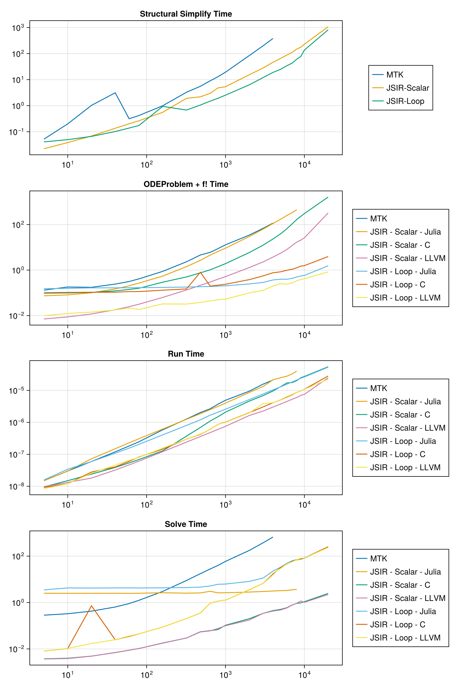
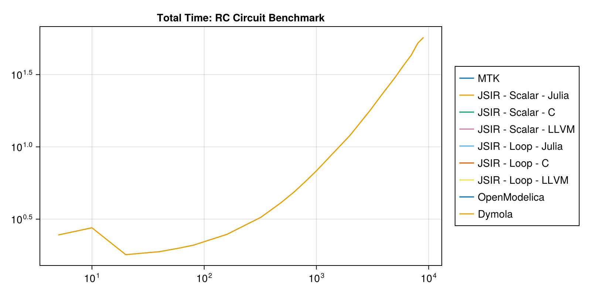

When a model is defined using repeated components, JuliaSimCompiler is able to take advantage of this
to scale efficiently by rerolling equations into loops. This option can be disabled by setting `loop=false`.
Here, we build an RC circuit model with variable numbers of components to show scaling of compile and
runtimes of MTK vs JuliaSimCompiler's three backends with and without loop rerolling.

## Setup Model Code

```julia
using JuliaSimCompiler, ModelingToolkit, OrdinaryDiffEq, BenchmarkTools, ModelingToolkitStandardLibrary, OMJulia, CairoMakie
using ModelingToolkitStandardLibrary.Blocks
using ModelingToolkitStandardLibrary.Electrical
```


```julia
# ModelingToolkit and JuliaSimCompiler
const t = Blocks.t

function build_system(n)
  systems = @named begin
    sine = Sine(frequency = 10)
    source = Voltage()
    resistors[1:n] = Resistor()
    capacitors[1:n] = Capacitor()
    ground = Ground()
  end
  systems = reduce(vcat, systems)
  eqs = [connect(sine.output, source.V)
       connect(source.p, resistors[1].p)
       [connect(resistors[i].n, resistors[i + 1].p, capacitors[i].p)
        for i in 1:(n - 1)]
       connect(resistors[end].n, capacitors[end].p)
       [connect(capacitors[i].n, source.n) for i in 1:n]
       connect(source.n, ground.g)]
  @named sys = ODESystem(eqs, t; systems)
  u0 = [capacitors[i].v => float(i) for i in 1:n];
  ps = [[resistors[i].R => 1 / i for i in 1:n];
        [capacitors[i].C => 1 / i^2 for i in 1:n]]
  return sys, u0, ps
end

function compile_run_problem(sys, u0, ps; target=JuliaSimCompiler.JuliaTarget(), duref=nothing)
  tspan = (0.0, 10.0)
  t0 = time()
  prob = if target === JuliaSimCompiler.JuliaTarget()
    ODEProblem(sys, u0, tspan, ps; sparse = true)
  else
    ODEProblem(sys, target, u0, tspan, ps; sparse = true)
  end
  (; f, u0, p) = prob
  ff = f.f
  du = similar(u0)
  ff(du, u0, p, 0.0)
  t_fode = time() - t0
  duref === nothing || @assert duref ≈ du
  t_run = @belapsed $ff($du, $u0, $p, 0.0)
  t_solve = @elapsed sol = solve(prob, Rodas5(autodiff = false))
  @assert SciMLBase.successful_retcode(sol)
  (t_fode, t_run, t_solve), du
end

const C = JuliaSimCompiler.CTarget();
const LLVM = JuliaSimCompiler.llvm.LLVMTarget();

function run_and_time_julia!(ss_times, times, max_sizes, i, n)
  sys, u0, ps = build_system(n);
  if n <= max_sizes[1]
    ss_times[i, 1] = @elapsed sys_mtk = structural_simplify(sys)
    times[i, 1], _ = compile_run_problem(sys_mtk, u0, ps)
  end
  ss_times[i, 2] = @elapsed sys_jsir_scalar = structural_simplify(IRSystem(sys), loop=false)
  ss_times[i, 3] = @elapsed sys_jsir_loop = structural_simplify(JuliaSimCompiler.compressed_connection_expansion(sys))
  oderef = daeref = nothing
  n <= max_sizes[2] && ((times[i, 2], oderef) = compile_run_problem(sys_jsir_scalar, u0, ps; duref = oderef))
  n <= max_sizes[3] && ((times[i, 3], oderef) = compile_run_problem(sys_jsir_scalar, u0, ps; target=C, duref = oderef))
  n <= max_sizes[4] && ((times[i, 4], oderef) = compile_run_problem(sys_jsir_scalar, u0, ps; target=LLVM, duref = oderef))
  n <= max_sizes[5] && ((times[i, 5], deeref) = compile_run_problem(sys_jsir_loop, u0, ps; duref = daeref))
  n <= max_sizes[6] && ((times[i, 6], daeref) = compile_run_problem(sys_jsir_loop, u0, ps; target=C, duref = daeref))
  n <= max_sizes[7] && ((times[i, 7], daeref) = compile_run_problem(sys_jsir_loop, u0, ps; target=LLVM, duref = daeref))
  for j = 1:7
    ss_time = j == 1 ? ss_times[i,1] : ss_times[i, 2 + (j >= 5)]
    t_fode, t_run, t_solve = times[i,j]
    total_times[i, j] = ss_time + t_fode + t_solve
  end
end
```

```
run_and_time_julia! (generic function with 1 method)
```


```julia
N = [5, 10, 20, 40, 60, 80, 160, 320, 480, 640, 800, 1000, 2000, 3000, 4000, 5000, 6000, 7000, 8000, 9000, 10000, 20000];

# max size we test per method
max_sizes = [4_000, 8_000, 20_000, 20_000, 20_000, 20_000, 20_000, 9000];

# NaN-initialize so Makie will ignore incomplete
ss_times = fill(NaN, length(N), 3);
times = fill((NaN,NaN,NaN), length(N), length(max_sizes) - 1);
total_times = fill(NaN, length(N), length(max_sizes) + 1);
```


## Julia Timings

```julia
@time run_and_time_julia!(ss_times, times, max_sizes, 1, 4); # precompile
for (i, n) in enumerate(N)
  @time run_and_time_julia!(ss_times, times, max_sizes, i, n)
end
```

```
95.956268 seconds (79.52 M allocations: 5.294 GiB, 29.17% gc time, 71.91% 
compilation time: 17% of which was recompilation)
 34.152527 seconds (8.03 M allocations: 573.267 MiB, 76.03% gc time, 20.03%
 compilation time)
 35.951022 seconds (8.91 M allocations: 636.940 MiB, 72.51% gc time, 21.72%
 compilation time)
 39.309392 seconds (10.13 M allocations: 735.313 MiB, 66.81% gc time, 23.77
% compilation time)
 43.605413 seconds (11.63 M allocations: 867.463 MiB, 60.64% gc time, 25.25
% compilation time)
 42.675893 seconds (13.43 M allocations: 1.002 GiB, 62.72% gc time, 19.72% 
compilation time)
 43.607263 seconds (15.49 M allocations: 1.180 GiB, 61.64% gc time, 20.37% 
compilation time)
 51.087162 seconds (24.16 M allocations: 1.960 GiB, 54.45% gc time, 22.30% 
compilation time)
 61.832813 seconds (43.26 M allocations: 4.265 GiB, 47.90% gc time, 30.99% 
compilation time)
 80.092596 seconds (65.23 M allocations: 7.885 GiB, 39.25% gc time, 37.74% 
compilation time)
102.453510 seconds (87.80 M allocations: 12.382 GiB, 31.35% gc time, 43.37%
 compilation time)
128.089217 seconds (114.88 M allocations: 19.200 GiB, 27.44% gc time, 46.48
% compilation time)
165.679845 seconds (155.84 M allocations: 34.036 GiB, 22.65% gc time, 51.06
% compilation time)
426.837663 seconds (400.89 M allocations: 201.957 GiB, 13.55% gc time, 55.3
4% compilation time)
857.764537 seconds (756.12 M allocations: 536.047 GiB, 12.90% gc time, 56.7
1% compilation time)
1505.146704 seconds (1.22 G allocations: 1.229 TiB, 11.21% gc time, 56.85% 
compilation time)
473.537916 seconds (303.16 M allocations: 51.725 GiB, 10.72% gc time, 35.99
% compilation time)
663.607001 seconds (384.32 M allocations: 69.441 GiB, 8.59% gc time, 37.04%
 compilation time)
869.816809 seconds (475.70 M allocations: 89.886 GiB, 7.47% gc time, 37.19%
 compilation time)
1134.474187 seconds (578.69 M allocations: 112.598 GiB, 6.53% gc time, 37.8
1% compilation time)
806.857093 seconds (663.97 M allocations: 131.661 GiB, 8.58% gc time, 0.60%
 compilation time)
1016.949959 seconds (777.87 M allocations: 156.810 GiB, 7.74% gc time, 0.48
% compilation time)
4668.510855 seconds (2.37 G allocations: 549.659 GiB, 9.58% gc time, 0.11% 
compilation time)
```


## OpenModelica Timings

```julia
# OMJ
const omod = OMJulia.OMCSession();
OMJulia.sendExpression(omod, "getVersion()")
OMJulia.sendExpression(omod, "installPackage(Modelica)")
const modelicafile = joinpath(@__DIR__, "RC_Circuit.mo")

function time_open_modelica(n::Int)
  totaltime = @elapsed res = begin
    @sync ModelicaSystem(omod, modelicafile, "RC_Circuit.Test.RC_Circuit_MTK_test_$n")
    sendExpression(omod, "simulate(RC_Circuit.Test.RC_Circuit_MTK_test_$n)")
  end
  @assert res["messages"][1:11] == "LOG_SUCCESS"
  return totaltime
end

function run_and_time_om!(ss_times, times, max_sizes, i, n)
  if n <= max_sizes[8]
    total_times[i, end] = time_open_modelica(n)
  end
  @views println("n = $(n)\nstructural_simplify_times = $(ss_times[i,:])\ncomponent times = $(times[i, :])\ntotal times = $(total_times[i, :])")
end

for (i, n) in enumerate(N)
  @time run_and_time_om!(ss_times, times, max_sizes, i, n)
end

OMJulia.quit(omod)
```

```
n = 5
structural_simplify_times = [0.052060382, 0.022306621, 0.040782429]
component times = [(0.13161182403564453, 1.494889779559118e-8, 0.285127652)
, (0.07401108741760254, 1.4958917835671342e-8, 2.512421404), (0.09684205055
236816, 9.57957957957958e-9, 0.003751535), (0.0071179866790771484, 9.758758
758758759e-9, 0.003691335), (0.1527261734008789, 1.583066132264529e-8, 3.50
3823951), (0.10091018676757812, 9.178178178178178e-9, 0.008088322), (0.0099
57075119018555, 8.387387387387387e-9, 0.008029743)]
total times = [0.46879985803564456, 2.6087391124176023, 0.12290020655236816
, 0.033115942679077144, 3.697332553400879, 0.14978093776757814, 0.058769247
119018556, NaN, 3.123065278]
  3.709781 seconds (733.12 k allocations: 50.520 MiB, 20.58% compilation ti
me)
n = 10
structural_simplify_times = [0.200519443, 0.038379397, 0.049759951]
component times = [(0.1808149814605713, 2.9878391959799e-8, 0.329081276), (
0.08156180381774902, 2.9878391959799e-8, 2.510172147), (0.09911608695983887
, 1.494889779559118e-8, 0.003974462), (0.008791923522949219, 1.316533066132
2646e-8, 0.003848213), (0.15714406967163086, 3.40785498489426e-8, 4.2556417
52), (0.10419106483459473, 1.199099099099099e-8, 0.010381706), (0.012476921
081542969, 1.198098098098098e-8, 0.010507904)]
total times = [0.7104157004605713, 2.630113347817749, 0.1414699459598389, 0
.051019533522949224, 4.462545772671631, 0.1643327218345947, 0.0727447760815
4296, NaN, 2.242831082]
  2.243051 seconds (4.25 k allocations: 308.570 KiB)
n = 20
structural_simplify_times = [1.028564034, 0.068555985, 0.066251143]
component times = [(0.17492079734802246, 5.972403258655804e-8, 0.425843486)
, (0.10114598274230957, 7.226002055498458e-8, 2.502644977), (0.104861974716
18652, 2.3904618473895583e-8, 0.004893891), (0.011820077896118164, 1.805416
2487462388e-8, 0.004879821), (0.16570806503295898, 5.946028513238289e-8, 4.
201967765), (0.1063849925994873, 2.7819095477386935e-8, 0.722777933), (0.01
4230966567993164, 2.543718592964824e-8, 0.017142434)]
total times = [1.6293283173480224, 2.67234694474231, 0.17831185071618652, 0
.08525588389611817, 4.433926973032959, 0.8954140685994874, 0.09762454356799
316, NaN, 2.860818057]
  2.861037 seconds (7.89 k allocations: 567.648 KiB)
n = 40
structural_simplify_times = [3.131354271, 0.13572646, 0.101825587]
component times = [(0.24292588233947754, 1.1943674367436743e-7, 0.640673422
), (0.1486968994140625, 1.4929197080291972e-7, 2.504791514), (0.12199592590
332031, 3.883064516129032e-8, 0.006949037), (0.018133878707885742, 3.212173
0382293764e-8, 0.007035636), (0.16650700569152832, 1.081159737417943e-7, 4.
271899959), (0.1065831184387207, 4.0201010101010095e-8, 0.024820502), (0.01
774907112121582, 4.5692618806875626e-8, 0.024951301)]
total times = [4.014953575339478, 2.7892148734140623, 0.2646714229033203, 0
.16089597470788575, 4.540232551691528, 0.2332292074387207, 0.14452595912121
582, NaN, 3.809748922]
  3.809886 seconds (15.40 k allocations: 1.068 MiB)
n = 60
structural_simplify_times = [0.315487124, 0.202432532, 0.138564867]
component times = [(0.31543707847595215, 1.8214306569343066e-7, 0.902927397
), (0.20412302017211914, 2.292923076923077e-7, 2.490543008), (0.14102196693
42041, 5.375532994923858e-8, 0.008806864), (0.024667978286743164, 4.6601617
795753284e-8, 0.008838825), (0.16741490364074707, 1.5619095477386936e-7, 4.
269159564), (0.11393094062805176, 6.035677879714577e-8, 0.034621035), (0.02
1601200103759766, 6.470786516853933e-8, 0.036201486)]
total times = [1.5338515994759523, 2.897098560172119, 0.3522613629342041, 0
.23593933528674316, 4.575139334640747, 0.2871168426280518, 0.19636755310375
978, NaN, 5.181141404]
  5.181330 seconds (20.75 k allocations: 1.426 MiB)
n = 80
structural_simplify_times = [0.420178246, 0.264162226, 0.174233562]
component times = [(0.4122040271759033, 2.4670466321243526e-7, 1.248091907)
, (0.2694590091705322, 3.069595141700405e-7, 2.510936636), (0.1591460704803
4668, 6.867725409836065e-8, 0.010449835), (0.03182792663574219, 6.123241590
214067e-8, 0.010371376), (0.16884398460388184, 2.0517192982456141e-7, 4.244
587943), (0.1140279769897461, 8.184352331606217e-8, 0.044775495), (0.018671
035766601562, 7.976111685625647e-8, 0.045005102)]
total times = [2.0804741801759032, 3.0445578711705323, 0.4337581314803467, 
0.3063615286357422, 4.587665489603882, 0.3330370339897461, 0.23790969976660
156, NaN, 6.896481704]
  6.896697 seconds (28.35 k allocations: 1.991 MiB)
n = 160
structural_simplify_times = [0.995532428, 0.557137066, 0.943794201]
component times = [(0.8806099891662598, 5.831381215469613e-7, 3.016842923),
 (0.5446381568908691, 6.171560693641618e-7, 2.636086848), (0.29455184936523
44, 1.2837612612612614e-7, 0.017788598), (0.06313395500183105, 1.2094806629
834253e-7, 0.018138264), (0.17363691329956055, 4.06145e-7, 4.303443762), (0
.13082599639892578, 1.4517044100119191e-7, 0.087563884), (0.032737016677856
445, 1.5620959595959596e-7, 0.087304258)]
total times = [4.89298534016626, 3.7378620708908694, 0.8694775133652344, 0.
638409285001831, 5.42087487629956, 1.1621840813989257, 1.0638354756778565, 
NaN, 12.188521337]
 12.188723 seconds (53.75 k allocations: 3.600 MiB)
n = 320
structural_simplify_times = [3.277191095, 1.91668166, 0.678302183]
component times = [(2.3152620792388916, 1.2669e-6, 8.931991417), (1.4223260
879516602, 1.243e-6, 2.533084341), (0.5005459785461426, 3.702864077669903e-
7, 0.029678986), (0.13358306884765625, 2.403863080684597e-7, 0.029459798), 
(0.17940378189086914, 8.004193548387097e-7, 4.414744279), (0.14867806434631
348, 2.9941245136186767e-7, 0.20466607), (0.032109975814819336, 2.990233463
0350196e-7, 0.204095797)]
total times = [14.524444591238893, 5.872092088951661, 2.4469066245461426, 2
.0797245268476563, 5.272450243890869, 1.0316463173463135, 0.914507955814819
4, NaN, 25.381291452]
 25.381508 seconds (112.02 k allocations: 7.726 MiB)
n = 480
structural_simplify_times = [5.559032616, 2.191648212, 1.058192709]
component times = [(4.604480981826782, 2.026555555555556e-6, 17.521416184),
 (2.6829841136932373, 1.8689e-6, 2.598225731), (0.7564220428466797, 6.91270
2702702703e-7, 0.054818968), (0.21428704261779785, 3.598995215311005e-7, 0.
053659301), (0.18643403053283691, 1.2009e-6, 4.611873906), (0.8055138587951
66, 4.194422110552764e-7, 0.353147), (0.03811788558959961, 4.29693467336683
4e-7, 0.356258734)]
total times = [27.68492978182678, 7.472858056693237, 3.00288922284668, 2.45
9594555617798, 5.856500645532837, 2.216853567795166, 1.4525693285895998, Na
N, 38.136907145]
 38.137107 seconds (164.82 k allocations: 11.061 MiB)
n = 640
structural_simplify_times = [9.024777703, 2.981093578, 1.499273772]
component times = [(6.022320985794067, 2.661e-6, 27.995516156), (4.56217288
9709473, 2.5044444444444445e-6, 3.049975727), (1.030087947845459, 1.0999e-6
, 0.061397312), (0.30030298233032227, 4.792717948717949e-7, 0.060034858), (
0.19016289710998535, 1.6789000000000001e-6, 5.189642979), (0.19742608070373
535, 6.057329545454545e-7, 0.941009673), (0.04408693313598633, 5.9830898876
40449e-7, 0.949260838)]
total times = [43.042614844794066, 10.593242194709472, 4.072578837845459, 3
.341431418330322, 6.879079648109986, 2.6377095257037353, 2.4926215431359866
, NaN, 50.51781228]
 50.518029 seconds (212.15 k allocations: 14.680 MiB)
n = 800
structural_simplify_times = [12.870104894, 4.806036658, 1.921578536]
component times = [(8.710571050643921, 3.6825e-6, 39.618549288), (6.5825850
96359253, 3.14875e-6, 2.617729148), (1.4030070304870605, 1.491e-6, 0.068047
576), (0.3964550495147705, 5.998764044943819e-7, 0.076180331), (0.197456121
44470215, 2.067777777777778e-6, 6.114036399), (0.21746015548706055, 8.63898
3050847457e-7, 1.148057262), (0.04960489273071289, 8.62820895522388e-7, 1.1
42927416)]
total times = [61.19922523264392, 14.006350902359253, 6.27709126448706, 5.2
7867203851477, 8.233071056444702, 3.2870959534870607, 3.114110844730713, Na
N, 63.642315774]
 63.642514 seconds (286.80 k allocations: 19.303 MiB)
n = 1000
structural_simplify_times = [19.388747655, 5.340180242, 2.539517422]
component times = [(12.888231992721558, 4.911285714285715e-6, 59.40796525),
 (9.192474126815796, 4.011428571428571e-6, 2.639346654), (1.920741081237793
, 2.09e-6, 0.105103544), (0.517935037612915, 7.507355371900826e-7, 0.099899
375), (0.20392489433288574, 2.583222222222222e-6, 6.259717423), (0.23869013
786315918, 1.016e-6, 1.274488033), (0.05331611633300781, 1.001e-6, 1.277059
506)]
total times = [91.68494489772155, 17.172001022815795, 7.366024867237793, 5.
9580146546129145, 9.003159739332885, 4.052695592863159, 3.8698930443330077,
 NaN, 79.117474212]
 79.117703 seconds (330.95 k allocations: 23.194 MiB)
n = 2000
structural_simplify_times = [83.888778406, 15.433583937, 6.320016192]
component times = [(34.35757803916931, 9.44e-6, 175.874308096), (29.7823810
57739258, 8.596666666666667e-6, 2.823637086), (5.898248910903931, 4.6157142
85714286e-6, 0.200926334), (1.2938759326934814, 1.6389e-6, 0.175658178), (0
.24637198448181152, 5.153166666666667e-6, 8.128146872), (0.381134033203125,
 2.0143333333333333e-6, 3.560958284), (0.09969305992126465, 1.9749e-6, 3.62
0413024)]
total times = [294.1206645411693, 48.03960208073926, 21.53275918190393, 16.
903118047693482, 14.69453504848181, 10.262108509203124, 10.040122275921265,
 NaN, 172.22697751]
172.227190 seconds (682.80 k allocations: 45.825 MiB)
n = 3000
structural_simplify_times = [200.259539452, 28.032075014, 12.015635503]
component times = [(68.55743193626404, 1.573e-5, 376.952728015), (63.147860
050201416, 1.33e-5, 2.989622631), (12.476731061935425, 6.884e-6, 0.34199324
8), (2.290637969970703, 2.2565555555555557e-6, 0.341358908), (0.28828310966
4917, 7.73725e-6, 11.383007677), (0.5557851791381836, 3.048625e-6, 6.787550
189), (0.12868094444274902, 3.846125e-6, 6.824431886)]
total times = [645.769699403264, 94.16955769520142, 40.850799323935426, 30.
664071891970703, 23.686926289664918, 19.358970871138183, 18.96874833344275,
 NaN, 269.851075183]
269.851297 seconds (1.08 M allocations: 73.744 MiB)
n = 4000
structural_simplify_times = [381.475557768, 46.490843671, 18.941700741]
component times = [(115.85982489585876, 2.1139e-5, 667.038253229), (111.161
56101226807, 2.147e-5, 3.142147197), (23.33512282371521, 9.6e-6, 0.44947885
8), (3.734196186065674, 3.014875e-6, 0.428135682), (0.3690500259399414, 1.0
39e-5, 22.691208527), (0.7640500068664551, 4.098571428571428e-6, 16.7272101
2), (0.1982438564300537, 4.094285714285714e-6, 18.4022693)]
total times = [1164.3736358928588, 160.79455188026805, 70.27544535271521, 5
0.65317553906567, 42.00195929393994, 36.432960867866456, 37.54221389743005,
 NaN, 387.118220111]
387.118391 seconds (1.32 M allocations: 88.467 MiB)
n = 5000
structural_simplify_times = [NaN, 65.669469071, 24.942020262]
component times = [(NaN, NaN, NaN), (171.9354190826416, 2.499e-5, 3.2438184
34), (39.32712697982788, 1.309e-5, 0.508148257), (5.5536949634552, 3.751125
e-6, 0.477438307), (0.39814209938049316, 1.294e-5, 33.338471875), (0.839764
8334503174, 5.06e-6, 32.180119971), (0.2561380863189697, 5.121666666666667e
-6, 29.553132382)]
total times = [NaN, 240.84870658764157, 105.50474430782788, 71.700602341455
2, 58.678634236380496, 57.96190506645032, 54.75129073031897, NaN, 532.32599
4843]
532.326212 seconds (1.65 M allocations: 112.839 MiB)
n = 6000
structural_simplify_times = [NaN, 88.082302302, 34.315626132]
component times = [(NaN, NaN, NaN), (251.27478408813477, 2.788e-5, 3.305207
961), (65.67364883422852, 1.713e-5, 0.599361506), (8.066697835922241, 4.499
857142857143e-6, 0.580666771), (0.3947639465332031, 1.5629e-5, 49.416522106
), (0.9857909679412842, 6.196e-6, 45.353433436), (0.24031591415405273, 6.43
2e-6, 46.510440457)]
total times = [NaN, 342.6622943511348, 154.35531264222854, 96.7296669089222
4, 84.12691218453321, 80.65485053594128, 81.06638250315405, NaN, 723.715244
998]
723.715453 seconds (1.98 M allocations: 132.672 MiB)
n = 7000
structural_simplify_times = [NaN, 112.202669122, 43.18812767]
component times = [(NaN, NaN, NaN), (333.88141894340515, 3.2829e-5, 3.54915
2482), (107.76203083992004, 1.754e-5, 0.788491008), (12.024096965789795, 5.
283333333333333e-6, 0.779270829), (0.43435192108154297, 1.833e-5, 63.208187
65), (1.0835249423980713, 7.3e-6, 59.336032211), (0.27133893966674805, 7.51
975e-6, 56.645718482)]
total times = [NaN, 449.63324054740514, 220.75319096992004, 125.00603691678
98, 106.83066724108154, 103.60768482339807, 100.10518509166675, NaN, 959.38
3484354]
959.383684 seconds (2.40 M allocations: 165.578 MiB, 0.04% gc time)
n = 8000
structural_simplify_times = [NaN, 149.183947326, 60.930882153]
component times = [(NaN, NaN, NaN), (446.6232581138611, 3.9969e-5, 3.677604
362), (167.00394201278687, 2.02e-5, 0.921636526), (16.985419988632202, 5.99
5e-6, 0.924860741), (0.499284029006958, 2.114e-5, 71.34396667), (1.26432991
02783203, 8.71e-6, 68.048922643), (0.33916807174682617, 8.73e-6, 69.2299068
83)]
total times = [NaN, 599.484809801861, 317.10952586478686, 167.0942280556322
1, 132.77413285200697, 130.24413470627832, 130.4999571077468, NaN, 1247.863
349414]
1247.863568 seconds (2.64 M allocations: 176.876 MiB)
n = 9000
structural_simplify_times = [NaN, 176.411046908, 77.765519996]
component times = [(NaN, NaN, NaN), (NaN, NaN, NaN), (230.21130514144897, 2
.485e-5, 0.965536172), (20.657920837402344, 7.0075e-6, 1.171807147), (0.549
8969554901123, 2.399e-5, 74.390584776), (1.4986228942871094, 9.62e-6, 75.51
7901292), (0.3858180046081543, 9.63e-6, 81.573751794)]
total times = [NaN, NaN, 407.58788822144896, 198.24077489240236, 152.706001
7274901, 154.7820441822871, 159.72508979460815, NaN, 1620.128523308]
1620.128767 seconds (2.97 M allocations: 198.979 MiB)
n = 10000
structural_simplify_times = [NaN, 229.234377524, 136.473246574]
component times = [(NaN, NaN, NaN), (NaN, NaN, NaN), (303.8008201122284, 2.
7339e-5, 1.086974415), (26.11335587501526, 7.52975e-6, 1.02303695), (0.5821
430683135986, 2.633e-5, 81.073660185), (1.575294017791748, 1.086e-5, 83.759
30336), (0.4196951389312744, 1.082e-5, 83.339083176)]
total times = [NaN, NaN, 534.1221720512284, 256.37077034901523, 218.1290498
273136, 221.80784395179177, 220.23202488893128, NaN, NaN]
  0.000097 seconds (217 allocations: 19.422 KiB)
n = 20000
structural_simplify_times = [NaN, 1074.45806788, 821.04748625]
component times = [(NaN, NaN, NaN), (NaN, NaN, NaN), (1619.8859651088715, 5
.505e-5, 2.467285823), (323.7287690639496, 2.4829e-5, 2.209334927), (1.5443
320274353027, 5.336e-5, 243.077548125), (3.929427146911621, 2.828e-5, 253.5
3878667), (0.8302521705627441, 2.24e-5, 234.193022199)]
total times = [NaN, NaN, 2696.811318811872, 1400.3961718709497, 1065.669366
4024353, 1078.5157000669117, 1056.0707606195629, NaN, NaN]
  0.000091 seconds (217 allocations: 19.422 KiB)
```


## Dymola Timings

Dymola requires a license server and thus cannot be hosted. This was run locally for the
following times:

```julia
translation_and_total_times = [
  5 2.428 2.458
  10 2.727 2.757
  20 1.764 1.797
  40 1.849 1.885
  60 1.953 1.995
  80 2.041 2.089
  160 2.422 2.485
  320 3.157 3.258
  480 3.943 4.092
  640 4.718 4.912
  800 5.531 5.773
  1000 6.526 6.826
  2000 11.467 12.056
  3000 16.8 17.831
  4000 22.355 24.043
  5000 27.768 30.083
  6000 33.561 36.758
  7000 39.197 43.154
  8000 45.194 52.153
  9000 50.689 57.187
  10000 NaN NaN
  20000 NaN NaN
]

total_times[:, 9] = translation_and_total_times[:,3]
```

```
22-element Vector{Float64}:
   2.458
   2.757
   1.797
   1.885
   1.995
   2.089
   2.485
   3.258
   4.092
   4.912
   ⋮
  17.831
  24.043
  30.083
  36.758
  43.154
  52.153
  57.187
 NaN
 NaN
```


## Results

```julia
f = Figure(size=(800,1200));
ss_names = ["MTK", "JSIR-Scalar", "JSIR-Loop"];
let ax = Axis(f[1, 1]; yscale = log10, xscale = log10, title="Structural Simplify Time")
  _lines = map(eachcol(ss_times)) do ts
    lines!(N, ts)
  end
  Legend(f[1,2], _lines, ss_names)
end
method_names = ["MTK", "JSIR - Scalar - Julia", "JSIR - Scalar - C", "JSIR - Scalar - LLVM", "JSIR - Loop - Julia", "JSIR - Loop - C", "JSIR - Loop - LLVM"];
for (i, timecat) in enumerate(("ODEProblem + f!", "Run", "Solve"))
  title = timecat * " Time"
  ax = Axis(f[i+1, 1]; yscale = log10, xscale = log10, title)
  _lines = map(eachcol(times)) do ts
    lines!(N, getindex.(ts, i))
  end
  Legend(f[i+1, 2], _lines, method_names)
end
f
```



```julia
f2 = Figure(size = (800, 400));
title = "Total Time: RC Circuit Benchmark"
ax = Axis(f2[1, 1]; yscale = log10, xscale = log10, title)
names = ["MTK", "JSIR - Scalar - Julia", "JSIR - Scalar - C", "JSIR - Scalar - LLVM", "JSIR - Loop - Julia", "JSIR - Loop - C", "JSIR - Loop - LLVM", "OpenModelica", "Dymola"]
_lines = map(enumerate(names)) do (j, label)
    ts = @view(total_times[:, j])
    lines!(N, ts)
end
Legend(f2[1,2], _lines, names)
f2
```




All three backends compiled more quickly with loops, but the C and LLVM backends are so much quicker to compile than the Julia backend that this made much less difference for them.
The impact on runtime was more varied.

## Appendix


## Appendix

These benchmarks are a part of the SciMLBenchmarks.jl repository, found at: [https://github.com/SciML/SciMLBenchmarks.jl](https://github.com/SciML/SciMLBenchmarks.jl). For more information on high-performance scientific machine learning, check out the SciML Open Source Software Organization [https://sciml.ai](https://sciml.ai).

To locally run this benchmark, do the following commands:

```
using SciMLBenchmarks
SciMLBenchmarks.weave_file("benchmarks/ModelingToolkit","RCCircuit.jmd")
```

Computer Information:

```
Julia Version 1.10.4
Commit 48d4fd48430 (2024-06-04 10:41 UTC)
Build Info:
  Official https://julialang.org/ release
Platform Info:
  OS: Linux (x86_64-linux-gnu)
  CPU: 128 × AMD EPYC 7502 32-Core Processor
  WORD_SIZE: 64
  LIBM: libopenlibm
  LLVM: libLLVM-15.0.7 (ORCJIT, znver2)
Threads: 1 default, 0 interactive, 1 GC (on 128 virtual cores)
Environment:
  JULIA_CPU_THREADS = 128
  JULIA_DEPOT_PATH = /cache/julia-buildkite-plugin/depots/5b300254-1738-4989-ae0a-f4d2d937f953
  JULIA_PKG_SERVER = juliahub.com

```

Package Information:

```
Status `/cache/build/exclusive-amdci1-0/julialang/scimlbenchmarks-dot-jl/benchmarks/ModelingToolkit/Project.toml`
  [6e4b80f9] BenchmarkTools v1.5.0
  [336ed68f] CSV v0.10.14
⌅ [13f3f980] CairoMakie v0.11.11
  [a93c6f00] DataFrames v1.6.1
  [8391cb6b] JuliaSimCompiler v0.1.14
  [9cbdfd5a] JuliaSimCompilerRuntime v1.0.2
  [7ed4a6bd] LinearSolve v2.30.2
  [961ee093] ModelingToolkit v9.20.0
  [16a59e39] ModelingToolkitStandardLibrary v2.7.2
  [e1cad5d1] Multibody v0.1.0
  [0f4fe800] OMJulia v0.3.2
  [1dea7af3] OrdinaryDiffEq v6.84.0
  [f27b6e38] Polynomials v4.0.11
  [ba661fbb] PreferenceTools v0.1.2
  [31c91b34] SciMLBenchmarks v0.1.3
  [0c5d862f] Symbolics v5.32.0
  [de0858da] Printf
Info Packages marked with ⌅ have new versions available but compatibility constraints restrict them from upgrading. To see why use `status --outdated`
```

And the full manifest:

```
Status `/cache/build/exclusive-amdci1-0/julialang/scimlbenchmarks-dot-jl/benchmarks/ModelingToolkit/Manifest.toml`
  [47edcb42] ADTypes v1.5.2
  [621f4979] AbstractFFTs v1.5.0
  [1520ce14] AbstractTrees v0.4.5
  [7d9f7c33] Accessors v0.1.36
  [79e6a3ab] Adapt v4.0.4
  [66dad0bd] AliasTables v1.1.3
  [27a7e980] Animations v0.4.1
  [ec485272] ArnoldiMethod v0.4.0
  [4fba245c] ArrayInterface v7.11.0
  [4c555306] ArrayLayouts v1.10.0
  [67c07d97] Automa v1.0.3
  [13072b0f] AxisAlgorithms v1.1.0
  [39de3d68] AxisArrays v0.4.7
  [6e4b80f9] BenchmarkTools v1.5.0
  [e2ed5e7c] Bijections v0.1.7
  [62783981] BitTwiddlingConvenienceFunctions v0.1.5
  [fa961155] CEnum v0.5.0
  [2a0fbf3d] CPUSummary v0.2.6
  [00ebfdb7] CSTParser v3.4.3
  [336ed68f] CSV v0.10.14
  [159f3aea] Cairo v1.0.5
⌅ [13f3f980] CairoMakie v0.11.11
  [49dc2e85] Calculus v0.5.1
  [082447d4] ChainRules v1.69.0
  [d360d2e6] ChainRulesCore v1.24.0
  [fb6a15b2] CloseOpenIntervals v0.1.12
  [944b1d66] CodecZlib v0.7.4
  [a2cac450] ColorBrewer v0.4.0
  [35d6a980] ColorSchemes v3.25.0
  [3da002f7] ColorTypes v0.11.5
  [c3611d14] ColorVectorSpace v0.10.0
  [5ae59095] Colors v0.12.11
  [861a8166] Combinatorics v1.0.2
  [a80b9123] CommonMark v0.8.12
  [38540f10] CommonSolve v0.2.4
  [bbf7d656] CommonSubexpressions v0.3.0
  [34da2185] Compat v4.15.0
  [b152e2b5] CompositeTypes v0.1.4
  [a33af91c] CompositionsBase v0.1.2
  [2569d6c7] ConcreteStructs v0.2.3
  [8f4d0f93] Conda v1.10.2
  [187b0558] ConstructionBase v1.5.5
  [d38c429a] Contour v0.6.3
  [150eb455] CoordinateTransformations v0.6.3
  [adafc99b] CpuId v0.3.1
  [a8cc5b0e] Crayons v4.1.1
  [9a962f9c] DataAPI v1.16.0
  [a93c6f00] DataFrames v1.6.1
  [82cc6244] DataInterpolations v5.2.0
  [864edb3b] DataStructures v0.18.20
  [e2d170a0] DataValueInterfaces v1.0.0
  [927a84f5] DelaunayTriangulation v1.0.3
  [2b5f629d] DiffEqBase v6.151.5
  [459566f4] DiffEqCallbacks v3.6.2
  [163ba53b] DiffResults v1.1.0
  [b552c78f] DiffRules v1.15.1
  [a0c0ee7d] DifferentiationInterface v0.5.6
  [31c24e10] Distributions v0.25.109
  [ffbed154] DocStringExtensions v0.9.3
  [5b8099bc] DomainSets v0.7.14
  [fa6b7ba4] DualNumbers v0.6.8
⌅ [7c1d4256] DynamicPolynomials v0.5.7
⌅ [06fc5a27] DynamicQuantities v0.13.2
  [4e289a0a] EnumX v1.0.4
  [f151be2c] EnzymeCore v0.7.6
  [429591f6] ExactPredicates v2.2.8
  [d4d017d3] ExponentialUtilities v1.26.1
  [e2ba6199] ExprTools v0.1.10
⌅ [6b7a57c9] Expronicon v0.8.5
  [411431e0] Extents v0.1.3
  [7a1cc6ca] FFTW v1.8.0
  [7034ab61] FastBroadcast v0.3.3
  [9aa1b823] FastClosures v0.3.2
  [29a986be] FastLapackInterface v2.0.4
  [5789e2e9] FileIO v1.16.3
  [8fc22ac5] FilePaths v0.8.3
  [48062228] FilePathsBase v0.9.21
  [1a297f60] FillArrays v1.11.0
  [64ca27bc] FindFirstFunctions v1.2.0
  [6a86dc24] FiniteDiff v2.23.1
  [53c48c17] FixedPointNumbers v0.8.5
  [1fa38f19] Format v1.3.7
  [f6369f11] ForwardDiff v0.10.36
  [b38be410] FreeType v4.1.1
  [663a7486] FreeTypeAbstraction v0.10.3
  [069b7b12] FunctionWrappers v1.1.3
  [77dc65aa] FunctionWrappersWrappers v0.1.3
  [d9f16b24] Functors v0.4.11
  [46192b85] GPUArraysCore v0.1.6
  [61eb1bfa] GPUCompiler v0.26.5
  [c145ed77] GenericSchur v0.5.4
  [cf35fbd7] GeoInterface v1.3.4
  [5c1252a2] GeometryBasics v0.4.11
  [d7ba0133] Git v1.3.1
  [c27321d9] Glob v1.3.1
  [a2bd30eb] Graphics v1.1.2
  [86223c79] Graphs v1.11.1
⌅ [3955a311] GridLayoutBase v0.10.2
  [42e2da0e] Grisu v1.0.2
  [eafb193a] Highlights v0.5.3
  [3e5b6fbb] HostCPUFeatures v0.1.16
  [34004b35] HypergeometricFunctions v0.3.23
  [7073ff75] IJulia v1.25.0
  [615f187c] IfElse v0.1.1
  [2803e5a7] ImageAxes v0.6.11
  [c817782e] ImageBase v0.1.7
  [a09fc81d] ImageCore v0.10.2
  [82e4d734] ImageIO v0.6.8
  [bc367c6b] ImageMetadata v0.9.9
  [9b13fd28] IndirectArrays v1.0.0
  [d25df0c9] Inflate v0.1.5
  [842dd82b] InlineStrings v1.4.1
  [a98d9a8b] Interpolations v0.15.1
  [d1acc4aa] IntervalArithmetic v0.22.14
  [8197267c] IntervalSets v0.7.10
  [3587e190] InverseFunctions v0.1.14
  [41ab1584] InvertedIndices v1.3.0
  [92d709cd] IrrationalConstants v0.2.2
  [f1662d9f] Isoband v0.1.1
  [c8e1da08] IterTools v1.10.0
  [82899510] IteratorInterfaceExtensions v1.0.0
  [692b3bcd] JLLWrappers v1.5.0
  [682c06a0] JSON v0.21.4
  [b835a17e] JpegTurbo v0.1.5
  [98e50ef6] JuliaFormatter v1.0.56
  [9c9cc66b] JuliaSimBase v0.1.0
  [8391cb6b] JuliaSimCompiler v0.1.14
  [9cbdfd5a] JuliaSimCompilerRuntime v1.0.2
  [ccbc3e58] JumpProcesses v9.11.1
  [ef3ab10e] KLU v0.6.0
  [5ab0869b] KernelDensity v0.6.9
  [ba0b0d4f] Krylov v0.9.6
⌅ [929cbde3] LLVM v7.2.1
  [b964fa9f] LaTeXStrings v1.3.1
  [2ee39098] LabelledArrays v1.16.0
  [984bce1d] LambertW v0.4.6
  [23fbe1c1] Latexify v0.16.3
  [10f19ff3] LayoutPointers v0.1.17
  [5078a376] LazyArrays v2.1.0
  [8cdb02fc] LazyModules v0.3.1
  [9c8b4983] LightXML v0.9.1
  [d3d80556] LineSearches v7.2.0
  [7ed4a6bd] LinearSolve v2.30.2
  [2ab3a3ac] LogExpFunctions v0.3.28
  [bdcacae8] LoopVectorization v0.12.170
  [d8e11817] MLStyle v0.4.17
  [1914dd2f] MacroTools v0.5.13
⌅ [ee78f7c6] Makie v0.20.10
⌅ [20f20a25] MakieCore v0.7.3
  [d125e4d3] ManualMemory v0.1.8
  [dbb5928d] MappedArrays v0.4.2
⌅ [0a4f8689] MathTeXEngine v0.5.7
  [bb5d69b7] MaybeInplace v0.1.3
  [739be429] MbedTLS v1.1.9
  [7269a6da] MeshIO v0.4.11
  [e1d29d7a] Missings v1.2.0
  [961ee093] ModelingToolkit v9.20.0
  [16a59e39] ModelingToolkitStandardLibrary v2.7.2
  [e94cdb99] MosaicViews v0.3.4
  [46d2c3a1] MuladdMacro v0.2.4
  [e1cad5d1] Multibody v0.1.0
  [102ac46a] MultivariatePolynomials v0.5.6
  [ffc61752] Mustache v1.0.19
  [d8a4904e] MutableArithmetics v1.4.5
  [d41bc354] NLSolversBase v7.8.3
  [77ba4419] NaNMath v1.0.2
  [f09324ee] Netpbm v1.1.1
  [8913a72c] NonlinearSolve v3.13.1
  [0f4fe800] OMJulia v0.3.2
  [510215fc] Observables v0.5.5
  [6fe1bfb0] OffsetArrays v1.14.0
  [52e1d378] OpenEXR v0.3.2
  [bac558e1] OrderedCollections v1.6.3
  [1dea7af3] OrdinaryDiffEq v6.84.0
  [90014a1f] PDMats v0.11.31
  [f57f5aa1] PNGFiles v0.4.3
  [65ce6f38] PackageExtensionCompat v1.0.2
  [19eb6ba3] Packing v0.5.0
  [5432bcbf] PaddedViews v0.5.12
  [d96e819e] Parameters v0.12.3
  [69de0a69] Parsers v2.8.1
  [eebad327] PkgVersion v0.3.3
  [995b91a9] PlotUtils v1.4.1
  [e409e4f3] PoissonRandom v0.4.4
  [f517fe37] Polyester v0.7.15
  [1d0040c9] PolyesterWeave v0.2.1
  [647866c9] PolygonOps v0.1.2
  [f27b6e38] Polynomials v4.0.11
  [2dfb63ee] PooledArrays v1.4.3
  [d236fae5] PreallocationTools v0.4.22
  [aea7be01] PrecompileTools v1.2.1
  [ba661fbb] PreferenceTools v0.1.2
  [21216c6a] Preferences v1.4.3
  [08abe8d2] PrettyTables v2.3.2
  [92933f4c] ProgressMeter v1.10.0
  [43287f4e] PtrArrays v1.2.0
  [4b34888f] QOI v1.0.0
  [1fd47b50] QuadGK v2.9.4
  [94ee1d12] Quaternions v0.7.6
  [e6cf234a] RandomNumbers v1.5.3
  [b3c3ace0] RangeArrays v0.3.2
  [c84ed2f1] Ratios v0.4.5
  [c1ae055f] RealDot v0.1.0
  [3cdcf5f2] RecipesBase v1.3.4
⌃ [731186ca] RecursiveArrayTools v3.23.1
  [f2c3362d] RecursiveFactorization v0.2.23
  [189a3867] Reexport v1.2.2
  [05181044] RelocatableFolders v1.0.1
  [ae029012] Requires v1.3.0
  [79098fc4] Rmath v0.7.1
  [6038ab10] Rotations v1.7.1
  [5eaf0fd0] RoundingEmulator v0.2.1
  [7e49a35a] RuntimeGeneratedFunctions v0.5.13
  [fdea26ae] SIMD v3.5.0
  [94e857df] SIMDTypes v0.1.0
  [476501e8] SLEEFPirates v0.6.42
  [0bca4576] SciMLBase v2.41.3
  [31c91b34] SciMLBenchmarks v0.1.3
  [c0aeaf25] SciMLOperators v0.3.8
  [53ae85a6] SciMLStructures v1.3.0
  [6c6a2e73] Scratch v1.2.1
  [91c51154] SentinelArrays v1.4.3
  [efcf1570] Setfield v1.1.1
  [65257c39] ShaderAbstractions v0.4.1
  [992d4aef] Showoff v1.0.3
  [73760f76] SignedDistanceFields v0.4.0
  [727e6d20] SimpleNonlinearSolve v1.10.1
  [699a6c99] SimpleTraits v0.9.4
  [ce78b400] SimpleUnPack v1.1.0
  [45858cf5] Sixel v0.1.3
  [66db9d55] SnoopPrecompile v1.0.3
  [b85f4697] SoftGlobalScope v1.1.0
  [a2af1166] SortingAlgorithms v1.2.1
  [47a9eef4] SparseDiffTools v2.19.0
  [dc90abb0] SparseInverseSubset v0.1.2
  [0a514795] SparseMatrixColorings v0.3.3
  [e56a9233] Sparspak v0.3.9
  [276daf66] SpecialFunctions v2.4.0
  [cae243ae] StackViews v0.1.1
⌅ [aedffcd0] Static v0.8.10
  [0d7ed370] StaticArrayInterface v1.5.1
  [90137ffa] StaticArrays v1.9.5
  [1e83bf80] StaticArraysCore v1.4.3
  [82ae8749] StatsAPI v1.7.0
  [2913bbd2] StatsBase v0.34.3
  [4c63d2b9] StatsFuns v1.3.1
  [7792a7ef] StrideArraysCore v0.5.6
  [69024149] StringEncodings v0.3.7
  [892a3eda] StringManipulation v0.3.4
  [09ab397b] StructArrays v0.6.18
  [2efcf032] SymbolicIndexingInterface v0.3.22
  [19f23fe9] SymbolicLimits v0.2.1
  [d1185830] SymbolicUtils v2.1.0
  [0c5d862f] Symbolics v5.32.0
  [3783bdb8] TableTraits v1.0.1
  [bd369af6] Tables v1.11.1
  [62fd8b95] TensorCore v0.1.1
⌅ [8ea1fca8] TermInterface v0.4.1
  [8290d209] ThreadingUtilities v0.5.2
  [731e570b] TiffImages v0.10.0
  [a759f4b9] TimerOutputs v0.5.24
  [0796e94c] Tokenize v0.5.29
  [3bb67fe8] TranscodingStreams v0.10.10
  [d5829a12] TriangularSolve v0.2.0
  [410a4b4d] Tricks v0.1.8
  [981d1d27] TriplotBase v0.1.0
  [781d530d] TruncatedStacktraces v1.4.0
  [5c2747f8] URIs v1.5.1
  [3a884ed6] UnPack v1.0.2
  [1cfade01] UnicodeFun v0.4.1
  [1986cc42] Unitful v1.20.0
  [a7c27f48] Unityper v0.1.6
  [3d5dd08c] VectorizationBase v0.21.69
  [81def892] VersionParsing v1.3.0
  [19fa3120] VertexSafeGraphs v0.2.0
  [ea10d353] WeakRefStrings v1.4.2
  [44d3d7a6] Weave v0.10.12
  [efce3f68] WoodburyMatrices v1.0.0
  [76eceee3] WorkerUtilities v1.6.1
  [ddb6d928] YAML v0.4.11
  [c2297ded] ZMQ v1.2.6
  [6e34b625] Bzip2_jll v1.0.8+1
  [4e9b3aee] CRlibm_jll v1.0.1+0
  [83423d85] Cairo_jll v1.18.0+2
  [5ae413db] EarCut_jll v2.2.4+0
  [2e619515] Expat_jll v2.6.2+0
  [b22a6f82] FFMPEG_jll v6.1.1+0
  [f5851436] FFTW_jll v3.3.10+0
  [a3f928ae] Fontconfig_jll v2.13.96+0
  [d7e528f0] FreeType2_jll v2.13.2+0
  [559328eb] FriBidi_jll v1.0.14+0
  [78b55507] Gettext_jll v0.21.0+0
  [f8c6e375] Git_jll v2.44.0+2
  [7746bdde] Glib_jll v2.80.2+0
  [3b182d85] Graphite2_jll v1.3.14+0
  [2e76f6c2] HarfBuzz_jll v2.8.1+1
  [905a6f67] Imath_jll v3.1.11+0
  [1d5cc7b8] IntelOpenMP_jll v2024.1.0+0
  [aacddb02] JpegTurbo_jll v3.0.3+0
  [c1c5ebd0] LAME_jll v3.100.2+0
⌅ [dad2f222] LLVMExtra_jll v0.0.29+0
  [1d63c593] LLVMOpenMP_jll v15.0.7+0
  [dd4b983a] LZO_jll v2.10.2+0
⌅ [e9f186c6] Libffi_jll v3.2.2+1
  [d4300ac3] Libgcrypt_jll v1.8.11+0
  [7add5ba3] Libgpg_error_jll v1.49.0+0
  [94ce4f54] Libiconv_jll v1.17.0+0
  [4b2f31a3] Libmount_jll v2.40.1+0
  [38a345b3] Libuuid_jll v2.40.1+0
  [856f044c] MKL_jll v2024.1.0+0
  [e7412a2a] Ogg_jll v1.3.5+1
  [18a262bb] OpenEXR_jll v3.2.4+0
  [458c3c95] OpenSSL_jll v3.0.14+0
  [efe28fd5] OpenSpecFun_jll v0.5.5+0
  [91d4177d] Opus_jll v1.3.2+0
  [36c8627f] Pango_jll v1.52.2+0
  [30392449] Pixman_jll v0.43.4+0
  [f50d1b31] Rmath_jll v0.4.2+0
  [02c8fc9c] XML2_jll v2.12.7+0
  [aed1982a] XSLT_jll v1.1.34+0
  [4f6342f7] Xorg_libX11_jll v1.8.6+0
  [0c0b7dd1] Xorg_libXau_jll v1.0.11+0
  [a3789734] Xorg_libXdmcp_jll v1.1.4+0
  [1082639a] Xorg_libXext_jll v1.3.6+0
  [ea2f1a96] Xorg_libXrender_jll v0.9.11+0
  [14d82f49] Xorg_libpthread_stubs_jll v0.1.1+0
  [c7cfdc94] Xorg_libxcb_jll v1.17.0+0
  [c5fb5394] Xorg_xtrans_jll v1.5.0+0
  [8f1865be] ZeroMQ_jll v4.3.5+0
  [9a68df92] isoband_jll v0.2.3+0
  [a4ae2306] libaom_jll v3.9.0+0
  [0ac62f75] libass_jll v0.15.1+0
  [f638f0a6] libfdk_aac_jll v2.0.2+0
  [b53b4c65] libpng_jll v1.6.43+1
  [075b6546] libsixel_jll v1.10.3+0
  [a9144af2] libsodium_jll v1.0.20+0
  [f27f6e37] libvorbis_jll v1.3.7+1
  [1317d2d5] oneTBB_jll v2021.12.0+0
  [1270edf5] x264_jll v2021.5.5+0
  [dfaa095f] x265_jll v3.5.0+0
  [0dad84c5] ArgTools v1.1.1
  [56f22d72] Artifacts
  [2a0f44e3] Base64
  [8bf52ea8] CRC32c
  [ade2ca70] Dates
  [8ba89e20] Distributed
  [f43a241f] Downloads v1.6.0
  [7b1f6079] FileWatching
  [9fa8497b] Future
  [b77e0a4c] InteractiveUtils
  [4af54fe1] LazyArtifacts
  [b27032c2] LibCURL v0.6.4
  [76f85450] LibGit2
  [8f399da3] Libdl
  [37e2e46d] LinearAlgebra
  [56ddb016] Logging
  [d6f4376e] Markdown
  [a63ad114] Mmap
  [ca575930] NetworkOptions v1.2.0
  [44cfe95a] Pkg v1.10.0
  [de0858da] Printf
  [9abbd945] Profile
  [3fa0cd96] REPL
  [9a3f8284] Random
  [ea8e919c] SHA v0.7.0
  [9e88b42a] Serialization
  [1a1011a3] SharedArrays
  [6462fe0b] Sockets
  [2f01184e] SparseArrays v1.10.0
  [10745b16] Statistics v1.10.0
  [4607b0f0] SuiteSparse
  [fa267f1f] TOML v1.0.3
  [a4e569a6] Tar v1.10.0
  [8dfed614] Test
  [cf7118a7] UUIDs
  [4ec0a83e] Unicode
  [e66e0078] CompilerSupportLibraries_jll v1.1.1+0
  [deac9b47] LibCURL_jll v8.4.0+0
  [e37daf67] LibGit2_jll v1.6.4+0
  [29816b5a] LibSSH2_jll v1.11.0+1
  [c8ffd9c3] MbedTLS_jll v2.28.2+1
  [14a3606d] MozillaCACerts_jll v2023.1.10
  [4536629a] OpenBLAS_jll v0.3.23+4
  [05823500] OpenLibm_jll v0.8.1+2
  [efcefdf7] PCRE2_jll v10.42.0+1
  [bea87d4a] SuiteSparse_jll v7.2.1+1
  [83775a58] Zlib_jll v1.2.13+1
  [8e850b90] libblastrampoline_jll v5.8.0+1
  [8e850ede] nghttp2_jll v1.52.0+1
  [3f19e933] p7zip_jll v17.4.0+2
Info Packages marked with ⌃ and ⌅ have new versions available. Those with ⌃ may be upgradable, but those with ⌅ are restricted by compatibility constraints from upgrading. To see why use `status --outdated -m`
```

