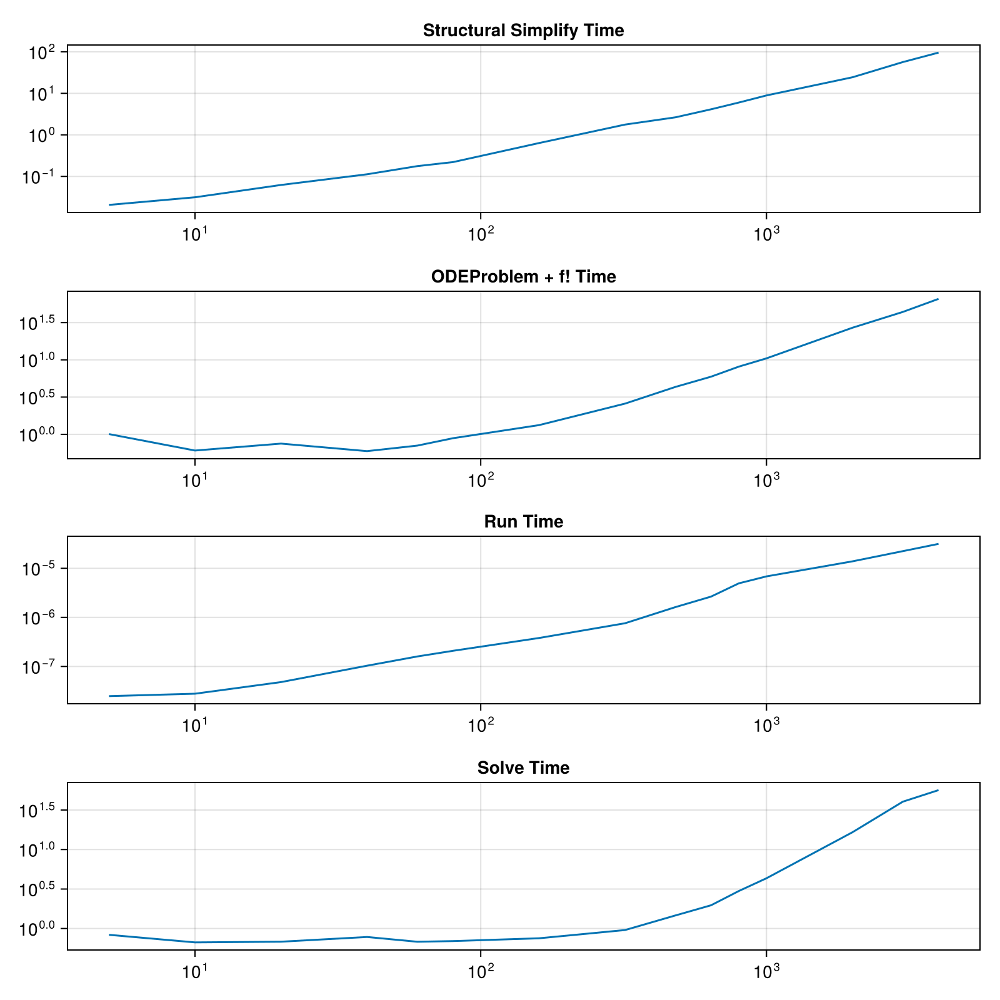
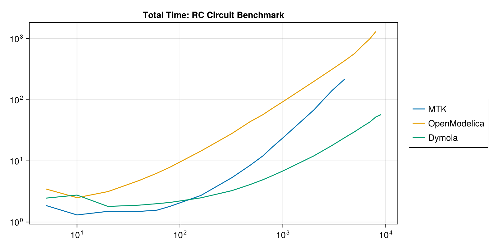

Here, we build an RC circuit model with variable numbers of components to show scaling of compile and
runtimes of MTK vs OpenModelica and Dymola.

## Setup Model Code

```julia
using ModelingToolkit, OrdinaryDiffEq, BenchmarkTools,
      ModelingToolkitStandardLibrary, OMJulia, CairoMakie
using OrdinaryDiffEqRosenbrock
using ModelingToolkitStandardLibrary.Blocks
using ModelingToolkitStandardLibrary.Electrical
```


```julia
# ModelingToolkit
const t = Blocks.t

function build_system(n)
    systems = @named begin
        sine = Sine(frequency = 10)
        source = Voltage()
        resistors[1:n] = Resistor()
        capacitors[1:n] = Capacitor()
        ground = Ground()
    end
    systems = reduce(vcat, systems)
    eqs = [connect(sine.output, source.V)
           connect(source.p, resistors[1].p)
           [connect(resistors[i].n, resistors[i + 1].p, capacitors[i].p)
            for i in 1:(n - 1)]
           connect(resistors[end].n, capacitors[end].p)
           [connect(capacitors[i].n, source.n) for i in 1:n]
           connect(source.n, ground.g)]
    @named sys = ODESystem(eqs, t; systems)
    u0 = [capacitors[i].v => float(i) for i in 1:n];
    ps = [[resistors[i].R => 1 / i for i in 1:n];
          [capacitors[i].C => 1 / i^2 for i in 1:n]]
    return sys, u0, ps
end

function compile_run_problem(sys, u0, ps; duref = nothing)
    tspan = (0.0, 10.0)
    t0 = time()
    prob = ODEProblem(sys, merge(Dict(u0), Dict(ps)), tspan; sparse = true)
    (; f, u0, p) = prob
    ff = f.f
    du = similar(u0)
    ff(du, u0, p, 0.0)
    t_fode = time() - t0
    duref === nothing || @assert duref ≈ du
    t_run = @belapsed $ff($du, $u0, $p, 0.0)
    t_solve = @elapsed sol = solve(prob, Rodas5(autodiff = AutoFiniteDiff()))
    @assert SciMLBase.successful_retcode(sol)
    (t_fode, t_run, t_solve), du
end

function run_and_time_julia!(ss_times, times, total_times, max_sizes, i, n)
    sys, u0, ps = build_system(n);
    if n <= max_sizes[1]
        ss_times[i] = @elapsed sys_mtk = mtkcompile(sys)
        times[i], _ = compile_run_problem(sys_mtk, u0, ps)
        t_fode, t_run, t_solve = times[i]
        total_times[i, 1] = ss_times[i] + t_fode + t_solve
    end
end
```

```
run_and_time_julia! (generic function with 1 method)
```


```julia
N = [5, 10, 20, 40, 60, 80, 160, 320, 480, 640, 800, 1000, 2000,
    3000, 4000, 5000, 6000, 7000, 8000, 9000, 10000, 20000];

# max size we test per method
max_sizes = [4_000, 9000];

# NaN-initialize so Makie will ignore incomplete
ss_times = fill(NaN, length(N));
times = fill((NaN, NaN, NaN), length(N));
# columns: MTK, OpenModelica, Dymola
total_times = fill(NaN, length(N), 3);
```


## Julia Timings

```julia
@time run_and_time_julia!(ss_times, times, total_times, max_sizes, 1, 4); # precompile
for (i, n) in enumerate(N)
    @time run_and_time_julia!(ss_times, times, total_times, max_sizes, i, n)
end
```

```
146.259260 seconds (159.62 M allocations: 8.331 GiB, 2.61% gc time, 99.67% 
compilation time: 41% of which was recompilation)
  2.244823 seconds (2.04 M allocations: 117.109 MiB, 82.01% compilation tim
e)
  1.705885 seconds (1.52 M allocations: 86.799 MiB, 6.59% gc time, 74.91% c
ompilation time)
  2.101985 seconds (1.83 M allocations: 102.772 MiB, 67.14% compilation tim
e: 17% of which was recompilation)
  2.638787 seconds (2.33 M allocations: 124.900 MiB, 3.74% gc time, 49.77% 
compilation time)
  3.021953 seconds (2.86 M allocations: 151.221 MiB, 42.07% compilation tim
e)
  3.179322 seconds (3.39 M allocations: 178.471 MiB, 2.30% gc time, 41.84% 
compilation time)
  3.812848 seconds (5.80 M allocations: 300.068 MiB, 2.24% gc time, 43.12% 
compilation time)
  6.714507 seconds (10.69 M allocations: 577.099 MiB, 8.30% gc time, 35.41%
 compilation time)
  9.575064 seconds (16.02 M allocations: 914.004 MiB, 6.65% gc time, 35.27%
 compilation time)
 13.817375 seconds (21.84 M allocations: 1.273 GiB, 5.91% gc time, 31.05% c
ompilation time)
 20.129964 seconds (27.85 M allocations: 1.694 GiB, 5.66% gc time, 28.65% c
ompilation time)
 27.732686 seconds (36.49 M allocations: 2.331 GiB, 4.94% gc time, 26.45% c
ompilation time)
 73.611030 seconds (85.03 M allocations: 6.640 GiB, 6.30% gc time, 23.63% c
ompilation time)
146.652901 seconds (153.51 M allocations: 13.480 GiB, 5.66% gc time, 20.24%
 compilation time)
223.844708 seconds (239.46 M allocations: 21.979 GiB, 5.96% gc time, 20.23%
 compilation time)
  0.463587 seconds (2.42 M allocations: 130.509 MiB)
  0.551857 seconds (2.90 M allocations: 162.224 MiB)
  1.010606 seconds (3.40 M allocations: 195.862 MiB, 23.80% gc time)
  1.157541 seconds (3.87 M allocations: 263.057 MiB)
  1.224175 seconds (4.38 M allocations: 230.193 MiB, 25.74% gc time)
  0.935296 seconds (4.83 M allocations: 259.967 MiB)
  2.373103 seconds (9.76 M allocations: 521.321 MiB, 17.05% gc time)
```


## OpenModelica Timings

```julia
# OMJ
omod = OMJulia.OMCSession();
OMJulia.sendExpression(omod, "getVersion()")
OMJulia.sendExpression(omod, "installPackage(Modelica)")
const modelicafile = joinpath(@__DIR__, "RC_Circuit.mo")

function time_open_modelica(n::Int)
    try
        local res
        totaltime = @elapsed res = begin
            @sync ModelicaSystem(omod, modelicafile, "RC_Circuit.Test.RC_Circuit_MTK_test_$n")
            sendExpression(omod, "simulate(RC_Circuit.Test.RC_Circuit_MTK_test_$n)")
        end
        msgs = string(get(res, "messages", ""))
        startswith(msgs, "LOG_SUCCESS") || error("omc messages: $msgs")
        return totaltime
    catch e
        @warn "OpenModelica timing failed" n exception = (e,)
        try
            OMJulia.quit(omod)
        catch
        end
        global omod = OMJulia.OMCSession()
        OMJulia.sendExpression(omod, "getVersion()")
        OMJulia.sendExpression(omod, "installPackage(Modelica)")
        return NaN
    end
end

function run_and_time_om!(total_times, max_sizes, i, n)
    if n <= max_sizes[2]
        total_times[i, 2] = time_open_modelica(n)
    end
end

for (i, n) in enumerate(N)
    @time run_and_time_om!(total_times, max_sizes, i, n)
end

OMJulia.quit(omod)
```

```
3.995983 seconds (794.62 k allocations: 40.117 MiB, 22.40% compilation ti
me)
  2.500448 seconds (4.15 k allocations: 277.500 KiB)
  3.144874 seconds (7.77 k allocations: 517.672 KiB)
  4.761399 seconds (15.35 k allocations: 1016.453 KiB)
  6.301581 seconds (20.70 k allocations: 1.325 MiB)
  7.878132 seconds (27.34 k allocations: 1.773 MiB)
 14.484362 seconds (54.91 k allocations: 3.458 MiB)
 28.026293 seconds (112.49 k allocations: 7.285 MiB)
 43.661124 seconds (165.61 k allocations: 10.412 MiB, 1.02% gc time)
 56.988123 seconds (213.26 k allocations: 13.822 MiB)
 73.112881 seconds (288.23 k allocations: 18.236 MiB)
 92.728636 seconds (332.78 k allocations: 21.866 MiB)
198.996195 seconds (686.63 k allocations: 43.192 MiB)
313.669027 seconds (1.08 M allocations: 70.840 MiB)
435.709727 seconds (1.33 M allocations: 83.225 MiB)
573.056063 seconds (1.66 M allocations: 108.456 MiB)
778.813293 seconds (1.99 M allocations: 124.820 MiB, 0.06% gc time)
990.698651 seconds (2.32 M allocations: 154.606 MiB)
1302.723597 seconds (2.74 M allocations: 172.666 MiB, 0.03% gc time)
482.070012 seconds (77.28 k allocations: 4.990 MiB, 0.03% compilation time)
  0.000001 seconds
  0.000000 seconds
```


## Dymola Timings

Dymola requires a license server and thus cannot be hosted. This was run locally for the
following times:

```julia
translation_and_total_times = [5 2.428 2.458
                               10 2.727 2.757
                               20 1.764 1.797
                               40 1.849 1.885
                               60 1.953 1.995
                               80 2.041 2.089
                               160 2.422 2.485
                               320 3.157 3.258
                               480 3.943 4.092
                               640 4.718 4.912
                               800 5.531 5.773
                               1000 6.526 6.826
                               2000 11.467 12.056
                               3000 16.8 17.831
                               4000 22.355 24.043
                               5000 27.768 30.083
                               6000 33.561 36.758
                               7000 39.197 43.154
                               8000 45.194 52.153
                               9000 50.689 57.187
                               10000 NaN NaN
                               20000 NaN NaN]

total_times[:, 3] = translation_and_total_times[:, 3]
```

```
22-element Vector{Float64}:
   2.458
   2.757
   1.797
   1.885
   1.995
   2.089
   2.485
   3.258
   4.092
   4.912
   ⋮
  17.831
  24.043
  30.083
  36.758
  43.154
  52.153
  57.187
 NaN
 NaN
```


## Results

```julia
f = Figure(size = (800, 800));
let ax = Axis(f[1, 1]; yscale = log10, xscale = log10, title = "Structural Simplify Time")
    lines!(N, ss_times)
end
for (i, timecat) in enumerate(("ODEProblem + f!", "Run", "Solve"))
    title = timecat * " Time"
    ax = Axis(f[i + 1, 1]; yscale = log10, xscale = log10, title)
    lines!(N, getindex.(times, i))
end
f
```



```julia
f2 = Figure(size = (800, 400));
title = "Total Time: RC Circuit Benchmark"
ax = Axis(f2[1, 1]; yscale = log10, xscale = log10, title)
names = ["MTK", "OpenModelica", "Dymola"]
_lines = map(enumerate(names)) do (j, label)
    ts = @view(total_times[:, j])
    lines!(N, ts)
end
Legend(f2[1, 2], _lines, names)
f2
```




## Appendix


## Appendix

These benchmarks are a part of the SciMLBenchmarks.jl repository, found at: [https://github.com/SciML/SciMLBenchmarks.jl](https://github.com/SciML/SciMLBenchmarks.jl). For more information on high-performance scientific machine learning, check out the SciML Open Source Software Organization [https://sciml.ai](https://sciml.ai).

To locally run this benchmark, do the following commands:
```
using SciMLBenchmarks
SciMLBenchmarks.weave_file("benchmarks/ModelingToolkit","RCCircuit.jmd")
```

Computer Information:

```
Julia Version 1.11.9
Commit 53a02c0720c (2026-02-06 00:27 UTC)
Build Info:
  Official https://julialang.org/ release
Platform Info:
  OS: Linux (x86_64-linux-gnu)
  CPU: 128 × AMD EPYC 7502 32-Core Processor
  WORD_SIZE: 64
  LLVM: libLLVM-16.0.6 (ORCJIT, znver2)
Threads: 128 default, 0 interactive, 64 GC (on 128 virtual cores)
Environment:
  JULIA_NUM_THREADS = auto

```

Package Information:

```
Status `/julia/github-runners/amdci1-1/_work/SciMLBenchmarks.jl/SciMLBenchmarks.jl/benchmarks/ModelingToolkit/Project.toml`
  [6e4b80f9] BenchmarkTools v1.8.0
  [336ed68f] CSV v0.10.17
  [13f3f980] CairoMakie v0.15.14
  [a93c6f00] DataFrames v1.8.2
⌃ [7ed4a6bd] LinearSolve v5.17.3
  [961ee093] ModelingToolkit v11.43.1
  [16a59e39] ModelingToolkitStandardLibrary v2.29.8
⌅ [0f4fe800] OMJulia v0.3.3
  [1dea7af3] OrdinaryDiffEq v7.8.1
  [43230ef6] OrdinaryDiffEqRosenbrock v2.7.3
  [f27b6e38] Polynomials v4.1.3
  [0bca4576] SciMLBase v3.54.0
  [31c91b34] SciMLBenchmarks v0.2.1
  [0c5d862f] Symbolics v7.39.2
  [95ff35a0] XSteam v0.3.0
  [de0858da] Printf v1.11.0
Info Packages marked with ⌃ and ⌅ have new versions available. Those with ⌃ may be upgradable, but those with ⌅ are restricted by compatibility constraints from upgrading. To see why use `status --outdated`
```

And the full manifest:

```
Status `/julia/github-runners/amdci1-1/_work/SciMLBenchmarks.jl/SciMLBenchmarks.jl/benchmarks/ModelingToolkit/Manifest.toml`
  [47edcb42] ADTypes v1.24.0
  [14f7f29c] AMD v0.5.4
  [621f4979] AbstractFFTs v1.5.0
  [6e696c72] AbstractPlutoDingetjes v1.4.1
  [1520ce14] AbstractTrees v0.4.5
  [7d9f7c33] Accessors v0.1.45
  [79e6a3ab] Adapt v4.7.0
  [35492f91] AdaptivePredicates v1.2.0
  [66dad0bd] AliasTables v1.1.3
  [27a7e980] Animations v0.4.2
  [ec485272] ArnoldiMethod v0.4.0
  [4fba245c] ArrayInterface v7.30.2
  [4c555306] ArrayLayouts v1.12.2
  [67c07d97] Automa v1.2.0
  [13072b0f] AxisAlgorithms v1.1.0
  [39de3d68] AxisArrays v0.4.8
  [aae01518] BandedMatrices v1.12.0
  [18cc8868] BaseDirs v1.4.0
  [6e4b80f9] BenchmarkTools v1.8.0
  [e2ed5e7c] Bijections v0.2.2
  [b2a6c25c] BinaryHeaps v1.1.0
  [caf10ac8] BipartiteGraphs v0.1.14
  [8e7c35d0] BlockArrays v1.10.0
  [70df07ce] BracketingNonlinearSolve v1.12.7
  [fa961155] CEnum v0.5.0
  [96374032] CRlibm v1.0.2
  [336ed68f] CSV v0.10.17
  [159f3aea] Cairo v1.1.1
  [13f3f980] CairoMakie v0.15.14
  [d360d2e6] ChainRulesCore v1.26.1
  [944b1d66] CodecZlib v0.7.9
  [6b39b394] CodecZstd v0.8.7
  [a2cac450] ColorBrewer v0.4.2
  [35d6a980] ColorSchemes v3.31.0
  [3da002f7] ColorTypes v0.12.1
  [c3611d14] ColorVectorSpace v0.11.0
  [5ae59095] Colors v0.13.1
⌅ [861a8166] Combinatorics v1.0.2
  [38540f10] CommonSolve v0.2.14
  [bbf7d656] CommonSubexpressions v0.3.1
  [f70d9fcc] CommonWorldInvalidations v1.2.2
  [34da2185] Compat v4.18.1
  [b152e2b5] CompositeTypes v0.1.4
  [a33af91c] CompositionsBase v0.1.2
  [95dc2771] ComputePipeline v0.1.8
  [2569d6c7] ConcreteStructs v0.2.8
  [187b0558] ConstructionBase v1.6.0
  [d38c429a] Contour v0.6.3
  [b7a15901] CoreMath v0.1.0
  [a8cc5b0e] Crayons v4.2.0
  [9a962f9c] DataAPI v1.16.0
  [a93c6f00] DataFrames v1.8.2
  [864edb3b] DataStructures v0.19.6
  [e2d170a0] DataValueInterfaces v1.0.0
  [927a84f5] DelaunayTriangulation v1.6.7
  [2b5f629d] DiffEqBase v7.21.1
  [459566f4] DiffEqCallbacks v4.19.4
  [163ba53b] DiffResults v1.1.0
  [b552c78f] DiffRules v1.16.0
  [a0c0ee7d] DifferentiationInterface v0.7.21
  [31c24e10] Distributions v0.25.131
  [ffbed154] DocStringExtensions v0.9.5
  [5b8099bc] DomainSets v0.8.1
  [7c1d4256] DynamicPolynomials v0.6.8
  [4e289a0a] EnumX v1.0.7
  [f151be2c] EnzymeCore v0.8.21
  [429591f6] ExactPredicates v2.2.9
  [e2ba6199] ExprTools v0.1.11
  [55351af7] ExproniconLite v0.10.14
  [b86e33f2] FFTA v0.3.1
  [7034ab61] FastBroadcast v1.4.0
  [9aa1b823] FastClosures v0.3.2
  [a4df4552] FastPower v1.5.0
  [5789e2e9] FileIO v1.20.0
  [8fc22ac5] FilePaths v0.9.0
  [48062228] FilePathsBase v0.9.24
  [1a297f60] FillArrays v1.17.0
  [64ca27bc] FindFirstFunctions v3.2.1
  [6a86dc24] FiniteDiff v2.33.0
⌅ [53c48c17] FixedPointNumbers v0.8.6
  [1fa38f19] Format v1.3.7
  [f6369f11] ForwardDiff v1.4.6
  [b38be410] FreeType v4.1.1
  [663a7486] FreeTypeAbstraction v0.10.8
  [a85aefff] FunctionMaps v0.1.2
  [069b7b12] FunctionWrappers v1.1.3
  [77dc65aa] FunctionWrappersWrappers v1.13.0
  [46192b85] GPUArraysCore v0.2.0
  [a0844989] Gamma v1.2.0
  [5c1252a2] GeometryBasics v0.5.12
  [a2bd30eb] Graphics v1.1.3
  [86223c79] Graphs v1.15.0
  [3955a311] GridLayoutBase v0.11.3
⌅ [eafb193a] Highlights v0.5.3
  [34004b35] HypergeometricFunctions v0.3.30
  [2803e5a7] ImageAxes v0.6.12
  [c817782e] ImageBase v0.1.7
  [a09fc81d] ImageCore v0.10.5
  [82e4d734] ImageIO v0.6.10
  [bc367c6b] ImageMetadata v0.9.10
  [3263718b] ImplicitDiscreteSolve v2.3.0
  [9b13fd28] IndirectArrays v1.0.0
  [d25df0c9] Inflate v0.1.5
⌅ [842dd82b] InlineStrings v1.4.6
  [18e54dd8] IntegerMathUtils v0.1.4
  [a98d9a8b] Interpolations v0.16.3
  [d1acc4aa] IntervalArithmetic v1.0.12
  [8197267c] IntervalSets v0.7.14
  [3587e190] InverseFunctions v0.1.17
  [41ab1584] InvertedIndices v1.3.1
  [92d709cd] IrrationalConstants v0.2.6
  [f1662d9f] Isoband v0.1.1
  [c8e1da08] IterTools v1.10.0
  [82899510] IteratorInterfaceExtensions v1.0.0
  [692b3bcd] JLLWrappers v1.8.0
⌅ [682c06a0] JSON v0.21.4
  [ae98c720] Jieko v0.2.1
  [b835a17e] JpegTurbo v0.1.6
⌃ [ccbc3e58] JumpProcesses v9.32.3
  [5ab0869b] KernelDensity v0.6.12
  [ba0b0d4f] Krylov v0.10.10
  [2faa5264] LHLFactorization v2.2.2
  [b964fa9f] LaTeXStrings v1.4.1
  [8cdb02fc] LazyModules v0.3.1
  [9c8b4983] LightXML v0.9.3
  [87fe0de2] LineSearch v0.1.18
⌃ [7ed4a6bd] LinearSolve v5.17.3
  [2ab3a3ac] LogExpFunctions v1.0.1
  [e6f89c97] LoggingExtras v1.2.0
  [1914dd2f] MacroTools v0.5.16
  [ee78f7c6] Makie v0.24.14
  [dbb5928d] MappedArrays v0.4.3
  [0a4f8689] MathTeXEngine v0.6.9
  [bb5d69b7] MaybeInplace v0.1.8
  [e1d29d7a] Missings v1.2.0
  [961ee093] ModelingToolkit v11.43.1
⌃ [7771a370] ModelingToolkitBase v1.71.2
  [16a59e39] ModelingToolkitStandardLibrary v2.29.8
  [6bb917b9] ModelingToolkitTearing v1.20.6
  [e94cdb99] MosaicViews v0.3.4
⌅ [2e0e35c7] Moshi v0.3.9
  [46d2c3a1] MuladdMacro v0.2.7
  [102ac46a] MultivariatePolynomials v0.5.19
  [ffc61752] Mustache v1.0.21
  [d8a4904e] MutableArithmetics v1.8.0
  [77ba4419] NaNMath v1.1.4
  [f09324ee] Netpbm v1.1.1
⌃ [8913a72c] NonlinearSolve v4.30.0
⌃ [be0214bd] NonlinearSolveBase v2.49.5
⌃ [5959db7a] NonlinearSolveFirstOrder v2.6.1
  [9a2c21bd] NonlinearSolveQuasiNewton v1.15.3
  [26075421] NonlinearSolveSpectralMethods v1.8.3
⌅ [0f4fe800] OMJulia v0.3.3
  [510215fc] Observables v0.5.5
  [6fe1bfb0] OffsetArrays v1.17.0
  [52e1d378] OpenEXR v0.3.3
  [bac558e1] OrderedCollections v2.0.1
  [1dea7af3] OrdinaryDiffEq v7.8.1
⌃ [6ad6398a] OrdinaryDiffEqBDF v2.4.9
⌃ [bbf590c4] OrdinaryDiffEqCore v4.17.2
  [50262376] OrdinaryDiffEqDefault v2.6.2
  [4302a76b] OrdinaryDiffEqDifferentiation v3.12.0
  [127b3ac7] OrdinaryDiffEqNonlinearSolve v2.9.8
  [43230ef6] OrdinaryDiffEqRosenbrock v2.7.3
  [b4bd8bb3] OrdinaryDiffEqRosenbrockTableaus v2.4.2
⌃ [2d112036] OrdinaryDiffEqSDIRK v2.9.4
  [b1df2697] OrdinaryDiffEqTsit5 v2.1.4
  [79d7bb75] OrdinaryDiffEqVerner v2.4.1
  [90014a1f] PDMats v0.11.41
  [f57f5aa1] PNGFiles v0.4.5
  [19eb6ba3] Packing v0.5.1
  [5432bcbf] PaddedViews v0.5.12
⌅ [69de0a69] Parsers v2.8.8
  [eebad327] PkgVersion v0.3.3
  [995b91a9] PlotUtils v1.4.4
  [e409e4f3] PoissonRandom v0.4.13
  [647866c9] PolygonOps v0.1.2
  [f27b6e38] Polynomials v4.1.3
  [2dfb63ee] PooledArrays v1.4.3
  [d236fae5] PreallocationTools v1.7.1
⌅ [aea7be01] PrecompileTools v1.2.1
  [21216c6a] Preferences v1.6.0
  [08abe8d2] PrettyTables v3.4.8
  [27ebfcd6] Primes v0.5.7
  [92933f4c] ProgressMeter v1.11.0
  [43287f4e] PtrArrays v1.4.0
  [0c0d3e7f] PureKLU v1.5.0
  [4b34888f] QOI v1.0.2
  [1fd47b50] QuadGK v2.11.3
  [b3c3ace0] RangeArrays v0.3.2
  [c84ed2f1] Ratios v0.4.5
  [988b38a3] ReadOnlyArrays v0.2.0
  [795d4caa] ReadOnlyDicts v1.0.1
  [3cdcf5f2] RecipesBase v1.3.4
  [731186ca] RecursiveArrayTools v4.5.1
  [189a3867] Reexport v1.2.2
  [05181044] RelocatableFolders v1.0.1
  [ae029012] Requires v1.3.1
  [9fe22ead] RespecializeParams v1.3.0
  [79098fc4] Rmath v0.9.0
  [f2b01f46] Roots v3.0.8
  [5eaf0fd0] RoundingEmulator v0.2.1
  [7e49a35a] RuntimeGeneratedFunctions v0.5.26
  [9dfe8606] SCCNonlinearSolve v1.15.3
  [fdea26ae] SIMD v3.7.2
  [0bca4576] SciMLBase v3.54.0
  [31c91b34] SciMLBenchmarks v0.2.1
  [19f34311] SciMLJacobianOperators v0.1.19
  [a6db7da4] SciMLLogging v2.1.0
⌃ [c0aeaf25] SciMLOperators v1.30.0
  [431bcebd] SciMLPublic v1.3.0
  [53ae85a6] SciMLStructures v1.10.5
  [6c6a2e73] Scratch v1.3.0
  [91c51154] SentinelArrays v1.4.10
  [efcf1570] Setfield v1.1.2
  [65257c39] ShaderAbstractions v0.5.0
  [73760f76] SignedDistanceFields v0.4.1
  [727e6d20] SimpleNonlinearSolve v2.14.5
  [699a6c99] SimpleTraits v0.9.6
  [45858cf5] Sixel v0.1.5
  [a2af1166] SortingAlgorithms v1.2.3
  [a57abbd0] SparseColumnPivotedQR v2.1.8
  [0a514795] SparseMatrixColorings v0.4.28
  [276daf66] SpecialFunctions v2.9.0
  [860ef19b] StableRNGs v1.0.4
  [cae243ae] StackViews v0.1.2
  [0c0c59c1] StarAlgebras v0.3.0
  [64909d44] StateSelection v1.11.1
  [90137ffa] StaticArrays v1.9.20
  [1e83bf80] StaticArraysCore v1.4.4
  [10745b16] Statistics v1.11.5
  [82ae8749] StatsAPI v1.8.0
  [2913bbd2] StatsBase v0.34.13
  [4c63d2b9] StatsFuns v2.2.1
  [69024149] StringEncodings v0.3.7
⌅ [892a3eda] StringManipulation v0.5.0
  [09ab397b] StructArrays v0.7.3
  [2efcf032] SymbolicIndexingInterface v0.3.55
  [19f23fe9] SymbolicLimits v1.2.1
  [d1185830] SymbolicUtils v4.46.6
  [0c5d862f] Symbolics v7.39.2
  [3783bdb8] TableTraits v1.0.1
  [bd369af6] Tables v1.14.0
  [ed4db957] TaskLocalValues v0.1.3
  [62fd8b95] TensorCore v0.1.1
  [8ea1fca8] TermInterface v2.0.0
  [731e570b] TiffImages v0.11.9
  [a759f4b9] TimerOutputs v1.2.1
  [3bb67fe8] TranscodingStreams v0.11.3
  [981d1d27] TriplotBase v0.1.0
  [781d530d] TruncatedStacktraces v1.4.0
  [3a884ed6] UnPack v1.0.2
  [1cfade01] UnicodeFun v0.4.1
  [1986cc42] Unitful v1.29.0
  [d30d5f5c] WeakCacheSets v0.1.0
  [ea10d353] WeakRefStrings v1.4.3
  [44d3d7a6] Weave v0.10.12
  [e3aaa7dc] WebP v0.1.3
  [efce3f68] WoodburyMatrices v1.1.0
  [76eceee3] WorkerUtilities v1.6.1
  [95ff35a0] XSteam v0.3.0
  [ddb6d928] YAML v0.4.16
  [c2297ded] ZMQ v1.5.1
  [6e34b625] Bzip2_jll v1.0.9+0
  [4e9b3aee] CRlibm_jll v1.0.1+0
  [83423d85] Cairo_jll v1.18.7+0
  [a38c48d9] CoreMath_jll v0.1.0+0
⌅ [5ae413db] EarCut_jll v2.2.4+0
  [2e619515] Expat_jll v2.8.4+0
⌅ [b22a6f82] FFMPEG_jll v8.1.2+0
  [a3f928ae] Fontconfig_jll v2.17.1+0
  [d7e528f0] FreeType2_jll v2.14.3+1
  [559328eb] FriBidi_jll v1.0.17+0
⌅ [b0724c58] GettextRuntime_jll v0.22.4+0
⌅ [59f7168a] Giflib_jll v5.2.3+0
  [7746bdde] Glib_jll v2.88.3+0
  [3b182d85] Graphite2_jll v1.3.16+0
  [2e76f6c2] HarfBuzz_jll v100.14004.0+0
  [905a6f67] Imath_jll v3.2.2+0
  [1d5cc7b8] IntelOpenMP_jll v2025.2.0+0
  [aacddb02] JpegTurbo_jll v3.2.0+1
  [c1c5ebd0] LAME_jll v3.100.3+0
  [88015f11] LERC_jll v4.2.0+0
  [1d63c593] LLVMOpenMP_jll v23.1.1+0
⌅ [e9f186c6] Libffi_jll v3.4.7+0
  [7e76a0d4] Libglvnd_jll v1.7.1+1
  [94ce4f54] Libiconv_jll v1.18.0+0
  [4b2f31a3] Libmount_jll v2.42.0+0
  [89763e89] Libtiff_jll v4.7.3+0
  [38a345b3] Libuuid_jll v2.42.0+0
  [856f044c] MKL_jll v2025.2.0+0
  [e7412a2a] Ogg_jll v1.3.6+0
  [6cdc7f73] OpenBLASConsistentFPCSR_jll v0.3.34+0
  [18a262bb] OpenEXR_jll v3.4.15+0
  [458c3c95] OpenSSL_jll v3.5.8+0
  [efe28fd5] OpenSpecFun_jll v0.5.6+0
  [91d4177d] Opus_jll v1.6.1+0
  [36c8627f] Pango_jll v1.58.2+0
  [30392449] Pixman_jll v0.46.4+0
  [f50d1b31] Rmath_jll v0.5.2+0
  [02c8fc9c] XML2_jll v2.15.3+0
  [ffd25f8a] XZ_jll v5.8.4+0
  [4f6342f7] Xorg_libX11_jll v1.8.13+0
  [0c0b7dd1] Xorg_libXau_jll v1.0.13+0
  [a3789734] Xorg_libXdmcp_jll v1.1.6+0
  [1082639a] Xorg_libXext_jll v1.3.8+0
  [d091e8ba] Xorg_libXfixes_jll v6.0.2+0
  [ea2f1a96] Xorg_libXrender_jll v0.9.12+0
  [a65dc6b1] Xorg_libpciaccess_jll v0.19.0+0
  [c7cfdc94] Xorg_libxcb_jll v1.17.1+0
  [c5fb5394] Xorg_xtrans_jll v1.6.0+0
  [8f1865be] ZeroMQ_jll v4.3.6+0
  [3161d3a3] Zstd_jll v1.5.7+1
  [9a68df92] isoband_jll v0.2.3+0
  [a4ae2306] libaom_jll v3.14.1+0
  [0ac62f75] libass_jll v0.17.5+0
  [8e53e030] libdrm_jll v2.4.134+0
  [f638f0a6] libfdk_aac_jll v2.0.4+0
  [b53b4c65] libpng_jll v1.6.58+0
  [075b6546] libsixel_jll v1.10.5+0
  [a9144af2] libsodium_jll v1.0.21+0
  [9a156e7d] libva_jll v2.23.0+0
  [f27f6e37] libvorbis_jll v1.3.8+0
  [c5f90fcd] libwebp_jll v1.6.0+0
  [1317d2d5] oneTBB_jll v2022.3.0+0
⌅ [1270edf5] x264_jll v10164.0.1+0
  [dfaa095f] x265_jll v4.1.0+0
  [0dad84c5] ArgTools v1.1.2
  [56f22d72] Artifacts v1.11.0
  [2a0f44e3] Base64 v1.11.0
  [8bf52ea8] CRC32c v1.11.0
  [ade2ca70] Dates v1.11.0
  [8ba89e20] Distributed v1.11.0
  [f43a241f] Downloads v1.6.0
  [7b1f6079] FileWatching v1.11.0
  [9fa8497b] Future v1.11.0
  [b77e0a4c] InteractiveUtils v1.11.0
  [4af54fe1] LazyArtifacts v1.11.0
  [b27032c2] LibCURL v0.6.4
  [76f85450] LibGit2 v1.11.0
  [8f399da3] Libdl v1.11.0
  [37e2e46d] LinearAlgebra v1.11.0
  [56ddb016] Logging v1.11.0
  [d6f4376e] Markdown v1.11.0
  [a63ad114] Mmap v1.11.0
  [ca575930] NetworkOptions v1.2.0
  [44cfe95a] Pkg v1.11.0
  [de0858da] Printf v1.11.0
  [9abbd945] Profile v1.11.0
  [3fa0cd96] REPL v1.11.0
  [9a3f8284] Random v1.11.0
  [ea8e919c] SHA v0.7.0
  [9e88b42a] Serialization v1.11.0
  [1a1011a3] SharedArrays v1.11.0
  [6462fe0b] Sockets v1.11.0
  [2f01184e] SparseArrays v1.11.0
  [f489334b] StyledStrings v1.11.0
  [4607b0f0] SuiteSparse
  [fa267f1f] TOML v1.0.3
  [a4e569a6] Tar v1.10.0
  [8dfed614] Test v1.11.0
  [cf7118a7] UUIDs v1.11.0
  [4ec0a83e] Unicode v1.11.0
  [e66e0078] CompilerSupportLibraries_jll v1.1.1+0
  [deac9b47] LibCURL_jll v8.6.0+0
  [e37daf67] LibGit2_jll v1.7.2+0
  [29816b5a] LibSSH2_jll v1.11.0+1
  [c8ffd9c3] MbedTLS_jll v2.28.6+0
  [14a3606d] MozillaCACerts_jll v2023.12.12
  [4536629a] OpenBLAS_jll v0.3.27+1
  [05823500] OpenLibm_jll v0.8.5+0
  [efcefdf7] PCRE2_jll v10.42.0+1
  [bea87d4a] SuiteSparse_jll v7.7.0+0
  [83775a58] Zlib_jll v1.2.13+1
  [8e850b90] libblastrampoline_jll v5.11.0+0
  [8e850ede] nghttp2_jll v1.59.0+0
  [3f19e933] p7zip_jll v17.4.0+2
Info Packages marked with ⌃ and ⌅ have new versions available. Those with ⌃ may be upgradable, but those with ⌅ are restricted by compatibility constraints from upgrading. To see why use `status --outdated -m`
```

