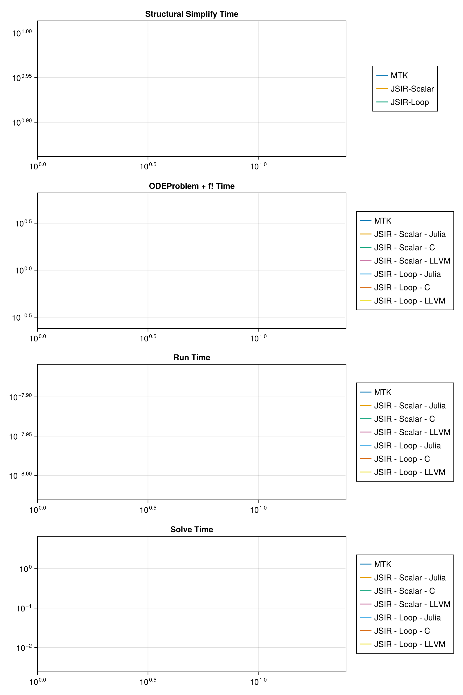

When a model is defined using repeated components, JuliaSimCompiler is able to take advantage of this
to scale efficiently by rerolling equations into loops. This option can be disabled by setting `loop=false`.
Here, we build an RC circuit model with variable numbers of components to show scaling of compile and
runtimes of MTK vs JuliaSimCompiler's three backends with and without loop rerolling.

## Setup Model Code

```julia
using JuliaSimCompiler, ModelingToolkit, OrdinaryDiffEq, BenchmarkTools, ModelingToolkitStandardLibrary, OMJulia, CairoMakie
using ModelingToolkitStandardLibrary.Blocks
using ModelingToolkitStandardLibrary.Electrical
```


```julia
# ModelingToolkit and JuliaSimCompiler
const t = Blocks.t

function build_system(n)
  systems = @named begin
    sine = Sine(frequency = 10)
    source = Voltage()
    resistors[1:n] = Resistor()
    capacitors[1:n] = Capacitor()
    ground = Ground()
  end
  systems = reduce(vcat, systems)
  eqs = [connect(sine.output, source.V)
       connect(source.p, resistors[1].p)
       [connect(resistors[i].n, resistors[i + 1].p, capacitors[i].p)
        for i in 1:(n - 1)]
       connect(resistors[end].n, capacitors[end].p)
       [connect(capacitors[i].n, source.n) for i in 1:n]
       connect(source.n, ground.g)]
  @named sys = ODESystem(eqs, t; systems)
  u0 = [capacitors[i].v => float(i) for i in 1:n];
  ps = [[resistors[i].R => 1 / i for i in 1:n];
        [capacitors[i].C => 1 / i^2 for i in 1:n]]
  return sys, u0, ps
end

function compile_run_problem(sys, u0, ps; target=JuliaSimCompiler.JuliaTarget(), duref=nothing)
  tspan = (0.0, 10.0)
  t0 = time()
  prob = if target === JuliaSimCompiler.JuliaTarget()
    ODEProblem(sys, u0, tspan, ps; sparse = true)
  else
    ODEProblem(sys, target, u0, tspan, ps; sparse = true)
  end
  (; f, u0, p) = prob
  ff = f.f
  du = similar(u0)
  ff(du, u0, p, 0.0)
  t_fode = time() - t0
  duref === nothing || @assert duref ≈ du
  t_run = @belapsed $ff($du, $u0, $p, 0.0)
  t_solve = @elapsed sol = solve(prob, Rodas5(autodiff = false))
  @assert SciMLBase.successful_retcode(sol)
  (t_fode, t_run, t_solve), du
end

const C = JuliaSimCompiler.CTarget();
const LLVM = JuliaSimCompiler.llvm.LLVMTarget();

function run_and_time_julia!(ss_times, times, max_sizes, i, n)
  sys, u0, ps = build_system(n);
  if n <= max_sizes[1]
    ss_times[i, 1] = @elapsed sys_mtk = structural_simplify(sys)
    times[i, 1], _ = compile_run_problem(sys_mtk, u0, ps)
  end
  ss_times[i, 2] = @elapsed sys_jsir_scalar = structural_simplify(IRSystem(sys), loop=false)
  ss_times[i, 3] = @elapsed sys_jsir_loop = structural_simplify(JuliaSimCompiler.compressed_connection_expansion(sys))
  oderef = daeref = nothing
  n <= max_sizes[2] && ((times[i, 2], oderef) = compile_run_problem(sys_jsir_scalar, u0, ps; duref = oderef))
  n <= max_sizes[3] && ((times[i, 3], oderef) = compile_run_problem(sys_jsir_scalar, u0, ps; target=C, duref = oderef))
  n <= max_sizes[4] && ((times[i, 4], oderef) = compile_run_problem(sys_jsir_scalar, u0, ps; target=LLVM, duref = oderef))
  n <= max_sizes[5] && ((times[i, 5], deeref) = compile_run_problem(sys_jsir_loop, u0, ps; duref = daeref))
  n <= max_sizes[6] && ((times[i, 6], daeref) = compile_run_problem(sys_jsir_loop, u0, ps; target=C, duref = daeref))
  n <= max_sizes[7] && ((times[i, 7], daeref) = compile_run_problem(sys_jsir_loop, u0, ps; target=LLVM, duref = daeref))
  for j = 1:7
    ss_time = j == 1 ? ss_times[i,1] : ss_times[i, 2 + (j >= 5)]
    t_fode, t_run, t_solve = times[i,j]
    total_times[i, j] = ss_time + t_fode + t_solve
  end
end
```

```
run_and_time_julia! (generic function with 1 method)
```


```julia
N = [5, 10, 20, 40, 60, 80, 160, 320, 480, 640, 800, 1000, 2000, 3000, 4000, 5000, 6000, 7000, 8000, 9000, 10000, 20000];

# max size we test per method
max_sizes = [4_000, 8_000, 20_000, 20_000, 20_000, 20_000, 20_000, 9000];

# NaN-initialize so Makie will ignore incomplete
ss_times = fill(NaN, length(N), 3);
times = fill((NaN,NaN,NaN), length(N), length(max_sizes) - 1);
total_times = fill(NaN, length(N), length(max_sizes));
```


## Julia Timings

```julia
@time run_and_time_julia!(ss_times, times, max_sizes, 1, 4); # precompile
for (i, n) in enumerate(N)
  @time run_and_time_julia!(ss_times, times, max_sizes, i, n)
end
```

```
95.060365 seconds (77.56 M allocations: 5.152 GiB, 29.31% gc time, 71.57% 
compilation time: 17% of which was recompilation)
 34.067946 seconds (8.05 M allocations: 573.906 MiB, 75.79% gc time, 20.22%
 compilation time)
 35.840852 seconds (8.95 M allocations: 638.196 MiB, 72.56% gc time, 21.58%
 compilation time)
 39.226433 seconds (10.22 M allocations: 739.001 MiB, 66.74% gc time, 23.78
% compilation time)
 43.565027 seconds (11.90 M allocations: 878.780 MiB, 60.74% gc time, 24.97
% compilation time)
 42.456314 seconds (13.95 M allocations: 1.022 GiB, 62.44% gc time, 19.71% 
compilation time)
 43.692318 seconds (16.43 M allocations: 1.218 GiB, 61.42% gc time, 20.23% 
compilation time)
 51.663559 seconds (27.85 M allocations: 2.110 GiB, 53.96% gc time, 21.80% 
compilation time)
 64.666327 seconds (58.94 M allocations: 4.868 GiB, 45.85% gc time, 29.77% 
compilation time)
 86.456868 seconds (102.81 M allocations: 9.292 GiB, 36.51% gc time, 34.83%
 compilation time)
115.256269 seconds (157.19 M allocations: 15.093 GiB, 28.14% gc time, 38.62
% compilation time)
147.721987 seconds (227.45 M allocations: 24.855 GiB, 24.12% gc time, 40.36
% compilation time)
196.890289 seconds (337.69 M allocations: 44.832 GiB, 19.35% gc time, 42.91
% compilation time)
574.050074 seconds (1.21 G allocations: 231.227 GiB, 11.24% gc time, 41.16%
 compilation time)
1225.027705 seconds (2.68 G allocations: 582.995 GiB, 10.66% gc time, 41.62
% compilation time)
2188.420006 seconds (4.79 G allocations: 1.370 TiB, 9.48% gc time, 39.32% c
ompilation time)
478.164751 seconds (306.34 M allocations: 51.822 GiB, 10.64% gc time, 36.14
% compilation time)
667.145908 seconds (388.36 M allocations: 69.539 GiB, 8.77% gc time, 36.69%
 compilation time)
892.120137 seconds (480.67 M allocations: 90.071 GiB, 7.52% gc time, 37.06%
 compilation time)
1141.224521 seconds (584.19 M allocations: 112.767 GiB, 6.34% gc time, 38.0
0% compilation time)
812.579032 seconds (670.41 M allocations: 131.841 GiB, 8.18% gc time, 0.59%
 compilation time)
1020.240090 seconds (784.96 M allocations: 157.064 GiB, 7.47% gc time, 0.47
% compilation time)
4697.079714 seconds (2.38 G allocations: 550.116 GiB, 9.43% gc time, 0.11% 
compilation time)
```


## OpenModelica Timings

```julia
# OMJ
const omod = OMJulia.OMCSession();
OMJulia.sendExpression(omod, "getVersion()")
OMJulia.sendExpression(omod, "installPackage(Modelica)")
const modelicafile = joinpath(@__DIR__, "RC_Circuit.mo")

function time_open_modelica(n::Int)
  totaltime = @elapsed res = begin
    @sync ModelicaSystem(omod, modelicafile, "RC_Circuit.Test.RC_Circuit_MTK_test_$n")
    sendExpression(omod, "simulate(RC_Circuit.Test.RC_Circuit_MTK_test_$n)")
  end
  @assert res["messages"][1:11] == "LOG_SUCCESS"
  return totaltime
end

function run_and_time_om!(ss_times, times, max_sizes, i, n)
  run_and_time_julia!(ss_times, times, max_sizes, i, n)
  if n <= max_sizes[end]
    total_times[i, end] = time_open_modelica(n)
  end
  @views println("n = $(n)\nstructural_simplify_times = $(ss_times[i,:])\ncomponent times = $(times[i, :])\ntotal times = $(total_times[i, :])")
end

for (i, n) in enumerate(N)
  @time run_and_time_om!(ss_times, times, max_sizes, i, n)
end

OMJulia.quit(omod)
```

```
n = 5
structural_simplify_times = [0.033981386, 0.02310792, 0.02058203]
component times = [(0.006783008575439453, 1.494889779559118e-8, 0.004071979
), (0.0008909702301025391, 1.4958917835671342e-8, 0.003950999), (0.10380101
203918457, 9.708708708708709e-9, 0.003776771), (0.008275985717773438, 9.758
758758758759e-9, 0.003607362), (0.00131988525390625, 1.5269539078156315e-8,
 0.008569614), (0.11103200912475586, 9.248248248248248e-9, 0.007982528), (0
.011085987091064453, 8.107107107107107e-9, 0.008003467)]
total times = [0.04483637357543946, 0.02794988923010254, 0.1306857030391846
, 0.034991267717773444, 0.03047152925390625, 0.13959656712475585, 0.0396714
84091064455, 3.21979717]
 42.347309 seconds (2.12 M allocations: 177.688 MiB, 87.36% gc time, 2.18% 
compilation time)
n = 10
structural_simplify_times = [0.057422783, 0.038911857, 0.029218082]
component times = [(0.009752988815307617, 2.9878391959799e-8, 0.005239519),
 (0.0013549327850341797, 2.9878391959799e-8, 0.004295087), (0.1138339042663
5742, 1.494889779559118e-8, 0.004055619), (0.009258031845092773, 1.31663326
6533066e-8, 0.003982429), (0.0014889240264892578, 3.4681772406847937e-8, 0.
011279342), (0.11723589897155762, 1.198098098098098e-8, 0.010578988), (0.01
3159990310668945, 1.198098098098098e-8, 0.01033385)]
total times = [0.07241529081530762, 0.044561876785034184, 0.156801380266357
43, 0.05215231784509278, 0.041986348026489255, 0.15703296897155763, 0.05271
192231066894, 2.182626895]
 40.687446 seconds (1.71 M allocations: 154.413 MiB, 89.08% gc time, 0.38% 
compilation time)
n = 20
structural_simplify_times = [0.139670103, 0.071317175, 0.046861776]
component times = [(0.017641067504882812, 5.972403258655804e-8, 0.006682497
), (0.002317190170288086, 7.226002055498458e-8, 0.005922893), (0.1120231151
5808105, 2.3904618473895583e-8, 0.00511391), (0.012360811233520508, 1.78446
89378757514e-8, 0.005596776), (0.0018188953399658203, 5.976476578411406e-8,
 0.018757914), (0.11292290687561035, 2.6281407035175878e-8, 0.016175734), (
0.015657901763916016, 2.621105527638191e-8, 0.016512892)]
total times = [0.1639936675048828, 0.07955725817028808, 0.18845420015808106
, 0.0892747622335205, 0.06743858533996583, 0.17596041687561034, 0.079032569
76391601, 2.783421487]
 43.166292 seconds (2.41 M allocations: 219.954 MiB, 84.53% gc time, 0.35% 
compilation time)
n = 40
structural_simplify_times = [0.269374843, 0.138668011, 0.081837073]
component times = [(0.033735036849975586, 1.1943784378437845e-7, 0.01215796
5), (0.0045490264892578125, 1.492931873479319e-7, 0.007154914), (0.12576198
57788086, 3.8829637096774194e-8, 0.006763558), (0.018291950225830078, 3.212
1730382293764e-8, 0.007007175), (0.0025119781494140625, 1.0694098712446352e
-7, 0.035672902), (0.1134030818939209, 4.077699293642785e-8, 0.028691946), 
(0.018354177474975586, 4.614271255060729e-8, 0.028933205)]
total times = [0.31526784484997555, 0.15037195148925783, 0.2711935547788086
3, 0.1639671362258301, 0.12002195314941405, 0.22393210089392088, 0.12912445
547497559, 3.633088578]
 46.313295 seconds (3.92 M allocations: 356.028 MiB, 78.25% gc time, 0.32% 
compilation time)
n = 60
structural_simplify_times = [0.424783903, 0.206617111, 0.118076321]
component times = [(0.04959702491760254, 1.8214452554744525e-7, 0.019114611
), (0.006783962249755859, 2.292945054945055e-7, 0.009472386), (0.1442639827
7282715, 5.375532994923858e-8, 0.008777471), (0.025300025939941406, 4.66016
17795753284e-8, 0.008900871), (0.0030770301818847656, 1.585719696969697e-7,
 0.052170494), (0.11850905418395996, 6.124387755102042e-8, 0.037831015), (0
.020692110061645508, 6.479979570990806e-8, 0.037349469)]
total times = [0.49349553891760256, 0.22287345924975585, 0.3596585647728271
5, 0.2408180079399414, 0.17332384518188476, 0.27441639018395997, 0.17611790
00616455, 4.911054312]
 49.017502 seconds (5.60 M allocations: 508.304 MiB, 74.07% gc time, 0.31% 
compilation time)
n = 80
structural_simplify_times = [0.614942272, 0.27734528, 0.157855621]
component times = [(0.06767797470092773, 2.4670725388601034e-7, 0.03089117)
, (0.009732961654663086, 3.069595141700405e-7, 0.01416167), (0.163599967956
54297, 6.867725409836065e-8, 0.011889507), (0.03313899040222168, 6.13751274
2099898e-8, 0.011768338), (0.0039060115814208984, 2.028188034188034e-7, 0.0
57304074), (0.11437082290649414, 8.18538860103627e-8, 0.050866464), (0.0190
5202865600586, 7.960599793174768e-8, 0.051238691)]
total times = [0.7135114167009277, 0.30123991165466313, 0.452834754956543, 
0.3222526084022217, 0.2190657065814209, 0.32309290790649414, 0.228146340656
00586, 5.845899975]
 50.643142 seconds (7.50 M allocations: 680.032 MiB, 72.09% gc time, 0.30% 
compilation time)
n = 160
structural_simplify_times = [1.669808116, 0.584487598, 0.354976106]
component times = [(0.1398458480834961, 5.80767955801105e-7, 0.085661622), 
(0.021522045135498047, 6.171618497109827e-7, 0.020482801), (0.2953460216522
217, 1.2838851351351352e-7, 0.01924388), (0.06477499008178711, 1.2092707182
32044e-7, 0.020166793), (0.0064928531646728516, 4.05845e-7, 0.162307146), (
0.1280829906463623, 1.4814234016887817e-7, 0.147307333), (0.033468961715698
24, 1.6490666666666667e-7, 0.146338109)]
total times = [1.895315586083496, 0.6264924441354981, 0.8990774996522217, 0
.6694293810817872, 0.5237761051646729, 0.6303664296463624, 0.53478317671569
83, 10.598486605]
 60.381242 seconds (16.57 M allocations: 1.447 GiB, 61.05% gc time, 0.25% c
ompilation time)
n = 320
structural_simplify_times = [5.282423512, 1.292588281, 0.678365755]
component times = [(0.2915670871734619, 1.2669e-6, 0.232844167), (0.0578269
95849609375, 1.2439e-6, 0.03844887), (0.4976370334625244, 3.702864077669903
e-7, 0.03216337), (0.13651299476623535, 2.468435207823961e-7, 0.032262809),
 (0.011306047439575195, 7.95041237113402e-7, 0.329729812), (0.1401879787445
0684, 2.794103448275862e-7, 0.310024484), (0.03231096267700195, 2.942386363
636364e-7, 0.310474521)]
total times = [5.806834766173462, 1.3888641468496095, 1.8223886844625243, 1
.4613640847662355, 1.0194016144395752, 1.1285782177445067, 1.02115123867700
19, 21.33876508]
 75.091643 seconds (43.15 M allocations: 3.993 GiB, 49.74% gc time, 0.20% c
ompilation time)
n = 480
structural_simplify_times = [11.101114201, 2.109274013, 1.036267725]
component times = [(0.44783496856689453, 2.0276666666666667e-6, 0.594032052
), (0.1135869026184082, 1.868e-6, 0.070588159), (0.7518398761749268, 6.9310
13513513514e-7, 0.060438669), (0.21352505683898926, 3.599043062200957e-7, 0
.059182612), (0.017043113708496094, 1.197e-6, 0.420707365), (0.157953023910
52246, 4.196934673366834e-7, 0.385001951), (0.038710832595825195, 4.3847979
7979798e-7, 0.385783115)]
total times = [12.142981221566894, 2.293449074618408, 2.9215525581749264, 2
.381981681838989, 1.4740182037084961, 1.5792226999105226, 1.460761672595825
2, 34.629143146]
 98.114210 seconds (82.22 M allocations: 8.192 GiB, 39.01% gc time, 0.16% c
ompilation time)
n = 640
structural_simplify_times = [19.359268858, 2.991614593, 1.541657987]
component times = [(0.5791299343109131, 2.661e-6, 0.966915426), (0.19509601
593017578, 2.4933333333333333e-6, 0.075387776), (1.0374150276184082, 1.105e
-6, 0.063831136), (0.3025028705596924, 4.849179487179487e-7, 0.062359867), 
(0.02333998680114746, 1.6299e-6, 1.244681844), (0.17233896255493164, 6.2573
37278106508e-7, 1.227606986), (0.04414510726928711, 6.169884393063583e-7, 1
.203463322)]
total times = [20.905314218310913, 3.2620983849301757, 4.092860756618408, 3
.3564773305596924, 2.8096798178011477, 2.941603935554932, 2.789266416269287
, 48.617584213]
127.005846 seconds (133.22 M allocations: 13.831 GiB, 31.07% gc time, 0.12%
 compilation time)
n = 800
structural_simplify_times = [30.447668641, 4.024442346, 1.981982087]
component times = [(0.7527458667755127, 3.54125e-6, 1.509378738), (0.281142
9500579834, 3.154875e-6, 0.082553828), (1.395035982131958, 1.56090000000000
02e-6, 0.077407969), (0.3784501552581787, 5.987022471910112e-7, 0.086522848
), (0.02772212028503418, 2.068888888888889e-6, 1.204924875), (0.19809389114
379883, 8.134767441860465e-7, 1.16424651), (0.04885292053222656, 7.91606060
6060606e-7, 1.13725896)]
total times = [32.709793245775515, 4.388139124057983, 5.496886297131958, 4.
489415349258179, 3.2146290822850343, 3.3443224881437987, 3.1680939675322266
, 60.443555436]
154.552537 seconds (198.93 M allocations: 23.396 GiB, 26.61% gc time, 0.10%
 compilation time)
n = 1000
structural_simplify_times = [48.863202795, 5.290044567, 2.550387364]
component times = [(1.0274229049682617, 4.741285714285715e-6, 2.179279622),
 (0.43495607376098633, 4.021285714285714e-6, 0.132107923), (1.9038259983062
744, 2.021111111111111e-6, 0.115981808), (0.49754786491394043, 7.5099166666
66666e-7, 0.112945892), (0.034693002700805664, 2.5876666666666664e-6, 1.546
746018), (0.23567700386047363, 9.99e-7, 1.462648782), (0.05429410934448242,
 9.833333333333334e-7, 1.436319167)]
total times = [52.069905321968264, 5.8571085637609865, 7.309852373306274, 5
.90053832391394, 4.131826384700806, 4.248713149860474, 4.041000640344483, 7
6.500739115]
194.914693 seconds (300.93 M allocations: 42.986 GiB, 21.95% gc time, 0.08%
 compilation time)
n = 2000
structural_simplify_times = [221.025125368, 15.346487861, 6.404196214]
component times = [(3.573401927947998, 9.5e-6, 7.642603622), (1.59603905677
7954, 8.603333333333335e-6, 0.239089567), (5.927300930023193, 4.6e-6, 0.215
70178), (1.20278000831604, 1.5109e-6, 0.191021141), (0.07593202590942383, 5
.145e-6, 3.409717714), (0.3573329448699951, 2.015555555555556e-6, 3.5622269
46), (0.09829115867614746, 2.006666666666667e-6, 3.462238293)]
total times = [232.241130917948, 17.181616484777955, 21.489490571023193, 16
.74028901031604, 9.889845953909424, 10.323756104869995, 9.964725665676147, 
165.614917471]
502.045916 seconds (1.14 G allocations: 228.186 GiB, 13.09% gc time, 0.03% 
compilation time)
n = 3000
structural_simplify_times = [532.683551648, 27.485157631, 11.169579168]
component times = [(6.5608439445495605, 1.534e-5, 19.000910495), (3.5233170
986175537, 1.332e-5, 0.37833182), (12.473193883895874, 7.13e-6, 0.340015559
), (2.10502290725708, 2.339888888888889e-6, 0.335554994), (0.10830593109130
86, 7.74e-6, 7.038402713), (0.5682981014251709, 3.0125e-6, 7.167054916), (0
.13175487518310547, 3.055e-6, 7.080463409)]
total times = [558.2453060875496, 31.386806549617553, 40.298367073895875, 2
9.92573553225708, 18.31628781209131, 18.90493218542517, 18.381797452183108,
 264.805815615]
973.835534 seconds (2.59 G allocations: 578.526 GiB, 9.48% gc time, 0.02% c
ompilation time)
n = 4000
structural_simplify_times = [1141.532344323, 43.495822851, 17.463902844]
component times = [(8.691088914871216, 2.1049e-5, 30.686265275), (5.6627590
65628052, 1.797e-5, 0.477115347), (23.280557870864868, 9.49e-6, 0.432926589
), (3.2567288875579834, 3.003625e-6, 0.440089371), (0.14641404151916504, 1.
037e-5, 14.224420861), (0.8042140007019043, 4.054285714285714e-6, 15.406244
825), (0.202437162399292, 4.1671428571428566e-6, 15.82855452)]
total times = [1180.9096985128713, 49.63569726362805, 67.20930731086487, 47
.19264110955798, 31.834737746519167, 33.6743616697019, 33.49489452639929, 3
69.673304099]
1770.507574 seconds (4.66 G allocations: 1.364 TiB, 12.51% gc time, 0.01% c
ompilation time)
n = 5000
structural_simplify_times = [NaN, 61.912915944, 26.500846759]
component times = [(NaN, NaN, NaN), (8.7880220413208, 2.375e-5, 0.546165651
), (39.76599383354187, 1.2269e-5, 0.478385559), (4.700058221817017, 3.75e-6
, 0.448681644), (0.18330001831054688, 1.3129e-5, 29.584489914), (0.85990309
715271, 5.136666666666667e-6, 30.736650508), (0.25026583671569824, 5.138333
333333333e-6, 32.05843833)]
total times = [NaN, 71.24710363632079, 102.15729533654186, 67.0616558098170
1, 56.26863669131055, 58.09740036415271, 58.8095509257157, 524.21961732]
832.739474 seconds (294.49 M allocations: 51.163 GiB, 6.64% gc time, 0.02% 
compilation time)
n = 6000
structural_simplify_times = [NaN, 84.283625039, 34.602120192]
component times = [(NaN, NaN, NaN), (12.47948694229126, 2.753e-5, 0.6373699
25), (66.93686103820801, 1.53e-5, 0.551393797), (6.567423105239868, 4.50285
71428571434e-6, 0.527551518), (0.2154998779296875, 1.571e-5, 45.575738059),
 (0.9927558898925781, 6.3258000000000005e-6, 46.235440869), (0.300415039062
5, 6.456e-6, 47.724724693)]
total times = [NaN, 97.40048190629126, 151.77187987420803, 91.3785996622398
6, 80.39335812892969, 81.83031695089258, 82.6272599240625, 709.690143288]
1135.016983 seconds (375.39 M allocations: 68.828 GiB, 5.65% gc time, 0.01%
 compilation time)
n = 7000
structural_simplify_times = [NaN, 111.799071199, 51.418812394]
component times = [(NaN, NaN, NaN), (19.023529052734375, 3.225e-5, 0.799892
103), (107.98412418365479, 1.755e-5, 0.726035852), (9.29972505569458, 5.246
666666666667e-6, 0.751041902), (0.2598299980163574, 1.834e-5, 59.528222065)
, (1.0888619422912598, 7.3675e-6, 62.107857077), (0.2705960273742676, 7.39e
-6, 60.831327375)]
total times = [NaN, 131.62249235473436, 220.50923123465478, 121.84983815669
457, 111.20686445701637, 114.61553141329125, 112.52073579637427, 984.898208
449]
1553.118518 seconds (466.66 M allocations: 89.322 GiB, 5.40% gc time, 0.01%
 compilation time)
n = 8000
structural_simplify_times = [NaN, 143.256798398, 78.710770915]
component times = [(NaN, NaN, NaN), (26.334485054016113, 3.948e-5, 0.955326
011), (164.8936059474945, 2.019e-5, 0.864694953), (12.81539797782898, 6.007
8e-6, 0.806872734), (0.37008118629455566, 2.1009e-5, 67.012533441), (1.2679
920196533203, 8.483333333333334e-6, 71.266065058), (0.33418703079223633, 8.
356666666666666e-6, 76.398424837)]
total times = [NaN, 170.54660946301613, 309.01509929849453, 156.87906910982
898, 146.09338554229456, 151.2448279926533, 155.44338278279224, 1219.317590
136]
1954.432368 seconds (568.98 M allocations: 111.955 GiB, 5.76% gc time, 0.01
% compilation time)
n = 9000
structural_simplify_times = [NaN, 181.435447308, 132.474405985]
component times = [(NaN, NaN, NaN), (NaN, NaN, NaN), (234.0702769756317, 2.
4009e-5, 0.889693657), (16.160140991210938, 6.774e-6, 1.070875489), (0.3708
51993560791, 2.363e-5, 80.036668976), (1.4198670387268066, 9.88e-6, 81.0187
01228), (0.38471198081970215, 9.67e-6, 80.954473196)]
total times = [NaN, NaN, 416.3954179406317, 198.66646378821093, 212.8819269
545608, 214.9129742517268, 213.81359116181972, 1540.61913613]
2431.298175 seconds (669.08 M allocations: 131.743 GiB, 6.35% gc time, 0.00
% compilation time)
n = 10000
structural_simplify_times = [NaN, 239.646586513, 162.779812406]
component times = [(NaN, NaN, NaN), (NaN, NaN, NaN), (310.49526810646057, 2
.598e-5, 1.397213955), (22.367241144180298, 7.83475e-6, 1.42640671), (2.134
7239017486572, 2.642e-5, 87.43908718), (1.5311260223388672, 1.778e-5, 91.92
9685284), (0.4064350128173828, 1.09e-5, 92.149186395)]
total times = [NaN, NaN, 551.5390685744605, 263.44023436718027, 252.3536234
8774865, 256.24062371233885, 255.33543381381736, NaN]
1099.059683 seconds (780.66 M allocations: 156.771 GiB, 19.47% gc time, 0.0
1% compilation time)
n = 20000
structural_simplify_times = [NaN, 1538.397234518, 971.591408402]
component times = [(NaN, NaN, NaN), (NaN, NaN, NaN), (1615.6314418315887, 5
.495e-5, 8.862258218), (319.22835397720337, 2.2449e-5, 5.794852361), (2.920
3879833221436, 5.3509e-5, 250.873855853), (6.23363184928894, 2.252e-5, 260.
414485992), (3.0547780990600586, 2.231e-5, 242.272883297)]
total times = [NaN, NaN, 3162.890934567589, 1863.4204408562034, 1225.385652
238322, 1238.2395262432888, 1216.91906979806, NaN]
5329.637855 seconds (2.38 G allocations: 549.829 GiB, 17.71% gc time, 0.00%
 compilation time)
```


## Dymola Timings

Dymola requires a license server and thus cannot be hosted. This was run locally for the
following times:

```julia
translation_and_total_times = [
  5 2.428 2.458
  10 2.727 2.757
  20 1.764 1.797
  40 1.849 1.885
  60 1.953 1.995
  80 2.041 2.089
  160 2.422 2.485
  320 3.157 3.258
  480 3.943 4.092
  640 4.718 4.912
  800 5.531 5.773
  1000 6.526 6.826
  2000 11.467 12.056
  3000 16.8 17.831
  4000 22.355 24.043
  5000 27.768 30.083
  6000 33.561 36.758
  7000 39.197 43.154
  8000 45.194 52.153
  9000 50.689 57.187
  10000 NaN NaN
  20000 NaN NaN
]

total_times[:, 9] = translation_and_total_times[:,3]
```

```
Error: BoundsError: attempt to access 22×8 Matrix{Float64} at index [1:22, 
9]
```


## Results

```julia
f = Figure(size=(800,1200));
ss_names = ["MTK", "JSIR-Scalar", "JSIR-Loop"];
let ax = Axis(f[1, 1]; yscale = log10, xscale = log10, title="Structural Simplify Time")
  _lines = map(eachcol(ss_times)) do ts
    lines!(N, ts)
  end
  Legend(f[1,2], _lines, ss_names)
end
method_names = ["MTK", "JSIR - Scalar - Julia", "JSIR - Scalar - C", "JSIR - Scalar - LLVM", "JSIR - Loop - Julia", "JSIR - Loop - C", "JSIR - Loop - LLVM"];
for (i, timecat) in enumerate(("ODEProblem + f!", "Run", "Solve"))
  title = timecat * " Time"
  ax = Axis(f[i+1, 1]; yscale = log10, xscale = log10, title)
  _lines = map(eachcol(times)) do ts
    lines!(N, getindex.(ts, i))
  end
  Legend(f[i+1, 2], _lines, method_names)
end
let method_names_m = vcat(method_names, "OpenModelica");
  ax = Axis(f[5, 1]; yscale = log10, xscale = log10, title = "Total Time")
  _lines = map(Base.Fix1(lines!, N), eachcol(total_times))
  Legend(f[5, 2], _lines, method_names_m)
end
f
```



```julia
f2 = Figure(size = (800, 400));
title = "Total Time: RC Circuit Benchmark"
ax = Axis(f2[1, 1]; yscale = log10, xscale = log10, title)
names = ["MTK", "JSIR - Scalar - Julia", "JSIR - Scalar - C", "JSIR - Scalar - LLVM", "JSIR - Loop - Julia", "JSIR - Loop - C", "JSIR - Loop - LLVM", "OpenModelica", "Dymola"]
_lines = map(enumerate(names)) do (j, label)
    ts = @view(total_times[:, j])
    lines!(N_states, ts)
end
Legend(f2[1,2], _lines, names)
f2
```

```
Error: UndefVarError: `N_states` not defined
```


All three backends compiled more quickly with loops, but the C and LLVM backends are so much quicker to compile than the Julia backend that this made much less difference for them.
The impact on runtime was more varied.

## Appendix


## Appendix

These benchmarks are a part of the SciMLBenchmarks.jl repository, found at: [https://github.com/SciML/SciMLBenchmarks.jl](https://github.com/SciML/SciMLBenchmarks.jl). For more information on high-performance scientific machine learning, check out the SciML Open Source Software Organization [https://sciml.ai](https://sciml.ai).

To locally run this benchmark, do the following commands:

```
using SciMLBenchmarks
SciMLBenchmarks.weave_file("benchmarks/ModelingToolkit","RCCircuit.jmd")
```

Computer Information:

```
Julia Version 1.10.4
Commit 48d4fd48430 (2024-06-04 10:41 UTC)
Build Info:
  Official https://julialang.org/ release
Platform Info:
  OS: Linux (x86_64-linux-gnu)
  CPU: 128 × AMD EPYC 7502 32-Core Processor
  WORD_SIZE: 64
  LIBM: libopenlibm
  LLVM: libLLVM-15.0.7 (ORCJIT, znver2)
Threads: 1 default, 0 interactive, 1 GC (on 128 virtual cores)
Environment:
  JULIA_CPU_THREADS = 128
  JULIA_DEPOT_PATH = /cache/julia-buildkite-plugin/depots/5b300254-1738-4989-ae0a-f4d2d937f953
  JULIA_PKG_SERVER = juliahub.com

```

Package Information:

```
Status `/cache/build/exclusive-amdci1-0/julialang/scimlbenchmarks-dot-jl/benchmarks/ModelingToolkit/Project.toml`
  [6e4b80f9] BenchmarkTools v1.5.0
  [336ed68f] CSV v0.10.14
⌅ [13f3f980] CairoMakie v0.11.11
  [a93c6f00] DataFrames v1.6.1
  [8391cb6b] JuliaSimCompiler v0.1.12
  [9cbdfd5a] JuliaSimCompilerRuntime v1.0.2
  [7ed4a6bd] LinearSolve v2.30.1
  [961ee093] ModelingToolkit v9.19.0
  [16a59e39] ModelingToolkitStandardLibrary v2.7.2
  [0f4fe800] OMJulia v0.3.2
  [1dea7af3] OrdinaryDiffEq v6.84.0
  [f27b6e38] Polynomials v4.0.11
  [ba661fbb] PreferenceTools v0.1.2
  [31c91b34] SciMLBenchmarks v0.1.3
  [0c5d862f] Symbolics v5.30.3
Info Packages marked with ⌅ have new versions available but compatibility constraints restrict them from upgrading. To see why use `status --outdated`
```

And the full manifest:

```
Status `/cache/build/exclusive-amdci1-0/julialang/scimlbenchmarks-dot-jl/benchmarks/ModelingToolkit/Manifest.toml`
  [47edcb42] ADTypes v1.4.0
  [621f4979] AbstractFFTs v1.5.0
  [1520ce14] AbstractTrees v0.4.5
  [7d9f7c33] Accessors v0.1.36
  [79e6a3ab] Adapt v4.0.4
  [66dad0bd] AliasTables v1.1.3
  [27a7e980] Animations v0.4.1
  [ec485272] ArnoldiMethod v0.4.0
  [4fba245c] ArrayInterface v7.11.0
  [4c555306] ArrayLayouts v1.9.4
  [67c07d97] Automa v1.0.3
  [13072b0f] AxisAlgorithms v1.1.0
  [39de3d68] AxisArrays v0.4.7
  [6e4b80f9] BenchmarkTools v1.5.0
  [e2ed5e7c] Bijections v0.1.6
  [62783981] BitTwiddlingConvenienceFunctions v0.1.5
  [fa961155] CEnum v0.5.0
  [2a0fbf3d] CPUSummary v0.2.5
  [00ebfdb7] CSTParser v3.4.3
  [336ed68f] CSV v0.10.14
  [159f3aea] Cairo v1.0.5
⌅ [13f3f980] CairoMakie v0.11.11
  [49dc2e85] Calculus v0.5.1
  [082447d4] ChainRules v1.69.0
  [d360d2e6] ChainRulesCore v1.24.0
  [fb6a15b2] CloseOpenIntervals v0.1.12
  [944b1d66] CodecZlib v0.7.4
  [a2cac450] ColorBrewer v0.4.0
  [35d6a980] ColorSchemes v3.25.0
  [3da002f7] ColorTypes v0.11.5
  [c3611d14] ColorVectorSpace v0.10.0
  [5ae59095] Colors v0.12.11
  [861a8166] Combinatorics v1.0.2
  [a80b9123] CommonMark v0.8.12
  [38540f10] CommonSolve v0.2.4
  [bbf7d656] CommonSubexpressions v0.3.0
  [34da2185] Compat v4.15.0
  [b152e2b5] CompositeTypes v0.1.4
  [a33af91c] CompositionsBase v0.1.2
  [2569d6c7] ConcreteStructs v0.2.3
  [8f4d0f93] Conda v1.10.0
  [187b0558] ConstructionBase v1.5.5
  [d38c429a] Contour v0.6.3
  [adafc99b] CpuId v0.3.1
  [a8cc5b0e] Crayons v4.1.1
  [9a962f9c] DataAPI v1.16.0
  [a93c6f00] DataFrames v1.6.1
  [864edb3b] DataStructures v0.18.20
  [e2d170a0] DataValueInterfaces v1.0.0
  [927a84f5] DelaunayTriangulation v1.0.3
  [2b5f629d] DiffEqBase v6.151.4
  [459566f4] DiffEqCallbacks v3.6.2
  [163ba53b] DiffResults v1.1.0
  [b552c78f] DiffRules v1.15.1
  [a0c0ee7d] DifferentiationInterface v0.5.5
  [31c24e10] Distributions v0.25.109
  [ffbed154] DocStringExtensions v0.9.3
  [5b8099bc] DomainSets v0.7.14
  [fa6b7ba4] DualNumbers v0.6.8
⌅ [7c1d4256] DynamicPolynomials v0.5.7
⌅ [06fc5a27] DynamicQuantities v0.13.2
  [4e289a0a] EnumX v1.0.4
  [f151be2c] EnzymeCore v0.7.5
  [429591f6] ExactPredicates v2.2.8
  [d4d017d3] ExponentialUtilities v1.26.1
  [e2ba6199] ExprTools v0.1.10
⌅ [6b7a57c9] Expronicon v0.8.5
  [411431e0] Extents v0.1.3
  [7a1cc6ca] FFTW v1.8.0
  [7034ab61] FastBroadcast v0.3.3
  [9aa1b823] FastClosures v0.3.2
  [29a986be] FastLapackInterface v2.0.4
  [5789e2e9] FileIO v1.16.3
  [8fc22ac5] FilePaths v0.8.3
  [48062228] FilePathsBase v0.9.21
  [1a297f60] FillArrays v1.11.0
  [64ca27bc] FindFirstFunctions v1.2.0
  [6a86dc24] FiniteDiff v2.23.1
  [53c48c17] FixedPointNumbers v0.8.5
  [1fa38f19] Format v1.3.7
  [f6369f11] ForwardDiff v0.10.36
  [b38be410] FreeType v4.1.1
  [663a7486] FreeTypeAbstraction v0.10.3
  [069b7b12] FunctionWrappers v1.1.3
  [77dc65aa] FunctionWrappersWrappers v0.1.3
  [d9f16b24] Functors v0.4.11
  [46192b85] GPUArraysCore v0.1.6
  [61eb1bfa] GPUCompiler v0.26.5
  [c145ed77] GenericSchur v0.5.4
  [cf35fbd7] GeoInterface v1.3.4
  [5c1252a2] GeometryBasics v0.4.11
  [d7ba0133] Git v1.3.1
  [c27321d9] Glob v1.3.1
  [a2bd30eb] Graphics v1.1.2
  [86223c79] Graphs v1.11.1
⌅ [3955a311] GridLayoutBase v0.10.2
  [42e2da0e] Grisu v1.0.2
  [eafb193a] Highlights v0.5.3
  [3e5b6fbb] HostCPUFeatures v0.1.16
  [34004b35] HypergeometricFunctions v0.3.23
  [7073ff75] IJulia v1.24.2
  [615f187c] IfElse v0.1.1
  [2803e5a7] ImageAxes v0.6.11
  [c817782e] ImageBase v0.1.7
  [a09fc81d] ImageCore v0.10.2
  [82e4d734] ImageIO v0.6.8
  [bc367c6b] ImageMetadata v0.9.9
  [9b13fd28] IndirectArrays v1.0.0
  [d25df0c9] Inflate v0.1.5
  [842dd82b] InlineStrings v1.4.1
  [a98d9a8b] Interpolations v0.15.1
  [d1acc4aa] IntervalArithmetic v0.22.14
  [8197267c] IntervalSets v0.7.10
  [3587e190] InverseFunctions v0.1.14
  [41ab1584] InvertedIndices v1.3.0
  [92d709cd] IrrationalConstants v0.2.2
  [f1662d9f] Isoband v0.1.1
  [c8e1da08] IterTools v1.10.0
  [82899510] IteratorInterfaceExtensions v1.0.0
  [692b3bcd] JLLWrappers v1.5.0
  [682c06a0] JSON v0.21.4
  [b835a17e] JpegTurbo v0.1.5
  [98e50ef6] JuliaFormatter v1.0.56
  [9c9cc66b] JuliaSimBase v0.1.0
  [8391cb6b] JuliaSimCompiler v0.1.12
  [9cbdfd5a] JuliaSimCompilerRuntime v1.0.2
  [ccbc3e58] JumpProcesses v9.11.1
  [ef3ab10e] KLU v0.6.0
  [5ab0869b] KernelDensity v0.6.9
  [ba0b0d4f] Krylov v0.9.6
  [929cbde3] LLVM v7.2.1
  [b964fa9f] LaTeXStrings v1.3.1
  [2ee39098] LabelledArrays v1.16.0
  [984bce1d] LambertW v0.4.6
  [23fbe1c1] Latexify v0.16.3
  [10f19ff3] LayoutPointers v0.1.15
  [5078a376] LazyArrays v2.0.4
  [8cdb02fc] LazyModules v0.3.1
  [9c8b4983] LightXML v0.9.1
  [d3d80556] LineSearches v7.2.0
  [7ed4a6bd] LinearSolve v2.30.1
  [2ab3a3ac] LogExpFunctions v0.3.28
  [bdcacae8] LoopVectorization v0.12.170
  [d8e11817] MLStyle v0.4.17
  [1914dd2f] MacroTools v0.5.13
⌅ [ee78f7c6] Makie v0.20.10
⌅ [20f20a25] MakieCore v0.7.3
  [d125e4d3] ManualMemory v0.1.8
  [dbb5928d] MappedArrays v0.4.2
⌅ [0a4f8689] MathTeXEngine v0.5.7
  [bb5d69b7] MaybeInplace v0.1.3
  [739be429] MbedTLS v1.1.9
  [e1d29d7a] Missings v1.2.0
  [961ee093] ModelingToolkit v9.19.0
  [16a59e39] ModelingToolkitStandardLibrary v2.7.2
  [e94cdb99] MosaicViews v0.3.4
  [46d2c3a1] MuladdMacro v0.2.4
  [102ac46a] MultivariatePolynomials v0.5.6
  [ffc61752] Mustache v1.0.19
  [d8a4904e] MutableArithmetics v1.4.5
  [d41bc354] NLSolversBase v7.8.3
  [77ba4419] NaNMath v1.0.2
  [f09324ee] Netpbm v1.1.1
  [8913a72c] NonlinearSolve v3.13.0
  [0f4fe800] OMJulia v0.3.2
  [510215fc] Observables v0.5.5
  [6fe1bfb0] OffsetArrays v1.14.0
  [52e1d378] OpenEXR v0.3.2
  [bac558e1] OrderedCollections v1.6.3
  [1dea7af3] OrdinaryDiffEq v6.84.0
  [90014a1f] PDMats v0.11.31
  [f57f5aa1] PNGFiles v0.4.3
  [65ce6f38] PackageExtensionCompat v1.0.2
  [19eb6ba3] Packing v0.5.0
  [5432bcbf] PaddedViews v0.5.12
  [d96e819e] Parameters v0.12.3
  [69de0a69] Parsers v2.8.1
  [eebad327] PkgVersion v0.3.3
  [995b91a9] PlotUtils v1.4.1
  [e409e4f3] PoissonRandom v0.4.4
  [f517fe37] Polyester v0.7.14
  [1d0040c9] PolyesterWeave v0.2.1
  [647866c9] PolygonOps v0.1.2
  [f27b6e38] Polynomials v4.0.11
  [2dfb63ee] PooledArrays v1.4.3
  [d236fae5] PreallocationTools v0.4.22
  [aea7be01] PrecompileTools v1.2.1
  [ba661fbb] PreferenceTools v0.1.2
  [21216c6a] Preferences v1.4.3
  [08abe8d2] PrettyTables v2.3.2
  [92933f4c] ProgressMeter v1.10.0
  [43287f4e] PtrArrays v1.2.0
  [4b34888f] QOI v1.0.0
  [1fd47b50] QuadGK v2.9.4
  [e6cf234a] RandomNumbers v1.5.3
  [b3c3ace0] RangeArrays v0.3.2
  [c84ed2f1] Ratios v0.4.5
  [c1ae055f] RealDot v0.1.0
  [3cdcf5f2] RecipesBase v1.3.4
⌃ [731186ca] RecursiveArrayTools v3.23.1
  [f2c3362d] RecursiveFactorization v0.2.23
  [189a3867] Reexport v1.2.2
  [05181044] RelocatableFolders v1.0.1
  [ae029012] Requires v1.3.0
  [79098fc4] Rmath v0.7.1
  [5eaf0fd0] RoundingEmulator v0.2.1
  [7e49a35a] RuntimeGeneratedFunctions v0.5.13
  [fdea26ae] SIMD v3.5.0
  [94e857df] SIMDTypes v0.1.0
  [476501e8] SLEEFPirates v0.6.42
  [0bca4576] SciMLBase v2.41.3
  [31c91b34] SciMLBenchmarks v0.1.3
  [c0aeaf25] SciMLOperators v0.3.8
  [53ae85a6] SciMLStructures v1.3.0
  [6c6a2e73] Scratch v1.2.1
  [91c51154] SentinelArrays v1.4.3
  [efcf1570] Setfield v1.1.1
  [65257c39] ShaderAbstractions v0.4.1
  [992d4aef] Showoff v1.0.3
  [73760f76] SignedDistanceFields v0.4.0
  [727e6d20] SimpleNonlinearSolve v1.10.0
  [699a6c99] SimpleTraits v0.9.4
  [ce78b400] SimpleUnPack v1.1.0
  [45858cf5] Sixel v0.1.3
  [66db9d55] SnoopPrecompile v1.0.3
  [b85f4697] SoftGlobalScope v1.1.0
  [a2af1166] SortingAlgorithms v1.2.1
  [47a9eef4] SparseDiffTools v2.19.0
  [dc90abb0] SparseInverseSubset v0.1.2
  [0a514795] SparseMatrixColorings v0.3.3
  [e56a9233] Sparspak v0.3.9
  [276daf66] SpecialFunctions v2.4.0
  [cae243ae] StackViews v0.1.1
  [aedffcd0] Static v0.8.10
  [0d7ed370] StaticArrayInterface v1.5.0
  [90137ffa] StaticArrays v1.9.5
  [1e83bf80] StaticArraysCore v1.4.3
  [82ae8749] StatsAPI v1.7.0
  [2913bbd2] StatsBase v0.34.3
  [4c63d2b9] StatsFuns v1.3.1
  [7792a7ef] StrideArraysCore v0.5.6
  [69024149] StringEncodings v0.3.7
  [892a3eda] StringManipulation v0.3.4
  [09ab397b] StructArrays v0.6.18
  [2efcf032] SymbolicIndexingInterface v0.3.22
  [19f23fe9] SymbolicLimits v0.2.1
  [d1185830] SymbolicUtils v2.0.2
  [0c5d862f] Symbolics v5.30.3
  [3783bdb8] TableTraits v1.0.1
  [bd369af6] Tables v1.11.1
  [62fd8b95] TensorCore v0.1.1
⌅ [8ea1fca8] TermInterface v0.4.1
  [8290d209] ThreadingUtilities v0.5.2
  [731e570b] TiffImages v0.10.0
  [a759f4b9] TimerOutputs v0.5.24
  [0796e94c] Tokenize v0.5.29
  [3bb67fe8] TranscodingStreams v0.10.9
  [d5829a12] TriangularSolve v0.2.0
  [410a4b4d] Tricks v0.1.8
  [981d1d27] TriplotBase v0.1.0
  [781d530d] TruncatedStacktraces v1.4.0
  [5c2747f8] URIs v1.5.1
  [3a884ed6] UnPack v1.0.2
  [1cfade01] UnicodeFun v0.4.1
  [1986cc42] Unitful v1.20.0
  [a7c27f48] Unityper v0.1.6
  [3d5dd08c] VectorizationBase v0.21.68
  [81def892] VersionParsing v1.3.0
  [19fa3120] VertexSafeGraphs v0.2.0
  [ea10d353] WeakRefStrings v1.4.2
  [44d3d7a6] Weave v0.10.12
  [efce3f68] WoodburyMatrices v1.0.0
  [76eceee3] WorkerUtilities v1.6.1
  [ddb6d928] YAML v0.4.11
  [c2297ded] ZMQ v1.2.6
  [6e34b625] Bzip2_jll v1.0.8+1
  [4e9b3aee] CRlibm_jll v1.0.1+0
  [83423d85] Cairo_jll v1.18.0+2
  [5ae413db] EarCut_jll v2.2.4+0
  [2e619515] Expat_jll v2.6.2+0
  [b22a6f82] FFMPEG_jll v6.1.1+0
  [f5851436] FFTW_jll v3.3.10+0
  [a3f928ae] Fontconfig_jll v2.13.96+0
  [d7e528f0] FreeType2_jll v2.13.2+0
  [559328eb] FriBidi_jll v1.0.14+0
  [78b55507] Gettext_jll v0.21.0+0
  [f8c6e375] Git_jll v2.44.0+2
  [7746bdde] Glib_jll v2.80.2+0
  [3b182d85] Graphite2_jll v1.3.14+0
  [2e76f6c2] HarfBuzz_jll v2.8.1+1
  [905a6f67] Imath_jll v3.1.11+0
  [1d5cc7b8] IntelOpenMP_jll v2024.1.0+0
  [aacddb02] JpegTurbo_jll v3.0.3+0
  [c1c5ebd0] LAME_jll v3.100.2+0
⌅ [dad2f222] LLVMExtra_jll v0.0.29+0
  [1d63c593] LLVMOpenMP_jll v15.0.7+0
  [dd4b983a] LZO_jll v2.10.2+0
⌅ [e9f186c6] Libffi_jll v3.2.2+1
  [d4300ac3] Libgcrypt_jll v1.8.11+0
  [7add5ba3] Libgpg_error_jll v1.49.0+0
  [94ce4f54] Libiconv_jll v1.17.0+0
  [4b2f31a3] Libmount_jll v2.40.1+0
  [38a345b3] Libuuid_jll v2.40.1+0
  [856f044c] MKL_jll v2024.1.0+0
  [e7412a2a] Ogg_jll v1.3.5+1
  [18a262bb] OpenEXR_jll v3.2.4+0
  [458c3c95] OpenSSL_jll v3.0.14+0
  [efe28fd5] OpenSpecFun_jll v0.5.5+0
  [91d4177d] Opus_jll v1.3.2+0
  [36c8627f] Pango_jll v1.52.2+0
  [30392449] Pixman_jll v0.43.4+0
  [f50d1b31] Rmath_jll v0.4.2+0
  [02c8fc9c] XML2_jll v2.12.7+0
  [aed1982a] XSLT_jll v1.1.34+0
  [4f6342f7] Xorg_libX11_jll v1.8.6+0
  [0c0b7dd1] Xorg_libXau_jll v1.0.11+0
  [a3789734] Xorg_libXdmcp_jll v1.1.4+0
  [1082639a] Xorg_libXext_jll v1.3.6+0
  [ea2f1a96] Xorg_libXrender_jll v0.9.11+0
  [14d82f49] Xorg_libpthread_stubs_jll v0.1.1+0
  [c7cfdc94] Xorg_libxcb_jll v1.15.0+0
  [c5fb5394] Xorg_xtrans_jll v1.5.0+0
  [8f1865be] ZeroMQ_jll v4.3.5+0
  [9a68df92] isoband_jll v0.2.3+0
  [a4ae2306] libaom_jll v3.9.0+0
  [0ac62f75] libass_jll v0.15.1+0
  [f638f0a6] libfdk_aac_jll v2.0.2+0
  [b53b4c65] libpng_jll v1.6.43+1
  [075b6546] libsixel_jll v1.10.3+0
  [a9144af2] libsodium_jll v1.0.20+0
  [f27f6e37] libvorbis_jll v1.3.7+1
  [1317d2d5] oneTBB_jll v2021.12.0+0
  [1270edf5] x264_jll v2021.5.5+0
  [dfaa095f] x265_jll v3.5.0+0
  [0dad84c5] ArgTools v1.1.1
  [56f22d72] Artifacts
  [2a0f44e3] Base64
  [8bf52ea8] CRC32c
  [ade2ca70] Dates
  [8ba89e20] Distributed
  [f43a241f] Downloads v1.6.0
  [7b1f6079] FileWatching
  [9fa8497b] Future
  [b77e0a4c] InteractiveUtils
  [4af54fe1] LazyArtifacts
  [b27032c2] LibCURL v0.6.4
  [76f85450] LibGit2
  [8f399da3] Libdl
  [37e2e46d] LinearAlgebra
  [56ddb016] Logging
  [d6f4376e] Markdown
  [a63ad114] Mmap
  [ca575930] NetworkOptions v1.2.0
  [44cfe95a] Pkg v1.10.0
  [de0858da] Printf
  [9abbd945] Profile
  [3fa0cd96] REPL
  [9a3f8284] Random
  [ea8e919c] SHA v0.7.0
  [9e88b42a] Serialization
  [1a1011a3] SharedArrays
  [6462fe0b] Sockets
  [2f01184e] SparseArrays v1.10.0
  [10745b16] Statistics v1.10.0
  [4607b0f0] SuiteSparse
  [fa267f1f] TOML v1.0.3
  [a4e569a6] Tar v1.10.0
  [8dfed614] Test
  [cf7118a7] UUIDs
  [4ec0a83e] Unicode
  [e66e0078] CompilerSupportLibraries_jll v1.1.1+0
  [deac9b47] LibCURL_jll v8.4.0+0
  [e37daf67] LibGit2_jll v1.6.4+0
  [29816b5a] LibSSH2_jll v1.11.0+1
  [c8ffd9c3] MbedTLS_jll v2.28.2+1
  [14a3606d] MozillaCACerts_jll v2023.1.10
  [4536629a] OpenBLAS_jll v0.3.23+4
  [05823500] OpenLibm_jll v0.8.1+2
  [efcefdf7] PCRE2_jll v10.42.0+1
  [bea87d4a] SuiteSparse_jll v7.2.1+1
  [83775a58] Zlib_jll v1.2.13+1
  [8e850b90] libblastrampoline_jll v5.8.0+1
  [8e850ede] nghttp2_jll v1.52.0+1
  [3f19e933] p7zip_jll v17.4.0+2
Info Packages marked with ⌃ and ⌅ have new versions available. Those with ⌃ may be upgradable, but those with ⌅ are restricted by compatibility constraints from upgrading. To see why use `status --outdated -m`
```

