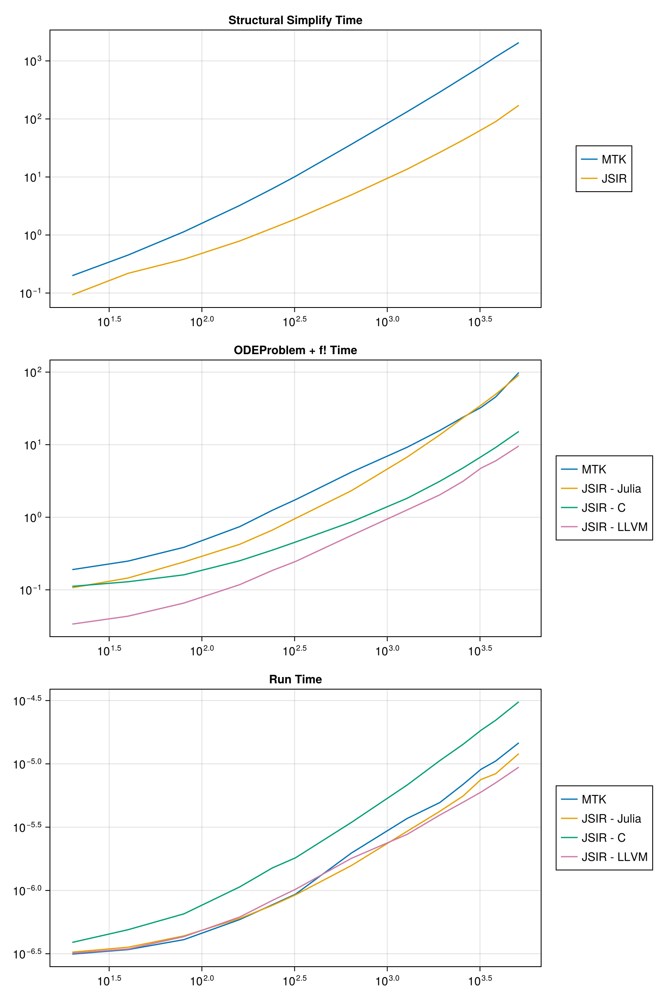
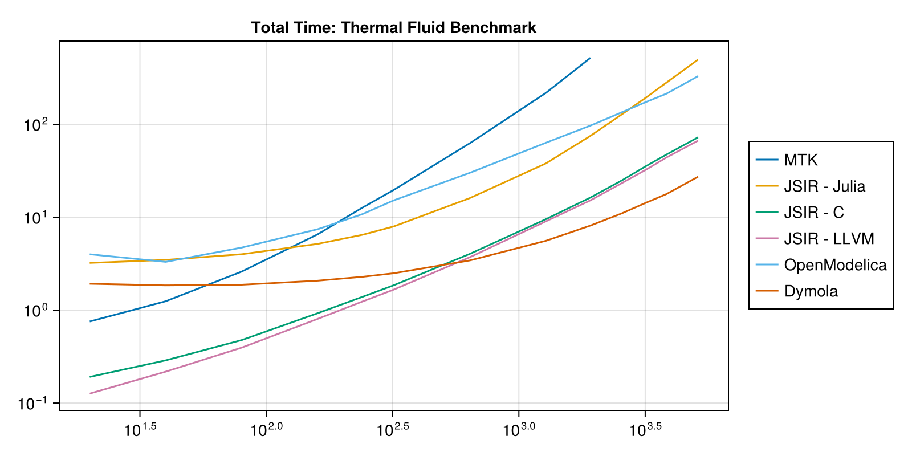

This is a 1D advection-diffusion-source PDE that uses a second order upwind scheme.

```julia
using Pkg
# Rev fixes precompilation https://github.com/hzgzh/XSteam.jl/pull/2
Pkg.add(Pkg.PackageSpec(;name="XSteam", rev="f2a1c589054cfd6bba307985a3a534b6f5a1863b"))

using ModelingToolkit, JuliaSimCompiler, Symbolics, XSteam, Polynomials, BenchmarkTools, CairoMakie
using OMJulia, OrdinaryDiffEq
```


## Setup Julia Code

```julia
#          o  o  o  o  o  o  o < heat capacitors
#          |  |  |  |  |  |  | < heat conductors
#          o  o  o  o  o  o  o
#          |  |  |  |  |  |  |
#Source -> o--o--o--o--o--o--o -> Sink
#       advection diff source PDE

@variables t
D = Differential(t)
m_flow_source(t) = 2.75
T_source(t) = (t > 12 * 3600) * 56.0 + 12.0
@register_symbolic m_flow_source(t)
@register_symbolic T_source(t)

#build polynomial liquid-water property only dependent on Temperature
p_l = 5 #bar
T_vec = collect(1:1:150);
@generated kin_visc_T(t) = :(Base.evalpoly(t, $(fit(T_vec, my_pT.(p_l, T_vec) ./ rho_pT.(p_l, T_vec), 5).coeffs...,)))
@generated lambda_T(t) = :(Base.evalpoly(t, $(fit(T_vec, tc_pT.(p_l, T_vec), 3).coeffs...,)))
@generated Pr_T(t) = :(Base.evalpoly(t, $(fit(T_vec, 1e3 * Cp_pT.(p_l, T_vec) .* my_pT.(p_l, T_vec) ./ tc_pT.(p_l, T_vec), 5).coeffs...,)))
@generated rho_T(t) = :(Base.evalpoly(t, $(fit(T_vec, rho_pT.(p_l, T_vec), 4).coeffs...,)))
@generated rhocp_T(t) = :(Base.evalpoly(t, $(fit(T_vec, 1000 * rho_pT.(p_l, T_vec) .* Cp_pT.(p_l, T_vec), 5).coeffs...,)))
@register_symbolic kin_visc_T(t)
@register_symbolic lambda_T(t)
@register_symbolic Pr_T(t)
@register_symbolic rho_T(t)
@register_symbolic rhocp_T(t)

@connector function FluidPort(; name, p=101325.0, m=0.0, T=0.0)
  sts = @variables p(t) = p m(t) = m [connect = Flow] T(t) = T [connect = Stream]
  ODESystem(Equation[], t, sts, []; name=name)
end

@connector function VectorHeatPort(; name, N=100, T0=0.0, Q0=0.0)
  sts = @variables (T(t))[1:N] = T0 (Q(t))[1:N] = Q0 [connect = Flow]
  ODESystem(Equation[], t, [T; Q], []; name=name)
end

@register_symbolic Dxx_coeff(u, d, T)
#Taylor-aris dispersion model
function Dxx_coeff(u, d, T)
  Re = abs(u) * d / kin_visc_T(T) + 0.1
  if Re < 1000.0
    (d^2 / 4) * u^2 / 48 / 0.14e-6
  else
    d * u * (1.17e9 * Re^(-2.5) + 0.41)
  end
end

@register_symbolic Nusselt(Re, Pr, f)
#Nusselt number model
function Nusselt(Re, Pr, f)
  if Re <= 2300.0
    3.66
  elseif Re <= 3100.0
    3.5239 * (Re / 1000)^4 - 45.158 * (Re / 1000)^3 + 212.13 * (Re / 1000)^2 - 427.45 * (Re / 1000) + 316.08
  else
    f / 8 * ((Re - 1000) * Pr) / (1 + 12.7 * (f / 8)^(1 / 2) * (Pr^(2 / 3) - 1))
  end
end

@register_symbolic Churchill_f(Re, epsilon, d)
#Darcy weisbach friction factor
function Churchill_f(Re, epsilon, d)
  theta_1 = (-2.457 * log(((7 / Re)^0.9) + (0.27 * (epsilon / d))))^16
  theta_2 = (37530 / Re)^16
  8 * ((((8 / Re)^12) + (1 / ((theta_1 + theta_2)^1.5)))^(1 / 12))
end

function FluidRegion(; name, L=1.0, dn=0.05, N=100, T0=0.0,
  lumped_T=50, diffusion=true, e=1e-4)
  @named inlet = FluidPort()
  @named outlet = FluidPort()
  @named heatport = VectorHeatPort(N=N)

  dx = L / N
  c = [-1 / 8, -3 / 8, -3 / 8] # advection stencil coefficients
  A = pi * dn^2 / 4

  p = @parameters C_shift = 0.0 Rw = 0.0 # stuff for latter
  @variables begin
    (T(t))[1:N] = fill(T0, N)
    Twall(t)[1:N] = fill(T0, N)
    (S(t))[1:N] = fill(T0, N)
    (C(t))[1:N] = fill(1.0, N)
    u(t) = 1e-6
    Re(t) = 1000.0
    Dxx(t) = 0.0
    Pr(t) = 1.0
    alpha(t) = 1.0
    f(t) = 1.0
  end

  sts = vcat(T, Twall, S, C, Num[u], Num[Re], Num[Dxx], Num[Pr], Num[alpha], Num[f])

  eqs = Equation[
    Re ~ 0.1 + dn * abs(u) / kin_visc_T(lumped_T)
    Pr ~ Pr_T(lumped_T)
    f ~ Churchill_f(Re, e, dn) #Darcy-weisbach
    alpha ~ Nusselt(Re, Pr, f) * lambda_T(lumped_T) / dn
    Dxx ~ diffusion * Dxx_coeff(u, dn, lumped_T)
    inlet.m ~ -outlet.m
    inlet.p ~ outlet.p
    inlet.T ~ instream(inlet.T)
    outlet.T ~ T[N]
    u ~ inlet.m / rho_T(inlet.T) / A
    [C[i] ~ dx * A * rhocp_T(T[i]) for i in 1:N]
    [S[i] ~ heatport.Q[i] for i in 1:N]
    [Twall[i] ~ heatport.T[i] for i in 1:N]

    #source term
    [S[i] ~ (1 / (1 / (alpha * dn * pi * dx) + abs(Rw / 1000))) * (Twall[i] - T[i]) for i in 1:N]

    #second order upwind + diffusion + source
    D(T[1]) ~ u / dx * (inlet.T - T[1]) + Dxx * (T[2] - T[1]) / dx^2 + S[1] / (C[1] - C_shift)
    D(T[2]) ~ u / dx * (c[1] * inlet.T - sum(c) * T[1] + c[2] * T[2] + c[3] * T[3]) + Dxx * (T[1] - 2 * T[2] + T[3]) / dx^2 + S[2] / (C[2] - C_shift)
    [D(T[i]) ~ u / dx * (c[1] * T[i-2] - sum(c) * T[i-1] + c[2] * T[i] + c[3] * T[i+1]) + Dxx * (T[i-1] - 2 * T[i] + T[i+1]) / dx^2 + S[i] / (C[i] - C_shift) for i in 3:N-1]
    D(T[N]) ~ u / dx * (T[N-1] - T[N]) + Dxx * (T[N-1] - T[N]) / dx^2 + S[N] / (C[N] - C_shift)
  ]

  ODESystem(eqs, t, sts, p; systems=[inlet, outlet, heatport], name=name)
end

@register_symbolic Cn_circular_wall_inner(d, D, cp, ρ)
function Cn_circular_wall_inner(d, D, cp, ρ)
  C = pi / 4 * (D^2 - d^2) * cp * ρ
  return C / 2
end

@register_symbolic Cn_circular_wall_outer(d, D, cp, ρ)
function Cn_circular_wall_outer(d, D, cp, ρ)
  C = pi / 4 * (D^2 - d^2) * cp * ρ
  return C / 2
end

@register_symbolic Ke_circular_wall(d, D, λ)
function Ke_circular_wall(d, D, λ)
  2 * pi * λ / log(D / d)
end

function CircularWallFEM(; name, L=100, N=10, d=0.05, t_layer=[0.002],
  λ=[50], cp=[500], ρ=[7850], T0=0.0)
  @named inner_heatport = VectorHeatPort(N=N)
  @named outer_heatport = VectorHeatPort(N=N)
  dx = L / N
  Ne = length(t_layer)
  Nn = Ne + 1
  dn = vcat(d, d .+ 2.0 .* cumsum(t_layer))
  Cn = zeros(Nn)
  Cn[1:Ne] += Cn_circular_wall_inner.(dn[1:Ne], dn[2:Nn], cp, ρ) .* dx
  Cn[2:Nn] += Cn_circular_wall_outer.(dn[1:Ne], dn[2:Nn], cp, ρ) .* dx
  p = @parameters C_shift = 0.0
  Ke = Ke_circular_wall.(dn[1:Ne], dn[2:Nn], λ) .* dx
  @variables begin
    (Tn(t))[1:N, 1:Nn] = fill(T0, N, Nn)
    (Qe(t))[1:N, 1:Ne] = fill(T0, N, Ne)
  end
  sts = [vec(Tn); vec(Qe)]
  e0 = Equation[inner_heatport.T[i] ~ Tn[i, 1] for i in 1:N]
  e1 = Equation[outer_heatport.T[i] ~ Tn[i, Nn] for i in 1:N]
  e2 = Equation[Qe[i, j] ~ Ke[j] * (-Tn[i, j+1] + Tn[i, j]) for i in 1:N for j in 1:Ne]
  e3 = Equation[D(Tn[i, 1]) * (Cn[1] + C_shift) ~ inner_heatport.Q[i] - Qe[i, 1] for i in 1:N]
  e4 = Equation[D(Tn[i, j]) * Cn[j] ~ Qe[i, j-1] - Qe[i, j] for i in 1:N for j in 2:Nn-1]
  e5 = Equation[D(Tn[i, Nn]) * Cn[Nn] ~ Qe[i, Ne] + outer_heatport.Q[i] for i in 1:N]
  eqs = vcat(e0, e1, e2, e3, e4, e5)
  ODESystem(eqs, t, sts, p; systems=[inner_heatport, outer_heatport], name=name)
end

function CylindricalSurfaceConvection(; name, L=100, N=100, d=1.0, α=5.0)
  dx = L / N
  S = pi * d * dx
  @named heatport = VectorHeatPort(N=N)
  sts = @variables Tenv(t) = 0.0
  eqs = [
    Tenv ~ 18.0
    [heatport.Q[i] ~ α * S * (heatport.T[i] - Tenv) for i in 1:N]
  ]

  ODESystem(eqs, t, sts, []; systems=[heatport], name=name)
end

function PreinsulatedPipe(; name, L=100.0, N=100.0, dn=0.05, T0=0.0, t_layer=[0.004, 0.013],
  λ=[50, 0.04], cp=[500, 1200], ρ=[7800, 40], α=5.0,
  e=1e-4, lumped_T=50, diffusion=true)
  @named inlet = FluidPort()
  @named outlet = FluidPort()
  @named fluid_region = FluidRegion(L=L, N=N, dn=dn, e=e, lumped_T=lumped_T, diffusion=diffusion)
  @named shell = CircularWallFEM(L=L, N=N, d=dn, t_layer=t_layer, λ=λ, cp=cp, ρ=ρ)
  @named surfconv = CylindricalSurfaceConvection(L=L, N=N, d=dn + 2.0 * sum(t_layer), α=α)
  systems = [fluid_region, shell, inlet, outlet, surfconv]
  eqs = [
    connect(fluid_region.inlet, inlet)
    connect(fluid_region.outlet, outlet)
    connect(fluid_region.heatport, shell.inner_heatport)
    connect(shell.outer_heatport, surfconv.heatport)
  ]
  ODESystem(eqs, t, [], []; systems=systems, name=name)
end

function Source(; name, p_feed=100000)
  @named outlet = FluidPort()
  sts = @variables m_flow(t) = 1e-6
  eqs = [
    m_flow ~ m_flow_source(t)
    outlet.m ~ -m_flow
    outlet.p ~ p_feed
    outlet.T ~ T_source(t)
  ]
  compose(ODESystem(eqs, t, sts, []; name=name), [outlet])
end

function Sink(; name)
  @named inlet = FluidPort()
  eqs = [
    inlet.T ~ instream(inlet.T)
  ]
  compose(ODESystem(eqs, t, [], []; name=name), [inlet])
end

function TestBenchPreinsulated(; name, L=1.0, dn=0.05, t_layer=[0.0056, 0.013], N=100, diffusion=true, lumped_T=20)
  @named pipe = PreinsulatedPipe(L=L, dn=dn, N=N, diffusion=diffusion, t_layer=t_layer, lumped_T=lumped_T)
  @named source = Source()
  @named sink = Sink()
  subs = [source, pipe, sink]
  eqs = [
    connect(source.outlet, pipe.inlet)
    connect(pipe.outlet, sink.inlet)
  ]
  compose(ODESystem(eqs, t, [], []; name=name), subs)
end

function build_system(fsys, N)
  N >= 4 || throw("Problem sizes smaller than 4 not supported; received $N.")
  @named testbench = TestBenchPreinsulated(; L=470, N, dn=0.3127, t_layer=[0.0056, 0.058])
  t0 = time()
  sys = structural_simplify(fsys(testbench))
  return time() - t0, sys
end

function compile_run_problem(sys; target=JuliaSimCompiler.JuliaTarget())
  tspan = (0.0, 19 * 3600.0)
  t0 = time()
  if target === JuliaSimCompiler.JuliaTarget()
    prob = ODEProblem(sys, [], tspan, sparse=true)
    (; f, u0, p) = prob
    ff = f.f
  else
    prob = ODEProblem(sys, target, [], tspan, sparse=true)
    (; f, u0, p) = prob
    ff = f
  end
  prob.u0 .= 12.0
  du = similar(u0)
  ff(du, u0, p, 0.0)
  t_fode = time() - t0
  t_run = @belapsed $ff($du, $u0, $p, 0.0)
  t_fode, t_run
end

function build_run_problem(fsys, N; target=JuliaSimCompiler.JuliaTarget())
  t_ss, sys = build_system(fsys, N)
  t_fode, t_run = compile_run_problem(sys; target)
  t_ss, t_fode, t_run
end

function test_speed(fsys, N; target=JuliaSimCompiler.JuliaTarget(), solver=FBDF(;autodiff = target===JuliaSimCompiler.JuliaTarget()))
    tspan = (0.0, 19*3600)
    t_total = @elapsed begin
        @named testbench = TestBenchPreinsulated(L=470, N=N, dn=0.3127, t_layer=[0.0056, 0.058])
        sys = structural_simplify(fsys(testbench))
        if target === JuliaSimCompiler.JuliaTarget()
            prob = ODEProblem(sys, [], tspan, sparse=true)
        else
            prob = ODEProblem(sys, target, [], tspan, sparse=true)
        end
        prob.u0 .= 12.0
        solve(prob, solver, reltol=1e-6, abstol=1e-6, saveat=100);
    end
end
```

```
test_speed (generic function with 1 method)
```


```julia
N_x = [5, 10, 20, 40, 60, 80, 160, 320, 480, 640, 800, 960, 1280];
N_states = 4 .* N_x; # x-axis for plots
ss_times = Matrix{Float64}(undef, length(N_x), 2);
times = Matrix{NTuple{2,Float64}}(undef, length(N_x), 4);
total_times = Matrix{Float64}(undef, length(N_x), 6);
```


## Time Julia

```julia
using JuliaSimCompiler: IRSystem
const MTKSystem = identity
const CBackend = JuliaSimCompiler.CTarget();
const LLVMBackend = JuliaSimCompiler.llvm.LLVMTarget();

@time build_run_problem(MTKSystem, 4)
@time build_run_problem(IRSystem, 4)
@time build_run_problem(IRSystem, 4; target=CBackend)
@time build_run_problem(IRSystem, 4; target=LLVMBackend)

@show "Start Julia Timings"


for (i, N_x_i) in enumerate(N_x)
  @show i
  ss_times[i, 1], sys_mtk = build_system(MTKSystem, N_x_i)
  ss_times[i, 2], sys_jsir = build_system(IRSystem, N_x_i)
  times[i, 1] = compile_run_problem(sys_mtk)
  times[i, 2] = compile_run_problem(sys_jsir)
  times[i, 3] = compile_run_problem(sys_jsir, target=CBackend)
  times[i, 4] = compile_run_problem(sys_jsir, target=LLVMBackend)

  if N_x_i >= 480
    total_times[i, 1] = NaN
  else
    total_times[i, 1] = test_speed(MTKSystem, N_x_i)
  end
  total_times[i, 2] = test_speed(IRSystem, N_x_i)
  total_times[i, 3] = test_speed(IRSystem, N_x_i, target=CBackend)
  total_times[i, 4] = test_speed(IRSystem, N_x_i, target=LLVMBackend)

  @show N_x_i, ss_times[i, :], times[i, :], total_times[i, :]
end
```

```
33.198522 seconds (27.96 M allocations: 1.830 GiB, 14.32% gc time, 84.19% 
compilation time: 16% of which was recompilation)
 12.020686 seconds (1.87 M allocations: 117.287 MiB, 32.26% gc time, 59.17%
 compilation time: 87% of which was recompilation)
  6.718405 seconds (2.11 M allocations: 137.180 MiB, 57.67% gc time, 25.10%
 compilation time)
  9.986777 seconds (7.26 M allocations: 513.556 MiB, 39.53% gc time, 49.82%
 compilation time: 26% of which was recompilation)
"Start Julia Timings" = "Start Julia Timings"
i = 1
(N_x_i, ss_times[i, :], times[i, :], total_times[i, :]) = (5, [0.1989490985
8703613, 0.0926051139831543], [(0.18858098983764648, 3.111991701244813e-7),
 (0.11128997802734375, 3.226521739130435e-7), (0.11758708953857422, 3.84373
13432835823e-7), (0.03362703323364258, 3.1837179487179485e-7)], [5.00289090
3, 4.561241792, 3.299816437, 2.739431145, 3.6073928455e-313, NaN])
i = 2
(N_x_i, ss_times[i, :], times[i, :], total_times[i, :]) = (10, [0.474277019
5007324, 0.211622953414917], [(0.24669098854064941, 3.394954128440367e-7), 
(0.14435100555419922, 3.578047619047619e-7), (0.13306379318237305, 4.539543
147208122e-7), (0.04325294494628906, 3.449490740740741e-7)], [1.168060164, 
3.183172756, 0.348424098, 0.262952721, 3.6073928455e-313, NaN])
i = 3
(N_x_i, ss_times[i, :], times[i, :], total_times[i, :]) = (20, [1.215207815
170288, 0.35616207122802734], [(0.40187692642211914, 4.117035175879397e-7),
 (0.22843503952026367, 4.355e-7), (0.15959906578063965, 6.456303030303031e-
7), (0.06496787071228027, 5.632378378378378e-7)], [2.561281698, 3.834668884
, 0.605316655, 0.499055566, 3.6073928455e-313, NaN])
i = 4
(N_x_i, ss_times[i, :], times[i, :], total_times[i, :]) = (40, [3.214808940
887451, 0.8029677867889404], [(0.7080411911010742, 5.841933701657459e-7), (
0.4376199245452881, 6.040056497175141e-7), (0.24638605117797852, 1.085e-6),
 (0.1181180477142334, 6.180346820809249e-7)], [6.658834541, 5.679809722, 1.
183623124, 1.010304625, 3.6073928455e-313, -4.3625658594924623e307])
i = 5
(N_x_i, ss_times[i, :], times[i, :], total_times[i, :]) = (60, [6.144654989
242554, 1.2864398956298828], [(1.1321220397949219, 7.71e-7), (0.67377805709
83887, 7.654867256637168e-7), (0.34900403022766113, 1.469e-6), (0.185041904
4494629, 8.347866666666667e-7)], [12.635938663, 6.071452608, 1.803702894, 1
.625793694, 3.6073928455e-313, -2.052268307113775e-289])
i = 6
(N_x_i, ss_times[i, :], times[i, :], total_times[i, :]) = (80, [10.16492199
8977661, 1.8065459728240967], [(1.6801879405975342, 9.362999999999999e-7), 
(0.9385302066802979, 9.223529411764707e-7), (0.4512209892272949, 1.83690000
00000001e-6), (0.2454218864440918, 1.0239e-6)], [19.657390277, 7.525165451,
 2.537460171, 2.293641856, 3.6073928455e-313, NaN])
i = 7
(N_x_i, ss_times[i, :], times[i, :], total_times[i, :]) = (160, [35.7531259
059906, 4.747786998748779], [(4.069071054458618, 1.972e-6), (2.308790922164
917, 1.57e-6), (0.8529140949249268, 3.504875e-6), (0.5553121566772461, 1.78
89000000000001e-6)], [61.78757596, 15.188500066, 6.051918921, 5.725248084, 
2.970794107435e-312, -1.1049932511121723e301])
i = 8
(N_x_i, ss_times[i, :], times[i, :], total_times[i, :]) = (320, [131.980910
06278992, 13.333730220794678], [(9.147820949554443, 3.79625e-6), (6.6845731
73522949, 2.918777777777778e-6), (1.812615156173706, 6.404e-6), (1.27333307
26623535, 2.773222222222222e-6)], [226.280278111, 37.310356764, 16.14947876
1, 15.610087162, 2.94957415013e-312, 1.491667591244966e-154])
i = 9
(N_x_i, ss_times[i, :], times[i, :], total_times[i, :]) = (480, [285.943650
96092224, 25.63252592086792], [(15.54723596572876, 4.954285714285715e-6), (
13.541914939880371, 4.561428571428571e-6), (3.1213419437408447, 1.051e-5), 
(2.0507469177246094, 3.938625e-6)], [NaN, 75.166221701, 30.549579703, 29.50
0184011, 3.6073928455e-313, NaN])
i = 10
(N_x_i, ss_times[i, :], times[i, :], total_times[i, :]) = (640, [503.053776
0257721, 42.23684215545654], [(24.205760955810547, 6.7898e-6), (23.21709990
5014038, 5.741666666666667e-6), (4.771465063095093, 1.425e-5), (3.135158777
2369385, 5.073333333333333e-6)], [NaN, 128.256425899, 49.728709926, 48.5624
53469, 3.6073928455e-313, -2.436328502113458e289])
i = 11
(N_x_i, ss_times[i, :], times[i, :], total_times[i, :]) = (800, [778.517599
105835, 61.73047614097595], [(32.78227400779724, 8.67e-6), (34.776195049285
89, 7.1975e-6), (6.779656887054443, 1.828e-5), (4.709866046905518, 6.018333
333333333e-6)], [NaN, 199.325448464, 72.230312995, 70.514090075, NaN, NaN])
i = 12
(N_x_i, ss_times[i, :], times[i, :], total_times[i, :]) = (960, [1148.80409
59835052, 86.51736116409302], [(45.63860201835632, 1.022e-5), (49.560915946
96045, 8.273333333333334e-6), (9.136137962341309, 2.273e-5), (5.99373602867
1265, 7.8975e-6)], [NaN, 286.764650833, 99.483657274, 96.444589414, -3.9999
999962783472, NaN])
i = 13
(N_x_i, ss_times[i, :], times[i, :], total_times[i, :]) = (1280, [2071.2985
00061035, 148.6521279811859], [(88.26865601539612, 1.444e-5), (84.128849983
21533, 1.14e-5), (15.107736825942993, 3.037e-5), (9.563118934631348, 1.077e
-5)], [NaN, 515.099579294, 166.951901634, 162.214001972, NaN, -4.4501477087
33451e-308])
```


## Time OpenModelica

```julia
using OMJulia, CSV, DataFrames
mod = OMJulia.OMCSession();
OMJulia.sendExpression(mod, "getVersion()")
OMJulia.sendExpression(mod, "installPackage(Modelica)")
modelicafile = "../../benchmarks/ModelingToolkit/DhnControl.mo"
resultfile = "modelica_res.csv"

@show "Start OpenModelica Timings"

for i in 1:length(N_x)
    N = N_x[i]
    @show N
    totaltime = @elapsed res = begin
        @sync ModelicaSystem(mod, modelicafile, "DhnControl.Test.test_preinsulated_470_$N")
        sendExpression(mod, "simulate(DhnControl.Test.test_preinsulated_470_$N)")
    end
    #runtime = res["timeTotal"]
    @assert res["messages"][1:11] == "LOG_SUCCESS"
    total_times[i, 5] = totaltime
end

OMJulia.quit(mod)
total_times[:, 5]
```

```
"Start OpenModelica Timings" = "Start OpenModelica Timings"
N = 5
N = 10
N = 20
N = 40
N = 60
N = 80
N = 160
N = 320
N = 480
N = 640
N = 800
N = 960
N = 1280
13-element Vector{Float64}:
   3.849348833
   3.259036541
   4.74488808
   7.484547418
  10.960451732
  13.769452916
  28.910636281
  63.735067507
  96.915945898
 134.094504869
 176.25995787
 216.671297649
 326.0734292
```


## Time Dymola

Dymola requires a license server and thus cannot be hosted. This was run locally for the
following times:

```julia
translation_and_total_times = [1.802 1.921
                               1.78 1.846
                               1.84 1.877
                               2.028 2.075
                               2.221 2.283
                               2.409 2.496
                               3.189 3.427
                               4.758 5.577
                               6.39 8.128
                               8.052 11.026
                               9.707 14.393
                               11.411 17.752
                               15.094 27.268]
total_times[:, 6] = translation_and_total_times[1:length(N_x),2]
```

```
13-element Vector{Float64}:
  1.921
  1.846
  1.877
  2.075
  2.283
  2.496
  3.427
  5.577
  8.128
 11.026
 14.393
 17.752
 27.268
```


## Generate Final Plots

```julia
f = Figure(size = (800, 1200));
let ax = Axis(f[1, 1]; yscale = log10, xscale = log10, title="Structural Simplify Time")
  names = ["MTK", "JSIR"]
  _lines = map(eachcol(ss_times)) do ts
    lines!(N_states, ts)
  end
  Legend(f[1,2], _lines, names)
end
for (i, timecat) in enumerate(("ODEProblem + f!", "Run"))
  title = timecat * " Time"
  ax = Axis(f[i+1, 1]; yscale = log10, xscale = log10, title)
  names = ["MTK", "JSIR - Julia", "JSIR - C", "JSIR - LLVM"]
  _lines = map(eachcol(times)) do ts
    lines!(N_states, getindex.(ts, i))
  end
  Legend(f[i+1,2], _lines, names)
end
f
```



```julia
f2 = Figure(size = (800, 400));
title = "Total Time: Thermal Fluid Benchmark"
ax = Axis(f2[1, 1]; yscale = log10, xscale = log10, title)
names = ["MTK", "JSIR - Julia", "JSIR - C", "JSIR - LLVM", "OpenModelica", "Dymola"]
_lines = map(enumerate(names)) do (j, label)
    ts = @view(total_times[:, j])
    lines!(N_states, ts)
end
Legend(f2[1,2], _lines, names)
f2
```




## Appendix


## Appendix

These benchmarks are a part of the SciMLBenchmarks.jl repository, found at: [https://github.com/SciML/SciMLBenchmarks.jl](https://github.com/SciML/SciMLBenchmarks.jl). For more information on high-performance scientific machine learning, check out the SciML Open Source Software Organization [https://sciml.ai](https://sciml.ai).

To locally run this benchmark, do the following commands:

```
using SciMLBenchmarks
SciMLBenchmarks.weave_file("benchmarks/ModelingToolkit","ThermalFluid.jmd")
```

Computer Information:

```
Julia Version 1.10.4
Commit 48d4fd48430 (2024-06-04 10:41 UTC)
Build Info:
  Official https://julialang.org/ release
Platform Info:
  OS: Linux (x86_64-linux-gnu)
  CPU: 128 × AMD EPYC 7502 32-Core Processor
  WORD_SIZE: 64
  LIBM: libopenlibm
  LLVM: libLLVM-15.0.7 (ORCJIT, znver2)
Threads: 1 default, 0 interactive, 1 GC (on 128 virtual cores)
Environment:
  JULIA_CPU_THREADS = 128
  JULIA_DEPOT_PATH = /cache/julia-buildkite-plugin/depots/5b300254-1738-4989-ae0a-f4d2d937f953
  JULIA_PKG_SERVER = juliahub.com

```

Package Information:

```
Status `/cache/build/exclusive-amdci3-0/julialang/scimlbenchmarks-dot-jl/benchmarks/ModelingToolkit/Project.toml`
  [6e4b80f9] BenchmarkTools v1.5.0
  [336ed68f] CSV v0.10.14
⌅ [13f3f980] CairoMakie v0.11.11
  [a93c6f00] DataFrames v1.6.1
  [8391cb6b] JuliaSimCompiler v0.1.12
  [9cbdfd5a] JuliaSimCompilerRuntime v1.0.2
  [7ed4a6bd] LinearSolve v2.30.1
  [961ee093] ModelingToolkit v9.19.0
  [16a59e39] ModelingToolkitStandardLibrary v2.7.2
  [0f4fe800] OMJulia v0.3.2
  [1dea7af3] OrdinaryDiffEq v6.84.0
  [f27b6e38] Polynomials v4.0.11
  [ba661fbb] PreferenceTools v0.1.2
  [31c91b34] SciMLBenchmarks v0.1.3
  [0c5d862f] Symbolics v5.30.3
  [95ff35a0] XSteam v0.3.0 `https://github.com/hzgzh/XSteam.jl.git#f2a1c58`
Info Packages marked with ⌅ have new versions available but compatibility constraints restrict them from upgrading. To see why use `status --outdated`
```

And the full manifest:

```
Status `/cache/build/exclusive-amdci3-0/julialang/scimlbenchmarks-dot-jl/benchmarks/ModelingToolkit/Manifest.toml`
  [47edcb42] ADTypes v1.4.0
  [621f4979] AbstractFFTs v1.5.0
  [1520ce14] AbstractTrees v0.4.5
  [7d9f7c33] Accessors v0.1.36
  [79e6a3ab] Adapt v4.0.4
  [66dad0bd] AliasTables v1.1.3
  [27a7e980] Animations v0.4.1
  [ec485272] ArnoldiMethod v0.4.0
  [4fba245c] ArrayInterface v7.11.0
  [4c555306] ArrayLayouts v1.9.4
  [67c07d97] Automa v1.0.3
  [13072b0f] AxisAlgorithms v1.1.0
  [39de3d68] AxisArrays v0.4.7
  [6e4b80f9] BenchmarkTools v1.5.0
  [e2ed5e7c] Bijections v0.1.6
  [62783981] BitTwiddlingConvenienceFunctions v0.1.5
  [fa961155] CEnum v0.5.0
  [2a0fbf3d] CPUSummary v0.2.5
  [00ebfdb7] CSTParser v3.4.3
  [336ed68f] CSV v0.10.14
  [159f3aea] Cairo v1.0.5
⌅ [13f3f980] CairoMakie v0.11.11
  [49dc2e85] Calculus v0.5.1
  [082447d4] ChainRules v1.69.0
  [d360d2e6] ChainRulesCore v1.24.0
  [fb6a15b2] CloseOpenIntervals v0.1.12
  [944b1d66] CodecZlib v0.7.4
  [a2cac450] ColorBrewer v0.4.0
  [35d6a980] ColorSchemes v3.25.0
  [3da002f7] ColorTypes v0.11.5
  [c3611d14] ColorVectorSpace v0.10.0
  [5ae59095] Colors v0.12.11
  [861a8166] Combinatorics v1.0.2
  [a80b9123] CommonMark v0.8.12
  [38540f10] CommonSolve v0.2.4
  [bbf7d656] CommonSubexpressions v0.3.0
  [34da2185] Compat v4.15.0
  [b152e2b5] CompositeTypes v0.1.4
  [a33af91c] CompositionsBase v0.1.2
  [2569d6c7] ConcreteStructs v0.2.3
  [8f4d0f93] Conda v1.10.0
  [187b0558] ConstructionBase v1.5.5
  [d38c429a] Contour v0.6.3
  [adafc99b] CpuId v0.3.1
  [a8cc5b0e] Crayons v4.1.1
  [9a962f9c] DataAPI v1.16.0
  [a93c6f00] DataFrames v1.6.1
  [864edb3b] DataStructures v0.18.20
  [e2d170a0] DataValueInterfaces v1.0.0
  [927a84f5] DelaunayTriangulation v1.0.3
  [2b5f629d] DiffEqBase v6.151.4
  [459566f4] DiffEqCallbacks v3.6.2
  [163ba53b] DiffResults v1.1.0
  [b552c78f] DiffRules v1.15.1
  [a0c0ee7d] DifferentiationInterface v0.5.5
  [31c24e10] Distributions v0.25.109
  [ffbed154] DocStringExtensions v0.9.3
  [5b8099bc] DomainSets v0.7.14
  [fa6b7ba4] DualNumbers v0.6.8
⌅ [7c1d4256] DynamicPolynomials v0.5.7
⌅ [06fc5a27] DynamicQuantities v0.13.2
  [4e289a0a] EnumX v1.0.4
  [f151be2c] EnzymeCore v0.7.5
  [429591f6] ExactPredicates v2.2.8
  [d4d017d3] ExponentialUtilities v1.26.1
  [e2ba6199] ExprTools v0.1.10
⌅ [6b7a57c9] Expronicon v0.8.5
  [411431e0] Extents v0.1.3
  [7a1cc6ca] FFTW v1.8.0
  [7034ab61] FastBroadcast v0.3.3
  [9aa1b823] FastClosures v0.3.2
  [29a986be] FastLapackInterface v2.0.4
  [5789e2e9] FileIO v1.16.3
  [8fc22ac5] FilePaths v0.8.3
  [48062228] FilePathsBase v0.9.21
  [1a297f60] FillArrays v1.11.0
  [64ca27bc] FindFirstFunctions v1.2.0
  [6a86dc24] FiniteDiff v2.23.1
  [53c48c17] FixedPointNumbers v0.8.5
  [1fa38f19] Format v1.3.7
  [f6369f11] ForwardDiff v0.10.36
  [b38be410] FreeType v4.1.1
  [663a7486] FreeTypeAbstraction v0.10.3
  [069b7b12] FunctionWrappers v1.1.3
  [77dc65aa] FunctionWrappersWrappers v0.1.3
  [d9f16b24] Functors v0.4.11
  [46192b85] GPUArraysCore v0.1.6
  [61eb1bfa] GPUCompiler v0.26.5
  [c145ed77] GenericSchur v0.5.4
  [cf35fbd7] GeoInterface v1.3.4
  [5c1252a2] GeometryBasics v0.4.11
  [d7ba0133] Git v1.3.1
  [c27321d9] Glob v1.3.1
  [a2bd30eb] Graphics v1.1.2
  [86223c79] Graphs v1.11.1
⌅ [3955a311] GridLayoutBase v0.10.2
  [42e2da0e] Grisu v1.0.2
  [eafb193a] Highlights v0.5.3
  [3e5b6fbb] HostCPUFeatures v0.1.16
  [34004b35] HypergeometricFunctions v0.3.23
  [7073ff75] IJulia v1.24.2
  [615f187c] IfElse v0.1.1
  [2803e5a7] ImageAxes v0.6.11
  [c817782e] ImageBase v0.1.7
  [a09fc81d] ImageCore v0.10.2
  [82e4d734] ImageIO v0.6.8
  [bc367c6b] ImageMetadata v0.9.9
  [9b13fd28] IndirectArrays v1.0.0
  [d25df0c9] Inflate v0.1.5
  [842dd82b] InlineStrings v1.4.1
  [a98d9a8b] Interpolations v0.15.1
  [d1acc4aa] IntervalArithmetic v0.22.14
  [8197267c] IntervalSets v0.7.10
  [3587e190] InverseFunctions v0.1.14
  [41ab1584] InvertedIndices v1.3.0
  [92d709cd] IrrationalConstants v0.2.2
  [f1662d9f] Isoband v0.1.1
  [c8e1da08] IterTools v1.10.0
  [82899510] IteratorInterfaceExtensions v1.0.0
  [692b3bcd] JLLWrappers v1.5.0
  [682c06a0] JSON v0.21.4
  [b835a17e] JpegTurbo v0.1.5
  [98e50ef6] JuliaFormatter v1.0.56
  [9c9cc66b] JuliaSimBase v0.1.0
  [8391cb6b] JuliaSimCompiler v0.1.12
  [9cbdfd5a] JuliaSimCompilerRuntime v1.0.2
  [ccbc3e58] JumpProcesses v9.11.1
  [ef3ab10e] KLU v0.6.0
  [5ab0869b] KernelDensity v0.6.9
  [ba0b0d4f] Krylov v0.9.6
  [929cbde3] LLVM v7.2.1
  [b964fa9f] LaTeXStrings v1.3.1
  [2ee39098] LabelledArrays v1.16.0
  [984bce1d] LambertW v0.4.6
  [23fbe1c1] Latexify v0.16.3
  [10f19ff3] LayoutPointers v0.1.15
  [5078a376] LazyArrays v2.0.4
  [8cdb02fc] LazyModules v0.3.1
  [9c8b4983] LightXML v0.9.1
  [d3d80556] LineSearches v7.2.0
  [7ed4a6bd] LinearSolve v2.30.1
  [2ab3a3ac] LogExpFunctions v0.3.28
  [bdcacae8] LoopVectorization v0.12.170
  [d8e11817] MLStyle v0.4.17
  [1914dd2f] MacroTools v0.5.13
⌅ [ee78f7c6] Makie v0.20.10
⌅ [20f20a25] MakieCore v0.7.3
  [d125e4d3] ManualMemory v0.1.8
  [dbb5928d] MappedArrays v0.4.2
⌅ [0a4f8689] MathTeXEngine v0.5.7
  [bb5d69b7] MaybeInplace v0.1.3
  [739be429] MbedTLS v1.1.9
  [e1d29d7a] Missings v1.2.0
  [961ee093] ModelingToolkit v9.19.0
  [16a59e39] ModelingToolkitStandardLibrary v2.7.2
  [e94cdb99] MosaicViews v0.3.4
  [46d2c3a1] MuladdMacro v0.2.4
  [102ac46a] MultivariatePolynomials v0.5.6
  [ffc61752] Mustache v1.0.19
  [d8a4904e] MutableArithmetics v1.4.5
  [d41bc354] NLSolversBase v7.8.3
  [77ba4419] NaNMath v1.0.2
  [f09324ee] Netpbm v1.1.1
  [8913a72c] NonlinearSolve v3.13.0
  [0f4fe800] OMJulia v0.3.2
  [510215fc] Observables v0.5.5
  [6fe1bfb0] OffsetArrays v1.14.0
  [52e1d378] OpenEXR v0.3.2
  [bac558e1] OrderedCollections v1.6.3
  [1dea7af3] OrdinaryDiffEq v6.84.0
  [90014a1f] PDMats v0.11.31
  [f57f5aa1] PNGFiles v0.4.3
  [65ce6f38] PackageExtensionCompat v1.0.2
  [19eb6ba3] Packing v0.5.0
  [5432bcbf] PaddedViews v0.5.12
  [d96e819e] Parameters v0.12.3
  [69de0a69] Parsers v2.8.1
  [eebad327] PkgVersion v0.3.3
  [995b91a9] PlotUtils v1.4.1
  [e409e4f3] PoissonRandom v0.4.4
  [f517fe37] Polyester v0.7.14
  [1d0040c9] PolyesterWeave v0.2.1
  [647866c9] PolygonOps v0.1.2
  [f27b6e38] Polynomials v4.0.11
  [2dfb63ee] PooledArrays v1.4.3
  [d236fae5] PreallocationTools v0.4.22
  [aea7be01] PrecompileTools v1.2.1
  [ba661fbb] PreferenceTools v0.1.2
  [21216c6a] Preferences v1.4.3
  [08abe8d2] PrettyTables v2.3.2
  [92933f4c] ProgressMeter v1.10.0
  [43287f4e] PtrArrays v1.2.0
  [4b34888f] QOI v1.0.0
  [1fd47b50] QuadGK v2.9.4
  [e6cf234a] RandomNumbers v1.5.3
  [b3c3ace0] RangeArrays v0.3.2
  [c84ed2f1] Ratios v0.4.5
  [c1ae055f] RealDot v0.1.0
  [3cdcf5f2] RecipesBase v1.3.4
⌃ [731186ca] RecursiveArrayTools v3.23.1
  [f2c3362d] RecursiveFactorization v0.2.23
  [189a3867] Reexport v1.2.2
  [05181044] RelocatableFolders v1.0.1
  [ae029012] Requires v1.3.0
  [79098fc4] Rmath v0.7.1
  [5eaf0fd0] RoundingEmulator v0.2.1
  [7e49a35a] RuntimeGeneratedFunctions v0.5.13
  [fdea26ae] SIMD v3.5.0
  [94e857df] SIMDTypes v0.1.0
  [476501e8] SLEEFPirates v0.6.42
  [0bca4576] SciMLBase v2.41.3
  [31c91b34] SciMLBenchmarks v0.1.3
  [c0aeaf25] SciMLOperators v0.3.8
  [53ae85a6] SciMLStructures v1.3.0
  [6c6a2e73] Scratch v1.2.1
  [91c51154] SentinelArrays v1.4.3
  [efcf1570] Setfield v1.1.1
  [65257c39] ShaderAbstractions v0.4.1
  [992d4aef] Showoff v1.0.3
  [73760f76] SignedDistanceFields v0.4.0
  [727e6d20] SimpleNonlinearSolve v1.10.0
  [699a6c99] SimpleTraits v0.9.4
  [ce78b400] SimpleUnPack v1.1.0
  [45858cf5] Sixel v0.1.3
  [66db9d55] SnoopPrecompile v1.0.3
  [b85f4697] SoftGlobalScope v1.1.0
  [a2af1166] SortingAlgorithms v1.2.1
  [47a9eef4] SparseDiffTools v2.19.0
  [dc90abb0] SparseInverseSubset v0.1.2
  [0a514795] SparseMatrixColorings v0.3.3
  [e56a9233] Sparspak v0.3.9
  [276daf66] SpecialFunctions v2.4.0
  [cae243ae] StackViews v0.1.1
  [aedffcd0] Static v0.8.10
  [0d7ed370] StaticArrayInterface v1.5.0
  [90137ffa] StaticArrays v1.9.5
  [1e83bf80] StaticArraysCore v1.4.3
  [82ae8749] StatsAPI v1.7.0
  [2913bbd2] StatsBase v0.34.3
  [4c63d2b9] StatsFuns v1.3.1
  [7792a7ef] StrideArraysCore v0.5.6
  [69024149] StringEncodings v0.3.7
  [892a3eda] StringManipulation v0.3.4
  [09ab397b] StructArrays v0.6.18
  [2efcf032] SymbolicIndexingInterface v0.3.22
  [19f23fe9] SymbolicLimits v0.2.1
  [d1185830] SymbolicUtils v2.0.2
  [0c5d862f] Symbolics v5.30.3
  [3783bdb8] TableTraits v1.0.1
  [bd369af6] Tables v1.11.1
  [62fd8b95] TensorCore v0.1.1
⌅ [8ea1fca8] TermInterface v0.4.1
  [8290d209] ThreadingUtilities v0.5.2
  [731e570b] TiffImages v0.10.0
  [a759f4b9] TimerOutputs v0.5.24
  [0796e94c] Tokenize v0.5.29
  [3bb67fe8] TranscodingStreams v0.10.9
  [d5829a12] TriangularSolve v0.2.0
  [410a4b4d] Tricks v0.1.8
  [981d1d27] TriplotBase v0.1.0
  [781d530d] TruncatedStacktraces v1.4.0
  [5c2747f8] URIs v1.5.1
  [3a884ed6] UnPack v1.0.2
  [1cfade01] UnicodeFun v0.4.1
  [1986cc42] Unitful v1.20.0
  [a7c27f48] Unityper v0.1.6
  [3d5dd08c] VectorizationBase v0.21.68
  [81def892] VersionParsing v1.3.0
  [19fa3120] VertexSafeGraphs v0.2.0
  [ea10d353] WeakRefStrings v1.4.2
  [44d3d7a6] Weave v0.10.12
  [efce3f68] WoodburyMatrices v1.0.0
  [76eceee3] WorkerUtilities v1.6.1
  [95ff35a0] XSteam v0.3.0 `https://github.com/hzgzh/XSteam.jl.git#f2a1c58`
  [ddb6d928] YAML v0.4.11
  [c2297ded] ZMQ v1.2.6
  [6e34b625] Bzip2_jll v1.0.8+1
  [4e9b3aee] CRlibm_jll v1.0.1+0
  [83423d85] Cairo_jll v1.18.0+2
  [5ae413db] EarCut_jll v2.2.4+0
  [2e619515] Expat_jll v2.6.2+0
  [b22a6f82] FFMPEG_jll v6.1.1+0
  [f5851436] FFTW_jll v3.3.10+0
  [a3f928ae] Fontconfig_jll v2.13.96+0
  [d7e528f0] FreeType2_jll v2.13.2+0
  [559328eb] FriBidi_jll v1.0.14+0
  [78b55507] Gettext_jll v0.21.0+0
  [f8c6e375] Git_jll v2.44.0+2
  [7746bdde] Glib_jll v2.80.2+0
  [3b182d85] Graphite2_jll v1.3.14+0
  [2e76f6c2] HarfBuzz_jll v2.8.1+1
  [905a6f67] Imath_jll v3.1.11+0
  [1d5cc7b8] IntelOpenMP_jll v2024.1.0+0
  [aacddb02] JpegTurbo_jll v3.0.3+0
  [c1c5ebd0] LAME_jll v3.100.2+0
⌅ [dad2f222] LLVMExtra_jll v0.0.29+0
  [1d63c593] LLVMOpenMP_jll v15.0.7+0
  [dd4b983a] LZO_jll v2.10.2+0
⌅ [e9f186c6] Libffi_jll v3.2.2+1
  [d4300ac3] Libgcrypt_jll v1.8.11+0
  [7add5ba3] Libgpg_error_jll v1.49.0+0
  [94ce4f54] Libiconv_jll v1.17.0+0
  [4b2f31a3] Libmount_jll v2.40.1+0
  [38a345b3] Libuuid_jll v2.40.1+0
  [856f044c] MKL_jll v2024.1.0+0
  [e7412a2a] Ogg_jll v1.3.5+1
  [18a262bb] OpenEXR_jll v3.2.4+0
  [458c3c95] OpenSSL_jll v3.0.14+0
  [efe28fd5] OpenSpecFun_jll v0.5.5+0
  [91d4177d] Opus_jll v1.3.2+0
  [36c8627f] Pango_jll v1.52.2+0
  [30392449] Pixman_jll v0.43.4+0
  [f50d1b31] Rmath_jll v0.4.2+0
  [02c8fc9c] XML2_jll v2.12.7+0
  [aed1982a] XSLT_jll v1.1.34+0
  [4f6342f7] Xorg_libX11_jll v1.8.6+0
  [0c0b7dd1] Xorg_libXau_jll v1.0.11+0
  [a3789734] Xorg_libXdmcp_jll v1.1.4+0
  [1082639a] Xorg_libXext_jll v1.3.6+0
  [ea2f1a96] Xorg_libXrender_jll v0.9.11+0
  [14d82f49] Xorg_libpthread_stubs_jll v0.1.1+0
  [c7cfdc94] Xorg_libxcb_jll v1.15.0+0
  [c5fb5394] Xorg_xtrans_jll v1.5.0+0
  [8f1865be] ZeroMQ_jll v4.3.5+0
  [9a68df92] isoband_jll v0.2.3+0
  [a4ae2306] libaom_jll v3.9.0+0
  [0ac62f75] libass_jll v0.15.1+0
  [f638f0a6] libfdk_aac_jll v2.0.2+0
  [b53b4c65] libpng_jll v1.6.43+1
  [075b6546] libsixel_jll v1.10.3+0
  [a9144af2] libsodium_jll v1.0.20+0
  [f27f6e37] libvorbis_jll v1.3.7+1
  [1317d2d5] oneTBB_jll v2021.12.0+0
  [1270edf5] x264_jll v2021.5.5+0
  [dfaa095f] x265_jll v3.5.0+0
  [0dad84c5] ArgTools v1.1.1
  [56f22d72] Artifacts
  [2a0f44e3] Base64
  [8bf52ea8] CRC32c
  [ade2ca70] Dates
  [8ba89e20] Distributed
  [f43a241f] Downloads v1.6.0
  [7b1f6079] FileWatching
  [9fa8497b] Future
  [b77e0a4c] InteractiveUtils
  [4af54fe1] LazyArtifacts
  [b27032c2] LibCURL v0.6.4
  [76f85450] LibGit2
  [8f399da3] Libdl
  [37e2e46d] LinearAlgebra
  [56ddb016] Logging
  [d6f4376e] Markdown
  [a63ad114] Mmap
  [ca575930] NetworkOptions v1.2.0
  [44cfe95a] Pkg v1.10.0
  [de0858da] Printf
  [9abbd945] Profile
  [3fa0cd96] REPL
  [9a3f8284] Random
  [ea8e919c] SHA v0.7.0
  [9e88b42a] Serialization
  [1a1011a3] SharedArrays
  [6462fe0b] Sockets
  [2f01184e] SparseArrays v1.10.0
  [10745b16] Statistics v1.10.0
  [4607b0f0] SuiteSparse
  [fa267f1f] TOML v1.0.3
  [a4e569a6] Tar v1.10.0
  [8dfed614] Test
  [cf7118a7] UUIDs
  [4ec0a83e] Unicode
  [e66e0078] CompilerSupportLibraries_jll v1.1.1+0
  [deac9b47] LibCURL_jll v8.4.0+0
  [e37daf67] LibGit2_jll v1.6.4+0
  [29816b5a] LibSSH2_jll v1.11.0+1
  [c8ffd9c3] MbedTLS_jll v2.28.2+1
  [14a3606d] MozillaCACerts_jll v2023.1.10
  [4536629a] OpenBLAS_jll v0.3.23+4
  [05823500] OpenLibm_jll v0.8.1+2
  [efcefdf7] PCRE2_jll v10.42.0+1
  [bea87d4a] SuiteSparse_jll v7.2.1+1
  [83775a58] Zlib_jll v1.2.13+1
  [8e850b90] libblastrampoline_jll v5.8.0+1
  [8e850ede] nghttp2_jll v1.52.0+1
  [3f19e933] p7zip_jll v17.4.0+2
Info Packages marked with ⌃ and ⌅ have new versions available. Those with ⌃ may be upgradable, but those with ⌅ are restricted by compatibility constraints from upgrading. To see why use `status --outdated -m`
```

