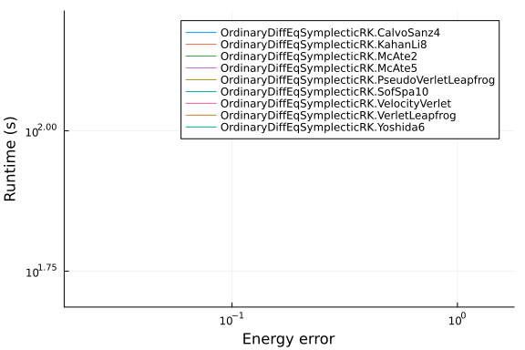
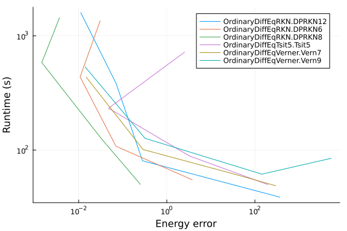
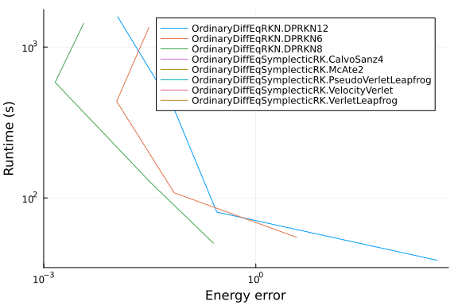

The purpose of these benchmarks is to compare several integrators for use in
molecular dynamics simulation. We will use a simulation of liquid argon form the
examples of NBodySimulator as test case.

```julia
using ProgressLogging
using NBodySimulator, OrdinaryDiffEq, OrdinaryDiffEqRKN, OrdinaryDiffEqSymplecticRK
using StaticArrays
using Plots, DataFrames, StatsPlots

function setup(t)
    T = 120.0 # K
    kb = 1.38e-23 # J/K
    ϵ = T * kb # J
    σ = 3.4e-10 # m
    ρ = 1374 # kg/m^3
    m = 39.95 * 1.6747 * 1e-27 # kg
    # See liquid_argon.jmd for the reasoning behind N=128 (was 350) and
    # R = 2.5σ (was 3.5σ, which violated the minimum-image convention since
    # the N=128 box has L/2 = 2.71σ).
    N = 128
    L = (m*N/ρ)^(1/3)
    R = 2.5σ
    v_dev = sqrt(kb * T / m) # m/s

    _L = L / σ
    _σ = 1.0
    _ϵ = 1.0
    _m = 1.0
    _v = v_dev / sqrt(ϵ / m)
    _R = R / σ

    bodies = generate_bodies_in_cell_nodes(N, _m, _v, _L)
    lj_parameters = LennardJonesParameters(_ϵ, _σ, _R)
    pbc = CubicPeriodicBoundaryConditions(_L)
    lj_system = PotentialNBodySystem(bodies, Dict(:lennard_jones => lj_parameters));
    simulation = NBodySimulation(lj_system, (0.0, t), pbc, _ϵ/T)

    return simulation
end
```

```
setup (generic function with 1 method)
```


In order to compare different integrating methods we will consider a fixed simulation
time and change the timestep (or tolerances in the case of adaptive methods).

```julia
function benchmark(energyerr, rts, bytes, allocs, nt, nf, t, configs)
    simulation = setup(t)
    prob = SecondOrderODEProblem(simulation)
    for config in configs
        alg = config.alg
        solver_kwargs = Base.structdiff(config, NamedTuple{(:alg,)})
        sol, rt,
        b,
        gc,
        memalloc = @timed solve(prob, alg();
            save_everystep = false, progress = true, progress_name = "$alg", solver_kwargs...)
        result = NBodySimulator.SimulationResult(sol, simulation)
        ΔE = total_energy(result, t) - total_energy(result, 0)
        energyerr[alg] = ΔE
        rts[alg] = rt
        bytes[alg] = b
        allocs[alg] = memalloc
        nt[alg] = sol.stats.naccept
        nf[alg] = sol.stats.nf + sol.stats.nf2
    end
end

function run_benchmark!(results, t, integrators, tol...; c = ones(length(integrators)))
    @progress "Benchmark at t=$t" for τ in zip(tol...)
        runtime = Dict()
        ΔE = Dict()
        nt = Dict()
        nf = Dict()
        b = Dict()
        allocs = Dict()
        cfg = config(integrators, c, τ...)

        GC.gc()
        benchmark(ΔE, runtime, b, allocs, nt, nf, t, cfg)
        get_tol(idx) = haskey(cfg[idx], :dt) ? cfg[idx].dt :
                       (cfg[idx].abstol, cfg[idx].reltol)

        for (idx, i) in enumerate(integrators)
            push!(results, [
                string(i), runtime[i], get_tol(idx)..., abs(ΔE[i]), nt[i], nf[i], c[idx]])
        end
    end
    return results
end
```

```
run_benchmark! (generic function with 1 method)
```


We will consider symplectic integrators first

```julia
symplectic_integrators = [
    VelocityVerlet,
    VerletLeapfrog,
    PseudoVerletLeapfrog,
    McAte2,
    CalvoSanz4,
    McAte5,
    Yoshida6,
    KahanLi8,
    SofSpa10
];
```


```julia
config(integrators, c, τ) = [(alg = a, dt = τ*cₐ) for (a, cₐ) in zip(integrators, c)]

t = 35.0
τs = 1e-3

# warmup
c_symplectic = ones(length(symplectic_integrators))
benchmark(Dict(), Dict(), Dict(), Dict(), Dict(), Dict(), 10.0,
    config(symplectic_integrators, c_symplectic, τs))

# results = DataFrame(:integrator=>String[], :runtime=>Float64[], :τ=>Float64[],
#     :EnergyError=>Float64[], :timesteps=>Int[], :f_evals=>Int[], :cost=>Float64[]);
# run_benchmark!(results, t, symplectic_integrators, τs)

# c_symplectic .= results[!, :runtime] ./ results[!, :timesteps]
# c_Verlet = c_symplectic[1]
# c_symplectic /= c_Verlet

c_symplectic = [
    1.00,   # VelocityVerlet
    1.05,   # VerletLeapfrog
    0.98,   # PseudoVerletLeapfrog
    1.02,   # McAte2
    2.38,   # CalvoSanz4
    2.92,   # McAte5
    3.74,   # Yoshida6
    8.44,   # KahanLi8
    15.76   # SofSpa10
]
```

```
9-element Vector{Float64}:
  1.0
  1.05
  0.98
  1.02
  2.38
  2.92
  3.74
  8.44
 15.76
```


We will consider a longer simulation time

```julia
t = 50.0

results = DataFrame(:integrator=>String[], :runtime=>Float64[], :τ=>Float64[],
    :EnergyError=>Float64[], :timesteps=>Int[], :f_evals=>Int[], :cost=>Float64[]);
run_benchmark!(results, t, symplectic_integrators, τs, c = c_symplectic)
```

```
9×7 DataFrame
 Row │ integrator                         runtime  τ        EnergyError  ti
mes ⋯
     │ String                             Float64  Float64  Float64      In
t64 ⋯
─────┼─────────────────────────────────────────────────────────────────────
─────
   1 │ OrdinaryDiffEqSymplecticRK.Veloc…   53.748  0.001      0.168296     
  5 ⋯
   2 │ OrdinaryDiffEqSymplecticRK.Verle…   50.245  0.00105    0.153213     
  4
   3 │ OrdinaryDiffEqSymplecticRK.Pseud…  112.095  0.00098    0.0205448    
  5
   4 │ OrdinaryDiffEqSymplecticRK.McAte2  158.124  0.00102    0.0849349    
  4
   5 │ OrdinaryDiffEqSymplecticRK.Calvo…  112.95   0.00238    0.0211669    
  2 ⋯
   6 │ OrdinaryDiffEqSymplecticRK.McAte5  127.848  0.00292    0.263421     
  1
   7 │ OrdinaryDiffEqSymplecticRK.Yoshi…  114.871  0.00374    0.443979     
  1
   8 │ OrdinaryDiffEqSymplecticRK.Kahan…  114.544  0.00844    0.113046
   9 │ OrdinaryDiffEqSymplecticRK.SofSp…  121.907  0.01576    1.56801      
    ⋯
                                                               3 columns om
itted
```


The energy error as a function of runtime is given by

```julia
@df results plot(:EnergyError, :runtime, group = :integrator,
    xscale = :log10, yscale = :log10, xlabel = "Energy error", ylabel = "Runtime (s)")
```




Now, let us compare some adaptive methods

```julia
adaptive_integrators=[
    # Non-stiff ODE methods
    Tsit5,
    Vern7,
    Vern9,
    # DPRKN
    DPRKN6,
    DPRKN8,
    DPRKN12
];
```


The Lennard-Jones potential is truncated at `R` without shifting or smoothing,
so the acceleration is discontinuous whenever a pair crosses the cutoff. Below
roughly `reltol = 1e-7` the adaptive controllers reject most of their proposed
steps at those crossings and the cost per solve diverges (measured for `Tsit5`
at N=128, `t = 10`: 5 s at `reltol = 1.2e-4`, 66 s at `1.2e-7`, 2260 s at
`1.2e-13`). At the loose end the `2^cₐ` cost scaling pushes the high-order
solvers past the point where they solve the problem at all -- in the last
published build `Vern9` at `reltol = 0.267` burned 15.4 h for an energy error
of 325. This file integrates to `t = 50`, i.e. five times the cost per
configuration of `liquid_argon.jmd`, so we use a correspondingly shorter grid
inside the range the controller can track.

```julia
function config(integrators, c, at, rt)
    [(alg = a, abstol = at*2^cₐ, reltol = rt*2^cₐ) for (a, cₐ) in zip(integrators, c)]
end

t = 35.0
ats = 10 .^ range(-8, -5, length = 4)
rts = 10 .^ range(-8, -5, length = 4)

# warmup -- this only exists to force compilation, so it runs at the *loosest*
# tolerance of the grid. It used to use `ats[1]`/`rts[1]`, i.e. the tightest,
# which made the warmup alone more expensive than the whole sweep below.
c_adaptive = ones(length(adaptive_integrators))
benchmark(Dict(), Dict(), Dict(), Dict(), Dict(), Dict(), 10.0,
    config(adaptive_integrators, 1, ats[end], rts[end]))

# results = DataFrame(:integrator=>String[], :runtime=>Float64[], :abstol=>Float64[],
#    :reltol=>Float64[], :EnergyError=>Float64[], :timesteps=>Int[], :f_evals=>Int[], :cost=>Float64[]);
# run_benchmark!(results, t, adaptive_integrators, ats[1], rts[1])

# c_adaptive .= results[!, :runtime] ./ results[!, :timesteps]
# c_adaptive /= c_Verlet

c_adaptive = [
    3.55,   # Tsit5,
    7.84,   # Vern7,
    11.38,  # Vern9
    3.56,   # DPRKN6,
    5.10,   # DPRKN8,
    8.85    # DPRKN12,
]
```

```
6-element Vector{Float64}:
  3.55
  7.84
 11.38
  3.56
  5.1
  8.85
```


We will consider a longer simulation time

```julia
t = 50.0

results = DataFrame(:integrator=>String[], :runtime=>Float64[], :abstol=>Float64[],
    :reltol=>Float64[], :EnergyError=>Float64[], :timesteps=>Int[], :f_evals=>Int[], :cost=>Float64[]);
run_benchmark!(results, t, adaptive_integrators, ats, rts, c = c_adaptive)
```

```
24×8 DataFrame
 Row │ integrator                  runtime    abstol       reltol       Ene
rgy ⋯
     │ String                      Float64    Float64      Float64      Flo
at6 ⋯
─────┼─────────────────────────────────────────────────────────────────────
─────
   1 │ OrdinaryDiffEqTsit5.Tsit5    721.73    1.17127e-7   1.17127e-7      
2.5 ⋯
   2 │ OrdinaryDiffEqVerner.Vern7   434.491   2.29126e-6   2.29126e-6      
0.0
   3 │ OrdinaryDiffEqVerner.Vern9   534.377   2.66515e-5   2.66515e-5      
0.0
   4 │ OrdinaryDiffEqRKN.DPRKN6    1355.9     1.17942e-7   1.17942e-7      
0.0
   5 │ OrdinaryDiffEqRKN.DPRKN8    1441.01    3.42968e-7   3.42968e-7      
0.0 ⋯
   6 │ OrdinaryDiffEqRKN.DPRKN12   1597.96    4.6144e-6    4.6144e-6       
0.0
   7 │ OrdinaryDiffEqTsit5.Tsit5    232.519   1.17127e-6   1.17127e-6      
0.0
   8 │ OrdinaryDiffEqVerner.Vern7   101.05    2.29126e-5   2.29126e-5      
0.2
  ⋮  │             ⋮                   ⋮           ⋮            ⋮          
    ⋱
  18 │ OrdinaryDiffEqRKN.DPRKN12     80.5576  0.00046144   0.00046144      
0.2 ⋯
  19 │ OrdinaryDiffEqTsit5.Tsit5     49.7843  0.000117127  0.000117127   19
9.2
  20 │ OrdinaryDiffEqVerner.Vern7    48.7005  0.00229126   0.00229126    29
6.2
  21 │ OrdinaryDiffEqVerner.Vern9    84.6981  0.0266515    0.0266515    540
8.1
  22 │ OrdinaryDiffEqRKN.DPRKN6      54.9263  0.000117942  0.000117942     
3.7 ⋯
  23 │ OrdinaryDiffEqRKN.DPRKN8      50.0642  0.000342968  0.000342968     
0.2
  24 │ OrdinaryDiffEqRKN.DPRKN12     38.7109  0.0046144    0.0046144     36
7.3
                                                    4 columns and 9 rows om
itted
```


The energy error as a function of runtime is given by

```julia
@df results plot(:EnergyError, :runtime, group = :integrator,
    xscale = :log10, yscale = :log10, xlabel = "Energy error", ylabel = "Runtime (s)")
```




We will now compare the best performing solvers

```julia
t = 50.0

symplectic_integrators = [
    VelocityVerlet,
    VerletLeapfrog,
    PseudoVerletLeapfrog,
    McAte2,
    CalvoSanz4
]

c_symplectic = [
    1.00,   # VelocityVerlet
    1.05,   # VerletLeapfrog
    0.98,   # PseudoVerletLeapfrog
    1.02,   # McAte2
    2.38   # CalvoSanz4
]

results1 = DataFrame(:integrator=>String[], :runtime=>Float64[], :τ=>Float64[],
    :EnergyError=>Float64[], :timesteps=>Int[], :f_evals=>Int[], :cost=>Float64[]);
run_benchmark!(results1, t, symplectic_integrators, τs, c = c_symplectic)

adaptive_integrators=[
    DPRKN6,
    DPRKN8,
    DPRKN12
]

c_adaptive = [
    3.56,   # DPRKN6,
    5.10,   # DPRKN8,
    8.85    # DPRKN12,
]

results2 = DataFrame(:integrator=>String[], :runtime=>Float64[], :abstol=>Float64[],
    :reltol=>Float64[], :EnergyError=>Float64[], :timesteps=>Int[], :f_evals=>Int[], :cost=>Float64[]);
run_benchmark!(results2, t, adaptive_integrators, ats, rts, c = c_adaptive)

append!(results1, results2, cols = :union)
results1
```

```
17×9 DataFrame
 Row │ integrator                         runtime    τ              EnergyE
rro ⋯
     │ String                             Float64    Float64?       Float64
    ⋯
─────┼─────────────────────────────────────────────────────────────────────
─────
   1 │ OrdinaryDiffEqSymplecticRK.Veloc…    53.6056        0.001      0.168
296 ⋯
   2 │ OrdinaryDiffEqSymplecticRK.Verle…    50.2723        0.00105    0.153
213
   3 │ OrdinaryDiffEqSymplecticRK.Pseud…   112.079         0.00098    0.020
544
   4 │ OrdinaryDiffEqSymplecticRK.McAte2   158.264         0.00102    0.084
934
   5 │ OrdinaryDiffEqSymplecticRK.Calvo…   112.869         0.00238    0.021
166 ⋯
   6 │ OrdinaryDiffEqRKN.DPRKN6           1349.02    missing          0.030
693
   7 │ OrdinaryDiffEqRKN.DPRKN8           1434.62    missing          0.003
665
   8 │ OrdinaryDiffEqRKN.DPRKN12          1589.05    missing          0.011
096
   9 │ OrdinaryDiffEqRKN.DPRKN6            436.565   missing          0.010
749 ⋯
  10 │ OrdinaryDiffEqRKN.DPRKN8            583.28    missing          0.001
448
  11 │ OrdinaryDiffEqRKN.DPRKN12           380.1     missing          0.070
990
  12 │ OrdinaryDiffEqRKN.DPRKN6            108.072   missing          0.069
964
  13 │ OrdinaryDiffEqRKN.DPRKN8            126.433   missing          0.032
417 ⋯
  14 │ OrdinaryDiffEqRKN.DPRKN12            80.5453  missing          0.280
632
  15 │ OrdinaryDiffEqRKN.DPRKN6             54.7975  missing          3.769
84
  16 │ OrdinaryDiffEqRKN.DPRKN8             50.1205  missing          0.251
141
  17 │ OrdinaryDiffEqRKN.DPRKN12            38.6     missing        367.325
    ⋯
                                                               6 columns om
itted
```


The energy error as a function of runtime is given by

```julia
@df results1 plot(:EnergyError, :runtime, group = :integrator,
    xscale = :log10, yscale = :log10, xlabel = "Energy error", ylabel = "Runtime (s)")
```




## Appendix

These benchmarks are a part of the SciMLBenchmarks.jl repository, found at: [https://github.com/SciML/SciMLBenchmarks.jl](https://github.com/SciML/SciMLBenchmarks.jl). For more information on high-performance scientific machine learning, check out the SciML Open Source Software Organization [https://sciml.ai](https://sciml.ai).

To locally run this benchmark, do the following commands:

```
using SciMLBenchmarks
SciMLBenchmarks.weave_file("benchmarks/NBodySimulator","liquid_argon_long.jmd")
```

Computer Information:

```
Julia Version 1.11.9
Commit 53a02c0720c (2026-02-06 00:27 UTC)
Build Info:
  Official https://julialang.org/ release
Platform Info:
  OS: Linux (x86_64-linux-gnu)
  CPU: 128 × AMD EPYC 7502 32-Core Processor
  WORD_SIZE: 64
  LLVM: libLLVM-16.0.6 (ORCJIT, znver2)
Threads: 128 default, 0 interactive, 64 GC (on 128 virtual cores)
Environment:
  JULIA_NUM_THREADS = auto

```

Package Information:

```
Status `~/github-runners/amdci3-1/_work/SciMLBenchmarks.jl/SciMLBenchmarks.jl/benchmarks/NBodySimulator/Project.toml`
  [6e4b80f9] BenchmarkTools v1.8.0
  [a93c6f00] DataFrames v1.8.2
⌃ [0e6f8da7] NBodySimulator v1.15.0
  [1dea7af3] OrdinaryDiffEq v7.7.0
  [af6ede74] OrdinaryDiffEqRKN v2.2.0
⌃ [fa646aed] OrdinaryDiffEqSymplecticRK v2.2.1
  [91a5bcdd] Plots v1.41.7
  [33c8b6b6] ProgressLogging v0.1.6
⌃ [31c91b34] SciMLBenchmarks v0.1.3
  [90137ffa] StaticArrays v1.9.19
  [f3b207a7] StatsPlots v0.15.8
Info Packages marked with ⌃ have new versions available and may be upgradable.
```

And the full manifest:

```
Status `~/github-runners/amdci3-1/_work/SciMLBenchmarks.jl/SciMLBenchmarks.jl/benchmarks/NBodySimulator/Manifest.toml`
  [47edcb42] ADTypes v1.24.0
  [14f7f29c] AMD v0.5.3
  [621f4979] AbstractFFTs v1.5.0
  [1520ce14] AbstractTrees v0.4.5
  [7d9f7c33] Accessors v0.1.45
  [79e6a3ab] Adapt v4.7.0
  [66dad0bd] AliasTables v1.1.3
  [7d9fca2a] Arpack v0.5.4
  [4fba245c] ArrayInterface v7.30.0
  [13072b0f] AxisAlgorithms v1.1.0
  [6e4b80f9] BenchmarkTools v1.8.0
  [b2a6c25c] BinaryHeaps v1.1.0
  [d1d4a3ce] BitFlags v0.1.10
⌃ [70df07ce] BracketingNonlinearSolve v1.12.5
  [d360d2e6] ChainRulesCore v1.26.1
  [aaaa29a8] Clustering v0.15.8
  [944b1d66] CodecZlib v0.7.9
  [35d6a980] ColorSchemes v3.31.0
  [3da002f7] ColorTypes v0.12.1
  [c3611d14] ColorVectorSpace v0.11.0
  [5ae59095] Colors v0.13.1
  [38540f10] CommonSolve v0.2.14
  [bbf7d656] CommonSubexpressions v0.3.1
  [34da2185] Compat v4.18.1
  [a33af91c] CompositionsBase v0.1.2
  [2569d6c7] ConcreteStructs v0.2.8
  [f0e56b4a] ConcurrentUtilities v2.6.0
  [8f4d0f93] Conda v1.10.3
  [187b0558] ConstructionBase v1.6.0
  [d38c429a] Contour v0.6.3
  [a8cc5b0e] Crayons v4.2.0
  [9a962f9c] DataAPI v1.16.0
  [a93c6f00] DataFrames v1.8.2
  [864edb3b] DataStructures v0.19.6
  [e2d170a0] DataValueInterfaces v1.0.0
  [8bb1440f] DelimitedFiles v1.9.1
  [2b5f629d] DiffEqBase v7.18.2
  [163ba53b] DiffResults v1.1.0
  [b552c78f] DiffRules v1.16.0
  [a0c0ee7d] DifferentiationInterface v0.7.21
  [b4f34e82] Distances v0.10.12
  [31c24e10] Distributions v0.25.131
  [ffbed154] DocStringExtensions v0.9.5
  [4e289a0a] EnumX v1.0.7
  [f151be2c] EnzymeCore v0.8.21
  [460bff9d] ExceptionUnwrapping v0.1.11
  [e2ba6199] ExprTools v0.1.11
  [c87230d0] FFMPEG v0.4.5
  [b86e33f2] FFTA v0.3.1
  [7034ab61] FastBroadcast v1.4.0
  [9aa1b823] FastClosures v0.3.2
  [a4df4552] FastPower v1.5.0
  [5789e2e9] FileIO v1.20.0
  [1a297f60] FillArrays v1.17.0
  [64ca27bc] FindFirstFunctions v3.2.1
  [6a86dc24] FiniteDiff v2.33.0
⌅ [53c48c17] FixedPointNumbers v0.8.6
  [1fa38f19] Format v1.3.7
  [f6369f11] ForwardDiff v1.4.5
  [069b7b12] FunctionWrappers v1.1.3
  [77dc65aa] FunctionWrappersWrappers v1.13.0
  [46192b85] GPUArraysCore v0.2.0
⌃ [28b8d3ca] GR v0.73.26
  [a0844989] Gamma v1.2.0
  [d7ba0133] Git v1.5.0
  [42e2da0e] Grisu v1.0.2
⌅ [cd3eb016] HTTP v1.11.0
⌅ [eafb193a] Highlights v0.5.3
  [34004b35] HypergeometricFunctions v0.3.30
  [7073ff75] IJulia v1.34.4
  [842dd82b] InlineStrings v1.4.5
  [18e54dd8] IntegerMathUtils v0.1.4
  [a98d9a8b] Interpolations v0.16.3
  [3587e190] InverseFunctions v0.1.17
  [41ab1584] InvertedIndices v1.3.1
  [92d709cd] IrrationalConstants v0.2.6
  [82899510] IteratorInterfaceExtensions v1.0.0
  [1019f520] JLFzf v0.1.11
  [692b3bcd] JLLWrappers v1.8.0
⌅ [682c06a0] JSON v0.21.4
  [5ab0869b] KernelDensity v0.6.12
  [ba0b0d4f] Krylov v0.10.9
  [2faa5264] LHLFactorization v2.2.0
  [b964fa9f] LaTeXStrings v1.4.1
  [23fbe1c1] Latexify v0.16.12
  [87fe0de2] LineSearch v0.1.16
⌃ [7ed4a6bd] LinearSolve v5.13.0
  [2ab3a3ac] LogExpFunctions v1.0.1
  [e6f89c97] LoggingExtras v1.2.0
  [1914dd2f] MacroTools v0.5.16
  [bb5d69b7] MaybeInplace v0.1.8
  [739be429] MbedTLS v1.1.10
  [442fdcdd] Measures v0.3.3
  [e1d29d7a] Missings v1.2.0
  [46d2c3a1] MuladdMacro v0.2.7
  [6f286f6a] MultivariateStats v0.10.5
  [ffc61752] Mustache v1.0.21
⌃ [0e6f8da7] NBodySimulator v1.15.0
  [77ba4419] NaNMath v1.1.4
  [b8a86587] NearestNeighbors v0.4.29
  [8913a72c] NonlinearSolve v4.28.0
⌃ [be0214bd] NonlinearSolveBase v2.47.0
⌃ [5959db7a] NonlinearSolveFirstOrder v2.4.0
⌃ [9a2c21bd] NonlinearSolveQuasiNewton v1.15.1
⌃ [26075421] NonlinearSolveSpectralMethods v1.8.0
  [510215fc] Observables v0.5.5
  [6fe1bfb0] OffsetArrays v1.17.0
  [4d8831e6] OpenSSL v1.6.1
  [bac558e1] OrderedCollections v2.0.1
  [1dea7af3] OrdinaryDiffEq v7.7.0
  [6ad6398a] OrdinaryDiffEqBDF v2.4.4
⌃ [bbf590c4] OrdinaryDiffEqCore v4.15.0
  [50262376] OrdinaryDiffEqDefault v2.5.0
  [4302a76b] OrdinaryDiffEqDifferentiation v3.10.0
  [127b3ac7] OrdinaryDiffEqNonlinearSolve v2.9.0
  [af6ede74] OrdinaryDiffEqRKN v2.2.0
  [43230ef6] OrdinaryDiffEqRosenbrock v2.7.0
⌃ [b4bd8bb3] OrdinaryDiffEqRosenbrockTableaus v2.4.1
  [2d112036] OrdinaryDiffEqSDIRK v2.9.0
⌃ [fa646aed] OrdinaryDiffEqSymplecticRK v2.2.1
⌃ [b1df2697] OrdinaryDiffEqTsit5 v2.1.3
  [79d7bb75] OrdinaryDiffEqVerner v2.4.0
  [90014a1f] PDMats v0.11.41
⌅ [69de0a69] Parsers v2.8.7
  [ccf2f8ad] PlotThemes v3.3.0
  [995b91a9] PlotUtils v1.4.4
  [91a5bcdd] Plots v1.41.7
  [2dfb63ee] PooledArrays v1.4.3
  [d236fae5] PreallocationTools v1.6.0
⌅ [aea7be01] PrecompileTools v1.2.1
  [21216c6a] Preferences v1.5.2
  [08abe8d2] PrettyTables v3.4.8
  [27ebfcd6] Primes v0.5.7
  [33c8b6b6] ProgressLogging v0.1.6
  [43287f4e] PtrArrays v1.4.0
  [0c0d3e7f] PureKLU v1.4.1
  [1fd47b50] QuadGK v2.11.3
  [c84ed2f1] Ratios v0.4.5
  [3cdcf5f2] RecipesBase v1.3.4
  [01d81517] RecipesPipeline v0.6.12
  [731186ca] RecursiveArrayTools v4.5.0
  [189a3867] Reexport v1.2.2
  [05181044] RelocatableFolders v1.0.1
  [ae029012] Requires v1.3.1
  [9fe22ead] RespecializeParams v1.3.0
  [79098fc4] Rmath v0.9.0
  [f2b01f46] Roots v3.0.7
  [7e49a35a] RuntimeGeneratedFunctions v0.5.25
  [0bca4576] SciMLBase v3.49.2
⌃ [31c91b34] SciMLBenchmarks v0.1.3
⌃ [19f34311] SciMLJacobianOperators v0.1.17
  [a6db7da4] SciMLLogging v2.1.0
  [c0aeaf25] SciMLOperators v1.29.0
  [431bcebd] SciMLPublic v1.3.0
⌃ [53ae85a6] SciMLStructures v1.10.4
  [6c6a2e73] Scratch v1.3.0
  [91c51154] SentinelArrays v1.4.10
  [efcf1570] Setfield v1.1.2
  [992d4aef] Showoff v1.0.3
  [777ac1f9] SimpleBufferStream v1.2.0
⌃ [727e6d20] SimpleNonlinearSolve v2.14.0
  [a2af1166] SortingAlgorithms v1.2.3
  [a57abbd0] SparseColumnPivotedQR v2.1.7
  [0a514795] SparseMatrixColorings v0.4.27
  [276daf66] SpecialFunctions v2.9.0
  [860ef19b] StableRNGs v1.0.4
  [90137ffa] StaticArrays v1.9.19
  [1e83bf80] StaticArraysCore v1.4.4
  [10745b16] Statistics v1.11.1
  [82ae8749] StatsAPI v1.8.0
  [2913bbd2] StatsBase v0.34.13
  [4c63d2b9] StatsFuns v2.2.1
  [f3b207a7] StatsPlots v0.15.8
  [69024149] StringEncodings v0.3.7
  [892a3eda] StringManipulation v0.5.0
  [2efcf032] SymbolicIndexingInterface v0.3.55
  [ab02a1b2] TableOperations v1.2.0
  [3783bdb8] TableTraits v1.0.1
  [bd369af6] Tables v1.14.0
  [62fd8b95] TensorCore v0.1.1
  [a759f4b9] TimerOutputs v1.2.0
  [3bb67fe8] TranscodingStreams v0.11.3
  [781d530d] TruncatedStacktraces v1.4.0
  [5c2747f8] URIs v1.7.0
  [1cfade01] UnicodeFun v0.4.1
  [41fe7b60] Unzip v0.2.0
  [81def892] VersionParsing v1.3.0
  [44d3d7a6] Weave v0.10.12
  [cc8bc4a8] Widgets v0.6.8
  [efce3f68] WoodburyMatrices v1.1.0
  [ddb6d928] YAML v0.4.16
  [c2297ded] ZMQ v1.5.1
⌅ [68821587] Arpack_jll v3.5.2+0
  [6e34b625] Bzip2_jll v1.0.9+0
  [83423d85] Cairo_jll v1.18.7+0
  [ee1fde0b] Dbus_jll v1.16.2+0
  [2702e6a9] EpollShim_jll v0.0.20230411+1
  [2e619515] Expat_jll v2.8.3+0
⌅ [b22a6f82] FFMPEG_jll v8.1.2+0
  [a3f928ae] Fontconfig_jll v2.17.1+0
  [d7e528f0] FreeType2_jll v2.14.3+1
  [559328eb] FriBidi_jll v1.0.17+0
⌃ [0656b61e] GLFW_jll v3.4.1+1
⌅ [d2c73de3] GR_jll v0.73.26+0
⌅ [b0724c58] GettextRuntime_jll v0.22.4+0
  [61579ee1] Ghostscript_jll v9.55.1+0
  [020c3dae] Git_LFS_jll v3.7.1+0
  [f8c6e375] Git_jll v2.55.0+0
  [7746bdde] Glib_jll v2.88.3+0
  [3b182d85] Graphite2_jll v1.3.16+0
⌅ [2e76f6c2] HarfBuzz_jll v8.5.1+0
  [1d5cc7b8] IntelOpenMP_jll v2025.2.0+0
  [aacddb02] JpegTurbo_jll v3.2.0+1
  [c1c5ebd0] LAME_jll v3.100.3+0
  [88015f11] LERC_jll v4.1.0+0
  [1d63c593] LLVMOpenMP_jll v22.1.7+0
⌅ [e9f186c6] Libffi_jll v3.4.7+0
  [7e76a0d4] Libglvnd_jll v1.7.1+1
  [94ce4f54] Libiconv_jll v1.18.0+0
  [4b2f31a3] Libmount_jll v2.42.0+0
  [89763e89] Libtiff_jll v4.7.3+0
  [38a345b3] Libuuid_jll v2.42.0+0
  [856f044c] MKL_jll v2025.2.0+0
  [e7412a2a] Ogg_jll v1.3.6+0
  [9bd350c2] OpenSSH_jll v10.5.1+0
  [458c3c95] OpenSSL_jll v3.5.7+0
  [efe28fd5] OpenSpecFun_jll v0.5.6+0
  [91d4177d] Opus_jll v1.6.1+0
  [36c8627f] Pango_jll v1.58.0+0
  [30392449] Pixman_jll v0.46.4+0
  [c0090381] Qt6Base_jll v6.10.2+2
  [629bc702] Qt6Declarative_jll v6.10.2+2
  [ce943373] Qt6ShaderTools_jll v6.10.2+1
  [6de9746b] Qt6Svg_jll v6.10.2+0
  [e99dba38] Qt6Wayland_jll v6.10.2+1
  [f50d1b31] Rmath_jll v0.5.2+0
  [a44049a8] Vulkan_Loader_jll v1.3.243+0
  [a2964d1f] Wayland_jll v1.24.0+0
  [ffd25f8a] XZ_jll v5.8.3+0
  [f67eecfb] Xorg_libICE_jll v1.1.2+0
  [c834827a] Xorg_libSM_jll v1.2.6+0
  [4f6342f7] Xorg_libX11_jll v1.8.13+0
  [0c0b7dd1] Xorg_libXau_jll v1.0.13+0
  [935fb764] Xorg_libXcursor_jll v1.2.4+0
  [a3789734] Xorg_libXdmcp_jll v1.1.6+0
  [1082639a] Xorg_libXext_jll v1.3.8+0
  [d091e8ba] Xorg_libXfixes_jll v6.0.2+0
  [a51aa0fd] Xorg_libXi_jll v1.8.4+0
  [d1454406] Xorg_libXinerama_jll v1.1.7+0
  [ec84b674] Xorg_libXrandr_jll v1.5.6+0
  [ea2f1a96] Xorg_libXrender_jll v0.9.12+0
  [a65dc6b1] Xorg_libpciaccess_jll v0.19.0+0
  [c7cfdc94] Xorg_libxcb_jll v1.17.1+0
  [cc61e674] Xorg_libxkbfile_jll v1.2.0+0
  [e920d4aa] Xorg_xcb_util_cursor_jll v0.1.6+0
  [12413925] Xorg_xcb_util_image_jll v0.4.1+0
  [2def613f] Xorg_xcb_util_jll v0.4.1+0
  [975044d2] Xorg_xcb_util_keysyms_jll v0.4.1+0
  [0d47668e] Xorg_xcb_util_renderutil_jll v0.3.10+0
  [c22f9ab0] Xorg_xcb_util_wm_jll v0.4.2+0
  [35661453] Xorg_xkbcomp_jll v1.4.7+0
  [33bec58e] Xorg_xkeyboard_config_jll v2.47.0+2
  [c5fb5394] Xorg_xtrans_jll v1.6.0+0
  [8f1865be] ZeroMQ_jll v4.3.6+0
  [3161d3a3] Zstd_jll v1.5.7+1
  [35ca27e7] eudev_jll v3.2.14+0
⌅ [214eeab7] fzf_jll v0.61.1+0
  [a4ae2306] libaom_jll v3.14.1+0
  [0ac62f75] libass_jll v0.17.4+0
  [1183f4f0] libdecor_jll v0.2.2+0
  [8e53e030] libdrm_jll v2.4.134+0
  [2db6ffa8] libevdev_jll v1.13.4+0
  [f638f0a6] libfdk_aac_jll v2.0.4+0
  [36db933b] libinput_jll v1.28.1+0
  [b53b4c65] libpng_jll v1.6.58+0
  [a9144af2] libsodium_jll v1.0.21+0
  [9a156e7d] libva_jll v2.23.0+0
  [f27f6e37] libvorbis_jll v1.3.8+0
  [009596ad] mtdev_jll v1.1.7+0
  [1317d2d5] oneTBB_jll v2022.3.0+0
⌅ [1270edf5] x264_jll v10164.0.1+0
  [dfaa095f] x265_jll v4.1.0+0
  [d8fb68d0] xkbcommon_jll v1.13.0+0
  [0dad84c5] ArgTools v1.1.2
  [56f22d72] Artifacts v1.11.0
  [2a0f44e3] Base64 v1.11.0
  [ade2ca70] Dates v1.11.0
  [8ba89e20] Distributed v1.11.0
  [f43a241f] Downloads v1.6.0
  [7b1f6079] FileWatching v1.11.0
  [9fa8497b] Future v1.11.0
  [b77e0a4c] InteractiveUtils v1.11.0
  [4af54fe1] LazyArtifacts v1.11.0
  [b27032c2] LibCURL v0.6.4
  [76f85450] LibGit2 v1.11.0
  [8f399da3] Libdl v1.11.0
  [37e2e46d] LinearAlgebra v1.11.0
  [56ddb016] Logging v1.11.0
  [d6f4376e] Markdown v1.11.0
  [a63ad114] Mmap v1.11.0
  [ca575930] NetworkOptions v1.2.0
  [44cfe95a] Pkg v1.11.0
  [de0858da] Printf v1.11.0
  [9abbd945] Profile v1.11.0
  [3fa0cd96] REPL v1.11.0
  [9a3f8284] Random v1.11.0
  [ea8e919c] SHA v0.7.0
  [9e88b42a] Serialization v1.11.0
  [1a1011a3] SharedArrays v1.11.0
  [6462fe0b] Sockets v1.11.0
  [2f01184e] SparseArrays v1.11.0
  [f489334b] StyledStrings v1.11.0
  [4607b0f0] SuiteSparse
  [fa267f1f] TOML v1.0.3
  [a4e569a6] Tar v1.10.0
  [8dfed614] Test v1.11.0
  [cf7118a7] UUIDs v1.11.0
  [4ec0a83e] Unicode v1.11.0
  [e66e0078] CompilerSupportLibraries_jll v1.1.1+0
  [deac9b47] LibCURL_jll v8.6.0+0
  [e37daf67] LibGit2_jll v1.7.2+0
  [29816b5a] LibSSH2_jll v1.11.0+1
  [c8ffd9c3] MbedTLS_jll v2.28.6+0
  [14a3606d] MozillaCACerts_jll v2023.12.12
  [4536629a] OpenBLAS_jll v0.3.27+1
  [05823500] OpenLibm_jll v0.8.5+0
  [efcefdf7] PCRE2_jll v10.42.0+1
  [bea87d4a] SuiteSparse_jll v7.7.0+0
  [83775a58] Zlib_jll v1.2.13+1
  [8e850b90] libblastrampoline_jll v5.11.0+0
  [8e850ede] nghttp2_jll v1.59.0+0
  [3f19e933] p7zip_jll v17.4.0+2
Info Packages marked with ⌃ and ⌅ have new versions available. Those with ⌃ may be upgradable, but those with ⌅ are restricted by compatibility constraints from upgrading. To see why use `status --outdated -m`
```

