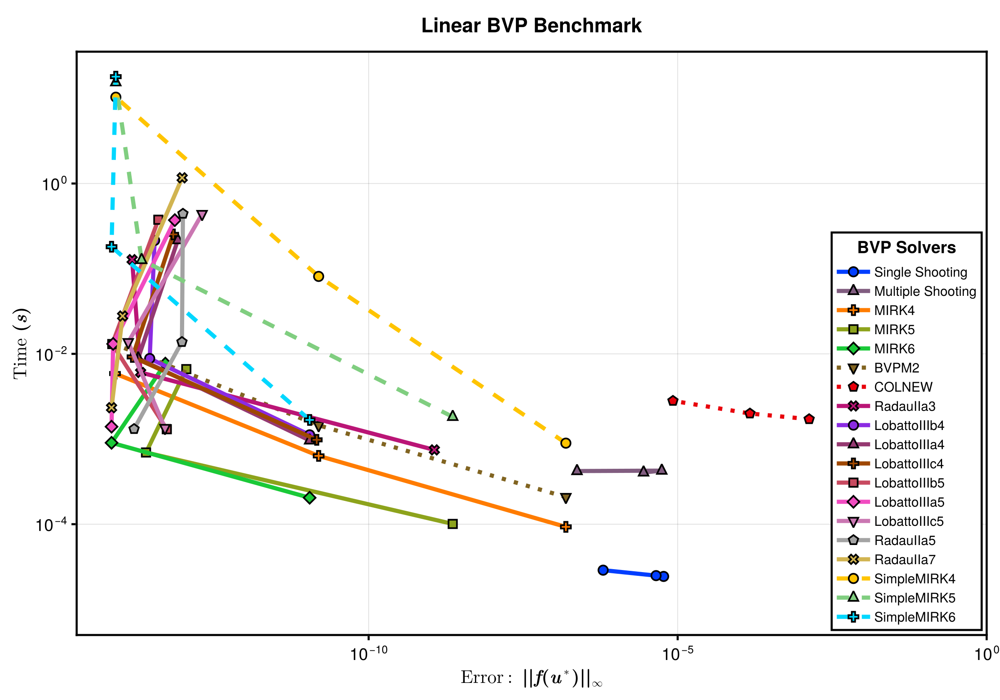
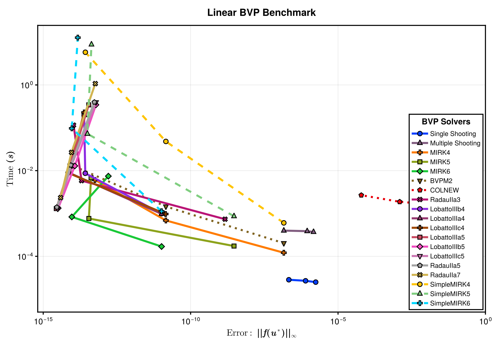
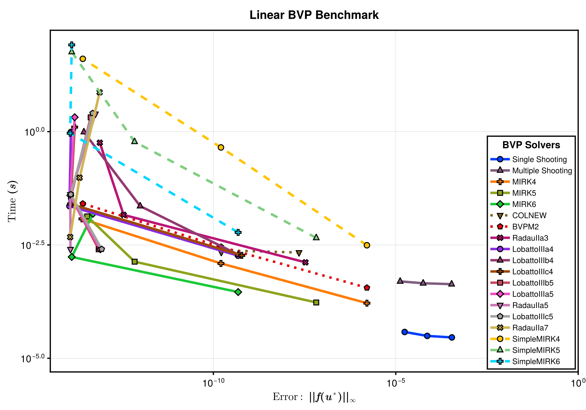
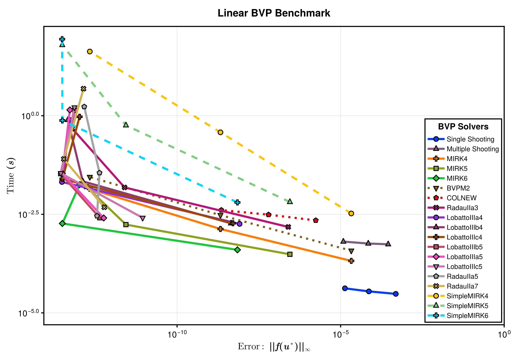
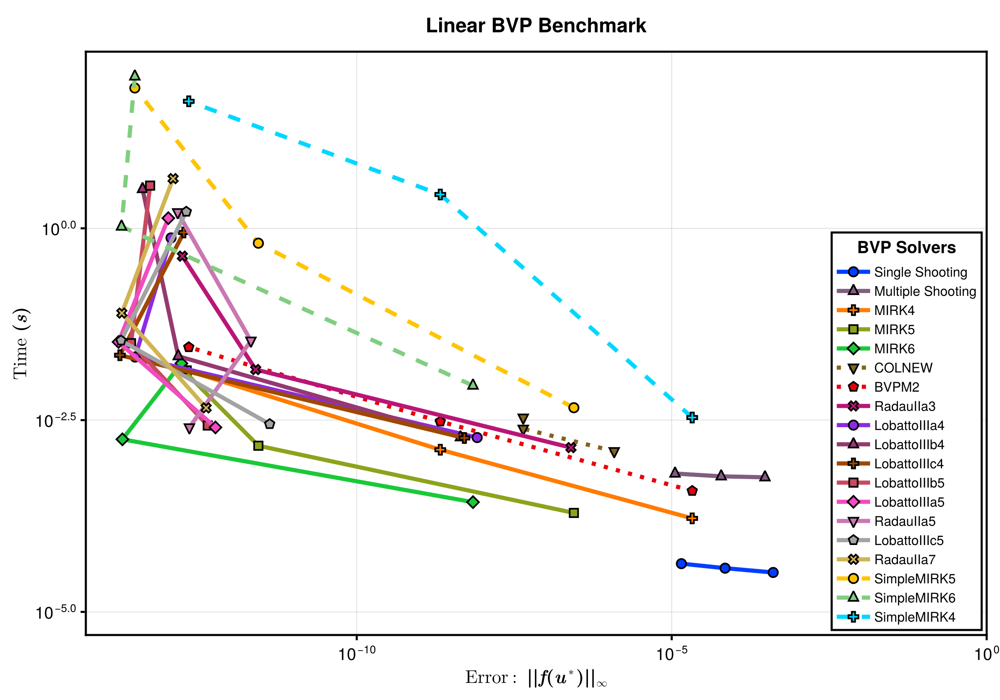
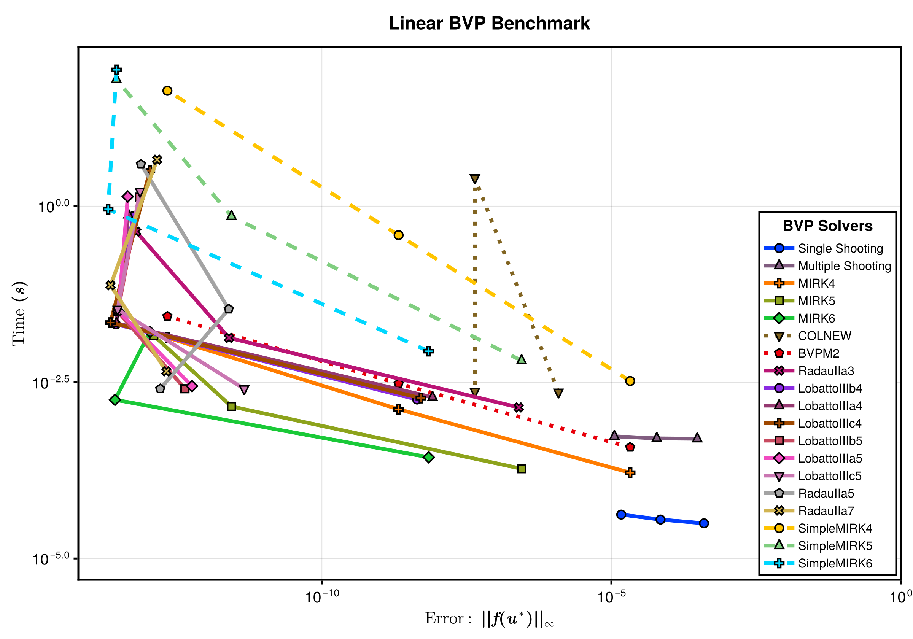
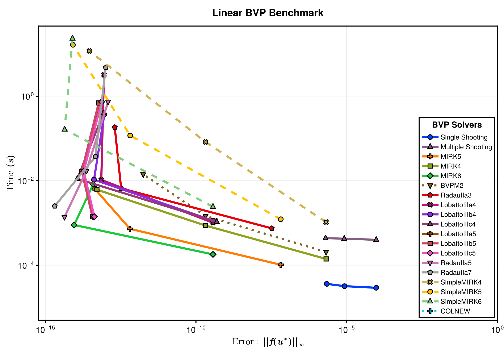

This is a benchmark of MIRK methods and Shooting method on some linear boundary value problems. The testing BVPs are a set of standard BVP test problems as described [here](https://archimede.uniba.it/~bvpsolvers/testsetbvpsolvers/?page_id=29)

# Setup

Fetch required packages.

```julia
using BoundaryValueDiffEq, OrdinaryDiffEq, ODEInterface, DiffEqDevTools, BenchmarkTools, BVProblemLibrary, Plots
```


Set up the benchmarked solvers.

```julia
setups = [ Dict(:alg=>MIRK2(), :dts=>1.0 ./ 10.0 .^ (1:4)),
            Dict(:alg=>MIRK3(), :dts=>1.0 ./ 10.0 .^ (1:4)),
            Dict(:alg=>MIRK4(), :dts=>1.0 ./ 10.0 .^ (1:4)),
            Dict(:alg=>MIRK5(), :dts=>1.0 ./ 10.0 .^ (1:4)),
            Dict(:alg=>MIRK6(), :dts=>1.0 ./ 10.0 .^ (1:4)),
            Dict(:alg=>BVPM2(), :dts=>1.0 ./ 7.0 .^ (1:4)),
            Dict(:alg=>Shooting(Tsit5())),
            Dict(:alg=>Shooting(Vern7())),
            Dict(:alg=>Shooting(DP5())),]
labels = ["MIRK2";
               "MIRK3";
               "MIRK4";
               "MIRK5";
               "MIRK6";
               "BVPM2";
               "Shooting (Tsit5)";
               "Shooting (Vern7)";
               "Shooting (DP5)"];
```


Sets tolerances.

```julia
abstols = 1.0 ./ 10.0 .^ (1:3)
reltols = 1.0 ./ 10.0 .^ (1:3);
```


# Benchmarks

We here run the BVP benchmarks for all the MIRK methods and single shooting method.

## Linear boundary value problems

### Linear BVP 1

```julia
prob_1 = BVProblemLibrary.prob_bvp_linear_1
sol_1 = solve(prob_1, Shooting(Vern7()), abstol=1e-14, reltol=1e-14)
testsol_1 = TestSolution(sol_1.t, sol_1.u)
wp_1 = WorkPrecisionSet(prob_1, abstols, reltols, setups; names = labels, print_names = true, appxsol = testsol_1, maxiters=Int(1e5))
plot(wp_1)
```

```
MIRK2
MIRK3
MIRK4
MIRK5
MIRK6
BVPM2
Shooting (Tsit5)
Shooting (Vern7)
Shooting (DP5)
```


### Linear BVP 2

```julia
prob_2 = BVProblemLibrary.prob_bvp_linear_2
sol_2 = solve(prob_2, Shooting(Vern7()), abstol=1e-14, reltol=1e-14)
testsol_2 = TestSolution(sol_2.t, sol_2.u)
wp_2 = WorkPrecisionSet(prob_2, abstols, reltols, setups; names = labels, print_names = true, appxsol = testsol_2, maxiters=Int(1e5))
plot(wp_2)
```

```
MIRK2
MIRK3
MIRK4
MIRK5
MIRK6
BVPM2
Shooting (Tsit5)
Shooting (Vern7)
Shooting (DP5)
```





### Linear BVP 3

```julia
prob_3 = BVProblemLibrary.prob_bvp_linear_3
sol_3 = solve(prob_3, Shooting(Vern7()), abstol=1e-14, reltol=1e-14)
testsol_3 = TestSolution(sol_3.t, sol_3.u)
wp_3 = WorkPrecisionSet(prob_3, abstols, reltols, setups; names = labels, print_names = true, appxsol = testsol_3, maxiters=Int(1e4))
plot(wp_3)
```

```
MIRK2
MIRK3
MIRK4
MIRK5
MIRK6
BVPM2
Shooting (Tsit5)
Shooting (Vern7)
Shooting (DP5)
```





### Linear BVP 4

```julia
prob_4 = BVProblemLibrary.prob_bvp_linear_4
sol_4 = solve(prob_4, Shooting(Vern7()), abstol=1e-14, reltol=1e-14)
testsol_4 = TestSolution(sol_4.t, sol_4.u)
wp_4 = WorkPrecisionSet(prob_4, abstols, reltols, setups; names = labels, print_names = true, appxsol = testsol_4, maxiters=Int(1e4))
plot(wp_4)
```

```
MIRK2
MIRK3
MIRK4
MIRK5
MIRK6
BVPM2
Shooting (Tsit5)
Shooting (Vern7)
Shooting (DP5)
```


### Linear BVP 5

```julia
prob_5 = BVProblemLibrary.prob_bvp_linear_5
sol_5 = solve(prob_5, Shooting(Vern7()), abstol=1e-14, reltol=1e-14)
testsol_5 = TestSolution(sol_5.t, sol_5.u)
wp_5 = WorkPrecisionSet(prob_5, abstols, reltols, setups; names = labels, print_names = true, appxsol = testsol_5, maxiters=Int(1e4))
plot(wp_5)
```

```
MIRK2
MIRK3
MIRK4
MIRK5
MIRK6
BVPM2
Shooting (Tsit5)
Shooting (Vern7)
Shooting (DP5)
```





### Linear BVP 6

```julia
prob_6 = BVProblemLibrary.prob_bvp_linear_6
sol_6 = solve(prob_6, Shooting(Vern7()), abstol=1e-14, reltol=1e-14)
testsol_6 = TestSolution(sol_6.t, sol_6.u)
wp_6 = WorkPrecisionSet(prob_6, abstols, reltols, setups; names = labels, print_names = true, appxsol = testsol_6, maxiters=Int(1e4))
plot(wp_6)
```

```
MIRK2
MIRK3
MIRK4
MIRK5
MIRK6
BVPM2
Shooting (Tsit5)
Shooting (Vern7)
Shooting (DP5)
```


### Linear BVP 7

```julia
prob_7 = BVProblemLibrary.prob_bvp_linear_7
sol_7 = solve(prob_7, Shooting(Vern7()), abstol=1e-14, reltol=1e-14)
testsol_7 = TestSolution(sol_7.t, sol_7.u)
wp_7 = WorkPrecisionSet(prob_7, abstols, reltols, setups; names = labels, print_names = true, appxsol = testsol_7, maxiters=Int(1e4))
plot(wp_7)
```

```
MIRK2
MIRK3
MIRK4
MIRK5
MIRK6
BVPM2
Shooting (Tsit5)
Shooting (Vern7)
Shooting (DP5)
```


### Linear BVP 8

```julia
prob_8 = BVProblemLibrary.prob_bvp_linear_8
sol_8 = solve(prob_8, Shooting(Vern7()), abstol=1e-14, reltol=1e-14)
testsol_8 = TestSolution(sol_8.t, sol_8.u)
wp_8 = WorkPrecisionSet(prob_8, abstols, reltols, setups; names = labels, print_names = true, appxsol = testsol_8, maxiters=Int(1e4))
plot(wp_8)
```

```
MIRK2
MIRK3
MIRK4
MIRK5
MIRK6
BVPM2
Shooting (Tsit5)
Shooting (Vern7)
Shooting (DP5)
```


### Linear BVP 9

```julia
prob_9 = BVProblemLibrary.prob_bvp_linear_9
sol_9 = solve(prob_9, Shooting(Vern7()), abstol=1e-14, reltol=1e-14)
testsol_9 = TestSolution(sol_9.t, sol_9.u)
wp_9 = WorkPrecisionSet(prob_9, abstols, reltols, setups; names = labels, print_names = true, appxsol = testsol_9, maxiters=Int(1e4))
plot(wp_9)
```

```
MIRK2
MIRK3
MIRK4
MIRK5
MIRK6
BVPM2
Shooting (Tsit5)
Shooting (Vern7)
Shooting (DP5)
```


### Linear BVP 10

```julia
prob_10 = BVProblemLibrary.prob_bvp_linear_10
sol_10 = solve(prob_10, Shooting(Vern7()), abstol=1e-14, reltol=1e-14)
testsol_10 = TestSolution(sol_10.t, sol_10.u)
wp_10 = WorkPrecisionSet(prob_10, abstols, reltols, setups; names = labels, print_names = true, appxsol = testsol_10, maxiters=Int(1e4))
plot(wp_10)
```

```
MIRK2
MIRK3
MIRK4
MIRK5
MIRK6
BVPM2
Shooting (Tsit5)
Shooting (Vern7)
Shooting (DP5)
```


### Linear BVP 11

```julia
prob_11 = BVProblemLibrary.prob_bvp_linear_11
sol_11 = solve(prob_11, Shooting(Vern7()), abstol=1e-14, reltol=1e-14)
testsol_11 = TestSolution(sol_11.t, sol_11.u)
wp_11 = WorkPrecisionSet(prob_11, abstols, reltols, setups; names = labels, print_names = true, appxsol = testsol_11, maxiters=Int(1e4))
plot(wp_11)
```

```
MIRK2
MIRK3
MIRK4
MIRK5
MIRK6
BVPM2
Shooting (Tsit5)
Shooting (Vern7)
Shooting (DP5)
```


### Linear BVP 12

```julia
prob_12 = BVProblemLibrary.prob_bvp_linear_12
sol_12 = solve(prob_12, Shooting(Vern7()), abstol=1e-14, reltol=1e-14)
testsol_12 = TestSolution(sol_12.t, sol_12.u)
wp_12 = WorkPrecisionSet(prob_12, abstols, reltols, setups; names = labels, print_names = true, appxsol = testsol_12, maxiters=Int(1e4))
plot(wp_12)
```

```
MIRK2
MIRK3
MIRK4
MIRK5
MIRK6
BVPM2
Shooting (Tsit5)
Shooting (Vern7)
Shooting (DP5)
```


### Linear BVP 13

```julia
prob_13 = BVProblemLibrary.prob_bvp_linear_13
sol_13 = solve(prob_13, Shooting(Vern7()), abstol=1e-14, reltol=1e-14)
testsol_13 = TestSolution(sol_13.t, sol_13.u)
wp_13 = WorkPrecisionSet(prob_13, abstols, reltols, setups; names = labels, print_names = true, appxsol = testsol_13, maxiters=Int(1e4))
plot(wp_13)
```

```
MIRK2
MIRK3
MIRK4
MIRK5
MIRK6
BVPM2
Shooting (Tsit5)
Shooting (Vern7)
Shooting (DP5)
```





### Linear BVP 14

```julia
prob_14 = BVProblemLibrary.prob_bvp_linear_14
sol_14 = solve(prob_14, Shooting(Vern7()), abstol=1e-14, reltol=1e-14)
testsol_14 = TestSolution(sol_14.t, sol_14.u)
wp_14 = WorkPrecisionSet(prob_14, abstols, reltols, setups; names = labels, print_names = true, appxsol = testsol_14, maxiters=Int(1e4))
plot(wp_14)
```

```
MIRK2
MIRK3
MIRK4
MIRK5
MIRK6
BVPM2
Shooting (Tsit5)
Shooting (Vern7)
Shooting (DP5)
```





### Linear BVP 15

```julia
prob_15 = BVProblemLibrary.prob_bvp_linear_15
sol_15 = solve(prob_15, Shooting(Vern7()), abstol=1e-14, reltol=1e-14)
testsol_15 = TestSolution(sol_15.t, sol_15.u)
wp_15 = WorkPrecisionSet(prob_15, abstols, reltols, setups; names = labels, print_names = true, appxsol = testsol_15, maxiters=Int(1e4))
plot(wp_15)
```

```
MIRK2
MIRK3
MIRK4
MIRK5
MIRK6
BVPM2
Shooting (Tsit5)
Shooting (Vern7)
Shooting (DP5)
```





### Linear BVP 16

```julia
prob_16 = BVProblemLibrary.prob_bvp_linear_16
sol_16 = solve(prob_16, Shooting(Vern7()), abstol=1e-14, reltol=1e-14)
testsol_16 = TestSolution(sol_16.t, sol_16.u)
wp_16 = WorkPrecisionSet(prob_16, abstols, reltols, setups; names = labels, print_names = true, appxsol = testsol_16, maxiters=Int(1e4))
plot(wp_16)
```

```
MIRK2
MIRK3
MIRK4
MIRK5
MIRK6
BVPM2
Shooting (Tsit5)
Shooting (Vern7)
Shooting (DP5)
```


### Linear BVP 17

```julia
prob_17 = BVProblemLibrary.prob_bvp_linear_17
sol_17 = solve(prob_17, Shooting(Vern7()), abstol=1e-14, reltol=1e-14)
testsol_17 = TestSolution(sol_17.t, sol_17.u)
wp_17 = WorkPrecisionSet(prob_17, abstols, reltols, setups; names = labels, print_names = true, appxsol = testsol_17, maxiters=Int(1e4))
plot(wp_17)
```

```
MIRK2
MIRK3
MIRK4
MIRK5
MIRK6
BVPM2
Shooting (Tsit5)
Shooting (Vern7)
Shooting (DP5)
```





### Linear BVP 18

```julia
prob_18 = BVProblemLibrary.prob_bvp_linear_18
sol_18 = solve(prob_18, Shooting(Vern7()), abstol=1e-14, reltol=1e-14)
testsol_18 = TestSolution(sol_18.t, sol_18.u)
wp_18 = WorkPrecisionSet(prob_18, abstols, reltols, setups; names = labels, print_names = true, appxsol = testsol_18, maxiters=Int(1e4))
plot(wp_18)
```

```
MIRK2
MIRK3
MIRK4
MIRK5
MIRK6
BVPM2
Shooting (Tsit5)
Shooting (Vern7)
Shooting (DP5)
```


## Appendix

These benchmarks are a part of the SciMLBenchmarks.jl repository, found at: [https://github.com/SciML/SciMLBenchmarks.jl](https://github.com/SciML/SciMLBenchmarks.jl). For more information on high-performance scientific machine learning, check out the SciML Open Source Software Organization [https://sciml.ai](https://sciml.ai).

To locally run this benchmark, do the following commands:

```
using SciMLBenchmarks
SciMLBenchmarks.weave_file("benchmarks/NonStiffBVP","linear_wpd.jmd")
```

Computer Information:

```
Julia Version 1.9.3
Commit bed2cd540a1 (2023-08-24 14:43 UTC)
Build Info:
  Official https://julialang.org/ release
Platform Info:
  OS: Linux (x86_64-linux-gnu)
  CPU: 128 × AMD EPYC 7502 32-Core Processor
  WORD_SIZE: 64
  LIBM: libopenlibm
  LLVM: libLLVM-14.0.6 (ORCJIT, znver2)
  Threads: 128 on 128 virtual cores
Environment:
  JULIA_CPU_THREADS = 128
  JULIA_DEPOT_PATH = /cache/julia-buildkite-plugin/depots/5b300254-1738-4989-ae0a-f4d2d937f953
  JULIA_IMAGE_THREADS = 1

```

Package Information:

```
Status `/cache/build/exclusive-amdci1-0/julialang/scimlbenchmarks-dot-jl/benchmarks/NonStiffBVP/Project.toml`
  [ded0fc24] BVProblemLibrary v0.1.4
  [6e4b80f9] BenchmarkTools v1.3.2
  [764a87c0] BoundaryValueDiffEq v5.1.0
  [f3b72e0c] DiffEqDevTools v2.39.0
  [54ca160b] ODEInterface v0.5.0
  [1dea7af3] OrdinaryDiffEq v6.58.0
  [91a5bcdd] Plots v1.39.0
  [31c91b34] SciMLBenchmarks v0.1.3 `../..`
```

And the full manifest:

```
Status `/cache/build/exclusive-amdci1-0/julialang/scimlbenchmarks-dot-jl/benchmarks/NonStiffBVP/Manifest.toml`
  [47edcb42] ADTypes v0.2.4
  [79e6a3ab] Adapt v3.6.2
  [ec485272] ArnoldiMethod v0.2.0
  [4fba245c] ArrayInterface v7.4.11
  [30b0a656] ArrayInterfaceCore v0.1.29
  [ded0fc24] BVProblemLibrary v0.1.4
  [6e4b80f9] BenchmarkTools v1.3.2
  [d1d4a3ce] BitFlags v0.1.7
  [62783981] BitTwiddlingConvenienceFunctions v0.1.5
  [764a87c0] BoundaryValueDiffEq v5.1.0
  [2a0fbf3d] CPUSummary v0.2.4
  [49dc2e85] Calculus v0.5.1
  [d360d2e6] ChainRulesCore v1.18.0
  [fb6a15b2] CloseOpenIntervals v0.1.12
  [944b1d66] CodecZlib v0.7.3
  [35d6a980] ColorSchemes v3.24.0
  [3da002f7] ColorTypes v0.11.4
  [c3611d14] ColorVectorSpace v0.10.0
  [5ae59095] Colors v0.12.10
  [38540f10] CommonSolve v0.2.4
  [bbf7d656] CommonSubexpressions v0.3.0
  [34da2185] Compat v4.10.0
  [2569d6c7] ConcreteStructs v0.2.3
  [f0e56b4a] ConcurrentUtilities v2.2.1
  [8f4d0f93] Conda v1.9.1
  [187b0558] ConstructionBase v1.5.4
  [d38c429a] Contour v0.6.2
  [adafc99b] CpuId v0.3.1
  [9a962f9c] DataAPI v1.15.0
  [864edb3b] DataStructures v0.18.15
  [e2d170a0] DataValueInterfaces v1.0.0
  [8bb1440f] DelimitedFiles v1.9.1
  [2b5f629d] DiffEqBase v6.133.1
  [f3b72e0c] DiffEqDevTools v2.39.0
  [77a26b50] DiffEqNoiseProcess v5.19.0
  [163ba53b] DiffResults v1.1.0
  [b552c78f] DiffRules v1.15.1
  [b4f34e82] Distances v0.10.10
  [31c24e10] Distributions v0.25.102
  [ffbed154] DocStringExtensions v0.9.3
  [fa6b7ba4] DualNumbers v0.6.8
  [4e289a0a] EnumX v1.0.4
  [f151be2c] EnzymeCore v0.6.2
  [460bff9d] ExceptionUnwrapping v0.1.9
  [d4d017d3] ExponentialUtilities v1.25.0
  [e2ba6199] ExprTools v0.1.10
  [c87230d0] FFMPEG v0.4.1
  [7034ab61] FastBroadcast v0.2.7
  [9aa1b823] FastClosures v0.3.2
  [29a986be] FastLapackInterface v2.0.0
  [1a297f60] FillArrays v1.7.0
  [6a86dc24] FiniteDiff v2.21.1
  [53c48c17] FixedPointNumbers v0.8.4
  [59287772] Formatting v0.4.2
  [f6369f11] ForwardDiff v0.10.36
  [069b7b12] FunctionWrappers v1.1.3
  [77dc65aa] FunctionWrappersWrappers v0.1.3
  [46192b85] GPUArraysCore v0.1.5
  [28b8d3ca] GR v0.72.10
  [c145ed77] GenericSchur v0.5.3
  [d7ba0133] Git v1.3.0
  [86223c79] Graphs v1.9.0
  [42e2da0e] Grisu v1.0.2
  [cd3eb016] HTTP v1.10.0
  [eafb193a] Highlights v0.5.2
  [3e5b6fbb] HostCPUFeatures v0.1.16
  [34004b35] HypergeometricFunctions v0.3.23
  [7073ff75] IJulia v1.24.2
  [615f187c] IfElse v0.1.1
  [d25df0c9] Inflate v0.1.4
  [92d709cd] IrrationalConstants v0.2.2
  [82899510] IteratorInterfaceExtensions v1.0.0
  [1019f520] JLFzf v0.1.6
  [692b3bcd] JLLWrappers v1.5.0
  [682c06a0] JSON v0.21.4
  [ef3ab10e] KLU v0.4.1
  [ba0b0d4f] Krylov v0.9.4
  [b964fa9f] LaTeXStrings v1.3.0
  [23fbe1c1] Latexify v0.16.1
  [10f19ff3] LayoutPointers v0.1.14
  [50d2b5c4] Lazy v0.15.1
  [d3d80556] LineSearches v7.2.0
⌃ [7ed4a6bd] LinearSolve v2.11.0
  [2ab3a3ac] LogExpFunctions v0.3.26
  [e6f89c97] LoggingExtras v1.0.3
  [bdcacae8] LoopVectorization v0.12.165
  [1914dd2f] MacroTools v0.5.11
  [d125e4d3] ManualMemory v0.1.8
  [739be429] MbedTLS v1.1.7
  [442fdcdd] Measures v0.3.2
  [e1d29d7a] Missings v1.1.0
  [46d2c3a1] MuladdMacro v0.2.4
  [ffc61752] Mustache v1.0.17
  [d41bc354] NLSolversBase v7.8.3
  [2774e3e8] NLsolve v4.5.1
  [77ba4419] NaNMath v1.0.2
  [8913a72c] NonlinearSolve v2.4.0
  [54ca160b] ODEInterface v0.5.0
  [6fe1bfb0] OffsetArrays v1.12.10
  [4d8831e6] OpenSSL v1.4.1
  [429524aa] Optim v1.7.8
  [bac558e1] OrderedCollections v1.6.2
  [1dea7af3] OrdinaryDiffEq v6.58.0
  [90014a1f] PDMats v0.11.28
  [65ce6f38] PackageExtensionCompat v1.0.2
  [d96e819e] Parameters v0.12.3
  [69de0a69] Parsers v2.7.2
  [b98c9c47] Pipe v1.3.0
  [ccf2f8ad] PlotThemes v3.1.0
  [995b91a9] PlotUtils v1.3.5
  [91a5bcdd] Plots v1.39.0
  [e409e4f3] PoissonRandom v0.4.4
  [f517fe37] Polyester v0.7.8
  [1d0040c9] PolyesterWeave v0.2.1
  [85a6dd25] PositiveFactorizations v0.2.4
  [d236fae5] PreallocationTools v0.4.12
  [aea7be01] PrecompileTools v1.2.0
  [21216c6a] Preferences v1.4.1
  [1fd47b50] QuadGK v2.9.1
  [74087812] Random123 v1.6.1
  [e6cf234a] RandomNumbers v1.5.3
  [3cdcf5f2] RecipesBase v1.3.4
  [01d81517] RecipesPipeline v0.6.12
  [731186ca] RecursiveArrayTools v2.38.10
  [f2c3362d] RecursiveFactorization v0.2.20
  [189a3867] Reexport v1.2.2
  [05181044] RelocatableFolders v1.0.1
  [ae029012] Requires v1.3.0
  [ae5879a3] ResettableStacks v1.1.1
  [79098fc4] Rmath v0.7.1
  [47965b36] RootedTrees v2.19.2
  [7e49a35a] RuntimeGeneratedFunctions v0.5.12
  [94e857df] SIMDTypes v0.1.0
  [476501e8] SLEEFPirates v0.6.39
⌃ [0bca4576] SciMLBase v2.4.2
  [31c91b34] SciMLBenchmarks v0.1.3 `../..`
  [e9a6253c] SciMLNLSolve v0.1.9
  [c0aeaf25] SciMLOperators v0.3.6
  [6c6a2e73] Scratch v1.2.0
  [efcf1570] Setfield v1.1.1
  [992d4aef] Showoff v1.0.3
  [777ac1f9] SimpleBufferStream v1.1.0
  [727e6d20] SimpleNonlinearSolve v0.1.23
  [699a6c99] SimpleTraits v0.9.4
  [ce78b400] SimpleUnPack v1.1.0
  [66db9d55] SnoopPrecompile v1.0.3
  [b85f4697] SoftGlobalScope v1.1.0
  [a2af1166] SortingAlgorithms v1.2.0
  [47a9eef4] SparseDiffTools v2.8.0
  [e56a9233] Sparspak v0.3.9
  [276daf66] SpecialFunctions v2.3.1
  [aedffcd0] Static v0.8.8
  [0d7ed370] StaticArrayInterface v1.4.1
  [90137ffa] StaticArrays v1.6.5
  [1e83bf80] StaticArraysCore v1.4.2
  [82ae8749] StatsAPI v1.7.0
  [2913bbd2] StatsBase v0.34.2
  [4c63d2b9] StatsFuns v1.3.0
⌅ [7792a7ef] StrideArraysCore v0.4.17
  [69024149] StringEncodings v0.3.7
  [2efcf032] SymbolicIndexingInterface v0.2.2
  [3783bdb8] TableTraits v1.0.1
  [bd369af6] Tables v1.11.1
  [62fd8b95] TensorCore v0.1.1
  [8290d209] ThreadingUtilities v0.5.2
  [3bb67fe8] TranscodingStreams v0.10.1
  [d5829a12] TriangularSolve v0.1.19
  [410a4b4d] Tricks v0.1.8
  [781d530d] TruncatedStacktraces v1.4.0
  [5c2747f8] URIs v1.5.1
  [3a884ed6] UnPack v1.0.2
  [1cfade01] UnicodeFun v0.4.1
  [1986cc42] Unitful v1.17.0
  [45397f5d] UnitfulLatexify v1.6.3
  [41fe7b60] Unzip v0.2.0
  [3d5dd08c] VectorizationBase v0.21.64
  [81def892] VersionParsing v1.3.0
  [19fa3120] VertexSafeGraphs v0.2.0
  [44d3d7a6] Weave v0.10.12
  [ddb6d928] YAML v0.4.9
  [c2297ded] ZMQ v1.2.2
  [700de1a5] ZygoteRules v0.2.3
  [6e34b625] Bzip2_jll v1.0.8+0
  [83423d85] Cairo_jll v1.16.1+1
  [2702e6a9] EpollShim_jll v0.0.20230411+0
  [2e619515] Expat_jll v2.5.0+0
⌃ [b22a6f82] FFMPEG_jll v4.4.2+2
  [a3f928ae] Fontconfig_jll v2.13.93+0
  [d7e528f0] FreeType2_jll v2.13.1+0
  [559328eb] FriBidi_jll v1.0.10+0
  [0656b61e] GLFW_jll v3.3.8+0
  [d2c73de3] GR_jll v0.72.10+0
  [78b55507] Gettext_jll v0.21.0+0
  [f8c6e375] Git_jll v2.36.1+2
  [7746bdde] Glib_jll v2.76.5+0
  [3b182d85] Graphite2_jll v1.3.14+0
  [2e76f6c2] HarfBuzz_jll v2.8.1+1
  [1d5cc7b8] IntelOpenMP_jll v2023.2.0+0
  [aacddb02] JpegTurbo_jll v2.1.91+0
  [c1c5ebd0] LAME_jll v3.100.1+0
  [88015f11] LERC_jll v3.0.0+1
  [1d63c593] LLVMOpenMP_jll v15.0.4+0
  [dd4b983a] LZO_jll v2.10.1+0
⌅ [e9f186c6] Libffi_jll v3.2.2+1
  [d4300ac3] Libgcrypt_jll v1.8.7+0
  [7e76a0d4] Libglvnd_jll v1.6.0+0
  [7add5ba3] Libgpg_error_jll v1.42.0+0
  [94ce4f54] Libiconv_jll v1.17.0+0
  [4b2f31a3] Libmount_jll v2.35.0+0
  [89763e89] Libtiff_jll v4.5.1+1
  [38a345b3] Libuuid_jll v2.36.0+0
  [856f044c] MKL_jll v2023.2.0+0
  [c771fb93] ODEInterface_jll v0.0.1+0
  [e7412a2a] Ogg_jll v1.3.5+1
⌅ [458c3c95] OpenSSL_jll v1.1.23+0
  [efe28fd5] OpenSpecFun_jll v0.5.5+0
  [91d4177d] Opus_jll v1.3.2+0
  [30392449] Pixman_jll v0.42.2+0
  [c0090381] Qt6Base_jll v6.5.2+2
  [f50d1b31] Rmath_jll v0.4.0+0
  [a44049a8] Vulkan_Loader_jll v1.3.243+0
  [a2964d1f] Wayland_jll v1.21.0+1
  [2381bf8a] Wayland_protocols_jll v1.25.0+0
  [02c8fc9c] XML2_jll v2.11.5+0
  [aed1982a] XSLT_jll v1.1.34+0
  [ffd25f8a] XZ_jll v5.4.4+0
  [f67eecfb] Xorg_libICE_jll v1.0.10+1
  [c834827a] Xorg_libSM_jll v1.2.3+0
  [4f6342f7] Xorg_libX11_jll v1.8.6+0
  [0c0b7dd1] Xorg_libXau_jll v1.0.11+0
  [935fb764] Xorg_libXcursor_jll v1.2.0+4
  [a3789734] Xorg_libXdmcp_jll v1.1.4+0
  [1082639a] Xorg_libXext_jll v1.3.4+4
  [d091e8ba] Xorg_libXfixes_jll v5.0.3+4
  [a51aa0fd] Xorg_libXi_jll v1.7.10+4
  [d1454406] Xorg_libXinerama_jll v1.1.4+4
  [ec84b674] Xorg_libXrandr_jll v1.5.2+4
  [ea2f1a96] Xorg_libXrender_jll v0.9.10+4
  [14d82f49] Xorg_libpthread_stubs_jll v0.1.1+0
  [c7cfdc94] Xorg_libxcb_jll v1.15.0+0
  [cc61e674] Xorg_libxkbfile_jll v1.1.2+0
  [e920d4aa] Xorg_xcb_util_cursor_jll v0.1.4+0
  [12413925] Xorg_xcb_util_image_jll v0.4.0+1
  [2def613f] Xorg_xcb_util_jll v0.4.0+1
  [975044d2] Xorg_xcb_util_keysyms_jll v0.4.0+1
  [0d47668e] Xorg_xcb_util_renderutil_jll v0.3.9+1
  [c22f9ab0] Xorg_xcb_util_wm_jll v0.4.1+1
  [35661453] Xorg_xkbcomp_jll v1.4.6+0
  [33bec58e] Xorg_xkeyboard_config_jll v2.39.0+0
  [c5fb5394] Xorg_xtrans_jll v1.5.0+0
  [8f1865be] ZeroMQ_jll v4.3.4+0
  [3161d3a3] Zstd_jll v1.5.5+0
  [35ca27e7] eudev_jll v3.2.9+0
  [214eeab7] fzf_jll v0.35.1+0
  [1a1c6b14] gperf_jll v3.1.1+0
  [a4ae2306] libaom_jll v3.4.0+0
  [0ac62f75] libass_jll v0.15.1+0
  [2db6ffa8] libevdev_jll v1.11.0+0
  [f638f0a6] libfdk_aac_jll v2.0.2+0
  [36db933b] libinput_jll v1.18.0+0
  [b53b4c65] libpng_jll v1.6.38+0
  [a9144af2] libsodium_jll v1.0.20+0
  [f27f6e37] libvorbis_jll v1.3.7+1
  [009596ad] mtdev_jll v1.1.6+0
  [1270edf5] x264_jll v2021.5.5+0
  [dfaa095f] x265_jll v3.5.0+0
  [d8fb68d0] xkbcommon_jll v1.4.1+1
  [0dad84c5] ArgTools v1.1.1
  [56f22d72] Artifacts
  [2a0f44e3] Base64
  [ade2ca70] Dates
  [8ba89e20] Distributed
  [f43a241f] Downloads v1.6.0
  [7b1f6079] FileWatching
  [9fa8497b] Future
  [b77e0a4c] InteractiveUtils
  [4af54fe1] LazyArtifacts
  [b27032c2] LibCURL v0.6.3
  [76f85450] LibGit2
  [8f399da3] Libdl
  [37e2e46d] LinearAlgebra
  [56ddb016] Logging
  [d6f4376e] Markdown
  [a63ad114] Mmap
  [ca575930] NetworkOptions v1.2.0
  [44cfe95a] Pkg v1.9.0
  [de0858da] Printf
  [9abbd945] Profile
  [3fa0cd96] REPL
  [9a3f8284] Random
  [ea8e919c] SHA v0.7.0
  [9e88b42a] Serialization
  [1a1011a3] SharedArrays
  [6462fe0b] Sockets
  [2f01184e] SparseArrays
  [10745b16] Statistics v1.9.0
  [4607b0f0] SuiteSparse
  [fa267f1f] TOML v1.0.3
  [a4e569a6] Tar v1.10.0
  [8dfed614] Test
  [cf7118a7] UUIDs
  [4ec0a83e] Unicode
  [e66e0078] CompilerSupportLibraries_jll v1.0.2+0
  [deac9b47] LibCURL_jll v7.84.0+0
  [29816b5a] LibSSH2_jll v1.10.2+0
  [c8ffd9c3] MbedTLS_jll v2.28.2+0
  [14a3606d] MozillaCACerts_jll v2022.10.11
  [4536629a] OpenBLAS_jll v0.3.21+4
  [05823500] OpenLibm_jll v0.8.1+0
  [efcefdf7] PCRE2_jll v10.42.0+0
  [bea87d4a] SuiteSparse_jll v5.10.1+6
  [83775a58] Zlib_jll v1.2.13+0
  [8e850b90] libblastrampoline_jll v5.7.0+0
  [8e850ede] nghttp2_jll v1.48.0+0
  [3f19e933] p7zip_jll v17.4.0+0
Info Packages marked with ⌃ and ⌅ have new versions available, but those with ⌅ are restricted by compatibility constraints from upgrading. To see why use `status --outdated -m`
```

