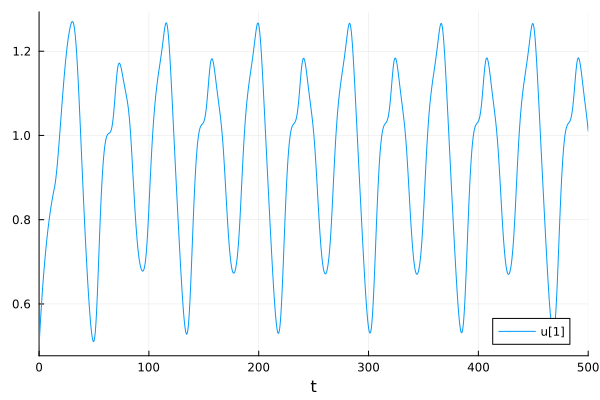
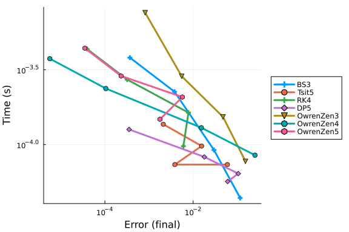
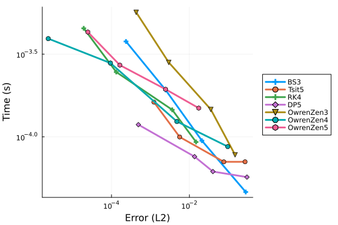
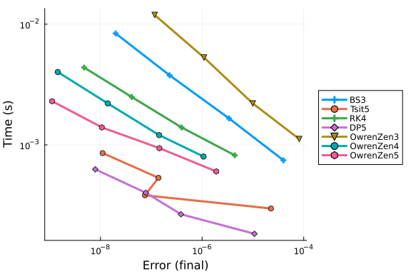
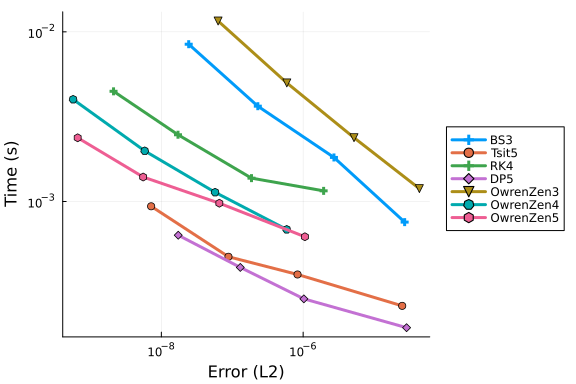
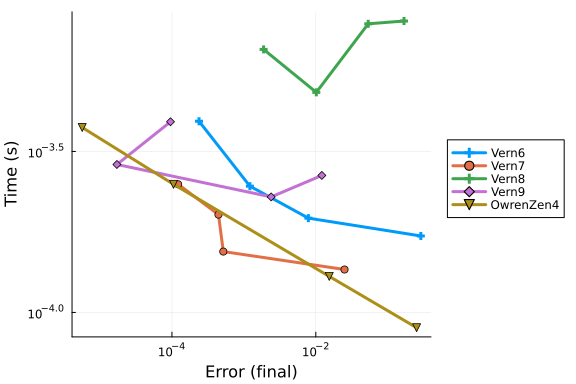
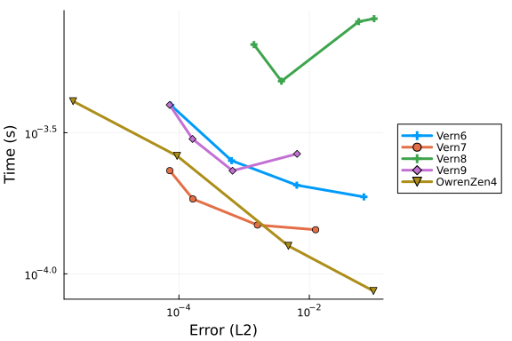
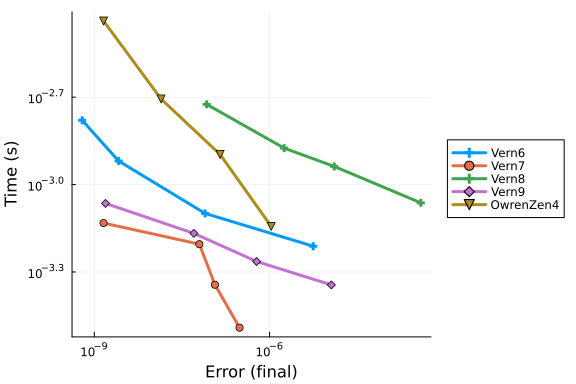
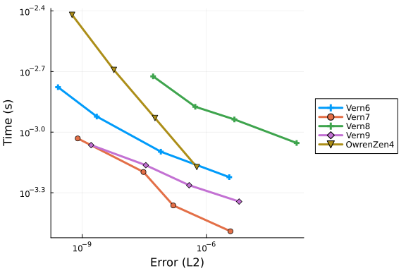

# Mackey and Glass

We study algorithms for solving constant delay differential equations with a test problem from W.H. Enright and H. Hayashi, "The evaluation of numerical software for delay differential equations", 1997. It is a model of blood production that was published by M. C. Mackey and L. Glass in "Oscillation and chaos in physiological control systems", 1977, and is given by

```math
\begin{equation}
 y'(t) = \frac{0.2y(t-14)}{1 + y(t-14)^{10}} - 0.1y(t)
\end{equation}
```

```julia
using DelayDiffEq, DiffEqDevTools, Plots
using OrdinaryDiffEqLowOrderRK, OrdinaryDiffEqTsit5, OrdinaryDiffEqVerner
using OrdinaryDiffEqNonlinearSolve: NLFunctional
using DDEProblemLibrary: prob_dde_DDETST_A1 as prob
gr()

sol = solve(prob, MethodOfSteps(Vern9(); fpsolve = NLFunctional(; max_iter = 1000));
    reltol = 1e-14, abstol = 1e-14)
test_sol = TestSolution(sol)
plot(sol)
```




Each diagram is followed by a summary computed from its runs. It lists the tolerances at which a method produced no finite error and time (the solve failed, timed out or diverged), the smallest error each method reached, and each method's unbeaten runs with their errors and times. A run is beaten when another run on the same diagram is at least as accurate, comparing errors as printed to 3 significant digits, and more than 1.2× faster; the factor keeps timing noise from deciding a comparison, so two methods within it of each other both keep their runs. In the smallest-error list, ≈ marks an error within 1.2× of the one listed before it and < one further away.

```julia
function wp_verdict(wp; estimate = wp.error_estimate, margin = 1.2)
    fmt(x) = string(round(x; sigdigits = 3))
    println("Summary computed from the $estimate errors and times above:")
    if !all(w -> hasproperty(w.errors, estimate), wp.wps)
        println("  No $estimate errors were recorded, so nothing is compared.")
        return nothing
    end
    runs = map(wp.wps) do w
        errors = getproperty(w.errors, estimate)
        bad = [i for i in eachindex(w.times) if !(isfinite(errors[i]) && isfinite(w.times[i]))]
        good = setdiff(eachindex(w.times), bad)
        steps = w.dts === nothing ? ("abstol", w.abstols) : ("dt", w.dts)
        (; name = w.name, errors = errors[good], times = w.times[good], bad = steps[2][bad], label = steps[1])
    end
    allunique(r.name for r in runs) ||
        println("  Note: several setups share a legend name, so their lines below cannot be told apart.")
    failed = [r for r in runs if !isempty(r.bad)]
    println(
        "  Runs without a finite error and time (failed, timed out or diverged): ",
        isempty(failed) ? "none" :
            join(("$(r.name) at $(r.label) $(join(fmt.(r.bad), ", "))" for r in failed), "; ")
    )
    ok = [r for r in runs if !isempty(r.errors)]
    if length(ok) < 2
        who = isempty(ok) ? "No method" : "Only $(only(ok).name)"
        println("  $who produced a usable run, so nothing is compared.")
        return nothing
    end
    best = sort!([(r.name, minimum(r.errors)) for r in ok]; by = last)
    parts = String[]
    for (i, (name, e)) in enumerate(best)
        i > 1 && push!(parts, e <= margin * best[i - 1][2] ? "≈" : "<")
        push!(parts, "$name ($(fmt(e)))")
    end
    println("  Smallest error reached, most accurate first: ", join(parts, " "))
    points = [(e, t) for r in ok for (e, t) in zip(r.errors, r.times)]
    shown(x) = round(x; sigdigits = 3)
    beaten(e, t) = any(p -> shown(p[1]) <= shown(e) && margin * p[2] < t, points)
    front = map(ok) do r
        kept = sort!([(e, t) for (e, t) in zip(r.errors, r.times) if !beaten(e, t)]; by = first)
        (; r.name, kept, n = length(r.errors))
    end
    sort!(front; by = f -> isempty(f.kept) ? Inf : first(f.kept[1]))
    println(
        "  Unbeaten runs by method, as error (time); a run is beaten when another run",
        " is at least as accurate (as printed) and more than $(margin)x faster:"
    )
    for f in front
        runs_of = "of $(f.n) usable $(f.n == 1 ? "run" : "runs")"
        println(
            "    $(f.name): ",
            isempty(f.kept) ? "none $runs_of (every run is beaten)" :
                "$(length(f.kept)) $runs_of: " * join(("$(fmt(e)) ($(fmt(t)) s)" for (e, t) in f.kept), ", ")
        )
    end
    return nothing
end
```

```
wp_verdict (generic function with 1 method)
```


## Low order RK methods

### High tolerances

First we test final errors of continuous RK methods of low order at high tolerances.

```julia
abstols = 1.0 ./ 10.0 .^ (4:7)
reltols = 1.0 ./ 10.0 .^ (1:4)

setups = [Dict(:alg=>MethodOfSteps(BS3())),
    Dict(:alg=>MethodOfSteps(Tsit5())),
    Dict(:alg=>MethodOfSteps(RK4())),
    Dict(:alg=>MethodOfSteps(DP5())),
    Dict(:alg=>MethodOfSteps(OwrenZen3())),
    Dict(:alg=>MethodOfSteps(OwrenZen4())),
    Dict(:alg=>MethodOfSteps(OwrenZen5()))]
wp = WorkPrecisionSet(prob, abstols, reltols, setups;
    appxsol = test_sol, maxiters = Int(1e5), error_estimate = :final)
plot(wp)
```



```julia
wp_verdict(wp)
```

```
Summary computed from the final errors and times above:
  Runs without a finite error and time (failed, timed out or diverged): none
  Smallest error reached, most accurate first: OwrenZen4 (5.65e-6) < OwrenZen5 (3.53e-5) ≈ RK4 (3.96e-5) < DP5 (0.000354) ≈ BS3 (0.000368) < OwrenZen3 (0.000818) < Tsit5 (0.00211)
  Unbeaten runs by method, as error (time); a run is beaten when another run is at least as accurate (as printed) and more than 1.2x faster:
    OwrenZen4: 2 of 4 usable runs: 5.65e-6 (0.000375 s), 0.000105 (0.000237 s)
    OwrenZen5: 2 of 4 usable runs: 3.53e-5 (0.000441 s), 0.00177 (0.000148 s)
    RK4: 2 of 4 usable runs: 3.96e-5 (0.000435 s), 0.00032 (0.000272 s)
    DP5: 4 of 4 usable runs: 0.000354 (0.000126 s), 0.0179 (8.27e-5 s), 0.0605 (5.66e-5 s), 0.105 (6.4e-5 s)
    Tsit5: 3 of 4 usable runs: 0.00211 (0.000137 s), 0.00385 (7.35e-5 s), 0.0598 (7.35e-5 s)
    BS3: 1 of 4 usable runs: 0.116 (4.4e-5 s)
    OwrenZen3: none of 4 usable runs (every run is beaten)
```


Next we test average interpolation errors:

```julia
abstols = 1.0 ./ 10.0 .^ (4:7)
reltols = 1.0 ./ 10.0 .^ (1:4)

setups = [Dict(:alg=>MethodOfSteps(BS3())),
    Dict(:alg=>MethodOfSteps(Tsit5())),
    Dict(:alg=>MethodOfSteps(RK4())),
    Dict(:alg=>MethodOfSteps(DP5())),
    Dict(:alg=>MethodOfSteps(OwrenZen3())),
    Dict(:alg=>MethodOfSteps(OwrenZen4())),
    Dict(:alg=>MethodOfSteps(OwrenZen5()))]
wp = WorkPrecisionSet(prob, abstols, reltols, setups;
    appxsol = test_sol, maxiters = Int(1e5), error_estimate = :L2)
plot(wp)
```



```julia
wp_verdict(wp)
```

```
Summary computed from the L2 errors and times above:
  Runs without a finite error and time (failed, timed out or diverged): none
  Smallest error reached, most accurate first: OwrenZen4 (2.38e-6) < RK4 (1.94e-5) < OwrenZen5 (2.47e-5) < BS3 (0.000236) < OwrenZen3 (0.00043) ≈ DP5 (0.000489) < Tsit5 (0.00123)
  Unbeaten runs by method, as error (time); a run is beaten when another run is at least as accurate (as printed) and more than 1.2x faster:
    OwrenZen4: 3 of 4 usable runs: 2.38e-6 (0.000392 s), 9.36e-5 (0.000279 s), 0.00477 (0.000124 s)
    RK4: 2 of 4 usable runs: 1.94e-5 (0.000453 s), 0.000133 (0.000246 s)
    OwrenZen5: 2 of 4 usable runs: 2.47e-5 (0.00043 s), 0.000164 (0.000271 s)
    DP5: 3 of 4 usable runs: 0.000489 (0.000118 s), 0.0135 (7.59e-5 s), 0.04 (6.17e-5 s)
    Tsit5: 3 of 4 usable runs: 0.00562 (9.98e-5 s), 0.0763 (7.06e-5 s), 0.268 (7.07e-5 s)
    BS3: 1 of 4 usable runs: 0.279 (4.64e-5 s)
    OwrenZen3: none of 4 usable runs (every run is beaten)
```


### Low tolerances

We repeat our tests with low tolerances.

```julia
abstols = 1.0 ./ 10.0 .^ (8:11)
reltols = 1.0 ./ 10.0 .^ (5:8)

setups = [Dict(:alg=>MethodOfSteps(BS3())),
    Dict(:alg=>MethodOfSteps(Tsit5())),
    Dict(:alg=>MethodOfSteps(RK4())),
    Dict(:alg=>MethodOfSteps(DP5())),
    Dict(:alg=>MethodOfSteps(OwrenZen3())),
    Dict(:alg=>MethodOfSteps(OwrenZen4())),
    Dict(:alg=>MethodOfSteps(OwrenZen5()))]
wp = WorkPrecisionSet(prob, abstols, reltols, setups;
    appxsol = test_sol, maxiters = Int(1e5), error_estimate = :final)
plot(wp)
```



```julia
wp_verdict(wp)
```

```
Summary computed from the final errors and times above:
  Runs without a finite error and time (failed, timed out or diverged): none
  Smallest error reached, most accurate first: OwrenZen5 (1.12e-9) < OwrenZen4 (1.44e-9) < RK4 (4.77e-9) < DP5 (7.9e-9) < Tsit5 (1.1e-8) < BS3 (1.99e-8) < OwrenZen3 (1.17e-7)
  Unbeaten runs by method, as error (time); a run is beaten when another run is at least as accurate (as printed) and more than 1.2x faster:
    OwrenZen5: 1 of 4 usable runs: 1.12e-9 (0.0023 s)
    DP5: 4 of 4 usable runs: 7.9e-9 (0.000627 s), 7.78e-8 (0.000401 s), 3.83e-7 (0.000266 s), 1.07e-5 (0.000183 s)
    Tsit5: 1 of 4 usable runs: 7.5e-8 (0.000382 s)
    BS3: none of 4 usable runs (every run is beaten)
    RK4: none of 4 usable runs (every run is beaten)
    OwrenZen3: none of 4 usable runs (every run is beaten)
    OwrenZen4: none of 4 usable runs (every run is beaten)
```


And once again we also test the interpolation errors:

```julia
abstols = 1.0 ./ 10.0 .^ (8:11)
reltols = 1.0 ./ 10.0 .^ (5:8)

setups = [Dict(:alg=>MethodOfSteps(BS3())),
    Dict(:alg=>MethodOfSteps(Tsit5())),
    Dict(:alg=>MethodOfSteps(RK4())),
    Dict(:alg=>MethodOfSteps(DP5())),
    Dict(:alg=>MethodOfSteps(OwrenZen3())),
    Dict(:alg=>MethodOfSteps(OwrenZen4())),
    Dict(:alg=>MethodOfSteps(OwrenZen5()))]
wp = WorkPrecisionSet(prob, abstols, reltols, setups;
    appxsol = test_sol, maxiters = Int(1e5), error_estimate = :L2)
plot(wp)
```



```julia
wp_verdict(wp)
```

```
Summary computed from the L2 errors and times above:
  Runs without a finite error and time (failed, timed out or diverged): none
  Smallest error reached, most accurate first: OwrenZen4 (5.69e-10) ≈ OwrenZen5 (6.6e-10) < RK4 (2.12e-9) < Tsit5 (7.18e-9) < DP5 (1.73e-8) < BS3 (2.43e-8) < OwrenZen3 (6.31e-8)
  Unbeaten runs by method, as error (time); a run is beaten when another run is at least as accurate (as printed) and more than 1.2x faster:
    OwrenZen4: 1 of 4 usable runs: 5.69e-10 (0.004 s)
    OwrenZen5: 2 of 4 usable runs: 6.6e-10 (0.00237 s), 5.54e-9 (0.00139 s)
    Tsit5: 4 of 4 usable runs: 7.18e-9 (0.000937 s), 8.84e-8 (0.000472 s), 8.33e-7 (0.000371 s), 2.5e-5 (0.000243 s)
    DP5: 4 of 4 usable runs: 1.73e-8 (0.000633 s), 1.3e-7 (0.000409 s), 1.02e-6 (0.000267 s), 2.88e-5 (0.00018 s)
    BS3: none of 4 usable runs (every run is beaten)
    RK4: none of 4 usable runs (every run is beaten)
    OwrenZen3: none of 4 usable runs (every run is beaten)
```


## Lazy interpolants

### High tolerances

We repeat our tests with the Verner methods which, in contrast to the methods above, use lazy interpolants. As reference we include `OwrenZen4`.

```julia
abstols = 1.0 ./ 10.0 .^ (4:7)
reltols = 1.0 ./ 10.0 .^ (1:4)

setups = [Dict(:alg=>MethodOfSteps(Vern6())),
    Dict(:alg=>MethodOfSteps(Vern7())),
    Dict(:alg=>MethodOfSteps(Vern8())),
    Dict(:alg=>MethodOfSteps(Vern9())),
    Dict(:alg=>MethodOfSteps(OwrenZen4()))]
wp = WorkPrecisionSet(prob, abstols, reltols, setups;
    appxsol = test_sol, maxiters = Int(1e5), error_estimate = :final)
plot(wp)
```



```julia
wp_verdict(wp)
```

```
Summary computed from the final errors and times above:
  Runs without a finite error and time (failed, timed out or diverged): none
  Smallest error reached, most accurate first: OwrenZen4 (5.65e-6) < Vern9 (1.72e-5) < Vern7 (0.000122) < Vern6 (0.000238) < Vern8 (0.00188)
  Unbeaten runs by method, as error (time); a run is beaten when another run is at least as accurate (as printed) and more than 1.2x faster:
    OwrenZen4: 4 of 4 usable runs: 5.65e-6 (0.000375 s), 0.000105 (0.00025 s), 0.0154 (0.000129 s), 0.252 (8.96e-5 s)
    Vern9: 1 of 4 usable runs: 1.72e-5 (0.000288 s)
    Vern7: 4 of 4 usable runs: 0.000122 (0.00025 s), 0.000444 (0.000201 s), 0.000518 (0.000154 s), 0.0251 (0.000136 s)
    Vern6: none of 4 usable runs (every run is beaten)
    Vern8: none of 4 usable runs (every run is beaten)
```


And we obtain the following interpolation errors:

```julia
abstols = 1.0 ./ 10.0 .^ (4:7)
reltols = 1.0 ./ 10.0 .^ (1:4)

setups = [Dict(:alg=>MethodOfSteps(Vern6())),
    Dict(:alg=>MethodOfSteps(Vern7())),
    Dict(:alg=>MethodOfSteps(Vern8())),
    Dict(:alg=>MethodOfSteps(Vern9())),
    Dict(:alg=>MethodOfSteps(OwrenZen4()))]
wp = WorkPrecisionSet(prob, abstols, reltols, setups;
    appxsol = test_sol, maxiters = Int(1e5), error_estimate = :L2)
plot(wp)
```



```julia
wp_verdict(wp)
```

```
Summary computed from the L2 errors and times above:
  Runs without a finite error and time (failed, timed out or diverged): none
  Smallest error reached, most accurate first: OwrenZen4 (2.38e-6) < Vern9 (7.2e-5) ≈ Vern7 (7.24e-5) ≈ Vern6 (7.5e-5) < Vern8 (0.00141)
  Unbeaten runs by method, as error (time); a run is beaten when another run is at least as accurate (as printed) and more than 1.2x faster:
    OwrenZen4: 4 of 4 usable runs: 2.38e-6 (0.000409 s), 9.36e-5 (0.000262 s), 0.00477 (0.000126 s), 0.0963 (8.7e-5 s)
    Vern9: 1 of 4 usable runs: 7.2e-5 (0.000397 s)
    Vern7: 4 of 4 usable runs: 7.24e-5 (0.000232 s), 0.000164 (0.000184 s), 0.0016 (0.000149 s), 0.0125 (0.000143 s)
    Vern6: none of 4 usable runs (every run is beaten)
    Vern8: none of 4 usable runs (every run is beaten)
```


### Low tolerances

Again, we repeat our tests at low tolerances.

```julia
abstols = 1.0 ./ 10.0 .^ (8:11)
reltols = 1.0 ./ 10.0 .^ (5:8)

setups = [Dict(:alg=>MethodOfSteps(Vern6())),
    Dict(:alg=>MethodOfSteps(Vern7())),
    Dict(:alg=>MethodOfSteps(Vern8())),
    Dict(:alg=>MethodOfSteps(Vern9())),
    Dict(:alg=>MethodOfSteps(OwrenZen4()))]
wp = WorkPrecisionSet(prob, abstols, reltols, setups;
    appxsol = test_sol, maxiters = Int(1e5), error_estimate = :final)
plot(wp)
```



```julia
wp_verdict(wp)
```

```
Summary computed from the final errors and times above:
  Runs without a finite error and time (failed, timed out or diverged): none
  Smallest error reached, most accurate first: Vern6 (6.21e-10) < Vern7 (1.44e-9) ≈ OwrenZen4 (1.44e-9) ≈ Vern9 (1.56e-9) < Vern8 (8.37e-8)
  Unbeaten runs by method, as error (time); a run is beaten when another run is at least as accurate (as printed) and more than 1.2x faster:
    Vern6: 1 of 4 usable runs: 6.21e-10 (0.00166 s)
    Vern7: 4 of 4 usable runs: 1.44e-9 (0.000738 s), 6.28e-8 (0.000624 s), 1.16e-7 (0.000453 s), 3.06e-7 (0.000323 s)
    Vern9: 2 of 4 usable runs: 1.56e-9 (0.000862 s), 5.07e-8 (0.00068 s)
    Vern8: none of 4 usable runs (every run is beaten)
    OwrenZen4: none of 4 usable runs (every run is beaten)
```


```julia
abstols = 1.0 ./ 10.0 .^ (8:11)
reltols = 1.0 ./ 10.0 .^ (5:8)

setups = [Dict(:alg=>MethodOfSteps(Vern6())),
    Dict(:alg=>MethodOfSteps(Vern7())),
    Dict(:alg=>MethodOfSteps(Vern8())),
    Dict(:alg=>MethodOfSteps(Vern9())),
    Dict(:alg=>MethodOfSteps(OwrenZen4()))]
wp = WorkPrecisionSet(prob, abstols, reltols, setups;
    appxsol = test_sol, maxiters = Int(1e5), error_estimate = :L2)
plot(wp)
```



```julia
wp_verdict(wp)
```

```
Summary computed from the L2 errors and times above:
  Runs without a finite error and time (failed, timed out or diverged): none
  Smallest error reached, most accurate first: Vern6 (2.6e-10) < OwrenZen4 (5.69e-10) < Vern7 (7.8e-10) < Vern9 (1.64e-9) < Vern8 (5.17e-8)
  Unbeaten runs by method, as error (time); a run is beaten when another run is at least as accurate (as printed) and more than 1.2x faster:
    Vern6: 1 of 4 usable runs: 2.6e-10 (0.00167 s)
    Vern7: 4 of 4 usable runs: 7.8e-10 (0.000931 s), 3.02e-8 (0.000635 s), 1.59e-7 (0.000433 s), 3.81e-6 (0.000323 s)
    Vern9: 2 of 4 usable runs: 1.64e-9 (0.000862 s), 3.44e-8 (0.000686 s)
    Vern8: none of 4 usable runs (every run is beaten)
    OwrenZen4: none of 4 usable runs (every run is beaten)
```


## Appendix

These benchmarks are a part of the SciMLBenchmarks.jl repository, found at: [https://github.com/SciML/SciMLBenchmarks.jl](https://github.com/SciML/SciMLBenchmarks.jl). For more information on high-performance scientific machine learning, check out the SciML Open Source Software Organization [https://sciml.ai](https://sciml.ai).

To locally run this benchmark, do the following commands:
```
using SciMLBenchmarks
SciMLBenchmarks.weave_file("benchmarks/NonStiffDDE","Mackey_Glass_wpd.jmd")
```

Computer Information:

```
Julia Version 1.11.9
Commit 53a02c0720c (2026-02-06 00:27 UTC)
Build Info:
  Official https://julialang.org/ release
Platform Info:
  OS: Linux (x86_64-linux-gnu)
  CPU: 128 × AMD EPYC 7502 32-Core Processor
  WORD_SIZE: 64
  LLVM: libLLVM-16.0.6 (ORCJIT, znver2)
Threads: 128 default, 0 interactive, 64 GC (on 128 virtual cores)
Environment:
  JULIA_NUM_THREADS = auto

```

Package Information:

```
Status `~/github-runners/amdci3-1/_work/SciMLBenchmarks.jl/SciMLBenchmarks.jl/benchmarks/NonStiffDDE/Project.toml`
⌃ [f42792ee] DDEProblemLibrary v0.1.9
⌃ [bcd4f6db] DelayDiffEq v6.4.0
  [f3b72e0c] DiffEqDevTools v3.6.3
  [2ee39098] LabelledArrays v1.20.5
⌃ [1344f307] OrdinaryDiffEqLowOrderRK v2.2.5
⌃ [127b3ac7] OrdinaryDiffEqNonlinearSolve v2.9.8
⌃ [b1df2697] OrdinaryDiffEqTsit5 v2.1.4
⌃ [79d7bb75] OrdinaryDiffEqVerner v2.4.1
  [91a5bcdd] Plots v1.41.7
  [31c91b34] SciMLBenchmarks v0.2.1
⌃ [90137ffa] StaticArrays v1.9.20
Info Packages marked with ⌃ have new versions available and may be upgradable.
```

And the full manifest:

```
Status `~/github-runners/amdci3-1/_work/SciMLBenchmarks.jl/SciMLBenchmarks.jl/benchmarks/NonStiffDDE/Manifest.toml`
  [47edcb42] ADTypes v1.24.0
  [14f7f29c] AMD v0.5.4
  [7d9f7c33] Accessors v0.1.45
⌃ [79e6a3ab] Adapt v4.7.0
  [66dad0bd] AliasTables v1.1.3
  [4fba245c] ArrayInterface v7.30.2
  [b2a6c25c] BinaryHeaps v1.1.0
⌃ [70df07ce] BracketingNonlinearSolve v1.12.7
  [d360d2e6] ChainRulesCore v1.26.1
  [35d6a980] ColorSchemes v3.31.0
⌃ [3da002f7] ColorTypes v0.12.1
  [c3611d14] ColorVectorSpace v0.11.0
⌃ [5ae59095] Colors v0.13.1
  [38540f10] CommonSolve v0.2.14
  [bbf7d656] CommonSubexpressions v0.3.1
  [34da2185] Compat v4.18.1
  [a33af91c] CompositionsBase v0.1.2
  [2569d6c7] ConcreteStructs v0.2.8
  [187b0558] ConstructionBase v1.6.0
  [d38c429a] Contour v0.6.3
  [a8cc5b0e] Crayons v4.2.0
⌃ [f42792ee] DDEProblemLibrary v0.1.9
  [9a962f9c] DataAPI v1.16.0
  [864edb3b] DataStructures v0.19.6
  [e2d170a0] DataValueInterfaces v1.0.0
⌃ [bcd4f6db] DelayDiffEq v6.4.0
  [8bb1440f] DelimitedFiles v1.9.1
⌃ [2b5f629d] DiffEqBase v7.21.1
  [f3b72e0c] DiffEqDevTools v3.6.3
⌃ [77a26b50] DiffEqNoiseProcess v5.36.3
  [163ba53b] DiffResults v1.1.0
  [b552c78f] DiffRules v1.16.0
  [a0c0ee7d] DifferentiationInterface v0.7.21
  [31c24e10] Distributions v0.25.131
  [ffbed154] DocStringExtensions v0.9.5
  [4e289a0a] EnumX v1.0.7
⌃ [f151be2c] EnzymeCore v0.8.21
  [e2ba6199] ExprTools v0.1.11
⌃ [c87230d0] FFMPEG v0.4.5
  [7034ab61] FastBroadcast v1.4.0
  [9aa1b823] FastClosures v0.3.2
  [a4df4552] FastPower v1.5.0
⌃ [1a297f60] FillArrays v1.17.0
⌃ [64ca27bc] FindFirstFunctions v3.2.1
  [6a86dc24] FiniteDiff v2.33.0
⌅ [53c48c17] FixedPointNumbers v0.8.6
  [1fa38f19] Format v1.3.7
  [f6369f11] ForwardDiff v1.4.6
  [069b7b12] FunctionWrappers v1.1.3
  [77dc65aa] FunctionWrappersWrappers v1.13.0
⌃ [46192b85] GPUArraysCore v0.2.0
  [28b8d3ca] GR v0.73.27
  [a0844989] Gamma v1.2.0
⌅ [eafb193a] Highlights v0.5.3
  [34004b35] HypergeometricFunctions v0.3.30
  [3587e190] InverseFunctions v0.1.17
  [92d709cd] IrrationalConstants v0.2.6
  [82899510] IteratorInterfaceExtensions v1.0.0
  [1019f520] JLFzf v0.1.11
  [692b3bcd] JLLWrappers v1.8.0
⌅ [682c06a0] JSON v0.21.4
  [ba0b0d4f] Krylov v0.10.10
  [2faa5264] LHLFactorization v2.2.2
  [b964fa9f] LaTeXStrings v1.4.1
  [2ee39098] LabelledArrays v1.20.5
  [23fbe1c1] Latexify v0.16.12
⌃ [87fe0de2] LineSearch v0.1.18
⌃ [7ed4a6bd] LinearSolve v5.17.3
⌃ [2ab3a3ac] LogExpFunctions v1.0.1
  [e6f89c97] LoggingExtras v1.2.0
  [1914dd2f] MacroTools v0.5.16
  [bb5d69b7] MaybeInplace v0.1.8
  [442fdcdd] Measures v0.3.3
  [e1d29d7a] Missings v1.2.0
  [46d2c3a1] MuladdMacro v0.2.7
⌃ [ffc61752] Mustache v1.0.21
  [77ba4419] NaNMath v1.1.4
⌃ [8913a72c] NonlinearSolve v4.30.0
⌃ [be0214bd] NonlinearSolveBase v2.49.5
⌃ [5959db7a] NonlinearSolveFirstOrder v2.6.1
  [9a2c21bd] NonlinearSolveQuasiNewton v1.15.3
  [26075421] NonlinearSolveSpectralMethods v1.8.3
⌃ [bac558e1] OrderedCollections v2.0.1
⌃ [6ad6398a] OrdinaryDiffEqBDF v2.4.9
⌃ [bbf590c4] OrdinaryDiffEqCore v4.17.2
  [50262376] OrdinaryDiffEqDefault v2.6.2
⌃ [4302a76b] OrdinaryDiffEqDifferentiation v3.12.0
  [d3585ca7] OrdinaryDiffEqFunctionMap v2.3.0
⌃ [1344f307] OrdinaryDiffEqLowOrderRK v2.2.5
⌃ [127b3ac7] OrdinaryDiffEqNonlinearSolve v2.9.8
⌃ [43230ef6] OrdinaryDiffEqRosenbrock v2.7.3
  [b4bd8bb3] OrdinaryDiffEqRosenbrockTableaus v2.4.2
⌃ [2d112036] OrdinaryDiffEqSDIRK v2.9.4
⌃ [b1df2697] OrdinaryDiffEqTsit5 v2.1.4
⌃ [79d7bb75] OrdinaryDiffEqVerner v2.4.1
  [90014a1f] PDMats v0.11.41
⌅ [69de0a69] Parsers v2.8.8
  [ccf2f8ad] PlotThemes v3.3.0
⌃ [995b91a9] PlotUtils v1.4.4
  [91a5bcdd] Plots v1.41.7
  [e409e4f3] PoissonRandom v0.4.13
  [d236fae5] PreallocationTools v1.7.1
⌅ [aea7be01] PrecompileTools v1.2.1
  [21216c6a] Preferences v1.6.0
⌃ [08abe8d2] PrettyTables v3.4.8
  [43287f4e] PtrArrays v1.4.0
⌃ [0c0d3e7f] PureKLU v1.5.0
  [1fd47b50] QuadGK v2.11.3
⌅ [3cdcf5f2] RecipesBase v1.3.4
  [01d81517] RecipesPipeline v0.6.12
⌃ [731186ca] RecursiveArrayTools v4.5.1
  [189a3867] Reexport v1.2.2
  [05181044] RelocatableFolders v1.0.1
  [ae029012] Requires v1.3.1
  [ae5879a3] ResettableStacks v1.4.0
  [9fe22ead] RespecializeParams v1.3.0
  [79098fc4] Rmath v0.9.0
  [47965b36] RootedTrees v2.27.0
⌃ [f2b01f46] Roots v3.0.8
⌃ [7e49a35a] RuntimeGeneratedFunctions v0.5.26
⌃ [0bca4576] SciMLBase v3.54.0
  [31c91b34] SciMLBenchmarks v0.2.1
  [19f34311] SciMLJacobianOperators v0.1.19
  [a6db7da4] SciMLLogging v2.1.0
⌃ [c0aeaf25] SciMLOperators v1.30.0
  [431bcebd] SciMLPublic v1.3.0
  [53ae85a6] SciMLStructures v1.10.5
  [6c6a2e73] Scratch v1.3.0
  [efcf1570] Setfield v1.1.2
  [992d4aef] Showoff v1.1.1
⌃ [727e6d20] SimpleNonlinearSolve v2.14.5
  [a2af1166] SortingAlgorithms v1.2.3
  [a57abbd0] SparseColumnPivotedQR v2.1.8
  [0a514795] SparseMatrixColorings v0.4.28
  [276daf66] SpecialFunctions v2.9.0
  [860ef19b] StableRNGs v1.0.4
⌃ [90137ffa] StaticArrays v1.9.20
  [1e83bf80] StaticArraysCore v1.4.4
  [10745b16] Statistics v1.11.5
  [82ae8749] StatsAPI v1.8.0
  [2913bbd2] StatsBase v0.34.13
  [4c63d2b9] StatsFuns v2.2.1
  [69024149] StringEncodings v0.3.7
⌅ [892a3eda] StringManipulation v0.5.0
  [09ab397b] StructArrays v0.7.3
  [2efcf032] SymbolicIndexingInterface v0.3.55
  [3783bdb8] TableTraits v1.0.1
  [bd369af6] Tables v1.14.0
  [62fd8b95] TensorCore v0.1.1
⌃ [a759f4b9] TimerOutputs v1.2.1
  [781d530d] TruncatedStacktraces v1.4.0
  [1cfade01] UnicodeFun v0.4.1
  [41fe7b60] Unzip v0.2.0
  [44d3d7a6] Weave v0.10.12
⌃ [ddb6d928] YAML v0.4.16
  [6e34b625] Bzip2_jll v1.0.9+0
⌃ [83423d85] Cairo_jll v1.18.7+0
  [ee1fde0b] Dbus_jll v1.16.2+0
  [2702e6a9] EpollShim_jll v0.0.20230411+1
  [2e619515] Expat_jll v2.8.4+0
⌅ [b22a6f82] FFMPEG_jll v8.1.2+0
  [a3f928ae] Fontconfig_jll v2.17.1+0
  [d7e528f0] FreeType2_jll v2.14.3+1
  [559328eb] FriBidi_jll v1.0.17+0
  [0656b61e] GLFW_jll v3.5.1+0
  [d2c73de3] GR_jll v0.73.27+0
⌅ [b0724c58] GettextRuntime_jll v0.22.4+0
  [61579ee1] Ghostscript_jll v9.55.1+0
  [7746bdde] Glib_jll v2.88.3+0
  [3b182d85] Graphite2_jll v1.3.16+0
  [2e76f6c2] HarfBuzz_jll v100.14004.0+0
  [1d5cc7b8] IntelOpenMP_jll v2025.2.0+0
  [aacddb02] JpegTurbo_jll v3.2.0+1
  [c1c5ebd0] LAME_jll v3.100.3+0
  [88015f11] LERC_jll v4.2.0+0
  [1d63c593] LLVMOpenMP_jll v23.1.1+0
⌅ [e9f186c6] Libffi_jll v3.4.7+0
  [7e76a0d4] Libglvnd_jll v1.7.1+1
  [94ce4f54] Libiconv_jll v1.18.0+0
  [4b2f31a3] Libmount_jll v2.42.0+0
  [89763e89] Libtiff_jll v4.7.3+0
  [38a345b3] Libuuid_jll v2.42.0+0
  [856f044c] MKL_jll v2025.2.0+0
  [e7412a2a] Ogg_jll v1.3.6+0
⌃ [458c3c95] OpenSSL_jll v3.5.8+0
  [efe28fd5] OpenSpecFun_jll v0.5.6+0
  [91d4177d] Opus_jll v1.6.1+0
  [36c8627f] Pango_jll v1.58.2+0
  [30392449] Pixman_jll v0.46.4+0
  [c0090381] Qt6Base_jll v6.10.2+2
  [629bc702] Qt6Declarative_jll v6.10.2+2
  [ce943373] Qt6ShaderTools_jll v6.10.2+1
  [6de9746b] Qt6Svg_jll v6.10.2+0
  [e99dba38] Qt6Wayland_jll v6.10.2+1
  [f50d1b31] Rmath_jll v0.5.2+0
  [a44049a8] Vulkan_Loader_jll v1.3.243+0
  [a2964d1f] Wayland_jll v1.24.0+0
  [ffd25f8a] XZ_jll v5.8.4+0
  [f67eecfb] Xorg_libICE_jll v1.1.2+0
  [c834827a] Xorg_libSM_jll v1.2.6+0
  [4f6342f7] Xorg_libX11_jll v1.8.13+0
  [0c0b7dd1] Xorg_libXau_jll v1.0.13+0
  [935fb764] Xorg_libXcursor_jll v1.2.4+0
  [a3789734] Xorg_libXdmcp_jll v1.1.6+0
  [1082639a] Xorg_libXext_jll v1.3.8+0
  [d091e8ba] Xorg_libXfixes_jll v6.0.2+0
  [a51aa0fd] Xorg_libXi_jll v1.8.4+0
  [d1454406] Xorg_libXinerama_jll v1.1.7+0
  [ec84b674] Xorg_libXrandr_jll v1.5.6+0
  [ea2f1a96] Xorg_libXrender_jll v0.9.12+0
  [a65dc6b1] Xorg_libpciaccess_jll v0.19.0+0
  [c7cfdc94] Xorg_libxcb_jll v1.17.1+0
  [cc61e674] Xorg_libxkbfile_jll v1.2.0+0
  [e920d4aa] Xorg_xcb_util_cursor_jll v0.1.6+0
  [12413925] Xorg_xcb_util_image_jll v0.4.1+0
  [2def613f] Xorg_xcb_util_jll v0.4.1+0
  [975044d2] Xorg_xcb_util_keysyms_jll v0.4.1+0
  [0d47668e] Xorg_xcb_util_renderutil_jll v0.3.10+0
  [c22f9ab0] Xorg_xcb_util_wm_jll v0.4.2+0
  [35661453] Xorg_xkbcomp_jll v1.4.7+0
  [33bec58e] Xorg_xkeyboard_config_jll v2.47.0+2
  [c5fb5394] Xorg_xtrans_jll v1.6.0+0
  [3161d3a3] Zstd_jll v1.5.7+1
  [35ca27e7] eudev_jll v3.2.14+0
⌅ [214eeab7] fzf_jll v0.61.1+0
⌃ [a4ae2306] libaom_jll v3.14.1+0
  [0ac62f75] libass_jll v0.17.5+0
  [1183f4f0] libdecor_jll v0.2.2+0
  [8e53e030] libdrm_jll v2.4.134+0
  [2db6ffa8] libevdev_jll v1.13.4+0
  [f638f0a6] libfdk_aac_jll v2.0.4+0
  [36db933b] libinput_jll v1.28.1+0
⌃ [b53b4c65] libpng_jll v1.6.58+0
  [9a156e7d] libva_jll v2.23.0+0
  [f27f6e37] libvorbis_jll v1.3.8+0
  [009596ad] mtdev_jll v1.1.7+0
  [1317d2d5] oneTBB_jll v2022.3.0+0
⌅ [1270edf5] x264_jll v10164.0.1+0
  [dfaa095f] x265_jll v4.1.0+0
  [d8fb68d0] xkbcommon_jll v1.13.0+0
  [0dad84c5] ArgTools v1.1.2
  [56f22d72] Artifacts v1.11.0
  [2a0f44e3] Base64 v1.11.0
  [ade2ca70] Dates v1.11.0
  [8ba89e20] Distributed v1.11.0
  [f43a241f] Downloads v1.6.0
  [7b1f6079] FileWatching v1.11.0
  [9fa8497b] Future v1.11.0
  [b77e0a4c] InteractiveUtils v1.11.0
  [4af54fe1] LazyArtifacts v1.11.0
  [b27032c2] LibCURL v0.6.4
  [76f85450] LibGit2 v1.11.0
  [8f399da3] Libdl v1.11.0
  [37e2e46d] LinearAlgebra v1.11.0
  [56ddb016] Logging v1.11.0
  [d6f4376e] Markdown v1.11.0
  [a63ad114] Mmap v1.11.0
  [ca575930] NetworkOptions v1.2.0
  [44cfe95a] Pkg v1.11.0
  [de0858da] Printf v1.11.0
  [3fa0cd96] REPL v1.11.0
  [9a3f8284] Random v1.11.0
  [ea8e919c] SHA v0.7.0
  [9e88b42a] Serialization v1.11.0
  [6462fe0b] Sockets v1.11.0
  [2f01184e] SparseArrays v1.11.0
  [f489334b] StyledStrings v1.11.0
  [4607b0f0] SuiteSparse
  [fa267f1f] TOML v1.0.3
  [a4e569a6] Tar v1.10.0
  [8dfed614] Test v1.11.0
  [cf7118a7] UUIDs v1.11.0
  [4ec0a83e] Unicode v1.11.0
  [e66e0078] CompilerSupportLibraries_jll v1.1.1+0
  [deac9b47] LibCURL_jll v8.6.0+0
  [e37daf67] LibGit2_jll v1.7.2+0
  [29816b5a] LibSSH2_jll v1.11.0+1
  [c8ffd9c3] MbedTLS_jll v2.28.6+0
  [14a3606d] MozillaCACerts_jll v2023.12.12
  [4536629a] OpenBLAS_jll v0.3.27+1
  [05823500] OpenLibm_jll v0.8.5+0
  [efcefdf7] PCRE2_jll v10.42.0+1
  [bea87d4a] SuiteSparse_jll v7.7.0+0
  [83775a58] Zlib_jll v1.2.13+1
  [8e850b90] libblastrampoline_jll v5.11.0+0
  [8e850ede] nghttp2_jll v1.59.0+0
  [3f19e933] p7zip_jll v17.4.0+2
Info Packages marked with ⌃ and ⌅ have new versions available. Those with ⌃ may be upgradable, but those with ⌅ are restricted by compatibility constraints from upgrading. To see why use `status --outdated -m`
```

