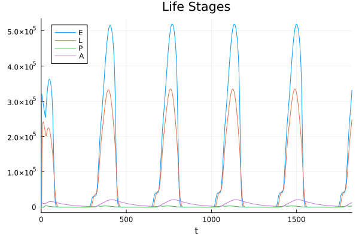
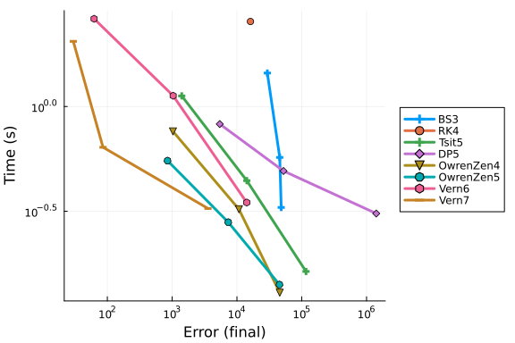
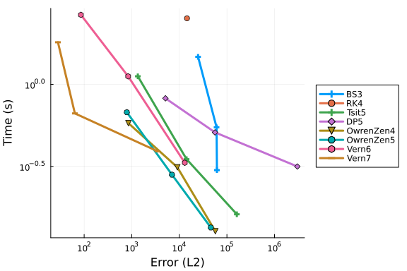
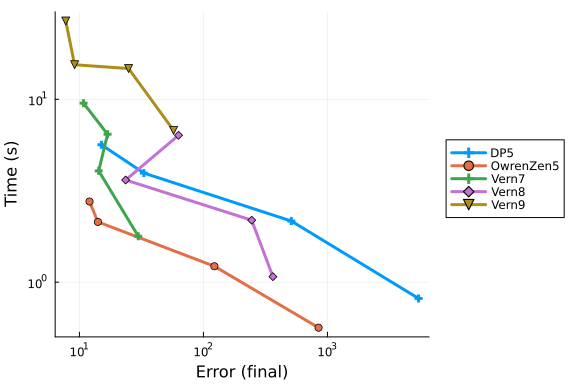
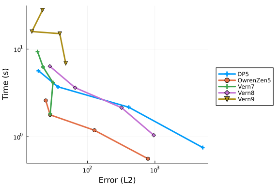

# Mosquito Population State-Dependent Delay Differential Equation

This benchmark implements the Ewing model for mosquito population dynamics using state-dependent delay differential equations (DDEs). The model tracks mosquito life stages (eggs, larvae, pupae, adults) with temperature-dependent development rates and delays. This is a complex ecological model with multiple state-dependent delays that presents challenges for numerical solvers.

```julia
using DelayDiffEq, DiffEqDevTools, Plots
using OrdinaryDiffEqLowOrderRK, OrdinaryDiffEqTsit5, OrdinaryDiffEqVerner
using LabelledArrays, StaticArrays
gr()

# Predation parameters
pupae_pars = (a = 1, h = 0.002, r = 0.001, V = 200)
p0 = pupae_pars.r / pupae_pars.h
p1 = pupae_pars.V / (pupae_pars.a * pupae_pars.h)

# Parameter vector definition
parvec = @SLVector (
    # temp
    :phi, # PHASE
    :lambda, # A
    :mu, # M
    :gamma, # POWER
    # photoperiod
    :L, # latitude
    # oviposition
    :max_egg, # max egg raft size, R
    # gonotrophic cycle
    :q1, # KG
    :q2, # QG
    :q3, # BG
    # egg death
    :nu_0E,  # U3
    :nu_1E,  # U4
    :nu_2E, # U5
    # larvae death
    :nu_0L,  # U3
    :nu_1L,  # U4
    :nu_2L, # U5
    # pupae death
    :nu_0P,  # U3
    :nu_1P,  # U4
    :nu_2P, # U5
    # adult death
    :alpha_A, # ALPHA
    :beta_A, # BETA
    # egg maturation
    :alpha_E, # ALPHA
    :beta_E, # BETA
    # larvae maturation
    :alpha_L, # ALPHA
    :beta_L, # BETA
    # pupae maturation
    :alpha_P, # ALPHA
    :beta_P, # BETA
    # predation on pupae
    :p0,
    :p1,
)

# Parameter values
parameters = parvec(
    1.4, # phi
    6.3, # lambda
    10.3, # mu
    1.21, # gamma
    51, # L
    200, # max_egg
    # gonotrophic cycle
    0.2024, # (q1) KG
    74.48, # (q2) QG
    0.2456, # (q3) BG
    # egg death
    0.0157,  # (nu_0E) U3
    20.5,  # (nu_1E) U4
    7,  # (nu_2E) U5
    # larvae death
    0.0157,  # (nu_0L) U3
    20.5,  # (nu_1L) U4
    7,  # (nu_2L) U5
    # pupae death
    0.0157,  # (nu_0P) U3
    20.5,  # (nu_1P) U4
    7,  # (nu_2P) U5
    # adult death
    2.166e-8, # (alpha_A) ALPHA
    4.483, # (beta_A) BETA
    # egg maturation
    0.0022, # (alpha_E) ALPHA
    1.77, # (beta_E) BETA
    # larvae maturation
    0.00315, # (alpha_L) ALPHA
    1.12, # (beta_L) BETA
    # pupae maturation
    0.0007109, # (alpha_P) ALPHA
    1.8865648, # (beta_P) BETA
    # predation on pupae
    p0, # p0
    p1 # p1
)

# Maximum allowed values for rates (same as FORTRAN)
death_max = 1.0 # 1.0
death_min_a = 0.01 # 0.01
gon_min = 0.0333 # 0.0333
maturation_min = 0.016667 # 0.016667

# Temperature as modified cosine function
function temperature(t, pars)
    phi = pars.phi # PHASE
    lambda = pars.lambda # A
    mu = pars.mu # M
    gamma = pars.gamma # POWER

    temp = 0.0

    if t < 0.0
        temp = (mu - lambda) +
            lambda * 2.0 * (0.5 * (1.0 + cos(2.0 * pi * (0.0 - phi) / 365.0)))^gamma
    else
        temp = (mu - lambda) +
            lambda * 2.0 * (0.5 * (1.0 + cos(2.0 * pi * (t - phi) / 365.0)))^gamma
    end

    return temp
end

# Photoperiod
function daylight(t, pars)
    L = pars.L # latitude (51 in thesis)

    # define photoperiod values
    EPS = asin(0.39795 * cos(0.2163108 + 2 * atan(0.9671396 * tan(0.0086 * (t - 3.5)))))
    NUM = sin(0.8333 * pi / 180.0) + (sin(L * pi / 180.0) * sin(EPS))
    DEN = cos(L * pi / 180.0) * cos(EPS)
    DAYLIGHT = 24.0 - (24.0 / pi) * acos(NUM / DEN)

    return DAYLIGHT
end

# Diapause functions
# pp: photoperiod
function diapause_spring(pp)
    return 1.0 / (1.0 + exp(5.0 * (14.0 - pp)))
end

function diapause_autumn(pp)
    return 1.0 / (1.0 + exp(5.0 * (13.0 - pp)))
end

# Per-capita oviposition rate
# d: diapause
# G: duration of gonotrophic cycle
# pars: parameters
function oviposition(d, G, pars)
    max_egg = pars.max_egg

    egg_raft = d * max_egg * 0.5
    ovi = egg_raft / G

    return ovi
end

# Egg mortality
function death_egg_rate(temp, pars)
    nu_0E = pars.nu_0E # U3
    nu_1E = pars.nu_1E # U4
    nu_2E = pars.nu_2E # U5

    # calculate egg death rate
    egg_d = nu_0E * exp(((temp - nu_1E) / nu_2E)^2)

    if egg_d > death_max
        egg_d = death_max
    end

    return egg_d
end

# Larvae mortality
function death_larvae_rate(temp, pars)
    nu_0L = pars.nu_0L # U3
    nu_1L = pars.nu_1L # U4
    nu_2L = pars.nu_2L # U5

    # calculate larvae death rate
    larvae_d = nu_0L * exp(((temp - nu_1L) / nu_2L)^2)

    if larvae_d > death_max
        larvae_d = death_max
    end

    return larvae_d
end

# Pupal mortality
function death_pupae_rate(temp, pars)
    nu_0P = pars.nu_0P # U3
    nu_1P = pars.nu_1P # U4
    nu_2P = pars.nu_2P # U5

    # calculate pupae death rate
    pupal_d = nu_0P * exp(((temp - nu_1P) / nu_2P)^2)

    if pupal_d > death_max
        pupal_d = death_max
    end

    return pupal_d
end

# Adult mortality
function death_adult_rate(temp, pars)
    alpha_A = pars.alpha_A # ALPHA
    beta_A = pars.beta_A # BETA

    # calculate adult death rate
    adult_d = alpha_A * (temp^beta_A)

    if adult_d < death_min_a
        adult_d = death_min_a
    end
    return adult_d
end

# G: duration of gonotrophic cycle
function gonotrophic(temp, pars)
    q1 = pars.q1 # KG
    q2 = pars.q2 # QG
    q3 = pars.q3 # BG

    # calculate gonotrophic cycle length
    if temp < 0.0
        grate = 0.0333
    else
        grate = q1 / (1 + q2 * exp(-q3 * temp))
    end

    if grate < gon_min
        grate = gon_min
    end

    return 1.0 / grate
end

# g_E
function egg_maturation_rate(temp, pars)
    alpha_E = pars.alpha_E # ALPHA
    beta_E = pars.beta_E # BETA

    # calculate egg development rate
    if temp < 0.0
        egg_maturation = 0.016667
    else
        egg_maturation = alpha_E * (temp^beta_E)
    end

    if egg_maturation < maturation_min
        egg_maturation = maturation_min
    end
    return egg_maturation
end

# g_L
function larvae_maturation_rate(temp, pars)
    alpha_L = pars.alpha_L # ALPHA
    beta_L = pars.beta_L # BETA

    # calculate larvae development rate
    if temp < 0.0
        larvae_maturation = 0.016667
    else
        larvae_maturation = alpha_L * (temp^beta_L)
    end

    if larvae_maturation < maturation_min
        larvae_maturation = maturation_min
    end
    return larvae_maturation
end

# g_P
function pupae_maturation_rate(temp, pars)
    alpha_P = pars.alpha_P # ALPHA
    beta_P = pars.beta_P # BETA

    # calculate pupae development rate
    if temp < 0.0
        pupae_maturation = 0.016667
    else
        pupae_maturation = alpha_P * (temp^beta_P)
    end

    if pupae_maturation < maturation_min
        pupae_maturation = maturation_min
    end
    return pupae_maturation
end

# State variable history
function h(p, t; idxs = nothing)
    temp = temperature(t, p)

    # history vector
    Y = zeros(13)

    Y[8] = 1.0 / egg_maturation_rate(temp, p) # tau_E
    Y[9] = 1.0 / larvae_maturation_rate(temp, p) # tau_L
    Y[10] = 1.0 / pupae_maturation_rate(temp, p) # tau_P

    Y[5] = exp(-death_egg_rate(temp, p) * Y[8]) # S_E
    Y[6] = exp(-death_larvae_rate(temp, p) * Y[9]) # S_L
    Y[7] = exp(-death_pupae_rate(temp, p) * Y[10]) #S_P

    temp_L = temperature(t - Y[9], p)
    temp_P = temperature(t - Y[10], p)

    Y[11] = 1.0 / egg_maturation_rate(temp_L, p) # tau_E(t - tau_L(t))
    Y[12] = 1.0 / larvae_maturation_rate(temp_P, p) # tau_L(t - tau_P(t))

    temp_LP = temperature(t - Y[10] - Y[12], p)

    Y[13] = 1.0 / egg_maturation_rate(temp_LP, p) # tau_E(t - tau_P(t) - tau_L(t - tau_P(t)))

    return idxs === nothing ? Y : Y[idxs]
end

# Initial condition calculation
# A0: A(0)
# t0: temp(0); assumed constant for t<0
function calculate_IC(A0, t0, pars)
    u0 = zeros(13)
    u0[4] = A0

    # calculate initial lags first
    u0[8] = 1.0 / egg_maturation_rate(t0, pars) # tau_E
    u0[9] = 1.0 / larvae_maturation_rate(t0, pars) # tau_L
    u0[10] = 1.0 / pupae_maturation_rate(t0, pars) # tau_P

    u0[11] = u0[8] # tau_E(t - tau_L(t))
    u0[12] = u0[9] # tau_L(t - tau_P(t))
    u0[13] = u0[8] # tau_E(t - tau_P(t) - tau_L(t - tau_P(t)))

    # survival probabilities
    u0[5] = exp(-u0[8] * death_egg_rate(t0, pars)) # S_E
    u0[6] = exp(-u0[9] * death_larvae_rate(t0, pars)) # S_L
    u0[7] = exp(-u0[10] * death_pupae_rate(t0, pars)) # S_P

    return u0
end

# System of DDEs
# 13 equations
# 6 delays
# DDEs
function ewing_dde(du, u, h, p, t)

    # state variables
    E = u[1]
    LAR = u[2]
    PUP = u[3]
    ADU = u[4]
    SE = u[5]
    SL = u[6]
    SP = u[7]
    DE = u[8] # tau_E(t)
    DL = u[9] # tau_L(t)
    DP = u[10] # tau_P(t)
    DEL = u[11] # tau_E(t - tau_L(t))
    DLP = u[12] # tau_L(t - tau_P(t))
    DELP = u[13] # tau_E(t - tau_P(t) - tau_L(t - taup_P(t)))

    # larval predation parameters
    p0 = p.p0
    p1 = p.p1

    # Z: state variables at each of the 6 lagged times (lags follow same order as Z/BETA in DDE_SOLVER)

    # Z
    Z1 = h(p, t - DE; idxs = 4) # Z(x,1): t - tau_E(t)
    Z2 = h(p, t - DL - DEL; idxs = 4) # Z(x,2): t - tau_L(t) - tau_E(t - tau_L(t))
    Z3 = h(p, t - DP - DLP - DELP; idxs = 4) # Z(x,3): t - tau_P(t) - tau_L(t - tau_P(t)) - tau_E(t - tau_P(t) - tau_L(t - tau_P(t)))
    Z4 = h(p, t - DL) # Z(x,4): t - tau_L(t)
    Z5 = h(p, t - DP - DLP) # Z(x,5): t - tau_P(t) - tau_L(t - tau_P(t))
    Z6 = h(p, t - DP) # Z(x,6): t - tau_P(t)

    # (lagged) temperature
    temp = temperature(t, p)
    temp_E = temperature(t - DE, p)
    temp_L = temperature(t - DL, p)
    temp_P = temperature(t - DP, p)
    temp_EL = temperature(t - DL - Z4[8], p)
    temp_ELP = temperature(t - DP - Z6[9] - Z5[8], p)
    temp_LP = temperature(t - DP - Z6[9], p)

    # (lagged) photoperiod
    pp = daylight(t, p)
    pp_1 = daylight(t - 1, p)
    pp_E = daylight(t - DE, p)
    pp_EL = daylight(t - DL - Z4[8], p)
    pp_ELP = daylight(t - DP - Z6[9] - Z5[8], p)

    # (lagged) gonotrophic cycle
    gon = gonotrophic(temp, p)
    gon_E = gonotrophic(temp_E, p)
    gon_EL = gonotrophic(temp_EL, p)
    gon_ELP = gonotrophic(temp_ELP, p)

    # diapause and birth
    if pp > pp_1
        dia = diapause_spring(pp)
        dia_E = diapause_spring(pp_E)
        dia_EL = diapause_spring(pp_EL)
        dia_ELP = diapause_spring(pp_ELP)
    else
        dia = diapause_autumn(pp)
        dia_E = diapause_autumn(pp_E)
        dia_EL = diapause_autumn(pp_EL)
        dia_ELP = diapause_autumn(pp_ELP)
    end

    birth = oviposition(dia, gon, p)
    birth_E = oviposition(dia_E, gon_E, p)
    birth_EL = oviposition(dia_EL, gon_EL, p)
    birth_ELP = oviposition(dia_ELP, gon_ELP, p)

    # (lagged) death
    death_egg = death_egg_rate(temp, p)
    death_egg_E = death_egg_rate(temp_E, p)

    death_larvae = death_larvae_rate(temp, p)
    death_larvae_L = death_larvae_rate(temp_L, p)

    death_pupae = death_pupae_rate(temp, p)
    death_pupae_P = death_pupae_rate(temp_P, p)

    death_adult = death_adult_rate(temp, p)

    # (lagged) development
    larvae_maturation = larvae_maturation_rate(temp, p)
    larvae_maturation_L = larvae_maturation_rate(temp_L, p)
    larvae_maturation_P = larvae_maturation_rate(temp_P, p)
    larvae_maturation_LP = larvae_maturation_rate(temp_LP, p)

    egg_maturation = egg_maturation_rate(temp, p)
    egg_maturation_E = egg_maturation_rate(temp_E, p)
    egg_maturation_L = egg_maturation_rate(temp_L, p)
    egg_maturation_EL = egg_maturation_rate(temp_EL, p)
    egg_maturation_LP = egg_maturation_rate(temp_LP, p)
    egg_maturation_ELP = egg_maturation_rate(temp_ELP, p)

    pupae_maturation = pupae_maturation_rate(temp, p)
    pupae_maturation_P = pupae_maturation_rate(temp_P, p)

    # DDEs describing change in state duration
    dDEdt = 1 - egg_maturation / egg_maturation_E
    dDLdt = 1 - larvae_maturation / larvae_maturation_L
    dDPdt = 1 - pupae_maturation / pupae_maturation_P
    dDELdt = (1 - dDLdt) * (1 - egg_maturation_L / egg_maturation_EL)
    dDLPdt = (1 - dDPdt) * (1 - larvae_maturation_P / larvae_maturation_LP)
    dDELPdt = (1 - dDPdt - dDLPdt) * (1 - egg_maturation_LP / egg_maturation_ELP)

    # stage recruitment
    R_E = birth * ADU
    R_L = birth_E * Z1 * SE * egg_maturation / egg_maturation_E
    R_P = birth_EL * Z2 * Z4[5] * SL * larvae_maturation / larvae_maturation_L * (1 - dDELdt)
    R_A = birth_ELP * Z3 * Z5[5] * Z6[6] * SP * pupae_maturation / pupae_maturation_P *
        (1 - dDLPdt) * (1 - dDELPdt)

    # maturation rates
    M_E = R_L
    M_L = R_P
    M_P = R_A

    # death rates
    D_E = death_egg * E
    D_L = ((p0 * LAR / (p1 + LAR)) + death_larvae) * LAR
    D_P = death_pupae * PUP
    D_A = death_adult * ADU

    # DDE system
    du_1 = R_E - M_E - D_E  # E
    du_2 = R_L - M_L - D_L  # L
    du_3 = R_P - M_P - D_P  # P
    du_4 = R_A - D_A        # A

    du_5 = SE * ((egg_maturation * death_egg_E / egg_maturation_E) - death_egg)
    du_6 = SL *
        (
        ((p0 * Z4[2] / (p1 + Z4[2])) + death_larvae_L) * (1 - dDLdt) - (p0 * LAR / (p1 + LAR)) -
            death_larvae
    )
    du_7 = SP * ((pupae_maturation * death_pupae_P / pupae_maturation_P) - death_pupae)

    du_8 = dDEdt # tau_E(t)
    du_9 = dDLdt # tau_L(t)
    du_10 = dDPdt # tau_P(t)
    du_11 = dDELdt # tau_E(t - tau_L(t))
    du_12 = dDLPdt # tau_L(t - tau_P(t))
    du_13 = dDELPdt # tau_E(t - tau_P(t) - tau_L(t - tau_P(t)))

    du[1] = du_1
    du[2] = du_2
    du[3] = du_3
    du[4] = du_4
    du[5] = du_5
    du[6] = du_6
    du[7] = du_7
    du[8] = du_8
    du[9] = du_9
    du[10] = du_10
    du[11] = du_11
    du[12] = du_12
    return du[13] = du_13
end

# Dependent lag functions
deplag_1(u, p, t) = u[8]  # t - tau_E(t)
deplag_2(u, p, t) = u[9] + u[11]  # t - tau_L(t) - tau_E(t - tau_L(t))
deplag_3(u, p, t) = u[10] + u[12] + u[13]  # t - tau_P(t) - tau_L(t - tau_P(t)) - tau_E(t - tau_P(t) - tau_L(t - tau_P(t)))
deplag_4(u, p, t) = u[9]  # t - tau_L(t)
deplag_5(u, p, t) = u[10] + u[12]  # t - tau_P(t) - tau_L(t - tau_P(t))
deplag_6(u, p, t) = u[10]  # t - tau_P(t)

# Simulation setup
A0 = 12000.0
t0 = 0.0

temp0 = temperature(t0, parameters)
u0 = calculate_IC(A0, temp0, parameters)

t0 = 0.0
times = (t0, t0 + 365.0 * 5)  # 2 year simulation for benchmarking

prob = DDEProblem{true}(
    ewing_dde, u0, h, times, parameters;
    dependent_lags = (deplag_1, deplag_2, deplag_3, deplag_4, deplag_5, deplag_6)
)

# Reference solution
sol = solve(
    prob, MethodOfSteps(Vern9());
    reltol = 1.0e-12, abstol = 1.0e-12, maxiters = Int(1.0e7)
)
test_sol = TestSolution(sol)

# Plot the reference solution - life stages
plot(
    sol, vars = [1, 2, 3, 4], title = "Life Stages",
    legend = :topleft, labels = ["E" "L" "P" "A"]
)
```




## Work-Precision Diagrams

### Explicit RK Methods at High Tolerances

We test various explicit Runge-Kutta methods suitable for non-stiff problems with state-dependent delays.

```julia
abstols = 1.0 ./ 10.0 .^ (8:10)
reltols = 1.0 ./ 10.0 .^ (5:7)

setups = [
    Dict(:alg => MethodOfSteps(BS3())),
    Dict(:alg => MethodOfSteps(RK4())),
    Dict(:alg => MethodOfSteps(Tsit5())),
    Dict(:alg => MethodOfSteps(DP5())),
    Dict(:alg => MethodOfSteps(OwrenZen4())),
    Dict(:alg => MethodOfSteps(OwrenZen5())),
    Dict(:alg => MethodOfSteps(Vern6())),
    Dict(:alg => MethodOfSteps(Vern7())),
]

wp = WorkPrecisionSet(
    prob, abstols, reltols, setups;
    appxsol = test_sol, maxiters = Int(1.0e5), error_estimate = :final
)
plot(wp)
```




### Interpolation Error

We also examine the interpolation errors which are important for accurate delay evaluation:

```julia
wp = WorkPrecisionSet(
    prob, abstols, reltols, setups;
    appxsol = test_sol, maxiters = Int(1.0e5), error_estimate = :L2
)
plot(wp)
```




### Low Tolerances

Testing at more stringent tolerances:

```julia
abstols = 1.0 ./ 10.0 .^ (10:13)
reltols = 1.0 ./ 10.0 .^ (7:10)

setups = [
    Dict(:alg => MethodOfSteps(DP5())),
    Dict(:alg => MethodOfSteps(OwrenZen5())),
    Dict(:alg => MethodOfSteps(Vern7())),
    Dict(:alg => MethodOfSteps(Vern8())),
    Dict(:alg => MethodOfSteps(Vern9())),
]

wp = WorkPrecisionSet(
    prob, abstols, reltols, setups;
    appxsol = test_sol, maxiters = Int(1.0e6), error_estimate = :final
)
plot(wp)
```



```julia
wp = WorkPrecisionSet(
    prob, abstols, reltols, setups;
    appxsol = test_sol, maxiters = Int(1.0e6), error_estimate = :L2
)
plot(wp)
```




## Appendix

These benchmarks are a part of the SciMLBenchmarks.jl repository, found at: [https://github.com/SciML/SciMLBenchmarks.jl](https://github.com/SciML/SciMLBenchmarks.jl). For more information on high-performance scientific machine learning, check out the SciML Open Source Software Organization [https://sciml.ai](https://sciml.ai).

To locally run this benchmark, do the following commands:
```
using SciMLBenchmarks
SciMLBenchmarks.weave_file("benchmarks/NonStiffDDE","Mosquito_wpd.jmd")
```

Computer Information:

```
Julia Version 1.11.9
Commit 53a02c0720c (2026-02-06 00:27 UTC)
Build Info:
  Official https://julialang.org/ release
Platform Info:
  OS: Linux (x86_64-linux-gnu)
  CPU: 128 × AMD EPYC 7502 32-Core Processor
  WORD_SIZE: 64
  LLVM: libLLVM-16.0.6 (ORCJIT, znver2)
Threads: 128 default, 0 interactive, 64 GC (on 128 virtual cores)
Environment:
  JULIA_NUM_THREADS = auto

```

Package Information:

```
Status `~/github-runners/amdci3-1/_work/SciMLBenchmarks.jl/SciMLBenchmarks.jl/benchmarks/NonStiffDDE/Project.toml`
  [f42792ee] DDEProblemLibrary v0.1.9
  [bcd4f6db] DelayDiffEq v6.2.0
  [f3b72e0c] DiffEqDevTools v3.4.0
  [2ee39098] LabelledArrays v1.20.3
  [1344f307] OrdinaryDiffEqLowOrderRK v2.2.4
  [127b3ac7] OrdinaryDiffEqNonlinearSolve v2.9.0
  [b1df2697] OrdinaryDiffEqTsit5 v2.1.4
  [79d7bb75] OrdinaryDiffEqVerner v2.4.0
  [91a5bcdd] Plots v1.41.7
⌃ [31c91b34] SciMLBenchmarks v0.1.3
  [90137ffa] StaticArrays v1.9.19
Info Packages marked with ⌃ have new versions available and may be upgradable.
```

And the full manifest:

```
Status `~/github-runners/amdci3-1/_work/SciMLBenchmarks.jl/SciMLBenchmarks.jl/benchmarks/NonStiffDDE/Manifest.toml`
  [47edcb42] ADTypes v1.24.0
  [14f7f29c] AMD v0.5.3
  [7d9f7c33] Accessors v0.1.45
  [79e6a3ab] Adapt v4.7.0
  [66dad0bd] AliasTables v1.1.3
  [4fba245c] ArrayInterface v7.30.0
  [b2a6c25c] BinaryHeaps v1.1.0
  [70df07ce] BracketingNonlinearSolve v1.12.6
  [d360d2e6] ChainRulesCore v1.26.1
  [35d6a980] ColorSchemes v3.31.0
  [3da002f7] ColorTypes v0.12.1
  [c3611d14] ColorVectorSpace v0.11.0
  [5ae59095] Colors v0.13.1
  [38540f10] CommonSolve v0.2.14
  [bbf7d656] CommonSubexpressions v0.3.1
  [34da2185] Compat v4.18.1
  [a33af91c] CompositionsBase v0.1.2
  [2569d6c7] ConcreteStructs v0.2.8
  [8f4d0f93] Conda v1.10.3
  [187b0558] ConstructionBase v1.6.0
  [d38c429a] Contour v0.6.3
  [a8cc5b0e] Crayons v4.2.0
  [f42792ee] DDEProblemLibrary v0.1.9
  [9a962f9c] DataAPI v1.16.0
  [864edb3b] DataStructures v0.19.6
  [e2d170a0] DataValueInterfaces v1.0.0
  [bcd4f6db] DelayDiffEq v6.2.0
  [8bb1440f] DelimitedFiles v1.9.1
  [2b5f629d] DiffEqBase v7.18.2
  [f3b72e0c] DiffEqDevTools v3.4.0
⌃ [77a26b50] DiffEqNoiseProcess v5.36.0
  [163ba53b] DiffResults v1.1.0
  [b552c78f] DiffRules v1.16.0
  [a0c0ee7d] DifferentiationInterface v0.7.21
  [31c24e10] Distributions v0.25.131
  [ffbed154] DocStringExtensions v0.9.5
  [4e289a0a] EnumX v1.0.7
  [f151be2c] EnzymeCore v0.8.21
  [e2ba6199] ExprTools v0.1.11
  [c87230d0] FFMPEG v0.4.5
  [7034ab61] FastBroadcast v1.4.0
  [9aa1b823] FastClosures v0.3.2
  [a4df4552] FastPower v1.5.0
  [1a297f60] FillArrays v1.17.0
  [64ca27bc] FindFirstFunctions v3.2.1
  [6a86dc24] FiniteDiff v2.33.0
⌅ [53c48c17] FixedPointNumbers v0.8.6
  [1fa38f19] Format v1.3.7
  [f6369f11] ForwardDiff v1.4.5
  [069b7b12] FunctionWrappers v1.1.3
  [77dc65aa] FunctionWrappersWrappers v1.13.0
  [46192b85] GPUArraysCore v0.2.0
  [28b8d3ca] GR v0.73.27
  [a0844989] Gamma v1.2.0
  [d7ba0133] Git v1.5.0
  [42e2da0e] Grisu v1.0.2
⌅ [eafb193a] Highlights v0.5.3
  [34004b35] HypergeometricFunctions v0.3.30
  [7073ff75] IJulia v1.34.4
  [3587e190] InverseFunctions v0.1.17
  [92d709cd] IrrationalConstants v0.2.6
  [82899510] IteratorInterfaceExtensions v1.0.0
  [1019f520] JLFzf v0.1.11
  [692b3bcd] JLLWrappers v1.8.0
⌅ [682c06a0] JSON v0.21.4
  [ba0b0d4f] Krylov v0.10.9
  [2faa5264] LHLFactorization v2.2.0
  [b964fa9f] LaTeXStrings v1.4.1
  [2ee39098] LabelledArrays v1.20.3
  [23fbe1c1] Latexify v0.16.12
  [87fe0de2] LineSearch v0.1.16
⌃ [7ed4a6bd] LinearSolve v5.13.1
  [2ab3a3ac] LogExpFunctions v1.0.1
  [e6f89c97] LoggingExtras v1.2.0
  [1914dd2f] MacroTools v0.5.16
  [bb5d69b7] MaybeInplace v0.1.8
  [442fdcdd] Measures v0.3.3
  [e1d29d7a] Missings v1.2.0
  [46d2c3a1] MuladdMacro v0.2.7
  [ffc61752] Mustache v1.0.21
  [77ba4419] NaNMath v1.1.4
⌃ [8913a72c] NonlinearSolve v4.28.0
  [be0214bd] NonlinearSolveBase v2.48.0
  [5959db7a] NonlinearSolveFirstOrder v2.4.1
  [9a2c21bd] NonlinearSolveQuasiNewton v1.15.2
  [26075421] NonlinearSolveSpectralMethods v1.8.1
  [bac558e1] OrderedCollections v2.0.1
  [6ad6398a] OrdinaryDiffEqBDF v2.4.5
  [bbf590c4] OrdinaryDiffEqCore v4.15.1
⌃ [50262376] OrdinaryDiffEqDefault v2.5.0
  [4302a76b] OrdinaryDiffEqDifferentiation v3.10.0
⌃ [d3585ca7] OrdinaryDiffEqFunctionMap v2.2.1
  [1344f307] OrdinaryDiffEqLowOrderRK v2.2.4
  [127b3ac7] OrdinaryDiffEqNonlinearSolve v2.9.0
  [43230ef6] OrdinaryDiffEqRosenbrock v2.7.0
  [b4bd8bb3] OrdinaryDiffEqRosenbrockTableaus v2.4.2
  [2d112036] OrdinaryDiffEqSDIRK v2.9.1
  [b1df2697] OrdinaryDiffEqTsit5 v2.1.4
  [79d7bb75] OrdinaryDiffEqVerner v2.4.0
  [90014a1f] PDMats v0.11.41
⌅ [69de0a69] Parsers v2.8.7
  [ccf2f8ad] PlotThemes v3.3.0
  [995b91a9] PlotUtils v1.4.4
  [91a5bcdd] Plots v1.41.7
  [e409e4f3] PoissonRandom v0.4.13
⌃ [d236fae5] PreallocationTools v1.6.0
⌅ [aea7be01] PrecompileTools v1.2.1
  [21216c6a] Preferences v1.5.2
  [08abe8d2] PrettyTables v3.4.8
  [43287f4e] PtrArrays v1.4.0
  [0c0d3e7f] PureKLU v1.4.1
  [1fd47b50] QuadGK v2.11.3
  [3cdcf5f2] RecipesBase v1.3.4
  [01d81517] RecipesPipeline v0.6.12
⌃ [731186ca] RecursiveArrayTools v4.5.0
  [189a3867] Reexport v1.2.2
  [05181044] RelocatableFolders v1.0.1
  [ae029012] Requires v1.3.1
  [ae5879a3] ResettableStacks v1.4.0
  [9fe22ead] RespecializeParams v1.3.0
  [79098fc4] Rmath v0.9.0
  [47965b36] RootedTrees v2.27.0
  [f2b01f46] Roots v3.0.7
  [7e49a35a] RuntimeGeneratedFunctions v0.5.25
  [0bca4576] SciMLBase v3.49.2
⌃ [31c91b34] SciMLBenchmarks v0.1.3
  [19f34311] SciMLJacobianOperators v0.1.18
  [a6db7da4] SciMLLogging v2.1.0
⌃ [c0aeaf25] SciMLOperators v1.29.0
  [431bcebd] SciMLPublic v1.3.0
  [53ae85a6] SciMLStructures v1.10.5
  [6c6a2e73] Scratch v1.3.0
  [efcf1570] Setfield v1.1.2
  [992d4aef] Showoff v1.0.3
  [727e6d20] SimpleNonlinearSolve v2.14.1
  [a2af1166] SortingAlgorithms v1.2.3
  [a57abbd0] SparseColumnPivotedQR v2.1.7
  [0a514795] SparseMatrixColorings v0.4.27
  [276daf66] SpecialFunctions v2.9.0
  [860ef19b] StableRNGs v1.0.4
  [90137ffa] StaticArrays v1.9.19
  [1e83bf80] StaticArraysCore v1.4.4
  [10745b16] Statistics v1.11.1
  [82ae8749] StatsAPI v1.8.0
  [2913bbd2] StatsBase v0.34.13
  [4c63d2b9] StatsFuns v2.2.1
  [69024149] StringEncodings v0.3.7
  [892a3eda] StringManipulation v0.5.0
  [09ab397b] StructArrays v0.7.3
  [2efcf032] SymbolicIndexingInterface v0.3.55
  [3783bdb8] TableTraits v1.0.1
  [bd369af6] Tables v1.14.0
  [62fd8b95] TensorCore v0.1.1
  [a759f4b9] TimerOutputs v1.2.0
  [781d530d] TruncatedStacktraces v1.4.0
  [1cfade01] UnicodeFun v0.4.1
  [41fe7b60] Unzip v0.2.0
  [81def892] VersionParsing v1.3.0
  [44d3d7a6] Weave v0.10.12
  [ddb6d928] YAML v0.4.16
  [c2297ded] ZMQ v1.5.1
  [6e34b625] Bzip2_jll v1.0.9+0
  [83423d85] Cairo_jll v1.18.7+0
  [ee1fde0b] Dbus_jll v1.16.2+0
  [2702e6a9] EpollShim_jll v0.0.20230411+1
  [2e619515] Expat_jll v2.8.3+0
⌅ [b22a6f82] FFMPEG_jll v8.1.2+0
  [a3f928ae] Fontconfig_jll v2.17.1+0
  [d7e528f0] FreeType2_jll v2.14.3+1
  [559328eb] FriBidi_jll v1.0.17+0
  [0656b61e] GLFW_jll v3.5.1+0
  [d2c73de3] GR_jll v0.73.27+0
⌅ [b0724c58] GettextRuntime_jll v0.22.4+0
  [61579ee1] Ghostscript_jll v9.55.1+0
  [020c3dae] Git_LFS_jll v3.7.1+0
  [f8c6e375] Git_jll v2.55.0+0
  [7746bdde] Glib_jll v2.88.3+0
  [3b182d85] Graphite2_jll v1.3.16+0
⌅ [2e76f6c2] HarfBuzz_jll v8.5.1+0
  [1d5cc7b8] IntelOpenMP_jll v2025.2.0+0
  [aacddb02] JpegTurbo_jll v3.2.0+1
  [c1c5ebd0] LAME_jll v3.100.3+0
  [88015f11] LERC_jll v4.1.0+0
  [1d63c593] LLVMOpenMP_jll v22.1.7+0
⌅ [e9f186c6] Libffi_jll v3.4.7+0
  [7e76a0d4] Libglvnd_jll v1.7.1+1
  [94ce4f54] Libiconv_jll v1.18.0+0
  [4b2f31a3] Libmount_jll v2.42.0+0
  [89763e89] Libtiff_jll v4.7.3+0
  [38a345b3] Libuuid_jll v2.42.0+0
  [856f044c] MKL_jll v2025.2.0+0
  [e7412a2a] Ogg_jll v1.3.6+0
  [9bd350c2] OpenSSH_jll v10.5.1+0
⌃ [458c3c95] OpenSSL_jll v3.5.7+0
  [efe28fd5] OpenSpecFun_jll v0.5.6+0
  [91d4177d] Opus_jll v1.6.1+0
  [36c8627f] Pango_jll v1.58.0+0
  [30392449] Pixman_jll v0.46.4+0
  [c0090381] Qt6Base_jll v6.10.2+2
  [629bc702] Qt6Declarative_jll v6.10.2+2
  [ce943373] Qt6ShaderTools_jll v6.10.2+1
  [6de9746b] Qt6Svg_jll v6.10.2+0
  [e99dba38] Qt6Wayland_jll v6.10.2+1
  [f50d1b31] Rmath_jll v0.5.2+0
  [a44049a8] Vulkan_Loader_jll v1.3.243+0
  [a2964d1f] Wayland_jll v1.24.0+0
  [ffd25f8a] XZ_jll v5.8.3+0
  [f67eecfb] Xorg_libICE_jll v1.1.2+0
  [c834827a] Xorg_libSM_jll v1.2.6+0
  [4f6342f7] Xorg_libX11_jll v1.8.13+0
  [0c0b7dd1] Xorg_libXau_jll v1.0.13+0
  [935fb764] Xorg_libXcursor_jll v1.2.4+0
  [a3789734] Xorg_libXdmcp_jll v1.1.6+0
  [1082639a] Xorg_libXext_jll v1.3.8+0
  [d091e8ba] Xorg_libXfixes_jll v6.0.2+0
  [a51aa0fd] Xorg_libXi_jll v1.8.4+0
  [d1454406] Xorg_libXinerama_jll v1.1.7+0
  [ec84b674] Xorg_libXrandr_jll v1.5.6+0
  [ea2f1a96] Xorg_libXrender_jll v0.9.12+0
  [a65dc6b1] Xorg_libpciaccess_jll v0.19.0+0
  [c7cfdc94] Xorg_libxcb_jll v1.17.1+0
  [cc61e674] Xorg_libxkbfile_jll v1.2.0+0
  [e920d4aa] Xorg_xcb_util_cursor_jll v0.1.6+0
  [12413925] Xorg_xcb_util_image_jll v0.4.1+0
  [2def613f] Xorg_xcb_util_jll v0.4.1+0
  [975044d2] Xorg_xcb_util_keysyms_jll v0.4.1+0
  [0d47668e] Xorg_xcb_util_renderutil_jll v0.3.10+0
  [c22f9ab0] Xorg_xcb_util_wm_jll v0.4.2+0
  [35661453] Xorg_xkbcomp_jll v1.4.7+0
  [33bec58e] Xorg_xkeyboard_config_jll v2.47.0+2
  [c5fb5394] Xorg_xtrans_jll v1.6.0+0
  [8f1865be] ZeroMQ_jll v4.3.6+0
  [3161d3a3] Zstd_jll v1.5.7+1
  [35ca27e7] eudev_jll v3.2.14+0
⌅ [214eeab7] fzf_jll v0.61.1+0
  [a4ae2306] libaom_jll v3.14.1+0
  [0ac62f75] libass_jll v0.17.4+0
  [1183f4f0] libdecor_jll v0.2.2+0
  [8e53e030] libdrm_jll v2.4.134+0
  [2db6ffa8] libevdev_jll v1.13.4+0
  [f638f0a6] libfdk_aac_jll v2.0.4+0
  [36db933b] libinput_jll v1.28.1+0
  [b53b4c65] libpng_jll v1.6.58+0
  [a9144af2] libsodium_jll v1.0.21+0
  [9a156e7d] libva_jll v2.23.0+0
  [f27f6e37] libvorbis_jll v1.3.8+0
  [009596ad] mtdev_jll v1.1.7+0
  [1317d2d5] oneTBB_jll v2022.3.0+0
⌅ [1270edf5] x264_jll v10164.0.1+0
  [dfaa095f] x265_jll v4.1.0+0
  [d8fb68d0] xkbcommon_jll v1.13.0+0
  [0dad84c5] ArgTools v1.1.2
  [56f22d72] Artifacts v1.11.0
  [2a0f44e3] Base64 v1.11.0
  [ade2ca70] Dates v1.11.0
  [8ba89e20] Distributed v1.11.0
  [f43a241f] Downloads v1.6.0
  [7b1f6079] FileWatching v1.11.0
  [9fa8497b] Future v1.11.0
  [b77e0a4c] InteractiveUtils v1.11.0
  [4af54fe1] LazyArtifacts v1.11.0
  [b27032c2] LibCURL v0.6.4
  [76f85450] LibGit2 v1.11.0
  [8f399da3] Libdl v1.11.0
  [37e2e46d] LinearAlgebra v1.11.0
  [56ddb016] Logging v1.11.0
  [d6f4376e] Markdown v1.11.0
  [a63ad114] Mmap v1.11.0
  [ca575930] NetworkOptions v1.2.0
  [44cfe95a] Pkg v1.11.0
  [de0858da] Printf v1.11.0
  [3fa0cd96] REPL v1.11.0
  [9a3f8284] Random v1.11.0
  [ea8e919c] SHA v0.7.0
  [9e88b42a] Serialization v1.11.0
  [6462fe0b] Sockets v1.11.0
  [2f01184e] SparseArrays v1.11.0
  [f489334b] StyledStrings v1.11.0
  [4607b0f0] SuiteSparse
  [fa267f1f] TOML v1.0.3
  [a4e569a6] Tar v1.10.0
  [8dfed614] Test v1.11.0
  [cf7118a7] UUIDs v1.11.0
  [4ec0a83e] Unicode v1.11.0
  [e66e0078] CompilerSupportLibraries_jll v1.1.1+0
  [deac9b47] LibCURL_jll v8.6.0+0
  [e37daf67] LibGit2_jll v1.7.2+0
  [29816b5a] LibSSH2_jll v1.11.0+1
  [c8ffd9c3] MbedTLS_jll v2.28.6+0
  [14a3606d] MozillaCACerts_jll v2023.12.12
  [4536629a] OpenBLAS_jll v0.3.27+1
  [05823500] OpenLibm_jll v0.8.5+0
  [efcefdf7] PCRE2_jll v10.42.0+1
  [bea87d4a] SuiteSparse_jll v7.7.0+0
  [83775a58] Zlib_jll v1.2.13+1
  [8e850b90] libblastrampoline_jll v5.11.0+0
  [8e850ede] nghttp2_jll v1.59.0+0
  [3f19e933] p7zip_jll v17.4.0+2
Info Packages marked with ⌃ and ⌅ have new versions available. Those with ⌃ may be upgradable, but those with ⌅ are restricted by compatibility constraints from upgrading. To see why use `status --outdated -m`
```

