## Enright-Pryce Suite

The purpose of this benchmark is to test explicit Runge-Kutta methods on the Enright-Pryce test suite, a collection of non-stiff ODE problems designed for testing numerical integrators.

```julia
using OrdinaryDiffEq, ParameterizedFunctions, ODEInterface,
      ODEInterfaceDiffEq, LSODA, Sundials, DiffEqDevTools,
      StaticArrays, OrdinaryDiffEqSIMDRK
using Plots
gr()

# Load the problems from the Enright-Pryce suite
include(joinpath(@__DIR__, "enright_pryce.jl"))

abstols = 1.0 ./ 10.0 .^ (6:13)
reltols = 1.0 ./ 10.0 .^ (3:10)
```

```
8-element Vector{Float64}:
 0.001
 0.0001
 1.0e-5
 1.0e-6
 1.0e-7
 1.0e-8
 1.0e-9
 1.0e-10
```


### SIMD Algorithms

```julia
simdrkalgs = [
    Dict(:alg=>MER5v2()),
    Dict(:alg=>MER6v2()),
    Dict(:alg=>RK6v4())
]
```

```
3-element Vector{Dict{Symbol}}:
 Dict(:alg => MER5v2(stage_limiter! = trivial_limiter!, step_limiter! = tri
vial_limiter!, thread = static(false)))
 Dict(:alg => MER6v2(stage_limiter! = trivial_limiter!, step_limiter! = tri
vial_limiter!, thread = static(false)))
 Dict(:alg => RK6v4(stage_limiter! = trivial_limiter!, step_limiter! = triv
ial_limiter!, thread = static(false)))
```


### Low Order Setup

```julia
setups = [
    Dict(:alg=>Tsit5()),
    Dict(:alg=>Vern6()),
    Dict(:alg=>Vern7()),
    Dict(:alg=>Vern9()),
    simdrkalgs...
]
```

```
7-element Vector{Dict{Symbol}}:
 Dict(:alg => OrdinaryDiffEqTsit5.Tsit5{typeof(OrdinaryDiffEqCore.trivial_l
imiter!), typeof(OrdinaryDiffEqCore.trivial_limiter!), Static.False}(Ordina
ryDiffEqCore.trivial_limiter!, OrdinaryDiffEqCore.trivial_limiter!, static(
false)))
 Dict{Symbol, OrdinaryDiffEqVerner.Vern6{typeof(OrdinaryDiffEqCore.trivial_
limiter!), typeof(OrdinaryDiffEqCore.trivial_limiter!), Static.False}}(:alg
 => OrdinaryDiffEqVerner.Vern6{typeof(OrdinaryDiffEqCore.trivial_limiter!),
 typeof(OrdinaryDiffEqCore.trivial_limiter!), Static.False}(OrdinaryDiffEqC
ore.trivial_limiter!, OrdinaryDiffEqCore.trivial_limiter!, static(false), t
rue))
 Dict{Symbol, OrdinaryDiffEqVerner.Vern7{typeof(OrdinaryDiffEqCore.trivial_
limiter!), typeof(OrdinaryDiffEqCore.trivial_limiter!), Static.False}}(:alg
 => OrdinaryDiffEqVerner.Vern7{typeof(OrdinaryDiffEqCore.trivial_limiter!),
 typeof(OrdinaryDiffEqCore.trivial_limiter!), Static.False}(OrdinaryDiffEqC
ore.trivial_limiter!, OrdinaryDiffEqCore.trivial_limiter!, static(false), t
rue))
 Dict{Symbol, OrdinaryDiffEqVerner.Vern9{typeof(OrdinaryDiffEqCore.trivial_
limiter!), typeof(OrdinaryDiffEqCore.trivial_limiter!), Static.False}}(:alg
 => OrdinaryDiffEqVerner.Vern9{typeof(OrdinaryDiffEqCore.trivial_limiter!),
 typeof(OrdinaryDiffEqCore.trivial_limiter!), Static.False}(OrdinaryDiffEqC
ore.trivial_limiter!, OrdinaryDiffEqCore.trivial_limiter!, static(false), t
rue))
 Dict(:alg => MER5v2(stage_limiter! = trivial_limiter!, step_limiter! = tri
vial_limiter!, thread = static(false)))
 Dict(:alg => MER6v2(stage_limiter! = trivial_limiter!, step_limiter! = tri
vial_limiter!, thread = static(false)))
 Dict(:alg => RK6v4(stage_limiter! = trivial_limiter!, step_limiter! = triv
ial_limiter!, thread = static(false)))
```


## Non-Stiff NA Problems

### NA1

```julia
prob = NA_PROBLEMS[1]
test_sol = solve(prob, Vern9(), abstol=1/10^14, reltol=1/10^14)
wp = WorkPrecisionSet(prob, abstols, reltols, setups; appxsol=test_sol, save_everystep=false, numruns=100)
plot(wp; title="NA1")
```

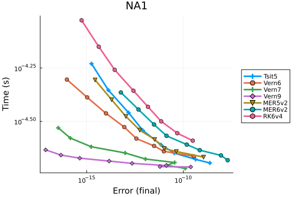


### NA2

```julia
prob = NA_PROBLEMS[2]
test_sol = solve(prob, Vern9(), abstol=1/10^14, reltol=1/10^14)
wp = WorkPrecisionSet(prob, abstols, reltols, setups; appxsol=test_sol, save_everystep=false, numruns=100)
plot(wp; title="NA2")
```

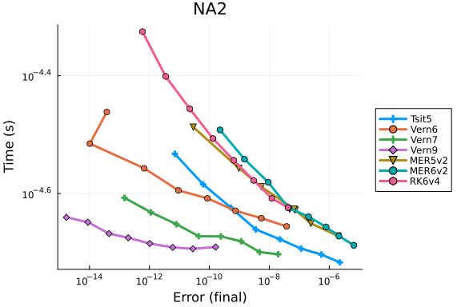


### NA4

```julia
prob = NA_PROBLEMS[4]
test_sol = solve(prob, Vern9(), abstol=1/10^14, reltol=1/10^14)
wp = WorkPrecisionSet(prob, abstols, reltols, setups; appxsol=test_sol, save_everystep=false, numruns=100)
plot(wp; title="NA4")
```

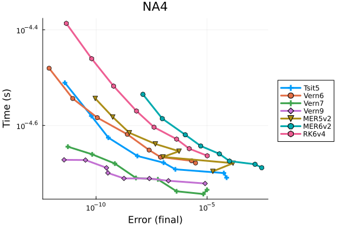


### NA5

```julia
prob = NA_PROBLEMS[5]
test_sol = solve(prob, Vern9(), abstol=1/10^14, reltol=1/10^14)
wp = WorkPrecisionSet(prob, abstols, reltols, setups; appxsol=test_sol, save_everystep=false, numruns=100)
plot(wp; title="NA5")
```

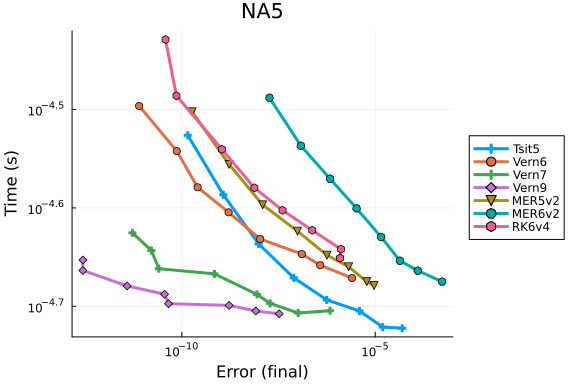


## Non-Stiff NB Problems

### NB1

```julia
prob = NB_PROBLEMS[1]
test_sol = solve(prob, Vern9(), abstol=1/10^14, reltol=1/10^14)
wp = WorkPrecisionSet(prob, abstols, reltols, setups; appxsol=test_sol, save_everystep=false, numruns=100)
plot(wp; title="NB1")
```

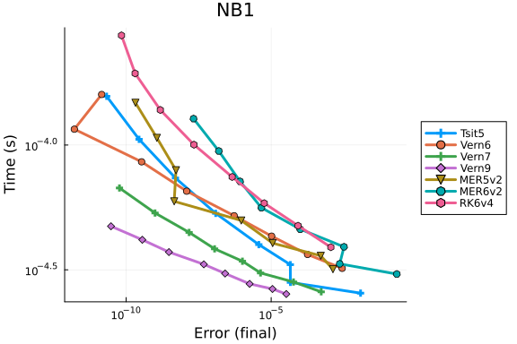


### NB2

```julia
prob = NB_PROBLEMS[2]
test_sol = solve(prob, Vern9(), abstol=1/10^14, reltol=1/10^14)
wp = WorkPrecisionSet(prob, abstols, reltols, setups; appxsol=test_sol, save_everystep=false, numruns=100)
plot(wp; title="NB2")
```

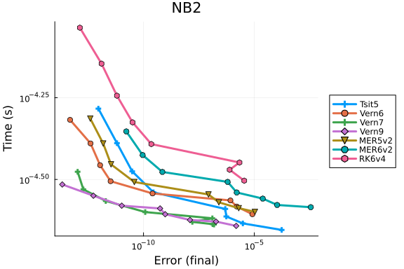


### NB3

```julia
prob = NB_PROBLEMS[3]
test_sol = solve(prob, Vern9(), abstol=1/10^14, reltol=1/10^14)
wp = WorkPrecisionSet(prob, abstols, reltols, setups; appxsol=test_sol, save_everystep=false, numruns=100)
plot(wp; title="NB3")
```

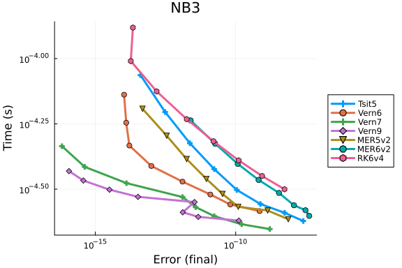


### NB5

```julia
prob = NB_PROBLEMS[5]
test_sol = solve(prob, Vern9(), abstol=1/10^14, reltol=1/10^14)
wp = WorkPrecisionSet(prob, abstols, reltols, setups; appxsol=test_sol, save_everystep=false, numruns=100)
plot(wp; title="NB5")
```

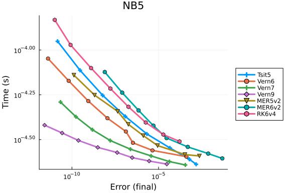


## Non-Stiff NC Problems

### NC1

```julia
prob = NC_PROBLEMS[1]
test_sol = solve(prob, Vern9(), abstol=1/10^14, reltol=1/10^14)
wp = WorkPrecisionSet(prob, abstols, reltols, setups; appxsol=test_sol, save_everystep=false, numruns=100)
plot(wp; title="NC1")
```

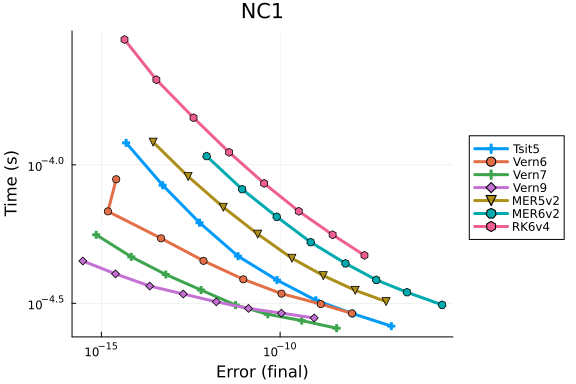


### NC2

```julia
prob = NC_PROBLEMS[2]
test_sol = solve(prob, Vern9(), abstol=1/10^14, reltol=1/10^14)
wp = WorkPrecisionSet(prob, abstols, reltols, setups; appxsol=test_sol, save_everystep=false, numruns=100)
plot(wp; title="NC2")
```

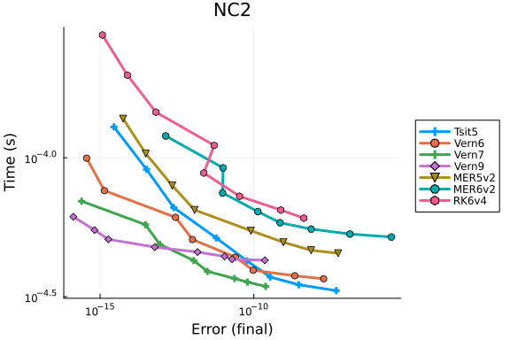


### NC3

```julia
prob = NC_PROBLEMS[3]
test_sol = solve(prob, Vern9(), abstol=1/10^14, reltol=1/10^14)
wp = WorkPrecisionSet(prob, abstols, reltols, setups; appxsol=test_sol, save_everystep=false, numruns=100)
plot(wp; title="NC3")
```

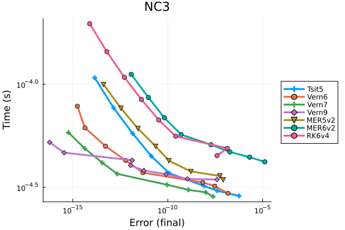


### NC4

```julia
prob = NC_PROBLEMS[4]
test_sol = solve(prob, Vern9(), abstol=1/10^14, reltol=1/10^14)
wp = WorkPrecisionSet(prob, abstols, reltols, setups; appxsol=test_sol, save_everystep=false, numruns=100)
plot(wp; title="NC4")
```

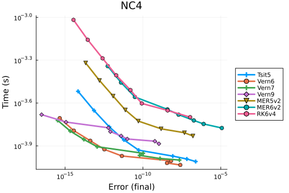


### NC5

```julia
prob = NC_PROBLEMS[5]
test_sol = solve(prob, Vern9(), abstol=1/10^14, reltol=1/10^14)
wp = WorkPrecisionSet(prob, abstols, reltols, setups; appxsol=test_sol, save_everystep=false, numruns=100)
plot(wp; title="NC5")
```

```
Error: BoundsError: attempt to access 4-element Vector{SciMLBase.ODEProblem
{uType, Tuple{Float64, Float64}, false, ModelingToolkit.MTKParameters{Stati
cArraysCore.SizedVector{0, Float64, Vector{Float64}}, Vector{Float64}, Tupl
e{}, Tuple{}, Tuple{}, Tuple{}}, F, Base.Pairs{Symbol, Union{}, Tuple{}, @N
amedTuple{}}, SciMLBase.StandardODEProblem} where {uType, F}} at index [5]
```


## Non-Stiff ND Problems

### ND1

```julia
prob = ND_PROBLEMS[1]
test_sol = solve(prob, Vern9(), abstol=1/10^14, reltol=1/10^14)
wp = WorkPrecisionSet(prob, abstols, reltols, setups; appxsol=test_sol, save_everystep=false, numruns=100)
plot(wp; title="ND1")
```

```
Error: StackOverflowError:
```


### ND2

```julia
prob = ND_PROBLEMS[2]
test_sol = solve(prob, Vern9(), abstol=1/10^14, reltol=1/10^14)
wp = WorkPrecisionSet(prob, abstols, reltols, setups; appxsol=test_sol, save_everystep=false, numruns=100)
plot(wp; title="ND2")
```

```
Error: StackOverflowError:
```


### ND3

```julia
prob = ND_PROBLEMS[3]
test_sol = solve(prob, Vern9(), abstol=1/10^14, reltol=1/10^14)
wp = WorkPrecisionSet(prob, abstols, reltols, setups; appxsol=test_sol, save_everystep=false, numruns=100)
plot(wp; title="ND3")
```

```
Error: StackOverflowError:
```


### ND4

```julia
prob = ND_PROBLEMS[4]
test_sol = solve(prob, Vern9(), abstol=1/10^14, reltol=1/10^14)
wp = WorkPrecisionSet(prob, abstols, reltols, setups; appxsol=test_sol, save_everystep=false, numruns=100)
plot(wp; title="ND4")
```

```
Error: StackOverflowError:
```


### ND5

```julia
prob = ND_PROBLEMS[5]
test_sol = solve(prob, Vern9(), abstol=1/10^14, reltol=1/10^14)
wp = WorkPrecisionSet(prob, abstols, reltols, setups; appxsol=test_sol, save_everystep=false, numruns=100)
plot(wp; title="ND5")
```

```
Error: StackOverflowError:
```


## Appendix

These benchmarks are a part of the SciMLBenchmarks.jl repository, found at: [https://github.com/SciML/SciMLBenchmarks.jl](https://github.com/SciML/SciMLBenchmarks.jl). For more information on high-performance scientific machine learning, check out the SciML Open Source Software Organization [https://sciml.ai](https://sciml.ai).

To locally run this benchmark, do the following commands:

```
using SciMLBenchmarks
SciMLBenchmarks.weave_file("benchmarks/NonStiffODE","EnrightPryce_wpd.jmd")
```

Computer Information:

```
Julia Version 1.10.10
Commit 95f30e51f41 (2025-06-27 09:51 UTC)
Build Info:
  Official https://julialang.org/ release
Platform Info:
  OS: Linux (x86_64-linux-gnu)
  CPU: 128 × AMD EPYC 7502 32-Core Processor
  WORD_SIZE: 64
  LIBM: libopenlibm
  LLVM: libLLVM-15.0.7 (ORCJIT, znver2)
Threads: 1 default, 0 interactive, 1 GC (on 128 virtual cores)
Environment:
  JULIA_CPU_THREADS = 128
  JULIA_DEPOT_PATH = /cache/julia-buildkite-plugin/depots/5b300254-1738-4989-ae0a-f4d2d937f953

```

Package Information:

```
Status `/cache/build/exclusive-amdci3-0/julialang/scimlbenchmarks-dot-jl/benchmarks/NonStiffODE/Project.toml`
⌃ [2b5f629d] DiffEqBase v6.184.0
  [f3b72e0c] DiffEqDevTools v2.48.0
  [7f56f5a3] LSODA v0.7.5
  [961ee093] ModelingToolkit v10.21.0
  [54ca160b] ODEInterface v0.5.0
  [09606e27] ODEInterfaceDiffEq v3.13.4
  [1dea7af3] OrdinaryDiffEq v6.102.0
  [dc97f408] OrdinaryDiffEqSIMDRK v1.1.0
  [65888b18] ParameterizedFunctions v5.19.0
  [91a5bcdd] Plots v1.40.19
  [31c91b34] SciMLBenchmarks v0.1.3
⌃ [90137ffa] StaticArrays v1.9.14
  [c3572dad] Sundials v4.28.0
  [0c5d862f] Symbolics v6.52.0
  [37e2e46d] LinearAlgebra
  [9a3f8284] Random
Info Packages marked with ⌃ have new versions available and may be upgradable.
Warning The project dependencies or compat requirements have changed since the manifest was last resolved. It is recommended to `Pkg.resolve()` or consider `Pkg.update()` if necessary.
```

And the full manifest:

```
Status `/cache/build/exclusive-amdci3-0/julialang/scimlbenchmarks-dot-jl/benchmarks/NonStiffODE/Manifest.toml`
  [47edcb42] ADTypes v1.17.0
  [1520ce14] AbstractTrees v0.4.5
  [7d9f7c33] Accessors v0.1.42
  [79e6a3ab] Adapt v4.3.0
  [66dad0bd] AliasTables v1.1.3
  [ec485272] ArnoldiMethod v0.4.0
  [4fba245c] ArrayInterface v7.19.0
  [4c555306] ArrayLayouts v1.11.2
  [e2ed5e7c] Bijections v0.2.2
  [d1d4a3ce] BitFlags v0.1.9
  [62783981] BitTwiddlingConvenienceFunctions v0.1.6
  [8e7c35d0] BlockArrays v1.7.1
  [70df07ce] BracketingNonlinearSolve v1.3.0
  [fa961155] CEnum v0.5.0
  [2a0fbf3d] CPUSummary v0.2.7
  [d360d2e6] ChainRulesCore v1.26.0
  [fb6a15b2] CloseOpenIntervals v0.1.13
  [944b1d66] CodecZlib v0.7.8
  [35d6a980] ColorSchemes v3.30.0
  [3da002f7] ColorTypes v0.12.1
  [c3611d14] ColorVectorSpace v0.11.0
  [5ae59095] Colors v0.13.1
  [861a8166] Combinatorics v1.0.3
  [a80b9123] CommonMark v0.9.1
  [38540f10] CommonSolve v0.2.4
  [bbf7d656] CommonSubexpressions v0.3.1
  [f70d9fcc] CommonWorldInvalidations v1.0.0
  [34da2185] Compat v4.18.0
  [b152e2b5] CompositeTypes v0.1.4
  [a33af91c] CompositionsBase v0.1.2
  [2569d6c7] ConcreteStructs v0.2.3
  [f0e56b4a] ConcurrentUtilities v2.5.0
  [8f4d0f93] Conda v1.10.2
  [187b0558] ConstructionBase v1.6.0
  [d38c429a] Contour v0.6.3
  [adafc99b] CpuId v0.3.1
  [9a962f9c] DataAPI v1.16.0
⌅ [864edb3b] DataStructures v0.18.22
  [e2d170a0] DataValueInterfaces v1.0.0
  [8bb1440f] DelimitedFiles v1.9.1
⌃ [2b5f629d] DiffEqBase v6.184.0
  [459566f4] DiffEqCallbacks v4.9.0
  [f3b72e0c] DiffEqDevTools v2.48.0
  [77a26b50] DiffEqNoiseProcess v5.24.1
  [163ba53b] DiffResults v1.1.0
  [b552c78f] DiffRules v1.15.1
  [a0c0ee7d] DifferentiationInterface v0.7.7
  [8d63f2c5] DispatchDoctor v0.4.26
  [b4f34e82] Distances v0.10.12
  [31c24e10] Distributions v0.25.120
  [ffbed154] DocStringExtensions v0.9.5
  [5b8099bc] DomainSets v0.7.16
  [7c1d4256] DynamicPolynomials v0.6.3
  [06fc5a27] DynamicQuantities v1.8.0
  [4e289a0a] EnumX v1.0.5
  [f151be2c] EnzymeCore v0.8.12
  [460bff9d] ExceptionUnwrapping v0.1.11
  [7d51a73a] ExplicitImports v1.13.2
  [d4d017d3] ExponentialUtilities v1.27.0
  [e2ba6199] ExprTools v0.1.10
  [55351af7] ExproniconLite v0.10.14
  [c87230d0] FFMPEG v0.4.4
  [7034ab61] FastBroadcast v0.3.5
  [9aa1b823] FastClosures v0.3.2
  [442a2c76] FastGaussQuadrature v1.0.2
  [a4df4552] FastPower v1.1.3
  [1a297f60] FillArrays v1.13.0
  [64ca27bc] FindFirstFunctions v1.4.1
  [6a86dc24] FiniteDiff v2.28.1
  [53c48c17] FixedPointNumbers v0.8.5
  [1fa38f19] Format v1.3.7
⌃ [f6369f11] ForwardDiff v0.10.38
  [069b7b12] FunctionWrappers v1.1.3
  [77dc65aa] FunctionWrappersWrappers v0.1.3
  [d9f16b24] Functors v0.5.2
  [46192b85] GPUArraysCore v0.2.0
  [28b8d3ca] GR v0.73.17
  [c145ed77] GenericSchur v0.5.5
  [d7ba0133] Git v1.5.0
  [c27321d9] Glob v1.3.1
  [86223c79] Graphs v1.13.1
  [42e2da0e] Grisu v1.0.2
  [cd3eb016] HTTP v1.10.17
  [eafb193a] Highlights v0.5.3
  [3e5b6fbb] HostCPUFeatures v0.1.17
  [34004b35] HypergeometricFunctions v0.3.28
⌃ [7073ff75] IJulia v1.30.1
  [615f187c] IfElse v0.1.1
  [3263718b] ImplicitDiscreteSolve v1.2.0
  [d25df0c9] Inflate v0.1.5
  [18e54dd8] IntegerMathUtils v0.1.3
  [8197267c] IntervalSets v0.7.11
  [3587e190] InverseFunctions v0.1.17
  [92d709cd] IrrationalConstants v0.2.4
  [82899510] IteratorInterfaceExtensions v1.0.0
  [1019f520] JLFzf v0.1.11
  [692b3bcd] JLLWrappers v1.7.1
  [682c06a0] JSON v0.21.4
  [ae98c720] Jieko v0.2.1
  [98e50ef6] JuliaFormatter v2.1.6
⌅ [70703baa] JuliaSyntax v0.4.10
  [ccbc3e58] JumpProcesses v9.17.0
  [ba0b0d4f] Krylov v0.10.1
  [7f56f5a3] LSODA v0.7.5
  [b964fa9f] LaTeXStrings v1.4.0
  [23fbe1c1] Latexify v0.16.9
  [10f19ff3] LayoutPointers v0.1.17
  [5078a376] LazyArrays v2.6.2
  [87fe0de2] LineSearch v0.1.4
  [d3d80556] LineSearches v7.4.0
  [7ed4a6bd] LinearSolve v3.37.0
  [2ab3a3ac] LogExpFunctions v0.3.29
  [e6f89c97] LoggingExtras v1.1.0
  [d8e11817] MLStyle v0.4.17
  [1914dd2f] MacroTools v0.5.16
  [d125e4d3] ManualMemory v0.1.8
  [bb5d69b7] MaybeInplace v0.1.4
  [739be429] MbedTLS v1.1.9
  [442fdcdd] Measures v0.3.2
  [e1d29d7a] Missings v1.2.0
  [961ee093] ModelingToolkit v10.21.0
  [2e0e35c7] Moshi v0.3.7
  [46d2c3a1] MuladdMacro v0.2.4
⌃ [102ac46a] MultivariatePolynomials v0.5.9
  [ffc61752] Mustache v1.0.21
  [d8a4904e] MutableArithmetics v1.6.4
  [d41bc354] NLSolversBase v7.10.0
  [2774e3e8] NLsolve v4.5.1
  [77ba4419] NaNMath v1.1.3
  [8913a72c] NonlinearSolve v4.10.0
  [be0214bd] NonlinearSolveBase v1.14.0
  [5959db7a] NonlinearSolveFirstOrder v1.7.0
  [9a2c21bd] NonlinearSolveQuasiNewton v1.8.0
  [26075421] NonlinearSolveSpectralMethods v1.3.0
  [54ca160b] ODEInterface v0.5.0
  [09606e27] ODEInterfaceDiffEq v3.13.4
  [6fe1bfb0] OffsetArrays v1.17.0
  [4d8831e6] OpenSSL v1.5.0
  [429524aa] Optim v1.13.2
  [bac558e1] OrderedCollections v1.8.1
  [1dea7af3] OrdinaryDiffEq v6.102.0
  [89bda076] OrdinaryDiffEqAdamsBashforthMoulton v1.5.0
  [6ad6398a] OrdinaryDiffEqBDF v1.10.1
  [bbf590c4] OrdinaryDiffEqCore v1.30.0
  [50262376] OrdinaryDiffEqDefault v1.8.0
  [4302a76b] OrdinaryDiffEqDifferentiation v1.14.0
  [9286f039] OrdinaryDiffEqExplicitRK v1.4.0
  [e0540318] OrdinaryDiffEqExponentialRK v1.8.0
  [becaefa8] OrdinaryDiffEqExtrapolation v1.8.0
  [5960d6e9] OrdinaryDiffEqFIRK v1.16.0
  [101fe9f7] OrdinaryDiffEqFeagin v1.4.0
  [d3585ca7] OrdinaryDiffEqFunctionMap v1.5.0
  [d28bc4f8] OrdinaryDiffEqHighOrderRK v1.5.0
  [9f002381] OrdinaryDiffEqIMEXMultistep v1.7.0
  [521117fe] OrdinaryDiffEqLinear v1.6.0
  [1344f307] OrdinaryDiffEqLowOrderRK v1.6.0
  [b0944070] OrdinaryDiffEqLowStorageRK v1.6.0
  [127b3ac7] OrdinaryDiffEqNonlinearSolve v1.14.1
  [c9986a66] OrdinaryDiffEqNordsieck v1.4.0
  [5dd0a6cf] OrdinaryDiffEqPDIRK v1.6.0
  [5b33eab2] OrdinaryDiffEqPRK v1.4.0
  [04162be5] OrdinaryDiffEqQPRK v1.4.0
  [af6ede74] OrdinaryDiffEqRKN v1.5.0
⌃ [43230ef6] OrdinaryDiffEqRosenbrock v1.16.1
  [2d112036] OrdinaryDiffEqSDIRK v1.7.0
  [dc97f408] OrdinaryDiffEqSIMDRK v1.1.0
  [669c94d9] OrdinaryDiffEqSSPRK v1.6.0
  [e3e12d00] OrdinaryDiffEqStabilizedIRK v1.6.0
  [358294b1] OrdinaryDiffEqStabilizedRK v1.4.0
  [fa646aed] OrdinaryDiffEqSymplecticRK v1.7.0
  [b1df2697] OrdinaryDiffEqTsit5 v1.5.0
  [79d7bb75] OrdinaryDiffEqVerner v1.6.0
  [90014a1f] PDMats v0.11.35
  [65888b18] ParameterizedFunctions v5.19.0
  [d96e819e] Parameters v0.12.3
  [69de0a69] Parsers v2.8.3
  [ccf2f8ad] PlotThemes v3.3.0
  [995b91a9] PlotUtils v1.4.3
  [91a5bcdd] Plots v1.40.19
  [e409e4f3] PoissonRandom v0.4.6
  [f517fe37] Polyester v0.7.18
  [1d0040c9] PolyesterWeave v0.2.2
  [85a6dd25] PositiveFactorizations v0.2.4
  [d236fae5] PreallocationTools v0.4.33
⌅ [aea7be01] PrecompileTools v1.2.1
  [21216c6a] Preferences v1.5.0
  [27ebfcd6] Primes v0.5.7
  [43287f4e] PtrArrays v1.3.0
  [1fd47b50] QuadGK v2.11.2
  [74087812] Random123 v1.7.1
  [e6cf234a] RandomNumbers v1.6.0
  [3cdcf5f2] RecipesBase v1.3.4
  [01d81517] RecipesPipeline v0.6.12
  [731186ca] RecursiveArrayTools v3.37.1
  [189a3867] Reexport v1.2.2
  [05181044] RelocatableFolders v1.0.1
  [ae029012] Requires v1.3.1
  [ae5879a3] ResettableStacks v1.1.1
  [79098fc4] Rmath v0.8.0
  [47965b36] RootedTrees v2.23.1
  [7e49a35a] RuntimeGeneratedFunctions v0.5.15
  [9dfe8606] SCCNonlinearSolve v1.4.0
  [94e857df] SIMDTypes v0.1.0
  [476501e8] SLEEFPirates v0.6.43
  [0bca4576] SciMLBase v2.114.0
  [31c91b34] SciMLBenchmarks v0.1.3
  [19f34311] SciMLJacobianOperators v0.1.8
  [c0aeaf25] SciMLOperators v1.6.0
  [431bcebd] SciMLPublic v1.0.0
  [53ae85a6] SciMLStructures v1.7.0
  [6c6a2e73] Scratch v1.3.0
  [efcf1570] Setfield v1.1.2
  [992d4aef] Showoff v1.0.3
  [777ac1f9] SimpleBufferStream v1.2.0
  [727e6d20] SimpleNonlinearSolve v2.7.0
  [699a6c99] SimpleTraits v0.9.5
  [ce78b400] SimpleUnPack v1.1.0
  [a2af1166] SortingAlgorithms v1.2.2
  [0a514795] SparseMatrixColorings v0.4.21
  [276daf66] SpecialFunctions v2.5.1
  [860ef19b] StableRNGs v1.0.3
  [aedffcd0] Static v1.2.0
  [0d7ed370] StaticArrayInterface v1.8.0
⌃ [90137ffa] StaticArrays v1.9.14
  [1e83bf80] StaticArraysCore v1.4.3
  [82ae8749] StatsAPI v1.7.1
  [2913bbd2] StatsBase v0.34.6
  [4c63d2b9] StatsFuns v1.5.0
  [7792a7ef] StrideArraysCore v0.5.8
  [69024149] StringEncodings v0.3.7
  [09ab397b] StructArrays v0.7.1
  [c3572dad] Sundials v4.28.0
  [2efcf032] SymbolicIndexingInterface v0.3.43
  [19f23fe9] SymbolicLimits v0.2.2
  [d1185830] SymbolicUtils v3.31.0
  [0c5d862f] Symbolics v6.52.0
  [3783bdb8] TableTraits v1.0.1
  [bd369af6] Tables v1.12.1
  [ed4db957] TaskLocalValues v0.1.3
  [62fd8b95] TensorCore v0.1.1
  [8ea1fca8] TermInterface v2.0.0
  [1c621080] TestItems v1.0.0
  [8290d209] ThreadingUtilities v0.5.5
  [a759f4b9] TimerOutputs v0.5.29
  [3bb67fe8] TranscodingStreams v0.11.3
  [410a4b4d] Tricks v0.1.12
  [781d530d] TruncatedStacktraces v1.4.0
  [5c2747f8] URIs v1.6.1
  [3a884ed6] UnPack v1.0.2
  [1cfade01] UnicodeFun v0.4.1
  [1986cc42] Unitful v1.24.0
  [45397f5d] UnitfulLatexify v1.7.0
  [a7c27f48] Unityper v0.1.6
  [41fe7b60] Unzip v0.2.0
⌃ [3d5dd08c] VectorizationBase v0.21.71
  [81def892] VersionParsing v1.3.0
  [44d3d7a6] Weave v0.10.12
  [ddb6d928] YAML v0.4.14
  [c2297ded] ZMQ v1.4.1
  [6e34b625] Bzip2_jll v1.0.9+0
  [83423d85] Cairo_jll v1.18.5+0
  [ee1fde0b] Dbus_jll v1.16.2+0
  [2702e6a9] EpollShim_jll v0.0.20230411+1
  [2e619515] Expat_jll v2.7.1+0
  [b22a6f82] FFMPEG_jll v7.1.1+0
  [a3f928ae] Fontconfig_jll v2.17.1+0
  [d7e528f0] FreeType2_jll v2.13.4+0
  [559328eb] FriBidi_jll v1.0.17+0
  [0656b61e] GLFW_jll v3.4.0+2
  [d2c73de3] GR_jll v0.73.17+0
  [b0724c58] GettextRuntime_jll v0.22.4+0
  [020c3dae] Git_LFS_jll v3.7.0+0
  [f8c6e375] Git_jll v2.51.0+0
  [7746bdde] Glib_jll v2.84.3+0
  [3b182d85] Graphite2_jll v1.3.15+0
  [2e76f6c2] HarfBuzz_jll v8.5.1+0
  [1d5cc7b8] IntelOpenMP_jll v2025.2.0+0
  [aacddb02] JpegTurbo_jll v3.1.2+0
  [c1c5ebd0] LAME_jll v3.100.3+0
  [88015f11] LERC_jll v4.0.1+0
  [1d63c593] LLVMOpenMP_jll v18.1.8+0
  [aae0fff6] LSODA_jll v0.1.2+0
  [dd4b983a] LZO_jll v2.10.3+0
  [e9f186c6] Libffi_jll v3.4.7+0
  [7e76a0d4] Libglvnd_jll v1.7.1+1
  [94ce4f54] Libiconv_jll v1.18.0+0
  [4b2f31a3] Libmount_jll v2.41.1+0
  [89763e89] Libtiff_jll v4.7.1+0
  [38a345b3] Libuuid_jll v2.41.1+0
  [856f044c] MKL_jll v2025.2.0+0
  [c771fb93] ODEInterface_jll v0.0.2+0
  [e7412a2a] Ogg_jll v1.3.6+0
  [9bd350c2] OpenSSH_jll v10.0.1+0
  [458c3c95] OpenSSL_jll v3.5.2+0
  [efe28fd5] OpenSpecFun_jll v0.5.6+0
  [91d4177d] Opus_jll v1.5.2+0
  [36c8627f] Pango_jll v1.56.3+0
⌅ [30392449] Pixman_jll v0.44.2+0
  [c0090381] Qt6Base_jll v6.8.2+1
  [629bc702] Qt6Declarative_jll v6.8.2+1
  [ce943373] Qt6ShaderTools_jll v6.8.2+1
  [e99dba38] Qt6Wayland_jll v6.8.2+1
  [f50d1b31] Rmath_jll v0.5.1+0
⌅ [fb77eaff] Sundials_jll v5.2.2+0
  [a44049a8] Vulkan_Loader_jll v1.3.243+0
  [a2964d1f] Wayland_jll v1.24.0+0
  [ffd25f8a] XZ_jll v5.8.1+0
  [f67eecfb] Xorg_libICE_jll v1.1.2+0
  [c834827a] Xorg_libSM_jll v1.2.6+0
  [4f6342f7] Xorg_libX11_jll v1.8.12+0
  [0c0b7dd1] Xorg_libXau_jll v1.0.13+0
  [935fb764] Xorg_libXcursor_jll v1.2.4+0
  [a3789734] Xorg_libXdmcp_jll v1.1.6+0
  [1082639a] Xorg_libXext_jll v1.3.7+0
  [d091e8ba] Xorg_libXfixes_jll v6.0.1+0
  [a51aa0fd] Xorg_libXi_jll v1.8.3+0
  [d1454406] Xorg_libXinerama_jll v1.1.6+0
  [ec84b674] Xorg_libXrandr_jll v1.5.5+0
  [ea2f1a96] Xorg_libXrender_jll v0.9.12+0
  [c7cfdc94] Xorg_libxcb_jll v1.17.1+0
  [cc61e674] Xorg_libxkbfile_jll v1.1.3+0
  [e920d4aa] Xorg_xcb_util_cursor_jll v0.1.5+0
  [12413925] Xorg_xcb_util_image_jll v0.4.1+0
  [2def613f] Xorg_xcb_util_jll v0.4.1+0
  [975044d2] Xorg_xcb_util_keysyms_jll v0.4.1+0
  [0d47668e] Xorg_xcb_util_renderutil_jll v0.3.10+0
  [c22f9ab0] Xorg_xcb_util_wm_jll v0.4.2+0
  [35661453] Xorg_xkbcomp_jll v1.4.7+0
  [33bec58e] Xorg_xkeyboard_config_jll v2.44.0+0
  [c5fb5394] Xorg_xtrans_jll v1.6.0+0
  [8f1865be] ZeroMQ_jll v4.3.6+0
  [3161d3a3] Zstd_jll v1.5.7+1
  [35ca27e7] eudev_jll v3.2.14+0
  [214eeab7] fzf_jll v0.61.1+0
  [a4ae2306] libaom_jll v3.12.1+0
  [0ac62f75] libass_jll v0.17.4+0
  [1183f4f0] libdecor_jll v0.2.2+0
  [2db6ffa8] libevdev_jll v1.13.4+0
  [f638f0a6] libfdk_aac_jll v2.0.4+0
  [36db933b] libinput_jll v1.28.1+0
  [b53b4c65] libpng_jll v1.6.50+0
  [a9144af2] libsodium_jll v1.0.21+0
  [f27f6e37] libvorbis_jll v1.3.8+0
  [009596ad] mtdev_jll v1.1.7+0
  [1317d2d5] oneTBB_jll v2022.0.0+0
  [1270edf5] x264_jll v10164.0.1+0
  [dfaa095f] x265_jll v4.1.0+0
  [d8fb68d0] xkbcommon_jll v1.9.2+0
  [0dad84c5] ArgTools v1.1.1
  [56f22d72] Artifacts
  [2a0f44e3] Base64
  [ade2ca70] Dates
  [8ba89e20] Distributed
  [f43a241f] Downloads v1.6.0
  [7b1f6079] FileWatching
  [9fa8497b] Future
  [b77e0a4c] InteractiveUtils
  [4af54fe1] LazyArtifacts
  [b27032c2] LibCURL v0.6.4
  [76f85450] LibGit2
  [8f399da3] Libdl
  [37e2e46d] LinearAlgebra
  [56ddb016] Logging
  [d6f4376e] Markdown
  [a63ad114] Mmap
  [ca575930] NetworkOptions v1.2.0
  [44cfe95a] Pkg v1.10.0
  [de0858da] Printf
  [3fa0cd96] REPL
  [9a3f8284] Random
  [ea8e919c] SHA v0.7.0
  [9e88b42a] Serialization
  [1a1011a3] SharedArrays
  [6462fe0b] Sockets
  [2f01184e] SparseArrays v1.10.0
  [10745b16] Statistics v1.10.0
  [4607b0f0] SuiteSparse
  [fa267f1f] TOML v1.0.3
  [a4e569a6] Tar v1.10.0
  [8dfed614] Test
  [cf7118a7] UUIDs
  [4ec0a83e] Unicode
  [e66e0078] CompilerSupportLibraries_jll v1.1.1+0
  [deac9b47] LibCURL_jll v8.4.0+0
  [e37daf67] LibGit2_jll v1.6.4+0
  [29816b5a] LibSSH2_jll v1.11.0+1
  [c8ffd9c3] MbedTLS_jll v2.28.2+1
  [14a3606d] MozillaCACerts_jll v2023.1.10
  [4536629a] OpenBLAS_jll v0.3.23+4
  [05823500] OpenLibm_jll v0.8.5+0
  [efcefdf7] PCRE2_jll v10.42.0+1
  [bea87d4a] SuiteSparse_jll v7.2.1+1
  [83775a58] Zlib_jll v1.2.13+1
  [8e850b90] libblastrampoline_jll v5.11.0+0
  [8e850ede] nghttp2_jll v1.52.0+1
  [3f19e933] p7zip_jll v17.4.0+2
Info Packages marked with ⌃ and ⌅ have new versions available. Those with ⌃ may be upgradable, but those with ⌅ are restricted by compatibility constraints from upgrading. To see why use `status --outdated -m`
Warning The project dependencies or compat requirements have changed since the manifest was last resolved. It is recommended to `Pkg.resolve()` or consider `Pkg.update()` if necessary.
```

