# SDE Basic Weak Work-Precision Diagrams

In this notebook we will run some benchmarks for the weak error on some simple sample SDEs. The weak error is defined as:

$$E_W = \mathbb{E}[Y_\delta(t)] - \mathbb{E}[Y(t)]$$

and is thus a measure of how close the mean of the numerical solution is to the mean of the true solution. Other moments can be measured as well, but the mean is a good stand-in for other properties. Note that convergence of the mean is calculated on a sample. Thus there's actually two sources of error. We have not only the error between the numerical and actual results, but we also have the error of the mean to the true mean due to only taking a finite sample. Using the normal confidence interval of the mean due to the Central Limit Theorem, the error due to finite sampling is

$$E_S = V[Y(t)]/\sqrt(N)$$

for $N$ being the number of samples. In practice,

$$E = minimum(E_W,E_S)$$

Thus in each case, we will determine the variance of the true solution and use that to estimate the sample error, and the goal is to thus find the numerical method that achieves the sample error most efficiently.

```julia
using StochasticDiffEq, DiffEqDevTools, ParameterizedFunctions, SDEProblemLibrary
using Plots;
gr()
import SDEProblemLibrary: prob_sde_additive,
                          prob_sde_linear, prob_sde_wave
const N = 1000
```

```
1000
```


### Additive Noise Problem

$$dX_{t}=\left(\frac{\beta}{\sqrt{1+t}}-\frac{1}{2\left(1+t\right)}X_{t}\right)dt+\frac{\alpha\beta}{\sqrt{1+t}}dW_{t},\thinspace\thinspace\thinspace X_{0}=\frac{1}{2}$$

where $\alpha=\frac{1}{10}$ and $\beta=\frac{1}{20}$. Actual Solution:

$$X_{t}=\frac{1}{\sqrt{1+t}}X_{0}+\frac{\beta}{\sqrt{1+t}}\left(t+\alpha W_{t}\right).$$

```julia
prob = prob_sde_additive

reltols = 1.0 ./ 10.0 .^ (1:5)
abstols = reltols#[0.0 for i in eachindex(reltols)]
setups = [Dict(:alg=>EM(), :dts=>1.0 ./ 5.0 .^ ((1:length(reltols)) .+ 1))
          Dict(:alg=>RKMil(), :dts=>1.0 ./ 5.0 .^ ((1:length(reltols)) .+ 1), :adaptive=>false)
          Dict(:alg=>SRIW1(), :dts=>1.0 ./ 5.0 .^ ((1:length(reltols)) .+ 1), :adaptive=>false)
          Dict(:alg=>SRA1(), :dts=>1.0 ./ 5.0 .^ ((1:length(reltols)) .+ 1), :adaptive=>false)
          Dict(:alg=>SRA1())
          Dict(:alg=>SRIW1())]
wp = WorkPrecisionSet(prob, abstols, reltols, setups; numruns_error = N,
    save_everystep = false,
    parallel_type = :none,
    error_estimate = :weak_final)#
plot(wp)
```

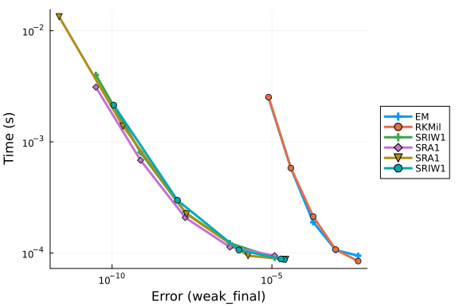

```julia
sample_size = Int[10; 1e2; 1e3; 1e4]
se = get_sample_errors(prob, setups[6], numruns = sample_size,
    sample_error_runs = 100_000, solution_runs = 100)
```

```
4-element Vector{Float64}:
 0.0004214681885451998
 3.6037637272974124e-5
 4.3587767539495506e-6
 4.7557374180683486e-7
```


```julia
times = [wp[i].times for i in 1:length(wp)]
times = [minimum(minimum(t) for t in times), maximum(maximum(t) for t in times)]
plot!([se[end]; se[end]], times, color = :red,
    linestyle = :dash, label = "Sample Error: 1000", lw = 3)
```

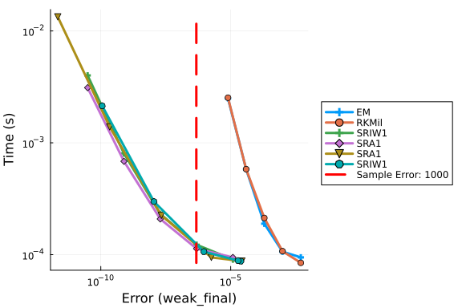

```julia
prob = prob_sde_additive

reltols = 1.0 ./ 10.0 .^ (1:5)
abstols = reltols#[0.0 for i in eachindex(reltols)]
setups = [Dict(:alg=>SRA1())
          Dict(:alg=>SRA2())
          Dict(:alg=>SRA3())
          Dict(:alg=>SOSRA())
          Dict(:alg=>SOSRA2())]
wp = WorkPrecisionSet(prob, abstols, reltols, setups; numruns_error = N,
    save_everystep = false,
    maxiters = 1e7,
    parallel_type = :none,
    error_estimate = :weak_final)
plot(wp)
```

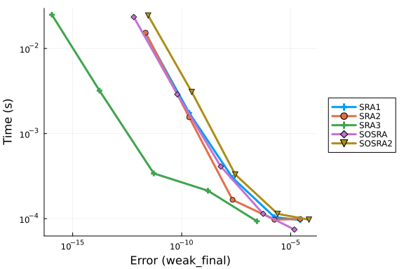

```julia
sample_size = Int[10; 1e2; 1e3; 1e4]
se = get_sample_errors(prob, setups[4], numruns = sample_size,
    sample_error_runs = 100_000, solution_runs = 100)
```

```
4-element Vector{Float64}:
 0.00039888641136324386
 4.7800461090987016e-5
 4.478273674112557e-6
 4.261610897667312e-7
```


```julia
times = [wp[i].times for i in 1:length(wp)]
times = [minimum(minimum(t) for t in times), maximum(maximum(t) for t in times)]
plot!([se[end]; se[end]], times, color = :red,
    linestyle = :dash, label = "Sample Error: 1000", lw = 3)
```

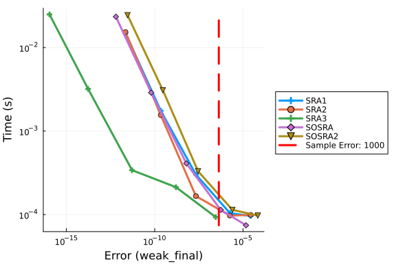


### Scalar Noise

We will use a the linear SDE (also known as the Black-Scholes equation)

$$dX_{t}=\alpha X_{t}dt+\beta X_{t}dW_{t},\thinspace\thinspace\thinspace X_{0}=\frac{1}{2}$$

where $\alpha=\frac{1}{10}$ and $\beta=\frac{1}{20}$. Actual Solution:

$$X_{t}=X_{0}e^{\left(\beta-\frac{\alpha^{2}}{2}\right)t+\alpha W_{t}}.$$

```julia
prob = prob_sde_linear

reltols = 1.0 ./ 10.0 .^ (1:5)
abstols = reltols#[0.0 for i in eachindex(reltols)]

setups = [Dict(:alg=>SRIW1())
          Dict(:alg=>EM(), :dts=>1.0 ./ 5.0 .^ ((1:length(reltols)) .+ 1))
          Dict(:alg=>RKMil(), :dts=>1.0 ./ 5.0 .^ ((1:length(reltols)) .+ 1), :adaptive=>false)
          Dict(:alg=>SRIW1(), :dts=>1.0 ./ 5.0 .^ ((1:length(reltols)) .+ 1), :adaptive=>false)]
wp = WorkPrecisionSet(prob, abstols, reltols, setups; numruns_error = N,
    save_everystep = false,
    maxiters = 1e7,
    parallel_type = :none,
    error_estimate = :weak_final)
plot(wp)
```

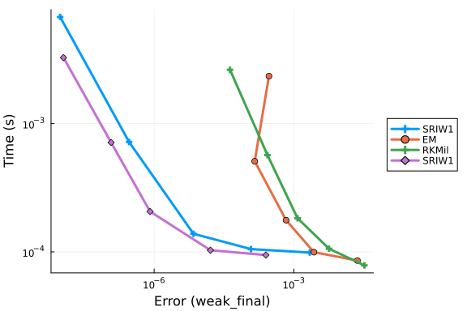

```julia
sample_size = Int[10; 1e2; 1e3; 1e4]
se = get_sample_errors(prob, setups[1], numruns = sample_size,
    sample_error_runs = 100_000, solution_runs = 100)
```

```
4-element Vector{Float64}:
 0.17658229343763543
 0.01661621032508704
 0.0016543722590555907
 0.0001790525180006909
```


```julia
times = [wp[i].times for i in 1:length(wp)]
times = [minimum(minimum(t) for t in times), maximum(maximum(t) for t in times)]
plot!([se[end]; se[end]], times, color = :red,
    linestyle = :dash, label = "Sample Error: 1000", lw = 3)
```

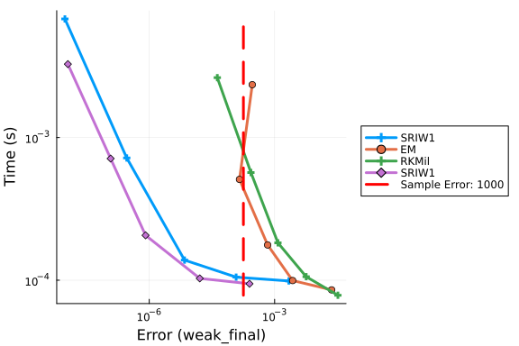

```julia
prob = prob_sde_linear

reltols = 1.0 ./ 10.0 .^ (1:5)
abstols = reltols#[0.0 for i in eachindex(reltols)]

setups = [Dict(:alg=>EM(), :dts=>1.0 ./ 5.0 .^ ((1:length(reltols)) .+ 2))
          Dict(:alg=>RKMil(), :dts=>1.0 ./ 5.0 .^ ((1:length(reltols)) .+ 2), :adaptive=>false)
          Dict(:alg=>SRI())
          Dict(:alg=>SRIW1())
          Dict(:alg=>SRIW2())
          Dict(:alg=>SOSRI())
          Dict(:alg=>SOSRI2())]
wp = WorkPrecisionSet(prob, abstols, reltols, setups; numruns_error = N,
    save_everystep = false,
    maxiters = 1e7,
    parallel_type = :none,
    error_estimate = :weak_final)
plot(wp)
```

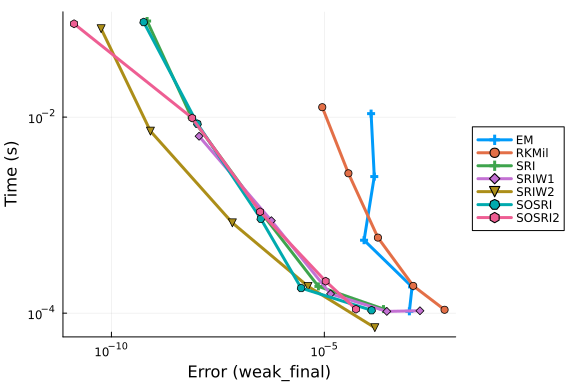

```julia
sample_size = Int[10; 1e2; 1e3; 1e4]
se = get_sample_errors(prob, setups[6], numruns = sample_size,
    sample_error_runs = 100_000, solution_runs = 100)
```

```
4-element Vector{Float64}:
 0.21843350647419263
 0.015744941057615064
 0.0014733549395707128
 0.00017014740269934086
```


```julia
times = [wp[i].times for i in 1:length(wp)]
times = [minimum(minimum(t) for t in times), maximum(maximum(t) for t in times)]
plot!([se[end]; se[end]], times, color = :red,
    linestyle = :dash, label = "Sample Error: 1000", lw = 3)
```

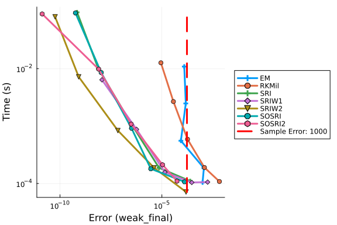


## Scalar Wave SDE

$$dX_{t}=-\left(\frac{1}{10}\right)^{2}\sin\left(X_{t}\right)\cos^{3}\left(X_{t}\right)dt+\frac{1}{10}\cos^{2}\left(X_{t}\right)dW_{t},\thinspace\thinspace\thinspace X_{0}=\frac{1}{2}$$

Actual Solution:

$$X_{t}=\arctan\left(\frac{1}{10}W_{t}+\tan\left(X_{0}\right)\right).$$

```julia
prob = prob_sde_wave

reltols = 1.0 ./ 10.0 .^ (1:5)
abstols = reltols#[0.0 for i in eachindex(reltols)]

setups = [Dict(:alg=>EM(), :dts=>1.0 ./ 5.0 .^ ((1:length(reltols)) .+ 1))
          Dict(:alg=>RKMil(), :dts=>1.0 ./ 5.0 .^ ((1:length(reltols)) .+ 1), :adaptive=>false)
          Dict(:alg=>SRIW1(), :dts=>1.0 ./ 5.0 .^ ((1:length(reltols)) .+ 1), :adaptive=>false)
          Dict(:alg=>SRIW1())]

wp = WorkPrecisionSet(prob, abstols, reltols, setups; numruns_error = N,
    save_everystep = false,
    maxiters = 1e7,
    parallel_type = :none,
    error_estimate = :weak_final)
plot(wp)
```

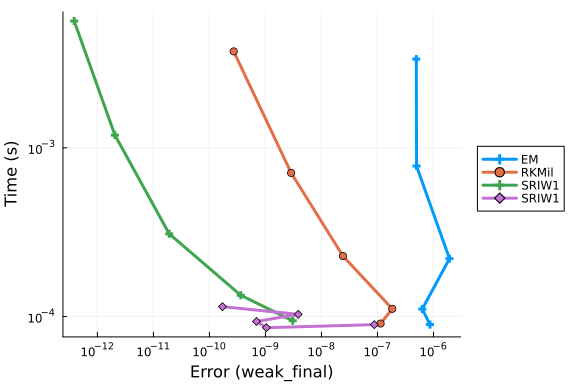

```julia
sample_size = Int[10; 1e2; 1e3; 1e4]
se = get_sample_errors(prob, setups[4], numruns = sample_size,
    sample_error_runs = 100_000, solution_runs = 100)
```

```
4-element Vector{Float64}:
 0.00336661257169532
 0.0003842612530481529
 3.2680473140635766e-5
 3.504425483890322e-6
```


```julia
times = [wp[i].times for i in 1:length(wp)]
times = [minimum(minimum(t) for t in times), maximum(maximum(t) for t in times)]
plot!([se[end]; se[end]], times, color = :red,
    linestyle = :dash, label = "Sample Error: 1000", lw = 3)
```

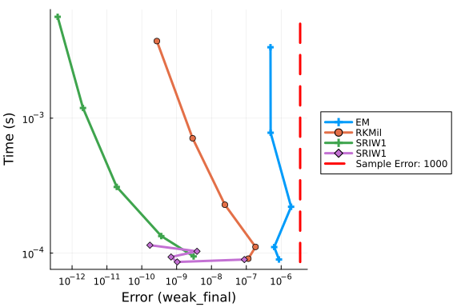

```julia
prob = prob_sde_wave

reltols = 1.0 ./ 10.0 .^ (1:5)
abstols = reltols#[0.0 for i in eachindex(reltols)]

setups = [Dict(:alg=>EM(), :dts=>1.0 ./ 5.0 .^ ((1:length(reltols)) .+ 2))
          Dict(:alg=>RKMil(), :dts=>1.0 ./ 5.0 .^ ((1:length(reltols)) .+ 2), :adaptive=>false)
          Dict(:alg=>SRI())
          Dict(:alg=>SRIW1())
          Dict(:alg=>SRIW2())
          Dict(:alg=>SOSRI())
          Dict(:alg=>SOSRI2())]
wp = WorkPrecisionSet(prob, abstols, reltols, setups; numruns_error = N,
    save_everystep = false,
    maxiters = 1e7,
    parallel_type = :none,
    error_estimate = :weak_final)
plot(wp)
```

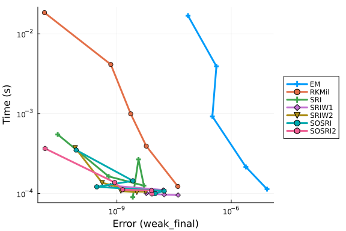

```julia
sample_size = Int[10; 1e2; 1e3; 1e4]
se = get_sample_errors(prob, setups[6], numruns = sample_size,
    sample_error_runs = 100_000, solution_runs = 100)
```

```
4-element Vector{Float64}:
 0.0031288644313949955
 0.0003187600925836145
 3.457265684456277e-5
 4.408674917962274e-6
```


```julia
times = [wp[i].times for i in 1:length(wp)]
times = [minimum(minimum(t) for t in times), maximum(maximum(t) for t in times)]
plot!([se[end]; se[end]], times, color = :red,
    linestyle = :dash, label = "Sample Error: 1000", lw = 3)
```

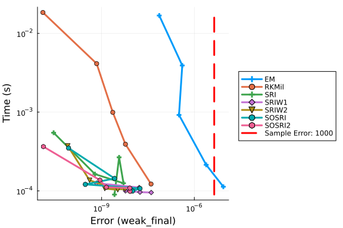


## Summary

In the additive noise problem, the `EM` and `RKMil` algorithms are not effective at reaching the sample error. In the other two problems, the `EM` and `RKMil` algorithms are as efficient as the higher order methods at achieving the maximal weak error.


## Appendix

These benchmarks are a part of the SciMLBenchmarks.jl repository, found at: [https://github.com/SciML/SciMLBenchmarks.jl](https://github.com/SciML/SciMLBenchmarks.jl). For more information on high-performance scientific machine learning, check out the SciML Open Source Software Organization [https://sciml.ai](https://sciml.ai).

To locally run this benchmark, do the following commands:
```
using SciMLBenchmarks
SciMLBenchmarks.weave_file("benchmarks/NonStiffSDE","BasicSDEWeakWorkPrecision.jmd")
```

Computer Information:

```
Julia Version 1.11.9
Commit 53a02c0720c (2026-02-06 00:27 UTC)
Build Info:
  Official https://julialang.org/ release
Platform Info:
  OS: Linux (x86_64-linux-gnu)
  CPU: 128 × AMD EPYC 7502 32-Core Processor
  WORD_SIZE: 64
  LLVM: libLLVM-16.0.6 (ORCJIT, znver2)
Threads: 128 default, 0 interactive, 64 GC (on 128 virtual cores)
Environment:
  JULIA_DEPOT_PATH = /home/crackauc/github-runners/amdci8-1/.julia
  JULIA_NUM_THREADS = auto

```

Package Information:

```
Status `~/github-runners/amdci8-1/_work/SciMLBenchmarks.jl/SciMLBenchmarks.jl/benchmarks/NonStiffSDE/Project.toml`
  [f3b72e0c] DiffEqDevTools v3.6.3
  [77a26b50] DiffEqNoiseProcess v5.36.3
  [65888b18] ParameterizedFunctions v5.27.0
  [91a5bcdd] Plots v1.41.7
  [c72e72a9] SDEProblemLibrary v1.2.4
  [31c91b34] SciMLBenchmarks v0.2.1
  [a6db7da4] SciMLLogging v2.1.0
  [789caeaf] StochasticDiffEq v7.2.0
```

And the full manifest:

```
Status `~/github-runners/amdci8-1/_work/SciMLBenchmarks.jl/SciMLBenchmarks.jl/benchmarks/NonStiffSDE/Manifest.toml`
  [47edcb42] ADTypes v1.24.0
  [14f7f29c] AMD v0.5.4
  [6e696c72] AbstractPlutoDingetjes v1.4.1
  [1520ce14] AbstractTrees v0.4.5
  [7d9f7c33] Accessors v0.1.45
  [79e6a3ab] Adapt v4.7.0
  [66dad0bd] AliasTables v1.1.3
  [ec485272] ArnoldiMethod v0.4.0
  [4fba245c] ArrayInterface v7.30.2
  [4c555306] ArrayLayouts v1.12.2
  [aae01518] BandedMatrices v1.12.0
  [e2ed5e7c] Bijections v0.2.2
  [b2a6c25c] BinaryHeaps v1.1.0
  [caf10ac8] BipartiteGraphs v0.1.14
  [8e7c35d0] BlockArrays v1.10.0
  [70df07ce] BracketingNonlinearSolve v1.12.7
  [35d6a980] ColorSchemes v3.31.0
  [3da002f7] ColorTypes v0.12.1
  [c3611d14] ColorVectorSpace v0.11.0
  [5ae59095] Colors v0.13.1
⌅ [861a8166] Combinatorics v1.0.2
  [38540f10] CommonSolve v0.2.14
  [bbf7d656] CommonSubexpressions v0.3.1
  [f70d9fcc] CommonWorldInvalidations v1.2.2
  [34da2185] Compat v4.18.1
  [b152e2b5] CompositeTypes v0.1.4
  [a33af91c] CompositionsBase v0.1.2
  [2569d6c7] ConcreteStructs v0.2.8
  [187b0558] ConstructionBase v1.6.0
  [d38c429a] Contour v0.6.3
  [a8cc5b0e] Crayons v4.2.0
  [9a962f9c] DataAPI v1.16.0
  [864edb3b] DataStructures v0.19.6
  [e2d170a0] DataValueInterfaces v1.0.0
  [8bb1440f] DelimitedFiles v1.9.1
  [2b5f629d] DiffEqBase v7.21.1
  [459566f4] DiffEqCallbacks v4.19.4
  [f3b72e0c] DiffEqDevTools v3.6.3
  [77a26b50] DiffEqNoiseProcess v5.36.3
  [163ba53b] DiffResults v1.1.0
  [b552c78f] DiffRules v1.16.0
  [a0c0ee7d] DifferentiationInterface v0.7.21
  [31c24e10] Distributions v0.25.131
  [ffbed154] DocStringExtensions v0.9.5
  [5b8099bc] DomainSets v0.8.1
  [7c1d4256] DynamicPolynomials v0.6.8
  [4e289a0a] EnumX v1.0.7
  [f151be2c] EnzymeCore v0.8.21
  [e2ba6199] ExprTools v0.1.11
  [55351af7] ExproniconLite v0.10.14
  [c87230d0] FFMPEG v0.4.5
  [7034ab61] FastBroadcast v1.4.0
  [9aa1b823] FastClosures v0.3.2
  [a4df4552] FastPower v1.5.0
  [1a297f60] FillArrays v1.17.0
  [64ca27bc] FindFirstFunctions v3.2.1
  [6a86dc24] FiniteDiff v2.33.0
⌅ [53c48c17] FixedPointNumbers v0.8.6
  [1fa38f19] Format v1.3.7
  [f6369f11] ForwardDiff v1.4.6
  [a85aefff] FunctionMaps v0.1.2
  [069b7b12] FunctionWrappers v1.1.3
  [77dc65aa] FunctionWrappersWrappers v1.13.0
  [46192b85] GPUArraysCore v0.2.0
  [28b8d3ca] GR v0.73.27
  [a0844989] Gamma v1.2.0
  [86223c79] Graphs v1.15.0
⌅ [eafb193a] Highlights v0.5.3
  [34004b35] HypergeometricFunctions v0.3.30
  [3263718b] ImplicitDiscreteSolve v2.3.0
  [d25df0c9] Inflate v0.1.5
  [18e54dd8] IntegerMathUtils v0.1.4
  [8197267c] IntervalSets v0.7.14
  [3587e190] InverseFunctions v0.1.17
  [92d709cd] IrrationalConstants v0.2.6
  [82899510] IteratorInterfaceExtensions v1.0.0
  [1019f520] JLFzf v0.1.11
  [692b3bcd] JLLWrappers v1.8.0
⌅ [682c06a0] JSON v0.21.4
  [ae98c720] Jieko v0.2.1
⌃ [ccbc3e58] JumpProcesses v9.32.3
  [ba0b0d4f] Krylov v0.10.10
  [2faa5264] LHLFactorization v2.2.2
  [b964fa9f] LaTeXStrings v1.4.1
  [23fbe1c1] Latexify v0.16.12
  [87fe0de2] LineSearch v0.1.18
⌃ [7ed4a6bd] LinearSolve v5.17.3
  [2ab3a3ac] LogExpFunctions v1.0.1
  [e6f89c97] LoggingExtras v1.2.0
  [1914dd2f] MacroTools v0.5.16
  [bb5d69b7] MaybeInplace v0.1.8
  [442fdcdd] Measures v0.3.3
  [e1d29d7a] Missings v1.2.0
  [961ee093] ModelingToolkit v11.43.1
⌃ [7771a370] ModelingToolkitBase v1.71.2
  [6bb917b9] ModelingToolkitTearing v1.20.6
⌅ [2e0e35c7] Moshi v0.3.9
  [46d2c3a1] MuladdMacro v0.2.7
  [102ac46a] MultivariatePolynomials v0.5.19
  [ffc61752] Mustache v1.0.21
  [d8a4904e] MutableArithmetics v1.8.0
  [77ba4419] NaNMath v1.1.4
⌃ [8913a72c] NonlinearSolve v4.30.0
⌃ [be0214bd] NonlinearSolveBase v2.49.5
⌃ [5959db7a] NonlinearSolveFirstOrder v2.6.1
  [9a2c21bd] NonlinearSolveQuasiNewton v1.15.3
  [26075421] NonlinearSolveSpectralMethods v1.8.3
  [6fe1bfb0] OffsetArrays v1.17.0
  [bac558e1] OrderedCollections v2.0.1
⌃ [bbf590c4] OrdinaryDiffEqCore v4.17.2
  [4302a76b] OrdinaryDiffEqDifferentiation v3.12.0
  [127b3ac7] OrdinaryDiffEqNonlinearSolve v2.9.8
  [90014a1f] PDMats v0.11.41
  [65888b18] ParameterizedFunctions v5.27.0
⌅ [69de0a69] Parsers v2.8.8
  [ccf2f8ad] PlotThemes v3.3.0
  [995b91a9] PlotUtils v1.4.4
  [91a5bcdd] Plots v1.41.7
  [e409e4f3] PoissonRandom v0.4.13
  [d236fae5] PreallocationTools v1.7.1
⌅ [aea7be01] PrecompileTools v1.2.1
  [21216c6a] Preferences v1.6.0
  [08abe8d2] PrettyTables v3.4.8
  [27ebfcd6] Primes v0.5.7
  [43287f4e] PtrArrays v1.4.0
  [0c0d3e7f] PureKLU v1.5.0
  [1fd47b50] QuadGK v2.11.3
  [988b38a3] ReadOnlyArrays v0.2.0
  [795d4caa] ReadOnlyDicts v1.0.1
  [3cdcf5f2] RecipesBase v1.3.4
  [01d81517] RecipesPipeline v0.6.12
  [731186ca] RecursiveArrayTools v4.5.1
  [189a3867] Reexport v1.2.2
  [05181044] RelocatableFolders v1.0.1
  [ae029012] Requires v1.3.1
  [ae5879a3] ResettableStacks v1.4.0
  [9fe22ead] RespecializeParams v1.3.0
  [79098fc4] Rmath v0.9.0
  [47965b36] RootedTrees v2.27.0
  [f2b01f46] Roots v3.0.8
  [7e49a35a] RuntimeGeneratedFunctions v0.5.26
  [9dfe8606] SCCNonlinearSolve v1.15.3
  [c72e72a9] SDEProblemLibrary v1.2.4
  [0bca4576] SciMLBase v3.54.0
  [31c91b34] SciMLBenchmarks v0.2.1
  [19f34311] SciMLJacobianOperators v0.1.19
  [a6db7da4] SciMLLogging v2.1.0
⌃ [c0aeaf25] SciMLOperators v1.30.0
  [431bcebd] SciMLPublic v1.3.0
  [53ae85a6] SciMLStructures v1.10.5
  [6c6a2e73] Scratch v1.3.0
  [efcf1570] Setfield v1.1.2
  [992d4aef] Showoff v1.1.1
  [727e6d20] SimpleNonlinearSolve v2.14.5
  [699a6c99] SimpleTraits v0.9.6
  [a2af1166] SortingAlgorithms v1.2.3
  [a57abbd0] SparseColumnPivotedQR v2.1.8
  [0a514795] SparseMatrixColorings v0.4.28
  [276daf66] SpecialFunctions v2.9.0
  [860ef19b] StableRNGs v1.0.4
  [0c0c59c1] StarAlgebras v0.3.0
  [64909d44] StateSelection v1.11.1
  [90137ffa] StaticArrays v1.9.20
  [1e83bf80] StaticArraysCore v1.4.4
  [10745b16] Statistics v1.11.5
  [82ae8749] StatsAPI v1.8.0
  [2913bbd2] StatsBase v0.34.13
  [4c63d2b9] StatsFuns v2.2.1
  [789caeaf] StochasticDiffEq v7.2.0
  [19c5a474] StochasticDiffEqCore v2.2.3
  [0520c28c] StochasticDiffEqHighOrder v2.2.0
  [ebf54054] StochasticDiffEqIIF v2.1.0
  [5080b986] StochasticDiffEqImplicit v2.2.1
  [aefaaa88] StochasticDiffEqLeaping v2.1.0
  [90dbc90e] StochasticDiffEqLevyArea v2.1.1
  [d15fe365] StochasticDiffEqLowOrder v2.0.5
  [8c95a807] StochasticDiffEqMilstein v2.1.1
  [db241ea8] StochasticDiffEqROCK v2.1.1
  [49714585] StochasticDiffEqRODE v2.1.0
  [af2a2fcd] StochasticDiffEqWeak v2.2.1
  [69024149] StringEncodings v0.3.7
⌅ [892a3eda] StringManipulation v0.5.0
  [09ab397b] StructArrays v0.7.3
  [2efcf032] SymbolicIndexingInterface v0.3.55
  [19f23fe9] SymbolicLimits v1.2.1
  [d1185830] SymbolicUtils v4.46.6
  [0c5d862f] Symbolics v7.39.2
  [3783bdb8] TableTraits v1.0.1
  [bd369af6] Tables v1.14.0
  [ed4db957] TaskLocalValues v0.1.3
  [62fd8b95] TensorCore v0.1.1
  [8ea1fca8] TermInterface v2.0.0
  [a759f4b9] TimerOutputs v1.2.1
  [781d530d] TruncatedStacktraces v1.4.0
  [3a884ed6] UnPack v1.0.2
  [1cfade01] UnicodeFun v0.4.1
  [41fe7b60] Unzip v0.2.0
  [d30d5f5c] WeakCacheSets v0.1.0
  [44d3d7a6] Weave v0.10.12
  [ddb6d928] YAML v0.4.16
  [6e34b625] Bzip2_jll v1.0.9+0
  [83423d85] Cairo_jll v1.18.7+0
  [ee1fde0b] Dbus_jll v1.16.2+0
  [2702e6a9] EpollShim_jll v0.0.20230411+1
  [2e619515] Expat_jll v2.8.4+0
⌅ [b22a6f82] FFMPEG_jll v8.1.2+0
  [a3f928ae] Fontconfig_jll v2.17.1+0
  [d7e528f0] FreeType2_jll v2.14.3+1
  [559328eb] FriBidi_jll v1.0.17+0
  [0656b61e] GLFW_jll v3.5.1+0
  [d2c73de3] GR_jll v0.73.27+0
⌅ [b0724c58] GettextRuntime_jll v0.22.4+0
  [61579ee1] Ghostscript_jll v9.55.1+0
  [7746bdde] Glib_jll v2.88.3+0
  [3b182d85] Graphite2_jll v1.3.16+0
  [2e76f6c2] HarfBuzz_jll v100.14004.0+0
  [1d5cc7b8] IntelOpenMP_jll v2025.2.0+0
  [aacddb02] JpegTurbo_jll v3.2.0+1
  [c1c5ebd0] LAME_jll v3.100.3+0
  [88015f11] LERC_jll v4.2.0+0
  [1d63c593] LLVMOpenMP_jll v23.1.1+0
⌅ [e9f186c6] Libffi_jll v3.4.7+0
  [7e76a0d4] Libglvnd_jll v1.7.1+1
  [94ce4f54] Libiconv_jll v1.18.0+0
  [4b2f31a3] Libmount_jll v2.42.0+0
  [89763e89] Libtiff_jll v4.7.3+0
  [38a345b3] Libuuid_jll v2.42.0+0
  [856f044c] MKL_jll v2025.2.0+0
  [e7412a2a] Ogg_jll v1.3.6+0
  [458c3c95] OpenSSL_jll v3.5.8+0
  [efe28fd5] OpenSpecFun_jll v0.5.6+0
  [91d4177d] Opus_jll v1.6.1+0
  [36c8627f] Pango_jll v1.58.2+0
  [30392449] Pixman_jll v0.46.4+0
  [c0090381] Qt6Base_jll v6.10.2+2
  [629bc702] Qt6Declarative_jll v6.10.2+2
  [ce943373] Qt6ShaderTools_jll v6.10.2+1
  [6de9746b] Qt6Svg_jll v6.10.2+0
  [e99dba38] Qt6Wayland_jll v6.10.2+1
  [f50d1b31] Rmath_jll v0.5.2+0
  [a44049a8] Vulkan_Loader_jll v1.3.243+0
  [a2964d1f] Wayland_jll v1.24.0+0
  [ffd25f8a] XZ_jll v5.8.4+0
  [f67eecfb] Xorg_libICE_jll v1.1.2+0
  [c834827a] Xorg_libSM_jll v1.2.6+0
  [4f6342f7] Xorg_libX11_jll v1.8.13+0
  [0c0b7dd1] Xorg_libXau_jll v1.0.13+0
  [935fb764] Xorg_libXcursor_jll v1.2.4+0
  [a3789734] Xorg_libXdmcp_jll v1.1.6+0
  [1082639a] Xorg_libXext_jll v1.3.8+0
  [d091e8ba] Xorg_libXfixes_jll v6.0.2+0
  [a51aa0fd] Xorg_libXi_jll v1.8.4+0
  [d1454406] Xorg_libXinerama_jll v1.1.7+0
  [ec84b674] Xorg_libXrandr_jll v1.5.6+0
  [ea2f1a96] Xorg_libXrender_jll v0.9.12+0
  [a65dc6b1] Xorg_libpciaccess_jll v0.19.0+0
  [c7cfdc94] Xorg_libxcb_jll v1.17.1+0
  [cc61e674] Xorg_libxkbfile_jll v1.2.0+0
  [e920d4aa] Xorg_xcb_util_cursor_jll v0.1.6+0
  [12413925] Xorg_xcb_util_image_jll v0.4.1+0
  [2def613f] Xorg_xcb_util_jll v0.4.1+0
  [975044d2] Xorg_xcb_util_keysyms_jll v0.4.1+0
  [0d47668e] Xorg_xcb_util_renderutil_jll v0.3.10+0
  [c22f9ab0] Xorg_xcb_util_wm_jll v0.4.2+0
  [35661453] Xorg_xkbcomp_jll v1.4.7+0
  [33bec58e] Xorg_xkeyboard_config_jll v2.47.0+2
  [c5fb5394] Xorg_xtrans_jll v1.6.0+0
  [3161d3a3] Zstd_jll v1.5.7+1
  [35ca27e7] eudev_jll v3.2.14+0
⌅ [214eeab7] fzf_jll v0.61.1+0
  [a4ae2306] libaom_jll v3.14.1+0
  [0ac62f75] libass_jll v0.17.5+0
  [1183f4f0] libdecor_jll v0.2.2+0
  [8e53e030] libdrm_jll v2.4.134+0
  [2db6ffa8] libevdev_jll v1.13.4+0
  [f638f0a6] libfdk_aac_jll v2.0.4+0
  [36db933b] libinput_jll v1.28.1+0
  [b53b4c65] libpng_jll v1.6.58+0
  [9a156e7d] libva_jll v2.23.0+0
  [f27f6e37] libvorbis_jll v1.3.8+0
  [009596ad] mtdev_jll v1.1.7+0
  [1317d2d5] oneTBB_jll v2022.3.0+0
⌅ [1270edf5] x264_jll v10164.0.1+0
  [dfaa095f] x265_jll v4.1.0+0
  [d8fb68d0] xkbcommon_jll v1.13.0+0
  [0dad84c5] ArgTools v1.1.2
  [56f22d72] Artifacts v1.11.0
  [2a0f44e3] Base64 v1.11.0
  [ade2ca70] Dates v1.11.0
  [8ba89e20] Distributed v1.11.0
  [f43a241f] Downloads v1.6.0
  [7b1f6079] FileWatching v1.11.0
  [9fa8497b] Future v1.11.0
  [b77e0a4c] InteractiveUtils v1.11.0
  [4af54fe1] LazyArtifacts v1.11.0
  [b27032c2] LibCURL v0.6.4
  [76f85450] LibGit2 v1.11.0
  [8f399da3] Libdl v1.11.0
  [37e2e46d] LinearAlgebra v1.11.0
  [56ddb016] Logging v1.11.0
  [d6f4376e] Markdown v1.11.0
  [a63ad114] Mmap v1.11.0
  [ca575930] NetworkOptions v1.2.0
  [44cfe95a] Pkg v1.11.0
  [de0858da] Printf v1.11.0
  [3fa0cd96] REPL v1.11.0
  [9a3f8284] Random v1.11.0
  [ea8e919c] SHA v0.7.0
  [9e88b42a] Serialization v1.11.0
  [6462fe0b] Sockets v1.11.0
  [2f01184e] SparseArrays v1.11.0
  [f489334b] StyledStrings v1.11.0
  [4607b0f0] SuiteSparse
  [fa267f1f] TOML v1.0.3
  [a4e569a6] Tar v1.10.0
  [8dfed614] Test v1.11.0
  [cf7118a7] UUIDs v1.11.0
  [4ec0a83e] Unicode v1.11.0
  [e66e0078] CompilerSupportLibraries_jll v1.1.1+0
  [deac9b47] LibCURL_jll v8.6.0+0
  [e37daf67] LibGit2_jll v1.7.2+0
  [29816b5a] LibSSH2_jll v1.11.0+1
  [c8ffd9c3] MbedTLS_jll v2.28.6+0
  [14a3606d] MozillaCACerts_jll v2023.12.12
  [4536629a] OpenBLAS_jll v0.3.27+1
  [05823500] OpenLibm_jll v0.8.5+0
  [efcefdf7] PCRE2_jll v10.42.0+1
  [bea87d4a] SuiteSparse_jll v7.7.0+0
  [83775a58] Zlib_jll v1.2.13+1
  [8e850b90] libblastrampoline_jll v5.11.0+0
  [8e850ede] nghttp2_jll v1.59.0+0
  [3f19e933] p7zip_jll v17.4.0+2
Info Packages marked with ⌃ and ⌅ have new versions available. Those with ⌃ may be upgradable, but those with ⌅ are restricted by compatibility constraints from upgrading. To see why use `status --outdated -m`
```

