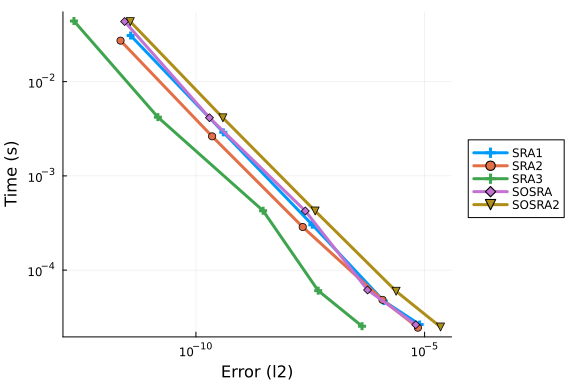
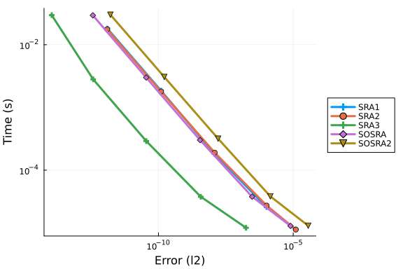
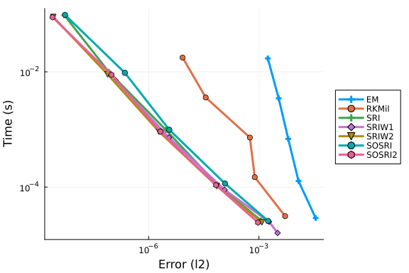
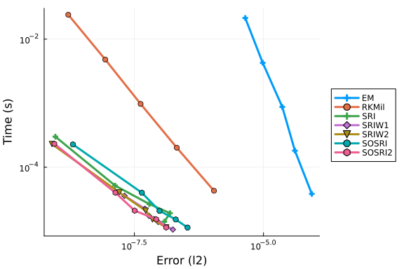

# SDE Work-Precision Diagrams

In this notebook we will run some simple work-precision diagrams for the SDE integrators. These problems are additive and diagonal noise SDEs which can utilize the specialized Rossler methods. These problems are very well-behaved, meaning that adaptive timestepping should not be a significant advantage (unlike more difficult and realistic problems). Thus these tests will measure both the efficiency gains of the Rossler methods along with the overhead of adaptivity.

```julia
using StochasticDiffEq, Plots, DiffEqDevTools, SDEProblemLibrary
import SDEProblemLibrary: prob_sde_additivesystem,
            prob_sde_additive, prob_sde_2Dlinear, prob_sde_linear, prob_sde_wave
gr()
const N = 1000
```

```
1000
```


In this notebook, the error that will be measured is the strong error. The strong error is defined as

$$ E = \mathbb{E}[Y_\delta(t) - Y(t)] $$

where $Y_\delta$ is the numerical approximation to $Y$. This is the same as saying, for a given Wiener trajectory $W(t)$, how well does the numerical trajectory match the real trajectory? Note that this is not how well the mean or other moments match the true mean/variance/etc. (that's the weak error), this is how close the trajectory is to the true trajectory which is a stronger notion. In a sense, this is measuring convergence, rather than just convergence in distribution.

### Additive Noise Problem

\begin{equation}
dX_{t}=\left(\frac{\beta}{\sqrt{1+t}}-\frac{1}{2\left(1+t\right)}X_{t}\right)dt+\frac{\alpha\beta}{\sqrt{1+t}}dW_{t},\thinspace\thinspace\thinspace X_{0}=\frac{1}{2}
\end{equation}
where $\alpha=\frac{1}{10}$ and $\beta=\frac{1}{20}$. Actual Solution:
\begin{equation}
X_{t}=\frac{1}{\sqrt{1+t}}X_{0}+\frac{\beta}{\sqrt{1+t}}\left(t+\alpha W_{t}\right).
\end{equation}


First let's solve this using a system of SDEs, repeating this same problem 4 times.

```julia
prob = prob_sde_additivesystem
prob = remake(prob,tspan=(0.0,1.0))

reltols = 1.0 ./ 10.0 .^ (1:5)
abstols = reltols#[0.0 for i in eachindex(reltols)]
setups = [Dict(:alg=>SRIW1())
          Dict(:alg=>EM(),:dts=>1.0./5.0.^((1:length(reltols)) .+ 1))
          Dict(:alg=>RKMil(),:dts=>1.0./5.0.^((1:length(reltols)) .+ 1),:adaptive=>false)
          Dict(:alg=>SRIW1(),:dts=>1.0./5.0.^((1:length(reltols)) .+ 1),:adaptive=>false)
          Dict(:alg=>SRA1(),:dts=>1.0./5.0.^((1:length(reltols)) .+ 1),:adaptive=>false)
          Dict(:alg=>SRA1())
          ]
names = ["SRIW1","EM","RKMil","SRIW1 Fixed","SRA1 Fixed","SRA1"]
wp = WorkPrecisionSet(prob,abstols,reltols,setups;numruns=N,names=names,maxiters=1e7,error_estimate=:l2)
plot(wp)
```


```julia
prob = prob_sde_additivesystem
prob = remake(prob,tspan=(0.0,1.0))

reltols = 1.0 ./ 10.0 .^ (1:5)
abstols = reltols#[0.0 for i in eachindex(reltols)]
setups = [
          Dict(:alg=>SRA1())
          Dict(:alg=>SRA2())
          Dict(:alg=>SRA3())
          Dict(:alg=>SOSRA())
          Dict(:alg=>SOSRA2())
          ]
wp = WorkPrecisionSet(prob,abstols,reltols,setups;numruns=N,maxiters=1e7,error_estimate=:l2)
plot(wp)
```




Now as a scalar SDE.

```julia
prob = prob_sde_additive
prob = remake(prob,tspan=(0.0,1.0))

reltols = 1.0 ./ 10.0 .^ (1:5)
abstols = reltols#[0.0 for i in eachindex(reltols)]


setups = [Dict(:alg=>SRIW1())
          Dict(:alg=>EM(),:dts=>1.0./5.0.^((1:length(reltols)) .+ 1))
          Dict(:alg=>RKMil(),:dts=>1.0./5.0.^((1:length(reltols)) .+ 1),:adaptive=>false)
          Dict(:alg=>SRIW1(),:dts=>1.0./5.0.^((1:length(reltols)) .+ 1),:adaptive=>false)
          Dict(:alg=>SRA1(),:dts=>1.0./5.0.^((1:length(reltols)) .+ 1),:adaptive=>false)
          Dict(:alg=>SRA1())
          ]
names = ["SRIW1","EM","RKMil","SRIW1 Fixed","SRA1 Fixed","SRA1"]
wp = WorkPrecisionSet(prob,abstols,reltols,setups;numruns=N,names=names,maxiters=1e7,error_estimate=:l2)
plot(wp)
```


```julia
prob = prob_sde_additive
prob = remake(prob,tspan=(0.0,1.0))

reltols = 1.0 ./ 10.0 .^ (1:5)
abstols = reltols#[0.0 for i in eachindex(reltols)]
setups = [
          Dict(:alg=>SRA1())
          Dict(:alg=>SRA2())
          Dict(:alg=>SRA3())
          Dict(:alg=>SOSRA())
          Dict(:alg=>SOSRA2())
          ]
wp = WorkPrecisionSet(prob,abstols,reltols,setups;numruns=N,error_estimate=:l2)
plot(wp)
```




### Diagonal Noise

We will use a 4x2 matrix of independent linear SDEs (also known as the Black-Scholes equation)

\begin{equation}
dX_{t}=\alpha X_{t}dt+\beta X_{t}dW_{t},\thinspace\thinspace\thinspace X_{0}=\frac{1}{2}
\end{equation}
where $\alpha=\frac{1}{10}$ and $\beta=\frac{1}{20}$. Actual Solution:
\begin{equation}
X_{t}=X_{0}e^{\left(\beta-\frac{\alpha^{2}}{2}\right)t+\alpha W_{t}}.
\end{equation}

```julia
prob = prob_sde_2Dlinear
prob = remake(prob,tspan=(0.0,1.0))

reltols = 1.0 ./ 10.0 .^ (1:5)
abstols = reltols#[0.0 for i in eachindex(reltols)]

setups = [Dict(:alg=>SRIW1())
          Dict(:alg=>EM(),:dts=>1.0./5.0.^((1:length(reltols)) .+ 1))
          Dict(:alg=>RKMil(),:dts=>1.0./5.0.^((1:length(reltols)) .+ 1),:adaptive=>false)
          Dict(:alg=>SRIW1(),:dts=>1.0./5.0.^((1:length(reltols)) .+ 1),:adaptive=>false)
          ]
names = ["SRIW1","EM","RKMil","SRIW1 Fixed"]
wp = WorkPrecisionSet(prob,abstols,reltols,setups;numruns=N,names=names,maxiters=1e7,error_estimate=:l2)
plot(wp)
```

```
Error: BoundsError: attempt to access 4-element Vector{Float64} at index [5
]
```


```julia
prob = prob_sde_2Dlinear
prob = remake(prob,tspan=(0.0,1.0))

reltols = 1.0 ./ 10.0 .^ (1:5)
abstols = reltols#[0.0 for i in eachindex(reltols)]

setups = [Dict(:alg=>EM(),:dts=>1.0./5.0.^((1:length(reltols)) .+ 2))
          Dict(:alg=>RKMil(),:dts=>1.0./5.0.^((1:length(reltols)) .+ 2),:adaptive=>false)
          Dict(:alg=>SRI())
          Dict(:alg=>SRIW1())
          Dict(:alg=>SRIW2())
          Dict(:alg=>SOSRI())
          Dict(:alg=>SOSRI2())
          ]
wp = WorkPrecisionSet(prob,abstols,reltols,setups;numruns=N,maxiters=1e7,error_estimate=:l2)
plot(wp)
```

```
Error: BoundsError: attempt to access 0-element Vector{Matrix{Float64}} at 
index [0]
```


Now just the scalar Black-Scholes

```julia
prob = prob_sde_linear
prob = remake(prob,tspan=(0.0,1.0))

reltols = 1.0 ./ 10.0 .^ (1:5)
abstols = reltols#[0.0 for i in eachindex(reltols)]

setups = [Dict(:alg=>SRIW1())
          Dict(:alg=>EM(),:dts=>1.0./5.0.^((1:length(reltols)) .+ 1))
          Dict(:alg=>RKMil(),:dts=>1.0./5.0.^((1:length(reltols)) .+ 1),:adaptive=>false)
          Dict(:alg=>SRIW1(),:dts=>1.0./5.0.^((1:length(reltols)) .+ 1),:adaptive=>false)
          ]
names = ["SRIW1","EM","RKMil","SRIW1 Fixed"]
wp = WorkPrecisionSet(prob,abstols,reltols,setups;numruns=N,names=names,maxiters=1e7,error_estimate=:l2)
plot(wp)
```

```
Error: BoundsError: attempt to access 4-element Vector{Float64} at index [5
]
```


```julia
setups = [Dict(:alg=>EM(),:dts=>1.0./5.0.^((1:length(reltols)) .+ 2))
          Dict(:alg=>RKMil(),:dts=>1.0./5.0.^((1:length(reltols)) .+ 2),:adaptive=>false)
          Dict(:alg=>SRI())
          Dict(:alg=>SRIW1())
          Dict(:alg=>SRIW2())
          Dict(:alg=>SOSRI())
          Dict(:alg=>SOSRI2())
          ]
wp = WorkPrecisionSet(prob,abstols,reltols,setups;numruns=N,maxiters=1e7,error_estimate=:l2)
plot(wp)
```




Now a scalar wave SDE:

\begin{equation}
dX_{t}=-\left(\frac{1}{10}\right)^{2}\sin\left(X_{t}\right)\cos^{3}\left(X_{t}\right)dt+\frac{1}{10}\cos^{2}\left(X_{t}\right)dW_{t},\thinspace\thinspace\thinspace X_{0}=\frac{1}{2}
\end{equation}
Actual Solution:
\begin{equation}
X_{t}=\arctan\left(\frac{1}{10}W_{t}+\tan\left(X_{0}\right)\right).
\end{equation}

```julia
prob = prob_sde_wave
prob = remake(prob,tspan=(0.0,1.0))

reltols = 1.0 ./ 10.0 .^ (1:5)
abstols = reltols#[0.0 for i in eachindex(reltols)]

setups = [Dict(:alg=>SRIW1())
          Dict(:alg=>EM(),:dts=>1.0./5.0.^((1:length(reltols)) .+ 1))
          Dict(:alg=>RKMil(),:dts=>1.0./5.0.^((1:length(reltols)) .+ 1),:adaptive=>false)
          Dict(:alg=>SRIW1(),:dts=>1.0./5.0.^((1:length(reltols)) .+ 1),:adaptive=>false)
          ]
names = ["SRIW1","EM","RKMil","SRIW1 Fixed"]
wp = WorkPrecisionSet(prob,abstols,reltols,setups;numruns=N,names=names,maxiters=1e7,error_estimate=:l2)
plot(wp)
```

```
Error: BoundsError: attempt to access 4-element Vector{Float64} at index [5
]
```


Note that in this last problem, the adaptivity algorithm accurately detects that the error is already low enough, and does not increase the number of steps as the tolerance drops further.

```julia
setups = [Dict(:alg=>EM(),:dts=>1.0./5.0.^((1:length(reltols)) .+ 2))
          Dict(:alg=>RKMil(),:dts=>1.0./5.0.^((1:length(reltols)) .+ 2),:adaptive=>false)
          Dict(:alg=>SRI())
          Dict(:alg=>SRIW1())
          Dict(:alg=>SRIW2())
          Dict(:alg=>SOSRI())
          Dict(:alg=>SOSRI2())
          ]
wp = WorkPrecisionSet(prob,abstols,reltols,setups;numruns=N,maxiters=1e7,error_estimate=:l2)
plot(wp)
```




### Conclusion

The RSwM3 adaptivity algorithm does not appear to have any significant overhead even on problems which do not necessitate adaptive timestepping. The tolerance clearly  In addition, the Rossler methods are shown to be orders of magnitude more efficient and should be used whenever applicable. The Oval2 tests show that these results are only magnified as the problem difficulty increases.


## Appendix

These benchmarks are a part of the SciMLBenchmarks.jl repository, found at: [https://github.com/SciML/SciMLBenchmarks.jl](https://github.com/SciML/SciMLBenchmarks.jl). For more information on high-performance scientific machine learning, check out the SciML Open Source Software Organization [https://sciml.ai](https://sciml.ai).

To locally run this benchmark, do the following commands:

```
using SciMLBenchmarks
SciMLBenchmarks.weave_file("benchmarks/NonStiffSDE","BasicSDEWorkPrecision.jmd")
```

Computer Information:

```
Julia Version 1.9.4
Commit 8e5136fa297 (2023-11-14 08:46 UTC)
Build Info:
  Official https://julialang.org/ release
Platform Info:
  OS: Linux (x86_64-linux-gnu)
  CPU: 128 × AMD EPYC 7502 32-Core Processor
  WORD_SIZE: 64
  LIBM: libopenlibm
  LLVM: libLLVM-14.0.6 (ORCJIT, znver2)
  Threads: 128 on 128 virtual cores
Environment:
  JULIA_CPU_THREADS = 128
  JULIA_DEPOT_PATH = /cache/julia-buildkite-plugin/depots/5b300254-1738-4989-ae0a-f4d2d937f953

```

Package Information:

```
Status `/cache/build/exclusive-amdci1-0/julialang/scimlbenchmarks-dot-jl/benchmarks/NonStiffSDE/Project.toml`
  [f3b72e0c] DiffEqDevTools v2.42.0
  [65888b18] ParameterizedFunctions v5.16.0
  [91a5bcdd] Plots v1.39.0
  [c72e72a9] SDEProblemLibrary v0.1.6
  [31c91b34] SciMLBenchmarks v0.1.3
  [789caeaf] StochasticDiffEq v6.63.2
```

And the full manifest:

```
Status `/cache/build/exclusive-amdci1-0/julialang/scimlbenchmarks-dot-jl/benchmarks/NonStiffSDE/Manifest.toml`
  [47edcb42] ADTypes v0.2.5
⌅ [c3fe647b] AbstractAlgebra v0.33.0
  [1520ce14] AbstractTrees v0.4.4
  [7d9f7c33] Accessors v0.1.33
  [79e6a3ab] Adapt v3.7.1
  [ec485272] ArnoldiMethod v0.2.0
  [4fba245c] ArrayInterface v7.6.1
  [e2ed5e7c] Bijections v0.1.6
  [d1d4a3ce] BitFlags v0.1.8
  [62783981] BitTwiddlingConvenienceFunctions v0.1.5
  [2a0fbf3d] CPUSummary v0.2.4
  [00ebfdb7] CSTParser v3.3.6
  [49dc2e85] Calculus v0.5.1
  [479239e8] Catalyst v13.5.1
  [d360d2e6] ChainRulesCore v1.18.0
  [fb6a15b2] CloseOpenIntervals v0.1.12
  [944b1d66] CodecZlib v0.7.3
  [35d6a980] ColorSchemes v3.24.0
  [3da002f7] ColorTypes v0.11.4
  [c3611d14] ColorVectorSpace v0.10.0
  [5ae59095] Colors v0.12.10
  [861a8166] Combinatorics v1.0.2
  [a80b9123] CommonMark v0.8.12
  [38540f10] CommonSolve v0.2.4
  [bbf7d656] CommonSubexpressions v0.3.0
  [34da2185] Compat v4.10.1
  [b152e2b5] CompositeTypes v0.1.3
  [a33af91c] CompositionsBase v0.1.2
  [2569d6c7] ConcreteStructs v0.2.3
  [f0e56b4a] ConcurrentUtilities v2.3.0
  [8f4d0f93] Conda v1.10.0
  [187b0558] ConstructionBase v1.5.4
  [d38c429a] Contour v0.6.2
  [adafc99b] CpuId v0.3.1
  [a8cc5b0e] Crayons v4.1.1
  [9a962f9c] DataAPI v1.15.0
  [864edb3b] DataStructures v0.18.15
  [e2d170a0] DataValueInterfaces v1.0.0
  [8bb1440f] DelimitedFiles v1.9.1
  [2b5f629d] DiffEqBase v6.141.1
  [459566f4] DiffEqCallbacks v2.34.0
  [f3b72e0c] DiffEqDevTools v2.42.0
  [77a26b50] DiffEqNoiseProcess v5.19.0
  [163ba53b] DiffResults v1.1.0
  [b552c78f] DiffRules v1.15.1
  [b4f34e82] Distances v0.10.11
  [31c24e10] Distributions v0.25.103
  [ffbed154] DocStringExtensions v0.9.3
⌅ [5b8099bc] DomainSets v0.6.7
  [fa6b7ba4] DualNumbers v0.6.8
  [7c1d4256] DynamicPolynomials v0.5.3
  [4e289a0a] EnumX v1.0.4
  [f151be2c] EnzymeCore v0.6.4
  [460bff9d] ExceptionUnwrapping v0.1.9
  [d4d017d3] ExponentialUtilities v1.25.0
  [e2ba6199] ExprTools v0.1.10
  [c87230d0] FFMPEG v0.4.1
  [7034ab61] FastBroadcast v0.2.8
  [9aa1b823] FastClosures v0.3.2
  [29a986be] FastLapackInterface v2.0.0
  [1a297f60] FillArrays v1.9.2
  [6a86dc24] FiniteDiff v2.21.1
  [53c48c17] FixedPointNumbers v0.8.4
  [59287772] Formatting v0.4.2
  [f6369f11] ForwardDiff v0.10.36
  [069b7b12] FunctionWrappers v1.1.3
  [77dc65aa] FunctionWrappersWrappers v0.1.3
  [d9f16b24] Functors v0.4.5
  [46192b85] GPUArraysCore v0.1.5
  [28b8d3ca] GR v0.72.10
  [c145ed77] GenericSchur v0.5.3
  [d7ba0133] Git v1.3.0
  [c27321d9] Glob v1.3.1
  [86223c79] Graphs v1.9.0
  [42e2da0e] Grisu v1.0.2
  [0b43b601] Groebner v0.5.0
  [d5909c97] GroupsCore v0.4.2
  [cd3eb016] HTTP v1.10.1
  [eafb193a] Highlights v0.5.2
  [3e5b6fbb] HostCPUFeatures v0.1.16
  [34004b35] HypergeometricFunctions v0.3.23
  [7073ff75] IJulia v1.24.2
  [615f187c] IfElse v0.1.1
  [d25df0c9] Inflate v0.1.4
  [18e54dd8] IntegerMathUtils v0.1.2
  [8197267c] IntervalSets v0.7.8
  [3587e190] InverseFunctions v0.1.12
  [92d709cd] IrrationalConstants v0.2.2
  [82899510] IteratorInterfaceExtensions v1.0.0
  [1019f520] JLFzf v0.1.7
  [692b3bcd] JLLWrappers v1.5.0
  [682c06a0] JSON v0.21.4
  [98e50ef6] JuliaFormatter v1.0.43
  [ccbc3e58] JumpProcesses v9.9.0
  [ef3ab10e] KLU v0.4.1
  [ba0b0d4f] Krylov v0.9.4
  [b964fa9f] LaTeXStrings v1.3.1
  [2ee39098] LabelledArrays v1.14.0
  [984bce1d] LambertW v0.4.6
  [23fbe1c1] Latexify v0.16.1
  [73f95e8e] LatticeRules v0.0.1
  [10f19ff3] LayoutPointers v0.1.15
  [50d2b5c4] Lazy v0.15.1
  [2d8b4e74] LevyArea v1.0.0
  [d3d80556] LineSearches v7.2.0
  [7ed4a6bd] LinearSolve v2.20.1
  [2ab3a3ac] LogExpFunctions v0.3.26
  [e6f89c97] LoggingExtras v1.0.3
  [bdcacae8] LoopVectorization v0.12.166
  [d8e11817] MLStyle v0.4.17
  [1914dd2f] MacroTools v0.5.11
  [d125e4d3] ManualMemory v0.1.8
  [739be429] MbedTLS v1.1.9
  [442fdcdd] Measures v0.3.2
  [e1d29d7a] Missings v1.1.0
  [961ee093] ModelingToolkit v8.73.1
  [46d2c3a1] MuladdMacro v0.2.4
  [102ac46a] MultivariatePolynomials v0.5.3
  [ffc61752] Mustache v1.0.19
  [d8a4904e] MutableArithmetics v1.4.0
  [d41bc354] NLSolversBase v7.8.3
  [2774e3e8] NLsolve v4.5.1
  [77ba4419] NaNMath v1.0.2
  [8913a72c] NonlinearSolve v2.8.2
  [6fe1bfb0] OffsetArrays v1.12.10
  [4d8831e6] OpenSSL v1.4.1
  [429524aa] Optim v1.7.8
  [bac558e1] OrderedCollections v1.6.3
  [1dea7af3] OrdinaryDiffEq v6.59.3
  [90014a1f] PDMats v0.11.30
  [65ce6f38] PackageExtensionCompat v1.0.2
  [65888b18] ParameterizedFunctions v5.16.0
  [d96e819e] Parameters v0.12.3
  [69de0a69] Parsers v2.8.0
  [b98c9c47] Pipe v1.3.0
  [ccf2f8ad] PlotThemes v3.1.0
  [995b91a9] PlotUtils v1.3.5
  [91a5bcdd] Plots v1.39.0
  [e409e4f3] PoissonRandom v0.4.4
  [f517fe37] Polyester v0.7.9
  [1d0040c9] PolyesterWeave v0.2.1
  [85a6dd25] PositiveFactorizations v0.2.4
  [d236fae5] PreallocationTools v0.4.12
  [aea7be01] PrecompileTools v1.2.0
  [21216c6a] Preferences v1.4.1
  [27ebfcd6] Primes v0.5.5
  [1fd47b50] QuadGK v2.9.1
  [8a4e6c94] QuasiMonteCarlo v0.3.3
  [74087812] Random123 v1.6.1
  [fb686558] RandomExtensions v0.4.4
  [e6cf234a] RandomNumbers v1.5.3
  [3cdcf5f2] RecipesBase v1.3.4
  [01d81517] RecipesPipeline v0.6.12
  [731186ca] RecursiveArrayTools v2.38.10
  [f2c3362d] RecursiveFactorization v0.2.21
  [189a3867] Reexport v1.2.2
  [05181044] RelocatableFolders v1.0.1
  [ae029012] Requires v1.3.0
  [ae5879a3] ResettableStacks v1.1.1
  [79098fc4] Rmath v0.7.1
  [47965b36] RootedTrees v2.20.0
  [7e49a35a] RuntimeGeneratedFunctions v0.5.12
  [c72e72a9] SDEProblemLibrary v0.1.6
  [fdea26ae] SIMD v3.4.6
  [94e857df] SIMDTypes v0.1.0
  [476501e8] SLEEFPirates v0.6.42
  [0bca4576] SciMLBase v2.9.1
  [31c91b34] SciMLBenchmarks v0.1.3
  [e9a6253c] SciMLNLSolve v0.1.9
  [c0aeaf25] SciMLOperators v0.3.7
  [6c6a2e73] Scratch v1.2.1
  [efcf1570] Setfield v1.1.1
  [992d4aef] Showoff v1.0.3
  [777ac1f9] SimpleBufferStream v1.1.0
⌅ [727e6d20] SimpleNonlinearSolve v0.1.25
  [699a6c99] SimpleTraits v0.9.4
  [ce78b400] SimpleUnPack v1.1.0
  [ed01d8cd] Sobol v1.5.0
  [b85f4697] SoftGlobalScope v1.1.0
  [a2af1166] SortingAlgorithms v1.2.0
  [47a9eef4] SparseDiffTools v2.14.0
  [e56a9233] Sparspak v0.3.9
  [276daf66] SpecialFunctions v2.3.1
  [aedffcd0] Static v0.8.8
  [0d7ed370] StaticArrayInterface v1.4.1
  [90137ffa] StaticArrays v1.7.0
  [1e83bf80] StaticArraysCore v1.4.2
  [82ae8749] StatsAPI v1.7.0
  [2913bbd2] StatsBase v0.34.2
  [4c63d2b9] StatsFuns v1.3.0
  [789caeaf] StochasticDiffEq v6.63.2
  [7792a7ef] StrideArraysCore v0.5.2
  [69024149] StringEncodings v0.3.7
  [09ab397b] StructArrays v0.6.16
  [2efcf032] SymbolicIndexingInterface v0.2.2
  [d1185830] SymbolicUtils v1.4.0
  [0c5d862f] Symbolics v5.11.0
  [3783bdb8] TableTraits v1.0.1
  [bd369af6] Tables v1.11.1
  [62fd8b95] TensorCore v0.1.1
  [8290d209] ThreadingUtilities v0.5.2
  [a759f4b9] TimerOutputs v0.5.23
  [0796e94c] Tokenize v0.5.26
  [3bb67fe8] TranscodingStreams v0.10.2
  [d5829a12] TriangularSolve v0.1.20
  [410a4b4d] Tricks v0.1.8
  [781d530d] TruncatedStacktraces v1.4.0
  [5c2747f8] URIs v1.5.1
  [3a884ed6] UnPack v1.0.2
  [1cfade01] UnicodeFun v0.4.1
  [1986cc42] Unitful v1.19.0
  [45397f5d] UnitfulLatexify v1.6.3
  [a7c27f48] Unityper v0.1.5
  [41fe7b60] Unzip v0.2.0
  [3d5dd08c] VectorizationBase v0.21.65
  [81def892] VersionParsing v1.3.0
  [19fa3120] VertexSafeGraphs v0.2.0
  [44d3d7a6] Weave v0.10.12
  [ddb6d928] YAML v0.4.9
  [c2297ded] ZMQ v1.2.2
  [6e34b625] Bzip2_jll v1.0.8+0
  [83423d85] Cairo_jll v1.16.1+1
  [2702e6a9] EpollShim_jll v0.0.20230411+0
  [2e619515] Expat_jll v2.5.0+0
  [b22a6f82] FFMPEG_jll v4.4.4+1
  [a3f928ae] Fontconfig_jll v2.13.93+0
  [d7e528f0] FreeType2_jll v2.13.1+0
  [559328eb] FriBidi_jll v1.0.10+0
  [0656b61e] GLFW_jll v3.3.8+0
  [d2c73de3] GR_jll v0.72.10+0
  [78b55507] Gettext_jll v0.21.0+0
  [f8c6e375] Git_jll v2.42.0+0
  [7746bdde] Glib_jll v2.76.5+0
  [3b182d85] Graphite2_jll v1.3.14+0
  [2e76f6c2] HarfBuzz_jll v2.8.1+1
  [1d5cc7b8] IntelOpenMP_jll v2024.0.0+0
  [aacddb02] JpegTurbo_jll v3.0.1+0
  [c1c5ebd0] LAME_jll v3.100.1+0
  [88015f11] LERC_jll v3.0.0+1
  [1d63c593] LLVMOpenMP_jll v15.0.4+0
  [dd4b983a] LZO_jll v2.10.1+0
⌅ [e9f186c6] Libffi_jll v3.2.2+1
  [d4300ac3] Libgcrypt_jll v1.8.7+0
  [7e76a0d4] Libglvnd_jll v1.6.0+0
  [7add5ba3] Libgpg_error_jll v1.42.0+0
  [94ce4f54] Libiconv_jll v1.17.0+0
  [4b2f31a3] Libmount_jll v2.35.0+0
  [89763e89] Libtiff_jll v4.5.1+1
  [38a345b3] Libuuid_jll v2.36.0+0
  [856f044c] MKL_jll v2024.0.0+0
  [e7412a2a] Ogg_jll v1.3.5+1
  [458c3c95] OpenSSL_jll v3.0.12+0
  [efe28fd5] OpenSpecFun_jll v0.5.5+0
  [91d4177d] Opus_jll v1.3.2+0
  [30392449] Pixman_jll v0.42.2+0
  [c0090381] Qt6Base_jll v6.5.3+1
  [f50d1b31] Rmath_jll v0.4.0+0
  [a44049a8] Vulkan_Loader_jll v1.3.243+0
  [a2964d1f] Wayland_jll v1.21.0+1
  [2381bf8a] Wayland_protocols_jll v1.25.0+0
  [02c8fc9c] XML2_jll v2.12.2+0
  [aed1982a] XSLT_jll v1.1.34+0
  [ffd25f8a] XZ_jll v5.4.5+0
  [f67eecfb] Xorg_libICE_jll v1.0.10+1
  [c834827a] Xorg_libSM_jll v1.2.3+0
  [4f6342f7] Xorg_libX11_jll v1.8.6+0
  [0c0b7dd1] Xorg_libXau_jll v1.0.11+0
  [935fb764] Xorg_libXcursor_jll v1.2.0+4
  [a3789734] Xorg_libXdmcp_jll v1.1.4+0
  [1082639a] Xorg_libXext_jll v1.3.4+4
  [d091e8ba] Xorg_libXfixes_jll v5.0.3+4
  [a51aa0fd] Xorg_libXi_jll v1.7.10+4
  [d1454406] Xorg_libXinerama_jll v1.1.4+4
  [ec84b674] Xorg_libXrandr_jll v1.5.2+4
  [ea2f1a96] Xorg_libXrender_jll v0.9.10+4
  [14d82f49] Xorg_libpthread_stubs_jll v0.1.1+0
  [c7cfdc94] Xorg_libxcb_jll v1.15.0+0
  [cc61e674] Xorg_libxkbfile_jll v1.1.2+0
  [e920d4aa] Xorg_xcb_util_cursor_jll v0.1.4+0
  [12413925] Xorg_xcb_util_image_jll v0.4.0+1
  [2def613f] Xorg_xcb_util_jll v0.4.0+1
  [975044d2] Xorg_xcb_util_keysyms_jll v0.4.0+1
  [0d47668e] Xorg_xcb_util_renderutil_jll v0.3.9+1
  [c22f9ab0] Xorg_xcb_util_wm_jll v0.4.1+1
  [35661453] Xorg_xkbcomp_jll v1.4.6+0
  [33bec58e] Xorg_xkeyboard_config_jll v2.39.0+0
  [c5fb5394] Xorg_xtrans_jll v1.5.0+0
  [8f1865be] ZeroMQ_jll v4.3.4+0
  [3161d3a3] Zstd_jll v1.5.5+0
  [35ca27e7] eudev_jll v3.2.9+0
  [214eeab7] fzf_jll v0.43.0+0
  [1a1c6b14] gperf_jll v3.1.1+0
  [a4ae2306] libaom_jll v3.4.0+0
  [0ac62f75] libass_jll v0.15.1+0
  [2db6ffa8] libevdev_jll v1.11.0+0
  [f638f0a6] libfdk_aac_jll v2.0.2+0
  [36db933b] libinput_jll v1.18.0+0
  [b53b4c65] libpng_jll v1.6.40+0
  [a9144af2] libsodium_jll v1.0.20+0
  [f27f6e37] libvorbis_jll v1.3.7+1
  [009596ad] mtdev_jll v1.1.6+0
  [1270edf5] x264_jll v2021.5.5+0
  [dfaa095f] x265_jll v3.5.0+0
  [d8fb68d0] xkbcommon_jll v1.4.1+1
  [0dad84c5] ArgTools v1.1.1
  [56f22d72] Artifacts
  [2a0f44e3] Base64
  [ade2ca70] Dates
  [8ba89e20] Distributed
  [f43a241f] Downloads v1.6.0
  [7b1f6079] FileWatching
  [9fa8497b] Future
  [b77e0a4c] InteractiveUtils
  [4af54fe1] LazyArtifacts
  [b27032c2] LibCURL v0.6.4
  [76f85450] LibGit2
  [8f399da3] Libdl
  [37e2e46d] LinearAlgebra
  [56ddb016] Logging
  [d6f4376e] Markdown
  [a63ad114] Mmap
  [ca575930] NetworkOptions v1.2.0
  [44cfe95a] Pkg v1.9.2
  [de0858da] Printf
  [3fa0cd96] REPL
  [9a3f8284] Random
  [ea8e919c] SHA v0.7.0
  [9e88b42a] Serialization
  [1a1011a3] SharedArrays
  [6462fe0b] Sockets
  [2f01184e] SparseArrays
  [10745b16] Statistics v1.9.0
  [4607b0f0] SuiteSparse
  [fa267f1f] TOML v1.0.3
  [a4e569a6] Tar v1.10.0
  [8dfed614] Test
  [cf7118a7] UUIDs
  [4ec0a83e] Unicode
  [e66e0078] CompilerSupportLibraries_jll v1.0.5+0
  [deac9b47] LibCURL_jll v8.4.0+0
  [29816b5a] LibSSH2_jll v1.11.0+1
  [c8ffd9c3] MbedTLS_jll v2.28.2+0
  [14a3606d] MozillaCACerts_jll v2022.10.11
  [4536629a] OpenBLAS_jll v0.3.21+4
  [05823500] OpenLibm_jll v0.8.1+0
  [efcefdf7] PCRE2_jll v10.42.0+0
  [bea87d4a] SuiteSparse_jll v5.10.1+6
  [83775a58] Zlib_jll v1.2.13+0
  [8e850b90] libblastrampoline_jll v5.8.0+0
  [8e850ede] nghttp2_jll v1.52.0+1
  [3f19e933] p7zip_jll v17.4.0+0
Info Packages marked with ⌅ have new versions available but compatibility constraints restrict them from upgrading. To see why use `status --outdated -m`
```

