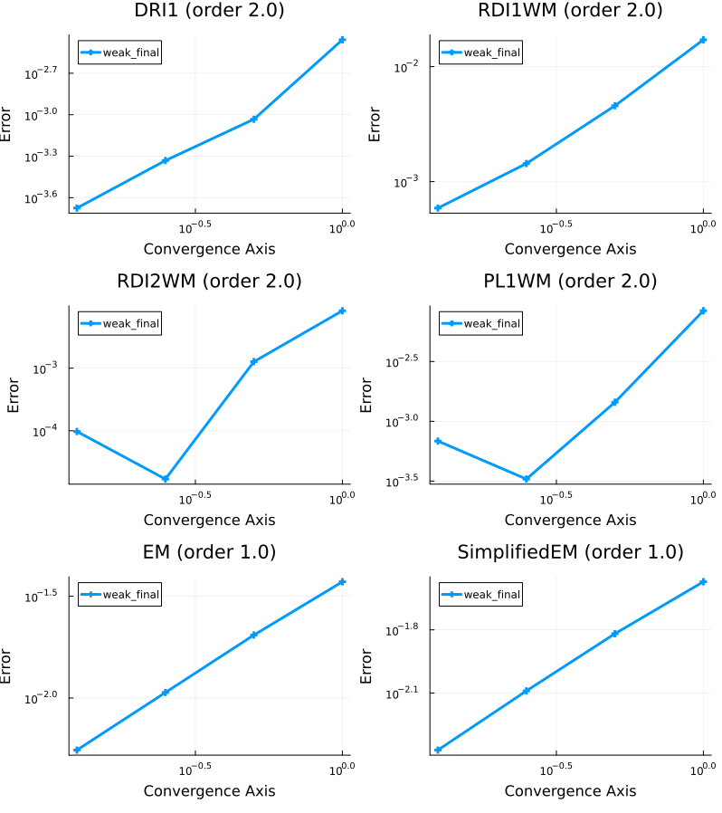
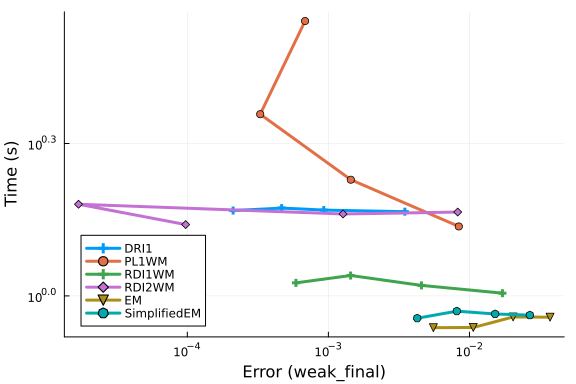
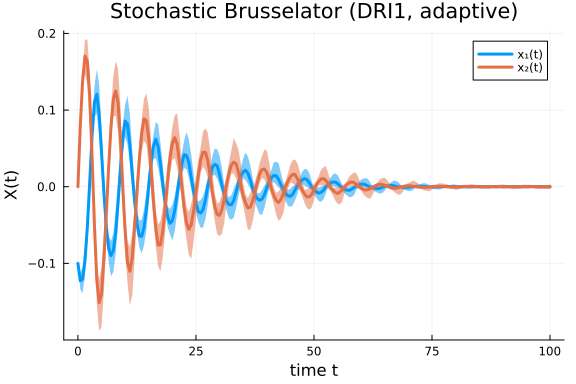
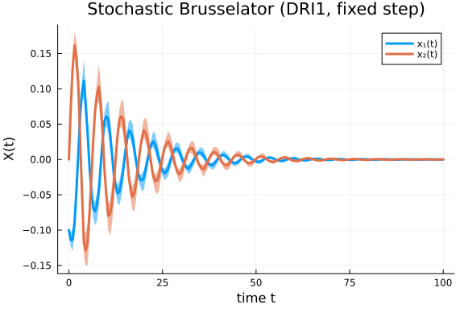
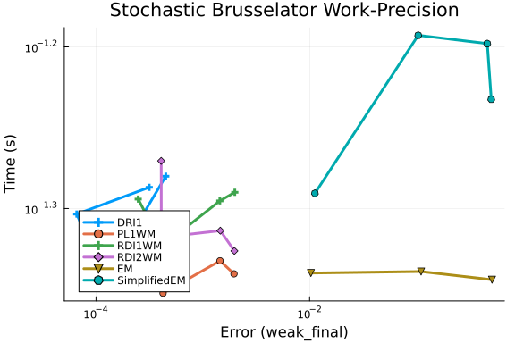

# High-Order Weak SDE Work-Precision Diagrams

This benchmark compares high-order weak SDE solvers (`DRI1`, `PL1WM`, `RDI1WM`, `RDI2WM`) against
standard baselines (`EM`, `SimplifiedEM`) on problems with non-commutative noise.
These methods target high-accuracy computation of expectations $\mathbb{E}[f(X(t))]$ rather than
pathwise accuracy.

## Non-Commutative Noise Problem

We consider a 2-dimensional SDE with non-commutative noise:

$$dX_t = f(X_t) dt + g(X_t) dW_t, \quad X_0 = [1, 1]$$

with a known analytical result $\mathbb{E}[X_1(t)^2] = \exp(-t)$.

```julia
using StochasticDiffEq, DiffEqDevTools, Random, Plots
using SciMLLogging
gr()

u₀ = [1.0, 1.0]
function f_noncommutative!(du, u, p, t)
    @inbounds begin
        du[1] = -273 // 512 * u[1]
        du[2] = -1 // 160 * u[1] - (-785 // 512 + sqrt(2) / 8) * u[2]
    end
    return nothing
end
function g_noncommutative!(du, u, p, t)
    @inbounds begin
        du[1, 1] = 1 // 4 * u[1]
        du[1, 2] = 1 // 16 * u[1]
        du[2, 1] = (1 - 2 * sqrt(2)) / 4 * u[1]
        du[2, 2] = 1 // 10 * u[1] + 1 // 16 * u[2]
    end
    return nothing
end
tspan = (0.0, 3.0)

prob = SDEProblem(f_noncommutative!, g_noncommutative!, u₀, tspan,
    noise_rate_prototype = zeros(2, 2))
```
```
SDEProblem with uType Vector{Float64} and tType Float64. In-place: true
Non-trivial mass matrix: false
timespan: (0.0, 3.0)
u0: 2-element Vector{Float64}:
 1.0
 1.0
```


### Weak Convergence Order

We verify the weak convergence order of the methods using $\mathbb{E}[X_1(T)^2]$ as the observable.
The analytical solution is $\exp(-3)$.

```julia
numtraj = Int(1e5)
seed = 100
Random.seed!(seed)
seeds = rand(UInt, numtraj)

function prob_func(prob, ctx)
    remake(prob, seed = seeds[ctx.sim_id])
end

h2(z) = z^2

ensemble_prob = EnsembleProblem(prob;
    output_func = (sol, ctx) -> (h2(sol.u[end][1]), false),
    prob_func = prob_func)

dts = 1 .// 2 .^ (3:-1:0)

sim_dri1 = test_convergence(dts, ensemble_prob, DRI1(),
    save_everystep = false, trajectories = numtraj, save_start = false,
    adaptive = false, weak_timeseries_errors = false,
    weak_dense_errors = false, expected_value = exp(-3.0))

sim_pl1wm = test_convergence(dts, ensemble_prob, PL1WM(),
    save_everystep = false, trajectories = numtraj, save_start = false,
    adaptive = false, weak_timeseries_errors = false,
    weak_dense_errors = false, expected_value = exp(-3.0))

sim_rdi1wm = test_convergence(dts, ensemble_prob, RDI1WM(),
    save_everystep = false, trajectories = numtraj, save_start = false,
    adaptive = false, weak_timeseries_errors = false,
    weak_dense_errors = false, expected_value = exp(-3.0))

sim_rdi2wm = test_convergence(dts, ensemble_prob, RDI2WM(),
    save_everystep = false, trajectories = numtraj, save_start = false,
    adaptive = false, weak_timeseries_errors = false,
    weak_dense_errors = false, expected_value = exp(-3.0))

sim_em = test_convergence(dts, ensemble_prob, EM(),
    save_everystep = false, trajectories = numtraj, save_start = false,
    adaptive = false, weak_timeseries_errors = false,
    weak_dense_errors = false, expected_value = exp(-3.0))

sim_simplified_em = test_convergence(dts, ensemble_prob, SimplifiedEM(),
    save_everystep = false, trajectories = numtraj, save_start = false,
    adaptive = false, weak_timeseries_errors = false,
    weak_dense_errors = false, expected_value = exp(-3.0))

plot(
    plot(sim_dri1, title = "DRI1 (order 2.0)"),
    plot(sim_rdi1wm, title = "RDI1WM (order 2.0)"),
    plot(sim_rdi2wm, title = "RDI2WM (order 2.0)"),
    plot(sim_pl1wm, title = "PL1WM (order 2.0)"),
    plot(sim_em, title = "EM (order 1.0)"),
    plot(sim_simplified_em, title = "SimplifiedEM (order 1.0)"),
    layout = (3, 2), size = (800, 900))
```




### Work-Precision Diagram (Non-Commutative Noise)

```julia
reltols = 1.0 ./ 4.0 .^ (1:4)
abstols = reltols

setups = [
    Dict(:alg => DRI1(), :dts => dts, :adaptive => false),
    Dict(:alg => PL1WM(), :dts => dts, :adaptive => false),
    Dict(:alg => RDI1WM(), :dts => dts, :adaptive => false),
    Dict(:alg => RDI2WM(), :dts => dts, :adaptive => false),
    Dict(:alg => EM(), :dts => dts, :adaptive => false),
    Dict(:alg => SimplifiedEM(), :dts => dts, :adaptive => false)]

test_dt = 1 // 10000
appxsol_setup = Dict(:alg => EM(), :dt => test_dt)

wp = WorkPrecisionSet(ensemble_prob,
    abstols, reltols, setups, test_dt;
    maxiters = 1e7, verbose = SciMLLogging.None(),
    save_everystep = false, save_start = false,
    appxsol_setup = appxsol_setup,
    expected_value = exp(-3.0),
    trajectories = numtraj, error_estimate = :weak_final)
plot(wp; legend = :bottomleft)
```




## Stochastic Brusselator

The stochastic Brusselator equations with scalar noise serve as a more challenging benchmark.
The system exhibits oscillatory behavior requiring careful step-size control.

$$\begin{aligned}
dX_1 &= \left[(p_1-1)X_1 + p_1 X_1^2 + (X_1+1)^2 X_2\right]dt + p_2 X_1(1+X_1) dW_t \\
dX_2 &= \left[-p_1 X_1 - p_1 X_1^2 - (X_1+1)^2 X_2\right]dt - p_2 X_1(1+X_1) dW_t
\end{aligned}$$

with $X_0 = [-0.1, 0]$, $p = [1.9, 0.1]$, and $t \in [0, 100]$.

```julia
using DiffEqNoiseProcess

function brusselator_f!(du, u, p, t)
    @inbounds begin
        du[1] = (p[1] - 1) * u[1] + p[1] * u[1]^2 + (u[1] + 1)^2 * u[2]
        du[2] = -p[1] * u[1] - p[1] * u[1]^2 - (u[1] + 1)^2 * u[2]
    end
    nothing
end

function brusselator_scalar_noise!(du, u, p, t)
    @inbounds begin
        du[1] = p[2] * u[1] * (1 + u[1])
        du[2] = -p[2] * u[1] * (1 + u[1])
    end
    nothing
end

seed = 100
Random.seed!(seed)
numtraj_bruss = 100
seeds_bruss = rand(UInt, numtraj_bruss)

function prob_func_bruss(prob, ctx)
    Random.seed!(seeds_bruss[ctx.sim_id])
    W = WienerProcess(0.0, 0.0, 0.0)
    remake(prob, noise = W)
end

u0_bruss = [-0.1, 0.0]
tspan_bruss = (0.0, 100.0)
p_bruss = [1.9, 0.1]

W = WienerProcess(0.0, 0.0, 0.0)
prob_bruss = SDEProblem(brusselator_f!, brusselator_scalar_noise!, u0_bruss,
    tspan_bruss, p_bruss, noise = W)

ensembleprob_bruss = EnsembleProblem(prob_bruss,
    prob_func = prob_func_bruss)
```

```
EnsembleProblem with problem SDEProblem
```


### Adaptive vs Fixed Step-Size Comparison

We compare `DRI1` with adaptive time-stepping against fixed step-size on the stochastic Brusselator.

```julia
sol_adaptive = solve(ensembleprob_bruss, DRI1(), dt = 0.1,
    trajectories = numtraj_bruss)
sol_fixed = solve(ensembleprob_bruss, DRI1(), dt = 0.8,
    adaptive = false, trajectories = numtraj_bruss)

summ = EnsembleSummary(sol_adaptive, 0.0:0.5:100.0)
plot(summ, fillalpha = 0.5, xlabel = "time t", yaxis = "X(t)",
    label = ["x₁(t)" "x₂(t)"], legend = true,
    title = "Stochastic Brusselator (DRI1, adaptive)")
```



```julia
summ_fixed = EnsembleSummary(sol_fixed, 0.0:0.5:100.0)
plot(summ_fixed, fillalpha = 0.5, xlabel = "time t", yaxis = "X(t)",
    label = ["x₁(t)" "x₂(t)"], legend = true,
    title = "Stochastic Brusselator (DRI1, fixed step)")
```




### Solver Comparison on Brusselator

```julia
ensembleprob_bruss2 = EnsembleProblem(prob_bruss,
    prob_func = prob_func_bruss)

reltols_bruss = 1.0 ./ 4.0 .^ (1:4)
abstols_bruss = reltols_bruss
dts_bruss = 1.0 ./ 2.0 .^ (1:4)

setups_bruss = [
    Dict(:alg => DRI1(), :dts => dts_bruss, :adaptive => false),
    Dict(:alg => PL1WM(), :dts => dts_bruss, :adaptive => false),
    Dict(:alg => RDI1WM(), :dts => dts_bruss, :adaptive => false),
    Dict(:alg => RDI2WM(), :dts => dts_bruss, :adaptive => false),
    Dict(:alg => EM(), :dts => dts_bruss, :adaptive => false),
    Dict(:alg => SimplifiedEM(), :dts => dts_bruss, :adaptive => false)]

test_dt_bruss = 1 // 1000
appxsol_setup_bruss = Dict(:alg => EM(), :dt => test_dt_bruss)

wp_bruss = WorkPrecisionSet(ensembleprob_bruss2,
    abstols_bruss, reltols_bruss, setups_bruss, test_dt_bruss;
    maxiters = 1e7, verbose = SciMLLogging.None(),
    save_everystep = false, save_start = false,
    appxsol_setup = appxsol_setup_bruss,
    trajectories = numtraj_bruss, error_estimate = :weak_final)
plot(wp_bruss; legend = :bottomleft,
    title = "Stochastic Brusselator Work-Precision")
```




## Summary

The high-order weak methods (`DRI1`, `PL1WM`, `RDI1WM`, `RDI2WM`) achieve significantly better
weak error scaling than `EM` and `SimplifiedEM` on the non-commutative noise problem.
`DRI1` in particular achieves the smallest errors for fixed timesteps.
On the stochastic Brusselator, the adaptive time-stepping of `DRI1` provides more accurate
trajectory descriptions compared to fixed step-size integration.


## Appendix

These benchmarks are a part of the SciMLBenchmarks.jl repository, found at: [https://github.com/SciML/SciMLBenchmarks.jl](https://github.com/SciML/SciMLBenchmarks.jl). For more information on high-performance scientific machine learning, check out the SciML Open Source Software Organization [https://sciml.ai](https://sciml.ai).

To locally run this benchmark, do the following commands:

```
using SciMLBenchmarks
SciMLBenchmarks.weave_file("benchmarks/NonStiffSDE","HighOrderWeakSDEWorkPrecision.jmd")
```

Computer Information:

```
Julia Version 1.11.9
Commit 53a02c0720c (2026-02-06 00:27 UTC)
Build Info:
  Official https://julialang.org/ release
Platform Info:
  OS: Linux (x86_64-linux-gnu)
  CPU: 128 × AMD EPYC 7502 32-Core Processor
  WORD_SIZE: 64
  LLVM: libLLVM-16.0.6 (ORCJIT, znver2)
Threads: 128 default, 0 interactive, 64 GC (on 128 virtual cores)
Environment:
  JULIA_PKG_PRECOMPILE_AUTO = 0
  JULIA_NUM_THREADS = auto

```

Package Information:

```
Status `~/sandbox/tmp_20260825_180339_53321/SciMLBenchmarks-nonstiffsde-master-audit/benchmarks/NonStiffSDE/Project.toml`
⌃ [f3b72e0c] DiffEqDevTools v3.6.0
⌃ [77a26b50] DiffEqNoiseProcess v5.36.1
  [65888b18] ParameterizedFunctions v5.27.0
  [91a5bcdd] Plots v1.41.7
  [c72e72a9] SDEProblemLibrary v1.2.4
⌃ [31c91b34] SciMLBenchmarks v0.1.3
  [a6db7da4] SciMLLogging v2.1.0
  [789caeaf] StochasticDiffEq v7.1.5
Info Packages marked with ⌃ have new versions available and may be upgradable.
```

And the full manifest:

```
Status `~/sandbox/tmp_20260825_180339_53321/SciMLBenchmarks-nonstiffsde-master-audit/benchmarks/NonStiffSDE/Manifest.toml`
  [47edcb42] ADTypes v1.24.0
⌃ [14f7f29c] AMD v0.5.3
⌃ [6e696c72] AbstractPlutoDingetjes v1.4.0
  [1520ce14] AbstractTrees v0.4.5
  [7d9f7c33] Accessors v0.1.45
  [79e6a3ab] Adapt v4.7.0
  [66dad0bd] AliasTables v1.1.3
  [ec485272] ArnoldiMethod v0.4.0
⌃ [4fba245c] ArrayInterface v7.30.0
  [4c555306] ArrayLayouts v1.12.2
  [aae01518] BandedMatrices v1.12.0
  [e2ed5e7c] Bijections v0.2.2
  [b2a6c25c] BinaryHeaps v1.1.0
⌃ [caf10ac8] BipartiteGraphs v0.1.12
  [8e7c35d0] BlockArrays v1.10.0
  [70df07ce] BracketingNonlinearSolve v1.12.6
  [35d6a980] ColorSchemes v3.31.0
  [3da002f7] ColorTypes v0.12.1
  [c3611d14] ColorVectorSpace v0.11.0
  [5ae59095] Colors v0.13.1
⌅ [861a8166] Combinatorics v1.0.2
  [38540f10] CommonSolve v0.2.14
  [bbf7d656] CommonSubexpressions v0.3.1
⌃ [f70d9fcc] CommonWorldInvalidations v1.2.0
  [34da2185] Compat v4.18.1
  [b152e2b5] CompositeTypes v0.1.4
  [a33af91c] CompositionsBase v0.1.2
  [2569d6c7] ConcreteStructs v0.2.8
  [8f4d0f93] Conda v1.10.3
  [187b0558] ConstructionBase v1.6.0
  [d38c429a] Contour v0.6.3
  [a8cc5b0e] Crayons v4.2.0
  [9a962f9c] DataAPI v1.16.0
  [864edb3b] DataStructures v0.19.6
  [e2d170a0] DataValueInterfaces v1.0.0
  [8bb1440f] DelimitedFiles v1.9.1
⌃ [2b5f629d] DiffEqBase v7.18.2
  [459566f4] DiffEqCallbacks v4.19.3
⌃ [f3b72e0c] DiffEqDevTools v3.6.0
⌃ [77a26b50] DiffEqNoiseProcess v5.36.1
  [163ba53b] DiffResults v1.1.0
  [b552c78f] DiffRules v1.16.0
  [a0c0ee7d] DifferentiationInterface v0.7.21
  [31c24e10] Distributions v0.25.131
  [ffbed154] DocStringExtensions v0.9.5
  [5b8099bc] DomainSets v0.8.1
⌃ [7c1d4256] DynamicPolynomials v0.6.7
  [4e289a0a] EnumX v1.0.7
  [f151be2c] EnzymeCore v0.8.21
  [e2ba6199] ExprTools v0.1.11
  [55351af7] ExproniconLite v0.10.14
  [c87230d0] FFMPEG v0.4.5
  [7034ab61] FastBroadcast v1.4.0
  [9aa1b823] FastClosures v0.3.2
  [a4df4552] FastPower v1.5.0
  [1a297f60] FillArrays v1.17.0
  [64ca27bc] FindFirstFunctions v3.2.1
  [6a86dc24] FiniteDiff v2.33.0
⌅ [53c48c17] FixedPointNumbers v0.8.6
  [1fa38f19] Format v1.3.7
  [f6369f11] ForwardDiff v1.4.5
  [a85aefff] FunctionMaps v0.1.2
  [069b7b12] FunctionWrappers v1.1.3
  [77dc65aa] FunctionWrappersWrappers v1.13.0
  [46192b85] GPUArraysCore v0.2.0
  [28b8d3ca] GR v0.73.27
  [a0844989] Gamma v1.2.0
  [d7ba0133] Git v1.5.0
  [86223c79] Graphs v1.14.0
  [42e2da0e] Grisu v1.0.2
⌅ [eafb193a] Highlights v0.5.3
  [34004b35] HypergeometricFunctions v0.3.30
  [7073ff75] IJulia v1.34.4
⌃ [3263718b] ImplicitDiscreteSolve v2.2.0
  [d25df0c9] Inflate v0.1.5
  [18e54dd8] IntegerMathUtils v0.1.4
  [8197267c] IntervalSets v0.7.14
  [3587e190] InverseFunctions v0.1.17
  [92d709cd] IrrationalConstants v0.2.6
  [82899510] IteratorInterfaceExtensions v1.0.0
  [1019f520] JLFzf v0.1.11
  [692b3bcd] JLLWrappers v1.8.0
⌅ [682c06a0] JSON v0.21.4
  [ae98c720] Jieko v0.2.1
⌃ [ccbc3e58] JumpProcesses v9.30.1
  [ba0b0d4f] Krylov v0.10.9
⌃ [2faa5264] LHLFactorization v2.2.1
  [b964fa9f] LaTeXStrings v1.4.1
  [23fbe1c1] Latexify v0.16.12
  [87fe0de2] LineSearch v0.1.16
⌃ [7ed4a6bd] LinearSolve v5.14.0
  [2ab3a3ac] LogExpFunctions v1.0.1
  [e6f89c97] LoggingExtras v1.2.0
  [1914dd2f] MacroTools v0.5.16
  [bb5d69b7] MaybeInplace v0.1.8
  [442fdcdd] Measures v0.3.3
  [e1d29d7a] Missings v1.2.0
⌃ [961ee093] ModelingToolkit v11.40.0
⌃ [7771a370] ModelingToolkitBase v1.68.0
⌃ [6bb917b9] ModelingToolkitTearing v1.20.5
  [2e0e35c7] Moshi v0.3.12
  [46d2c3a1] MuladdMacro v0.2.7
  [102ac46a] MultivariatePolynomials v0.5.19
  [ffc61752] Mustache v1.0.21
  [d8a4904e] MutableArithmetics v1.8.0
  [77ba4419] NaNMath v1.1.4
⌃ [8913a72c] NonlinearSolve v4.28.1
⌃ [be0214bd] NonlinearSolveBase v2.48.1
⌃ [5959db7a] NonlinearSolveFirstOrder v2.4.1
⌃ [9a2c21bd] NonlinearSolveQuasiNewton v1.15.2
  [26075421] NonlinearSolveSpectralMethods v1.8.1
  [6fe1bfb0] OffsetArrays v1.17.0
⌅ [bac558e1] OrderedCollections v1.8.2
⌃ [bbf590c4] OrdinaryDiffEqCore v4.15.1
⌃ [4302a76b] OrdinaryDiffEqDifferentiation v3.10.1
⌃ [127b3ac7] OrdinaryDiffEqNonlinearSolve v2.9.1
  [90014a1f] PDMats v0.11.41
  [65888b18] ParameterizedFunctions v5.27.0
⌅ [69de0a69] Parsers v2.8.7
  [ccf2f8ad] PlotThemes v3.3.0
  [995b91a9] PlotUtils v1.4.4
  [91a5bcdd] Plots v1.41.7
  [e409e4f3] PoissonRandom v0.4.13
  [d236fae5] PreallocationTools v1.7.1
⌅ [aea7be01] PrecompileTools v1.2.1
  [21216c6a] Preferences v1.5.2
  [08abe8d2] PrettyTables v3.4.8
  [27ebfcd6] Primes v0.5.7
  [43287f4e] PtrArrays v1.4.0
  [0c0d3e7f] PureKLU v1.4.1
  [1fd47b50] QuadGK v2.11.3
  [988b38a3] ReadOnlyArrays v0.2.0
  [795d4caa] ReadOnlyDicts v1.0.1
  [3cdcf5f2] RecipesBase v1.3.4
  [01d81517] RecipesPipeline v0.6.12
  [731186ca] RecursiveArrayTools v4.5.1
  [189a3867] Reexport v1.2.2
  [05181044] RelocatableFolders v1.0.1
  [ae029012] Requires v1.3.1
  [ae5879a3] ResettableStacks v1.4.0
  [9fe22ead] RespecializeParams v1.3.0
  [79098fc4] Rmath v0.9.0
  [47965b36] RootedTrees v2.27.0
⌃ [f2b01f46] Roots v3.0.7
  [7e49a35a] RuntimeGeneratedFunctions v0.5.25
⌃ [9dfe8606] SCCNonlinearSolve v1.15.1
  [c72e72a9] SDEProblemLibrary v1.2.4
⌃ [0bca4576] SciMLBase v3.50.0
⌃ [31c91b34] SciMLBenchmarks v0.1.3
  [19f34311] SciMLJacobianOperators v0.1.18
  [a6db7da4] SciMLLogging v2.1.0
  [c0aeaf25] SciMLOperators v1.30.0
  [431bcebd] SciMLPublic v1.3.0
  [53ae85a6] SciMLStructures v1.10.5
  [6c6a2e73] Scratch v1.3.0
  [efcf1570] Setfield v1.1.2
⌃ [992d4aef] Showoff v1.0.3
  [727e6d20] SimpleNonlinearSolve v2.14.1
  [699a6c99] SimpleTraits v0.9.6
  [a2af1166] SortingAlgorithms v1.2.3
⌃ [a57abbd0] SparseColumnPivotedQR v2.1.7
⌃ [0a514795] SparseMatrixColorings v0.4.27
  [276daf66] SpecialFunctions v2.9.0
  [860ef19b] StableRNGs v1.0.4
  [0c0c59c1] StarAlgebras v0.3.0
  [64909d44] StateSelection v1.11.1
⌃ [90137ffa] StaticArrays v1.9.19
  [1e83bf80] StaticArraysCore v1.4.4
⌃ [10745b16] Statistics v1.11.4
  [82ae8749] StatsAPI v1.8.0
  [2913bbd2] StatsBase v0.34.13
  [4c63d2b9] StatsFuns v2.2.1
  [789caeaf] StochasticDiffEq v7.1.5
⌃ [19c5a474] StochasticDiffEqCore v2.2.0
  [0520c28c] StochasticDiffEqHighOrder v2.2.0
  [ebf54054] StochasticDiffEqIIF v2.1.0
⌃ [5080b986] StochasticDiffEqImplicit v2.2.0
  [aefaaa88] StochasticDiffEqLeaping v2.1.0
  [90dbc90e] StochasticDiffEqLevyArea v2.1.1
  [d15fe365] StochasticDiffEqLowOrder v2.0.5
  [8c95a807] StochasticDiffEqMilstein v2.1.1
  [db241ea8] StochasticDiffEqROCK v2.1.1
  [49714585] StochasticDiffEqRODE v2.1.0
  [af2a2fcd] StochasticDiffEqWeak v2.2.1
  [69024149] StringEncodings v0.3.7
⌅ [892a3eda] StringManipulation v0.5.0
  [09ab397b] StructArrays v0.7.3
  [2efcf032] SymbolicIndexingInterface v0.3.55
⌃ [19f23fe9] SymbolicLimits v1.2.0
⌅ [d1185830] SymbolicUtils v4.45.0
  [0c5d862f] Symbolics v7.39.0
  [3783bdb8] TableTraits v1.0.1
  [bd369af6] Tables v1.14.0
  [ed4db957] TaskLocalValues v0.1.3
  [62fd8b95] TensorCore v0.1.1
  [8ea1fca8] TermInterface v2.0.0
⌃ [a759f4b9] TimerOutputs v1.2.0
  [781d530d] TruncatedStacktraces v1.4.0
  [3a884ed6] UnPack v1.0.2
  [1cfade01] UnicodeFun v0.4.1
  [41fe7b60] Unzip v0.2.0
  [81def892] VersionParsing v1.3.0
  [d30d5f5c] WeakCacheSets v0.1.0
  [44d3d7a6] Weave v0.10.12
  [ddb6d928] YAML v0.4.16
  [c2297ded] ZMQ v1.5.1
  [6e34b625] Bzip2_jll v1.0.9+0
  [83423d85] Cairo_jll v1.18.7+0
  [ee1fde0b] Dbus_jll v1.16.2+0
  [2702e6a9] EpollShim_jll v0.0.20230411+1
  [2e619515] Expat_jll v2.8.3+0
⌅ [b22a6f82] FFMPEG_jll v8.1.2+0
  [a3f928ae] Fontconfig_jll v2.17.1+0
  [d7e528f0] FreeType2_jll v2.14.3+1
  [559328eb] FriBidi_jll v1.0.17+0
  [0656b61e] GLFW_jll v3.5.1+0
  [d2c73de3] GR_jll v0.73.27+0
⌅ [b0724c58] GettextRuntime_jll v0.22.4+0
  [61579ee1] Ghostscript_jll v9.55.1+0
  [020c3dae] Git_LFS_jll v3.7.1+0
  [f8c6e375] Git_jll v2.55.0+0
  [7746bdde] Glib_jll v2.88.3+0
  [3b182d85] Graphite2_jll v1.3.16+0
  [2e76f6c2] HarfBuzz_jll v100.14003.0+0
  [1d5cc7b8] IntelOpenMP_jll v2025.2.0+0
  [aacddb02] JpegTurbo_jll v3.2.0+1
  [c1c5ebd0] LAME_jll v3.100.3+0
  [88015f11] LERC_jll v4.1.0+0
  [1d63c593] LLVMOpenMP_jll v22.1.7+0
⌅ [e9f186c6] Libffi_jll v3.4.7+0
  [7e76a0d4] Libglvnd_jll v1.7.1+1
  [94ce4f54] Libiconv_jll v1.18.0+0
  [4b2f31a3] Libmount_jll v2.42.0+0
  [89763e89] Libtiff_jll v4.7.3+0
  [38a345b3] Libuuid_jll v2.42.0+0
  [856f044c] MKL_jll v2025.2.0+0
  [e7412a2a] Ogg_jll v1.3.6+0
  [9bd350c2] OpenSSH_jll v10.5.1+0
  [458c3c95] OpenSSL_jll v3.5.8+0
  [efe28fd5] OpenSpecFun_jll v0.5.6+0
  [91d4177d] Opus_jll v1.6.1+0
  [36c8627f] Pango_jll v1.58.2+0
  [30392449] Pixman_jll v0.46.4+0
  [c0090381] Qt6Base_jll v6.10.2+2
  [629bc702] Qt6Declarative_jll v6.10.2+2
  [ce943373] Qt6ShaderTools_jll v6.10.2+1
  [6de9746b] Qt6Svg_jll v6.10.2+0
  [e99dba38] Qt6Wayland_jll v6.10.2+1
  [f50d1b31] Rmath_jll v0.5.2+0
  [a44049a8] Vulkan_Loader_jll v1.3.243+0
  [a2964d1f] Wayland_jll v1.24.0+0
  [ffd25f8a] XZ_jll v5.8.3+0
  [f67eecfb] Xorg_libICE_jll v1.1.2+0
  [c834827a] Xorg_libSM_jll v1.2.6+0
  [4f6342f7] Xorg_libX11_jll v1.8.13+0
  [0c0b7dd1] Xorg_libXau_jll v1.0.13+0
  [935fb764] Xorg_libXcursor_jll v1.2.4+0
  [a3789734] Xorg_libXdmcp_jll v1.1.6+0
  [1082639a] Xorg_libXext_jll v1.3.8+0
  [d091e8ba] Xorg_libXfixes_jll v6.0.2+0
  [a51aa0fd] Xorg_libXi_jll v1.8.4+0
  [d1454406] Xorg_libXinerama_jll v1.1.7+0
  [ec84b674] Xorg_libXrandr_jll v1.5.6+0
  [ea2f1a96] Xorg_libXrender_jll v0.9.12+0
  [a65dc6b1] Xorg_libpciaccess_jll v0.19.0+0
  [c7cfdc94] Xorg_libxcb_jll v1.17.1+0
  [cc61e674] Xorg_libxkbfile_jll v1.2.0+0
  [e920d4aa] Xorg_xcb_util_cursor_jll v0.1.6+0
  [12413925] Xorg_xcb_util_image_jll v0.4.1+0
  [2def613f] Xorg_xcb_util_jll v0.4.1+0
  [975044d2] Xorg_xcb_util_keysyms_jll v0.4.1+0
  [0d47668e] Xorg_xcb_util_renderutil_jll v0.3.10+0
  [c22f9ab0] Xorg_xcb_util_wm_jll v0.4.2+0
  [35661453] Xorg_xkbcomp_jll v1.4.7+0
  [33bec58e] Xorg_xkeyboard_config_jll v2.47.0+2
  [c5fb5394] Xorg_xtrans_jll v1.6.0+0
  [8f1865be] ZeroMQ_jll v4.3.6+0
  [3161d3a3] Zstd_jll v1.5.7+1
  [35ca27e7] eudev_jll v3.2.14+0
⌅ [214eeab7] fzf_jll v0.61.1+0
  [a4ae2306] libaom_jll v3.14.1+0
  [0ac62f75] libass_jll v0.17.5+0
  [1183f4f0] libdecor_jll v0.2.2+0
  [8e53e030] libdrm_jll v2.4.134+0
  [2db6ffa8] libevdev_jll v1.13.4+0
  [f638f0a6] libfdk_aac_jll v2.0.4+0
  [36db933b] libinput_jll v1.28.1+0
  [b53b4c65] libpng_jll v1.6.58+0
  [a9144af2] libsodium_jll v1.0.21+0
  [9a156e7d] libva_jll v2.23.0+0
  [f27f6e37] libvorbis_jll v1.3.8+0
  [009596ad] mtdev_jll v1.1.7+0
  [1317d2d5] oneTBB_jll v2022.3.0+0
⌅ [1270edf5] x264_jll v10164.0.1+0
  [dfaa095f] x265_jll v4.1.0+0
  [d8fb68d0] xkbcommon_jll v1.13.0+0
  [0dad84c5] ArgTools v1.1.2
  [56f22d72] Artifacts v1.11.0
  [2a0f44e3] Base64 v1.11.0
  [ade2ca70] Dates v1.11.0
  [8ba89e20] Distributed v1.11.0
  [f43a241f] Downloads v1.6.0
  [7b1f6079] FileWatching v1.11.0
  [9fa8497b] Future v1.11.0
  [b77e0a4c] InteractiveUtils v1.11.0
  [4af54fe1] LazyArtifacts v1.11.0
  [b27032c2] LibCURL v0.6.4
  [76f85450] LibGit2 v1.11.0
  [8f399da3] Libdl v1.11.0
  [37e2e46d] LinearAlgebra v1.11.0
  [56ddb016] Logging v1.11.0
  [d6f4376e] Markdown v1.11.0
  [a63ad114] Mmap v1.11.0
  [ca575930] NetworkOptions v1.2.0
  [44cfe95a] Pkg v1.11.0
  [de0858da] Printf v1.11.0
  [3fa0cd96] REPL v1.11.0
  [9a3f8284] Random v1.11.0
  [ea8e919c] SHA v0.7.0
  [9e88b42a] Serialization v1.11.0
  [6462fe0b] Sockets v1.11.0
  [2f01184e] SparseArrays v1.11.0
  [f489334b] StyledStrings v1.11.0
  [4607b0f0] SuiteSparse
  [fa267f1f] TOML v1.0.3
  [a4e569a6] Tar v1.10.0
  [8dfed614] Test v1.11.0
  [cf7118a7] UUIDs v1.11.0
  [4ec0a83e] Unicode v1.11.0
  [e66e0078] CompilerSupportLibraries_jll v1.1.1+0
  [deac9b47] LibCURL_jll v8.6.0+0
  [e37daf67] LibGit2_jll v1.7.2+0
  [29816b5a] LibSSH2_jll v1.11.0+1
  [c8ffd9c3] MbedTLS_jll v2.28.6+0
  [14a3606d] MozillaCACerts_jll v2023.12.12
  [4536629a] OpenBLAS_jll v0.3.27+1
  [05823500] OpenLibm_jll v0.8.5+0
  [efcefdf7] PCRE2_jll v10.42.0+1
  [bea87d4a] SuiteSparse_jll v7.7.0+0
  [83775a58] Zlib_jll v1.2.13+1
  [8e850b90] libblastrampoline_jll v5.11.0+0
  [8e850ede] nghttp2_jll v1.59.0+0
  [3f19e933] p7zip_jll v17.4.0+2
Info Packages marked with ⌃ and ⌅ have new versions available. Those with ⌃ may be upgradable, but those with ⌅ are restricted by compatibility constraints from upgrading. To see why use `status --outdated -m`
```
