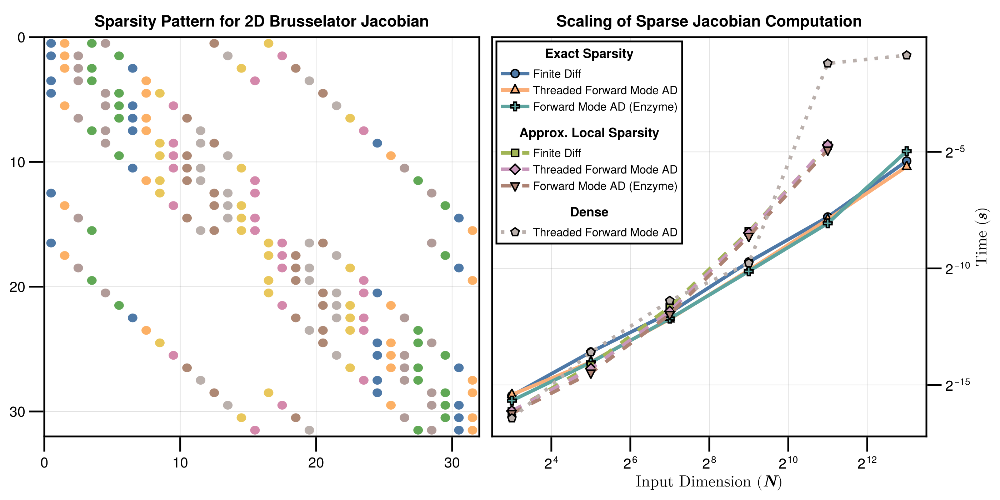
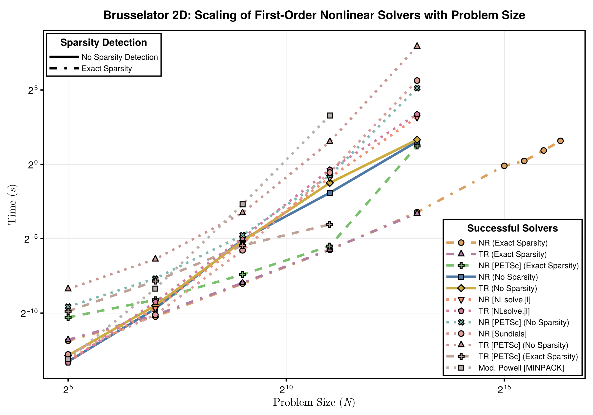
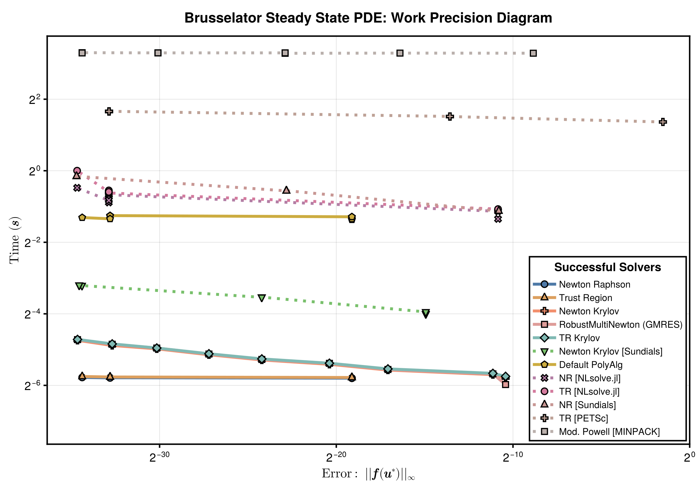

# Setup

Fetch required packages

```julia
using NonlinearSolve, LinearAlgebra, SparseArrays, DiffEqDevTools,
      CairoMakie, Symbolics, BenchmarkTools, PolyesterForwardDiff, LinearSolve, Sundials,
      Enzyme, SparseConnectivityTracer, DifferentiationInterface, SparseMatrixColorings
using SciMLLogging
import NLsolve, MINPACK, PETSc, RecursiveFactorization

const RUS = RadiusUpdateSchemes;
BenchmarkTools.DEFAULT_PARAMETERS.seconds = 0.2;
```


Define a utility to timeout the benchmark after a certain time.

```julia
# Taken from ReTestItems.jl
function timeout(f, timeout)
    cond = Threads.Condition()
    timer = Timer(timeout) do tm
        close(tm)
        ex = ErrorException("timed out after $timeout seconds")
        @lock cond notify(cond, ex; error = false)
    end
    Threads.@spawn begin
        try
            ret = $f()
            isopen(timer) && @lock cond notify(cond, ret)
        catch e
            isopen(timer) &&
                @lock cond notify(cond, CapturedException(e, catch_backtrace()); error = true)
        finally
            close(timer)
        end
    end
    return @lock cond wait(cond) # will throw if we timeout
end
```

```
timeout (generic function with 1 method)
```


Define the Brussletor problem.

```julia
brusselator_f(x, y) = (((x - 3 // 10) ^ 2 + (y - 6 // 10) ^ 2) ≤ 0.01) * 5

limit(a, N) = ifelse(a == N + 1, 1, ifelse(a == 0, N, a))

function init_brusselator_2d(xyd, N)
    N = length(xyd)
    u = zeros(N, N, 2)
    for I in CartesianIndices((N, N))
        x = xyd[I[1]]
        y = xyd[I[2]]
        u[I, 1] = 22 * (y * (1 - y))^(3 / 2)
        u[I, 2] = 27 * (x * (1 - x))^(3 / 2)
    end
    return u
end

function generate_brusselator_problem(N::Int; sparsity = nothing, kwargs...)
    xyd_brusselator = range(0; stop = 1, length = N)

    function brusselator_2d_loop(du_, u_, p)
        A, B, α, δx = p
        α = α / δx ^ 2

        du = reshape(du_, N, N, 2)
        u = reshape(u_, N, N, 2)

        @inbounds @simd for I in CartesianIndices((N, N))
            i, j = Tuple(I)
            x, y = xyd_brusselator[I[1]], xyd_brusselator[I[2]]
            ip1, im1 = limit(i + 1, N), limit(i - 1, N)
            jp1, jm1 = limit(j + 1, N), limit(j - 1, N)

            du[i, j, 1] = α * (u[im1, j, 1] + u[ip1, j, 1] + u[i, jp1, 1] + u[i, jm1, 1] -
                           4u[i, j, 1]) +
                          B + u[i, j, 1] ^ 2 * u[i, j, 2] - (A + 1) * u[i, j, 1] +
                          brusselator_f(x, y)

            du[i, j, 2] = α * (u[im1, j, 2] + u[ip1, j, 2] + u[i, jp1, 2] + u[i, jm1, 2] -
                           4u[i, j, 2]) +
                          A * u[i, j, 1] - u[i, j, 1] ^ 2 * u[i, j, 2]
        end
        return nothing
    end

    return NonlinearProblem(
        NonlinearFunction(brusselator_2d_loop; sparsity),
        vec(init_brusselator_2d(xyd_brusselator, N)),
        (3.4, 1.0, 10.0, step(xyd_brusselator));
        kwargs...
    )
end
```

```
generate_brusselator_problem (generic function with 1 method)
```


```julia
function get_ordering(x::AbstractMatrix)
    idxs = Vector{Int}(undef, size(x, 1))
    placed = zeros(Bool, size(x, 1))
    idx = 1
    for j in size(x, 2):-1:1
        row = view(x, :, j)
        idxs_row = sortperm(row; by = x -> isnan(x) ? Inf : (x == -1 ? Inf : x))
        for i in idxs_row
            if !placed[i] && !isnan(row[i]) && row[i] ≠ -1
                idxs[idx] = i
                placed[i] = true
                idx += 1
                idx > length(idxs) && break
            end
        end
        idx > length(idxs) && break
    end
    return idxs
end
```

```
get_ordering (generic function with 1 method)
```


# Scaling of Sparsity Detection Algorithm

We increase the problem size, and compute the jacobian 10 times similar to a real workload
where the jacobian is computed several times and amortizes the cost for computing the
sparsity pattern.

```julia
test_problem = generate_brusselator_problem(4)
bruss_f!, u0 = (du, u) -> test_problem.f(du, u, test_problem.p), test_problem.u0
y = similar(u0)

J = Float64.(ADTypes.jacobian_sparsity(bruss_f!, y, u0, TracerSparsityDetector()))
colors = fast_coloring(J, ColoringProblem(), GreedyColoringAlgorithm())

begin
    J_ = similar(J)
    rows = rowvals(J)
    vals = nonzeros(J)
    for j in 1:size(J, 2)
        for i in nzrange(J, j)
            row = rows[i]
            J_[j, row] = colors[j]  # spy does a ordering I can't figure out. so transposing it here
        end
    end
end

function cache_and_compute_10_jacobians(adtype, f!::F, y, x, p) where {F}
    prep = DifferentiationInterface.prepare_jacobian(f!, y, adtype, x, Constant(p))
    J = DifferentiationInterface.jacobian(f!, y, prep, adtype, x, Constant(p))
    for _ in 1:9
        DifferentiationInterface.jacobian!(f!, y, J, prep, adtype, x, Constant(p))
    end
    return J
end

# Cap at 2^6: DenseSparsityDetector is O(N²) and dominated CI time at N≥128.
Ns = [2^i for i in 1:6];

adtypes = [
    (
        AutoSparse(
            AutoFiniteDiff();
            sparsity_detector = TracerSparsityDetector(),
            coloring_algorithm = GreedyColoringAlgorithm(LargestFirst())
        ),
        [:finitediff, :exact_sparse]
    ),
    (
        AutoSparse(
            AutoPolyesterForwardDiff();
            sparsity_detector = TracerSparsityDetector(),
            coloring_algorithm = GreedyColoringAlgorithm(LargestFirst())
        ),
        [:polyester, :exact_sparse]
    ),
    (
        AutoSparse(
            AutoEnzyme(; mode = Enzyme.Forward);
            sparsity_detector = TracerSparsityDetector(),
            coloring_algorithm = GreedyColoringAlgorithm(LargestFirst())
        ),
        [:enzyme, :exact_sparse]
    ),
    (
        AutoSparse(
            AutoFiniteDiff();
            sparsity_detector = DenseSparsityDetector(AutoFiniteDiff(); atol = 1e-5),
            coloring_algorithm = GreedyColoringAlgorithm(LargestFirst())
        ),
        [:finitediff, :approx_sparse]
    ),
    (
        AutoSparse(
            AutoPolyesterForwardDiff();
            sparsity_detector = DenseSparsityDetector(
                AutoPolyesterForwardDiff(); atol = 1e-5
            ),
            coloring_algorithm = GreedyColoringAlgorithm(LargestFirst())
        ),
        [:polyester, :approx_sparse]
    ),
    (
        AutoSparse(
            AutoEnzyme(; mode = Enzyme.Forward);
            sparsity_detector = DenseSparsityDetector(
                AutoEnzyme(; mode = Enzyme.Forward); atol = 1e-5
            ),
            coloring_algorithm = GreedyColoringAlgorithm(LargestFirst())
        ),
        [:enzyme, :approx_sparse]
    ),
    (
        AutoPolyesterForwardDiff(),
        [:polyester, :none]
    )
];

times = Matrix{Float64}(undef, length(Ns), length(adtypes));

for (i, N) in enumerate(Ns)
    str = "$(lpad(N, 10)) "
    test_problem = generate_brusselator_problem(N)
    bruss_f! = test_problem.f
    u0 = test_problem.u0
    y = similar(u0)

    for (j, (adtype, tags)) in enumerate(adtypes)
        # Dense sparsity probing is cubic in problem size; skip for N>32.
        if tags[2] === :approx_sparse && N > 32
            times[i, j] = NaN
            str = str * lpad("NaN", 16)
            continue
        end
        times[i, j] = @belapsed begin
            $(cache_and_compute_10_jacobians)(
                $(adtype), $(bruss_f!), $(y), $(u0), $(test_problem.p)
            )
        end
        str = str * "$(lpad(times[i, j], 16))"
    end
    println(str)
end
nothing
```

```
2          1.72e-5        1.612e-5        1.576e-5        1.063e-5
        1.064e-5        1.019e-5        8.709e-6
         4         7.283e-5        5.045e-5       6.2109e-5       6.3529e-5
        3.822e-5       3.8499e-5       5.1679e-5
         8      0.000233768     0.000163238     0.000172008     0.000298217
     0.000202737     0.000201148     0.000229338
        16      0.001060678     0.000730732     0.000708092     0.002775538
     0.002153306     0.002073386     0.001169617
        32      0.004863074     0.003326322     0.003931685     0.037416123
     0.029633142     0.026266001     0.069032972
        64      0.023852948     0.022124027     0.018766356             NaN
             NaN             NaN     0.555817775
```


Plotting the results.

```julia
symbol_to_adname = Dict(
    :finitediff => "Finite Diff",
    :forwarddiff => "Forward Mode AD",
    :polyester => "Threaded Forward Mode AD",
    :enzyme => "Forward Mode AD (Enzyme)"
)

fig = begin
    cycle = Cycle([:marker], covary = true)
    plot_theme = Theme(Lines = (; cycle), Scatter = (; cycle))

    with_theme(plot_theme) do
        fig = Figure(; size = (1400, 1400 * 0.5))

        ax = Axis(fig[1, 1]; title = "Sparsity Pattern for 2D Brusselator Jacobian",
            titlesize = 22, titlegap = 10,
            xticksize = 20, yticksize = 20, xticklabelsize = 20, yticklabelsize = 20,
            xtickwidth = 2.5, ytickwidth = 2.5, spinewidth = 2.5, yreversed = true)

        spy!(ax, J_; markersize = 1, marker = :circle, framecolor = :lightgray,
            colormap = :tableau_20)

        ax = Axis(fig[1, 2]; title = "Scaling of Sparse Jacobian Computation",
            titlesize = 22, titlegap = 10, xscale = log2, yscale = log2,
            xticksize = 20, yticksize = 20, xticklabelsize = 20, yticklabelsize = 20,
            xtickwidth = 2.5, ytickwidth = 2.5, spinewidth = 2.5,
            xlabel = L"Input Dimension ($\mathbf{N}$)",
            ylabel = L"Time $\mathbf{(s)}$", xlabelsize = 22,
            ylabelsize = 22, yaxisposition = :right)

        colors = cgrad(:tableau_20, length(adtypes); categorical = true)

        line_list = []
        scatter_list = []
        Ns_ = Ns .^ 2 .* 2
        linestyles = [:solid, :solid, :solid, :dash, :dash, :dash, :dot, :dot]

        for (i, times) in enumerate(eachcol(times))
            l = lines!(
                Ns_, times; linewidth = 5, color = colors[i], linestyle = linestyles[i])
            push!(line_list, l)
            sc = scatter!(Ns_, times; markersize = 16, strokewidth = 2, color = colors[i])
            push!(scatter_list, sc)
        end

        tracer_idxs = [idx for idx in 1:length(adtypes) if :exact_sparse ∈ adtypes[idx][2]]
        group_tracer = [[
                            LineElement(;
                                color = line_list[idx].color,
                                linestyle = line_list[idx].linestyle,
                                linewidth = line_list[idx].linewidth
                            ),
                            MarkerElement(;
                                color = scatter_list[idx].color,
                                marker = scatter_list[idx].marker,
                                strokewidth = scatter_list[idx].strokewidth,
                                markersize = scatter_list[idx].markersize
                            )
                        ] for idx in tracer_idxs]

        local_sparse_idxs = [idx
                             for idx in 1:length(adtypes)
                             if :approx_sparse ∈ adtypes[idx][2]]
        group_local_sparse = [[
                                  LineElement(;
                                      color = line_list[idx].color,
                                      linestyle = line_list[idx].linestyle,
                                      linewidth = line_list[idx].linewidth
                                  ),
                                  MarkerElement(;
                                      color = scatter_list[idx].color,
                                      marker = scatter_list[idx].marker,
                                      strokewidth = scatter_list[idx].strokewidth,
                                      markersize = scatter_list[idx].markersize
                                  )
                              ] for idx in local_sparse_idxs]

        non_sparse_idxs = [idx for idx in 1:length(adtypes) if :none ∈ adtypes[idx][2]]
        group_nonsparse = [[
                               LineElement(;
                                   color = line_list[idx].color,
                                   linestyle = line_list[idx].linestyle,
                                   linewidth = line_list[idx].linewidth
                               ),
                               MarkerElement(;
                                   color = scatter_list[idx].color,
                                   marker = scatter_list[idx].marker,
                                   strokewidth = scatter_list[idx].strokewidth,
                                   markersize = scatter_list[idx].markersize
                               )
                           ] for idx in non_sparse_idxs]

        axislegend(
            ax,
            [group_tracer, group_local_sparse, group_nonsparse],
            [
                [symbol_to_adname[adtypes[idx][2][1]] for idx in tracer_idxs],
                [symbol_to_adname[adtypes[idx][2][1]] for idx in local_sparse_idxs],
                [symbol_to_adname[adtypes[idx][2][1]] for idx in non_sparse_idxs]
            ],
            ["Exact Sparsity", "Approx. Local Sparsity", "Dense"];
            position = :lt, framevisible = true, framewidth = 2.5, titlesize = 18,
            labelsize = 16, patchsize = (40.0f0, 20.0f0)
        )

        fig
    end
end
```



```julia
save("brusselator_sparse_jacobian_scaling.svg", fig)
```

```
CairoMakie.Screen{SVG}
```


# Scaling with Problem Size

First, let us experiment the scaling of each algorithm with the problem size.

```julia
Ns = vcat(collect(2 .^ (2:7)), [150, 175, 200])

solvers_scaling = [
    (; pkg = :nonlinearsolve, sparsity = :none,
        name = "NR (No Sparsity)", alg = NewtonRaphson()),
    (; pkg = :nonlinearsolve, sparsity = :exact,
        name = "NR (Exact Sparsity)", alg = NewtonRaphson()),
    (; pkg = :wrapper, sparsity = :none, name = "NR [NLsolve.jl]",
        alg = NLsolveJL(; method = :newton, autodiff = :forward)),
    (; pkg = :wrapper, sparsity = :none, name = "NR [Sundials]",
        alg = KINSOL(; linear_solver = :LapackDense, maxsetupcalls = 1)),
    (; pkg = :wrapper,
        sparsity = :none,
        name = "NR [PETSc] (No Sparsity)",
        alg = PETScSNES(; snes_type = "newtonls", snes_linesearch_type = "basic", autodiff = missing)),
    (; pkg = :wrapper, sparsity = :exact, name = "NR [PETSc] (Exact Sparsity)",
        alg = PETScSNES(; snes_type = "newtonls", snes_linesearch_type = "basic")), (;
        pkg = :nonlinearsolve, sparsity = :none, name = "TR (No Sparsity)",
        alg = TrustRegion(; radius_update_scheme = RUS.NLsolve)),
    (; pkg = :nonlinearsolve, sparsity = :exact, name = "TR (Exact Sparsity)",
        alg = TrustRegion(; radius_update_scheme = RUS.NLsolve)),
    (; pkg = :wrapper, sparsity = :none, name = "TR [NLsolve.jl]",
        alg = NLsolveJL(; autodiff = :forward)),
    (; pkg = :wrapper, sparsity = :none, name = "TR [PETSc] (No Sparsity)",
        alg = PETScSNES(; snes_type = "newtontr", autodiff = missing)),
    (; pkg = :wrapper, sparsity = :exact, name = "TR [PETSc] (Exact Sparsity)",
        alg = PETScSNES(; snes_type = "newtontr")), (; pkg = :wrapper, sparsity = :none,
        name = "Mod. Powell [MINPACK]", alg = CMINPACK())
]

GC.enable(false) # for PETSc

runtimes_scaling = fill(-1.0, length(solvers_scaling), length(Ns))

for (i, N) in enumerate(Ns)
    prob_dense = generate_brusselator_problem(N)
    prob_exact_sparse = generate_brusselator_problem(N;
        sparsity = TracerSparsityDetector()
    )

    @info "Benchmarking N = $N"

    for (j, solver) in enumerate(solvers_scaling)
        ptype = solver.sparsity
        alg = solver.alg
        name = solver.name

        prob = if ptype == :none
            prob_dense
        elseif ptype == :approx
            # With Tracing based sparsity detection, we dont need this any more
            error("Approximate Sparsity not implemented")
        elseif ptype == :exact
            prob_exact_sparse
        end

        # Cascade on -1 (timeout): leave -1 so later solvers at this N also skip.
        # Size-limit skips use NaN and do not cascade.
        if (j > 1 && runtimes_scaling[j - 1, i] == -1) ||
           (alg isa CMINPACK && N > 32) ||
           (alg isa KINSOL && N > 64) ||
           (alg isa NLsolveJL && N > 64 && alg.method == :trust_region) ||
           (alg isa GeneralizedFirstOrderAlgorithm && alg.name == :TrustRegion && N > 64) ||
           (alg isa NLsolveJL && N > 64 && alg.method == :newton) ||
           (alg isa GeneralizedFirstOrderAlgorithm && alg.name == :NewtonRaphson &&
            N > 64 && ptype == :none) ||
           (alg isa PETScSNES && N > 64)
            if j > 1 && runtimes_scaling[j - 1, i] == -1
                runtimes_scaling[j, i] = -1
            else
                runtimes_scaling[j, i] = NaN
            end
            @warn "$(name): Would Have Timed out"
        else
            function benchmark_function()
                termination_condition = (alg isa PETScSNES || alg isa KINSOL) ?
                                        nothing :
                                        AbsNormTerminationMode(Base.Fix1(maximum, abs))
                sol = solve(prob, alg; abstol = 1e-6, reltol = 1e-6, termination_condition)
                runtimes_scaling[j, i] = @belapsed solve($prob, $alg; abstol = 1e-6,
                    reltol = 1e-6, termination_condition = $termination_condition)
                @info "$(name): $(runtimes_scaling[j, i]) | $(norm(sol.resid, Inf)) | $(sol.retcode)"
            end

            timeout(benchmark_function, 600)

            # Keep -1 on timeout so subsequent solvers at this N cascade-skip.
            if runtimes_scaling[j, i] == -1
                @warn "$(name): Timed out"
            end
        end
    end

    println()
end

# Normalize timeout sentinels for plotting (log-scale).
runtimes_scaling = map(x -> x == -1 ? NaN : x, runtimes_scaling)
```

```
12×9 Matrix{Float64}:
 0.000113398  0.0008585    0.0559755   …  NaN        NaN        NaN
 0.000211058  0.000745371  0.00350314       1.70608    2.60908    3.98496
 8.4919e-5    0.000982199  0.023241       NaN        NaN        NaN
 9.2899e-5    0.000698552  0.013871       NaN        NaN        NaN
 0.00102924   0.003772     0.0285505      NaN        NaN        NaN
 0.000658253  0.00147389   0.00477854  …  NaN        NaN        NaN
 0.000134939  0.000816571  0.0250265      NaN        NaN        NaN
 0.000212028  0.000745701  0.00356366     NaN        NaN        NaN
 9.5899e-5    0.00102779   0.0237114      NaN        NaN        NaN
 0.00235851   0.00932486   0.0794934      NaN        NaN        NaN
 0.000972429  0.00340767   0.0180865   …  NaN        NaN        NaN
 8.0389e-5    0.00230232   0.119524       NaN        NaN        NaN
```


Plot the results.

```julia
fig = begin
    ASPECT_RATIO = 0.7
    WIDTH = 1200
    HEIGHT = round(Int, WIDTH * ASPECT_RATIO)
    STROKEWIDTH = 2.5

    cycle = Cycle([:marker], covary = true)
    colors = cgrad(:tableau_20, length(solvers_scaling); categorical = true)
    theme = Theme(Lines = (cycle = cycle,), Scatter = (cycle = cycle,))
    LINESTYLES = Dict(
        (:nonlinearsolve, :none) => :solid,
        (:nonlinearsolve, :exact) => :dashdot,
        # (:simplenonlinearsolve, :none) => :solid,
        (:wrapper, :exact) => :dash,
        (:wrapper, :none) => :dot
    )

    Ns_ = Ns .^ 2 .* 2

    with_theme(theme) do
        fig = Figure(; size = (WIDTH, HEIGHT))

        ax = Axis(fig[1, 1:3], ylabel = L"Time ($s$)", xlabel = L"Problem Size ($N$)",
            xscale = log2, yscale = log2, xlabelsize = 22, ylabelsize = 22,
            xticklabelsize = 20, yticklabelsize = 20, xtickwidth = STROKEWIDTH,
            ytickwidth = STROKEWIDTH, spinewidth = STROKEWIDTH)

        idxs = get_ordering(runtimes_scaling)

        ls, scs = [], []
        for (i, solver) in zip(idxs, solvers_scaling[idxs])
            linestyle = LINESTYLES[(solver.pkg, solver.sparsity)]
            l = lines!(Ns_, runtimes_scaling[i, :]; linewidth = 5, color = colors[i],
                linestyle)
            sc = scatter!(Ns_, runtimes_scaling[i, :]; markersize = 16, strokewidth = 2,
                color = colors[i])
            push!(ls, l)
            push!(scs, sc)
        end

        main_legend = [[
                           LineElement(;
                               color = ls[idx].color, linestyle = ls[idx].linestyle,
                               linewidth = ls[idx].linewidth),
                           MarkerElement(;
                               color = scs[idx].color, marker = scs[idx].marker,
                               markersize = scs[idx].markersize, strokewidth = scs[idx].strokewidth)
                       ]
                       for idx in 1:length(solvers_scaling)]

        sparsity_legend = [
            LineElement(; linestyle = :solid, linewidth = 5),
            # LineElement(; linestyle = :dash, linewidth = 5),
            LineElement(; linestyle = :dashdot, linewidth = 5)
        ]

        axislegend(ax, main_legend, [s.name for s in solvers_scaling[idxs]],
            "Successful Solvers";
            framevisible = true, framewidth = STROKEWIDTH, orientation = :vertical,
            titlesize = 20, nbanks = 1, labelsize = 16,
            tellheight = true, tellwidth = false, patchsize = (60.0f0, 20.0f0),
            position = :rb)

        axislegend(ax, sparsity_legend,
            [
                "No Sparsity Detection",
                # "Approx. Sparsity",
                "Exact Sparsity"
            ],
            "Sparsity Detection"; framevisible = true, framewidth = STROKEWIDTH,
            orientation = :vertical, titlesize = 20, nbanks = 1, labelsize = 16,
            tellheight = true, tellwidth = false, patchsize = (60.0f0, 20.0f0),
            position = :lt)

        fig[0, :] = Label(fig,
            "Brusselator 2D: Scaling of First-Order Nonlinear Solvers with Problem Size",
            fontsize = 24, tellwidth = false, font = :bold)

        return fig
    end
end
```



```julia
save("brusselator_scaling.svg", fig)
```

```
CairoMakie.Screen{SVG}
```


# Work-Precision Diagram

In this section, we will generate the work-precision of the solvers. All solvers that can
exploit sparsity will automatically do so.

```julia
solvers_all = [
    (; pkg = :nonlinearsolve, name = "Default PolyAlg",
        solver = Dict(:alg => FastShortcutNonlinearPolyalg())),
    (; pkg = :nonlinearsolve, name = "RobustMultiNewton (GMRES)",
        solver = Dict(:alg => RobustMultiNewton(; linsolve = KrylovJL_GMRES()))), (;
        pkg = :nonlinearsolve, name = "Newton Raphson",
        solver = Dict(:alg => NewtonRaphson(; linsolve = nothing))),
    (; pkg = :nonlinearsolve, name = "Newton Krylov",
        solver = Dict(:alg => NewtonRaphson(; linsolve = KrylovJL_GMRES()))),
    (; pkg = :nonlinearsolve, name = "Trust Region", solver = Dict(:alg => TrustRegion())),
    (; pkg = :nonlinearsolve, name = "TR Krylov",
        solver = Dict(:alg => TrustRegion(; linsolve = KrylovJL_GMRES()))), (;
        pkg = :wrapper, name = "NR [NLsolve.jl]",
        solver = Dict(:alg => NLsolveJL(; method = :newton, autodiff = :forward))),
    (; pkg = :wrapper, name = "TR [NLsolve.jl]",
        solver = Dict(:alg => NLsolveJL(; autodiff = :forward))), (;
        pkg = :wrapper, name = "NR [Sundials]",
        solver = Dict(:alg => KINSOL(; linear_solver = :LapackDense, maxsetupcalls = 1))),
    (; pkg = :wrapper,
        name = "Newton Krylov [Sundials]",
        solver = Dict(:alg => KINSOL(; linear_solver = :GMRES, maxsetupcalls = 1, krylov_dim = 1000))), (;
        pkg = :wrapper, name = "Mod. Powell [MINPACK]", solver = Dict(:alg => CMINPACK())),
    (; pkg = :wrapper,
        name = "NR [PETSc]",
        solver = Dict(:alg => PETScSNES(;
            snes_type = "newtonls", snes_linesearch_type = "basic", autodiff = missing))),
    (; pkg = :wrapper, name = "TR [PETSc]",
        solver = Dict(:alg => PETScSNES(; snes_type = "newtontr", autodiff = missing))),
    (; pkg = :wrapper,
        name = "Newton Krylov [PETSc]",
        solver = Dict(:alg => PETScSNES(;
            snes_type = "newtonls", snes_linesearch_type = "basic", ksp_type = "gmres",
            autodiff = missing, snes_mf = true, ksp_gmres_restart = 1000)))
];
```


```julia
prob_wpd = generate_brusselator_problem(32; sparsity = TracerSparsityDetector())

abstols = 1.0 ./ 10 .^ (2:10)
reltols = 1.0 ./ 10 .^ (2:10)

function check_solver(prob, solver)
    try
        sol = solve(prob, solver.solver[:alg]; abstol = 1e-4, reltol = 1e-4,
            maxiters = 10000)
        err = norm(sol.resid, Inf)
        if !SciMLBase.successful_retcode(sol.retcode)
            Base.printstyled(
                "[Warn] Solver $(solver.name) returned retcode $(sol.retcode) with an residual norm = $(norm(sol.resid)).\n";
                color = :red)
            return false
        elseif err > 1e3
            Base.printstyled(
                "[Warn] Solver $(solver.name) had a very large residual (norm = $(norm(sol.resid))).\n";
                color = :red)
            return false
        elseif isinf(err) || isnan(err)
            Base.printstyled("[Warn] Solver $(solver.name) had a residual of $(err).\n";
                color = :red)
            return false
        end
        Base.printstyled(
            "[Info] Solver $(solver.name) successfully solved the problem (norm = $(norm(sol.resid))).\n";
            color = :green)
    catch e
        Base.printstyled("[Warn] Solver $(solver.name) threw an error: $e.\n"; color = :red)
        return false
    end
    return true
end

function generate_wpset(prob, solvers)
    # Finds the solvers that can solve the problem
    successful_solvers = filter(solver -> check_solver(prob, solver), solvers)

    return WorkPrecisionSet(prob, abstols, reltols,
        getfield.(successful_solvers, :solver);
        names = getfield.(successful_solvers, :name), numruns = 10, error_estimate = :l∞,
        maxiters = 1000, verbose = SciMLLogging.Standard()),
    successful_solvers
end
```

```
generate_wpset (generic function with 1 method)
```


```julia
wp_set, successful_solvers = generate_wpset(prob_wpd, solvers_all);
```

```
[Info] Solver Default PolyAlg successfully solved the problem (norm = 2.639
1901755098182e-9).
[Info] Solver RobustMultiNewton (GMRES) successfully solved the problem (no
rm = 9.061694653242178e-5).
[Info] Solver Newton Raphson successfully solved the problem (norm = 2.6391
901755098182e-9).
[Info] Solver Newton Krylov successfully solved the problem (norm = 9.06169
4653242178e-5).
[Info] Solver Trust Region successfully solved the problem (norm = 2.639190
1755098182e-9).
[Info] Solver TR Krylov successfully solved the problem (norm = 9.061694653
242178e-5).
[Info] Solver NR [NLsolve.jl] successfully solved the problem (norm = 2.629
767216137896e-9).
[Info] Solver TR [NLsolve.jl] successfully solved the problem (norm = 2.629
767216137896e-9).
[Info] Solver NR [Sundials] successfully solved the problem (norm = 1.22227
32529298485e-6).
[Info] Solver Newton Krylov [Sundials] successfully solved the problem (nor
m = 0.0005045549665406284).
[Info] Solver Mod. Powell [MINPACK] successfully solved the problem (norm =
 1.9629370283177898e-6).
[Warn] Solver NR [PETSc] returned retcode Failure with an residual norm = 0
.008277151682674046.
[Info] Solver TR [PETSc] successfully solved the problem (norm = 0.00113188
002920334).
[Warn] Solver Newton Krylov [PETSc] returned retcode Failure with an residu
al norm = 0.022043824067284137.
```


Plotting the Work-Precision Diagram.

```julia
fig = begin
    LINESTYLES = Dict(:nonlinearsolve => :solid, :simplenonlinearsolve => :dash,
        :wrapper => :dot)
    ASPECT_RATIO = 0.7
    WIDTH = 1200
    HEIGHT = round(Int, WIDTH * ASPECT_RATIO)
    STROKEWIDTH = 2.5

    colors = cgrad(:tableau_20, length(successful_solvers); categorical = true)
    cycle = Cycle([:marker], covary = true)
    plot_theme = Theme(Lines = (; cycle), Scatter = (; cycle))

    with_theme(plot_theme) do
        fig = Figure(; size = (WIDTH, HEIGHT))
        # `textbf` doesn't work
        ax = Axis(fig[1, 1], ylabel = L"Time $\mathbf{(s)}$",
            xlabelsize = 22, ylabelsize = 22,
            xlabel = L"Error: $\mathbf{||f(u^\ast)||_\infty}$",
            xscale = log2, yscale = log2, xtickwidth = STROKEWIDTH,
            ytickwidth = STROKEWIDTH, spinewidth = STROKEWIDTH,
            xticklabelsize = 20, yticklabelsize = 20)

        idxs = sortperm(median.(getfield.(wp_set.wps, :times)))

        ls, scs = [], []

        for (i, (wp, solver)) in enumerate(zip(wp_set.wps[idxs], successful_solvers[idxs]))
            (; name, times, errors) = wp
            errors = [err.l∞ for err in errors]
            l = lines!(ax, errors, times; linestyle = LINESTYLES[solver.pkg], label = name,
                linewidth = 5, color = colors[i])
            sc = scatter!(
                ax, errors, times; label = name, markersize = 16, strokewidth = 2,
                color = colors[i])
            push!(ls, l)
            push!(scs, sc)
        end

        xlims!(ax; high = 1)
        ylims!(ax; low = 5e-3)

        axislegend(ax, [[l, sc] for (l, sc) in zip(ls, scs)],
            [solver.name for solver in successful_solvers[idxs]], "Successful Solvers";
            framevisible = true, framewidth = STROKEWIDTH, position = :rb,
            titlesize = 20, labelsize = 16, patchsize = (40.0f0, 20.0f0))

        fig[0, :] = Label(fig, "Brusselator Steady State PDE: Work Precision Diagram",
            fontsize = 24, tellwidth = false, font = :bold)

        fig
    end
end
```



```julia
save("brusselator_wpd.svg", fig)
```

```
CairoMakie.Screen{SVG}
```


## Appendix

These benchmarks are a part of the SciMLBenchmarks.jl repository, found at: [https://github.com/SciML/SciMLBenchmarks.jl](https://github.com/SciML/SciMLBenchmarks.jl). For more information on high-performance scientific machine learning, check out the SciML Open Source Software Organization [https://sciml.ai](https://sciml.ai).

To locally run this benchmark, do the following commands:

```
using SciMLBenchmarks
SciMLBenchmarks.weave_file("benchmarks/NonlinearProblem","bruss.jmd")
```

Computer Information:

```
Julia Version 1.11.9
Commit 53a02c0720c (2026-02-06 00:27 UTC)
Build Info:
  Official https://julialang.org/ release
Platform Info:
  OS: Linux (x86_64-linux-gnu)
  CPU: 128 × AMD EPYC 7502 32-Core Processor
  WORD_SIZE: 64
  LLVM: libLLVM-16.0.6 (ORCJIT, znver2)
Threads: 128 default, 0 interactive, 64 GC (on 128 virtual cores)
Environment:
  JULIA_DEPOT_PATH = /home/crackauc/github-runners/amdci8-1/.julia
  JULIA_NUM_THREADS = auto

```

Package Information:

```
Status `~/github-runners/amdci8-1/_work/SciMLBenchmarks.jl/SciMLBenchmarks.jl/benchmarks/NonlinearProblem/Project.toml`
⌅ [2169fc97] AlgebraicMultigrid v1.2.0
  [6e4b80f9] BenchmarkTools v1.8.0
  [13f3f980] CairoMakie v0.15.13
⌃ [2b5f629d] DiffEqBase v7.12.0
⌃ [f3b72e0c] DiffEqDevTools v3.2.0
⌃ [a0c0ee7d] DifferentiationInterface v0.7.20
⌃ [7da242da] Enzyme v0.13.198
  [40713840] IncompleteLU v0.2.1
⌃ [b964fa9f] LaTeXStrings v1.4.0
⌃ [d3d80556] LineSearches v7.5.1
⌅ [7ed4a6bd] LinearSolve v3.87.0
  [4854310b] MINPACK v1.3.0
⌅ [2774e3e8] NLsolve v4.5.1
  [b7050fa9] NonlinearProblemLibrary v0.1.7
⌃ [8913a72c] NonlinearSolve v4.21.0
  [ace2c81b] PETSc v0.4.10
  [98d1487c] PolyesterForwardDiff v0.1.4
⌃ [08abe8d2] PrettyTables v3.4.5
⌃ [f2c3362d] RecursiveFactorization v0.2.26
⌃ [31c91b34] SciMLBenchmarks v0.1.3
  [a6db7da4] SciMLLogging v2.0.4
  [efcf1570] Setfield v1.1.2
⌃ [727e6d20] SimpleNonlinearSolve v2.13.1
  [9f842d2f] SparseConnectivityTracer v1.2.2
  [0a514795] SparseMatrixColorings v0.4.27
  [f1835b91] SpeedMapping v0.4.1
  [860ef19b] StableRNGs v1.0.4
⌃ [90137ffa] StaticArrays v1.9.18
⌃ [c3572dad] Sundials v6.4.2
  [0c5d862f] Symbolics v7.36.0
Info Packages marked with ⌃ and ⌅ have new versions available. Those with ⌃ may be upgradable, but those with ⌅ are restricted by compatibility constraints from upgrading. To see why use `status --outdated`
```

And the full manifest:

```
Status `~/github-runners/amdci8-1/_work/SciMLBenchmarks.jl/SciMLBenchmarks.jl/benchmarks/NonlinearProblem/Manifest.toml`
⌃ [47edcb42] ADTypes v1.22.4
  [14f7f29c] AMD v0.5.3
  [621f4979] AbstractFFTs v1.5.0
  [6e696c72] AbstractPlutoDingetjes v1.4.0
  [1520ce14] AbstractTrees v0.4.5
  [7d9f7c33] Accessors v0.1.45
  [79e6a3ab] Adapt v4.7.0
  [35492f91] AdaptivePredicates v1.2.0
⌅ [2169fc97] AlgebraicMultigrid v1.2.0
  [66dad0bd] AliasTables v1.1.3
  [27a7e980] Animations v0.4.2
  [ec485272] ArnoldiMethod v0.4.0
⌃ [4fba245c] ArrayInterface v7.28.1
  [67c07d97] Automa v1.2.0
  [13072b0f] AxisAlgorithms v1.1.0
  [39de3d68] AxisArrays v0.4.8
  [18cc8868] BaseDirs v1.4.0
  [6e4b80f9] BenchmarkTools v1.8.0
  [e2ed5e7c] Bijections v0.2.2
  [62783981] BitTwiddlingConvenienceFunctions v0.1.6
⌃ [70df07ce] BracketingNonlinearSolve v1.12.4
  [fa961155] CEnum v0.5.0
  [2a0fbf3d] CPUSummary v0.2.7
  [96374032] CRlibm v1.0.2
  [159f3aea] Cairo v1.1.1
  [13f3f980] CairoMakie v0.15.13
  [d360d2e6] ChainRulesCore v1.26.1
  [fb6a15b2] CloseOpenIntervals v0.1.13
  [6b39b394] CodecZstd v0.8.7
  [a2cac450] ColorBrewer v0.4.2
  [35d6a980] ColorSchemes v3.31.0
  [3da002f7] ColorTypes v0.12.1
  [c3611d14] ColorVectorSpace v0.11.0
  [5ae59095] Colors v0.13.1
⌅ [861a8166] Combinatorics v1.0.2
  [38540f10] CommonSolve v0.2.13
  [bbf7d656] CommonSubexpressions v0.3.1
  [f70d9fcc] CommonWorldInvalidations v1.1.2
  [34da2185] Compat v4.18.1
  [b152e2b5] CompositeTypes v0.1.4
  [a33af91c] CompositionsBase v0.1.2
  [95dc2771] ComputePipeline v0.1.8
  [2569d6c7] ConcreteStructs v0.2.7
  [8f4d0f93] Conda v1.10.3
  [187b0558] ConstructionBase v1.6.0
  [d38c429a] Contour v0.6.3
  [b7a15901] CoreMath v0.1.0
  [adafc99b] CpuId v0.3.1
  [a8cc5b0e] Crayons v4.2.0
  [9a962f9c] DataAPI v1.16.0
  [864edb3b] DataStructures v0.19.6
  [e2d170a0] DataValueInterfaces v1.0.0
  [927a84f5] DelaunayTriangulation v1.6.6
⌃ [2b5f629d] DiffEqBase v7.12.0
⌃ [f3b72e0c] DiffEqDevTools v3.2.0
⌃ [77a26b50] DiffEqNoiseProcess v5.34.0
  [163ba53b] DiffResults v1.1.0
  [b552c78f] DiffRules v1.16.0
⌃ [a0c0ee7d] DifferentiationInterface v0.7.20
  [b4f34e82] Distances v0.10.12
⌃ [31c24e10] Distributions v0.25.130
  [ffbed154] DocStringExtensions v0.9.5
  [5b8099bc] DomainSets v0.8.1
  [7c1d4256] DynamicPolynomials v0.6.6
  [4e289a0a] EnumX v1.0.7
⌃ [7da242da] Enzyme v0.13.198
  [f151be2c] EnzymeCore v0.8.21
  [429591f6] ExactPredicates v2.2.9
  [e2ba6199] ExprTools v0.1.11
  [55351af7] ExproniconLite v0.10.14
  [b86e33f2] FFTA v0.3.1
  [7034ab61] FastBroadcast v1.3.6
  [9aa1b823] FastClosures v0.3.2
  [a4df4552] FastPower v1.4.1
  [5789e2e9] FileIO v1.20.0
  [8fc22ac5] FilePaths v0.9.0
  [48062228] FilePathsBase v0.9.24
  [1a297f60] FillArrays v1.17.0
  [64ca27bc] FindFirstFunctions v3.2.1
⌃ [6a86dc24] FiniteDiff v2.32.1
⌅ [53c48c17] FixedPointNumbers v0.8.6
  [1fa38f19] Format v1.3.7
  [f6369f11] ForwardDiff v1.4.5
  [b38be410] FreeType v4.1.1
  [663a7486] FreeTypeAbstraction v0.10.8
  [a85aefff] FunctionMaps v0.1.2
  [069b7b12] FunctionWrappers v1.1.3
⌃ [77dc65aa] FunctionWrappersWrappers v1.12.1
  [46192b85] GPUArraysCore v0.2.0
⌅ [61eb1bfa] GPUCompiler v1.23.0
⌃ [a0844989] Gamma v1.1.0
  [5c1252a2] GeometryBasics v0.5.11
  [d7ba0133] Git v1.5.0
  [a2bd30eb] Graphics v1.1.3
  [86223c79] Graphs v1.14.0
  [3955a311] GridLayoutBase v0.11.2
⌅ [eafb193a] Highlights v0.5.3
  [3e5b6fbb] HostCPUFeatures v0.1.18
  [34004b35] HypergeometricFunctions v0.3.30
  [7073ff75] IJulia v1.34.4
  [615f187c] IfElse v0.1.1
  [2803e5a7] ImageAxes v0.6.12
  [c817782e] ImageBase v0.1.7
  [a09fc81d] ImageCore v0.10.5
  [82e4d734] ImageIO v0.6.9
  [bc367c6b] ImageMetadata v0.9.10
  [40713840] IncompleteLU v0.2.1
  [9b13fd28] IndirectArrays v1.0.0
  [d25df0c9] Inflate v0.1.5
  [18e54dd8] IntegerMathUtils v0.1.4
  [a98d9a8b] Interpolations v0.16.3
⌃ [d1acc4aa] IntervalArithmetic v1.0.10
  [8197267c] IntervalSets v0.7.14
  [3587e190] InverseFunctions v0.1.17
  [92d709cd] IrrationalConstants v0.2.6
  [f1662d9f] Isoband v0.1.1
  [c8e1da08] IterTools v1.10.0
  [82899510] IteratorInterfaceExtensions v1.0.0
  [692b3bcd] JLLWrappers v1.8.0
⌅ [682c06a0] JSON v0.21.4
  [ae98c720] Jieko v0.2.1
  [b835a17e] JpegTurbo v0.1.6
  [5ab0869b] KernelDensity v0.6.12
  [ba0b0d4f] Krylov v0.10.9
⌃ [929cbde3] LLVM v9.11.0
⌃ [b964fa9f] LaTeXStrings v1.4.0
⌃ [23fbe1c1] Latexify v0.16.11
  [10f19ff3] LayoutPointers v0.1.17
  [8cdb02fc] LazyModules v0.3.1
⌃ [87fe0de2] LineSearch v0.1.13
⌃ [d3d80556] LineSearches v7.5.1
⌅ [7ed4a6bd] LinearSolve v3.87.0
⌃ [2ab3a3ac] LogExpFunctions v0.3.29
  [e6f89c97] LoggingExtras v1.2.0
  [bdcacae8] LoopVectorization v0.12.174
  [4854310b] MINPACK v1.3.0
⌃ [da04e1cc] MPI v0.20.26
  [3da0fdf6] MPIPreferences v0.1.12
  [1914dd2f] MacroTools v0.5.16
  [ee78f7c6] Makie v0.24.13
  [d125e4d3] ManualMemory v0.1.8
  [dbb5928d] MappedArrays v0.4.3
  [299715c1] MarchingCubes v0.1.11
  [0a4f8689] MathTeXEngine v0.6.9
  [bb5d69b7] MaybeInplace v0.1.7
  [e1d29d7a] Missings v1.2.0
  [e94cdb99] MosaicViews v0.3.4
  [2e0e35c7] Moshi v0.3.12
  [46d2c3a1] MuladdMacro v0.2.7
  [102ac46a] MultivariatePolynomials v0.5.19
  [ffc61752] Mustache v1.0.21
  [d8a4904e] MutableArithmetics v1.8.0
⌅ [d41bc354] NLSolversBase v7.10.0
⌅ [2774e3e8] NLsolve v4.5.1
  [77ba4419] NaNMath v1.1.4
  [f09324ee] Netpbm v1.1.1
  [b7050fa9] NonlinearProblemLibrary v0.1.7
⌃ [8913a72c] NonlinearSolve v4.21.0
⌅ [be0214bd] NonlinearSolveBase v2.33.0
⌃ [5959db7a] NonlinearSolveFirstOrder v2.2.0
⌃ [9a2c21bd] NonlinearSolveQuasiNewton v1.13.3
⌃ [26075421] NonlinearSolveSpectralMethods v1.7.4
  [d8793406] ObjectFile v0.5.1
  [510215fc] Observables v0.5.5
  [6fe1bfb0] OffsetArrays v1.17.0
  [52e1d378] OpenEXR v0.3.3
⌅ [bac558e1] OrderedCollections v1.8.2
  [90014a1f] PDMats v0.11.41
  [ace2c81b] PETSc v0.4.10
  [f57f5aa1] PNGFiles v0.4.5
  [19eb6ba3] Packing v0.5.1
  [5432bcbf] PaddedViews v0.5.12
  [69de0a69] Parsers v2.8.7
  [eebad327] PkgVersion v0.3.3
  [995b91a9] PlotUtils v1.4.4
  [e409e4f3] PoissonRandom v0.4.13
  [f517fe37] Polyester v0.7.19
  [98d1487c] PolyesterForwardDiff v0.1.4
  [1d0040c9] PolyesterWeave v0.2.2
  [647866c9] PolygonOps v0.1.2
⌃ [d236fae5] PreallocationTools v1.4.1
⌅ [aea7be01] PrecompileTools v1.2.1
  [21216c6a] Preferences v1.5.2
⌃ [08abe8d2] PrettyTables v3.4.5
  [27ebfcd6] Primes v0.5.7
  [92933f4c] ProgressMeter v1.11.0
  [43287f4e] PtrArrays v1.4.0
⌃ [0c0d3e7f] PureKLU v1.4.0
  [4b34888f] QOI v1.0.2
  [1fd47b50] QuadGK v2.11.3
  [b3c3ace0] RangeArrays v0.3.2
  [c84ed2f1] Ratios v0.4.5
  [988b38a3] ReadOnlyArrays v0.2.0
  [3cdcf5f2] RecipesBase v1.3.4
⌃ [731186ca] RecursiveArrayTools v4.3.6
⌃ [f2c3362d] RecursiveFactorization v0.2.26
  [189a3867] Reexport v1.2.2
  [05181044] RelocatableFolders v1.0.1
  [ae029012] Requires v1.3.1
  [ae5879a3] ResettableStacks v1.3.0
  [9fe22ead] RespecializeParams v1.2.0
  [79098fc4] Rmath v0.9.0
⌃ [47965b36] RootedTrees v2.25.4
⌃ [f2b01f46] Roots v3.0.6
  [5eaf0fd0] RoundingEmulator v0.2.1
  [7e49a35a] RuntimeGeneratedFunctions v0.5.24
  [fdea26ae] SIMD v3.7.2
  [94e857df] SIMDTypes v0.1.0
  [476501e8] SLEEFPirates v0.6.46
⌅ [0bca4576] SciMLBase v3.39.1
⌃ [31c91b34] SciMLBenchmarks v0.1.3
⌃ [19f34311] SciMLJacobianOperators v0.1.16
  [a6db7da4] SciMLLogging v2.0.4
⌃ [c0aeaf25] SciMLOperators v1.26.0
  [431bcebd] SciMLPublic v1.2.4
  [53ae85a6] SciMLStructures v1.10.4
  [6c6a2e73] Scratch v1.3.0
  [efcf1570] Setfield v1.1.2
  [65257c39] ShaderAbstractions v0.5.0
  [73760f76] SignedDistanceFields v0.4.1
⌃ [727e6d20] SimpleNonlinearSolve v2.13.1
  [699a6c99] SimpleTraits v0.9.6
  [45858cf5] Sixel v0.1.5
  [a2af1166] SortingAlgorithms v1.2.3
⌃ [bd59d7e1] SparseBandedMatrices v1.3.3
  [a57abbd0] SparseColumnPivotedQR v2.1.6
  [9f842d2f] SparseConnectivityTracer v1.2.2
  [0a514795] SparseMatrixColorings v0.4.27
⌃ [276daf66] SpecialFunctions v2.8.3
  [f1835b91] SpeedMapping v0.4.1
  [860ef19b] StableRNGs v1.0.4
  [cae243ae] StackViews v0.1.2
  [0c0c59c1] StarAlgebras v0.3.0
⌃ [aedffcd0] Static v1.4.5
  [0d7ed370] StaticArrayInterface v1.10.0
⌃ [90137ffa] StaticArrays v1.9.18
  [1e83bf80] StaticArraysCore v1.4.4
  [10745b16] Statistics v1.11.1
  [82ae8749] StatsAPI v1.8.0
  [2913bbd2] StatsBase v0.34.12
  [4c63d2b9] StatsFuns v2.2.1
  [7792a7ef] StrideArraysCore v0.5.9
  [69024149] StringEncodings v0.3.7
⌅ [892a3eda] StringManipulation v0.4.7
  [09ab397b] StructArrays v0.7.3
  [53d494c1] StructIO v0.3.1
⌃ [c3572dad] Sundials v6.4.2
⌃ [2efcf032] SymbolicIndexingInterface v0.3.53
  [19f23fe9] SymbolicLimits v1.1.5
⌃ [d1185830] SymbolicUtils v4.44.1
  [0c5d862f] Symbolics v7.36.0
  [3783bdb8] TableTraits v1.0.1
  [bd369af6] Tables v1.13.0
  [ed4db957] TaskLocalValues v0.1.3
  [62fd8b95] TensorCore v0.1.1
  [8ea1fca8] TermInterface v2.0.0
  [8290d209] ThreadingUtilities v0.5.6
  [731e570b] TiffImages v0.11.9
⌅ [a759f4b9] TimerOutputs v0.5.29
  [e689c965] Tracy v0.1.6
  [3bb67fe8] TranscodingStreams v0.11.3
⌃ [d5829a12] TriangularSolve v0.2.1
  [981d1d27] TriplotBase v0.1.0
  [781d530d] TruncatedStacktraces v1.4.0
  [3a884ed6] UnPack v1.0.2
  [1cfade01] UnicodeFun v0.4.1
  [b8865327] UnicodePlots v3.8.4
  [1986cc42] Unitful v1.28.0
  [3d5dd08c] VectorizationBase v0.21.74
  [33b4df10] VectorizedRNG v0.2.26
  [81def892] VersionParsing v1.3.0
  [d30d5f5c] WeakCacheSets v0.1.0
  [44d3d7a6] Weave v0.10.12
  [e3aaa7dc] WebP v0.1.3
  [efce3f68] WoodburyMatrices v1.1.0
  [ddb6d928] YAML v0.4.16
  [c2297ded] ZMQ v1.5.1
  [6e34b625] Bzip2_jll v1.0.9+0
  [4e9b3aee] CRlibm_jll v1.0.1+0
  [83423d85] Cairo_jll v1.18.7+0
  [a38c48d9] CoreMath_jll v0.1.0+0
⌅ [5ae413db] EarCut_jll v2.2.4+0
⌅ [7cc45869] Enzyme_jll v0.0.289+0
⌃ [2e619515] Expat_jll v2.8.2+0
⌅ [b22a6f82] FFMPEG_jll v8.1.2+0
  [a3f928ae] Fontconfig_jll v2.17.1+0
  [d7e528f0] FreeType2_jll v2.14.3+1
  [559328eb] FriBidi_jll v1.0.17+0
⌅ [b0724c58] GettextRuntime_jll v0.22.4+0
  [61579ee1] Ghostscript_jll v9.55.1+0
⌅ [59f7168a] Giflib_jll v5.2.3+0
  [020c3dae] Git_LFS_jll v3.7.1+0
  [f8c6e375] Git_jll v2.55.0+0
  [7746bdde] Glib_jll v2.88.3+0
  [3b182d85] Graphite2_jll v1.3.16+0
⌅ [2e76f6c2] HarfBuzz_jll v8.5.1+0
  [e33a78d0] Hwloc_jll v2.14.0+0
  [905a6f67] Imath_jll v3.2.2+0
  [1d5cc7b8] IntelOpenMP_jll v2025.2.0+0
⌃ [aacddb02] JpegTurbo_jll v3.2.0+0
  [c1c5ebd0] LAME_jll v3.100.3+0
  [88015f11] LERC_jll v4.1.0+0
⌅ [dad2f222] LLVMExtra_jll v0.0.44+0
  [1d63c593] LLVMOpenMP_jll v22.1.7+0
  [ad6e5548] LibTracyClient_jll v0.13.1+0
⌅ [e9f186c6] Libffi_jll v3.4.7+0
  [7e76a0d4] Libglvnd_jll v1.7.1+1
  [94ce4f54] Libiconv_jll v1.18.0+0
  [4b2f31a3] Libmount_jll v2.42.0+0
  [89763e89] Libtiff_jll v4.7.3+0
  [38a345b3] Libuuid_jll v2.42.0+0
  [856f044c] MKL_jll v2025.2.0+0
⌅ [b5ada748] MPIABI_jll v0.1.5+0
  [7cb0a576] MPICH_jll v5.0.1+0
  [f1f71cc9] MPItrampoline_jll v5.5.6+0
  [9237b28f] MicrosoftMPI_jll v10.1.4+3
  [e7412a2a] Ogg_jll v1.3.6+0
  [656ef2d0] OpenBLAS32_jll v0.3.34+0
  [6cdc7f73] OpenBLASConsistentFPCSR_jll v0.3.34+0
⌃ [18a262bb] OpenEXR_jll v3.4.13+0
  [fe0851c0] OpenMPI_jll v5.0.11+0
⌃ [9bd350c2] OpenSSH_jll v10.4.1+0
  [458c3c95] OpenSSL_jll v3.5.7+0
  [efe28fd5] OpenSpecFun_jll v0.5.6+0
  [91d4177d] Opus_jll v1.6.1+0
⌃ [8fa3689e] PETSc_jll v3.22.1+0
  [36c8627f] Pango_jll v1.58.0+0
  [30392449] Pixman_jll v0.46.4+0
  [f50d1b31] Rmath_jll v0.5.2+0
⌃ [aabda75e] SCALAPACK32_jll v2.2.300+0
  [ca45d3f4] SuiteSparse32_jll v7.12.1+0
  [fb77eaff] Sundials_jll v7.5.0+0
⌅ [02c8fc9c] XML2_jll v2.13.9+0
  [ffd25f8a] XZ_jll v5.8.3+0
  [4f6342f7] Xorg_libX11_jll v1.8.13+0
  [0c0b7dd1] Xorg_libXau_jll v1.0.13+0
  [a3789734] Xorg_libXdmcp_jll v1.1.6+0
  [1082639a] Xorg_libXext_jll v1.3.8+0
  [d091e8ba] Xorg_libXfixes_jll v6.0.2+0
  [ea2f1a96] Xorg_libXrender_jll v0.9.12+0
  [a65dc6b1] Xorg_libpciaccess_jll v0.19.0+0
  [c7cfdc94] Xorg_libxcb_jll v1.17.1+0
  [c5fb5394] Xorg_xtrans_jll v1.6.0+0
  [8f1865be] ZeroMQ_jll v4.3.6+0
  [3161d3a3] Zstd_jll v1.5.7+1
  [b792d7bf] cminpack_jll v1.3.12+0
  [9a68df92] isoband_jll v0.2.3+0
⌃ [a4ae2306] libaom_jll v3.13.3+0
  [0ac62f75] libass_jll v0.17.4+0
  [8e53e030] libdrm_jll v2.4.134+0
  [f638f0a6] libfdk_aac_jll v2.0.4+0
  [b53b4c65] libpng_jll v1.6.58+0
  [075b6546] libsixel_jll v1.10.5+0
  [a9144af2] libsodium_jll v1.0.21+0
  [9a156e7d] libva_jll v2.23.0+0
  [f27f6e37] libvorbis_jll v1.3.8+0
  [c5f90fcd] libwebp_jll v1.6.0+0
⌅ [9aeb927a] mpif_jll v0.1.7+0
  [1317d2d5] oneTBB_jll v2022.3.0+0
⌅ [1270edf5] x264_jll v10164.0.1+0
  [dfaa095f] x265_jll v4.1.0+0
  [0dad84c5] ArgTools v1.1.2
  [56f22d72] Artifacts v1.11.0
  [2a0f44e3] Base64 v1.11.0
  [8bf52ea8] CRC32c v1.11.0
  [ade2ca70] Dates v1.11.0
  [8ba89e20] Distributed v1.11.0
  [f43a241f] Downloads v1.6.0
  [7b1f6079] FileWatching v1.11.0
  [9fa8497b] Future v1.11.0
  [b77e0a4c] InteractiveUtils v1.11.0
  [4af54fe1] LazyArtifacts v1.11.0
  [b27032c2] LibCURL v0.6.4
  [76f85450] LibGit2 v1.11.0
  [8f399da3] Libdl v1.11.0
  [37e2e46d] LinearAlgebra v1.11.0
  [56ddb016] Logging v1.11.0
  [d6f4376e] Markdown v1.11.0
  [a63ad114] Mmap v1.11.0
  [ca575930] NetworkOptions v1.2.0
  [44cfe95a] Pkg v1.11.0
  [de0858da] Printf v1.11.0
  [9abbd945] Profile v1.11.0
  [3fa0cd96] REPL v1.11.0
  [9a3f8284] Random v1.11.0
  [ea8e919c] SHA v0.7.0
  [9e88b42a] Serialization v1.11.0
  [1a1011a3] SharedArrays v1.11.0
  [6462fe0b] Sockets v1.11.0
  [2f01184e] SparseArrays v1.11.0
  [f489334b] StyledStrings v1.11.0
  [4607b0f0] SuiteSparse
  [fa267f1f] TOML v1.0.3
  [a4e569a6] Tar v1.10.0
  [8dfed614] Test v1.11.0
  [cf7118a7] UUIDs v1.11.0
  [4ec0a83e] Unicode v1.11.0
  [e66e0078] CompilerSupportLibraries_jll v1.1.1+0
  [deac9b47] LibCURL_jll v8.6.0+0
  [e37daf67] LibGit2_jll v1.7.2+0
  [29816b5a] LibSSH2_jll v1.11.0+1
  [c8ffd9c3] MbedTLS_jll v2.28.6+0
  [14a3606d] MozillaCACerts_jll v2023.12.12
  [4536629a] OpenBLAS_jll v0.3.27+1
  [05823500] OpenLibm_jll v0.8.5+0
  [efcefdf7] PCRE2_jll v10.42.0+1
  [bea87d4a] SuiteSparse_jll v7.7.0+0
  [83775a58] Zlib_jll v1.2.13+1
  [8e850b90] libblastrampoline_jll v5.11.0+0
  [8e850ede] nghttp2_jll v1.59.0+0
  [3f19e933] p7zip_jll v17.4.0+2
Info Packages marked with ⌃ and ⌅ have new versions available. Those with ⌃ may be upgradable, but those with ⌅ are restricted by compatibility constraints from upgrading. To see why use `status --outdated -m`
```

