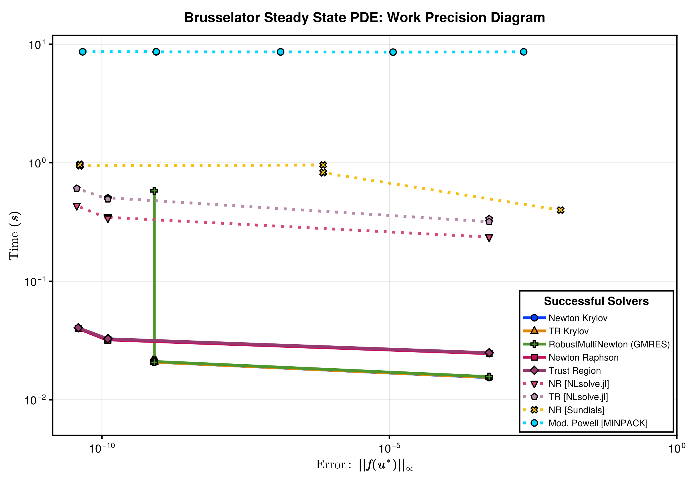

# Setup

Fetch required packages

```julia
using NonlinearSolve, SparseDiffTools, LinearAlgebra, SparseArrays, DiffEqDevTools,
    CairoMakie, Symbolics, BenchmarkTools, PolyesterForwardDiff, LinearSolve, Sundials
import NLsolve, MINPACK
RUS = RadiusUpdateSchemes;
BenchmarkTools.DEFAULT_PARAMETERS.seconds = 0.2;
```


Define a utility to timeout the benchmark after a certain time.

```julia
# Taken from ReTestItems.jl
function timeout(f, timeout)
    cond = Threads.Condition()
    timer = Timer(timeout) do tm
        close(tm)
        ex = ErrorException("timed out after $timeout seconds")
        @lock cond notify(cond, ex; error=false)
    end
    Threads.@spawn begin
        try
            ret = $f()
            isopen(timer) && @lock cond notify(cond, ret)
        catch e
            isopen(timer) && @lock cond notify(cond, CapturedException(e, catch_backtrace()); error=true)
        finally
            close(timer)
        end
    end
    return @lock cond wait(cond) # will throw if we timeout
end
```

```
timeout (generic function with 1 method)
```


Define the Brussletor problem.

```julia
brusselator_f(x, y) = (((x - 3 // 10) ^ 2 + (y - 6 // 10) ^ 2) ≤ 0.01) * 5

limit(a, N) = ifelse(a == N + 1, 1, ifelse(a == 0, N, a))

function init_brusselator_2d(xyd, N)
    N = length(xyd)
    u = zeros(N, N, 2)
    for I in CartesianIndices((N, N))
        x = xyd[I[1]]
        y = xyd[I[2]]
        u[I, 1] = 22 * (y * (1 - y))^(3 / 2)
        u[I, 2] = 27 * (x * (1 - x))^(3 / 2)
    end
    return u
end

function generate_brusselator_problem(N::Int; sparsity = nothing, kwargs...)
    xyd_brusselator = range(0; stop = 1, length = N)

    function brusselator_2d_loop(du_, u_, p)
        A, B, α, δx = p
        α = α / δx ^ 2

        du = reshape(du_, N, N, 2)
        u = reshape(u_, N, N, 2)

        @inbounds @simd for I in CartesianIndices((N, N))
            i, j = Tuple(I)
            x, y = xyd_brusselator[I[1]], xyd_brusselator[I[2]]
            ip1, im1 = limit(i + 1, N), limit(i - 1, N)
            jp1, jm1 = limit(j + 1, N), limit(j - 1, N)

            du[i, j, 1] = α * (u[im1, j, 1] + u[ip1, j, 1] + u[i, jp1, 1] + u[i, jm1, 1] -
                               4u[i, j, 1]) +
                          B + u[i, j, 1] ^ 2 * u[i, j, 2] - (A + 1) * u[i, j, 1] +
                          brusselator_f(x, y)

            du[i, j, 2] = α * (u[im1, j, 2] + u[ip1, j, 2] + u[i, jp1, 2] + u[i, jm1, 2] -
                               4u[i, j, 2]) +
                            A * u[i, j, 1] - u[i, j, 1] ^ 2 * u[i, j, 2]
        end
        return nothing
    end

    p = (3.4, 1.0, 10.0, step(xyd_brusselator))

    u0 = init_brusselator_2d(xyd_brusselator, N)

    nlfunc = NonlinearFunction(brusselator_2d_loop; sparsity)
    return NonlinearProblem(nlfunc, vec(u0), p; kwargs...)
end
```

```
generate_brusselator_problem (generic function with 1 method)
```


```julia
function __ad_backend(sparsity, psize, ck)
    if sparsity === nothing
        if psize ≥ 16
            return AutoPolyesterForwardDiff(; chunksize = ck)
        else
            return AutoForwardDiff(; chunksize = ck)
        end
    else
        if psize ≥ 16
            return AutoSparsePolyesterForwardDiff(; chunksize = ck)
        else
            return AutoSparseForwardDiff(; chunksize = ck)
        end
    end
end

function __set_ad_chunksize(solver::GeneralizedFirstOrderAlgorithm{CJ, N}, ck,
        sparsity, psize) where {CJ, N}
    ad = __ad_backend(sparsity, psize, ck)
    return GeneralizedFirstOrderAlgorithm{CJ, N}(; solver.descent, solver.linesearch,
        solver.trustregion, jacobian_ad = ad, solver.max_shrink_times, solver.forward_ad,
        solver.reverse_ad)
end
function __set_ad_chunksize(solver::ApproximateJacobianSolveAlgorithm{CJ, N}, ck,
        sparsity, psize) where {CJ, N}
    ad = __ad_backend(sparsity, psize, ck)
    initialization = solver.initialization isa NonlinearSolve.TrueJacobianInitialization ?
        NonlinearSolve.TrueJacobianInitialization(NonlinearSolve.FullStructure(), ad) : solver.initialization
    return ApproximateJacobianSolveAlgorithm{CJ, N}(; solver.descent, solver.linesearch,
        solver.trustregion, solver.update_rule, solver.max_shrink_times, solver.max_resets,
        initialization, solver.reinit_rule)
end
function __set_ad_chunksize(solver::SimpleNewtonRaphson, ck, sparsity, psize)
    solver.autodiff === nothing || return solver
    autodiff = __ad_backend(nothing, psize, ck)
    return SimpleNewtonRaphson(; autodiff)
end
function __set_ad_chunksize(solver::SimpleTrustRegion, ck, sparsity, psize)
    solver.autodiff === nothing || return solver
    autodiff = __ad_backend(nothing, psize, ck)
    return SimpleTrustRegion(; autodiff)
end
__set_ad_chunksize(solver, ck, sparsity, psize) = solver

function get_ordering(x::AbstractMatrix)
    idxs = Vector{Int}(undef, size(x, 1))
    placed = zeros(Bool, size(x, 1))
    idx = 1
    for j in size(x, 2):-1:1
        row = view(x, :, j)
        idxs_row = sortperm(row; by = x -> isnan(x) ? Inf : (x == -1 ? Inf : x))
        for i in idxs_row
            if !placed[i] && !isnan(row[i]) && row[i] ≠ -1
                idxs[idx] = i
                placed[i] = true
                idx += 1
                idx > length(idxs) && break
            end
        end
        idx > length(idxs) && break
    end
    return idxs
end
```

```
get_ordering (generic function with 1 method)
```


# Scaling of Sparsity Detection Algorithm

We increase the problem size, and compute the jacobian 10 times similar to a real workload
where the jacobian is computed several times and amortizes the cost for computing the
sparsity pattern.

```julia
test_problem = generate_brusselator_problem(4)
bruss_f!, u0 = (du, u) -> test_problem.f(du, u, test_problem.p), test_problem.u0
y = similar(u0)

sd = SymbolicsSparsityDetection()
adtype = AutoSparseFiniteDiff()

J = sparse_jacobian(adtype, sd, bruss_f!, y, u0)

colors = matrix_colors(J)

begin
    J_ = copy(J)
    rows = rowvals(J)
    vals = nonzeros(J)
    for j in 1:size(J, 2)
        for i in nzrange(J, j)
            row = rows[i]
            J_[j, row] = colors[j]  # spy does a ordering I can't figure out. so transposing it here
        end
    end
end

function cache_and_compute_10_jacobians(adtype, sd, f!::F, y, x) where {F}
    cache = sparse_jacobian_cache(adtype, sd, f!, y, x)
    J = init_jacobian(cache)
    for i in 1:10
        sparse_jacobian!(J, adtype, cache, f!, y, x)
    end
    return J
end

Ns = [2^i for i in 1:8]
sd = [SymbolicsSparsityDetection(), ApproximateJacobianSparsity(; ntrials = 3)]
adtypes = [AutoSparseFiniteDiff(), AutoSparsePolyesterForwardDiff(; chunksize = 8)]
algs = vcat(vec(collect(Iterators.product(sd, adtypes))),
    [(NoSparsityDetection(), AutoPolyesterForwardDiff(; chunksize = 8))])
times = Matrix{Float64}(undef, length(Ns), length(algs))

for (i, N) in enumerate(Ns)
    @info N
    test_problem = generate_brusselator_problem(N)
    bruss_f!, u0 = (du, u) -> test_problem.f(du, u, test_problem.p), test_problem.u0
    y = similar(u0)
    for (j, (sd, adtype)) in enumerate(algs)
        if N < 2^9 || (N ≥ 2^9 && sd isa SymbolicsSparsityDetection)
            times[i, j] = @belapsed $cache_and_compute_10_jacobians($adtype, $sd, $bruss_f!, $y, $u0)
            @info times[i, j]
        else
            @info "Skipping would have timed out"
            times[i, j] = NaN
        end
    end
end
```


Plotting the results.

```julia
fig = begin
    cycle = Cycle([:marker], covary = true)
    plot_theme = Theme(Lines = (; cycle), Scatter = (; cycle))

    with_theme(plot_theme) do
        fig = Figure(; size = (1400, 1400 * 0.5))

        ax = Axis(fig[1, 1]; title = "Sparsity Pattern for 2D Brusselator Jacobian",
            titlesize = 22, titlegap = 10,
            xticksize = 20, yticksize = 20, xticklabelsize = 20, yticklabelsize = 20,
            xtickwidth = 2.5, ytickwidth = 2.5, spinewidth = 2.5, yreversed = true)

        spy!(ax, J_; markersize = 16, marker = :circle, framecolor = :lightgray,
            colormap = :seaborn_bright, strokewidth = 3)

        ax = Axis(fig[1, 2]; title = "Scaling of Sparse Jacobian Computation Algorithms",
            titlesize = 22, titlegap = 10, xscale = log10, yscale = log10,
            xticksize = 20, yticksize = 20, xticklabelsize = 20, yticklabelsize = 20,
            xtickwidth = 2.5, ytickwidth = 2.5, spinewidth = 2.5,
            xlabel = L"Input Dimension ($\mathbf{N}$)", ylabel = L"Time $\mathbf{(s)}$", xlabelsize = 22,
            ylabelsize = 22, yaxisposition = :right)

        colors = cgrad(:seaborn_bright, length(algs); categorical = true)

        line_list = []
        scatter_list = []

        Ns_ = Ns .^ 2 .* 2

        push!(line_list,
            lines!(
                ax, Ns_, times[:, 1], color = colors[1], linewidth = 5, linestyle = :dash))
        push!(
            scatter_list, scatter!(ax, Ns_, times[:, 1], color = colors[1], strokewidth = 3, markersize = 16))
        push!(line_list, lines!(ax, Ns_, times[:, 2], color = colors[2], linewidth = 5))
        push!(
            scatter_list, scatter!(ax, Ns_, times[:, 2], color = colors[2], strokewidth = 3, markersize = 16))
        push!(line_list,
            lines!(
                ax, Ns_, times[:, 3], color = colors[3], linewidth = 5, linestyle = :dash))
        push!(
            scatter_list, scatter!(ax, Ns_, times[:, 3], color = colors[3], strokewidth = 3, markersize = 16))
        push!(line_list, lines!(ax, Ns_, times[:, 4], color = colors[4], linewidth = 5))
        push!(
            scatter_list, scatter!(ax, Ns_, times[:, 4], color = colors[4], strokewidth = 3, markersize = 16))
        push!(line_list,
            lines!(
                ax, Ns_, times[:, 5], color = colors[5], linewidth = 5, linestyle = :dot))
        push!(
            scatter_list, scatter!(ax, Ns_, times[:, 5], color = colors[5], strokewidth = 3, markersize = 16))

        group_symbolics = [
            [
                LineElement(; color = line_list[idx].color,
                    linestyle = line_list[idx].linestyle,
                    linewidth = line_list[idx].linewidth),
                MarkerElement(; color = scatter_list[idx].color,
                    marker = scatter_list[idx].marker,
                    strokewidth = scatter_list[idx].strokewidth,
                    markersize = scatter_list[idx].markersize)
            ]
            for idx in [1, 3]]
        group_approx = [
            [
                LineElement(; color = line_list[idx].color,
                    linestyle = line_list[idx].linestyle,
                    linewidth = line_list[idx].linewidth),
                MarkerElement(; color = scatter_list[idx].color,
                    marker = scatter_list[idx].marker,
                    strokewidth = scatter_list[idx].strokewidth,
                    markersize = scatter_list[idx].markersize)
            ]
            for idx in [2, 4]]
        legend_polyester = [
            [
                LineElement(; color = line_list[5].color,
                    linestyle = line_list[5].linestyle,
                    linewidth = line_list[5].linewidth),
                MarkerElement(; color = scatter_list[5].color,
                    marker = scatter_list[5].marker,
                    strokewidth = scatter_list[5].strokewidth,
                    markersize = scatter_list[5].markersize)
            ]
        ]

        axislegend(ax,
            [group_symbolics, group_approx, legend_polyester],
            [
                ["Finite Diff", "Forward Diff"],
                ["Finite Diff", "Threaded Forward Diff"],
                ["Threaded Forward Diff"]
            ],
            ["Symbolic Sparsity", "Approx. Sparsity", "No Sparsity"];
            position = :rb, framevisible = true, framewidth = 2.5, titlesize = 18,
            labelsize = 16, patchsize = (40.0f0, 20.0f0))

        fig
    end
end
```


```julia
save("brusselator_sparse_jacobian_scaling.svg", fig)
```

```
CairoMakie.Screen{SVG}
```


# Scaling with Problem Size

First, let us experiment the scaling of each algorithm with the problem size.

```julia
Ns = vcat(collect(2 .^ (2:7)), [150, 175, 200]) 

solvers_scaling = [
    (; pkg = :nonlinearsolve,       sparsity = :none,   name = "NR (Dense)",                     alg = NewtonRaphson(; linsolve = nothing)),
    (; pkg = :nonlinearsolve,       sparsity = :approx, name = "NR (Approx. Sparse)",            alg = NewtonRaphson(; linsolve = nothing)),
    (; pkg = :nonlinearsolve,       sparsity = :exact,  name = "NR (Exact Sparse)",              alg = NewtonRaphson(; linsolve = nothing)),
    (; pkg = :wrapper,              sparsity = :none,   name = "NR [NLsolve.jl]",                alg = NLsolveJL(; method = :newton, autodiff = :forward)),
    (; pkg = :wrapper,              sparsity = :none,   name = "Mod. NR [Sundials]",             alg = KINSOL()),

    (; pkg = :nonlinearsolve,       sparsity = :none,   name = "TR (Dense)",                     alg = TrustRegion(; radius_update_scheme = RUS.NLsolve, linsolve = nothing)),
    (; pkg = :nonlinearsolve,       sparsity = :approx, name = "TR (Approx. Sparse)",            alg = TrustRegion(; radius_update_scheme = RUS.NLsolve, linsolve = nothing)),
    (; pkg = :nonlinearsolve,       sparsity = :exact,  name = "TR (Exact Sparse)",              alg = TrustRegion(; radius_update_scheme = RUS.NLsolve, linsolve = nothing)),
    (; pkg = :wrapper,              sparsity = :none,   name = "TR [NLsolve.jl]",                alg = NLsolveJL(; autodiff = :forward)),

    (; pkg = :wrapper,              sparsity = :none,   name = "Mod. Powell [MINPACK]",          alg = CMINPACK()),
]

runtimes_scaling = zeros(length(solvers_scaling), length(Ns)) .- 1

for (i, N) in enumerate(Ns)
    prob_dense = generate_brusselator_problem(N)
    prob_approx_sparse = generate_brusselator_problem(N;
        sparsity = ApproximateJacobianSparsity())
    prob_exact_sparse = generate_brusselator_problem(N;
        sparsity = SymbolicsSparsityDetection())

    @info "Benchmarking N = $N"

    for (j, solver) in enumerate(solvers_scaling)
        ptype = solver.sparsity
        alg = solver.alg
        name = solver.name

        if ptype == :none
            prob = prob_dense
        elseif ptype == :approx
            prob = prob_approx_sparse
        elseif ptype == :exact
            prob = prob_exact_sparse
        end

        if (j > 1 && runtimes_scaling[j - 1, i] == -1) || (alg isa CMINPACK && N > 32) ||
            (alg isa KINSOL && N > 64) ||
            (alg isa NLsolveJL && N > 64 && alg.method == :trust_region) ||
            (alg isa GeneralizedFirstOrderAlgorithm{nothing, :TrustRegion} && N > 64) ||
            (alg isa NLsolveJL && N > 128 && alg.method == :newton) ||
            (alg isa GeneralizedFirstOrderAlgorithm{nothing, :NewtonRaphson} && N > 128 && ptype == :none) ||
            (alg isa GeneralizedFirstOrderAlgorithm{nothing, :NewtonRaphson} && N > 150 && ptype == :approx)
            # The last benchmark failed so skip this too
            runtimes_scaling[j, i] = NaN
            @warn "$(name): Would Have Timed out"
        else
            alg_concrete = __set_ad_chunksize(alg, NonlinearSolve.pickchunksize(prob.u0),
                prob.f.sparsity, length(prob.u0))

            function __benchmark_function()
                sol = solve(prob, alg_concrete; abstol=1e-6, reltol=1e-6,
                    termination_condition=AbsNormTerminationMode())
                runtimes_scaling[j, i] = @belapsed solve($prob, $alg_concrete; abstol=1e-6,
                    reltol=1e-6, termination_condition=$AbsNormTerminationMode())
                @info "$(name): $(runtimes_scaling[j, i]) | $(norm(sol.resid, Inf)) | $(sol.retcode)"
            end
            timeout(__benchmark_function, 600)
            if runtimes_scaling[j, i] == -1
                @warn "$(name): Timed out"
                runtimes_scaling[j, i] = NaN
            end
        end
    end

    println()
end
```


Plot the results.

```julia
fig = begin
    ASPECT_RATIO = 0.7
    WIDTH = 1200
    HEIGHT = round(Int, WIDTH * ASPECT_RATIO)
    STROKEWIDTH = 2.5

    cycle = Cycle([:marker], covary = true)
    colors = cgrad(:seaborn_bright, length(solvers_scaling); categorical = true)
    theme = Theme(Lines = (cycle = cycle,), Scatter = (cycle = cycle,))
    LINESTYLES = Dict(
        (:nonlinearsolve, :none) => :solid,
        (:nonlinearsolve, :approx) => :dash,
        (:nonlinearsolve, :exact) => :dashdot,
        # (:simplenonlinearsolve, :none) => :solid,
        (:wrapper, :none) => :dot,
    )

    Ns_ = Ns .^ 2 .* 2

    with_theme(theme) do
        fig = Figure(; size = (WIDTH, HEIGHT))

        ax = Axis(fig[1, 1:3], ylabel = L"Time ($s$)", xlabel = L"Problem Size ($N$)",
            xscale = log10, yscale = log10, xlabelsize = 22, ylabelsize = 22,
            xticklabelsize = 20, yticklabelsize = 20, xtickwidth = STROKEWIDTH,
            ytickwidth = STROKEWIDTH, spinewidth = STROKEWIDTH)

        idxs = get_ordering(runtimes_scaling)

        ls, scs = [], []
        for (i, solver) in zip(idxs, solvers_scaling[idxs])
            linestyle = LINESTYLES[(solver.pkg, solver.sparsity)]
            l = lines!(Ns_, runtimes_scaling[i, :]; linewidth = 5, color = colors[i],
                linestyle)
            sc = scatter!(Ns_, runtimes_scaling[i, :]; markersize = 16, strokewidth = 2,
                color = colors[i])
            push!(ls, l)
            push!(scs, sc)
        end

        main_legend = [
            [
                LineElement(; color = ls[idx].color, linestyle = ls[idx].linestyle,
                    linewidth = ls[idx].linewidth),
                MarkerElement(; color = scs[idx].color, marker = scs[idx].marker,
                    markersize = scs[idx].markersize, strokewidth = scs[idx].strokewidth)
            ]
            for idx in 1:length(solvers_scaling)
        ]

        sparsity_legend = [
            LineElement(; linestyle = :solid, linewidth = 5),
            LineElement(; linestyle = :dash, linewidth = 5),
            LineElement(; linestyle = :dashdot, linewidth = 5),
        ]

        axislegend(ax, main_legend, [s.name for s in solvers_scaling[idxs]],
            "Successful Solvers\n(Fastest to Slowest)";
            framevisible=true, framewidth = STROKEWIDTH, orientation = :vertical,
            titlesize = 20, nbanks = 1, labelsize = 16,
            tellheight = true, tellwidth = false, patchsize = (60.0f0, 20.0f0),
            position = :rb)

        axislegend(ax, sparsity_legend, ["No Sparsity Detection", "Approx. Sparsity", "Exact Sparsity"],
            "Sparsity Detection"; framevisible=true, framewidth = STROKEWIDTH,
            orientation = :vertical, titlesize = 20, nbanks = 1, labelsize = 16,
            tellheight = true, tellwidth = false, patchsize = (60.0f0, 20.0f0),
            position = :lt)

        fig[0, :] = Label(fig,
            "Brusselator 2D: Scaling of First-Order Nonlinear Solvers with Problem Size",
            fontsize = 24, tellwidth = false, font = :bold)

        return fig
    end
end
```


```julia
save("brusselator_scaling.svg", fig)
```

```
CairoMakie.Screen{SVG}
```


# Jacobian-Free Newton / TR Krylov Methods

In this section, we will benchmark jacobian-free nonlinear solvers with Krylov methods. We
will use preconditioning from `AlgebraicMultigrid.jl` and `IncompleteLU.jl`. Unfortunately,
our ability to use 3rd party software is limited here, since only `Sundials.jl` supports
jacobian-free methods via `:GMRES`.

```julia
using AlgebraicMultigrid, IncompleteLU

function incompletelu(W, du, u, p, t, newW, Plprev, Prprev, solverdata)
    if newW === nothing || newW
        Pl = ilu(W, τ = 50.0)
    else
        Pl = Plprev
    end
    Pl, nothing
end

function algebraicmultigrid(W, du, u, p, t, newW, Plprev, Prprev, solverdata)
    if newW === nothing || newW
        Pl = aspreconditioner(ruge_stuben(convert(AbstractMatrix, W)))
    else
        Pl = Plprev
    end
    Pl, nothing
end

function algebraicmultigrid_jacobi(W, du, u, p, t, newW, Plprev, Prprev, solverdata)
    if newW === nothing || newW
        A = convert(AbstractMatrix, W)
        Pl = AlgebraicMultigrid.aspreconditioner(AlgebraicMultigrid.ruge_stuben(
            A, presmoother = AlgebraicMultigrid.Jacobi(rand(size(A, 1))),
            postsmoother = AlgebraicMultigrid.Jacobi(rand(size(A, 1)))))
    else
        Pl = Plprev
    end
    Pl, nothing
end

Ns = 2 .^ (2:7)

solvers_scaling_jacobian_free = [
    (; pkg = :nonlinearsolve,  name = "Newton Krylov",                    alg = NewtonRaphson(; linsolve = KrylovJL_GMRES())),
    (; pkg = :nonlinearsolve,  name = "Newton Krylov (ILU)",              alg = NewtonRaphson(; linsolve = KrylovJL_GMRES(), precs = incompletelu, concrete_jac = true)),
    (; pkg = :nonlinearsolve,  name = "Newton Krylov (AMG)",              alg = NewtonRaphson(; linsolve = KrylovJL_GMRES(), precs = algebraicmultigrid, concrete_jac = true)),
    (; pkg = :nonlinearsolve,  name = "Newton Krylov (AMG Jacobi)",       alg = NewtonRaphson(; linsolve = KrylovJL_GMRES(), precs = algebraicmultigrid_jacobi, concrete_jac = true)),
    (; pkg = :nonlinearsolve,  name = "TR Krylov",                        alg = TrustRegion(; linsolve = KrylovJL_GMRES())),
    (; pkg = :nonlinearsolve,  name = "TR Krylov (ILU)",                  alg = TrustRegion(; linsolve = KrylovJL_GMRES(), precs = incompletelu, concrete_jac = true)),
    (; pkg = :nonlinearsolve,  name = "TR Krylov (AMG)",                  alg = TrustRegion(; linsolve = KrylovJL_GMRES(), precs = algebraicmultigrid, concrete_jac = true)),
    (; pkg = :nonlinearsolve,  name = "TR Krylov (AMG Jacobi)",           alg = TrustRegion(; linsolve = KrylovJL_GMRES(), precs = algebraicmultigrid_jacobi, concrete_jac = true)),
    (; pkg = :wrapper,         name = "Newton Krylov [Sundials]",         alg = KINSOL(; linear_solver = :GMRES)),
]

runtimes_scaling = zeros(length(solvers_scaling_jacobian_free), length(Ns)) .- 1

for (i, N) in enumerate(Ns)
    prob = generate_brusselator_problem(N;
        sparsity = ifelse(N ≥ 6, SymbolicsSparsityDetection(), ApproximateJacobianSparsity()))

    @info "Benchmarking N = $N"

    for (j, solver) in enumerate(solvers_scaling_jacobian_free)
        alg = solver.alg
        name = solver.name

        if (j > 1 && runtimes_scaling[j - 1, i] == -1)
            # The last benchmark failed so skip this too
            runtimes_scaling[j, i] = NaN
            @warn "$(name): Would Have Timed out"
        else
            alg_concrete = __set_ad_chunksize(alg, NonlinearSolve.pickchunksize(prob.u0),
                prob.f.sparsity, length(prob.u0))

            function __benchmark_function()
                sol = solve(prob, alg_concrete; abstol=1e-6, reltol=1e-6,
                    linsolve_kwargs = (; abstol = 1e-9, reltol = 1e-9),
                    termination_condition=AbsNormTerminationMode())
                if SciMLBase.successful_retcode(sol) || norm(sol.resid, Inf) ≤ 1e-5
                    runtimes_scaling[j, i] = @belapsed solve($prob, $alg_concrete; abstol=1e-6,
                        reltol=1e-6, termination_condition=$AbsNormTerminationMode())
                else
                    runtimes_scaling[j, i] = NaN
                end
                @info "$(name): $(runtimes_scaling[j, i]) | $(norm(sol.resid, Inf)) | $(sol.retcode)"
            end
            timeout(__benchmark_function, 600)
            if runtimes_scaling[j, i] == -1
                @warn "$(name): Timed out"
                runtimes_scaling[j, i] = NaN
            end
        end
    end

    println()
end
```


Plot the results.

```julia
fig = begin
    ASPECT_RATIO = 0.7
    WIDTH = 1200
    HEIGHT = round(Int, WIDTH * ASPECT_RATIO)
    STROKEWIDTH = 2.5

    cycle = Cycle([:marker], covary = true)
    colors = cgrad(:seaborn_bright, length(solvers_scaling_jacobian_free); categorical = true)
    theme = Theme(Lines = (cycle = cycle,), Scatter = (cycle = cycle,))
    LINESTYLES = Dict(
        (:nonlinearsolve, :none) => :solid,
        (:nonlinearsolve, :amg) => :dot,
        (:nonlinearsolve, :amg_jacobi) => :dash,
        (:nonlinearsolve, :ilu) => :dashdot,
    )

    Ns_ = Ns .^ 2 .* 2

    with_theme(theme) do
        fig = Figure(; size = (WIDTH, HEIGHT))

        ax = Axis(fig[1, 1:2], ylabel = L"Time ($s$)", xlabel = L"Problem Size ($N$)",
            xscale = log10, yscale = log10, xlabelsize = 22, ylabelsize = 22,
            xticklabelsize = 20, yticklabelsize = 20, xtickwidth = STROKEWIDTH,
            ytickwidth = STROKEWIDTH, spinewidth = STROKEWIDTH)

        idxs = get_ordering(runtimes_scaling)

        ls, scs, labels = [], [], []
        for (i, solver) in zip(idxs, solvers_scaling_jacobian_free[idxs])
            all(isnan, runtimes_scaling[i, :]) && continue
            precon = occursin("AMG Jacobi", solver.name) ? :amg_jacobi : occursin("AMG", solver.name) ? :amg : occursin("ILU", solver.name) ? :ilu : :none
            linestyle = LINESTYLES[(solver.pkg, precon)]
            l = lines!(Ns_, runtimes_scaling[i, :]; linewidth = 5, color = colors[i],
                linestyle)
            sc = scatter!(Ns_, runtimes_scaling[i, :]; markersize = 16, strokewidth = 2,
                color = colors[i])
            push!(ls, l)
            push!(scs, sc)
            push!(labels, solver.name)
        end

        axislegend(ax, [[l, sc] for (l, sc) in zip(ls, scs)], labels,
            "Successful Solvers\n(Fastest to Slowest)";
            framevisible=true, framewidth = STROKEWIDTH, orientation = :vertical,
            titlesize = 20, labelsize = 16, position = :rb,
            tellheight = true, tellwidth = false, patchsize = (40.0f0, 20.0f0))

        axislegend(ax, [
                LineElement(; linestyle = :solid, linewidth = 5),
                LineElement(; linestyle = :dot, linewidth = 5),
                LineElement(; linestyle = :dash, linewidth = 5),
                LineElement(; linestyle = :dashdot, linewidth = 5),
            ], ["No Preconditioning", "AMG", "AMG Jacobi", "Incomplete LU"],
            "Preconditioning"; framevisible=true, framewidth = STROKEWIDTH,
            orientation = :vertical, titlesize = 20, labelsize = 16,
            tellheight = true, tellwidth = true, patchsize = (40.0f0, 20.0f0),
            position = :lt)

        fig[0, :] = Label(fig,
            "Brusselator 2D: Scaling of Jacobian-Free Nonlinear Solvers with Problem Size",
            fontsize = 24, tellwidth = false, font = :bold)

        return fig
    end
end
```

```
Error: BoundsError: attempt to access 9-element Vector{NamedTuple{(:pkg, :n
ame, :alg)}} at index [[7, 3, 1, 5, 8, 4, 6, 2, 139864372788688]]
```


```julia
save("brusselator_krylov_methods_scaling.svg", fig)
```

```
CairoMakie.Screen{SVG}
```


# Work-Precision Diagram

In this section, we will generate the work-precision of the solvers. All solvers that can
exploit sparsity will automatically do so.

```julia
DEFAULT_FORWARD_AD = AutoSparsePolyesterForwardDiff(; chunksize = 12)

solvers_all = [
    (; pkg = :nonlinearsolve,       name = "Default PolyAlg",                                        solver = Dict(:alg => FastShortcutNonlinearPolyalg(; autodiff = DEFAULT_FORWARD_AD))),
    (; pkg = :nonlinearsolve,       name = "RobustMultiNewton (GMRES)",                              solver = Dict(:alg => RobustMultiNewton(; linsolve = KrylovJL_GMRES(), autodiff = DEFAULT_FORWARD_AD))),
    (; pkg = :nonlinearsolve,       name = "Newton Raphson",                                         solver = Dict(:alg => NewtonRaphson(; linsolve = nothing, autodiff = DEFAULT_FORWARD_AD))),
    (; pkg = :nonlinearsolve,       name = "Newton Krylov",                                          solver = Dict(:alg => NewtonRaphson(; linsolve = KrylovJL_GMRES(), autodiff = DEFAULT_FORWARD_AD))),
    (; pkg = :nonlinearsolve,       name = "Trust Region",                                           solver = Dict(:alg => TrustRegion(; autodiff = DEFAULT_FORWARD_AD))),
    (; pkg = :nonlinearsolve,       name = "TR Krylov",                                              solver = Dict(:alg => TrustRegion(; linsolve = KrylovJL_GMRES(), autodiff = DEFAULT_FORWARD_AD))),
    (; pkg = :wrapper,              name = "NR [NLsolve.jl]",                                        solver = Dict(:alg => NLsolveJL(; method = :newton, autodiff = :forward))),
    (; pkg = :wrapper,              name = "TR [NLsolve.jl]",                                        solver = Dict(:alg => NLsolveJL(; autodiff = :forward))),
    (; pkg = :wrapper,              name = "NR [Sundials]",                                          solver = Dict(:alg => KINSOL())),
    (; pkg = :wrapper,              name = "Newton Krylov [Sundials]",                               solver = Dict(:alg => KINSOL(; linear_solver = :GMRES))),

    (; pkg = :wrapper,              name = "Mod. Powell [MINPACK]",                                  solver = Dict(:alg => CMINPACK())),
];
```


```julia
prob_wpd = generate_brusselator_problem(32; sparsity = ApproximateJacobianSparsity())

abstols = 1.0 ./ 10 .^ (2:10)
reltols = 1.0 ./ 10 .^ (2:10)

function check_solver(prob, solver)
    try
        sol = solve(prob, solver.solver[:alg]; abstol = 1e-4, reltol = 1e-4,
            maxiters = 10000)
        err = norm(sol.resid, Inf)
        if !SciMLBase.successful_retcode(sol.retcode)
            Base.printstyled("[Warn] Solver $(solver.name) returned retcode $(sol.retcode) with an residual norm = $(norm(sol.resid)).\n";
                color = :red)
            return false
        elseif err > 1e3
            Base.printstyled("[Warn] Solver $(solver.name) had a very large residual (norm = $(norm(sol.resid))).\n";
                color = :red)
            return false
        elseif isinf(err) || isnan(err)
            Base.printstyled("[Warn] Solver $(solver.name) had a residual of $(err).\n";
                color = :red)
            return false
        end
        Base.printstyled("[Info] Solver $(solver.name) successfully solved the problem (norm = $(norm(sol.resid))).\n";
            color = :green)
    catch e
        Base.printstyled("[Warn] Solver $(solver.name) threw an error: $e.\n"; color = :red)
        return false
    end
    return true
end

function generate_wpset(prob, solvers)
    # Finds the solvers that can solve the problem
    successful_solvers = filter(solver -> check_solver(prob, solver), solvers)

    return WorkPrecisionSet(prob, abstols, reltols,
        getfield.(successful_solvers, :solver);
        names = getfield.(successful_solvers, :name), numruns = 10, error_estimate = :l∞,
        maxiters = 1000, verbose = true), successful_solvers
end
```

```
generate_wpset (generic function with 1 method)
```


```julia
wp_set, successful_solvers = generate_wpset(prob_wpd, solvers_all);
```

```
[Info] Solver Default PolyAlg successfully solved the problem (norm = 0.000
20409942583029592).
[Info] Solver RobustMultiNewton (GMRES) successfully solved the problem (no
rm = 1.1664069101655303e-8).
[Info] Solver Newton Raphson successfully solved the problem (norm = 2.6476
053818757766e-9).
[Info] Solver Newton Krylov successfully solved the problem (norm = 1.16640
69101655303e-8).
[Info] Solver Trust Region successfully solved the problem (norm = 2.647605
3818757766e-9).
[Info] Solver TR Krylov successfully solved the problem (norm = 1.166406910
1655303e-8).
[Info] Solver NR [NLsolve.jl] successfully solved the problem (norm = 2.629
767216137896e-9).
[Info] Solver TR [NLsolve.jl] successfully solved the problem (norm = 2.629
767216137896e-9).
[Info] Solver NR [Sundials] successfully solved the problem (norm = 5.94616
2345262808e-6).
[Warn] Solver Newton Krylov [Sundials] returned retcode Failure with an res
idual norm = 34.06162309153361.
[Info] Solver Mod. Powell [MINPACK] successfully solved the problem (norm =
 1.962972484440553e-6).
```


Plotting the Work-Precision Diagram.

```julia
fig = begin
    LINESTYLES = Dict(:nonlinearsolve => :solid, :simplenonlinearsolve => :dash,
        :wrapper => :dot)
    ASPECT_RATIO = 0.7
    WIDTH = 1200
    HEIGHT = round(Int, WIDTH * ASPECT_RATIO)
    STROKEWIDTH = 2.5

    colors = cgrad(:seaborn_bright, length(successful_solvers); categorical = true)
    cycle = Cycle([:marker], covary = true)
    plot_theme = Theme(Lines = (; cycle), Scatter = (; cycle))

    with_theme(plot_theme) do 
        fig = Figure(; size = (WIDTH, HEIGHT))
        # `textbf` doesn't work
        ax = Axis(fig[1, 1], ylabel = L"Time $\mathbf{(s)}$",
            xlabelsize = 22, ylabelsize = 22,
            xlabel = L"Error: $\mathbf{||f(u^\ast)||_\infty}$",
            xscale = log10, yscale = log10, xtickwidth = STROKEWIDTH,
            ytickwidth = STROKEWIDTH, spinewidth = STROKEWIDTH,
            xticklabelsize = 20, yticklabelsize = 20)

        idxs = sortperm(median.(getfield.(wp_set.wps, :times)))

        ls, scs = [], []

        for (i, (wp, solver)) in enumerate(zip(wp_set.wps[idxs], successful_solvers[idxs]))
            (; name, times, errors) = wp
            errors = [err.l∞ for err in errors]
            l = lines!(ax, errors, times; linestyle = LINESTYLES[solver.pkg], label = name,
                linewidth = 5, color = colors[i])
            sc = scatter!(ax, errors, times; label = name, markersize = 16, strokewidth = 2,
                color = colors[i])
            push!(ls, l)
            push!(scs, sc)
        end

        xlims!(ax; high=1)
        ylims!(ax; low=5e-3)

        axislegend(ax, [[l, sc] for (l, sc) in zip(ls, scs)],
            [solver.name for solver in successful_solvers[idxs]], "Successful Solvers";
            framevisible=true, framewidth = STROKEWIDTH, position = :rb,
            titlesize = 20, labelsize = 16, patchsize = (40.0f0, 20.0f0))

        fig[0, :] = Label(fig, "Brusselator Steady State PDE: Work Precision Diagram",
            fontsize = 24, tellwidth = false, font = :bold)

        fig
    end
end
```



```julia
save("brusselator_wpd.svg", fig)
```

```
CairoMakie.Screen{SVG}
```


## Appendix

These benchmarks are a part of the SciMLBenchmarks.jl repository, found at: [https://github.com/SciML/SciMLBenchmarks.jl](https://github.com/SciML/SciMLBenchmarks.jl). For more information on high-performance scientific machine learning, check out the SciML Open Source Software Organization [https://sciml.ai](https://sciml.ai).

To locally run this benchmark, do the following commands:

```
using SciMLBenchmarks
SciMLBenchmarks.weave_file("benchmarks/NonlinearProblem","bruss.jmd")
```

Computer Information:

```
Julia Version 1.10.5
Commit 6f3fdf7b362 (2024-08-27 14:19 UTC)
Build Info:
  Official https://julialang.org/ release
Platform Info:
  OS: Linux (x86_64-linux-gnu)
  CPU: 128 × AMD EPYC 7502 32-Core Processor
  WORD_SIZE: 64
  LIBM: libopenlibm
  LLVM: libLLVM-15.0.7 (ORCJIT, znver2)
Threads: 1 default, 0 interactive, 1 GC (on 128 virtual cores)
Environment:
  JULIA_CPU_THREADS = 128
  JULIA_DEPOT_PATH = /cache/julia-buildkite-plugin/depots/5b300254-1738-4989-ae0a-f4d2d937f953

```

Package Information:

```
Status `/cache/build/exclusive-amdci3-0/julialang/scimlbenchmarks-dot-jl/benchmarks/NonlinearProblem/Project.toml`
  [2169fc97] AlgebraicMultigrid v0.6.0
  [6e4b80f9] BenchmarkTools v1.5.0
⌅ [13f3f980] CairoMakie v0.11.11
⌃ [2b5f629d] DiffEqBase v6.151.4
⌃ [f3b72e0c] DiffEqDevTools v2.44.3
  [40713840] IncompleteLU v0.2.1
  [b964fa9f] LaTeXStrings v1.3.1
⌃ [7ed4a6bd] LinearSolve v2.30.1
  [4854310b] MINPACK v1.3.0
  [2774e3e8] NLsolve v4.5.1
  [b7050fa9] NonlinearProblemLibrary v0.1.2
⌃ [8913a72c] NonlinearSolve v3.12.3
  [98d1487c] PolyesterForwardDiff v0.1.2
⌃ [08abe8d2] PrettyTables v2.3.2
  [31c91b34] SciMLBenchmarks v0.1.3
  [efcf1570] Setfield v1.1.1
⌃ [727e6d20] SimpleNonlinearSolve v1.10.0
⌃ [47a9eef4] SparseDiffTools v2.19.0
  [f1835b91] SpeedMapping v0.3.0
  [860ef19b] StableRNGs v1.0.2
⌃ [90137ffa] StaticArrays v1.9.5
⌃ [c3572dad] Sundials v4.24.0
⌃ [0c5d862f] Symbolics v5.30.3
Info Packages marked with ⌃ and ⌅ have new versions available. Those with ⌃ may be upgradable, but those with ⌅ are restricted by compatibility constraints from upgrading. To see why use `status --outdated`
Warning The project dependencies or compat requirements have changed since the manifest was last resolved. It is recommended to `Pkg.resolve()` or consider `Pkg.update()` if necessary.
```

And the full manifest:

```
Status `/cache/build/exclusive-amdci3-0/julialang/scimlbenchmarks-dot-jl/benchmarks/NonlinearProblem/Manifest.toml`
⌃ [47edcb42] ADTypes v1.3.0
  [a4c015fc] ANSIColoredPrinters v0.0.1
  [621f4979] AbstractFFTs v1.5.0
  [1520ce14] AbstractTrees v0.4.5
⌃ [7d9f7c33] Accessors v0.1.36
  [22286c92] AccurateArithmetic v0.3.8
  [79e6a3ab] Adapt v4.0.4
  [2169fc97] AlgebraicMultigrid v0.6.0
  [66dad0bd] AliasTables v1.1.3
  [27a7e980] Animations v0.4.1
  [ec485272] ArnoldiMethod v0.4.0
⌃ [4fba245c] ArrayInterface v7.11.0
⌃ [4c555306] ArrayLayouts v1.9.4
⌃ [67c07d97] Automa v1.0.3
  [13072b0f] AxisAlgorithms v1.1.0
  [39de3d68] AxisArrays v0.4.7
  [6e4b80f9] BenchmarkTools v1.5.0
⌃ [e2ed5e7c] Bijections v0.1.6
⌃ [d1d4a3ce] BitFlags v0.1.8
⌃ [62783981] BitTwiddlingConvenienceFunctions v0.1.5
  [fa961155] CEnum v0.5.0
⌃ [2a0fbf3d] CPUSummary v0.2.5
⌃ [159f3aea] Cairo v1.0.5
⌅ [13f3f980] CairoMakie v0.11.11
  [49dc2e85] Calculus v0.5.1
⌃ [d360d2e6] ChainRulesCore v1.24.0
⌃ [fb6a15b2] CloseOpenIntervals v0.1.12
⌃ [944b1d66] CodecZlib v0.7.4
  [a2cac450] ColorBrewer v0.4.0
⌃ [35d6a980] ColorSchemes v3.25.0
  [3da002f7] ColorTypes v0.11.5
  [c3611d14] ColorVectorSpace v0.10.0
  [5ae59095] Colors v0.12.11
  [861a8166] Combinatorics v1.0.2
  [38540f10] CommonSolve v0.2.4
⌃ [bbf7d656] CommonSubexpressions v0.3.0
⌃ [34da2185] Compat v4.15.0
  [b152e2b5] CompositeTypes v0.1.4
  [a33af91c] CompositionsBase v0.1.2
  [2569d6c7] ConcreteStructs v0.2.3
⌃ [f0e56b4a] ConcurrentUtilities v2.4.1
⌃ [8f4d0f93] Conda v1.10.0
⌅ [187b0558] ConstructionBase v1.5.5
  [d38c429a] Contour v0.6.3
  [a2441757] Coverage v1.6.1
⌃ [c36e975a] CoverageTools v1.3.1
  [adafc99b] CpuId v0.3.1
  [a8cc5b0e] Crayons v4.1.1
  [9a962f9c] DataAPI v1.16.0
  [864edb3b] DataStructures v0.18.20
  [e2d170a0] DataValueInterfaces v1.0.0
⌃ [927a84f5] DelaunayTriangulation v1.0.3
⌃ [2b5f629d] DiffEqBase v6.151.4
⌃ [f3b72e0c] DiffEqDevTools v2.44.3
⌃ [77a26b50] DiffEqNoiseProcess v5.21.0
  [163ba53b] DiffResults v1.1.0
  [b552c78f] DiffRules v1.15.1
⌅ [a0c0ee7d] DifferentiationInterface v0.5.5
  [b4f34e82] Distances v0.10.11
⌃ [31c24e10] Distributions v0.25.109
  [ffbed154] DocStringExtensions v0.9.3
⌃ [e30172f5] Documenter v1.4.1
⌃ [35a29f4d] DocumenterTools v0.1.19
  [5b8099bc] DomainSets v0.7.14
  [fa6b7ba4] DualNumbers v0.6.8
⌅ [7c1d4256] DynamicPolynomials v0.5.7
  [4e289a0a] EnumX v1.0.4
⌅ [f151be2c] EnzymeCore v0.7.5
  [429591f6] ExactPredicates v2.2.8
  [460bff9d] ExceptionUnwrapping v0.1.10
  [e2ba6199] ExprTools v0.1.10
⌃ [411431e0] Extents v0.1.3
  [7a1cc6ca] FFTW v1.8.0
⌃ [7034ab61] FastBroadcast v0.3.3
  [9aa1b823] FastClosures v0.3.2
  [29a986be] FastLapackInterface v2.0.4
  [5789e2e9] FileIO v1.16.3
  [8fc22ac5] FilePaths v0.8.3
⌃ [48062228] FilePathsBase v0.9.21
⌃ [1a297f60] FillArrays v1.11.0
⌃ [6a86dc24] FiniteDiff v2.23.1
  [53c48c17] FixedPointNumbers v0.8.5
  [1fa38f19] Format v1.3.7
  [f6369f11] ForwardDiff v0.10.36
  [b38be410] FreeType v4.1.1
  [663a7486] FreeTypeAbstraction v0.10.3
  [069b7b12] FunctionWrappers v1.1.3
  [77dc65aa] FunctionWrappersWrappers v0.1.3
  [46192b85] GPUArraysCore v0.1.6
⌃ [cf35fbd7] GeoInterface v1.3.4
  [5c1252a2] GeometryBasics v0.4.11
⌃ [d7ba0133] Git v1.3.0
  [a2bd30eb] Graphics v1.1.2
⌃ [86223c79] Graphs v1.11.1
⌅ [3955a311] GridLayoutBase v0.10.2
  [42e2da0e] Grisu v1.0.2
  [708ec375] Gumbo v0.8.2
  [cd3eb016] HTTP v1.10.8
  [eafb193a] Highlights v0.5.3
⌃ [3e5b6fbb] HostCPUFeatures v0.1.16
⌃ [34004b35] HypergeometricFunctions v0.3.23
⌃ [7073ff75] IJulia v1.24.2
  [b5f81e59] IOCapture v0.2.5
  [615f187c] IfElse v0.1.1
  [2803e5a7] ImageAxes v0.6.11
  [c817782e] ImageBase v0.1.7
  [a09fc81d] ImageCore v0.10.2
  [82e4d734] ImageIO v0.6.8
  [bc367c6b] ImageMetadata v0.9.9
  [40713840] IncompleteLU v0.2.1
  [9b13fd28] IndirectArrays v1.0.0
  [d25df0c9] Inflate v0.1.5
  [a98d9a8b] Interpolations v0.15.1
⌃ [d1acc4aa] IntervalArithmetic v0.22.14
  [8197267c] IntervalSets v0.7.10
⌃ [3587e190] InverseFunctions v0.1.14
  [92d709cd] IrrationalConstants v0.2.2
  [f1662d9f] Isoband v0.1.1
  [c8e1da08] IterTools v1.10.0
  [82899510] IteratorInterfaceExtensions v1.0.0
⌃ [692b3bcd] JLLWrappers v1.5.0
  [682c06a0] JSON v0.21.4
  [b835a17e] JpegTurbo v0.1.5
  [ef3ab10e] KLU v0.6.0
  [5ab0869b] KernelDensity v0.6.9
  [ba0b0d4f] Krylov v0.9.6
  [b964fa9f] LaTeXStrings v1.3.1
  [2ee39098] LabelledArrays v1.16.0
⌅ [984bce1d] LambertW v0.4.6
⌃ [23fbe1c1] Latexify v0.16.3
⌃ [10f19ff3] LayoutPointers v0.1.15
  [0e77f7df] LazilyInitializedFields v1.2.2
⌃ [5078a376] LazyArrays v2.0.4
  [8cdb02fc] LazyModules v0.3.1
⌃ [d3d80556] LineSearches v7.2.0
⌃ [7ed4a6bd] LinearSolve v2.30.1
  [2ab3a3ac] LogExpFunctions v0.3.28
  [e6f89c97] LoggingExtras v1.0.3
⌃ [bdcacae8] LoopVectorization v0.12.170
  [4854310b] MINPACK v1.3.0
  [1914dd2f] MacroTools v0.5.13
⌅ [ee78f7c6] Makie v0.20.10
⌅ [20f20a25] MakieCore v0.7.3
  [d125e4d3] ManualMemory v0.1.8
  [dbb5928d] MappedArrays v0.4.2
  [d0879d2d] MarkdownAST v0.1.2
⌅ [0a4f8689] MathTeXEngine v0.5.7
⌃ [bb5d69b7] MaybeInplace v0.1.3
  [739be429] MbedTLS v1.1.9
  [e1d29d7a] Missings v1.2.0
  [e94cdb99] MosaicViews v0.3.4
  [46d2c3a1] MuladdMacro v0.2.4
  [102ac46a] MultivariatePolynomials v0.5.6
⌃ [ffc61752] Mustache v1.0.19
⌃ [d8a4904e] MutableArithmetics v1.4.5
  [d41bc354] NLSolversBase v7.8.3
  [2774e3e8] NLsolve v4.5.1
  [77ba4419] NaNMath v1.0.2
  [f09324ee] Netpbm v1.1.1
  [b7050fa9] NonlinearProblemLibrary v0.1.2
⌃ [8913a72c] NonlinearSolve v3.12.3
  [510215fc] Observables v0.5.5
⌃ [6fe1bfb0] OffsetArrays v1.14.0
  [52e1d378] OpenEXR v0.3.2
  [4d8831e6] OpenSSL v1.4.3
  [429524aa] Optim v1.9.4
  [bac558e1] OrderedCollections v1.6.3
  [90014a1f] PDMats v0.11.31
  [f57f5aa1] PNGFiles v0.4.3
  [65ce6f38] PackageExtensionCompat v1.0.2
  [19eb6ba3] Packing v0.5.0
  [5432bcbf] PaddedViews v0.5.12
  [d96e819e] Parameters v0.12.3
  [69de0a69] Parsers v2.8.1
  [eebad327] PkgVersion v0.3.3
  [995b91a9] PlotUtils v1.4.1
  [e409e4f3] PoissonRandom v0.4.4
⌃ [f517fe37] Polyester v0.7.14
  [98d1487c] PolyesterForwardDiff v0.1.2
⌃ [1d0040c9] PolyesterWeave v0.2.1
  [647866c9] PolygonOps v0.1.2
  [85a6dd25] PositiveFactorizations v0.2.4
⌃ [d236fae5] PreallocationTools v0.4.22
  [aea7be01] PrecompileTools v1.2.1
  [21216c6a] Preferences v1.4.3
⌃ [08abe8d2] PrettyTables v2.3.2
⌃ [92933f4c] ProgressMeter v1.10.0
⌃ [43287f4e] PtrArrays v1.2.0
  [4b34888f] QOI v1.0.0
⌃ [1fd47b50] QuadGK v2.9.4
  [74087812] Random123 v1.7.0
⌃ [e6cf234a] RandomNumbers v1.5.3
  [b3c3ace0] RangeArrays v0.3.2
  [c84ed2f1] Ratios v0.4.5
  [3cdcf5f2] RecipesBase v1.3.4
⌃ [731186ca] RecursiveArrayTools v3.24.0
  [f2c3362d] RecursiveFactorization v0.2.23
  [189a3867] Reexport v1.2.2
  [2792f1a3] RegistryInstances v0.1.0
  [05181044] RelocatableFolders v1.0.1
  [ae029012] Requires v1.3.0
  [ae5879a3] ResettableStacks v1.1.1
⌅ [79098fc4] Rmath v0.7.1
⌃ [47965b36] RootedTrees v2.21.1
  [5eaf0fd0] RoundingEmulator v0.2.1
  [7e49a35a] RuntimeGeneratedFunctions v0.5.13
⌃ [fdea26ae] SIMD v3.5.0
  [94e857df] SIMDTypes v0.1.0
⌃ [476501e8] SLEEFPirates v0.6.42
  [322a6be2] Sass v0.2.0
⌃ [0bca4576] SciMLBase v2.41.3
  [31c91b34] SciMLBenchmarks v0.1.3
⌃ [c0aeaf25] SciMLOperators v0.3.8
⌃ [53ae85a6] SciMLStructures v1.3.0
  [6c6a2e73] Scratch v1.2.1
  [efcf1570] Setfield v1.1.1
  [65257c39] ShaderAbstractions v0.4.1
  [992d4aef] Showoff v1.0.3
  [73760f76] SignedDistanceFields v0.4.0
⌃ [777ac1f9] SimpleBufferStream v1.1.0
⌃ [727e6d20] SimpleNonlinearSolve v1.10.0
  [699a6c99] SimpleTraits v0.9.4
  [45858cf5] Sixel v0.1.3
  [b85f4697] SoftGlobalScope v1.1.0
  [a2af1166] SortingAlgorithms v1.2.1
⌃ [47a9eef4] SparseDiffTools v2.19.0
⌅ [0a514795] SparseMatrixColorings v0.3.3
  [e56a9233] Sparspak v0.3.9
  [276daf66] SpecialFunctions v2.4.0
  [f1835b91] SpeedMapping v0.3.0
  [860ef19b] StableRNGs v1.0.2
  [cae243ae] StackViews v0.1.1
⌅ [aedffcd0] Static v0.8.10
⌃ [0d7ed370] StaticArrayInterface v1.5.0
⌃ [90137ffa] StaticArrays v1.9.5
  [1e83bf80] StaticArraysCore v1.4.3
  [82ae8749] StatsAPI v1.7.0
  [2913bbd2] StatsBase v0.34.3
⌃ [4c63d2b9] StatsFuns v1.3.1
⌃ [7792a7ef] StrideArraysCore v0.5.6
  [69024149] StringEncodings v0.3.7
⌅ [892a3eda] StringManipulation v0.3.4
  [09ab397b] StructArrays v0.6.18
⌃ [c3572dad] Sundials v4.24.0
⌃ [2efcf032] SymbolicIndexingInterface v0.3.24
⌃ [19f23fe9] SymbolicLimits v0.2.1
⌅ [d1185830] SymbolicUtils v2.0.2
⌃ [0c5d862f] Symbolics v5.30.3
  [3783bdb8] TableTraits v1.0.1
⌃ [bd369af6] Tables v1.11.1
  [62fd8b95] TensorCore v0.1.1
⌅ [8ea1fca8] TermInterface v0.4.1
  [8290d209] ThreadingUtilities v0.5.2
  [731e570b] TiffImages v0.10.0
  [a759f4b9] TimerOutputs v0.5.24
⌅ [3bb67fe8] TranscodingStreams v0.10.9
⌃ [d5829a12] TriangularSolve v0.2.0
⌃ [410a4b4d] Tricks v0.1.8
  [981d1d27] TriplotBase v0.1.0
  [781d530d] TruncatedStacktraces v1.4.0
  [5c2747f8] URIs v1.5.1
  [3a884ed6] UnPack v1.0.2
  [1cfade01] UnicodeFun v0.4.1
  [a7c27f48] Unityper v0.1.6
⌃ [3d5dd08c] VectorizationBase v0.21.68
  [81def892] VersionParsing v1.3.0
  [19fa3120] VertexSafeGraphs v0.2.0
  [44d3d7a6] Weave v0.10.12
  [efce3f68] WoodburyMatrices v1.0.0
⌃ [ddb6d928] YAML v0.4.11
⌃ [c2297ded] ZMQ v1.2.6
  [6e34b625] Bzip2_jll v1.0.8+1
  [4e9b3aee] CRlibm_jll v1.0.1+0
  [83423d85] Cairo_jll v1.18.0+2
  [5ae413db] EarCut_jll v2.2.4+0
  [2e619515] Expat_jll v2.6.2+0
⌃ [b22a6f82] FFMPEG_jll v4.4.2+2
⌃ [f5851436] FFTW_jll v3.3.10+0
  [a3f928ae] Fontconfig_jll v2.13.96+0
  [d7e528f0] FreeType2_jll v2.13.2+0
  [559328eb] FriBidi_jll v1.0.14+0
  [78b55507] Gettext_jll v0.21.0+0
⌃ [f8c6e375] Git_jll v2.36.1+2
⌃ [7746bdde] Glib_jll v2.80.2+0
  [3b182d85] Graphite2_jll v1.3.14+0
  [528830af] Gumbo_jll v0.10.2+0
⌅ [2e76f6c2] HarfBuzz_jll v2.8.1+1
  [905a6f67] Imath_jll v3.1.11+0
⌃ [1d5cc7b8] IntelOpenMP_jll v2024.1.0+0
⌃ [aacddb02] JpegTurbo_jll v3.0.3+0
  [c1c5ebd0] LAME_jll v3.100.2+0
⌃ [1d63c593] LLVMOpenMP_jll v15.0.7+0
⌃ [dd4b983a] LZO_jll v2.10.2+0
⌅ [e9f186c6] Libffi_jll v3.2.2+1
  [d4300ac3] Libgcrypt_jll v1.8.11+0
  [7add5ba3] Libgpg_error_jll v1.49.0+0
  [94ce4f54] Libiconv_jll v1.17.0+0
  [4b2f31a3] Libmount_jll v2.40.1+0
  [38a345b3] Libuuid_jll v2.40.1+0
⌃ [856f044c] MKL_jll v2024.1.0+0
  [e7412a2a] Ogg_jll v1.3.5+1
  [18a262bb] OpenEXR_jll v3.2.4+0
⌅ [9bd350c2] OpenSSH_jll v8.9.0+1
⌅ [458c3c95] OpenSSL_jll v1.1.23+0
  [efe28fd5] OpenSpecFun_jll v0.5.5+0
⌃ [91d4177d] Opus_jll v1.3.2+0
⌃ [36c8627f] Pango_jll v1.52.2+0
  [30392449] Pixman_jll v0.43.4+0
⌅ [f50d1b31] Rmath_jll v0.4.2+0
⌅ [fb77eaff] Sundials_jll v5.2.2+0
⌃ [02c8fc9c] XML2_jll v2.12.7+0
⌃ [aed1982a] XSLT_jll v1.1.34+0
  [4f6342f7] Xorg_libX11_jll v1.8.6+0
  [0c0b7dd1] Xorg_libXau_jll v1.0.11+0
  [a3789734] Xorg_libXdmcp_jll v1.1.4+0
  [1082639a] Xorg_libXext_jll v1.3.6+0
  [ea2f1a96] Xorg_libXrender_jll v0.9.11+0
  [14d82f49] Xorg_libpthread_stubs_jll v0.1.1+0
⌃ [c7cfdc94] Xorg_libxcb_jll v1.15.0+0
  [c5fb5394] Xorg_xtrans_jll v1.5.0+0
  [8f1865be] ZeroMQ_jll v4.3.5+0
  [b792d7bf] cminpack_jll v1.3.8+0
  [9a68df92] isoband_jll v0.2.3+0
  [a4ae2306] libaom_jll v3.9.0+0
⌃ [0ac62f75] libass_jll v0.15.1+0
⌃ [f638f0a6] libfdk_aac_jll v2.0.2+0
⌃ [b53b4c65] libpng_jll v1.6.43+1
⌃ [47bcb7c8] libsass_jll v3.6.4+0
⌃ [075b6546] libsixel_jll v1.10.3+0
⌃ [a9144af2] libsodium_jll v1.0.20+0
⌃ [f27f6e37] libvorbis_jll v1.3.7+1
  [1317d2d5] oneTBB_jll v2021.12.0+0
⌅ [1270edf5] x264_jll v2021.5.5+0
⌅ [dfaa095f] x265_jll v3.5.0+0
  [0dad84c5] ArgTools v1.1.1
  [56f22d72] Artifacts
  [2a0f44e3] Base64
  [8bf52ea8] CRC32c
  [ade2ca70] Dates
  [8ba89e20] Distributed
  [f43a241f] Downloads v1.6.0
  [7b1f6079] FileWatching
  [9fa8497b] Future
  [b77e0a4c] InteractiveUtils
  [4af54fe1] LazyArtifacts
  [b27032c2] LibCURL v0.6.4
  [76f85450] LibGit2
  [8f399da3] Libdl
  [37e2e46d] LinearAlgebra
  [56ddb016] Logging
  [d6f4376e] Markdown
  [a63ad114] Mmap
  [ca575930] NetworkOptions v1.2.0
  [44cfe95a] Pkg v1.10.0
  [de0858da] Printf
  [9abbd945] Profile
  [3fa0cd96] REPL
  [9a3f8284] Random
  [ea8e919c] SHA v0.7.0
  [9e88b42a] Serialization
  [1a1011a3] SharedArrays
  [6462fe0b] Sockets
  [2f01184e] SparseArrays v1.10.0
  [10745b16] Statistics v1.10.0
  [4607b0f0] SuiteSparse
  [fa267f1f] TOML v1.0.3
  [a4e569a6] Tar v1.10.0
  [8dfed614] Test
  [cf7118a7] UUIDs
  [4ec0a83e] Unicode
  [e66e0078] CompilerSupportLibraries_jll v1.1.1+0
  [deac9b47] LibCURL_jll v8.4.0+0
  [e37daf67] LibGit2_jll v1.6.4+0
  [29816b5a] LibSSH2_jll v1.11.0+1
  [c8ffd9c3] MbedTLS_jll v2.28.2+1
  [14a3606d] MozillaCACerts_jll v2023.1.10
  [4536629a] OpenBLAS_jll v0.3.23+4
  [05823500] OpenLibm_jll v0.8.1+2
  [efcefdf7] PCRE2_jll v10.42.0+1
  [bea87d4a] SuiteSparse_jll v7.2.1+1
  [83775a58] Zlib_jll v1.2.13+1
  [8e850b90] libblastrampoline_jll v5.8.0+1
  [8e850ede] nghttp2_jll v1.52.0+1
  [3f19e933] p7zip_jll v17.4.0+2
Info Packages marked with ⌃ and ⌅ have new versions available. Those with ⌃ may be upgradable, but those with ⌅ are restricted by compatibility constraints from upgrading. To see why use `status --outdated -m`
Warning The project dependencies or compat requirements have changed since the manifest was last resolved. It is recommended to `Pkg.resolve()` or consider `Pkg.update()` if necessary.
```

