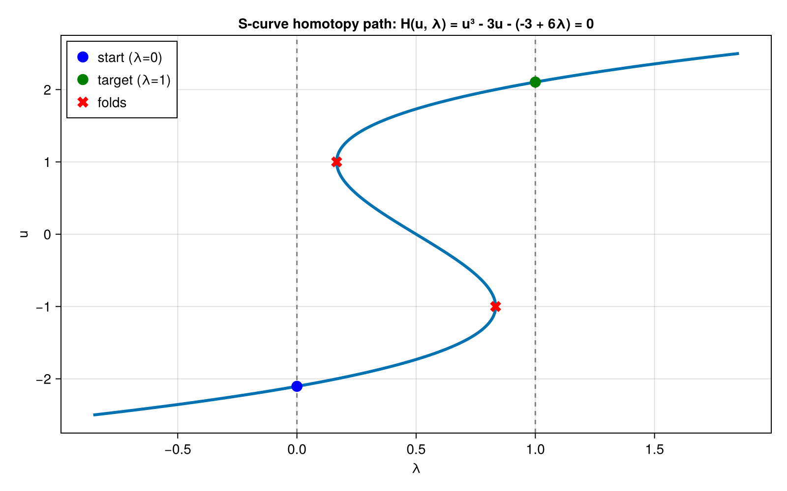
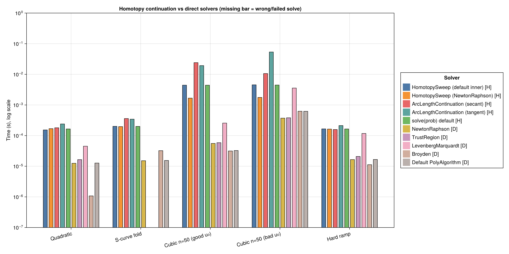

Homotopy continuation is a *globalization* strategy for hard nonlinear rootfinding
problems. Instead of attacking the target system ``f(u) = 0`` directly from the initial
guess ``u_0``, one embeds it in a one-parameter family

```math
H(u, \lambda) = 0, \qquad \lambda \in [0, 1]
```

where ``H(u, 0) = 0`` is an easy ("simplified") system that is reliably solvable from
``u_0``, and ``H(u, 1) = f(u)``. A continuation solver sweeps ``\lambda`` from 0 to 1,
warm-starting each step from the previous solution, so every inner solve starts close to
a root. This is the strategy used by OpenModelica-style homotopy initialization and by
classic path trackers.

When should you reach for it instead of plain Newton or trust-region methods?

  - When the direct solve **diverges** from the available initial guess (bad basin of
    attraction, residual growing without bound).
  - When the direct solve **stalls at a spurious stationary point** of
    ``\|f(u)\|^2`` that is not a root (a classic failure mode for damped Newton and
    trust-region methods on non-convex residuals).
  - When you need the root that is **path-connected** to a known configuration — e.g.
    following a physical branch through folds — rather than *any* root that Newton
    happens to jump to.

The cost is that the solver must traverse the whole ``\lambda`` path, so on problems
where a direct method converges from ``u_0``, homotopy pays a large constant-factor
overhead. This benchmark quantifies both sides of that tradeoff by comparing
NonlinearSolve.jl's homotopy solvers ([`HomotopySweep`](https://docs.sciml.ai/NonlinearSolve/stable/)
natural-parameter continuation and `ArcLengthContinuation` pseudo-arclength
continuation, both operating on a `SciMLBase.HomotopyProblem`) against direct methods
(`NewtonRaphson`, `TrustRegion`, `LevenbergMarquardt`, `Broyden`, and the default
polyalgorithm) applied to the target ``\lambda = 1`` system from the **same starting
point**.

Note on API coverage: this benchmark uses the registered homotopy API surface
(`HomotopyProblem`, `HomotopySweep`, `ArcLengthContinuation`, and the default
`solve(::HomotopyProblem)` dispatch). `SimpleHomotopySweep` and `HomotopyPolyAlgorithm`
exist on NonlinearSolve.jl master but are not yet in a registered release, so they are
not benchmarked here yet. `ArcLengthContinuation` currently requires an
`AbstractArray` state, so the scalar test problems are formulated as 1-element vectors.

# Setup

Fetch required packages.

```julia
using NonlinearSolve, LinearAlgebra, BenchmarkTools, CairoMakie, PrettyTables

BenchmarkTools.DEFAULT_PARAMETERS.seconds = 0.5;
```


A shared residual-call counter. Every test function bumps this `Ref` on each call, so
the reported "residual calls" for a solve counts *every* evaluation of the residual,
including those triggered by automatic differentiation for Jacobians. That makes it an
honest measure of total function work rather than of outer iterations.

```julia
const CALLS = Ref(0)
reset_calls!() = (CALLS[] = 0)
```

```
reset_calls! (generic function with 1 method)
```


# Test Problems

Each problem is defined twice from the same initial guess ``u_0``:

  - a `HomotopyProblem` with residual ``H(u, p, \lambda)`` (the homotopy solvers sweep
    ``\lambda`` across `λspan = (0, 1)`), and
  - the direct `NonlinearProblem` for the target system ``H(u, p, 1) = 0``.

## Problem 1: Monotone quadratic (easy)

```math
H(u, \lambda) = (1 - \lambda)(u - 4) + \lambda(u^2 - 4)
```

from ``u_0 = 4``. The direct problem is ``u^2 = 4`` from ``u_0 = 4``, which every
sensible method solves without drama; the homotopy path is monotone and fold-free. This
problem measures the pure *overhead* of path traversal when globalization is not needed.
The target root is ``u = 2``.

```julia
h_quad(u, p, λ) = (CALLS[] += 1; [(1 - λ) * (u[1] - 4.0) + λ * (u[1]^2 - 4.0)])
d_quad(u, p) = (CALLS[] += 1; [u[1]^2 - 4.0])
u0_quad = [4.0]
uref_quad = [2.0]
```

```
1-element Vector{Float64}:
 2.0
```


## Problem 2: S-curve with folds

```math
H(u, \lambda) = u^3 - 3u - (-3 + 6\lambda)
```

from ``u_0 \approx -2.1038`` (the exact root of the ``\lambda = 0`` system on the lower
sheet). The zero set of ``H`` in the ``(\lambda, u)`` plane is an S-shaped curve with two
turning points (folds) at ``(\lambda, u) = (5/6, -1)`` and ``(1/6, 1)``: starting on the
lower sheet, the branch connected to ``u_0`` folds back in ``\lambda`` twice before
arriving at the unique ``\lambda = 1`` root ``u \approx +2.1038`` on the upper sheet.

```julia
h_fold(u, p, λ) = (CALLS[] += 1; [u[1]^3 - 3u[1] - (-3 + 6λ)])
d_fold(u, p) = (CALLS[] += 1; [u[1]^3 - 3u[1] - 3.0])
u0_fold = [-2.1038034027355366]
uref_fold = [2.1038034027355366]
```

```
1-element Vector{Float64}:
 2.1038034027355366
```


The direct ``\lambda = 1`` problem, ``u^3 - 3u - 3 = 0`` from ``u_0 = -2.1038``, is the
interesting one: between the initial guess and the root lie both critical points of the
cubic (``u = \pm 1``), where ``f'(u) = 0`` and ``\|f(u)\|^2`` has a spurious interior
stationary point. Undamped Newton takes a wild step across this region and only reaches
the root by an uncontrolled basin jump, while methods that enforce decrease of the
residual norm can get trapped. We can visualize the solution curve (here ``\lambda``
expressed as a function of ``u`` along the path):

```julia
us = range(-2.5, 2.5; length = 500)
λs = @. (us^3 - 3us + 3) / 6
fig = Figure(; size = (800, 500))
ax = Axis(fig[1, 1]; xlabel = "λ", ylabel = "u",
    title = "S-curve homotopy path: H(u, λ) = u³ - 3u - (-3 + 6λ) = 0")
lines!(ax, λs, us; linewidth = 3)
vlines!(ax, [0.0, 1.0]; color = :gray, linestyle = :dash)
scatter!(ax, [0.0], [-2.1038034027355366]; color = :blue, markersize = 16,
    label = "start (λ=0)")
scatter!(ax, [1.0], [2.1038034027355366]; color = :green, markersize = 16,
    label = "target (λ=1)")
scatter!(ax, [5 / 6, 1 / 6], [-1.0, 1.0]; color = :red, marker = :xcross,
    markersize = 16, label = "folds")
axislegend(ax; position = :lt)
fig
```




## Problem 3: n = 50 coupled cubic (in-place), good and bad starts

```math
r_i = u_i + \tfrac{1}{4} u_{i-1} + \tfrac{1}{4} u_{i+1} + \lambda u_i^3 - c_i,
\qquad u_0 = u_{n+1} = 0
```

with ``c`` chosen so that ``u = \mathbf{1}`` solves the ``\lambda = 1`` system exactly.
At ``\lambda = 0`` the system is *linear*, so the homotopy anchor solve always succeeds
regardless of the starting point. We benchmark from the good start ``u_0 = \mathbf{1}``
(already the target root — the best case for direct methods) and from the bad start
``u_0 = 10 \cdot \mathbf{1}`` (far outside the region where the cubic term is tame) to
stress globalization.

```julia
const N_CUBIC = 50
const c_cubic = [1.0 + 0.25 * (i > 1) + 0.25 * (i < N_CUBIC) + 1.0 for i in 1:N_CUBIC]
function h_cubic!(du, u, p, λ)
    CALLS[] += 1
    for i in 1:N_CUBIC
        du[i] = u[i] + 0.25 * (i > 1 ? u[i - 1] : 0.0) +
                0.25 * (i < N_CUBIC ? u[i + 1] : 0.0) + λ * u[i]^3 - c_cubic[i]
    end
    return nothing
end
d_cubic!(du, u, p) = h_cubic!(du, u, p, 1.0)
uref_cubic = ones(N_CUBIC)
```

```
50-element Vector{Float64}:
 1.0
 1.0
 1.0
 1.0
 1.0
 1.0
 1.0
 1.0
 1.0
 1.0
 ⋮
 1.0
 1.0
 1.0
 1.0
 1.0
 1.0
 1.0
 1.0
 1.0
```


## Problem 4: Hard ramp from a far-away start

```math
H(u, \lambda) = u^3 - 1 - 7\lambda
```

from ``u_0 = 100``. The ``\lambda = 0`` system ``u^3 = 1`` pulls the iterate from the
far-away start down to ``u = 1``, and the path then ramps gently to the target root
``u = \sqrt[3]{8} = 2``. The direct problem ``u^3 - 8 = 0`` from ``u_0 = 100`` forces
Newton-type methods through a long sequence of damped steps (Newton on a cubic contracts
by only ``\approx 2/3`` per step far from the root).

```julia
h_ramp(u, p, λ) = (CALLS[] += 1; [u[1]^3 - 1.0 - 7λ])
d_ramp(u, p) = (CALLS[] += 1; [u[1]^3 - 8.0])
u0_ramp = [100.0]
uref_ramp = [2.0]
```

```
1-element Vector{Float64}:
 2.0
```


# Solvers

```julia
homotopy_solvers = [
    (; name = "HomotopySweep (default inner)", alg = HomotopySweep()),
    (; name = "HomotopySweep (NewtonRaphson)", alg = HomotopySweep(inner = NewtonRaphson())),
    (; name = "ArcLengthContinuation (secant)", alg = ArcLengthContinuation()),
    (; name = "ArcLengthContinuation (tangent)",
        alg = ArcLengthContinuation(predictor = :tangent)),
    (; name = "solve(prob) default", alg = nothing),
];

direct_solvers = [
    (; name = "NewtonRaphson", alg = NewtonRaphson()),
    (; name = "TrustRegion", alg = TrustRegion()),
    (; name = "LevenbergMarquardt", alg = LevenbergMarquardt()),
    (; name = "Broyden", alg = Broyden()),
    (; name = "Default PolyAlgorithm", alg = nothing),
];
```


Benchmark helpers. For each solver we record the return code, whether the solver reached
the reference root, the number of residual calls of a single solve, and the minimum wall
time over repeated runs (via BenchmarkTools).

```julia
function run_solver(prob, alg, uref)
    reset_calls!()
    local sol
    try
        sol = alg === nothing ? solve(prob) : solve(prob, alg)
    catch err
        Base.printstyled("[Warn] Solver threw $(typeof(err)).\n"; color = :red)
        return (; retcode = "exception", success = false, correct = false,
            calls = CALLS[], err = NaN, time = NaN)
    end
    calls = CALLS[]
    success = SciMLBase.successful_retcode(sol.retcode)
    err = norm(sol.u .- uref, Inf)
    correct = success && err < 1e-6
    time = alg === nothing ? (@belapsed solve($prob)) : (@belapsed solve($prob, $alg))
    return (; retcode = string(sol.retcode), success, correct, calls, err, time)
end

function benchmark_case(hprob, dprob, uref)
    results = []
    for s in homotopy_solvers
        push!(results, (; s.name, kind = "homotopy", run_solver(hprob, s.alg, uref)...))
    end
    for s in direct_solvers
        push!(results, (; s.name, kind = "direct", run_solver(dprob, s.alg, uref)...))
    end
    return results
end

fmt_time(t) = isnan(t) ? "—" : t < 1e-3 ? string(round(t * 1e6; digits = 1), " μs") :
              string(round(t * 1e3; digits = 2), " ms")
fmt_err(e) = isnan(e) ? "—" : string(round(e; sigdigits = 3))

function result_table(results)
    data = permutedims(reduce(hcat,
        [[r.name, r.kind, r.retcode, r.correct ? "yes" : "no", r.calls,
             fmt_err(r.err), fmt_time(r.time)] for r in results]))
    io = IOBuffer()
    println(io, "```@raw html")
    pretty_table(io, data; backend = :html, alignment = :c,
        column_labels = ["Solver", "Kind", "Return Code", "Correct Root",
            "Residual Calls", "‖u - u*‖∞", "Time"])
    println(io, "```")
    return Base.Text(String(take!(io)))
end
```

```
result_table (generic function with 1 method)
```


# Results

## Problem 1: Monotone quadratic

```julia
res_quad = benchmark_case(HomotopyProblem(h_quad, copy(u0_quad)),
    NonlinearProblem(d_quad, copy(u0_quad)), uref_quad);
```


```julia
result_table(res_quad)
```

```@raw html
<table>
  <thead>
    <tr class = "columnLabelRow">
      <th style = "font-weight: bold; text-align: center;">Solver</th>
      <th style = "font-weight: bold; text-align: center;">Kind</th>
      <th style = "font-weight: bold; text-align: center;">Return Code</th>
      <th style = "font-weight: bold; text-align: center;">Correct Root</th>
      <th style = "font-weight: bold; text-align: center;">Residual Calls</th>
      <th style = "font-weight: bold; text-align: center;">‖u - u*‖∞</th>
      <th style = "font-weight: bold; text-align: center;">Time</th>
    </tr>
  </thead>
  <tbody>
    <tr class = "dataRow">
      <td style = "text-align: center;">HomotopySweep (default inner)</td>
      <td style = "text-align: center;">homotopy</td>
      <td style = "text-align: center;">Success</td>
      <td style = "text-align: center;">yes</td>
      <td style = "text-align: center;">124</td>
      <td style = "text-align: center;">0.0</td>
      <td style = "text-align: center;">153.2 μs</td>
    </tr>
    <tr class = "dataRow">
      <td style = "text-align: center;">HomotopySweep (NewtonRaphson)</td>
      <td style = "text-align: center;">homotopy</td>
      <td style = "text-align: center;">Success</td>
      <td style = "text-align: center;">yes</td>
      <td style = "text-align: center;">124</td>
      <td style = "text-align: center;">0.0</td>
      <td style = "text-align: center;">168.5 μs</td>
    </tr>
    <tr class = "dataRow">
      <td style = "text-align: center;">ArcLengthContinuation (secant)</td>
      <td style = "text-align: center;">homotopy</td>
      <td style = "text-align: center;">Success</td>
      <td style = "text-align: center;">yes</td>
      <td style = "text-align: center;">94</td>
      <td style = "text-align: center;">0.0</td>
      <td style = "text-align: center;">180.2 μs</td>
    </tr>
    <tr class = "dataRow">
      <td style = "text-align: center;">ArcLengthContinuation (tangent)</td>
      <td style = "text-align: center;">homotopy</td>
      <td style = "text-align: center;">Success</td>
      <td style = "text-align: center;">yes</td>
      <td style = "text-align: center;">104</td>
      <td style = "text-align: center;">0.0</td>
      <td style = "text-align: center;">240.0 μs</td>
    </tr>
    <tr class = "dataRow">
      <td style = "text-align: center;">solve(prob) default</td>
      <td style = "text-align: center;">homotopy</td>
      <td style = "text-align: center;">Success</td>
      <td style = "text-align: center;">yes</td>
      <td style = "text-align: center;">124</td>
      <td style = "text-align: center;">0.0</td>
      <td style = "text-align: center;">164.8 μs</td>
    </tr>
    <tr class = "dataRow">
      <td style = "text-align: center;">NewtonRaphson</td>
      <td style = "text-align: center;">direct</td>
      <td style = "text-align: center;">Success</td>
      <td style = "text-align: center;">yes</td>
      <td style = "text-align: center;">14</td>
      <td style = "text-align: center;">2.22e-15</td>
      <td style = "text-align: center;">12.5 μs</td>
    </tr>
    <tr class = "dataRow">
      <td style = "text-align: center;">TrustRegion</td>
      <td style = "text-align: center;">direct</td>
      <td style = "text-align: center;">Success</td>
      <td style = "text-align: center;">yes</td>
      <td style = "text-align: center;">16</td>
      <td style = "text-align: center;">0.0</td>
      <td style = "text-align: center;">16.4 μs</td>
    </tr>
    <tr class = "dataRow">
      <td style = "text-align: center;">LevenbergMarquardt</td>
      <td style = "text-align: center;">direct</td>
      <td style = "text-align: center;">Success</td>
      <td style = "text-align: center;">yes</td>
      <td style = "text-align: center;">31</td>
      <td style = "text-align: center;">6.88e-14</td>
      <td style = "text-align: center;">45.1 μs</td>
    </tr>
    <tr class = "dataRow">
      <td style = "text-align: center;">Broyden</td>
      <td style = "text-align: center;">direct</td>
      <td style = "text-align: center;">Success</td>
      <td style = "text-align: center;">yes</td>
      <td style = "text-align: center;">4</td>
      <td style = "text-align: center;">0.0</td>
      <td style = "text-align: center;">1.1 μs</td>
    </tr>
    <tr class = "dataRow">
      <td style = "text-align: center;">Default PolyAlgorithm</td>
      <td style = "text-align: center;">direct</td>
      <td style = "text-align: center;">Success</td>
      <td style = "text-align: center;">yes</td>
      <td style = "text-align: center;">14</td>
      <td style = "text-align: center;">2.22e-15</td>
      <td style = "text-align: center;">12.7 μs</td>
    </tr>
  </tbody>
</table>
```


All solvers find the root. The direct methods are an order of magnitude cheaper both in
residual calls and wall time — this is the constant-factor path-traversal overhead you
pay for homotopy when the direct solve was never in danger.

## Problem 2: S-curve with folds

```julia
res_fold = benchmark_case(HomotopyProblem(h_fold, copy(u0_fold)),
    NonlinearProblem(d_fold, copy(u0_fold)), uref_fold);
```


```julia
result_table(res_fold)
```

```@raw html
<table>
  <thead>
    <tr class = "columnLabelRow">
      <th style = "font-weight: bold; text-align: center;">Solver</th>
      <th style = "font-weight: bold; text-align: center;">Kind</th>
      <th style = "font-weight: bold; text-align: center;">Return Code</th>
      <th style = "font-weight: bold; text-align: center;">Correct Root</th>
      <th style = "font-weight: bold; text-align: center;">Residual Calls</th>
      <th style = "font-weight: bold; text-align: center;">‖u - u*‖∞</th>
      <th style = "font-weight: bold; text-align: center;">Time</th>
    </tr>
  </thead>
  <tbody>
    <tr class = "dataRow">
      <td style = "text-align: center;">HomotopySweep (default inner)</td>
      <td style = "text-align: center;">homotopy</td>
      <td style = "text-align: center;">Success</td>
      <td style = "text-align: center;">yes</td>
      <td style = "text-align: center;">280</td>
      <td style = "text-align: center;">0.0</td>
      <td style = "text-align: center;">200.8 μs</td>
    </tr>
    <tr class = "dataRow">
      <td style = "text-align: center;">HomotopySweep (NewtonRaphson)</td>
      <td style = "text-align: center;">homotopy</td>
      <td style = "text-align: center;">Success</td>
      <td style = "text-align: center;">yes</td>
      <td style = "text-align: center;">280</td>
      <td style = "text-align: center;">0.0</td>
      <td style = "text-align: center;">196.6 μs</td>
    </tr>
    <tr class = "dataRow">
      <td style = "text-align: center;">ArcLengthContinuation (secant)</td>
      <td style = "text-align: center;">homotopy</td>
      <td style = "text-align: center;">Success</td>
      <td style = "text-align: center;">yes</td>
      <td style = "text-align: center;">182</td>
      <td style = "text-align: center;">0.0</td>
      <td style = "text-align: center;">360.2 μs</td>
    </tr>
    <tr class = "dataRow">
      <td style = "text-align: center;">ArcLengthContinuation (tangent)</td>
      <td style = "text-align: center;">homotopy</td>
      <td style = "text-align: center;">Success</td>
      <td style = "text-align: center;">yes</td>
      <td style = "text-align: center;">154</td>
      <td style = "text-align: center;">1.33e-15</td>
      <td style = "text-align: center;">343.9 μs</td>
    </tr>
    <tr class = "dataRow">
      <td style = "text-align: center;">solve(prob) default</td>
      <td style = "text-align: center;">homotopy</td>
      <td style = "text-align: center;">Success</td>
      <td style = "text-align: center;">yes</td>
      <td style = "text-align: center;">280</td>
      <td style = "text-align: center;">0.0</td>
      <td style = "text-align: center;">199.5 μs</td>
    </tr>
    <tr class = "dataRow">
      <td style = "text-align: center;">NewtonRaphson</td>
      <td style = "text-align: center;">direct</td>
      <td style = "text-align: center;">Success</td>
      <td style = "text-align: center;">yes</td>
      <td style = "text-align: center;">26</td>
      <td style = "text-align: center;">0.0</td>
      <td style = "text-align: center;">15.2 μs</td>
    </tr>
    <tr class = "dataRow">
      <td style = "text-align: center;">TrustRegion</td>
      <td style = "text-align: center;">direct</td>
      <td style = "text-align: center;">Stalled</td>
      <td style = "text-align: center;">no</td>
      <td style = "text-align: center;">82</td>
      <td style = "text-align: center;">3.1</td>
      <td style = "text-align: center;">49.7 μs</td>
    </tr>
    <tr class = "dataRow">
      <td style = "text-align: center;">LevenbergMarquardt</td>
      <td style = "text-align: center;">direct</td>
      <td style = "text-align: center;">MaxIters</td>
      <td style = "text-align: center;">no</td>
      <td style = "text-align: center;">1782</td>
      <td style = "text-align: center;">3.11</td>
      <td style = "text-align: center;">3.38 ms</td>
    </tr>
    <tr class = "dataRow">
      <td style = "text-align: center;">Broyden</td>
      <td style = "text-align: center;">direct</td>
      <td style = "text-align: center;">Success</td>
      <td style = "text-align: center;">yes</td>
      <td style = "text-align: center;">58</td>
      <td style = "text-align: center;">0.0</td>
      <td style = "text-align: center;">32.3 μs</td>
    </tr>
    <tr class = "dataRow">
      <td style = "text-align: center;">Default PolyAlgorithm</td>
      <td style = "text-align: center;">direct</td>
      <td style = "text-align: center;">Success</td>
      <td style = "text-align: center;">yes</td>
      <td style = "text-align: center;">26</td>
      <td style = "text-align: center;">0.0</td>
      <td style = "text-align: center;">15.4 μs</td>
    </tr>
  </tbody>
</table>
```


This is the problem homotopy methods exist for. Starting from the lower sheet, the
iterate must cross the region containing both critical points of the cubic. Methods
that enforce residual decrease get trapped at the spurious stationary point near
``u = -1`` (`TrustRegion` stalls; `LevenbergMarquardt` fails after a large number of
residual calls). Undamped `NewtonRaphson` and `Broyden` reach the root only via an
uncontrolled jump across the non-monotone region — that happens to work here because
the ``\lambda = 1`` cubic has a single real root, but it is exactly the failure mode
that returns a wrong-basin root when multiple roots exist. The continuation solvers
follow the branch connected to the starting point: `ArcLengthContinuation` rounds both
folds in the augmented ``(u, \lambda)`` space, and `HomotopySweep`'s adaptive bisection
detects the fold and re-converges past it.

## Problem 3: n = 50 coupled cubic, good start

```julia
res_cubic_good = benchmark_case(HomotopyProblem{true}(h_cubic!, ones(N_CUBIC)),
    NonlinearProblem{true}(d_cubic!, ones(N_CUBIC)), uref_cubic);
```


```julia
result_table(res_cubic_good)
```

```@raw html
<table>
  <thead>
    <tr class = "columnLabelRow">
      <th style = "font-weight: bold; text-align: center;">Solver</th>
      <th style = "font-weight: bold; text-align: center;">Kind</th>
      <th style = "font-weight: bold; text-align: center;">Return Code</th>
      <th style = "font-weight: bold; text-align: center;">Correct Root</th>
      <th style = "font-weight: bold; text-align: center;">Residual Calls</th>
      <th style = "font-weight: bold; text-align: center;">‖u - u*‖∞</th>
      <th style = "font-weight: bold; text-align: center;">Time</th>
    </tr>
  </thead>
  <tbody>
    <tr class = "dataRow">
      <td style = "text-align: center;">HomotopySweep (default inner)</td>
      <td style = "text-align: center;">homotopy</td>
      <td style = "text-align: center;">Success</td>
      <td style = "text-align: center;">yes</td>
      <td style = "text-align: center;">1292</td>
      <td style = "text-align: center;">1.24e-14</td>
      <td style = "text-align: center;">4.43 ms</td>
    </tr>
    <tr class = "dataRow">
      <td style = "text-align: center;">HomotopySweep (NewtonRaphson)</td>
      <td style = "text-align: center;">homotopy</td>
      <td style = "text-align: center;">Success</td>
      <td style = "text-align: center;">yes</td>
      <td style = "text-align: center;">2625</td>
      <td style = "text-align: center;">0.0</td>
      <td style = "text-align: center;">1.67 ms</td>
    </tr>
    <tr class = "dataRow">
      <td style = "text-align: center;">ArcLengthContinuation (secant)</td>
      <td style = "text-align: center;">homotopy</td>
      <td style = "text-align: center;">Success</td>
      <td style = "text-align: center;">yes</td>
      <td style = "text-align: center;">17697</td>
      <td style = "text-align: center;">3.93e-14</td>
      <td style = "text-align: center;">24.08 ms</td>
    </tr>
    <tr class = "dataRow">
      <td style = "text-align: center;">ArcLengthContinuation (tangent)</td>
      <td style = "text-align: center;">homotopy</td>
      <td style = "text-align: center;">Success</td>
      <td style = "text-align: center;">yes</td>
      <td style = "text-align: center;">6599</td>
      <td style = "text-align: center;">5.84e-14</td>
      <td style = "text-align: center;">19.28 ms</td>
    </tr>
    <tr class = "dataRow">
      <td style = "text-align: center;">solve(prob) default</td>
      <td style = "text-align: center;">homotopy</td>
      <td style = "text-align: center;">Success</td>
      <td style = "text-align: center;">yes</td>
      <td style = "text-align: center;">1292</td>
      <td style = "text-align: center;">1.24e-14</td>
      <td style = "text-align: center;">4.42 ms</td>
    </tr>
    <tr class = "dataRow">
      <td style = "text-align: center;">NewtonRaphson</td>
      <td style = "text-align: center;">direct</td>
      <td style = "text-align: center;">Success</td>
      <td style = "text-align: center;">yes</td>
      <td style = "text-align: center;">104</td>
      <td style = "text-align: center;">0.0</td>
      <td style = "text-align: center;">55.5 μs</td>
    </tr>
    <tr class = "dataRow">
      <td style = "text-align: center;">TrustRegion</td>
      <td style = "text-align: center;">direct</td>
      <td style = "text-align: center;">Success</td>
      <td style = "text-align: center;">yes</td>
      <td style = "text-align: center;">104</td>
      <td style = "text-align: center;">0.0</td>
      <td style = "text-align: center;">58.7 μs</td>
    </tr>
    <tr class = "dataRow">
      <td style = "text-align: center;">LevenbergMarquardt</td>
      <td style = "text-align: center;">direct</td>
      <td style = "text-align: center;">Success</td>
      <td style = "text-align: center;">yes</td>
      <td style = "text-align: center;">105</td>
      <td style = "text-align: center;">0.0</td>
      <td style = "text-align: center;">256.1 μs</td>
    </tr>
    <tr class = "dataRow">
      <td style = "text-align: center;">Broyden</td>
      <td style = "text-align: center;">direct</td>
      <td style = "text-align: center;">Success</td>
      <td style = "text-align: center;">yes</td>
      <td style = "text-align: center;">4</td>
      <td style = "text-align: center;">0.0</td>
      <td style = "text-align: center;">31.5 μs</td>
    </tr>
    <tr class = "dataRow">
      <td style = "text-align: center;">Default PolyAlgorithm</td>
      <td style = "text-align: center;">direct</td>
      <td style = "text-align: center;">Success</td>
      <td style = "text-align: center;">yes</td>
      <td style = "text-align: center;">4</td>
      <td style = "text-align: center;">0.0</td>
      <td style = "text-align: center;">32.5 μs</td>
    </tr>
  </tbody>
</table>
```


From the good start (which is already the target root) the direct methods converge
essentially immediately, while the homotopy solvers still traverse the entire
``\lambda`` path — the worst case for continuation overhead.

## Problem 3b: n = 50 coupled cubic, bad start

```julia
res_cubic_bad = benchmark_case(HomotopyProblem{true}(h_cubic!, 10 .* ones(N_CUBIC)),
    NonlinearProblem{true}(d_cubic!, 10 .* ones(N_CUBIC)), uref_cubic);
```


```julia
result_table(res_cubic_bad)
```

```@raw html
<table>
  <thead>
    <tr class = "columnLabelRow">
      <th style = "font-weight: bold; text-align: center;">Solver</th>
      <th style = "font-weight: bold; text-align: center;">Kind</th>
      <th style = "font-weight: bold; text-align: center;">Return Code</th>
      <th style = "font-weight: bold; text-align: center;">Correct Root</th>
      <th style = "font-weight: bold; text-align: center;">Residual Calls</th>
      <th style = "font-weight: bold; text-align: center;">‖u - u*‖∞</th>
      <th style = "font-weight: bold; text-align: center;">Time</th>
    </tr>
  </thead>
  <tbody>
    <tr class = "dataRow">
      <td style = "text-align: center;">HomotopySweep (default inner)</td>
      <td style = "text-align: center;">homotopy</td>
      <td style = "text-align: center;">Success</td>
      <td style = "text-align: center;">yes</td>
      <td style = "text-align: center;">1663</td>
      <td style = "text-align: center;">1.24e-14</td>
      <td style = "text-align: center;">4.55 ms</td>
    </tr>
    <tr class = "dataRow">
      <td style = "text-align: center;">HomotopySweep (NewtonRaphson)</td>
      <td style = "text-align: center;">homotopy</td>
      <td style = "text-align: center;">Success</td>
      <td style = "text-align: center;">yes</td>
      <td style = "text-align: center;">2625</td>
      <td style = "text-align: center;">0.0</td>
      <td style = "text-align: center;">1.76 ms</td>
    </tr>
    <tr class = "dataRow">
      <td style = "text-align: center;">ArcLengthContinuation (secant)</td>
      <td style = "text-align: center;">homotopy</td>
      <td style = "text-align: center;">Success</td>
      <td style = "text-align: center;">yes</td>
      <td style = "text-align: center;">5323</td>
      <td style = "text-align: center;">3.71e-14</td>
      <td style = "text-align: center;">10.61 ms</td>
    </tr>
    <tr class = "dataRow">
      <td style = "text-align: center;">ArcLengthContinuation (tangent)</td>
      <td style = "text-align: center;">homotopy</td>
      <td style = "text-align: center;">Success</td>
      <td style = "text-align: center;">yes</td>
      <td style = "text-align: center;">18886</td>
      <td style = "text-align: center;">2.5e-14</td>
      <td style = "text-align: center;">53.57 ms</td>
    </tr>
    <tr class = "dataRow">
      <td style = "text-align: center;">solve(prob) default</td>
      <td style = "text-align: center;">homotopy</td>
      <td style = "text-align: center;">Success</td>
      <td style = "text-align: center;">yes</td>
      <td style = "text-align: center;">1663</td>
      <td style = "text-align: center;">1.24e-14</td>
      <td style = "text-align: center;">4.47 ms</td>
    </tr>
    <tr class = "dataRow">
      <td style = "text-align: center;">NewtonRaphson</td>
      <td style = "text-align: center;">direct</td>
      <td style = "text-align: center;">Success</td>
      <td style = "text-align: center;">yes</td>
      <td style = "text-align: center;">563</td>
      <td style = "text-align: center;">1.11e-16</td>
      <td style = "text-align: center;">371.2 μs</td>
    </tr>
    <tr class = "dataRow">
      <td style = "text-align: center;">TrustRegion</td>
      <td style = "text-align: center;">direct</td>
      <td style = "text-align: center;">Success</td>
      <td style = "text-align: center;">yes</td>
      <td style = "text-align: center;">563</td>
      <td style = "text-align: center;">1.11e-16</td>
      <td style = "text-align: center;">381.9 μs</td>
    </tr>
    <tr class = "dataRow">
      <td style = "text-align: center;">LevenbergMarquardt</td>
      <td style = "text-align: center;">direct</td>
      <td style = "text-align: center;">Success</td>
      <td style = "text-align: center;">yes</td>
      <td style = "text-align: center;">885</td>
      <td style = "text-align: center;">1.89e-14</td>
      <td style = "text-align: center;">3.56 ms</td>
    </tr>
    <tr class = "dataRow">
      <td style = "text-align: center;">Broyden</td>
      <td style = "text-align: center;">direct</td>
      <td style = "text-align: center;">Success</td>
      <td style = "text-align: center;">yes</td>
      <td style = "text-align: center;">102</td>
      <td style = "text-align: center;">7.57e-14</td>
      <td style = "text-align: center;">624.3 μs</td>
    </tr>
    <tr class = "dataRow">
      <td style = "text-align: center;">Default PolyAlgorithm</td>
      <td style = "text-align: center;">direct</td>
      <td style = "text-align: center;">Success</td>
      <td style = "text-align: center;">yes</td>
      <td style = "text-align: center;">102</td>
      <td style = "text-align: center;">7.57e-14</td>
      <td style = "text-align: center;">620.2 μs</td>
    </tr>
  </tbody>
</table>
```


From the bad start the direct methods need several times more work than from the good
start, but the globalization built into NonlinearSolve's damped methods still gets them
home. The homotopy cost is nearly independent of the starting point: the ``\lambda = 0``
anchor system is linear, so the anchor solve absorbs the bad guess and the rest of the
path is traversed from warm starts.

## Problem 4: Hard ramp

```julia
res_ramp = benchmark_case(HomotopyProblem(h_ramp, copy(u0_ramp)),
    NonlinearProblem(d_ramp, copy(u0_ramp)), uref_ramp);
```


```julia
result_table(res_ramp)
```

```@raw html
<table>
  <thead>
    <tr class = "columnLabelRow">
      <th style = "font-weight: bold; text-align: center;">Solver</th>
      <th style = "font-weight: bold; text-align: center;">Kind</th>
      <th style = "font-weight: bold; text-align: center;">Return Code</th>
      <th style = "font-weight: bold; text-align: center;">Correct Root</th>
      <th style = "font-weight: bold; text-align: center;">Residual Calls</th>
      <th style = "font-weight: bold; text-align: center;">‖u - u*‖∞</th>
      <th style = "font-weight: bold; text-align: center;">Time</th>
    </tr>
  </thead>
  <tbody>
    <tr class = "dataRow">
      <td style = "text-align: center;">HomotopySweep (default inner)</td>
      <td style = "text-align: center;">homotopy</td>
      <td style = "text-align: center;">Success</td>
      <td style = "text-align: center;">yes</td>
      <td style = "text-align: center;">164</td>
      <td style = "text-align: center;">0.0</td>
      <td style = "text-align: center;">165.8 μs</td>
    </tr>
    <tr class = "dataRow">
      <td style = "text-align: center;">HomotopySweep (NewtonRaphson)</td>
      <td style = "text-align: center;">homotopy</td>
      <td style = "text-align: center;">Success</td>
      <td style = "text-align: center;">yes</td>
      <td style = "text-align: center;">164</td>
      <td style = "text-align: center;">0.0</td>
      <td style = "text-align: center;">163.3 μs</td>
    </tr>
    <tr class = "dataRow">
      <td style = "text-align: center;">ArcLengthContinuation (secant)</td>
      <td style = "text-align: center;">homotopy</td>
      <td style = "text-align: center;">Success</td>
      <td style = "text-align: center;">yes</td>
      <td style = "text-align: center;">110</td>
      <td style = "text-align: center;">0.0</td>
      <td style = "text-align: center;">157.7 μs</td>
    </tr>
    <tr class = "dataRow">
      <td style = "text-align: center;">ArcLengthContinuation (tangent)</td>
      <td style = "text-align: center;">homotopy</td>
      <td style = "text-align: center;">Success</td>
      <td style = "text-align: center;">yes</td>
      <td style = "text-align: center;">125</td>
      <td style = "text-align: center;">0.0</td>
      <td style = "text-align: center;">212.6 μs</td>
    </tr>
    <tr class = "dataRow">
      <td style = "text-align: center;">solve(prob) default</td>
      <td style = "text-align: center;">homotopy</td>
      <td style = "text-align: center;">Success</td>
      <td style = "text-align: center;">yes</td>
      <td style = "text-align: center;">164</td>
      <td style = "text-align: center;">0.0</td>
      <td style = "text-align: center;">164.6 μs</td>
    </tr>
    <tr class = "dataRow">
      <td style = "text-align: center;">NewtonRaphson</td>
      <td style = "text-align: center;">direct</td>
      <td style = "text-align: center;">Success</td>
      <td style = "text-align: center;">yes</td>
      <td style = "text-align: center;">32</td>
      <td style = "text-align: center;">4.44e-16</td>
      <td style = "text-align: center;">16.5 μs</td>
    </tr>
    <tr class = "dataRow">
      <td style = "text-align: center;">TrustRegion</td>
      <td style = "text-align: center;">direct</td>
      <td style = "text-align: center;">Success</td>
      <td style = "text-align: center;">yes</td>
      <td style = "text-align: center;">32</td>
      <td style = "text-align: center;">4.44e-16</td>
      <td style = "text-align: center;">20.8 μs</td>
    </tr>
    <tr class = "dataRow">
      <td style = "text-align: center;">LevenbergMarquardt</td>
      <td style = "text-align: center;">direct</td>
      <td style = "text-align: center;">Success</td>
      <td style = "text-align: center;">yes</td>
      <td style = "text-align: center;">80</td>
      <td style = "text-align: center;">2.0e-15</td>
      <td style = "text-align: center;">117.3 μs</td>
    </tr>
    <tr class = "dataRow">
      <td style = "text-align: center;">Broyden</td>
      <td style = "text-align: center;">direct</td>
      <td style = "text-align: center;">Success</td>
      <td style = "text-align: center;">yes</td>
      <td style = "text-align: center;">22</td>
      <td style = "text-align: center;">4.44e-16</td>
      <td style = "text-align: center;">11.2 μs</td>
    </tr>
    <tr class = "dataRow">
      <td style = "text-align: center;">Default PolyAlgorithm</td>
      <td style = "text-align: center;">direct</td>
      <td style = "text-align: center;">Success</td>
      <td style = "text-align: center;">yes</td>
      <td style = "text-align: center;">32</td>
      <td style = "text-align: center;">4.44e-16</td>
      <td style = "text-align: center;">16.6 μs</td>
    </tr>
  </tbody>
</table>
```


## Summary across problems

```julia
problem_names = ["Quadratic", "S-curve fold", "Cubic n=50 (good u₀)",
    "Cubic n=50 (bad u₀)", "Hard ramp"]
all_results = [res_quad, res_fold, res_cubic_good, res_cubic_bad, res_ramp]
solver_names = [r.name for r in all_results[1]]
solver_kinds = [r.kind for r in all_results[1]]

fig = begin
    nsolver = length(solver_names)
    nprob = length(problem_names)
    xs = Int[]
    dodge = Int[]
    ys = Float64[]
    for (pi, res) in enumerate(all_results), (si, r) in enumerate(res)
        # failed / wrong-root solves are omitted, leaving a visible gap in the group
        r.correct || continue
        push!(xs, pi)
        push!(dodge, si)
        push!(ys, r.time)
    end
    # log-scale axes cannot render bars that start at 0, so anchor them just below
    # the smallest measured time
    lo = 10.0^floor(log10(minimum(ys)) - 0.3)

    colors = cgrad(:tableau_20, nsolver; categorical = true)
    fig = Figure(; size = (1400, 700))
    ax = Axis(fig[1, 1]; yscale = log10, ylabel = "Time (s), log scale",
        title = "Homotopy continuation vs direct solvers (missing bar = wrong/failed solve)",
        xticks = (1:nprob, problem_names), xticklabelrotation = π / 12)
    barplot!(ax, xs, ys; dodge = dodge, n_dodge = nsolver, color = colors[dodge],
        strokewidth = 1, fillto = lo)
    ylims!(ax, lo, 10.0^ceil(log10(maximum(ys)) + 0.3))

    elements = [PolyElement(; polycolor = colors[i]) for i in 1:nsolver]
    Legend(fig[1, 2], elements,
        [n * (k == "homotopy" ? " [H]" : " [D]")
         for (n, k) in zip(solver_names, solver_kinds)],
        "Solver"; framevisible = true)
    fig
end
```



```julia
save("homotopy_summary.svg", fig)
```

```
CairoMakie.Screen{SVG}
```


# Discussion

The takeaways match the theory of embedding homotopies:

 1. **Direct methods win when they work.** On the monotone quadratic and the coupled
    cubic from a good start, direct Newton/quasi-Newton methods are 10–100x cheaper in
    residual calls and wall time. Homotopy traverses the full ``\lambda`` path no matter
    how easy the target problem is, so it should never be the default for problems where
    a decent initial guess exists.
 2. **Homotopy pays off when the direct solve is fragile.** On the S-curve problem the
    residual-decrease-enforcing methods (`TrustRegion`, `LevenbergMarquardt`) fail
    outright from the lower-sheet start, and the methods that do succeed do so by an
    uncontrolled basin jump that would silently return a wrong-basin root on problems
    with multiple ``\lambda = 1`` roots. The continuation solvers reliably deliver the
    root *connected to the starting configuration* — success here is a property of the
    algorithm, not luck.
 3. **Sweep vs. arclength.** `HomotopySweep` is the cheaper of the two on every problem
    where both succeed, and its adaptive ``\lambda`` bisection got it through this fold
    — but only by re-converging onto a different point of the curve after the branch
    folded back, which is again a (controlled) jump. `ArcLengthContinuation` follows the
    actual solution curve through the folds in the augmented ``(u, \lambda)`` space and
    is the branch-faithful choice, at the cost of solving an ``(n+1)``-dimensional
    corrector per step (and, for the `:tangent` predictor, one augmented Jacobian per
    step, which buys a higher-order prediction that is accurate from the very first
    step).
 4. **The homotopy cost is start-insensitive.** Comparing the good-start and bad-start
    cubic rows, the direct methods' cost grows several-fold with a bad guess while the
    homotopy solvers' cost barely moves, since their entry point is the easy
    ``\lambda = 0`` system.


## Appendix

These benchmarks are a part of the SciMLBenchmarks.jl repository, found at: [https://github.com/SciML/SciMLBenchmarks.jl](https://github.com/SciML/SciMLBenchmarks.jl). For more information on high-performance scientific machine learning, check out the SciML Open Source Software Organization [https://sciml.ai](https://sciml.ai).

To locally run this benchmark, do the following commands:

```
using SciMLBenchmarks
SciMLBenchmarks.weave_file("benchmarks/NonlinearProblem","homotopy_continuation.jmd")
```

Computer Information:

```
Julia Version 1.11.9
Commit 53a02c0720c (2026-02-06 00:27 UTC)
Build Info:
  Official https://julialang.org/ release
Platform Info:
  OS: Linux (x86_64-linux-gnu)
  CPU: 128 × AMD EPYC 7502 32-Core Processor
  WORD_SIZE: 64
  LLVM: libLLVM-16.0.6 (ORCJIT, znver2)
Threads: 128 default, 0 interactive, 64 GC (on 128 virtual cores)
Environment:
  JULIA_DEPOT_PATH = /home/crackauc/github-runners/amdci8-1/.julia
  JULIA_NUM_THREADS = auto

```

Package Information:

```
Status `~/github-runners/amdci8-1/_work/SciMLBenchmarks.jl/SciMLBenchmarks.jl/benchmarks/NonlinearProblem/Project.toml`
⌅ [2169fc97] AlgebraicMultigrid v1.2.0
  [6e4b80f9] BenchmarkTools v1.8.0
  [13f3f980] CairoMakie v0.15.13
⌃ [2b5f629d] DiffEqBase v7.12.0
⌃ [f3b72e0c] DiffEqDevTools v3.2.0
⌃ [a0c0ee7d] DifferentiationInterface v0.7.20
⌃ [7da242da] Enzyme v0.13.198
  [40713840] IncompleteLU v0.2.1
⌃ [b964fa9f] LaTeXStrings v1.4.0
⌃ [d3d80556] LineSearches v7.5.1
⌅ [7ed4a6bd] LinearSolve v3.87.0
  [4854310b] MINPACK v1.3.0
⌅ [2774e3e8] NLsolve v4.5.1
  [b7050fa9] NonlinearProblemLibrary v0.1.7
⌃ [8913a72c] NonlinearSolve v4.21.0
  [ace2c81b] PETSc v0.4.10
  [98d1487c] PolyesterForwardDiff v0.1.4
⌃ [08abe8d2] PrettyTables v3.4.5
⌃ [f2c3362d] RecursiveFactorization v0.2.26
⌃ [31c91b34] SciMLBenchmarks v0.1.3
  [a6db7da4] SciMLLogging v2.0.4
  [efcf1570] Setfield v1.1.2
⌃ [727e6d20] SimpleNonlinearSolve v2.13.1
  [9f842d2f] SparseConnectivityTracer v1.2.2
  [0a514795] SparseMatrixColorings v0.4.27
  [f1835b91] SpeedMapping v0.4.1
  [860ef19b] StableRNGs v1.0.4
⌃ [90137ffa] StaticArrays v1.9.18
⌃ [c3572dad] Sundials v6.4.2
  [0c5d862f] Symbolics v7.36.0
Info Packages marked with ⌃ and ⌅ have new versions available. Those with ⌃ may be upgradable, but those with ⌅ are restricted by compatibility constraints from upgrading. To see why use `status --outdated`
```

And the full manifest:

```
Status `~/github-runners/amdci8-1/_work/SciMLBenchmarks.jl/SciMLBenchmarks.jl/benchmarks/NonlinearProblem/Manifest.toml`
⌃ [47edcb42] ADTypes v1.22.4
  [14f7f29c] AMD v0.5.3
  [621f4979] AbstractFFTs v1.5.0
  [6e696c72] AbstractPlutoDingetjes v1.4.0
  [1520ce14] AbstractTrees v0.4.5
  [7d9f7c33] Accessors v0.1.45
  [79e6a3ab] Adapt v4.7.0
  [35492f91] AdaptivePredicates v1.2.0
⌅ [2169fc97] AlgebraicMultigrid v1.2.0
  [66dad0bd] AliasTables v1.1.3
  [27a7e980] Animations v0.4.2
  [ec485272] ArnoldiMethod v0.4.0
⌃ [4fba245c] ArrayInterface v7.28.1
  [67c07d97] Automa v1.2.0
  [13072b0f] AxisAlgorithms v1.1.0
  [39de3d68] AxisArrays v0.4.8
  [18cc8868] BaseDirs v1.4.0
  [6e4b80f9] BenchmarkTools v1.8.0
  [e2ed5e7c] Bijections v0.2.2
  [62783981] BitTwiddlingConvenienceFunctions v0.1.6
⌃ [70df07ce] BracketingNonlinearSolve v1.12.4
  [fa961155] CEnum v0.5.0
  [2a0fbf3d] CPUSummary v0.2.7
  [96374032] CRlibm v1.0.2
  [159f3aea] Cairo v1.1.1
  [13f3f980] CairoMakie v0.15.13
  [d360d2e6] ChainRulesCore v1.26.1
  [fb6a15b2] CloseOpenIntervals v0.1.13
  [6b39b394] CodecZstd v0.8.7
  [a2cac450] ColorBrewer v0.4.2
  [35d6a980] ColorSchemes v3.31.0
  [3da002f7] ColorTypes v0.12.1
  [c3611d14] ColorVectorSpace v0.11.0
  [5ae59095] Colors v0.13.1
⌅ [861a8166] Combinatorics v1.0.2
  [38540f10] CommonSolve v0.2.13
  [bbf7d656] CommonSubexpressions v0.3.1
  [f70d9fcc] CommonWorldInvalidations v1.1.2
  [34da2185] Compat v4.18.1
  [b152e2b5] CompositeTypes v0.1.4
  [a33af91c] CompositionsBase v0.1.2
  [95dc2771] ComputePipeline v0.1.8
  [2569d6c7] ConcreteStructs v0.2.7
  [8f4d0f93] Conda v1.10.3
  [187b0558] ConstructionBase v1.6.0
  [d38c429a] Contour v0.6.3
  [b7a15901] CoreMath v0.1.0
  [adafc99b] CpuId v0.3.1
  [a8cc5b0e] Crayons v4.2.0
  [9a962f9c] DataAPI v1.16.0
  [864edb3b] DataStructures v0.19.6
  [e2d170a0] DataValueInterfaces v1.0.0
  [927a84f5] DelaunayTriangulation v1.6.6
⌃ [2b5f629d] DiffEqBase v7.12.0
⌃ [f3b72e0c] DiffEqDevTools v3.2.0
⌃ [77a26b50] DiffEqNoiseProcess v5.34.0
  [163ba53b] DiffResults v1.1.0
  [b552c78f] DiffRules v1.16.0
⌃ [a0c0ee7d] DifferentiationInterface v0.7.20
  [b4f34e82] Distances v0.10.12
⌃ [31c24e10] Distributions v0.25.130
  [ffbed154] DocStringExtensions v0.9.5
  [5b8099bc] DomainSets v0.8.1
  [7c1d4256] DynamicPolynomials v0.6.6
  [4e289a0a] EnumX v1.0.7
⌃ [7da242da] Enzyme v0.13.198
  [f151be2c] EnzymeCore v0.8.21
  [429591f6] ExactPredicates v2.2.9
  [e2ba6199] ExprTools v0.1.11
  [55351af7] ExproniconLite v0.10.14
  [b86e33f2] FFTA v0.3.1
  [7034ab61] FastBroadcast v1.3.6
  [9aa1b823] FastClosures v0.3.2
  [a4df4552] FastPower v1.4.1
  [5789e2e9] FileIO v1.20.0
  [8fc22ac5] FilePaths v0.9.0
  [48062228] FilePathsBase v0.9.24
  [1a297f60] FillArrays v1.17.0
  [64ca27bc] FindFirstFunctions v3.2.1
⌃ [6a86dc24] FiniteDiff v2.32.1
⌅ [53c48c17] FixedPointNumbers v0.8.6
  [1fa38f19] Format v1.3.7
  [f6369f11] ForwardDiff v1.4.5
  [b38be410] FreeType v4.1.1
  [663a7486] FreeTypeAbstraction v0.10.8
  [a85aefff] FunctionMaps v0.1.2
  [069b7b12] FunctionWrappers v1.1.3
⌃ [77dc65aa] FunctionWrappersWrappers v1.12.1
  [46192b85] GPUArraysCore v0.2.0
⌅ [61eb1bfa] GPUCompiler v1.23.0
⌃ [a0844989] Gamma v1.1.0
  [5c1252a2] GeometryBasics v0.5.11
  [d7ba0133] Git v1.5.0
  [a2bd30eb] Graphics v1.1.3
  [86223c79] Graphs v1.14.0
  [3955a311] GridLayoutBase v0.11.2
⌅ [eafb193a] Highlights v0.5.3
  [3e5b6fbb] HostCPUFeatures v0.1.18
  [34004b35] HypergeometricFunctions v0.3.30
  [7073ff75] IJulia v1.34.4
  [615f187c] IfElse v0.1.1
  [2803e5a7] ImageAxes v0.6.12
  [c817782e] ImageBase v0.1.7
  [a09fc81d] ImageCore v0.10.5
  [82e4d734] ImageIO v0.6.9
  [bc367c6b] ImageMetadata v0.9.10
  [40713840] IncompleteLU v0.2.1
  [9b13fd28] IndirectArrays v1.0.0
  [d25df0c9] Inflate v0.1.5
  [18e54dd8] IntegerMathUtils v0.1.4
  [a98d9a8b] Interpolations v0.16.3
⌃ [d1acc4aa] IntervalArithmetic v1.0.10
  [8197267c] IntervalSets v0.7.14
  [3587e190] InverseFunctions v0.1.17
  [92d709cd] IrrationalConstants v0.2.6
  [f1662d9f] Isoband v0.1.1
  [c8e1da08] IterTools v1.10.0
  [82899510] IteratorInterfaceExtensions v1.0.0
  [692b3bcd] JLLWrappers v1.8.0
⌅ [682c06a0] JSON v0.21.4
  [ae98c720] Jieko v0.2.1
  [b835a17e] JpegTurbo v0.1.6
  [5ab0869b] KernelDensity v0.6.12
  [ba0b0d4f] Krylov v0.10.9
⌃ [929cbde3] LLVM v9.11.0
⌃ [b964fa9f] LaTeXStrings v1.4.0
⌃ [23fbe1c1] Latexify v0.16.11
  [10f19ff3] LayoutPointers v0.1.17
  [8cdb02fc] LazyModules v0.3.1
⌃ [87fe0de2] LineSearch v0.1.13
⌃ [d3d80556] LineSearches v7.5.1
⌅ [7ed4a6bd] LinearSolve v3.87.0
⌃ [2ab3a3ac] LogExpFunctions v0.3.29
  [e6f89c97] LoggingExtras v1.2.0
  [bdcacae8] LoopVectorization v0.12.174
  [4854310b] MINPACK v1.3.0
⌃ [da04e1cc] MPI v0.20.26
  [3da0fdf6] MPIPreferences v0.1.12
  [1914dd2f] MacroTools v0.5.16
  [ee78f7c6] Makie v0.24.13
  [d125e4d3] ManualMemory v0.1.8
  [dbb5928d] MappedArrays v0.4.3
  [299715c1] MarchingCubes v0.1.11
  [0a4f8689] MathTeXEngine v0.6.9
  [bb5d69b7] MaybeInplace v0.1.7
  [e1d29d7a] Missings v1.2.0
  [e94cdb99] MosaicViews v0.3.4
  [2e0e35c7] Moshi v0.3.12
  [46d2c3a1] MuladdMacro v0.2.7
  [102ac46a] MultivariatePolynomials v0.5.19
  [ffc61752] Mustache v1.0.21
  [d8a4904e] MutableArithmetics v1.8.0
⌅ [d41bc354] NLSolversBase v7.10.0
⌅ [2774e3e8] NLsolve v4.5.1
  [77ba4419] NaNMath v1.1.4
  [f09324ee] Netpbm v1.1.1
  [b7050fa9] NonlinearProblemLibrary v0.1.7
⌃ [8913a72c] NonlinearSolve v4.21.0
⌅ [be0214bd] NonlinearSolveBase v2.33.0
⌃ [5959db7a] NonlinearSolveFirstOrder v2.2.0
⌃ [9a2c21bd] NonlinearSolveQuasiNewton v1.13.3
⌃ [26075421] NonlinearSolveSpectralMethods v1.7.4
  [d8793406] ObjectFile v0.5.1
  [510215fc] Observables v0.5.5
  [6fe1bfb0] OffsetArrays v1.17.0
  [52e1d378] OpenEXR v0.3.3
⌅ [bac558e1] OrderedCollections v1.8.2
  [90014a1f] PDMats v0.11.41
  [ace2c81b] PETSc v0.4.10
  [f57f5aa1] PNGFiles v0.4.5
  [19eb6ba3] Packing v0.5.1
  [5432bcbf] PaddedViews v0.5.12
  [69de0a69] Parsers v2.8.7
  [eebad327] PkgVersion v0.3.3
  [995b91a9] PlotUtils v1.4.4
  [e409e4f3] PoissonRandom v0.4.13
  [f517fe37] Polyester v0.7.19
  [98d1487c] PolyesterForwardDiff v0.1.4
  [1d0040c9] PolyesterWeave v0.2.2
  [647866c9] PolygonOps v0.1.2
⌃ [d236fae5] PreallocationTools v1.4.1
⌅ [aea7be01] PrecompileTools v1.2.1
  [21216c6a] Preferences v1.5.2
⌃ [08abe8d2] PrettyTables v3.4.5
  [27ebfcd6] Primes v0.5.7
  [92933f4c] ProgressMeter v1.11.0
  [43287f4e] PtrArrays v1.4.0
⌃ [0c0d3e7f] PureKLU v1.4.0
  [4b34888f] QOI v1.0.2
  [1fd47b50] QuadGK v2.11.3
  [b3c3ace0] RangeArrays v0.3.2
  [c84ed2f1] Ratios v0.4.5
  [988b38a3] ReadOnlyArrays v0.2.0
  [3cdcf5f2] RecipesBase v1.3.4
⌃ [731186ca] RecursiveArrayTools v4.3.6
⌃ [f2c3362d] RecursiveFactorization v0.2.26
  [189a3867] Reexport v1.2.2
  [05181044] RelocatableFolders v1.0.1
  [ae029012] Requires v1.3.1
  [ae5879a3] ResettableStacks v1.3.0
  [9fe22ead] RespecializeParams v1.2.0
  [79098fc4] Rmath v0.9.0
⌃ [47965b36] RootedTrees v2.25.4
⌃ [f2b01f46] Roots v3.0.6
  [5eaf0fd0] RoundingEmulator v0.2.1
  [7e49a35a] RuntimeGeneratedFunctions v0.5.24
  [fdea26ae] SIMD v3.7.2
  [94e857df] SIMDTypes v0.1.0
  [476501e8] SLEEFPirates v0.6.46
⌅ [0bca4576] SciMLBase v3.39.1
⌃ [31c91b34] SciMLBenchmarks v0.1.3
⌃ [19f34311] SciMLJacobianOperators v0.1.16
  [a6db7da4] SciMLLogging v2.0.4
⌃ [c0aeaf25] SciMLOperators v1.26.0
  [431bcebd] SciMLPublic v1.2.4
  [53ae85a6] SciMLStructures v1.10.4
  [6c6a2e73] Scratch v1.3.0
  [efcf1570] Setfield v1.1.2
  [65257c39] ShaderAbstractions v0.5.0
  [73760f76] SignedDistanceFields v0.4.1
⌃ [727e6d20] SimpleNonlinearSolve v2.13.1
  [699a6c99] SimpleTraits v0.9.6
  [45858cf5] Sixel v0.1.5
  [a2af1166] SortingAlgorithms v1.2.3
⌃ [bd59d7e1] SparseBandedMatrices v1.3.3
  [a57abbd0] SparseColumnPivotedQR v2.1.6
  [9f842d2f] SparseConnectivityTracer v1.2.2
  [0a514795] SparseMatrixColorings v0.4.27
⌃ [276daf66] SpecialFunctions v2.8.3
  [f1835b91] SpeedMapping v0.4.1
  [860ef19b] StableRNGs v1.0.4
  [cae243ae] StackViews v0.1.2
  [0c0c59c1] StarAlgebras v0.3.0
⌃ [aedffcd0] Static v1.4.5
  [0d7ed370] StaticArrayInterface v1.10.0
⌃ [90137ffa] StaticArrays v1.9.18
  [1e83bf80] StaticArraysCore v1.4.4
  [10745b16] Statistics v1.11.1
  [82ae8749] StatsAPI v1.8.0
  [2913bbd2] StatsBase v0.34.12
  [4c63d2b9] StatsFuns v2.2.1
  [7792a7ef] StrideArraysCore v0.5.9
  [69024149] StringEncodings v0.3.7
⌅ [892a3eda] StringManipulation v0.4.7
  [09ab397b] StructArrays v0.7.3
  [53d494c1] StructIO v0.3.1
⌃ [c3572dad] Sundials v6.4.2
⌃ [2efcf032] SymbolicIndexingInterface v0.3.53
  [19f23fe9] SymbolicLimits v1.1.5
⌃ [d1185830] SymbolicUtils v4.44.1
  [0c5d862f] Symbolics v7.36.0
  [3783bdb8] TableTraits v1.0.1
  [bd369af6] Tables v1.13.0
  [ed4db957] TaskLocalValues v0.1.3
  [62fd8b95] TensorCore v0.1.1
  [8ea1fca8] TermInterface v2.0.0
  [8290d209] ThreadingUtilities v0.5.6
  [731e570b] TiffImages v0.11.9
⌅ [a759f4b9] TimerOutputs v0.5.29
  [e689c965] Tracy v0.1.6
  [3bb67fe8] TranscodingStreams v0.11.3
⌃ [d5829a12] TriangularSolve v0.2.1
  [981d1d27] TriplotBase v0.1.0
  [781d530d] TruncatedStacktraces v1.4.0
  [3a884ed6] UnPack v1.0.2
  [1cfade01] UnicodeFun v0.4.1
  [b8865327] UnicodePlots v3.8.4
  [1986cc42] Unitful v1.28.0
  [3d5dd08c] VectorizationBase v0.21.74
  [33b4df10] VectorizedRNG v0.2.26
  [81def892] VersionParsing v1.3.0
  [d30d5f5c] WeakCacheSets v0.1.0
  [44d3d7a6] Weave v0.10.12
  [e3aaa7dc] WebP v0.1.3
  [efce3f68] WoodburyMatrices v1.1.0
  [ddb6d928] YAML v0.4.16
  [c2297ded] ZMQ v1.5.1
  [6e34b625] Bzip2_jll v1.0.9+0
  [4e9b3aee] CRlibm_jll v1.0.1+0
  [83423d85] Cairo_jll v1.18.7+0
  [a38c48d9] CoreMath_jll v0.1.0+0
⌅ [5ae413db] EarCut_jll v2.2.4+0
⌅ [7cc45869] Enzyme_jll v0.0.289+0
⌃ [2e619515] Expat_jll v2.8.2+0
⌅ [b22a6f82] FFMPEG_jll v8.1.2+0
  [a3f928ae] Fontconfig_jll v2.17.1+0
  [d7e528f0] FreeType2_jll v2.14.3+1
  [559328eb] FriBidi_jll v1.0.17+0
⌅ [b0724c58] GettextRuntime_jll v0.22.4+0
  [61579ee1] Ghostscript_jll v9.55.1+0
⌅ [59f7168a] Giflib_jll v5.2.3+0
  [020c3dae] Git_LFS_jll v3.7.1+0
  [f8c6e375] Git_jll v2.55.0+0
  [7746bdde] Glib_jll v2.88.3+0
  [3b182d85] Graphite2_jll v1.3.16+0
⌅ [2e76f6c2] HarfBuzz_jll v8.5.1+0
  [e33a78d0] Hwloc_jll v2.14.0+0
  [905a6f67] Imath_jll v3.2.2+0
  [1d5cc7b8] IntelOpenMP_jll v2025.2.0+0
⌃ [aacddb02] JpegTurbo_jll v3.2.0+0
  [c1c5ebd0] LAME_jll v3.100.3+0
  [88015f11] LERC_jll v4.1.0+0
⌅ [dad2f222] LLVMExtra_jll v0.0.44+0
  [1d63c593] LLVMOpenMP_jll v22.1.7+0
  [ad6e5548] LibTracyClient_jll v0.13.1+0
⌅ [e9f186c6] Libffi_jll v3.4.7+0
  [7e76a0d4] Libglvnd_jll v1.7.1+1
  [94ce4f54] Libiconv_jll v1.18.0+0
  [4b2f31a3] Libmount_jll v2.42.0+0
  [89763e89] Libtiff_jll v4.7.3+0
  [38a345b3] Libuuid_jll v2.42.0+0
  [856f044c] MKL_jll v2025.2.0+0
⌅ [b5ada748] MPIABI_jll v0.1.5+0
  [7cb0a576] MPICH_jll v5.0.1+0
  [f1f71cc9] MPItrampoline_jll v5.5.6+0
  [9237b28f] MicrosoftMPI_jll v10.1.4+3
  [e7412a2a] Ogg_jll v1.3.6+0
  [656ef2d0] OpenBLAS32_jll v0.3.34+0
  [6cdc7f73] OpenBLASConsistentFPCSR_jll v0.3.34+0
⌃ [18a262bb] OpenEXR_jll v3.4.13+0
  [fe0851c0] OpenMPI_jll v5.0.11+0
⌃ [9bd350c2] OpenSSH_jll v10.4.1+0
  [458c3c95] OpenSSL_jll v3.5.7+0
  [efe28fd5] OpenSpecFun_jll v0.5.6+0
  [91d4177d] Opus_jll v1.6.1+0
⌃ [8fa3689e] PETSc_jll v3.22.1+0
  [36c8627f] Pango_jll v1.58.0+0
  [30392449] Pixman_jll v0.46.4+0
  [f50d1b31] Rmath_jll v0.5.2+0
⌃ [aabda75e] SCALAPACK32_jll v2.2.300+0
  [ca45d3f4] SuiteSparse32_jll v7.12.1+0
  [fb77eaff] Sundials_jll v7.5.0+0
⌅ [02c8fc9c] XML2_jll v2.13.9+0
  [ffd25f8a] XZ_jll v5.8.3+0
  [4f6342f7] Xorg_libX11_jll v1.8.13+0
  [0c0b7dd1] Xorg_libXau_jll v1.0.13+0
  [a3789734] Xorg_libXdmcp_jll v1.1.6+0
  [1082639a] Xorg_libXext_jll v1.3.8+0
  [d091e8ba] Xorg_libXfixes_jll v6.0.2+0
  [ea2f1a96] Xorg_libXrender_jll v0.9.12+0
  [a65dc6b1] Xorg_libpciaccess_jll v0.19.0+0
  [c7cfdc94] Xorg_libxcb_jll v1.17.1+0
  [c5fb5394] Xorg_xtrans_jll v1.6.0+0
  [8f1865be] ZeroMQ_jll v4.3.6+0
  [3161d3a3] Zstd_jll v1.5.7+1
  [b792d7bf] cminpack_jll v1.3.12+0
  [9a68df92] isoband_jll v0.2.3+0
⌃ [a4ae2306] libaom_jll v3.13.3+0
  [0ac62f75] libass_jll v0.17.4+0
  [8e53e030] libdrm_jll v2.4.134+0
  [f638f0a6] libfdk_aac_jll v2.0.4+0
  [b53b4c65] libpng_jll v1.6.58+0
  [075b6546] libsixel_jll v1.10.5+0
  [a9144af2] libsodium_jll v1.0.21+0
  [9a156e7d] libva_jll v2.23.0+0
  [f27f6e37] libvorbis_jll v1.3.8+0
  [c5f90fcd] libwebp_jll v1.6.0+0
⌅ [9aeb927a] mpif_jll v0.1.7+0
  [1317d2d5] oneTBB_jll v2022.3.0+0
⌅ [1270edf5] x264_jll v10164.0.1+0
  [dfaa095f] x265_jll v4.1.0+0
  [0dad84c5] ArgTools v1.1.2
  [56f22d72] Artifacts v1.11.0
  [2a0f44e3] Base64 v1.11.0
  [8bf52ea8] CRC32c v1.11.0
  [ade2ca70] Dates v1.11.0
  [8ba89e20] Distributed v1.11.0
  [f43a241f] Downloads v1.6.0
  [7b1f6079] FileWatching v1.11.0
  [9fa8497b] Future v1.11.0
  [b77e0a4c] InteractiveUtils v1.11.0
  [4af54fe1] LazyArtifacts v1.11.0
  [b27032c2] LibCURL v0.6.4
  [76f85450] LibGit2 v1.11.0
  [8f399da3] Libdl v1.11.0
  [37e2e46d] LinearAlgebra v1.11.0
  [56ddb016] Logging v1.11.0
  [d6f4376e] Markdown v1.11.0
  [a63ad114] Mmap v1.11.0
  [ca575930] NetworkOptions v1.2.0
  [44cfe95a] Pkg v1.11.0
  [de0858da] Printf v1.11.0
  [9abbd945] Profile v1.11.0
  [3fa0cd96] REPL v1.11.0
  [9a3f8284] Random v1.11.0
  [ea8e919c] SHA v0.7.0
  [9e88b42a] Serialization v1.11.0
  [1a1011a3] SharedArrays v1.11.0
  [6462fe0b] Sockets v1.11.0
  [2f01184e] SparseArrays v1.11.0
  [f489334b] StyledStrings v1.11.0
  [4607b0f0] SuiteSparse
  [fa267f1f] TOML v1.0.3
  [a4e569a6] Tar v1.10.0
  [8dfed614] Test v1.11.0
  [cf7118a7] UUIDs v1.11.0
  [4ec0a83e] Unicode v1.11.0
  [e66e0078] CompilerSupportLibraries_jll v1.1.1+0
  [deac9b47] LibCURL_jll v8.6.0+0
  [e37daf67] LibGit2_jll v1.7.2+0
  [29816b5a] LibSSH2_jll v1.11.0+1
  [c8ffd9c3] MbedTLS_jll v2.28.6+0
  [14a3606d] MozillaCACerts_jll v2023.12.12
  [4536629a] OpenBLAS_jll v0.3.27+1
  [05823500] OpenLibm_jll v0.8.5+0
  [efcefdf7] PCRE2_jll v10.42.0+1
  [bea87d4a] SuiteSparse_jll v7.7.0+0
  [83775a58] Zlib_jll v1.2.13+1
  [8e850b90] libblastrampoline_jll v5.11.0+0
  [8e850ede] nghttp2_jll v1.59.0+0
  [3f19e933] p7zip_jll v17.4.0+2
Info Packages marked with ⌃ and ⌅ have new versions available. Those with ⌃ may be upgradable, but those with ⌅ are restricted by compatibility constraints from upgrading. To see why use `status --outdated -m`
```

