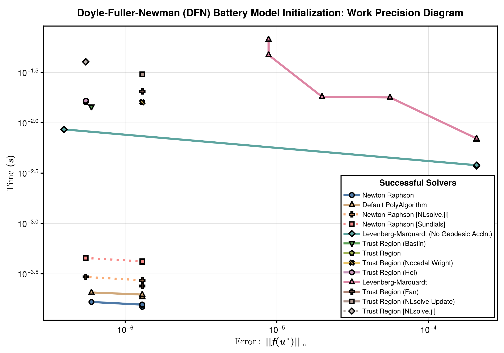

These benchmarks compares the runtime and error for a range of nonlinear solvers. The solvers are implemented in [NonlinearProblemLibrary.jl](https://github.com/SciML/DiffEqProblemLibrary.jl/blob/master/lib/NonlinearProblemLibrary/src/NonlinearProblemLibrary.jl), where you can find the problem function declarations. We test the following solvers:
- NonlinearSolve.jl's [Newton Raphson](https://docs.sciml.ai/NonlinearSolve/stable/api/nonlinearsolve/#NonlinearSolve.NewtonRaphson) method (`NewtonRaphson()`).
- NonlinearSolve.jl's [Newton trust region](https://docs.sciml.ai/NonlinearSolve/stable/api/nonlinearsolve/#NonlinearSolve.TrustRegion) method (`TrustRegion()`).
- NonlinearSolve.jl's Levenberg-Marquardt method (`LevenbergMarquardt()`).
- NonlinearSolve.jl's Broyden method (`Broyden()`).
- MINPACK's [Modified Powell](https://docs.sciml.ai/NonlinearSolve/stable/api/minpack/#NonlinearSolveMINPACK.CMINPACK) method (`CMINPACK(method=:hybr)`).
- MINPACK's [Levenberg-Marquardt](https://docs.sciml.ai/NonlinearSolve/stable/api/minpack/#NonlinearSolveMINPACK.CMINPACK) method (`CMINPACK(method=:lm)`).
- NLsolveJL's [Newton Raphson](https://docs.sciml.ai/NonlinearSolve/stable/api/nlsolve/#Solver-API) (`NLsolveJL(method=:newton)`).
- NLsolveJL's [Newton trust region](https://docs.sciml.ai/NonlinearSolve/stable/api/nlsolve/#Solver-API) (`NLsolveJL()`).
- NLsolveJL's [Anderson acceleration](https://docs.sciml.ai/NonlinearSolve/stable/api/nlsolve/#Solver-API) (`NLsolveJL(method=:anderson)`).
- Sundials's [Newton-Krylov](https://docs.sciml.ai/NonlinearSolve/stable/api/sundials/#Solver-API) method (`KINSOL()`).

# Setup

Fetch required packages.

```julia
using NonlinearSolve, LinearSolve, StaticArrays, Sundials, SpeedMapping,
    BenchmarkTools, LinearAlgebra, DiffEqDevTools, PolyesterForwardDiff, CairoMakie,
    RecursiveFactorization, Enzyme
import MINPACK, NLsolve, PETSc
import LineSearches

const RUS = RadiusUpdateSchemes;
```


Declare the benchmarked solvers (and their names and plotting options).

```julia
HagerZhang() = LineSearchesJL(; method = LineSearches.HagerZhang())
MoreThuente() = LineSearchesJL(; method = LineSearches.MoreThuente())

GC.enable(false) # for PETSc

solvers_all = [
    (; pkg = :nonlinearsolve,       name = "Default PolyAlgorithm",                                  solver = Dict(:alg => FastShortcutNonlinearPolyalg(; autodiff = AutoEnzyme()))),
    (; pkg = :nonlinearsolve,       name = "Newton Raphson",                                         solver = Dict(:alg => NewtonRaphson(; autodiff = AutoEnzyme()))),
    (; pkg = :nonlinearsolve,       name = "Newton Raphson (HagerZhang LineSearch)",                 solver = Dict(:alg => NewtonRaphson(; linesearch = HagerZhang(), autodiff = AutoEnzyme()))),
    (; pkg = :nonlinearsolve,       name = "Newton Raphson (MoreThuente LineSearch)",                solver = Dict(:alg => NewtonRaphson(; linesearch = MoreThuente(), autodiff = AutoEnzyme()))),
    (; pkg = :nonlinearsolve,       name = "Newton Raphson (BackTracking LineSearch)",               solver = Dict(:alg => NewtonRaphson(; linesearch = BackTracking(), autodiff = AutoEnzyme()))),
    (; pkg = :nonlinearsolve,       name = "Newton Krylov with GMRES",                               solver = Dict(:alg => NewtonRaphson(; linsolve = KrylovJL_GMRES(), autodiff = AutoEnzyme()))),
    (; pkg = :nonlinearsolve,       name = "DFSane",                                                 solver = Dict(:alg => DFSane())),
    (; pkg = :nonlinearsolve,       name = "Trust Region",                                           solver = Dict(:alg => TrustRegion(; autodiff = AutoEnzyme()))),
    (; pkg = :nonlinearsolve,       name = "Trust Region (NLsolve Update)",                          solver = Dict(:alg => TrustRegion(; radius_update_scheme = RUS.NLsolve, autodiff = AutoEnzyme()))),
    (; pkg = :nonlinearsolve,       name = "Trust Region (Nocedal Wright)",                          solver = Dict(:alg => TrustRegion(; radius_update_scheme = RUS.NocedalWright, autodiff = AutoEnzyme()))),
    (; pkg = :nonlinearsolve,       name = "Trust Region (Hei)",                                     solver = Dict(:alg => TrustRegion(; radius_update_scheme = RUS.Hei, autodiff = AutoEnzyme()))),
    (; pkg = :nonlinearsolve,       name = "Trust Region (Yuan)",                                    solver = Dict(:alg => TrustRegion(; radius_update_scheme = RUS.Yuan, autodiff = AutoEnzyme()))),
    (; pkg = :nonlinearsolve,       name = "Trust Region (Bastin)",                                  solver = Dict(:alg => TrustRegion(; radius_update_scheme = RUS.Bastin, autodiff = AutoEnzyme()))),
    (; pkg = :nonlinearsolve,       name = "Trust Region (Fan)",                                     solver = Dict(:alg => TrustRegion(; radius_update_scheme = RUS.Fan, autodiff = AutoEnzyme()))),
    (; pkg = :nonlinearsolve,       name = "Levenberg-Marquardt",                                    solver = Dict(:alg => LevenbergMarquardt(; autodiff = AutoEnzyme()))),
    (; pkg = :nonlinearsolve,       name = "Levenberg-Marquardt with Cholesky",                      solver = Dict(:alg => LevenbergMarquardt(; linsolve = CholeskyFactorization(), autodiff = AutoEnzyme()))),
    (; pkg = :nonlinearsolve,       name = "Levenberg-Marquardt (No Geodesic Accln.)",               solver = Dict(:alg => LevenbergMarquardt(; disable_geodesic = Val(true), autodiff = AutoEnzyme()))),
    (; pkg = :nonlinearsolve,       name = "Levenberg-Marquardt (No Geodesic Accln.) with Cholesky", solver = Dict(:alg => LevenbergMarquardt(; disable_geodesic = Val(true), linsolve = CholeskyFactorization(), autodiff = AutoEnzyme()))),

    (; pkg = :wrapper,              name = "Newton Raphson [Sundials]",                              solver = Dict(:alg => KINSOL(; linear_solver = :LapackDense, maxsetupcalls=1))),
    (; pkg = :wrapper,              name = "Newton Krylov [Sundials]",                               solver = Dict(:alg => KINSOL(; linear_solver = :GMRES, maxsetupcalls=1, krylov_dim = 1000))),
    (; pkg = :wrapper,              name = "Newton Raphson with LineSearch [Sundials]",              solver = Dict(:alg => KINSOL(; globalization_strategy = :LineSearch, maxsetupcalls=1))),

    (; pkg = :wrapper,              name = "Newton Raphson [NLsolve.jl]",                            solver = Dict(:alg => NLsolveJL(; method = :newton, autodiff = :forward))),
    (; pkg = :wrapper,              name = "Trust Region [NLsolve.jl]",                              solver = Dict(:alg => NLsolveJL(; autodiff = :forward))),

    (; pkg = :wrapper,              name = "Modified Powell [MINPACK]",                              solver = Dict(:alg => CMINPACK(; method = :hybr))),
    (; pkg = :wrapper,              name = "Levenberg-Marquardt [MINPACK]",                          solver = Dict(:alg => CMINPACK(; method = :lm))),

    (; pkg = :wrapper,              name = "Speed Mapping [SpeedMapping.jl]",                        solver = Dict(:alg => SpeedMappingJL())),

    (; pkg = :wrapper,              name = "Newton Raphson [PETSc]",                                 solver = Dict(:alg => PETScSNES(; snes_type = "newtonls", snes_linesearch_type = "basic"))),
    (; pkg = :wrapper,              name = "Newton Raphson with QR [PETSc]",                         solver = Dict(:alg => PETScSNES(; snes_type = "newtonls", snes_linesearch_type = "basic", pc_type = "qr"))),
    (; pkg = :wrapper,              name = "Newton Raphson with BackTracking [PETSc]",               solver = Dict(:alg => PETScSNES(; snes_type = "newtonls"))),
    (; pkg = :wrapper,              name = "Newton Raphson with BackTracking & QR [PETSc]",          solver = Dict(:alg => PETScSNES(; snes_type = "newtonls", pc_type = "qr"))),
    (; pkg = :wrapper,              name = "Trust Region [PETSc]",                                   solver = Dict(:alg => PETScSNES(; snes_type = "newtontr"))),
    (; pkg = :wrapper,              name = "Newton Krylov with GMRES [PETSc]",                       solver = Dict(:alg => PETScSNES(; snes_type = "newtonls", snes_linesearch_type = "basic", ksp_type = "gmres", ksp_gmres_restart = 1000))),
];
```


Setup the problem

```julia
function f!(out, u, p = nothing)
    out[1] = -u[33]
    out[2] = -u[32]
    out[3] = -u[31]
    out[4] = 1.9876764062810574e10(u[1] + u[4]) - 1.9876764062810574e10u[23]
    out[5] = -u[2] + (-1.5546404484393263e-11exp(-19.460872248113507(-0.4 - u[10] + u[26])))
    out[6] = -1.9876764062810574e10u[14] + 1.9876764062810574e10(u[3] + u[6])
    out[7] = -1.9876764062810574e10u[4] +
             114676.11822324689(-exp(-19.460872248113507(-0.6608489145760508 + u[25])) +
                                exp(19.460872248113507(-0.6608489145760508 + u[25])))
    out[8] = -1.9876764062810574e10u[12] + 1.9876764062810574e10(u[2] + u[5])
    out[9] = -1.9876764062810574e10u[6] +
             114676.1182232469(-exp(-19.460872248113507(-0.6608489145760508 - u[11] +
                                                        u[27])) +
                               exp(19.460872248113507(-0.6608489145760508 - u[11] + u[27])))
    out[10] = -4.284490145672665e10u[19] + 4.284490145672665e10(u[31] + u[7])
    out[11] = -4.284490145672665e10u[21] + 4.284490145672665e10(u[32] + u[8])
    out[12] = -4.284490145672665e10u[22] + 4.284490145672665e10(u[33] + u[9])
    out[13] = 0.025692579121085843(7.680104664733624e7(u[10] - u[11]) +
                                   7.680104664733624e7u[10]) - 1.793773306620288e9u[12]
    out[14] = -u[3] +
              (-1.5546404484393263e-11exp(-19.460872248113507(-0.4 - u[11] + u[27])))
    out[15] = -1.9876764062810574e10u[5] +
              114676.1182232469(-exp(-19.460872248113507(-0.6608489145760506 - u[10] +
                                                         u[26])) +
                                exp(19.460872248113507(-0.6608489145760506 - u[10] +
                                                       u[26])))
    out[16] = 0.025692579121085843(7.680104664733624e7(-u[10] + u[11]) +
                                   1.4529008434739566e8(u[11] - u[13])) -
              1.793773306620288e9u[14]
    out[17] = -1.793773306620288e9u[14] - 1.4404300298567445e9(-u[26] + u[27])
    out[18] = 0.025692579121085843(5.1142109690283257e8(-u[11] + u[13]) +
                                   4.7254130462088e9(u[13] - u[15]))
    out[19] = 0.025692579121085843(4.7254130462088e9(-u[13] + u[15]) +
                                   4.7254130462088e9(u[15] - u[16]))
    out[20] = 0.025692579121085843(4.7254130462088e9(-u[15] + u[16]) +
                                   2.3040372207628164e8(u[16] - u[17]))
    out[21] = 0.025692579121085843(7.200116314883803e7(-u[16] + u[17]) +
                                   3.6900178974461965e7(u[17] - u[18])) -
              2.193876971198113e9u[19]
    out[22] = -4.284490145672665e10u[7] +
              147554.10828979727(-exp(-19.460872248113507(-3.3618450059739535 - u[17] +
                                                          u[28])) +
                                 exp(19.460872248113507(-3.3618450059739535 - u[17] +
                                                        u[28])))
    out[23] = 0.025692579121085843(3.6900178974461965e7(-u[17] + u[18]) +
                                   3.6900178974461965e7(u[18] - u[20])) -
              2.193876971198113e9u[21]
    out[24] = -4.284490145672665e10u[8] +
              147554.10828979727(-exp(-19.460872248113507(-3.3618450059739535 - u[18] +
                                                          u[29])) +
                                 exp(19.460872248113507(-3.3618450059739535 - u[18] +
                                                        u[29])))
    out[25] = 948060.7678835923(-u[18] + u[20]) - 2.193876971198113e9u[22]
    out[26] = -u[1] + (-1.5546404484393263e-11exp(-19.460872248113507(-0.4 + u[25])))
    out[27] = -2.193876971198113e9u[22] +
              0.025692579121085843(-37499.99999999999u[24] -
                                   8.296874999999998e10(-u[29] + u[30]))
    out[28] = -1.793773306620288e9u[23] +
              0.025692579121085843(34090.90909090909u[24] -
                                   5.6064049586776855e10(u[25] - u[26]))
    out[29] = -1.793773306620288e9u[12] +
              0.025692579121085843(-5.6064049586776855e10(-u[25] + u[26]) -
                                   5.6064049586776855e10(u[26] - u[27]))
    out[30] = -2.193876971198113e9u[19] - 2.1316811739525905e9(u[28] - u[29])
    out[31] = -2.193876971198113e9u[21] +
              0.025692579121085843(-8.296874999999998e10(-u[28] + u[29]) -
                                   8.296874999999998e10(u[29] - u[30]))
    out[32] = -4.284490145672665e10u[9] +
              147554.10828979727(-exp(-19.460872248113507(-3.3618450059739535 - u[20] +
                                                          u[30])) +
                                 exp(19.460872248113507(-3.3618450059739535 - u[20] +
                                                        u[30])))
    out[33] = 292.3000724036127 + u[24]
    nothing
end

n = 1
x_sol = [
    -3.889310081682032e-13,
    -5.690845522092043e-13,
    -1.4900105367898274e-12,
    -2.1680981422696e-5,
    -3.284624075480569e-5,
    -8.820027287447222e-5,
    9.53999632159426e-5,
    2.1138249693289567e-5,
    1.1829446876191545e-5,
    0.019709320908045884,
    0.06927785744111935,
    -3.2846241323890243e-5,
    0.13786323434647954,
    -8.820027436448276e-5,
    0.14528607936456214,
    0.15270892438264475,
    0.3049460860584471,
    0.3812355737657502,
    9.53999632159426e-5,
    0.40860971681949443,
    2.1138249693289567e-5,
    1.1829446876191545e-5,
    -2.1680981811627007e-5,
    -292.3000724036127,
    0.5895178515117894,
    0.5896685912243755,
    0.5897784273806014,
    3.837532182598256,
    3.8376303660343676,
    3.837750304468262,
    0.0,
    0.0,
    0.0,
]
x_start = zeros(length(x_sol))
x_start[25:27] .= 0.6608489145760508
x_start[28:30] .= 3.3618450059739433

dict = Dict("n" => n, "start" => x_start, "sol" => x_sol, "title" => "Doyle-Fuller-Newman (DFN) Battery Model Initialization")

testcase = (; prob = NonlinearProblem(f!, dict["start"]), true_sol = dict["sol"])
```

```
(prob = SciMLBase.NonlinearProblem{Vector{Float64}, true, SciMLBase.NullPar
ameters, SciMLBase.NonlinearFunction{true, SciMLBase.FullSpecialize, typeof
(Main.var"##WeaveSandBox#225".f!), LinearAlgebra.UniformScaling{Bool}, Noth
ing, Nothing, Nothing, Nothing, Nothing, Nothing, Nothing, Nothing, Nothing
, Nothing, typeof(SciMLBase.DEFAULT_OBSERVED_NO_TIME), Nothing, Nothing, No
thing, Nothing}, Base.Pairs{Symbol, Union{}, Tuple{}, @NamedTuple{}}, SciML
Base.StandardNonlinearProblem}(SciMLBase.NonlinearFunction{true, SciMLBase.
FullSpecialize, typeof(Main.var"##WeaveSandBox#225".f!), LinearAlgebra.Unif
ormScaling{Bool}, Nothing, Nothing, Nothing, Nothing, Nothing, Nothing, Not
hing, Nothing, Nothing, Nothing, typeof(SciMLBase.DEFAULT_OBSERVED_NO_TIME)
, Nothing, Nothing, Nothing, Nothing}(Main.var"##WeaveSandBox#225".f!, Line
arAlgebra.UniformScaling{Bool}(true), nothing, nothing, nothing, nothing, n
othing, nothing, nothing, nothing, nothing, nothing, SciMLBase.DEFAULT_OBSE
RVED_NO_TIME, nothing, nothing, nothing, nothing), [0.0, 0.0, 0.0, 0.0, 0.0
, 0.0, 0.0, 0.0, 0.0, 0.0  …  0.0, 0.6608489145760508, 0.6608489145760508, 
0.6608489145760508, 3.3618450059739433, 3.3618450059739433, 3.3618450059739
433, 0.0, 0.0, 0.0], SciMLBase.NullParameters(), SciMLBase.StandardNonlinea
rProblem(), Base.Pairs{Symbol, Union{}, Tuple{}, @NamedTuple{}}()), true_so
l = [-3.889310081682032e-13, -5.690845522092043e-13, -1.4900105367898274e-1
2, -2.1680981422696e-5, -3.284624075480569e-5, -8.820027287447222e-5, 9.539
99632159426e-5, 2.1138249693289567e-5, 1.1829446876191545e-5, 0.01970932090
8045884  …  -292.3000724036127, 0.5895178515117894, 0.5896685912243755, 0.5
897784273806014, 3.837532182598256, 3.8376303660343676, 3.837750304468262, 
0.0, 0.0, 0.0])
```


Sets tolerances.
```julia
abstols = 1.0 ./ 10.0 .^ (3:0.5:6)
reltols = 1.0 ./ 10.0 .^ (3:0.5:6);
```


Prepares various helper functions for benchmarking a specific problem.

```julia
function log_msg(msg; kwargs...)
    if startswith(msg, "[Info]")
        @info msg
    elseif startswith(msg, "[Warn]")
        @warn msg
    elseif startswith(msg, "[Error]")
        @error msg
    else
        @info msg
    end
    Base.printstyled(msg; kwargs...)
    return
end

function check_solver(prob, solver)
    try
        sol = solve(prob.prob, solver.solver[:alg]; abstol = 1e-4, reltol = 1e-4,
            maxiters = 10000)
        err = norm(sol.resid, Inf)
        if !SciMLBase.successful_retcode(sol.retcode)
            log_msg("[Warn] Solver $(solver.name) returned retcode $(sol.retcode) with an residual norm = $(norm(sol.resid)).\n";
                color = :red)
            return false
        elseif err > 1e3
            log_msg("[Warn] Solver $(solver.name) had a very large residual (norm = $(norm(sol.resid))).\n";
                color = :red)
            return false
        elseif isinf(err) || isnan(err)
            log_msg("[Warn] Solver $(solver.name) had a residual of $(err).\n";
                color = :red)
            return false
        end
        log_msg("[Info] Solver $(solver.name) successfully solved the problem (norm = $(norm(sol.resid))).\n";
            color = :green)
    catch e
        log_msg("[Warn] Solver $(solver.name) threw an error: $e.\n"; color = :red)
        return false
    end
    return true
end

function generate_wpset(prob, solvers)
    # Finds the solvers that can solve the problem
    successful_solvers = filter(solver -> check_solver(prob, solver), solvers)

    return WorkPrecisionSet(prob.prob, abstols, reltols,
        getfield.(successful_solvers, :solver);
        names = getfield.(successful_solvers, :name), numruns = 50, error_estimate = :l∞,
        maxiters = 10000, verbose = true), successful_solvers
end
```

```
generate_wpset (generic function with 1 method)
```


# Benchmarks

We here run benchmarks for each of the solvers.

## Problem

```julia
wp_set, successful_solvers = generate_wpset(testcase, solvers_all);
```

```
[Info] Solver Default PolyAlgorithm successfully solved the problem (norm =
 6.873263901879305e-7).
[Info] Solver Newton Raphson successfully solved the problem (norm = 6.8732
63901879305e-7).
[Warn] Solver Newton Raphson (HagerZhang LineSearch) returned retcode MaxIt
ers with an residual norm = 196.34346036740192.
[Warn] Solver Newton Raphson (MoreThuente LineSearch) returned retcode MaxI
ters with an residual norm = 208.5652309391303.
[Warn] Solver Newton Raphson (BackTracking LineSearch) returned retcode Max
Iters with an residual norm = 205.06578079222734.
[Warn] Solver Newton Krylov with GMRES returned retcode Unstable with an re
sidual norm = 292.3000724036127.
[Warn] Solver DFSane returned retcode Stalled with an residual norm = 292.3
000724036127.
[Info] Solver Trust Region successfully solved the problem (norm = 6.872270
361936761e-7).
[Info] Solver Trust Region (NLsolve Update) successfully solved the problem
 (norm = 1.5941067952647038e-6).
[Info] Solver Trust Region (Nocedal Wright) successfully solved the problem
 (norm = 1.5975778400433118e-6).
[Info] Solver Trust Region (Hei) successfully solved the problem (norm = 7.
519526738477069e-7).
[Warn] Solver Trust Region (Yuan) returned retcode MaxIters with an residua
l norm = 113.84632713639361.
[Info] Solver Trust Region (Bastin) successfully solved the problem (norm =
 7.519429969828888e-7).
[Info] Solver Trust Region (Fan) successfully solved the problem (norm = 7.
521250038372895e-7).
[Info] Solver Levenberg-Marquardt successfully solved the problem (norm = 4
.499321910053797e-5).
[Warn] Solver Levenberg-Marquardt with Cholesky returned retcode Stalled wi
th an residual norm = 0.00031107899809173877.
[Info] Solver Levenberg-Marquardt (No Geodesic Accln.) successfully solved 
the problem (norm = 1.038807789853399e-6).
[Warn] Solver Levenberg-Marquardt (No Geodesic Accln.) with Cholesky return
ed retcode InternalLinearSolveFailed with an residual norm = 0.000301546850
14697813.
[Info] Solver Newton Raphson [Sundials] successfully solved the problem (no
rm = 1.6205733409240167e-6).
[Warn] Solver Newton Krylov [Sundials] had a very large residual (norm = In
f).
[Warn] Solver Newton Raphson with LineSearch [Sundials] returned retcode Fa
ilure with an residual norm = 203.8024932082229.
[Info] Solver Newton Raphson [NLsolve.jl] successfully solved the problem (
norm = 1.5941104186169045e-6).
[Info] Solver Trust Region [NLsolve.jl] successfully solved the problem (no
rm = 6.940612093440701e-7).
[Warn] Solver Modified Powell [MINPACK] returned retcode Failure with an re
sidual norm = 292.3000724036127.
[Warn] Solver Levenberg-Marquardt [MINPACK] returned retcode Failure with a
n residual norm = 292.3000724036127.
[Warn] Solver Speed Mapping [SpeedMapping.jl] returned retcode Failure with
 an residual norm = 1.8355122321179187e92.
[Warn] Solver Newton Raphson [PETSc] returned retcode Failure with an resid
ual norm = 8.918598151838181e8.
[Warn] Solver Newton Raphson with QR [PETSc] returned retcode Failure with 
an residual norm = 9.003593553788315e8.
[Warn] Solver Newton Raphson with BackTracking [PETSc] returned retcode Fai
lure with an residual norm = 280.83522493021263.
[Warn] Solver Newton Raphson with BackTracking & QR [PETSc] returned retcod
e Failure with an residual norm = 280.8407454935218.
[Warn] Solver Trust Region [PETSc] returned retcode Failure with an residua
l norm = 202.00730475517162.
[Warn] Solver Newton Krylov with GMRES [PETSc] returned retcode Failure wit
h an residual norm = 8.918598151838181e8.
```


## Plot and Save the Plot

```julia
fig = begin
    LINESTYLES = Dict(:nonlinearsolve => :solid, :simplenonlinearsolve => :dash,
        :wrapper => :dot)
    ASPECT_RATIO = 0.7
    WIDTH = 1200
    HEIGHT = round(Int, WIDTH * ASPECT_RATIO)
    STROKEWIDTH = 2.5

    colors = cgrad(:tableau_20, length(successful_solvers); categorical = true)
    cycle = Cycle([:marker], covary = true)
    plot_theme = Theme(Lines = (; cycle), Scatter = (; cycle))

    idxs = sortperm(median.(getfield.(wp_set.wps, :times)))

    with_theme(plot_theme) do
        fig = Figure(; size = (WIDTH, HEIGHT))
        # `textbf` doesn't work
        ax = Axis(fig[1, 1], ylabel = L"Time $\mathbf{(s)}$",
            xlabelsize = 22, ylabelsize = 22,
            xlabel = L"Error: $\mathbf{||f(u^\ast)||_\infty}$",
            xscale = log10, yscale = log10, xtickwidth = STROKEWIDTH,
            ytickwidth = STROKEWIDTH, spinewidth = STROKEWIDTH,
            xticklabelsize = 20, yticklabelsize = 20)

        ls, scs = [], []

        for (i, (wp, solver)) in enumerate(zip(wp_set.wps[idxs], successful_solvers[idxs]))
            (; name, times, errors) = wp
            errors = [err.l∞ for err in errors]
            l = lines!(ax, errors, times; linestyle = LINESTYLES[solver.pkg], label = name,
                linewidth = 5, color = colors[i])
            sc = scatter!(ax, errors, times; label = name, markersize = 16, strokewidth = 3,
                color = colors[i])
            push!(ls, l)
            push!(scs, sc)
        end

        axislegend(ax, [[l, sc] for (l, sc) in zip(ls, scs)],
            [solver.name for solver in successful_solvers[idxs]], "Successful Solvers";
            framevisible=true, framewidth = STROKEWIDTH, orientation = :vertical,
            titlesize = 20, nbanks = 1, labelsize = 16,#  margin = (0.0, 80.0, 0.0, 0.0),
            tellheight = false, tellwidth = true, patchsize = (40.0f0, 20.0f0),
            position = :rb)

        fig[0, :] = Label(fig, "Doyle-Fuller-Newman (DFN) Battery Model Initialization: Work Precision Diagram",
            fontsize = 24, tellwidth = false, font = :bold)

        fig
    end
end
```



```julia
save("battery_problem_work_precision.svg", fig)
```

```
CairoMakie.Screen{SVG}
```


## Summary of successful solvers

Finally, we print a summary of which solvers successfully solved which problems.

```julia
solver_successes = [(solver in successful_solvers) ? "✔" : "✖" for solver in solvers_all];
```


```julia
using PrettyTables
io = IOBuffer()
println(io, "```@raw html")
pretty_table(io, reshape(solver_successes, 1, :); backend = Val(:html),
    header = getfield.(solvers_all, :name), alignment=:c)
println(io, "```")
Docs.Text(String(take!(io)))
```

```@raw html
<table>
  <thead>
    <tr class = "header headerLastRow">
      <th style = "text-align: center;">Default PolyAlgorithm</th>
      <th style = "text-align: center;">Newton Raphson</th>
      <th style = "text-align: center;">Newton Raphson (HagerZhang LineSearch)</th>
      <th style = "text-align: center;">Newton Raphson (MoreThuente LineSearch)</th>
      <th style = "text-align: center;">Newton Raphson (BackTracking LineSearch)</th>
      <th style = "text-align: center;">Newton Krylov with GMRES</th>
      <th style = "text-align: center;">DFSane</th>
      <th style = "text-align: center;">Trust Region</th>
      <th style = "text-align: center;">Trust Region (NLsolve Update)</th>
      <th style = "text-align: center;">Trust Region (Nocedal Wright)</th>
      <th style = "text-align: center;">Trust Region (Hei)</th>
      <th style = "text-align: center;">Trust Region (Yuan)</th>
      <th style = "text-align: center;">Trust Region (Bastin)</th>
      <th style = "text-align: center;">Trust Region (Fan)</th>
      <th style = "text-align: center;">Levenberg-Marquardt</th>
      <th style = "text-align: center;">Levenberg-Marquardt with Cholesky</th>
      <th style = "text-align: center;">Levenberg-Marquardt (No Geodesic Accln.)</th>
      <th style = "text-align: center;">Levenberg-Marquardt (No Geodesic Accln.) with Cholesky</th>
      <th style = "text-align: center;">Newton Raphson [Sundials]</th>
      <th style = "text-align: center;">Newton Krylov [Sundials]</th>
      <th style = "text-align: center;">Newton Raphson with LineSearch [Sundials]</th>
      <th style = "text-align: center;">Newton Raphson [NLsolve.jl]</th>
      <th style = "text-align: center;">Trust Region [NLsolve.jl]</th>
      <th style = "text-align: center;">Modified Powell [MINPACK]</th>
      <th style = "text-align: center;">Levenberg-Marquardt [MINPACK]</th>
      <th style = "text-align: center;">Speed Mapping [SpeedMapping.jl]</th>
      <th style = "text-align: center;">Newton Raphson [PETSc]</th>
      <th style = "text-align: center;">Newton Raphson with QR [PETSc]</th>
      <th style = "text-align: center;">Newton Raphson with BackTracking [PETSc]</th>
      <th style = "text-align: center;">Newton Raphson with BackTracking &amp; QR [PETSc]</th>
      <th style = "text-align: center;">Trust Region [PETSc]</th>
      <th style = "text-align: center;">Newton Krylov with GMRES [PETSc]</th>
    </tr>
  </thead>
  <tbody>
    <tr>
      <td style = "text-align: center;">✔</td>
      <td style = "text-align: center;">✔</td>
      <td style = "text-align: center;">✖</td>
      <td style = "text-align: center;">✖</td>
      <td style = "text-align: center;">✖</td>
      <td style = "text-align: center;">✖</td>
      <td style = "text-align: center;">✖</td>
      <td style = "text-align: center;">✔</td>
      <td style = "text-align: center;">✔</td>
      <td style = "text-align: center;">✔</td>
      <td style = "text-align: center;">✔</td>
      <td style = "text-align: center;">✖</td>
      <td style = "text-align: center;">✔</td>
      <td style = "text-align: center;">✔</td>
      <td style = "text-align: center;">✔</td>
      <td style = "text-align: center;">✖</td>
      <td style = "text-align: center;">✔</td>
      <td style = "text-align: center;">✖</td>
      <td style = "text-align: center;">✔</td>
      <td style = "text-align: center;">✖</td>
      <td style = "text-align: center;">✖</td>
      <td style = "text-align: center;">✔</td>
      <td style = "text-align: center;">✔</td>
      <td style = "text-align: center;">✖</td>
      <td style = "text-align: center;">✖</td>
      <td style = "text-align: center;">✖</td>
      <td style = "text-align: center;">✖</td>
      <td style = "text-align: center;">✖</td>
      <td style = "text-align: center;">✖</td>
      <td style = "text-align: center;">✖</td>
      <td style = "text-align: center;">✖</td>
      <td style = "text-align: center;">✖</td>
    </tr>
  </tbody>
</table>
```


## Appendix

These benchmarks are a part of the SciMLBenchmarks.jl repository, found at: [https://github.com/SciML/SciMLBenchmarks.jl](https://github.com/SciML/SciMLBenchmarks.jl). For more information on high-performance scientific machine learning, check out the SciML Open Source Software Organization [https://sciml.ai](https://sciml.ai).

To locally run this benchmark, do the following commands:

```
using SciMLBenchmarks
SciMLBenchmarks.weave_file("benchmarks/NonlinearProblem","nonlinear_battery_problem.jmd")
```

Computer Information:

```
Julia Version 1.10.9
Commit 5595d20a287 (2025-03-10 12:51 UTC)
Build Info:
  Official https://julialang.org/ release
Platform Info:
  OS: Linux (x86_64-linux-gnu)
  CPU: 128 × AMD EPYC 7502 32-Core Processor
  WORD_SIZE: 64
  LIBM: libopenlibm
  LLVM: libLLVM-15.0.7 (ORCJIT, znver2)
Threads: 128 default, 0 interactive, 64 GC (on 128 virtual cores)
Environment:
  JULIA_CPU_THREADS = 128
  JULIA_DEPOT_PATH = /cache/julia-buildkite-plugin/depots/5b300254-1738-4989-ae0a-f4d2d937f953

```

Package Information:

```
Status `/cache/build/exclusive-amdci3-0/julialang/scimlbenchmarks-dot-jl/benchmarks/NonlinearProblem/Project.toml`
  [2169fc97] AlgebraicMultigrid v1.0.0
  [6e4b80f9] BenchmarkTools v1.6.0
  [13f3f980] CairoMakie v0.13.4
  [2b5f629d] DiffEqBase v6.167.2
  [f3b72e0c] DiffEqDevTools v2.48.0
  [a0c0ee7d] DifferentiationInterface v0.6.52
⌃ [7da242da] Enzyme v0.13.37
  [40713840] IncompleteLU v0.2.1
  [b964fa9f] LaTeXStrings v1.4.0
  [d3d80556] LineSearches v7.3.0
  [7ed4a6bd] LinearSolve v3.8.0
  [4854310b] MINPACK v1.3.0
  [2774e3e8] NLsolve v4.5.1
  [b7050fa9] NonlinearProblemLibrary v0.1.3
  [8913a72c] NonlinearSolve v4.6.0
  [ace2c81b] PETSc v0.3.1
  [98d1487c] PolyesterForwardDiff v0.1.3
  [08abe8d2] PrettyTables v2.4.0
  [f2c3362d] RecursiveFactorization v0.2.23
  [31c91b34] SciMLBenchmarks v0.1.3
  [efcf1570] Setfield v1.1.2
  [727e6d20] SimpleNonlinearSolve v2.2.2
  [9f842d2f] SparseConnectivityTracer v0.6.17
  [0a514795] SparseMatrixColorings v0.4.18
  [f1835b91] SpeedMapping v0.3.0
  [860ef19b] StableRNGs v1.0.2
  [90137ffa] StaticArrays v1.9.13
  [c3572dad] Sundials v4.28.0
  [0c5d862f] Symbolics v6.38.0
Info Packages marked with ⌃ have new versions available and may be upgradable.
```

And the full manifest:

```
Status `/cache/build/exclusive-amdci3-0/julialang/scimlbenchmarks-dot-jl/benchmarks/NonlinearProblem/Manifest.toml`
  [47edcb42] ADTypes v1.14.0
  [a4c015fc] ANSIColoredPrinters v0.0.1
  [621f4979] AbstractFFTs v1.5.0
  [1520ce14] AbstractTrees v0.4.5
  [7d9f7c33] Accessors v0.1.42
  [22286c92] AccurateArithmetic v0.3.8
  [79e6a3ab] Adapt v4.3.0
  [35492f91] AdaptivePredicates v1.2.0
  [2169fc97] AlgebraicMultigrid v1.0.0
  [66dad0bd] AliasTables v1.1.3
  [27a7e980] Animations v0.4.2
  [4fba245c] ArrayInterface v7.18.0
  [4c555306] ArrayLayouts v1.11.1
  [67c07d97] Automa v1.1.0
  [13072b0f] AxisAlgorithms v1.1.0
  [39de3d68] AxisArrays v0.4.7
  [6e4b80f9] BenchmarkTools v1.6.0
  [e2ed5e7c] Bijections v0.1.9
  [d1d4a3ce] BitFlags v0.1.9
  [62783981] BitTwiddlingConvenienceFunctions v0.1.6
  [70df07ce] BracketingNonlinearSolve v1.1.3
  [fa961155] CEnum v0.5.0
  [2a0fbf3d] CPUSummary v0.2.6
  [159f3aea] Cairo v1.1.1
  [13f3f980] CairoMakie v0.13.4
  [d360d2e6] ChainRulesCore v1.25.1
  [fb6a15b2] CloseOpenIntervals v0.1.13
  [944b1d66] CodecZlib v0.7.8
  [a2cac450] ColorBrewer v0.4.1
  [35d6a980] ColorSchemes v3.29.0
  [3da002f7] ColorTypes v0.12.1
  [c3611d14] ColorVectorSpace v0.11.0
  [5ae59095] Colors v0.13.0
  [861a8166] Combinatorics v1.0.2
  [38540f10] CommonSolve v0.2.4
  [bbf7d656] CommonSubexpressions v0.3.1
  [f70d9fcc] CommonWorldInvalidations v1.0.0
  [34da2185] Compat v4.16.0
  [b152e2b5] CompositeTypes v0.1.4
  [a33af91c] CompositionsBase v0.1.2
  [2569d6c7] ConcreteStructs v0.2.3
  [f0e56b4a] ConcurrentUtilities v2.5.0
  [8f4d0f93] Conda v1.10.2
  [187b0558] ConstructionBase v1.5.8
  [d38c429a] Contour v0.6.3
  [a2441757] Coverage v1.6.1
  [c36e975a] CoverageTools v1.3.2
  [adafc99b] CpuId v0.3.1
  [a8cc5b0e] Crayons v4.1.1
  [9a962f9c] DataAPI v1.16.0
  [864edb3b] DataStructures v0.18.22
  [e2d170a0] DataValueInterfaces v1.0.0
  [927a84f5] DelaunayTriangulation v1.6.4
  [2b5f629d] DiffEqBase v6.167.2
  [f3b72e0c] DiffEqDevTools v2.48.0
  [77a26b50] DiffEqNoiseProcess v5.24.1
  [163ba53b] DiffResults v1.1.0
  [b552c78f] DiffRules v1.15.1
  [a0c0ee7d] DifferentiationInterface v0.6.52
  [b4f34e82] Distances v0.10.12
  [31c24e10] Distributions v0.25.119
  [ffbed154] DocStringExtensions v0.9.4
  [e30172f5] Documenter v1.10.1
  [35a29f4d] DocumenterTools v0.1.20
  [5b8099bc] DomainSets v0.7.15
  [7c1d4256] DynamicPolynomials v0.6.1
  [4e289a0a] EnumX v1.0.5
⌃ [7da242da] Enzyme v0.13.37
  [f151be2c] EnzymeCore v0.8.8
  [429591f6] ExactPredicates v2.2.8
  [460bff9d] ExceptionUnwrapping v0.1.11
  [e2ba6199] ExprTools v0.1.10
  [55351af7] ExproniconLite v0.10.14
  [411431e0] Extents v0.1.5
  [7a1cc6ca] FFTW v1.8.1
  [7034ab61] FastBroadcast v0.3.5
  [9aa1b823] FastClosures v0.3.2
  [a4df4552] FastPower v1.1.2
  [5789e2e9] FileIO v1.17.0
⌅ [8fc22ac5] FilePaths v0.8.3
  [48062228] FilePathsBase v0.9.24
  [1a297f60] FillArrays v1.13.0
  [6a86dc24] FiniteDiff v2.27.0
  [53c48c17] FixedPointNumbers v0.8.5
  [1fa38f19] Format v1.3.7
⌅ [f6369f11] ForwardDiff v0.10.38
  [b38be410] FreeType v4.1.1
  [663a7486] FreeTypeAbstraction v0.10.6
  [069b7b12] FunctionWrappers v1.1.3
  [77dc65aa] FunctionWrappersWrappers v0.1.3
  [46192b85] GPUArraysCore v0.2.0
  [61eb1bfa] GPUCompiler v1.3.2
  [68eda718] GeoFormatTypes v0.4.4
  [cf35fbd7] GeoInterface v1.4.1
  [5c1252a2] GeometryBasics v0.5.7
  [d7ba0133] Git v1.3.1
  [a2bd30eb] Graphics v1.1.3
  [3955a311] GridLayoutBase v0.11.1
  [42e2da0e] Grisu v1.0.2
  [708ec375] Gumbo v0.8.3
  [cd3eb016] HTTP v1.10.16
  [eafb193a] Highlights v0.5.3
  [3e5b6fbb] HostCPUFeatures v0.1.17
  [34004b35] HypergeometricFunctions v0.3.28
  [7073ff75] IJulia v1.27.0
  [b5f81e59] IOCapture v0.2.5
  [615f187c] IfElse v0.1.1
  [2803e5a7] ImageAxes v0.6.12
  [c817782e] ImageBase v0.1.7
  [a09fc81d] ImageCore v0.10.5
  [82e4d734] ImageIO v0.6.9
  [bc367c6b] ImageMetadata v0.9.10
  [40713840] IncompleteLU v0.2.1
  [9b13fd28] IndirectArrays v1.0.0
  [d25df0c9] Inflate v0.1.5
  [18e54dd8] IntegerMathUtils v0.1.2
  [a98d9a8b] Interpolations v0.15.1
  [d1acc4aa] IntervalArithmetic v0.22.29
  [8197267c] IntervalSets v0.7.10
  [3587e190] InverseFunctions v0.1.17
  [92d709cd] IrrationalConstants v0.2.4
  [f1662d9f] Isoband v0.1.1
  [c8e1da08] IterTools v1.10.0
  [82899510] IteratorInterfaceExtensions v1.0.0
  [692b3bcd] JLLWrappers v1.7.0
  [682c06a0] JSON v0.21.4
  [ae98c720] Jieko v0.2.1
  [b835a17e] JpegTurbo v0.1.6
  [5ab0869b] KernelDensity v0.6.9
  [ba0b0d4f] Krylov v0.10.0
  [929cbde3] LLVM v9.2.0
  [b964fa9f] LaTeXStrings v1.4.0
  [23fbe1c1] Latexify v0.16.7
  [10f19ff3] LayoutPointers v0.1.17
  [0e77f7df] LazilyInitializedFields v1.3.0
  [5078a376] LazyArrays v2.6.1
  [8cdb02fc] LazyModules v0.3.1
  [87fe0de2] LineSearch v0.1.4
  [d3d80556] LineSearches v7.3.0
  [7ed4a6bd] LinearSolve v3.8.0
  [2ab3a3ac] LogExpFunctions v0.3.29
  [e6f89c97] LoggingExtras v1.1.0
  [bdcacae8] LoopVectorization v0.12.172
  [4854310b] MINPACK v1.3.0
  [da04e1cc] MPI v0.20.22
  [3da0fdf6] MPIPreferences v0.1.11
  [1914dd2f] MacroTools v0.5.16
  [ee78f7c6] Makie v0.22.4
  [20f20a25] MakieCore v0.9.2
  [d125e4d3] ManualMemory v0.1.8
  [dbb5928d] MappedArrays v0.4.2
  [d0879d2d] MarkdownAST v0.1.2
  [0a4f8689] MathTeXEngine v0.6.3
  [bb5d69b7] MaybeInplace v0.1.4
  [739be429] MbedTLS v1.1.9
  [e1d29d7a] Missings v1.2.0
  [e94cdb99] MosaicViews v0.3.4
  [2e0e35c7] Moshi v0.3.5
  [46d2c3a1] MuladdMacro v0.2.4
  [102ac46a] MultivariatePolynomials v0.5.7
  [ffc61752] Mustache v1.0.20
  [d8a4904e] MutableArithmetics v1.6.4
  [d41bc354] NLSolversBase v7.9.1
  [2774e3e8] NLsolve v4.5.1
  [77ba4419] NaNMath v1.1.3
  [f09324ee] Netpbm v1.1.1
  [b7050fa9] NonlinearProblemLibrary v0.1.3
  [8913a72c] NonlinearSolve v4.6.0
  [be0214bd] NonlinearSolveBase v1.5.3
  [5959db7a] NonlinearSolveFirstOrder v1.3.1
  [9a2c21bd] NonlinearSolveQuasiNewton v1.2.1
  [26075421] NonlinearSolveSpectralMethods v1.1.1
  [d8793406] ObjectFile v0.4.4
  [510215fc] Observables v0.5.5
  [6fe1bfb0] OffsetArrays v1.17.0
  [52e1d378] OpenEXR v0.3.3
  [4d8831e6] OpenSSL v1.4.3
  [429524aa] Optim v1.12.0
  [bac558e1] OrderedCollections v1.8.0
  [90014a1f] PDMats v0.11.34
  [ace2c81b] PETSc v0.3.1
  [f57f5aa1] PNGFiles v0.4.4
  [19eb6ba3] Packing v0.5.1
  [5432bcbf] PaddedViews v0.5.12
  [d96e819e] Parameters v0.12.3
  [69de0a69] Parsers v2.8.2
  [eebad327] PkgVersion v0.3.3
  [995b91a9] PlotUtils v1.4.3
  [e409e4f3] PoissonRandom v0.4.4
  [f517fe37] Polyester v0.7.16
  [98d1487c] PolyesterForwardDiff v0.1.3
  [1d0040c9] PolyesterWeave v0.2.2
  [647866c9] PolygonOps v0.1.2
  [85a6dd25] PositiveFactorizations v0.2.4
⌅ [aea7be01] PrecompileTools v1.2.1
  [21216c6a] Preferences v1.4.3
  [08abe8d2] PrettyTables v2.4.0
  [27ebfcd6] Primes v0.5.7
  [92933f4c] ProgressMeter v1.10.4
  [43287f4e] PtrArrays v1.3.0
  [4b34888f] QOI v1.0.1
  [1fd47b50] QuadGK v2.11.2
  [74087812] Random123 v1.7.0
  [e6cf234a] RandomNumbers v1.6.0
  [b3c3ace0] RangeArrays v0.3.2
  [c84ed2f1] Ratios v0.4.5
  [3cdcf5f2] RecipesBase v1.3.4
  [731186ca] RecursiveArrayTools v3.31.2
  [f2c3362d] RecursiveFactorization v0.2.23
  [189a3867] Reexport v1.2.2
  [2792f1a3] RegistryInstances v0.1.0
  [05181044] RelocatableFolders v1.0.1
  [ae029012] Requires v1.3.1
  [ae5879a3] ResettableStacks v1.1.1
  [79098fc4] Rmath v0.8.0
  [47965b36] RootedTrees v2.23.1
  [5eaf0fd0] RoundingEmulator v0.2.1
  [7e49a35a] RuntimeGeneratedFunctions v0.5.13
  [fdea26ae] SIMD v3.7.1
  [94e857df] SIMDTypes v0.1.0
  [476501e8] SLEEFPirates v0.6.43
  [322a6be2] Sass v0.2.0
  [0bca4576] SciMLBase v2.84.0
  [31c91b34] SciMLBenchmarks v0.1.3
  [19f34311] SciMLJacobianOperators v0.1.2
  [c0aeaf25] SciMLOperators v0.3.13
  [53ae85a6] SciMLStructures v1.7.0
  [6c6a2e73] Scratch v1.2.1
  [efcf1570] Setfield v1.1.2
  [65257c39] ShaderAbstractions v0.5.0
  [992d4aef] Showoff v1.0.3
  [73760f76] SignedDistanceFields v0.4.0
  [777ac1f9] SimpleBufferStream v1.2.0
  [727e6d20] SimpleNonlinearSolve v2.2.2
  [699a6c99] SimpleTraits v0.9.4
  [45858cf5] Sixel v0.1.3
  [b85f4697] SoftGlobalScope v1.1.0
  [a2af1166] SortingAlgorithms v1.2.1
  [9f842d2f] SparseConnectivityTracer v0.6.17
  [0a514795] SparseMatrixColorings v0.4.18
  [276daf66] SpecialFunctions v2.5.1
  [f1835b91] SpeedMapping v0.3.0
  [860ef19b] StableRNGs v1.0.2
  [cae243ae] StackViews v0.1.1
  [aedffcd0] Static v1.2.0
  [0d7ed370] StaticArrayInterface v1.8.0
  [90137ffa] StaticArrays v1.9.13
  [1e83bf80] StaticArraysCore v1.4.3
  [82ae8749] StatsAPI v1.7.0
  [2913bbd2] StatsBase v0.34.4
  [4c63d2b9] StatsFuns v1.4.0
  [7792a7ef] StrideArraysCore v0.5.7
  [69024149] StringEncodings v0.3.7
  [892a3eda] StringManipulation v0.4.1
  [09ab397b] StructArrays v0.7.1
  [53d494c1] StructIO v0.3.1
  [c3572dad] Sundials v4.28.0
  [2efcf032] SymbolicIndexingInterface v0.3.39
  [19f23fe9] SymbolicLimits v0.2.2
  [d1185830] SymbolicUtils v3.26.1
  [0c5d862f] Symbolics v6.38.0
  [3783bdb8] TableTraits v1.0.1
  [bd369af6] Tables v1.12.0
  [ed4db957] TaskLocalValues v0.1.2
  [62fd8b95] TensorCore v0.1.1
  [8ea1fca8] TermInterface v2.0.0
  [8290d209] ThreadingUtilities v0.5.3
  [731e570b] TiffImages v0.11.3
  [a759f4b9] TimerOutputs v0.5.28
  [3bb67fe8] TranscodingStreams v0.11.3
  [d5829a12] TriangularSolve v0.2.1
  [981d1d27] TriplotBase v0.1.0
  [781d530d] TruncatedStacktraces v1.4.0
  [5c2747f8] URIs v1.5.2
  [3a884ed6] UnPack v1.0.2
  [1cfade01] UnicodeFun v0.4.1
  [1986cc42] Unitful v1.22.0
  [a7c27f48] Unityper v0.1.6
  [3d5dd08c] VectorizationBase v0.21.71
  [81def892] VersionParsing v1.3.0
  [44d3d7a6] Weave v0.10.12
  [e3aaa7dc] WebP v0.1.3
  [efce3f68] WoodburyMatrices v1.0.0
  [ddb6d928] YAML v0.4.13
  [c2297ded] ZMQ v1.4.0
  [6e34b625] Bzip2_jll v1.0.9+0
  [4e9b3aee] CRlibm_jll v1.0.1+0
⌃ [83423d85] Cairo_jll v1.18.4+0
  [5ae413db] EarCut_jll v2.2.4+0
⌅ [7cc45869] Enzyme_jll v0.0.173+0
  [2e619515] Expat_jll v2.6.5+0
⌅ [b22a6f82] FFMPEG_jll v6.1.2+0
  [f5851436] FFTW_jll v3.3.11+0
  [a3f928ae] Fontconfig_jll v2.16.0+0
  [d7e528f0] FreeType2_jll v2.13.4+0
  [559328eb] FriBidi_jll v1.0.17+0
  [78b55507] Gettext_jll v0.21.0+0
  [59f7168a] Giflib_jll v5.2.3+0
  [f8c6e375] Git_jll v2.49.0+0
⌃ [7746bdde] Glib_jll v2.82.4+0
  [3b182d85] Graphite2_jll v1.3.15+0
  [528830af] Gumbo_jll v0.10.2+0
  [2e76f6c2] HarfBuzz_jll v8.5.0+0
  [e33a78d0] Hwloc_jll v2.12.0+0
  [905a6f67] Imath_jll v3.1.11+0
  [1d5cc7b8] IntelOpenMP_jll v2025.0.4+0
  [aacddb02] JpegTurbo_jll v3.1.1+0
  [c1c5ebd0] LAME_jll v3.100.2+0
  [88015f11] LERC_jll v4.0.1+0
  [dad2f222] LLVMExtra_jll v0.0.35+0
  [1d63c593] LLVMOpenMP_jll v18.1.7+0
  [dd4b983a] LZO_jll v2.10.3+0
⌅ [e9f186c6] Libffi_jll v3.2.2+2
  [7e76a0d4] Libglvnd_jll v1.7.1+1
  [94ce4f54] Libiconv_jll v1.18.0+0
  [4b2f31a3] Libmount_jll v2.41.0+0
  [89763e89] Libtiff_jll v4.7.1+0
  [38a345b3] Libuuid_jll v2.41.0+0
  [856f044c] MKL_jll v2025.0.1+1
  [7cb0a576] MPICH_jll v4.3.0+1
  [f1f71cc9] MPItrampoline_jll v5.5.3+0
  [9237b28f] MicrosoftMPI_jll v10.1.4+3
  [e7412a2a] Ogg_jll v1.3.5+1
⌅ [656ef2d0] OpenBLAS32_jll v0.3.24+0
  [6cdc7f73] OpenBLASConsistentFPCSR_jll v0.3.29+0
  [18a262bb] OpenEXR_jll v3.2.4+0
  [fe0851c0] OpenMPI_jll v5.0.7+2
⌅ [9bd350c2] OpenSSH_jll v9.9.2+0
  [458c3c95] OpenSSL_jll v3.0.16+0
  [efe28fd5] OpenSpecFun_jll v0.5.6+0
  [91d4177d] Opus_jll v1.3.3+0
  [8fa3689e] PETSc_jll v3.22.0+0
  [36c8627f] Pango_jll v1.56.1+0
  [30392449] Pixman_jll v0.44.2+0
  [f50d1b31] Rmath_jll v0.5.1+0
  [aabda75e] SCALAPACK32_jll v2.2.1+1
⌅ [fb77eaff] Sundials_jll v5.2.2+0
⌅ [02c8fc9c] XML2_jll v2.13.6+1
  [ffd25f8a] XZ_jll v5.8.1+0
  [4f6342f7] Xorg_libX11_jll v1.8.12+0
  [0c0b7dd1] Xorg_libXau_jll v1.0.13+0
  [a3789734] Xorg_libXdmcp_jll v1.1.6+0
  [1082639a] Xorg_libXext_jll v1.3.7+0
  [ea2f1a96] Xorg_libXrender_jll v0.9.12+0
  [c7cfdc94] Xorg_libxcb_jll v1.17.1+0
  [c5fb5394] Xorg_xtrans_jll v1.6.0+0
  [8f1865be] ZeroMQ_jll v4.3.6+0
  [3161d3a3] Zstd_jll v1.5.7+1
  [b792d7bf] cminpack_jll v1.3.12+0
  [9a68df92] isoband_jll v0.2.3+0
  [a4ae2306] libaom_jll v3.11.0+0
  [0ac62f75] libass_jll v0.15.2+0
  [f638f0a6] libfdk_aac_jll v2.0.3+0
  [b53b4c65] libpng_jll v1.6.47+0
  [47bcb7c8] libsass_jll v3.6.6+0
  [075b6546] libsixel_jll v1.10.5+0
  [a9144af2] libsodium_jll v1.0.21+0
  [f27f6e37] libvorbis_jll v1.3.7+2
  [c5f90fcd] libwebp_jll v1.5.0+0
  [1317d2d5] oneTBB_jll v2022.0.0+0
  [1270edf5] x264_jll v10164.0.1+0
⌅ [dfaa095f] x265_jll v3.6.0+0
  [0dad84c5] ArgTools v1.1.1
  [56f22d72] Artifacts
  [2a0f44e3] Base64
  [8bf52ea8] CRC32c
  [ade2ca70] Dates
  [8ba89e20] Distributed
  [f43a241f] Downloads v1.6.0
  [7b1f6079] FileWatching
  [9fa8497b] Future
  [b77e0a4c] InteractiveUtils
  [4af54fe1] LazyArtifacts
  [b27032c2] LibCURL v0.6.4
  [76f85450] LibGit2
  [8f399da3] Libdl
  [37e2e46d] LinearAlgebra
  [56ddb016] Logging
  [d6f4376e] Markdown
  [a63ad114] Mmap
  [ca575930] NetworkOptions v1.2.0
  [44cfe95a] Pkg v1.10.0
  [de0858da] Printf
  [9abbd945] Profile
  [3fa0cd96] REPL
  [9a3f8284] Random
  [ea8e919c] SHA v0.7.0
  [9e88b42a] Serialization
  [1a1011a3] SharedArrays
  [6462fe0b] Sockets
  [2f01184e] SparseArrays v1.10.0
  [10745b16] Statistics v1.10.0
  [4607b0f0] SuiteSparse
  [fa267f1f] TOML v1.0.3
  [a4e569a6] Tar v1.10.0
  [8dfed614] Test
  [cf7118a7] UUIDs
  [4ec0a83e] Unicode
  [e66e0078] CompilerSupportLibraries_jll v1.1.1+0
  [deac9b47] LibCURL_jll v8.4.0+0
  [e37daf67] LibGit2_jll v1.6.4+0
  [29816b5a] LibSSH2_jll v1.11.0+1
  [c8ffd9c3] MbedTLS_jll v2.28.2+1
  [14a3606d] MozillaCACerts_jll v2023.1.10
  [4536629a] OpenBLAS_jll v0.3.23+4
  [05823500] OpenLibm_jll v0.8.1+4
  [efcefdf7] PCRE2_jll v10.42.0+1
  [bea87d4a] SuiteSparse_jll v7.2.1+1
  [83775a58] Zlib_jll v1.2.13+1
  [8e850b90] libblastrampoline_jll v5.11.0+0
  [8e850ede] nghttp2_jll v1.52.0+1
  [3f19e933] p7zip_jll v17.4.0+2
Info Packages marked with ⌃ and ⌅ have new versions available. Those with ⌃ may be upgradable, but those with ⌅ are restricted by compatibility constraints from upgrading. To see why use `status --outdated -m`
```

