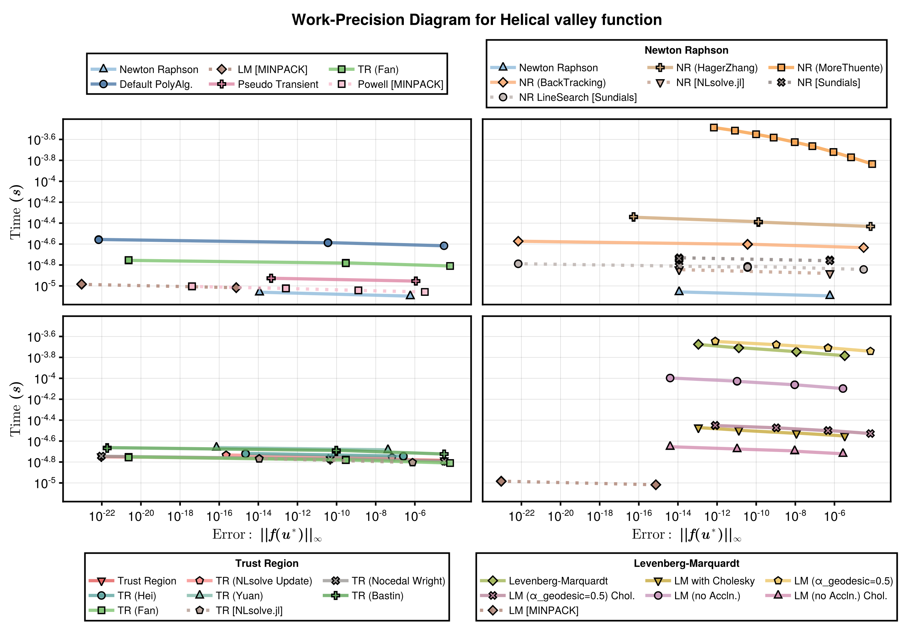
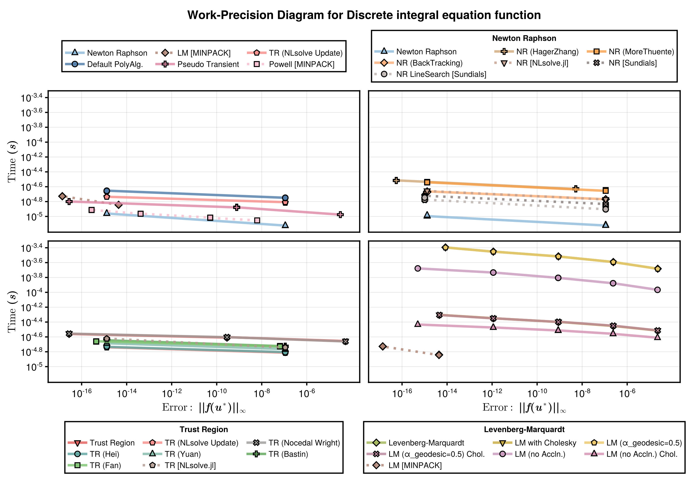
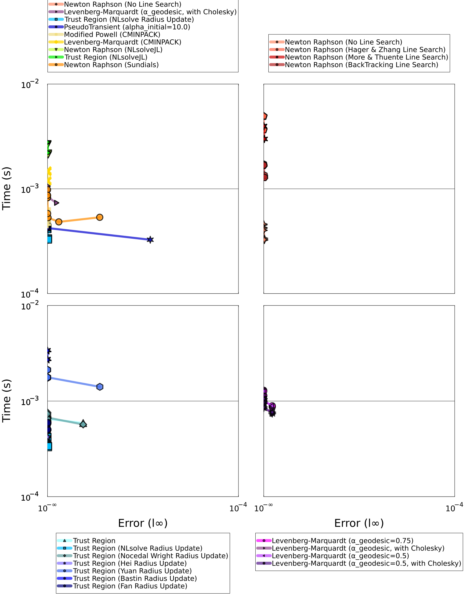

These benchmarks comapres the runtime and error for a range of nonlinear solvers. The problems are a standard set of problems as described [here](https://people.sc.fsu.edu/~jburkardt/m_src/test_nonlin/test_nonlin.html). The solvers are implemented in [NonlinearProblemLibrary.jl](https://github.com/SciML/DiffEqProblemLibrary.jl/blob/master/lib/NonlinearProblemLibrary/src/NonlinearProblemLibrary.jl), where you can find the problem function declarations. For each problem we test the following solvers:
- NonlinearSolve.jl's [Newton Raphson](https://docs.sciml.ai/NonlinearSolve/stable/api/nonlinearsolve/#NonlinearSolve.NewtonRaphson) method (`NewtonRaphson()`).
- NonlinearSolve.jl's [Newton trust region](https://docs.sciml.ai/NonlinearSolve/stable/api/nonlinearsolve/#NonlinearSolve.TrustRegion) method (`TrustRegion()`).
- NonlinearSolve.jl's Levenberg-Marquardt method (`LevenbergMarquardt()`).
- MINPACK's [Modified Powell](https://docs.sciml.ai/NonlinearSolve/stable/api/minpack/#NonlinearSolveMINPACK.CMINPACK) method (`CMINPACK(method=:hybr)`).
- MINPACK's [Levenberg-Marquardt](https://docs.sciml.ai/NonlinearSolve/stable/api/minpack/#NonlinearSolveMINPACK.CMINPACK) method (`CMINPACK(method=:lm)`).
- NLSolveJL's [Newton trust region](https://docs.sciml.ai/NonlinearSolve/stable/api/nlsolve/#Solver-API) (`NLSolveJL()`).
- Sundials's [Newton-Krylov](https://docs.sciml.ai/NonlinearSolve/stable/api/sundials/#Solver-API) method (`KINSOL()`).

# Setup
Fetch required packages.
```julia
using NonlinearSolve, NonlinearSolveMINPACK, SciMLNLSolve, SimpleNonlinearSolve, StaticArrays, Sundials
using BenchmarkTools, DiffEqDevTools, NonlinearProblemLibrary, Plots
```


Declare the benchmakred solvers.
```julia
solvers = [ Dict(:alg=>NewtonRaphson()),
            Dict(:alg=>TrustRegion()),
            Dict(:alg=>LevenbergMarquardt()),
            Dict(:alg=>CMINPACK(method=:hybr)),
            Dict(:alg=>CMINPACK(method=:lm)),
            Dict(:alg=>NLSolveJL())]
solvernames =  ["Newton Raphson"; 
                "Newton Trust Region"; 
                "Levenberg-Marquardt"; 
                "Modified Powell (CMINPACK)"; 
                "Levenberg-Marquardt (CMINPACK)"; 
                "Newton Trust Region (NLSolveJL)"];
```


Sets tolerances.
```julia
abstols = 1.0 ./ 10.0 .^ (4:12)
reltols = 1.0 ./ 10.0 .^ (4:12);
```


Set plotting defaults.
```julia
default(framestyle=:box,legend=:topleft,gridwidth=2, guidefontsize=12, legendfontsize=9, lw=2)
colors = [1 2 3 4 5 6 7]
markershapes = [:circle :rect :heptagon :cross :xcross :utriangle :star5];
```


Function for determening which solvers can solve a given problem.
```julia
# Selects the solvers to be benchmakred on a given problem.
function select_solvers(prob; solvers=solvers, solvernames=solvernames)
    filter(s_idx -> check_solver(prob, solvers[s_idx], solvernames[s_idx]), 1:length(solvers))
end
# Checks if a solver can sucessfully solve a given problem.
function check_solver(prob, solver, solvername)
    try
        true_sol = solve(prob.prob, solver[:alg]; abstol=1e-18, reltol=1e-18, maxiters=10000000)
        if !SciMLBase.successful_retcode(true_sol.retcode)
            Base.printstyled("[Warn] Solver $solvername returned retcode $(true_sol.retcode)."; color=:red)
            return false
        end
        WorkPrecisionSet(prob.prob, [1e-4, 1e-12], [1e-4, 1e-12], [solver]; names=[solvername], numruns=20, appxsol=true_sol, error_estimate=:l2, maxiters=10000000)
    catch e
        Base.printstyled("[Warn] Solver $solvername threw an error: $e."; color=:red)    
        return false
    end
    return true
end
```

```
check_solver (generic function with 1 method)
```


Plotting formating helper function.
```julia
# Finds good x and y limits.
function xy_limits(wp)
    times = vcat(map(wp -> wp.times, wp.wps)...)
    errors = vcat(map(wp -> wp.errors, wp.wps)...)
    xlimit = 10 .^ (floor(log10(minimum(errors))), ceil(log10(maximum(errors))))
    ylimit = 10 .^ (floor(log10(minimum(times))), ceil(log10(maximum(times))))
    return xlimit, ylimit
end

# Find good x and y ticks.
function arithmetic_sequences(v1, v2)
    sequences = []
    for n in 2:(v2-v1+1)
        d = (v2 - v1) / (n - 1)
        if d == floor(d)  
            sequence = [v1 + (j-1)*d for j in 1:n]
            push!(sequences, sequence)
        end
    end
    return sequences
end
function get_ticks(limit)
    (limit[1]==-Inf) && return 10.0 .^[limit[1], limit[2]]
    sequences = arithmetic_sequences(limit...)
    selected_seq = findlast(length.(sequences) .< 5)
    if length(sequences[selected_seq]) < 4
        step = (limit[2] - limit[1]) / 6.0
        ticks = [round(Int, limit[1] + i*step) for i in 1:5]
        return 10 .^[limit[1];ticks;limit[2]]
    end
    return 10 .^sequences[selected_seq]
end

# Plots a wrok-precision diagram.
function plot_wp(wp, selected_solvers; colors=permutedims(getindex(colors,selected_solvers)[:,:]), markershapes=permutedims(getindex(markershapes,selected_solvers)[:,:]), kwargs...)
    xlimit, ylimit = xy_limits(wp)
    xticks = get_ticks(log10.(xlimit))
    yticks = get_ticks(log10.(ylimit))
    plot(wp; xlimit=xlimit, ylimit=ylimit, xticks=xticks, yticks=yticks, color=colors, markershape=markershapes, kwargs...)
end;
```


# Benchmarks
We here run benchmarks for each of the 23 models. 

### Problem 1 (Generalized Rosenbrock function)
```julia
prob_1 = nlprob_23_testcases["Generalized Rosenbrock function"]
selected_solvers_1 = select_solvers(prob_1)
wp_1 = WorkPrecisionSet(prob_1.prob, abstols, reltols, getindex(solvers,selected_solvers_1); names=getindex(solvernames,selected_solvers_1), numruns=100, appxsol=prob_1.true_sol, error_estimate=:l2, maxiters=10000000)
plot_wp(wp_1, selected_solvers_1; legend=:bottomright)
```

```
[Warn] Solver Newton Raphson returned retcode MaxIters.[Warn] Solver Levenb
erg-Marquardt returned retcode MaxIters.[Warn] Solver Modified Powell (CMIN
PACK) returned retcode Failure.[Warn] Solver Levenberg-Marquardt (CMINPACK)
 returned retcode Failure.
```


### Problem 2 (Powell singular function)
```julia
prob_2 = nlprob_23_testcases["Powell singular function"]
selected_solvers_2 = select_solvers(prob_2)
wp_2 = WorkPrecisionSet(prob_2.prob, abstols, reltols, getindex(solvers,selected_solvers_2); names=getindex(solvernames,selected_solvers_2), numruns=100, appxsol=prob_2.true_sol, error_estimate=:l2, maxiters=10000000)
plot_wp(wp_2, selected_solvers_2)
```

```
[Warn] Solver Levenberg-Marquardt returned retcode MaxIters.
```


### Problem 3 (Powell badly scaled function)
```julia
prob_3 = nlprob_23_testcases["Powell badly scaled function"]
selected_solvers_3 = select_solvers(prob_3)
wp_3 = WorkPrecisionSet(prob_3.prob, abstols, reltols, getindex(solvers,selected_solvers_3); names=getindex(solvernames,selected_solvers_3), numruns=100, appxsol=prob_3.true_sol, error_estimate=:l2, maxiters=10000000)
plot_wp(wp_3, selected_solvers_3)
```

```
[Warn] Solver Newton Trust Region returned retcode MaxIters.[Warn] Solver L
evenberg-Marquardt returned retcode MaxIters.
```


### Problem 4 (Wood function)
```julia
prob_4 = nlprob_23_testcases["Wood function"]
selected_solvers_4 = select_solvers(prob_4)
wp_4 = WorkPrecisionSet(prob_4.prob, abstols, reltols, getindex(solvers,selected_solvers_4); names=getindex(solvernames,selected_solvers_4), numruns=100, appxsol=prob_4.true_sol, error_estimate=:l2, maxiters=10000000)
plot_wp(wp_4, selected_solvers_4; legend=:topright)
```

```
[Warn] Solver Newton Raphson returned retcode MaxIters.[Warn] Solver Levenb
erg-Marquardt returned retcode MaxIters.[Warn] Solver Newton Trust Region (
NLSolveJL) returned retcode Failure.
```





### Problem 5 (Helical valley function)
```julia
prob_5 = nlprob_23_testcases["Helical valley function"]
selected_solvers_5 = select_solvers(prob_5)
wp_5 = WorkPrecisionSet(prob_5.prob, abstols, reltols, getindex(solvers,selected_solvers_5); names=getindex(solvernames,selected_solvers_5), numruns=100, appxsol=prob_5.true_sol, error_estimate=:l2, maxiters=10000000)
plot_wp(wp_5, selected_solvers_5)
```

```
[Warn] Solver Levenberg-Marquardt returned retcode MaxIters.
```


### Problem 6 (Watson function)
```julia
prob_6 = nlprob_23_testcases["Watson function"]
selected_solvers_6 = select_solvers(prob_6)
true_sol_6 = solve(prob_6.prob, CMINPACK(method=:lm); abstol=1e-18, reltol=1e-18)
wp_6 = WorkPrecisionSet(prob_6.prob, abstols, reltols, getindex(solvers,selected_solvers_6); names=getindex(solvernames,selected_solvers_6), numruns=100, appxsol=true_sol_6, error_estimate=:l2, maxiters=10000000)
plot_wp(wp_6, selected_solvers_6; legend=:topright)
```

```
[Warn] Solver Newton Raphson returned retcode MaxIters.[Warn] Solver Levenb
erg-Marquardt returned retcode MaxIters.[Warn] Solver Modified Powell (CMIN
PACK) returned retcode Failure.[Warn] Solver Newton Trust Region (NLSolveJL
) threw an error: During the resolution of the non-linear system, the evalu
ation of the following equation(s) resulted in a non-finite number: [1, 2].
```


### Problem 7 (Chebyquad function)
```julia
prob_7 = nlprob_23_testcases["Chebyquad function"]
selected_solvers_7 = select_solvers(prob_7)
wp_7 = WorkPrecisionSet(prob_7.prob, abstols, reltols, getindex(solvers,selected_solvers_7); names=getindex(solvernames,selected_solvers_7), numruns=100, appxsol=prob_7.true_sol, error_estimate=:l2, maxiters=10000000)
plot_wp(wp_7, selected_solvers_7; legend=:bottomright)
```

```
[Warn] Solver Newton Raphson returned retcode MaxIters.[Warn] Solver Levenb
erg-Marquardt returned retcode MaxIters.[Warn] Solver Newton Trust Region (
NLSolveJL) returned retcode Failure.
```


### Problem 8 (Brown almost linear function)
```julia
prob_8 = nlprob_23_testcases["Brown almost linear function"]
selected_solvers_8 = select_solvers(prob_8)
wp_8 = WorkPrecisionSet(prob_8.prob, abstols, reltols, getindex(solvers,selected_solvers_8); names=getindex(solvernames,selected_solvers_8), numruns=100, appxsol=prob_8.true_sol, error_estimate=:l2, maxiters=10000000)
plot_wp(wp_8, selected_solvers_8)
```

```
[Warn] Solver Levenberg-Marquardt returned retcode MaxIters.
```


### Problem 9 (Discrete boundary value function)
```julia
prob_9 = nlprob_23_testcases["Discrete boundary value function"]
selected_solvers_9 = select_solvers(prob_9)
true_sol_9 = solve(prob_9.prob, CMINPACK(method=:lm); abstol=1e-18, reltol=1e-18)
wp_9 = WorkPrecisionSet(prob_9.prob, abstols, reltols, getindex(solvers,selected_solvers_9); names=getindex(solvernames,selected_solvers_9), numruns=100, appxsol=true_sol_9, error_estimate=:l2, maxiters=10000000)
plot_wp(wp_9, selected_solvers_9)
```

```
[Warn] Solver Newton Raphson returned retcode MaxIters.[Warn] Solver Levenb
erg-Marquardt returned retcode MaxIters.[Warn] Solver Newton Trust Region (
NLSolveJL) returned retcode Failure.
```





### Problem 10 (Discrete integral equation function)
```julia
prob_10 = nlprob_23_testcases["Discrete integral equation function"]
selected_solvers_10 = select_solvers(prob_10)
true_sol_10 = solve(prob_10.prob, CMINPACK(method=:lm); abstol=1e-18, reltol=1e-18)
wp_10 = WorkPrecisionSet(prob_10.prob, abstols, reltols, getindex(solvers,selected_solvers_10); names=getindex(solvernames,selected_solvers_10), numruns=100, appxsol=true_sol_10, error_estimate=:l2, maxiters=10000000)
plot_wp(wp_10, selected_solvers_10; legend=:bottomleft)
```

```
[Warn] Solver Levenberg-Marquardt returned retcode MaxIters.
```


### Problem 11 (Trigonometric function)
```julia
prob_11 = nlprob_23_testcases["Trigonometric function"]
selected_solvers_11 =  select_solvers(prob_11)
true_sol_11 = solve(prob_11.prob, CMINPACK(method=:lm); abstol=1e-18, reltol=1e-18)
wp_11 = WorkPrecisionSet(prob_11.prob, abstols, reltols, getindex(solvers,selected_solvers_11); names=getindex(solvernames,selected_solvers_11), numruns=100, appxsol=true_sol_11, error_estimate=:l2, maxiters=10000000)
plot_wp(wp_11, selected_solvers_11)
```

```
[Warn] Solver Newton Raphson returned retcode MaxIters.[Warn] Solver Levenb
erg-Marquardt returned retcode MaxIters.[Warn] Solver Modified Powell (CMIN
PACK) returned retcode Failure.[Warn] Solver Newton Trust Region (NLSolveJL
) returned retcode Failure.
```


### Problem 12 (Variably dimensioned function)
```julia
prob_12 = nlprob_23_testcases["Variably dimensioned function"]
selected_solvers_12 =  select_solvers(prob_12)
wp_12 = WorkPrecisionSet(prob_12.prob, abstols, reltols, getindex(solvers,selected_solvers_12); names=getindex(solvernames,selected_solvers_12), numruns=100, appxsol=prob_12.true_sol, error_estimate=:l2, maxiters=10000000)
plot_wp(wp_12, selected_solvers_12; legend=:bottomright)
```

```
[Warn] Solver Levenberg-Marquardt returned retcode MaxIters.
```


### Problem 13 (Broyden tridiagonal function)
```julia
prob_13 = nlprob_23_testcases["Broyden tridiagonal function"]
selected_solvers_13 =  select_solvers(prob_13)
true_sol_13 = solve(prob_13.prob, CMINPACK(method=:lm); abstol=1e-18, reltol=1e-18)
wp_13 = WorkPrecisionSet(prob_13.prob, abstols, reltols, getindex(solvers,selected_solvers_13); names=getindex(solvernames,selected_solvers_13), numruns=100, appxsol=true_sol_13, error_estimate=:l2, maxiters=10000000)
plot_wp(wp_13, selected_solvers_13; legend=:topleft, legendfontsize=6)
```

```
[Warn] Solver Newton Raphson returned retcode MaxIters.[Warn] Solver Levenb
erg-Marquardt returned retcode MaxIters.[Warn] Solver Newton Trust Region (
NLSolveJL) returned retcode Failure.
```


### Problem 14 (Broyden banded function)
```julia
prob_14 = nlprob_23_testcases["Broyden banded function"]
selected_solvers_14 =  select_solvers(prob_14)
true_sol_14 = solve(prob_14.prob, CMINPACK(method=:lm); abstol=1e-18, reltol=1e-18)
wp_14 = WorkPrecisionSet(prob_14.prob, abstols, reltols, getindex(solvers,selected_solvers_14); names=getindex(solvernames,selected_solvers_14), numruns=100, appxsol=true_sol_14, error_estimate=:l2, maxiters=10000000)
plot_wp(wp_14, selected_solvers_14)
```

```
[Warn] Solver Newton Raphson returned retcode MaxIters.[Warn] Solver Levenb
erg-Marquardt returned retcode MaxIters.[Warn] Solver Newton Trust Region (
NLSolveJL) returned retcode Failure.
```


### Problem 15 (Hammarling 2 by 2 matrix square root problem)
```julia
prob_15 = nlprob_23_testcases["Hammarling 2 by 2 matrix square root problem"]
selected_solvers_15 =  select_solvers(prob_15)
wp_15 = WorkPrecisionSet(prob_15.prob, abstols, reltols, getindex(solvers,selected_solvers_15); names=getindex(solvernames,selected_solvers_15), numruns=100, appxsol=prob_15.true_sol, error_estimate=:l2, maxiters=10000000)
plot_wp(wp_15, selected_solvers_15)
```

```
[Warn] Solver Levenberg-Marquardt returned retcode MaxIters.[Warn] Solver M
odified Powell (CMINPACK) returned retcode Failure.[Warn] Solver Levenberg-
Marquardt (CMINPACK) returned retcode Failure.
```


### Problem 16 (Hammarling 3 by 3 matrix square root problem)
```julia
prob_16 = nlprob_23_testcases["Hammarling 3 by 3 matrix square root problem"]
selected_solvers_16 =  select_solvers(prob_16)
wp_16 = WorkPrecisionSet(prob_16.prob, abstols, reltols, getindex(solvers,selected_solvers_16); names=getindex(solvernames,selected_solvers_16), numruns=100, appxsol=prob_16.true_sol, error_estimate=:l2, maxiters=10000000)
plot_wp(wp_16, selected_solvers_16)
```

```
[Warn] Solver Levenberg-Marquardt returned retcode MaxIters.[Warn] Solver M
odified Powell (CMINPACK) returned retcode Failure.[Warn] Solver Levenberg-
Marquardt (CMINPACK) returned retcode Failure.
```


### Problem 17 (Dennis and Schnabel 2 by 2 example)
```julia
prob_17 = nlprob_23_testcases["Dennis and Schnabel 2 by 2 example"]
selected_solvers_17 =  select_solvers(prob_17)
wp_17 = WorkPrecisionSet(prob_17.prob, abstols, reltols, getindex(solvers,selected_solvers_17); names=getindex(solvernames,selected_solvers_17), numruns=100, appxsol=prob_17.true_sol, error_estimate=:l2, maxiters=10000000)
plot_wp(wp_17, selected_solvers_17)
```

```
[Warn] Solver Levenberg-Marquardt returned retcode MaxIters.
```


### Problem 18 (Sample problem 18)
```julia
prob_18 = nlprob_23_testcases["Sample problem 18"]
selected_solvers_18 =  select_solvers(prob_18)
wp_18 = WorkPrecisionSet(prob_18.prob, abstols, reltols, getindex(solvers,selected_solvers_18); names=getindex(solvernames,selected_solvers_18), numruns=100, appxsol=prob_18.true_sol, error_estimate=:l2, maxiters=10000000)
plot_wp(wp_18, selected_solvers_18)
```

```
[Warn] Solver Levenberg-Marquardt returned retcode MaxIters.
```


### Problem 19 (Sample problem 19)
```julia
prob_19 = nlprob_23_testcases["Sample problem 19"]
selected_solvers_19 =  select_solvers(prob_19)
wp_19 = WorkPrecisionSet(prob_19.prob, abstols, reltols, getindex(solvers,selected_solvers_19); names=getindex(solvernames,selected_solvers_19), numruns=100, appxsol=prob_19.true_sol, error_estimate=:l2, maxiters=10000000)
plot_wp(wp_19, selected_solvers_19)
```

```
[Warn] Solver Levenberg-Marquardt returned retcode MaxIters.
```


### Problem 20 (Scalar problem f(x) = x(x - 5)^2)
```julia
prob_20 = nlprob_23_testcases["Scalar problem f(x) = x(x - 5)^2"]
selected_solvers_20 =  select_solvers(prob_20)
wp_20 = WorkPrecisionSet(prob_20.prob, abstols, reltols, getindex(solvers,selected_solvers_20); names=getindex(solvernames,selected_solvers_20), numruns=100, appxsol=prob_20.true_sol, error_estimate=:l2, maxiters=10000000)
plot_wp(wp_20, selected_solvers_20)
```


### Problem 21 (Freudenstein-Roth function)
```julia
prob_21 = nlprob_23_testcases["Freudenstein-Roth function"]
selected_solvers_21 =  select_solvers(prob_21)
wp_21 = WorkPrecisionSet(prob_21.prob, abstols, reltols, getindex(solvers,selected_solvers_21); names=getindex(solvernames,selected_solvers_21), numruns=100, appxsol=prob_21.true_sol, error_estimate=:l2, maxiters=10000000)
plot_wp(wp_21, selected_solvers_21)
```

```
[Warn] Solver Levenberg-Marquardt returned retcode MaxIters.[Warn] Solver M
odified Powell (CMINPACK) returned retcode Failure.[Warn] Solver Newton Tru
st Region (NLSolveJL) returned retcode Failure.
```


### Problem 22 (Boggs function)
```julia
prob_22 = nlprob_23_testcases["Boggs function"]
selected_solvers_22 =  select_solvers(prob_22)
wp_22 = WorkPrecisionSet(prob_22.prob, abstols, reltols, getindex(solvers,selected_solvers_22); names=getindex(solvernames,selected_solvers_22), numruns=100, appxsol=prob_22.true_sol, error_estimate=:l2, maxiters=10000000)
plot_wp(wp_22, selected_solvers_22)
```

```
[Warn] Solver Levenberg-Marquardt returned retcode MaxIters.
```


### Problem 23 (Chandrasekhar function)
```julia
prob_23 = nlprob_23_testcases["Chandrasekhar function"]
selected_solvers_23 =  select_solvers(prob_23)
true_sol_23 = solve(prob_23.prob, CMINPACK(method=:lm); abstol=1e-18, reltol=1e-18)
wp_23 = WorkPrecisionSet(prob_23.prob, abstols, reltols, getindex(solvers,selected_solvers_23); names=getindex(solvernames,selected_solvers_23), numruns=100, appxsol=true_sol_23, error_estimate=:l2, maxiters=10000000)
plot_wp(wp_23, selected_solvers_23; legend=:topright, legendfontsize=7)
```

```
[Warn] Solver Levenberg-Marquardt returned retcode MaxIters.[Warn] Solver N
ewton Trust Region (NLSolveJL) returned retcode Failure.
```





# Appendix

## Appendix

These benchmarks are a part of the SciMLBenchmarks.jl repository, found at: [https://github.com/SciML/SciMLBenchmarks.jl](https://github.com/SciML/SciMLBenchmarks.jl). For more information on high-performance scientific machine learning, check out the SciML Open Source Software Organization [https://sciml.ai](https://sciml.ai).

To locally run this benchmark, do the following commands:

```
using SciMLBenchmarks
SciMLBenchmarks.weave_file("benchmarks/NonlinearProblem","nonlinear_solver_23_tests.jmd")
```

Computer Information:

```
Julia Version 1.9.3
Commit bed2cd540a1 (2023-08-24 14:43 UTC)
Build Info:
  Official https://julialang.org/ release
Platform Info:
  OS: Linux (x86_64-linux-gnu)
  CPU: 128 × AMD EPYC 7502 32-Core Processor
  WORD_SIZE: 64
  LIBM: libopenlibm
  LLVM: libLLVM-14.0.6 (ORCJIT, znver2)
  Threads: 128 on 128 virtual cores
Environment:
  JULIA_CPU_THREADS = 128
  JULIA_DEPOT_PATH = /cache/julia-buildkite-plugin/depots/5b300254-1738-4989-ae0a-f4d2d937f953
  JULIA_IMAGE_THREADS = 1

```

Package Information:

```
Status `/cache/build/exclusive-amdci3-0/julialang/scimlbenchmarks-dot-jl/benchmarks/NonlinearProblem/Project.toml`
  [6e4b80f9] BenchmarkTools v1.3.2
⌃ [f3b72e0c] DiffEqDevTools v2.36.0
  [b7050fa9] NonlinearProblemLibrary v0.1.0
  [8913a72c] NonlinearSolve v2.0.0 `https://github.com/avik-pal/NonlinearSolve.jl#ap/cleanup`
  [c100e077] NonlinearSolveMINPACK v0.1.3
  [91a5bcdd] Plots v1.39.0
  [31c91b34] SciMLBenchmarks v0.1.3
⌃ [e9a6253c] SciMLNLSolve v0.1.8
⌃ [727e6d20] SimpleNonlinearSolve v0.1.19
⌃ [90137ffa] StaticArrays v1.6.3
⌃ [c3572dad] Sundials v4.19.5
Info Packages marked with ⌃ have new versions available and may be upgradable.
```

And the full manifest:

```
Status `/cache/build/exclusive-amdci3-0/julialang/scimlbenchmarks-dot-jl/benchmarks/NonlinearProblem/Manifest.toml`
  [47edcb42] ADTypes v0.2.4
  [79e6a3ab] Adapt v3.6.2
  [ec485272] ArnoldiMethod v0.2.0
  [4fba245c] ArrayInterface v7.4.11
  [30b0a656] ArrayInterfaceCore v0.1.29
  [6e4b80f9] BenchmarkTools v1.3.2
  [d1d4a3ce] BitFlags v0.1.7
  [62783981] BitTwiddlingConvenienceFunctions v0.1.5
  [fa961155] CEnum v0.4.2
  [2a0fbf3d] CPUSummary v0.2.4
  [49dc2e85] Calculus v0.5.1
  [d360d2e6] ChainRulesCore v1.16.0
  [fb6a15b2] CloseOpenIntervals v0.1.12
  [944b1d66] CodecZlib v0.7.2
⌃ [35d6a980] ColorSchemes v3.23.0
  [3da002f7] ColorTypes v0.11.4
  [c3611d14] ColorVectorSpace v0.10.0
  [5ae59095] Colors v0.12.10
  [38540f10] CommonSolve v0.2.4
  [bbf7d656] CommonSubexpressions v0.3.0
  [34da2185] Compat v4.9.0
  [2569d6c7] ConcreteStructs v0.2.3
  [f0e56b4a] ConcurrentUtilities v2.2.1
  [8f4d0f93] Conda v1.9.1
  [187b0558] ConstructionBase v1.5.4
  [d38c429a] Contour v0.6.2
  [adafc99b] CpuId v0.3.1
  [9a962f9c] DataAPI v1.15.0
  [864edb3b] DataStructures v0.18.15
  [e2d170a0] DataValueInterfaces v1.0.0
  [8bb1440f] DelimitedFiles v1.9.1
⌃ [2b5f629d] DiffEqBase v6.129.0
⌃ [f3b72e0c] DiffEqDevTools v2.36.0
⌃ [77a26b50] DiffEqNoiseProcess v5.18.0
  [163ba53b] DiffResults v1.1.0
  [b552c78f] DiffRules v1.15.1
⌅ [b4f34e82] Distances v0.9.2
  [31c24e10] Distributions v0.25.100
  [ffbed154] DocStringExtensions v0.9.3
  [fa6b7ba4] DualNumbers v0.6.8
  [4e289a0a] EnumX v1.0.4
  [460bff9d] ExceptionUnwrapping v0.1.9
  [e2ba6199] ExprTools v0.1.10
  [c87230d0] FFMPEG v0.4.1
  [7034ab61] FastBroadcast v0.2.6
  [29a986be] FastLapackInterface v2.0.0
  [1a297f60] FillArrays v1.6.1
  [6a86dc24] FiniteDiff v2.21.1
  [53c48c17] FixedPointNumbers v0.8.4
  [59287772] Formatting v0.4.2
  [f6369f11] ForwardDiff v0.10.36
  [069b7b12] FunctionWrappers v1.1.3
  [77dc65aa] FunctionWrappersWrappers v0.1.3
  [46192b85] GPUArraysCore v0.1.5
⌃ [28b8d3ca] GR v0.72.9
  [d7ba0133] Git v1.3.0
  [86223c79] Graphs v1.8.0
  [42e2da0e] Grisu v1.0.2
  [cd3eb016] HTTP v1.10.0
  [eafb193a] Highlights v0.5.2
  [3e5b6fbb] HostCPUFeatures v0.1.16
  [34004b35] HypergeometricFunctions v0.3.23
  [7073ff75] IJulia v1.24.2
  [615f187c] IfElse v0.1.1
  [d25df0c9] Inflate v0.1.3
  [92d709cd] IrrationalConstants v0.2.2
  [82899510] IteratorInterfaceExtensions v1.0.0
  [1019f520] JLFzf v0.1.5
  [692b3bcd] JLLWrappers v1.5.0
  [682c06a0] JSON v0.21.4
  [ef3ab10e] KLU v0.4.1
  [ba0b0d4f] Krylov v0.9.4
  [b964fa9f] LaTeXStrings v1.3.0
  [23fbe1c1] Latexify v0.16.1
  [10f19ff3] LayoutPointers v0.1.14
  [50d2b5c4] Lazy v0.15.1
  [d3d80556] LineSearches v7.2.0
⌃ [7ed4a6bd] LinearSolve v2.5.1
  [2ab3a3ac] LogExpFunctions v0.3.26
  [e6f89c97] LoggingExtras v1.0.2
  [bdcacae8] LoopVectorization v0.12.165
  [4854310b] MINPACK v1.1.1
  [1914dd2f] MacroTools v0.5.11
  [d125e4d3] ManualMemory v0.1.8
  [739be429] MbedTLS v1.1.7
  [442fdcdd] Measures v0.3.2
  [e1d29d7a] Missings v1.1.0
  [46d2c3a1] MuladdMacro v0.2.4
  [ffc61752] Mustache v1.0.17
  [d41bc354] NLSolversBase v7.8.3
  [2774e3e8] NLsolve v4.5.1
  [77ba4419] NaNMath v1.0.2
  [b7050fa9] NonlinearProblemLibrary v0.1.0
  [8913a72c] NonlinearSolve v2.0.0 `https://github.com/avik-pal/NonlinearSolve.jl#ap/cleanup`
  [c100e077] NonlinearSolveMINPACK v0.1.3
  [6fe1bfb0] OffsetArrays v1.12.10
  [4d8831e6] OpenSSL v1.4.1
  [429524aa] Optim v1.7.7
  [bac558e1] OrderedCollections v1.6.2
⌃ [90014a1f] PDMats v0.11.17
⌃ [65ce6f38] PackageExtensionCompat v1.0.1
  [d96e819e] Parameters v0.12.3
  [69de0a69] Parsers v2.7.2
  [b98c9c47] Pipe v1.3.0
  [ccf2f8ad] PlotThemes v3.1.0
  [995b91a9] PlotUtils v1.3.5
  [91a5bcdd] Plots v1.39.0
  [e409e4f3] PoissonRandom v0.4.4
  [f517fe37] Polyester v0.7.6
  [1d0040c9] PolyesterWeave v0.2.1
  [85a6dd25] PositiveFactorizations v0.2.4
  [d236fae5] PreallocationTools v0.4.12
  [aea7be01] PrecompileTools v1.2.0
⌃ [21216c6a] Preferences v1.4.0
⌃ [1fd47b50] QuadGK v2.8.2
  [74087812] Random123 v1.6.1
  [e6cf234a] RandomNumbers v1.5.3
  [3cdcf5f2] RecipesBase v1.3.4
  [01d81517] RecipesPipeline v0.6.12
  [731186ca] RecursiveArrayTools v2.38.10
  [f2c3362d] RecursiveFactorization v0.2.20
  [189a3867] Reexport v1.2.2
  [05181044] RelocatableFolders v1.0.0
  [ae029012] Requires v1.3.0
  [ae5879a3] ResettableStacks v1.1.1
  [79098fc4] Rmath v0.7.1
  [47965b36] RootedTrees v2.19.2
  [7e49a35a] RuntimeGeneratedFunctions v0.5.12
  [94e857df] SIMDTypes v0.1.0
  [476501e8] SLEEFPirates v0.6.39
⌅ [0bca4576] SciMLBase v1.98.0
  [31c91b34] SciMLBenchmarks v0.1.3
⌃ [e9a6253c] SciMLNLSolve v0.1.8
  [c0aeaf25] SciMLOperators v0.3.6
  [6c6a2e73] Scratch v1.2.0
  [efcf1570] Setfield v1.1.1
  [992d4aef] Showoff v1.0.3
  [777ac1f9] SimpleBufferStream v1.1.0
⌃ [727e6d20] SimpleNonlinearSolve v0.1.19
  [699a6c99] SimpleTraits v0.9.4
  [66db9d55] SnoopPrecompile v1.0.3
  [b85f4697] SoftGlobalScope v1.1.0
  [a2af1166] SortingAlgorithms v1.1.1
  [47a9eef4] SparseDiffTools v2.6.0
  [e56a9233] Sparspak v0.3.9
  [276daf66] SpecialFunctions v2.3.1
  [aedffcd0] Static v0.8.8
  [0d7ed370] StaticArrayInterface v1.4.1
⌃ [90137ffa] StaticArrays v1.6.3
  [1e83bf80] StaticArraysCore v1.4.2
  [82ae8749] StatsAPI v1.7.0
  [2913bbd2] StatsBase v0.34.0
  [4c63d2b9] StatsFuns v1.3.0
  [7792a7ef] StrideArraysCore v0.4.17
  [69024149] StringEncodings v0.3.7
⌃ [c3572dad] Sundials v4.19.5
  [2efcf032] SymbolicIndexingInterface v0.2.2
  [3783bdb8] TableTraits v1.0.1
  [bd369af6] Tables v1.11.0
  [62fd8b95] TensorCore v0.1.1
  [8290d209] ThreadingUtilities v0.5.2
  [3bb67fe8] TranscodingStreams v0.9.13
  [d5829a12] TriangularSolve v0.1.19
  [410a4b4d] Tricks v0.1.7
  [781d530d] TruncatedStacktraces v1.4.0
  [5c2747f8] URIs v1.5.0
  [3a884ed6] UnPack v1.0.2
  [1cfade01] UnicodeFun v0.4.1
  [1986cc42] Unitful v1.17.0
  [45397f5d] UnitfulLatexify v1.6.3
  [41fe7b60] Unzip v0.2.0
  [3d5dd08c] VectorizationBase v0.21.64
  [81def892] VersionParsing v1.3.0
  [19fa3120] VertexSafeGraphs v0.2.0
  [44d3d7a6] Weave v0.10.12
  [ddb6d928] YAML v0.4.9
  [c2297ded] ZMQ v1.2.2
  [700de1a5] ZygoteRules v0.2.3
  [6e34b625] Bzip2_jll v1.0.8+0
  [83423d85] Cairo_jll v1.16.1+1
  [2702e6a9] EpollShim_jll v0.0.20230411+0
  [2e619515] Expat_jll v2.5.0+0
⌃ [b22a6f82] FFMPEG_jll v4.4.2+2
  [a3f928ae] Fontconfig_jll v2.13.93+0
  [d7e528f0] FreeType2_jll v2.13.1+0
  [559328eb] FriBidi_jll v1.0.10+0
  [0656b61e] GLFW_jll v3.3.8+0
⌅ [d2c73de3] GR_jll v0.72.9+1
  [78b55507] Gettext_jll v0.21.0+0
  [f8c6e375] Git_jll v2.36.1+2
  [7746bdde] Glib_jll v2.76.5+0
  [3b182d85] Graphite2_jll v1.3.14+0
  [2e76f6c2] HarfBuzz_jll v2.8.1+1
  [aacddb02] JpegTurbo_jll v2.1.91+0
  [c1c5ebd0] LAME_jll v3.100.1+0
  [88015f11] LERC_jll v3.0.0+1
  [1d63c593] LLVMOpenMP_jll v15.0.4+0
  [dd4b983a] LZO_jll v2.10.1+0
⌅ [e9f186c6] Libffi_jll v3.2.2+1
  [d4300ac3] Libgcrypt_jll v1.8.7+0
  [7e76a0d4] Libglvnd_jll v1.6.0+0
  [7add5ba3] Libgpg_error_jll v1.42.0+0
  [94ce4f54] Libiconv_jll v1.17.0+0
  [4b2f31a3] Libmount_jll v2.35.0+0
  [89763e89] Libtiff_jll v4.5.1+1
  [38a345b3] Libuuid_jll v2.36.0+0
  [e7412a2a] Ogg_jll v1.3.5+1
⌅ [458c3c95] OpenSSL_jll v1.1.23+0
  [efe28fd5] OpenSpecFun_jll v0.5.5+0
  [91d4177d] Opus_jll v1.3.2+0
  [30392449] Pixman_jll v0.42.2+0
⌅ [c0090381] Qt6Base_jll v6.4.2+3
  [f50d1b31] Rmath_jll v0.4.0+0
⌅ [fb77eaff] Sundials_jll v5.2.1+0
  [a2964d1f] Wayland_jll v1.21.0+1
  [2381bf8a] Wayland_protocols_jll v1.25.0+0
  [02c8fc9c] XML2_jll v2.10.4+0
  [aed1982a] XSLT_jll v1.1.34+0
  [ffd25f8a] XZ_jll v5.4.4+0
  [4f6342f7] Xorg_libX11_jll v1.8.6+0
  [0c0b7dd1] Xorg_libXau_jll v1.0.11+0
  [935fb764] Xorg_libXcursor_jll v1.2.0+4
  [a3789734] Xorg_libXdmcp_jll v1.1.4+0
  [1082639a] Xorg_libXext_jll v1.3.4+4
  [d091e8ba] Xorg_libXfixes_jll v5.0.3+4
  [a51aa0fd] Xorg_libXi_jll v1.7.10+4
  [d1454406] Xorg_libXinerama_jll v1.1.4+4
  [ec84b674] Xorg_libXrandr_jll v1.5.2+4
  [ea2f1a96] Xorg_libXrender_jll v0.9.10+4
  [14d82f49] Xorg_libpthread_stubs_jll v0.1.1+0
  [c7cfdc94] Xorg_libxcb_jll v1.15.0+0
  [cc61e674] Xorg_libxkbfile_jll v1.1.2+0
  [12413925] Xorg_xcb_util_image_jll v0.4.0+1
  [2def613f] Xorg_xcb_util_jll v0.4.0+1
  [975044d2] Xorg_xcb_util_keysyms_jll v0.4.0+1
  [0d47668e] Xorg_xcb_util_renderutil_jll v0.3.9+1
  [c22f9ab0] Xorg_xcb_util_wm_jll v0.4.1+1
  [35661453] Xorg_xkbcomp_jll v1.4.6+0
  [33bec58e] Xorg_xkeyboard_config_jll v2.39.0+0
  [c5fb5394] Xorg_xtrans_jll v1.5.0+0
  [8f1865be] ZeroMQ_jll v4.3.4+0
  [3161d3a3] Zstd_jll v1.5.5+0
⌅ [214eeab7] fzf_jll v0.29.0+0
  [a4ae2306] libaom_jll v3.4.0+0
  [0ac62f75] libass_jll v0.15.1+0
  [f638f0a6] libfdk_aac_jll v2.0.2+0
  [b53b4c65] libpng_jll v1.6.38+0
  [a9144af2] libsodium_jll v1.0.20+0
  [f27f6e37] libvorbis_jll v1.3.7+1
  [1270edf5] x264_jll v2021.5.5+0
  [dfaa095f] x265_jll v3.5.0+0
⌃ [d8fb68d0] xkbcommon_jll v1.4.1+0
  [0dad84c5] ArgTools v1.1.1
  [56f22d72] Artifacts
  [2a0f44e3] Base64
  [ade2ca70] Dates
  [8ba89e20] Distributed
  [f43a241f] Downloads v1.6.0
  [7b1f6079] FileWatching
  [9fa8497b] Future
  [b77e0a4c] InteractiveUtils
  [b27032c2] LibCURL v0.6.3
  [76f85450] LibGit2
  [8f399da3] Libdl
  [37e2e46d] LinearAlgebra
  [56ddb016] Logging
  [d6f4376e] Markdown
  [a63ad114] Mmap
  [ca575930] NetworkOptions v1.2.0
  [44cfe95a] Pkg v1.9.2
  [de0858da] Printf
  [9abbd945] Profile
  [3fa0cd96] REPL
  [9a3f8284] Random
  [ea8e919c] SHA v0.7.0
  [9e88b42a] Serialization
  [1a1011a3] SharedArrays
  [6462fe0b] Sockets
  [2f01184e] SparseArrays
  [10745b16] Statistics v1.9.0
  [4607b0f0] SuiteSparse
  [fa267f1f] TOML v1.0.3
  [a4e569a6] Tar v1.10.0
  [8dfed614] Test
  [cf7118a7] UUIDs
  [4ec0a83e] Unicode
  [e66e0078] CompilerSupportLibraries_jll v1.0.5+0
  [deac9b47] LibCURL_jll v7.84.0+0
  [29816b5a] LibSSH2_jll v1.10.2+0
  [c8ffd9c3] MbedTLS_jll v2.28.2+0
  [14a3606d] MozillaCACerts_jll v2022.10.11
  [4536629a] OpenBLAS_jll v0.3.21+4
  [05823500] OpenLibm_jll v0.8.1+0
  [efcefdf7] PCRE2_jll v10.42.0+0
  [bea87d4a] SuiteSparse_jll v5.10.1+6
  [83775a58] Zlib_jll v1.2.13+0
  [8e850b90] libblastrampoline_jll v5.8.0+0
  [8e850ede] nghttp2_jll v1.48.0+0
  [3f19e933] p7zip_jll v17.4.0+0
Info Packages marked with ⌃ and ⌅ have new versions available, but those with ⌅ are restricted by compatibility constraints from upgrading. To see why use `status --outdated -m`
```

