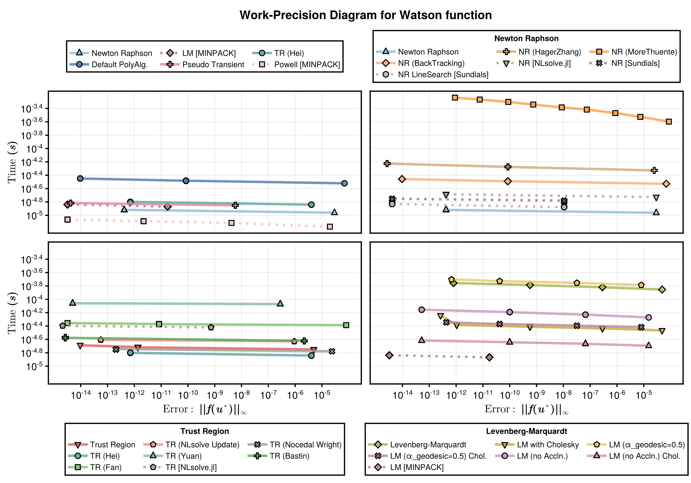
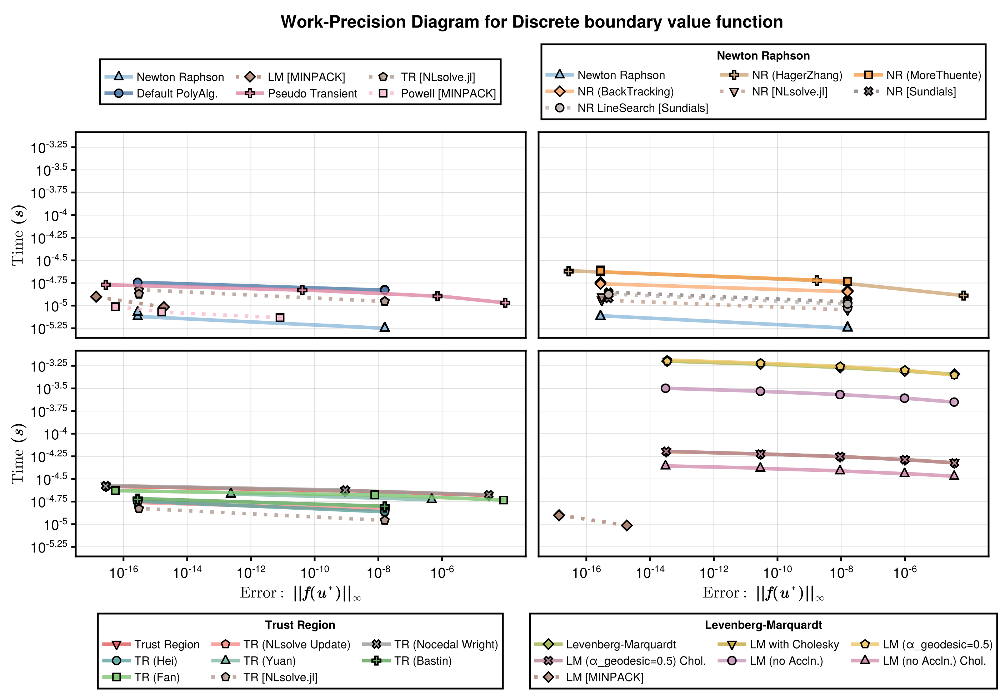
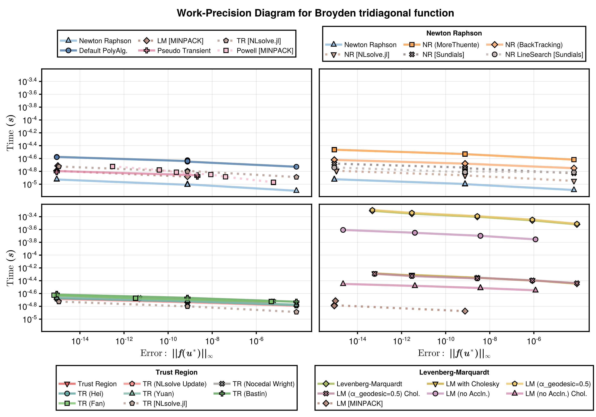
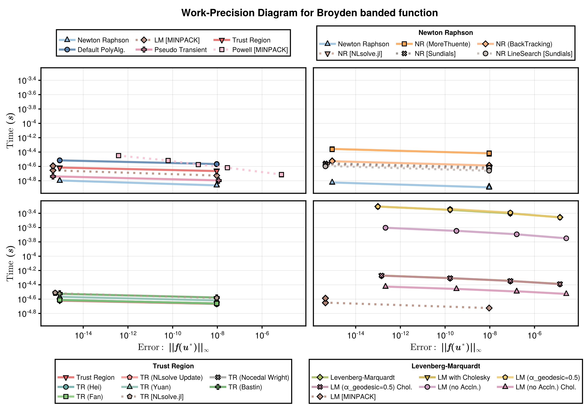
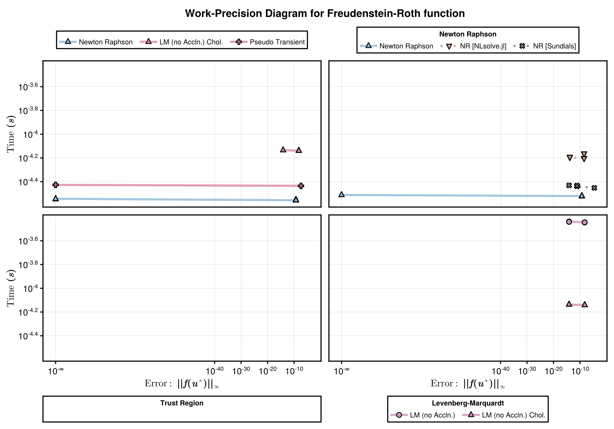
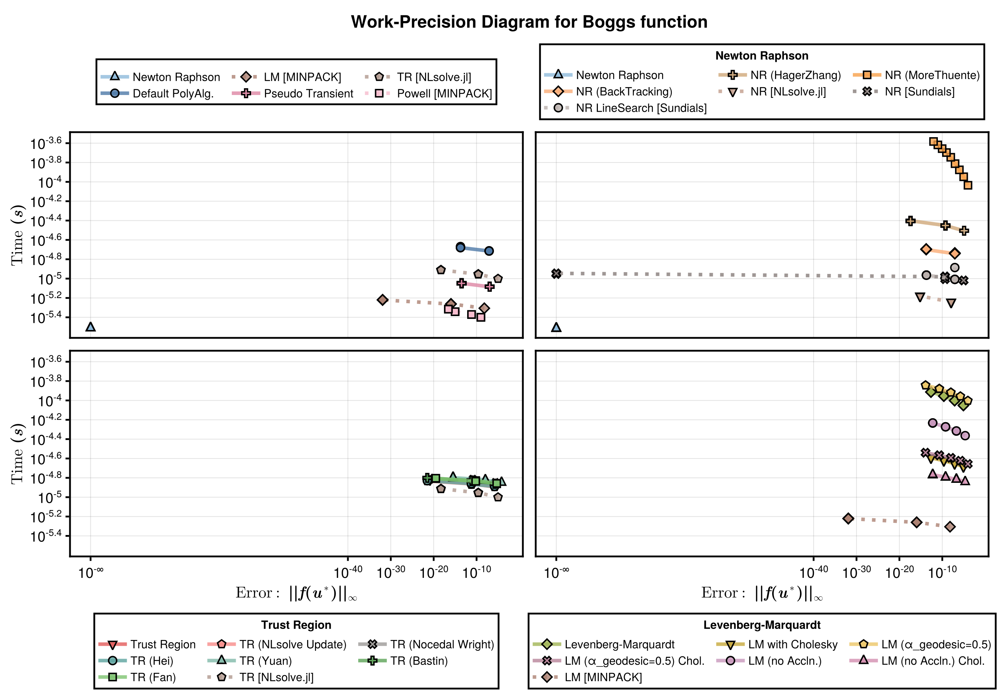

These benchmarks compares the runtime and error for a range of nonlinear solvers. The problems are a standard set of problems as described [here](https://people.sc.fsu.edu/~jburkardt/m_src/test_nonlin/test_nonlin.html). The solvers are implemented in [NonlinearProblemLibrary.jl](https://github.com/SciML/DiffEqProblemLibrary.jl/blob/master/lib/NonlinearProblemLibrary/src/NonlinearProblemLibrary.jl), where you can find the problem function declarations. For each problem we test the following solvers:
- NonlinearSolve.jl's [Newton Raphson](https://docs.sciml.ai/NonlinearSolve/stable/api/nonlinearsolve/#NonlinearSolve.NewtonRaphson) method (`NewtonRaphson()`).
- NonlinearSolve.jl's [Trust Region](https://docs.sciml.ai/NonlinearSolve/stable/api/nonlinearsolve/#NonlinearSolve.TrustRegion) method (`TrustRegion()`).
- NonlinearSolve.jl's Levenberg-Marquardt method (`LevenbergMarquardt()`).
- MINPACK's [Modified Powell](https://docs.sciml.ai/NonlinearSolve/stable/api/minpack/#NonlinearSolveMINPACK.CMINPACK) method (`CMINPACK(method=:hybr)`).
- MINPACK's [Levenberg-Marquardt](https://docs.sciml.ai/NonlinearSolve/stable/api/minpack/#NonlinearSolveMINPACK.CMINPACK) method (`CMINPACK(method=:lm)`).
- NLsolveJL's [Newton Raphson](https://docs.sciml.ai/NonlinearSolve/stable/api/nlsolve/#Solver-API) (`NLsolveJL(method=:newton)`).
- NLsolveJL's [Trust Region](https://docs.sciml.ai/NonlinearSolve/stable/api/nlsolve/#Solver-API) (`NLsolveJL()`).
- NLsolveJL's [Anderson acceleration](https://docs.sciml.ai/NonlinearSolve/stable/api/nlsolve/#Solver-API) (`NLsolveJL(method=:anderson)`).
- Sundials's [Newton-Krylov](https://docs.sciml.ai/NonlinearSolve/stable/api/sundials/#Solver-API) method (`KINSOL()`).

Furthermore, for NonlinearSolve.jl's Newton Raphson method we try the following Line Search options (in addition to the default):
- `HagerZhang`
- `MoreThuente`
- `BackTracking`

and for NonlinearSolve.jl's Trust Region we try the following Radius Update schemes (in addition to the default):
- `NLsolve` 
- `NocedalWright` 
- `Hei` 
- `Yuan` 
- `Bastin` 
- `Fan` 
and finally for NonlinearSolve.jl's Levenberg-Marquardt method why try using both the default `α_geodesic` value (`0.75`) and a modified value (`0.5`), and also with and without setting the `CholeskyFactorization` linear solver.

For each benchmarked problem, the second, third, and fourth plots compares the performance of NonlinearSolve's Newton Raphson, Trust Region, and Levenberg-Marquardt methods, respectively. The first plot compares the best methods from each of these categories to the various methods available from other packages. At the end of the benchmarks, we print a summary table of which solvers succeeded for which problems.

# Setup

Fetch required packages.

```julia
using NonlinearSolve, MINPACK, NLsolve, LinearSolve, StaticArrays, Sundials, Setfield,
    BenchmarkTools, LinearAlgebra, DiffEqDevTools, NonlinearProblemLibrary, Plots
RUS = RadiusUpdateSchemes;
```


Declare the benchmarked solvers (and their names and plotting options).

```julia
solvers_all = [ 
    (type = :NR,      name = "Newton Raphson (No Line Search)",                     solver = Dict(:alg=>NewtonRaphson(linsolve = LUFactorization())),                                         color = :salmon1,         markershape = :star4),
    (type = :NR,      name = "Newton Raphson (Hager & Zhang Line Search)",          solver = Dict(:alg=>NewtonRaphson(linesearch = HagerZhang(), linsolve = LUFactorization())),              color = :tomato1,         markershape = :pentagon),
    (type = :NR,      name = "Newton Raphson (More & Thuente Line Search)",         solver = Dict(:alg=>NewtonRaphson(linesearch = MoreThuente(), linsolve = LUFactorization())),             color = :red3,            markershape = :star6),
    (type = :NR,      name = "Newton Raphson (BackTracking Line Search)",           solver = Dict(:alg=>NewtonRaphson(linesearch = BackTracking(), linsolve = LUFactorization())),            color = :firebrick,       markershape = :heptagon),
    (type = :TR,      name = "Trust Region",                                        solver = Dict(:alg=>TrustRegion(linsolve = LUFactorization())),                                           color = :darkslategray1,  markershape = :utriangle),
    (type = :TR,      name = "Trust Region (NLsolve Radius Update)",                solver = Dict(:alg=>TrustRegion(radius_update_scheme = RUS.NLsolve, linsolve = LUFactorization())),       color = :deepskyblue1,    markershape = :rect),
    (type = :TR,      name = "Trust Region (Nocedal Wright Radius Update)",         solver = Dict(:alg=>TrustRegion(radius_update_scheme = RUS.NocedalWright, linsolve = LUFactorization())), color = :cadetblue,       markershape = :diamond),
    (type = :TR,      name = "Trust Region (Hei Radius Update)",                    solver = Dict(:alg=>TrustRegion(radius_update_scheme = RUS.Hei, linsolve = LUFactorization())),           color = :lightslateblue,  markershape = :star5),
    (type = :TR,      name = "Trust Region (Yuan Radius Update)",                   solver = Dict(:alg=>TrustRegion(radius_update_scheme = RUS.Yuan, linsolve = LUFactorization())),          color = :royalblue2,      markershape = :hexagon),
    (type = :TR,      name = "Trust Region (Bastin Radius Update)",                 solver = Dict(:alg=>TrustRegion(radius_update_scheme = RUS.Bastin, linsolve = LUFactorization())),        color = :blue1,           markershape = :star7),
    (type = :TR,      name = "Trust Region (Fan Radius Update)",                    solver = Dict(:alg=>TrustRegion(radius_update_scheme = RUS.Fan, linsolve = LUFactorization())),           color = :navy,            markershape = :octagon),
    (type = :LM,      name = "Levenberg-Marquardt (α_geodesic=0.75)",               solver = Dict(:alg=>LevenbergMarquardt(linsolve = QRFactorization())),                                    color = :fuchsia,         markershape = :circle),
    (type = :LM,      name = "Levenberg-Marquardt (α_geodesic, with Cholesky)",     solver = Dict(:alg=>LevenbergMarquardt(linsolve = CholeskyFactorization())),                              color = :orchid4,         markershape = :rtriangle),
    (type = :LM,      name = "Levenberg-Marquardt (α_geodesic=0.5)",                solver = Dict(:alg=>LevenbergMarquardt(linsolve = QRFactorization(), α_geodesic=0.5)),                    color = :darkorchid1,     markershape = :ltriangle),
    (type = :LM,      name = "Levenberg-Marquardt (α_geodesic=0.5, with Cholesky)", solver = Dict(:alg=>LevenbergMarquardt(linsolve = CholeskyFactorization(), α_geodesic=0.5)),              color = :purple4,         markershape = :star8),
    (type = :general, name = "PseudoTransient (alpha_initial=10.0)",                solver = Dict(:alg=>PseudoTransient(linsolve = LUFactorization(), alpha_initial=10.0)),                   color = :blue3,           markershape = :star6),
    (type = :general, name = "Modified Powell (CMINPACK)",                          solver = Dict(:alg=>CMINPACK(method=:hybr)),                                                              color = :lightgoldenrod2, markershape = :+),
    (type = :general, name = "Levenberg-Marquardt (CMINPACK)",                      solver = Dict(:alg=>CMINPACK(method=:lm)),                                                                color = :gold1,           markershape = :x),
    (type = :general, name = "Newton Raphson (NLsolveJL)",                          solver = Dict(:alg=>NLsolveJL(method=:newton)),                                                           color = :olivedrab1,      markershape = :dtriangle),
    (type = :general, name = "Trust Region (NLsolveJL)",                            solver = Dict(:alg=>NLsolveJL()),                                                                         color = :green2,          markershape = :rtriangle),
    (type = :general, name = "Newton Raphson (Sundials)",                           solver = Dict(:alg=>KINSOL()),                                                                            color = :darkorange,      markershape = :circle)
];
solver_tracker = [];
```


Sets tolerances.

```julia
abstols = 1.0 ./ 10.0 .^ (4:12)
reltols = 1.0 ./ 10.0 .^ (4:12);
```


Set plotting defaults.

```julia
mm = Plots.Measures.mm
default(framestyle=:box,legend=:topleft,gridwidth=2, guidefontsize=25, tickfontsize=18, legendfontsize=16, la=0.7, ms=12, ma=0.8)
```


Prepares various helper functions for benchmarking a specific problem.

```julia
function set_ad_chunksize(solvers, u0)
    ck = min(NonlinearSolve.pickchunksize(u0), 6)
    for i in 1:length(solvers)
        @set! solvers[i].solver[:alg] = __set_ad_chunksize(solvers[i].solver[:alg], ck)
    end
    return solvers
end

function __set_ad_chunksize(solver::GeneralizedFirstOrderAlgorithm{CJ, N}, ck) where {CJ, N}
    ad = AutoForwardDiff(; chunksize = ck)
    return GeneralizedFirstOrderAlgorithm{CJ, N}(; solver.descent, solver.linesearch,
        solver.trustregion, jacobian_ad = ad, solver.max_shrink_times, solver.forward_ad,
        solver.reverse_ad)
end
__set_ad_chunksize(solver, ck) = solver

# Benchmarks a specific problem, checks which solvers can solve it and their performance
function benchmark_problem!(prob_name; solver_tracker=solver_tracker, selected_NR=nothing, selected_TR=nothing, selected_LM=nothing)
    # Finds the problem and the true solution.
    prob = nlprob_23_testcases[prob_name]

    # Finds the solvers that can solve the problem
    solvers_concrete = set_ad_chunksize(solvers_all, prob.prob.u0)
    successful_solvers = filter(solver -> check_solver(prob, solver), solvers_concrete)
    push!(solver_tracker, prob_name => successful_solvers)

    # Handles the non-general cases.
    solvers_NR = filter(s -> s.type==:NR, successful_solvers)
    solvers_TR = filter(s -> s.type==:TR, successful_solvers)
    solvers_LM = filter(s -> s.type==:LM, successful_solvers)
    wp_NR = WorkPrecisionSet(prob.prob, abstols, reltols, getfield.(solvers_NR, :solver);
        names=getfield.(solvers_NR, :name), numruns=100, error_estimate=:l∞,
        maxiters=10000, termination_condition = AbsNormTerminationMode())
    wp_TR = WorkPrecisionSet(prob.prob, abstols, reltols, getfield.(solvers_TR, :solver);
        names=getfield.(solvers_TR, :name), numruns=100, error_estimate=:l∞,
        maxiters=10000, termination_condition = AbsNormTerminationMode())
    wp_LM = WorkPrecisionSet(prob.prob, abstols, reltols, getfield.(solvers_LM, :solver);
        names=getfield.(solvers_LM, :name), numruns=100, error_estimate=:l∞,
        maxiters=10000, termination_condition = AbsNormTerminationMode())

    # Handles the general case
    solvers_general = filter(s -> s.type==:general, successful_solvers)
    add_solver!(solvers_general, selected_TR, solvers_TR, wp_TR)
    add_solver!(solvers_general, selected_LM, solvers_LM, wp_LM)
    add_solver!(solvers_general, selected_NR, solvers_NR, wp_NR)

    wp_general = WorkPrecisionSet(prob.prob, abstols, reltols,
        getfield.(solvers_general, :solver); names=getfield.(solvers_general, :name),
        numruns=100, error_estimate=:l∞, maxiters=10000)
    
    xlimit, ylimit, xticks, yticks = get_limits_and_ticks(wp_general, wp_NR, wp_TR, wp_LM)
    wp_plot_general = plot_wp(wp_general, solvers_general, xguide="", xlimit, ylimit,
        linewidth=7, true, xticks=(xticks, fill("", length(xticks))), yticks=yticks)
    wp_plot_NR = plot_wp(wp_NR, solvers_NR, xlimit, ylimit, linewidth=7, true; xguide="",
        yguide="", xticks=(xticks, fill("", length(xticks))),
        yticks=(yticks, fill("", length(yticks))), right_margin=7mm)
    wp_plot_TR = plot_wp(wp_TR, solvers_TR, xlimit, ylimit, linewidth=7, false;
        xticks=xticks, yticks=yticks)
    wp_plot_LM = plot_wp(wp_LM, solvers_LM, xlimit, ylimit, linewidth=7, false; yguide="",
        xticks=xticks, yticks=(yticks, fill("", length(yticks))), right_margin=7mm)
    plot(wp_plot_general, wp_plot_NR, wp_plot_TR, wp_plot_LM, layout=(2,2),
        size=(1600,2100), left_margin=12mm)
end

# Checks if a solver can successfully solve a given problem.
function check_solver(prob, solver)
    try
        sol = solve(prob.prob, solver.solver[:alg]; abstol=1e-8, reltol=1e-8,
            maxiters=10000000, termination_condition=AbsNormTerminationMode())
        if norm(sol.resid, Inf) < 1e-6
            Base.printstyled("\n[Info] Solver $(solver.name) returned retcode $(sol.retcode) with an residual norm = $(norm(sol.resid, Inf)).\n"; color=:green)
            return true
        else
            Base.printstyled("[Warn] Solver $(solver.name) had a very large residual (norm = $(norm(sol.resid, Inf))).\n"; color=:red)
            return false
        end
        WorkPrecisionSet(prob.prob, [1e-4, 1e-12], [1e-4, 1e-12], [solver.solver]; names=[solver.name], numruns=100, error_estimate=:l∞, maxiters=10000000)
    catch e
        Base.printstyled("[Warn] Solver $(solver.name) threw an error: $e.\n"; color=:red)    
        return false
    end
    return true
end

# Adds an additional, selected, solver to the general solver set.
# Adds an additional, selected, solver to the general solver set.
function add_solver!(solvers_general, selected_solver_name, additional_solver_set, wp)
    if isnothing(selected_solver_name)
        isempty(wp.wps) && return
        selected_idx = argmin(mean.(getfield.(wp.wps, :times))) 
    else
        selected_idx = findfirst(s -> s.name==selected_solver_name, additional_solver_set)
        isnothing(selected_solver) && error("The $(selected_solver_name) was designated to be added to the general solver set, however, it seemed to fail on this problem.")
    end
    isnothing(selected_idx) || pushfirst!(solvers_general, additional_solver_set[selected_idx])   
end;
```


Plotting related helper functions.

```julia
# Plots a work-precision diagram.
function plot_wp(wp, selected_solvers, xlimit, ylimit, top; kwargs...)
    color = reshape(getfield.(selected_solvers, :color),1,length(selected_solvers))
    markershape = reshape(getfield.(selected_solvers, :markershape),1,length(selected_solvers))

    if isempty(wp.wps)
        (:xguide in keys(kwargs)) || (kwargs = (; xguide="Error", kwargs...))
        (:yguide in keys(kwargs)) || (kwargs = (; yguide="Time (s)", kwargs...))
        plt = plot(;xlimit=xlimit, ylimit=ylimit, legend=:none, xaxis=:log10, yaxis=:log10, kwargs...)
        if top
            plt_legend = plot(;xlimit=(1e6,1e6+1), ylimit=(0.01,0.011), legend=:outerbottom, axis=false, grid=false, framestyle=:none, margin=0mm, kwargs...)
            return plot(plt_legend, plt, layout = grid(2, 1, heights=[0.25, 0.75]), top_margin=0mm, bottom_margin=0mm)
        else
            plt_legend = plot(;xlimit=(1e6,1e6+1), ylimit=(0.01,0.011), legend=:outertop, axis=false, grid=false, framestyle=:none, margin=0mm, kwargs...)
            return plot(plt, plt_legend, layout = grid(2, 1, heights=[0.75, 0.25]), top_margin=0mm, bottom_margin=0mm)
        end
    end
    plt = plot(wp; color=color, markershape=markershape, xlimit=xlimit, ylimit=ylimit, legend=:none, kwargs...)
    if top
        plt_legend = plot(wp; color=color, markershape=markershape, xlimit=(1e6,1e6+1), ylimit=(0.01,0.011), legend=:outerbottom, axis=false, grid=false, framestyle=:none, margin=0mm, kwargs...)
        return plot(plt_legend, plt, layout = grid(2, 1, heights=[0.25, 0.75]), top_margin=0mm, bottom_margin=0mm)
    else
        plt_legend = plot(wp; color=color, markershape=markershape, xlimit=(1e6,1e6+1), ylimit=(0.01,0.011), legend=:outertop, axis=false, grid=false, framestyle=:none, margin=0mm, kwargs...)
        return plot(plt, plt_legend, layout = grid(2, 1, heights=[0.75, 0.25]), top_margin=0mm, bottom_margin=0mm)
    end
end

# For a set of wp diaggras, get ticks and limits.
function get_limits_and_ticks(args...)
    xlimit = [Inf, -Inf]
    ylimit = [Inf, -Inf]
    for wp in args
        isempty(wp.wps) && continue
        xlim, ylim = xy_limits(wp)
        (xlimit[1] > xlim[1]) && (xlimit[1] = xlim[1])
        (xlimit[2] < xlim[2]) && (xlimit[2] = xlim[2])
        (ylimit[1] > ylim[1]) && (ylimit[1] = ylim[1])
        (ylimit[2] < ylim[2]) && (ylimit[2] = ylim[2])
    end
    xlimit = Tuple(xlimit)
    ylimit = Tuple(ylimit)
    xticks = get_ticks(xlimit)
    yticks = get_ticks(ylimit)
    return xlimit, ylimit, xticks, yticks 
end
# Finds good x and y limits for a work precision diagram.
function xy_limits(wp)
    times = vcat(map(wp -> wp.times, wp.wps)...)
    errors = vcat(map(wp -> wp.errors.l∞, wp.wps)...)
    xlimit = 10 .^ (floor(log10(minimum(errors))), ceil(log10(maximum(errors))))
    ylimit = 10 .^ (floor(log10(minimum(times))), ceil(log10(maximum(times))))
    return xlimit, ylimit
end

# Finds good x and y ticks for a work precision diagram.
function arithmetic_sequences(v1, v2)
    sequences = []
    for n in 2:(v2-v1+1)
        d = (v2 - v1) / (n - 1)
        if d == floor(d)  
            sequence = [v1 + (j-1)*d for j in 1:n]
            push!(sequences, sequence)
        end
    end
    return sequences
end
function get_ticks(limit)
    (limit == (Inf, -Inf)) && (return [])
    limit = log10.(limit)
    (limit[1]==-Inf) && return 10.0 .^[limit[1], limit[2]]
    sequences = arithmetic_sequences(limit...)
    selected_seq = findlast(length.(sequences) .< 5)
    if length(sequences[selected_seq]) < 4
        step = (limit[2] - limit[1]) / 6.0
        ticks = [round(Int, limit[1] + i*step) for i in 1:5]
        return 10 .^[limit[1];ticks;limit[2]]
    end
    return 10 .^sequences[selected_seq]
end;
```


# Benchmarks

We here run benchmarks for each of the 23 models. 

### Problem 1 (Generalized Rosenbrock function)

```julia
benchmark_problem!("Generalized Rosenbrock function")
```

```
[Warn] Solver Newton Raphson (No Line Search) had a very large residual (no
rm = NaN).

[Info] Solver Newton Raphson (Hager & Zhang Line Search) returned retcode S
uccess with an residual norm = 1.682474159991898e-9.

[Info] Solver Newton Raphson (More & Thuente Line Search) returned retcode 
Success with an residual norm = 9.462121086656339e-9.

[Info] Solver Newton Raphson (BackTracking Line Search) returned retcode Su
ccess with an residual norm = 9.999638894697682e-9.

[Info] Solver Trust Region returned retcode Success with an residual norm =
 3.6637359812630166e-13.

[Info] Solver Trust Region (NLsolve Radius Update) returned retcode Success
 with an residual norm = 7.771561172376096e-15.

[Info] Solver Trust Region (Nocedal Wright Radius Update) returned retcode 
Success with an residual norm = 3.6637359812630166e-13.

[Info] Solver Trust Region (Hei Radius Update) returned retcode Success wit
h an residual norm = 2.0095036745715333e-13.

[Info] Solver Trust Region (Yuan Radius Update) returned retcode Success wi
th an residual norm = 2.0539125955565396e-13.

[Info] Solver Trust Region (Bastin Radius Update) returned retcode Success 
with an residual norm = 1.1070477867747286e-10.

[Info] Solver Trust Region (Fan Radius Update) returned retcode Success wit
h an residual norm = 0.0.

[Info] Solver Levenberg-Marquardt (α_geodesic=0.75) returned retcode Succes
s with an residual norm = 5.613462694675775e-9.

[Info] Solver Levenberg-Marquardt (α_geodesic, with Cholesky) returned retc
ode Success with an residual norm = 5.613456810493744e-9.

[Info] Solver Levenberg-Marquardt (α_geodesic=0.5) returned retcode Success
 with an residual norm = 1.3598844272877386e-10.

[Info] Solver Levenberg-Marquardt (α_geodesic=0.5, with Cholesky) returned 
retcode Success with an residual norm = 1.359913293086379e-10.
[Warn] Solver PseudoTransient (alpha_initial=10.0) had a very large residua
l (norm = 2.799710861575872e11).
[Warn] Solver Modified Powell (CMINPACK) had a very large residual (norm = 
4.3999999999999995).
[Warn] Solver Levenberg-Marquardt (CMINPACK) had a very large residual (nor
m = 0.0008523923131068534).
[Warn] Solver Newton Raphson (NLsolveJL) had a very large residual (norm = 
1.8134919010169324e72).

[Info] Solver Trust Region (NLsolveJL) returned retcode Success with an res
idual norm = 4.36956026916846e-10.
[Warn] Solver Newton Raphson (Sundials) had a very large residual (norm = 4
.1030444523150355e7).
```


### Problem 2 (Powell singular function)

```julia
benchmark_problem!("Powell singular function")
```

```
[Info] Solver Newton Raphson (No Line Search) returned retcode Success with
 an residual norm = 2.945100572117028e-9.

[Info] Solver Newton Raphson (Hager & Zhang Line Search) returned retcode S
uccess with an residual norm = 7.351480171352898e-9.

[Info] Solver Newton Raphson (More & Thuente Line Search) returned retcode 
Success with an residual norm = 2.945100572117028e-9.

[Info] Solver Newton Raphson (BackTracking Line Search) returned retcode Su
ccess with an residual norm = 2.945100572117028e-9.

[Info] Solver Trust Region returned retcode Success with an residual norm =
 2.8429847529782356e-9.

[Info] Solver Trust Region (NLsolve Radius Update) returned retcode Success
 with an residual norm = 2.945100572117028e-9.

[Info] Solver Trust Region (Nocedal Wright Radius Update) returned retcode 
Success with an residual norm = 2.8429847529782356e-9.

[Info] Solver Trust Region (Hei Radius Update) returned retcode Success wit
h an residual norm = 2.7952108150126756e-9.

[Info] Solver Trust Region (Yuan Radius Update) returned retcode Success wi
th an residual norm = 7.530945254053375e-9.

[Info] Solver Trust Region (Bastin Radius Update) returned retcode Success 
with an residual norm = 2.7952108150126756e-9.

[Info] Solver Trust Region (Fan Radius Update) returned retcode Success wit
h an residual norm = 2.8551395051697775e-9.

[Info] Solver Levenberg-Marquardt (α_geodesic=0.75) returned retcode Succes
s with an residual norm = 7.887593900975011e-9.

[Info] Solver Levenberg-Marquardt (α_geodesic, with Cholesky) returned retc
ode Success with an residual norm = 7.887593866725585e-9.

[Info] Solver Levenberg-Marquardt (α_geodesic=0.5) returned retcode Success
 with an residual norm = 9.888757034011156e-9.

[Info] Solver Levenberg-Marquardt (α_geodesic=0.5, with Cholesky) returned 
retcode Success with an residual norm = 9.888757023494699e-9.

[Info] Solver PseudoTransient (alpha_initial=10.0) returned retcode Success
 with an residual norm = 2.9904543725837263e-9.

[Info] Solver Modified Powell (CMINPACK) returned retcode Success with an r
esidual norm = 1.1682162549189013e-34.

[Info] Solver Levenberg-Marquardt (CMINPACK) returned retcode Success with 
an residual norm = 1.0735902927137218e-23.

[Info] Solver Newton Raphson (NLsolveJL) returned retcode Success with an r
esidual norm = 2.9451005722314578e-9.

[Info] Solver Trust Region (NLsolveJL) returned retcode Success with an res
idual norm = 2.9451005722314578e-9.

[Info] Solver Newton Raphson (Sundials) returned retcode Success with an re
sidual norm = 9.823952331145566e-9.
```


### Problem 3 (Powell badly scaled function)

```julia
benchmark_problem!("Powell badly scaled function")
```

```
[Info] Solver Newton Raphson (No Line Search) returned retcode Success with
 an residual norm = 1.5733414571172943e-11.

[Info] Solver Newton Raphson (Hager & Zhang Line Search) returned retcode S
uccess with an residual norm = 8.807574669589258e-10.

[Info] Solver Newton Raphson (More & Thuente Line Search) returned retcode 
Success with an residual norm = 8.115426330945752e-9.

[Info] Solver Newton Raphson (BackTracking Line Search) returned retcode Su
ccess with an residual norm = 9.863339034410501e-9.

[Info] Solver Trust Region returned retcode Success with an residual norm =
 3.1642466424841587e-12.

[Info] Solver Trust Region (NLsolve Radius Update) returned retcode Success
 with an residual norm = 1.6564527527407336e-12.

[Info] Solver Trust Region (Nocedal Wright Radius Update) returned retcode 
Success with an residual norm = 3.1642466424841587e-12.

[Info] Solver Trust Region (Hei Radius Update) returned retcode Success wit
h an residual norm = 1.368238855548043e-12.

[Info] Solver Trust Region (Yuan Radius Update) returned retcode Success wi
th an residual norm = 1.1168843627729075e-12.

[Info] Solver Trust Region (Bastin Radius Update) returned retcode Success 
with an residual norm = 1.7160717291631045e-12.

[Info] Solver Trust Region (Fan Radius Update) returned retcode Success wit
h an residual norm = 1.3488543615380877e-11.

[Info] Solver Levenberg-Marquardt (α_geodesic=0.75) returned retcode Succes
s with an residual norm = 4.4873949001100755e-10.

[Info] Solver Levenberg-Marquardt (α_geodesic, with Cholesky) returned retc
ode Success with an residual norm = 4.4874393090310605e-10.

[Info] Solver Levenberg-Marquardt (α_geodesic=0.5) returned retcode Success
 with an residual norm = 2.687781108789977e-10.

[Info] Solver Levenberg-Marquardt (α_geodesic=0.5, with Cholesky) returned 
retcode Success with an residual norm = 2.687672306933564e-10.

[Info] Solver PseudoTransient (alpha_initial=10.0) returned retcode Success
 with an residual norm = 1.5247237916682366e-9.

[Info] Solver Modified Powell (CMINPACK) returned retcode Success with an r
esidual norm = 1.7124214268804394e-9.

[Info] Solver Levenberg-Marquardt (CMINPACK) returned retcode Success with 
an residual norm = 0.0.

[Info] Solver Newton Raphson (NLsolveJL) returned retcode Success with an r
esidual norm = 1.5733192526568018e-11.

[Info] Solver Trust Region (NLsolveJL) returned retcode Success with an res
idual norm = 7.051692563209144e-12.

[Info] Solver Newton Raphson (Sundials) returned retcode Success with an re
sidual norm = 1.0528133920217897e-10.
```


### Problem 4 (Wood function)

```julia
benchmark_problem!("Wood function")
```

```
[Info] Solver Newton Raphson (No Line Search) returned retcode Success with
 an residual norm = 4.884981308350689e-14.

[Info] Solver Newton Raphson (Hager & Zhang Line Search) returned retcode S
uccess with an residual norm = 2.751798788835913e-11.

[Info] Solver Newton Raphson (More & Thuente Line Search) returned retcode 
Success with an residual norm = 8.272180940238627e-9.

[Info] Solver Newton Raphson (BackTracking Line Search) returned retcode Su
ccess with an residual norm = 9.527585387303361e-9.

[Info] Solver Trust Region returned retcode Success with an residual norm =
 8.449333899207545e-9.

[Info] Solver Trust Region (NLsolve Radius Update) returned retcode Success
 with an residual norm = 3.6615155352137663e-13.

[Info] Solver Trust Region (Nocedal Wright Radius Update) returned retcode 
Success with an residual norm = 3.930189507173054e-14.

[Info] Solver Trust Region (Hei Radius Update) returned retcode Success wit
h an residual norm = 7.783131916738739e-10.

[Info] Solver Trust Region (Yuan Radius Update) returned retcode Success wi
th an residual norm = 3.814113469502445e-10.

[Info] Solver Trust Region (Bastin Radius Update) returned retcode Success 
with an residual norm = 1.6234904531842176e-9.

[Info] Solver Trust Region (Fan Radius Update) returned retcode Success wit
h an residual norm = 1.649005376691548e-10.

[Info] Solver Levenberg-Marquardt (α_geodesic=0.75) returned retcode Succes
s with an residual norm = 5.511275658065529e-9.

[Info] Solver Levenberg-Marquardt (α_geodesic, with Cholesky) returned retc
ode Success with an residual norm = 5.511484157949553e-9.

[Info] Solver Levenberg-Marquardt (α_geodesic=0.5) returned retcode Success
 with an residual norm = 5.511275658065529e-9.

[Info] Solver Levenberg-Marquardt (α_geodesic=0.5, with Cholesky) returned 
retcode Success with an residual norm = 5.511484157949553e-9.

[Info] Solver PseudoTransient (alpha_initial=10.0) returned retcode Success
 with an residual norm = 1.4233059175694507e-13.

[Info] Solver Modified Powell (CMINPACK) returned retcode Success with an r
esidual norm = 3.373679113849448e-11.

[Info] Solver Levenberg-Marquardt (CMINPACK) returned retcode Success with 
an residual norm = 1.3100631690576847e-14.

[Info] Solver Newton Raphson (NLsolveJL) returned retcode Success with an r
esidual norm = 4.241051954068098e-14.

[Info] Solver Trust Region (NLsolveJL) returned retcode Success with an res
idual norm = 1.1522571785604896e-10.
[Warn] Solver Newton Raphson (Sundials) had a very large residual (norm = 2
.2456544225704483e11).
```


### Problem 5 (Helical valley function)

```julia
benchmark_problem!("Helical valley function")
```

```
[Info] Solver Newton Raphson (No Line Search) returned retcode Success with
 an residual norm = 1.145684605114055e-14.

[Info] Solver Newton Raphson (Hager & Zhang Line Search) returned retcode S
uccess with an residual norm = 1.2989387343509406e-10.

[Info] Solver Newton Raphson (More & Thuente Line Search) returned retcode 
Success with an residual norm = 9.361802444374234e-9.

[Info] Solver Newton Raphson (BackTracking Line Search) returned retcode Su
ccess with an residual norm = 9.389520272407026e-9.

[Info] Solver Trust Region returned retcode Success with an residual norm =
 4.7194855486336445e-11.

[Info] Solver Trust Region (NLsolve Radius Update) returned retcode Success
 with an residual norm = 2.2591098913318186e-16.

[Info] Solver Trust Region (Nocedal Wright Radius Update) returned retcode 
Success with an residual norm = 4.7194855486336445e-11.

[Info] Solver Trust Region (Hei Radius Update) returned retcode Success wit
h an residual norm = 2.220446049250313e-15.

[Info] Solver Trust Region (Yuan Radius Update) returned retcode Success wi
th an residual norm = 7.23670851354411e-17.

[Info] Solver Trust Region (Bastin Radius Update) returned retcode Success 
with an residual norm = 2.101282081278562e-12.

[Info] Solver Trust Region (Fan Radius Update) returned retcode Success wit
h an residual norm = 2.985118509462477e-10.

[Info] Solver Levenberg-Marquardt (α_geodesic=0.75) returned retcode Succes
s with an residual norm = 1.2944894081552981e-11.

[Info] Solver Levenberg-Marquardt (α_geodesic, with Cholesky) returned retc
ode Success with an residual norm = 1.2944894080950794e-11.

[Info] Solver Levenberg-Marquardt (α_geodesic=0.5) returned retcode Success
 with an residual norm = 1.0641488059519515e-9.

[Info] Solver Levenberg-Marquardt (α_geodesic=0.5, with Cholesky) returned 
retcode Success with an residual norm = 1.0641488059601572e-9.

[Info] Solver PseudoTransient (alpha_initial=10.0) returned retcode Success
 with an residual norm = 4.539462534003996e-14.

[Info] Solver Modified Powell (CMINPACK) returned retcode Success with an r
esidual norm = 2.565741632453209e-13.

[Info] Solver Levenberg-Marquardt (CMINPACK) returned retcode Success with 
an residual norm = 8.661763207506094e-17.

[Info] Solver Newton Raphson (NLsolveJL) returned retcode Success with an r
esidual norm = 1.146398379185431e-14.

[Info] Solver Trust Region (NLsolveJL) returned retcode Success with an res
idual norm = 1.1102230246251565e-14.
[Warn] Solver Newton Raphson (Sundials) had a very large residual (norm = 4
3118.58034907).
```





### Problem 6 (Watson function)

```julia
benchmark_problem!("Watson function")
```

```
[Info] Solver Newton Raphson (No Line Search) returned retcode Success with
 an residual norm = 4.2076411799207847e-13.

[Info] Solver Newton Raphson (Hager & Zhang Line Search) returned retcode S
uccess with an residual norm = 8.54307874442739e-11.

[Info] Solver Newton Raphson (More & Thuente Line Search) returned retcode 
Success with an residual norm = 8.768449129975542e-9.

[Info] Solver Newton Raphson (BackTracking Line Search) returned retcode Su
ccess with an residual norm = 9.087108877869898e-9.

[Info] Solver Trust Region returned retcode Success with an residual norm =
 1.3604881110573785e-12.

[Info] Solver Trust Region (NLsolve Radius Update) returned retcode Success
 with an residual norm = 6.107614414219142e-14.

[Info] Solver Trust Region (Nocedal Wright Radius Update) returned retcode 
Success with an residual norm = 2.035559221180705e-13.

[Info] Solver Trust Region (Hei Radius Update) returned retcode Success wit
h an residual norm = 7.10331099496031e-13.

[Info] Solver Trust Region (Yuan Radius Update) returned retcode Success wi
th an residual norm = 4.1598668953923834e-15.

[Info] Solver Trust Region (Bastin Radius Update) returned retcode Success 
with an residual norm = 4.2049697057677804e-15.

[Info] Solver Trust Region (Fan Radius Update) returned retcode Success wit
h an residual norm = 8.39906963423509e-12.

[Info] Solver Levenberg-Marquardt (α_geodesic=0.75) returned retcode Succes
s with an residual norm = 5.698641558637974e-10.

[Info] Solver Levenberg-Marquardt (α_geodesic, with Cholesky) returned retc
ode Success with an residual norm = 5.696234595120586e-10.

[Info] Solver Levenberg-Marquardt (α_geodesic=0.5) returned retcode Success
 with an residual norm = 4.258127184186833e-11.

[Info] Solver Levenberg-Marquardt (α_geodesic=0.5, with Cholesky) returned 
retcode Success with an residual norm = 4.242606266302573e-11.

[Info] Solver PseudoTransient (alpha_initial=10.0) returned retcode Success
 with an residual norm = 5.8986529237470275e-9.

[Info] Solver Modified Powell (CMINPACK) returned retcode Success with an r
esidual norm = 2.222690781428227e-12.

[Info] Solver Levenberg-Marquardt (CMINPACK) returned retcode Success with 
an residual norm = 4.1598668953923834e-15.

[Info] Solver Newton Raphson (NLsolveJL) returned retcode Success with an r
esidual norm = 4.200216563443604e-13.

[Info] Solver Trust Region (NLsolveJL) returned retcode Success with an res
idual norm = 7.246328363741394e-10.
[Warn] Solver Newton Raphson (Sundials) had a very large residual (norm = 1
0.896890601850592).
```


### Problem 7 (Chebyquad function)

```julia
benchmark_problem!("Chebyquad function")
```

```
[Info] Solver Newton Raphson (No Line Search) returned retcode Success with
 an residual norm = 3.685329819091976e-12.

[Info] Solver Newton Raphson (Hager & Zhang Line Search) returned retcode S
uccess with an residual norm = 7.887698827424572e-10.

[Info] Solver Newton Raphson (More & Thuente Line Search) returned retcode 
Success with an residual norm = 7.237587917874322e-9.

[Info] Solver Newton Raphson (BackTracking Line Search) returned retcode Su
ccess with an residual norm = 8.912854621012656e-9.

[Info] Solver Trust Region returned retcode Success with an residual norm =
 4.268807529683727e-14.

[Info] Solver Trust Region (NLsolve Radius Update) returned retcode Success
 with an residual norm = 1.6653345369377348e-16.

[Info] Solver Trust Region (Nocedal Wright Radius Update) returned retcode 
Success with an residual norm = 4.268807529683727e-14.

[Info] Solver Trust Region (Hei Radius Update) returned retcode Success wit
h an residual norm = 8.68749516769185e-14.

[Info] Solver Trust Region (Yuan Radius Update) returned retcode Success wi
th an residual norm = 1.3732404102739793e-11.

[Info] Solver Trust Region (Bastin Radius Update) returned retcode Success 
with an residual norm = 9.381384558082573e-15.

[Info] Solver Trust Region (Fan Radius Update) returned retcode Success wit
h an residual norm = 8.729128531115293e-13.

[Info] Solver Levenberg-Marquardt (α_geodesic=0.75) returned retcode Succes
s with an residual norm = 6.712307820677665e-9.

[Info] Solver Levenberg-Marquardt (α_geodesic, with Cholesky) returned retc
ode Success with an residual norm = 6.712307765166514e-9.

[Info] Solver Levenberg-Marquardt (α_geodesic=0.5) returned retcode Success
 with an residual norm = 6.500716631663295e-11.

[Info] Solver Levenberg-Marquardt (α_geodesic=0.5, with Cholesky) returned 
retcode Success with an residual norm = 6.500056048963643e-11.

[Info] Solver PseudoTransient (alpha_initial=10.0) returned retcode Success
 with an residual norm = 1.0070833056374795e-11.

[Info] Solver Modified Powell (CMINPACK) returned retcode Success with an r
esidual norm = 1.6653345369377348e-16.

[Info] Solver Levenberg-Marquardt (CMINPACK) returned retcode Success with 
an residual norm = 5.551115123125783e-17.

[Info] Solver Newton Raphson (NLsolveJL) returned retcode Success with an r
esidual norm = 3.685329819091976e-12.

[Info] Solver Trust Region (NLsolveJL) returned retcode Success with an res
idual norm = 9.43689570931383e-16.

[Info] Solver Newton Raphson (Sundials) returned retcode Success with an re
sidual norm = 1.2562341722421877e-9.
```


### Problem 8 (Brown almost linear function)

```julia
benchmark_problem!("Brown almost linear function")
```

```
[Info] Solver Newton Raphson (No Line Search) returned retcode Success with
 an residual norm = 9.544809387307396e-12.

[Info] Solver Newton Raphson (Hager & Zhang Line Search) returned retcode S
uccess with an residual norm = 1.5631940186722204e-13.

[Info] Solver Newton Raphson (More & Thuente Line Search) returned retcode 
Success with an residual norm = 9.860400496108923e-9.
[Warn] Solver Newton Raphson (BackTracking Line Search) had a very large re
sidual (norm = 9.738415382847927e73).

[Info] Solver Trust Region returned retcode Success with an residual norm =
 7.105427357601002e-15.

[Info] Solver Trust Region (NLsolve Radius Update) returned retcode Success
 with an residual norm = 1.652681325126082e-10.

[Info] Solver Trust Region (Nocedal Wright Radius Update) returned retcode 
Success with an residual norm = 7.105427357601002e-15.

[Info] Solver Trust Region (Hei Radius Update) returned retcode Success wit
h an residual norm = 2.2853652303922445e-10.
[Warn] Solver Trust Region (Yuan Radius Update) had a very large residual (
norm = 5.5).

[Info] Solver Trust Region (Bastin Radius Update) returned retcode Success 
with an residual norm = 5.344592546308036e-9.

[Info] Solver Trust Region (Fan Radius Update) returned retcode Success wit
h an residual norm = 1.6140933034591853e-10.

[Info] Solver Levenberg-Marquardt (α_geodesic=0.75) returned retcode Succes
s with an residual norm = 1.4030865358449773e-10.

[Info] Solver Levenberg-Marquardt (α_geodesic, with Cholesky) returned retc
ode Success with an residual norm = 1.4029444272978253e-10.

[Info] Solver Levenberg-Marquardt (α_geodesic=0.5) returned retcode Success
 with an residual norm = 3.0260240979629316e-9.

[Info] Solver Levenberg-Marquardt (α_geodesic=0.5, with Cholesky) returned 
retcode Success with an residual norm = 3.026058514876695e-9.
[Warn] Solver PseudoTransient (alpha_initial=10.0) had a very large residua
l (norm = 1.3725089496539944e20).

[Info] Solver Modified Powell (CMINPACK) returned retcode Success with an r
esidual norm = 5.995204332975845e-15.
[Warn] Solver Levenberg-Marquardt (CMINPACK) had a very large residual (nor
m = 1.000000000050551).

[Info] Solver Newton Raphson (NLsolveJL) returned retcode Success with an r
esidual norm = 9.546030632634483e-12.

[Info] Solver Trust Region (NLsolveJL) returned retcode Success with an res
idual norm = 3.3823295275681176e-9.
[Warn] Solver Newton Raphson (Sundials) had a very large residual (norm = 6
.150960132525852e29).
```





### Problem 9 (Discrete boundary value function)

```julia
benchmark_problem!("Discrete boundary value function")
```

```
[Info] Solver Newton Raphson (No Line Search) returned retcode Success with
 an residual norm = 2.7755575615628914e-16.

[Info] Solver Newton Raphson (Hager & Zhang Line Search) returned retcode S
uccess with an residual norm = 1.7220381648419547e-9.

[Info] Solver Newton Raphson (More & Thuente Line Search) returned retcode 
Success with an residual norm = 2.7755575615628914e-16.

[Info] Solver Newton Raphson (BackTracking Line Search) returned retcode Su
ccess with an residual norm = 2.7755575615628914e-16.

[Info] Solver Trust Region returned retcode Success with an residual norm =
 9.104287879146966e-10.

[Info] Solver Trust Region (NLsolve Radius Update) returned retcode Success
 with an residual norm = 2.7755575615628914e-16.

[Info] Solver Trust Region (Nocedal Wright Radius Update) returned retcode 
Success with an residual norm = 9.104287879146966e-10.

[Info] Solver Trust Region (Hei Radius Update) returned retcode Success wit
h an residual norm = 2.7755575615628914e-16.

[Info] Solver Trust Region (Yuan Radius Update) returned retcode Success wi
th an residual norm = 2.3464563625452683e-13.

[Info] Solver Trust Region (Bastin Radius Update) returned retcode Success 
with an residual norm = 2.7755575615628914e-16.

[Info] Solver Trust Region (Fan Radius Update) returned retcode Success wit
h an residual norm = 7.781601529810445e-9.

[Info] Solver Levenberg-Marquardt (α_geodesic=0.75) returned retcode Succes
s with an residual norm = 9.328525341079086e-9.

[Info] Solver Levenberg-Marquardt (α_geodesic, with Cholesky) returned retc
ode Success with an residual norm = 9.328519068318997e-9.

[Info] Solver Levenberg-Marquardt (α_geodesic=0.5) returned retcode Success
 with an residual norm = 9.328525341079086e-9.

[Info] Solver Levenberg-Marquardt (α_geodesic=0.5, with Cholesky) returned 
retcode Success with an residual norm = 9.328519068318997e-9.

[Info] Solver PseudoTransient (alpha_initial=10.0) returned retcode Success
 with an residual norm = 4.091729732813576e-11.

[Info] Solver Modified Powell (CMINPACK) returned retcode Success with an r
esidual norm = 1.582067810090848e-15.

[Info] Solver Levenberg-Marquardt (CMINPACK) returned retcode Success with 
an residual norm = 5.551115123125783e-17.

[Info] Solver Newton Raphson (NLsolveJL) returned retcode Success with an r
esidual norm = 3.0531133177191805e-16.

[Info] Solver Trust Region (NLsolveJL) returned retcode Success with an res
idual norm = 3.0531133177191805e-16.

[Info] Solver Newton Raphson (Sundials) returned retcode Success with an re
sidual norm = 1.4191641750649353e-9.
```


### Problem 10 (Discrete integral equation function)

```julia
benchmark_problem!("Discrete integral equation function")
```

```
[Info] Solver Newton Raphson (No Line Search) returned retcode Success with
 an residual norm = 1.304512053934559e-15.

[Info] Solver Newton Raphson (Hager & Zhang Line Search) returned retcode S
uccess with an residual norm = 5.207545256125101e-9.

[Info] Solver Newton Raphson (More & Thuente Line Search) returned retcode 
Success with an residual norm = 1.304512053934559e-15.

[Info] Solver Newton Raphson (BackTracking Line Search) returned retcode Su
ccess with an residual norm = 1.304512053934559e-15.

[Info] Solver Trust Region returned retcode Success with an residual norm =
 2.868085491325445e-10.

[Info] Solver Trust Region (NLsolve Radius Update) returned retcode Success
 with an residual norm = 1.304512053934559e-15.

[Info] Solver Trust Region (Nocedal Wright Radius Update) returned retcode 
Success with an residual norm = 2.868085491325445e-10.

[Info] Solver Trust Region (Hei Radius Update) returned retcode Success wit
h an residual norm = 1.304512053934559e-15.

[Info] Solver Trust Region (Yuan Radius Update) returned retcode Success wi
th an residual norm = 1.304512053934559e-15.

[Info] Solver Trust Region (Bastin Radius Update) returned retcode Success 
with an residual norm = 1.304512053934559e-15.

[Info] Solver Trust Region (Fan Radius Update) returned retcode Success wit
h an residual norm = 4.440892098500626e-16.

[Info] Solver Levenberg-Marquardt (α_geodesic=0.75) returned retcode Succes
s with an residual norm = 8.828827668949657e-10.

[Info] Solver Levenberg-Marquardt (α_geodesic, with Cholesky) returned retc
ode Success with an residual norm = 8.828898723223233e-10.

[Info] Solver Levenberg-Marquardt (α_geodesic=0.5) returned retcode Success
 with an residual norm = 8.828827668949657e-10.

[Info] Solver Levenberg-Marquardt (α_geodesic=0.5, with Cholesky) returned 
retcode Success with an residual norm = 8.828898723223233e-10.

[Info] Solver PseudoTransient (alpha_initial=10.0) returned retcode Success
 with an residual norm = 7.702256749064773e-10.

[Info] Solver Modified Powell (CMINPACK) returned retcode Success with an r
esidual norm = 4.1661118999059e-14.

[Info] Solver Levenberg-Marquardt (CMINPACK) returned retcode Success with 
an residual norm = 2.7755575615628914e-17.

[Info] Solver Newton Raphson (NLsolveJL) returned retcode Success with an r
esidual norm = 1.304512053934559e-15.

[Info] Solver Trust Region (NLsolveJL) returned retcode Success with an res
idual norm = 1.304512053934559e-15.

[Info] Solver Newton Raphson (Sundials) returned retcode Success with an re
sidual norm = 8.794850236970575e-9.
```


### Problem 11 (Trigonometric function)

```julia
benchmark_problem!("Trigonometric function")
```

```
[Info] Solver Newton Raphson (No Line Search) returned retcode Success with
 an residual norm = 6.942141306254257e-12.

[Info] Solver Newton Raphson (Hager & Zhang Line Search) returned retcode S
uccess with an residual norm = 6.835845778319083e-11.

[Info] Solver Newton Raphson (More & Thuente Line Search) returned retcode 
Success with an residual norm = 6.4420154766153814e-9.

[Info] Solver Newton Raphson (BackTracking Line Search) returned retcode Su
ccess with an residual norm = 9.590515638591146e-9.
[Warn] Solver Trust Region had a very large residual (norm = 0.004295419787
4424255).
[Warn] Solver Trust Region (NLsolve Radius Update) had a very large residua
l (norm = 0.004295418028397016).
[Warn] Solver Trust Region (Nocedal Wright Radius Update) had a very large 
residual (norm = 0.004295415051797022).
[Warn] Solver Trust Region (Hei Radius Update) had a very large residual (n
orm = 0.004295415554435758).
[Warn] Solver Trust Region (Yuan Radius Update) had a very large residual (
norm = 0.004295419752717078).

[Info] Solver Trust Region (Bastin Radius Update) returned retcode Success 
with an residual norm = 6.619704784327496e-15.
[Warn] Solver Trust Region (Fan Radius Update) had a very large residual (n
orm = 0.004295417374754237).
[Warn] Solver Levenberg-Marquardt (α_geodesic=0.75) had a very large residu
al (norm = 0.004813013676580463).
[Warn] Solver Levenberg-Marquardt (α_geodesic, with Cholesky) had a very la
rge residual (norm = 0.004813013675675534).
[Warn] Solver Levenberg-Marquardt (α_geodesic=0.5) had a very large residua
l (norm = 0.004416795838331683).
[Warn] Solver Levenberg-Marquardt (α_geodesic=0.5, with Cholesky) had a ver
y large residual (norm = 0.004402824983449488).
[Warn] Solver PseudoTransient (alpha_initial=10.0) had a very large residua
l (norm = 7.294853510353528).
[Warn] Solver Modified Powell (CMINPACK) had a very large residual (norm = 
0.0044055510820976695).
[Warn] Solver Levenberg-Marquardt (CMINPACK) had a very large residual (nor
m = 0.004295506299377833).

[Info] Solver Newton Raphson (NLsolveJL) returned retcode Success with an r
esidual norm = 6.938394303546147e-12.

[Info] Solver Trust Region (NLsolveJL) returned retcode Success with an res
idual norm = 1.2043231689684575e-10.
[Warn] Solver Newton Raphson (Sundials) had a very large residual (norm = 2
4.023135592682003).
```


### Problem 12 (Variably dimensioned function)

```julia
benchmark_problem!("Variably dimensioned function")
```

```
[Info] Solver Newton Raphson (No Line Search) returned retcode Success with
 an residual norm = 1.3234968676556491e-12.

[Info] Solver Newton Raphson (Hager & Zhang Line Search) returned retcode S
uccess with an residual norm = 4.345885873391353e-9.

[Info] Solver Newton Raphson (More & Thuente Line Search) returned retcode 
Success with an residual norm = 1.3234968676556491e-12.

[Info] Solver Newton Raphson (BackTracking Line Search) returned retcode Su
ccess with an residual norm = 1.3234968676556491e-12.

[Info] Solver Trust Region returned retcode Success with an residual norm =
 1.3234968676556491e-12.

[Info] Solver Trust Region (NLsolve Radius Update) returned retcode Success
 with an residual norm = 1.3234968676556491e-12.

[Info] Solver Trust Region (Nocedal Wright Radius Update) returned retcode 
Success with an residual norm = 1.3234968676556491e-12.

[Info] Solver Trust Region (Hei Radius Update) returned retcode Success wit
h an residual norm = 1.3234968676556491e-12.

[Info] Solver Trust Region (Yuan Radius Update) returned retcode Success wi
th an residual norm = 1.3234968676556491e-12.

[Info] Solver Trust Region (Bastin Radius Update) returned retcode Success 
with an residual norm = 1.3234968676556491e-12.

[Info] Solver Trust Region (Fan Radius Update) returned retcode Success wit
h an residual norm = 1.3234968676556491e-12.

[Info] Solver Levenberg-Marquardt (α_geodesic=0.75) returned retcode Succes
s with an residual norm = 5.197098307263559e-11.

[Info] Solver Levenberg-Marquardt (α_geodesic, with Cholesky) returned retc
ode Success with an residual norm = 5.2210791245954624e-11.

[Info] Solver Levenberg-Marquardt (α_geodesic=0.5) returned retcode Success
 with an residual norm = 8.205796042659586e-10.

[Info] Solver Levenberg-Marquardt (α_geodesic=0.5, with Cholesky) returned 
retcode Success with an residual norm = 8.180903732224465e-10.

[Info] Solver PseudoTransient (alpha_initial=10.0) returned retcode Success
 with an residual norm = 1.3234968676556491e-12.

[Info] Solver Modified Powell (CMINPACK) returned retcode Success with an r
esidual norm = 5.002331882053568e-12.

[Info] Solver Levenberg-Marquardt (CMINPACK) returned retcode Success with 
an residual norm = 0.0.

[Info] Solver Newton Raphson (NLsolveJL) returned retcode Success with an r
esidual norm = 2.868483228724017e-12.

[Info] Solver Trust Region (NLsolveJL) returned retcode Success with an res
idual norm = 2.868483228724017e-12.

[Info] Solver Newton Raphson (Sundials) returned retcode Success with an re
sidual norm = 0.0.
```





### Problem 13 (Broyden tridiagonal function)

```julia
benchmark_problem!("Broyden tridiagonal function")
```

```
[Info] Solver Newton Raphson (No Line Search) returned retcode Success with
 an residual norm = 7.54840412398039e-10.
[Warn] Solver Newton Raphson (Hager & Zhang Line Search) had a very large r
esidual (norm = 4.810164422122141e15).

[Info] Solver Newton Raphson (More & Thuente Line Search) returned retcode 
Success with an residual norm = 7.54840412398039e-10.

[Info] Solver Newton Raphson (BackTracking Line Search) returned retcode Su
ccess with an residual norm = 7.54840412398039e-10.

[Info] Solver Trust Region returned retcode Success with an residual norm =
 4.9817927560980024e-12.

[Info] Solver Trust Region (NLsolve Radius Update) returned retcode Success
 with an residual norm = 7.54840412398039e-10.

[Info] Solver Trust Region (Nocedal Wright Radius Update) returned retcode 
Success with an residual norm = 4.9817927560980024e-12.

[Info] Solver Trust Region (Hei Radius Update) returned retcode Success wit
h an residual norm = 7.54840412398039e-10.

[Info] Solver Trust Region (Yuan Radius Update) returned retcode Success wi
th an residual norm = 7.54840412398039e-10.

[Info] Solver Trust Region (Bastin Radius Update) returned retcode Success 
with an residual norm = 7.54840412398039e-10.

[Info] Solver Trust Region (Fan Radius Update) returned retcode Success wit
h an residual norm = 3.3433256163561964e-12.

[Info] Solver Levenberg-Marquardt (α_geodesic=0.75) returned retcode Succes
s with an residual norm = 2.720891512097978e-9.

[Info] Solver Levenberg-Marquardt (α_geodesic, with Cholesky) returned retc
ode Success with an residual norm = 2.720909275666372e-9.

[Info] Solver Levenberg-Marquardt (α_geodesic=0.5) returned retcode Success
 with an residual norm = 2.720891512097978e-9.

[Info] Solver Levenberg-Marquardt (α_geodesic=0.5, with Cholesky) returned 
retcode Success with an residual norm = 2.720909275666372e-9.

[Info] Solver PseudoTransient (alpha_initial=10.0) returned retcode Success
 with an residual norm = 2.12066397775601e-9.

[Info] Solver Modified Powell (CMINPACK) returned retcode Success with an r
esidual norm = 2.377050778434864e-10.

[Info] Solver Levenberg-Marquardt (CMINPACK) returned retcode Success with 
an residual norm = 4.440892098500626e-16.

[Info] Solver Newton Raphson (NLsolveJL) returned retcode Success with an r
esidual norm = 7.548405234203415e-10.

[Info] Solver Trust Region (NLsolveJL) returned retcode Success with an res
idual norm = 7.548405234203415e-10.

[Info] Solver Newton Raphson (Sundials) returned retcode Success with an re
sidual norm = 5.775745437475166e-10.
```





### Problem 14 (Broyden banded function)

```julia
benchmark_problem!("Broyden banded function")
```

```
[Info] Solver Newton Raphson (No Line Search) returned retcode Success with
 an residual norm = 9.359466091041213e-9.
[Warn] Solver Newton Raphson (Hager & Zhang Line Search) had a very large r
esidual (norm = 1.200186126784717).

[Info] Solver Newton Raphson (More & Thuente Line Search) returned retcode 
Success with an residual norm = 9.359466091041213e-9.

[Info] Solver Newton Raphson (BackTracking Line Search) returned retcode Su
ccess with an residual norm = 9.359466091041213e-9.

[Info] Solver Trust Region returned retcode Success with an residual norm =
 9.359466091041213e-9.

[Info] Solver Trust Region (NLsolve Radius Update) returned retcode Success
 with an residual norm = 9.359466091041213e-9.

[Info] Solver Trust Region (Nocedal Wright Radius Update) returned retcode 
Success with an residual norm = 9.359466091041213e-9.

[Info] Solver Trust Region (Hei Radius Update) returned retcode Success wit
h an residual norm = 9.359466091041213e-9.

[Info] Solver Trust Region (Yuan Radius Update) returned retcode Success wi
th an residual norm = 9.359466091041213e-9.

[Info] Solver Trust Region (Bastin Radius Update) returned retcode Success 
with an residual norm = 9.359466091041213e-9.

[Info] Solver Trust Region (Fan Radius Update) returned retcode Success wit
h an residual norm = 9.359466091041213e-9.

[Info] Solver Levenberg-Marquardt (α_geodesic=0.75) returned retcode Succes
s with an residual norm = 1.6732734642310731e-10.

[Info] Solver Levenberg-Marquardt (α_geodesic, with Cholesky) returned retc
ode Success with an residual norm = 1.6734733043755057e-10.

[Info] Solver Levenberg-Marquardt (α_geodesic=0.5) returned retcode Success
 with an residual norm = 1.6732734642310731e-10.

[Info] Solver Levenberg-Marquardt (α_geodesic=0.5, with Cholesky) returned 
retcode Success with an residual norm = 1.6734733043755057e-10.

[Info] Solver PseudoTransient (alpha_initial=10.0) returned retcode Success
 with an residual norm = 4.440892098500626e-16.

[Info] Solver Modified Powell (CMINPACK) returned retcode Success with an r
esidual norm = 1.406736505060735e-9.

[Info] Solver Levenberg-Marquardt (CMINPACK) returned retcode Success with 
an residual norm = 8.881784197001252e-16.

[Info] Solver Newton Raphson (NLsolveJL) returned retcode Success with an r
esidual norm = 9.35947180868979e-9.

[Info] Solver Trust Region (NLsolveJL) returned retcode Success with an res
idual norm = 9.35947180868979e-9.

[Info] Solver Newton Raphson (Sundials) returned retcode Success with an re
sidual norm = 3.907084933363336e-10.
```


### Problem 15 (Hammarling 2 by 2 matrix square root problem)

```julia
benchmark_problem!("Hammarling 2 by 2 matrix square root problem")
```

```
[Info] Solver Newton Raphson (No Line Search) returned retcode Success with
 an residual norm = 1.1102230246251565e-16.

[Info] Solver Newton Raphson (Hager & Zhang Line Search) returned retcode S
uccess with an residual norm = 1.1546319456101628e-14.

[Info] Solver Newton Raphson (More & Thuente Line Search) returned retcode 
Success with an residual norm = 5.146422288326846e-9.

[Info] Solver Newton Raphson (BackTracking Line Search) returned retcode Su
ccess with an residual norm = 1.1102230246251565e-16.

[Info] Solver Trust Region returned retcode Success with an residual norm =
 9.998897371997112e-9.

[Info] Solver Trust Region (NLsolve Radius Update) returned retcode Success
 with an residual norm = 9.998955736891987e-9.

[Info] Solver Trust Region (Nocedal Wright Radius Update) returned retcode 
Success with an residual norm = 9.999969447949885e-9.

[Info] Solver Trust Region (Hei Radius Update) returned retcode Success wit
h an residual norm = 9.999902617651876e-9.

[Info] Solver Trust Region (Yuan Radius Update) returned retcode ShrinkThre
sholdExceeded with an residual norm = 6.485974185184814e-8.

[Info] Solver Trust Region (Bastin Radius Update) returned retcode Success 
with an residual norm = 1.5627499294623703e-12.

[Info] Solver Trust Region (Fan Radius Update) returned retcode Success wit
h an residual norm = 9.999330347021732e-9.

[Info] Solver Levenberg-Marquardt (α_geodesic=0.75) returned retcode Succes
s with an residual norm = 1.6792858215097795e-9.

[Info] Solver Levenberg-Marquardt (α_geodesic, with Cholesky) returned retc
ode Success with an residual norm = 1.5574467271406434e-9.

[Info] Solver Levenberg-Marquardt (α_geodesic=0.5) returned retcode Success
 with an residual norm = 2.119859843219274e-12.

[Info] Solver Levenberg-Marquardt (α_geodesic=0.5, with Cholesky) returned 
retcode Success with an residual norm = 2.154942890797429e-12.

[Info] Solver PseudoTransient (alpha_initial=10.0) returned retcode Success
 with an residual norm = 8.378686633392363e-11.
[Warn] Solver Modified Powell (CMINPACK) had a very large residual (norm = 
1.671832419364838e-5).
[Warn] Solver Levenberg-Marquardt (CMINPACK) had a very large residual (nor
m = 1.606206659118867e-5).

[Info] Solver Newton Raphson (NLsolveJL) returned retcode Success with an r
esidual norm = 1.1102230246251565e-16.

[Info] Solver Trust Region (NLsolveJL) returned retcode Success with an res
idual norm = 1.1102230246251565e-16.

[Info] Solver Newton Raphson (Sundials) returned retcode Success with an re
sidual norm = 7.356216746856603e-10.
```


### Problem 16 (Hammarling 3 by 3 matrix square root problem)

```julia
benchmark_problem!("Hammarling 3 by 3 matrix square root problem")
```

```
[Info] Solver Newton Raphson (No Line Search) returned retcode Success with
 an residual norm = 1.1102230246251565e-16.

[Info] Solver Newton Raphson (Hager & Zhang Line Search) returned retcode S
uccess with an residual norm = 1.2318031039626476e-9.

[Info] Solver Newton Raphson (More & Thuente Line Search) returned retcode 
Success with an residual norm = 5.009677561673698e-9.

[Info] Solver Newton Raphson (BackTracking Line Search) returned retcode Su
ccess with an residual norm = 1.1102230246251565e-16.

[Info] Solver Trust Region returned retcode Success with an residual norm =
 9.999020663759086e-9.

[Info] Solver Trust Region (NLsolve Radius Update) returned retcode Success
 with an residual norm = 9.999661246569013e-9.

[Info] Solver Trust Region (Nocedal Wright Radius Update) returned retcode 
Success with an residual norm = 9.998678786868239e-9.

[Info] Solver Trust Region (Hei Radius Update) returned retcode Success wit
h an residual norm = 9.994120483001654e-9.

[Info] Solver Trust Region (Yuan Radius Update) returned retcode Success wi
th an residual norm = 9.99965539128097e-9.

[Info] Solver Trust Region (Bastin Radius Update) returned retcode Success 
with an residual norm = 1.7390533457728452e-12.

[Info] Solver Trust Region (Fan Radius Update) returned retcode Success wit
h an residual norm = 9.998200522882907e-9.

[Info] Solver Levenberg-Marquardt (α_geodesic=0.75) returned retcode Succes
s with an residual norm = 1.6792649493169165e-9.

[Info] Solver Levenberg-Marquardt (α_geodesic, with Cholesky) returned retc
ode Success with an residual norm = 1.0188805354971464e-9.

[Info] Solver Levenberg-Marquardt (α_geodesic=0.5) returned retcode Success
 with an residual norm = 7.458966777562637e-11.

[Info] Solver Levenberg-Marquardt (α_geodesic=0.5, with Cholesky) returned 
retcode Success with an residual norm = 5.413958170663591e-11.

[Info] Solver PseudoTransient (alpha_initial=10.0) returned retcode Success
 with an residual norm = 9.636735853746359e-14.
[Warn] Solver Modified Powell (CMINPACK) had a very large residual (norm = 
4.244085431537152e-6).
[Warn] Solver Levenberg-Marquardt (CMINPACK) had a very large residual (nor
m = 1.5931061662838186e-5).

[Info] Solver Newton Raphson (NLsolveJL) returned retcode Success with an r
esidual norm = 1.1102230246251565e-16.

[Info] Solver Trust Region (NLsolveJL) returned retcode Success with an res
idual norm = 1.1102230246251565e-16.

[Info] Solver Newton Raphson (Sundials) returned retcode Success with an re
sidual norm = 7.356216746856603e-10.
```


### Problem 17 (Dennis and Schnabel 2 by 2 example)

```julia
benchmark_problem!("Dennis and Schnabel 2 by 2 example")
```

```
[Info] Solver Newton Raphson (No Line Search) returned retcode Success with
 an residual norm = 1.0977885267493548e-11.

[Info] Solver Newton Raphson (Hager & Zhang Line Search) returned retcode S
uccess with an residual norm = 4.440892098500626e-16.

[Info] Solver Newton Raphson (More & Thuente Line Search) returned retcode 
Success with an residual norm = 1.0977885267493548e-11.

[Info] Solver Newton Raphson (BackTracking Line Search) returned retcode Su
ccess with an residual norm = 1.0977885267493548e-11.

[Info] Solver Trust Region returned retcode Success with an residual norm =
 8.36610780652336e-11.

[Info] Solver Trust Region (NLsolve Radius Update) returned retcode Success
 with an residual norm = 1.0977885267493548e-11.

[Info] Solver Trust Region (Nocedal Wright Radius Update) returned retcode 
Success with an residual norm = 8.36610780652336e-11.

[Info] Solver Trust Region (Hei Radius Update) returned retcode Success wit
h an residual norm = 0.0.

[Info] Solver Trust Region (Yuan Radius Update) returned retcode Success wi
th an residual norm = 1.0977885267493548e-11.

[Info] Solver Trust Region (Bastin Radius Update) returned retcode Success 
with an residual norm = 0.0.

[Info] Solver Trust Region (Fan Radius Update) returned retcode Success wit
h an residual norm = 2.3772983581693552e-11.

[Info] Solver Levenberg-Marquardt (α_geodesic=0.75) returned retcode Succes
s with an residual norm = 1.2820273731506404e-9.

[Info] Solver Levenberg-Marquardt (α_geodesic, with Cholesky) returned retc
ode Success with an residual norm = 1.2819492134497068e-9.

[Info] Solver Levenberg-Marquardt (α_geodesic=0.5) returned retcode Success
 with an residual norm = 1.2147705064080583e-10.

[Info] Solver Levenberg-Marquardt (α_geodesic=0.5, with Cholesky) returned 
retcode Success with an residual norm = 1.2148948513868163e-10.

[Info] Solver PseudoTransient (alpha_initial=10.0) returned retcode Success
 with an residual norm = 3.97371024973836e-12.

[Info] Solver Modified Powell (CMINPACK) returned retcode Success with an r
esidual norm = 4.440892098500626e-16.

[Info] Solver Levenberg-Marquardt (CMINPACK) returned retcode Success with 
an residual norm = 2.711222357731913e-10.

[Info] Solver Newton Raphson (NLsolveJL) returned retcode Success with an r
esidual norm = 1.0977885267493548e-11.

[Info] Solver Trust Region (NLsolveJL) returned retcode Success with an res
idual norm = 1.0977885267493548e-11.

[Info] Solver Newton Raphson (Sundials) returned retcode Success with an re
sidual norm = 1.4388490399142029e-12.
```


### Problem 18 (Sample problem 18)

```julia
benchmark_problem!("Sample problem 18")
```

```
[Info] Solver Newton Raphson (No Line Search) returned retcode Success with
 an residual norm = 8.16714264178066e-9.

[Info] Solver Newton Raphson (Hager & Zhang Line Search) returned retcode S
uccess with an residual norm = 7.27682214862992e-11.

[Info] Solver Newton Raphson (More & Thuente Line Search) returned retcode 
Success with an residual norm = 7.508958829076498e-9.

[Info] Solver Newton Raphson (BackTracking Line Search) returned retcode Su
ccess with an residual norm = 8.16714264178066e-9.

[Info] Solver Trust Region returned retcode Success with an residual norm =
 2.882025410947776e-11.

[Info] Solver Trust Region (NLsolve Radius Update) returned retcode Success
 with an residual norm = 7.702104220860704e-9.

[Info] Solver Trust Region (Nocedal Wright Radius Update) returned retcode 
Success with an residual norm = 2.882025410947776e-11.

[Info] Solver Trust Region (Hei Radius Update) returned retcode Success wit
h an residual norm = 4.383074308503473e-9.

[Info] Solver Trust Region (Yuan Radius Update) returned retcode Success wi
th an residual norm = 8.16714264178066e-9.

[Info] Solver Trust Region (Bastin Radius Update) returned retcode Success 
with an residual norm = 4.383074308503473e-9.

[Info] Solver Trust Region (Fan Radius Update) returned retcode Success wit
h an residual norm = 1.5463449882634202e-12.

[Info] Solver Levenberg-Marquardt (α_geodesic=0.75) returned retcode Succes
s with an residual norm = 2.197559528526869e-9.

[Info] Solver Levenberg-Marquardt (α_geodesic, with Cholesky) returned retc
ode Success with an residual norm = 2.1976003653193354e-9.

[Info] Solver Levenberg-Marquardt (α_geodesic=0.5) returned retcode Success
 with an residual norm = 4.929866744169792e-9.

[Info] Solver Levenberg-Marquardt (α_geodesic=0.5, with Cholesky) returned 
retcode Success with an residual norm = 4.341279241060183e-9.

[Info] Solver PseudoTransient (alpha_initial=10.0) returned retcode Success
 with an residual norm = 9.503369559071248e-12.

[Info] Solver Modified Powell (CMINPACK) returned retcode Success with an r
esidual norm = 1.0601839132130227e-19.

[Info] Solver Levenberg-Marquardt (CMINPACK) returned retcode Success with 
an residual norm = 7.226823794985482e-27.

[Info] Solver Newton Raphson (NLsolveJL) returned retcode Success with an r
esidual norm = 8.166545633181853e-9.

[Info] Solver Trust Region (NLsolveJL) returned retcode Success with an res
idual norm = 1.890631918127139e-13.
[Warn] Solver Newton Raphson (Sundials) had a very large residual (norm = 1
5.502775741721951).
```


### Problem 19 (Sample problem 19)

```julia
benchmark_problem!("Sample problem 19")
```

```
[Info] Solver Newton Raphson (No Line Search) returned retcode Success with
 an residual norm = 4.956692686961647e-9.

[Info] Solver Newton Raphson (Hager & Zhang Line Search) returned retcode S
uccess with an residual norm = 7.429376930635231e-23.

[Info] Solver Newton Raphson (More & Thuente Line Search) returned retcode 
Success with an residual norm = 4.956692686961647e-9.

[Info] Solver Newton Raphson (BackTracking Line Search) returned retcode Su
ccess with an residual norm = 4.956692686961647e-9.

[Info] Solver Trust Region returned retcode Success with an residual norm =
 4.956692686961647e-9.

[Info] Solver Trust Region (NLsolve Radius Update) returned retcode Success
 with an residual norm = 4.956692686961647e-9.

[Info] Solver Trust Region (Nocedal Wright Radius Update) returned retcode 
Success with an residual norm = 4.956692686961647e-9.

[Info] Solver Trust Region (Hei Radius Update) returned retcode Success wit
h an residual norm = 7.468845853882793e-9.

[Info] Solver Trust Region (Yuan Radius Update) returned retcode Success wi
th an residual norm = 3.995236334465612e-9.

[Info] Solver Trust Region (Bastin Radius Update) returned retcode Success 
with an residual norm = 7.468845853882793e-9.

[Info] Solver Trust Region (Fan Radius Update) returned retcode Success wit
h an residual norm = 4.956692686961647e-9.

[Info] Solver Levenberg-Marquardt (α_geodesic=0.75) returned retcode Succes
s with an residual norm = 5.040837698179729e-9.

[Info] Solver Levenberg-Marquardt (α_geodesic, with Cholesky) returned retc
ode Success with an residual norm = 5.040837698179819e-9.

[Info] Solver Levenberg-Marquardt (α_geodesic=0.5) returned retcode Success
 with an residual norm = 7.160098265449655e-9.

[Info] Solver Levenberg-Marquardt (α_geodesic=0.5, with Cholesky) returned 
retcode Success with an residual norm = 7.160098265449658e-9.

[Info] Solver PseudoTransient (alpha_initial=10.0) returned retcode Success
 with an residual norm = 4.998140661041174e-9.

[Info] Solver Modified Powell (CMINPACK) returned retcode Success with an r
esidual norm = 4.56486967421927e-204.

[Info] Solver Levenberg-Marquardt (CMINPACK) returned retcode Success with 
an residual norm = 1.1957479394050465e-104.

[Info] Solver Newton Raphson (NLsolveJL) returned retcode Success with an r
esidual norm = 4.956712536099437e-9.

[Info] Solver Trust Region (NLsolveJL) returned retcode Success with an res
idual norm = 4.956712536099437e-9.

[Info] Solver Newton Raphson (Sundials) returned retcode Success with an re
sidual norm = 9.15473337849735e-9.
```


### Problem 20 (Scalar problem f(x) = x(x - 5)^2)

```julia
benchmark_problem!("Scalar problem f(x) = x(x - 5)^2")
```

```
[Info] Solver Newton Raphson (No Line Search) returned retcode Success with
 an residual norm = 1.939490713125329e-15.

[Info] Solver Newton Raphson (Hager & Zhang Line Search) returned retcode S
uccess with an residual norm = 1.4281273275728023e-19.

[Info] Solver Newton Raphson (More & Thuente Line Search) returned retcode 
Success with an residual norm = 4.851357742679811e-9.

[Info] Solver Newton Raphson (BackTracking Line Search) returned retcode Su
ccess with an residual norm = 9.732368488008855e-9.

[Info] Solver Trust Region returned retcode Success with an residual norm =
 1.1090502985101545e-11.

[Info] Solver Trust Region (NLsolve Radius Update) returned retcode Success
 with an residual norm = 0.0.

[Info] Solver Trust Region (Nocedal Wright Radius Update) returned retcode 
Success with an residual norm = 1.1090502985101545e-11.

[Info] Solver Trust Region (Hei Radius Update) returned retcode Success wit
h an residual norm = 0.0.

[Info] Solver Trust Region (Yuan Radius Update) returned retcode Success wi
th an residual norm = 6.671730169987746e-13.

[Info] Solver Trust Region (Bastin Radius Update) returned retcode Success 
with an residual norm = 0.0.

[Info] Solver Trust Region (Fan Radius Update) returned retcode Success wit
h an residual norm = 1.3176112414471956e-16.

[Info] Solver Levenberg-Marquardt (α_geodesic=0.75) returned retcode Succes
s with an residual norm = 1.8009382137169453e-9.

[Info] Solver Levenberg-Marquardt (α_geodesic, with Cholesky) returned retc
ode Success with an residual norm = 1.800938213712313e-9.

[Info] Solver Levenberg-Marquardt (α_geodesic=0.5) returned retcode Success
 with an residual norm = 1.8009382137169453e-9.

[Info] Solver Levenberg-Marquardt (α_geodesic=0.5, with Cholesky) returned 
retcode Success with an residual norm = 1.800938213712313e-9.

[Info] Solver PseudoTransient (alpha_initial=10.0) returned retcode Success
 with an residual norm = 1.633059876766743e-15.

[Info] Solver Modified Powell (CMINPACK) returned retcode Success with an r
esidual norm = 0.0.

[Info] Solver Levenberg-Marquardt (CMINPACK) returned retcode Success with 
an residual norm = 0.0.

[Info] Solver Newton Raphson (NLsolveJL) returned retcode Success with an r
esidual norm = 1.9400014971535805e-15.

[Info] Solver Trust Region (NLsolveJL) returned retcode Success with an res
idual norm = 0.0.

[Info] Solver Newton Raphson (Sundials) returned retcode Success with an re
sidual norm = 3.5473471473362887e-9.
```





### Problem 21 (Freudenstein-Roth function)

```julia
benchmark_problem!("Freudenstein-Roth function")
```

```
[Info] Solver Newton Raphson (No Line Search) returned retcode Success with
 an residual norm = 4.964704203302972e-10.
[Warn] Solver Newton Raphson (Hager & Zhang Line Search) had a very large r
esidual (norm = 8.061678381923512e19).
[Warn] Solver Newton Raphson (More & Thuente Line Search) had a very large 
residual (norm = 1.963875971147506e20).
[Warn] Solver Newton Raphson (BackTracking Line Search) had a very large re
sidual (norm = 2.36746917732678e21).
[Warn] Solver Trust Region had a very large residual (norm = 4.948952149637
1545).
[Warn] Solver Trust Region (NLsolve Radius Update) had a very large residua
l (norm = 4.94895209564568).
[Warn] Solver Trust Region (Nocedal Wright Radius Update) had a very large 
residual (norm = 4.9489521496371545).
[Warn] Solver Trust Region (Hei Radius Update) had a very large residual (n
orm = 4.94895210287909).
[Warn] Solver Trust Region (Yuan Radius Update) had a very large residual (
norm = 4.948952096598568).
[Warn] Solver Trust Region (Bastin Radius Update) had a very large residual
 (norm = 4.948952118680715).
[Warn] Solver Trust Region (Fan Radius Update) had a very large residual (n
orm = 4.94895209647386).
[Warn] Solver Levenberg-Marquardt (α_geodesic=0.75) had a very large residu
al (norm = 5.972528495064161).
[Warn] Solver Levenberg-Marquardt (α_geodesic, with Cholesky) had a very la
rge residual (norm = 5.1736438460190115).
[Warn] Solver Levenberg-Marquardt (α_geodesic=0.5) had a very large residua
l (norm = 6.029219599078573).
[Warn] Solver Levenberg-Marquardt (α_geodesic=0.5, with Cholesky) had a ver
y large residual (norm = 5.219602844758882).

[Info] Solver PseudoTransient (alpha_initial=10.0) returned retcode Success
 with an residual norm = 0.0.
[Warn] Solver Modified Powell (CMINPACK) had a very large residual (norm = 
4.956551834519658).
[Warn] Solver Levenberg-Marquardt (CMINPACK) had a very large residual (nor
m = 4.948960804228584).

[Info] Solver Newton Raphson (NLsolveJL) returned retcode Success with an r
esidual norm = 3.4426292927491886e-9.
[Warn] Solver Trust Region (NLsolveJL) had a very large residual (norm = 4.
948952141537315).
[Warn] Solver Newton Raphson (Sundials) had a very large residual (norm = 6
.220013152375471e10).
```





### Problem 22 (Boggs function)

```julia
benchmark_problem!("Boggs function")
```

```
[Info] Solver Newton Raphson (No Line Search) returned retcode Success with
 an residual norm = 1.7319479184152442e-14.

[Info] Solver Newton Raphson (Hager & Zhang Line Search) returned retcode S
uccess with an residual norm = 5.510057868165197e-10.

[Info] Solver Newton Raphson (More & Thuente Line Search) returned retcode 
Success with an residual norm = 6.991881518203513e-9.

[Info] Solver Newton Raphson (BackTracking Line Search) returned retcode Su
ccess with an residual norm = 8.941490325931056e-9.

[Info] Solver Trust Region returned retcode Success with an residual norm =
 1.3361534101363759e-11.

[Info] Solver Trust Region (NLsolve Radius Update) returned retcode Success
 with an residual norm = 6.477374192570551e-12.

[Info] Solver Trust Region (Nocedal Wright Radius Update) returned retcode 
Success with an residual norm = 1.3361534101363759e-11.

[Info] Solver Trust Region (Hei Radius Update) returned retcode Success wit
h an residual norm = 6.477374192570551e-12.

[Info] Solver Trust Region (Yuan Radius Update) returned retcode Success wi
th an residual norm = 3.3306690738754696e-16.

[Info] Solver Trust Region (Bastin Radius Update) returned retcode Success 
with an residual norm = 6.477374192570551e-12.

[Info] Solver Trust Region (Fan Radius Update) returned retcode Success wit
h an residual norm = 6.326250634458574e-11.

[Info] Solver Levenberg-Marquardt (α_geodesic=0.75) returned retcode Succes
s with an residual norm = 2.319087144542209e-10.

[Info] Solver Levenberg-Marquardt (α_geodesic, with Cholesky) returned retc
ode Success with an residual norm = 2.3191071285566522e-10.

[Info] Solver Levenberg-Marquardt (α_geodesic=0.5) returned retcode Success
 with an residual norm = 2.0244250720224954e-11.

[Info] Solver Levenberg-Marquardt (α_geodesic=0.5, with Cholesky) returned 
retcode Success with an residual norm = 2.023747835977474e-11.

[Info] Solver PseudoTransient (alpha_initial=10.0) returned retcode Success
 with an residual norm = 3.186340080674199e-14.

[Info] Solver Modified Powell (CMINPACK) returned retcode Success with an r
esidual norm = 6.772360450213455e-12.

[Info] Solver Levenberg-Marquardt (CMINPACK) returned retcode Success with 
an residual norm = 7.552744017741997e-17.

[Info] Solver Newton Raphson (NLsolveJL) returned retcode Success with an r
esidual norm = 6.661338147750939e-16.

[Info] Solver Trust Region (NLsolveJL) returned retcode Success with an res
idual norm = 2.5139568204934903e-10.

[Info] Solver Newton Raphson (Sundials) returned retcode Success with an re
sidual norm = 3.006483950684924e-13.
```


### Problem 23 (Chandrasekhar function)

```julia
benchmark_problem!("Chandrasekhar function")
```

```
[Info] Solver Newton Raphson (No Line Search) returned retcode Success with
 an residual norm = 2.9976021664879227e-14.

[Info] Solver Newton Raphson (Hager & Zhang Line Search) returned retcode S
uccess with an residual norm = 4.440892098500626e-16.

[Info] Solver Newton Raphson (More & Thuente Line Search) returned retcode 
Success with an residual norm = 2.9976021664879227e-14.

[Info] Solver Newton Raphson (BackTracking Line Search) returned retcode Su
ccess with an residual norm = 2.9976021664879227e-14.

[Info] Solver Trust Region returned retcode Success with an residual norm =
 9.253242616580337e-11.

[Info] Solver Trust Region (NLsolve Radius Update) returned retcode Success
 with an residual norm = 2.9976021664879227e-14.

[Info] Solver Trust Region (Nocedal Wright Radius Update) returned retcode 
Success with an residual norm = 9.253242616580337e-11.

[Info] Solver Trust Region (Hei Radius Update) returned retcode Success wit
h an residual norm = 2.220446049250313e-16.

[Info] Solver Trust Region (Yuan Radius Update) returned retcode Success wi
th an residual norm = 1.9977886012156887e-10.

[Info] Solver Trust Region (Bastin Radius Update) returned retcode Success 
with an residual norm = 2.220446049250313e-16.

[Info] Solver Trust Region (Fan Radius Update) returned retcode Success wit
h an residual norm = 3.2548048700675736e-9.

[Info] Solver Levenberg-Marquardt (α_geodesic=0.75) returned retcode Succes
s with an residual norm = 5.7264415431745874e-11.

[Info] Solver Levenberg-Marquardt (α_geodesic, with Cholesky) returned retc
ode Success with an residual norm = 5.72513148000553e-11.

[Info] Solver Levenberg-Marquardt (α_geodesic=0.5) returned retcode Success
 with an residual norm = 5.7264415431745874e-11.

[Info] Solver Levenberg-Marquardt (α_geodesic=0.5, with Cholesky) returned 
retcode Success with an residual norm = 5.72513148000553e-11.

[Info] Solver PseudoTransient (alpha_initial=10.0) returned retcode Success
 with an residual norm = 1.9410728580027126e-9.

[Info] Solver Modified Powell (CMINPACK) returned retcode Success with an r
esidual norm = 3.0351055002597604e-11.

[Info] Solver Levenberg-Marquardt (CMINPACK) returned retcode Success with 
an residual norm = 4.440892098500626e-16.

[Info] Solver Newton Raphson (NLsolveJL) returned retcode Success with an r
esidual norm = 2.9531932455029164e-14.

[Info] Solver Trust Region (NLsolveJL) returned retcode Success with an res
idual norm = 2.9531932455029164e-14.

[Info] Solver Newton Raphson (Sundials) returned retcode Success with an re
sidual norm = 7.105427357601002e-15.
```


## Summary of successful solvers

Finally, we print a summary of which solvers successfully solved which problems.

```julia
solver_successes = [(solver in prob[2]) ? "O" : "X" for prob in solver_tracker, solver in solvers_all];
total_successes = [sum(solver_successes[:,i] .== "O") for i in 1:length(solvers_all)]
solver_outcomes = vcat(total_successes', solver_successes);
```


```julia
using PrettyTables
io = IOBuffer()
println(io, "```@raw html")
pretty_table(io, solver_outcomes; backend = Val(:html), header = getfield.(solvers_all, :name), alignment=:c)
println(io, "```")
Text(String(take!(io)))
```

```@raw html
<table>
  <thead>
    <tr class = "header headerLastRow">
      <th style = "text-align: center;">Newton Raphson (No Line Search)</th>
      <th style = "text-align: center;">Newton Raphson (Hager &amp; Zhang Line Search)</th>
      <th style = "text-align: center;">Newton Raphson (More &amp; Thuente Line Search)</th>
      <th style = "text-align: center;">Newton Raphson (BackTracking Line Search)</th>
      <th style = "text-align: center;">Trust Region</th>
      <th style = "text-align: center;">Trust Region (NLsolve Radius Update)</th>
      <th style = "text-align: center;">Trust Region (Nocedal Wright Radius Update)</th>
      <th style = "text-align: center;">Trust Region (Hei Radius Update)</th>
      <th style = "text-align: center;">Trust Region (Yuan Radius Update)</th>
      <th style = "text-align: center;">Trust Region (Bastin Radius Update)</th>
      <th style = "text-align: center;">Trust Region (Fan Radius Update)</th>
      <th style = "text-align: center;">Levenberg-Marquardt (α_geodesic=0.75)</th>
      <th style = "text-align: center;">Levenberg-Marquardt (α_geodesic, with Cholesky)</th>
      <th style = "text-align: center;">Levenberg-Marquardt (α_geodesic=0.5)</th>
      <th style = "text-align: center;">Levenberg-Marquardt (α_geodesic=0.5, with Cholesky)</th>
      <th style = "text-align: center;">PseudoTransient (alpha_initial=10.0)</th>
      <th style = "text-align: center;">Modified Powell (CMINPACK)</th>
      <th style = "text-align: center;">Levenberg-Marquardt (CMINPACK)</th>
      <th style = "text-align: center;">Newton Raphson (NLsolveJL)</th>
      <th style = "text-align: center;">Trust Region (NLsolveJL)</th>
      <th style = "text-align: center;">Newton Raphson (Sundials)</th>
    </tr>
  </thead>
  <tbody>
    <tr>
      <td style = "text-align: center;">0</td>
      <td style = "text-align: center;">0</td>
      <td style = "text-align: center;">0</td>
      <td style = "text-align: center;">0</td>
      <td style = "text-align: center;">0</td>
      <td style = "text-align: center;">0</td>
      <td style = "text-align: center;">0</td>
      <td style = "text-align: center;">0</td>
      <td style = "text-align: center;">0</td>
      <td style = "text-align: center;">0</td>
      <td style = "text-align: center;">0</td>
      <td style = "text-align: center;">0</td>
      <td style = "text-align: center;">0</td>
      <td style = "text-align: center;">0</td>
      <td style = "text-align: center;">0</td>
      <td style = "text-align: center;">0</td>
      <td style = "text-align: center;">18</td>
      <td style = "text-align: center;">17</td>
      <td style = "text-align: center;">22</td>
      <td style = "text-align: center;">22</td>
      <td style = "text-align: center;">15</td>
    </tr>
    <tr>
      <td style = "text-align: center;">X</td>
      <td style = "text-align: center;">X</td>
      <td style = "text-align: center;">X</td>
      <td style = "text-align: center;">X</td>
      <td style = "text-align: center;">X</td>
      <td style = "text-align: center;">X</td>
      <td style = "text-align: center;">X</td>
      <td style = "text-align: center;">X</td>
      <td style = "text-align: center;">X</td>
      <td style = "text-align: center;">X</td>
      <td style = "text-align: center;">X</td>
      <td style = "text-align: center;">X</td>
      <td style = "text-align: center;">X</td>
      <td style = "text-align: center;">X</td>
      <td style = "text-align: center;">X</td>
      <td style = "text-align: center;">X</td>
      <td style = "text-align: center;">X</td>
      <td style = "text-align: center;">X</td>
      <td style = "text-align: center;">X</td>
      <td style = "text-align: center;">O</td>
      <td style = "text-align: center;">X</td>
    </tr>
    <tr>
      <td style = "text-align: center;">X</td>
      <td style = "text-align: center;">X</td>
      <td style = "text-align: center;">X</td>
      <td style = "text-align: center;">X</td>
      <td style = "text-align: center;">X</td>
      <td style = "text-align: center;">X</td>
      <td style = "text-align: center;">X</td>
      <td style = "text-align: center;">X</td>
      <td style = "text-align: center;">X</td>
      <td style = "text-align: center;">X</td>
      <td style = "text-align: center;">X</td>
      <td style = "text-align: center;">X</td>
      <td style = "text-align: center;">X</td>
      <td style = "text-align: center;">X</td>
      <td style = "text-align: center;">X</td>
      <td style = "text-align: center;">X</td>
      <td style = "text-align: center;">O</td>
      <td style = "text-align: center;">O</td>
      <td style = "text-align: center;">O</td>
      <td style = "text-align: center;">O</td>
      <td style = "text-align: center;">O</td>
    </tr>
    <tr>
      <td style = "text-align: center;">X</td>
      <td style = "text-align: center;">X</td>
      <td style = "text-align: center;">X</td>
      <td style = "text-align: center;">X</td>
      <td style = "text-align: center;">X</td>
      <td style = "text-align: center;">X</td>
      <td style = "text-align: center;">X</td>
      <td style = "text-align: center;">X</td>
      <td style = "text-align: center;">X</td>
      <td style = "text-align: center;">X</td>
      <td style = "text-align: center;">X</td>
      <td style = "text-align: center;">X</td>
      <td style = "text-align: center;">X</td>
      <td style = "text-align: center;">X</td>
      <td style = "text-align: center;">X</td>
      <td style = "text-align: center;">X</td>
      <td style = "text-align: center;">O</td>
      <td style = "text-align: center;">O</td>
      <td style = "text-align: center;">O</td>
      <td style = "text-align: center;">O</td>
      <td style = "text-align: center;">O</td>
    </tr>
    <tr>
      <td style = "text-align: center;">X</td>
      <td style = "text-align: center;">X</td>
      <td style = "text-align: center;">X</td>
      <td style = "text-align: center;">X</td>
      <td style = "text-align: center;">X</td>
      <td style = "text-align: center;">X</td>
      <td style = "text-align: center;">X</td>
      <td style = "text-align: center;">X</td>
      <td style = "text-align: center;">X</td>
      <td style = "text-align: center;">X</td>
      <td style = "text-align: center;">X</td>
      <td style = "text-align: center;">X</td>
      <td style = "text-align: center;">X</td>
      <td style = "text-align: center;">X</td>
      <td style = "text-align: center;">X</td>
      <td style = "text-align: center;">X</td>
      <td style = "text-align: center;">O</td>
      <td style = "text-align: center;">O</td>
      <td style = "text-align: center;">O</td>
      <td style = "text-align: center;">O</td>
      <td style = "text-align: center;">X</td>
    </tr>
    <tr>
      <td style = "text-align: center;">X</td>
      <td style = "text-align: center;">X</td>
      <td style = "text-align: center;">X</td>
      <td style = "text-align: center;">X</td>
      <td style = "text-align: center;">X</td>
      <td style = "text-align: center;">X</td>
      <td style = "text-align: center;">X</td>
      <td style = "text-align: center;">X</td>
      <td style = "text-align: center;">X</td>
      <td style = "text-align: center;">X</td>
      <td style = "text-align: center;">X</td>
      <td style = "text-align: center;">X</td>
      <td style = "text-align: center;">X</td>
      <td style = "text-align: center;">X</td>
      <td style = "text-align: center;">X</td>
      <td style = "text-align: center;">X</td>
      <td style = "text-align: center;">O</td>
      <td style = "text-align: center;">O</td>
      <td style = "text-align: center;">O</td>
      <td style = "text-align: center;">O</td>
      <td style = "text-align: center;">X</td>
    </tr>
    <tr>
      <td style = "text-align: center;">X</td>
      <td style = "text-align: center;">X</td>
      <td style = "text-align: center;">X</td>
      <td style = "text-align: center;">X</td>
      <td style = "text-align: center;">X</td>
      <td style = "text-align: center;">X</td>
      <td style = "text-align: center;">X</td>
      <td style = "text-align: center;">X</td>
      <td style = "text-align: center;">X</td>
      <td style = "text-align: center;">X</td>
      <td style = "text-align: center;">X</td>
      <td style = "text-align: center;">X</td>
      <td style = "text-align: center;">X</td>
      <td style = "text-align: center;">X</td>
      <td style = "text-align: center;">X</td>
      <td style = "text-align: center;">X</td>
      <td style = "text-align: center;">O</td>
      <td style = "text-align: center;">O</td>
      <td style = "text-align: center;">O</td>
      <td style = "text-align: center;">O</td>
      <td style = "text-align: center;">X</td>
    </tr>
    <tr>
      <td style = "text-align: center;">X</td>
      <td style = "text-align: center;">X</td>
      <td style = "text-align: center;">X</td>
      <td style = "text-align: center;">X</td>
      <td style = "text-align: center;">X</td>
      <td style = "text-align: center;">X</td>
      <td style = "text-align: center;">X</td>
      <td style = "text-align: center;">X</td>
      <td style = "text-align: center;">X</td>
      <td style = "text-align: center;">X</td>
      <td style = "text-align: center;">X</td>
      <td style = "text-align: center;">X</td>
      <td style = "text-align: center;">X</td>
      <td style = "text-align: center;">X</td>
      <td style = "text-align: center;">X</td>
      <td style = "text-align: center;">X</td>
      <td style = "text-align: center;">O</td>
      <td style = "text-align: center;">O</td>
      <td style = "text-align: center;">O</td>
      <td style = "text-align: center;">O</td>
      <td style = "text-align: center;">O</td>
    </tr>
    <tr>
      <td style = "text-align: center;">X</td>
      <td style = "text-align: center;">X</td>
      <td style = "text-align: center;">X</td>
      <td style = "text-align: center;">X</td>
      <td style = "text-align: center;">X</td>
      <td style = "text-align: center;">X</td>
      <td style = "text-align: center;">X</td>
      <td style = "text-align: center;">X</td>
      <td style = "text-align: center;">X</td>
      <td style = "text-align: center;">X</td>
      <td style = "text-align: center;">X</td>
      <td style = "text-align: center;">X</td>
      <td style = "text-align: center;">X</td>
      <td style = "text-align: center;">X</td>
      <td style = "text-align: center;">X</td>
      <td style = "text-align: center;">X</td>
      <td style = "text-align: center;">O</td>
      <td style = "text-align: center;">X</td>
      <td style = "text-align: center;">O</td>
      <td style = "text-align: center;">O</td>
      <td style = "text-align: center;">X</td>
    </tr>
    <tr>
      <td style = "text-align: center;">X</td>
      <td style = "text-align: center;">X</td>
      <td style = "text-align: center;">X</td>
      <td style = "text-align: center;">X</td>
      <td style = "text-align: center;">X</td>
      <td style = "text-align: center;">X</td>
      <td style = "text-align: center;">X</td>
      <td style = "text-align: center;">X</td>
      <td style = "text-align: center;">X</td>
      <td style = "text-align: center;">X</td>
      <td style = "text-align: center;">X</td>
      <td style = "text-align: center;">X</td>
      <td style = "text-align: center;">X</td>
      <td style = "text-align: center;">X</td>
      <td style = "text-align: center;">X</td>
      <td style = "text-align: center;">X</td>
      <td style = "text-align: center;">O</td>
      <td style = "text-align: center;">O</td>
      <td style = "text-align: center;">O</td>
      <td style = "text-align: center;">O</td>
      <td style = "text-align: center;">O</td>
    </tr>
    <tr>
      <td style = "text-align: center;">X</td>
      <td style = "text-align: center;">X</td>
      <td style = "text-align: center;">X</td>
      <td style = "text-align: center;">X</td>
      <td style = "text-align: center;">X</td>
      <td style = "text-align: center;">X</td>
      <td style = "text-align: center;">X</td>
      <td style = "text-align: center;">X</td>
      <td style = "text-align: center;">X</td>
      <td style = "text-align: center;">X</td>
      <td style = "text-align: center;">X</td>
      <td style = "text-align: center;">X</td>
      <td style = "text-align: center;">X</td>
      <td style = "text-align: center;">X</td>
      <td style = "text-align: center;">X</td>
      <td style = "text-align: center;">X</td>
      <td style = "text-align: center;">O</td>
      <td style = "text-align: center;">O</td>
      <td style = "text-align: center;">O</td>
      <td style = "text-align: center;">O</td>
      <td style = "text-align: center;">O</td>
    </tr>
    <tr>
      <td style = "text-align: center;">X</td>
      <td style = "text-align: center;">X</td>
      <td style = "text-align: center;">X</td>
      <td style = "text-align: center;">X</td>
      <td style = "text-align: center;">X</td>
      <td style = "text-align: center;">X</td>
      <td style = "text-align: center;">X</td>
      <td style = "text-align: center;">X</td>
      <td style = "text-align: center;">X</td>
      <td style = "text-align: center;">X</td>
      <td style = "text-align: center;">X</td>
      <td style = "text-align: center;">X</td>
      <td style = "text-align: center;">X</td>
      <td style = "text-align: center;">X</td>
      <td style = "text-align: center;">X</td>
      <td style = "text-align: center;">X</td>
      <td style = "text-align: center;">X</td>
      <td style = "text-align: center;">X</td>
      <td style = "text-align: center;">O</td>
      <td style = "text-align: center;">O</td>
      <td style = "text-align: center;">X</td>
    </tr>
    <tr>
      <td style = "text-align: center;">X</td>
      <td style = "text-align: center;">X</td>
      <td style = "text-align: center;">X</td>
      <td style = "text-align: center;">X</td>
      <td style = "text-align: center;">X</td>
      <td style = "text-align: center;">X</td>
      <td style = "text-align: center;">X</td>
      <td style = "text-align: center;">X</td>
      <td style = "text-align: center;">X</td>
      <td style = "text-align: center;">X</td>
      <td style = "text-align: center;">X</td>
      <td style = "text-align: center;">X</td>
      <td style = "text-align: center;">X</td>
      <td style = "text-align: center;">X</td>
      <td style = "text-align: center;">X</td>
      <td style = "text-align: center;">X</td>
      <td style = "text-align: center;">O</td>
      <td style = "text-align: center;">O</td>
      <td style = "text-align: center;">O</td>
      <td style = "text-align: center;">O</td>
      <td style = "text-align: center;">O</td>
    </tr>
    <tr>
      <td style = "text-align: center;">X</td>
      <td style = "text-align: center;">X</td>
      <td style = "text-align: center;">X</td>
      <td style = "text-align: center;">X</td>
      <td style = "text-align: center;">X</td>
      <td style = "text-align: center;">X</td>
      <td style = "text-align: center;">X</td>
      <td style = "text-align: center;">X</td>
      <td style = "text-align: center;">X</td>
      <td style = "text-align: center;">X</td>
      <td style = "text-align: center;">X</td>
      <td style = "text-align: center;">X</td>
      <td style = "text-align: center;">X</td>
      <td style = "text-align: center;">X</td>
      <td style = "text-align: center;">X</td>
      <td style = "text-align: center;">X</td>
      <td style = "text-align: center;">O</td>
      <td style = "text-align: center;">O</td>
      <td style = "text-align: center;">O</td>
      <td style = "text-align: center;">O</td>
      <td style = "text-align: center;">O</td>
    </tr>
    <tr>
      <td style = "text-align: center;">X</td>
      <td style = "text-align: center;">X</td>
      <td style = "text-align: center;">X</td>
      <td style = "text-align: center;">X</td>
      <td style = "text-align: center;">X</td>
      <td style = "text-align: center;">X</td>
      <td style = "text-align: center;">X</td>
      <td style = "text-align: center;">X</td>
      <td style = "text-align: center;">X</td>
      <td style = "text-align: center;">X</td>
      <td style = "text-align: center;">X</td>
      <td style = "text-align: center;">X</td>
      <td style = "text-align: center;">X</td>
      <td style = "text-align: center;">X</td>
      <td style = "text-align: center;">X</td>
      <td style = "text-align: center;">X</td>
      <td style = "text-align: center;">O</td>
      <td style = "text-align: center;">O</td>
      <td style = "text-align: center;">O</td>
      <td style = "text-align: center;">O</td>
      <td style = "text-align: center;">O</td>
    </tr>
    <tr>
      <td style = "text-align: center;">X</td>
      <td style = "text-align: center;">X</td>
      <td style = "text-align: center;">X</td>
      <td style = "text-align: center;">X</td>
      <td style = "text-align: center;">X</td>
      <td style = "text-align: center;">X</td>
      <td style = "text-align: center;">X</td>
      <td style = "text-align: center;">X</td>
      <td style = "text-align: center;">X</td>
      <td style = "text-align: center;">X</td>
      <td style = "text-align: center;">X</td>
      <td style = "text-align: center;">X</td>
      <td style = "text-align: center;">X</td>
      <td style = "text-align: center;">X</td>
      <td style = "text-align: center;">X</td>
      <td style = "text-align: center;">X</td>
      <td style = "text-align: center;">X</td>
      <td style = "text-align: center;">X</td>
      <td style = "text-align: center;">O</td>
      <td style = "text-align: center;">O</td>
      <td style = "text-align: center;">O</td>
    </tr>
    <tr>
      <td style = "text-align: center;">X</td>
      <td style = "text-align: center;">X</td>
      <td style = "text-align: center;">X</td>
      <td style = "text-align: center;">X</td>
      <td style = "text-align: center;">X</td>
      <td style = "text-align: center;">X</td>
      <td style = "text-align: center;">X</td>
      <td style = "text-align: center;">X</td>
      <td style = "text-align: center;">X</td>
      <td style = "text-align: center;">X</td>
      <td style = "text-align: center;">X</td>
      <td style = "text-align: center;">X</td>
      <td style = "text-align: center;">X</td>
      <td style = "text-align: center;">X</td>
      <td style = "text-align: center;">X</td>
      <td style = "text-align: center;">X</td>
      <td style = "text-align: center;">X</td>
      <td style = "text-align: center;">X</td>
      <td style = "text-align: center;">O</td>
      <td style = "text-align: center;">O</td>
      <td style = "text-align: center;">O</td>
    </tr>
    <tr>
      <td style = "text-align: center;">X</td>
      <td style = "text-align: center;">X</td>
      <td style = "text-align: center;">X</td>
      <td style = "text-align: center;">X</td>
      <td style = "text-align: center;">X</td>
      <td style = "text-align: center;">X</td>
      <td style = "text-align: center;">X</td>
      <td style = "text-align: center;">X</td>
      <td style = "text-align: center;">X</td>
      <td style = "text-align: center;">X</td>
      <td style = "text-align: center;">X</td>
      <td style = "text-align: center;">X</td>
      <td style = "text-align: center;">X</td>
      <td style = "text-align: center;">X</td>
      <td style = "text-align: center;">X</td>
      <td style = "text-align: center;">X</td>
      <td style = "text-align: center;">O</td>
      <td style = "text-align: center;">O</td>
      <td style = "text-align: center;">O</td>
      <td style = "text-align: center;">O</td>
      <td style = "text-align: center;">O</td>
    </tr>
    <tr>
      <td style = "text-align: center;">X</td>
      <td style = "text-align: center;">X</td>
      <td style = "text-align: center;">X</td>
      <td style = "text-align: center;">X</td>
      <td style = "text-align: center;">X</td>
      <td style = "text-align: center;">X</td>
      <td style = "text-align: center;">X</td>
      <td style = "text-align: center;">X</td>
      <td style = "text-align: center;">X</td>
      <td style = "text-align: center;">X</td>
      <td style = "text-align: center;">X</td>
      <td style = "text-align: center;">X</td>
      <td style = "text-align: center;">X</td>
      <td style = "text-align: center;">X</td>
      <td style = "text-align: center;">X</td>
      <td style = "text-align: center;">X</td>
      <td style = "text-align: center;">O</td>
      <td style = "text-align: center;">O</td>
      <td style = "text-align: center;">O</td>
      <td style = "text-align: center;">O</td>
      <td style = "text-align: center;">X</td>
    </tr>
    <tr>
      <td style = "text-align: center;">X</td>
      <td style = "text-align: center;">X</td>
      <td style = "text-align: center;">X</td>
      <td style = "text-align: center;">X</td>
      <td style = "text-align: center;">X</td>
      <td style = "text-align: center;">X</td>
      <td style = "text-align: center;">X</td>
      <td style = "text-align: center;">X</td>
      <td style = "text-align: center;">X</td>
      <td style = "text-align: center;">X</td>
      <td style = "text-align: center;">X</td>
      <td style = "text-align: center;">X</td>
      <td style = "text-align: center;">X</td>
      <td style = "text-align: center;">X</td>
      <td style = "text-align: center;">X</td>
      <td style = "text-align: center;">X</td>
      <td style = "text-align: center;">O</td>
      <td style = "text-align: center;">O</td>
      <td style = "text-align: center;">O</td>
      <td style = "text-align: center;">O</td>
      <td style = "text-align: center;">O</td>
    </tr>
    <tr>
      <td style = "text-align: center;">X</td>
      <td style = "text-align: center;">X</td>
      <td style = "text-align: center;">X</td>
      <td style = "text-align: center;">X</td>
      <td style = "text-align: center;">X</td>
      <td style = "text-align: center;">X</td>
      <td style = "text-align: center;">X</td>
      <td style = "text-align: center;">X</td>
      <td style = "text-align: center;">X</td>
      <td style = "text-align: center;">X</td>
      <td style = "text-align: center;">X</td>
      <td style = "text-align: center;">X</td>
      <td style = "text-align: center;">X</td>
      <td style = "text-align: center;">X</td>
      <td style = "text-align: center;">X</td>
      <td style = "text-align: center;">X</td>
      <td style = "text-align: center;">O</td>
      <td style = "text-align: center;">O</td>
      <td style = "text-align: center;">O</td>
      <td style = "text-align: center;">O</td>
      <td style = "text-align: center;">O</td>
    </tr>
    <tr>
      <td style = "text-align: center;">X</td>
      <td style = "text-align: center;">X</td>
      <td style = "text-align: center;">X</td>
      <td style = "text-align: center;">X</td>
      <td style = "text-align: center;">X</td>
      <td style = "text-align: center;">X</td>
      <td style = "text-align: center;">X</td>
      <td style = "text-align: center;">X</td>
      <td style = "text-align: center;">X</td>
      <td style = "text-align: center;">X</td>
      <td style = "text-align: center;">X</td>
      <td style = "text-align: center;">X</td>
      <td style = "text-align: center;">X</td>
      <td style = "text-align: center;">X</td>
      <td style = "text-align: center;">X</td>
      <td style = "text-align: center;">X</td>
      <td style = "text-align: center;">X</td>
      <td style = "text-align: center;">X</td>
      <td style = "text-align: center;">O</td>
      <td style = "text-align: center;">X</td>
      <td style = "text-align: center;">X</td>
    </tr>
    <tr>
      <td style = "text-align: center;">X</td>
      <td style = "text-align: center;">X</td>
      <td style = "text-align: center;">X</td>
      <td style = "text-align: center;">X</td>
      <td style = "text-align: center;">X</td>
      <td style = "text-align: center;">X</td>
      <td style = "text-align: center;">X</td>
      <td style = "text-align: center;">X</td>
      <td style = "text-align: center;">X</td>
      <td style = "text-align: center;">X</td>
      <td style = "text-align: center;">X</td>
      <td style = "text-align: center;">X</td>
      <td style = "text-align: center;">X</td>
      <td style = "text-align: center;">X</td>
      <td style = "text-align: center;">X</td>
      <td style = "text-align: center;">X</td>
      <td style = "text-align: center;">O</td>
      <td style = "text-align: center;">O</td>
      <td style = "text-align: center;">O</td>
      <td style = "text-align: center;">O</td>
      <td style = "text-align: center;">O</td>
    </tr>
    <tr>
      <td style = "text-align: center;">X</td>
      <td style = "text-align: center;">X</td>
      <td style = "text-align: center;">X</td>
      <td style = "text-align: center;">X</td>
      <td style = "text-align: center;">X</td>
      <td style = "text-align: center;">X</td>
      <td style = "text-align: center;">X</td>
      <td style = "text-align: center;">X</td>
      <td style = "text-align: center;">X</td>
      <td style = "text-align: center;">X</td>
      <td style = "text-align: center;">X</td>
      <td style = "text-align: center;">X</td>
      <td style = "text-align: center;">X</td>
      <td style = "text-align: center;">X</td>
      <td style = "text-align: center;">X</td>
      <td style = "text-align: center;">X</td>
      <td style = "text-align: center;">O</td>
      <td style = "text-align: center;">O</td>
      <td style = "text-align: center;">O</td>
      <td style = "text-align: center;">O</td>
      <td style = "text-align: center;">O</td>
    </tr>
  </tbody>
</table>
```


# Appendix

## Appendix

These benchmarks are a part of the SciMLBenchmarks.jl repository, found at: [https://github.com/SciML/SciMLBenchmarks.jl](https://github.com/SciML/SciMLBenchmarks.jl). For more information on high-performance scientific machine learning, check out the SciML Open Source Software Organization [https://sciml.ai](https://sciml.ai).

To locally run this benchmark, do the following commands:

```
using SciMLBenchmarks
SciMLBenchmarks.weave_file("benchmarks/NonlinearProblem","nonlinear_solver_23_tests.jmd")
```

Computer Information:

```
Julia Version 1.10.0
Commit 3120989f39b (2023-12-25 18:01 UTC)
Build Info:
  Official https://julialang.org/ release
Platform Info:
  OS: Linux (x86_64-linux-gnu)
  CPU: 128 × AMD EPYC 7502 32-Core Processor
  WORD_SIZE: 64
  LIBM: libopenlibm
  LLVM: libLLVM-15.0.7 (ORCJIT, znver2)
  Threads: 1 on 128 virtual cores
Environment:
  JULIA_CPU_THREADS = 128
  JULIA_DEPOT_PATH = /cache/julia-buildkite-plugin/depots/5b300254-1738-4989-ae0a-f4d2d937f953

```

Package Information:

```
Status `/cache/build/exclusive-amdci3-0/julialang/scimlbenchmarks-dot-jl/benchmarks/NonlinearProblem/Project.toml`
  [6e4b80f9] BenchmarkTools v1.4.0
  [13f3f980] CairoMakie v0.11.6
  [2b5f629d] DiffEqBase v6.146.0
  [f3b72e0c] DiffEqDevTools v2.44.1
  [b964fa9f] LaTeXStrings v1.3.1
  [7ed4a6bd] LinearSolve v2.22.1
  [4854310b] MINPACK v1.2.0
  [2774e3e8] NLsolve v4.5.1
  [b7050fa9] NonlinearProblemLibrary v0.1.2
  [8913a72c] NonlinearSolve v3.5.1
  [91a5bcdd] Plots v1.40.0
  [08abe8d2] PrettyTables v2.3.1
  [31c91b34] SciMLBenchmarks v0.1.3
  [efcf1570] Setfield v1.1.1
  [47a9eef4] SparseDiffTools v2.16.0
  [f1835b91] SpeedMapping v0.3.0
  [90137ffa] StaticArrays v1.9.2
  [c3572dad] Sundials v4.23.2
```

And the full manifest:

```
Status `/cache/build/exclusive-amdci3-0/julialang/scimlbenchmarks-dot-jl/benchmarks/NonlinearProblem/Manifest.toml`
  [47edcb42] ADTypes v0.2.6
  [a4c015fc] ANSIColoredPrinters v0.0.1
  [621f4979] AbstractFFTs v1.5.0
  [398f06c4] AbstractLattices v0.3.0
  [1520ce14] AbstractTrees v0.4.4
  [22286c92] AccurateArithmetic v0.3.8
  [79e6a3ab] Adapt v4.0.1
  [27a7e980] Animations v0.4.1
  [ec485272] ArnoldiMethod v0.2.0
  [4fba245c] ArrayInterface v7.7.0
  [4c555306] ArrayLayouts v1.5.2
  [67c07d97] Automa v1.0.3
  [13072b0f] AxisAlgorithms v1.1.0
  [39de3d68] AxisArrays v0.4.7
  [6e4b80f9] BenchmarkTools v1.4.0
  [d1d4a3ce] BitFlags v0.1.8
  [62783981] BitTwiddlingConvenienceFunctions v0.1.5
  [fa961155] CEnum v0.5.0
  [2a0fbf3d] CPUSummary v0.2.4
  [96374032] CRlibm v1.0.1
  [159f3aea] Cairo v1.0.5
  [13f3f980] CairoMakie v0.11.6
  [49dc2e85] Calculus v0.5.1
  [d360d2e6] ChainRulesCore v1.20.1
  [fb6a15b2] CloseOpenIntervals v0.1.12
  [523fee87] CodecBzip2 v0.8.2
  [944b1d66] CodecZlib v0.7.4
  [a2cac450] ColorBrewer v0.4.0
  [35d6a980] ColorSchemes v3.24.0
  [3da002f7] ColorTypes v0.11.4
  [c3611d14] ColorVectorSpace v0.10.0
  [5ae59095] Colors v0.12.10
  [861a8166] Combinatorics v1.0.2
  [38540f10] CommonSolve v0.2.4
  [bbf7d656] CommonSubexpressions v0.3.0
  [34da2185] Compat v4.12.0
  [2569d6c7] ConcreteStructs v0.2.3
  [f0e56b4a] ConcurrentUtilities v2.3.0
  [8f4d0f93] Conda v1.10.0
  [187b0558] ConstructionBase v1.5.4
  [d38c429a] Contour v0.6.2
  [a2441757] Coverage v1.6.0
  [c36e975a] CoverageTools v1.3.0
  [adafc99b] CpuId v0.3.1
  [a8cc5b0e] Crayons v4.1.1
  [9a962f9c] DataAPI v1.16.0
  [864edb3b] DataStructures v0.18.16
  [e2d170a0] DataValueInterfaces v1.0.0
  [927a84f5] DelaunayTriangulation v0.8.11
  [8bb1440f] DelimitedFiles v1.9.1
  [2b5f629d] DiffEqBase v6.146.0
  [f3b72e0c] DiffEqDevTools v2.44.1
  [77a26b50] DiffEqNoiseProcess v5.20.0
  [163ba53b] DiffResults v1.1.0
  [b552c78f] DiffRules v1.15.1
  [b4f34e82] Distances v0.10.11
  [31c24e10] Distributions v0.25.107
  [ffbed154] DocStringExtensions v0.9.3
  [e30172f5] Documenter v1.2.1
  [35a29f4d] DocumenterTools v0.1.19
  [fa6b7ba4] DualNumbers v0.6.8
  [4e289a0a] EnumX v1.0.4
  [f151be2c] EnzymeCore v0.6.5
  [429591f6] ExactPredicates v2.2.7
  [460bff9d] ExceptionUnwrapping v0.1.10
  [e2ba6199] ExprTools v0.1.10
  [411431e0] Extents v0.1.2
  [c87230d0] FFMPEG v0.4.1
  [7a1cc6ca] FFTW v1.8.0
  [7034ab61] FastBroadcast v0.2.8
  [9aa1b823] FastClosures v0.3.2
  [29a986be] FastLapackInterface v2.0.1
  [5789e2e9] FileIO v1.16.2
  [8fc22ac5] FilePaths v0.8.3
  [48062228] FilePathsBase v0.9.21
  [1a297f60] FillArrays v1.9.3
  [6a86dc24] FiniteDiff v2.22.0
  [53c48c17] FixedPointNumbers v0.8.4
  [59287772] Formatting v0.4.2
  [f6369f11] ForwardDiff v0.10.36
  [b38be410] FreeType v4.1.1
  [663a7486] FreeTypeAbstraction v0.10.1
  [069b7b12] FunctionWrappers v1.1.3
  [77dc65aa] FunctionWrappersWrappers v0.1.3
  [46192b85] GPUArraysCore v0.1.6
  [28b8d3ca] GR v0.73.1
  [cf35fbd7] GeoInterface v1.3.3
  [5c1252a2] GeometryBasics v0.4.10
⌃ [d7ba0133] Git v1.2.1
  [a2bd30eb] Graphics v1.1.2
  [86223c79] Graphs v1.9.0
  [3955a311] GridLayoutBase v0.10.0
  [42e2da0e] Grisu v1.0.2
  [708ec375] Gumbo v0.8.2
  [cd3eb016] HTTP v1.10.1
  [eafb193a] Highlights v0.5.2
  [3e5b6fbb] HostCPUFeatures v0.1.16
  [34004b35] HypergeometricFunctions v0.3.23
  [7073ff75] IJulia v1.24.2
  [b5f81e59] IOCapture v0.2.4
  [615f187c] IfElse v0.1.1
  [2803e5a7] ImageAxes v0.6.11
  [c817782e] ImageBase v0.1.7
  [a09fc81d] ImageCore v0.10.2
  [82e4d734] ImageIO v0.6.7
  [bc367c6b] ImageMetadata v0.9.9
  [9b13fd28] IndirectArrays v1.0.0
  [d25df0c9] Inflate v0.1.4
  [18e54dd8] IntegerMathUtils v0.1.2
  [a98d9a8b] Interpolations v0.15.1
  [d1acc4aa] IntervalArithmetic v0.22.5
  [8197267c] IntervalSets v0.7.8
  [92d709cd] IrrationalConstants v0.2.2
  [f1662d9f] Isoband v0.1.1
  [c8e1da08] IterTools v1.10.0
  [82899510] IteratorInterfaceExtensions v1.0.0
  [1019f520] JLFzf v0.1.7
  [692b3bcd] JLLWrappers v1.5.0
  [682c06a0] JSON v0.21.4
  [b835a17e] JpegTurbo v0.1.5
  [ef3ab10e] KLU v0.4.1
  [5ab0869b] KernelDensity v0.6.8
  [ba0b0d4f] Krylov v0.9.5
  [b964fa9f] LaTeXStrings v1.3.1
  [23fbe1c1] Latexify v0.16.1
  [10f19ff3] LayoutPointers v0.1.15
  [0e77f7df] LazilyInitializedFields v1.2.2
  [50d2b5c4] Lazy v0.15.1
  [5078a376] LazyArrays v1.8.3
  [8cdb02fc] LazyModules v0.3.1
  [9c8b4983] LightXML v0.9.1
  [d3d80556] LineSearches v7.2.0
  [9b3f67b0] LinearAlgebraX v0.2.7
  [7ed4a6bd] LinearSolve v2.22.1
  [2ab3a3ac] LogExpFunctions v0.3.26
  [e6f89c97] LoggingExtras v1.0.3
  [bdcacae8] LoopVectorization v0.12.166
  [4854310b] MINPACK v1.2.0
  [1914dd2f] MacroTools v0.5.13
  [ee78f7c6] Makie v0.20.5
  [20f20a25] MakieCore v0.7.3
  [d125e4d3] ManualMemory v0.1.8
  [dbb5928d] MappedArrays v0.4.2
  [d0879d2d] MarkdownAST v0.1.2
  [b8f27783] MathOptInterface v1.25.2
  [0a4f8689] MathTeXEngine v0.5.7
  [a3b82374] MatrixFactorizations v2.1.0
  [bb5d69b7] MaybeInplace v0.1.1
  [739be429] MbedTLS v1.1.9
  [442fdcdd] Measures v0.3.2
  [e1d29d7a] Missings v1.1.0
  [7475f97c] Mods v2.2.4
  [e94cdb99] MosaicViews v0.3.4
  [46d2c3a1] MuladdMacro v0.2.4
  [3b2b4ff1] Multisets v0.4.4
  [ffc61752] Mustache v1.0.19
  [d8a4904e] MutableArithmetics v1.4.0
  [d41bc354] NLSolversBase v7.8.3
  [2774e3e8] NLsolve v4.5.1
  [77ba4419] NaNMath v1.0.2
  [f09324ee] Netpbm v1.1.1
  [b7050fa9] NonlinearProblemLibrary v0.1.2
  [8913a72c] NonlinearSolve v3.5.1
  [510215fc] Observables v0.5.5
  [6fe1bfb0] OffsetArrays v1.13.0
  [52e1d378] OpenEXR v0.3.2
  [4d8831e6] OpenSSL v1.4.1
  [429524aa] Optim v1.9.1
  [bac558e1] OrderedCollections v1.6.3
  [90014a1f] PDMats v0.11.31
  [f57f5aa1] PNGFiles v0.4.3
  [65ce6f38] PackageExtensionCompat v1.0.2
  [19eb6ba3] Packing v0.5.0
  [5432bcbf] PaddedViews v0.5.12
  [d96e819e] Parameters v0.12.3
  [69de0a69] Parsers v2.8.1
  [2ae35dd2] Permutations v0.4.20
  [3bbf5609] PikaParser v0.6.1
  [b98c9c47] Pipe v1.3.0
  [eebad327] PkgVersion v0.3.3
  [ccf2f8ad] PlotThemes v3.1.0
  [995b91a9] PlotUtils v1.4.0
  [91a5bcdd] Plots v1.40.0
  [e409e4f3] PoissonRandom v0.4.4
  [f517fe37] Polyester v0.7.9
  [1d0040c9] PolyesterWeave v0.2.1
  [647866c9] PolygonOps v0.1.2
  [f27b6e38] Polynomials v4.0.6
  [85a6dd25] PositiveFactorizations v0.2.4
  [d236fae5] PreallocationTools v0.4.17
  [aea7be01] PrecompileTools v1.2.0
  [21216c6a] Preferences v1.4.1
  [08abe8d2] PrettyTables v2.3.1
  [27ebfcd6] Primes v0.5.5
  [92933f4c] ProgressMeter v1.9.0
  [4b34888f] QOI v1.0.0
  [1fd47b50] QuadGK v2.9.4
  [74087812] Random123 v1.6.2
  [e6cf234a] RandomNumbers v1.5.3
  [b3c3ace0] RangeArrays v0.3.2
  [c84ed2f1] Ratios v0.4.5
  [3cdcf5f2] RecipesBase v1.3.4
  [01d81517] RecipesPipeline v0.6.12
  [731186ca] RecursiveArrayTools v3.6.2
  [f2c3362d] RecursiveFactorization v0.2.21
  [189a3867] Reexport v1.2.2
  [2792f1a3] RegistryInstances v0.1.0
  [05181044] RelocatableFolders v1.0.1
  [ae029012] Requires v1.3.0
  [ae5879a3] ResettableStacks v1.1.1
  [286e9d63] RingLists v0.2.8
  [79098fc4] Rmath v0.7.1
  [47965b36] RootedTrees v2.21.0
  [5eaf0fd0] RoundingEmulator v0.2.1
  [7e49a35a] RuntimeGeneratedFunctions v0.5.12
  [94e857df] SIMDTypes v0.1.0
  [476501e8] SLEEFPirates v0.6.42
  [322a6be2] Sass v0.2.0
  [0bca4576] SciMLBase v2.21.1
  [31c91b34] SciMLBenchmarks v0.1.3
  [c0aeaf25] SciMLOperators v0.3.7
  [6c6a2e73] Scratch v1.2.1
  [efcf1570] Setfield v1.1.1
  [65257c39] ShaderAbstractions v0.4.0
  [992d4aef] Showoff v1.0.3
  [73760f76] SignedDistanceFields v0.4.0
  [777ac1f9] SimpleBufferStream v1.1.0
  [55797a34] SimpleGraphs v0.8.6
  [727e6d20] SimpleNonlinearSolve v1.3.1
  [ec83eff0] SimplePartitions v0.3.1
  [cc47b68c] SimplePolynomials v0.2.17
  [a6525b86] SimpleRandom v0.3.1
  [699a6c99] SimpleTraits v0.9.4
  [45858cf5] Sixel v0.1.3
  [b85f4697] SoftGlobalScope v1.1.0
  [a2af1166] SortingAlgorithms v1.2.1
  [47a9eef4] SparseDiffTools v2.16.0
  [e56a9233] Sparspak v0.3.9
  [276daf66] SpecialFunctions v2.3.1
  [f1835b91] SpeedMapping v0.3.0
  [c5dd0088] StableHashTraits v1.1.6
  [cae243ae] StackViews v0.1.1
  [aedffcd0] Static v0.8.8
  [0d7ed370] StaticArrayInterface v1.5.0
  [90137ffa] StaticArrays v1.9.2
  [1e83bf80] StaticArraysCore v1.4.2
  [82ae8749] StatsAPI v1.7.0
  [2913bbd2] StatsBase v0.34.2
  [4c63d2b9] StatsFuns v1.3.0
  [7792a7ef] StrideArraysCore v0.5.2
  [69024149] StringEncodings v0.3.7
  [892a3eda] StringManipulation v0.3.4
  [09ab397b] StructArrays v0.6.17
  [c3572dad] Sundials v4.23.2
  [2efcf032] SymbolicIndexingInterface v0.3.5
  [3783bdb8] TableTraits v1.0.1
  [bd369af6] Tables v1.11.1
  [62fd8b95] TensorCore v0.1.1
  [8290d209] ThreadingUtilities v0.5.2
⌅ [731e570b] TiffImages v0.6.8
  [a759f4b9] TimerOutputs v0.5.23
  [3bb67fe8] TranscodingStreams v0.10.2
  [d5829a12] TriangularSolve v0.1.20
  [410a4b4d] Tricks v0.1.8
  [981d1d27] TriplotBase v0.1.0
  [781d530d] TruncatedStacktraces v1.4.0
  [9d95972d] TupleTools v1.4.3
  [5c2747f8] URIs v1.5.1
  [3a884ed6] UnPack v1.0.2
  [1cfade01] UnicodeFun v0.4.1
  [1986cc42] Unitful v1.19.0
  [45397f5d] UnitfulLatexify v1.6.3
  [41fe7b60] Unzip v0.2.0
  [3d5dd08c] VectorizationBase v0.21.65
  [81def892] VersionParsing v1.3.0
  [19fa3120] VertexSafeGraphs v0.2.0
  [44d3d7a6] Weave v0.10.12
  [efce3f68] WoodburyMatrices v1.0.0
  [ddb6d928] YAML v0.4.9
  [c2297ded] ZMQ v1.2.2
  [6e34b625] Bzip2_jll v1.0.8+1
  [4e9b3aee] CRlibm_jll v1.0.1+0
  [83423d85] Cairo_jll v1.16.1+1
  [5ae413db] EarCut_jll v2.2.4+0
  [2702e6a9] EpollShim_jll v0.0.20230411+0
  [2e619515] Expat_jll v2.5.0+0
⌃ [b22a6f82] FFMPEG_jll v4.4.2+2
  [f5851436] FFTW_jll v3.3.10+0
  [a3f928ae] Fontconfig_jll v2.13.93+0
  [d7e528f0] FreeType2_jll v2.13.1+0
  [559328eb] FriBidi_jll v1.0.10+0
  [0656b61e] GLFW_jll v3.3.9+0
  [d2c73de3] GR_jll v0.73.1+0
  [78b55507] Gettext_jll v0.21.0+0
⌅ [f8c6e375] Git_jll v2.34.1+0
  [7746bdde] Glib_jll v2.76.5+0
  [3b182d85] Graphite2_jll v1.3.14+0
  [528830af] Gumbo_jll v0.10.2+0
  [2e76f6c2] HarfBuzz_jll v2.8.1+1
  [905a6f67] Imath_jll v3.1.7+0
  [1d5cc7b8] IntelOpenMP_jll v2024.0.2+0
  [aacddb02] JpegTurbo_jll v3.0.1+0
  [c1c5ebd0] LAME_jll v3.100.1+0
  [88015f11] LERC_jll v3.0.0+1
  [1d63c593] LLVMOpenMP_jll v15.0.7+0
  [dd4b983a] LZO_jll v2.10.1+0
⌅ [e9f186c6] Libffi_jll v3.2.2+1
  [d4300ac3] Libgcrypt_jll v1.8.7+0
  [7e76a0d4] Libglvnd_jll v1.6.0+0
  [7add5ba3] Libgpg_error_jll v1.42.0+0
  [94ce4f54] Libiconv_jll v1.17.0+0
  [4b2f31a3] Libmount_jll v2.35.0+0
⌅ [89763e89] Libtiff_jll v4.5.1+1
  [38a345b3] Libuuid_jll v2.36.0+0
  [856f044c] MKL_jll v2024.0.0+0
  [e7412a2a] Ogg_jll v1.3.5+1
  [18a262bb] OpenEXR_jll v3.1.4+0
⌅ [9bd350c2] OpenSSH_jll v8.9.0+1
⌅ [458c3c95] OpenSSL_jll v1.1.23+0
  [efe28fd5] OpenSpecFun_jll v0.5.5+0
  [91d4177d] Opus_jll v1.3.2+0
  [36c8627f] Pango_jll v1.50.14+0
  [30392449] Pixman_jll v0.42.2+0
⌃ [c0090381] Qt6Base_jll v6.5.2+2
  [f50d1b31] Rmath_jll v0.4.0+0
⌅ [fb77eaff] Sundials_jll v5.2.2+0
  [a44049a8] Vulkan_Loader_jll v1.3.243+0
  [a2964d1f] Wayland_jll v1.21.0+1
  [2381bf8a] Wayland_protocols_jll v1.31.0+0
  [02c8fc9c] XML2_jll v2.12.2+0
  [aed1982a] XSLT_jll v1.1.34+0
  [ffd25f8a] XZ_jll v5.4.5+0
  [f67eecfb] Xorg_libICE_jll v1.0.10+1
  [c834827a] Xorg_libSM_jll v1.2.3+0
  [4f6342f7] Xorg_libX11_jll v1.8.6+0
  [0c0b7dd1] Xorg_libXau_jll v1.0.11+0
  [935fb764] Xorg_libXcursor_jll v1.2.0+4
  [a3789734] Xorg_libXdmcp_jll v1.1.4+0
  [1082639a] Xorg_libXext_jll v1.3.4+4
  [d091e8ba] Xorg_libXfixes_jll v5.0.3+4
  [a51aa0fd] Xorg_libXi_jll v1.7.10+4
  [d1454406] Xorg_libXinerama_jll v1.1.4+4
  [ec84b674] Xorg_libXrandr_jll v1.5.2+4
  [ea2f1a96] Xorg_libXrender_jll v0.9.10+4
  [14d82f49] Xorg_libpthread_stubs_jll v0.1.1+0
  [c7cfdc94] Xorg_libxcb_jll v1.15.0+0
  [cc61e674] Xorg_libxkbfile_jll v1.1.2+0
  [e920d4aa] Xorg_xcb_util_cursor_jll v0.1.4+0
  [12413925] Xorg_xcb_util_image_jll v0.4.0+1
  [2def613f] Xorg_xcb_util_jll v0.4.0+1
  [975044d2] Xorg_xcb_util_keysyms_jll v0.4.0+1
  [0d47668e] Xorg_xcb_util_renderutil_jll v0.3.9+1
  [c22f9ab0] Xorg_xcb_util_wm_jll v0.4.1+1
  [35661453] Xorg_xkbcomp_jll v1.4.6+0
  [33bec58e] Xorg_xkeyboard_config_jll v2.39.0+0
  [c5fb5394] Xorg_xtrans_jll v1.5.0+0
  [8f1865be] ZeroMQ_jll v4.3.4+0
  [3161d3a3] Zstd_jll v1.5.5+0
  [35ca27e7] eudev_jll v3.2.9+0
  [214eeab7] fzf_jll v0.43.0+0
  [1a1c6b14] gperf_jll v3.1.1+0
  [9a68df92] isoband_jll v0.2.3+0
  [a4ae2306] libaom_jll v3.4.0+0
  [0ac62f75] libass_jll v0.15.1+0
  [2db6ffa8] libevdev_jll v1.11.0+0
  [f638f0a6] libfdk_aac_jll v2.0.2+0
  [36db933b] libinput_jll v1.18.0+0
  [b53b4c65] libpng_jll v1.6.40+0
  [47bcb7c8] libsass_jll v3.6.4+0
  [075b6546] libsixel_jll v1.10.3+0
  [a9144af2] libsodium_jll v1.0.20+0
  [f27f6e37] libvorbis_jll v1.3.7+1
  [009596ad] mtdev_jll v1.1.6+0
  [1270edf5] x264_jll v2021.5.5+0
  [dfaa095f] x265_jll v3.5.0+0
  [d8fb68d0] xkbcommon_jll v1.4.1+1
  [0dad84c5] ArgTools v1.1.1
  [56f22d72] Artifacts
  [2a0f44e3] Base64
  [8bf52ea8] CRC32c
  [ade2ca70] Dates
  [8ba89e20] Distributed
  [f43a241f] Downloads v1.6.0
  [7b1f6079] FileWatching
  [9fa8497b] Future
  [b77e0a4c] InteractiveUtils
  [4af54fe1] LazyArtifacts
  [b27032c2] LibCURL v0.6.4
  [76f85450] LibGit2
  [8f399da3] Libdl
  [37e2e46d] LinearAlgebra
  [56ddb016] Logging
  [d6f4376e] Markdown
  [a63ad114] Mmap
  [ca575930] NetworkOptions v1.2.0
  [44cfe95a] Pkg v1.10.0
  [de0858da] Printf
  [9abbd945] Profile
  [3fa0cd96] REPL
  [9a3f8284] Random
  [ea8e919c] SHA v0.7.0
  [9e88b42a] Serialization
  [1a1011a3] SharedArrays
  [6462fe0b] Sockets
  [2f01184e] SparseArrays v1.10.0
  [10745b16] Statistics v1.10.0
  [4607b0f0] SuiteSparse
  [fa267f1f] TOML v1.0.3
  [a4e569a6] Tar v1.10.0
  [8dfed614] Test
  [cf7118a7] UUIDs
  [4ec0a83e] Unicode
  [e66e0078] CompilerSupportLibraries_jll v1.0.5+1
  [deac9b47] LibCURL_jll v8.4.0+0
  [e37daf67] LibGit2_jll v1.6.4+0
  [29816b5a] LibSSH2_jll v1.11.0+1
  [c8ffd9c3] MbedTLS_jll v2.28.2+1
  [14a3606d] MozillaCACerts_jll v2023.1.10
  [4536629a] OpenBLAS_jll v0.3.23+2
  [05823500] OpenLibm_jll v0.8.1+2
  [efcefdf7] PCRE2_jll v10.42.0+1
  [bea87d4a] SuiteSparse_jll v7.2.1+1
  [83775a58] Zlib_jll v1.2.13+1
  [8e850b90] libblastrampoline_jll v5.8.0+1
  [8e850ede] nghttp2_jll v1.52.0+1
  [3f19e933] p7zip_jll v17.4.0+2
Info Packages marked with ⌃ and ⌅ have new versions available. Those with ⌃ may be upgradable, but those with ⌅ are restricted by compatibility constraints from upgrading. To see why use `status --outdated -m`
```

