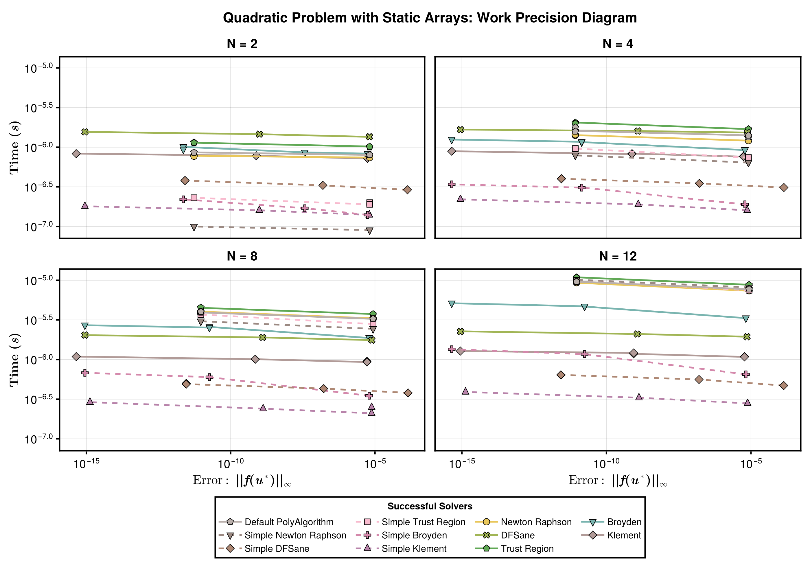
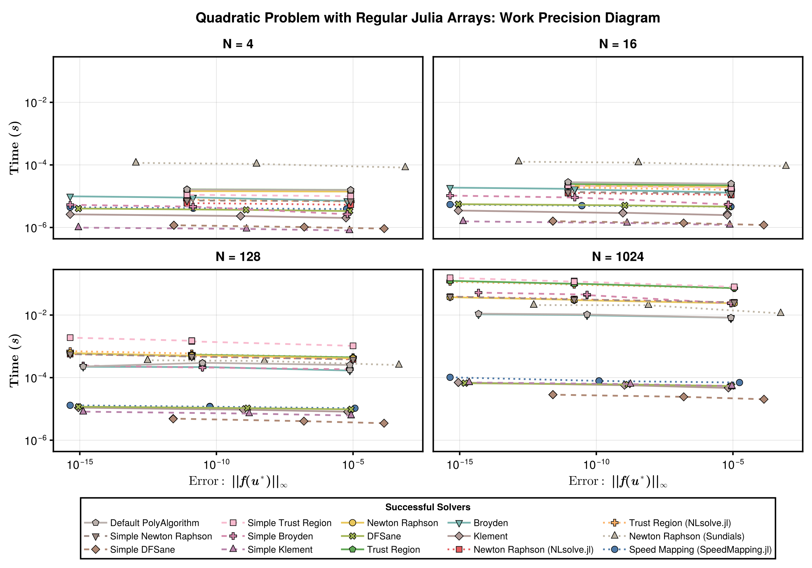

This is a test of a simple small nonlinear rootfinding problem.

```julia
using NonlinearSolve, StaticArrays, DiffEqDevTools, Sundials, CairoMakie, LinearSolve,
    LinearAlgebra, StableRNGs, BenchmarkTools, Setfield, RecursiveFactorization
import PolyesterForwardDiff, MINPACK, NLsolve, SpeedMapping

const RUS = RadiusUpdateSchemes;
BenchmarkTools.DEFAULT_PARAMETERS.seconds = 0.5;

f_oop(u, p) = u .* u .- p
f_iip(du, u, p) = @. du = u * u - p

function generate_prob(::Val{N}, ::Val{static}) where {N, static}
    u0_ = ones(N) .+ randn(StableRNG(0), N) * 0.01
    u0 = static ? SVector{N, Float64}(u0_) : u0_
    prob = static ?
           NonlinearProblem{false}(f_oop, u0, 2.0) :
           NonlinearProblem{true}(f_iip, u0, 2.0)
    return prob
end
```

```
generate_prob (generic function with 1 method)
```


List of Solvers to Benchmark:

```julia
solvers = [
    (; pkg = :nonlinearsolve,       full_pkgname = "NonlinearSolve.jl",       name = "Default PolyAlgorithm",           solver = Dict(:alg => nothing)),

    (; pkg = :simplenonlinearsolve, full_pkgname = "SimpleNonlinearSolve.jl", name = "Simple Newton Raphson",           solver = Dict(:alg => SimpleNewtonRaphson())),
    (; pkg = :simplenonlinearsolve, full_pkgname = "SimpleNonlinearSolve.jl", name = "Simple DFSane",                   solver = Dict(:alg => SimpleDFSane())),
    (; pkg = :simplenonlinearsolve, full_pkgname = "SimpleNonlinearSolve.jl", name = "Simple Trust Region",             solver = Dict(:alg => SimpleTrustRegion(; nlsolve_update_rule = Val(true)))),
    (; pkg = :simplenonlinearsolve, full_pkgname = "SimpleNonlinearSolve.jl", name = "Simple Broyden",                  solver = Dict(:alg => SimpleBroyden())),
    (; pkg = :simplenonlinearsolve, full_pkgname = "SimpleNonlinearSolve.jl", name = "Simple Klement",                  solver = Dict(:alg => SimpleKlement())),

    (; pkg = :nonlinearsolve,       full_pkgname = "NonlinearSolve.jl",       name = "Newton Raphson",                  solver = Dict(:alg => NewtonRaphson(; linsolve = \))),
    (; pkg = :nonlinearsolve,       full_pkgname = "NonlinearSolve.jl",       name = "DFSane",                          solver = Dict(:alg => DFSane())),
    (; pkg = :nonlinearsolve,       full_pkgname = "NonlinearSolve.jl",       name = "Trust Region",                    solver = Dict(:alg => TrustRegion(; linsolve = \, radius_update_scheme = RUS.NLsolve))),
    (; pkg = :nonlinearsolve,       full_pkgname = "NonlinearSolve.jl",       name = "Broyden",                         solver = Dict(:alg => Broyden())),
    (; pkg = :nonlinearsolve,       full_pkgname = "NonlinearSolve.jl",       name = "Klement",                         solver = Dict(:alg => Klement(; linsolve = \))),

    (; pkg = :wrapper,              full_pkgname = "NLsolve.jl",              name = "Newton Raphson (NLsolve.jl)",     solver = Dict(:alg => NLsolveJL(; method = :newton, autodiff = :forward))),
    (; pkg = :wrapper,              full_pkgname = "NLsolve.jl",              name = "Trust Region (NLsolve.jl)",       solver = Dict(:alg => NLsolveJL(; autodiff = :forward))),
    (; pkg = :wrapper,              full_pkgname = "Sundials",                name = "Newton Raphson (Sundials)",       solver = Dict(:alg => KINSOL())),
    (; pkg = :wrapper,              full_pkgname = "SpeedMapping.jl",         name = "Speed Mapping (SpeedMapping.jl)", solver = Dict(:alg => SpeedMappingJL())),
];
```


Configurations:

```julia
abstols = 1.0 ./ 10.0 .^ (3:2:12)
reltols = 1.0 ./ 10.0 .^ (3:2:12)
```

```
5-element Vector{Float64}:
 0.001
 1.0e-5
 1.0e-7
 1.0e-9
 1.0e-11
```


Helper Functions:

```julia
function check_solver(prob, solver)
    prob.u0 isa StaticArray && solver.pkg === :wrapper && return false
    try
        sol = solve(prob, solver.solver[:alg]; abstol = 1e-5, reltol = 1e-5,
            maxiters = 10000)
        err = norm(sol.resid)
        if !SciMLBase.successful_retcode(sol.retcode)
            Base.printstyled("[Warn] Solver $(solver.name) returned retcode $(sol.retcode) \
                              with an residual norm = $(norm(sol.resid)).\n"; color = :red)
            return false
        elseif err > 1e3
            Base.printstyled("[Warn] Solver $(solver.name) had a very large residual (norm \
                              = $(norm(sol.resid))).\n"; color = :red)
            return false
        elseif isinf(err) || isnan(err)
            Base.printstyled("[Warn] Solver $(solver.name) had a residual of $(err).\n";
                color = :red)
            return false
        end
        Base.printstyled("[Info] Solver $(solver.name) successfully solved the problem \
                          (norm = $(norm(sol.resid))).\n"; color = :green)
    catch e
        Base.printstyled("[Warn] Solver $(solver.name) threw an error: $e.\n"; color = :red)
        return false
    end
    return true
end

function generate_wpset(prob, solvers)
    successful_solvers = filter(solver -> check_solver(prob, solver), solvers)
    return WorkPrecisionSet(prob, abstols, reltols, getfield.(successful_solvers, :solver);
        numruns = 50, error_estimate = :l∞, names = getfield.(successful_solvers, :name),
        maxiters = 10000), successful_solvers
end
```

```
generate_wpset (generic function with 1 method)
```


Plotting Functions:

```julia
# This is hardcoded for 4 input length
function plot_all_wpsets(wpset_list, solver_all, titles, suptitle)
    @assert length(wpset_list) == length(titles) == 4
    LINESTYLES = Dict(:nonlinearsolve => :solid, :simplenonlinearsolve => :dash,
        :wrapper => :dot)
    ASPECT_RATIO = 0.7
    WIDTH = 1400
    HEIGHT = round(Int, WIDTH * ASPECT_RATIO)
    STROKEWIDTH = 2.5

    colors = cgrad(:tableau_20, length(solver_all); categorical = true)
    cycle = Cycle([:marker], covary = true)
    plot_theme = Theme(Lines = (; cycle,), Scatter = (; cycle,))

    fig = with_theme(plot_theme) do 
        fig = Figure(; size = (WIDTH, HEIGHT))
        # `textbf` doesn't work
        axs = Matrix{Any}(undef, 2, 2)

        for i in 1:2, j in 1:2
            ylabel = j == 1 ? L"$\mathrm{\mathbf{Time}}$ $\mathbf{(s)}$" : ""
            xlabel = i == 2 ? L"Error: $\mathbf{||f(u^\ast)||_\infty}$" : ""
            ax = Axis(fig[i, j]; ylabel = ylabel, title = titles[2 * (i - 1) + j],
                titlegap = 10, titlesize = 22, xlabelsize = 22, ylabelsize = 22,
                xticklabelsize = 20, yticklabelsize = 20,
                xlabel = xlabel, xticksvisible =  i == 2, yticksvisible = j == 1,
                xticklabelsvisible = i == 2, yticklabelsvisible = j == 1,
                xscale = log10, yscale = log10, xtickwidth = STROKEWIDTH,
                ytickwidth = STROKEWIDTH, spinewidth = STROKEWIDTH)
            axs[i, j] = ax
        end

        ls, scs = [], []
        label_list = []

        for (idx_solver, solver) in enumerate(reverse(solver_all))
            first_success = true
            for i in 1:2, j in 1:2
                wpset, successful_solvers = wpset_list[2 * (i - 1) + j]

                idx = findfirst(==(solver.name), [solver.name for solver in successful_solvers])
                idx === nothing && continue

                (; name, times, errors) = wpset.wps[idx]
                errors = [err.l∞ for err in errors]
                l = lines!(axs[i, j], errors, times; linestyle = LINESTYLES[solver.pkg],
                    label = name, linewidth = 3, color = colors[idx_solver])
                sc = scatter!(axs[i, j], errors, times; label = name, markersize = 16,
                    strokewidth = 1, marker = Cycled(idx_solver),
                    color = colors[idx_solver])

                if first_success
                    push!(ls, l)
                    push!(scs, sc)
                    push!(label_list, solver.name)
                    first_success = false
                end
            end
        end

        linkaxes!(axs...)

        Legend(fig[3, :], collect(reverse([[l, sc] for (l, sc) in zip(ls, scs)])),
            collect(reverse(label_list)),
            "Successful Solvers"; framevisible=true, framewidth = STROKEWIDTH,
            orientation = :horizontal,
            titlesize = 16, nbanks = 3, labelsize = 16,
            tellheight = true, tellwidth = false, patchsize = (40.0f0, 20.0f0))

        fig[0, :] = Label(fig, "Quadratic Problem with $(suptitle): Work Precision Diagram", fontsize = 24, tellwidth = false, font = :bold)

        fig
    end

    return fig
end
```

```
plot_all_wpsets (generic function with 1 method)
```


## Static Array Versions

```julia
probs = [generate_prob(Val(N), Val(true)) for N in [2, 4, 8, 12]];
wpsets = [generate_wpset(prob, solvers) for prob in probs];
titles = ["N = 2", "N = 4", "N = 8", "N = 12"];

fig = plot_all_wpsets(wpsets, solvers, titles, "Static Arrays")
```

```
[Info] Solver Default PolyAlgorithm successfully solved the problem (norm =
 8.903708005997684e-6).
[Info] Solver Simple Newton Raphson successfully solved the problem (norm =
 8.903708005997684e-6).
[Info] Solver Simple DFSane successfully solved the problem (norm = 2.21391
17217408527e-7).
[Info] Solver Simple Trust Region successfully solved the problem (norm = 8
.903708005997684e-6).
[Info] Solver Simple Broyden successfully solved the problem (norm = 7.7435
50661734637e-6).
[Info] Solver Simple Klement successfully solved the problem (norm = 8.7705
08340460738e-6).
[Info] Solver Newton Raphson successfully solved the problem (norm = 8.9037
08005997684e-6).
[Info] Solver DFSane successfully solved the problem (norm = 8.925226244970
55e-6).
[Info] Solver Trust Region successfully solved the problem (norm = 8.903708
005997684e-6).
[Info] Solver Broyden successfully solved the problem (norm = 7.74355066173
4637e-6).
[Info] Solver Klement successfully solved the problem (norm = 7.74279203948
5169e-6).
[Info] Solver Default PolyAlgorithm successfully solved the problem (norm =
 1.3175515250018797e-5).
[Info] Solver Simple Newton Raphson successfully solved the problem (norm =
 1.3175515250018797e-5).
[Info] Solver Simple DFSane successfully solved the problem (norm = 3.21318
9867783094e-7).
[Info] Solver Simple Trust Region successfully solved the problem (norm = 1
.3175515250018797e-5).
[Info] Solver Simple Broyden successfully solved the problem (norm = 1.0524
944462494045e-5).
[Info] Solver Simple Klement successfully solved the problem (norm = 1.2719
355158575668e-5).
[Info] Solver Newton Raphson successfully solved the problem (norm = 1.3175
515250018797e-5).
[Info] Solver DFSane successfully solved the problem (norm = 1.367124759680
58e-5).
[Info] Solver Trust Region successfully solved the problem (norm = 1.317551
5250018797e-5).
[Info] Solver Broyden successfully solved the problem (norm = 1.05249444628
89887e-5).
[Info] Solver Klement successfully solved the problem (norm = 1.04709031908
2685e-5).
[Info] Solver Default PolyAlgorithm successfully solved the problem (norm =
 1.9046552208413456e-5).
[Info] Solver Simple Newton Raphson successfully solved the problem (norm =
 1.9046552208413456e-5).
[Info] Solver Simple DFSane successfully solved the problem (norm = 4.64939
18801382363e-7).
[Info] Solver Simple Trust Region successfully solved the problem (norm = 1
.9046552208413456e-5).
[Info] Solver Simple Broyden successfully solved the problem (norm = 1.4246
490327013533e-5).
[Info] Solver Simple Klement successfully solved the problem (norm = 1.8259
373704793516e-5).
[Info] Solver Newton Raphson successfully solved the problem (norm = 1.9046
552208413456e-5).
[Info] Solver DFSane successfully solved the problem (norm = 1.973829931575
864e-5).
[Info] Solver Trust Region successfully solved the problem (norm = 1.904655
2208413456e-5).
[Info] Solver Broyden successfully solved the problem (norm = 1.42464903270
13533e-5).
[Info] Solver Klement successfully solved the problem (norm = 1.41180265390
8467e-5).
[Info] Solver Default PolyAlgorithm successfully solved the problem (norm =
 2.2187014239665903e-5).
[Info] Solver Simple Newton Raphson successfully solved the problem (norm =
 2.2187014239665903e-5).
[Info] Solver Simple DFSane successfully solved the problem (norm = 5.40467
1405346579e-7).
[Info] Solver Simple Trust Region successfully solved the problem (norm = 2
.2187014239665903e-5).
[Info] Solver Simple Broyden successfully solved the problem (norm = 1.9287
85498427112e-5).
[Info] Solver Simple Klement successfully solved the problem (norm = 2.1607
111134434963e-5).
[Info] Solver Newton Raphson successfully solved the problem (norm = 2.2187
014239665903e-5).
[Info] Solver DFSane successfully solved the problem (norm = 2.295755366158
96e-5).
[Info] Solver Trust Region successfully solved the problem (norm = 2.218701
4239665903e-5).
[Info] Solver Broyden successfully solved the problem (norm = 1.92878549841
49875e-5).
[Info] Solver Klement successfully solved the problem (norm = 1.92365300994
5377e-5).
```




```julia
save("static_arrays_quadratic.svg", fig)
```

```
CairoMakie.Screen{SVG}
```


## Regular Julia Arrays

```julia
probs = [generate_prob(Val(N), Val(false)) for N in [4, 16, 128, 1024]]
wpsets = [(@show length(prob.u0); generate_wpset(prob, solvers)) for prob in probs]
titles = ["N = 4", "N = 16", "N = 128", "N = 1024"]

fig = plot_all_wpsets(wpsets, solvers, titles, "Regular Julia Arrays")
```

```
length(prob.u0) = 4
[Info] Solver Default PolyAlgorithm successfully solved the problem (norm =
 1.3175515250018797e-5).
[Info] Solver Simple Newton Raphson successfully solved the problem (norm =
 1.3175515250018797e-5).
[Info] Solver Simple DFSane successfully solved the problem (norm = 3.21318
9867783094e-7).
[Info] Solver Simple Trust Region successfully solved the problem (norm = 1
.3175515250018797e-5).
[Info] Solver Simple Broyden successfully solved the problem (norm = 1.0524
944462889887e-5).
[Info] Solver Simple Klement successfully solved the problem (norm = 1.2719
355158575668e-5).
[Info] Solver Newton Raphson successfully solved the problem (norm = 1.3175
515250018797e-5).
[Info] Solver DFSane successfully solved the problem (norm = 1.367124759680
58e-5).
[Info] Solver Trust Region successfully solved the problem (norm = 1.317551
5250018797e-5).
[Info] Solver Broyden successfully solved the problem (norm = 1.05249444628
89887e-5).
[Info] Solver Klement successfully solved the problem (norm = 1.04709031908
2685e-5).
[Info] Solver Newton Raphson (NLsolve.jl) successfully solved the problem (
norm = 1.3175515250018797e-5).
[Info] Solver Trust Region (NLsolve.jl) successfully solved the problem (no
rm = 1.3175515250018797e-5).
[Info] Solver Newton Raphson (Sundials) successfully solved the problem (no
rm = 3.507854466145342e-9).
[Info] Solver Speed Mapping (SpeedMapping.jl) successfully solved the probl
em (norm = 1.9601492832512963e-5).
length(prob.u0) = 16
[Info] Solver Default PolyAlgorithm successfully solved the problem (norm =
 2.5044494662558595e-5).
[Info] Solver Simple Newton Raphson successfully solved the problem (norm =
 2.5044494662558595e-5).
[Info] Solver Simple DFSane successfully solved the problem (norm = 6.11269
711700824e-7).
[Info] Solver Simple Trust Region successfully solved the problem (norm = 2
.5044494662558595e-5).
[Info] Solver Simple Broyden successfully solved the problem (norm = 2.3141
389150698733e-5).
[Info] Solver Simple Klement successfully solved the problem (norm = 2.4583
675020896853e-5).
[Info] Solver Newton Raphson successfully solved the problem (norm = 2.5044
494662558595e-5).
[Info] Solver DFSane successfully solved the problem (norm = 2.578212922891
9075e-5).
[Info] Solver Trust Region successfully solved the problem (norm = 2.504449
4662558595e-5).
[Info] Solver Broyden successfully solved the problem (norm = 2.31413891506
98733e-5).
[Info] Solver Klement successfully solved the problem (norm = 2.31146141902
84395e-5).
[Info] Solver Newton Raphson (NLsolve.jl) successfully solved the problem (
norm = 2.5044494662558595e-5).
[Info] Solver Trust Region (NLsolve.jl) successfully solved the problem (no
rm = 2.5044494662558595e-5).
[Info] Solver Newton Raphson (Sundials) successfully solved the problem (no
rm = 6.033406020887388e-9).
[Info] Solver Speed Mapping (SpeedMapping.jl) successfully solved the probl
em (norm = 5.21219858681873e-5).
length(prob.u0) = 128
[Info] Solver Default PolyAlgorithm successfully solved the problem (norm =
 6.545361092122703e-5).
[Info] Solver Simple Newton Raphson successfully solved the problem (norm =
 6.283767496044401e-11).
[Info] Solver Simple DFSane successfully solved the problem (norm = 1.73578
10548996058e-6).
[Info] Solver Simple Trust Region successfully solved the problem (norm = 6
.283767496044401e-11).
[Info] Solver Simple Broyden successfully solved the problem (norm = 6.5453
61092122703e-5).
[Info] Solver Simple Klement successfully solved the problem (norm = 7.0177
89716845796e-5).
[Info] Solver Newton Raphson successfully solved the problem (norm = 6.2837
67496044401e-11).
[Info] Solver DFSane successfully solved the problem (norm = 7.685980582924
527e-5).
[Info] Solver Trust Region successfully solved the problem (norm = 6.283767
496044401e-11).
[Info] Solver Broyden successfully solved the problem (norm = 6.54536109212
2703e-5).
[Info] Solver Klement successfully solved the problem (norm = 6.53197265210
3389e-5).
[Info] Solver Newton Raphson (NLsolve.jl) successfully solved the problem (
norm = 6.283767496044401e-11).
[Info] Solver Trust Region (NLsolve.jl) successfully solved the problem (no
rm = 6.283767496044401e-11).
[Info] Solver Newton Raphson (Sundials) successfully solved the problem (no
rm = 2.0068313703523284e-8).
[Info] Solver Speed Mapping (SpeedMapping.jl) successfully solved the probl
em (norm = 5.551313074230362e-10).
length(prob.u0) = 1024
[Info] Solver Default PolyAlgorithm successfully solved the problem (norm =
 0.00019052993535286191).
[Info] Solver Simple Newton Raphson successfully solved the problem (norm =
 1.7311553941286643e-10).
[Info] Solver Simple DFSane successfully solved the problem (norm = 4.84115
0649443264e-6).
[Info] Solver Simple Trust Region successfully solved the problem (norm = 1
.7311553941286643e-10).
[Info] Solver Simple Broyden successfully solved the problem (norm = 0.0001
9052993535286191).
[Info] Solver Simple Klement successfully solved the problem (norm = 0.0001
967925659287559).
[Info] Solver Newton Raphson successfully solved the problem (norm = 1.7311
553941286643e-10).
[Info] Solver DFSane successfully solved the problem (norm = 0.000216303516
23678866).
[Info] Solver Trust Region successfully solved the problem (norm = 1.731155
3941286643e-10).
[Info] Solver Broyden successfully solved the problem (norm = 0.00019052993
535286191).
[Info] Solver Klement successfully solved the problem (norm = 0.00019007289
32153426).
[Info] Solver Newton Raphson (NLsolve.jl) successfully solved the problem (
norm = 1.7311553941286643e-10).
[Info] Solver Trust Region (NLsolve.jl) successfully solved the problem (no
rm = 1.7311553941286643e-10).
[Info] Solver Newton Raphson (Sundials) successfully solved the problem (no
rm = 5.408987237602836e-8).
[Info] Solver Speed Mapping (SpeedMapping.jl) successfully solved the probl
em (norm = 2.009517968000003e-9).
```




```julia
save("regular_arrays_quadratic.svg", fig)
```

```
CairoMakie.Screen{SVG}
```


## Comparison against SimpleNonlinearSolve

```julia
function benchmark_combinations(solvers, probs)
    return map(Iterators.product(solvers, probs)) do (solver, prob)
        try
            solver_concrete = solver.solver[:alg]
            termination_condition = NonlinearSolveBase.AbsNormTerminationMode(
                Base.Fix1(maximum, abs))
            sol = solve(prob, solver_concrete; abstol = 1e-10, reltol = 1e-10,
                maxiters = 1000, termination_condition)
            @info "Solver $(solver.name) successfully solved the problem with norm = \
                $(norm(sol.resid, Inf))."
            
            if norm(sol.resid, Inf) ≤ 1e-10
                tt = @belapsed solve($prob, $solver_concrete; abstol = 1e-10,
                    reltol = 1e-10, maxiters = 1000,
                    termination_condition = $termination_condition)
                @info "Solver $(solver.name) took $(tt) seconds."
                return tt
            else
                return NaN
            end
        catch e
            @error "Solver $(solver.name) threw an error $(e)."
            return NaN
        end
    end
end

probs_sa = [generate_prob(Val(N), Val(true)) for N in [2, 4, 8, 12]];
solve_timings_sa = benchmark_combinations(solvers, probs_sa)

probs_reg = [generate_prob(Val(N), Val(false)) for N in [4, 16, 128, 1024]];
solve_timings_reg = benchmark_combinations(solvers, probs_reg)

function create_structure_data(solve_timings)
    df = []
    for (i, solver_setup) in enumerate(solvers)
        if solver_setup.pkg === :simplenonlinearsolve
            alg_name = string(solver_setup.name[8:end])
            timings = solve_timings[i, :]
            list = []
            for (j, other_solver) in enumerate(solvers)
                if other_solver.pkg !== :simplenonlinearsolve &&
                    contains(other_solver.name, alg_name)
                    this_timings = solve_timings[j, :]
                    push!(list, other_solver.name => this_timings ./ timings)
                end
            end
            push!(df, alg_name => list)
        end
    end
    return df
end

df_sa = create_structure_data(solve_timings_sa)
df_reg = create_structure_data(solve_timings_reg)

fig = begin
    ASPECT_RATIO = 0.7
    WIDTH = 1200
    HEIGHT = round(Int, WIDTH * ASPECT_RATIO)
    STROKEWIDTH = 2.5

    fig = Figure(; size = (WIDTH, HEIGHT))

    axs = Matrix{Any}(undef, 1, 4)

    xs = reduce(vcat, [fill(i, length(dfᵢ.second)) for (i, dfᵢ) in enumerate(df_sa)])
    dodge = reduce(vcat, [collect(1:length(dfᵢ.second)) for (i, dfᵢ) in enumerate(df_sa)])

    for i in 1:4
        ys = reduce(vcat, [[xx.second[i] for xx in dfᵢ.second] for dfᵢ in df_sa])

        ax = Axis(fig[1, i];
            ylabel = "",
            title = L"$N = %$(length(probs_sa[i].u0))$",
            titlegap = 10, xticksvisible = false, yticksvisible = true,
            xticklabelsvisible = false, yticklabelsvisible = true, titlesize = 22,
            spinewidth = STROKEWIDTH, xlabelsize = 22, ylabelsize = 22,
            xticklabelrotation = π / 4, xticklabelsize = 20, yticklabelsize = 20)
        axs[1, i] = ax

        barplot!(ax, xs, ys; color = dodge, colormap = :tableau_20, strokewidth = 2)

        hlines!(ax, [1.0], color = :black, linestyle = :dash, linewidth = 2)
    end

    linkaxes!(axs...)

    axs = Matrix{Any}(undef, 1, 4)

    xs = reduce(vcat, [fill(i, length(dfᵢ.second)) for (i, dfᵢ) in enumerate(df_reg)])
    dodge = reduce(vcat, [collect(1:length(dfᵢ.second)) for (i, dfᵢ) in enumerate(df_reg)])

    for i in 1:4
        ys = reduce(vcat, [[xx.second[i] for xx in dfᵢ.second] for dfᵢ in df_reg])

        ax = Axis(fig[2, i];
            ylabel = "",
            title = L"$N = %$(length(probs_reg[i].u0))$",
            titlegap = 10, xticksvisible = true, yticksvisible = true,
            xticklabelsvisible = true, yticklabelsvisible = true, titlesize = 22,
            spinewidth = STROKEWIDTH, xlabelsize = 22, ylabelsize = 22,
            xticks = (1:length(df_sa), [d.first for d in df_sa]),
            xticklabelrotation = π / 4, xticklabelsize = 20, yticklabelsize = 20)
        axs[1, i] = ax

        barplot!(ax, xs, ys; color = dodge, dodge = dodge, colormap = :tableau_20,
            strokewidth = 3)

        hlines!(ax, [1.0], color = :black, linestyle = :dash, linewidth = 3)
    end

    linkaxes!(axs...)

    fig[0, :] = Label(fig, "Simple Algorithms on Quadratic Root-Finding Problem",
        fontsize = 24, font = :bold)
    fig[1, 0] = Label(fig, "Static Arrays",
        fontsize = 24, rotation = π / 2, tellheight = false)
    fig[2, 0] = Label(fig, "Regular Julia Arrays",
        fontsize = 24, rotation = π / 2, tellheight = false)
    fig[1:2, end + 1] = Label(fig, "Relative to SimpleNonlinearSolve.jl (Higher is Better)",
        fontsize = 22, tellheight = false, rotation = π / 2)

    labels = ["NonlinearSolve.jl", "NLsolve.jl", "Sundials"]
    colors = cgrad(:tableau_20, length(labels); categorical = true)
    elements = [PolyElement(; polycolor = colors[i], strokewidth = 3) for i in 1:3]
    axislegend(axs[1, 4], elements, labels, "Package", patchsize = (20, 20),
        labelsize = 16, titlesize = 20, framewidth = STROKEWIDTH, rowgap = 5)

    fig
end
```


```julia
save("summary_plot_simplenonlinearsolve.svg", fig)
```

```
CairoMakie.Screen{SVG}
```


## Appendix

These benchmarks are a part of the SciMLBenchmarks.jl repository, found at: [https://github.com/SciML/SciMLBenchmarks.jl](https://github.com/SciML/SciMLBenchmarks.jl). For more information on high-performance scientific machine learning, check out the SciML Open Source Software Organization [https://sciml.ai](https://sciml.ai).

To locally run this benchmark, do the following commands:

```
using SciMLBenchmarks
SciMLBenchmarks.weave_file("benchmarks/NonlinearProblem","quadratic_nonlinear.jmd")
```

Computer Information:

```
Julia Version 1.10.9
Commit 5595d20a287 (2025-03-10 12:51 UTC)
Build Info:
  Official https://julialang.org/ release
Platform Info:
  OS: Linux (x86_64-linux-gnu)
  CPU: 128 × AMD EPYC 7502 32-Core Processor
  WORD_SIZE: 64
  LIBM: libopenlibm
  LLVM: libLLVM-15.0.7 (ORCJIT, znver2)
Threads: 1 default, 0 interactive, 1 GC (on 128 virtual cores)
Environment:
  JULIA_CPU_THREADS = 128
  JULIA_DEPOT_PATH = /cache/julia-buildkite-plugin/depots/5b300254-1738-4989-ae0a-f4d2d937f953

```

Package Information:

```
Status `/cache/build/exclusive-amdci3-0/julialang/scimlbenchmarks-dot-jl/benchmarks/NonlinearProblem/Project.toml`
  [2169fc97] AlgebraicMultigrid v1.0.0
  [6e4b80f9] BenchmarkTools v1.6.0
  [13f3f980] CairoMakie v0.13.4
  [2b5f629d] DiffEqBase v6.167.2
  [f3b72e0c] DiffEqDevTools v2.48.0
  [a0c0ee7d] DifferentiationInterface v0.6.52
  [7da242da] Enzyme v0.13.37
  [40713840] IncompleteLU v0.2.1
  [b964fa9f] LaTeXStrings v1.4.0
  [d3d80556] LineSearches v7.3.0
  [7ed4a6bd] LinearSolve v3.8.0
  [4854310b] MINPACK v1.3.0
  [2774e3e8] NLsolve v4.5.1
  [b7050fa9] NonlinearProblemLibrary v0.1.3
  [8913a72c] NonlinearSolve v4.6.0
  [ace2c81b] PETSc v0.3.1
  [98d1487c] PolyesterForwardDiff v0.1.3
  [08abe8d2] PrettyTables v2.4.0
  [f2c3362d] RecursiveFactorization v0.2.23
  [31c91b34] SciMLBenchmarks v0.1.3
  [efcf1570] Setfield v1.1.2
  [727e6d20] SimpleNonlinearSolve v2.2.2
  [9f842d2f] SparseConnectivityTracer v0.6.17
  [0a514795] SparseMatrixColorings v0.4.18
  [f1835b91] SpeedMapping v0.3.0
  [860ef19b] StableRNGs v1.0.2
  [90137ffa] StaticArrays v1.9.13
  [c3572dad] Sundials v4.28.0
  [0c5d862f] Symbolics v6.38.0
```

And the full manifest:

```
Status `/cache/build/exclusive-amdci3-0/julialang/scimlbenchmarks-dot-jl/benchmarks/NonlinearProblem/Manifest.toml`
  [47edcb42] ADTypes v1.14.0
  [a4c015fc] ANSIColoredPrinters v0.0.1
  [621f4979] AbstractFFTs v1.5.0
  [1520ce14] AbstractTrees v0.4.5
  [7d9f7c33] Accessors v0.1.42
  [22286c92] AccurateArithmetic v0.3.8
  [79e6a3ab] Adapt v4.3.0
  [35492f91] AdaptivePredicates v1.2.0
  [2169fc97] AlgebraicMultigrid v1.0.0
  [66dad0bd] AliasTables v1.1.3
  [27a7e980] Animations v0.4.2
  [4fba245c] ArrayInterface v7.18.0
  [4c555306] ArrayLayouts v1.11.1
  [67c07d97] Automa v1.1.0
  [13072b0f] AxisAlgorithms v1.1.0
  [39de3d68] AxisArrays v0.4.7
  [6e4b80f9] BenchmarkTools v1.6.0
  [e2ed5e7c] Bijections v0.1.9
  [d1d4a3ce] BitFlags v0.1.9
  [62783981] BitTwiddlingConvenienceFunctions v0.1.6
  [70df07ce] BracketingNonlinearSolve v1.1.3
  [fa961155] CEnum v0.5.0
  [2a0fbf3d] CPUSummary v0.2.6
  [159f3aea] Cairo v1.1.1
  [13f3f980] CairoMakie v0.13.4
  [d360d2e6] ChainRulesCore v1.25.1
  [fb6a15b2] CloseOpenIntervals v0.1.13
  [944b1d66] CodecZlib v0.7.8
  [a2cac450] ColorBrewer v0.4.1
  [35d6a980] ColorSchemes v3.29.0
  [3da002f7] ColorTypes v0.12.1
  [c3611d14] ColorVectorSpace v0.11.0
  [5ae59095] Colors v0.13.0
  [861a8166] Combinatorics v1.0.2
  [38540f10] CommonSolve v0.2.4
  [bbf7d656] CommonSubexpressions v0.3.1
  [f70d9fcc] CommonWorldInvalidations v1.0.0
  [34da2185] Compat v4.16.0
  [b152e2b5] CompositeTypes v0.1.4
  [a33af91c] CompositionsBase v0.1.2
  [2569d6c7] ConcreteStructs v0.2.3
  [f0e56b4a] ConcurrentUtilities v2.5.0
  [8f4d0f93] Conda v1.10.2
  [187b0558] ConstructionBase v1.5.8
  [d38c429a] Contour v0.6.3
  [a2441757] Coverage v1.6.1
  [c36e975a] CoverageTools v1.3.2
  [adafc99b] CpuId v0.3.1
  [a8cc5b0e] Crayons v4.1.1
  [9a962f9c] DataAPI v1.16.0
  [864edb3b] DataStructures v0.18.22
  [e2d170a0] DataValueInterfaces v1.0.0
  [927a84f5] DelaunayTriangulation v1.6.4
  [2b5f629d] DiffEqBase v6.167.2
  [f3b72e0c] DiffEqDevTools v2.48.0
  [77a26b50] DiffEqNoiseProcess v5.24.1
  [163ba53b] DiffResults v1.1.0
  [b552c78f] DiffRules v1.15.1
  [a0c0ee7d] DifferentiationInterface v0.6.52
  [b4f34e82] Distances v0.10.12
  [31c24e10] Distributions v0.25.119
  [ffbed154] DocStringExtensions v0.9.4
  [e30172f5] Documenter v1.10.1
  [35a29f4d] DocumenterTools v0.1.20
  [5b8099bc] DomainSets v0.7.15
  [7c1d4256] DynamicPolynomials v0.6.1
  [4e289a0a] EnumX v1.0.5
  [7da242da] Enzyme v0.13.37
  [f151be2c] EnzymeCore v0.8.8
  [429591f6] ExactPredicates v2.2.8
  [460bff9d] ExceptionUnwrapping v0.1.11
  [e2ba6199] ExprTools v0.1.10
  [55351af7] ExproniconLite v0.10.14
  [411431e0] Extents v0.1.5
  [7a1cc6ca] FFTW v1.8.1
  [7034ab61] FastBroadcast v0.3.5
  [9aa1b823] FastClosures v0.3.2
  [a4df4552] FastPower v1.1.2
  [5789e2e9] FileIO v1.17.0
⌅ [8fc22ac5] FilePaths v0.8.3
  [48062228] FilePathsBase v0.9.24
  [1a297f60] FillArrays v1.13.0
  [6a86dc24] FiniteDiff v2.27.0
  [53c48c17] FixedPointNumbers v0.8.5
  [1fa38f19] Format v1.3.7
⌅ [f6369f11] ForwardDiff v0.10.38
  [b38be410] FreeType v4.1.1
  [663a7486] FreeTypeAbstraction v0.10.6
  [069b7b12] FunctionWrappers v1.1.3
  [77dc65aa] FunctionWrappersWrappers v0.1.3
  [46192b85] GPUArraysCore v0.2.0
  [61eb1bfa] GPUCompiler v1.3.2
  [68eda718] GeoFormatTypes v0.4.4
  [cf35fbd7] GeoInterface v1.4.1
  [5c1252a2] GeometryBasics v0.5.7
  [d7ba0133] Git v1.3.1
  [a2bd30eb] Graphics v1.1.3
  [3955a311] GridLayoutBase v0.11.1
  [42e2da0e] Grisu v1.0.2
  [708ec375] Gumbo v0.8.3
  [cd3eb016] HTTP v1.10.16
  [eafb193a] Highlights v0.5.3
  [3e5b6fbb] HostCPUFeatures v0.1.17
  [34004b35] HypergeometricFunctions v0.3.28
  [7073ff75] IJulia v1.27.0
  [b5f81e59] IOCapture v0.2.5
  [615f187c] IfElse v0.1.1
  [2803e5a7] ImageAxes v0.6.12
  [c817782e] ImageBase v0.1.7
  [a09fc81d] ImageCore v0.10.5
  [82e4d734] ImageIO v0.6.9
  [bc367c6b] ImageMetadata v0.9.10
  [40713840] IncompleteLU v0.2.1
  [9b13fd28] IndirectArrays v1.0.0
  [d25df0c9] Inflate v0.1.5
  [18e54dd8] IntegerMathUtils v0.1.2
  [a98d9a8b] Interpolations v0.15.1
  [d1acc4aa] IntervalArithmetic v0.22.29
  [8197267c] IntervalSets v0.7.10
  [3587e190] InverseFunctions v0.1.17
  [92d709cd] IrrationalConstants v0.2.4
  [f1662d9f] Isoband v0.1.1
  [c8e1da08] IterTools v1.10.0
  [82899510] IteratorInterfaceExtensions v1.0.0
  [692b3bcd] JLLWrappers v1.7.0
  [682c06a0] JSON v0.21.4
  [ae98c720] Jieko v0.2.1
  [b835a17e] JpegTurbo v0.1.6
  [5ab0869b] KernelDensity v0.6.9
  [ba0b0d4f] Krylov v0.10.0
  [929cbde3] LLVM v9.2.0
  [b964fa9f] LaTeXStrings v1.4.0
  [23fbe1c1] Latexify v0.16.7
  [10f19ff3] LayoutPointers v0.1.17
  [0e77f7df] LazilyInitializedFields v1.3.0
  [5078a376] LazyArrays v2.6.1
  [8cdb02fc] LazyModules v0.3.1
  [87fe0de2] LineSearch v0.1.4
  [d3d80556] LineSearches v7.3.0
  [7ed4a6bd] LinearSolve v3.8.0
  [2ab3a3ac] LogExpFunctions v0.3.29
  [e6f89c97] LoggingExtras v1.1.0
  [bdcacae8] LoopVectorization v0.12.172
  [4854310b] MINPACK v1.3.0
  [da04e1cc] MPI v0.20.22
  [3da0fdf6] MPIPreferences v0.1.11
  [1914dd2f] MacroTools v0.5.16
  [ee78f7c6] Makie v0.22.4
  [20f20a25] MakieCore v0.9.2
  [d125e4d3] ManualMemory v0.1.8
  [dbb5928d] MappedArrays v0.4.2
  [d0879d2d] MarkdownAST v0.1.2
  [0a4f8689] MathTeXEngine v0.6.3
  [bb5d69b7] MaybeInplace v0.1.4
  [739be429] MbedTLS v1.1.9
  [e1d29d7a] Missings v1.2.0
  [e94cdb99] MosaicViews v0.3.4
  [2e0e35c7] Moshi v0.3.5
  [46d2c3a1] MuladdMacro v0.2.4
  [102ac46a] MultivariatePolynomials v0.5.7
  [ffc61752] Mustache v1.0.20
  [d8a4904e] MutableArithmetics v1.6.4
  [d41bc354] NLSolversBase v7.9.1
  [2774e3e8] NLsolve v4.5.1
  [77ba4419] NaNMath v1.1.3
  [f09324ee] Netpbm v1.1.1
  [b7050fa9] NonlinearProblemLibrary v0.1.3
  [8913a72c] NonlinearSolve v4.6.0
  [be0214bd] NonlinearSolveBase v1.5.3
  [5959db7a] NonlinearSolveFirstOrder v1.3.1
  [9a2c21bd] NonlinearSolveQuasiNewton v1.2.1
  [26075421] NonlinearSolveSpectralMethods v1.1.1
  [d8793406] ObjectFile v0.4.4
  [510215fc] Observables v0.5.5
  [6fe1bfb0] OffsetArrays v1.17.0
  [52e1d378] OpenEXR v0.3.3
  [4d8831e6] OpenSSL v1.4.3
  [429524aa] Optim v1.12.0
  [bac558e1] OrderedCollections v1.8.0
  [90014a1f] PDMats v0.11.34
  [ace2c81b] PETSc v0.3.1
  [f57f5aa1] PNGFiles v0.4.4
  [19eb6ba3] Packing v0.5.1
  [5432bcbf] PaddedViews v0.5.12
  [d96e819e] Parameters v0.12.3
  [69de0a69] Parsers v2.8.2
  [eebad327] PkgVersion v0.3.3
  [995b91a9] PlotUtils v1.4.3
  [e409e4f3] PoissonRandom v0.4.4
  [f517fe37] Polyester v0.7.16
  [98d1487c] PolyesterForwardDiff v0.1.3
  [1d0040c9] PolyesterWeave v0.2.2
  [647866c9] PolygonOps v0.1.2
  [85a6dd25] PositiveFactorizations v0.2.4
⌅ [aea7be01] PrecompileTools v1.2.1
  [21216c6a] Preferences v1.4.3
  [08abe8d2] PrettyTables v2.4.0
  [27ebfcd6] Primes v0.5.7
  [92933f4c] ProgressMeter v1.10.4
  [43287f4e] PtrArrays v1.3.0
  [4b34888f] QOI v1.0.1
  [1fd47b50] QuadGK v2.11.2
  [74087812] Random123 v1.7.0
  [e6cf234a] RandomNumbers v1.6.0
  [b3c3ace0] RangeArrays v0.3.2
  [c84ed2f1] Ratios v0.4.5
  [3cdcf5f2] RecipesBase v1.3.4
  [731186ca] RecursiveArrayTools v3.31.2
  [f2c3362d] RecursiveFactorization v0.2.23
  [189a3867] Reexport v1.2.2
  [2792f1a3] RegistryInstances v0.1.0
  [05181044] RelocatableFolders v1.0.1
  [ae029012] Requires v1.3.1
  [ae5879a3] ResettableStacks v1.1.1
  [79098fc4] Rmath v0.8.0
  [47965b36] RootedTrees v2.23.1
  [5eaf0fd0] RoundingEmulator v0.2.1
  [7e49a35a] RuntimeGeneratedFunctions v0.5.13
  [fdea26ae] SIMD v3.7.1
  [94e857df] SIMDTypes v0.1.0
  [476501e8] SLEEFPirates v0.6.43
  [322a6be2] Sass v0.2.0
  [0bca4576] SciMLBase v2.84.0
  [31c91b34] SciMLBenchmarks v0.1.3
  [19f34311] SciMLJacobianOperators v0.1.2
  [c0aeaf25] SciMLOperators v0.3.13
  [53ae85a6] SciMLStructures v1.7.0
  [6c6a2e73] Scratch v1.2.1
  [efcf1570] Setfield v1.1.2
  [65257c39] ShaderAbstractions v0.5.0
  [992d4aef] Showoff v1.0.3
  [73760f76] SignedDistanceFields v0.4.0
  [777ac1f9] SimpleBufferStream v1.2.0
  [727e6d20] SimpleNonlinearSolve v2.2.2
  [699a6c99] SimpleTraits v0.9.4
  [45858cf5] Sixel v0.1.3
  [b85f4697] SoftGlobalScope v1.1.0
  [a2af1166] SortingAlgorithms v1.2.1
  [9f842d2f] SparseConnectivityTracer v0.6.17
  [0a514795] SparseMatrixColorings v0.4.18
  [276daf66] SpecialFunctions v2.5.1
  [f1835b91] SpeedMapping v0.3.0
  [860ef19b] StableRNGs v1.0.2
  [cae243ae] StackViews v0.1.1
  [aedffcd0] Static v1.2.0
  [0d7ed370] StaticArrayInterface v1.8.0
  [90137ffa] StaticArrays v1.9.13
  [1e83bf80] StaticArraysCore v1.4.3
  [82ae8749] StatsAPI v1.7.0
  [2913bbd2] StatsBase v0.34.4
  [4c63d2b9] StatsFuns v1.4.0
  [7792a7ef] StrideArraysCore v0.5.7
  [69024149] StringEncodings v0.3.7
  [892a3eda] StringManipulation v0.4.1
  [09ab397b] StructArrays v0.7.1
  [53d494c1] StructIO v0.3.1
  [c3572dad] Sundials v4.28.0
  [2efcf032] SymbolicIndexingInterface v0.3.39
  [19f23fe9] SymbolicLimits v0.2.2
  [d1185830] SymbolicUtils v3.26.1
  [0c5d862f] Symbolics v6.38.0
  [3783bdb8] TableTraits v1.0.1
  [bd369af6] Tables v1.12.0
  [ed4db957] TaskLocalValues v0.1.2
  [62fd8b95] TensorCore v0.1.1
  [8ea1fca8] TermInterface v2.0.0
  [8290d209] ThreadingUtilities v0.5.3
  [731e570b] TiffImages v0.11.3
  [a759f4b9] TimerOutputs v0.5.28
  [3bb67fe8] TranscodingStreams v0.11.3
  [d5829a12] TriangularSolve v0.2.1
  [981d1d27] TriplotBase v0.1.0
  [781d530d] TruncatedStacktraces v1.4.0
  [5c2747f8] URIs v1.5.2
  [3a884ed6] UnPack v1.0.2
  [1cfade01] UnicodeFun v0.4.1
  [1986cc42] Unitful v1.22.0
  [a7c27f48] Unityper v0.1.6
  [3d5dd08c] VectorizationBase v0.21.71
  [81def892] VersionParsing v1.3.0
  [44d3d7a6] Weave v0.10.12
  [e3aaa7dc] WebP v0.1.3
  [efce3f68] WoodburyMatrices v1.0.0
  [ddb6d928] YAML v0.4.13
  [c2297ded] ZMQ v1.4.0
  [6e34b625] Bzip2_jll v1.0.9+0
  [4e9b3aee] CRlibm_jll v1.0.1+0
⌃ [83423d85] Cairo_jll v1.18.4+0
  [5ae413db] EarCut_jll v2.2.4+0
⌅ [7cc45869] Enzyme_jll v0.0.173+0
  [2e619515] Expat_jll v2.6.5+0
⌅ [b22a6f82] FFMPEG_jll v6.1.2+0
  [f5851436] FFTW_jll v3.3.11+0
  [a3f928ae] Fontconfig_jll v2.16.0+0
  [d7e528f0] FreeType2_jll v2.13.4+0
  [559328eb] FriBidi_jll v1.0.17+0
  [78b55507] Gettext_jll v0.21.0+0
  [59f7168a] Giflib_jll v5.2.3+0
  [f8c6e375] Git_jll v2.49.0+0
⌃ [7746bdde] Glib_jll v2.82.4+0
  [3b182d85] Graphite2_jll v1.3.15+0
  [528830af] Gumbo_jll v0.10.2+0
  [2e76f6c2] HarfBuzz_jll v8.5.0+0
  [e33a78d0] Hwloc_jll v2.12.0+0
  [905a6f67] Imath_jll v3.1.11+0
  [1d5cc7b8] IntelOpenMP_jll v2025.0.4+0
  [aacddb02] JpegTurbo_jll v3.1.1+0
  [c1c5ebd0] LAME_jll v3.100.2+0
  [88015f11] LERC_jll v4.0.1+0
  [dad2f222] LLVMExtra_jll v0.0.35+0
  [1d63c593] LLVMOpenMP_jll v18.1.7+0
  [dd4b983a] LZO_jll v2.10.3+0
⌅ [e9f186c6] Libffi_jll v3.2.2+2
  [7e76a0d4] Libglvnd_jll v1.7.1+1
  [94ce4f54] Libiconv_jll v1.18.0+0
  [4b2f31a3] Libmount_jll v2.41.0+0
  [89763e89] Libtiff_jll v4.7.1+0
  [38a345b3] Libuuid_jll v2.41.0+0
  [856f044c] MKL_jll v2025.0.1+1
  [7cb0a576] MPICH_jll v4.3.0+1
  [f1f71cc9] MPItrampoline_jll v5.5.3+0
  [9237b28f] MicrosoftMPI_jll v10.1.4+3
  [e7412a2a] Ogg_jll v1.3.5+1
⌅ [656ef2d0] OpenBLAS32_jll v0.3.24+0
  [6cdc7f73] OpenBLASConsistentFPCSR_jll v0.3.29+0
  [18a262bb] OpenEXR_jll v3.2.4+0
  [fe0851c0] OpenMPI_jll v5.0.7+2
⌅ [9bd350c2] OpenSSH_jll v9.9.2+0
  [458c3c95] OpenSSL_jll v3.0.16+0
  [efe28fd5] OpenSpecFun_jll v0.5.6+0
  [91d4177d] Opus_jll v1.3.3+0
  [8fa3689e] PETSc_jll v3.22.0+0
  [36c8627f] Pango_jll v1.56.1+0
  [30392449] Pixman_jll v0.44.2+0
  [f50d1b31] Rmath_jll v0.5.1+0
  [aabda75e] SCALAPACK32_jll v2.2.1+1
⌅ [fb77eaff] Sundials_jll v5.2.2+0
⌅ [02c8fc9c] XML2_jll v2.13.6+1
  [ffd25f8a] XZ_jll v5.8.1+0
  [4f6342f7] Xorg_libX11_jll v1.8.12+0
  [0c0b7dd1] Xorg_libXau_jll v1.0.13+0
  [a3789734] Xorg_libXdmcp_jll v1.1.6+0
  [1082639a] Xorg_libXext_jll v1.3.7+0
  [ea2f1a96] Xorg_libXrender_jll v0.9.12+0
  [c7cfdc94] Xorg_libxcb_jll v1.17.1+0
  [c5fb5394] Xorg_xtrans_jll v1.6.0+0
  [8f1865be] ZeroMQ_jll v4.3.6+0
  [3161d3a3] Zstd_jll v1.5.7+1
  [b792d7bf] cminpack_jll v1.3.12+0
  [9a68df92] isoband_jll v0.2.3+0
  [a4ae2306] libaom_jll v3.11.0+0
  [0ac62f75] libass_jll v0.15.2+0
  [f638f0a6] libfdk_aac_jll v2.0.3+0
  [b53b4c65] libpng_jll v1.6.47+0
  [47bcb7c8] libsass_jll v3.6.6+0
  [075b6546] libsixel_jll v1.10.5+0
  [a9144af2] libsodium_jll v1.0.21+0
  [f27f6e37] libvorbis_jll v1.3.7+2
  [c5f90fcd] libwebp_jll v1.5.0+0
  [1317d2d5] oneTBB_jll v2022.0.0+0
  [1270edf5] x264_jll v10164.0.1+0
⌅ [dfaa095f] x265_jll v3.6.0+0
  [0dad84c5] ArgTools v1.1.1
  [56f22d72] Artifacts
  [2a0f44e3] Base64
  [8bf52ea8] CRC32c
  [ade2ca70] Dates
  [8ba89e20] Distributed
  [f43a241f] Downloads v1.6.0
  [7b1f6079] FileWatching
  [9fa8497b] Future
  [b77e0a4c] InteractiveUtils
  [4af54fe1] LazyArtifacts
  [b27032c2] LibCURL v0.6.4
  [76f85450] LibGit2
  [8f399da3] Libdl
  [37e2e46d] LinearAlgebra
  [56ddb016] Logging
  [d6f4376e] Markdown
  [a63ad114] Mmap
  [ca575930] NetworkOptions v1.2.0
  [44cfe95a] Pkg v1.10.0
  [de0858da] Printf
  [9abbd945] Profile
  [3fa0cd96] REPL
  [9a3f8284] Random
  [ea8e919c] SHA v0.7.0
  [9e88b42a] Serialization
  [1a1011a3] SharedArrays
  [6462fe0b] Sockets
  [2f01184e] SparseArrays v1.10.0
  [10745b16] Statistics v1.10.0
  [4607b0f0] SuiteSparse
  [fa267f1f] TOML v1.0.3
  [a4e569a6] Tar v1.10.0
  [8dfed614] Test
  [cf7118a7] UUIDs
  [4ec0a83e] Unicode
  [e66e0078] CompilerSupportLibraries_jll v1.1.1+0
  [deac9b47] LibCURL_jll v8.4.0+0
  [e37daf67] LibGit2_jll v1.6.4+0
  [29816b5a] LibSSH2_jll v1.11.0+1
  [c8ffd9c3] MbedTLS_jll v2.28.2+1
  [14a3606d] MozillaCACerts_jll v2023.1.10
  [4536629a] OpenBLAS_jll v0.3.23+4
  [05823500] OpenLibm_jll v0.8.1+4
  [efcefdf7] PCRE2_jll v10.42.0+1
  [bea87d4a] SuiteSparse_jll v7.2.1+1
  [83775a58] Zlib_jll v1.2.13+1
  [8e850b90] libblastrampoline_jll v5.11.0+0
  [8e850ede] nghttp2_jll v1.52.0+1
  [3f19e933] p7zip_jll v17.4.0+2
Info Packages marked with ⌃ and ⌅ have new versions available. Those with ⌃ may be upgradable, but those with ⌅ are restricted by compatibility constraints from upgrading. To see why use `status --outdated -m`
```

