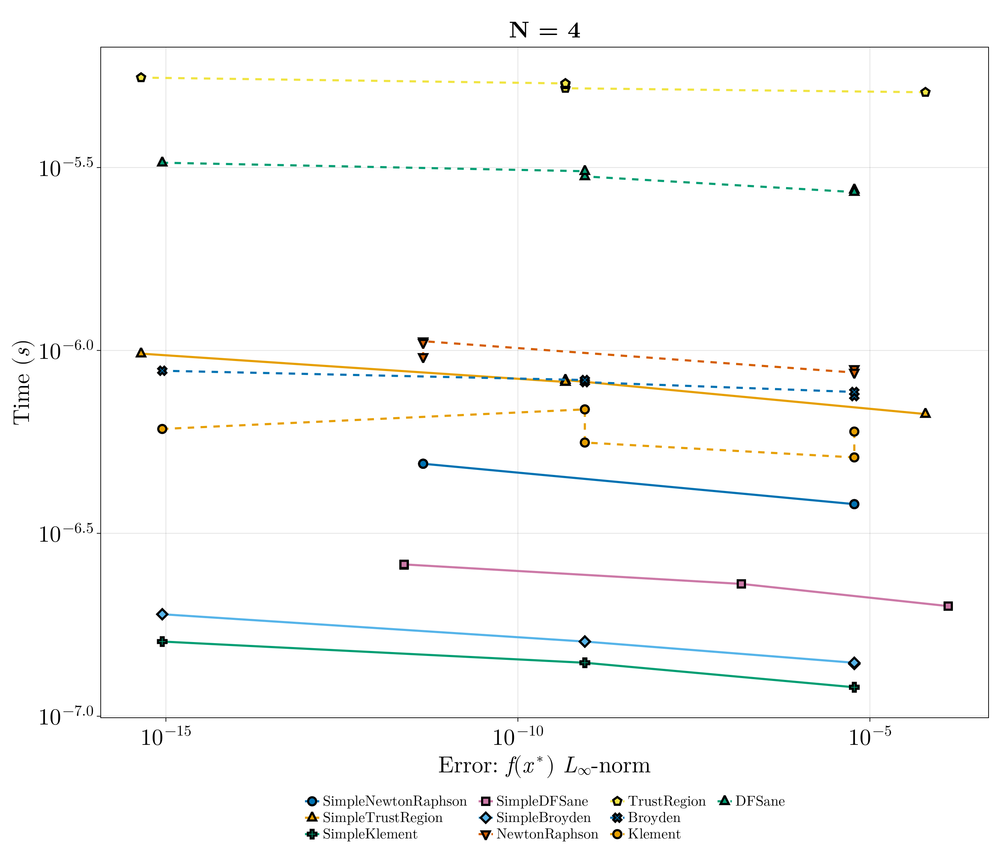
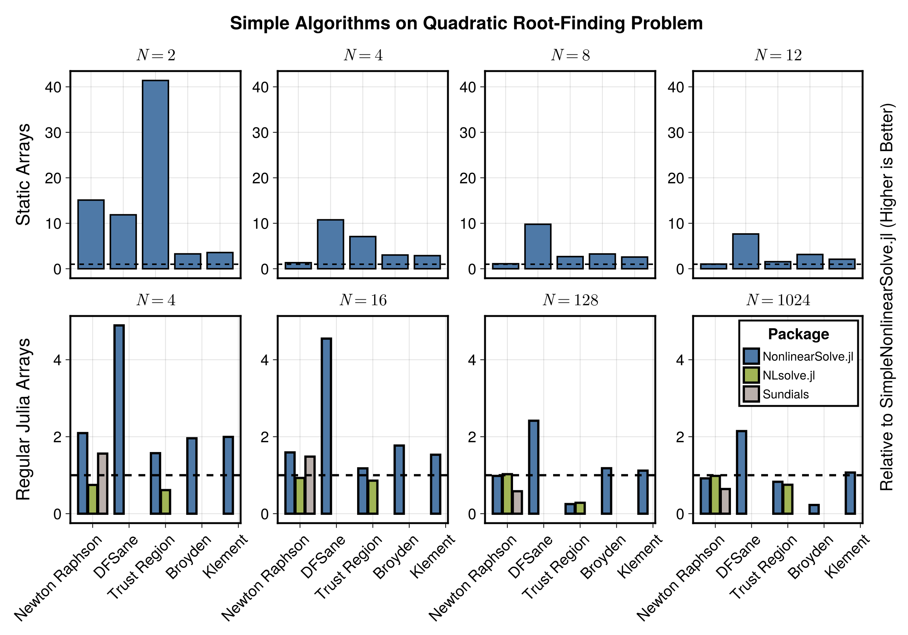

This is a test of a simple small nonlinear rootfinding problem.

```julia
using NonlinearSolve, StaticArrays, DiffEqDevTools, Sundials, CairoMakie, LinearSolve,
    LinearAlgebra
import MINPACK, NLsolve, SpeedMapping

f_oop(u, p) = u .* u .- p
f_iip(du, u, p) = (du .= u .* u .- p)

function generate_prob(::Val{N}, ::Val{static}) where {N, static}
    u0 = static ? ones(SVector{N, Float64}) : ones(N)
    prob = static ? NonlinearProblem{false}(f_oop, u0, 2.0) :
           NonlinearProblem{true}(f_iip, u0, 2.0)
    return prob
end
```

```
generate_prob (generic function with 1 method)
```


List of Solvers to Benchmark:

```julia
solvers = [
    (; type = :simplenonlinearsolve, solver = Dict(:alg => SimpleNewtonRaphson()), name = "SimpleNewtonRaphson"),
    (; type = :simplenonlinearsolve, solver = Dict(:alg => SimpleTrustRegion()), name = "SimpleTrustRegion"),
    (; type = :simplenonlinearsolve, solver = Dict(:alg => SimpleKlement()), name = "SimpleKlement"),
    (; type = :simplenonlinearsolve, solver = Dict(:alg => SimpleDFSane()), name = "SimpleDFSane"),
    (; type = :simplenonlinearsolve, solver = Dict(:alg => SimpleBroyden()), name = "SimpleBroyden"),
    (; type = :nonlinearsolve, solver = Dict(:alg => NewtonRaphson()), name = "NewtonRaphson"),
    (; type = :nonlinearsolve, solver = Dict(:alg => TrustRegion()), name = "TrustRegion"),
    (; type = :nonlinearsolve, solver = Dict(:alg => Broyden()), name = "Broyden"),
    (; type = :nonlinearsolve, solver = Dict(:alg => Klement()), name = "Klement"),
    (; type = :nonlinearsolve, solver = Dict(:alg => DFSane()), name = "DFSane"),
    (; type = :others, solver = Dict(:alg => KINSOL()), name = "Newton's Method (Sundials)"),
    (; type = :others, solver = Dict(:alg => CMINPACK(; method = :lm)), name = "Levenberg-Marquardt (CMINPACK)"),
    (; type = :others, solver = Dict(:alg => CMINPACK(; method = :hybr)), name = "Hybrid Powell (CMINPACK)"),
    (; type = :others, solver = Dict(:alg => SpeedMappingJL()), name = "SpeedMapping"),
    (; type = :others, solver = Dict(:alg => NLsolveJL()), name = "NLsolve"),
]
```

```
15-element Vector{NamedTuple{(:type, :solver, :name)}}:
 (type = :simplenonlinearsolve, solver = Dict(:alg => SimpleNonlinearSolve.
SimpleNewtonRaphson{ADTypes.AutoForwardDiff{nothing, Nothing}}(ADTypes.Auto
ForwardDiff{nothing, Nothing}(nothing))), name = "SimpleNewtonRaphson")
 (type = :simplenonlinearsolve, solver = Dict{Symbol, SimpleNonlinearSolve.
SimpleTrustRegion{ADTypes.AutoForwardDiff{nothing, Nothing}, Float64, Float
64, Float64, Float64, Float64, Float64, Float64}}(:alg => SimpleNonlinearSo
lve.SimpleTrustRegion{ADTypes.AutoForwardDiff{nothing, Nothing}, Float64, F
loat64, Float64, Float64, Float64, Float64, Float64}(ADTypes.AutoForwardDif
f{nothing, Nothing}(nothing), 0.0, 0.0, 0.0001, 0.25, 0.75, 0.25, 2.0, 32))
, name = "SimpleTrustRegion")
 (type = :simplenonlinearsolve, solver = Dict(:alg => SimpleNonlinearSolve.
SimpleKlement()), name = "SimpleKlement")
 (type = :simplenonlinearsolve, solver = Dict{Symbol, SimpleNonlinearSolve.
SimpleDFSane{Float64, Float64, Float64, Float64, Float64, Float64, SimpleNo
nlinearSolve.var"#27#32"}}(:alg => SimpleNonlinearSolve.SimpleDFSane{Float6
4, Float64, Float64, Float64, Float64, Float64, SimpleNonlinearSolve.var"#2
7#32"}(1.0e-10, 1.0e10, 1.0, 10, 0.0001, 0.1, 0.5, 2, SimpleNonlinearSolve.
var"#27#32"())), name = "SimpleDFSane")
 (type = :simplenonlinearsolve, solver = Dict(:alg => SimpleNonlinearSolve.
SimpleBroyden()), name = "SimpleBroyden")
 (type = :nonlinearsolve, solver = Dict{Symbol, NonlinearSolve.NewtonRaphso
n{nothing, Nothing, Nothing, typeof(NonlinearSolve.DEFAULT_PRECS), Nonlinea
rSolve.LineSearch{Nothing, Nothing, Bool}}}(:alg => NewtonRaphson()), name 
= "NewtonRaphson")
 (type = :nonlinearsolve, solver = Dict{Symbol, NonlinearSolve.TrustRegion{
nothing, Nothing, Rational{Int64}, Nothing, typeof(NonlinearSolve.DEFAULT_P
RECS), Rational{Int64}, Nothing}}(:alg => TrustRegion(radius_update_scheme 
= Simple)), name = "TrustRegion")
 (type = :nonlinearsolve, solver = Dict{Symbol, NonlinearSolve.Broyden{:ide
ntity, :good_broyden, false, Nothing, Nothing, NonlinearSolve.LineSearch{No
thing, Nothing, Bool}, Nothing}}(:alg => Broyden()), name = "Broyden")
 (type = :nonlinearsolve, solver = Dict{Symbol, NonlinearSolve.Klement{:ide
ntity, false, Nothing, Nothing, typeof(NonlinearSolve.DEFAULT_PRECS), Nonli
nearSolve.LineSearch{Nothing, Nothing, Bool}, Bool}}(:alg => Klement(alpha 
= true)), name = "Klement")
 (type = :nonlinearsolve, solver = Dict{Symbol, NonlinearSolve.DFSane{Float
64, Float64, Float64, Float64, Float64, Float64, NonlinearSolve.var"#57#62"
}}(:alg => DFSane()), name = "DFSane")
 (type = :others, solver = Dict{Symbol, Sundials.KINSOL{:Dense}}(:alg => Su
ndials.KINSOL{:Dense}(0, 0, nothing, 0, 0, :None)), name = "Newton's Method
 (Sundials)")
 (type = :others, solver = Dict{Symbol, NonlinearSolve.CMINPACK}(:alg => CM
INPACK()), name = "Levenberg-Marquardt (CMINPACK)")
 (type = :others, solver = Dict{Symbol, NonlinearSolve.CMINPACK}(:alg => CM
INPACK()), name = "Hybrid Powell (CMINPACK)")
 (type = :others, solver = Dict{Symbol, NonlinearSolve.SpeedMappingJL{Float
64, Int64}}(:alg => SpeedMappingJL()), name = "SpeedMapping")
 (type = :others, solver = Dict{Symbol, NonlinearSolve.NLsolveJL{LineSearch
es.Static, NonlinearSolve.var"#21#23", Float64, Float64}}(:alg => NLsolveJL
(linsolve = #21#23(), linesearch = Static())), name = "NLsolve")
```


Configurations:

```julia
abstols = 1.0 ./ 10.0 .^ (3:2:12)
reltols = 1.0 ./ 10.0 .^ (3:2:12)
```

```
5-element Vector{Float64}:
 0.001
 1.0e-5
 1.0e-7
 1.0e-9
 1.0e-11
```


Helper Functions:

```julia
function check_solver(prob, solver)
    try
        sol = solve(prob, solver.solver[:alg]; abstol = 1e-5, reltol = 1e-5,
            maxiters = 10000)
        err = norm(sol.resid)
        if !SciMLBase.successful_retcode(sol.retcode)
            Base.printstyled("[Warn] Solver $(solver.name) returned retcode $(sol.retcode) with an residual norm = $(norm(sol.resid)).\n";
                color = :red)
            return false
        elseif err > 1e3
            Base.printstyled("[Warn] Solver $(solver.name) had a very large residual (norm = $(norm(sol.resid))).\n";
                color = :red)
            return false
        elseif isinf(err) || isnan(err)
            Base.printstyled("[Warn] Solver $(solver.name) had a residual of $(err).\n";
                color = :red)
            return false
        end
        Base.printstyled("[Info] Solver $(solver.name) successfully solved the problem (norm = $(norm(sol.resid))).\n";
            color = :green)
    catch e
        Base.printstyled("[Warn] Solver $(solver.name) threw an error: $e.\n"; color = :red)
        return false
    end
    return true
end

function generate_wpset(prob, solvers)
    successful_solvers = filter(solver -> check_solver(prob, solver), solvers)
    return WorkPrecisionSet(prob, abstols, reltols, getfield.(successful_solvers, :solver);
        numruns = 50, error_estimate = :l∞, names = getfield.(successful_solvers, :name),
        maxiters = 10000), successful_solvers
end
```

```
generate_wpset (generic function with 1 method)
```


Plotting Functions:

```julia
function plot_wpset(wpset, successful_solvers, title)
    cycle = Cycle([:color, :marker], covary = true)
    theme = merge(theme_latexfonts(), Theme(Lines = (cycle = cycle,),
        Scatter = (cycle = cycle,)))

    linestyle = Dict(:simplenonlinearsolve => :solid, :nonlinearsolve => :dash,
        :others => :dot)

    fig = with_theme(theme; fontsize = 32) do 
        fig = Figure(; size = (1400, 1200))
        ax = Axis(fig[1, 1]; ylabel = L"Time ($s$)", title, xscale = log10, yscale = log10,
            xlabel = L"Error: $f(x^\ast)$ $L_{\infty}$-norm")

        ls, scs = [], []
        
        for (wp, solver) in zip(wpset.wps, successful_solvers)
            (; name, times, errors) = wp
            errors = [err.l∞ for err in errors]
            l = lines!(ax, errors, times; label = name, linewidth = 3, linestyle = linestyle[solver.type])
            sc = scatter!(ax, errors, times; label = name, markersize = 16, strokewidth = 3)
            push!(ls, l)
            push!(scs, sc)
        end

        Legend(fig[2, 1], [[l, sc] for (l, sc) in zip(ls, scs)],
            [solver.name for solver in successful_solvers], position = :ct, color = :white,
            framevisible=false, label = "Solvers", orientation = :horizontal,
            tellwidth = false, tellheight = true, nbanks = 3, labelsize = 20)

        fig
    end

    return fig
end
```

```
plot_wpset (generic function with 1 method)
```


## Static Array Versions

### N = 2

```julia
prob = generate_prob(Val(2), Val(true))
wpset, successful_solvers = generate_wpset(prob, solvers);
fig = plot_wpset(wpset, successful_solvers, "N = 2")
```

```
[Info] Solver SimpleNewtonRaphson successfully solved the problem (norm = 8
.495612038666664e-6).
[Info] Solver SimpleTrustRegion successfully solved the problem (norm = 6.6
87362921505273e-10).
[Info] Solver SimpleKlement successfully solved the problem (norm = 8.49558
6520581969e-6).
[Info] Solver SimpleDFSane successfully solved the problem (norm = 2.110961
8780448975e-7).
[Info] Solver SimpleBroyden successfully solved the problem (norm = 8.49558
6520581969e-6).
[Info] Solver NewtonRaphson successfully solved the problem (norm = 8.49561
2038666664e-6).
[Info] Solver TrustRegion successfully solved the problem (norm = 6.6873629
21505273e-10).
[Info] Solver Broyden successfully solved the problem (norm = 8.49561203866
6664e-6).
[Info] Solver Klement successfully solved the problem (norm = 8.49558652058
1969e-6).
[Info] Solver DFSane successfully solved the problem (norm = 2.110961878044
8975e-7).
[Warn] Solver Newton's Method (Sundials) threw an error: MethodError(Core.k
wcall, ((userdata = nothing, linear_solver = :Dense, jac_upper = 0, jac_low
er = 0, abstol = 1.0e-5, jac_prototype = nothing, prec_side = 0, krylov_dim
 = 0, maxiters = 10000, strategy = :None), Sundials.___kinsol, Sundials.var
"#32#38"{SciMLBase.NonlinearProblem{StaticArraysCore.SVector{2, Float64}, f
alse, Float64, SciMLBase.NonlinearFunction{false, SciMLBase.FullSpecialize,
 typeof(Main.var"##WeaveSandBox#292".f_oop), LinearAlgebra.UniformScaling{B
ool}, Nothing, Nothing, Nothing, Nothing, Nothing, Nothing, Nothing, Nothin
g, Nothing, Nothing, typeof(SciMLBase.DEFAULT_OBSERVED_NO_TIME), Nothing, S
ymbolicIndexingInterface.SymbolCache{Nothing, Nothing, Nothing}, Nothing}, 
Base.Pairs{Symbol, Union{}, Tuple{}, NamedTuple{(), Tuple{}}}, SciMLBase.St
andardNonlinearProblem}, Float64}(SciMLBase.NonlinearProblem{StaticArraysCo
re.SVector{2, Float64}, false, Float64, SciMLBase.NonlinearFunction{false, 
SciMLBase.FullSpecialize, typeof(Main.var"##WeaveSandBox#292".f_oop), Linea
rAlgebra.UniformScaling{Bool}, Nothing, Nothing, Nothing, Nothing, Nothing,
 Nothing, Nothing, Nothing, Nothing, Nothing, typeof(SciMLBase.DEFAULT_OBSE
RVED_NO_TIME), Nothing, SymbolicIndexingInterface.SymbolCache{Nothing, Noth
ing, Nothing}, Nothing}, Base.Pairs{Symbol, Union{}, Tuple{}, NamedTuple{()
, Tuple{}}}, SciMLBase.StandardNonlinearProblem}(SciMLBase.NonlinearFunctio
n{false, SciMLBase.FullSpecialize, typeof(Main.var"##WeaveSandBox#292".f_oo
p), LinearAlgebra.UniformScaling{Bool}, Nothing, Nothing, Nothing, Nothing,
 Nothing, Nothing, Nothing, Nothing, Nothing, Nothing, typeof(SciMLBase.DEF
AULT_OBSERVED_NO_TIME), Nothing, SymbolicIndexingInterface.SymbolCache{Noth
ing, Nothing, Nothing}, Nothing}(Main.var"##WeaveSandBox#292".f_oop, Linear
Algebra.UniformScaling{Bool}(true), nothing, nothing, nothing, nothing, not
hing, nothing, nothing, nothing, nothing, nothing, SciMLBase.DEFAULT_OBSERV
ED_NO_TIME, nothing, SymbolicIndexingInterface.SymbolCache{Nothing, Nothing
, Nothing}(nothing, nothing, nothing), nothing), [1.0, 1.0], 2.0, SciMLBase
.StandardNonlinearProblem(), Base.Pairs{Symbol, Union{}, Tuple{}, NamedTupl
e{(), Tuple{}}}()), 2.0), [1.0, 1.0]), 0x0000000000008411).
[Warn] Solver Levenberg-Marquardt (CMINPACK) threw an error: MethodError(Co
re.kwcall, ((tol = 1.0e-5, show_trace = false, tracing = false, method = :l
m, iterations = 10000, reltol = 1.0e-5), MINPACK.fsolve, NonlinearSolveMINP
ACKExt.var"#3#13"{SciMLBase.NonlinearProblem{StaticArraysCore.SVector{2, Fl
oat64}, false, Float64, SciMLBase.NonlinearFunction{false, SciMLBase.FullSp
ecialize, typeof(Main.var"##WeaveSandBox#292".f_oop), LinearAlgebra.Uniform
Scaling{Bool}, Nothing, Nothing, Nothing, Nothing, Nothing, Nothing, Nothin
g, Nothing, Nothing, Nothing, typeof(SciMLBase.DEFAULT_OBSERVED_NO_TIME), N
othing, SymbolicIndexingInterface.SymbolCache{Nothing, Nothing, Nothing}, N
othing}, Base.Pairs{Symbol, Union{}, Tuple{}, NamedTuple{(), Tuple{}}}, Sci
MLBase.StandardNonlinearProblem}, Float64}(SciMLBase.NonlinearProblem{Stati
cArraysCore.SVector{2, Float64}, false, Float64, SciMLBase.NonlinearFunctio
n{false, SciMLBase.FullSpecialize, typeof(Main.var"##WeaveSandBox#292".f_oo
p), LinearAlgebra.UniformScaling{Bool}, Nothing, Nothing, Nothing, Nothing,
 Nothing, Nothing, Nothing, Nothing, Nothing, Nothing, typeof(SciMLBase.DEF
AULT_OBSERVED_NO_TIME), Nothing, SymbolicIndexingInterface.SymbolCache{Noth
ing, Nothing, Nothing}, Nothing}, Base.Pairs{Symbol, Union{}, Tuple{}, Name
dTuple{(), Tuple{}}}, SciMLBase.StandardNonlinearProblem}(SciMLBase.Nonline
arFunction{false, SciMLBase.FullSpecialize, typeof(Main.var"##WeaveSandBox#
292".f_oop), LinearAlgebra.UniformScaling{Bool}, Nothing, Nothing, Nothing,
 Nothing, Nothing, Nothing, Nothing, Nothing, Nothing, Nothing, typeof(SciM
LBase.DEFAULT_OBSERVED_NO_TIME), Nothing, SymbolicIndexingInterface.SymbolC
ache{Nothing, Nothing, Nothing}, Nothing}(Main.var"##WeaveSandBox#292".f_oo
p, LinearAlgebra.UniformScaling{Bool}(true), nothing, nothing, nothing, not
hing, nothing, nothing, nothing, nothing, nothing, nothing, SciMLBase.DEFAU
LT_OBSERVED_NO_TIME, nothing, SymbolicIndexingInterface.SymbolCache{Nothing
, Nothing, Nothing}(nothing, nothing, nothing), nothing), [1.0, 1.0], 2.0, 
SciMLBase.StandardNonlinearProblem(), Base.Pairs{Symbol, Union{}, Tuple{}, 
NamedTuple{(), Tuple{}}}()), 2.0), [1.0, 1.0], 2), 0x0000000000008411).
[Warn] Solver Hybrid Powell (CMINPACK) threw an error: MethodError(Core.kwc
all, ((tol = 1.0e-5, show_trace = false, tracing = false, method = :hybr, i
terations = 10000, reltol = 1.0e-5), MINPACK.fsolve, NonlinearSolveMINPACKE
xt.var"#3#13"{SciMLBase.NonlinearProblem{StaticArraysCore.SVector{2, Float6
4}, false, Float64, SciMLBase.NonlinearFunction{false, SciMLBase.FullSpecia
lize, typeof(Main.var"##WeaveSandBox#292".f_oop), LinearAlgebra.UniformScal
ing{Bool}, Nothing, Nothing, Nothing, Nothing, Nothing, Nothing, Nothing, N
othing, Nothing, Nothing, typeof(SciMLBase.DEFAULT_OBSERVED_NO_TIME), Nothi
ng, SymbolicIndexingInterface.SymbolCache{Nothing, Nothing, Nothing}, Nothi
ng}, Base.Pairs{Symbol, Union{}, Tuple{}, NamedTuple{(), Tuple{}}}, SciMLBa
se.StandardNonlinearProblem}, Float64}(SciMLBase.NonlinearProblem{StaticArr
aysCore.SVector{2, Float64}, false, Float64, SciMLBase.NonlinearFunction{fa
lse, SciMLBase.FullSpecialize, typeof(Main.var"##WeaveSandBox#292".f_oop), 
LinearAlgebra.UniformScaling{Bool}, Nothing, Nothing, Nothing, Nothing, Not
hing, Nothing, Nothing, Nothing, Nothing, Nothing, typeof(SciMLBase.DEFAULT
_OBSERVED_NO_TIME), Nothing, SymbolicIndexingInterface.SymbolCache{Nothing,
 Nothing, Nothing}, Nothing}, Base.Pairs{Symbol, Union{}, Tuple{}, NamedTup
le{(), Tuple{}}}, SciMLBase.StandardNonlinearProblem}(SciMLBase.NonlinearFu
nction{false, SciMLBase.FullSpecialize, typeof(Main.var"##WeaveSandBox#292"
.f_oop), LinearAlgebra.UniformScaling{Bool}, Nothing, Nothing, Nothing, Not
hing, Nothing, Nothing, Nothing, Nothing, Nothing, Nothing, typeof(SciMLBas
e.DEFAULT_OBSERVED_NO_TIME), Nothing, SymbolicIndexingInterface.SymbolCache
{Nothing, Nothing, Nothing}, Nothing}(Main.var"##WeaveSandBox#292".f_oop, L
inearAlgebra.UniformScaling{Bool}(true), nothing, nothing, nothing, nothing
, nothing, nothing, nothing, nothing, nothing, nothing, SciMLBase.DEFAULT_O
BSERVED_NO_TIME, nothing, SymbolicIndexingInterface.SymbolCache{Nothing, No
thing, Nothing}(nothing, nothing, nothing), nothing), [1.0, 1.0], 2.0, SciM
LBase.StandardNonlinearProblem(), Base.Pairs{Symbol, Union{}, Tuple{}, Name
dTuple{(), Tuple{}}}()), 2.0), [1.0, 1.0], 2), 0x0000000000008411).
[Warn] Solver SpeedMapping threw an error: MethodError(SpeedMapping.mapping
!, (nothing, NonlinearSolveSpeedMappingExt.var"#3#6"{SciMLBase.NonlinearPro
blem{StaticArraysCore.SVector{2, Float64}, false, Float64, SciMLBase.Nonlin
earFunction{false, SciMLBase.FullSpecialize, typeof(Main.var"##WeaveSandBox
#292".f_oop), LinearAlgebra.UniformScaling{Bool}, Nothing, Nothing, Nothing
, Nothing, Nothing, Nothing, Nothing, Nothing, Nothing, Nothing, typeof(Sci
MLBase.DEFAULT_OBSERVED_NO_TIME), Nothing, SymbolicIndexingInterface.Symbol
Cache{Nothing, Nothing, Nothing}, Nothing}, Base.Pairs{Symbol, Union{}, Tup
le{}, NamedTuple{(), Tuple{}}}, SciMLBase.StandardNonlinearProblem}, Float6
4}(SciMLBase.NonlinearProblem{StaticArraysCore.SVector{2, Float64}, false, 
Float64, SciMLBase.NonlinearFunction{false, SciMLBase.FullSpecialize, typeo
f(Main.var"##WeaveSandBox#292".f_oop), LinearAlgebra.UniformScaling{Bool}, 
Nothing, Nothing, Nothing, Nothing, Nothing, Nothing, Nothing, Nothing, Not
hing, Nothing, typeof(SciMLBase.DEFAULT_OBSERVED_NO_TIME), Nothing, Symboli
cIndexingInterface.SymbolCache{Nothing, Nothing, Nothing}, Nothing}, Base.P
airs{Symbol, Union{}, Tuple{}, NamedTuple{(), Tuple{}}}, SciMLBase.Standard
NonlinearProblem}(SciMLBase.NonlinearFunction{false, SciMLBase.FullSpeciali
ze, typeof(Main.var"##WeaveSandBox#292".f_oop), LinearAlgebra.UniformScalin
g{Bool}, Nothing, Nothing, Nothing, Nothing, Nothing, Nothing, Nothing, Not
hing, Nothing, Nothing, typeof(SciMLBase.DEFAULT_OBSERVED_NO_TIME), Nothing
, SymbolicIndexingInterface.SymbolCache{Nothing, Nothing, Nothing}, Nothing
}(Main.var"##WeaveSandBox#292".f_oop, LinearAlgebra.UniformScaling{Bool}(tr
ue), nothing, nothing, nothing, nothing, nothing, nothing, nothing, nothing
, nothing, nothing, SciMLBase.DEFAULT_OBSERVED_NO_TIME, nothing, SymbolicIn
dexingInterface.SymbolCache{Nothing, Nothing, Nothing}(nothing, nothing, no
thing), nothing), [1.0, 1.0], 2.0, SciMLBase.StandardNonlinearProblem(), Ba
se.Pairs{Symbol, Union{}, Tuple{}, NamedTuple{(), Tuple{}}}()), 2.0), [5.0e
-324, 6.938172767976e-310], [6.9381749375028e-310, 6.93817495191294e-310], 
SpeedMapping.State{Float64}(false, Inf, 10000.0, 1000.0, 0.01, 1.7035238579
0203e9, 1.0e-5, true, false, 0, 1, 0, 0.0, 1.0, Inf, Inf, 0, 0, 1, 1.0, 1.0
, 1.0, 1.0, Inf, Inf, 1.0, 1), nothing, [1.0, 1.0], nothing, nothing, true,
 false), 0x0000000000008411).
[Warn] Solver NLsolve threw an error: ErrorException("setindex!(::StaticArr
aysCore.SVector{2, Float64}, value, ::Int) is not defined.\n Hint: Use `MAr
ray` or `SizedArray` to create a mutable static array").
```


### N = 4

```julia
prob = generate_prob(Val(4), Val(true))
wpset, successful_solvers = generate_wpset(prob, solvers);
fig = plot_wpset(wpset, successful_solvers, "N = 4")
```

```
[Info] Solver SimpleNewtonRaphson successfully solved the problem (norm = 1
.2014609765742534e-5).
[Info] Solver SimpleTrustRegion successfully solved the problem (norm = 9.4
57359340103721e-10).
[Info] Solver SimpleKlement successfully solved the problem (norm = 1.20145
73677721074e-5).
[Info] Solver SimpleDFSane successfully solved the problem (norm = 2.985350
9175836734e-7).
[Info] Solver SimpleBroyden successfully solved the problem (norm = 1.20145
73678165164e-5).
[Info] Solver NewtonRaphson successfully solved the problem (norm = 1.20146
09765742534e-5).
[Info] Solver TrustRegion successfully solved the problem (norm = 9.4573593
40103721e-10).
[Info] Solver Broyden successfully solved the problem (norm = 1.20146097657
42534e-5).
[Info] Solver Klement successfully solved the problem (norm = 1.20145736777
21074e-5).
[Info] Solver DFSane successfully solved the problem (norm = 2.985350917583
6734e-7).
[Warn] Solver Newton's Method (Sundials) threw an error: MethodError(Core.k
wcall, ((userdata = nothing, linear_solver = :Dense, jac_upper = 0, jac_low
er = 0, abstol = 1.0e-5, jac_prototype = nothing, prec_side = 0, krylov_dim
 = 0, maxiters = 10000, strategy = :None), Sundials.___kinsol, Sundials.var
"#32#38"{SciMLBase.NonlinearProblem{StaticArraysCore.SVector{4, Float64}, f
alse, Float64, SciMLBase.NonlinearFunction{false, SciMLBase.FullSpecialize,
 typeof(Main.var"##WeaveSandBox#292".f_oop), LinearAlgebra.UniformScaling{B
ool}, Nothing, Nothing, Nothing, Nothing, Nothing, Nothing, Nothing, Nothin
g, Nothing, Nothing, typeof(SciMLBase.DEFAULT_OBSERVED_NO_TIME), Nothing, S
ymbolicIndexingInterface.SymbolCache{Nothing, Nothing, Nothing}, Nothing}, 
Base.Pairs{Symbol, Union{}, Tuple{}, NamedTuple{(), Tuple{}}}, SciMLBase.St
andardNonlinearProblem}, Float64}(SciMLBase.NonlinearProblem{StaticArraysCo
re.SVector{4, Float64}, false, Float64, SciMLBase.NonlinearFunction{false, 
SciMLBase.FullSpecialize, typeof(Main.var"##WeaveSandBox#292".f_oop), Linea
rAlgebra.UniformScaling{Bool}, Nothing, Nothing, Nothing, Nothing, Nothing,
 Nothing, Nothing, Nothing, Nothing, Nothing, typeof(SciMLBase.DEFAULT_OBSE
RVED_NO_TIME), Nothing, SymbolicIndexingInterface.SymbolCache{Nothing, Noth
ing, Nothing}, Nothing}, Base.Pairs{Symbol, Union{}, Tuple{}, NamedTuple{()
, Tuple{}}}, SciMLBase.StandardNonlinearProblem}(SciMLBase.NonlinearFunctio
n{false, SciMLBase.FullSpecialize, typeof(Main.var"##WeaveSandBox#292".f_oo
p), LinearAlgebra.UniformScaling{Bool}, Nothing, Nothing, Nothing, Nothing,
 Nothing, Nothing, Nothing, Nothing, Nothing, Nothing, typeof(SciMLBase.DEF
AULT_OBSERVED_NO_TIME), Nothing, SymbolicIndexingInterface.SymbolCache{Noth
ing, Nothing, Nothing}, Nothing}(Main.var"##WeaveSandBox#292".f_oop, Linear
Algebra.UniformScaling{Bool}(true), nothing, nothing, nothing, nothing, not
hing, nothing, nothing, nothing, nothing, nothing, SciMLBase.DEFAULT_OBSERV
ED_NO_TIME, nothing, SymbolicIndexingInterface.SymbolCache{Nothing, Nothing
, Nothing}(nothing, nothing, nothing), nothing), [1.0, 1.0, 1.0, 1.0], 2.0,
 SciMLBase.StandardNonlinearProblem(), Base.Pairs{Symbol, Union{}, Tuple{},
 NamedTuple{(), Tuple{}}}()), 2.0), [1.0, 1.0, 1.0, 1.0]), 0x00000000000084
11).
[Warn] Solver Levenberg-Marquardt (CMINPACK) threw an error: MethodError(Co
re.kwcall, ((tol = 1.0e-5, show_trace = false, tracing = false, method = :l
m, iterations = 10000, reltol = 1.0e-5), MINPACK.fsolve, NonlinearSolveMINP
ACKExt.var"#3#13"{SciMLBase.NonlinearProblem{StaticArraysCore.SVector{4, Fl
oat64}, false, Float64, SciMLBase.NonlinearFunction{false, SciMLBase.FullSp
ecialize, typeof(Main.var"##WeaveSandBox#292".f_oop), LinearAlgebra.Uniform
Scaling{Bool}, Nothing, Nothing, Nothing, Nothing, Nothing, Nothing, Nothin
g, Nothing, Nothing, Nothing, typeof(SciMLBase.DEFAULT_OBSERVED_NO_TIME), N
othing, SymbolicIndexingInterface.SymbolCache{Nothing, Nothing, Nothing}, N
othing}, Base.Pairs{Symbol, Union{}, Tuple{}, NamedTuple{(), Tuple{}}}, Sci
MLBase.StandardNonlinearProblem}, Float64}(SciMLBase.NonlinearProblem{Stati
cArraysCore.SVector{4, Float64}, false, Float64, SciMLBase.NonlinearFunctio
n{false, SciMLBase.FullSpecialize, typeof(Main.var"##WeaveSandBox#292".f_oo
p), LinearAlgebra.UniformScaling{Bool}, Nothing, Nothing, Nothing, Nothing,
 Nothing, Nothing, Nothing, Nothing, Nothing, Nothing, typeof(SciMLBase.DEF
AULT_OBSERVED_NO_TIME), Nothing, SymbolicIndexingInterface.SymbolCache{Noth
ing, Nothing, Nothing}, Nothing}, Base.Pairs{Symbol, Union{}, Tuple{}, Name
dTuple{(), Tuple{}}}, SciMLBase.StandardNonlinearProblem}(SciMLBase.Nonline
arFunction{false, SciMLBase.FullSpecialize, typeof(Main.var"##WeaveSandBox#
292".f_oop), LinearAlgebra.UniformScaling{Bool}, Nothing, Nothing, Nothing,
 Nothing, Nothing, Nothing, Nothing, Nothing, Nothing, Nothing, typeof(SciM
LBase.DEFAULT_OBSERVED_NO_TIME), Nothing, SymbolicIndexingInterface.SymbolC
ache{Nothing, Nothing, Nothing}, Nothing}(Main.var"##WeaveSandBox#292".f_oo
p, LinearAlgebra.UniformScaling{Bool}(true), nothing, nothing, nothing, not
hing, nothing, nothing, nothing, nothing, nothing, nothing, SciMLBase.DEFAU
LT_OBSERVED_NO_TIME, nothing, SymbolicIndexingInterface.SymbolCache{Nothing
, Nothing, Nothing}(nothing, nothing, nothing), nothing), [1.0, 1.0, 1.0, 1
.0], 2.0, SciMLBase.StandardNonlinearProblem(), Base.Pairs{Symbol, Union{},
 Tuple{}, NamedTuple{(), Tuple{}}}()), 2.0), [1.0, 1.0, 1.0, 1.0], 4), 0x00
00000000008411).
[Warn] Solver Hybrid Powell (CMINPACK) threw an error: MethodError(Core.kwc
all, ((tol = 1.0e-5, show_trace = false, tracing = false, method = :hybr, i
terations = 10000, reltol = 1.0e-5), MINPACK.fsolve, NonlinearSolveMINPACKE
xt.var"#3#13"{SciMLBase.NonlinearProblem{StaticArraysCore.SVector{4, Float6
4}, false, Float64, SciMLBase.NonlinearFunction{false, SciMLBase.FullSpecia
lize, typeof(Main.var"##WeaveSandBox#292".f_oop), LinearAlgebra.UniformScal
ing{Bool}, Nothing, Nothing, Nothing, Nothing, Nothing, Nothing, Nothing, N
othing, Nothing, Nothing, typeof(SciMLBase.DEFAULT_OBSERVED_NO_TIME), Nothi
ng, SymbolicIndexingInterface.SymbolCache{Nothing, Nothing, Nothing}, Nothi
ng}, Base.Pairs{Symbol, Union{}, Tuple{}, NamedTuple{(), Tuple{}}}, SciMLBa
se.StandardNonlinearProblem}, Float64}(SciMLBase.NonlinearProblem{StaticArr
aysCore.SVector{4, Float64}, false, Float64, SciMLBase.NonlinearFunction{fa
lse, SciMLBase.FullSpecialize, typeof(Main.var"##WeaveSandBox#292".f_oop), 
LinearAlgebra.UniformScaling{Bool}, Nothing, Nothing, Nothing, Nothing, Not
hing, Nothing, Nothing, Nothing, Nothing, Nothing, typeof(SciMLBase.DEFAULT
_OBSERVED_NO_TIME), Nothing, SymbolicIndexingInterface.SymbolCache{Nothing,
 Nothing, Nothing}, Nothing}, Base.Pairs{Symbol, Union{}, Tuple{}, NamedTup
le{(), Tuple{}}}, SciMLBase.StandardNonlinearProblem}(SciMLBase.NonlinearFu
nction{false, SciMLBase.FullSpecialize, typeof(Main.var"##WeaveSandBox#292"
.f_oop), LinearAlgebra.UniformScaling{Bool}, Nothing, Nothing, Nothing, Not
hing, Nothing, Nothing, Nothing, Nothing, Nothing, Nothing, typeof(SciMLBas
e.DEFAULT_OBSERVED_NO_TIME), Nothing, SymbolicIndexingInterface.SymbolCache
{Nothing, Nothing, Nothing}, Nothing}(Main.var"##WeaveSandBox#292".f_oop, L
inearAlgebra.UniformScaling{Bool}(true), nothing, nothing, nothing, nothing
, nothing, nothing, nothing, nothing, nothing, nothing, SciMLBase.DEFAULT_O
BSERVED_NO_TIME, nothing, SymbolicIndexingInterface.SymbolCache{Nothing, No
thing, Nothing}(nothing, nothing, nothing), nothing), [1.0, 1.0, 1.0, 1.0],
 2.0, SciMLBase.StandardNonlinearProblem(), Base.Pairs{Symbol, Union{}, Tup
le{}, NamedTuple{(), Tuple{}}}()), 2.0), [1.0, 1.0, 1.0, 1.0], 4), 0x000000
0000008411).
[Warn] Solver SpeedMapping threw an error: MethodError(SpeedMapping.mapping
!, (nothing, NonlinearSolveSpeedMappingExt.var"#3#6"{SciMLBase.NonlinearPro
blem{StaticArraysCore.SVector{4, Float64}, false, Float64, SciMLBase.Nonlin
earFunction{false, SciMLBase.FullSpecialize, typeof(Main.var"##WeaveSandBox
#292".f_oop), LinearAlgebra.UniformScaling{Bool}, Nothing, Nothing, Nothing
, Nothing, Nothing, Nothing, Nothing, Nothing, Nothing, Nothing, typeof(Sci
MLBase.DEFAULT_OBSERVED_NO_TIME), Nothing, SymbolicIndexingInterface.Symbol
Cache{Nothing, Nothing, Nothing}, Nothing}, Base.Pairs{Symbol, Union{}, Tup
le{}, NamedTuple{(), Tuple{}}}, SciMLBase.StandardNonlinearProblem}, Float6
4}(SciMLBase.NonlinearProblem{StaticArraysCore.SVector{4, Float64}, false, 
Float64, SciMLBase.NonlinearFunction{false, SciMLBase.FullSpecialize, typeo
f(Main.var"##WeaveSandBox#292".f_oop), LinearAlgebra.UniformScaling{Bool}, 
Nothing, Nothing, Nothing, Nothing, Nothing, Nothing, Nothing, Nothing, Not
hing, Nothing, typeof(SciMLBase.DEFAULT_OBSERVED_NO_TIME), Nothing, Symboli
cIndexingInterface.SymbolCache{Nothing, Nothing, Nothing}, Nothing}, Base.P
airs{Symbol, Union{}, Tuple{}, NamedTuple{(), Tuple{}}}, SciMLBase.Standard
NonlinearProblem}(SciMLBase.NonlinearFunction{false, SciMLBase.FullSpeciali
ze, typeof(Main.var"##WeaveSandBox#292".f_oop), LinearAlgebra.UniformScalin
g{Bool}, Nothing, Nothing, Nothing, Nothing, Nothing, Nothing, Nothing, Not
hing, Nothing, Nothing, typeof(SciMLBase.DEFAULT_OBSERVED_NO_TIME), Nothing
, SymbolicIndexingInterface.SymbolCache{Nothing, Nothing, Nothing}, Nothing
}(Main.var"##WeaveSandBox#292".f_oop, LinearAlgebra.UniformScaling{Bool}(tr
ue), nothing, nothing, nothing, nothing, nothing, nothing, nothing, nothing
, nothing, nothing, SciMLBase.DEFAULT_OBSERVED_NO_TIME, nothing, SymbolicIn
dexingInterface.SymbolCache{Nothing, Nothing, Nothing}(nothing, nothing, no
thing), nothing), [1.0, 1.0, 1.0, 1.0], 2.0, SciMLBase.StandardNonlinearPro
blem(), Base.Pairs{Symbol, Union{}, Tuple{}, NamedTuple{(), Tuple{}}}()), 2
.0), [6.93817865865823e-310, 3.746e-320, NaN, 1.706084615936e-311], [6.9381
7364600574e-310, 5.0e-324, 2.7826e-318, 5.0e-324], SpeedMapping.State{Float
64}(false, Inf, 10000.0, 1000.0, 0.01, 1.703523889974354e9, 1.0e-5, true, f
alse, 0, 1, 0, 0.0, 1.0, Inf, Inf, 0, 0, 1, 1.0, 1.0, 1.0, 1.0, Inf, Inf, 1
.0, 1), nothing, [1.0, 1.0, 1.0, 1.0], nothing, nothing, true, false), 0x00
00000000008411).
[Warn] Solver NLsolve threw an error: ErrorException("setindex!(::StaticArr
aysCore.SVector{4, Float64}, value, ::Int) is not defined.\n Hint: Use `MAr
ray` or `SizedArray` to create a mutable static array").
```





### N = 8

```julia
prob = generate_prob(Val(8), Val(true))
wpset, successful_solvers = generate_wpset(prob, solvers);
fig = plot_wpset(wpset, successful_solvers, "N = 8")
```

```
[Info] Solver SimpleNewtonRaphson successfully solved the problem (norm = 1
.699122407733333e-5).
[Info] Solver SimpleTrustRegion successfully solved the problem (norm = 1.3
374725843010547e-9).
[Info] Solver SimpleKlement successfully solved the problem (norm = 1.69911
73041163938e-5).
[Info] Solver SimpleDFSane successfully solved the problem (norm = 4.221923
756089795e-7).
[Info] Solver SimpleBroyden successfully solved the problem (norm = 1.69911
7304171347e-5).
[Info] Solver NewtonRaphson successfully solved the problem (norm = 1.69912
2407733333e-5).
[Info] Solver TrustRegion successfully solved the problem (norm = 1.3374725
843010547e-9).
[Info] Solver Broyden successfully solved the problem (norm = 1.69912240773
3333e-5).
[Info] Solver Klement successfully solved the problem (norm = 1.69911730411
63938e-5).
[Info] Solver DFSane successfully solved the problem (norm = 4.221923756089
795e-7).
[Warn] Solver Newton's Method (Sundials) threw an error: MethodError(Core.k
wcall, ((userdata = nothing, linear_solver = :Dense, jac_upper = 0, jac_low
er = 0, abstol = 1.0e-5, jac_prototype = nothing, prec_side = 0, krylov_dim
 = 0, maxiters = 10000, strategy = :None), Sundials.___kinsol, Sundials.var
"#32#38"{SciMLBase.NonlinearProblem{StaticArraysCore.SVector{8, Float64}, f
alse, Float64, SciMLBase.NonlinearFunction{false, SciMLBase.FullSpecialize,
 typeof(Main.var"##WeaveSandBox#292".f_oop), LinearAlgebra.UniformScaling{B
ool}, Nothing, Nothing, Nothing, Nothing, Nothing, Nothing, Nothing, Nothin
g, Nothing, Nothing, typeof(SciMLBase.DEFAULT_OBSERVED_NO_TIME), Nothing, S
ymbolicIndexingInterface.SymbolCache{Nothing, Nothing, Nothing}, Nothing}, 
Base.Pairs{Symbol, Union{}, Tuple{}, NamedTuple{(), Tuple{}}}, SciMLBase.St
andardNonlinearProblem}, Float64}(SciMLBase.NonlinearProblem{StaticArraysCo
re.SVector{8, Float64}, false, Float64, SciMLBase.NonlinearFunction{false, 
SciMLBase.FullSpecialize, typeof(Main.var"##WeaveSandBox#292".f_oop), Linea
rAlgebra.UniformScaling{Bool}, Nothing, Nothing, Nothing, Nothing, Nothing,
 Nothing, Nothing, Nothing, Nothing, Nothing, typeof(SciMLBase.DEFAULT_OBSE
RVED_NO_TIME), Nothing, SymbolicIndexingInterface.SymbolCache{Nothing, Noth
ing, Nothing}, Nothing}, Base.Pairs{Symbol, Union{}, Tuple{}, NamedTuple{()
, Tuple{}}}, SciMLBase.StandardNonlinearProblem}(SciMLBase.NonlinearFunctio
n{false, SciMLBase.FullSpecialize, typeof(Main.var"##WeaveSandBox#292".f_oo
p), LinearAlgebra.UniformScaling{Bool}, Nothing, Nothing, Nothing, Nothing,
 Nothing, Nothing, Nothing, Nothing, Nothing, Nothing, typeof(SciMLBase.DEF
AULT_OBSERVED_NO_TIME), Nothing, SymbolicIndexingInterface.SymbolCache{Noth
ing, Nothing, Nothing}, Nothing}(Main.var"##WeaveSandBox#292".f_oop, Linear
Algebra.UniformScaling{Bool}(true), nothing, nothing, nothing, nothing, not
hing, nothing, nothing, nothing, nothing, nothing, SciMLBase.DEFAULT_OBSERV
ED_NO_TIME, nothing, SymbolicIndexingInterface.SymbolCache{Nothing, Nothing
, Nothing}(nothing, nothing, nothing), nothing), [1.0, 1.0, 1.0, 1.0, 1.0, 
1.0, 1.0, 1.0], 2.0, SciMLBase.StandardNonlinearProblem(), Base.Pairs{Symbo
l, Union{}, Tuple{}, NamedTuple{(), Tuple{}}}()), 2.0), [1.0, 1.0, 1.0, 1.0
, 1.0, 1.0, 1.0, 1.0]), 0x0000000000008411).
[Warn] Solver Levenberg-Marquardt (CMINPACK) threw an error: MethodError(Co
re.kwcall, ((tol = 1.0e-5, show_trace = false, tracing = false, method = :l
m, iterations = 10000, reltol = 1.0e-5), MINPACK.fsolve, NonlinearSolveMINP
ACKExt.var"#3#13"{SciMLBase.NonlinearProblem{StaticArraysCore.SVector{8, Fl
oat64}, false, Float64, SciMLBase.NonlinearFunction{false, SciMLBase.FullSp
ecialize, typeof(Main.var"##WeaveSandBox#292".f_oop), LinearAlgebra.Uniform
Scaling{Bool}, Nothing, Nothing, Nothing, Nothing, Nothing, Nothing, Nothin
g, Nothing, Nothing, Nothing, typeof(SciMLBase.DEFAULT_OBSERVED_NO_TIME), N
othing, SymbolicIndexingInterface.SymbolCache{Nothing, Nothing, Nothing}, N
othing}, Base.Pairs{Symbol, Union{}, Tuple{}, NamedTuple{(), Tuple{}}}, Sci
MLBase.StandardNonlinearProblem}, Float64}(SciMLBase.NonlinearProblem{Stati
cArraysCore.SVector{8, Float64}, false, Float64, SciMLBase.NonlinearFunctio
n{false, SciMLBase.FullSpecialize, typeof(Main.var"##WeaveSandBox#292".f_oo
p), LinearAlgebra.UniformScaling{Bool}, Nothing, Nothing, Nothing, Nothing,
 Nothing, Nothing, Nothing, Nothing, Nothing, Nothing, typeof(SciMLBase.DEF
AULT_OBSERVED_NO_TIME), Nothing, SymbolicIndexingInterface.SymbolCache{Noth
ing, Nothing, Nothing}, Nothing}, Base.Pairs{Symbol, Union{}, Tuple{}, Name
dTuple{(), Tuple{}}}, SciMLBase.StandardNonlinearProblem}(SciMLBase.Nonline
arFunction{false, SciMLBase.FullSpecialize, typeof(Main.var"##WeaveSandBox#
292".f_oop), LinearAlgebra.UniformScaling{Bool}, Nothing, Nothing, Nothing,
 Nothing, Nothing, Nothing, Nothing, Nothing, Nothing, Nothing, typeof(SciM
LBase.DEFAULT_OBSERVED_NO_TIME), Nothing, SymbolicIndexingInterface.SymbolC
ache{Nothing, Nothing, Nothing}, Nothing}(Main.var"##WeaveSandBox#292".f_oo
p, LinearAlgebra.UniformScaling{Bool}(true), nothing, nothing, nothing, not
hing, nothing, nothing, nothing, nothing, nothing, nothing, SciMLBase.DEFAU
LT_OBSERVED_NO_TIME, nothing, SymbolicIndexingInterface.SymbolCache{Nothing
, Nothing, Nothing}(nothing, nothing, nothing), nothing), [1.0, 1.0, 1.0, 1
.0, 1.0, 1.0, 1.0, 1.0], 2.0, SciMLBase.StandardNonlinearProblem(), Base.Pa
irs{Symbol, Union{}, Tuple{}, NamedTuple{(), Tuple{}}}()), 2.0), [1.0, 1.0,
 1.0, 1.0, 1.0, 1.0, 1.0, 1.0], 8), 0x0000000000008411).
[Warn] Solver Hybrid Powell (CMINPACK) threw an error: MethodError(Core.kwc
all, ((tol = 1.0e-5, show_trace = false, tracing = false, method = :hybr, i
terations = 10000, reltol = 1.0e-5), MINPACK.fsolve, NonlinearSolveMINPACKE
xt.var"#3#13"{SciMLBase.NonlinearProblem{StaticArraysCore.SVector{8, Float6
4}, false, Float64, SciMLBase.NonlinearFunction{false, SciMLBase.FullSpecia
lize, typeof(Main.var"##WeaveSandBox#292".f_oop), LinearAlgebra.UniformScal
ing{Bool}, Nothing, Nothing, Nothing, Nothing, Nothing, Nothing, Nothing, N
othing, Nothing, Nothing, typeof(SciMLBase.DEFAULT_OBSERVED_NO_TIME), Nothi
ng, SymbolicIndexingInterface.SymbolCache{Nothing, Nothing, Nothing}, Nothi
ng}, Base.Pairs{Symbol, Union{}, Tuple{}, NamedTuple{(), Tuple{}}}, SciMLBa
se.StandardNonlinearProblem}, Float64}(SciMLBase.NonlinearProblem{StaticArr
aysCore.SVector{8, Float64}, false, Float64, SciMLBase.NonlinearFunction{fa
lse, SciMLBase.FullSpecialize, typeof(Main.var"##WeaveSandBox#292".f_oop), 
LinearAlgebra.UniformScaling{Bool}, Nothing, Nothing, Nothing, Nothing, Not
hing, Nothing, Nothing, Nothing, Nothing, Nothing, typeof(SciMLBase.DEFAULT
_OBSERVED_NO_TIME), Nothing, SymbolicIndexingInterface.SymbolCache{Nothing,
 Nothing, Nothing}, Nothing}, Base.Pairs{Symbol, Union{}, Tuple{}, NamedTup
le{(), Tuple{}}}, SciMLBase.StandardNonlinearProblem}(SciMLBase.NonlinearFu
nction{false, SciMLBase.FullSpecialize, typeof(Main.var"##WeaveSandBox#292"
.f_oop), LinearAlgebra.UniformScaling{Bool}, Nothing, Nothing, Nothing, Not
hing, Nothing, Nothing, Nothing, Nothing, Nothing, Nothing, typeof(SciMLBas
e.DEFAULT_OBSERVED_NO_TIME), Nothing, SymbolicIndexingInterface.SymbolCache
{Nothing, Nothing, Nothing}, Nothing}(Main.var"##WeaveSandBox#292".f_oop, L
inearAlgebra.UniformScaling{Bool}(true), nothing, nothing, nothing, nothing
, nothing, nothing, nothing, nothing, nothing, nothing, SciMLBase.DEFAULT_O
BSERVED_NO_TIME, nothing, SymbolicIndexingInterface.SymbolCache{Nothing, No
thing, Nothing}(nothing, nothing, nothing), nothing), [1.0, 1.0, 1.0, 1.0, 
1.0, 1.0, 1.0, 1.0], 2.0, SciMLBase.StandardNonlinearProblem(), Base.Pairs{
Symbol, Union{}, Tuple{}, NamedTuple{(), Tuple{}}}()), 2.0), [1.0, 1.0, 1.0
, 1.0, 1.0, 1.0, 1.0, 1.0], 8), 0x0000000000008411).
[Warn] Solver SpeedMapping threw an error: MethodError(SpeedMapping.mapping
!, (nothing, NonlinearSolveSpeedMappingExt.var"#3#6"{SciMLBase.NonlinearPro
blem{StaticArraysCore.SVector{8, Float64}, false, Float64, SciMLBase.Nonlin
earFunction{false, SciMLBase.FullSpecialize, typeof(Main.var"##WeaveSandBox
#292".f_oop), LinearAlgebra.UniformScaling{Bool}, Nothing, Nothing, Nothing
, Nothing, Nothing, Nothing, Nothing, Nothing, Nothing, Nothing, typeof(Sci
MLBase.DEFAULT_OBSERVED_NO_TIME), Nothing, SymbolicIndexingInterface.Symbol
Cache{Nothing, Nothing, Nothing}, Nothing}, Base.Pairs{Symbol, Union{}, Tup
le{}, NamedTuple{(), Tuple{}}}, SciMLBase.StandardNonlinearProblem}, Float6
4}(SciMLBase.NonlinearProblem{StaticArraysCore.SVector{8, Float64}, false, 
Float64, SciMLBase.NonlinearFunction{false, SciMLBase.FullSpecialize, typeo
f(Main.var"##WeaveSandBox#292".f_oop), LinearAlgebra.UniformScaling{Bool}, 
Nothing, Nothing, Nothing, Nothing, Nothing, Nothing, Nothing, Nothing, Not
hing, Nothing, typeof(SciMLBase.DEFAULT_OBSERVED_NO_TIME), Nothing, Symboli
cIndexingInterface.SymbolCache{Nothing, Nothing, Nothing}, Nothing}, Base.P
airs{Symbol, Union{}, Tuple{}, NamedTuple{(), Tuple{}}}, SciMLBase.Standard
NonlinearProblem}(SciMLBase.NonlinearFunction{false, SciMLBase.FullSpeciali
ze, typeof(Main.var"##WeaveSandBox#292".f_oop), LinearAlgebra.UniformScalin
g{Bool}, Nothing, Nothing, Nothing, Nothing, Nothing, Nothing, Nothing, Not
hing, Nothing, Nothing, typeof(SciMLBase.DEFAULT_OBSERVED_NO_TIME), Nothing
, SymbolicIndexingInterface.SymbolCache{Nothing, Nothing, Nothing}, Nothing
}(Main.var"##WeaveSandBox#292".f_oop, LinearAlgebra.UniformScaling{Bool}(tr
ue), nothing, nothing, nothing, nothing, nothing, nothing, nothing, nothing
, nothing, nothing, SciMLBase.DEFAULT_OBSERVED_NO_TIME, nothing, SymbolicIn
dexingInterface.SymbolCache{Nothing, Nothing, Nothing}(nothing, nothing, no
thing), nothing), [1.0, 1.0, 1.0, 1.0, 1.0, 1.0, 1.0, 1.0], 2.0, SciMLBase.
StandardNonlinearProblem(), Base.Pairs{Symbol, Union{}, Tuple{}, NamedTuple
{(), Tuple{}}}()), 2.0), [6.93864400840203e-310, 0.0, 0.0, 0.0, 0.0, 0.0, 0
.0, 0.0], [6.9381687875535e-310, 1.5e-323, 2.782597e-318, 1.5e-323, 1.5e-32
3, 6.93863572493654e-310, 6.93810440198927e-310, 6.93810440197663e-310], Sp
eedMapping.State{Float64}(false, Inf, 10000.0, 1000.0, 0.01, 1.703523901907
214e9, 1.0e-5, true, false, 0, 1, 0, 0.0, 1.0, Inf, Inf, 0, 0, 1, 1.0, 1.0,
 1.0, 1.0, Inf, Inf, 1.0, 1), nothing, [1.0, 1.0, 1.0, 1.0, 1.0, 1.0, 1.0, 
1.0], nothing, nothing, true, false), 0x0000000000008411).
[Warn] Solver NLsolve threw an error: ErrorException("setindex!(::StaticArr
aysCore.SVector{8, Float64}, value, ::Int) is not defined.\n Hint: Use `MAr
ray` or `SizedArray` to create a mutable static array").
```


### N = 10

```julia
prob = generate_prob(Val(10), Val(true))
wpset, successful_solvers = generate_wpset(prob, solvers);
fig = plot_wpset(wpset, successful_solvers, "N = 10")
```

```
[Info] Solver SimpleNewtonRaphson successfully solved the problem (norm = 1
.899676602892423e-5).
[Info] Solver SimpleTrustRegion successfully solved the problem (norm = 1.4
953398082697382e-9).
[Info] Solver SimpleKlement successfully solved the problem (norm = 1.89967
089687522e-5).
[Info] Solver SimpleDFSane successfully solved the problem (norm = 4.720254
2572190114e-7).
[Info] Solver SimpleBroyden successfully solved the problem (norm = 1.89967
089683309e-5).
[Info] Solver NewtonRaphson successfully solved the problem (norm = 1.89967
6602892423e-5).
[Info] Solver TrustRegion successfully solved the problem (norm = 1.4953398
082697382e-9).
[Info] Solver Broyden successfully solved the problem (norm = 1.89967660289
2423e-5).
[Info] Solver Klement successfully solved the problem (norm = 1.89967089687
522e-5).
[Info] Solver DFSane successfully solved the problem (norm = 4.720254257219
0114e-7).
[Warn] Solver Newton's Method (Sundials) threw an error: MethodError(Core.k
wcall, ((userdata = nothing, linear_solver = :Dense, jac_upper = 0, jac_low
er = 0, abstol = 1.0e-5, jac_prototype = nothing, prec_side = 0, krylov_dim
 = 0, maxiters = 10000, strategy = :None), Sundials.___kinsol, Sundials.var
"#32#38"{SciMLBase.NonlinearProblem{StaticArraysCore.SVector{10, Float64}, 
false, Float64, SciMLBase.NonlinearFunction{false, SciMLBase.FullSpecialize
, typeof(Main.var"##WeaveSandBox#292".f_oop), LinearAlgebra.UniformScaling{
Bool}, Nothing, Nothing, Nothing, Nothing, Nothing, Nothing, Nothing, Nothi
ng, Nothing, Nothing, typeof(SciMLBase.DEFAULT_OBSERVED_NO_TIME), Nothing, 
SymbolicIndexingInterface.SymbolCache{Nothing, Nothing, Nothing}, Nothing},
 Base.Pairs{Symbol, Union{}, Tuple{}, NamedTuple{(), Tuple{}}}, SciMLBase.S
tandardNonlinearProblem}, Float64}(SciMLBase.NonlinearProblem{StaticArraysC
ore.SVector{10, Float64}, false, Float64, SciMLBase.NonlinearFunction{false
, SciMLBase.FullSpecialize, typeof(Main.var"##WeaveSandBox#292".f_oop), Lin
earAlgebra.UniformScaling{Bool}, Nothing, Nothing, Nothing, Nothing, Nothin
g, Nothing, Nothing, Nothing, Nothing, Nothing, typeof(SciMLBase.DEFAULT_OB
SERVED_NO_TIME), Nothing, SymbolicIndexingInterface.SymbolCache{Nothing, No
thing, Nothing}, Nothing}, Base.Pairs{Symbol, Union{}, Tuple{}, NamedTuple{
(), Tuple{}}}, SciMLBase.StandardNonlinearProblem}(SciMLBase.NonlinearFunct
ion{false, SciMLBase.FullSpecialize, typeof(Main.var"##WeaveSandBox#292".f_
oop), LinearAlgebra.UniformScaling{Bool}, Nothing, Nothing, Nothing, Nothin
g, Nothing, Nothing, Nothing, Nothing, Nothing, Nothing, typeof(SciMLBase.D
EFAULT_OBSERVED_NO_TIME), Nothing, SymbolicIndexingInterface.SymbolCache{No
thing, Nothing, Nothing}, Nothing}(Main.var"##WeaveSandBox#292".f_oop, Line
arAlgebra.UniformScaling{Bool}(true), nothing, nothing, nothing, nothing, n
othing, nothing, nothing, nothing, nothing, nothing, SciMLBase.DEFAULT_OBSE
RVED_NO_TIME, nothing, SymbolicIndexingInterface.SymbolCache{Nothing, Nothi
ng, Nothing}(nothing, nothing, nothing), nothing), [1.0, 1.0, 1.0, 1.0, 1.0
, 1.0, 1.0, 1.0, 1.0, 1.0], 2.0, SciMLBase.StandardNonlinearProblem(), Base
.Pairs{Symbol, Union{}, Tuple{}, NamedTuple{(), Tuple{}}}()), 2.0), [1.0, 1
.0, 1.0, 1.0, 1.0, 1.0, 1.0, 1.0, 1.0, 1.0]), 0x0000000000008411).
[Warn] Solver Levenberg-Marquardt (CMINPACK) threw an error: MethodError(Co
re.kwcall, ((tol = 1.0e-5, show_trace = false, tracing = false, method = :l
m, iterations = 10000, reltol = 1.0e-5), MINPACK.fsolve, NonlinearSolveMINP
ACKExt.var"#3#13"{SciMLBase.NonlinearProblem{StaticArraysCore.SVector{10, F
loat64}, false, Float64, SciMLBase.NonlinearFunction{false, SciMLBase.FullS
pecialize, typeof(Main.var"##WeaveSandBox#292".f_oop), LinearAlgebra.Unifor
mScaling{Bool}, Nothing, Nothing, Nothing, Nothing, Nothing, Nothing, Nothi
ng, Nothing, Nothing, Nothing, typeof(SciMLBase.DEFAULT_OBSERVED_NO_TIME), 
Nothing, SymbolicIndexingInterface.SymbolCache{Nothing, Nothing, Nothing}, 
Nothing}, Base.Pairs{Symbol, Union{}, Tuple{}, NamedTuple{(), Tuple{}}}, Sc
iMLBase.StandardNonlinearProblem}, Float64}(SciMLBase.NonlinearProblem{Stat
icArraysCore.SVector{10, Float64}, false, Float64, SciMLBase.NonlinearFunct
ion{false, SciMLBase.FullSpecialize, typeof(Main.var"##WeaveSandBox#292".f_
oop), LinearAlgebra.UniformScaling{Bool}, Nothing, Nothing, Nothing, Nothin
g, Nothing, Nothing, Nothing, Nothing, Nothing, Nothing, typeof(SciMLBase.D
EFAULT_OBSERVED_NO_TIME), Nothing, SymbolicIndexingInterface.SymbolCache{No
thing, Nothing, Nothing}, Nothing}, Base.Pairs{Symbol, Union{}, Tuple{}, Na
medTuple{(), Tuple{}}}, SciMLBase.StandardNonlinearProblem}(SciMLBase.Nonli
nearFunction{false, SciMLBase.FullSpecialize, typeof(Main.var"##WeaveSandBo
x#292".f_oop), LinearAlgebra.UniformScaling{Bool}, Nothing, Nothing, Nothin
g, Nothing, Nothing, Nothing, Nothing, Nothing, Nothing, Nothing, typeof(Sc
iMLBase.DEFAULT_OBSERVED_NO_TIME), Nothing, SymbolicIndexingInterface.Symbo
lCache{Nothing, Nothing, Nothing}, Nothing}(Main.var"##WeaveSandBox#292".f_
oop, LinearAlgebra.UniformScaling{Bool}(true), nothing, nothing, nothing, n
othing, nothing, nothing, nothing, nothing, nothing, nothing, SciMLBase.DEF
AULT_OBSERVED_NO_TIME, nothing, SymbolicIndexingInterface.SymbolCache{Nothi
ng, Nothing, Nothing}(nothing, nothing, nothing), nothing), [1.0, 1.0, 1.0,
 1.0, 1.0, 1.0, 1.0, 1.0, 1.0, 1.0], 2.0, SciMLBase.StandardNonlinearProble
m(), Base.Pairs{Symbol, Union{}, Tuple{}, NamedTuple{(), Tuple{}}}()), 2.0)
, [1.0, 1.0, 1.0, 1.0, 1.0, 1.0, 1.0, 1.0, 1.0, 1.0], 10), 0x00000000000084
11).
[Warn] Solver Hybrid Powell (CMINPACK) threw an error: MethodError(Core.kwc
all, ((tol = 1.0e-5, show_trace = false, tracing = false, method = :hybr, i
terations = 10000, reltol = 1.0e-5), MINPACK.fsolve, NonlinearSolveMINPACKE
xt.var"#3#13"{SciMLBase.NonlinearProblem{StaticArraysCore.SVector{10, Float
64}, false, Float64, SciMLBase.NonlinearFunction{false, SciMLBase.FullSpeci
alize, typeof(Main.var"##WeaveSandBox#292".f_oop), LinearAlgebra.UniformSca
ling{Bool}, Nothing, Nothing, Nothing, Nothing, Nothing, Nothing, Nothing, 
Nothing, Nothing, Nothing, typeof(SciMLBase.DEFAULT_OBSERVED_NO_TIME), Noth
ing, SymbolicIndexingInterface.SymbolCache{Nothing, Nothing, Nothing}, Noth
ing}, Base.Pairs{Symbol, Union{}, Tuple{}, NamedTuple{(), Tuple{}}}, SciMLB
ase.StandardNonlinearProblem}, Float64}(SciMLBase.NonlinearProblem{StaticAr
raysCore.SVector{10, Float64}, false, Float64, SciMLBase.NonlinearFunction{
false, SciMLBase.FullSpecialize, typeof(Main.var"##WeaveSandBox#292".f_oop)
, LinearAlgebra.UniformScaling{Bool}, Nothing, Nothing, Nothing, Nothing, N
othing, Nothing, Nothing, Nothing, Nothing, Nothing, typeof(SciMLBase.DEFAU
LT_OBSERVED_NO_TIME), Nothing, SymbolicIndexingInterface.SymbolCache{Nothin
g, Nothing, Nothing}, Nothing}, Base.Pairs{Symbol, Union{}, Tuple{}, NamedT
uple{(), Tuple{}}}, SciMLBase.StandardNonlinearProblem}(SciMLBase.Nonlinear
Function{false, SciMLBase.FullSpecialize, typeof(Main.var"##WeaveSandBox#29
2".f_oop), LinearAlgebra.UniformScaling{Bool}, Nothing, Nothing, Nothing, N
othing, Nothing, Nothing, Nothing, Nothing, Nothing, Nothing, typeof(SciMLB
ase.DEFAULT_OBSERVED_NO_TIME), Nothing, SymbolicIndexingInterface.SymbolCac
he{Nothing, Nothing, Nothing}, Nothing}(Main.var"##WeaveSandBox#292".f_oop,
 LinearAlgebra.UniformScaling{Bool}(true), nothing, nothing, nothing, nothi
ng, nothing, nothing, nothing, nothing, nothing, nothing, SciMLBase.DEFAULT
_OBSERVED_NO_TIME, nothing, SymbolicIndexingInterface.SymbolCache{Nothing, 
Nothing, Nothing}(nothing, nothing, nothing), nothing), [1.0, 1.0, 1.0, 1.0
, 1.0, 1.0, 1.0, 1.0, 1.0, 1.0], 2.0, SciMLBase.StandardNonlinearProblem(),
 Base.Pairs{Symbol, Union{}, Tuple{}, NamedTuple{(), Tuple{}}}()), 2.0), [1
.0, 1.0, 1.0, 1.0, 1.0, 1.0, 1.0, 1.0, 1.0, 1.0], 10), 0x0000000000008411).
[Warn] Solver SpeedMapping threw an error: MethodError(SpeedMapping.mapping
!, (nothing, NonlinearSolveSpeedMappingExt.var"#3#6"{SciMLBase.NonlinearPro
blem{StaticArraysCore.SVector{10, Float64}, false, Float64, SciMLBase.Nonli
nearFunction{false, SciMLBase.FullSpecialize, typeof(Main.var"##WeaveSandBo
x#292".f_oop), LinearAlgebra.UniformScaling{Bool}, Nothing, Nothing, Nothin
g, Nothing, Nothing, Nothing, Nothing, Nothing, Nothing, Nothing, typeof(Sc
iMLBase.DEFAULT_OBSERVED_NO_TIME), Nothing, SymbolicIndexingInterface.Symbo
lCache{Nothing, Nothing, Nothing}, Nothing}, Base.Pairs{Symbol, Union{}, Tu
ple{}, NamedTuple{(), Tuple{}}}, SciMLBase.StandardNonlinearProblem}, Float
64}(SciMLBase.NonlinearProblem{StaticArraysCore.SVector{10, Float64}, false
, Float64, SciMLBase.NonlinearFunction{false, SciMLBase.FullSpecialize, typ
eof(Main.var"##WeaveSandBox#292".f_oop), LinearAlgebra.UniformScaling{Bool}
, Nothing, Nothing, Nothing, Nothing, Nothing, Nothing, Nothing, Nothing, N
othing, Nothing, typeof(SciMLBase.DEFAULT_OBSERVED_NO_TIME), Nothing, Symbo
licIndexingInterface.SymbolCache{Nothing, Nothing, Nothing}, Nothing}, Base
.Pairs{Symbol, Union{}, Tuple{}, NamedTuple{(), Tuple{}}}, SciMLBase.Standa
rdNonlinearProblem}(SciMLBase.NonlinearFunction{false, SciMLBase.FullSpecia
lize, typeof(Main.var"##WeaveSandBox#292".f_oop), LinearAlgebra.UniformScal
ing{Bool}, Nothing, Nothing, Nothing, Nothing, Nothing, Nothing, Nothing, N
othing, Nothing, Nothing, typeof(SciMLBase.DEFAULT_OBSERVED_NO_TIME), Nothi
ng, SymbolicIndexingInterface.SymbolCache{Nothing, Nothing, Nothing}, Nothi
ng}(Main.var"##WeaveSandBox#292".f_oop, LinearAlgebra.UniformScaling{Bool}(
true), nothing, nothing, nothing, nothing, nothing, nothing, nothing, nothi
ng, nothing, nothing, SciMLBase.DEFAULT_OBSERVED_NO_TIME, nothing, Symbolic
IndexingInterface.SymbolCache{Nothing, Nothing, Nothing}(nothing, nothing, 
nothing), nothing), [1.0, 1.0, 1.0, 1.0, 1.0, 1.0, 1.0, 1.0, 1.0, 1.0], 2.0
, SciMLBase.StandardNonlinearProblem(), Base.Pairs{Symbol, Union{}, Tuple{}
, NamedTuple{(), Tuple{}}}()), 2.0), [6.93864140719225e-310, 2.5e-323, 2.78
2597e-318, 2.5e-323, 2.5e-323, 6.93863679012784e-310, 6.93864400980794e-310
, 6.93864400983007e-310, 6.93864400983324e-310, 6.9386440098364e-310], [6.9
3864140728276e-310, 5.0e-324, 1.0573815e-317, 5.0e-324, 5.0e-324, 6.9381779
2148067e-310, 5.0e-324, 1.5e-323, 6.9381773111412e-310, 6.9381773111444e-31
0], SpeedMapping.State{Float64}(false, Inf, 10000.0, 1000.0, 0.01, 1.703523
91620192e9, 1.0e-5, true, false, 0, 1, 0, 0.0, 1.0, Inf, Inf, 0, 0, 1, 1.0,
 1.0, 1.0, 1.0, Inf, Inf, 1.0, 1), nothing, [1.0, 1.0, 1.0, 1.0, 1.0, 1.0, 
1.0, 1.0, 1.0, 1.0], nothing, nothing, true, false), 0x0000000000008411).
[Warn] Solver NLsolve threw an error: ErrorException("setindex!(::StaticArr
aysCore.SVector{10, Float64}, value, ::Int) is not defined.\n Hint: Use `MA
rray` or `SizedArray` to create a mutable static array").
```


## Julia Arrays

### N = 2

```julia
prob = generate_prob(Val(2), Val(false))
wpset, successful_solvers = generate_wpset(prob, solvers);
fig = plot_wpset(wpset, successful_solvers, "N = 2")
```

```
[Info] Solver SimpleNewtonRaphson successfully solved the problem (norm = 8
.495612038666664e-6).
[Info] Solver SimpleTrustRegion successfully solved the problem (norm = 6.6
87362921505273e-10).
[Info] Solver SimpleKlement successfully solved the problem (norm = 8.49558
6520581969e-6).
[Info] Solver SimpleDFSane successfully solved the problem (norm = 2.110961
8780448975e-7).
[Info] Solver SimpleBroyden successfully solved the problem (norm = 8.49558
6520581969e-6).
[Info] Solver NewtonRaphson successfully solved the problem (norm = 8.49561
2038666664e-6).
[Info] Solver TrustRegion successfully solved the problem (norm = 6.6873629
21505273e-10).
[Info] Solver Broyden successfully solved the problem (norm = 8.49561203866
6664e-6).
[Info] Solver Klement successfully solved the problem (norm = 8.49558652058
1969e-6).
[Info] Solver DFSane successfully solved the problem (norm = 2.110961878044
8975e-7).
[Info] Solver Newton's Method (Sundials) successfully solved the problem (n
orm = 1.5199738513286221e-9).
[Info] Solver Levenberg-Marquardt (CMINPACK) successfully solved the proble
m (norm = 6.369551086388339e-12).
[Info] Solver Hybrid Powell (CMINPACK) successfully solved the problem (nor
m = 1.2630976185516961e-9).
[Info] Solver SpeedMapping successfully solved the problem (norm = 1.892082
89811551e-5).
[Info] Solver NLsolve successfully solved the problem (norm = 8.49561202924
6108e-6).
```





### N = 8

```julia
prob = generate_prob(Val(8), Val(false))
wpset, successful_solvers = generate_wpset(prob, solvers);
fig = plot_wpset(wpset, successful_solvers, "N = 8")
```

```
[Info] Solver SimpleNewtonRaphson successfully solved the problem (norm = 1
.699122407733333e-5).
[Info] Solver SimpleTrustRegion successfully solved the problem (norm = 1.3
374725843010547e-9).
[Info] Solver SimpleKlement successfully solved the problem (norm = 1.69911
73041163938e-5).
[Info] Solver SimpleDFSane successfully solved the problem (norm = 4.221923
756089795e-7).
[Info] Solver SimpleBroyden successfully solved the problem (norm = 1.69911
73041163938e-5).
[Info] Solver NewtonRaphson successfully solved the problem (norm = 1.69912
2407733333e-5).
[Info] Solver TrustRegion successfully solved the problem (norm = 1.3374725
843010547e-9).
[Info] Solver Broyden successfully solved the problem (norm = 1.69912240773
3333e-5).
[Info] Solver Klement successfully solved the problem (norm = 1.69911730411
63938e-5).
[Info] Solver DFSane successfully solved the problem (norm = 4.221923756089
795e-7).
[Info] Solver Newton's Method (Sundials) successfully solved the problem (n
orm = 3.0399477026572442e-9).
[Info] Solver Levenberg-Marquardt (CMINPACK) successfully solved the proble
m (norm = 1.2739102172776678e-11).
[Info] Solver Hybrid Powell (CMINPACK) successfully solved the problem (nor
m = 2.5261952371033923e-9).
[Info] Solver SpeedMapping successfully solved the problem (norm = 3.784165
79623102e-5).
[Info] Solver NLsolve successfully solved the problem (norm = 1.69912240584
9222e-5).
```


### N = 32

```julia
prob = generate_prob(Val(32), Val(false))
wpset, successful_solvers = generate_wpset(prob, solvers);
fig = plot_wpset(wpset, successful_solvers, "N = 32")
```

```
[Info] Solver SimpleNewtonRaphson successfully solved the problem (norm = 3
.398244815466665e-5).
[Info] Solver SimpleTrustRegion successfully solved the problem (norm = 2.6
749451686021094e-9).
[Info] Solver SimpleKlement successfully solved the problem (norm = 3.39823
46082327876e-5).
[Info] Solver SimpleDFSane successfully solved the problem (norm = 8.443847
51217959e-7).
[Info] Solver SimpleBroyden successfully solved the problem (norm = 3.39823
4608342694e-5).
[Info] Solver NewtonRaphson successfully solved the problem (norm = 3.39824
4815466665e-5).
[Info] Solver TrustRegion successfully solved the problem (norm = 2.6749451
686021094e-9).
[Info] Solver Broyden successfully solved the problem (norm = 3.39824481546
6665e-5).
[Info] Solver Klement successfully solved the problem (norm = 3.39823460823
27876e-5).
[Info] Solver DFSane successfully solved the problem (norm = 8.443847512179
59e-7).
[Info] Solver Newton's Method (Sundials) successfully solved the problem (n
orm = 6.0798954053144885e-9).
[Info] Solver Levenberg-Marquardt (CMINPACK) successfully solved the proble
m (norm = 2.5478204345553356e-11).
[Info] Solver Hybrid Powell (CMINPACK) successfully solved the problem (nor
m = 5.0523904742067846e-9).
[Info] Solver SpeedMapping successfully solved the problem (norm = 7.568331
59246204e-5).
[Info] Solver NLsolve successfully solved the problem (norm = 3.39824481169
8443e-5).
```


### N = 128

```julia
prob = generate_prob(Val(128), Val(false))
wpset, successful_solvers = generate_wpset(prob, solvers);
fig = plot_wpset(wpset, successful_solvers, "N = 128")
```

```
[Info] Solver SimpleNewtonRaphson successfully solved the problem (norm = 6
.79648963093333e-5).
[Info] Solver SimpleTrustRegion successfully solved the problem (norm = 5.3
49890337204219e-9).
[Info] Solver SimpleKlement successfully solved the problem (norm = 6.79646
9216465575e-5).
[Info] Solver SimpleDFSane successfully solved the problem (norm = 1.688769
502435918e-6).
[Info] Solver SimpleBroyden successfully solved the problem (norm = 6.79646
9216481276e-5).
[Info] Solver NewtonRaphson successfully solved the problem (norm = 6.79648
963093333e-5).
[Info] Solver TrustRegion successfully solved the problem (norm = 5.3498903
37204219e-9).
[Info] Solver Broyden successfully solved the problem (norm = 6.79648963093
333e-5).
[Info] Solver Klement successfully solved the problem (norm = 6.79646921646
5575e-5).
[Info] Solver DFSane successfully solved the problem (norm = 1.688769502435
918e-6).
[Info] Solver Newton's Method (Sundials) successfully solved the problem (n
orm = 1.2159790810628977e-8).
[Info] Solver Levenberg-Marquardt (CMINPACK) successfully solved the proble
m (norm = 5.095640869110671e-11).
[Info] Solver Hybrid Powell (CMINPACK) successfully solved the problem (nor
m = 1.0104780948413569e-8).
[Info] Solver SpeedMapping successfully solved the problem (norm = 0.000151
3666318492408).
[Info] Solver NLsolve successfully solved the problem (norm = 6.79648962339
6886e-5).
```


