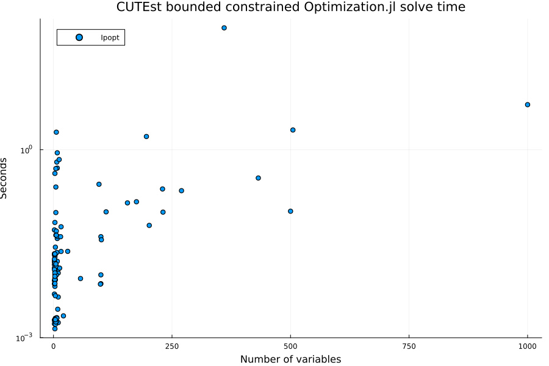
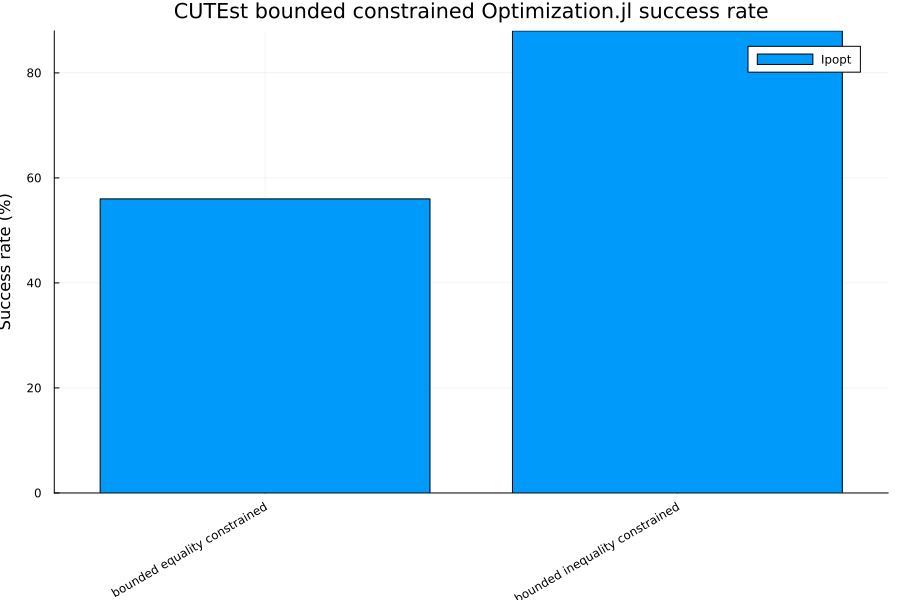

# CUTEst Bounded Constrained Optimization.jl Benchmarks

This benchmark runs constrained problems from the
[CUTEst](https://github.com/JuliaSmoothOptimizers/CUTEst.jl) test set through the
Optimization.jl interface using `OptimizationNLPModels`. Two candidate pools are used:

  - equality constrained: `CUTEst.select_sif_problems(min_con = 1, only_equ_con = true, only_free_var = false)`
  - inequality constrained: `CUTEst.select_sif_problems(min_con = 1, only_ineq_con = true, only_free_var = false)`

`min_con = 1` requires at least one general (linear or nonlinear) constraint,
`only_equ_con` keeps problems whose constraints are all equalities, and `only_ineq_con`
keeps problems with no equality constraints. `only_free_var = false` is CUTEst's default
and does not restrict variable bounds, so these pools contain problems with and without
bounds on the variables; the companion `CUTEst_unbounded` page is the subset with
`only_free_var = true`. Tightening this page to bounded variables only
(`only_bnd_var = true`) is a selection change tracked in
[SciMLBenchmarks#1857](https://github.com/SciML/SciMLBenchmarks.jl/issues/1857).

All four CUTEst pages in this folder share the harness in `cutest_benchmark_utils.jl`,
which defines the selection constants, the solver constructors, the run loop, and the
summary and plotting helpers. The prose below describes the harness as it stands;
refinements to the solver sets, solution-quality metrics, performance profiles, problem
selection, and timing methodology are tracked in #1857.

## Setup

```julia
ENV["GKSwstype"] = "100"

using CUTEst
using DataFrames
using Plots
using StatsPlots
using StatsBase: countmap
using Statistics
using Printf

include(joinpath(isdefined(Main, :WEAVE_ARGS) ? WEAVE_ARGS[:folder] : @__DIR__,
    "cutest_benchmark_utils.jl"))
```

```
plot_success_rates (generic function with 1 method)
```


## Problem selection

`select_safe_problems` walks each candidate pool in the order returned by
`CUTEst.select_sif_problems`, skips any name in the hand-maintained `KNOWN_BAD_PROBLEMS`
list, loads each remaining problem once to read its metadata, keeps it only if
`nvar <= MAX_NVAR` and `ncon <= MAX_NCON`, and stops after `MAX_PROBLEMS_PER_CATEGORY`
problems. Problems whose metadata cannot be loaded are skipped. The values in effect for
this run are printed below.

```julia
println("MAX_PROBLEMS_PER_CATEGORY = ", MAX_PROBLEMS_PER_CATEGORY)
println("MAX_NVAR = ", MAX_NVAR)
println("MAX_NCON = ", MAX_NCON)
println("SOLVE_MAXITERS = ", SOLVE_MAXITERS)
println("SOLVE_TIMEOUT_SECONDS = ", SOLVE_TIMEOUT_SECONDS)
println("KNOWN_BAD_PROBLEMS = ", join(sort(collect(KNOWN_BAD_PROBLEMS)), ", "))

bounded_equality_problems = select_safe_problems(
    collect(CUTEst.select_sif_problems(min_con = 1, only_equ_con = true,
        only_free_var = false))
)

bounded_inequality_problems = select_safe_problems(
    collect(CUTEst.select_sif_problems(min_con = 1, only_ineq_con = true,
        only_free_var = false))
)

println("Selected bounded equality-constrained problems: ", length(bounded_equality_problems))
println(join(bounded_equality_problems, ", "))
println("Selected bounded inequality-constrained problems: ", length(bounded_inequality_problems))
println(join(bounded_inequality_problems, ", "))
```

```
MAX_PROBLEMS_PER_CATEGORY = 50
MAX_NVAR = 1000
MAX_NCON = 1000
SOLVE_MAXITERS = 1000
SOLVE_TIMEOUT_SECONDS = 90.0
KNOWN_BAD_PROBLEMS = bloweya, chardis1, cleuven4, cmpc10, cmpc3, cvxqp2, di
ttert, hier13, lukvle8, lukvli7, mpc2, mss1, ninenew, patternne, reading2, 
reading6
Selected bounded equality-constrained problems: 50
GAUSS2, DUAL2, WAYSEA1NE, BROWNDENE, HS79, GULFNE, JUDGENE, STRTCHDVNE, TRI
GON1NE, PENLT1NE, PALMER2NE, STEENBRA, BA-L1SP, EXPFITNE, SSINE, EIGMAXC, L
UKSAN17, DALLASM, HS7, GENROSEBNE, BOX3NE, HS54, CHANDHEQ, HS60, LEVYMONE, 
KSS, HS48, BT9, S308NE, PALMER6ANE, MGH17S, DENSCHNDNE, HS119, CERI651B, PO
RTSNQP, EIGMINA, THURBER, CERI651E, ENSO, ALLINITC, LEAKNET, BARDNE, GOTTFR
, DUAL3, TRY-B, HATFLDBNE, STREGNE, SANTA, ZAMB2-11, PENLT2NE
Selected bounded inequality-constrained problems: 50
PRIMALC1, POLAK4, EXPFITA, HS35, HS106, HS34, HS95, ZECEVIC3, HYDROELM, AVG
ASB, HS17, S268, HS24, LEUVEN7, HS85, HS101, SYNTHES1, HS67, HS13, HIMMELP2
, MIFFLIN1, DEMBO7, LOOTSMA, HAIFAS, GIGOMEZ1, CRESC100, EXPFITC, HS108, HS
93, GMNCASE4, S277-280, GIGOMEZ2, HS36, DEMYMALO, HS105, SIMPLLPA, HS86, HS
117, CHACONN1, LHAIFAM, TFI1, ZECEVIC4, HS57, KIWCRESC, OPTPRLOC, HS100, WO
MFLET, PRIMALC2, POLAK3, HS33
```


## Solvers

`CONSTRAINED_SOLVERS` currently contains only `Ipopt`, run through `OptimizationMOI`.
It is the only optimizer wired into the harness that accepts general equality and
inequality constraints via Optimization.jl; the Optim.jl algorithms on the unconstrained
page do not. Ipopt is configured with `max_iter = SOLVE_MAXITERS`,
`max_wall_time = SOLVE_TIMEOUT_SECONDS`, `tol = 1.0e-6`, `print_level = 0`, and
`hessian_approximation = "limited-memory"`. The limited-memory setting is used because
`OptimizationNLPModels` supplies the objective gradient and Hessian and the constraint
values and Jacobian from the CUTEst model, but not the constraint Hessians needed for an
exact Hessian of the Lagrangian. The same
iteration and time limits are also passed to `solve` as `maxiters` and `maxtime`. Adding
further constrained backends and an exact-Hessian Ipopt variant is item 1 of #1857.

## Run

Each (problem, solver) pair is solved once by `run_single_solve`. A row records the return
code as reported by Optimization.jl and a `status` of `OK` when `solve` returned,
`FAILED` when it threw, or `LOAD_FAILED` when the CUTEst problem could not be
constructed. The reported time is `sol.stats.time` when the solver provides a finite,
non-negative value, and otherwise the wall-clock time measured around problem construction
and `solve` together. `run_benchmarks` errors if a category yields no `OK` rows, so a
broken environment fails the build instead of producing an empty page.

```julia
bounded_results = vcat(
    run_benchmarks("bounded equality constrained", bounded_equality_problems,
        CONSTRAINED_SOLVERS),
    run_benchmarks("bounded inequality constrained", bounded_inequality_problems,
        CONSTRAINED_SOLVERS),
)

display(bounded_results)
```

```
Running bounded equality constrained benchmarks
Problems: 50
Solvers: Ipopt
  Ipopt              GAUSS2                  
***************************************************************************
***
This program contains Ipopt, a library for large-scale nonlinear optimizati
on.
 Ipopt is released as open source code under the Eclipse Public License (EP
L).
         For more information visit https://github.com/coin-or/Ipopt
***************************************************************************
***

 OK Failure 0.508s
  Ipopt              DUAL2                    OK Success 0.281s
  Ipopt              WAYSEA1NE                OK Success 0.052s
  Ipopt              BROWNDENE                OK Failure 0.002s
  Ipopt              HS79                     OK Success 0.011s
  Ipopt              GULFNE                   OK Failure 0.002s
  Ipopt              JUDGENE                  OK Failure 0.002s
  Ipopt              STRTCHDVNE               OK Success 0.011s
  Ipopt              TRIGON1NE                OK Success 0.004s
  Ipopt              PENLT1NE                 OK Failure 0.002s
  Ipopt              PALMER2NE                OK Failure 0.002s
  Ipopt              STEENBRA                 OK Success 0.353s
  Ipopt              BA-L1SP                  OK Success 0.009s
  Ipopt              EXPFITNE                 OK Failure 0.002s
  Ipopt              SSINE                    OK Success 0.418s
  Ipopt              EIGMAXC                  OK Success 0.062s
  Ipopt              LUKSAN17                 OK Failure 0.007s
  Ipopt              DALLASM                  OK Success 1.624s
  Ipopt              HS7                      OK Success 0.008s
  Ipopt              GENROSEBNE               OK Failure 0.104s
  Ipopt              BOX3NE                   OK Failure 0.001s
  Ipopt              HS54                     OK Success 0.050s
  Ipopt              CHANDHEQ                 OK Success 0.041s
  Ipopt              HS60                     OK Success 0.013s
  Ipopt              LEVYMONE                 OK Failure 0.010s
  Ipopt              KSS                      OK Success 5.238s
  Ipopt              HS48                     OK Success 0.010s
  Ipopt              BT9                      OK Success 0.013s
  Ipopt              S308NE                   OK Failure 0.002s
  Ipopt              PALMER6ANE               OK Failure 0.002s
  Ipopt              MGH17S                   OK Failure 0.002s
  Ipopt              DENSCHNDNE               OK Success 0.019s
  Ipopt              HS119                    OK Success 0.024s
  Ipopt              CERI651B                 OK Failure 0.002s
  Ipopt              PORTSNQP                 OK Success 0.012s
  Ipopt              EIGMINA                  OK Success 0.036s
  Ipopt              THURBER                  OK Failure 0.002s
  Ipopt              CERI651E                 OK Failure 0.002s
  Ipopt              ENSO                     OK Failure 0.003s
  Ipopt              ALLINITC                 OK Success 0.028s
  Ipopt              LEAKNET                  OK Success 0.141s
  Ipopt              BARDNE                   OK Failure 0.002s
  Ipopt              GOTTFR                   OK Success 0.005s
  Ipopt              DUAL3                    OK Success 0.102s
  Ipopt              TRY-B                    OK Success 0.015s
  Ipopt              HATFLDBNE                OK Infeasible 0.021s
  Ipopt              STREGNE                  OK Success 0.005s
  Ipopt              SANTA                    OK Failure 0.002s
  Ipopt              ZAMB2-11                 OK Success 0.222s
  Ipopt              PENLT2NE                 OK Failure 0.002s

Running bounded inequality constrained benchmarks
Problems: 50
Solvers: Ipopt
  Ipopt              PRIMALC1                 OK Success 0.236s
  Ipopt              POLAK4                   OK Success 0.007s
  Ipopt              EXPFITA                  OK Success 0.043s
  Ipopt              HS35                     OK Success 0.013s
  Ipopt              HS106                    OK Success 0.038s
  Ipopt              HS34                     OK Success 0.010s
  Ipopt              HS95                     OK Success 0.010s
  Ipopt              ZECEVIC3                 OK Success 0.016s
  Ipopt              HYDROELM                 OK Success 2.064s
  Ipopt              AVGASB                   OK Success 0.016s
  Ipopt              HS17                     OK Success 0.017s
  Ipopt              S268                     OK Success 0.099s
  Ipopt              HS24                     OK Success 0.013s
  Ipopt              LEUVEN7                  OK Success 88.271s
  Ipopt              HS85                     OK MaxIters 0.499s
  Ipopt              HS101                    OK MaxIters 0.634s
  Ipopt              SYNTHES1                 OK Success 0.014s
  Ipopt              HS67                     OK Success 0.015s
  Ipopt              HS13                     OK Success 0.021s
  Ipopt              HIMMELP2                 OK Success 0.018s
  Ipopt              MIFFLIN1                 OK Success 0.009s
  Ipopt              DEMBO7                   OK Success 0.059s
  Ipopt              LOOTSMA                  OK Success 0.008s
  Ipopt              HAIFAS                   OK Success 0.013s
  Ipopt              GIGOMEZ1                 OK Success 0.012s
  Ipopt              CRESC100                 OK Infeasible 1.904s
  Ipopt              EXPFITC                  OK Success 0.253s
  Ipopt              HS108                    OK Success 0.041s
  Ipopt              HS93                     OK Success 0.043s
  Ipopt              GMNCASE4                 OK Success 0.147s
  Ipopt              S277-280                 OK Success 0.008s
  Ipopt              GIGOMEZ2                 OK Success 0.011s
  Ipopt              HS36                     OK Success 0.009s
  Ipopt              DEMYMALO                 OK Success 0.008s
  Ipopt              HS105                    OK MaxIters 0.892s
  Ipopt              SIMPLLPA                 OK Success 0.007s
  Ipopt              HS86                     OK Success 0.015s
  Ipopt              HS117                    OK Success 0.041s
  Ipopt              CHACONN1                 OK Success 0.007s
  Ipopt              LHAIFAM                  OK Failure 0.007s
  Ipopt              TFI1                     OK Success 0.069s
  Ipopt              ZECEVIC4                 OK Success 0.012s
  Ipopt              HS57                     OK Success 0.022s
  Ipopt              KIWCRESC                 OK Success 0.011s
  Ipopt              OPTPRLOC                 OK Success 0.024s
  Ipopt              HS100                    OK Success 0.023s
  Ipopt              WOMFLET                  OK Success 0.022s
  Ipopt              PRIMALC2                 OK Success 0.101s
  Ipopt              POLAK3                   OK MaxIters 0.696s
  Ipopt              HS33                     OK Success 0.010s
100×7 DataFrame
 Row │ category                        problem     solver  n_vars  secs    
    ⋯
     │ String                          String      String  Int64   Float64 
    ⋯
─────┼─────────────────────────────────────────────────────────────────────
─────
   1 │ bounded equality constrained    GAUSS2      Ipopt        8  0.508391
    ⋯
   2 │ bounded equality constrained    DUAL2       Ipopt       96  0.280648
   3 │ bounded equality constrained    WAYSEA1NE   Ipopt        2  0.052308
1
   4 │ bounded equality constrained    BROWNDENE   Ipopt        4  0.002032
04
   5 │ bounded equality constrained    HS79        Ipopt        5  0.010977
    ⋯
   6 │ bounded equality constrained    GULFNE      Ipopt        3  0.001919
03
   7 │ bounded equality constrained    JUDGENE     Ipopt        2  0.001660
82
   8 │ bounded equality constrained    STRTCHDVNE  Ipopt       10  0.010744
8
  ⋮  │               ⋮                     ⋮         ⋮       ⋮         ⋮   
    ⋱
  94 │ bounded inequality constrained  KIWCRESC    Ipopt        3  0.010783
9   ⋯
  95 │ bounded inequality constrained  OPTPRLOC    Ipopt       30  0.023802
  96 │ bounded inequality constrained  HS100       Ipopt        7  0.022841
9
  97 │ bounded inequality constrained  WOMFLET     Ipopt        3  0.021660
1
  98 │ bounded inequality constrained  PRIMALC2    Ipopt      231  0.100701
    ⋯
  99 │ bounded inequality constrained  POLAK3      Ipopt       12  0.696041
 100 │ bounded inequality constrained  HS33        Ipopt        3  0.009507
89
                                                   2 columns and 85 rows om
itted
```


## Summary

`summarize_results` groups rows by category and solver. `completion_rate` is the share of
runs with `status == "OK"`, i.e. the solver returned at all. `success_rate` is the share
of runs whose return code is in `SUCCESS_RETCODES` (`Success`, `Terminated`,
`FirstOrderOptimal`). Runs that stopped at `MaxIters` or `MaxTime` count as completed but
not successful. `median_secs` is the median of the per-run time described above over all
rows for that category and solver, including unsuccessful ones. No solution-quality
metric (objective value, KKT residual, constraint violation) is recorded yet; see #1857.

```julia
bounded_summary = summarize_results(bounded_results)

plot_solve_times(bounded_results, "CUTEst bounded constrained Optimization.jl solve time")
plot_success_rates(bounded_summary, "CUTEst bounded constrained Optimization.jl success rate")
```

```
Return code distribution:
  Success: 72
  Failure: 22
  MaxIters: 4
  Infeasible: 2

Summary:
2×8 DataFrame
 Row │ category                        solver  completed_runs  successful_r
uns ⋯
     │ String                          String  Int64           Int64       
    ⋯
─────┼─────────────────────────────────────────────────────────────────────
─────
   1 │ bounded equality constrained    Ipopt               50              
 28 ⋯
   2 │ bounded inequality constrained  Ipopt               50              
 44
                                                               4 columns om
itted
```






## Appendix

These benchmarks are a part of the SciMLBenchmarks.jl repository, found at: [https://github.com/SciML/SciMLBenchmarks.jl](https://github.com/SciML/SciMLBenchmarks.jl). For more information on high-performance scientific machine learning, check out the SciML Open Source Software Organization [https://sciml.ai](https://sciml.ai).

To locally run this benchmark, do the following commands:
```
using SciMLBenchmarks
SciMLBenchmarks.weave_file("benchmarks/OptimizationCUTEst","CUTEst_bounded.jmd")
```

Computer Information:

```
Julia Version 1.12.7
Commit 6d172b025e4 (2026-08-15 08:05 UTC)
Build Info:
  Official https://julialang.org release
Platform Info:
  OS: Linux (x86_64-linux-gnu)
  CPU: 128 × AMD EPYC 7502 32-Core Processor
  WORD_SIZE: 64
  LLVM: libLLVM-18.1.7 (ORCJIT, znver2)
  GC: Built with stock GC
Threads: 128 default, 1 interactive, 128 GC (on 128 virtual cores)
Environment:
  JULIA_DEPOT_PATH = /home/crackauc/github-runners/amdci8-1/.julia
  JULIA_NUM_THREADS = auto

```

Package Information:

```
Status `~/github-runners/amdci8-1/_work/SciMLBenchmarks.jl/SciMLBenchmarks.jl/benchmarks/OptimizationCUTEst/Project.toml`
⌃ [1b53aba6] CUTEst v1.3.7
  [a93c6f00] DataFrames v1.8.2
⌃ [b6b21f68] Ipopt v1.14.3
⌃ [b8f27783] MathOptInterface v1.51.0
  [a4795742] NLPModels v0.21.12
⌃ [7f7a1694] Optimization v5.4.0
⌅ [fd9f6733] OptimizationMOI v0.5.11
⌃ [064b21be] OptimizationNLPModels v1.1.0
⌃ [36348300] OptimizationOptimJL v0.4.9
⌃ [42dfb2eb] OptimizationOptimisers v0.3.15
⌃ [91a5bcdd] Plots v1.41.6
⌃ [31c91b34] SciMLBenchmarks v0.1.3 [loaded: v0.2.1]
⌃ [10745b16] Statistics v1.11.1
⌃ [2913bbd2] StatsBase v0.34.10
  [f3b207a7] StatsPlots v0.15.8
  [de0858da] Printf v1.11.0
Info Packages marked with ⌃ and ⌅ have new versions available. Those with ⌃ may be upgradable, but those with ⌅ are restricted by compatibility constraints from upgrading. To see why use `status --outdated`
```

And the full manifest:

```
Status `~/github-runners/amdci8-1/_work/SciMLBenchmarks.jl/SciMLBenchmarks.jl/benchmarks/OptimizationCUTEst/Manifest.toml`
⌃ [47edcb42] ADTypes v1.22.0
  [621f4979] AbstractFFTs v1.5.0
  [1520ce14] AbstractTrees v0.4.5
⌃ [7d9f7c33] Accessors v0.1.44
⌃ [79e6a3ab] Adapt v4.6.0
  [66dad0bd] AliasTables v1.1.3
  [ec485272] ArnoldiMethod v0.4.0
  [7d9fca2a] Arpack v0.5.4
⌃ [4fba245c] ArrayInterface v7.25.0
  [4c555306] ArrayLayouts v1.12.2
  [13072b0f] AxisAlgorithms v1.1.0
  [e2ed5e7c] Bijections v0.2.2
⌃ [d1d4a3ce] BitFlags v0.1.9
  [62783981] BitTwiddlingConvenienceFunctions v0.1.6
⌃ [8e7c35d0] BlockArrays v1.9.3
⌃ [70df07ce] BracketingNonlinearSolve v1.12.1
  [2a0fbf3d] CPUSummary v0.2.7
⌃ [1b53aba6] CUTEst v1.3.7
  [d360d2e6] ChainRulesCore v1.26.1
  [fb6a15b2] CloseOpenIntervals v0.1.13
  [aaaa29a8] Clustering v0.15.8
  [523fee87] CodecBzip2 v0.8.5
⌃ [944b1d66] CodecZlib v0.7.8
  [35d6a980] ColorSchemes v3.31.0
  [3da002f7] ColorTypes v0.12.1
  [c3611d14] ColorVectorSpace v0.11.0
  [5ae59095] Colors v0.13.1
⌅ [861a8166] Combinatorics v1.0.2
⌃ [a80b9123] CommonMark v1.0.1
⌃ [38540f10] CommonSolve v0.2.7
  [bbf7d656] CommonSubexpressions v0.3.1
⌃ [f70d9fcc] CommonWorldInvalidations v1.0.0
  [34da2185] Compat v4.18.1
  [b152e2b5] CompositeTypes v0.1.4
  [a33af91c] CompositionsBase v0.1.2
⌃ [2569d6c7] ConcreteStructs v0.2.4
⌃ [f0e56b4a] ConcurrentUtilities v2.5.1
  [8f4d0f93] Conda v1.10.3
  [88cd18e8] ConsoleProgressMonitor v0.1.2
  [187b0558] ConstructionBase v1.6.0
  [d38c429a] Contour v0.6.3
  [adafc99b] CpuId v0.3.1
⌃ [a8cc5b0e] Crayons v4.1.1
  [9a962f9c] DataAPI v1.16.0
  [a93c6f00] DataFrames v1.8.2
⌃ [864edb3b] DataStructures v0.19.4
  [e2d170a0] DataValueInterfaces v1.0.0
  [8bb1440f] DelimitedFiles v1.9.1
⌅ [2b5f629d] DiffEqBase v6.214.1
⌃ [459566f4] DiffEqCallbacks v4.17.0
⌃ [77a26b50] DiffEqNoiseProcess v5.31.1
  [163ba53b] DiffResults v1.1.0
⌃ [b552c78f] DiffRules v1.15.1
⌃ [a0c0ee7d] DifferentiationInterface v0.7.18
  [8d63f2c5] DispatchDoctor v0.4.28
  [b4f34e82] Distances v0.10.12
⌃ [31c24e10] Distributions v0.25.125
  [ffbed154] DocStringExtensions v0.9.5
⌅ [5b8099bc] DomainSets v0.7.18
⌃ [7c1d4256] DynamicPolynomials v0.6.6
  [06fc5a27] DynamicQuantities v1.13.0
  [4e289a0a] EnumX v1.0.7
⌃ [f151be2c] EnzymeCore v0.8.20
  [460bff9d] ExceptionUnwrapping v0.1.11
⌃ [e2ba6199] ExprTools v0.1.10
  [55351af7] ExproniconLite v0.10.14
  [c87230d0] FFMPEG v0.4.5
  [b86e33f2] FFTA v0.3.1
⌃ [7034ab61] FastBroadcast v1.3.2
  [9aa1b823] FastClosures v0.3.2
⌃ [a4df4552] FastPower v1.3.1
⌃ [1a297f60] FillArrays v1.16.0
⌅ [64ca27bc] FindFirstFunctions v1.8.0
⌃ [6a86dc24] FiniteDiff v2.31.0
⌅ [53c48c17] FixedPointNumbers v0.8.5
  [1fa38f19] Format v1.3.7
⌃ [f6369f11] ForwardDiff v1.3.3
  [a85aefff] FunctionMaps v0.1.2
  [069b7b12] FunctionWrappers v1.1.3
⌅ [77dc65aa] FunctionWrappersWrappers v0.1.3
⌃ [d9f16b24] Functors v0.5.2
  [46192b85] GPUArraysCore v0.2.0
⌃ [28b8d3ca] GR v0.73.24
  [d7ba0133] Git v1.5.0
  [c27321d9] Glob v1.5.0
⌃ [86223c79] Graphs v1.14.0
  [42e2da0e] Grisu v1.0.2
⌅ [cd3eb016] HTTP v1.11.0
⌅ [eafb193a] Highlights v0.5.3
⌃ [34004b35] HypergeometricFunctions v0.3.28
  [7073ff75] IJulia v1.34.4
  [615f187c] IfElse v0.1.1
⌅ [3263718b] ImplicitDiscreteSolve v1.10.0
  [d25df0c9] Inflate v0.1.5
⌅ [842dd82b] InlineStrings v1.4.5
⌃ [18e54dd8] IntegerMathUtils v0.1.3
⌃ [a98d9a8b] Interpolations v0.16.2
  [8197267c] IntervalSets v0.7.14
  [3587e190] InverseFunctions v0.1.17
  [41ab1584] InvertedIndices v1.3.1
⌃ [b6b21f68] Ipopt v1.14.3
  [92d709cd] IrrationalConstants v0.2.6
  [82899510] IteratorInterfaceExtensions v1.0.0
  [1019f520] JLFzf v0.1.11
  [692b3bcd] JLLWrappers v1.8.0
⌅ [682c06a0] JSON v0.21.4
  [ae98c720] Jieko v0.2.1
⌃ [98e50ef6] JuliaFormatter v2.5.0
  [70703baa] JuliaSyntax v1.0.2
⌃ [ccbc3e58] JumpProcesses v9.29.0
⌃ [5ab0869b] KernelDensity v0.6.11
⌃ [ba0b0d4f] Krylov v0.10.6
⌃ [b964fa9f] LaTeXStrings v1.4.0
⌃ [23fbe1c1] Latexify v0.16.10
  [10f19ff3] LayoutPointers v0.1.17
⌅ [1d6d02ad] LeftChildRightSiblingTrees v0.2.1
⌃ [87fe0de2] LineSearch v0.1.9
⌃ [d3d80556] LineSearches v7.7.1
⌃ [5c8ed15e] LinearOperators v2.13.0
⌅ [7ed4a6bd] LinearSolve v3.82.0
⌅ [2ab3a3ac] LogExpFunctions v0.3.29
  [e6f89c97] LoggingExtras v1.2.0
  [d8e11817] MLStyle v0.4.17
  [1914dd2f] MacroTools v0.5.16
  [d125e4d3] ManualMemory v0.1.8
⌃ [b8f27783] MathOptInterface v1.51.0
⌃ [bb5d69b7] MaybeInplace v0.1.4
  [739be429] MbedTLS v1.1.10
  [442fdcdd] Measures v0.3.3
  [e1d29d7a] Missings v1.2.0
⌅ [961ee093] ModelingToolkit v10.32.1
⌃ [2e0e35c7] Moshi v0.3.7
⌃ [46d2c3a1] MuladdMacro v0.2.4
  [102ac46a] MultivariatePolynomials v0.5.19
⌃ [6f286f6a] MultivariateStats v0.10.4
  [ffc61752] Mustache v1.0.21
  [d8a4904e] MutableArithmetics v1.8.0
  [a4795742] NLPModels v0.21.12
⌃ [d41bc354] NLSolversBase v8.0.0
⌃ [77ba4419] NaNMath v1.1.3
⌃ [b8a86587] NearestNeighbors v0.4.27
⌃ [be0214bd] NonlinearSolveBase v2.11.2
⌃ [5959db7a] NonlinearSolveFirstOrder v2.0.0
  [510215fc] Observables v0.5.5
  [6fe1bfb0] OffsetArrays v1.17.0
  [4d8831e6] OpenSSL v1.6.1
⌃ [429524aa] Optim v2.1.0
⌃ [3bd65402] Optimisers v0.4.7
⌃ [7f7a1694] Optimization v5.4.0
⌅ [bca83a33] OptimizationBase v4.2.0
⌅ [fd9f6733] OptimizationMOI v0.5.11
⌃ [064b21be] OptimizationNLPModels v1.1.0
⌃ [36348300] OptimizationOptimJL v0.4.9
⌃ [42dfb2eb] OptimizationOptimisers v0.3.15
⌅ [bac558e1] OrderedCollections v1.8.1 [loaded: v2.0.1]
⌅ [bbf590c4] OrdinaryDiffEqCore v3.28.0
⌃ [90014a1f] PDMats v0.11.37
⌅ [69de0a69] Parsers v2.8.4 [loaded: v2.8.8]
  [ccf2f8ad] PlotThemes v3.3.0
  [995b91a9] PlotUtils v1.4.4
⌃ [91a5bcdd] Plots v1.41.6
⌃ [e409e4f3] PoissonRandom v0.4.8
  [f517fe37] Polyester v0.7.19
  [1d0040c9] PolyesterWeave v0.2.2
  [2dfb63ee] PooledArrays v1.4.3
  [85a6dd25] PositiveFactorizations v0.2.4
⌃ [d236fae5] PreallocationTools v0.4.34
  [aea7be01] PrecompileTools v1.3.4
  [21216c6a] Preferences v1.5.2
⌃ [08abe8d2] PrettyTables v3.3.2
  [27ebfcd6] Primes v0.5.7
  [33c8b6b6] ProgressLogging v0.1.6
  [92933f4c] ProgressMeter v1.11.0
  [43287f4e] PtrArrays v1.4.0
  [1fd47b50] QuadGK v2.11.3
⌅ [be4d8f0f] Quadmath v0.5.13
  [c84ed2f1] Ratios v0.4.5
  [3cdcf5f2] RecipesBase v1.3.4
  [01d81517] RecipesPipeline v0.6.12
⌅ [731186ca] RecursiveArrayTools v3.54.0
  [189a3867] Reexport v1.2.2
  [05181044] RelocatableFolders v1.0.1
  [ae029012] Requires v1.3.1
⌃ [ae5879a3] ResettableStacks v1.2.0
  [79098fc4] Rmath v0.9.0
⌃ [7e49a35a] RuntimeGeneratedFunctions v0.5.19
⌃ [9dfe8606] SCCNonlinearSolve v1.13.0
  [94e857df] SIMDTypes v0.1.0
  [1bc83da4] SafeTestsets v0.1.0
⌅ [0bca4576] SciMLBase v2.153.1
⌃ [31c91b34] SciMLBenchmarks v0.1.3 [loaded: v0.2.1]
⌃ [19f34311] SciMLJacobianOperators v0.1.13
⌅ [a6db7da4] SciMLLogging v1.10.1
⌃ [c0aeaf25] SciMLOperators v1.21.0
⌃ [431bcebd] SciMLPublic v1.0.1
⌃ [53ae85a6] SciMLStructures v1.10.0
  [6c6a2e73] Scratch v1.3.0
  [91c51154] SentinelArrays v1.4.10
  [efcf1570] Setfield v1.1.2
⌃ [992d4aef] Showoff v1.0.3
  [777ac1f9] SimpleBufferStream v1.2.0
⌃ [727e6d20] SimpleNonlinearSolve v2.11.0
  [699a6c99] SimpleTraits v0.9.6
⌃ [a2af1166] SortingAlgorithms v1.2.2
⌃ [9f842d2f] SparseConnectivityTracer v1.2.1
⌃ [0a514795] SparseMatrixColorings v0.4.27
⌃ [276daf66] SpecialFunctions v2.7.2
  [860ef19b] StableRNGs v1.0.4
  [0c0c59c1] StarAlgebras v0.3.0
⌃ [aedffcd0] Static v1.4.0
  [0d7ed370] StaticArrayInterface v1.10.0
⌃ [90137ffa] StaticArrays v1.9.18
  [1e83bf80] StaticArraysCore v1.4.4
⌃ [10745b16] Statistics v1.11.1
  [82ae8749] StatsAPI v1.8.0
⌃ [2913bbd2] StatsBase v0.34.10
⌅ [4c63d2b9] StatsFuns v1.5.2
  [f3b207a7] StatsPlots v0.15.8
  [7792a7ef] StrideArraysCore v0.5.9
  [69024149] StringEncodings v0.3.7
⌅ [892a3eda] StringManipulation v0.4.4
⌃ [2efcf032] SymbolicIndexingInterface v0.3.48
⌅ [19f23fe9] SymbolicLimits v0.2.3
⌅ [d1185830] SymbolicUtils v3.32.0
⌅ [0c5d862f] Symbolics v6.58.0
  [ab02a1b2] TableOperations v1.2.0
  [3783bdb8] TableTraits v1.0.1
⌃ [bd369af6] Tables v1.12.1 [loaded: v1.14.0]
  [ed4db957] TaskLocalValues v0.1.3
  [62fd8b95] TensorCore v0.1.1
  [8ea1fca8] TermInterface v2.0.0
⌃ [5d786b92] TerminalLoggers v0.1.7
⌃ [1c621080] TestItems v1.0.0
⌃ [8290d209] ThreadingUtilities v0.5.5
⌅ [a759f4b9] TimerOutputs v0.5.29
  [3bb67fe8] TranscodingStreams v0.11.3
  [410a4b4d] Tricks v0.1.13
  [781d530d] TruncatedStacktraces v1.4.0
⌃ [5c2747f8] URIs v1.6.1
  [3a884ed6] UnPack v1.0.2
  [1cfade01] UnicodeFun v0.4.1
⌃ [1986cc42] Unitful v1.28.0
  [a7c27f48] Unityper v0.1.6
  [41fe7b60] Unzip v0.2.0
  [81def892] VersionParsing v1.3.0
  [44d3d7a6] Weave v0.10.12
⌃ [cc8bc4a8] Widgets v0.6.7
  [efce3f68] WoodburyMatrices v1.1.0
  [ddb6d928] YAML v0.4.16
  [c2297ded] ZMQ v1.5.1
⌃ [ae81ac8f] ASL_jll v0.1.3+0
⌅ [68821587] Arpack_jll v3.5.2+0
  [6e34b625] Bzip2_jll v1.0.9+0
⌃ [bb5f6f25] CUTEst_jll v2.6.0+0
  [83423d85] Cairo_jll v1.18.7+0
  [ee1fde0b] Dbus_jll v1.16.2+0
  [2702e6a9] EpollShim_jll v0.0.20230411+1
⌃ [2e619515] Expat_jll v2.8.1+0
⌅ [b22a6f82] FFMPEG_jll v8.1.0+0
  [a3f928ae] Fontconfig_jll v2.17.1+0
  [d7e528f0] FreeType2_jll v2.14.3+1
  [559328eb] FriBidi_jll v1.0.17+0
⌃ [0656b61e] GLFW_jll v3.4.1+1
⌅ [d2c73de3] GR_jll v0.73.24+0
⌅ [b0724c58] GettextRuntime_jll v0.22.4+0
  [61579ee1] Ghostscript_jll v9.55.1+0
  [020c3dae] Git_LFS_jll v3.7.1+0
⌃ [f8c6e375] Git_jll v2.54.0+0
⌃ [7746bdde] Glib_jll v2.86.3+0
⌃ [3b182d85] Graphite2_jll v1.3.15+0
⌅ [2e76f6c2] HarfBuzz_jll v8.5.1+0
⌃ [e33a78d0] Hwloc_jll v2.13.0+1
  [1d5cc7b8] IntelOpenMP_jll v2025.2.0+0
⌅ [9cc047cb] Ipopt_jll v300.1400.1901+0
⌃ [aacddb02] JpegTurbo_jll v3.1.5+0
  [c1c5ebd0] LAME_jll v3.100.3+0
⌃ [88015f11] LERC_jll v4.1.0+0
⌃ [1d63c593] LLVMOpenMP_jll v18.1.8+0
⌅ [e9f186c6] Libffi_jll v3.4.7+0
  [7e76a0d4] Libglvnd_jll v1.7.1+1
  [94ce4f54] Libiconv_jll v1.18.0+0
  [4b2f31a3] Libmount_jll v2.42.0+0
⌃ [89763e89] Libtiff_jll v4.7.2+0
  [38a345b3] Libuuid_jll v2.42.0+0
  [d00139f3] METIS_jll v5.1.3+0
  [856f044c] MKL_jll v2025.2.0+0
⌅ [d7ed1dd3] MUMPS_seq_jll v500.800.200+0
  [c8ffd9c3] MbedTLS_jll v2.28.1010+0
  [e7412a2a] Ogg_jll v1.3.6+0
⌃ [656ef2d0] OpenBLAS32_jll v0.3.33+1
⌃ [9bd350c2] OpenSSH_jll v10.3.1+0
  [efe28fd5] OpenSpecFun_jll v0.5.6+0
  [91d4177d] Opus_jll v1.6.1+0
⌃ [36c8627f] Pango_jll v1.57.1+0
  [30392449] Pixman_jll v0.46.4+0
  [c0090381] Qt6Base_jll v6.10.2+2
⌃ [629bc702] Qt6Declarative_jll v6.10.2+1
  [ce943373] Qt6ShaderTools_jll v6.10.2+1
  [6de9746b] Qt6Svg_jll v6.10.2+0
  [e99dba38] Qt6Wayland_jll v6.10.2+1
⌃ [f50d1b31] Rmath_jll v0.5.1+0
⌃ [54dcf436] SIFDecode_jll v3.1.0+0
⌃ [319450e9] SPRAL_jll v2025.9.18+0
  [a44049a8] Vulkan_Loader_jll v1.3.243+0
  [a2964d1f] Wayland_jll v1.24.0+0
⌅ [02c8fc9c] XML2_jll v2.13.9+0
  [ffd25f8a] XZ_jll v5.8.3+0
  [f67eecfb] Xorg_libICE_jll v1.1.2+0
  [c834827a] Xorg_libSM_jll v1.2.6+0
  [4f6342f7] Xorg_libX11_jll v1.8.13+0
  [0c0b7dd1] Xorg_libXau_jll v1.0.13+0
  [935fb764] Xorg_libXcursor_jll v1.2.4+0
  [a3789734] Xorg_libXdmcp_jll v1.1.6+0
  [1082639a] Xorg_libXext_jll v1.3.8+0
  [d091e8ba] Xorg_libXfixes_jll v6.0.2+0
⌃ [a51aa0fd] Xorg_libXi_jll v1.8.3+0
  [d1454406] Xorg_libXinerama_jll v1.1.7+0
  [ec84b674] Xorg_libXrandr_jll v1.5.6+0
  [ea2f1a96] Xorg_libXrender_jll v0.9.12+0
  [a65dc6b1] Xorg_libpciaccess_jll v0.19.0+0
  [c7cfdc94] Xorg_libxcb_jll v1.17.1+0
  [cc61e674] Xorg_libxkbfile_jll v1.2.0+0
  [e920d4aa] Xorg_xcb_util_cursor_jll v0.1.6+0
  [12413925] Xorg_xcb_util_image_jll v0.4.1+0
  [2def613f] Xorg_xcb_util_jll v0.4.1+0
  [975044d2] Xorg_xcb_util_keysyms_jll v0.4.1+0
  [0d47668e] Xorg_xcb_util_renderutil_jll v0.3.10+0
  [c22f9ab0] Xorg_xcb_util_wm_jll v0.4.2+0
  [35661453] Xorg_xkbcomp_jll v1.4.7+0
⌃ [33bec58e] Xorg_xkeyboard_config_jll v2.47.0+1
  [c5fb5394] Xorg_xtrans_jll v1.6.0+0
  [8f1865be] ZeroMQ_jll v4.3.6+0
  [3161d3a3] Zstd_jll v1.5.7+1
  [35ca27e7] eudev_jll v3.2.14+0
⌅ [214eeab7] fzf_jll v0.61.1+0
⌃ [a4ae2306] libaom_jll v3.13.3+0
⌃ [0ac62f75] libass_jll v0.17.4+0
  [1183f4f0] libdecor_jll v0.2.2+0
⌃ [8e53e030] libdrm_jll v2.4.125+1
  [2db6ffa8] libevdev_jll v1.13.4+0
  [f638f0a6] libfdk_aac_jll v2.0.4+0
  [36db933b] libinput_jll v1.28.1+0
  [b53b4c65] libpng_jll v1.6.58+0
  [a9144af2] libsodium_jll v1.0.21+0
  [9a156e7d] libva_jll v2.23.0+0
  [f27f6e37] libvorbis_jll v1.3.8+0
  [009596ad] mtdev_jll v1.1.7+0
  [1317d2d5] oneTBB_jll v2022.3.0+0
⌅ [1270edf5] x264_jll v10164.0.1+0
  [dfaa095f] x265_jll v4.1.0+0
  [d8fb68d0] xkbcommon_jll v1.13.0+0
  [0dad84c5] ArgTools v1.1.2
  [56f22d72] Artifacts v1.11.0
  [2a0f44e3] Base64 v1.11.0
  [ade2ca70] Dates v1.11.0
  [8ba89e20] Distributed v1.11.0
  [f43a241f] Downloads v1.7.0
  [7b1f6079] FileWatching v1.11.0
  [9fa8497b] Future v1.11.0
  [b77e0a4c] InteractiveUtils v1.11.0
  [ac6e5ff7] JuliaSyntaxHighlighting v1.12.0
  [4af54fe1] LazyArtifacts v1.11.0
  [b27032c2] LibCURL v0.6.4
  [76f85450] LibGit2 v1.11.0
  [8f399da3] Libdl v1.11.0
  [37e2e46d] LinearAlgebra v1.12.0
  [56ddb016] Logging v1.11.0
  [d6f4376e] Markdown v1.11.0
  [a63ad114] Mmap v1.11.0
  [ca575930] NetworkOptions v1.3.0
  [44cfe95a] Pkg v1.12.1
  [de0858da] Printf v1.11.0
  [3fa0cd96] REPL v1.11.0
  [9a3f8284] Random v1.11.0
  [ea8e919c] SHA v0.7.0
  [9e88b42a] Serialization v1.11.0
  [1a1011a3] SharedArrays v1.11.0
  [6462fe0b] Sockets v1.11.0
  [2f01184e] SparseArrays v1.12.0
  [f489334b] StyledStrings v1.11.0
  [4607b0f0] SuiteSparse
  [fa267f1f] TOML v1.0.3
  [a4e569a6] Tar v1.10.0
  [8dfed614] Test v1.11.0
  [cf7118a7] UUIDs v1.11.0
  [4ec0a83e] Unicode v1.11.0
  [e66e0078] CompilerSupportLibraries_jll v1.3.0+1
  [deac9b47] LibCURL_jll v8.15.0+0
  [e37daf67] LibGit2_jll v1.9.0+0
  [29816b5a] LibSSH2_jll v1.11.3+1
  [14a3606d] MozillaCACerts_jll v2025.11.4
  [4536629a] OpenBLAS_jll v0.3.29+0
  [05823500] OpenLibm_jll v0.8.7+0
  [458c3c95] OpenSSL_jll v3.5.4+0
  [efcefdf7] PCRE2_jll v10.44.0+1
  [bea87d4a] SuiteSparse_jll v7.8.3+2
  [83775a58] Zlib_jll v1.3.1+2
  [8e850b90] libblastrampoline_jll v5.15.0+0
  [8e850ede] nghttp2_jll v1.64.0+1
  [3f19e933] p7zip_jll v17.7.0+0
Info Packages marked with ⌃ and ⌅ have new versions available. Those with ⌃ may be upgradable, but those with ⌅ are restricted by compatibility constraints from upgrading. To see why use `status --outdated -m`
```

