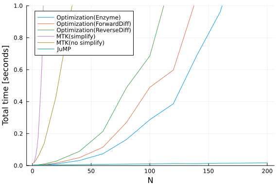

## Introduction

This benchmark is the clnlbeam example, adapted from H. Maurer and H.D.
Mittelman, "The non-linear beam via optimal control with bound state variables,"
Optimal Control Applications and Methods 12, pp.19-31, 1991.

This benchmark uses the following packages:

```julia
import Enzyme
import ForwardDiff
import Ipopt
import JuMP
import ModelingToolkit as MTK
import Optimization
import OptimizationMOI
import Plots
import ReverseDiff
import SparseDiffTools
import Test
```


## Optimization.jl

```julia
function run_optimization(N::Int, automatic_differentiation)
    h = 1 / N
    alpha = 350
    x_offset = N + 1
    u_offset = 2(N + 1)
    function objective_fn(x, p)
        return sum(
            0.5 * h * (x[x_offset+i+1]^2 + x[x_offset+i]^2) +
            0.5 * alpha * h * (cos(x[i+1]) + cos(x[i])) for i in 1:N
        )
    end
    function constraint_fn(res, x, p)
        for i in 1:N
            res[i] = x[x_offset+i+1] - x[x_offset+i] - 0.5 * h * (sin(x[i+1]) + sin(x[i]))
        end
        for i in 1:N
            res[N+i] = x[i+1] - x[i] - 0.5 * h * x[u_offset+i+1] - 0.5 * h * x[u_offset+i]
        end
        return
    end
    prob = Optimization.OptimizationProblem(
        Optimization.OptimizationFunction(
            objective_fn,
            automatic_differentiation;
            cons = constraint_fn,
        ),
        zeros(3 * (N + 1)),
        nothing;
        lb = vcat(fill(-1.0, N+1), fill(-0.05, N+1), fill(-Inf, N+1)),
        ub = vcat(fill(1.0, N+1), fill(0.05, N+1), fill(Inf, N+1)),
        lcons = zeros(2 * N),
        ucons = zeros(2 * N),
    )
    sol = Optimization.solve(prob, Ipopt.Optimizer(); print_level = 0)
    Test.@test ≈(sol.objective, 350.0; atol = 1e-6)
    Test.@test ≈(sol.u, zeros(3 * (N + 1)); atol = 1e-6)
    return
end
```

```
run_optimization (generic function with 1 method)
```


We test three different backends to Optimization.jl:

```julia
function run_enzyme_diff(N::Int)
    run_optimization(N, Optimization.AutoEnzyme())
    return
end

function run_forward_diff(N::Int)
    run_optimization(N, Optimization.AutoSparseForwardDiff())
    return
end

function run_reverse_diff(N::Int)
    run_optimization(N, Optimization.AutoSparseReverseDiff(true))
    return
end
```

```
run_reverse_diff (generic function with 1 method)
```


## JuMP.jl

```julia
function run_jump(N::Int)
    h = 1 / N
    alpha = 350
    model = JuMP.Model(Ipopt.Optimizer)
    JuMP.set_attribute(model, "print_level", 0)
    JuMP.@variables(model, begin
        -1 <= t[1:(N+1)] <= 1
        -0.05 <= x[1:(N+1)] <= 0.05
        u[1:(N+1)]
    end)
    JuMP.@objective(
        model,
        Min,
        sum(
            0.5 * h * (u[i+1]^2 + u[i]^2) +
            0.5 * alpha * h * (cos(t[i+1]) + cos(t[i])) for i in 1:N
        ),
    )
    JuMP.@constraint(
        model,
        [i = 1:N],
        x[i+1] - x[i] - 0.5 * h * (sin(t[i+1]) + sin(t[i])) == 0,
    )
    JuMP.@constraint(
        model,
        [i = 1:N],
        t[i+1] - t[i] - 0.5 * h * u[i+1] - 0.5 * h * u[i] == 0,
    )
    JuMP.optimize!(model)
    Test.@test ≈(JuMP.objective_value(model), 350.0; atol = 1e-6)
    Test.@test ≈(JuMP.value.(t), zeros((N + 1)); atol = 1e-6)
    Test.@test ≈(JuMP.value.(x), zeros((N + 1)); atol = 1e-6)
    Test.@test ≈(JuMP.value.(u), zeros((N + 1)); atol = 1e-6)
    return
end
```

```
run_jump (generic function with 1 method)
```


## ModelingToolkit.jl

```julia
function run_modelingtoolkit(N::Int, use_structural_simplify::Bool = true)
    h = 1 / N
    alpha = 350
    MTK.@variables t[1:(N+1)] [bounds = (-1.0, 1.0)]
    MTK.@variables x[1:(N+1)] [bounds = (-0.05, 0.05)]
    MTK.@variables u[1:(N+1)]
    loss = sum(
        0.5 * h * (u[i+1]^2 + u[i]^2) +
        0.5 * alpha * h * (cos(t[i+1]) + cos(t[i])) for i in 1:N
    )
    cons = vcat(
        [x[i+1] - x[i] - 0.5 * h * (sin(t[i+1]) + sin(t[i])) ~ 0 for i in 1:N],
        [t[i+1] - t[i] - 0.5 * h * u[i+1] - 0.5 * h * u[i] ~ 0 for i in 1:N],
    )
    vars = vcat(t, x, u)
    system = MTK.complete(MTK.OptimizationSystem(
        loss,
        vars,
        [];
        constraints = cons,
        name = :clnlbeam,
    ))
    if use_structural_simplify
        system = MTK.structural_simplify(system)
    end
    prob = Optimization.OptimizationProblem(
        system,
        Dict(k => 0.0 for k in system.unknowns);
        grad = true,
        hess = true,
        cons_j = true,
        cons_h = true,
        cons_sparse = true,
        sparse = true
    )
    sol = Optimization.solve(prob, Ipopt.Optimizer(); print_level = 0)
    Test.@test ≈(sol[loss], 350.0; atol = 1e-6)
    Test.@test ≈(sol[vars], zeros(3 * (N + 1)); atol = 1e-6)
    return
end

function run_modelingtoolkit_no_simplify(N::Int)
    run_modelingtoolkit(N, false)
    return
end
```

```
run_modelingtoolkit_no_simplify (generic function with 1 method)
```


## Benchmark

```julia
function run_benchmark(N; time_limit::Float64 = 1.0)
    function _elapsed(f::F, n::Int) where {F<:Function}
        # We use the minimum of three runs here. We could also use
        # `return BenchmarkTools.@belapsed \$f(\$n)` but it took much longer to
        # run.
        return minimum(@elapsed f(n) for _ in 1:3)
    end
    benchmarks = (
        run_enzyme_diff,
        run_forward_diff,
        run_reverse_diff,
        run_modelingtoolkit,
        run_modelingtoolkit_no_simplify,
        run_jump,
    )
    data = fill(NaN, length(N), length(benchmarks))
    for (i, n) in enumerate(N), (j, f) in enumerate(benchmarks)
        if i == 1 || data[i-1, j] < time_limit
            @info "Running $f($n)"
            data[i, j] = _elapsed(f, n)
        end
    end
    return Plots.plot(
        N,
        data;
        labels = ["Optimization(Enzyme)" "Optimization(ForwardDiff)" "Optimization(ReverseDiff)" "MTK(simplify)" "MTK(no simplify)" "JuMP"],
        xlabel = "N",
        ylabel = "Total time [seconds]",
        ylims = (0, time_limit),
    )
end
```

```
run_benchmark (generic function with 1 method)
```


```julia
plt = run_benchmark(vcat(1:10, 20:20:200))
```

```
***************************************************************************
***
This program contains Ipopt, a library for large-scale nonlinear optimizati
on.
 Ipopt is released as open source code under the Eclipse Public License (EP
L).
         For more information visit https://github.com/coin-or/Ipopt
***************************************************************************
***
```



