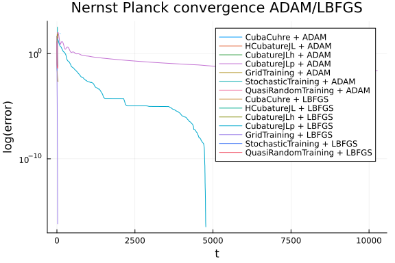

Adapted from [NeuralPDE: Automating Physics-Informed Neural Networks (PINNs) with Error Approximations](https://arxiv.org/abs/2107.09443).
Uses the [NeuralPDE.jl](https://neuralpde.sciml.ai/dev/) library from the
[SciML Scientific Machine Learning Open Source Organization](https://sciml.ai/)
for the implementation of physics-informed neural networks (PINNs) and other
science-guided AI techniques.

## Setup

```julia
using NeuralPDE
using Integrals, Cubature, Cuba
using ModelingToolkit, Optimization, OptimizationOptimJL
using Lux, Plots
using DelimitedFiles
using OptimizationOptimisers
using QuasiMonteCarlo
import ModelingToolkit: Interval, infimum, supremum
```


```julia
function nernst_planck(strategy, minimizer, maxIters)

    ##  DECLARATIONS
    @parameters t x y z
    @variables c(..)

    Dt = Differential(t)
    Dx = Differential(x)
    Dy = Differential(y)
    Dz = Differential(z)
    Dxx = Differential(x)^2
    Dyy = Differential(y)^2
    Dzz = Differential(z)^2

    ## DOMAINS AND OPERATORS

    # Discretization
    xwidth = 1.0
    ywidth = 1.0
    zwidth = 1.0
    tmax = 1.0
    xMeshNum = 10
    yMeshNum = 10
    zMeshNum = 10
    tMeshNum = 10

    dx = xwidth/xMeshNum
    dy = ywidth/yMeshNum
    dz = zwidth/zMeshNum
    dt = tmax/tMeshNum

    domains = [t ∈ Interval(0.0, tmax),
        x ∈ Interval(0.0, xwidth),
        y ∈ Interval(0.0, ywidth),
        z ∈ Interval(0.0, zwidth)]

    xs = 0.0:dx:xwidth
    ys = 0.0:dy:ywidth
    zs = 0.0:dz:zwidth
    ts = 0.0:dt:tmax

    # Constants
    D = 1  #dummy
    ux = 10 #dummy
    uy = 10 #dummy
    uz = 10 #dummy

    # Operators
    div = - D*(Dxx(c(t, x, y, z)) + Dyy(c(t, x, y, z)) + Dzz(c(t, x, y, z))) +
          (ux*Dx(c(t, x, y, z)) + uy*Dy(c(t, x, y, z)) + uz*Dz(c(t, x, y, z)))

    # Equation
    eq = Dt(c(t, x, y, z)) + div ~ 0      #NERNST-PLANCK EQUATION

    # Boundary conditions
    bcs = [c(0, x, y, z) ~ 0]

    ## NEURAL NETWORK
    n = 16   #neuron number

    chain = Lux.Chain(Lux.Dense(4, n, tanh), Lux.Dense(n, n, tanh), Lux.Dense(n, 1))   #Neural network from OptimizationFlux library

    indvars = [t, x, y, z]   #independent variables
    depvars = [c(t, x, y, z)]       #dependent (target) variable

    dim = length(domains)

    losses = []
    error = []
    times = []

    dx_err = 0.2

    error_strategy = GridTraining(dx_err)

    discretization_ = PhysicsInformedNN(chain, error_strategy)
    @named pde_system_ = PDESystem(eq, bcs, domains, indvars, depvars)
    prob_ = discretize(pde_system_, discretization_)

    function loss_function_(θ, p)
        params = θ.u
        return prob_.f.f(params, nothing)
    end

    function cb_(p, l)
        try
            deltaT_s = time_ns()
            ctime = time_ns() - startTime - timeCounter

            push!(times, ctime / 1e9)
            push!(losses, l)

            # Extract parameters for loss calculation
            params = p.u
            loss_ = loss_function_(p, nothing)
            push!(error, loss_)

            timeCounter += time_ns() - deltaT_s
            return false
        catch e
            @warn "Callback error: $e"
            return false
        end
    end

    @named pde_system = PDESystem(eq, bcs, domains, indvars, depvars)

    discretization = NeuralPDE.PhysicsInformedNN(chain, strategy)
    prob = NeuralPDE.discretize(pde_system, discretization)

    timeCounter = 0.0
    startTime = time_ns() #Fix initial time (t=0) before starting the training
    res = Optimization.solve(prob, minimizer, callback = cb_, maxiters = maxIters)

    phi = discretization.phi

    params = res.minimizer

    # Model prediction
    domain = [ts, xs, ys, zs]

    u_predict = [reshape(
                     [phi([t, x, y, z], res.minimizer) for x in xs for y in ys for z in zs],
                     (length(xs), length(ys), length(zs))) for t in ts]

    return [error, params, domain, times]
end

maxIters = [(1, 1, 1, 1000, 1000, 1000, 1000), (1, 1, 1, 300, 300, 300, 300)] #iters for ADAM/LBFGS
# maxIters = [(1,1,1,10,10,10,10),(1,1,1,3,3,3,3)] #iters for ADAM/LBFGS

strategies = [
    NeuralPDE.QuadratureTraining(quadrature_alg = CubaCuhre(), reltol = 1e-4, abstol = 1e-4, maxiters = 1100),
    #NeuralPDE.QuadratureTraining(quadrature_alg = HCubatureJL(), reltol = 1e-4, abstol = 1e-4, maxiters = 1100, batch = 0),
    NeuralPDE.GridTraining(0.1),
    NeuralPDE.QuadratureTraining(quadrature_alg = CubatureJLh(), reltol = 1e-4, abstol = 1e-4, maxiters = 1100),
    NeuralPDE.QuadratureTraining(quadrature_alg = CubatureJLp(), reltol = 1e-4, abstol = 1e-4, maxiters = 1100),
    NeuralPDE.GridTraining(0.2),
    NeuralPDE.StochasticTraining(400; bcs_points = 50),
    NeuralPDE.QuasiRandomTraining(400; bcs_points = 50)]

strategies_short_name = ["CubaCuhre",
    "HCubatureJL",
    "CubatureJLh",
    "CubatureJLp",
    "GridTraining",
    "StochasticTraining",
    "QuasiRandomTraining"]

minimizers = [Optimisers.ADAM(0.005),
    #BFGS()]
    LBFGS()]

minimizers_short_name = ["ADAM",
    "LBFGS"]
# "BFGS"]

# Run models
error_res = Dict()
domains = Dict()
params_res = Dict()
times = Dict()
```

```
Dict{Any, Any}()
```


## Solve

```julia
## Convergence

for strat in 1:length(strategies) # strategy
    for min in 1:length(minimizers) # minimizer
        # println(string(strategies_short_name[strat], "  ", minimizers_short_name[min]))
        res = nernst_planck(strategies[strat], minimizers[min], maxIters[min][strat])
        push!(error_res, string(strat, min) => res[1])
        push!(params_res, string(strat, min) => res[2])
        push!(domains, string(strat, min) => res[3])
        push!(times, string(strat, min) => res[4])
    end
end
```


## Results

```julia
#Plotting the first strategy with the first minimizer out from the loop to initialize the canvas
current_label = string(strategies_short_name[1], " + ", minimizers_short_name[1])
error = Plots.plot(times["11"], error_res["11"], yaxis = :log10, label = current_label)#, xlims = (0,10))#legend = true)#, size=(1200,700))
plot!(error, times["21"], error_res["21"], yaxis = :log10,
    label = string(strategies_short_name[2], " + ", minimizers_short_name[1]))
plot!(error, times["31"], error_res["31"], yaxis = :log10,
    label = string(strategies_short_name[3], " + ", minimizers_short_name[1]))
plot!(error, times["41"], error_res["41"], yaxis = :log10,
    label = string(strategies_short_name[4], " + ", minimizers_short_name[1]))
plot!(error, times["51"], error_res["51"], yaxis = :log10,
    label = string(strategies_short_name[5], " + ", minimizers_short_name[1]))
plot!(error, times["61"], error_res["61"], yaxis = :log10,
    label = string(strategies_short_name[6], " + ", minimizers_short_name[1]))
plot!(error, times["71"], error_res["71"], yaxis = :log10,
    label = string(strategies_short_name[7], " + ", minimizers_short_name[1]))

plot!(error, times["12"], error_res["12"], yaxis = :log10,
    label = string(strategies_short_name[1], " + ", minimizers_short_name[2]))
plot!(error, times["22"], error_res["22"], yaxis = :log10,
    label = string(strategies_short_name[2], " + ", minimizers_short_name[2]))
plot!(error, times["32"], error_res["32"], yaxis = :log10,
    label = string(strategies_short_name[3], " + ", minimizers_short_name[2]))
plot!(error, times["42"], error_res["42"], yaxis = :log10,
    label = string(strategies_short_name[4], " + ", minimizers_short_name[2]))
plot!(error, times["52"], error_res["52"], yaxis = :log10,
    label = string(strategies_short_name[5], " + ", minimizers_short_name[2]))
plot!(error, times["62"], error_res["62"], yaxis = :log10,
    label = string(strategies_short_name[6], " + ", minimizers_short_name[2]))
plot!(error, times["72"], error_res["72"], yaxis = :log10,
    title = string("Nernst Planck convergence ADAM/LBFGS"),
    ylabel = "log(error)", xlabel = "t",
    label = string(strategies_short_name[7], " + ", minimizers_short_name[2]))
```




## Appendix

These benchmarks are a part of the SciMLBenchmarks.jl repository, found at: [https://github.com/SciML/SciMLBenchmarks.jl](https://github.com/SciML/SciMLBenchmarks.jl). For more information on high-performance scientific machine learning, check out the SciML Open Source Software Organization [https://sciml.ai](https://sciml.ai).

To locally run this benchmark, do the following commands:

```
using SciMLBenchmarks
SciMLBenchmarks.weave_file("benchmarks/PINNErrorsVsTime","nernst_planck_et.jmd")
```

Computer Information:

```
Julia Version 1.10.10
Commit 95f30e51f41 (2025-06-27 09:51 UTC)
Build Info:
  Official https://julialang.org/ release
Platform Info:
  OS: Linux (x86_64-linux-gnu)
  CPU: 128 × AMD EPYC 7502 32-Core Processor
  WORD_SIZE: 64
  LIBM: libopenlibm
  LLVM: libLLVM-15.0.7 (ORCJIT, znver2)
Threads: 1 default, 0 interactive, 1 GC (on 128 virtual cores)
Environment:
  JULIA_CPU_THREADS = 128
  JULIA_DEPOT_PATH = /cache/julia-buildkite-plugin/depots/5b300254-1738-4989-ae0a-f4d2d937f953

```

Package Information:

```
Status `/cache/build/exclusive-amdci1-0/julialang/scimlbenchmarks-dot-jl/benchmarks/PINNErrorsVsTime/Project.toml`
  [8a292aeb] Cuba v2.3.0
  [667455a9] Cubature v1.5.1
  [8bb1440f] DelimitedFiles v1.9.1
⌃ [de52edbc] Integrals v4.5.0
⌃ [b2108857] Lux v1.9.0
⌃ [7e8f7934] MLDataDevices v1.9.1
⌅ [961ee093] ModelingToolkit v9.65.0
⌃ [315f7962] NeuralPDE v5.18.0
⌃ [3bd65402] Optimisers v0.4.5
⌅ [7f7a1694] Optimization v4.1.1
⌃ [36348300] OptimizationOptimJL v0.4.1
⌃ [42dfb2eb] OptimizationOptimisers v0.3.7
⌃ [91a5bcdd] Plots v1.40.9
  [8a4e6c94] QuasiMonteCarlo v0.3.3
⌃ [37e2e3b7] ReverseDiff v1.15.3
  [31c91b34] SciMLBenchmarks v0.1.3
Info Packages marked with ⌃ and ⌅ have new versions available. Those with ⌃ may be upgradable, but those with ⌅ are restricted by compatibility constraints from upgrading. To see why use `status --outdated`
Warning The project dependencies or compat requirements have changed since the manifest was last resolved. It is recommended to `Pkg.resolve()` or consider `Pkg.update()` if necessary.
```

And the full manifest:

```
Status `/cache/build/exclusive-amdci1-0/julialang/scimlbenchmarks-dot-jl/benchmarks/PINNErrorsVsTime/Manifest.toml`
⌃ [47edcb42] ADTypes v1.14.0
  [621f4979] AbstractFFTs v1.5.0
⌃ [80f14c24] AbstractMCMC v5.6.0
  [1520ce14] AbstractTrees v0.4.5
  [7d9f7c33] Accessors v0.1.42
⌃ [79e6a3ab] Adapt v4.2.0
⌅ [0bf59076] AdvancedHMC v0.6.4
  [66dad0bd] AliasTables v1.1.3
⌃ [dce04be8] ArgCheck v2.4.0
  [ec485272] ArnoldiMethod v0.4.0
⌃ [4fba245c] ArrayInterface v7.18.0
⌃ [4c555306] ArrayLayouts v1.11.1
⌃ [a9b6321e] Atomix v1.1.1
  [13072b0f] AxisAlgorithms v1.1.0
⌃ [39de3d68] AxisArrays v0.4.7
⌃ [198e06fe] BangBang v0.4.4
  [9718e550] Baselet v0.1.1
⌅ [e2ed5e7c] Bijections v0.1.9
  [d1d4a3ce] BitFlags v0.1.9
  [62783981] BitTwiddlingConvenienceFunctions v0.1.6
⌃ [8e7c35d0] BlockArrays v1.4.0
⌃ [70df07ce] BracketingNonlinearSolve v1.1.0
  [fa961155] CEnum v0.5.0
⌃ [2a0fbf3d] CPUSummary v0.2.6
  [00ebfdb7] CSTParser v3.4.3
⌃ [082447d4] ChainRules v1.72.3
⌃ [d360d2e6] ChainRulesCore v1.25.1
  [fb6a15b2] CloseOpenIntervals v0.1.13
  [944b1d66] CodecZlib v0.7.8
⌃ [35d6a980] ColorSchemes v3.29.0
⌃ [3da002f7] ColorTypes v0.12.0
  [c3611d14] ColorVectorSpace v0.11.0
⌃ [5ae59095] Colors v0.13.0
⌃ [861a8166] Combinatorics v1.0.2
⌅ [a80b9123] CommonMark v0.8.15
  [38540f10] CommonSolve v0.2.4
  [bbf7d656] CommonSubexpressions v0.3.1
  [f70d9fcc] CommonWorldInvalidations v1.0.0
⌃ [34da2185] Compat v4.16.0
⌃ [b0b7db55] ComponentArrays v0.15.25
  [b152e2b5] CompositeTypes v0.1.4
  [a33af91c] CompositionsBase v0.1.2
  [2569d6c7] ConcreteStructs v0.2.3
  [f0e56b4a] ConcurrentUtilities v2.5.0
⌃ [8f4d0f93] Conda v1.10.2
  [88cd18e8] ConsoleProgressMonitor v0.1.2
⌃ [187b0558] ConstructionBase v1.5.8
  [d38c429a] Contour v0.6.3
  [adafc99b] CpuId v0.3.1
  [a8cc5b0e] Crayons v4.1.1
  [8a292aeb] Cuba v2.3.0
  [667455a9] Cubature v1.5.1
  [9a962f9c] DataAPI v1.16.0
⌅ [864edb3b] DataStructures v0.18.20
  [e2d170a0] DataValueInterfaces v1.0.0
  [244e2a9f] DefineSingletons v0.1.2
  [8bb1440f] DelimitedFiles v1.9.1
⌃ [2b5f629d] DiffEqBase v6.164.2
⌃ [459566f4] DiffEqCallbacks v4.3.0
  [77a26b50] DiffEqNoiseProcess v5.24.1
  [163ba53b] DiffResults v1.1.0
  [b552c78f] DiffRules v1.15.1
⌅ [a0c0ee7d] DifferentiationInterface v0.6.43
⌃ [8d63f2c5] DispatchDoctor v0.4.19
⌃ [31c24e10] Distributions v0.25.117
⌃ [ffbed154] DocStringExtensions v0.9.3
⌃ [5b8099bc] DomainSets v0.7.15
⌃ [7c1d4256] DynamicPolynomials v0.6.1
⌃ [06fc5a27] DynamicQuantities v1.5.1
⌃ [4e289a0a] EnumX v1.0.4
⌃ [f151be2c] EnzymeCore v0.8.8
  [460bff9d] ExceptionUnwrapping v0.1.11
  [e2ba6199] ExprTools v0.1.10
  [55351af7] ExproniconLite v0.10.14
⌃ [c87230d0] FFMPEG v0.4.2
⌃ [7a1cc6ca] FFTW v1.8.1
  [7034ab61] FastBroadcast v0.3.5
  [9aa1b823] FastClosures v0.3.2
⌃ [a4df4552] FastPower v1.1.1
⌃ [1a297f60] FillArrays v1.13.0
⌃ [64ca27bc] FindFirstFunctions v1.4.1
⌃ [6a86dc24] FiniteDiff v2.27.0
  [53c48c17] FixedPointNumbers v0.8.5
  [1fa38f19] Format v1.3.7
⌅ [f6369f11] ForwardDiff v0.10.38
  [069b7b12] FunctionWrappers v1.1.3
  [77dc65aa] FunctionWrappersWrappers v0.1.3
  [d9f16b24] Functors v0.5.2
⌃ [0c68f7d7] GPUArrays v11.2.2
  [46192b85] GPUArraysCore v0.2.0
⌃ [28b8d3ca] GR v0.73.13
⌃ [c145ed77] GenericSchur v0.5.4
⌃ [d7ba0133] Git v1.3.1
  [c27321d9] Glob v1.3.1
⌃ [86223c79] Graphs v1.12.0
  [42e2da0e] Grisu v1.0.2
  [19dc6840] HCubature v1.7.0
⌃ [cd3eb016] HTTP v1.10.15
  [076d061b] HashArrayMappedTries v0.2.0
  [eafb193a] Highlights v0.5.3
  [3e5b6fbb] HostCPUFeatures v0.1.17
  [0e44f5e4] Hwloc v3.3.0
⌃ [34004b35] HypergeometricFunctions v0.3.27
⌃ [7073ff75] IJulia v1.26.0
⌃ [7869d1d1] IRTools v0.4.14
  [615f187c] IfElse v0.1.1
  [d25df0c9] Inflate v0.1.5
  [22cec73e] InitialValues v0.3.1
  [505f98c9] InplaceOps v0.3.0
⌃ [18e54dd8] IntegerMathUtils v0.1.2
⌃ [de52edbc] Integrals v4.5.0
⌅ [a98d9a8b] Interpolations v0.15.1
⌃ [8197267c] IntervalSets v0.7.10
  [3587e190] InverseFunctions v0.1.17
⌃ [92d709cd] IrrationalConstants v0.2.4
  [c8e1da08] IterTools v1.10.0
  [82899510] IteratorInterfaceExtensions v1.0.0
⌃ [1019f520] JLFzf v0.1.9
⌃ [692b3bcd] JLLWrappers v1.7.0
⌅ [682c06a0] JSON v0.21.4
  [ae98c720] Jieko v0.2.1
⌅ [98e50ef6] JuliaFormatter v1.0.62
⌃ [ccbc3e58] JumpProcesses v9.14.2
⌃ [63c18a36] KernelAbstractions v0.9.34
⌃ [5ab0869b] KernelDensity v0.6.9
⌅ [ba0b0d4f] Krylov v0.9.10
  [5be7bae1] LBFGSB v0.4.1
⌃ [929cbde3] LLVM v9.2.0
  [b964fa9f] LaTeXStrings v1.4.0
⌃ [23fbe1c1] Latexify v0.16.6
  [73f95e8e] LatticeRules v0.0.1
  [10f19ff3] LayoutPointers v0.1.17
⌃ [5078a376] LazyArrays v2.6.1
⌃ [1d6d02ad] LeftChildRightSiblingTrees v0.2.0
  [87fe0de2] LineSearch v0.1.4
⌃ [d3d80556] LineSearches v7.3.0
⌃ [7ed4a6bd] LinearSolve v3.4.0
⌃ [6fdf6af0] LogDensityProblems v2.1.2
⌃ [996a588d] LogDensityProblemsAD v1.13.0
  [2ab3a3ac] LogExpFunctions v0.3.29
⌃ [e6f89c97] LoggingExtras v1.1.0
⌃ [b2108857] Lux v1.9.0
⌃ [bb33d45b] LuxCore v1.2.3
⌃ [82251201] LuxLib v1.6.1
⌅ [c7f686f2] MCMCChains v6.0.7
⌃ [be115224] MCMCDiagnosticTools v0.3.14
⌃ [7e8f7934] MLDataDevices v1.9.1
⌃ [e80e1ace] MLJModelInterface v1.11.0
  [d8e11817] MLStyle v0.4.17
⌃ [1914dd2f] MacroTools v0.5.15
  [d125e4d3] ManualMemory v0.1.8
  [bb5d69b7] MaybeInplace v0.1.4
  [739be429] MbedTLS v1.1.9
  [442fdcdd] Measures v0.3.2
  [128add7d] MicroCollections v0.2.0
  [e1d29d7a] Missings v1.2.0
⌅ [961ee093] ModelingToolkit v9.65.0
  [4886b29c] MonteCarloIntegration v0.2.0
⌃ [0987c9cc] MonteCarloMeasurements v1.4.5
⌃ [2e0e35c7] Moshi v0.3.5
  [46d2c3a1] MuladdMacro v0.2.4
⌃ [102ac46a] MultivariatePolynomials v0.5.7
⌃ [ffc61752] Mustache v1.0.20
⌃ [d8a4904e] MutableArithmetics v1.6.4
⌃ [d41bc354] NLSolversBase v7.8.3
⌃ [872c559c] NNlib v0.9.28
⌃ [77ba4419] NaNMath v1.1.2
  [c020b1a1] NaturalSort v1.0.0
⌅ [ea5c82af] NeuralOperators v0.5.3
⌃ [315f7962] NeuralPDE v5.18.0
⌃ [8913a72c] NonlinearSolve v4.4.0
⌅ [be0214bd] NonlinearSolveBase v1.5.0
⌃ [5959db7a] NonlinearSolveFirstOrder v1.3.0
⌃ [9a2c21bd] NonlinearSolveQuasiNewton v1.2.0
⌃ [26075421] NonlinearSolveSpectralMethods v1.1.0
⌃ [6fe1bfb0] OffsetArrays v1.15.0
⌃ [4d8831e6] OpenSSL v1.4.3
⌃ [429524aa] Optim v1.11.0
⌃ [3bd65402] Optimisers v0.4.5
⌅ [7f7a1694] Optimization v4.1.1
⌅ [bca83a33] OptimizationBase v2.4.0
⌃ [36348300] OptimizationOptimJL v0.4.1
⌃ [42dfb2eb] OptimizationOptimisers v0.3.7
⌃ [bac558e1] OrderedCollections v1.8.0
⌃ [90014a1f] PDMats v0.11.32
  [d96e819e] Parameters v0.12.3
⌃ [69de0a69] Parsers v2.8.1
  [b98c9c47] Pipe v1.3.0
  [ccf2f8ad] PlotThemes v3.3.0
  [995b91a9] PlotUtils v1.4.3
⌃ [91a5bcdd] Plots v1.40.9
⌃ [e409e4f3] PoissonRandom v0.4.4
⌃ [f517fe37] Polyester v0.7.16
  [1d0040c9] PolyesterWeave v0.2.2
  [85a6dd25] PositiveFactorizations v0.2.4
⌅ [aea7be01] PrecompileTools v1.2.1
⌃ [21216c6a] Preferences v1.4.3
⌅ [08abe8d2] PrettyTables v2.4.0
⌃ [27ebfcd6] Primes v0.5.6
⌃ [33c8b6b6] ProgressLogging v0.1.4
⌃ [92933f4c] ProgressMeter v1.10.2
  [43287f4e] PtrArrays v1.3.0
  [1fd47b50] QuadGK v2.11.2
  [8a4e6c94] QuasiMonteCarlo v0.3.3
⌃ [74087812] Random123 v1.7.0
  [e6cf234a] RandomNumbers v1.6.0
  [b3c3ace0] RangeArrays v0.3.2
  [c84ed2f1] Ratios v0.4.5
  [c1ae055f] RealDot v0.1.0
  [3cdcf5f2] RecipesBase v1.3.4
  [01d81517] RecipesPipeline v0.6.12
⌃ [731186ca] RecursiveArrayTools v3.31.0
  [189a3867] Reexport v1.2.2
  [05181044] RelocatableFolders v1.0.1
  [ae029012] Requires v1.3.1
  [ae5879a3] ResettableStacks v1.1.1
⌃ [37e2e3b7] ReverseDiff v1.15.3
⌅ [79098fc4] Rmath v0.8.0
⌃ [7e49a35a] RuntimeGeneratedFunctions v0.5.13
⌃ [9dfe8606] SCCNonlinearSolve v1.0.0
  [94e857df] SIMDTypes v0.1.0
  [476501e8] SLEEFPirates v0.6.43
⌃ [0bca4576] SciMLBase v2.75.1
  [31c91b34] SciMLBenchmarks v0.1.3
⌃ [19f34311] SciMLJacobianOperators v0.1.1
⌅ [c0aeaf25] SciMLOperators v0.3.12
  [53ae85a6] SciMLStructures v1.7.0
  [30f210dd] ScientificTypesBase v3.0.0
⌃ [7e506255] ScopedValues v1.3.0
⌃ [6c6a2e73] Scratch v1.2.1
  [efcf1570] Setfield v1.1.2
  [992d4aef] Showoff v1.0.3
  [777ac1f9] SimpleBufferStream v1.2.0
⌃ [727e6d20] SimpleNonlinearSolve v2.1.0
⌃ [699a6c99] SimpleTraits v0.9.4
  [ce78b400] SimpleUnPack v1.1.0
  [ed01d8cd] Sobol v1.5.0
  [b85f4697] SoftGlobalScope v1.1.0
⌃ [a2af1166] SortingAlgorithms v1.2.1
⌅ [9f842d2f] SparseConnectivityTracer v0.6.13
  [dc90abb0] SparseInverseSubset v0.1.2
⌃ [0a514795] SparseMatrixColorings v0.4.14
⌃ [276daf66] SpecialFunctions v2.5.0
  [171d559e] SplittablesBase v0.1.15
⌃ [860ef19b] StableRNGs v1.0.2
⌃ [aedffcd0] Static v1.1.1
  [0d7ed370] StaticArrayInterface v1.8.0
⌃ [90137ffa] StaticArrays v1.9.13
  [1e83bf80] StaticArraysCore v1.4.3
⌃ [64bff920] StatisticalTraits v3.4.0
⌃ [82ae8749] StatsAPI v1.7.0
⌃ [2913bbd2] StatsBase v0.34.4
⌃ [4c63d2b9] StatsFuns v1.3.2
⌃ [7792a7ef] StrideArraysCore v0.5.7
  [69024149] StringEncodings v0.3.7
  [892a3eda] StringManipulation v0.4.1
⌃ [09ab397b] StructArrays v0.7.0
⌃ [2efcf032] SymbolicIndexingInterface v0.3.38
⌃ [19f23fe9] SymbolicLimits v0.2.2
⌅ [d1185830] SymbolicUtils v3.17.0
⌃ [0c5d862f] Symbolics v6.30.0
  [3783bdb8] TableTraits v1.0.1
⌃ [bd369af6] Tables v1.12.0
⌃ [ed4db957] TaskLocalValues v0.1.2
  [62fd8b95] TensorCore v0.1.1
  [8ea1fca8] TermInterface v2.0.0
  [5d786b92] TerminalLoggers v0.1.7
  [1c621080] TestItems v1.0.0
⌃ [8290d209] ThreadingUtilities v0.5.2
⌃ [a759f4b9] TimerOutputs v0.5.28
  [0796e94c] Tokenize v0.5.29
  [3bb67fe8] TranscodingStreams v0.11.3
⌃ [28d57a85] Transducers v0.4.84
⌃ [410a4b4d] Tricks v0.1.10
  [781d530d] TruncatedStacktraces v1.4.0
⌃ [5c2747f8] URIs v1.5.1
  [3a884ed6] UnPack v1.0.2
  [1cfade01] UnicodeFun v0.4.1
⌅ [1986cc42] Unitful v1.22.0
⌃ [45397f5d] UnitfulLatexify v1.6.4
  [a7c27f48] Unityper v0.1.6
  [013be700] UnsafeAtomics v0.3.0
  [41fe7b60] Unzip v0.2.0
⌃ [3d5dd08c] VectorizationBase v0.21.71
  [81def892] VersionParsing v1.3.0
  [897b6980] WeakValueDicts v0.1.0
  [44d3d7a6] Weave v0.10.12
⌃ [d49dbf32] WeightInitializers v1.1.1
  [efce3f68] WoodburyMatrices v1.0.0
⌃ [ddb6d928] YAML v0.4.13
⌃ [c2297ded] ZMQ v1.4.0
⌃ [e88e6eb3] Zygote v0.6.75
  [700de1a5] ZygoteRules v0.2.7
  [6e34b625] Bzip2_jll v1.0.9+0
⌃ [83423d85] Cairo_jll v1.18.2+1
  [3bed1096] Cuba_jll v4.2.2+1
  [7bc98958] Cubature_jll v1.0.5+0
⌃ [ee1fde0b] Dbus_jll v1.14.10+0
  [2702e6a9] EpollShim_jll v0.0.20230411+1
⌃ [2e619515] Expat_jll v2.6.5+0
⌅ [b22a6f82] FFMPEG_jll v4.4.4+1
⌃ [f5851436] FFTW_jll v3.3.10+3
⌃ [a3f928ae] Fontconfig_jll v2.15.0+0
⌃ [d7e528f0] FreeType2_jll v2.13.3+1
⌃ [559328eb] FriBidi_jll v1.0.16+0
  [0656b61e] GLFW_jll v3.4.0+2
⌅ [d2c73de3] GR_jll v0.73.13+0
  [78b55507] Gettext_jll v0.21.0+0
⌃ [f8c6e375] Git_jll v2.47.1+0
⌃ [7746bdde] Glib_jll v2.82.4+0
⌃ [3b182d85] Graphite2_jll v1.3.14+1
⌃ [2e76f6c2] HarfBuzz_jll v8.5.0+0
⌃ [e33a78d0] Hwloc_jll v2.12.0+0
⌃ [1d5cc7b8] IntelOpenMP_jll v2025.0.4+0
⌃ [aacddb02] JpegTurbo_jll v3.1.1+0
⌃ [c1c5ebd0] LAME_jll v3.100.2+0
  [88015f11] LERC_jll v4.0.1+0
⌅ [dad2f222] LLVMExtra_jll v0.0.35+0
⌃ [1d63c593] LLVMOpenMP_jll v18.1.7+0
  [dd4b983a] LZO_jll v2.10.3+0
  [81d17ec3] L_BFGS_B_jll v3.0.1+0
⌅ [e9f186c6] Libffi_jll v3.2.2+2
⌃ [d4300ac3] Libgcrypt_jll v1.11.0+0
⌃ [7e76a0d4] Libglvnd_jll v1.7.0+0
  [7add5ba3] Libgpg_error_jll v1.51.1+0
  [94ce4f54] Libiconv_jll v1.18.0+0
⌃ [4b2f31a3] Libmount_jll v2.40.3+0
⌃ [89763e89] Libtiff_jll v4.7.1+0
⌃ [38a345b3] Libuuid_jll v2.40.3+0
⌃ [856f044c] MKL_jll v2025.0.1+1
⌃ [e7412a2a] Ogg_jll v1.3.5+1
⌃ [458c3c95] OpenSSL_jll v3.0.16+0
  [efe28fd5] OpenSpecFun_jll v0.5.6+0
⌃ [91d4177d] Opus_jll v1.3.3+0
⌃ [36c8627f] Pango_jll v1.56.1+0
⌅ [30392449] Pixman_jll v0.43.4+0
⌅ [c0090381] Qt6Base_jll v6.7.1+1
⌅ [629bc702] Qt6Declarative_jll v6.7.1+2
⌅ [ce943373] Qt6ShaderTools_jll v6.7.1+1
⌃ [e99dba38] Qt6Wayland_jll v6.7.1+1
  [f50d1b31] Rmath_jll v0.5.1+0
  [a44049a8] Vulkan_Loader_jll v1.3.243+0
⌃ [a2964d1f] Wayland_jll v1.21.0+2
⌃ [2381bf8a] Wayland_protocols_jll v1.36.0+0
⌅ [02c8fc9c] XML2_jll v2.13.6+1
⌃ [aed1982a] XSLT_jll v1.1.42+0
⌃ [ffd25f8a] XZ_jll v5.6.4+1
⌃ [f67eecfb] Xorg_libICE_jll v1.1.1+0
⌃ [c834827a] Xorg_libSM_jll v1.2.4+0
⌃ [4f6342f7] Xorg_libX11_jll v1.8.6+3
⌃ [0c0b7dd1] Xorg_libXau_jll v1.0.12+0
⌃ [935fb764] Xorg_libXcursor_jll v1.2.3+0
⌃ [a3789734] Xorg_libXdmcp_jll v1.1.5+0
⌃ [1082639a] Xorg_libXext_jll v1.3.6+3
⌃ [d091e8ba] Xorg_libXfixes_jll v6.0.0+0
⌃ [a51aa0fd] Xorg_libXi_jll v1.8.2+0
⌃ [d1454406] Xorg_libXinerama_jll v1.1.5+0
⌃ [ec84b674] Xorg_libXrandr_jll v1.5.4+0
⌃ [ea2f1a96] Xorg_libXrender_jll v0.9.11+1
⌃ [14d82f49] Xorg_libpthread_stubs_jll v0.1.2+0
⌃ [c7cfdc94] Xorg_libxcb_jll v1.17.0+3
⌃ [cc61e674] Xorg_libxkbfile_jll v1.1.2+1
⌃ [e920d4aa] Xorg_xcb_util_cursor_jll v0.1.4+0
⌃ [12413925] Xorg_xcb_util_image_jll v0.4.0+1
⌃ [2def613f] Xorg_xcb_util_jll v0.4.0+1
⌃ [975044d2] Xorg_xcb_util_keysyms_jll v0.4.0+1
⌃ [0d47668e] Xorg_xcb_util_renderutil_jll v0.3.9+1
⌃ [c22f9ab0] Xorg_xcb_util_wm_jll v0.4.1+1
⌃ [35661453] Xorg_xkbcomp_jll v1.4.6+1
⌃ [33bec58e] Xorg_xkeyboard_config_jll v2.39.0+0
⌃ [c5fb5394] Xorg_xtrans_jll v1.5.1+0
⌃ [8f1865be] ZeroMQ_jll v4.3.5+3
  [3161d3a3] Zstd_jll v1.5.7+1
⌃ [35ca27e7] eudev_jll v3.2.9+0
⌅ [214eeab7] fzf_jll v0.56.3+0
⌃ [1a1c6b14] gperf_jll v3.1.1+1
⌃ [a4ae2306] libaom_jll v3.11.0+0
⌅ [0ac62f75] libass_jll v0.15.2+0
  [1183f4f0] libdecor_jll v0.2.2+0
⌃ [2db6ffa8] libevdev_jll v1.11.0+0
⌃ [f638f0a6] libfdk_aac_jll v2.0.3+0
⌃ [36db933b] libinput_jll v1.18.0+0
⌃ [b53b4c65] libpng_jll v1.6.47+0
⌃ [a9144af2] libsodium_jll v1.0.20+3
⌃ [f27f6e37] libvorbis_jll v1.3.7+2
⌃ [009596ad] mtdev_jll v1.1.6+0
⌃ [1317d2d5] oneTBB_jll v2022.0.0+0
⌅ [1270edf5] x264_jll v2021.5.5+0
⌅ [dfaa095f] x265_jll v3.5.0+0
⌃ [d8fb68d0] xkbcommon_jll v1.4.1+2
  [0dad84c5] ArgTools v1.1.1
  [56f22d72] Artifacts
  [2a0f44e3] Base64
  [ade2ca70] Dates
  [8ba89e20] Distributed
  [f43a241f] Downloads v1.6.0
  [7b1f6079] FileWatching
  [9fa8497b] Future
  [b77e0a4c] InteractiveUtils
  [4af54fe1] LazyArtifacts
  [b27032c2] LibCURL v0.6.4
  [76f85450] LibGit2
  [8f399da3] Libdl
  [37e2e46d] LinearAlgebra
  [56ddb016] Logging
  [d6f4376e] Markdown
  [a63ad114] Mmap
  [ca575930] NetworkOptions v1.2.0
  [44cfe95a] Pkg v1.10.0
  [de0858da] Printf
  [3fa0cd96] REPL
  [9a3f8284] Random
  [ea8e919c] SHA v0.7.0
  [9e88b42a] Serialization
  [1a1011a3] SharedArrays
  [6462fe0b] Sockets
  [2f01184e] SparseArrays v1.10.0
  [10745b16] Statistics v1.10.0
  [4607b0f0] SuiteSparse
  [fa267f1f] TOML v1.0.3
  [a4e569a6] Tar v1.10.0
  [8dfed614] Test
  [cf7118a7] UUIDs
  [4ec0a83e] Unicode
  [e66e0078] CompilerSupportLibraries_jll v1.1.1+0
  [deac9b47] LibCURL_jll v8.4.0+0
  [e37daf67] LibGit2_jll v1.6.4+0
  [29816b5a] LibSSH2_jll v1.11.0+1
  [c8ffd9c3] MbedTLS_jll v2.28.2+1
  [14a3606d] MozillaCACerts_jll v2023.1.10
  [4536629a] OpenBLAS_jll v0.3.23+4
  [05823500] OpenLibm_jll v0.8.1+2
  [efcefdf7] PCRE2_jll v10.42.0+1
  [bea87d4a] SuiteSparse_jll v7.2.1+1
  [83775a58] Zlib_jll v1.2.13+1
  [8e850b90] libblastrampoline_jll v5.11.0+0
  [8e850ede] nghttp2_jll v1.52.0+1
  [3f19e933] p7zip_jll v17.4.0+2
Info Packages marked with ⌃ and ⌅ have new versions available. Those with ⌃ may be upgradable, but those with ⌅ are restricted by compatibility constraints from upgrading. To see why use `status --outdated -m`
Warning The project dependencies or compat requirements have changed since the manifest was last resolved. It is recommended to `Pkg.resolve()` or consider `Pkg.update()` if necessary.
```

