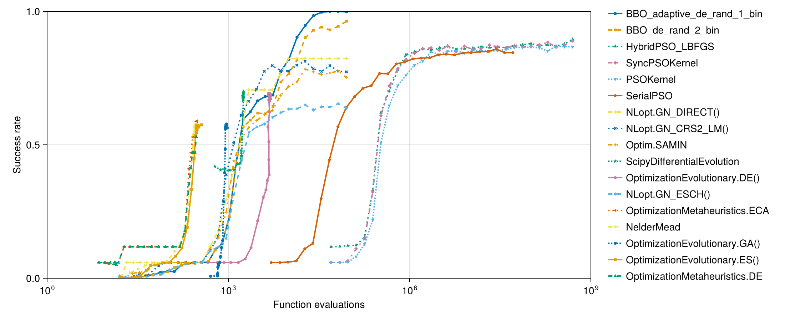
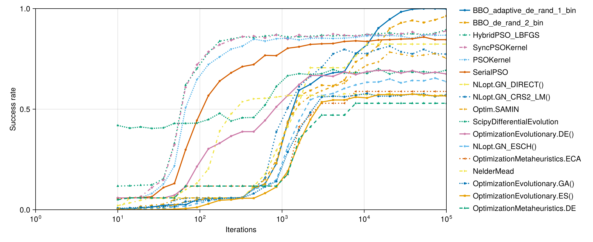
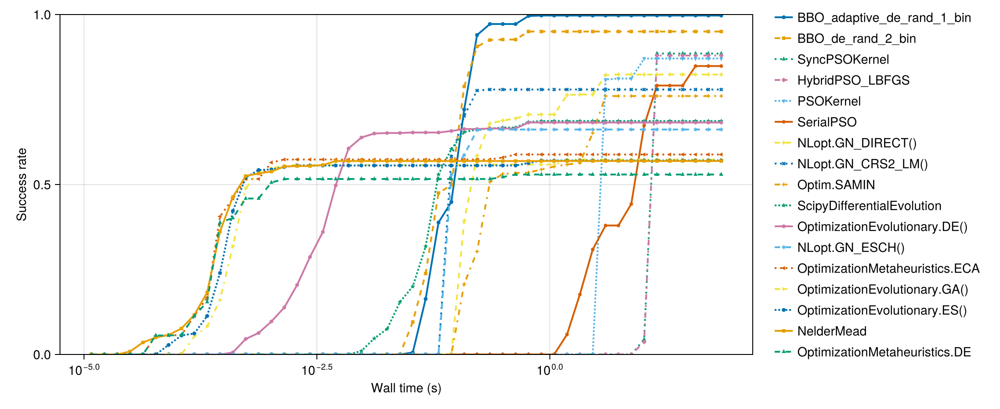
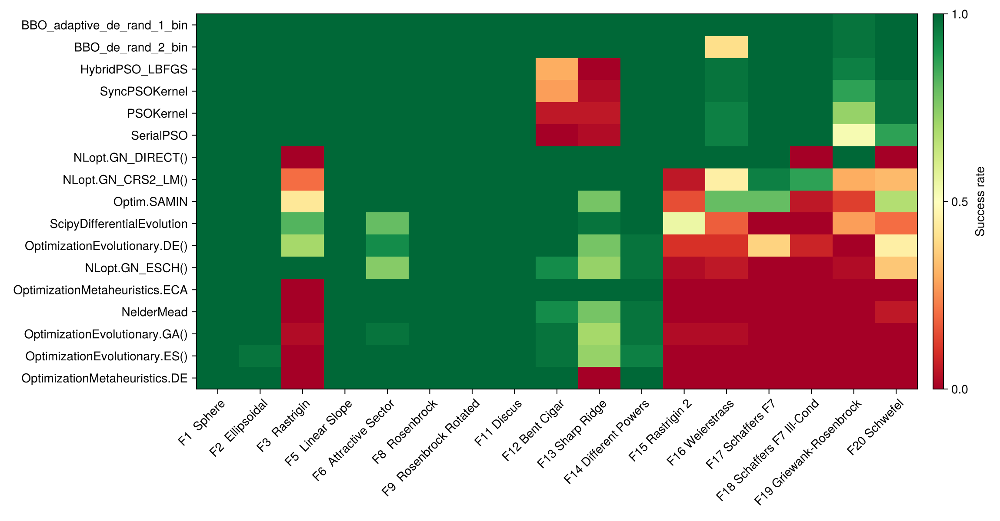
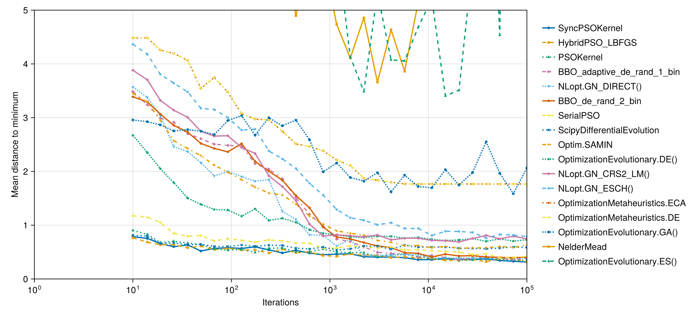
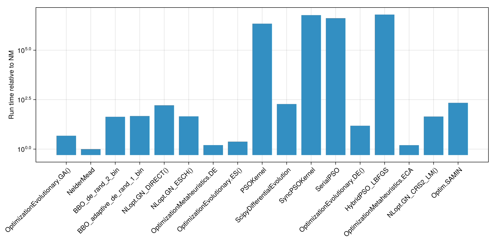

This benchmark evaluates Particle Swarm Optimization (PSO) variants from
[ParallelParticleSwarms.jl](https://github.com/SciML/ParallelParticleSwarms.jl) against
established global optimizers on the
[BlackBoxOptimizationBenchmarking.jl](https://github.com/jonathanBieler/BlackBoxOptimizationBenchmarking.jl)
suite (v2 API), using the [Optimization.jl](https://github.com/SciML/Optimization.jl) interface.

## Setup

```julia
using Random
Random.seed!(42)

using BlackBoxOptimizationBenchmarking, CairoMakie, Optimization, Memoize, Statistics
CairoMakie.activate!()
import BlackBoxOptimizationBenchmarking: Chain, BenchmarkSetup, BenchmarkResults,
    BBOBFunction, FunctionCallsCounter, solve_problem, pinit, compute_CI
const BBOB = BlackBoxOptimizationBenchmarking

using OptimizationBBO, OptimizationOptimJL, OptimizationEvolutionary, OptimizationNLopt
using OptimizationMetaheuristics, OptimizationSciPy

using ParallelParticleSwarms
using ForwardDiff
using KernelAbstractions
using CUDA
using StaticArrays, LinearAlgebra

const PSOKernel     = ParallelParticleSwarms.ParallelPSOKernel
const SyncPSOKernel = ParallelParticleSwarms.ParallelSyncPSOKernel
const SerialPSOAlgorithm = ParallelParticleSwarms.SerialPSO
const HPso          = ParallelParticleSwarms.HybridPSO

const BACKEND = CUDABackend()
```

```
CUDA.CUDAKernels.CUDABackend(false, false)
```


```julia
const MK_MARKERS = [:circle, :rect, :utriangle, :diamond, :dtriangle, :pentagon,
    :cross, :xcross, :star4, :star5, :hexagon, :star6, :ltriangle, :rtriangle]
const MK_LINESTYLES = [:solid, :dash, :dot, :dashdot, (:dot, :dense)]

function solve_problem_baseline(optimizer::Union{Chain, BenchmarkSetup}, f, D::Int,
        run_length::Int)
    solve_problem(optimizer, f, D, run_length)
end

function benchmark_time_to_success(
    optimizer::Union{Chain, BenchmarkSetup}, funcs::Vector{<:BBOBFunction};
    Ntrials::Int = 15, dimension::Int = 3, Δf::Real = 1e-6, max_run_length::Int = 100_000
)
    all_times = Float64[]
    for f in funcs
        for _ in 1:Ntrials
            t0  = time()
            sol = solve_problem_baseline(optimizer, f, dimension, max_run_length)
            elapsed = time() - t0
            push!(all_times, sol.objective < Δf + f.f_opt ? elapsed : Inf)
        end
    end
    return all_times
end

benchmark_time_to_success(optimizer, funcs::Vector{<:BBOBFunction}; kwargs...) =
    benchmark_time_to_success(BenchmarkSetup(optimizer), funcs; kwargs...)

function success_rate_cdf(all_times::Vector{Float64}, time_thresholds::AbstractVector{Float64})
    N = length(all_times)
    return [count(x -> x <= t, all_times) / N for t in time_thresholds]
end
```

```
success_rate_cdf (generic function with 1 method)
```


```julia
_to_f64(x::Real) = Float64(x)
_to_f64(x::ForwardDiff.Dual) = Float64(ForwardDiff.value(x))
_to_f64(x)       = Float64(x[])

_value(x::Real) = x
_value(x::ForwardDiff.Dual) = ForwardDiff.value(x)
_penalty(x) = eltype(x) <: ForwardDiff.Dual ? zero(first(x)) + 1.0f10 : 1.0f10

function pso_objective(f::BBOBFunction, x)
    any(xi -> !isfinite(_value(xi)) || abs(_value(xi)) > 15, x) && return _penalty(x)
    y = f(x)
    y isa ForwardDiff.Dual ? y : Float32(y)
end

function _pso_problem(f::BBOBFunction, D::Int; x0 = nothing)
    optf = OptimizationFunction{false}((x, p) -> pso_objective(f, x), Optimization.SciMLBase.NoAD())
    lb   = SVector{D, Float32}(ntuple(_ -> -5.0f0, Val(D)))
    ub   = SVector{D, Float32}(ntuple(_ ->  5.0f0, Val(D)))
    x0   = x0 === nothing ?
        SVector{D, Float32}(ntuple(_ -> -5.0f0 + rand(Float32) * 10.0f0, Val(D))) :
        SVector{D, Float32}(x0)
    OptimizationProblem{false}(optf, x0, nothing; lb, ub)
end

function pso_solve(opt, f::BBOBFunction, D::Int, maxiters::Int;
        local_maxiters::Int = 50, x0 = nothing)
    prob = _pso_problem(f, D; x0)
    if opt isa HPso
        solve(prob, opt; maxiters, local_maxiters, abstol = 1.0f-8, reltol = 1.0f-8)
    else
        solve(prob, opt; maxiters)
    end
end

function _extract_u(sol, D)
    u = sol.u
    u isa SVector && return u
    u isa AbstractVector && return SVector{D}(u)
    u[]
end

function pso_benchmark(opt, funcs, run_length;
        Ntrials = 15, dimension = 3, local_maxiters = 50, Δf = 1e-6, CI_quantile = 0.25,
        n_particles = 1)
    Nf = length(funcs); Nr = length(run_length)
    success = zeros(Float64, Nf, Nr)
    dist    = zeros(Float64, Nf, Nr)
    fmin    = zeros(Float64, Nf, Nr)
    t0 = time()
    for (fi, f) in enumerate(funcs)
        xopt = SVector{dimension, Float32}(f.x_opt[1:dimension])
        for (ri, rl) in enumerate(run_length)
            hits = 0; dsum = 0.0; fsum = 0.0
            for _ in 1:Ntrials
                sol = pso_solve(opt, f, dimension, rl; local_maxiters)
                u    = _extract_u(sol, dimension)
                fval = _to_f64(sol.objective)
                hits += abs(fval - f.f_opt) < Δf ? 1 : 0
                dsum += Float64(norm(u .- xopt))
                fsum += fval - f.f_opt
            end
            success[fi, ri] = hits / Ntrials
            dist[fi, ri]    = dsum / Ntrials
            fmin[fi, ri]    = fsum / Ntrials
        end
    end
    elapsed = time() - t0
    Neff = Ntrials * Nf
    sr   = vec(mean(success, dims = 1))
    sc   = vec(sum(success .* Ntrials, dims = 1)) .|> round .|> Int
    ci   = BBOB.compute_CI(sr, Neff, CI_quantile)
    BenchmarkResults(
        run_length                = collect(run_length),
        success_count             = sc,
        success_rate              = sr,
        success_rate_qlow         = ci.success_rate_qlow,
        success_rate_qhigh        = ci.success_rate_qhigh,
        distance_to_minimizer     = vec(mean(dist, dims = 1)),
        minimum                   = vec(mean(fmin, dims = 1)),
        runtime                   = elapsed,
        Neffective                = Neff,
        callcount                 = Float64.(run_length) .* n_particles,
        success_rate_per_function = [success[fi, end] for fi in 1:Nf],
    )
end

function pso_tts(opt, funcs; Ntrials = 15, dimension = 3, Δf = 1e-6,
        local_maxiters = 50, max_run_length = 100_000)
    all_times = Float64[]
    D = dimension
    for f in funcs
        for _ in 1:Ntrials
            x0   = SVector{D, Float32}(ntuple(_ -> -5.0f0 + rand(Float32) * 10.0f0, Val(D)))
            prob = _pso_problem(f, D; x0)
            t0 = time()
            sol = if opt isa HPso
                solve(prob, opt; maxiters = max_run_length,
                      local_maxiters, abstol = 1.0f-8, reltol = 1.0f-8)
            else
                solve(prob, opt; maxiters = max_run_length)
            end
            elapsed = time() - t0
            fval = _to_f64(sol.objective)
            push!(all_times, abs(fval - f.f_opt) < Δf ? elapsed : Inf)
        end
    end
    all_times
end
```

```
pso_tts (generic function with 1 method)
```


```julia
chain = (t; isboxed = false) -> Chain(
    BenchmarkSetup(t, isboxed = isboxed),
    BenchmarkSetup(NelderMead(), isboxed = false),
    0.9)

dimension      = 3
# Exclude unstable BBOB functions: f4 Buche-Rastrigin, f7 Step-Ellipsoidal (segfault),
# f10 Ellipsoidal-2 (illegal access).
test_functions = filter(f -> nameof(f.f) ∉ (:f4, :f7, :f10), BBOB.bbob_suite(Val(dimension)))
run_length     = round.(Int, 10 .^ LinRange(1, 5, 30))
Ntrials        = 40
num_particles  = 5_000

const SUCCESS_Δf = 1e-6

PSO_KEYS = Set(["SerialPSO", "PSOKernel", "SyncPSOKernel", "HybridPSO_LBFGS"])

setup = Dict(
    "NelderMead"                       => NelderMead(),
    "NLopt.GN_CRS2_LM()"               => chain(NLopt.GN_CRS2_LM(), isboxed = true),
    "NLopt.GN_DIRECT()"                => chain(NLopt.GN_DIRECT(), isboxed = true),
    "NLopt.GN_ESCH()"                  => chain(NLopt.GN_ESCH(), isboxed = true),
    "OptimizationEvolutionary.GA()"    => chain(OptimizationEvolutionary.GA(), isboxed = true),
    "OptimizationEvolutionary.DE()"    => chain(OptimizationEvolutionary.DE(), isboxed = true),
    "OptimizationEvolutionary.ES()"    => chain(OptimizationEvolutionary.ES(), isboxed = true),
    "Optim.SAMIN"                      => chain(SAMIN(verbosity = 0), isboxed = true),
    "BBO_adaptive_de_rand_1_bin"       => chain(BBO_adaptive_de_rand_1_bin(), isboxed = true),
    "BBO_de_rand_2_bin"                => chain(BBO_de_rand_2_bin(), isboxed = true),
    "OptimizationMetaheuristics.ECA"   => chain(OptimizationMetaheuristics.ECA(), isboxed = true),
    "OptimizationMetaheuristics.DE"    => chain(OptimizationMetaheuristics.DE(), isboxed = true),
    "ScipyDifferentialEvolution"       => chain(ScipyDifferentialEvolution(), isboxed = true),
    "SerialPSO"        => SerialPSOAlgorithm(512),
    "PSOKernel"        => PSOKernel(num_particles; backend = BACKEND, global_update = true),
    "SyncPSOKernel"    => SyncPSOKernel(num_particles; backend = BACKEND),
    "HybridPSO_LBFGS"  => HPso(pso = SyncPSOKernel(num_particles; backend = BACKEND); backend = BACKEND),
)

@memoize run_bench(algo) = algo in PSO_KEYS ?
    pso_benchmark(setup[algo], test_functions, run_length;
        Ntrials, dimension, Δf = SUCCESS_Δf,
        n_particles = algo == "SerialPSO" ? 512 : num_particles) :
    BBOB.benchmark(setup[algo], test_functions, run_length;
        Ntrials, Δf = SUCCESS_Δf)

@memoize run_tts(algo) = algo in PSO_KEYS ?
    pso_tts(setup[algo], test_functions;
        Ntrials, dimension, Δf = SUCCESS_Δf, max_run_length = 100_000) :
    benchmark_time_to_success(setup[algo], test_functions;
        Ntrials, dimension, Δf = SUCCESS_Δf, max_run_length = 100_000)
```

```
run_tts (generic function with 1 method)
```


## Test all (iterations)

```julia
labels  = collect(keys(setup))
results = Array{BBOB.BenchmarkResults}(undef, length(setup))

for (i, algo) in enumerate(labels)
    algo in PSO_KEYS || continue
    results[i] = run_bench(algo)
    @info "PSO success rate" algo success_rate = round(results[i].success_rate[end], digits = 3)
end

for (i, algo) in enumerate(labels)
    algo in PSO_KEYS && continue
    results[i] = run_bench(algo)
end

results
```

```
17-element Vector{BlackBoxOptimizationBenchmarking.BenchmarkResults}:
 BenchmarkResults :
Run length : [10, 14, 19, 26, 36, 49, 67, 92, 127, 174  …  5736, 7880, 1082
6, 14874, 20434, 28072, 38566, 52983, 72790, 100000]
Success rate : [0.00735294, 0.00882353, 0.0117647, 0.0147059, 0.0176471, 0.
0147059, 0.0411765, 0.0426471, 0.0470588, 0.0544118  …  0.561765, 0.569118,
 0.577941, 0.564706, 0.564706, 0.567647, 0.575, 0.575, 0.563235, 0.570588]
 BenchmarkResults :
Run length : [10, 14, 19, 26, 36, 49, 67, 92, 127, 174  …  5736, 7880, 1082
6, 14874, 20434, 28072, 38566, 52983, 72790, 100000]
Success rate : [0.0205882, 0.0338235, 0.0470588, 0.0573529, 0.0573529, 0.06
32353, 0.1, 0.132353, 0.202941, 0.391176  …  0.576471, 0.575, 0.572059, 0.5
69118, 0.577941, 0.570588, 0.575, 0.564706, 0.569118, 0.572059]
 BenchmarkResults :
Run length : [10, 14, 19, 26, 36, 49, 67, 92, 127, 174  …  5736, 7880, 1082
6, 14874, 20434, 28072, 38566, 52983, 72790, 100000]
Success rate : [0.00294118, 0.00147059, 0.0102941, 0.0117647, 0.0147059, 0.
0235294, 0.0397059, 0.0485294, 0.0544118, 0.0558824  …  0.644118, 0.735294,
 0.767647, 0.817647, 0.901471, 0.929412, 0.941176, 0.930882, 0.944118, 0.96
3235]
 BenchmarkResults :
Run length : [10, 14, 19, 26, 36, 49, 67, 92, 127, 174  …  5736, 7880, 1082
6, 14874, 20434, 28072, 38566, 52983, 72790, 100000]
Success rate : [0.00588235, 0.00441176, 0.00882353, 0.0132353, 0.0220588, 0
.025, 0.025, 0.05, 0.0544118, 0.0588235  …  0.686765, 0.775, 0.820588, 0.90
2941, 0.947059, 0.983824, 0.997059, 1.0, 1.0, 0.998529]
 BenchmarkResults :
Run length : [10, 14, 19, 26, 36, 49, 67, 92, 127, 174  …  5736, 7880, 1082
6, 14874, 20434, 28072, 38566, 52983, 72790, 100000]
Success rate : [0.0, 0.0588235, 0.0588235, 0.0588235, 0.0588235, 0.0588235,
 0.0588235, 0.0588235, 0.0588235, 0.0588235  …  0.705882, 0.764706, 0.82352
9, 0.823529, 0.823529, 0.823529, 0.823529, 0.823529, 0.823529, 0.823529]
 BenchmarkResults :
Run length : [10, 14, 19, 26, 36, 49, 67, 92, 127, 174  …  5736, 7880, 1082
6, 14874, 20434, 28072, 38566, 52983, 72790, 100000]
Success rate : [0.00147059, 0.00294118, 0.00294118, 0.00735294, 0.00588235,
 0.0147059, 0.0161765, 0.0308824, 0.0426471, 0.0529412  …  0.602941, 0.6205
88, 0.633824, 0.635294, 0.65, 0.630882, 0.642647, 0.641176, 0.654412, 0.636
765]
 BenchmarkResults :
Run length : [10, 14, 19, 26, 36, 49, 67, 92, 127, 174  …  5736, 7880, 1082
6, 14874, 20434, 28072, 38566, 52983, 72790, 100000]
Success rate : [0.05, 0.0588235, 0.0588235, 0.0588235, 0.0588235, 0.0588235
, 0.117647, 0.117647, 0.117647, 0.117647  …  0.470588, 0.529412, 0.529412, 
0.529412, 0.529412, 0.529412, 0.529412, 0.529412, 0.529412, 0.529412]
 BenchmarkResults :
Run length : [10, 14, 19, 26, 36, 49, 67, 92, 127, 174  …  5736, 7880, 1082
6, 14874, 20434, 28072, 38566, 52983, 72790, 100000]
Success rate : [0.00147059, 0.0, 0.0, 0.0, 0.00147059, 0.00294118, 0.005882
35, 0.0117647, 0.0294118, 0.0470588  …  0.545588, 0.560294, 0.555882, 0.572
059, 0.572059, 0.570588, 0.575, 0.570588, 0.566176, 0.566176]
 BenchmarkResults :
Run length : [10, 14, 19, 26, 36, 49, 67, 92, 127, 174  …  5736, 7880, 1082
6, 14874, 20434, 28072, 38566, 52983, 72790, 100000]
Success rate : [0.0588235, 0.0588235, 0.0602941, 0.0808824, 0.127941, 0.217
647, 0.507353, 0.647059, 0.722059, 0.760294  …  0.852941, 0.857353, 0.86470
6, 0.864706, 0.866176, 0.863235, 0.851471, 0.869118, 0.867647, 0.867647]
 BenchmarkResults :
Run length : [10, 14, 19, 26, 36, 49, 67, 92, 127, 174  …  5736, 7880, 1082
6, 14874, 20434, 28072, 38566, 52983, 72790, 100000]
Success rate : [0.419118, 0.405882, 0.411765, 0.404412, 0.407353, 0.429412,
 0.429412, 0.430882, 0.448529, 0.479412  …  0.679412, 0.682353, 0.677941, 0
.7, 0.675, 0.689706, 0.683824, 0.686765, 0.680882, 0.694118]
 BenchmarkResults :
Run length : [10, 14, 19, 26, 36, 49, 67, 92, 127, 174  …  5736, 7880, 1082
6, 14874, 20434, 28072, 38566, 52983, 72790, 100000]
Success rate : [0.0588235, 0.0588235, 0.0647059, 0.110294, 0.148529, 0.3235
29, 0.608824, 0.720588, 0.785294, 0.820588  …  0.867647, 0.863235, 0.870588
, 0.867647, 0.869118, 0.875, 0.883824, 0.866176, 0.873529, 0.889706]
 BenchmarkResults :
Run length : [10, 14, 19, 26, 36, 49, 67, 92, 127, 174  …  5736, 7880, 1082
6, 14874, 20434, 28072, 38566, 52983, 72790, 100000]
Success rate : [0.0588235, 0.0588235, 0.0602941, 0.0647059, 0.110294, 0.130
882, 0.298529, 0.444118, 0.567647, 0.639706  …  0.836765, 0.839706, 0.83676
5, 0.844118, 0.845588, 0.848529, 0.85, 0.858824, 0.845588, 0.845588]
 BenchmarkResults :
Run length : [10, 14, 19, 26, 36, 49, 67, 92, 127, 174  …  5736, 7880, 1082
6, 14874, 20434, 28072, 38566, 52983, 72790, 100000]
Success rate : [0.0588235, 0.0588235, 0.0588235, 0.0588235, 0.0588235, 0.07
20588, 0.114706, 0.214706, 0.302941, 0.330882  …  0.685294, 0.672059, 0.686
765, 0.692647, 0.692647, 0.679412, 0.691176, 0.676471, 0.683824, 0.675]
 BenchmarkResults :
Run length : [10, 14, 19, 26, 36, 49, 67, 92, 127, 174  …  5736, 7880, 1082
6, 14874, 20434, 28072, 38566, 52983, 72790, 100000]
Success rate : [0.117647, 0.119118, 0.122059, 0.123529, 0.154412, 0.330882,
 0.620588, 0.701471, 0.780882, 0.838235  …  0.866176, 0.864706, 0.872059, 0
.875, 0.879412, 0.872059, 0.875, 0.870588, 0.877941, 0.895588]
 BenchmarkResults :
Run length : [10, 14, 19, 26, 36, 49, 67, 92, 127, 174  …  5736, 7880, 1082
6, 14874, 20434, 28072, 38566, 52983, 72790, 100000]
Success rate : [0.0529412, 0.0588235, 0.0588235, 0.0588235, 0.0588235, 0.05
88235, 0.117647, 0.117647, 0.117647, 0.117647  …  0.529412, 0.588235, 0.588
235, 0.588235, 0.588235, 0.588235, 0.588235, 0.588235, 0.588235, 0.588235]
 BenchmarkResults :
Run length : [10, 14, 19, 26, 36, 49, 67, 92, 127, 174  …  5736, 7880, 1082
6, 14874, 20434, 28072, 38566, 52983, 72790, 100000]
Success rate : [0.00147059, 0.00147059, 0.00294118, 0.0161765, 0.00882353, 
0.0470588, 0.0573529, 0.0588235, 0.0588235, 0.0588235  …  0.797059, 0.77794
1, 0.776471, 0.798529, 0.813235, 0.785294, 0.775, 0.797059, 0.776471, 0.773
529]
 BenchmarkResults :
Run length : [10, 14, 19, 26, 36, 49, 67, 92, 127, 174  …  5736, 7880, 1082
6, 14874, 20434, 28072, 38566, 52983, 72790, 100000]
Success rate : [0.00882353, 0.00294118, 0.0176471, 0.0220588, 0.0279412, 0.
05, 0.0588235, 0.0588235, 0.0588235, 0.0588235  …  0.629412, 0.685294, 0.71
9118, 0.735294, 0.783824, 0.773529, 0.763235, 0.769118, 0.776471, 0.752941]
```


## Success Rate vs. Function Evaluations

```julia
labels = collect(keys(setup))
idx = sortperm([b.success_rate[end] for b in results], rev = true)

fig = Figure(size = (1100, 450))
ax = Axis(fig[1, 1]; xscale = log10, xlabel = "Function evaluations",
    ylabel = "Success rate", limits = (1, 1e9, 0, 1))
for (j, i) in enumerate(idx)
    scatterlines!(ax, results[i].callcount, results[i].success_rate;
        label = labels[i], linewidth = 2, markersize = 6,
        marker = MK_MARKERS[mod1(j, length(MK_MARKERS))],
        linestyle = MK_LINESTYLES[mod1(j, length(MK_LINESTYLES))])
end
Legend(fig[1, 2], ax; framevisible = false)
fig
```




## Success Rate vs. Iterations

```julia
labels = collect(keys(setup))
idx = sortperm([b.success_rate[end] for b in results], rev = true)

fig = Figure(size = (1100, 450))
ax = Axis(fig[1, 1]; xscale = log10, xlabel = "Iterations",
    ylabel = "Success rate", limits = (1, 1e5, 0, 1))
for (j, i) in enumerate(idx)
    scatterlines!(ax, results[i].run_length, results[i].success_rate;
        label = labels[i], linewidth = 2, markersize = 6,
        marker = MK_MARKERS[mod1(j, length(MK_MARKERS))],
        linestyle = MK_LINESTYLES[mod1(j, length(MK_LINESTYLES))])
end
Legend(fig[1, 2], ax; framevisible = false)
fig
```




## Test all (wall-clock time to success)

```julia
tts_results = Dict{String, Vector{Float64}}()

for algo in labels
    algo in PSO_KEYS || continue
    tts_results[algo] = run_tts(algo)
end

for algo in labels
    algo in PSO_KEYS && continue
    tts_results[algo] = run_tts(algo)
end
```


## Success Rate vs. Wall-Clock Time

```julia
labels = collect(keys(setup))

all_finite = filter(isfinite, vcat(values(tts_results)...))
time_thresholds = 10 .^ range(log10(minimum(all_finite) / 2),
    log10(maximum(all_finite) * 2), length = 50)

cdfs = Dict(l => success_rate_cdf(tts_results[l], time_thresholds) for l in labels)
idx = sortperm([cdfs[l][end] for l in labels], rev = true)

fig = Figure(size = (1100, 450))
ax = Axis(fig[1, 1]; xscale = log10, xlabel = "Wall time (s)",
    ylabel = "Success rate", limits = (nothing, nothing, 0, 1))
for (j, i) in enumerate(idx)
    scatterlines!(ax, time_thresholds, cdfs[labels[i]];
        label = labels[i], linewidth = 2, markersize = 6,
        marker = MK_MARKERS[mod1(j, length(MK_MARKERS))],
        linestyle = MK_LINESTYLES[mod1(j, length(MK_LINESTYLES))])
end
Legend(fig[1, 2], ax; framevisible = false)
fig
```




## Success Rate per Function Heatmap

```julia
labels = collect(keys(setup))
success_rate_per_function = reduce(hcat, b.success_rate_per_function for b in results)
idx = sortperm(vec(mean(success_rate_per_function, dims = 1)), rev = false)

data = success_rate_per_function[:, idx]
fnames = string.(test_functions)
anames = labels[idx]

fig = Figure(size = (1150, 600))
ax = Axis(fig[1, 1]; xticks = (1:length(fnames), fnames),
    yticks = (1:length(anames), anames), xticklabelrotation = π / 4)
hm = heatmap!(ax, 1:length(fnames), 1:length(anames), data;
    colormap = :RdYlGn, colorrange = (0, 1))
Colorbar(fig[1, 2], hm; label = "Success rate")
fig
```




## Distance to Minimizer vs. Iterations

```julia
labels = collect(keys(setup))
idx = sortperm([b.distance_to_minimizer[end] for b in results], rev = false)

fig = Figure(size = (1100, 500))
ax = Axis(fig[1, 1]; xscale = log10, xlabel = "Iterations",
    ylabel = "Mean distance to minimum", limits = (1, 1e5, 0, 5))
for (j, i) in enumerate(idx)
    scatterlines!(ax, results[i].run_length, results[i].distance_to_minimizer;
        label = labels[i], linewidth = 2, markersize = 6,
        marker = MK_MARKERS[mod1(j, length(MK_MARKERS))],
        linestyle = MK_LINESTYLES[mod1(j, length(MK_LINESTYLES))])
end
Legend(fig[1, 2], ax; framevisible = false)
fig
```




## Relative Runtime

```julia
labels = collect(keys(setup))
ref = findfirst(==("NelderMead"), labels)
runtimes = getfield.(results, :runtime)
runtimes = runtimes ./ runtimes[ref]

fig = Figure(size = (1050, 520))
ax = Axis(fig[1, 1]; yscale = log10, ylabel = "Run time relative to NM",
    xticks = (1:length(labels), labels), xticklabelrotation = π / 4)
barplot!(ax, 1:length(labels), runtimes)
fig
```


