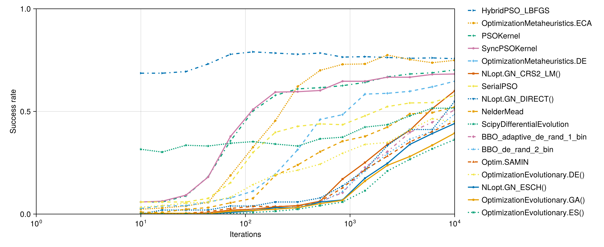
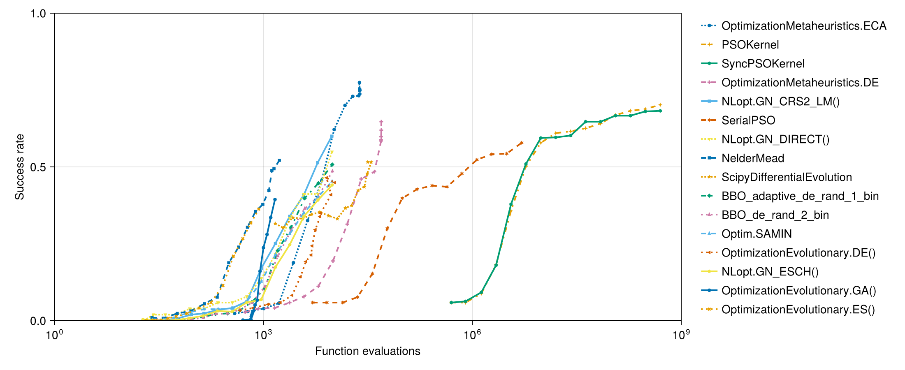
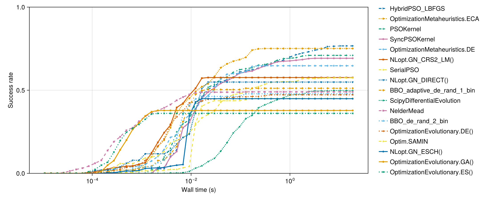
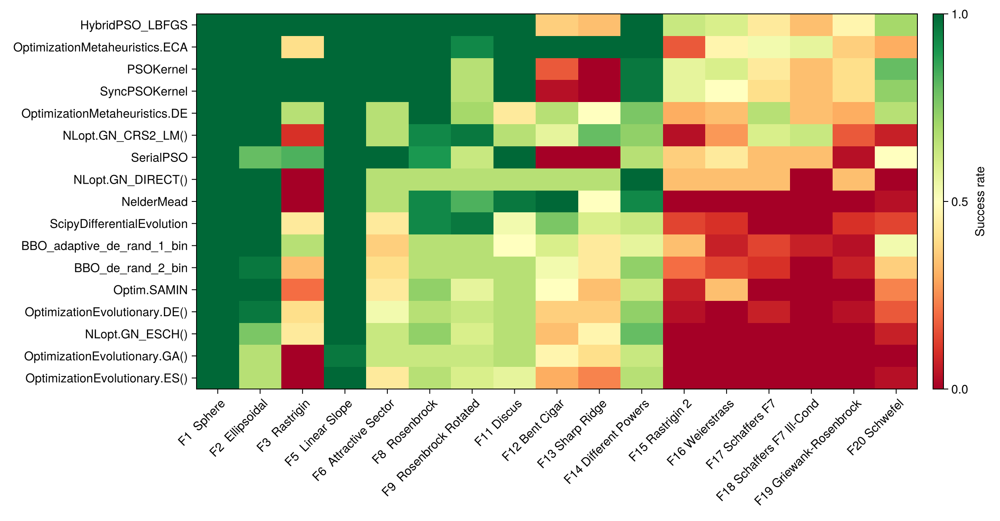
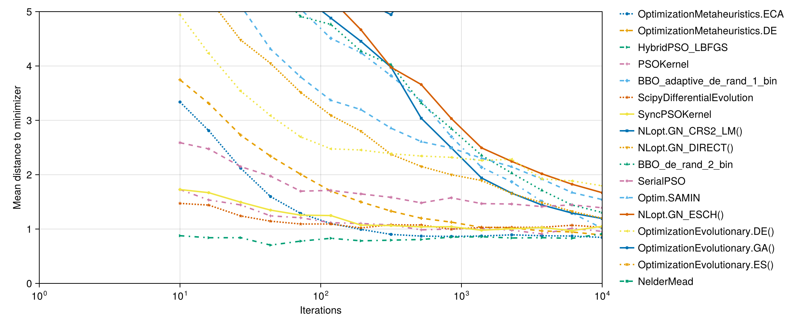
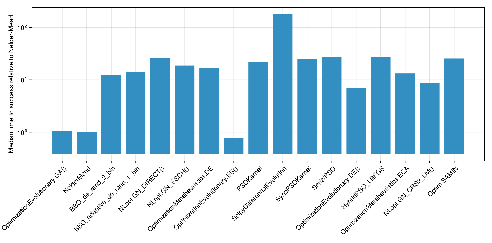

This benchmark compares the PSO variants from
[ParallelParticleSwarms.jl](https://github.com/SciML/ParallelParticleSwarms.jl) against
established global optimizers on the
[BlackBoxOptimizationBenchmarking.jl](https://github.com/jonathanBieler/BlackBoxOptimizationBenchmarking.jl)
(BBOB) suite through the [Optimization.jl](https://github.com/SciML/Optimization.jl) interface.
It uses the reference
[Black-Box Global Optimizer Benchmarks](https://docs.sciml.ai/SciMLBenchmarksOutput/stable/Optimization/GlobalOptimization/)
protocol and its first-hit wall-clock measurement. Differences: three BBOB functions that
crash the GPU kernels are excluded, and this is a reduced configuration: 10 trials and
15 budgets from 10 to 10,000, versus the reference's 40 trials and 30 budgets to 100,000.

## How it works

Every BBOB function has a known minimum `f_opt`. A run **succeeds** if it finds a point with
objective below `f_opt + 1e-6`. Two experiments are run:

1. **Budget experiment.** Each optimizer is run from scratch at 15 iteration budgets (10 to
   10,000), 10 times per budget, on every function. Each run records success, distance to the
   true minimizer, and number of objective evaluations. This feeds the iteration, evaluations,
   heatmap and distance plots. Success rates are pooled over dimensions 3, 5 and 10.
2. **Time-to-success experiment.** Each optimizer gets one run per (function, trial) with a
   10,000-iteration budget, and we record the wall-clock time at which it *first* reached the
   target. From those times we build a CDF: for a time budget T, what fraction of runs were
   solved within T seconds. This feeds the wall-clock plot and the relative-runtime bar chart.

Everything is evaluated in `Float64`: BBOB's `f_opt` is of order 100 and `eps(100f0) ≈ 8e-6`
is larger than the `1e-6` target, so a `Float32` objective could never register success.
Results are pooled over dimensions 3, 5 and 10.

## Setup

```julia
using Random; Random.seed!(42)
using BlackBoxOptimizationBenchmarking, CairoMakie, Optimization, Memoize, Statistics
using StaticArrays, LinearAlgebra, ForwardDiff, KernelAbstractions, CUDA
using OptimizationBBO, OptimizationOptimJL, OptimizationEvolutionary, OptimizationNLopt
using OptimizationMetaheuristics, OptimizationSciPy
using OptimizationOptimJL: Optim          # NelderMead and SAMIN live here
using ParallelParticleSwarms
CairoMakie.activate!()

import BlackBoxOptimizationBenchmarking: Chain, BenchmarkSetup, BenchmarkResults,
    BBOBFunction, FunctionCallsCounter, solve_problem, pinit, compute_CI
const BBOB = BlackBoxOptimizationBenchmarking
const SciMLBase = Optimization.SciMLBase

const PSOKernel = ParallelParticleSwarms.ParallelPSOKernel
const SyncPSOKernel = ParallelParticleSwarms.ParallelSyncPSOKernel
const SerialPSO = ParallelParticleSwarms.SerialPSO
const HybridPSO = ParallelParticleSwarms.HybridPSO
const BACKEND = CUDABackend()

const DIMENSIONS = (3, 5, 10)
const NTRIALS = 10
const Δf = 1.0e-6
const NUM_PARTICLES = 50_000    # GPU swarm
const SERIAL_PARTICLES = 512       # CPU swarm
const RUN_LENGTH = round.(Int, 10 .^ LinRange(1, 4, 15))   # budget experiment
const MAX_TTS_ITERS = 10_000    # time-to-success experiment
const TTS_CHUNK = 20        # GPU: read back the best cost every this many iterations
# f4, f7, f10 crash the GPU kernels and are excluded.
suite(D) = filter(f -> nameof(f.f) ∉ (:f4, :f7, :f10), BBOB.bbob_suite(Val(D)))
const SUITES = (suite(3), suite(5), suite(10))
const TEST_FUNCTIONS = first(SUITES)   # names/order for the heatmap; rates pool all three D
```

```
17-element Vector{BlackBoxOptimizationBenchmarking.BBOBFunction}:
 F1  Sphere
 F2  Ellipsoidal
 F3  Rastrigin
 F5  Linear Slope
 F6  Attractive Sector
 F8  Rosenbrock
 F9  Rosenbrock Rotated
 F11 Discus
 F12 Bent Cigar
 F13 Sharp Ridge
 F14 Different Powers
 F15 Rastrigin 2
 F16 Weierstrass
 F17 Schaffers F7
 F18 Schaffers F7 Ill-Cond
 F19 Griewank-Rosenbrock
 F20 Schwefel
```


## Optimizers

Baselines are chained: 90% of the budget to the global method, 10% to a Nelder-Mead polish.
`setup` maps each label to a constructor, and every run (warm-ups included) builds a fresh
optimizer: Metaheuristics' `DE` and `ECA` keep their population between solves, so a reused
instance carries a 3-dimensional population into the 5- and 10-dimensional problems.

```julia
chain(t; isboxed = false) =
    Chain(BenchmarkSetup(t; isboxed), BenchmarkSetup(Optim.NelderMead(); isboxed = false), 0.9)

setup = Dict(
    "NelderMead" => () -> BenchmarkSetup(Optim.NelderMead()),
    "NLopt.GN_CRS2_LM()" => () -> chain(NLopt.GN_CRS2_LM(), isboxed = true),
    "NLopt.GN_DIRECT()" => () -> chain(NLopt.GN_DIRECT(), isboxed = true),
    "NLopt.GN_ESCH()" => () -> chain(NLopt.GN_ESCH(), isboxed = true),
    "OptimizationEvolutionary.GA()" => () -> chain(OptimizationEvolutionary.GA(), isboxed = true),
    "OptimizationEvolutionary.DE()" => () -> chain(OptimizationEvolutionary.DE(), isboxed = true),
    "OptimizationEvolutionary.ES()" => () -> chain(OptimizationEvolutionary.ES(), isboxed = true),
    "Optim.SAMIN" => () -> chain(Optim.SAMIN(verbosity = 0), isboxed = true),
    "BBO_adaptive_de_rand_1_bin" => () -> chain(BBO_adaptive_de_rand_1_bin(), isboxed = true),
    "BBO_de_rand_2_bin" => () -> chain(BBO_de_rand_2_bin(), isboxed = true),
    "OptimizationMetaheuristics.ECA" => () -> chain(OptimizationMetaheuristics.ECA(), isboxed = true),
    "OptimizationMetaheuristics.DE" => () -> chain(OptimizationMetaheuristics.DE(), isboxed = true),
    "ScipyDifferentialEvolution" => () -> chain(ScipyDifferentialEvolution(), isboxed = true),
    "SerialPSO" => () -> SerialPSO(SERIAL_PARTICLES),
    "PSOKernel" => () -> PSOKernel(NUM_PARTICLES; backend = BACKEND, global_update = true),
    "SyncPSOKernel" => () -> SyncPSOKernel(NUM_PARTICLES; backend = BACKEND),
    "HybridPSO_LBFGS" => () -> HybridPSO(pso = SyncPSOKernel(NUM_PARTICLES; backend = BACKEND); backend = BACKEND),
)

const LABELS = collect(keys(setup))
const PSO_KEYS = Set(["SerialPSO", "PSOKernel", "SyncPSOKernel", "HybridPSO_LBFGS"])
particles_of(algo) = algo == "SerialPSO" ? SERIAL_PARTICLES : NUM_PARTICLES
```

```
particles_of (generic function with 1 method)
```


## PSO plumbing

PSO needs `SVector` inputs and a penalty for points outside the box. The penalty must also
accept ForwardDiff `Dual`s, which `HybridPSO`'s L-BFGS phase uses.

```julia
_value(x::Real) = x
_value(x::ForwardDiff.Dual) = ForwardDiff.value(x)
_to_f64(x) = Float64(_value(x))

function pso_objective(f::BBOBFunction, x)
    any(xi -> !isfinite(_value(xi)) || abs(_value(xi)) > 15, x) && return zero(first(x)) + 1.0e10
    return f(x)
end

# `obj` is any x -> objective callable. u0 only fixes type and dimension; the swarm is
# sampled from the box.
function pso_problem(obj, ::Val{D}) where {D}
    optf = OptimizationFunction{false}((x, p) -> obj(x), SciMLBase.NoAD())
    lb = SVector{D, Float64}(ntuple(_ -> -5.5, Val(D)))     # same box as the baselines
    ub = SVector{D, Float64}(ntuple(_ -> 5.5, Val(D)))
    return OptimizationProblem{false}(optf, SVector{D, Float64}(pinit(D)), nothing; lb, ub)
end
pso_problem(obj, f::BBOBFunction{F, N}) where {F, N} = pso_problem(obj, Val(N))

pso_solve(opt, prob, budget) = opt isa HybridPSO ?
    solve(prob, opt; maxiters = budget, local_maxiters = 50, abstol = 1.0e-8, reltol = 1.0e-8) :
    solve(prob, opt; maxiters = budget)
```

```
pso_solve (generic function with 1 method)
```


## Experiment 1: success rate vs. budget

`run_one(algo, f, budget)` returns `(objective, minimizer, evaluations)`. One loop over
(dimension, function, budget, trial); success, distance and evaluations are then averaged
across dimensions 3, 5 and 10.

```julia
function run_one(algo, f::BBOBFunction, budget::Int)
    if algo in PSO_KEYS
        sol = pso_solve(setup[algo](), pso_problem(x -> pso_objective(f, x), f), budget)
        u = sol.u isa AbstractVector ? sol.u : sol.u[]
        return _to_f64(sol.objective), u, budget * particles_of(algo)
    else
        counted = FunctionCallsCounter(f)
        sol = solve_problem(setup[algo](), counted, length(f.x_opt), budget)
        return sol.objective, sol.u, counted.count
    end
end

function benchmark(algo)
    Nf = length(TEST_FUNCTIONS)
    Nd = length(SUITES)
    success = zeros(Nf, length(RUN_LENGTH)); dist = zeros(Nf, length(RUN_LENGTH))
    calls = zeros(Nf, length(RUN_LENGTH))
    for funcs in SUITES, (fi, f) in enumerate(funcs)
        run_one(algo, f, 10)                               # warm-up per (function, D): compile, discard
        for (ri, rl) in enumerate(RUN_LENGTH), _ in 1:NTRIALS
            fval, u, n = run_one(algo, f, rl)
            success[fi, ri] += fval < f.f_opt + Δf
            dist[fi, ri] += norm(u .- f.x_opt)
            calls[fi, ri] += n
        end
    end
    success ./= NTRIALS * Nd
    dist ./= NTRIALS * Nd
    calls ./= NTRIALS * Nd
    sr = vec(mean(success, dims = 1))
    Neff = NTRIALS * Nf * Nd
    qlow, qhigh = compute_CI(sr, Neff, 0.25)
    return BenchmarkResults(;
        run_length = collect(RUN_LENGTH),
        success_count = round.(Int, sr .* Neff),
        success_rate = sr,
        success_rate_qlow = qlow,
        success_rate_qhigh = qhigh,
        distance_to_minimizer = vec(mean(dist, dims = 1)),
        minimum = fill(NaN, length(RUN_LENGTH)),
        runtime = 0.0,
        Neffective = Neff,
        callcount = vec(mean(calls, dims = 1)),
        success_rate_per_function = success[:, end],
    )
end

@memoize run_bench(algo) = benchmark(algo)

results = Dict{String, BenchmarkResults}()
for algo in LABELS
    algo in PSO_KEYS && (results[algo] = run_bench(algo))
end   # GPU first
for algo in LABELS
    algo in PSO_KEYS || (results[algo] = run_bench(algo))
end
[results[l] for l in LABELS]
```

```
17-element Vector{BlackBoxOptimizationBenchmarking.BenchmarkResults}:
 BenchmarkResults :
Run length : [10, 16, 27, 44, 72, 118, 193, 316, 518, 848, 1389, 2276, 3728
, 6105, 10000]
Success rate : [0.00196078, 0.00392157, 0.00392157, 0.00196078, 0.0137255, 
0.0176471, 0.0235294, 0.0313725, 0.0509804, 0.0666667, 0.160784, 0.237255, 
0.280392, 0.335294, 0.394118]
 BenchmarkResults :
Run length : [10, 16, 27, 44, 72, 118, 193, 316, 518, 848, 1389, 2276, 3728
, 6105, 10000]
Success rate : [0.00980392, 0.00784314, 0.0235294, 0.0313725, 0.054902, 0.0
764706, 0.188235, 0.239216, 0.303922, 0.354902, 0.378431, 0.423529, 0.48823
5, 0.494118, 0.521569]
 BenchmarkResults :
Run length : [10, 16, 27, 44, 72, 118, 193, 316, 518, 848, 1389, 2276, 3728
, 6105, 10000]
Success rate : [0.00196078, 0.00196078, 0.00196078, 0.00392157, 0.00980392,
 0.0215686, 0.0235294, 0.0352941, 0.0588235, 0.109804, 0.209804, 0.294118, 
0.364706, 0.403922, 0.486275]
 BenchmarkResults :
Run length : [10, 16, 27, 44, 72, 118, 193, 316, 518, 848, 1389, 2276, 3728
, 6105, 10000]
Success rate : [0.0, 0.0, 0.00196078, 0.00588235, 0.0117647, 0.0215686, 0.0
235294, 0.0333333, 0.0607843, 0.103922, 0.227451, 0.303922, 0.398039, 0.447
059, 0.507843]
 BenchmarkResults :
Run length : [10, 16, 27, 44, 72, 118, 193, 316, 518, 848, 1389, 2276, 3728
, 6105, 10000]
Success rate : [0.0, 0.0196078, 0.0196078, 0.0196078, 0.0392157, 0.0392157,
 0.0588235, 0.0588235, 0.0784314, 0.137255, 0.215686, 0.333333, 0.411765, 0
.411765, 0.54902]
 BenchmarkResults :
Run length : [10, 16, 27, 44, 72, 118, 193, 316, 518, 848, 1389, 2276, 3728
, 6105, 10000]
Success rate : [0.00392157, 0.00196078, 0.0, 0.00196078, 0.00784314, 0.0156
863, 0.0313725, 0.0294118, 0.0588235, 0.0686275, 0.17451, 0.247059, 0.33921
6, 0.392157, 0.441176]
 BenchmarkResults :
Run length : [10, 16, 27, 44, 72, 118, 193, 316, 518, 848, 1389, 2276, 3728
, 6105, 10000]
Success rate : [0.027451, 0.0392157, 0.0411765, 0.0588235, 0.0784314, 0.111
765, 0.194118, 0.313725, 0.460784, 0.484314, 0.584314, 0.588235, 0.598039, 
0.619608, 0.647059]
 BenchmarkResults :
Run length : [10, 16, 27, 44, 72, 118, 193, 316, 518, 848, 1389, 2276, 3728
, 6105, 10000]
Success rate : [0.0, 0.0, 0.0, 0.0, 0.00196078, 0.00784314, 0.0137255, 0.02
35294, 0.0411765, 0.0588235, 0.113725, 0.209804, 0.266667, 0.317647, 0.3627
45]
 BenchmarkResults :
Run length : [10, 16, 27, 44, 72, 118, 193, 316, 518, 848, 1389, 2276, 3728
, 6105, 10000]
Success rate : [0.0588235, 0.0588235, 0.0882353, 0.182353, 0.356863, 0.5019
61, 0.578431, 0.609804, 0.615686, 0.62549, 0.641176, 0.668627, 0.682353, 0.
688235, 0.701961]
 BenchmarkResults :
Run length : [10, 16, 27, 44, 72, 118, 193, 316, 518, 848, 1389, 2276, 3728
, 6105, 10000]
Success rate : [0.315686, 0.301961, 0.335294, 0.331373, 0.345098, 0.352941,
 0.341176, 0.331373, 0.366667, 0.37451, 0.423529, 0.435294, 0.478431, 0.515
686, 0.515686]
 BenchmarkResults :
Run length : [10, 16, 27, 44, 72, 118, 193, 316, 518, 848, 1389, 2276, 3728
, 6105, 10000]
Success rate : [0.0588235, 0.0627451, 0.0921569, 0.180392, 0.378431, 0.5098
04, 0.594118, 0.596078, 0.601961, 0.647059, 0.647059, 0.666667, 0.666667, 0
.680392, 0.682353]
 BenchmarkResults :
Run length : [10, 16, 27, 44, 72, 118, 193, 316, 518, 848, 1389, 2276, 3728
, 6105, 10000]
Success rate : [0.0588235, 0.0588235, 0.0588235, 0.0764706, 0.152941, 0.3, 
0.398039, 0.427451, 0.439216, 0.435294, 0.478431, 0.523529, 0.541176, 0.543
137, 0.578431]
 BenchmarkResults :
Run length : [10, 16, 27, 44, 72, 118, 193, 316, 518, 848, 1389, 2276, 3728
, 6105, 10000]
Success rate : [0.0333333, 0.0411765, 0.0529412, 0.0588235, 0.0823529, 0.14
3137, 0.192157, 0.213725, 0.243137, 0.296078, 0.339216, 0.34902, 0.409804, 
0.464706, 0.44902]
 BenchmarkResults :
Run length : [10, 16, 27, 44, 72, 118, 193, 316, 518, 848, 1389, 2276, 3728
, 6105, 10000]
Success rate : [0.686275, 0.686275, 0.694118, 0.731373, 0.778431, 0.790196,
 0.784314, 0.778431, 0.784314, 0.764706, 0.766667, 0.762745, 0.758824, 0.76
0784, 0.756863]
 BenchmarkResults :
Run length : [10, 16, 27, 44, 72, 118, 193, 316, 518, 848, 1389, 2276, 3728
, 6105, 10000]
Success rate : [0.0235294, 0.0294118, 0.0392157, 0.0568627, 0.188235, 0.325
49, 0.454902, 0.621569, 0.7, 0.729412, 0.731373, 0.77451, 0.752941, 0.73725
5, 0.74902]
 BenchmarkResults :
Run length : [10, 16, 27, 44, 72, 118, 193, 316, 518, 848, 1389, 2276, 3728
, 6105, 10000]
Success rate : [0.0, 0.00196078, 0.00196078, 0.00588235, 0.0196078, 0.02352
94, 0.0352941, 0.0411765, 0.0627451, 0.170588, 0.25098, 0.339216, 0.407843,
 0.513725, 0.6]
 BenchmarkResults :
Run length : [10, 16, 27, 44, 72, 118, 193, 316, 518, 848, 1389, 2276, 3728
, 6105, 10000]
Success rate : [0.0, 0.0, 0.00392157, 0.0117647, 0.027451, 0.0372549, 0.037
2549, 0.0392157, 0.0627451, 0.127451, 0.215686, 0.282353, 0.35098, 0.401961
, 0.452941]
```


## Experiment 2: wall-clock time to success

One run per (dimension, function, trial) at `MAX_TTS_ITERS`; record the time of the *first* hit.
The CDF pools dimensions 3, 5 and 10.

- **CPU optimizers** (baselines, `SerialPSO`): the objective is wrapped in a closure that
  stamps the clock on the first evaluation below the target. This is the reference's method.
- **GPU optimizers**: a kernel cannot call `time()`, so the swarm is advanced in chunks of
  `TTS_CHUNK` iterations and the best cost is read back on the host in between. The swarm
  lives in the solver cache, so this is one continuous run with a time resolution of one
  chunk. For `HybridPSO` the PSO phase is chunked the same way; if it never hits, the L-BFGS
  phase runs from the final swarm and its finish time is used.

The clock starts before the optimizer's own setup in every case, and one untimed warm-up run
per (optimizer, function, dimension) keeps compilation out of the numbers, since the kernels
specialize on the objective and on `D`.

```julia
# Wrap an objective so the first evaluation below `target` records the elapsed time.
function tracked(obj, target, t0)
    hit = Ref(Inf)
    g(x) = (v = obj(x); v < target && hit[] == Inf && (hit[] = time() - t0); v)
    return g, hit
end

# Advance a PSO cache in chunks; return the time of the first chunk whose best cost is
# below `target`, or Inf. (solve! resets the inertia weight each call; harmless with the
# default wdamp = 1.)
function chunked!(cache, target, t0)
    for _ in 1:cld(MAX_TTS_ITERS, TTS_CHUNK)
        sol = SciMLBase.solve!(cache; maxiters = TTS_CHUNK)
        if cache.alg isa SyncPSOKernel                       # sync kernel does not store gbest back
            obj = _to_f64(sol.objective)
            cache.gbest = ParallelParticleSwarms.SPSOGBest(sol.u, obj)
        end
        _to_f64(sol.objective) < target && return time() - t0
    end
    return Inf
end

function time_to_success_one(algo, f::BBOBFunction)
    opt, target = setup[algo](), f.f_opt + Δf
    t0 = time()
    if !(algo in PSO_KEYS)
        g, hit = tracked(f, target, t0)
        solve_problem(opt, g, length(f.x_opt), MAX_TTS_ITERS)
        return hit[]
    elseif opt isa SerialPSO
        g, hit = tracked(x -> pso_objective(f, x), target, t0)
        pso_solve(opt, pso_problem(g, f), MAX_TTS_ITERS)
        return hit[]
    elseif opt isa HybridPSO
        cache = SciMLBase.init(pso_problem(x -> pso_objective(f, x), f), opt)
        t = chunked!(cache.pso_cache, target, t0)             # PSO phase
        isfinite(t) && return t
        sol = SciMLBase.solve!(cache; maxiters = 0, local_maxiters = 50, abstol = 1.0e-8, reltol = 1.0e-8)
        return _to_f64(sol.objective) < target ? time() - t0 : Inf   # L-BFGS phase only
    else
        cache = SciMLBase.init(pso_problem(x -> pso_objective(f, x), f), opt)
        return chunked!(cache, target, t0)
    end
end

function time_to_success(algo)
    times = Float64[]
    for funcs in SUITES, f in funcs
        time_to_success_one(algo, f)                       # warm-up per (function, D): compile, discard
        for _ in 1:NTRIALS
            push!(times, time_to_success_one(algo, f))
        end
    end
    return times
end

@memoize run_tts(algo) = time_to_success(algo)

tts = Dict{String, Vector{Float64}}()
for algo in LABELS
    algo in PSO_KEYS && (tts[algo] = run_tts(algo))
end
for algo in LABELS
    algo in PSO_KEYS || (tts[algo] = run_tts(algo))
end
```


```julia
using Printf
for l in sort(collect(keys(results)))
    v = filter(isfinite, tts[l])
    @printf "%-28s final success = %.3f   solved = %3d/%d   median TTS = %s\n" l results[l].success_rate[end] length(v) length(tts[l]) (isempty(v) ? "never" : @sprintf("%.3f s", median(v)))
end
```

```
BBO_adaptive_de_rand_1_bin   final success = 0.508   solved = 261/510   med
ian TTS = 0.006 s
BBO_de_rand_2_bin            final success = 0.486   solved = 244/510   med
ian TTS = 0.005 s
HybridPSO_LBFGS              final success = 0.757   solved = 391/510   med
ian TTS = 0.012 s
NLopt.GN_CRS2_LM()           final success = 0.600   solved = 294/510   med
ian TTS = 0.004 s
NLopt.GN_DIRECT()            final success = 0.549   solved = 280/510   med
ian TTS = 0.012 s
NLopt.GN_ESCH()              final success = 0.441   solved = 229/510   med
ian TTS = 0.008 s
NelderMead                   final success = 0.522   solved = 250/510   med
ian TTS = 0.000 s
Optim.SAMIN                  final success = 0.453   solved = 230/510   med
ian TTS = 0.011 s
OptimizationEvolutionary.DE() final success = 0.449   solved = 241/510   me
dian TTS = 0.003 s
OptimizationEvolutionary.ES() final success = 0.363   solved = 184/510   me
dian TTS = 0.000 s
OptimizationEvolutionary.GA() final success = 0.394   solved = 193/510   me
dian TTS = 0.000 s
OptimizationMetaheuristics.DE final success = 0.647   solved = 330/510   me
dian TTS = 0.007 s
OptimizationMetaheuristics.ECA final success = 0.749   solved = 383/510   m
edian TTS = 0.006 s
PSOKernel                    final success = 0.702   solved = 362/510   med
ian TTS = 0.010 s
ScipyDifferentialEvolution   final success = 0.516   solved = 254/510   med
ian TTS = 0.078 s
SerialPSO                    final success = 0.578   solved = 293/510   med
ian TTS = 0.012 s
SyncPSOKernel                final success = 0.682   solved = 353/510   med
ian TTS = 0.011 s
```


## Plots

```julia
const MARKERS = [
    :circle, :rect, :utriangle, :diamond, :dtriangle, :pentagon, :cross,
    :xcross, :star4, :star5, :hexagon, :star6, :ltriangle, :rtriangle,
]
const LINESTYLES = [:solid, :dash, :dot, :dashdot, (:dot, :dense)]
const STYLE = Dict(l => (MARKERS[mod1(i, end)], LINESTYLES[mod1(i, end)]) for (i, l) in enumerate(LABELS))

# xs, ys: Dict label => vector. Legend ordered by each curve's final y value.
function plot_curves(xs, ys; xlabel, ylabel, xlims = (nothing, nothing), ylims = (0, 1), best_is_high = true)
    order = sort(collect(keys(ys)); by = l -> ys[l][end], rev = best_is_high)
    fig = Figure(size = (1100, 450))
    ax = Axis(fig[1, 1]; xscale = log10, xlabel, ylabel, limits = (xlims..., ylims...))
    for l in order
        marker, linestyle = STYLE[l]
        scatterlines!(ax, xs[l], ys[l]; label = l, marker, linestyle, linewidth = 2, markersize = 6)
    end
    Legend(fig[1, 2], ax; framevisible = false)
    return fig
end
```

```
plot_curves (generic function with 1 method)
```


### Success rate vs. iterations

Higher and further left is better. One PSO iteration moves every particle (50,000 evaluations
on the GPU); one Nelder-Mead step is a few evaluations, so this view favours parallel methods.

```julia
plot_curves(
    Dict(l => Float64.(RUN_LENGTH) for l in LABELS),
    Dict(l => results[l].success_rate for l in LABELS);
    xlabel = "Iterations", ylabel = "Success rate", xlims = (1, maximum(RUN_LENGTH))
)
```




### Success rate vs. function evaluations

Same y-axis, x is the number of objective calls: the fair measure of work done.
`HybridPSO_LBFGS` is omitted here because its L-BFGS phase runs on the GPU, where its
evaluations cannot be counted; its swarm-only count would understate the work.

```julia
evals_labels = filter(!=("HybridPSO_LBFGS"), LABELS)
plot_curves(
    Dict(l => results[l].callcount for l in evals_labels),
    Dict(l => results[l].success_rate for l in evals_labels);
    xlabel = "Function evaluations", ylabel = "Success rate", xlims = (1, 1.0e9)
)
```




### Success rate vs. wall-clock time

For a time budget T (x), the fraction of (function, trial) runs that had already reached the
target by T seconds (y). A curve that plateaus below 1 never solved the remaining problems
within `MAX_TTS_ITERS`. This is where the GPU gets credit for cheap evaluations.

```julia
finite = filter(isfinite, reduce(vcat, values(tts); init = Float64[]))
isempty(finite) && (finite = [1.0e-3, 1.0e3])          # nothing succeeded; keep the plot alive
thresholds = 10 .^ range(log10(minimum(finite) / 2), log10(maximum(finite) * 2), length = 50)
cdf(times) = [count(<=(T), times) / length(times) for T in thresholds]

plot_curves(
    Dict(l => thresholds for l in LABELS),
    Dict(l => cdf(tts[l]) for l in LABELS);
    xlabel = "Wall time (s)", ylabel = "Success rate"
)
```




### Success rate per function

One row per optimizer (worst at the bottom), one column per function, at the largest budget,
pooled over dimensions 3, 5 and 10.

```julia
M = reduce(hcat, results[l].success_rate_per_function for l in LABELS)  # functions × optimizers
order = sortperm(vec(mean(M, dims = 1)))
fig = Figure(size = (1150, 600))
ax = Axis(
    fig[1, 1]; xticks = (1:length(TEST_FUNCTIONS), string.(TEST_FUNCTIONS)),
    yticks = (1:length(LABELS), LABELS[order]), xticklabelrotation = π / 4
)
hm = heatmap!(ax, M[:, order]; colormap = :RdYlGn, colorrange = (0, 1))
Colorbar(fig[1, 2], hm; label = "Success rate")
fig
```




### Distance to minimizer vs. iterations

Lower is better. Shows "close but not converged" cases that the pass/fail plots hide.

```julia
plot_curves(
    Dict(l => Float64.(RUN_LENGTH) for l in LABELS),
    Dict(l => results[l].distance_to_minimizer for l in LABELS);
    xlabel = "Iterations", ylabel = "Mean distance to minimizer",
    xlims = (1, maximum(RUN_LENGTH)), ylims = (0, 5), best_is_high = false
)
```




### Relative runtime

Median time to success, relative to Nelder-Mead, log scale. Uses only successful runs, so it
reads as "when this optimizer solves a problem, how long does it take"; read it together
with the wall-clock plot, which shows how often it solves one at all.

```julia
med(l) = (v = filter(isfinite, tts[l]); isempty(v) ? NaN : median(v))
rt = [med(l) for l in LABELS]
rt ./= med("NelderMead")
fig = Figure(size = (1050, 520))
ax = Axis(
    fig[1, 1]; yscale = log10, ylabel = "Median time to success relative to Nelder-Mead",
    xticks = (1:length(LABELS), LABELS), xticklabelrotation = π / 4
)
barplot!(ax, 1:length(LABELS), rt)
fig
```




## Appendix

These benchmarks are a part of the SciMLBenchmarks.jl repository, found at: [https://github.com/SciML/SciMLBenchmarks.jl](https://github.com/SciML/SciMLBenchmarks.jl). For more information on high-performance scientific machine learning, check out the SciML Open Source Software Organization [https://sciml.ai](https://sciml.ai).

To locally run this benchmark, do the following commands:
```
using SciMLBenchmarks
SciMLBenchmarks.weave_file("benchmarks/PSOGlobalOptimization","pso_global_optimizers.jmd")
```

Computer Information:

```
Julia Version 1.12.7
Commit 6d172b025e4 (2026-08-15 08:05 UTC)
Build Info:
  Official https://julialang.org release
Platform Info:
  OS: Linux (x86_64-linux-gnu)
  CPU: 128 × AMD EPYC 9354 32-Core Processor
  WORD_SIZE: 64
  LLVM: libLLVM-18.1.7 (ORCJIT, znver4)
  GC: Built with stock GC
Threads: 58 default, 1 interactive, 58 GC (on 58 virtual cores)
Environment:
  JULIA_CPU_THREADS = 58
  JULIA_NUM_PRECOMPILE_TASKS = 58
  JULIA_NUM_THREADS = auto
  JULIA_PYTHONCALL_EXE = /home/runner/_work/SciMLBenchmarks.jl/SciMLBenchmarks.jl/benchmarks/PSOGlobalOptimization/.CondaPkg/.pixi/envs/default/bin/python

```

Package Information:

```
Status `~/_work/SciMLBenchmarks.jl/SciMLBenchmarks.jl/benchmarks/PSOGlobalOptimization/Project.toml`
  [4552ee2b] BlackBoxOptimizationBenchmarking v2.1.0
⌅ [052768ef] CUDA v5.11.3
⌃ [13f3f980] CairoMakie v0.15.13
⌃ [f6369f11] ForwardDiff v1.4.5
  [63c18a36] KernelAbstractions v0.9.42
  [c03570c3] Memoize v0.4.4
⌃ [7f7a1694] Optimization v5.7.1
⌃ [3e6eede4] OptimizationBBO v0.4.11
⌃ [cb963754] OptimizationEvolutionary v0.4.13
⌃ [3aafef2f] OptimizationMetaheuristics v0.3.11
⌃ [4e6fcdb7] OptimizationNLopt v0.3.16
⌃ [36348300] OptimizationOptimJL v0.4.19
⌃ [cce07bd8] OptimizationSciPy v0.4.10
⌃ [ab63da0c] ParallelParticleSwarms v1.6.0
  [31c91b34] SciMLBenchmarks v0.2.1 [loaded: `/home/runner/_work/SciMLBenchmarks.jl/SciMLBenchmarks.jl/src/SciMLBenchmarks.jl` (v0.2.1) expected `/home/runner/.julia/packages/SciMLBenchmarks/ceJyd/src/SciMLBenchmarks.jl` (v0.2.1)]
⌃ [90137ffa] StaticArrays v1.9.19
  [44d3d7a6] Weave v0.10.12
Info Packages marked with ⌃ and ⌅ have new versions available. Those with ⌃ may be upgradable, but those with ⌅ are restricted by compatibility constraints from upgrading. To see why use `status --outdated`
```

And the full manifest:

```
Status `~/_work/SciMLBenchmarks.jl/SciMLBenchmarks.jl/benchmarks/PSOGlobalOptimization/Manifest.toml`
  [47edcb42] ADTypes v1.24.0
⌃ [14f7f29c] AMD v0.5.3
  [621f4979] AbstractFFTs v1.5.0
  [1520ce14] AbstractTrees v0.4.5
  [7d9f7c33] Accessors v0.1.45
⌃ [79e6a3ab] Adapt v4.7.0
  [35492f91] AdaptivePredicates v1.2.0
  [66dad0bd] AliasTables v1.1.3
  [27a7e980] Animations v0.4.2
⌃ [4fba245c] ArrayInterface v7.30.0
⌃ [a9b6321e] Atomix v1.1.3
  [67c07d97] Automa v1.2.0
  [13072b0f] AxisAlgorithms v1.1.0
  [39de3d68] AxisArrays v0.4.8
⌃ [ab4f0b2a] BFloat16s v0.6.1
  [18cc8868] BaseDirs v1.4.0
  [a134a8b2] BlackBoxOptim v0.6.12
  [4552ee2b] BlackBoxOptimizationBenchmarking v2.1.0
⌃ [70df07ce] BracketingNonlinearSolve v1.12.5
  [fa961155] CEnum v0.5.0
  [96374032] CRlibm v1.0.2
⌅ [052768ef] CUDA v5.11.3
⌃ [1af6417a] CUDA_Runtime_Discovery v2.1.0
  [159f3aea] Cairo v1.1.1
⌃ [13f3f980] CairoMakie v0.15.13
  [d360d2e6] ChainRulesCore v1.26.1
  [6b39b394] CodecZstd v0.8.7
  [a2cac450] ColorBrewer v0.4.2
  [35d6a980] ColorSchemes v3.31.0
⌃ [3da002f7] ColorTypes v0.12.1
  [c3611d14] ColorVectorSpace v0.11.0
⌃ [5ae59095] Colors v0.13.1
  [861a8166] Combinatorics v1.1.0
  [38540f10] CommonSolve v0.2.14
  [bbf7d656] CommonSubexpressions v0.3.1
  [34da2185] Compat v4.18.1
  [a33af91c] CompositionsBase v0.1.2
  [95dc2771] ComputePipeline v0.1.8
  [2569d6c7] ConcreteStructs v0.2.8
⌃ [992eb4ea] CondaPkg v0.2.33
  [88cd18e8] ConsoleProgressMonitor v0.1.2
  [187b0558] ConstructionBase v1.6.0
  [d38c429a] Contour v0.6.3
  [b7a15901] CoreMath v0.1.0
  [a8cc5b0e] Crayons v4.2.0
  [9a962f9c] DataAPI v1.16.0
  [864edb3b] DataStructures v0.19.6
  [e2d170a0] DataValueInterfaces v1.0.0
⌃ [927a84f5] DelaunayTriangulation v1.6.6
  [8bb1440f] DelimitedFiles v1.9.1
⌃ [2b5f629d] DiffEqBase v7.18.2
⌃ [071ae1c0] DiffEqGPU v3.18.0
  [163ba53b] DiffResults v1.1.0
  [b552c78f] DiffRules v1.16.0
  [a0c0ee7d] DifferentiationInterface v0.7.21
  [b4f34e82] Distances v0.10.12
  [31c24e10] Distributions v0.25.131
  [ffbed154] DocStringExtensions v0.9.5
  [4e289a0a] EnumX v1.0.7
⌃ [7da242da] Enzyme v0.13.199
  [f151be2c] EnzymeCore v0.8.21
⌅ [86b6b26d] Evolutionary v0.11.9
  [429591f6] ExactPredicates v2.2.9
  [e2ba6199] ExprTools v0.1.11
  [b86e33f2] FFTA v0.3.1
  [7034ab61] FastBroadcast v1.4.0
  [9aa1b823] FastClosures v0.3.2
  [a4df4552] FastPower v1.5.0
  [5789e2e9] FileIO v1.20.0
  [8fc22ac5] FilePaths v0.9.0
  [48062228] FilePathsBase v0.9.24
⌃ [1a297f60] FillArrays v1.17.0
⌃ [64ca27bc] FindFirstFunctions v3.2.1
  [6a86dc24] FiniteDiff v2.33.0
⌅ [53c48c17] FixedPointNumbers v0.8.6
  [1fa38f19] Format v1.3.7
⌃ [f6369f11] ForwardDiff v1.4.5
  [b38be410] FreeType v4.1.1
  [663a7486] FreeTypeAbstraction v0.10.8
  [069b7b12] FunctionWrappers v1.1.3
  [77dc65aa] FunctionWrappersWrappers v1.13.0
⌃ [0c68f7d7] GPUArrays v11.5.13
⌅ [46192b85] GPUArraysCore v0.2.0
⌅ [61eb1bfa] GPUCompiler v1.17.1
⌅ [096a3bc2] GPUToolbox v1.1.1
⌃ [a0844989] Gamma v1.1.0
⌃ [5c1252a2] GeometryBasics v0.5.11
  [a2bd30eb] Graphics v1.1.3
⌃ [3955a311] GridLayoutBase v0.11.2
  [076d061b] HashArrayMappedTries v0.2.0
⌅ [eafb193a] Highlights v0.5.3
  [34004b35] HypergeometricFunctions v0.3.30
  [2803e5a7] ImageAxes v0.6.12
  [c817782e] ImageBase v0.1.7
  [a09fc81d] ImageCore v0.10.5
⌃ [82e4d734] ImageIO v0.6.9
  [bc367c6b] ImageMetadata v0.9.10
  [9b13fd28] IndirectArrays v1.0.0
  [d25df0c9] Inflate v0.1.5
  [18e54dd8] IntegerMathUtils v0.1.4
  [a98d9a8b] Interpolations v0.16.3
⌃ [d1acc4aa] IntervalArithmetic v1.0.11
  [8197267c] IntervalSets v0.7.14
  [3587e190] InverseFunctions v0.1.17
  [92d709cd] IrrationalConstants v0.2.6
  [f1662d9f] Isoband v0.1.1
  [c8e1da08] IterTools v1.10.0
  [82899510] IteratorInterfaceExtensions v1.0.0
  [692b3bcd] JLLWrappers v1.8.0
⌅ [358108f5] JMcDM v0.7.24
⌅ [682c06a0] JSON v0.21.4
  [0f8b85d8] JSON3 v1.14.3
  [b835a17e] JpegTurbo v0.1.6
  [63c18a36] KernelAbstractions v0.9.42
  [5ab0869b] KernelDensity v0.6.12
⌃ [ba0b0d4f] Krylov v0.10.9
⌃ [2faa5264] LHLFactorization v2.2.0
⌃ [929cbde3] LLVM v9.13.0
  [8b046642] LLVMLoopInfo v1.0.0
  [b964fa9f] LaTeXStrings v1.4.1
⌅ [73f95e8e] LatticeRules v0.0.1
  [8cdb02fc] LazyModules v0.3.1
  [1d6d02ad] LeftChildRightSiblingTrees v0.3.0
⌃ [87fe0de2] LineSearch v0.1.16
⌃ [d3d80556] LineSearches v7.7.1
⌃ [7ed4a6bd] LinearSolve v5.13.0
⌃ [2ab3a3ac] LogExpFunctions v0.3.29
  [e6f89c97] LoggingExtras v1.2.0
  [1914dd2f] MacroTools v0.5.16
⌅ [ee78f7c6] Makie v0.24.13
  [dbb5928d] MappedArrays v0.4.3
  [0a4f8689] MathTeXEngine v0.6.9
  [bb5d69b7] MaybeInplace v0.1.8
  [c03570c3] Memoize v0.4.4
  [bcdb8e00] Metaheuristics v3.5.0
  [0b3b1443] MicroMamba v0.1.15
  [e1d29d7a] Missings v1.2.0
  [e94cdb99] MosaicViews v0.3.4
  [46d2c3a1] MuladdMacro v0.2.7
⌃ [ffc61752] Mustache v1.0.21 [loaded: v1.1.0]
  [d41bc354] NLSolversBase v8.0.1
  [76087f3c] NLopt v1.2.1
  [5da4648a] NVTX v1.0.3
  [77ba4419] NaNMath v1.1.4
  [f09324ee] Netpbm v1.1.1
⌃ [be0214bd] NonlinearSolveBase v2.47.0
  [d8793406] ObjectFile v0.5.1
  [510215fc] Observables v0.5.5
  [6fe1bfb0] OffsetArrays v1.17.0
  [52e1d378] OpenEXR v0.3.3
⌃ [429524aa] Optim v2.2.2
⌃ [7f7a1694] Optimization v5.7.1
⌃ [3e6eede4] OptimizationBBO v0.4.11
⌃ [bca83a33] OptimizationBase v5.4.0
⌃ [cb963754] OptimizationEvolutionary v0.4.13
⌃ [3aafef2f] OptimizationMetaheuristics v0.3.11
⌃ [4e6fcdb7] OptimizationNLopt v0.3.16
⌃ [36348300] OptimizationOptimJL v0.4.19
⌃ [cce07bd8] OptimizationSciPy v0.4.10
  [bac558e1] OrderedCollections v2.0.1
  [90014a1f] PDMats v0.11.41
  [f57f5aa1] PNGFiles v0.4.5
  [19eb6ba3] Packing v0.5.1
  [5432bcbf] PaddedViews v0.5.12
⌃ [ab63da0c] ParallelParticleSwarms v1.6.0
  [d96e819e] Parameters v0.13.1
⌅ [69de0a69] Parsers v2.8.7 [loaded: v2.8.8]
  [fa939f87] Pidfile v1.3.0
  [eebad327] PkgVersion v0.3.3
⌃ [995b91a9] PlotUtils v1.4.4
  [647866c9] PolygonOps v0.1.2
  [85a6dd25] PositiveFactorizations v0.2.4
⌃ [d236fae5] PreallocationTools v1.6.0
  [aea7be01] PrecompileTools v1.3.4
⌃ [21216c6a] Preferences v1.5.2 [loaded: v1.6.0]
  [08abe8d2] PrettyTables v3.4.8
  [27ebfcd6] Primes v0.5.7
  [33c8b6b6] ProgressLogging v0.1.6
  [92933f4c] ProgressMeter v1.11.0
  [43287f4e] PtrArrays v1.4.0
⌃ [0c0d3e7f] PureKLU v1.4.1
⌃ [6099a3de] PythonCall v0.9.35
  [4b34888f] QOI v1.0.2
  [1fd47b50] QuadGK v2.11.3
⌃ [8a4e6c94] QuasiMonteCarlo v0.4.1
  [74087812] Random123 v1.7.1
  [e6cf234a] RandomNumbers v1.6.0
  [b3c3ace0] RangeArrays v0.3.2
  [c84ed2f1] Ratios v0.4.5
  [3cdcf5f2] RecipesBase v1.3.4
⌃ [731186ca] RecursiveArrayTools v4.5.0
  [189a3867] Reexport v1.2.2
  [05181044] RelocatableFolders v1.0.1
  [ae029012] Requires v1.3.1
  [9fe22ead] RespecializeParams v1.3.0
  [79098fc4] Rmath v0.9.0
⌃ [f2b01f46] Roots v3.0.7
  [5eaf0fd0] RoundingEmulator v0.2.1
⌃ [7e49a35a] RuntimeGeneratedFunctions v0.5.25
  [fdea26ae] SIMD v3.7.2
⌃ [0bca4576] SciMLBase v3.49.2
  [31c91b34] SciMLBenchmarks v0.2.1 [loaded: `/home/runner/_work/SciMLBenchmarks.jl/SciMLBenchmarks.jl/src/SciMLBenchmarks.jl` (v0.2.1) expected `/home/runner/.julia/packages/SciMLBenchmarks/ceJyd/src/SciMLBenchmarks.jl` (v0.2.1)]
⌃ [19f34311] SciMLJacobianOperators v0.1.17
  [a6db7da4] SciMLLogging v2.1.0
⌃ [c0aeaf25] SciMLOperators v1.29.0
  [431bcebd] SciMLPublic v1.3.0
⌃ [53ae85a6] SciMLStructures v1.10.4
  [7e506255] ScopedValues v1.6.2
  [6c6a2e73] Scratch v1.3.0
  [eb7571c6] SearchSpaces v0.2.0
  [efcf1570] Setfield v1.1.2
⌃ [65257c39] ShaderAbstractions v0.5.0
  [73760f76] SignedDistanceFields v0.4.1
⌃ [05bca326] SimpleDiffEq v1.17.0
⌃ [727e6d20] SimpleNonlinearSolve v2.14.0
⌃ [510db2f7] SimpleOptimization v2.0.0
  [699a6c99] SimpleTraits v0.9.6
  [45858cf5] Sixel v0.1.5
  [66db9d55] SnoopPrecompile v1.0.3
  [ed01d8cd] Sobol v1.5.0
  [a2af1166] SortingAlgorithms v1.2.3
⌃ [a57abbd0] SparseColumnPivotedQR v2.1.7
⌃ [9f842d2f] SparseConnectivityTracer v1.2.2
⌃ [0a514795] SparseMatrixColorings v0.4.26
  [276daf66] SpecialFunctions v2.9.0
  [860ef19b] StableRNGs v1.0.4
  [cae243ae] StackViews v0.1.2
⌃ [90137ffa] StaticArrays v1.9.19
  [1e83bf80] StaticArraysCore v1.4.4
⌃ [10745b16] Statistics v1.11.1
  [82ae8749] StatsAPI v1.8.0
⌃ [2913bbd2] StatsBase v0.34.12
  [4c63d2b9] StatsFuns v2.2.1
  [69024149] StringEncodings v0.3.7
⌅ [892a3eda] StringManipulation v0.5.0
  [09ab397b] StructArrays v0.7.3
  [53d494c1] StructIO v0.3.1
  [856f2bd8] StructTypes v1.11.0
  [2efcf032] SymbolicIndexingInterface v0.3.55
  [3783bdb8] TableTraits v1.0.1
⌃ [bd369af6] Tables v1.13.0 [loaded: v1.14.0]
  [62fd8b95] TensorCore v0.1.1
  [5d786b92] TerminalLoggers v0.1.8
  [731e570b] TiffImages v0.11.9
⌃ [a759f4b9] TimerOutputs v1.2.0
  [e689c965] Tracy v0.1.6
  [3bb67fe8] TranscodingStreams v0.11.3
  [981d1d27] TriplotBase v0.1.0
  [781d530d] TruncatedStacktraces v1.4.0
  [3a884ed6] UnPack v1.0.2
  [1cfade01] UnicodeFun v0.4.1
⌃ [1986cc42] Unitful v1.28.0
  [013be700] UnsafeAtomics v0.3.2
  [e17b2a0c] UnsafePointers v1.0.0
  [44d3d7a6] Weave v0.10.12
  [e3aaa7dc] WebP v0.1.3
  [efce3f68] WoodburyMatrices v1.1.0
⌃ [ddb6d928] YAML v0.4.16 [loaded: v0.4.17]
  [700de1a5] ZygoteRules v0.2.8
  [6e34b625] Bzip2_jll v1.0.9+0
  [4e9b3aee] CRlibm_jll v1.0.1+0
⌅ [d1e2174e] CUDA_Compiler_jll v0.4.4+1
⌃ [4ee394cb] CUDA_Driver_jll v13.3.1+0
⌅ [76a88914] CUDA_Runtime_jll v0.21.0+1
  [83423d85] Cairo_jll v1.18.7+0
  [a38c48d9] CoreMath_jll v0.1.0+0
⌅ [5ae413db] EarCut_jll v2.2.4+0
⌅ [7cc45869] Enzyme_jll v0.0.290+0
⌃ [2e619515] Expat_jll v2.8.3+0
⌅ [b22a6f82] FFMPEG_jll v8.1.2+0
  [a3f928ae] Fontconfig_jll v2.17.1+0
  [d7e528f0] FreeType2_jll v2.14.3+1
  [559328eb] FriBidi_jll v1.0.17+0
⌅ [b0724c58] GettextRuntime_jll v0.22.4+0
⌅ [59f7168a] Giflib_jll v5.2.3+0
  [7746bdde] Glib_jll v2.88.3+0
  [3b182d85] Graphite2_jll v1.3.16+0
⌅ [2e76f6c2] HarfBuzz_jll v8.5.1+0
  [905a6f67] Imath_jll v3.2.2+0
  [1d5cc7b8] IntelOpenMP_jll v2025.2.0+0
  [aacddb02] JpegTurbo_jll v3.2.0+1
  [9c1d0b0a] JuliaNVTXCallbacks_jll v0.2.1+0
  [c1c5ebd0] LAME_jll v3.100.3+0
⌃ [88015f11] LERC_jll v4.1.0+0
⌅ [dad2f222] LLVMExtra_jll v0.0.46+0
⌃ [1d63c593] LLVMOpenMP_jll v22.1.7+0
  [ad6e5548] LibTracyClient_jll v0.13.1+0
⌅ [e9f186c6] Libffi_jll v3.4.7+0
  [7e76a0d4] Libglvnd_jll v1.7.1+1
  [94ce4f54] Libiconv_jll v1.18.0+0
  [4b2f31a3] Libmount_jll v2.42.0+0
  [89763e89] Libtiff_jll v4.7.3+0
  [38a345b3] Libuuid_jll v2.42.0+0
  [856f044c] MKL_jll v2025.2.0+0
  [079eb43e] NLopt_jll v2.11.0+0
  [e98f9f5b] NVTX_jll v3.2.2+0
  [e7412a2a] Ogg_jll v1.3.6+0
  [6cdc7f73] OpenBLASConsistentFPCSR_jll v0.3.34+0
⌃ [18a262bb] OpenEXR_jll v3.4.14+0
  [efe28fd5] OpenSpecFun_jll v0.5.6+0
  [91d4177d] Opus_jll v1.6.1+0
⌃ [36c8627f] Pango_jll v1.58.0+0
  [30392449] Pixman_jll v0.46.4+0
  [f50d1b31] Rmath_jll v0.5.2+0
⌃ [ffd25f8a] XZ_jll v5.8.3+0
  [4f6342f7] Xorg_libX11_jll v1.8.13+0
  [0c0b7dd1] Xorg_libXau_jll v1.0.13+0
  [a3789734] Xorg_libXdmcp_jll v1.1.6+0
  [1082639a] Xorg_libXext_jll v1.3.8+0
  [d091e8ba] Xorg_libXfixes_jll v6.0.2+0
  [ea2f1a96] Xorg_libXrender_jll v0.9.12+0
  [a65dc6b1] Xorg_libpciaccess_jll v0.19.0+0
  [c7cfdc94] Xorg_libxcb_jll v1.17.1+0
  [c5fb5394] Xorg_xtrans_jll v1.6.0+0
  [3161d3a3] Zstd_jll v1.5.7+1
  [1e29f10c] demumble_jll v1.3.0+0
  [9a68df92] isoband_jll v0.2.3+0
⌃ [a4ae2306] libaom_jll v3.14.1+0
⌃ [0ac62f75] libass_jll v0.17.4+0
  [8e53e030] libdrm_jll v2.4.134+0
  [f638f0a6] libfdk_aac_jll v2.0.4+0
  [b53b4c65] libpng_jll v1.6.58+0
  [075b6546] libsixel_jll v1.10.5+0
  [9a156e7d] libva_jll v2.23.0+0
  [f27f6e37] libvorbis_jll v1.3.8+0
⌃ [c5f90fcd] libwebp_jll v1.6.0+0
  [f8abcde7] micromamba_jll v2.3.1+0
  [1317d2d5] oneTBB_jll v2022.3.0+0
  [4d7b5844] pixi_jll v0.76.2+0
⌅ [1270edf5] x264_jll v10164.0.1+0
  [dfaa095f] x265_jll v4.1.0+0
  [0dad84c5] ArgTools v1.1.2
  [56f22d72] Artifacts v1.11.0
  [2a0f44e3] Base64 v1.11.0
  [8bf52ea8] CRC32c v1.11.0
  [ade2ca70] Dates v1.11.0
  [8ba89e20] Distributed v1.11.0
  [f43a241f] Downloads v1.7.0
  [7b1f6079] FileWatching v1.11.0
  [9fa8497b] Future v1.11.0
  [b77e0a4c] InteractiveUtils v1.11.0
  [ac6e5ff7] JuliaSyntaxHighlighting v1.12.0
  [4af54fe1] LazyArtifacts v1.11.0
  [b27032c2] LibCURL v0.6.4
  [76f85450] LibGit2 v1.11.0
  [8f399da3] Libdl v1.11.0
  [37e2e46d] LinearAlgebra v1.12.0
  [56ddb016] Logging v1.11.0
  [d6f4376e] Markdown v1.11.0
  [a63ad114] Mmap v1.11.0
  [ca575930] NetworkOptions v1.3.0
  [44cfe95a] Pkg v1.12.1
  [de0858da] Printf v1.11.0
  [3fa0cd96] REPL v1.11.0
  [9a3f8284] Random v1.11.0
  [ea8e919c] SHA v0.7.0
  [9e88b42a] Serialization v1.11.0
  [1a1011a3] SharedArrays v1.11.0
  [6462fe0b] Sockets v1.11.0
  [2f01184e] SparseArrays v1.12.0
  [f489334b] StyledStrings v1.11.0
  [4607b0f0] SuiteSparse
  [fa267f1f] TOML v1.0.3
  [a4e569a6] Tar v1.10.0
  [8dfed614] Test v1.11.0
  [cf7118a7] UUIDs v1.11.0
  [4ec0a83e] Unicode v1.11.0
  [e66e0078] CompilerSupportLibraries_jll v1.3.1+2
  [deac9b47] LibCURL_jll v8.15.0+0
  [e37daf67] LibGit2_jll v1.9.0+0
  [29816b5a] LibSSH2_jll v1.11.3+1
  [14a3606d] MozillaCACerts_jll v2025.11.4
  [4536629a] OpenBLAS_jll v0.3.29+0
  [05823500] OpenLibm_jll v0.8.7+0
  [458c3c95] OpenSSL_jll v3.5.6+0
  [efcefdf7] PCRE2_jll v10.44.0+1
  [bea87d4a] SuiteSparse_jll v7.8.3+2
  [83775a58] Zlib_jll v1.3.1+2
  [8e850b90] libblastrampoline_jll v5.15.0+0
  [8e850ede] nghttp2_jll v1.64.0+1
  [3f19e933] p7zip_jll v17.7.0+0
Info Packages marked with ⌃ and ⌅ have new versions available. Those with ⌃ may be upgradable, but those with ⌅ are restricted by compatibility constraints from upgrading. To see why use `status --outdated -m`
```

