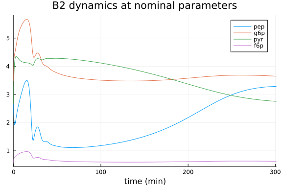
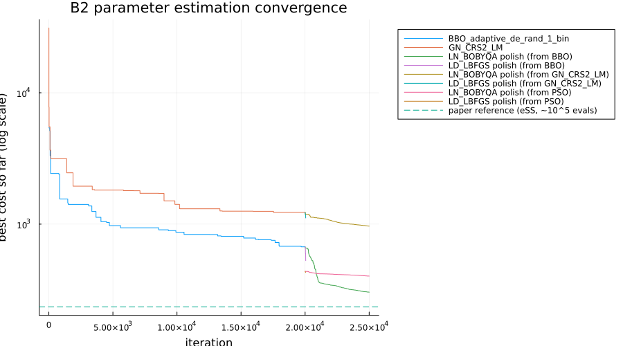
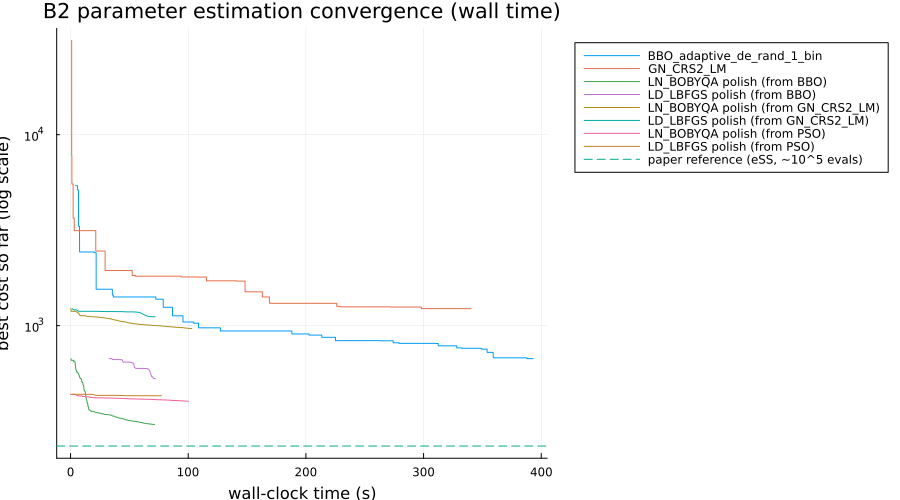

# Parameter estimation of the Chassagnole *E. coli* central carbon metabolism model

This benchmark implements problem **B2** from the
[BioPreDyn-bench suite](https://bmcsystbiol.biomedcentral.com/articles/10.1186/s12918-015-0144-4)
(Villaverde et al. 2015), addressing
[SciMLBenchmarks.jl#555](https://github.com/SciML/SciMLBenchmarks.jl/issues/555).
B2 is a kinetic model of *E. coli* central carbon metabolism (glycolysis,
pentose phosphate pathway, and related reactions) originally due to
Chassagnole et al. (2002), with 18 dynamic states and 116 unknown kinetic
parameters, fit against real time-course measurements from a glucose pulse
experiment. It is the smallest of the BioPreDyn-bench problems that uses
real (rather than simulated) experimental data.

The model equations, nominal parameters, parameter bounds, and experimental
data below are transcribed directly from the benchmark's official MATLAB/AMIGO2
implementation, available as
[supplementary material](https://pmc.ncbi.nlm.nih.gov/articles/PMC4342829/)
to the paper (Additional files 2-3, directory `BioPreDynBenchFiles/B2`).

```julia
using OrdinaryDiffEq, DiffEqParamEstim, Optimization, ForwardDiff
using OptimizationBBO, OptimizationNLopt, Plots, BenchmarkTools, DataFrames
using ParallelParticleSwarms
gr(fmt = :png)
```

```
Plots.GRBackend()
```


## Model

States (in order): dihydroxyacetone phosphate (`dhap`), erythrose
4-phosphate (`e4p`), fructose 6-phosphate (`f6p`), fructose 1,6-bisphosphate
(`fdp`), glucose 1-phosphate (`g1p`), glucose 6-phosphate (`g6p`),
glyceraldehyde 3-phosphate (`gap`), phosphoenolpyruvate (`pep`),
6-phosphogluconate (`pg`), 2-phosphoglycerate (`pg2`), 3-phosphoglycerate
(`pg3`), 1,3-bisphosphoglycerate (`pgp`), pyruvate (`pyr`), ribose
5-phosphate (`rib5p`), ribulose 5-phosphate (`ribu5p`), sedoheptulose
7-phosphate (`sed7p`), xylulose 5-phosphate (`xyl5p`), and extracellular
glucose (`glcex`).

Adenine/nicotinamide cofactor concentrations (ATP, ADP, AMP, NAD, NADH,
NADP, NADPH) are not dynamic states in this model; they follow empirical
time-varying functions fit to independent measurements (as in the original
benchmark).

```julia
function chassagnole!(du, u, p, t)
    cdhap, ce4p, cf6p, cfdp, cg1p, cg6p, cgap, cpep, cpg, cpg2, cpg3, cpgp,
    cpyr, crib5p, cribu5p, csed7p, cxyl5p, cglcex = u

    kALDOdhap, kALDOeq, kALDOfdp, kALDOgap, kALDOgapinh, KDAHPSe4p, KDAHPSpep,
    KENOeq, KENOpep, KENOpg2, KG1PATatp, KG1PATfdp, KG1PATg1p, KG3PDHdhap,
    KG6PDHg6p, KG6PDHnadp, KG6PDHnadphg6pinh, KG6PDHnadphnadpinh, KGAPDHeq,
    KGAPDHgap, KGAPDHnad, KGAPDHnadh, KGAPDHpgp, KPDHpyr, KpepCxylasefdp,
    KpepCxylasepep, KPFKadpa, KPFKadpb, KPFKadpc, KPFKampa, KPFKampb, KPFKatps,
    KPFKf6ps, KPFKpep, KPGDHatpinh, KPGDHnadp, KPGDHnadphinh, KPGDHpg, KPGIeq,
    KPGIf6p, KPGIf6ppginh, KPGIg6p, KPGIg6ppginh, KPGKadp, KPGKatp, KPGKeq,
    KPGKpg3, KPGKpgp, KPGluMueq, KPGluMupg2, KPGluMupg3, KPGMeq, KPGMg1p,
    KPGMg6p, KPKadp, KPKamp, KPKatp, KPKfdp, KPKpep, KPTSa1, KPTSa2, KPTSa3,
    KPTSg6p, KR5PIeq, KRPPKrib5p, KRu5Peq, KSerSynthpg3, KSynth1pep,
    KSynth2pyr, KTAeq, kTISdhap, kTISeq, kTISgap, KTKaeq, KTKbeq, LPFK, LPK,
    nDAHPSe4p, nDAHPSpep, nG1PATfdp, nPDH, npepCxylasefdp, nPFK, nPK,
    nPTSg6p, rmaxALDO, rmaxDAHPS, rmaxENO, rmaxG1PAT, rmaxG3PDH, rmaxG6PDH,
    rmaxGAPDH, rmaxMetSynth, rmaxMurSynth, rmaxPDH, rmaxpepCxylase, rmaxPFK,
    rmaxPGDH, rmaxPGI, rmaxPGK, rmaxPGluMu, rmaxPGM, rmaxPK, rmaxPTS,
    rmaxR5PI, rmaxRPPK, rmaxRu5P, rmaxSerSynth, rmaxSynth1, rmaxSynth2,
    rmaxTA, rmaxTIS, rmaxTKa, rmaxTKb, rmaxTrpSynth, VALDOblf = p

    # known (fixed, not estimated) parameters
    cfeed = 110.96
    Dil = 2.78e-05
    mu = 2.78e-05
    cytosol = 1.0
    extracellular = 1.0

    # empirical time-varying cofactor concentrations
    cadp = 0.582 + 1.73 * 2.731^(-0.15 * t) * (0.12 * t + 0.000214 * t^3)
    camp = 0.123 + 7.25 * (t / (7.25 + 1.47 * t + 0.17 * t^2)) + 1.073 / (1.29 + 8.05 * t)
    catp = 4.27 - 4.163 * (t / (0.657 + 1.43 * t + 0.0364 * t^2))
    cnad = 1.314 + 1.314 * 2.73^(-0.0435 * t - 0.342) -
           (t + 7.871) * (2.73^(-0.0218 * t - 0.171) / (8.481 + t))
    cnadh = 0.0934 + 0.00111 * 2.371^(-0.123 * t) * (0.844 * t + 0.104 * t^3)
    cnadp = 0.159 - 0.00554 * (t / (2.8 - 0.271 * t + 0.01 * t^2)) + 0.182 / (4.82 + 0.526 * t)
    cnadph = 0.062 +
             0.332 * 2.718^(-0.464 * t) *
             (0.0166 * t^1.58 + 0.000166 * t^4.73 + 0.1312e-9 * t^7.89 +
              0.1362e-12 * t^11 + 0.1233e-15 * t^14.2)

    vALDO = cytosol * rmaxALDO * (cfdp - cgap * cdhap / kALDOeq) /
            (kALDOfdp + cfdp + kALDOgap * cdhap / (kALDOeq * VALDOblf) +
             kALDOdhap * cgap / (kALDOeq * VALDOblf) + cfdp * cgap / kALDOgapinh +
             cgap * cdhap / (VALDOblf * kALDOeq))
    vDAHPS = cytosol * rmaxDAHPS * ce4p^nDAHPSe4p * cpep^nDAHPSpep /
             ((KDAHPSe4p + ce4p^nDAHPSe4p) * (KDAHPSpep + cpep^nDAHPSpep))
    vDHAP = cytosol * mu * cdhap
    vE4P = cytosol * mu * ce4p
    vENO = cytosol * rmaxENO * (cpg2 - cpep / KENOeq) / (KENOpg2 * (1 + cpep / KENOpep) + cpg2)
    vEXTER = extracellular * Dil * (cfeed - cglcex)
    vG1PAT = cytosol * rmaxG1PAT * cg1p * catp * (1 + (cfdp / KG1PATfdp)^nG1PATfdp) /
             ((KG1PATatp + catp) * (KG1PATg1p + cg1p))
    vG3PDH = cytosol * rmaxG3PDH * cdhap / (KG3PDHdhap + cdhap)
    vG6P = cytosol * mu * cg6p
    vG6PDH = cytosol * rmaxG6PDH * cg6p * cnadp /
             ((cg6p + KG6PDHg6p) * (1 + cnadph / KG6PDHnadphg6pinh) *
              (KG6PDHnadp * (1 + cnadph / KG6PDHnadphnadpinh) + cnadp))
    vGAP = cytosol * mu * cgap
    vGAPDH = cytosol * rmaxGAPDH * (cgap * cnad - cpgp * cnadh / KGAPDHeq) /
             ((KGAPDHgap * (1 + cpgp / KGAPDHpgp) + cgap) *
              (KGAPDHnad * (1 + cnadh / KGAPDHnadh) + cnad))
    vGLP = cytosol * mu * cg1p
    vMURSyNTH = cytosol * rmaxMurSynth
    vMethSynth = cytosol * rmaxMetSynth
    vPDH = cytosol * rmaxPDH * cpyr^nPDH / (KPDHpyr + cpyr^nPDH)
    vPEP = cytosol * mu * cpep
    vPFK = cytosol * rmaxPFK * catp * cf6p /
           ((catp + KPFKatps * (1 + cadp / KPFKadpc)) *
            (cf6p + KPFKf6ps * (1 + cpep / KPFKpep + cadp / KPFKadpb + camp / KPFKampb) /
                    (1 + cadp / KPFKadpa + camp / KPFKampa)) *
            (1 + LPFK / (1 + cf6p * (1 + cadp / KPFKadpa + camp / KPFKampa) /
                              (KPFKf6ps * (1 + cpep / KPFKpep + cadp / KPFKadpb + camp / KPFKampb)))^nPFK))
    vPG = cytosol * mu * cpg
    vPG3 = cytosol * mu * cpg3
    vPGDH = cytosol * rmaxPGDH * cpg * cnadp /
            ((cpg + KPGDHpg) * (cnadp + KPGDHnadp * (1 + cnadph / KPGDHnadphinh) * (1 + catp / KPGDHatpinh)))
    vPGI = cytosol * rmaxPGI * (cg6p - cf6p / KPGIeq) /
           (KPGIg6p * (1 + cf6p / (KPGIf6p * (1 + cpg / KPGIf6ppginh)) + cpg / KPGIg6ppginh) + cg6p)
    vPGK = cytosol * rmaxPGK * (cadp * cpgp - catp * cpg3 / KPGKeq) /
           ((KPGKadp * (1 + catp / KPGKatp) + cadp) * (KPGKpgp * (1 + cpg3 / KPGKpg3) + cpgp))
    vPGM = cytosol * rmaxPGM * (cg6p - cg1p / KPGMeq) / (KPGMg6p * (1 + cg1p / KPGMg1p) + cg6p)
    vPGP = cytosol * mu * cpgp
    vPK = cytosol * rmaxPK * cpep * (cpep / KPKpep + 1)^(nPK - 1) * cadp /
          (KPKpep * (LPK * ((1 + catp / KPKatp) / (cfdp / KPKfdp + camp / KPKamp + 1))^nPK +
                     (cpep / KPKpep + 1)^nPK) * (cadp + KPKadp))
    vPPK = cytosol * rmaxRPPK * crib5p / (KRPPKrib5p + crib5p)
    vPTS = extracellular * rmaxPTS * cglcex * (cpep / cpyr) /
           ((KPTSa1 + KPTSa2 * (cpep / cpyr) + KPTSa3 * cglcex + cglcex * (cpep / cpyr)) *
            (1 + cg6p^nPTSg6p / KPTSg6p))
    vR5PI = cytosol * rmaxR5PI * (cribu5p - crib5p / KR5PIeq)
    vRIB5P = cytosol * mu * crib5p
    vRibu5p = cytosol * mu * cribu5p
    vRu5P = cytosol * rmaxRu5P * (cribu5p - cxyl5p / KRu5Peq)
    vSED7P = cytosol * mu * csed7p
    vSynth1 = cytosol * rmaxSynth1 * cpep / (KSynth1pep + cpep)
    vSynth2 = cytosol * rmaxSynth2 * cpyr / (KSynth2pyr + cpyr)
    vTA = cytosol * rmaxTA * (cgap * csed7p - ce4p * cf6p / KTAeq)
    vTIS = cytosol * rmaxTIS * (cdhap - cgap / kTISeq) / (kTISdhap * (1 + cgap / kTISgap) + cdhap)
    vTKA = cytosol * rmaxTKa * (crib5p * cxyl5p - csed7p * cgap / KTKaeq)
    vTKB = cytosol * rmaxTKb * (cxyl5p * ce4p - cf6p * cgap / KTKbeq)
    vTRPSYNTH = cytosol * rmaxTrpSynth
    vXYL5P = cytosol * mu * cxyl5p
    vf6P = cytosol * mu * cf6p
    vfdP = cytosol * mu * cfdp
    vpepCxylase = cytosol * rmaxpepCxylase * cpep * (1 + (cfdp / KpepCxylasefdp)^npepCxylasefdp) /
                  (KpepCxylasepep + cpep)
    vpg2 = cytosol * mu * cpg2
    vpyr = cytosol * mu * cpyr
    vrpGluMu = cytosol * rmaxPGluMu * (cpg3 - cpg2 / KPGluMueq) /
               (KPGluMupg3 * (1 + cpg2 / KPGluMupg2) + cpg3)
    vsersynth = cytosol * rmaxSerSynth * cpg3 / (KSerSynthpg3 + cpg3)

    du[1] = (vALDO - vDHAP - vG3PDH - vTIS) / cytosol
    du[2] = (-vDAHPS - vE4P + vTA - vTKB) / cytosol
    du[3] = (-2.0 * vMURSyNTH - vPFK + vPGI + vTA + vTKB - vf6P) / cytosol
    du[4] = (-vALDO + vPFK - vfdP) / cytosol
    du[5] = (-vG1PAT - vGLP + vPGM) / cytosol
    du[6] = (-vG6P - vG6PDH - vPGI - vPGM + 65.0 * vPTS) / cytosol
    du[7] = (vALDO - vGAP - vGAPDH - vTA + vTIS + vTKA + vTKB + vTRPSYNTH) / cytosol
    du[8] = (-vDAHPS + vENO - vPEP - vPK - 65.0 * vPTS - vSynth1 - vpepCxylase) / cytosol
    du[9] = (vG6PDH - vPG - vPGDH) / cytosol
    du[10] = (-vENO - vpg2 + vrpGluMu) / cytosol
    du[11] = (-vPG3 + vPGK - vrpGluMu - vsersynth) / cytosol
    du[12] = (vGAPDH - vPGK - vPGP) / cytosol
    du[13] = (vMethSynth - vPDH + vPK + 65.0 * vPTS - vSynth2 + vTRPSYNTH - vpyr) / cytosol
    du[14] = (-vPPK + vR5PI - vRIB5P - vTKA) / cytosol
    du[15] = (vPGDH - vR5PI - vRibu5p - vRu5P) / cytosol
    du[16] = (-vSED7P - vTA + vTKA) / cytosol
    du[17] = (vRu5P - vTKA - vTKB - vXYL5P) / cytosol
    du[18] = (vEXTER - vPTS) / extracellular
    nothing
end
```

```
chassagnole! (generic function with 1 method)
```


## Nominal parameters, bounds, and initial condition

```julia
p_nom = [
    0.088, 0.144, 1.75, 0.088, 0.6, 0.035, 0.0053, 6.73, 0.135, 0.1, 4.42,
    0.119, 3.2, 1.0, 14.4, 0.0246, 6.43, 0.01, 0.63, 0.683, 0.252, 1.09,
    1.04e-5, 1159.0, 0.7, 4.07, 128.0, 3.89, 4.14, 19.1, 3.2, 0.123, 0.325,
    3.26, 208.0, 0.0506, 0.0138, 37.5, 0.1725, 0.266, 0.2, 2.9, 0.2, 0.185,
    0.653, 1934.4, 0.473, 0.0468, 0.188, 0.369, 0.2, 0.196, 0.0136, 1.038,
    0.26, 0.2, 22.5, 0.19, 0.31, 3082.3, 0.01, 245.3, 2.15, 4.0, 0.1, 1.4,
    1.0, 1.0, 1.0, 1.05, 2.8, 1.39, 0.3, 1.2, 10.0, 5.62907e6, 1000.0, 2.6,
    2.2, 1.2, 3.68, 4.21, 11.1, 4.0, 3.66, 17.4146, 0.107953, 330.448,
    0.00752546, 0.0116204, 1.3802, 921.594, 0.0022627, 0.00043711, 6.05953,
    0.107021, 1840.58, 16.2324, 650.988, 3021.77, 89.0497, 0.839824,
    0.0611315, 7829.78, 4.83841, 0.0129005, 6.73903, 0.0257121, 0.019539,
    0.0736186, 10.8716, 68.6747, 9.47338, 86.5586, 0.001037, 2.0]

# lower/upper bounds: an order of magnitude below/above nominal, except for
# the eight Hill-type exponents (n***, indices 78-85), bounded to [1, 12]
p_lower = p_nom ./ 10
p_upper = p_nom .* 10
for i in 78:85
    p_lower[i] = 1.0
    p_upper[i] = 12.0
end

u0 = [0.167, 0.098, 0.6, 0.272, 0.653, 3.48, 0.218, 2.67, 0.808, 0.399, 2.13,
    0.008, 2.67, 0.398, 0.111, 0.276, 0.138, 2.0]

tspan = (0.0, 301.0)
prob = ODEProblem(chassagnole!, u0, tspan, p_nom)
```

```
ODEProblem with uType Vector{Float64} and tType Float64. In-place: true
Non-trivial mass matrix: false
timespan: (0.0, 301.0)
u0: 18-element Vector{Float64}:
 0.167
 0.098
 0.6
 0.272
 0.653
 3.48
 0.218
 2.67
 0.808
 0.399
 2.13
 0.008
 2.67
 0.398
 0.111
 0.276
 0.138
 2.0
```


## Experimental data

Five independent glucose-pulse experiments, digitized from Chassagnole et
al. (2002) and used as-is in the BioPreDyn-bench AMIGO2 implementation.
Each experiment observes a different subset of states at its own sampling
times.

```julia
exp1_times = [0.15, 0.3, 0.45, 0.6, 0.8, 5.5, 12.0, 21.5, 31.5, 61.0, 90.0, 120.5, 180.5, 300.5]
exp1_states = [8, 6, 13, 3]  # pep, g6p, pyr, f6p
exp1_data = [
    1.99 4.39 4.07 0.62
    2.10 4.76 3.71 0.66
    2.09 4.86 3.19 0.74
    1.84 4.65 3.57 0.62
    2.31 4.75 3.14 0.75
    2.76 5.52 2.38 0.92
    3.05 5.86 3.71 1.15
    2.42 4.39 3.19 0.57
    2.23 3.60 5.24 0.46
    2.52 3.83 4.47 0.57
    2.81 4.30 3.62 0.57
    2.71 4.05 3.62 0.69
    2.71 3.27 2.86 0.46
    2.70 3.38 2.40 0.46]

exp2_times = [5.5, 13.5, 31.0, 61.0, 91.0, 151.0, 181.0, 212.5, 241.0, 270.5, 301.0]
exp2_states = [18]  # glcex
exp2_data = reshape(
    [1.255555556, 1.311111111, 1.283333333, 0.8611111111, 0.5972222223,
        0.09611111112, 0.04333333334, 0.05055555556, 0.04777777778,
        0.04777777778, 0.06], :, 1)

exp3_times = [2.0, 16.0, 19.0, 31.0, 57.0, 91.5, 150.5, 299.0]
exp3_states = [5]  # g1p
exp3_data = reshape([1.35, 0.83, 0.83, 0.78, 0.84, 0.64, 0.74, 0.70], :, 1)

exp4_times = [3.5, 4.0, 12.0, 12.25, 21.0, 25.75, 30.0, 32.25, 58.5, 59.0,
    119.75, 124.0, 178.0, 180.0, 209.0]
exp4_states = [9]  # 6pg
exp4_data = reshape(
    [1.01, 0.92, 1.15, 1.19, 1.06, 1.10, 1.05, 1.08, 0.97, 1.01, 0.92, 0.89,
        0.74, 0.88, 0.80], :, 1)

exp5_times = [4.5, 11.0, 20.0, 30.0, 60.0, 90.0, 119.5, 180.0, 239.5, 300.0]
exp5_states = [4, 7]  # fdp, gap
exp5_data = [
    0.19 0.28
    0.56 0.32
    1.00 0.31
    2.83 0.24
    1.50 0.30
    2.26 0.18
    2.40 0.22
    1.25 0.21
    0.07 0.22
    0.02 0.20]

experiments = [
    (times = exp1_times, states = exp1_states, data = exp1_data),
    (times = exp2_times, states = exp2_states, data = exp2_data),
    (times = exp3_times, states = exp3_states, data = exp3_data),
    (times = exp4_times, states = exp4_states, data = exp4_data),
    (times = exp5_times, states = exp5_states, data = exp5_data)]
```

```
5-element Vector{@NamedTuple{times::Vector{Float64}, states::Vector{Int64},
 data::Matrix{Float64}}}:
 (times = [0.15, 0.3, 0.45, 0.6, 0.8, 5.5, 12.0, 21.5, 31.5, 61.0, 90.0, 12
0.5, 180.5, 300.5], states = [8, 6, 13, 3], data = [1.99 4.39 4.07 0.62; 2.
1 4.76 3.71 0.66; … ; 2.71 3.27 2.86 0.46; 2.7 3.38 2.4 0.46])
 (times = [5.5, 13.5, 31.0, 61.0, 91.0, 151.0, 181.0, 212.5, 241.0, 270.5, 
301.0], states = [18], data = [1.255555556; 1.311111111; … ; 0.04777777778;
 0.06;;])
 (times = [2.0, 16.0, 19.0, 31.0, 57.0, 91.5, 150.5, 299.0], states = [5], 
data = [1.35; 0.83; … ; 0.74; 0.7;;])
 (times = [3.5, 4.0, 12.0, 12.25, 21.0, 25.75, 30.0, 32.25, 58.5, 59.0, 119
.75, 124.0, 178.0, 180.0, 209.0], states = [9], data = [1.01; 0.92; … ; 0.8
8; 0.8;;])
 (times = [4.5, 11.0, 20.0, 30.0, 60.0, 90.0, 119.5, 180.0, 239.5, 300.0], 
states = [4, 7], data = [0.19 0.28; 0.56 0.32; … ; 0.07 0.22; 0.02 0.2])
```


## Objective function

The BioPreDyn-bench objective is a weighted least-squares cost with a
relative (15%) standard deviation model, floored to avoid division by
zero — reproduced here exactly from the AMIGO2 script `b2_obj.m`.

```julia
function biopredyn_b2_cost(p)
    # Away from the nominal parameters, global optimizers routinely probe
    # combinations that drive a state negative, which raised to one of the
    # model's non-integer Hill exponents throws a DomainError. The original
    # AMIGO2/MATLAB objective handles this by checking `isreal`/`isnan` after
    # integration and substituting a large penalty (`f = 1e20`); we do the
    # equivalent with a try/catch here, since Julia raises instead of
    # returning a complex number.
    try
        sol = solve(prob, Rodas5P(), p = p, reltol = 1e-6, abstol = 1e-8)
        sol.retcode == ReturnCode.Success || return 1e20

        cost = 0.0
        for e in experiments
            simvals = Array(sol(e.times))[e.states, :]'
            err = max.(0.15 .* abs.(e.data), 1e-6)
            cost += sum(((simvals .- e.data) ./ err) .^ 2)
        end
        return cost
    catch e
        e isa DomainError || rethrow()
        return 1e20
    end
end
```

```
biopredyn_b2_cost (generic function with 1 method)
```


```julia
@time cost_nominal = biopredyn_b2_cost(p_nom)
```

```
2.980624 seconds (6.93 M allocations: 318.969 MiB, 3.50% gc time, 98.04% 
compilation time)
31132.6042126662
```


The original study reports reaching a cost of `Jf ≈ 234.2` using the
enhanced scatter search (eSS) global optimizer after ~10⁵ function
evaluations (about 3 hours of CPU time), starting from these same nominal
parameters as the initial guess.

## Visualizing the fit at nominal parameters

```julia
sol_nom = solve(prob, Rodas5P(), p = p_nom, reltol = 1e-6, abstol = 1e-8)
plot(sol_nom, idxs = [8, 6, 13, 3], label = ["pep" "g6p" "pyr" "f6p"],
    xlabel = "time (min)", title = "B2 dynamics at nominal parameters")
```




## Parameter estimation

We benchmark global optimizers on this 116-parameter problem, starting
from the nominal parameters as the initial guess and using the bounds
given above (matching the original study's setup). This is a
substantially harder problem than the other benchmarks in this folder
(116 parameters vs. 4): the original study needed ~10⁵ evaluations of a
more sophisticated hybrid metaheuristic (eSS) to reach `Jf ≈ 234.2`. We
use a budget of ~20,000 evaluations per optimizer here — enough to show
real convergence behavior on typical benchmark hardware, though (using
simpler, off-the-shelf global optimizers rather than eSS, and a smaller
budget than the original study) not necessarily enough to fully match
the literature optimum on its own.

In addition to `BBO_adaptive_de_rand_1_bin` (BlackBoxOptim's differential
evolution) and `GN_CRS2_LM` (NLopt's controlled random search), we
include `ParallelPSOArray` from
[ParallelParticleSwarms.jl](https://github.com/SciML/ParallelParticleSwarms.jl),
a particle-swarm optimizer aimed at high-dimensional problems like this
one. `ParallelParticleSwarms.jl` also ships `SerialPSO` (which errors
here with a `Random.Sampler` `MethodError`) and a built-in `HybridPSO`
that pairs PSO with a gradient-based local polish (`SimpleLBFGS` by
default) in one call — a natural fit for exactly the two-stage
global-then-local approach used later in this benchmark. An earlier
version of this benchmark reported `HybridPSO` as broken on the
registered release; that was wrong. Reading `ParallelParticleSwarms`'s
source directly shows `HybridPSOCache` and its `solve!` methods for both
`SimpleLBFGS` and `BFGS` local refinement are present in v1.6.2, and
`HybridPSO` does work correctly with its actual default swarm
(`ParallelPSOKernel`) — confirmed on a small test problem. The earlier
`MethodError` came from our own nonstandard substitution: we had swapped
in `ParallelPSOArray` as `HybridPSO`'s inner swarm to "isolate" what we
assumed was a swarm-independent bug, but `ParallelPSOArray` (unlike
`ParallelPSOKernel`/`ParallelSyncPSOKernel`) has no custom
`SciMLBase.init`, so it falls back to a generic `OptimizationBase` cache
that doesn't support the calling convention `HybridPSO`'s `solve!`
relies on — an artifact of that substitution, not a real library defect.

`HybridPSO`'s default swarm also requires `SArray`-typed bounds and
initial guess (`ParallelPSOKernel`'s `init` asserts `prob.u0 isa SArray`),
so using it here means passing `p_nom`/`p_lower`/`p_upper` as
`StaticArrays.SVector`s of length 116 instead of `Vector`s. At that
dimension this did not finish: a test run with a modest budget did not
return within two hours and was killed, consistent with the
`StaticArrays`/`KernelAbstractions`-based kernels underlying `HybridPSO`
not scaling to 116 static parameters in practical compile/run time (it
worked fine on a 20-parameter test problem). We therefore chain
`ParallelPSOArray` with `LN_BOBYQA`/`LD_LBFGS` manually below instead,
which needs no `SArray` conversion and has no such blowup at this
dimension. `ParallelPSOArray` does not yet support the `callback`
keyword used below for the other optimizers, so its per-iteration
history isn't available for the convergence plot, only its final result.

Each trackable optimizer's raw per-evaluation cost is recorded via a
callback, from which we compute the running best-found cost for a
convergence plot.

```julia
optf = OptimizationFunction((p, _) -> biopredyn_b2_cost(p))
optprob = OptimizationProblem(optf, p_nom, lb = p_lower, ub = p_upper)
```

```
OptimizationProblem. In-place: true
u0: 116-element Vector{Float64}:
  0.088
  0.144
  1.75
  0.088
  0.6
  0.035
  0.0053
  6.73
  0.135
  0.1
  ⋮
  0.0257121
  0.019539
  0.0736186
 10.8716
 68.6747
  9.47338
 86.5586
  0.001037
  2.0
```


```julia
losses_bbo = Float64[]
times_bbo = Float64[]
t0_bbo = time()
cb_bbo = (state, l) -> (push!(losses_bbo, l); push!(times_bbo, time() - t0_bbo); false)
@time res_bbo = solve(
    optprob, BBO_adaptive_de_rand_1_bin(), maxiters = 20000, callback = cb_bbo)
res_bbo.objective
```

```
393.233928 seconds (117.22 M allocations: 9.923 GiB, 1.82% gc time, 1.04% c
ompilation time)
671.9662721907098
```


```julia
losses_nlopt = Float64[]
times_nlopt = Float64[]
t0_nlopt = time()
cb_nlopt = (state, l) -> (push!(losses_nlopt, l); push!(times_nlopt, time() - t0_nlopt); false)
opt = Opt(:GN_CRS2_LM, length(p_nom))
@time res_nlopt = solve(optprob, opt, maxiters = 20000, callback = cb_nlopt)
res_nlopt.objective
```

```
340.251887 seconds (98.87 M allocations: 8.611 GiB, 1.79% gc time, 0.24% co
mpilation time: 10% of which was recompilation)
1227.547314263947
```


```julia
n_particles = 40
@time res_pso = solve(optprob, ParallelPSOArray(n_particles), maxiters = 12000 ÷ n_particles)
res_pso.objective
```

```
41.594615 seconds (88.10 M allocations: 6.927 GiB, 20.34% gc time, 169.54%
 compilation time)
437.3594410456169
```


## Local refinement: derivative-free vs. derivative-based polish

Global metaheuristics are good at finding a promising basin but slow to
fine-tune within it. The original study's own eSS method is itself a
*hybrid* global+local algorithm for exactly this reason. We polish each
of the three global results above with **two** different local methods,
from identical starting points, rather than spending the (very large)
additional global-search budget a pure power-law extrapolation would
otherwise call for to close the gap to `Jf ≈ 234.2`:

  - `LN_BOBYQA`, derivative-free;
  - NLopt's `LD_LBFGS`, derivative-based, using a `ForwardDiff`-computed
    gradient propagated through the ODE solve.

Since the cost function's `DomainError`-triggered `1e20` penalty (see
above) makes the landscape discontinuous in places, it's natural to ask
whether a derivative-based local method still works here, or whether
that discontinuity misleads it — comparing both methods from the same
three starting points answers that directly. `LD_LBFGS` is given a much
smaller iteration budget than `LN_BOBYQA` below because each `ForwardDiff`
gradient requires a dual-number-propagated ODE solve, which costs far
more per iteration than `LN_BOBYQA`'s single real-valued solve.

```julia
optf_grad = OptimizationFunction((p, _) -> biopredyn_b2_cost(p), Optimization.AutoForwardDiff())

function polish(start_u, label)
    prob = OptimizationProblem(optf, start_u, lb = p_lower, ub = p_upper)
    losses = Float64[]
    times = Float64[]
    t0 = time()
    cb = (state, l) -> (push!(losses, l); push!(times, time() - t0); false)
    t = @elapsed res = solve(
        prob, Opt(:LN_BOBYQA, length(p_nom)), maxiters = 5000, callback = cb)
    println(label, ": ", res.objective, " (", t, "s)")
    return res, losses, times
end

function polish_grad(start_u, label)
    prob = OptimizationProblem(optf_grad, start_u, lb = p_lower, ub = p_upper)
    losses = Float64[]
    times = Float64[]
    t0 = time()
    cb = (state, l) -> (push!(losses, l); push!(times, time() - t0); false)
    t = @elapsed res = solve(
        prob, Opt(:LD_LBFGS, length(p_nom)), maxiters = 50, callback = cb)
    println(label, ": ", res.objective, " (", t, "s)")
    return res, losses, times
end

res_bbo_polish, losses_bbo_polish, times_bbo_polish = polish(res_bbo.u, "BBO -> LN_BOBYQA")
res_nlopt_polish, losses_nlopt_polish, times_nlopt_polish = polish(
    res_nlopt.u, "GN_CRS2_LM -> LN_BOBYQA")
res_pso_polish, losses_pso_polish, times_pso_polish = polish(
    res_pso.u, "ParallelPSOArray -> LN_BOBYQA")

res_bbo_lbfgs, losses_bbo_lbfgs, times_bbo_lbfgs = polish_grad(res_bbo.u, "BBO -> LD_LBFGS")
res_nlopt_lbfgs, losses_nlopt_lbfgs, times_nlopt_lbfgs = polish_grad(
    res_nlopt.u, "GN_CRS2_LM -> LD_LBFGS")
res_pso_lbfgs, losses_pso_lbfgs, times_pso_lbfgs = polish_grad(
    res_pso.u, "ParallelPSOArray -> LD_LBFGS")
```

```
BBO -> LN_BOBYQA: 303.6030608004095 (71.457559317s)
GN_CRS2_LM -> LN_BOBYQA: 965.5896323900677 (103.028450441s)
ParallelPSOArray -> LN_BOBYQA: 402.2436515548437 (100.148868913s)
BBO -> LD_LBFGS: 527.5844713387742 (72.064128588s)
GN_CRS2_LM -> LD_LBFGS: 1114.2397468357938 (71.815852571s)
ParallelPSOArray -> LD_LBFGS: 429.5773714928223 (77.300474749s)
(retcode: MaxIters
u: [0.6511689850085466, 0.031896000162471114, 17.5, 0.8799999999999999, 5.9
27273957855908, 0.0035000000000000005, 0.052705267894497296, 29.64948847271
2566, 0.02155919477005253, 0.9996642493899082  …  9.802038477505032, 0.2510
38214195599, 0.1590509198659505, 0.16347680093998285, 92.03428181301024, 58
0.6812793858228, 0.947338, 8.65586, 0.002004427362273965, 20.0]
Final objective value:     429.5773714928223
, [437.3594410456169, 447.3587658757536, 437.0660012314052, 437.08983453579
62, 311746.52321797237, 2648.186043078688, 568.4495979912015, 437.071664426
6438, 437.0659058051574, 447.65208069332834  …  429.81646578759427, 429.807
6071133879, 429.78633989026355, 429.7419311124475, 429.67363077448624, 429.
6100715585857, 429.58153622564373, 429.57753519214884, 429.5773861130039, 4
29.5773714928223], [1.486846923828125, 2.9701759815216064, 4.46795201301574
7, 5.935815811157227, 7.05000901222229, 8.534714937210083, 10.0686738491058
35, 11.565671920776367, 13.060340881347656, 14.522442817687988  …  63.18356
895446777, 64.74863290786743, 66.28384590148926, 67.88199090957642, 69.4541
4996147156, 71.03003287315369, 72.58100199699402, 74.15433502197266, 75.725
43001174927, 77.30043983459473])
```


`LD_LBFGS` does make some progress from every starting point, but far
less efficiently than `LN_BOBYQA`: 50 gradient iterations take about as
much wall-clock time as 5000 `LN_BOBYQA` iterations from the same start,
yet consistently reaches a noticeably worse final cost regardless of
which global optimizer it polishes — consistent with the penalty
discontinuities limiting how far a gradient/line search can trust the
local slope before it needs to re-evaluate.

Is this specific to `LD_LBFGS`'s particular implementation, or does any
derivative-based local method struggle here? We checked directly (outside
this benchmark's executed script, since — see below — its cost made
including it here impractical) using `SimpleLBFGS`, the exact bounded
L-BFGS-with-Strong-Wolfe-line-search algorithm `HybridPSO` itself pairs
PSO with by default; unlike `HybridPSO`'s own kernel-based PSO stage,
`SimpleLBFGS`'s solver runs on ordinary `Vector`s and isn't affected by
the `SArray` scaling limitation described above, so it could be tested
independently of `HybridPSO`. From the same three starting points used
above, `SimpleLBFGS` made *less* progress than `LD_LBFGS` in a comparable
or smaller number of iterations, and typically returned
`ReturnCode.Failure` rather than converging or hitting `MaxIters` —
consistent with the same explanation given above for `LD_LBFGS`: the
`DomainError`-penalized `1e20` regions violate the smoothness a line
search assumes, and `SimpleLBFGS`'s more aggressive Strong Wolfe search
trips on this at least as often as `LD_LBFGS`'s own NLopt step
heuristics. It was also far more expensive per iteration than `LD_LBFGS`
here — one 5-iteration test run took over an hour, since each failed
Wolfe-condition check inside a single L-BFGS step can trigger many more
dual-number ODE solves via the line search's own internal iteration
budget — which is why it isn't included as an executed step in this
benchmark: at the 50-iteration budget used for `LD_LBFGS` above, it would
likely run for many hours per starting point. So the derivative-based
disadvantage documented here isn't an artifact of our particular choice
of `LD_LBFGS`; the "standard" `SimpleLBFGS` alternative fares no better
on this problem's discontinuous penalty landscape, and costs substantially
more to run besides.

```julia
df = DataFrame(
    method = ["Nominal (no fit)", "BBO_adaptive_de_rand_1_bin", "GN_CRS2_LM",
        "ParallelPSOArray",
        "LN_BOBYQA polish (from BBO)", "LD_LBFGS polish (from BBO)",
        "LN_BOBYQA polish (from GN_CRS2_LM)", "LD_LBFGS polish (from GN_CRS2_LM)",
        "LN_BOBYQA polish (from ParallelPSOArray)",
        "LD_LBFGS polish (from ParallelPSOArray)"],
    cost = [cost_nominal, res_bbo.objective, res_nlopt.objective, res_pso.objective,
        res_bbo_polish.objective, res_bbo_lbfgs.objective,
        res_nlopt_polish.objective, res_nlopt_lbfgs.objective,
        res_pso_polish.objective, res_pso_lbfgs.objective])
```

```
10×2 DataFrame
 Row │ method                             cost
     │ String                             Float64
─────┼──────────────────────────────────────────────
   1 │ Nominal (no fit)                   31132.6
   2 │ BBO_adaptive_de_rand_1_bin           671.966
   3 │ GN_CRS2_LM                          1227.55
   4 │ ParallelPSOArray                     437.359
   5 │ LN_BOBYQA polish (from BBO)          303.603
   6 │ LD_LBFGS polish (from BBO)           527.584
   7 │ LN_BOBYQA polish (from GN_CRS2_L…    965.59
   8 │ LD_LBFGS polish (from GN_CRS2_LM)   1114.24
   9 │ LN_BOBYQA polish (from ParallelP…    402.244
  10 │ LD_LBFGS polish (from ParallelPS…    429.577
```


## Convergence

```julia
bestcost_bbo = accumulate(min, losses_bbo)
bestcost_nlopt = accumulate(min, losses_nlopt)
bestcost_bbo_polish = accumulate(min, losses_bbo_polish)
bestcost_nlopt_polish = accumulate(min, losses_nlopt_polish)
bestcost_pso_polish = accumulate(min, losses_pso_polish)
bestcost_bbo_lbfgs = accumulate(min, losses_bbo_lbfgs)
bestcost_nlopt_lbfgs = accumulate(min, losses_nlopt_lbfgs)
bestcost_pso_lbfgs = accumulate(min, losses_pso_lbfgs)

bbo_polish_iters = length(losses_bbo) .+ (1:length(losses_bbo_polish))
nlopt_polish_iters = length(losses_bbo) .+ (1:length(losses_nlopt_polish))
pso_polish_iters = length(losses_bbo) .+ (1:length(losses_pso_polish))
bbo_lbfgs_iters = length(losses_bbo) .+ (1:length(losses_bbo_lbfgs))
nlopt_lbfgs_iters = length(losses_bbo) .+ (1:length(losses_nlopt_lbfgs))
pso_lbfgs_iters = length(losses_bbo) .+ (1:length(losses_pso_lbfgs))

plot(bestcost_bbo, label = "BBO_adaptive_de_rand_1_bin", yscale = :log10,
    xlabel = "iteration", ylabel = "best cost so far (log scale)",
    title = "B2 parameter estimation convergence", legend = :outertopright,
    size = (900, 500))
plot!(bestcost_nlopt, label = "GN_CRS2_LM")
plot!(bbo_polish_iters, bestcost_bbo_polish, label = "LN_BOBYQA polish (from BBO)")
plot!(bbo_lbfgs_iters, bestcost_bbo_lbfgs, label = "LD_LBFGS polish (from BBO)")
plot!(nlopt_polish_iters, bestcost_nlopt_polish, label = "LN_BOBYQA polish (from GN_CRS2_LM)")
plot!(nlopt_lbfgs_iters, bestcost_nlopt_lbfgs, label = "LD_LBFGS polish (from GN_CRS2_LM)")
plot!(pso_polish_iters, bestcost_pso_polish, label = "LN_BOBYQA polish (from PSO)")
plot!(pso_lbfgs_iters, bestcost_pso_lbfgs, label = "LD_LBFGS polish (from PSO)")
hline!([234.2], label = "paper reference (eSS, ~10^5 evals)", linestyle = :dash)
```




Iteration count alone hides that these methods have very different
per-iteration costs (a `GN_CRS2_LM` iteration isn't the same amount of
work as an `LN_BOBYQA` one, and an `LD_LBFGS` iteration, with its
`ForwardDiff`-propagated ODE solve, is far more expensive still), so we
also plot the same running-best costs against wall-clock seconds, with
each curve measured from its own start (not stacked end-to-end the way
the iteration plot is):

```julia
plot(times_bbo, bestcost_bbo, label = "BBO_adaptive_de_rand_1_bin", yscale = :log10,
    xlabel = "wall-clock time (s)", ylabel = "best cost so far (log scale)",
    title = "B2 parameter estimation convergence (wall time)", legend = :outertopright,
    size = (900, 500))
plot!(times_nlopt, bestcost_nlopt, label = "GN_CRS2_LM")
plot!(times_bbo_polish, bestcost_bbo_polish, label = "LN_BOBYQA polish (from BBO)")
plot!(times_bbo_lbfgs, bestcost_bbo_lbfgs, label = "LD_LBFGS polish (from BBO)")
plot!(times_nlopt_polish, bestcost_nlopt_polish, label = "LN_BOBYQA polish (from GN_CRS2_LM)")
plot!(times_nlopt_lbfgs, bestcost_nlopt_lbfgs, label = "LD_LBFGS polish (from GN_CRS2_LM)")
plot!(times_pso_polish, bestcost_pso_polish, label = "LN_BOBYQA polish (from PSO)")
plot!(times_pso_lbfgs, bestcost_pso_lbfgs, label = "LD_LBFGS polish (from PSO)")
hline!([234.2], label = "paper reference (eSS, ~10^5 evals)", linestyle = :dash)
```




`ParallelPSOArray`'s own result isn't shown as a curve (no per-iteration
history is available, as noted above), but both of its polish curves
start from wherever `res_pso.objective` landed, plotted alongside the
BBO- and `GN_CRS2_LM`-seeded polish curves for direct comparison.

# Conclusion

This benchmark demonstrates SciML's parameter estimation stack
(`OrdinaryDiffEq` + `Optimization.jl`) on a real, published, hard
parameter-estimation problem with real experimental data and 116 unknown
parameters — BioPreDyn-bench B2. Unlike the small toy systems elsewhere in
this folder, global convergence to the literature-reported optimum
(`Jf ≈ 234.2`) is a multi-hour undertaking even in the original study, so
the runs here are best read as relative comparisons between optimizers
given a fixed, modest evaluation budget rather than as fully converged
fits.

Two practical findings stand out. First, derivative-free local
refinement (`LN_BOBYQA`) substantially outperforms a derivative-based
method (`LD_LBFGS` with a `ForwardDiff` gradient) on this problem, both
in solution quality and iteration cost, and consistently so from all
three global-search starting points (BBO, `GN_CRS2_LM`, and
`ParallelPSOArray`) — the gradient method does make real progress from
every start, but each of its iterations is both far more expensive
(a dual-number-propagated ODE solve vs. a single real one) and less
productive, consistent with the `DomainError`-penalized regions of the
search space making the landscape locally discontinuous in a way that
limits how much a local slope can be trusted. This isn't specific to
`LD_LBFGS`'s particular implementation: `SimpleLBFGS` — the exact
bounded L-BFGS-with-Strong-Wolfe algorithm `HybridPSO` itself uses for
local refinement — was checked directly (outside this benchmark's
executed script, for the runtime reasons given above) from the same
starting points and did no better, typically returning
`ReturnCode.Failure` rather than converging, while also costing far more
per iteration. So the derivative-based disadvantage documented here
reflects this problem's discontinuous penalty landscape, not an
artifact of our particular choice of local solver. Second,
`ParallelParticleSwarms.jl`'s `ParallelPSOArray` is a viable additional
global optimizer for this kind of high-dimensional problem. Its
`HybridPSO` would be a natural fit for the local-refinement step done
manually here (it pairs PSO with `SimpleLBFGS` in one call), and does
work correctly with its default swarm at moderate dimension, but its
`SArray`-based kernels did not finish within two hours at this problem's
116-parameter scale — a practical scaling limit rather than a missing
or broken feature. `SerialPSO` separately errors with a
`Random.Sampler` `MethodError`; neither issue is specific to how this
benchmark uses the package.


## Appendix

These benchmarks are a part of the SciMLBenchmarks.jl repository, found at: [https://github.com/SciML/SciMLBenchmarks.jl](https://github.com/SciML/SciMLBenchmarks.jl). For more information on high-performance scientific machine learning, check out the SciML Open Source Software Organization [https://sciml.ai](https://sciml.ai).

To locally run this benchmark, do the following commands:
```
using SciMLBenchmarks
SciMLBenchmarks.weave_file("benchmarks/ParameterEstimation","BioPreDynB2ParameterEstimation.jmd")
```

Computer Information:

```
Julia Version 1.12.7
Commit 6d172b025e4 (2026-08-15 08:05 UTC)
Build Info:
  Official https://julialang.org release
Platform Info:
  OS: Linux (x86_64-linux-gnu)
  CPU: 128 × AMD EPYC 7502 32-Core Processor
  WORD_SIZE: 64
  LLVM: libLLVM-18.1.7 (ORCJIT, znver2)
  GC: Built with stock GC
Threads: 128 default, 1 interactive, 128 GC (on 128 virtual cores)
Environment:
  JULIA_NUM_THREADS = auto

```

Package Information:

```
Status `~/github-runners/amdci3-1/_work/SciMLBenchmarks.jl/SciMLBenchmarks.jl/benchmarks/ParameterEstimation/Project.toml`
  [6e4b80f9] BenchmarkTools v1.8.0
  [a134a8b2] BlackBoxOptim v0.6.12
  [a93c6f00] DataFrames v1.8.2
  [bcd4f6db] DelayDiffEq v6.4.1
⌃ [1130ab10] DiffEqParamEstim v2.6.1
  [31c24e10] Distributions v0.25.131
  [f6369f11] ForwardDiff v1.4.6
⌃ [961ee093] ModelingToolkit v11.43.0
⌃ [7771a370] ModelingToolkitBase v1.70.0
  [76087f3c] NLopt v1.2.1
⌃ [7f7a1694] Optimization v5.9.0
  [3e6eede4] OptimizationBBO v0.4.12
  [4e6fcdb7] OptimizationNLopt v0.3.18
  [1dea7af3] OrdinaryDiffEq v7.8.1
  [ab63da0c] ParallelParticleSwarms v1.6.2
  [65888b18] ParameterizedFunctions v5.27.0
  [91a5bcdd] Plots v1.41.7
⌃ [731186ca] RecursiveArrayTools v4.5.1
⌃ [91a8cdf1] SciCompDSL v1.0.3
  [31c91b34] SciMLBenchmarks v0.2.1 [loaded: `/home/crackauc/github-runners/amdci3-1/_work/SciMLBenchmarks.jl/SciMLBenchmarks.jl/src/SciMLBenchmarks.jl` (v0.2.1) expected `/home/crackauc/.julia/packages/SciMLBenchmarks/ceJyd/src/SciMLBenchmarks.jl` (v0.2.1)]
Info Packages marked with ⌃ have new versions available and may be upgradable.
Warning The project dependencies or compat requirements have changed since the manifest was last resolved. It is recommended to `Pkg.resolve()` or consider `Pkg.update()` if necessary.
```

And the full manifest:

```
Status `~/github-runners/amdci3-1/_work/SciMLBenchmarks.jl/SciMLBenchmarks.jl/benchmarks/ParameterEstimation/Manifest.toml`
  [47edcb42] ADTypes v1.24.0
  [14f7f29c] AMD v0.5.4
  [6e696c72] AbstractPlutoDingetjes v1.4.1
  [1520ce14] AbstractTrees v0.4.5
  [7d9f7c33] Accessors v0.1.45
⌃ [79e6a3ab] Adapt v4.7.0
  [66dad0bd] AliasTables v1.1.3
  [ec485272] ArnoldiMethod v0.4.0
⌃ [4fba245c] ArrayInterface v7.30.1
⌃ [4c555306] ArrayLayouts v1.12.2
  [a9b6321e] Atomix v1.2.1
⌃ [aae01518] BandedMatrices v1.12.0
  [6e4b80f9] BenchmarkTools v1.8.0
  [e2ed5e7c] Bijections v0.2.2
  [b2a6c25c] BinaryHeaps v1.1.0
  [caf10ac8] BipartiteGraphs v0.1.14
  [a134a8b2] BlackBoxOptim v0.6.12
  [8e7c35d0] BlockArrays v1.10.0
  [70df07ce] BracketingNonlinearSolve v1.12.7
  [fa961155] CEnum v0.5.0
  [d360d2e6] ChainRulesCore v1.26.1
  [35d6a980] ColorSchemes v3.31.0
⌃ [3da002f7] ColorTypes v0.12.1
  [c3611d14] ColorVectorSpace v0.11.0
⌃ [5ae59095] Colors v0.13.1
⌅ [861a8166] Combinatorics v1.0.2
  [38540f10] CommonSolve v0.2.14
  [bbf7d656] CommonSubexpressions v0.3.1
  [f70d9fcc] CommonWorldInvalidations v1.2.2
  [34da2185] Compat v4.18.1
  [b152e2b5] CompositeTypes v0.1.4
  [a33af91c] CompositionsBase v0.1.2
  [2569d6c7] ConcreteStructs v0.2.8
  [88cd18e8] ConsoleProgressMonitor v0.1.2
  [187b0558] ConstructionBase v1.6.0
  [d38c429a] Contour v0.6.3
  [a8cc5b0e] Crayons v4.2.0
  [9a962f9c] DataAPI v1.16.0
  [a93c6f00] DataFrames v1.8.2
  [864edb3b] DataStructures v0.19.6
  [e2d170a0] DataValueInterfaces v1.0.0
  [bcd4f6db] DelayDiffEq v6.4.1
  [8bb1440f] DelimitedFiles v1.9.1
  [39dd38d3] Dierckx v0.5.4
⌃ [2b5f629d] DiffEqBase v7.21.1
⌃ [459566f4] DiffEqCallbacks v4.19.3
⌃ [071ae1c0] DiffEqGPU v3.21.0
⌃ [1130ab10] DiffEqParamEstim v2.6.1
  [163ba53b] DiffResults v1.1.0
  [b552c78f] DiffRules v1.16.0
  [a0c0ee7d] DifferentiationInterface v0.7.21
  [31c24e10] Distributions v0.25.131
  [ffbed154] DocStringExtensions v0.9.5
⌃ [5b8099bc] DomainSets v0.8.1
  [7c1d4256] DynamicPolynomials v0.6.8
  [4e289a0a] EnumX v1.0.7
⌃ [7da242da] Enzyme v0.13.203
  [f151be2c] EnzymeCore v0.8.21
  [e2ba6199] ExprTools v0.1.11
  [55351af7] ExproniconLite v0.10.14
  [c87230d0] FFMPEG v0.4.5
  [7034ab61] FastBroadcast v1.4.0
  [9aa1b823] FastClosures v0.3.2
  [a4df4552] FastPower v1.5.0
⌃ [1a297f60] FillArrays v1.17.0
⌃ [64ca27bc] FindFirstFunctions v3.2.1
  [6a86dc24] FiniteDiff v2.33.0
⌅ [53c48c17] FixedPointNumbers v0.8.6
  [1fa38f19] Format v1.3.7
  [f6369f11] ForwardDiff v1.4.6
  [a85aefff] FunctionMaps v0.1.2
  [069b7b12] FunctionWrappers v1.1.3
  [77dc65aa] FunctionWrappersWrappers v1.13.0
⌃ [46192b85] GPUArraysCore v0.2.0
⌅ [61eb1bfa] GPUCompiler v1.23.0
  [28b8d3ca] GR v0.73.27
⌃ [a0844989] Gamma v1.1.0
  [86223c79] Graphs v1.15.0
  [076d061b] HashArrayMappedTries v0.2.0
⌅ [eafb193a] Highlights v0.5.3
  [34004b35] HypergeometricFunctions v0.3.30
  [3263718b] ImplicitDiscreteSolve v2.3.0
  [d25df0c9] Inflate v0.1.5
⌅ [842dd82b] InlineStrings v1.4.6
  [18e54dd8] IntegerMathUtils v0.1.4
  [8197267c] IntervalSets v0.7.14
  [3587e190] InverseFunctions v0.1.17
  [41ab1584] InvertedIndices v1.3.1
  [92d709cd] IrrationalConstants v0.2.6
  [82899510] IteratorInterfaceExtensions v1.0.0
  [1019f520] JLFzf v0.1.11
  [692b3bcd] JLLWrappers v1.8.0
⌅ [682c06a0] JSON v0.21.4
  [ae98c720] Jieko v0.2.1
⌃ [ccbc3e58] JumpProcesses v9.32.3
⌃ [63c18a36] KernelAbstractions v0.9.42
⌃ [ba0b0d4f] Krylov v0.10.9
  [2faa5264] LHLFactorization v2.2.2
⌃ [929cbde3] LLVM v9.13.1
  [b964fa9f] LaTeXStrings v1.4.1
  [23fbe1c1] Latexify v0.16.12
  [73f95e8e] LatticeRules v0.0.2
  [1d6d02ad] LeftChildRightSiblingTrees v0.3.0
⌃ [87fe0de2] LineSearch v0.1.17
⌃ [7ed4a6bd] LinearSolve v5.17.2
⌃ [2ab3a3ac] LogExpFunctions v0.3.29
  [e6f89c97] LoggingExtras v1.2.0
  [d8e11817] MLStyle v0.4.17
  [1914dd2f] MacroTools v0.5.16
  [bb5d69b7] MaybeInplace v0.1.8
  [442fdcdd] Measures v0.3.3
  [e1d29d7a] Missings v1.2.0
⌃ [961ee093] ModelingToolkit v11.43.0
⌃ [7771a370] ModelingToolkitBase v1.70.0
  [6bb917b9] ModelingToolkitTearing v1.20.6
⌅ [2e0e35c7] Moshi v0.3.9
  [46d2c3a1] MuladdMacro v0.2.7
⌃ [102ac46a] MultivariatePolynomials v0.5.19
⌃ [ffc61752] Mustache v1.0.21 [loaded: v1.1.0]
⌃ [d8a4904e] MutableArithmetics v1.8.0
  [76087f3c] NLopt v1.2.1
  [77ba4419] NaNMath v1.1.4
⌃ [8913a72c] NonlinearSolve v4.30.0
⌃ [be0214bd] NonlinearSolveBase v2.49.5
⌃ [5959db7a] NonlinearSolveFirstOrder v2.6.1
  [9a2c21bd] NonlinearSolveQuasiNewton v1.15.3
  [26075421] NonlinearSolveSpectralMethods v1.8.3
  [d8793406] ObjectFile v0.5.1
  [6fe1bfb0] OffsetArrays v1.17.0
⌃ [7f7a1694] Optimization v5.9.0
  [3e6eede4] OptimizationBBO v0.4.12
⌃ [bca83a33] OptimizationBase v5.5.3
  [4e6fcdb7] OptimizationNLopt v0.3.18
⌅ [bac558e1] OrderedCollections v1.8.2 [loaded: v2.0.1]
  [1dea7af3] OrdinaryDiffEq v7.8.1
⌃ [6ad6398a] OrdinaryDiffEqBDF v2.4.8
⌃ [bbf590c4] OrdinaryDiffEqCore v4.17.1
  [50262376] OrdinaryDiffEqDefault v2.6.2
⌃ [4302a76b] OrdinaryDiffEqDifferentiation v3.11.5
  [d3585ca7] OrdinaryDiffEqFunctionMap v2.3.0
⌃ [127b3ac7] OrdinaryDiffEqNonlinearSolve v2.9.6
⌃ [43230ef6] OrdinaryDiffEqRosenbrock v2.7.3
  [b4bd8bb3] OrdinaryDiffEqRosenbrockTableaus v2.4.2
⌃ [2d112036] OrdinaryDiffEqSDIRK v2.9.2
  [b1df2697] OrdinaryDiffEqTsit5 v2.1.4
  [79d7bb75] OrdinaryDiffEqVerner v2.4.1
  [90014a1f] PDMats v0.11.41
  [ab63da0c] ParallelParticleSwarms v1.6.2
  [65888b18] ParameterizedFunctions v5.27.0
  [d96e819e] Parameters v0.13.1
⌅ [69de0a69] Parsers v2.8.8
  [06bb1623] PenaltyFunctions v0.3.0
  [ccf2f8ad] PlotThemes v3.3.0
⌃ [995b91a9] PlotUtils v1.4.4
  [91a5bcdd] Plots v1.41.7
  [e409e4f3] PoissonRandom v0.4.13
  [2dfb63ee] PooledArrays v1.4.3
  [d236fae5] PreallocationTools v1.7.1
  [aea7be01] PrecompileTools v1.3.4
⌃ [21216c6a] Preferences v1.5.2 [loaded: v1.6.0]
  [08abe8d2] PrettyTables v3.4.8
  [27ebfcd6] Primes v0.5.7
  [33c8b6b6] ProgressLogging v0.1.6
  [92933f4c] ProgressMeter v1.11.0
  [43287f4e] PtrArrays v1.4.0
⌃ [0c0d3e7f] PureKLU v1.4.2
  [1fd47b50] QuadGK v2.11.3
  [8a4e6c94] QuasiMonteCarlo v0.4.4
  [988b38a3] ReadOnlyArrays v0.2.0
  [795d4caa] ReadOnlyDicts v1.0.1
  [3cdcf5f2] RecipesBase v1.3.4
  [01d81517] RecipesPipeline v0.6.12
⌃ [731186ca] RecursiveArrayTools v4.5.1
  [189a3867] Reexport v1.2.2
  [05181044] RelocatableFolders v1.0.1
  [ae029012] Requires v1.3.1
  [9fe22ead] RespecializeParams v1.3.0
  [79098fc4] Rmath v0.9.0
  [f2b01f46] Roots v3.0.8
⌃ [7e49a35a] RuntimeGeneratedFunctions v0.5.26
⌃ [9dfe8606] SCCNonlinearSolve v1.15.3
⌃ [91a8cdf1] SciCompDSL v1.0.3
⌃ [0bca4576] SciMLBase v3.53.3
  [31c91b34] SciMLBenchmarks v0.2.1 [loaded: `/home/crackauc/github-runners/amdci3-1/_work/SciMLBenchmarks.jl/SciMLBenchmarks.jl/src/SciMLBenchmarks.jl` (v0.2.1) expected `/home/crackauc/.julia/packages/SciMLBenchmarks/ceJyd/src/SciMLBenchmarks.jl` (v0.2.1)]
  [19f34311] SciMLJacobianOperators v0.1.19
  [a6db7da4] SciMLLogging v2.1.0
⌃ [c0aeaf25] SciMLOperators v1.30.0
  [431bcebd] SciMLPublic v1.3.0
  [53ae85a6] SciMLStructures v1.10.5
  [7e506255] ScopedValues v1.6.2
  [6c6a2e73] Scratch v1.3.0
  [91c51154] SentinelArrays v1.4.10
  [efcf1570] Setfield v1.1.2
  [992d4aef] Showoff v1.1.1
  [05bca326] SimpleDiffEq v1.18.0
⌃ [727e6d20] SimpleNonlinearSolve v2.14.3
  [510db2f7] SimpleOptimization v2.0.1
  [699a6c99] SimpleTraits v0.9.6
  [ed01d8cd] Sobol v1.5.0
  [a2af1166] SortingAlgorithms v1.2.3
  [a57abbd0] SparseColumnPivotedQR v2.1.8
  [9f842d2f] SparseConnectivityTracer v1.2.3
  [0a514795] SparseMatrixColorings v0.4.28
  [276daf66] SpecialFunctions v2.9.0
  [860ef19b] StableRNGs v1.0.4
  [0c0c59c1] StarAlgebras v0.3.0
  [64909d44] StateSelection v1.11.1
⌃ [90137ffa] StaticArrays v1.9.20
  [1e83bf80] StaticArraysCore v1.4.4
  [10745b16] Statistics v1.11.5
  [82ae8749] StatsAPI v1.8.0
  [2913bbd2] StatsBase v0.34.13
  [4c63d2b9] StatsFuns v2.2.1
  [69024149] StringEncodings v0.3.7
⌅ [892a3eda] StringManipulation v0.5.0
  [53d494c1] StructIO v0.3.1
  [2efcf032] SymbolicIndexingInterface v0.3.55
  [19f23fe9] SymbolicLimits v1.2.1
⌃ [d1185830] SymbolicUtils v4.46.5
⌃ [0c5d862f] Symbolics v7.39.2
  [3783bdb8] TableTraits v1.0.1
  [bd369af6] Tables v1.14.0
  [ed4db957] TaskLocalValues v0.1.3
  [62fd8b95] TensorCore v0.1.1
  [8ea1fca8] TermInterface v2.0.0
  [5d786b92] TerminalLoggers v0.1.8
⌃ [a759f4b9] TimerOutputs v1.2.1
  [e689c965] Tracy v0.1.6
  [781d530d] TruncatedStacktraces v1.4.0
  [5c2747f8] URIs v1.7.0
  [3a884ed6] UnPack v1.0.2
  [1cfade01] UnicodeFun v0.4.1
  [013be700] UnsafeAtomics v0.3.2
  [41fe7b60] Unzip v0.2.0
  [d30d5f5c] WeakCacheSets v0.1.0
  [44d3d7a6] Weave v0.10.12
⌃ [ddb6d928] YAML v0.4.16 [loaded: v0.4.17]
  [700de1a5] ZygoteRules v0.2.8
  [6e34b625] Bzip2_jll v1.0.9+0
  [83423d85] Cairo_jll v1.18.7+0
  [ee1fde0b] Dbus_jll v1.16.2+0
  [cd4c43a9] Dierckx_jll v0.2.0+0
⌅ [7cc45869] Enzyme_jll v0.0.293+0
  [2702e6a9] EpollShim_jll v0.0.20230411+1
  [2e619515] Expat_jll v2.8.4+0
⌅ [b22a6f82] FFMPEG_jll v8.1.2+0
  [a3f928ae] Fontconfig_jll v2.17.1+0
  [d7e528f0] FreeType2_jll v2.14.3+1
  [559328eb] FriBidi_jll v1.0.17+0
  [0656b61e] GLFW_jll v3.5.1+0
  [d2c73de3] GR_jll v0.73.27+0
⌅ [b0724c58] GettextRuntime_jll v0.22.4+0
  [61579ee1] Ghostscript_jll v9.55.1+0
  [7746bdde] Glib_jll v2.88.3+0
  [3b182d85] Graphite2_jll v1.3.16+0
  [2e76f6c2] HarfBuzz_jll v100.14004.0+0
  [1d5cc7b8] IntelOpenMP_jll v2025.2.0+0
  [aacddb02] JpegTurbo_jll v3.2.0+1
  [c1c5ebd0] LAME_jll v3.100.3+0
  [88015f11] LERC_jll v4.2.0+0
  [dad2f222] LLVMExtra_jll v0.0.47+0
  [1d63c593] LLVMOpenMP_jll v23.1.1+0
  [ad6e5548] LibTracyClient_jll v0.13.1+0
⌅ [e9f186c6] Libffi_jll v3.4.7+0
  [7e76a0d4] Libglvnd_jll v1.7.1+1
  [94ce4f54] Libiconv_jll v1.18.0+0
  [4b2f31a3] Libmount_jll v2.42.0+0
  [89763e89] Libtiff_jll v4.7.3+0
  [38a345b3] Libuuid_jll v2.42.0+0
  [856f044c] MKL_jll v2025.2.0+0
  [079eb43e] NLopt_jll v2.11.0+0
  [e7412a2a] Ogg_jll v1.3.6+0
  [efe28fd5] OpenSpecFun_jll v0.5.6+0
  [91d4177d] Opus_jll v1.6.1+0
  [36c8627f] Pango_jll v1.58.2+0
  [30392449] Pixman_jll v0.46.4+0
  [c0090381] Qt6Base_jll v6.10.2+2
  [629bc702] Qt6Declarative_jll v6.10.2+2
  [ce943373] Qt6ShaderTools_jll v6.10.2+1
  [6de9746b] Qt6Svg_jll v6.10.2+0
  [e99dba38] Qt6Wayland_jll v6.10.2+1
  [f50d1b31] Rmath_jll v0.5.2+0
  [a44049a8] Vulkan_Loader_jll v1.3.243+0
  [a2964d1f] Wayland_jll v1.24.0+0
  [ffd25f8a] XZ_jll v5.8.4+0
  [f67eecfb] Xorg_libICE_jll v1.1.2+0
  [c834827a] Xorg_libSM_jll v1.2.6+0
  [4f6342f7] Xorg_libX11_jll v1.8.13+0
  [0c0b7dd1] Xorg_libXau_jll v1.0.13+0
  [935fb764] Xorg_libXcursor_jll v1.2.4+0
  [a3789734] Xorg_libXdmcp_jll v1.1.6+0
  [1082639a] Xorg_libXext_jll v1.3.8+0
  [d091e8ba] Xorg_libXfixes_jll v6.0.2+0
  [a51aa0fd] Xorg_libXi_jll v1.8.4+0
  [d1454406] Xorg_libXinerama_jll v1.1.7+0
  [ec84b674] Xorg_libXrandr_jll v1.5.6+0
  [ea2f1a96] Xorg_libXrender_jll v0.9.12+0
  [a65dc6b1] Xorg_libpciaccess_jll v0.19.0+0
  [c7cfdc94] Xorg_libxcb_jll v1.17.1+0
  [cc61e674] Xorg_libxkbfile_jll v1.2.0+0
  [e920d4aa] Xorg_xcb_util_cursor_jll v0.1.6+0
  [12413925] Xorg_xcb_util_image_jll v0.4.1+0
  [2def613f] Xorg_xcb_util_jll v0.4.1+0
  [975044d2] Xorg_xcb_util_keysyms_jll v0.4.1+0
  [0d47668e] Xorg_xcb_util_renderutil_jll v0.3.10+0
  [c22f9ab0] Xorg_xcb_util_wm_jll v0.4.2+0
  [35661453] Xorg_xkbcomp_jll v1.4.7+0
  [33bec58e] Xorg_xkeyboard_config_jll v2.47.0+2
  [c5fb5394] Xorg_xtrans_jll v1.6.0+0
  [3161d3a3] Zstd_jll v1.5.7+1
  [35ca27e7] eudev_jll v3.2.14+0
⌅ [214eeab7] fzf_jll v0.61.1+0
⌃ [a4ae2306] libaom_jll v3.14.1+0
  [0ac62f75] libass_jll v0.17.5+0
  [1183f4f0] libdecor_jll v0.2.2+0
  [8e53e030] libdrm_jll v2.4.134+0
  [2db6ffa8] libevdev_jll v1.13.4+0
  [f638f0a6] libfdk_aac_jll v2.0.4+0
  [36db933b] libinput_jll v1.28.1+0
  [b53b4c65] libpng_jll v1.6.58+0
  [9a156e7d] libva_jll v2.23.0+0
  [f27f6e37] libvorbis_jll v1.3.8+0
  [009596ad] mtdev_jll v1.1.7+0
  [1317d2d5] oneTBB_jll v2022.3.0+0
⌅ [1270edf5] x264_jll v10164.0.1+0
  [dfaa095f] x265_jll v4.1.0+0
  [d8fb68d0] xkbcommon_jll v1.13.0+0
  [0dad84c5] ArgTools v1.1.2
  [56f22d72] Artifacts v1.11.0
  [2a0f44e3] Base64 v1.11.0
  [ade2ca70] Dates v1.11.0
  [8ba89e20] Distributed v1.11.0
  [f43a241f] Downloads v1.7.0
  [7b1f6079] FileWatching v1.11.0
  [9fa8497b] Future v1.11.0
  [b77e0a4c] InteractiveUtils v1.11.0
  [ac6e5ff7] JuliaSyntaxHighlighting v1.12.0
  [4af54fe1] LazyArtifacts v1.11.0
  [b27032c2] LibCURL v0.6.4
  [76f85450] LibGit2 v1.11.0
  [8f399da3] Libdl v1.11.0
  [37e2e46d] LinearAlgebra v1.12.0
  [56ddb016] Logging v1.11.0
  [d6f4376e] Markdown v1.11.0
  [a63ad114] Mmap v1.11.0
  [ca575930] NetworkOptions v1.3.0
  [44cfe95a] Pkg v1.12.1
  [de0858da] Printf v1.11.0
  [9abbd945] Profile v1.11.0
  [3fa0cd96] REPL v1.11.0
  [9a3f8284] Random v1.11.0
  [ea8e919c] SHA v0.7.0
  [9e88b42a] Serialization v1.11.0
  [6462fe0b] Sockets v1.11.0
  [2f01184e] SparseArrays v1.12.0
  [f489334b] StyledStrings v1.11.0
  [4607b0f0] SuiteSparse
  [fa267f1f] TOML v1.0.3
  [a4e569a6] Tar v1.10.0
  [8dfed614] Test v1.11.0
  [cf7118a7] UUIDs v1.11.0
  [4ec0a83e] Unicode v1.11.0
  [e66e0078] CompilerSupportLibraries_jll v1.3.1+2
  [deac9b47] LibCURL_jll v8.15.0+0
  [e37daf67] LibGit2_jll v1.9.0+0
  [29816b5a] LibSSH2_jll v1.11.3+1
  [14a3606d] MozillaCACerts_jll v2025.11.4
  [4536629a] OpenBLAS_jll v0.3.29+0
  [05823500] OpenLibm_jll v0.8.7+0
  [458c3c95] OpenSSL_jll v3.5.6+0
  [efcefdf7] PCRE2_jll v10.44.0+1
  [bea87d4a] SuiteSparse_jll v7.8.3+2
  [83775a58] Zlib_jll v1.3.1+2
  [8e850b90] libblastrampoline_jll v5.15.0+0
  [8e850ede] nghttp2_jll v1.64.0+1
  [3f19e933] p7zip_jll v17.7.0+0
Info Packages marked with ⌃ and ⌅ have new versions available. Those with ⌃ may be upgradable, but those with ⌅ are restricted by compatibility constraints from upgrading. To see why use `status --outdated -m`
Warning The project dependencies or compat requirements have changed since the manifest was last resolved. It is recommended to `Pkg.resolve()` or consider `Pkg.update()` if necessary.
```

