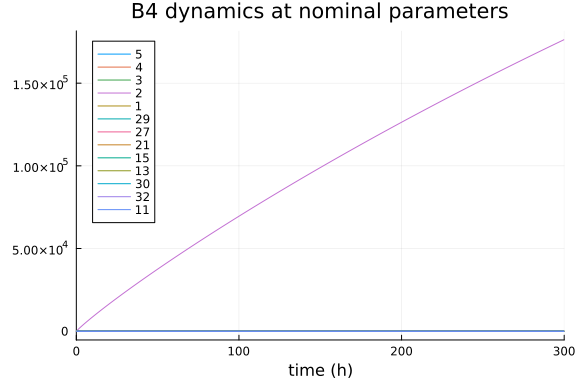
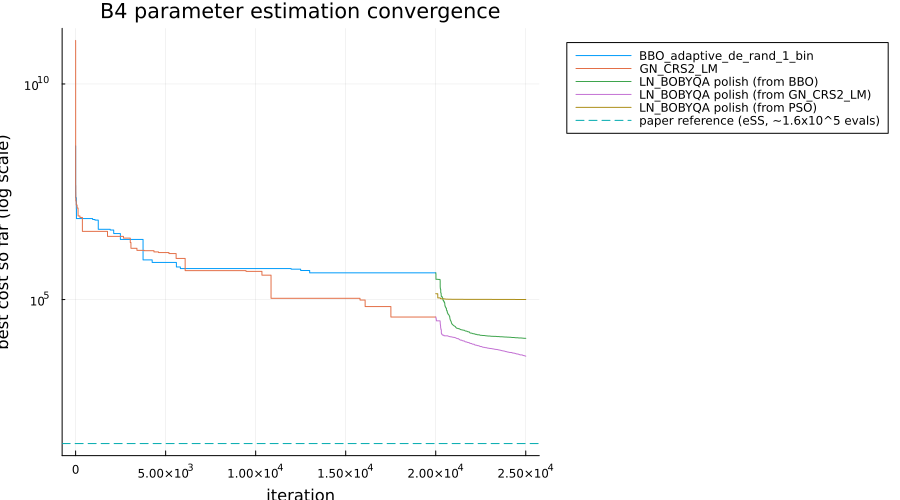
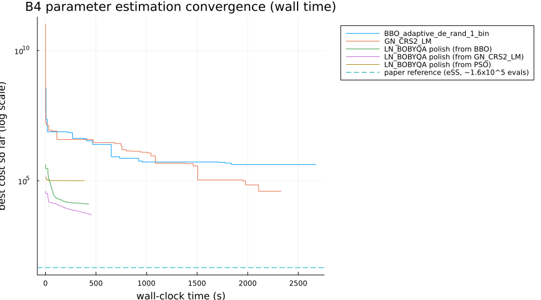

# Parameter estimation of a Chinese Hamster Ovary (CHO) cell metabolic model

This benchmark implements problem **B4** from the
[BioPreDyn-bench suite](https://bmcsystbiol.biomedcentral.com/articles/10.1186/s12918-015-0144-4)
(Villaverde et al. 2015), addressing
[SciMLBenchmarks.jl#555](https://github.com/SciML/SciMLBenchmarks.jl/issues/555). B4 is a
log-linear kinetic model of Chinese Hamster Ovary (CHO) cell metabolism during a batch
fermentation producing a recombinant protein: 35 states (34 metabolite concentrations
across the fermenter, cytosol, and mitochondrial compartments, plus the fermenter volume)
connected by 32 reactions, with 117 unknown kinetic (log-linear elasticity and Michaelis)
parameters. Unlike [B2](https://github.com/SciML/SciMLBenchmarks.jl/blob/master/benchmarks/ParameterEstimation/BioPreDynB2ParameterEstimation.jmd), which fits real experimental
data, B4 uses noised pseudo-data simulated from the model's own nominal parameters — 13
metabolites sampled at 12 unevenly spaced time points over a 300-hour fermentation.

The model equations, nominal parameters, parameter bounds, and simulated data below are
transcribed directly from the benchmark's official MATLAB/AMIGO2 implementation, available
as [supplementary material](https://pmc.ncbi.nlm.nih.gov/articles/PMC4342829/) to the paper
(Additional files 2-3, directory `BioPreDynBenchFiles/B4`).

```julia
using OrdinaryDiffEq, Optimization, ForwardDiff
using OptimizationBBO, OptimizationNLopt, Plots, BenchmarkTools, DataFrames
using ParallelParticleSwarms
gr(fmt = :png)
```

```
Plots.GRBackend()
```


## Model

States (in order; compartments: `f` fermenter, `c` cytosol, `m` mitochondria):
beta-D-glucose (`f`), L-lactate (`f`), L-leucine (`f`), L-methionine (`f`), the recombinant
product protein (`f`), L-glutamate (`m`), NAD (`m`), 2-oxoglutarate (`m`), NADH (`m`),
L-glutamine (`c`), ADP (`c`), L-glutamate (`c`), ATP (`c`), L-aspartate (`m`), oxaloacetate
(`m`), L-malate (`m`), the CoQH radical (`m`), extra-mitochondrial protons `H_out` (`m`),
CoQ (`m`), intra-mitochondrial protons `H_in` (`m`), pyruvate (`c`), phosphoenolpyruvate
(`c`), NADH (`c`), D-glycerate 3-phosphate (`c`), NAD (`c`), beta-D-glucose (`c`), L-malate
(`c`), 2-oxoglutarate (`c`), L-aspartate (`c`), ATP (`m`), orthophosphate (`m`), ADP (`m`),
L-leucine (`c`), L-methionine (`c`), and the fermenter volume.

All 32 reactions except `Subset4` (protein synthesis) use a log-linear (linlog) kinetic
form: rate = steady-state reference flux `rss` times one plus a sum of elasticity-weighted
log-concentration terms. `Subset4` instead uses a multi-substrate/product saturable
(generalized reversible Michaelis-Menten) rate law. States are tracked already normalized
by their steady-state reference concentrations `css` (so a value of 1.0 means "at the
reference level"), which is why the elasticity terms below use `log(c)` directly rather
than `log(c / css)`.

```julia
const b4_css = [
    100000.0, 1.0, 1000.0, 1000.0, 30.0, 1000.0, 1000.0, 1000.0, 1000.0, 1000.0,
    1000.0, 1000.0, 3000.0, 1000.0, 1000.0, 1000.0, 100.0, 100.0, 100.0, 100.0,
    1000.0, 1000.0, 1000.0, 1000.0, 1000.0, 1000.0, 1000.0, 1000.0, 1000.0, 3000.0,
    100000.0, 1000.0, 1000.0, 1000.0]

# steady-state reference fluxes (rss); vol_1/vol_2 is the cytosol/mitochondria volume
# fraction ratio applied to reactions that straddle both compartments
const b4_vol1 = 0.9
const b4_vol2 = 0.1
const b4_rss = [
    83401.9654177705, 127877.37232994902, 603.4140712332287, 603.4140712332287,
    5.028450593613567, 2413.6562849217303 * b4_vol1 / b4_vol2, 603.414071180172,
    40133.38664791273 * b4_vol1 / b4_vol2, 74836.04665510054 * b4_vol1 / b4_vol2,
    180754.26889005644 * b4_vol1 / b4_vol2, 164390.2745505474, 36512.902220891134,
    166803.93083553354, 39529.972576829896, 1810.242213701644, 127877.37232994902,
    166200.51676427448, 216060.34296802033 * b4_vol1 / b4_vol2, 5.028450593613567,
    35306.0740779408 * b4_vol1 / b4_vol2, 0.0, 532531.1670427525, 38926.55850561767,
    40133.38664808034, 689982.1797742102, 495414.85075147304 * b4_vol1 / b4_vol2,
    2413.6562849329107, 83401.9654177705, 603.4140712332287, 603.4140712332287,
    2413.656284931604, 533134.5811139438]

# maps the 117 estimated parameters onto the 128-entry elasticity vector `e` used by the
# rate laws below; a handful of `e` entries are fixed constants rather than estimated
# (mirroring the AMIGO reference implementation's index bookkeeping exactly), and several
# more are the negative of an estimated (always-positive, bound-constrained) parameter,
# since AMIGO stores every parameter's magnitude but the sign is fixed by its role
# (substrate/activator elasticities are positive, product/inhibitor elasticities negative).
function b4_expand_params(p)
    e = zeros(eltype(p), 128)
    for i in 1:8
        e[i] = p[i]
    end
    e[9] = 0.0
    e[10] = 1.0
    e[11] = 0.0
    e[12] = 0.0
    e[13] = 1.0
    for i in 9:35
        e[i + 5] = p[i]
    end
    e[41] = 0.0
    for i in 36:41
        e[i + 6] = p[i]
    end
    e[48] = 0.0
    for i in 42:83
        e[i + 7] = p[i]
    end
    e[91] = 0.0
    e[92] = 0.0
    e[93] = p[84]
    e[94] = 0.7
    e[95] = -0.2
    for i in 85:117
        e[i + 11] = p[i]
    end

    for (ei, pi) in (
            (16, 11), (17, 12), (20, 15), (21, 16), (24, 19), (25, 20), (29, 24),
            (30, 25), (34, 29), (35, 30), (36, 31), (39, 34), (40, 35), (45, 39),
            (46, 40), (49, 42), (52, 45), (53, 46), (55, 48), (56, 49), (57, 50),
            (61, 54), (62, 55), (63, 56), (65, 58), (69, 62), (70, 63), (71, 64),
            (74, 67), (75, 68), (77, 70), (80, 73), (81, 74), (87, 80), (88, 81),
            (89, 82), (90, 83), (93, 84), (98, 87), (99, 88), (102, 91), (103, 92),
            (106, 95), (107, 96), (109, 98), (113, 102), (114, 103), (117, 106),
            (119, 108), (121, 110), (123, 112), (125, 114), (127, 116), (128, 117),
        )
        e[ei] = -p[pi]
    end
    return e
end

function b4_kinetics!(du, c, p, t)
    e = b4_expand_params(p)
    css = b4_css

    clogk = ntuple(i -> c[i] < 0 ? zero(c[i]) : log(c[i]), 35)
    cap = ntuple(_ -> 1.0, 32) # AMIGO's per-reaction "capacity" scaling; always 1 here

    r = zeros(eltype(c), 32)
    r[6] = cap[6] * (b4_rss[6] * (1.0 + (((e[14] * clogk[8]) + (e[15] * clogk[9])) +
                                          ((e[16] * clogk[6]) + (e[17] * clogk[7])))))
    r[7] = cap[7] * (b4_rss[7] * (1.0 + (((e[18] * clogk[12]) + (e[19] * clogk[13])) +
                                          ((e[20] * clogk[10]) + (e[21] * clogk[11])))))
    r[8] = cap[8] * (b4_rss[8] * (1.0 + ((((e[22] * clogk[15]) + (e[23] * clogk[6])) +
                                           ((e[24] * clogk[8]) + (e[25] * clogk[14]))) +
                                          (e[26] * clogk[16]))))
    r[9] = cap[9] * (b4_rss[9] * (1.0 + (((e[27] * clogk[16]) + (e[28] * clogk[7])) +
                                          ((e[29] * clogk[15]) + (e[30] * clogk[9])))))
    r[10] = cap[10] * (b4_rss[10] * (1.0 + ((((e[31] * clogk[9]) + (e[32] * clogk[19])) +
                                              (e[33] * clogk[20])) +
                                             (((e[34] * clogk[7]) + (e[35] * clogk[17])) +
                                              (e[36] * clogk[18])))))
    r[11] = cap[11] * (b4_rss[11] * (1.0 + ((((e[37] * clogk[22]) + (e[38] * clogk[11])) +
                                              ((e[39] * clogk[21]) + (e[40] * clogk[13]))) +
                                             (e[41] * clogk[13]))))
    r[12] = cap[12] * (b4_rss[12] * (1.0 + (((((((e[42] * clogk[15]) + (e[43] * clogk[7])) +
                                                 (e[44] * clogk[21])) +
                                                ((e[45] * clogk[8]) + (e[46] * clogk[9]))) +
                                               (e[47] * clogk[32])) + (e[48] * clogk[9])) +
                                              (e[49] * clogk[30]))))
    r[13] = cap[13] * (b4_rss[13] * (1.0 + (((((((e[50] * clogk[25]) + (e[51] * clogk[26])) +
                                                 ((e[52] * clogk[23]) + (e[53] * clogk[24]))) +
                                                (e[54] * clogk[11])) + (e[55] * clogk[11])) +
                                              (e[56] * clogk[13])) + (e[57] * clogk[22]))))
    r[14] = cap[14] * (b4_rss[14] * (1.0 + ((((((e[58] * clogk[28]) + (e[59] * clogk[29])) +
                                                (e[60] * clogk[23])) +
                                               (((e[61] * clogk[12]) + (e[62] * clogk[27])) +
                                                (e[63] * clogk[25]))) + (e[64] * clogk[27])) +
                                             (e[65] * clogk[10]))))
    r[15] = cap[15] * (b4_rss[15] * (1.0 + ((((e[66] * clogk[32]) + (e[67] * clogk[22])) +
                                              (e[68] * clogk[16])) +
                                             (((e[69] * clogk[15]) + (e[70] * clogk[30])) +
                                              (e[71] * clogk[27])))))
    r[16] = cap[16] * (b4_rss[16] * (1.0 + (((e[72] * clogk[21]) + (e[73] * clogk[23])) +
                                             ((e[74] * clogk[2]) + (e[75] * clogk[25])))))
    r[17] = cap[17] * (b4_rss[17] * (1.0 + ((e[76] * clogk[24]) + (e[77] * clogk[22]))))
    r[18] = cap[18] * (b4_rss[18] * (1.0 + (((e[78] * clogk[20]) + (e[79] * clogk[17])) +
                                             ((e[80] * clogk[18]) + (e[81] * clogk[19])))))

    # Subset4 (protein synthesis): a generalized reversible Michaelis-Menten rate law
    # with 8 participating substrates/products, unlike every other (log-linear) reaction
    # above. `e[1..8]` here are the Km_Subset4_* parameters (raw `p[1..8]`, unmodified by
    # `b4_expand_params`). Written as a loop over the 8 (state, Km) pairs instead of
    # AMIGO's manually unrolled product -- algebraically identical, since the terms all
    # commute under multiplication.
    subset4_idx = (24, 25, 12, 33, 34, 29, 10, 13)
    num_ss = one(eltype(c))
    den_ss = one(eltype(c))
    num_c = one(eltype(c))
    den_c = one(eltype(c))
    for (j, idx) in enumerate(subset4_idx)
        tss = css[idx] / e[j]
        tc = (c[idx] * css[idx]) / e[j]
        num_ss *= tss
        den_ss *= (1.0 + tss)
        num_c *= tc
        den_c *= (1.0 + tc)
    end
    r[19] = cap[19] * (b4_rss[19] * den_ss / num_ss) * (num_c / den_c)

    r[20] = cap[20] * (b4_rss[20] * (1.0 + (((((((( (e[82] * clogk[8]) + (e[83] * clogk[7])) +
                                                     (e[84] * clogk[19])) +
                                                    (e[85] * clogk[31])) + (e[86] * clogk[32])) +
                                                 ((((e[87] * clogk[16]) + (e[88] * clogk[9])) +
                                                   (e[89] * clogk[17])) + (e[90] * clogk[30]))) +
                                               (e[91] * clogk[31])) + (e[92] * clogk[9])) +
                                             (e[93] * clogk[15]))))
    r[21] = cap[21] * (b4_rss[21] * (1.0 + ((e[94] * clogk[18]) + (e[95] * clogk[20]))))
    r[22] = cap[22] * (b4_rss[22] * (1.0 + (((e[96] * clogk[11]) + (e[97] * clogk[30])) +
                                             ((e[98] * clogk[32]) + (e[99] * clogk[13])))))
    r[23] = cap[23] * (b4_rss[23] * (1.0 + (((e[100] * clogk[8]) + (e[101] * clogk[27])) +
                                             ((e[102] * clogk[28]) + (e[103] * clogk[16])))))
    r[24] = cap[24] * (b4_rss[24] * (1.0 + (((e[104] * clogk[14]) + (e[105] * clogk[12])) +
                                             ((e[106] * clogk[29]) + (e[107] * clogk[6])))))
    r[25] = cap[25] * (b4_rss[25] * (1.0 + ((e[108] * clogk[13]) + (e[109] * clogk[11]))))
    r[26] = cap[26] * (b4_rss[26] * (1.0 + ((((e[110] * clogk[32]) + (e[111] * clogk[31])) +
                                              (e[112] * clogk[18])) +
                                             ((e[113] * clogk[30]) + (e[114] * clogk[20])))))
    r[27] = cap[27] * (b4_rss[27] * (1.0 + (((e[115] * clogk[27]) + (e[116] * clogk[31])) +
                                             (e[117] * clogk[16]))))
    r[28] = cap[28] * (b4_rss[28] * (1.0 + ((e[118] * clogk[1]) + (e[119] * clogk[26]))))
    r[29] = cap[29] * (b4_rss[29] * (1.0 + ((e[120] * clogk[3]) + (e[121] * clogk[33]))))
    r[30] = cap[30] * (b4_rss[30] * (1.0 + ((e[122] * clogk[4]) + (e[123] * clogk[34]))))
    r[31] = cap[31] * (b4_rss[31] * (1.0 + ((e[124] * clogk[6]) + (e[125] * clogk[12]))))
    r[32] = cap[32] * (b4_rss[32] * (1.0 + ((e[126] * clogk[18]) +
                                             ((e[127] * clogk[31]) + (e[128] * clogk[20])))))

    vol_1, vol_2 = b4_vol1, b4_vol2

    # fermenter feed is only active for 5 < t < 10 in the reference implementation, but at
    # a feed rate of exactly 0 -- the fermenter volume (and hence the dilution terms below)
    # is therefore constant. Kept for fidelity to the reference model.
    du[35] = 0.0
    du[1] = (-r[28] / 141.4710605 - c[1] * css[1] / c[35] * du[35]) / css[1]
    du[2] = (r[16] / 141.4710605 - c[2] * css[2] / c[35] * du[35]) / css[2]
    du[3] = (-r[29] / 141.4710605 - c[3] * css[3] / c[35] * du[35]) / css[3]
    du[4] = (-r[30] / 141.4710605 - c[4] * css[4] / c[35] * du[35]) / css[4]
    du[5] = (r[19] / 141.4710605 - c[5] * css[5] / c[35] * du[35]) / css[5]
    du[6] = (r[6] - r[8] + r[24] * vol_1 / vol_2 - r[31] * vol_1 / vol_2) / css[6]
    du[7] = (r[6] - r[9] + r[10] - 2.0 * r[12] * vol_1 / vol_2 - r[20]) / css[7]
    du[8] = (-r[6] + r[8] + r[12] * vol_1 / vol_2 - r[20] - r[23] * vol_1 / vol_2) / css[8]
    du[9] = (-r[6] + r[9] - r[10] + 2.0 * r[12] * vol_1 / vol_2 + r[20]) / css[9]
    du[10] = (r[7] - 120.0 * r[19]) / css[10]
    du[11] = (r[7] - r[11] + 1260.0 * r[19] - r[22] + r[25]) / css[11]
    du[12] = (-r[7] + r[14] - 240.0 * r[19] - r[24] + r[31]) / css[12]
    du[13] = (-r[7] + r[11] - 1260.0 * r[19] + r[22] - r[25]) / css[13]
    du[14] = (r[8] - r[24] * vol_1 / vol_2) / css[14]
    du[15] = (-r[8] + r[9] - r[12] * vol_1 / vol_2 + r[15] * vol_1 / vol_2) / css[15]
    du[16] = (-r[9] - r[15] * vol_1 / vol_2 + r[20] + r[23] * vol_1 / vol_2 +
              r[27] * vol_1 / vol_2) / css[16]
    du[17] = (2.0 * r[10] - 2.0 * r[18] + 2.0 * r[20]) / css[17]
    du[18] = (4.0 * r[10] + 6.0 * r[18] - r[21] - 3.0 * r[26] - r[32] * vol_1 / vol_2) /
             css[18]
    du[19] = (-2.0 * r[10] + 2.0 * r[18] - 2.0 * r[20]) / css[19]
    du[20] = (-4.0 * r[10] - 6.0 * r[18] + r[21] + 3.0 * r[26] + r[32] * vol_1 / vol_2) /
             css[20]
    du[21] = (r[11] - r[12] - r[16]) / css[21]
    du[22] = (-r[11] - r[15] + r[17]) / css[22]
    du[23] = (r[13] - r[14] - r[16] + 120.0 * r[19]) / css[23]
    du[24] = (r[13] - r[17] - 120.0 * r[19]) / css[24]
    du[25] = (-r[13] + r[14] + r[16] - 120.0 * r[19]) / css[25]
    du[26] = (-0.5 * r[13] + r[28]) / css[26]
    du[27] = (r[14] + r[15] - r[23] - r[27]) / css[27]
    du[28] = (-r[14] + 120.0 * r[19] + r[23]) / css[28]
    du[29] = (-r[14] - 120.0 * r[19] + r[24]) / css[29]
    du[30] = (r[15] * vol_1 / vol_2 + r[20] - r[22] * vol_1 / vol_2 + r[26]) / css[30]
    du[31] = (-r[20] - r[26] - r[27] * vol_1 / vol_2 + r[32] * vol_1 / vol_2) / css[31]
    du[32] = (-r[15] * vol_1 / vol_2 - r[20] + r[22] * vol_1 / vol_2 - r[26]) / css[32]
    du[33] = (-120.0 * r[19] + r[29]) / css[33]
    du[34] = (-120.0 * r[19] + r[30]) / css[34]
    nothing
end
```

```
b4_kinetics! (generic function with 1 method)
```


## Nominal parameters, bounds, and initial condition

The 117 parameters are, in order: 8 Michaelis constants for the `Subset4` protein-synthesis
reaction (`Km_Subset4_*`, for D-glycerate-3P, NAD, glutamate, leucine, methionine,
aspartate, glutamine, and ATP, all in cytosol), followed by 109 log-linear elasticities for
the remaining 31 reactions (each named `e_substrate`/`e_product`/`e_activator`/`e_inhibitor`
by the reaction and species it belongs to in the AMIGO reference source). Bounds are a
factor of 5 below/above the nominal value for every parameter.

```julia
p_nom = [
    1000.0, 1000.0, 1000.0, 1000.0, 1000.0, 1000.0, 1000.0, 1000.0, 1.0, 1.0, 0.7, 0.7,
    0.7, 0.7, 0.2, 0.2, 1.0, 1.0, 0.7, 0.7, 0.05, 1.0, 0.5, 0.7, 0.5, 2.0, 0.7, 0.7, 2.0,
    0.2, 0.2, 1.0, 0.7, 0.2, 0.21, 1.0, 0.7, 1.0, 0.2, 0.2, 0.05, 0.01, 0.7, 1.0, 0.5, 1.0,
    0.04, 0.01, 0.01, 0.01, 1.0, 1.0, 0.5, 1.0, 1.0, 0.5, 0.1, 0.1, 0.5, 1.0, 1.0, 1.0, 0.3,
    1.0, 1.0, 0.7, 0.4, 0.7, 1.0, 0.7, 0.7, 2.0, 0.2, 2.0, 1.0, 0.7, 0.7, 0.2, 0.7, 0.5,
    0.21, 0.2, 0.2, 0.01, 2.0, 2.0, 2.0, 2.0, 2.0, 2.0, 2.0, 2.0, 1.0, 1.0, 1.0, 1.0, 1.0,
    0.5, 0.7, 0.7, 2.0, 0.2, 2.0, 1.0, 1.0, 0.7, 1.0, 0.7, 1.0, 0.7, 1.0, 0.7, 2.0, 2.0, 0.7,
    0.2, 0.2]

p_lower = p_nom ./ 5
p_upper = p_nom .* 5

# a fixed initial guess distinct from the nominal parameters, taken directly from the
# benchmark's own `b4_bounds.mat`. The reference implementation explicitly warns against
# using the nominal parameters as the optimization starting point, since recovering them
# from a different guess is the point of the exercise, so (unlike this folder's other
# BioPreDyn-bench benchmark, B2, whose reference setup has no such restriction) we start
# optimization from this point instead of from `p_nom`.
p_start = [
    559.246183586727, 951.8526159783388, 1209.3926423296261, 1108.2411804507406,
    1131.8844697068953, 614.8098822286546, 693.4962891662825, 756.8581555974563,
    1.1618334014402798, 1.010360100180178, 0.6874899615341215, 1.0042191933785871,
    0.6420942544552156, 0.7963352463317699, 0.251259801109437, 0.21169093679552325,
    1.128819668117032, 1.2148062169753862, 0.5550645201598408, 0.7885095239226643,
    0.0716151015376954, 0.6822024241425708, 0.4439305029548263, 0.555274158152172,
    0.5422120602672525, 1.7269813402785503, 0.6442439212775087, 1.0044963464600916,
    1.8310696571959042, 0.2695166078706759, 0.21912758579110164, 0.5196983631758563,
    1.0173514455706194, 0.2645786406646756, 0.29513807176327145, 1.074909052745588,
    0.38718147238096434, 0.7158240994061267, 0.21184210019886696, 0.15959491343921442,
    0.06846293053544839, 0.007682552400632342, 0.9695076945059595, 0.7798099216337468,
    0.2777873319493819, 1.122789527159203, 0.021740120977325465, 0.011341759897234783,
    0.01095767461148841, 0.012242399769196301, 0.733778133275873, 0.8400273052741705,
    0.28490418578462706, 1.0804765014375879, 0.5593299283267159, 0.2627912987262461,
    0.07498598954796754, 0.061907330786564796, 0.26773767481968, 0.7289397586656472,
    1.4019935413749123, 0.5233697368046363, 0.39393756786208023, 0.9461802947619279,
    1.4361566955705485, 0.5724627510264765, 0.5766001030478425, 0.5947799645609589,
    1.1145113324366538, 0.538400339185408, 0.998265898794248, 1.3488341531122623,
    0.1341520669763673, 2.295993105129317, 1.1740131819235997, 0.9435308639264697,
    0.3872582502696485, 0.13194624230468477, 0.6069057535685372, 0.38476369751245376,
    0.2538709132488072, 0.17104939996228308, 0.250647137649718, 0.010910354043587226,
    1.326619209465763, 2.0092983707023944, 1.8933925033966557, 2.144119804894699,
    1.0420838393148957, 2.902406882331043, 2.1977421761971287, 1.975812719036163,
    1.4586895089103473, 1.4936210103484457, 0.64402021343644, 0.634129763871874,
    1.3541757134464245, 0.3388126779599871, 0.5391033859006893, 0.8575049977994068,
    1.0646059748143037, 0.28664633803157213, 1.3726629930823835, 0.954835879225296,
    0.9816520738173586, 0.5123831799652268, 1.4082199137925364, 0.4684683476985062,
    1.3268735896615724, 0.9411624153376564, 0.961002381260504, 0.639646441106458,
    1.2299527260165495, 1.9534697095422526, 0.5795627195075416, 0.17739683892594194,
    0.2063468961527426]

u0 = vcat([5.0, 1.0, 5.0, 5.0], ones(30), [6.0])
tspan = (0.0, 300.0)
prob = ODEProblem(b4_kinetics!, u0, tspan, p_nom)
```

```
ODEProblem with uType Vector{Float64} and tType Float64. In-place: true
Non-trivial mass matrix: false
timespan: (0.0, 300.0)
u0: 35-element Vector{Float64}:
 5.0
 1.0
 5.0
 5.0
 1.0
 1.0
 1.0
 1.0
 1.0
 1.0
 ⋮
 1.0
 1.0
 1.0
 1.0
 1.0
 1.0
 1.0
 1.0
 6.0
```


## Simulated experimental data

13 metabolites sampled at 12 time points (plus the initial condition, not used in the
objective below), as simulated and noised in the original AMIGO benchmark. Each column's
associated standard deviation (used to weight the residuals) is given alongside it.

```julia
b4_state_idxs = [5, 4, 3, 2, 1, 29, 27, 21, 15, 13, 30, 32, 11]
b4_divisors = [30.0, 1000.0, 1000.0, 1.0, 100000.0, 1000.0, 1000.0, 1000.0, 1000.0,
    3000.0, 3000.0, 1000.0, 1000.0]

b4_times = [0.0, 23.9759, 48.4337, 72.8916, 90.3614, 115.984, 140.442, 164.9, 210.321,
    233.614, 258.072, 282.53, 300.0]

# columns: Productprotein_f, L-Methionine_f, L-Leucine_f, L-Lactate_f, beta-D-Glucose_f,
# L-Aspartate_c, L-Malate_c, Pyruvate_c, Oxaloacetate_m, ATP_c, ATP_m, ADP_m, ADP_c
b4_data = [
    29.54174187 5110.119691 4999.956639 1.056682831 449958.4343 1009.945764 988.3517969 996.1405443 839.7703035 3314.558385 2968.296835 1016.447754 1029.663149
    29.06135825 4427.537773 4990.471667 19033.05068 499628.9405 514.889607 1883.981851 4115.730274 443.5222307 3298.082924 3588.716676 701.1769714 841.6656476
    31.56920926 4649.633023 4706.446115 29713.37459 498137.7445 614.0882509 1999.234422 5088.17481 457.2654501 3144.678363 3524.003949 534.3245626 898.4469128
    32.58992629 4642.175831 4703.420191 52653.84782 469436.4399 667.144403 1977.174384 4941.17988 452.1008571 3343.981672 3274.933898 637.1604048 748.7508252
    32.93492455 4581.482695 4580.779761 62491.60793 458816.0559 706.4697945 2027.556359 5561.084132 416.1288178 3305.264733 3377.224218 608.6810043 760.8237877
    33.80995822 4231.998041 4576.568758 71665.49964 441725.8779 748.837145 1834.640732 4711.566421 433.6235068 2664.13707 3359.281519 608.5031107 746.0614226
    34.67192676 4609.073999 4388.444795 93744.69241 371353.6441 761.4219172 1741.34438 4466.968205 471.9681186 3276.842196 3268.007202 609.2855454 770.8013591
    35.64086504 4379.397091 4823.258118 96012.12538 409872.6888 913.9581526 2054.553359 4841.62543 462.4384044 3326.232934 3375.331315 657.6144762 747.1622156
    35.1073701 4047.37735 4757.799632 131633.9417 429309.5792 838.4429003 2023.441102 4741.87247 463.3431076 2838.535673 3344.113884 606.0191858 696.1165299
    34.78766884 4354.532227 4267.505383 139701.0391 377830.4707 864.115653 2012.727053 4982.305375 451.6411544 3445.146289 3384.49464 596.595147 747.4997328
    35.10275329 3893.078648 3946.812817 156106.4324 376607.9654 1019.41341 2077.935601 4932.876021 432.2633547 3185.845081 3123.317817 606.9552722 742.2563724
    39.16229127 4223.934695 4229.786474 189350.8377 350136.0051 945.7524046 2018.02482 4965.805674 459.569613 3248.126308 3303.223152 634.2843344 740.5121927
    39.36873083 3819.952372 3226.591797 170253.9838 362466.0386 962.815767 2167.954632 4922.316021 461.1326466 3189.167366 3335.671338 664.509921 757.3732437]

b4_stdev = [
    0.916516259 220.2393825 0.086722941 0.113365662 100083.1314 19.8915281 23.29640617 7.718911471 320.4593929 629.11677 63.40633065 32.89550786 59.32629796
    3.42708349 859.4844544 266.3833335 524.0986472 27089.88103 72.52278599 1.363702921 13.17945154 67.9675385 110.2258472 512.6933529 67.11194286 169.2792952
    0.072781474 197.1939541 83.56777088 13530.25082 50101.48902 8.871498249 109.6688443 1402.38962 25.79309975 208.3432738 361.1878982 244.5448747 294.6078256
    0.345652583 11.22833874 111.2603823 145.6956478 17694.8798 11.00519392 1.408768357 800.1597591 29.84428584 184.2633444 149.0122046 26.80319038 1.191650429
    0.103150906 5.585389682 4.179521469 2222.584132 13862.11186 0.953588928 72.01271842 1881.128264 99.10036436 104.3694651 49.86843658 78.08799131 27.79957543
    0.003516434 495.8039179 193.3375168 15030.00072 4663.755834 0.759709907 343.8585363 3.332842875 61.44498639 1179.74586 8.403037386 72.83977854 0.150845275
    0.186053515 442.6879971 1.429589001 515.5848117 112764.7117 48.67616557 548.4312396 616.2835899 16.98823721 45.18439211 177.4455966 67.99290924 50.07871826
    0.604730081 164.3741824 1052.096236 22589.74924 12874.62245 190.2563052 67.32671764 29.79086077 0.791191271 144.5058684 35.34263088 30.52495245 2.300431195
    3.228859795 170.8252992 1250.019264 372.1165486 67335.15833 70.03419938 0.977796603 311.3950597 2.654215273 828.1886549 27.87223266 71.86362837 102.5249403
    5.262062329 608.8844539 434.830766 8311.921766 14941.05855 69.51269399 20.40589406 115.4107506 20.1576913 387.132577 53.48928055 91.2997059 1.854534475
    6.079093429 142.482705 35.01436682 49.13512714 3973.930766 190.684819 114.9912025 29.80795876 58.42129056 128.8298377 467.6643662 71.7674556 14.94525519
    0.608382544 688.7293909 700.4329474 42607.67548 27959.98971 4.487190854 2.669639537 1.328651269 3.420773959 1.32738423 106.1736951 18.79533114 21.39761464
    0.008461654 0.624744428 1186.096406 12180.03246 11498.07728 3.204466046 309.209264 110.2279582 0.074706795 116.9052678 39.83732302 40.18584194 10.01248736]
```

```
13×13 Matrix{Float64}:
 0.916516    220.239        0.0867229  …   63.4063    32.8955   59.3263
 3.42708     859.484      266.383         512.693     67.1119  169.279
 0.0727815   197.194       83.5678        361.188    244.545   294.608
 0.345653     11.2283     111.26          149.012     26.8032    1.19165
 0.103151      5.58539      4.17952        49.8684    78.088    27.7996
 0.00351643  495.804      193.338      …    8.40304   72.8398    0.150845
 0.186054    442.688        1.42959       177.446     67.9929   50.0787
 0.60473     164.374     1052.1            35.3426    30.525     2.30043
 3.22886     170.825     1250.02           27.8722    71.8636  102.525
 5.26206     608.884      434.831          53.4893    91.2997    1.85453
 6.07909     142.483       35.0144     …  467.664     71.7675   14.9453
 0.608383    688.729      700.433         106.174     18.7953   21.3976
 0.00846165    0.624744  1186.1            39.8373    40.1858   10.0125
```


## Objective function

The objective is a weighted least-squares cost comparing the 13 tracked states (scaled by
their reference concentrations) against the simulated data above, reproduced here exactly
from the AMIGO2 script `b4_obj.m`.

```julia
function biopredyn_b4_cost(p)
    # Away from the nominal parameters, global optimizers routinely probe combinations
    # that make this stiff log-linear model numerically unstable; `maxiters` bounds how
    # long a single doomed integration can spend retrying ever-smaller steps before giving
    # up (returning a non-`Success` retcode) rather than a full search-budget iteration
    # spent uselessly on it.
    sol = solve(prob, Rodas5P(), p = p, reltol = 1e-6, abstol = 1e-6, maxiters = 10_000)
    sol.retcode == ReturnCode.Success || return 1e20

    simvals = Array(sol(b4_times))[b4_state_idxs, 2:end]' # (12 times) x (13 observables)
    data = b4_data[2:end, :] ./ b4_divisors'
    err = b4_stdev[2:end, :] ./ b4_divisors'
    cost = sum(((simvals .- data) ./ err) .^ 2)
    return isfinite(cost) ? cost : 1e20
end
```

```
biopredyn_b4_cost (generic function with 1 method)
```


```julia
@time cost_nominal = biopredyn_b4_cost(p_nom)
@time cost_start = biopredyn_b4_cost(p_start)
```

```
4.445714 seconds (8.51 M allocations: 444.963 MiB, 5.59% gc time, 95.83% 
compilation time)
  0.113636 seconds (883.88 k allocations: 53.430 MiB, 23.57% gc time)
1.0213152934777013e11
```


The original study reports reaching a cost of `Jf ≈ 45.718` using the enhanced scatter
search (eSS) global optimizer after ~1.6·10⁵ function evaluations (about 1 hour of CPU
time), starting from a random point inside the bounds -- since this benchmark's simulated
data was itself generated from `p_nom`, recovering it (rather than merely improving on the
initial guess) is the actual goal of the exercise.

## Visualizing the fit at nominal and starting parameters

```julia
sol_nom = solve(prob, Rodas5P(), p = p_nom, reltol = 1e-6, abstol = 1e-6)
plot(sol_nom, idxs = b4_state_idxs, label = permutedims(string.(b4_state_idxs)),
    xlabel = "time (h)", title = "B4 dynamics at nominal parameters")
```




## Parameter estimation

We benchmark global optimizers on this 117-parameter problem, starting from `p_start`
(not `p_nom`, per the reference implementation's guidance -- see above) and using the
bounds given above. As with B2, we include `BBO_adaptive_de_rand_1_bin`,
`GN_CRS2_LM`, and `ParallelPSOArray` from
[ParallelParticleSwarms.jl](https://github.com/SciML/ParallelParticleSwarms.jl). Each
trackable optimizer's raw per-evaluation cost is recorded via a callback, from which we
compute the running best-found cost for a convergence plot; `ParallelPSOArray` does not
yet support the `callback` keyword, so only its final result is available.

```julia
optf = OptimizationFunction((p, _) -> biopredyn_b4_cost(p))
optprob = OptimizationProblem(optf, p_start, lb = p_lower, ub = p_upper)
```

```
OptimizationProblem. In-place: true
u0: 117-element Vector{Float64}:
  559.246183586727
  951.8526159783388
 1209.3926423296261
 1108.2411804507406
 1131.8844697068953
  614.8098822286546
  693.4962891662825
  756.8581555974563
    1.1618334014402798
    1.010360100180178
    ⋮
    1.3268735896615724
    0.9411624153376564
    0.961002381260504
    0.639646441106458
    1.2299527260165495
    1.9534697095422526
    0.5795627195075416
    0.17739683892594194
    0.2063468961527426
```


```julia
losses_bbo = Float64[]
times_bbo = Float64[]
t0_bbo = time()
cb_bbo = (state, l) -> (push!(losses_bbo, l); push!(times_bbo, time() - t0_bbo); false)
@time res_bbo = solve(
    optprob, BBO_adaptive_de_rand_1_bin(), maxiters = 20000, callback = cb_bbo)
res_bbo.objective
```

```
2676.126785 seconds (17.98 G allocations: 1.034 TiB, 30.28% gc time, 0.16% 
compilation time: 2% of which was recompilation)
416221.77394569863
```


```julia
losses_nlopt = Float64[]
times_nlopt = Float64[]
t0_nlopt = time()
cb_nlopt = (state, l) -> (push!(losses_nlopt, l); push!(times_nlopt, time() - t0_nlopt); false)
opt = Opt(:GN_CRS2_LM, length(p_nom))
@time res_nlopt = solve(optprob, opt, maxiters = 20000, callback = cb_nlopt)
res_nlopt.objective
```

```
2330.117770 seconds (15.77 G allocations: 929.177 GiB, 29.99% gc time, 0.03
% compilation time)
39335.1247398095
```


```julia
n_particles = 40
@time res_pso = solve(optprob, ParallelPSOArray(n_particles), maxiters = 12000 ÷ n_particles)
res_pso.objective
```

```
721.447994 seconds (7.10 G allocations: 418.732 GiB, 84.61% gc time, 10.96%
 compilation time)
136826.75803694568
```


## Local refinement

Global metaheuristics are good at finding a promising basin but slow to fine-tune within
it; the original study's own eSS method is itself a *hybrid* global+local algorithm for
exactly this reason. We polish each of the three global results above with `LN_BOBYQA`
(derivative-free).

```julia
function polish(start_u, label)
    prob = OptimizationProblem(optf, start_u, lb = p_lower, ub = p_upper)
    losses = Float64[]
    times = Float64[]
    t0 = time()
    cb = (state, l) -> (push!(losses, l); push!(times, time() - t0); false)
    t = @elapsed res = solve(
        prob, Opt(:LN_BOBYQA, length(p_nom)), maxiters = 5000, callback = cb)
    println(label, ": ", res.objective, " (", t, "s)")
    return res, losses, times
end

res_bbo_polish, losses_bbo_polish, times_bbo_polish = polish(res_bbo.u, "BBO -> LN_BOBYQA")
res_nlopt_polish, losses_nlopt_polish, times_nlopt_polish = polish(
    res_nlopt.u, "GN_CRS2_LM -> LN_BOBYQA")
res_pso_polish, losses_pso_polish, times_pso_polish = polish(
    res_pso.u, "ParallelPSOArray -> LN_BOBYQA")
```

```
BBO -> LN_BOBYQA: 12615.610941542198 (428.191357277s)
GN_CRS2_LM -> LN_BOBYQA: 4860.8469565104615 (455.279459094s)
ParallelPSOArray -> LN_BOBYQA: 100279.91314284371 (386.276424977s)
(retcode: MaxIters
u: [4706.8004136385025, 4945.694312351054, 4983.078034136756, 1098.10274765
061, 4997.962864262581, 234.341548623231, 4997.022292338094, 4997.938512223
3425, 0.20071027792368218, 0.2548123861169181  …  3.496416766630741, 0.2058
10615722599, 3.499177145892805, 0.2, 1.9062474132873313, 0.4, 0.4, 1.252412
2015803727, 0.9891796104611845, 0.9949569752183459]
Final objective value:     100279.91314284371
, [136826.7580369613, 136827.92973035385, 136825.94458907383, 136829.863608
84225, 136874.3455165289, 136346.56288110005, 136193.38652244065, 136994.37
927781133, 136800.59737792515, 136854.64424323558  …  100288.42808982394, 1
00284.82422417466, 100283.43297178067, 100282.7248328378, 100282.0054609959
9, 100281.57543325916, 100282.06654246867, 100281.42066129575, 100280.08050
171129, 100279.91314284371], [0.05196690559387207, 0.1610708236694336, 0.21
457695960998535, 0.26717185974121094, 0.3773989677429199, 0.428752899169921
9, 0.49375295639038086, 0.6182918548583984, 0.67026686668396, 0.78568696975
70801  …  385.57228994369507, 385.6192820072174, 385.6777958869934, 385.815
3009414673, 385.8627099990845, 385.9155328273773, 386.05540585517883, 386.1
042559146881, 386.15128993988037, 386.2749660015106])
```


```julia
df = DataFrame(
    method = ["Nominal (true params)", "Starting guess (no fit)",
        "BBO_adaptive_de_rand_1_bin", "GN_CRS2_LM", "ParallelPSOArray",
        "LN_BOBYQA polish (from BBO)", "LN_BOBYQA polish (from GN_CRS2_LM)",
        "LN_BOBYQA polish (from ParallelPSOArray)"],
    cost = [cost_nominal, cost_start, res_bbo.objective, res_nlopt.objective,
        res_pso.objective, res_bbo_polish.objective, res_nlopt_polish.objective,
        res_pso_polish.objective])
```

```
8×2 DataFrame
 Row │ method                             cost
     │ String                             Float64
─────┼───────────────────────────────────────────────────
   1 │ Nominal (true params)                 39.0675
   2 │ Starting guess (no fit)                1.02132e11
   3 │ BBO_adaptive_de_rand_1_bin             4.16222e5
   4 │ GN_CRS2_LM                         39335.1
   5 │ ParallelPSOArray                       1.36827e5
   6 │ LN_BOBYQA polish (from BBO)        12615.6
   7 │ LN_BOBYQA polish (from GN_CRS2_L…   4860.85
   8 │ LN_BOBYQA polish (from ParallelP…      1.0028e5
```


## Convergence

```julia
bestcost_bbo = accumulate(min, losses_bbo)
bestcost_nlopt = accumulate(min, losses_nlopt)
bestcost_bbo_polish = accumulate(min, losses_bbo_polish)
bestcost_nlopt_polish = accumulate(min, losses_nlopt_polish)
bestcost_pso_polish = accumulate(min, losses_pso_polish)

bbo_polish_iters = length(losses_bbo) .+ (1:length(losses_bbo_polish))
nlopt_polish_iters = length(losses_bbo) .+ (1:length(losses_nlopt_polish))
pso_polish_iters = length(losses_bbo) .+ (1:length(losses_pso_polish))

plot(bestcost_bbo, label = "BBO_adaptive_de_rand_1_bin", yscale = :log10,
    xlabel = "iteration", ylabel = "best cost so far (log scale)",
    title = "B4 parameter estimation convergence", legend = :outertopright,
    size = (900, 500))
plot!(bestcost_nlopt, label = "GN_CRS2_LM")
plot!(bbo_polish_iters, bestcost_bbo_polish, label = "LN_BOBYQA polish (from BBO)")
plot!(nlopt_polish_iters, bestcost_nlopt_polish, label = "LN_BOBYQA polish (from GN_CRS2_LM)")
plot!(pso_polish_iters, bestcost_pso_polish, label = "LN_BOBYQA polish (from PSO)")
hline!([45.718], label = "paper reference (eSS, ~1.6x10^5 evals)", linestyle = :dash)
```




Iteration count alone hides that these optimizers have very different per-iteration costs,
so we also plot the same running-best costs against wall-clock seconds, with each curve
measured from its own start:

```julia
plot(times_bbo, bestcost_bbo, label = "BBO_adaptive_de_rand_1_bin", yscale = :log10,
    xlabel = "wall-clock time (s)", ylabel = "best cost so far (log scale)",
    title = "B4 parameter estimation convergence (wall time)", legend = :outertopright,
    size = (900, 500))
plot!(times_nlopt, bestcost_nlopt, label = "GN_CRS2_LM")
plot!(times_bbo_polish, bestcost_bbo_polish, label = "LN_BOBYQA polish (from BBO)")
plot!(times_nlopt_polish, bestcost_nlopt_polish, label = "LN_BOBYQA polish (from GN_CRS2_LM)")
plot!(times_pso_polish, bestcost_pso_polish, label = "LN_BOBYQA polish (from PSO)")
hline!([45.718], label = "paper reference (eSS, ~1.6x10^5 evals)", linestyle = :dash)
```




`ParallelPSOArray`'s own result isn't shown as a curve (no per-iteration history is
available, as noted above), but its polish curve starts from wherever `res_pso.objective`
landed, plotted alongside the other two polish curves for direct comparison.

# Conclusion

This benchmark demonstrates SciML's parameter estimation stack (`OrdinaryDiffEq` +
`Optimization.jl`) on BioPreDyn-bench B4, a 117-parameter, 35-state log-linear kinetic
model of CHO cell metabolism -- comparable in scale to
[B2](https://github.com/SciML/SciMLBenchmarks.jl/blob/master/benchmarks/ParameterEstimation/BioPreDynB2ParameterEstimation.jmd) but built from simulated rather than real data,
and with a different (log-linear/generalized-Michaelis-Menten) kinetic structure. Unlike
B2, recovering the *exact* nominal parameters (not just a low cost) is the benchmark's
actual goal, since the pseudo-data was generated from them; the runs here are best read as
relative comparisons between optimizers given a fixed, modest evaluation budget rather than
as fully converged fits to the literature reference of `Jf ≈ 45.718`.


## Appendix

These benchmarks are a part of the SciMLBenchmarks.jl repository, found at: [https://github.com/SciML/SciMLBenchmarks.jl](https://github.com/SciML/SciMLBenchmarks.jl). For more information on high-performance scientific machine learning, check out the SciML Open Source Software Organization [https://sciml.ai](https://sciml.ai).

To locally run this benchmark, do the following commands:
```
using SciMLBenchmarks
SciMLBenchmarks.weave_file("benchmarks/ParameterEstimation","BioPreDynB4ParameterEstimation.jmd")
```

Computer Information:

```
Julia Version 1.12.7
Commit 6d172b025e4 (2026-08-15 08:05 UTC)
Build Info:
  Official https://julialang.org release
Platform Info:
  OS: Linux (x86_64-linux-gnu)
  CPU: 128 × AMD EPYC 7502 32-Core Processor
  WORD_SIZE: 64
  LLVM: libLLVM-18.1.7 (ORCJIT, znver2)
  GC: Built with stock GC
Threads: 128 default, 1 interactive, 128 GC (on 128 virtual cores)
Environment:
  JULIA_NUM_THREADS = auto

```

Package Information:

```
Status `/julia/github-runners/amdci1-1/_work/SciMLBenchmarks.jl/SciMLBenchmarks.jl/benchmarks/ParameterEstimation/Project.toml`
  [6e4b80f9] BenchmarkTools v1.8.0
  [a134a8b2] BlackBoxOptim v0.6.12
  [a93c6f00] DataFrames v1.8.2
⌃ [1130ab10] DiffEqParamEstim v2.6.1
  [31c24e10] Distributions v0.25.131
  [f6369f11] ForwardDiff v1.4.6
⌃ [961ee093] ModelingToolkit v11.43.0
⌃ [7771a370] ModelingToolkitBase v1.70.0
  [76087f3c] NLopt v1.2.1
⌃ [7f7a1694] Optimization v5.9.0
  [3e6eede4] OptimizationBBO v0.4.12
  [4e6fcdb7] OptimizationNLopt v0.3.18
  [1dea7af3] OrdinaryDiffEq v7.8.1
  [ab63da0c] ParallelParticleSwarms v1.6.2
  [65888b18] ParameterizedFunctions v5.27.0
  [91a5bcdd] Plots v1.41.7
  [731186ca] RecursiveArrayTools v4.5.1
⌃ [91a8cdf1] SciCompDSL v1.0.3
  [31c91b34] SciMLBenchmarks v0.2.1 [loaded: `/julia/github-runners/amdci1-1/_work/SciMLBenchmarks.jl/SciMLBenchmarks.jl/src/SciMLBenchmarks.jl` (v0.2.1) expected `/home/crackauc/.julia/packages/SciMLBenchmarks/ceJyd/src/SciMLBenchmarks.jl` (v0.2.1)]
Info Packages marked with ⌃ have new versions available and may be upgradable.
```

And the full manifest:

```
Status `/julia/github-runners/amdci1-1/_work/SciMLBenchmarks.jl/SciMLBenchmarks.jl/benchmarks/ParameterEstimation/Manifest.toml`
  [47edcb42] ADTypes v1.24.0
  [14f7f29c] AMD v0.5.4
  [6e696c72] AbstractPlutoDingetjes v1.4.1
  [1520ce14] AbstractTrees v0.4.5
  [7d9f7c33] Accessors v0.1.45
⌃ [79e6a3ab] Adapt v4.7.0
  [66dad0bd] AliasTables v1.1.3
  [ec485272] ArnoldiMethod v0.4.0
⌃ [4fba245c] ArrayInterface v7.30.1
  [4c555306] ArrayLayouts v1.12.2
  [a9b6321e] Atomix v1.2.1
  [aae01518] BandedMatrices v1.12.0
  [6e4b80f9] BenchmarkTools v1.8.0
  [e2ed5e7c] Bijections v0.2.2
  [b2a6c25c] BinaryHeaps v1.1.0
  [caf10ac8] BipartiteGraphs v0.1.14
  [a134a8b2] BlackBoxOptim v0.6.12
  [8e7c35d0] BlockArrays v1.10.0
  [70df07ce] BracketingNonlinearSolve v1.12.7
  [fa961155] CEnum v0.5.0
  [d360d2e6] ChainRulesCore v1.26.1
  [35d6a980] ColorSchemes v3.31.0
  [3da002f7] ColorTypes v0.12.1
  [c3611d14] ColorVectorSpace v0.11.0
  [5ae59095] Colors v0.13.1
⌅ [861a8166] Combinatorics v1.0.2
  [38540f10] CommonSolve v0.2.14
  [bbf7d656] CommonSubexpressions v0.3.1
  [f70d9fcc] CommonWorldInvalidations v1.2.2
  [34da2185] Compat v4.18.1
  [b152e2b5] CompositeTypes v0.1.4
  [a33af91c] CompositionsBase v0.1.2
  [2569d6c7] ConcreteStructs v0.2.8
  [88cd18e8] ConsoleProgressMonitor v0.1.2
  [187b0558] ConstructionBase v1.6.0
  [d38c429a] Contour v0.6.3
  [a8cc5b0e] Crayons v4.2.0
  [9a962f9c] DataAPI v1.16.0
  [a93c6f00] DataFrames v1.8.2
  [864edb3b] DataStructures v0.19.6
  [e2d170a0] DataValueInterfaces v1.0.0
  [8bb1440f] DelimitedFiles v1.9.1
  [39dd38d3] Dierckx v0.5.4
  [2b5f629d] DiffEqBase v7.21.1
⌃ [459566f4] DiffEqCallbacks v4.19.3
⌃ [071ae1c0] DiffEqGPU v3.21.0
⌃ [1130ab10] DiffEqParamEstim v2.6.1
  [163ba53b] DiffResults v1.1.0
  [b552c78f] DiffRules v1.16.0
  [a0c0ee7d] DifferentiationInterface v0.7.21
  [31c24e10] Distributions v0.25.131
  [ffbed154] DocStringExtensions v0.9.5
⌃ [5b8099bc] DomainSets v0.8.1
  [7c1d4256] DynamicPolynomials v0.6.8
  [4e289a0a] EnumX v1.0.7
⌃ [7da242da] Enzyme v0.13.203
  [f151be2c] EnzymeCore v0.8.21
  [e2ba6199] ExprTools v0.1.11
  [55351af7] ExproniconLite v0.10.14
  [c87230d0] FFMPEG v0.4.5
  [7034ab61] FastBroadcast v1.4.0
  [9aa1b823] FastClosures v0.3.2
  [a4df4552] FastPower v1.5.0
  [1a297f60] FillArrays v1.17.0
⌃ [64ca27bc] FindFirstFunctions v3.2.1
  [6a86dc24] FiniteDiff v2.33.0
⌅ [53c48c17] FixedPointNumbers v0.8.6
  [1fa38f19] Format v1.3.7
  [f6369f11] ForwardDiff v1.4.6
  [a85aefff] FunctionMaps v0.1.2
  [069b7b12] FunctionWrappers v1.1.3
  [77dc65aa] FunctionWrappersWrappers v1.13.0
  [46192b85] GPUArraysCore v0.2.0
⌅ [61eb1bfa] GPUCompiler v1.23.0
  [28b8d3ca] GR v0.73.27
⌃ [a0844989] Gamma v1.1.0
  [86223c79] Graphs v1.15.0
  [076d061b] HashArrayMappedTries v0.2.0
⌅ [eafb193a] Highlights v0.5.3
  [34004b35] HypergeometricFunctions v0.3.30
  [3263718b] ImplicitDiscreteSolve v2.3.0
  [d25df0c9] Inflate v0.1.5
⌅ [842dd82b] InlineStrings v1.4.6
  [18e54dd8] IntegerMathUtils v0.1.4
  [8197267c] IntervalSets v0.7.14
  [3587e190] InverseFunctions v0.1.17
  [41ab1584] InvertedIndices v1.3.1
  [92d709cd] IrrationalConstants v0.2.6
  [82899510] IteratorInterfaceExtensions v1.0.0
  [1019f520] JLFzf v0.1.11
  [692b3bcd] JLLWrappers v1.8.0
⌅ [682c06a0] JSON v0.21.4
  [ae98c720] Jieko v0.2.1
⌃ [ccbc3e58] JumpProcesses v9.32.3
  [63c18a36] KernelAbstractions v0.9.42
⌃ [ba0b0d4f] Krylov v0.10.9
  [2faa5264] LHLFactorization v2.2.2
  [929cbde3] LLVM v9.13.1
  [b964fa9f] LaTeXStrings v1.4.1
  [23fbe1c1] Latexify v0.16.12
  [73f95e8e] LatticeRules v0.0.2
  [1d6d02ad] LeftChildRightSiblingTrees v0.3.0
⌃ [87fe0de2] LineSearch v0.1.17
⌃ [7ed4a6bd] LinearSolve v5.17.2
⌃ [2ab3a3ac] LogExpFunctions v0.3.29
  [e6f89c97] LoggingExtras v1.2.0
  [d8e11817] MLStyle v0.4.17
  [1914dd2f] MacroTools v0.5.16
  [bb5d69b7] MaybeInplace v0.1.8
  [442fdcdd] Measures v0.3.3
  [e1d29d7a] Missings v1.2.0
⌃ [961ee093] ModelingToolkit v11.43.0
⌃ [7771a370] ModelingToolkitBase v1.70.0
  [6bb917b9] ModelingToolkitTearing v1.20.6
⌅ [2e0e35c7] Moshi v0.3.9
  [46d2c3a1] MuladdMacro v0.2.7
  [102ac46a] MultivariatePolynomials v0.5.19
  [ffc61752] Mustache v1.0.21
  [d8a4904e] MutableArithmetics v1.8.0
  [76087f3c] NLopt v1.2.1
  [77ba4419] NaNMath v1.1.4
⌃ [8913a72c] NonlinearSolve v4.30.0
⌃ [be0214bd] NonlinearSolveBase v2.49.5
⌃ [5959db7a] NonlinearSolveFirstOrder v2.6.1
  [9a2c21bd] NonlinearSolveQuasiNewton v1.15.3
  [26075421] NonlinearSolveSpectralMethods v1.8.3
  [d8793406] ObjectFile v0.5.1
  [6fe1bfb0] OffsetArrays v1.17.0
⌃ [7f7a1694] Optimization v5.9.0
  [3e6eede4] OptimizationBBO v0.4.12
⌃ [bca83a33] OptimizationBase v5.5.3
  [4e6fcdb7] OptimizationNLopt v0.3.18
⌅ [bac558e1] OrderedCollections v1.8.2 [loaded: v2.0.1]
  [1dea7af3] OrdinaryDiffEq v7.8.1
⌃ [6ad6398a] OrdinaryDiffEqBDF v2.4.8
⌃ [bbf590c4] OrdinaryDiffEqCore v4.17.1
  [50262376] OrdinaryDiffEqDefault v2.6.2
⌃ [4302a76b] OrdinaryDiffEqDifferentiation v3.11.5
⌃ [127b3ac7] OrdinaryDiffEqNonlinearSolve v2.9.6
⌃ [43230ef6] OrdinaryDiffEqRosenbrock v2.7.3
  [b4bd8bb3] OrdinaryDiffEqRosenbrockTableaus v2.4.2
⌃ [2d112036] OrdinaryDiffEqSDIRK v2.9.2
  [b1df2697] OrdinaryDiffEqTsit5 v2.1.4
  [79d7bb75] OrdinaryDiffEqVerner v2.4.1
  [90014a1f] PDMats v0.11.41
  [ab63da0c] ParallelParticleSwarms v1.6.2
  [65888b18] ParameterizedFunctions v5.27.0
  [d96e819e] Parameters v0.13.1
⌅ [69de0a69] Parsers v2.8.8
  [06bb1623] PenaltyFunctions v0.3.0
  [ccf2f8ad] PlotThemes v3.3.0
⌃ [995b91a9] PlotUtils v1.4.4
  [91a5bcdd] Plots v1.41.7
  [e409e4f3] PoissonRandom v0.4.13
  [2dfb63ee] PooledArrays v1.4.3
  [d236fae5] PreallocationTools v1.7.1
  [aea7be01] PrecompileTools v1.3.4
⌃ [21216c6a] Preferences v1.5.2 [loaded: v1.6.0]
  [08abe8d2] PrettyTables v3.4.8
  [27ebfcd6] Primes v0.5.7
  [33c8b6b6] ProgressLogging v0.1.6
  [92933f4c] ProgressMeter v1.11.0
  [43287f4e] PtrArrays v1.4.0
⌃ [0c0d3e7f] PureKLU v1.4.2
  [1fd47b50] QuadGK v2.11.3
  [8a4e6c94] QuasiMonteCarlo v0.4.4
  [988b38a3] ReadOnlyArrays v0.2.0
  [795d4caa] ReadOnlyDicts v1.0.1
  [3cdcf5f2] RecipesBase v1.3.4
  [01d81517] RecipesPipeline v0.6.12
  [731186ca] RecursiveArrayTools v4.5.1
  [189a3867] Reexport v1.2.2
  [05181044] RelocatableFolders v1.0.1
  [ae029012] Requires v1.3.1
  [9fe22ead] RespecializeParams v1.3.0
  [79098fc4] Rmath v0.9.0
  [f2b01f46] Roots v3.0.8
  [7e49a35a] RuntimeGeneratedFunctions v0.5.26
  [9dfe8606] SCCNonlinearSolve v1.15.3
⌃ [91a8cdf1] SciCompDSL v1.0.3
⌃ [0bca4576] SciMLBase v3.53.3
  [31c91b34] SciMLBenchmarks v0.2.1 [loaded: `/julia/github-runners/amdci1-1/_work/SciMLBenchmarks.jl/SciMLBenchmarks.jl/src/SciMLBenchmarks.jl` (v0.2.1) expected `/home/crackauc/.julia/packages/SciMLBenchmarks/ceJyd/src/SciMLBenchmarks.jl` (v0.2.1)]
  [19f34311] SciMLJacobianOperators v0.1.19
  [a6db7da4] SciMLLogging v2.1.0
⌃ [c0aeaf25] SciMLOperators v1.30.0
  [431bcebd] SciMLPublic v1.3.0
  [53ae85a6] SciMLStructures v1.10.5
  [7e506255] ScopedValues v1.6.2
  [6c6a2e73] Scratch v1.3.0
  [91c51154] SentinelArrays v1.4.10
  [efcf1570] Setfield v1.1.2
  [992d4aef] Showoff v1.1.1
  [05bca326] SimpleDiffEq v1.18.0
⌃ [727e6d20] SimpleNonlinearSolve v2.14.3
  [510db2f7] SimpleOptimization v2.0.1
  [699a6c99] SimpleTraits v0.9.6
  [ed01d8cd] Sobol v1.5.0
  [a2af1166] SortingAlgorithms v1.2.3
  [a57abbd0] SparseColumnPivotedQR v2.1.8
  [9f842d2f] SparseConnectivityTracer v1.2.3
  [0a514795] SparseMatrixColorings v0.4.28
  [276daf66] SpecialFunctions v2.9.0
  [860ef19b] StableRNGs v1.0.4
  [0c0c59c1] StarAlgebras v0.3.0
  [64909d44] StateSelection v1.11.1
⌃ [90137ffa] StaticArrays v1.9.20
  [1e83bf80] StaticArraysCore v1.4.4
  [10745b16] Statistics v1.11.5
  [82ae8749] StatsAPI v1.8.0
  [2913bbd2] StatsBase v0.34.13
  [4c63d2b9] StatsFuns v2.2.1
  [69024149] StringEncodings v0.3.7
⌅ [892a3eda] StringManipulation v0.5.0
  [53d494c1] StructIO v0.3.1
  [2efcf032] SymbolicIndexingInterface v0.3.55
  [19f23fe9] SymbolicLimits v1.2.1
⌃ [d1185830] SymbolicUtils v4.46.5
  [0c5d862f] Symbolics v7.39.2
  [3783bdb8] TableTraits v1.0.1
  [bd369af6] Tables v1.14.0
  [ed4db957] TaskLocalValues v0.1.3
  [62fd8b95] TensorCore v0.1.1
  [8ea1fca8] TermInterface v2.0.0
  [5d786b92] TerminalLoggers v0.1.8
⌃ [a759f4b9] TimerOutputs v1.2.1
  [e689c965] Tracy v0.1.6
  [781d530d] TruncatedStacktraces v1.4.0
  [5c2747f8] URIs v1.7.0
  [3a884ed6] UnPack v1.0.2
  [1cfade01] UnicodeFun v0.4.1
  [013be700] UnsafeAtomics v0.3.2
  [41fe7b60] Unzip v0.2.0
  [d30d5f5c] WeakCacheSets v0.1.0
  [44d3d7a6] Weave v0.10.12
⌃ [ddb6d928] YAML v0.4.16 [loaded: v0.4.17]
  [700de1a5] ZygoteRules v0.2.8
  [6e34b625] Bzip2_jll v1.0.9+0
  [83423d85] Cairo_jll v1.18.7+0
  [ee1fde0b] Dbus_jll v1.16.2+0
  [cd4c43a9] Dierckx_jll v0.2.0+0
  [7cc45869] Enzyme_jll v0.0.293+0
  [2702e6a9] EpollShim_jll v0.0.20230411+1
  [2e619515] Expat_jll v2.8.4+0
⌅ [b22a6f82] FFMPEG_jll v8.1.2+0
  [a3f928ae] Fontconfig_jll v2.17.1+0
  [d7e528f0] FreeType2_jll v2.14.3+1
  [559328eb] FriBidi_jll v1.0.17+0
  [0656b61e] GLFW_jll v3.5.1+0
  [d2c73de3] GR_jll v0.73.27+0
⌅ [b0724c58] GettextRuntime_jll v0.22.4+0
  [61579ee1] Ghostscript_jll v9.55.1+0
  [7746bdde] Glib_jll v2.88.3+0
  [3b182d85] Graphite2_jll v1.3.16+0
  [2e76f6c2] HarfBuzz_jll v100.14004.0+0
  [1d5cc7b8] IntelOpenMP_jll v2025.2.0+0
  [aacddb02] JpegTurbo_jll v3.2.0+1
  [c1c5ebd0] LAME_jll v3.100.3+0
  [88015f11] LERC_jll v4.2.0+0
  [dad2f222] LLVMExtra_jll v0.0.47+0
  [1d63c593] LLVMOpenMP_jll v23.1.1+0
  [ad6e5548] LibTracyClient_jll v0.13.1+0
⌅ [e9f186c6] Libffi_jll v3.4.7+0
  [7e76a0d4] Libglvnd_jll v1.7.1+1
  [94ce4f54] Libiconv_jll v1.18.0+0
  [4b2f31a3] Libmount_jll v2.42.0+0
  [89763e89] Libtiff_jll v4.7.3+0
  [38a345b3] Libuuid_jll v2.42.0+0
  [856f044c] MKL_jll v2025.2.0+0
  [079eb43e] NLopt_jll v2.11.0+0
  [e7412a2a] Ogg_jll v1.3.6+0
  [efe28fd5] OpenSpecFun_jll v0.5.6+0
  [91d4177d] Opus_jll v1.6.1+0
  [36c8627f] Pango_jll v1.58.2+0
  [30392449] Pixman_jll v0.46.4+0
  [c0090381] Qt6Base_jll v6.10.2+2
  [629bc702] Qt6Declarative_jll v6.10.2+2
  [ce943373] Qt6ShaderTools_jll v6.10.2+1
  [6de9746b] Qt6Svg_jll v6.10.2+0
  [e99dba38] Qt6Wayland_jll v6.10.2+1
  [f50d1b31] Rmath_jll v0.5.2+0
  [a44049a8] Vulkan_Loader_jll v1.3.243+0
  [a2964d1f] Wayland_jll v1.24.0+0
  [ffd25f8a] XZ_jll v5.8.4+0
  [f67eecfb] Xorg_libICE_jll v1.1.2+0
  [c834827a] Xorg_libSM_jll v1.2.6+0
  [4f6342f7] Xorg_libX11_jll v1.8.13+0
  [0c0b7dd1] Xorg_libXau_jll v1.0.13+0
  [935fb764] Xorg_libXcursor_jll v1.2.4+0
  [a3789734] Xorg_libXdmcp_jll v1.1.6+0
  [1082639a] Xorg_libXext_jll v1.3.8+0
  [d091e8ba] Xorg_libXfixes_jll v6.0.2+0
  [a51aa0fd] Xorg_libXi_jll v1.8.4+0
  [d1454406] Xorg_libXinerama_jll v1.1.7+0
  [ec84b674] Xorg_libXrandr_jll v1.5.6+0
  [ea2f1a96] Xorg_libXrender_jll v0.9.12+0
  [a65dc6b1] Xorg_libpciaccess_jll v0.19.0+0
  [c7cfdc94] Xorg_libxcb_jll v1.17.1+0
  [cc61e674] Xorg_libxkbfile_jll v1.2.0+0
  [e920d4aa] Xorg_xcb_util_cursor_jll v0.1.6+0
  [12413925] Xorg_xcb_util_image_jll v0.4.1+0
  [2def613f] Xorg_xcb_util_jll v0.4.1+0
  [975044d2] Xorg_xcb_util_keysyms_jll v0.4.1+0
  [0d47668e] Xorg_xcb_util_renderutil_jll v0.3.10+0
  [c22f9ab0] Xorg_xcb_util_wm_jll v0.4.2+0
  [35661453] Xorg_xkbcomp_jll v1.4.7+0
  [33bec58e] Xorg_xkeyboard_config_jll v2.47.0+2
  [c5fb5394] Xorg_xtrans_jll v1.6.0+0
  [3161d3a3] Zstd_jll v1.5.7+1
  [35ca27e7] eudev_jll v3.2.14+0
⌅ [214eeab7] fzf_jll v0.61.1+0
  [a4ae2306] libaom_jll v3.14.1+0
  [0ac62f75] libass_jll v0.17.5+0
  [1183f4f0] libdecor_jll v0.2.2+0
  [8e53e030] libdrm_jll v2.4.134+0
  [2db6ffa8] libevdev_jll v1.13.4+0
  [f638f0a6] libfdk_aac_jll v2.0.4+0
  [36db933b] libinput_jll v1.28.1+0
  [b53b4c65] libpng_jll v1.6.58+0
  [9a156e7d] libva_jll v2.23.0+0
  [f27f6e37] libvorbis_jll v1.3.8+0
  [009596ad] mtdev_jll v1.1.7+0
  [1317d2d5] oneTBB_jll v2022.3.0+0
⌅ [1270edf5] x264_jll v10164.0.1+0
  [dfaa095f] x265_jll v4.1.0+0
  [d8fb68d0] xkbcommon_jll v1.13.0+0
  [0dad84c5] ArgTools v1.1.2
  [56f22d72] Artifacts v1.11.0
  [2a0f44e3] Base64 v1.11.0
  [ade2ca70] Dates v1.11.0
  [8ba89e20] Distributed v1.11.0
  [f43a241f] Downloads v1.7.0
  [7b1f6079] FileWatching v1.11.0
  [9fa8497b] Future v1.11.0
  [b77e0a4c] InteractiveUtils v1.11.0
  [ac6e5ff7] JuliaSyntaxHighlighting v1.12.0
  [4af54fe1] LazyArtifacts v1.11.0
  [b27032c2] LibCURL v0.6.4
  [76f85450] LibGit2 v1.11.0
  [8f399da3] Libdl v1.11.0
  [37e2e46d] LinearAlgebra v1.12.0
  [56ddb016] Logging v1.11.0
  [d6f4376e] Markdown v1.11.0
  [a63ad114] Mmap v1.11.0
  [ca575930] NetworkOptions v1.3.0
  [44cfe95a] Pkg v1.12.1
  [de0858da] Printf v1.11.0
  [9abbd945] Profile v1.11.0
  [3fa0cd96] REPL v1.11.0
  [9a3f8284] Random v1.11.0
  [ea8e919c] SHA v0.7.0
  [9e88b42a] Serialization v1.11.0
  [6462fe0b] Sockets v1.11.0
  [2f01184e] SparseArrays v1.12.0
  [f489334b] StyledStrings v1.11.0
  [4607b0f0] SuiteSparse
  [fa267f1f] TOML v1.0.3
  [a4e569a6] Tar v1.10.0
  [8dfed614] Test v1.11.0
  [cf7118a7] UUIDs v1.11.0
  [4ec0a83e] Unicode v1.11.0
  [e66e0078] CompilerSupportLibraries_jll v1.3.1+2
  [deac9b47] LibCURL_jll v8.15.0+0
  [e37daf67] LibGit2_jll v1.9.0+0
  [29816b5a] LibSSH2_jll v1.11.3+1
  [14a3606d] MozillaCACerts_jll v2025.11.4
  [4536629a] OpenBLAS_jll v0.3.29+0
  [05823500] OpenLibm_jll v0.8.7+0
  [458c3c95] OpenSSL_jll v3.5.6+0
  [efcefdf7] PCRE2_jll v10.44.0+1
  [bea87d4a] SuiteSparse_jll v7.8.3+2
  [83775a58] Zlib_jll v1.3.1+2
  [8e850b90] libblastrampoline_jll v5.15.0+0
  [8e850ede] nghttp2_jll v1.64.0+1
  [3f19e933] p7zip_jll v17.7.0+0
Info Packages marked with ⌃ and ⌅ have new versions available. Those with ⌃ may be upgradable, but those with ⌅ are restricted by compatibility constraints from upgrading. To see why use `status --outdated -m`
```

