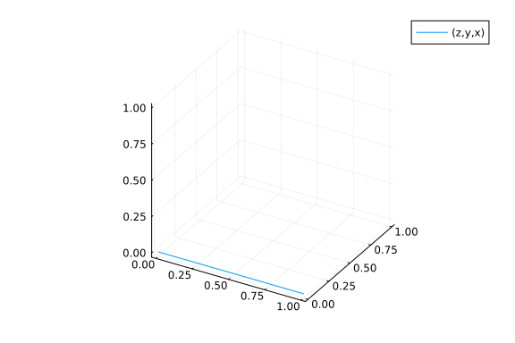
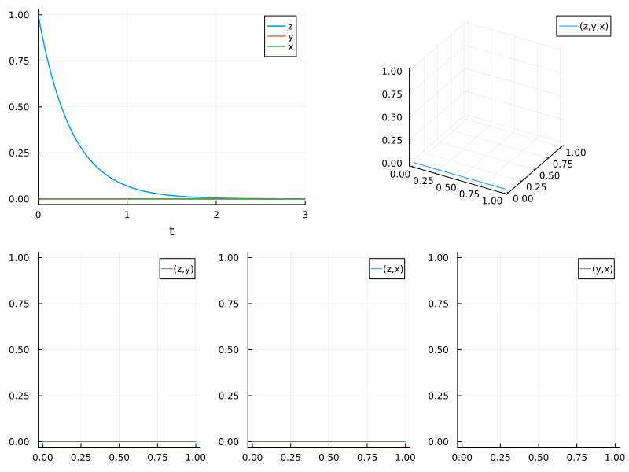
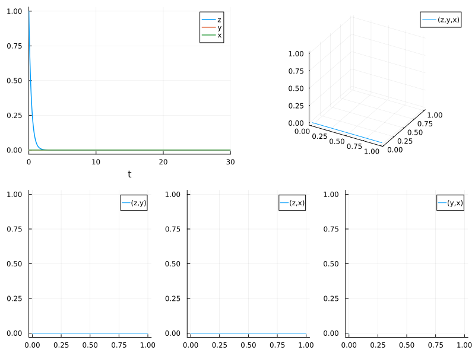

# Estimate the parameters of the Lorenz system from the dataset

Note: If data is generated with a fixed time step method and then is tested against with the same time step, there is a bias introduced since it's no longer about hitting the true solution, rather it's just about retrieving the same values that the ODE was first generated by! Thus this version uses adaptive timestepping for all portions so that way tests are against the true solution.

```julia
using ParameterizedFunctions, OrdinaryDiffEq, DiffEqParamEstim, Optimization
using OptimizationBBO, OptimizationNLopt, Plots, ForwardDiff, BenchmarkTools
using ModelingToolkit
using ModelingToolkitBase
using SciCompDSL
using ModelingToolkit: @mtkbuild, D_nounits as D, t_nounits as t
gr(fmt = :png)
```

```
Plots.GRBackend()
```


```julia
Xiang2015Bounds = Tuple{Float64, Float64}[(9, 11), (20, 30), (
    2, 3)] # for local optimizations
xlow_bounds = [9.0, 20.0, 2.0]
xhigh_bounds = [11.0, 30.0, 3.0]
LooserBounds = Tuple{Float64, Float64}[(0, 22), (0, 60), (
    0, 6)] # for global optimization
GloIniPar = [0.0, 0.5, 0.1] # for global optimizations
LocIniPar = [9.0, 20.0, 2.0] # for local optimization
```

```
3-element Vector{Float64}:
  9.0
 20.0
  2.0
```


```julia
@mtkmodel LorenzExample begin
    @parameters begin
        σ = 10.0  # Parameter: Prandtl number
        ρ = 28.0  # Parameter: Rayleigh number
        β = 8/3   # Parameter: Geometric factor
    end
    @variables begin
        x(t) = 1.0  # Initial condition for x
        y(t) = 1.0  # Initial condition for y
        z(t) = 1.0  # Initial condition for z
    end
    @equations begin
        D(x) ~ σ * (y - x)
        D(y) ~ x * (ρ - z) - y
        D(z) ~ x * y - β * z
    end
end

@mtkbuild g1 = LorenzExample()
p = [10.0, 28.0, 2.66] # Parameters used to construct the dataset
r0 = [1.0; 0.0; 0.0]                #[-11.8,-5.1,37.5] PODES Initial values of the system in space # [0.1, 0.0, 0.0]
tspan = (0.0, 30.0)                 # PODES sample of 3000 observations over the (0,30) timespan
prob = ODEProblem(g1, r0, tspan, p)
tspan2 = (0.0, 3.0)                 # Xiang test sample of 300 observations with a timestep of 0.01
prob_short = ODEProblem(g1, r0, tspan2, p)
```

```
ODEProblem with uType Vector{Float64} and tType Float64. In-place: true
Initialization status: FULLY_DETERMINED
Non-trivial mass matrix: false
timespan: (0.0, 3.0)
u0: 3-element Vector{Float64}:
 1.0
 0.0
 0.0
```


```julia
dt = 30.0/3000
tf = 30.0
tinterval = 0:dt:tf
time_points = collect(tinterval)
```

```
3001-element Vector{Float64}:
  0.0
  0.01
  0.02
  0.03
  0.04
  0.05
  0.06
  0.07
  0.08
  0.09
  ⋮
 29.92
 29.93
 29.94
 29.95
 29.96
 29.97
 29.98
 29.99
 30.0
```


```julia
h = 0.01
M = 300
tstart = 0.0
tstop = tstart + M * h
tinterval_short = 0:h:tstop
t_short = collect(tinterval_short)
```

```
301-element Vector{Float64}:
 0.0
 0.01
 0.02
 0.03
 0.04
 0.05
 0.06
 0.07
 0.08
 0.09
 ⋮
 2.92
 2.93
 2.94
 2.95
 2.96
 2.97
 2.98
 2.99
 3.0
```


```julia
# Generate Data
data_sol_short = solve(prob_short, Vern9(), saveat = t_short, reltol = 1e-9, abstol = 1e-9)
data_short = convert(Array, data_sol_short) # This operation produces column major dataset obs as columns, equations as rows
data_sol = solve(prob, Vern9(), saveat = time_points, reltol = 1e-9, abstol = 1e-9)
data = convert(Array, data_sol)
```

```
3×3001 Matrix{Float64}:
 1.0  0.973751  0.94819  0.923301  0.899065  …  5.76475e-13  5.61371e-13
 0.0  0.0       0.0      0.0       0.0          0.0          0.0
 0.0  0.0       0.0      0.0       0.0          0.0          0.0
```


Plot the data

```julia
plot(data_sol_short, vars = (1, 2, 3)) # the short solution
plot(data_sol, vars = (1, 2, 3)) # the longer solution
interpolation_sol = solve(prob, Vern7(), saveat = time_points, reltol = 1e-12, abstol = 1e-12)
plot(interpolation_sol, vars = (1, 2, 3))
```



```julia
xyzt = plot(data_sol_short, plotdensity = 10000, lw = 1.5)
xy = plot(data_sol_short, plotdensity = 10000, vars = (1, 2))
xz = plot(data_sol_short, plotdensity = 10000, vars = (1, 3))
yz = plot(data_sol_short, plotdensity = 10000, vars = (2, 3))
xyz = plot(data_sol_short, plotdensity = 10000, vars = (1, 2, 3))
plot(plot(xyzt, xyz), plot(xy, xz, yz, layout = (1, 3), w = 1), layout = (2, 1), size = (
    800, 600))
```



```julia
xyzt = plot(data_sol, plotdensity = 10000, lw = 1.5)
xy = plot(data_sol, plotdensity = 10000, vars = (1, 2))
xz = plot(data_sol, plotdensity = 10000, vars = (1, 3))
yz = plot(data_sol, plotdensity = 10000, vars = (2, 3))
xyz = plot(data_sol, plotdensity = 10000, vars = (1, 2, 3))
plot(plot(xyzt, xyz), plot(xy, xz, yz, layout = (1, 3), w = 1), layout = (2, 1), size = (
    800, 600))
```




## Find a local solution for the three parameters from a short data set

```julia
obj_short = build_loss_objective(prob_short, Tsit5(), L2Loss(t_short, data_short), tstops = t_short)
optprob = OptimizationProblem(obj_short, LocIniPar, lb = xlow_bounds, ub = xhigh_bounds)
@btime res1 = solve(optprob, BBO_adaptive_de_rand_1_bin(), maxiters = 7e3)
# Tolerance is still too high to get close enough
```

```
3.019 s (20976846 allocations: 801.28 MiB)
retcode: MaxIters
u: 3-element Vector{Float64}:
 10.356198877990868
 20.856034435675856
  2.659999999998153
```


```julia
obj_short = build_loss_objective(
    prob_short, Tsit5(), L2Loss(t_short, data_short), tstops = t_short, reltol = 1e-9)
optprob = OptimizationProblem(obj_short, LocIniPar, lb = xlow_bounds, ub = xhigh_bounds)
@btime res1 = solve(optprob, BBO_adaptive_de_rand_1_bin(), maxiters = 7e3)
# With the tolerance lower, it achieves the correct solution in 3.5 seconds.
```

```
3.014 s (21011664 allocations: 802.81 MiB)
retcode: MaxIters
u: 3-element Vector{Float64}:
 10.81080421815381
 27.3431772871645
  2.659999999998153
```


```julia
obj_short = build_loss_objective(prob_short, Vern9(), L2Loss(t_short, data_short),
    tstops = t_short, reltol = 1e-9, abstol = 1e-9)
optprob = OptimizationProblem(obj_short, LocIniPar, lb = xlow_bounds, ub = xhigh_bounds)
@btime res1 = solve(optprob, BBO_adaptive_de_rand_1_bin(), maxiters = 7e3)
# With the more accurate solver Vern9 in the solution of the ODE, the convergence is less efficient!

# Fastest BlackBoxOptim: 3.5 seconds
```

```
4.857 s (42285937 allocations: 1.11 GiB)
retcode: MaxIters
u: 3-element Vector{Float64}:
 10.869557925640716
 21.58732010527126
  2.659999999996381
```


# Using NLopt

First, the global optimization algorithms

```julia
obj_short = build_loss_objective(prob_short, Vern9(), L2Loss(t_short, data_short),
    Optimization.AutoForwardDiff(), tstops = t_short, reltol = 1e-9, abstol = 1e-9)
```

```
SciMLBase.OptimizationFunction{true, ADTypes.AutoForwardDiff{nothing, Nothi
ng}, DiffEqParamEstim.var"#37#38"{Nothing, typeof(DiffEqParamEstim.STANDARD
_PROB_GENERATOR), Base.Pairs{Symbol, Any, Nothing, @NamedTuple{tstops::Vect
or{Float64}, reltol::Float64, abstol::Float64}}, SciMLBase.ODEProblem{Vecto
r{Float64}, Tuple{Float64, Float64}, true, ModelingToolkitBase.MTKParameter
s{Vector{Float64}, Vector{Float64}, Tuple{}, Tuple{}, Tuple{}, Tuple{}}, Sc
iMLBase.ODEFunction{true, SciMLBase.AutoDespecialize, ModelingToolkitBase.G
eneratedFunctionWrapper{Tuple{2, 3, true}, RuntimeGeneratedFunctions.Runtim
eGeneratedFunction{(:___mtkunknowns___, :___mtkparameters___, :__argₛᵧₘ1296
8198168038750593), ModelingToolkitBase.var"#_RGF_ModTag", ModelingToolkitBa
se.var"#_RGF_ModTag", (0xef05dfea, 0xbf0f5a9f, 0x987e0f45, 0x8d1ed9b8, 0x33
4d458b), Nothing}, RuntimeGeneratedFunctions.RuntimeGeneratedFunction{(:__a
rgₛᵧₘ1401282876548370056, :___mtkunknowns___, :___mtkparameters___, :__argₛ
ᵧₘ12968198168038750593), ModelingToolkitBase.var"#_RGF_ModTag", ModelingToo
lkitBase.var"#_RGF_ModTag", (0x62ee0678, 0xa187627b, 0x2814c1fa, 0xbb69d703
, 0x3a47543e), Nothing}}, LinearAlgebra.UniformScaling{Bool}, Nothing, Noth
ing, Nothing, Nothing, Nothing, Nothing, Nothing, Nothing, Nothing, Nothing
, Nothing, Nothing, ModelingToolkitBase.ObservedFunctionCache{ModelingToolk
itBase.System, Nothing}, Nothing, ModelingToolkitBase.System, Union{Nothing
, SciMLBase.OverrideInitData}, Union{Nothing, SciMLBase.ODENLStepData}}, Ba
se.Pairs{Symbol, Union{}, Nothing, @NamedTuple{}}, SciMLBase.StandardODEPro
blem}, OrdinaryDiffEqVerner.Vern9{typeof(OrdinaryDiffEqCore.trivial_limiter
!), typeof(OrdinaryDiffEqCore.trivial_limiter!), FastBroadcast.Serial, Val{
true}}, DiffEqParamEstim.L2Loss{Vector{Float64}, Matrix{Float64}, Nothing, 
Nothing, Nothing, Nothing}, Nothing, Tuple{}}, Nothing, Nothing, Nothing, N
othing, Nothing, Nothing, Nothing, Nothing, Nothing, Nothing, Nothing, Noth
ing, Nothing, typeof(SciMLBase.DEFAULT_OBSERVED_NO_TIME), Nothing, Nothing,
 Nothing, Nothing, Nothing, Nothing, Nothing, Nothing, Nothing, Nothing}(Di
ffEqParamEstim.var"#37#38"{Nothing, typeof(DiffEqParamEstim.STANDARD_PROB_G
ENERATOR), Base.Pairs{Symbol, Any, Nothing, @NamedTuple{tstops::Vector{Floa
t64}, reltol::Float64, abstol::Float64}}, SciMLBase.ODEProblem{Vector{Float
64}, Tuple{Float64, Float64}, true, ModelingToolkitBase.MTKParameters{Vecto
r{Float64}, Vector{Float64}, Tuple{}, Tuple{}, Tuple{}, Tuple{}}, SciMLBase
.ODEFunction{true, SciMLBase.AutoDespecialize, ModelingToolkitBase.Generate
dFunctionWrapper{Tuple{2, 3, true}, RuntimeGeneratedFunctions.RuntimeGenera
tedFunction{(:___mtkunknowns___, :___mtkparameters___, :__argₛᵧₘ12968198168
038750593), ModelingToolkitBase.var"#_RGF_ModTag", ModelingToolkitBase.var"
#_RGF_ModTag", (0xef05dfea, 0xbf0f5a9f, 0x987e0f45, 0x8d1ed9b8, 0x334d458b)
, Nothing}, RuntimeGeneratedFunctions.RuntimeGeneratedFunction{(:__argₛᵧₘ14
01282876548370056, :___mtkunknowns___, :___mtkparameters___, :__argₛᵧₘ12968
198168038750593), ModelingToolkitBase.var"#_RGF_ModTag", ModelingToolkitBas
e.var"#_RGF_ModTag", (0x62ee0678, 0xa187627b, 0x2814c1fa, 0xbb69d703, 0x3a4
7543e), Nothing}}, LinearAlgebra.UniformScaling{Bool}, Nothing, Nothing, No
thing, Nothing, Nothing, Nothing, Nothing, Nothing, Nothing, Nothing, Nothi
ng, Nothing, ModelingToolkitBase.ObservedFunctionCache{ModelingToolkitBase.
System, Nothing}, Nothing, ModelingToolkitBase.System, Union{Nothing, SciML
Base.OverrideInitData}, Union{Nothing, SciMLBase.ODENLStepData}}, Base.Pair
s{Symbol, Union{}, Nothing, @NamedTuple{}}, SciMLBase.StandardODEProblem}, 
OrdinaryDiffEqVerner.Vern9{typeof(OrdinaryDiffEqCore.trivial_limiter!), typ
eof(OrdinaryDiffEqCore.trivial_limiter!), FastBroadcast.Serial, Val{true}},
 DiffEqParamEstim.L2Loss{Vector{Float64}, Matrix{Float64}, Nothing, Nothing
, Nothing, Nothing}, Nothing, Tuple{}}(nothing, DiffEqParamEstim.STANDARD_P
ROB_GENERATOR, Base.Pairs{Symbol, Any, Nothing, @NamedTuple{tstops::Vector{
Float64}, reltol::Float64, abstol::Float64}}(:tstops => [0.0, 0.01, 0.02, 0
.03, 0.04, 0.05, 0.06, 0.07, 0.08, 0.09  …  2.91, 2.92, 2.93, 2.94, 2.95, 2
.96, 2.97, 2.98, 2.99, 3.0], :reltol => 1.0e-9, :abstol => 1.0e-9), SciMLBa
se.ODEProblem{Vector{Float64}, Tuple{Float64, Float64}, true, ModelingToolk
itBase.MTKParameters{Vector{Float64}, Vector{Float64}, Tuple{}, Tuple{}, Tu
ple{}, Tuple{}}, SciMLBase.ODEFunction{true, SciMLBase.AutoDespecialize, Mo
delingToolkitBase.GeneratedFunctionWrapper{Tuple{2, 3, true}, RuntimeGenera
tedFunctions.RuntimeGeneratedFunction{(:___mtkunknowns___, :___mtkparameter
s___, :__argₛᵧₘ12968198168038750593), ModelingToolkitBase.var"#_RGF_ModTag"
, ModelingToolkitBase.var"#_RGF_ModTag", (0xef05dfea, 0xbf0f5a9f, 0x987e0f4
5, 0x8d1ed9b8, 0x334d458b), Nothing}, RuntimeGeneratedFunctions.RuntimeGene
ratedFunction{(:__argₛᵧₘ1401282876548370056, :___mtkunknowns___, :___mtkpar
ameters___, :__argₛᵧₘ12968198168038750593), ModelingToolkitBase.var"#_RGF_M
odTag", ModelingToolkitBase.var"#_RGF_ModTag", (0x62ee0678, 0xa187627b, 0x2
814c1fa, 0xbb69d703, 0x3a47543e), Nothing}}, LinearAlgebra.UniformScaling{B
ool}, Nothing, Nothing, Nothing, Nothing, Nothing, Nothing, Nothing, Nothin
g, Nothing, Nothing, Nothing, Nothing, ModelingToolkitBase.ObservedFunction
Cache{ModelingToolkitBase.System, Nothing}, Nothing, ModelingToolkitBase.Sy
stem, Union{Nothing, SciMLBase.OverrideInitData}, Union{Nothing, SciMLBase.
ODENLStepData}}, Base.Pairs{Symbol, Union{}, Nothing, @NamedTuple{}}, SciML
Base.StandardODEProblem}(SciMLBase.ODEFunction{true, SciMLBase.AutoDespecia
lize, ModelingToolkitBase.GeneratedFunctionWrapper{Tuple{2, 3, true}, Runti
meGeneratedFunctions.RuntimeGeneratedFunction{(:___mtkunknowns___, :___mtkp
arameters___, :__argₛᵧₘ12968198168038750593), ModelingToolkitBase.var"#_RGF
_ModTag", ModelingToolkitBase.var"#_RGF_ModTag", (0xef05dfea, 0xbf0f5a9f, 0
x987e0f45, 0x8d1ed9b8, 0x334d458b), Nothing}, RuntimeGeneratedFunctions.Run
timeGeneratedFunction{(:__argₛᵧₘ1401282876548370056, :___mtkunknowns___, :_
__mtkparameters___, :__argₛᵧₘ12968198168038750593), ModelingToolkitBase.var
"#_RGF_ModTag", ModelingToolkitBase.var"#_RGF_ModTag", (0x62ee0678, 0xa1876
27b, 0x2814c1fa, 0xbb69d703, 0x3a47543e), Nothing}}, LinearAlgebra.UniformS
caling{Bool}, Nothing, Nothing, Nothing, Nothing, Nothing, Nothing, Nothing
, Nothing, Nothing, Nothing, Nothing, Nothing, ModelingToolkitBase.Observed
FunctionCache{ModelingToolkitBase.System, Nothing}, Nothing, ModelingToolki
tBase.System, Union{Nothing, SciMLBase.OverrideInitData}, Union{Nothing, Sc
iMLBase.ODENLStepData}}(ModelingToolkitBase.GeneratedFunctionWrapper{Tuple{
2, 3, true}, RuntimeGeneratedFunctions.RuntimeGeneratedFunction{(:___mtkunk
nowns___, :___mtkparameters___, :__argₛᵧₘ12968198168038750593), ModelingToo
lkitBase.var"#_RGF_ModTag", ModelingToolkitBase.var"#_RGF_ModTag", (0xef05d
fea, 0xbf0f5a9f, 0x987e0f45, 0x8d1ed9b8, 0x334d458b), Nothing}, RuntimeGene
ratedFunctions.RuntimeGeneratedFunction{(:__argₛᵧₘ1401282876548370056, :___
mtkunknowns___, :___mtkparameters___, :__argₛᵧₘ12968198168038750593), Model
ingToolkitBase.var"#_RGF_ModTag", ModelingToolkitBase.var"#_RGF_ModTag", (0
x62ee0678, 0xa187627b, 0x2814c1fa, 0xbb69d703, 0x3a47543e), Nothing}}(Runti
meGeneratedFunctions.RuntimeGeneratedFunction{(:___mtkunknowns___, :___mtkp
arameters___, :__argₛᵧₘ12968198168038750593), ModelingToolkitBase.var"#_RGF
_ModTag", ModelingToolkitBase.var"#_RGF_ModTag", (0xef05dfea, 0xbf0f5a9f, 0
x987e0f45, 0x8d1ed9b8, 0x334d458b), Nothing}(nothing), RuntimeGeneratedFunc
tions.RuntimeGeneratedFunction{(:__argₛᵧₘ1401282876548370056, :___mtkunknow
ns___, :___mtkparameters___, :__argₛᵧₘ12968198168038750593), ModelingToolki
tBase.var"#_RGF_ModTag", ModelingToolkitBase.var"#_RGF_ModTag", (0x62ee0678
, 0xa187627b, 0x2814c1fa, 0xbb69d703, 0x3a47543e), Nothing}(nothing)), Line
arAlgebra.UniformScaling{Bool}(true), nothing, nothing, nothing, nothing, n
othing, nothing, nothing, nothing, nothing, nothing, nothing, nothing, Mode
lingToolkitBase.ObservedFunctionCache{ModelingToolkitBase.System, Nothing}(
Model g1:
Equations (3):
  3 standard: see equations(g1)
Unknowns (3): see unknowns(g1)
  z(t)
  y(t)
  x(t)
Parameters (3): see parameters(g1)
  σ
  ρ
  β, Dict{Any, Any}(), false, false, ModelingToolkitBase, false, nothing), 
nothing, Model g1:
Equations (3):
  3 standard: see equations(g1)
Unknowns (3): see unknowns(g1)
  z(t)
  y(t)
  x(t)
Parameters (3): see parameters(g1)
  σ
  ρ
  β, SciMLBase.OverrideInitData{SciMLBase.NonlinearProblem{Nothing, true, M
odelingToolkitBase.MTKParameters{Vector{Float64}, StaticArraysCore.SVector{
0, Float64}, Tuple{}, Tuple{}, Tuple{}, Tuple{}}, SciMLBase.NonlinearFuncti
on{true, SciMLBase.AutoDespecialize, ModelingToolkitBase.GeneratedFunctionW
rapper{Tuple{2, 2, true}, RuntimeGeneratedFunctions.RuntimeGeneratedFunctio
n{(:___mtkunknowns___, :___mtkparameters___), ModelingToolkitBase.var"#_RGF
_ModTag", ModelingToolkitBase.var"#_RGF_ModTag", (0xe0a7f55e, 0xcb0f8c13, 0
x5afbe72e, 0x825c4ce9, 0x3418c4a5), Nothing}, RuntimeGeneratedFunctions.Run
timeGeneratedFunction{(:__argₛᵧₘ1401282876548370056, :___mtkunknowns___, :_
__mtkparameters___), ModelingToolkitBase.var"#_RGF_ModTag", ModelingToolkit
Base.var"#_RGF_ModTag", (0xac9dd6f8, 0xf3d8414c, 0x01f2cade, 0x451b4ee8, 0x
29c649f2), Nothing}}, LinearAlgebra.UniformScaling{Bool}, Nothing, Nothing,
 Nothing, Nothing, Nothing, Nothing, Nothing, Nothing, Nothing, Nothing, Mo
delingToolkitBase.ObservedFunctionCache{ModelingToolkitBase.System, Nothing
}, Nothing, ModelingToolkitBase.System, Nothing, Nothing}, Base.Pairs{Symbo
l, Union{}, Nothing, @NamedTuple{}}, SciMLBase.StandardNonlinearProblem, No
thing, Nothing}, typeof(ModelingToolkitBase.update_initializeprob!), Modeli
ngToolkitBase.InitializationMap{true, typeof(identity), ModelingToolkitBase
.PromoteToTunableEltype{ModelingToolkitBase.CopyParamsByTemplate{true, Tupl
e{ModelingToolkitBase.ParameterIndex{SciMLStructures.Tunable, UnitRange{Int
64}}, ModelingToolkitBase.ParameterIndex{SciMLStructures.Tunable, UnitRange
{Int64}}}, 1, Nothing}, Float64}}, ModelingToolkitBase.var"#initprobpmap_sp
lit#770"{ModelingToolkitBase.MTKParametersReconstructor{ComposedFunction{Mo
delingToolkitBase.PConstructorApplicator{typeof(identity)}, ModelingToolkit
Base.CopyParamsByTemplate{true, Tuple{ModelingToolkitBase.ParameterIndex{Sc
iMLStructures.Tunable, UnitRange{Int64}}}, 1, Nothing}}, ComposedFunction{M
odelingToolkitBase.PConstructorApplicator{typeof(identity)}, ModelingToolki
tBase.CopyParamsByTemplate{true, Tuple{ModelingToolkitBase.ParameterIndex{S
ciMLStructures.Tunable, UnitRange{Int64}}}, 1, Nothing}}, Returns{Tuple{}},
 Returns{Tuple{}}, Returns{Tuple{}}}}, ModelingToolkitBase.InitializationMe
tadata{ModelingToolkitBase.ReconstructInitializeprob{ModelingToolkitBase.MT
KParametersReconstructor{ComposedFunction{ModelingToolkitBase.PConstructorA
pplicator{typeof(identity)}, ModelingToolkitBase.CopyParamsByTemplate{true,
 Tuple{ModelingToolkitBase.IndepVarTemplate, ModelingToolkitBase.ParameterI
ndex{SciMLStructures.Tunable, UnitRange{Int64}}, ModelingToolkitBase.Parame
terIndex{SciMLStructures.Initials, UnitRange{Int64}}}, 1, Nothing}}, Return
s{StaticArraysCore.SVector{0, Float64}}, Returns{Tuple{}}, Returns{Tuple{}}
, Returns{Tuple{}}}, ComposedFunction{typeof(identity), ModelingToolkitBase
.ObservedWrapper{true, ModelingToolkitBase.GeneratedFunctionWrapper{Tuple{2
, 3, true}, RuntimeGeneratedFunctions.RuntimeGeneratedFunction{(:__mtk_arg_
1, :___mtkparameters___, :__argₛᵧₘ12968198168038750593), ModelingToolkitBas
e.var"#_RGF_ModTag", ModelingToolkitBase.var"#_RGF_ModTag", (0x05e7e591, 0x
9a09c886, 0x0267af3f, 0x585cfe8b, 0x75f79d7b), Nothing}, RuntimeGeneratedFu
nctions.RuntimeGeneratedFunction{(:x1, :x2, :x3, :x4), ModelingToolkitBase.
var"#_RGF_ModTag", ModelingToolkitBase.var"#_RGF_ModTag", (0xb896e553, 0xa1
18fcf5, 0xbfeb9719, 0xa096e58a, 0x357542a4), Nothing}}}}}, ModelingToolkitB
ase.GetUpdatedU0{Nothing, SymbolicIndexingInterface.MultipleParametersGette
r{SymbolicIndexingInterface.IndexerNotTimeseries, Vector{SymbolicIndexingIn
terface.GetParameterIndex{ModelingToolkitBase.ParameterIndex{SciMLStructure
s.Initials, Int64}}}, Nothing}}, ModelingToolkitBase.SetInitialUnknowns{Sym
bolicIndexingInterface.MultipleSetters{Vector{SymbolicIndexingInterface.Par
ameterHookWrapper{SymbolicIndexingInterface.SetParameterIndex{ModelingToolk
itBase.ParameterIndex{SciMLStructures.Initials, Int64}}, SymbolicUtils.Basi
cSymbolicImpl.var"typeof(BasicSymbolicImpl)"{SymbolicUtils.SymReal}}}}}}, V
al{true}}(SciMLBase.NonlinearProblem{Nothing, true, ModelingToolkitBase.MTK
Parameters{Vector{Float64}, StaticArraysCore.SVector{0, Float64}, Tuple{}, 
Tuple{}, Tuple{}, Tuple{}}, SciMLBase.NonlinearFunction{true, SciMLBase.Aut
oDespecialize, ModelingToolkitBase.GeneratedFunctionWrapper{Tuple{2, 2, tru
e}, RuntimeGeneratedFunctions.RuntimeGeneratedFunction{(:___mtkunknowns___,
 :___mtkparameters___), ModelingToolkitBase.var"#_RGF_ModTag", ModelingTool
kitBase.var"#_RGF_ModTag", (0xe0a7f55e, 0xcb0f8c13, 0x5afbe72e, 0x825c4ce9,
 0x3418c4a5), Nothing}, RuntimeGeneratedFunctions.RuntimeGeneratedFunction{
(:__argₛᵧₘ1401282876548370056, :___mtkunknowns___, :___mtkparameters___), M
odelingToolkitBase.var"#_RGF_ModTag", ModelingToolkitBase.var"#_RGF_ModTag"
, (0xac9dd6f8, 0xf3d8414c, 0x01f2cade, 0x451b4ee8, 0x29c649f2), Nothing}}, 
LinearAlgebra.UniformScaling{Bool}, Nothing, Nothing, Nothing, Nothing, Not
hing, Nothing, Nothing, Nothing, Nothing, Nothing, ModelingToolkitBase.Obse
rvedFunctionCache{ModelingToolkitBase.System, Nothing}, Nothing, ModelingTo
olkitBase.System, Nothing, Nothing}, Base.Pairs{Symbol, Union{}, Nothing, @
NamedTuple{}}, SciMLBase.StandardNonlinearProblem, Nothing, Nothing}(SciMLB
ase.NonlinearFunction{true, SciMLBase.AutoDespecialize, ModelingToolkitBase
.GeneratedFunctionWrapper{Tuple{2, 2, true}, RuntimeGeneratedFunctions.Runt
imeGeneratedFunction{(:___mtkunknowns___, :___mtkparameters___), ModelingTo
olkitBase.var"#_RGF_ModTag", ModelingToolkitBase.var"#_RGF_ModTag", (0xe0a7
f55e, 0xcb0f8c13, 0x5afbe72e, 0x825c4ce9, 0x3418c4a5), Nothing}, RuntimeGen
eratedFunctions.RuntimeGeneratedFunction{(:__argₛᵧₘ1401282876548370056, :__
_mtkunknowns___, :___mtkparameters___), ModelingToolkitBase.var"#_RGF_ModTa
g", ModelingToolkitBase.var"#_RGF_ModTag", (0xac9dd6f8, 0xf3d8414c, 0x01f2c
ade, 0x451b4ee8, 0x29c649f2), Nothing}}, LinearAlgebra.UniformScaling{Bool}
, Nothing, Nothing, Nothing, Nothing, Nothing, Nothing, Nothing, Nothing, N
othing, Nothing, ModelingToolkitBase.ObservedFunctionCache{ModelingToolkitB
ase.System, Nothing}, Nothing, ModelingToolkitBase.System, Nothing, Nothing
}(ModelingToolkitBase.GeneratedFunctionWrapper{Tuple{2, 2, true}, RuntimeGe
neratedFunctions.RuntimeGeneratedFunction{(:___mtkunknowns___, :___mtkparam
eters___), ModelingToolkitBase.var"#_RGF_ModTag", ModelingToolkitBase.var"#
_RGF_ModTag", (0xe0a7f55e, 0xcb0f8c13, 0x5afbe72e, 0x825c4ce9, 0x3418c4a5),
 Nothing}, RuntimeGeneratedFunctions.RuntimeGeneratedFunction{(:__argₛᵧₘ140
1282876548370056, :___mtkunknowns___, :___mtkparameters___), ModelingToolki
tBase.var"#_RGF_ModTag", ModelingToolkitBase.var"#_RGF_ModTag", (0xac9dd6f8
, 0xf3d8414c, 0x01f2cade, 0x451b4ee8, 0x29c649f2), Nothing}}(RuntimeGenerat
edFunctions.RuntimeGeneratedFunction{(:___mtkunknowns___, :___mtkparameters
___), ModelingToolkitBase.var"#_RGF_ModTag", ModelingToolkitBase.var"#_RGF_
ModTag", (0xe0a7f55e, 0xcb0f8c13, 0x5afbe72e, 0x825c4ce9, 0x3418c4a5), Noth
ing}(nothing), RuntimeGeneratedFunctions.RuntimeGeneratedFunction{(:__argₛᵧ
ₘ1401282876548370056, :___mtkunknowns___, :___mtkparameters___), ModelingTo
olkitBase.var"#_RGF_ModTag", ModelingToolkitBase.var"#_RGF_ModTag", (0xac9d
d6f8, 0xf3d8414c, 0x01f2cade, 0x451b4ee8, 0x29c649f2), Nothing}(nothing)), 
LinearAlgebra.UniformScaling{Bool}(true), nothing, nothing, nothing, nothin
g, nothing, nothing, nothing, nothing, nothing, nothing, ModelingToolkitBas
e.ObservedFunctionCache{ModelingToolkitBase.System, Nothing}(Model g1:
Parameters (10): see parameters(g1)
  t
  σ
  ρ
  β
  ⋮
Observed (6): see observed(g1), Dict{Any, Any}(), false, false, ModelingToo
lkitBase, false, nothing), nothing, Model g1:
Parameters (10): see parameters(g1)
  t
  σ
  ρ
  β
  ⋮
Observed (6): see observed(g1), nothing, nothing), nothing, ModelingToolkit
Base.MTKParameters{Vector{Float64}, StaticArraysCore.SVector{0, Float64}, T
uple{}, Tuple{}, Tuple{}, Tuple{}}([0.0, 10.0, 28.0, 2.66, 0.0, 1.0, 0.0, 0
.0, 0.0, 0.0], Float64[], (), (), (), ()), SciMLBase.StandardNonlinearProbl
em(), nothing, nothing, Base.Pairs{Symbol, Union{}, Nothing, @NamedTuple{}}
()), ModelingToolkitBase.update_initializeprob!, ModelingToolkitBase.Initia
lizationMap{true, typeof(identity), ModelingToolkitBase.PromoteToTunableElt
ype{ModelingToolkitBase.CopyParamsByTemplate{true, Tuple{ModelingToolkitBas
e.ParameterIndex{SciMLStructures.Tunable, UnitRange{Int64}}, ModelingToolki
tBase.ParameterIndex{SciMLStructures.Tunable, UnitRange{Int64}}}, 1, Nothin
g}, Float64}}(identity, ModelingToolkitBase.PromoteToTunableEltype{Modeling
ToolkitBase.CopyParamsByTemplate{true, Tuple{ModelingToolkitBase.ParameterI
ndex{SciMLStructures.Tunable, UnitRange{Int64}}, ModelingToolkitBase.Parame
terIndex{SciMLStructures.Tunable, UnitRange{Int64}}}, 1, Nothing}, Float64}
(ModelingToolkitBase.CopyParamsByTemplate{true, Tuple{ModelingToolkitBase.P
arameterIndex{SciMLStructures.Tunable, UnitRange{Int64}}, ModelingToolkitBa
se.ParameterIndex{SciMLStructures.Tunable, UnitRange{Int64}}}, 1, Nothing}(
(ModelingToolkitBase.ParameterIndex{SciMLStructures.Tunable, UnitRange{Int6
4}}(SciMLStructures.Tunable(), 6:6, false), ModelingToolkitBase.ParameterIn
dex{SciMLStructures.Tunable, UnitRange{Int64}}(SciMLStructures.Tunable(), 8
:9, false)), (3,), nothing))), ModelingToolkitBase.var"#initprobpmap_split#
770"{ModelingToolkitBase.MTKParametersReconstructor{ComposedFunction{Modeli
ngToolkitBase.PConstructorApplicator{typeof(identity)}, ModelingToolkitBase
.CopyParamsByTemplate{true, Tuple{ModelingToolkitBase.ParameterIndex{SciMLS
tructures.Tunable, UnitRange{Int64}}}, 1, Nothing}}, ComposedFunction{Model
ingToolkitBase.PConstructorApplicator{typeof(identity)}, ModelingToolkitBas
e.CopyParamsByTemplate{true, Tuple{ModelingToolkitBase.ParameterIndex{SciML
Structures.Tunable, UnitRange{Int64}}}, 1, Nothing}}, Returns{Tuple{}}, Ret
urns{Tuple{}}, Returns{Tuple{}}}}(ModelingToolkitBase.MTKParametersReconstr
uctor{ComposedFunction{ModelingToolkitBase.PConstructorApplicator{typeof(id
entity)}, ModelingToolkitBase.CopyParamsByTemplate{true, Tuple{ModelingTool
kitBase.ParameterIndex{SciMLStructures.Tunable, UnitRange{Int64}}}, 1, Noth
ing}}, ComposedFunction{ModelingToolkitBase.PConstructorApplicator{typeof(i
dentity)}, ModelingToolkitBase.CopyParamsByTemplate{true, Tuple{ModelingToo
lkitBase.ParameterIndex{SciMLStructures.Tunable, UnitRange{Int64}}}, 1, Not
hing}}, Returns{Tuple{}}, Returns{Tuple{}}, Returns{Tuple{}}}(ModelingToolk
itBase.PConstructorApplicator{typeof(identity)}(identity) ∘ ModelingToolkit
Base.CopyParamsByTemplate{true, Tuple{ModelingToolkitBase.ParameterIndex{Sc
iMLStructures.Tunable, UnitRange{Int64}}}, 1, Nothing}((ModelingToolkitBase
.ParameterIndex{SciMLStructures.Tunable, UnitRange{Int64}}(SciMLStructures.
Tunable(), 2:4, false),), (3,), nothing), ModelingToolkitBase.PConstructorA
pplicator{typeof(identity)}(identity) ∘ ModelingToolkitBase.CopyParamsByTem
plate{true, Tuple{ModelingToolkitBase.ParameterIndex{SciMLStructures.Tunabl
e, UnitRange{Int64}}}, 1, Nothing}((ModelingToolkitBase.ParameterIndex{SciM
LStructures.Tunable, UnitRange{Int64}}(SciMLStructures.Tunable(), 5:10, fal
se),), (6,), nothing), Returns{Tuple{}}(()), Returns{Tuple{}}(()), Returns{
Tuple{}}(()), 0)), ModelingToolkitBase.InitializationMetadata{ModelingToolk
itBase.ReconstructInitializeprob{ModelingToolkitBase.MTKParametersReconstru
ctor{ComposedFunction{ModelingToolkitBase.PConstructorApplicator{typeof(ide
ntity)}, ModelingToolkitBase.CopyParamsByTemplate{true, Tuple{ModelingToolk
itBase.IndepVarTemplate, ModelingToolkitBase.ParameterIndex{SciMLStructures
.Tunable, UnitRange{Int64}}, ModelingToolkitBase.ParameterIndex{SciMLStruct
ures.Initials, UnitRange{Int64}}}, 1, Nothing}}, Returns{StaticArraysCore.S
Vector{0, Float64}}, Returns{Tuple{}}, Returns{Tuple{}}, Returns{Tuple{}}},
 ComposedFunction{typeof(identity), ModelingToolkitBase.ObservedWrapper{tru
e, ModelingToolkitBase.GeneratedFunctionWrapper{Tuple{2, 3, true}, RuntimeG
eneratedFunctions.RuntimeGeneratedFunction{(:__mtk_arg_1, :___mtkparameters
___, :__argₛᵧₘ12968198168038750593), ModelingToolkitBase.var"#_RGF_ModTag",
 ModelingToolkitBase.var"#_RGF_ModTag", (0x05e7e591, 0x9a09c886, 0x0267af3f
, 0x585cfe8b, 0x75f79d7b), Nothing}, RuntimeGeneratedFunctions.RuntimeGener
atedFunction{(:x1, :x2, :x3, :x4), ModelingToolkitBase.var"#_RGF_ModTag", M
odelingToolkitBase.var"#_RGF_ModTag", (0xb896e553, 0xa118fcf5, 0xbfeb9719, 
0xa096e58a, 0x357542a4), Nothing}}}}}, ModelingToolkitBase.GetUpdatedU0{Not
hing, SymbolicIndexingInterface.MultipleParametersGetter{SymbolicIndexingIn
terface.IndexerNotTimeseries, Vector{SymbolicIndexingInterface.GetParameter
Index{ModelingToolkitBase.ParameterIndex{SciMLStructures.Initials, Int64}}}
, Nothing}}, ModelingToolkitBase.SetInitialUnknowns{SymbolicIndexingInterfa
ce.MultipleSetters{Vector{SymbolicIndexingInterface.ParameterHookWrapper{Sy
mbolicIndexingInterface.SetParameterIndex{ModelingToolkitBase.ParameterInde
x{SciMLStructures.Initials, Int64}}, SymbolicUtils.BasicSymbolicImpl.var"ty
peof(BasicSymbolicImpl)"{SymbolicUtils.SymReal}}}}}}(ModelingToolkitBase.At
omicArrayDict{SymbolicUtils.BasicSymbolicImpl.var"typeof(BasicSymbolicImpl)
"{SymbolicUtils.SymReal}, Dict{SymbolicUtils.BasicSymbolicImpl.var"typeof(B
asicSymbolicImpl)"{SymbolicUtils.SymReal}, SymbolicUtils.BasicSymbolicImpl.
var"typeof(BasicSymbolicImpl)"{SymbolicUtils.SymReal}}}(Initial(z(t)) => fa
lse, z(t) => 1.0, Initial(yˍt(t)) => false, Initial(y(t)) => false, σ => 10
.0, y(t) => 0.0, Initial(zˍt(t)) => false, ρ => 28.0, β => 2.66, Initial(xˍ
t(t)) => false…), ModelingToolkitBase.AtomicArrayDict{SymbolicUtils.BasicSy
mbolicImpl.var"typeof(BasicSymbolicImpl)"{SymbolicUtils.SymReal}, Dict{Symb
olicUtils.BasicSymbolicImpl.var"typeof(BasicSymbolicImpl)"{SymbolicUtils.Sy
mReal}, SymbolicUtils.BasicSymbolicImpl.var"typeof(BasicSymbolicImpl)"{Symb
olicUtils.SymReal}}}(), Symbolics.Equation[], true, true, ModelingToolkitBa
se.ReconstructInitializeprob{ModelingToolkitBase.MTKParametersReconstructor
{ComposedFunction{ModelingToolkitBase.PConstructorApplicator{typeof(identit
y)}, ModelingToolkitBase.CopyParamsByTemplate{true, Tuple{ModelingToolkitBa
se.IndepVarTemplate, ModelingToolkitBase.ParameterIndex{SciMLStructures.Tun
able, UnitRange{Int64}}, ModelingToolkitBase.ParameterIndex{SciMLStructures
.Initials, UnitRange{Int64}}}, 1, Nothing}}, Returns{StaticArraysCore.SVect
or{0, Float64}}, Returns{Tuple{}}, Returns{Tuple{}}, Returns{Tuple{}}}, Com
posedFunction{typeof(identity), ModelingToolkitBase.ObservedWrapper{true, M
odelingToolkitBase.GeneratedFunctionWrapper{Tuple{2, 3, true}, RuntimeGener
atedFunctions.RuntimeGeneratedFunction{(:__mtk_arg_1, :___mtkparameters___,
 :__argₛᵧₘ12968198168038750593), ModelingToolkitBase.var"#_RGF_ModTag", Mod
elingToolkitBase.var"#_RGF_ModTag", (0x05e7e591, 0x9a09c886, 0x0267af3f, 0x
585cfe8b, 0x75f79d7b), Nothing}, RuntimeGeneratedFunctions.RuntimeGenerated
Function{(:x1, :x2, :x3, :x4), ModelingToolkitBase.var"#_RGF_ModTag", Model
ingToolkitBase.var"#_RGF_ModTag", (0xb896e553, 0xa118fcf5, 0xbfeb9719, 0xa0
96e58a, 0x357542a4), Nothing}}}}}(ModelingToolkitBase.MTKParametersReconstr
uctor{ComposedFunction{ModelingToolkitBase.PConstructorApplicator{typeof(id
entity)}, ModelingToolkitBase.CopyParamsByTemplate{true, Tuple{ModelingTool
kitBase.IndepVarTemplate, ModelingToolkitBase.ParameterIndex{SciMLStructure
s.Tunable, UnitRange{Int64}}, ModelingToolkitBase.ParameterIndex{SciMLStruc
tures.Initials, UnitRange{Int64}}}, 1, Nothing}}, Returns{StaticArraysCore.
SVector{0, Float64}}, Returns{Tuple{}}, Returns{Tuple{}}, Returns{Tuple{}}}
(ModelingToolkitBase.PConstructorApplicator{typeof(identity)}(identity) ∘ M
odelingToolkitBase.CopyParamsByTemplate{true, Tuple{ModelingToolkitBase.Ind
epVarTemplate, ModelingToolkitBase.ParameterIndex{SciMLStructures.Tunable, 
UnitRange{Int64}}, ModelingToolkitBase.ParameterIndex{SciMLStructures.Initi
als, UnitRange{Int64}}}, 1, Nothing}((ModelingToolkitBase.IndepVarTemplate(
), ModelingToolkitBase.ParameterIndex{SciMLStructures.Tunable, UnitRange{In
t64}}(SciMLStructures.Tunable(), 1:3, false), ModelingToolkitBase.Parameter
Index{SciMLStructures.Initials, UnitRange{Int64}}(SciMLStructures.Initials(
), 1:6, false)), (10,), nothing), Returns{StaticArraysCore.SVector{0, Float
64}}(Float64[]), Returns{Tuple{}}(()), Returns{Tuple{}}(()), Returns{Tuple{
}}(()), 0), identity ∘ ModelingToolkitBase.ObservedWrapper{true, ModelingTo
olkitBase.GeneratedFunctionWrapper{Tuple{2, 3, true}, RuntimeGeneratedFunct
ions.RuntimeGeneratedFunction{(:__mtk_arg_1, :___mtkparameters___, :__argₛᵧ
ₘ12968198168038750593), ModelingToolkitBase.var"#_RGF_ModTag", ModelingTool
kitBase.var"#_RGF_ModTag", (0x05e7e591, 0x9a09c886, 0x0267af3f, 0x585cfe8b,
 0x75f79d7b), Nothing}, RuntimeGeneratedFunctions.RuntimeGeneratedFunction{
(:x1, :x2, :x3, :x4), ModelingToolkitBase.var"#_RGF_ModTag", ModelingToolki
tBase.var"#_RGF_ModTag", (0xb896e553, 0xa118fcf5, 0xbfeb9719, 0xa096e58a, 0
x357542a4), Nothing}}}(ModelingToolkitBase.GeneratedFunctionWrapper{Tuple{2
, 3, true}, RuntimeGeneratedFunctions.RuntimeGeneratedFunction{(:__mtk_arg_
1, :___mtkparameters___, :__argₛᵧₘ12968198168038750593), ModelingToolkitBas
e.var"#_RGF_ModTag", ModelingToolkitBase.var"#_RGF_ModTag", (0x05e7e591, 0x
9a09c886, 0x0267af3f, 0x585cfe8b, 0x75f79d7b), Nothing}, RuntimeGeneratedFu
nctions.RuntimeGeneratedFunction{(:x1, :x2, :x3, :x4), ModelingToolkitBase.
var"#_RGF_ModTag", ModelingToolkitBase.var"#_RGF_ModTag", (0xb896e553, 0xa1
18fcf5, 0xbfeb9719, 0xa096e58a, 0x357542a4), Nothing}}(RuntimeGeneratedFunc
tions.RuntimeGeneratedFunction{(:__mtk_arg_1, :___mtkparameters___, :__argₛ
ᵧₘ12968198168038750593), ModelingToolkitBase.var"#_RGF_ModTag", ModelingToo
lkitBase.var"#_RGF_ModTag", (0x05e7e591, 0x9a09c886, 0x0267af3f, 0x585cfe8b
, 0x75f79d7b), Nothing}(nothing), RuntimeGeneratedFunctions.RuntimeGenerate
dFunction{(:x1, :x2, :x3, :x4), ModelingToolkitBase.var"#_RGF_ModTag", Mode
lingToolkitBase.var"#_RGF_ModTag", (0xb896e553, 0xa118fcf5, 0xbfeb9719, 0xa
096e58a, 0x357542a4), Nothing}(nothing)))), ModelingToolkitBase.GetUpdatedU
0{Nothing, SymbolicIndexingInterface.MultipleParametersGetter{SymbolicIndex
ingInterface.IndexerNotTimeseries, Vector{SymbolicIndexingInterface.GetPara
meterIndex{ModelingToolkitBase.ParameterIndex{SciMLStructures.Initials, Int
64}}}, Nothing}}(Bool[0, 0, 0], nothing, SymbolicIndexingInterface.Multiple
ParametersGetter{SymbolicIndexingInterface.IndexerNotTimeseries, Vector{Sym
bolicIndexingInterface.GetParameterIndex{ModelingToolkitBase.ParameterIndex
{SciMLStructures.Initials, Int64}}}, Nothing}(SymbolicIndexingInterface.Get
ParameterIndex{ModelingToolkitBase.ParameterIndex{SciMLStructures.Initials,
 Int64}}[SymbolicIndexingInterface.GetParameterIndex{ModelingToolkitBase.Pa
rameterIndex{SciMLStructures.Initials, Int64}}(ModelingToolkitBase.Paramete
rIndex{SciMLStructures.Initials, Int64}(SciMLStructures.Initials(), 2, fals
e)), SymbolicIndexingInterface.GetParameterIndex{ModelingToolkitBase.Parame
terIndex{SciMLStructures.Initials, Int64}}(ModelingToolkitBase.ParameterInd
ex{SciMLStructures.Initials, Int64}(SciMLStructures.Initials(), 4, false)),
 SymbolicIndexingInterface.GetParameterIndex{ModelingToolkitBase.ParameterI
ndex{SciMLStructures.Initials, Int64}}(ModelingToolkitBase.ParameterIndex{S
ciMLStructures.Initials, Int64}(SciMLStructures.Initials(), 5, false))], no
thing)), ModelingToolkitBase.SetInitialUnknowns{SymbolicIndexingInterface.M
ultipleSetters{Vector{SymbolicIndexingInterface.ParameterHookWrapper{Symbol
icIndexingInterface.SetParameterIndex{ModelingToolkitBase.ParameterIndex{Sc
iMLStructures.Initials, Int64}}, SymbolicUtils.BasicSymbolicImpl.var"typeof
(BasicSymbolicImpl)"{SymbolicUtils.SymReal}}}}}(SymbolicIndexingInterface.M
ultipleSetters{Vector{SymbolicIndexingInterface.ParameterHookWrapper{Symbol
icIndexingInterface.SetParameterIndex{ModelingToolkitBase.ParameterIndex{Sc
iMLStructures.Initials, Int64}}, SymbolicUtils.BasicSymbolicImpl.var"typeof
(BasicSymbolicImpl)"{SymbolicUtils.SymReal}}}}(SymbolicIndexingInterface.Pa
rameterHookWrapper{SymbolicIndexingInterface.SetParameterIndex{ModelingTool
kitBase.ParameterIndex{SciMLStructures.Initials, Int64}}, SymbolicUtils.Bas
icSymbolicImpl.var"typeof(BasicSymbolicImpl)"{SymbolicUtils.SymReal}}[Symbo
licIndexingInterface.ParameterHookWrapper{SymbolicIndexingInterface.SetPara
meterIndex{ModelingToolkitBase.ParameterIndex{SciMLStructures.Initials, Int
64}}, SymbolicUtils.BasicSymbolicImpl.var"typeof(BasicSymbolicImpl)"{Symbol
icUtils.SymReal}}(SymbolicIndexingInterface.SetParameterIndex{ModelingToolk
itBase.ParameterIndex{SciMLStructures.Initials, Int64}}(ModelingToolkitBase
.ParameterIndex{SciMLStructures.Initials, Int64}(SciMLStructures.Initials()
, 2, false)), Initial(z(t))), SymbolicIndexingInterface.ParameterHookWrappe
r{SymbolicIndexingInterface.SetParameterIndex{ModelingToolkitBase.Parameter
Index{SciMLStructures.Initials, Int64}}, SymbolicUtils.BasicSymbolicImpl.va
r"typeof(BasicSymbolicImpl)"{SymbolicUtils.SymReal}}(SymbolicIndexingInterf
ace.SetParameterIndex{ModelingToolkitBase.ParameterIndex{SciMLStructures.In
itials, Int64}}(ModelingToolkitBase.ParameterIndex{SciMLStructures.Initials
, Int64}(SciMLStructures.Initials(), 4, false)), Initial(y(t))), SymbolicIn
dexingInterface.ParameterHookWrapper{SymbolicIndexingInterface.SetParameter
Index{ModelingToolkitBase.ParameterIndex{SciMLStructures.Initials, Int64}},
 SymbolicUtils.BasicSymbolicImpl.var"typeof(BasicSymbolicImpl)"{SymbolicUti
ls.SymReal}}(SymbolicIndexingInterface.SetParameterIndex{ModelingToolkitBas
e.ParameterIndex{SciMLStructures.Initials, Int64}}(ModelingToolkitBase.Para
meterIndex{SciMLStructures.Initials, Int64}(SciMLStructures.Initials(), 5, 
false)), Initial(x(t)))]), [2, 4, 5]), ModelingToolkitBase.MissingGuessValu
e.var"typeof(MissingGuessValue)"(ModelingToolkitBase.MissingGuessValue.var"
##Storage#HashedRandom"())), Val{true}()), nothing), [1.0, 0.0, 0.0], (0.0,
 3.0), ModelingToolkitBase.MTKParameters{Vector{Float64}, Vector{Float64}, 
Tuple{}, Tuple{}, Tuple{}, Tuple{}}([10.0, 28.0, 2.66], [0.0, 1.0, 0.0, 0.0
, 0.0, 0.0], (), (), (), ()), Base.Pairs{Symbol, Union{}, Nothing, @NamedTu
ple{}}(), SciMLBase.StandardODEProblem()), OrdinaryDiffEqVerner.Vern9{typeo
f(OrdinaryDiffEqCore.trivial_limiter!), typeof(OrdinaryDiffEqCore.trivial_l
imiter!), FastBroadcast.Serial, Val{true}}(OrdinaryDiffEqCore.trivial_limit
er!, OrdinaryDiffEqCore.trivial_limiter!, FastBroadcast.Serial(), Val{true}
()), DiffEqParamEstim.L2Loss{Vector{Float64}, Matrix{Float64}, Nothing, Not
hing, Nothing, Nothing}([0.0, 0.01, 0.02, 0.03, 0.04, 0.05, 0.06, 0.07, 0.0
8, 0.09  …  2.91, 2.92, 2.93, 2.94, 2.95, 2.96, 2.97, 2.98, 2.99, 3.0], [1.
0 0.9737506639002295 … 0.00035146514921996795 0.0003422394223906871; 0.0 0.
0 … 0.0 0.0; 0.0 0.0 … 0.0 0.0], nothing, nothing, nothing, nothing, nothin
g), nothing, ()), ADTypes.AutoForwardDiff(), nothing, nothing, nothing, not
hing, nothing, nothing, nothing, nothing, nothing, nothing, nothing, nothin
g, nothing, SciMLBase.DEFAULT_OBSERVED_NO_TIME, nothing, nothing, nothing, 
nothing, nothing, nothing, nothing, nothing, nothing, nothing)
```


```julia
opt = Opt(:GN_ORIG_DIRECT_L, 3)
optprob = OptimizationProblem(obj_short, GloIniPar, lb = first.(LooserBounds), ub = last.(LooserBounds))
@btime res1 = solve(optprob, opt, maxiters = 10000, xtol_rel = 1e-12)
```

```
6.926 s (59781902 allocations: 1.56 GiB)
retcode: MaxIters
u: 3-element Vector{Float64}:
 11.0
 33.33333333333335
  2.6666666666666674
```


```julia
opt = Opt(:GN_CRS2_LM, 3)
@btime res1 = solve(optprob, opt, maxiters = 10000, xtol_rel = 1e-12)
```

```
6.922 s (59740252 allocations: 1.56 GiB)
retcode: MaxIters
u: 3-element Vector{Float64}:
 0.0
 0.15156691982311876
 2.659999999996381
```


```julia
opt = Opt(:GN_ISRES, 3)
@btime res1 = solve(optprob, opt, maxiters = 10000, xtol_rel = 1e-12) # Accurate to single precision 8.2 seconds
```

```
6.978 s (59770063 allocations: 1.56 GiB)
retcode: MaxIters
u: 3-element Vector{Float64}:
  8.400146464587648
 15.091533402049839
  2.660000110964821
```


```julia
opt = Opt(:GN_ESCH, 3)
@btime res1 = solve(optprob, opt, maxiters = 10000, xtol_rel = 1e-12) # Approximately accurate, good starting values for local optimization
```

```
6.924 s (59770063 allocations: 1.56 GiB)
retcode: MaxIters
u: 3-element Vector{Float64}:
 11.851176306829196
 12.491740138753231
  2.6649057992914766
```


Next, the local optimization algorithms that could be used after the global algorithms as a check on the solution and its precision. All the local optimizers are started from LocIniPar and with the narrow bounds of the Xiang2015Paper.

```julia
opt = Opt(:LN_BOBYQA, 3)
optprob = OptimizationProblem(obj_short, LocIniPar, lb = xlow_bounds, ub = xhigh_bounds)
@btime res1 = solve(optprob, opt, maxiters = 10000, xtol_rel = 1e-12)
```

```
200.754 ms (1953579 allocations: 52.24 MiB)
retcode: Success
u: 3-element Vector{Float64}:
  9.130040191911204
 20.000000450221577
  2.6599999999963853
```


```julia
opt = Opt(:LN_NELDERMEAD, 3)
@btime res1 = solve(optprob, opt, maxiters = 10000, xtol_rel = 1e-12)
```

```
147.862 ms (1451796 allocations: 38.82 MiB)
retcode: Success
u: 3-element Vector{Float64}:
  9.527596774490174
 25.49333593749173
  2.659999999996502
```


```julia
opt = Opt(:LD_SLSQP, 3)
@btime res1 = solve(optprob, opt, maxiters = 10000, xtol_rel = 1e-12)
```

```
8.416 s (69944478 allocations: 1.88 GiB)
retcode: MaxIters
u: 3-element Vector{Float64}:
  9.0
 20.0
  2.659999999996381
```


```julia
opt = Opt(:LN_COBYLA, 3)
@btime res1 = solve(optprob, opt, maxiters = 10000, xtol_rel = 1e-12)
```

```
685.139 ms (6105512 allocations: 163.26 MiB)
retcode: Success
u: 3-element Vector{Float64}:
  9.000020177662323
 20.000115846351765
  2.6599999999963995
```


```julia
opt = Opt(:LN_NEWUOA_BOUND, 3)
@btime res1 = solve(optprob, opt, maxiters = 10000, xtol_rel = 1e-12)
```

```
338.573 ms (2670462 allocations: 71.41 MiB)
retcode: Success
u: 3-element Vector{Float64}:
  9.159250339525014
 20.001528181179328
  2.6599989273311575
```


```julia
opt = Opt(:LN_PRAXIS, 3)
@btime res1 = solve(optprob, opt, maxiters = 10000, xtol_rel = 1e-12)
```

```
135.863 ms (1326318 allocations: 35.47 MiB)
retcode: Success
u: 3-element Vector{Float64}:
  9.0
 20.0
  2.659999999996381
```


```julia
opt = Opt(:LN_SBPLX, 3)
@btime res1 = solve(optprob, opt, maxiters = 10000, xtol_rel = 1e-12)
```

```
238.455 ms (2335900 allocations: 62.46 MiB)
retcode: Success
u: 3-element Vector{Float64}:
  9.116431257586372
 21.8618520990359
  2.6599999999963186
```


```julia
opt = Opt(:LD_MMA, 3)
@btime res1 = solve(optprob, opt, maxiters = 10000, xtol_rel = 1e-12)
```

```
15.393 s (119380437 allocations: 3.42 GiB)
retcode: MaxIters
u: 3-element Vector{Float64}:
  9.0
 20.0
  2.6599999999963804
```


```julia
opt = Opt(:LD_LBFGS, 3)
@btime res1 = solve(optprob, opt, maxiters = 10000, xtol_rel = 1e-12)
```

```
10.512 ms (95581 allocations: 2.80 MiB)
retcode: Success
u: 3-element Vector{Float64}:
  9.0
 20.0
  2.660000000792208
```


```julia
opt = Opt(:LD_TNEWTON_PRECOND_RESTART, 3)
@btime res1 = solve(optprob, opt, maxiters = 10000, xtol_rel = 1e-12)
```

```
10.719 ms (95950 allocations: 2.85 MiB)
retcode: Success
u: 3-element Vector{Float64}:
  9.0
 20.0
  2.6599999999960016
```


## Now let's solve the longer version for a global solution

Notice from the plotting above that this ODE problem is chaotic and tends to diverge over time. In the longer version of parameter estimation, the dataset is increased to 3000 observations per variable with the same integration time step of 0.01.
Vern9 solver with reltol=1e-9 and abstol=1e-9 has been established to be accurate on the time interval [0,50]

```julia
# BB with Vern9 converges very slowly. The final values are within the NarrowBounds.
obj = build_loss_objective(prob, Vern9(), L2Loss(time_points, data),
    tstops = time_points, reltol = 1e-9, abstol = 1e-9)
optprob = OptimizationProblem(obj, GloIniPar, lb = first.(LooserBounds), ub = last.(LooserBounds))
@btime res1 = solve(optprob, BBO_adaptive_de_rand_1_bin(); maxiters = 4e3) # Default adaptive_de_rand_1_bin_radiuslimited 33 sec [10.2183, 24.6711, 2.28969]
#@btime res1 = bboptimize(obj;SearchRange = LooserBounds, Method = :adaptive_de_rand_1_bin, MaxSteps = 4e3) # Method 32 sec [13.2222, 25.8589, 2.56176]
#@btime res1 = bboptimize(obj;SearchRange = LooserBounds, Method = :dxnes, MaxSteps = 2e3) # Method dxnes 119 sec  [16.8648, 24.393, 2.29119]
#@btime res1 = bboptimize(obj;SearchRange = LooserBounds, Method = :xnes, MaxSteps = 2e3) # Method xnes 304 sec  [19.1647, 24.9479, 2.39467]
#@btime res1 = bboptimize(obj;SearchRange = LooserBounds, Method = :de_rand_1_bin_radiuslimited, MaxSteps = 2e3) # Method 44 sec  [13.805, 24.6054, 2.37274]
#@btime res1 = bboptimize(obj;SearchRange = LooserBounds, Method = :generating_set_search, MaxSteps = 2e3) # Method 195 sec [19.1847, 24.9492, 2.39412]
```

```
22.965 s (222995661 allocations: 4.61 GiB)
retcode: MaxIters
u: 3-element Vector{Float64}:
  7.233259258788937
 11.311941705645653
  2.66000000022766
```


```julia
# using Evolutionary
# N = 3
# @time result, fitness, cnt = cmaes(obj, N; μ = 3, λ = 12, iterations = 1000) # cmaes( rastrigin, N; μ = 15, λ = P, tol = 1e-8)
```


```julia
opt = Opt(:GN_ORIG_DIRECT_L, 3)
@btime res1 = solve(optprob, opt, maxiters = 10000, xtol_rel = 1e-12)
```

```
56.186 s (546202148 allocations: 11.29 GiB)
retcode: MaxIters
u: 3-element Vector{Float64}:
 11.0
 33.33333333333335
  2.6666666666666674
```


```julia
opt = Opt(:GN_CRS2_LM, 3)
@btime res1 = solve(optprob, opt, maxiters = 20000, xtol_rel = 1e-12) # Hit and miss. converge approximately accurate values for local opt.91 seconds
```

```
112.540 s (1091640226 allocations: 22.56 GiB)
retcode: MaxIters
u: 3-element Vector{Float64}:
  0.0
 12.115583636621988
  2.659999999996381
```


```julia
opt = Opt(:GN_ISRES, 3)
@btime res1 = solve(optprob, opt, maxiters = 50000, xtol_rel = 1e-12) # Approximately accurate within local bounds
```

```
282.165 s (2729250053 allocations: 56.39 GiB)
retcode: MaxIters
u: 3-element Vector{Float64}:
  1.110737247962145
 59.62846972299275
  2.659999999996381
```


```julia
opt = Opt(:GN_ESCH, 3)
@btime res1 = solve(optprob, opt, maxiters = 20000, xtol_rel = 1e-12) # Approximately accurate
```

```
113.242 s (1091700050 allocations: 22.56 GiB)
retcode: MaxIters
u: 3-element Vector{Float64}:
  3.869570453923305
 38.6483535792006
  2.6515379409748228
```


In the latest run, BlackBoxOptim, `GN_ORIG_DIRECT_L`, `GN_CRS2_LM` and `GN_ISRES` recover the true parameters `[10.0, 28.0, 2.66]` on the longer sample to at least four significant digits, while `GN_ESCH` only gets close. All of the global runs take considerably longer than on the short sample.

```julia
opt = Opt(:LN_BOBYQA, 3)
optprob = OptimizationProblem(obj_short, LocIniPar, lb = xlow_bounds, ub = xhigh_bounds)
@btime res1 = solve(optprob, opt, maxiters = 10000, xtol_rel = 1e-12) # Claims SUCCESS but does not iterate to the true values.
```

```
204.492 ms (1953579 allocations: 52.24 MiB)
retcode: Success
u: 3-element Vector{Float64}:
  9.130040191911204
 20.000000450221577
  2.6599999999963853
```


```julia
opt = Opt(:LN_NELDERMEAD, 3)
@btime res1 = solve(optprob, opt, maxiters = 10000, xtol_rel = 1e-12) # Inaccurate final values
```

```
148.735 ms (1451796 allocations: 38.82 MiB)
retcode: Success
u: 3-element Vector{Float64}:
  9.527596774490174
 25.49333593749173
  2.659999999996502
```


```julia
opt = Opt(:LD_SLSQP, 3)
@btime res1 = solve(optprob, opt, maxiters = 10000, xtol_rel = 1e-12) # Inaccurate final values
```

```
8.394 s (69944478 allocations: 1.88 GiB)
retcode: MaxIters
u: 3-element Vector{Float64}:
  9.0
 20.0
  2.659999999996381
```


These local optimizers are run on the short objective `obj_short` from `LocIniPar`, not from the global solutions of the longer problem, so they repeat the short-problem results above, where all three recover the true parameters.

# Conclusion

 1. The Lorenz system is extremely sensitive to the initial condition; this page generates its data from `r0 = [1.0, 0.0, 0.0]`. In the latest run, with the short sample of 300 observations, all the global optimizers except `GN_ESCH` (which only gets close) and all the local optimizers except `LN_PRAXIS` recover the true parameters. With the longer sample of 3000 observations, BlackBoxOptim, `GN_ORIG_DIRECT_L`, `GN_CRS2_LM` and `GN_ISRES` still recover them. Other initial conditions, such as `r0 = [-11.8, -5.1, 37.5]` from PODES, are not run on this page.
 2. When trying to hit the real data, having a low enough tolerance on the numerical solution is key. If the numerical solution is too rough, then we can never actually hone in on the true parameters since even with the true parameters we will erroneously induce numerical error. Maybe this could be adaptive?
 3. Tighter tolerances make each objective evaluation more expensive: on the short problem, BBO reached the same estimate with `Vern9` at `reltol = abstol = 1e-9` as with the default `Tsit5` tolerances, but took longer.
 4. The estimation method and the global versus local optimization make a huge difference in the timings. Here, BBO finds the correct solution in every global optimization setup. For local optimization, several NLopt methods (`LN_BOBYQA`, `LD_SLSQP`, `LD_LBFGS`, `LD_TNEWTON_PRECOND_RESTART`) solve the short problem in under 0.05 seconds. These methods can scale a local optimization, but we are aiming to scale a global optimization.
 5. Fitting the shorter timespan is much cheaper... maybe this can lead to determining a minimal sample size for the optimizers and the estimator to succeed.


## Appendix

These benchmarks are a part of the SciMLBenchmarks.jl repository, found at: [https://github.com/SciML/SciMLBenchmarks.jl](https://github.com/SciML/SciMLBenchmarks.jl). For more information on high-performance scientific machine learning, check out the SciML Open Source Software Organization [https://sciml.ai](https://sciml.ai).

To locally run this benchmark, do the following commands:
```
using SciMLBenchmarks
SciMLBenchmarks.weave_file("benchmarks/ParameterEstimation","LorenzParameterEstimation.jmd")
```

Computer Information:

```
Julia Version 1.12.7
Commit 6d172b025e4 (2026-08-15 08:05 UTC)
Build Info:
  Official https://julialang.org release
Platform Info:
  OS: Linux (x86_64-linux-gnu)
  CPU: 128 × AMD EPYC 7502 32-Core Processor
  WORD_SIZE: 64
  LLVM: libLLVM-18.1.7 (ORCJIT, znver2)
  GC: Built with stock GC
Threads: 128 default, 1 interactive, 128 GC (on 128 virtual cores)
Environment:
  JULIA_NUM_THREADS = auto

```

Package Information:

```
Status `~/github-runners/amdci3-1/_work/SciMLBenchmarks.jl/SciMLBenchmarks.jl/benchmarks/ParameterEstimation/Project.toml`
  [6e4b80f9] BenchmarkTools v1.8.0
  [a134a8b2] BlackBoxOptim v0.6.12
  [a93c6f00] DataFrames v1.8.2
⌃ [1130ab10] DiffEqParamEstim v2.6.1
  [31c24e10] Distributions v0.25.131
  [f6369f11] ForwardDiff v1.4.6
⌃ [961ee093] ModelingToolkit v11.43.0
⌃ [7771a370] ModelingToolkitBase v1.70.0
  [76087f3c] NLopt v1.2.1
⌃ [7f7a1694] Optimization v5.9.0
  [3e6eede4] OptimizationBBO v0.4.12
  [4e6fcdb7] OptimizationNLopt v0.3.18
  [1dea7af3] OrdinaryDiffEq v7.8.1
  [ab63da0c] ParallelParticleSwarms v1.6.2
  [65888b18] ParameterizedFunctions v5.27.0
  [91a5bcdd] Plots v1.41.7
⌃ [731186ca] RecursiveArrayTools v4.5.1
⌃ [91a8cdf1] SciCompDSL v1.0.3
  [31c91b34] SciMLBenchmarks v0.2.1 [loaded: `/home/crackauc/github-runners/amdci3-1/_work/SciMLBenchmarks.jl/SciMLBenchmarks.jl/src/SciMLBenchmarks.jl` (v0.2.1) expected `/home/crackauc/.julia/packages/SciMLBenchmarks/ceJyd/src/SciMLBenchmarks.jl` (v0.2.1)]
Info Packages marked with ⌃ have new versions available and may be upgradable.
```

And the full manifest:

```
Status `~/github-runners/amdci3-1/_work/SciMLBenchmarks.jl/SciMLBenchmarks.jl/benchmarks/ParameterEstimation/Manifest.toml`
  [47edcb42] ADTypes v1.24.0
  [14f7f29c] AMD v0.5.4
  [6e696c72] AbstractPlutoDingetjes v1.4.1
  [1520ce14] AbstractTrees v0.4.5
  [7d9f7c33] Accessors v0.1.45
⌃ [79e6a3ab] Adapt v4.7.0
  [66dad0bd] AliasTables v1.1.3
  [ec485272] ArnoldiMethod v0.4.0
⌃ [4fba245c] ArrayInterface v7.30.1
⌃ [4c555306] ArrayLayouts v1.12.2
  [a9b6321e] Atomix v1.2.1
⌃ [aae01518] BandedMatrices v1.12.0
  [6e4b80f9] BenchmarkTools v1.8.0
  [e2ed5e7c] Bijections v0.2.2
  [b2a6c25c] BinaryHeaps v1.1.0
  [caf10ac8] BipartiteGraphs v0.1.14
  [a134a8b2] BlackBoxOptim v0.6.12
  [8e7c35d0] BlockArrays v1.10.0
  [70df07ce] BracketingNonlinearSolve v1.12.7
  [fa961155] CEnum v0.5.0
  [d360d2e6] ChainRulesCore v1.26.1
  [35d6a980] ColorSchemes v3.31.0
⌃ [3da002f7] ColorTypes v0.12.1
  [c3611d14] ColorVectorSpace v0.11.0
  [5ae59095] Colors v0.13.1
⌅ [861a8166] Combinatorics v1.0.2
  [38540f10] CommonSolve v0.2.14
  [bbf7d656] CommonSubexpressions v0.3.1
  [f70d9fcc] CommonWorldInvalidations v1.2.2
  [34da2185] Compat v4.18.1
  [b152e2b5] CompositeTypes v0.1.4
  [a33af91c] CompositionsBase v0.1.2
  [2569d6c7] ConcreteStructs v0.2.8
  [88cd18e8] ConsoleProgressMonitor v0.1.2
  [187b0558] ConstructionBase v1.6.0
  [d38c429a] Contour v0.6.3
  [a8cc5b0e] Crayons v4.2.0
  [9a962f9c] DataAPI v1.16.0
  [a93c6f00] DataFrames v1.8.2
  [864edb3b] DataStructures v0.19.6
  [e2d170a0] DataValueInterfaces v1.0.0
  [8bb1440f] DelimitedFiles v1.9.1
  [39dd38d3] Dierckx v0.5.4
⌃ [2b5f629d] DiffEqBase v7.21.1
⌃ [459566f4] DiffEqCallbacks v4.19.3
⌃ [071ae1c0] DiffEqGPU v3.21.0
⌃ [1130ab10] DiffEqParamEstim v2.6.1
  [163ba53b] DiffResults v1.1.0
  [b552c78f] DiffRules v1.16.0
  [a0c0ee7d] DifferentiationInterface v0.7.21
  [31c24e10] Distributions v0.25.131
  [ffbed154] DocStringExtensions v0.9.5
⌃ [5b8099bc] DomainSets v0.8.1
  [7c1d4256] DynamicPolynomials v0.6.8
  [4e289a0a] EnumX v1.0.7
⌃ [7da242da] Enzyme v0.13.203
  [f151be2c] EnzymeCore v0.8.21
  [e2ba6199] ExprTools v0.1.11
  [55351af7] ExproniconLite v0.10.14
  [c87230d0] FFMPEG v0.4.5
  [7034ab61] FastBroadcast v1.4.0
  [9aa1b823] FastClosures v0.3.2
  [a4df4552] FastPower v1.5.0
  [1a297f60] FillArrays v1.17.0
⌃ [64ca27bc] FindFirstFunctions v3.2.1
  [6a86dc24] FiniteDiff v2.33.0
⌅ [53c48c17] FixedPointNumbers v0.8.6
  [1fa38f19] Format v1.3.7
  [f6369f11] ForwardDiff v1.4.6
  [a85aefff] FunctionMaps v0.1.2
  [069b7b12] FunctionWrappers v1.1.3
  [77dc65aa] FunctionWrappersWrappers v1.13.0
⌃ [46192b85] GPUArraysCore v0.2.0
⌅ [61eb1bfa] GPUCompiler v1.23.0
  [28b8d3ca] GR v0.73.27
⌃ [a0844989] Gamma v1.1.0
  [86223c79] Graphs v1.15.0
  [076d061b] HashArrayMappedTries v0.2.0
⌅ [eafb193a] Highlights v0.5.3
  [34004b35] HypergeometricFunctions v0.3.30
  [3263718b] ImplicitDiscreteSolve v2.3.0
  [d25df0c9] Inflate v0.1.5
⌅ [842dd82b] InlineStrings v1.4.6
  [18e54dd8] IntegerMathUtils v0.1.4
  [8197267c] IntervalSets v0.7.14
  [3587e190] InverseFunctions v0.1.17
  [41ab1584] InvertedIndices v1.3.1
  [92d709cd] IrrationalConstants v0.2.6
  [82899510] IteratorInterfaceExtensions v1.0.0
  [1019f520] JLFzf v0.1.11
  [692b3bcd] JLLWrappers v1.8.0
⌅ [682c06a0] JSON v0.21.4
  [ae98c720] Jieko v0.2.1
⌃ [ccbc3e58] JumpProcesses v9.32.3
  [63c18a36] KernelAbstractions v0.9.42
⌃ [ba0b0d4f] Krylov v0.10.9
  [2faa5264] LHLFactorization v2.2.2
  [929cbde3] LLVM v9.13.1
  [b964fa9f] LaTeXStrings v1.4.1
  [23fbe1c1] Latexify v0.16.12
  [73f95e8e] LatticeRules v0.0.2
  [1d6d02ad] LeftChildRightSiblingTrees v0.3.0
⌃ [87fe0de2] LineSearch v0.1.17
⌃ [7ed4a6bd] LinearSolve v5.17.2
⌃ [2ab3a3ac] LogExpFunctions v0.3.29
  [e6f89c97] LoggingExtras v1.2.0
  [d8e11817] MLStyle v0.4.17
  [1914dd2f] MacroTools v0.5.16
  [bb5d69b7] MaybeInplace v0.1.8
  [442fdcdd] Measures v0.3.3
  [e1d29d7a] Missings v1.2.0
⌃ [961ee093] ModelingToolkit v11.43.0
⌃ [7771a370] ModelingToolkitBase v1.70.0
  [6bb917b9] ModelingToolkitTearing v1.20.6
⌅ [2e0e35c7] Moshi v0.3.9
  [46d2c3a1] MuladdMacro v0.2.7
⌃ [102ac46a] MultivariatePolynomials v0.5.19
⌃ [ffc61752] Mustache v1.0.21 [loaded: v1.1.0]
⌃ [d8a4904e] MutableArithmetics v1.8.0
  [76087f3c] NLopt v1.2.1
  [77ba4419] NaNMath v1.1.4
⌃ [8913a72c] NonlinearSolve v4.30.0
⌃ [be0214bd] NonlinearSolveBase v2.49.5
⌃ [5959db7a] NonlinearSolveFirstOrder v2.6.1
  [9a2c21bd] NonlinearSolveQuasiNewton v1.15.3
  [26075421] NonlinearSolveSpectralMethods v1.8.3
  [d8793406] ObjectFile v0.5.1
  [6fe1bfb0] OffsetArrays v1.17.0
⌃ [7f7a1694] Optimization v5.9.0
  [3e6eede4] OptimizationBBO v0.4.12
⌃ [bca83a33] OptimizationBase v5.5.3
  [4e6fcdb7] OptimizationNLopt v0.3.18
⌅ [bac558e1] OrderedCollections v1.8.2 [loaded: v2.0.1]
  [1dea7af3] OrdinaryDiffEq v7.8.1
⌃ [6ad6398a] OrdinaryDiffEqBDF v2.4.8
⌃ [bbf590c4] OrdinaryDiffEqCore v4.17.1
  [50262376] OrdinaryDiffEqDefault v2.6.2
⌃ [4302a76b] OrdinaryDiffEqDifferentiation v3.11.5
⌃ [127b3ac7] OrdinaryDiffEqNonlinearSolve v2.9.6
⌃ [43230ef6] OrdinaryDiffEqRosenbrock v2.7.3
  [b4bd8bb3] OrdinaryDiffEqRosenbrockTableaus v2.4.2
⌃ [2d112036] OrdinaryDiffEqSDIRK v2.9.2
  [b1df2697] OrdinaryDiffEqTsit5 v2.1.4
  [79d7bb75] OrdinaryDiffEqVerner v2.4.1
  [90014a1f] PDMats v0.11.41
  [ab63da0c] ParallelParticleSwarms v1.6.2
  [65888b18] ParameterizedFunctions v5.27.0
  [d96e819e] Parameters v0.13.1
⌅ [69de0a69] Parsers v2.8.8
  [06bb1623] PenaltyFunctions v0.3.0
  [ccf2f8ad] PlotThemes v3.3.0
⌃ [995b91a9] PlotUtils v1.4.4
  [91a5bcdd] Plots v1.41.7
  [e409e4f3] PoissonRandom v0.4.13
  [2dfb63ee] PooledArrays v1.4.3
  [d236fae5] PreallocationTools v1.7.1
  [aea7be01] PrecompileTools v1.3.4
⌃ [21216c6a] Preferences v1.5.2 [loaded: v1.6.0]
  [08abe8d2] PrettyTables v3.4.8
  [27ebfcd6] Primes v0.5.7
  [33c8b6b6] ProgressLogging v0.1.6
  [92933f4c] ProgressMeter v1.11.0
  [43287f4e] PtrArrays v1.4.0
⌃ [0c0d3e7f] PureKLU v1.4.2
  [1fd47b50] QuadGK v2.11.3
  [8a4e6c94] QuasiMonteCarlo v0.4.4
  [988b38a3] ReadOnlyArrays v0.2.0
  [795d4caa] ReadOnlyDicts v1.0.1
  [3cdcf5f2] RecipesBase v1.3.4
  [01d81517] RecipesPipeline v0.6.12
⌃ [731186ca] RecursiveArrayTools v4.5.1
  [189a3867] Reexport v1.2.2
  [05181044] RelocatableFolders v1.0.1
  [ae029012] Requires v1.3.1
  [9fe22ead] RespecializeParams v1.3.0
  [79098fc4] Rmath v0.9.0
  [f2b01f46] Roots v3.0.8
  [7e49a35a] RuntimeGeneratedFunctions v0.5.26
  [9dfe8606] SCCNonlinearSolve v1.15.3
⌃ [91a8cdf1] SciCompDSL v1.0.3
⌃ [0bca4576] SciMLBase v3.53.3
  [31c91b34] SciMLBenchmarks v0.2.1 [loaded: `/home/crackauc/github-runners/amdci3-1/_work/SciMLBenchmarks.jl/SciMLBenchmarks.jl/src/SciMLBenchmarks.jl` (v0.2.1) expected `/home/crackauc/.julia/packages/SciMLBenchmarks/ceJyd/src/SciMLBenchmarks.jl` (v0.2.1)]
  [19f34311] SciMLJacobianOperators v0.1.19
  [a6db7da4] SciMLLogging v2.1.0
⌃ [c0aeaf25] SciMLOperators v1.30.0
  [431bcebd] SciMLPublic v1.3.0
  [53ae85a6] SciMLStructures v1.10.5
  [7e506255] ScopedValues v1.6.2
  [6c6a2e73] Scratch v1.3.0
  [91c51154] SentinelArrays v1.4.10
  [efcf1570] Setfield v1.1.2
  [992d4aef] Showoff v1.1.1
  [05bca326] SimpleDiffEq v1.18.0
⌃ [727e6d20] SimpleNonlinearSolve v2.14.3
  [510db2f7] SimpleOptimization v2.0.1
  [699a6c99] SimpleTraits v0.9.6
  [ed01d8cd] Sobol v1.5.0
  [a2af1166] SortingAlgorithms v1.2.3
  [a57abbd0] SparseColumnPivotedQR v2.1.8
  [9f842d2f] SparseConnectivityTracer v1.2.3
  [0a514795] SparseMatrixColorings v0.4.28
  [276daf66] SpecialFunctions v2.9.0
  [860ef19b] StableRNGs v1.0.4
  [0c0c59c1] StarAlgebras v0.3.0
  [64909d44] StateSelection v1.11.1
⌃ [90137ffa] StaticArrays v1.9.20
  [1e83bf80] StaticArraysCore v1.4.4
  [10745b16] Statistics v1.11.5
  [82ae8749] StatsAPI v1.8.0
  [2913bbd2] StatsBase v0.34.13
  [4c63d2b9] StatsFuns v2.2.1
  [69024149] StringEncodings v0.3.7
⌅ [892a3eda] StringManipulation v0.5.0
  [53d494c1] StructIO v0.3.1
  [2efcf032] SymbolicIndexingInterface v0.3.55
  [19f23fe9] SymbolicLimits v1.2.1
⌃ [d1185830] SymbolicUtils v4.46.5
⌃ [0c5d862f] Symbolics v7.39.2
  [3783bdb8] TableTraits v1.0.1
  [bd369af6] Tables v1.14.0
  [ed4db957] TaskLocalValues v0.1.3
  [62fd8b95] TensorCore v0.1.1
  [8ea1fca8] TermInterface v2.0.0
  [5d786b92] TerminalLoggers v0.1.8
⌃ [a759f4b9] TimerOutputs v1.2.1
  [e689c965] Tracy v0.1.6
  [781d530d] TruncatedStacktraces v1.4.0
  [5c2747f8] URIs v1.7.0
  [3a884ed6] UnPack v1.0.2
  [1cfade01] UnicodeFun v0.4.1
  [013be700] UnsafeAtomics v0.3.2
  [41fe7b60] Unzip v0.2.0
  [d30d5f5c] WeakCacheSets v0.1.0
  [44d3d7a6] Weave v0.10.12
⌃ [ddb6d928] YAML v0.4.16 [loaded: v0.4.17]
  [700de1a5] ZygoteRules v0.2.8
  [6e34b625] Bzip2_jll v1.0.9+0
  [83423d85] Cairo_jll v1.18.7+0
  [ee1fde0b] Dbus_jll v1.16.2+0
  [cd4c43a9] Dierckx_jll v0.2.0+0
⌅ [7cc45869] Enzyme_jll v0.0.293+0
  [2702e6a9] EpollShim_jll v0.0.20230411+1
  [2e619515] Expat_jll v2.8.4+0
⌅ [b22a6f82] FFMPEG_jll v8.1.2+0
  [a3f928ae] Fontconfig_jll v2.17.1+0
  [d7e528f0] FreeType2_jll v2.14.3+1
  [559328eb] FriBidi_jll v1.0.17+0
  [0656b61e] GLFW_jll v3.5.1+0
  [d2c73de3] GR_jll v0.73.27+0
⌅ [b0724c58] GettextRuntime_jll v0.22.4+0
  [61579ee1] Ghostscript_jll v9.55.1+0
  [7746bdde] Glib_jll v2.88.3+0
  [3b182d85] Graphite2_jll v1.3.16+0
  [2e76f6c2] HarfBuzz_jll v100.14004.0+0
  [1d5cc7b8] IntelOpenMP_jll v2025.2.0+0
  [aacddb02] JpegTurbo_jll v3.2.0+1
  [c1c5ebd0] LAME_jll v3.100.3+0
  [88015f11] LERC_jll v4.2.0+0
  [dad2f222] LLVMExtra_jll v0.0.47+0
  [1d63c593] LLVMOpenMP_jll v23.1.1+0
  [ad6e5548] LibTracyClient_jll v0.13.1+0
⌅ [e9f186c6] Libffi_jll v3.4.7+0
  [7e76a0d4] Libglvnd_jll v1.7.1+1
  [94ce4f54] Libiconv_jll v1.18.0+0
  [4b2f31a3] Libmount_jll v2.42.0+0
  [89763e89] Libtiff_jll v4.7.3+0
  [38a345b3] Libuuid_jll v2.42.0+0
  [856f044c] MKL_jll v2025.2.0+0
  [079eb43e] NLopt_jll v2.11.0+0
  [e7412a2a] Ogg_jll v1.3.6+0
  [efe28fd5] OpenSpecFun_jll v0.5.6+0
  [91d4177d] Opus_jll v1.6.1+0
  [36c8627f] Pango_jll v1.58.2+0
  [30392449] Pixman_jll v0.46.4+0
  [c0090381] Qt6Base_jll v6.10.2+2
  [629bc702] Qt6Declarative_jll v6.10.2+2
  [ce943373] Qt6ShaderTools_jll v6.10.2+1
  [6de9746b] Qt6Svg_jll v6.10.2+0
  [e99dba38] Qt6Wayland_jll v6.10.2+1
  [f50d1b31] Rmath_jll v0.5.2+0
  [a44049a8] Vulkan_Loader_jll v1.3.243+0
  [a2964d1f] Wayland_jll v1.24.0+0
  [ffd25f8a] XZ_jll v5.8.4+0
  [f67eecfb] Xorg_libICE_jll v1.1.2+0
  [c834827a] Xorg_libSM_jll v1.2.6+0
  [4f6342f7] Xorg_libX11_jll v1.8.13+0
  [0c0b7dd1] Xorg_libXau_jll v1.0.13+0
  [935fb764] Xorg_libXcursor_jll v1.2.4+0
  [a3789734] Xorg_libXdmcp_jll v1.1.6+0
  [1082639a] Xorg_libXext_jll v1.3.8+0
  [d091e8ba] Xorg_libXfixes_jll v6.0.2+0
  [a51aa0fd] Xorg_libXi_jll v1.8.4+0
  [d1454406] Xorg_libXinerama_jll v1.1.7+0
  [ec84b674] Xorg_libXrandr_jll v1.5.6+0
  [ea2f1a96] Xorg_libXrender_jll v0.9.12+0
  [a65dc6b1] Xorg_libpciaccess_jll v0.19.0+0
  [c7cfdc94] Xorg_libxcb_jll v1.17.1+0
  [cc61e674] Xorg_libxkbfile_jll v1.2.0+0
  [e920d4aa] Xorg_xcb_util_cursor_jll v0.1.6+0
  [12413925] Xorg_xcb_util_image_jll v0.4.1+0
  [2def613f] Xorg_xcb_util_jll v0.4.1+0
  [975044d2] Xorg_xcb_util_keysyms_jll v0.4.1+0
  [0d47668e] Xorg_xcb_util_renderutil_jll v0.3.10+0
  [c22f9ab0] Xorg_xcb_util_wm_jll v0.4.2+0
  [35661453] Xorg_xkbcomp_jll v1.4.7+0
  [33bec58e] Xorg_xkeyboard_config_jll v2.47.0+2
  [c5fb5394] Xorg_xtrans_jll v1.6.0+0
  [3161d3a3] Zstd_jll v1.5.7+1
  [35ca27e7] eudev_jll v3.2.14+0
⌅ [214eeab7] fzf_jll v0.61.1+0
⌃ [a4ae2306] libaom_jll v3.14.1+0
  [0ac62f75] libass_jll v0.17.5+0
  [1183f4f0] libdecor_jll v0.2.2+0
  [8e53e030] libdrm_jll v2.4.134+0
  [2db6ffa8] libevdev_jll v1.13.4+0
  [f638f0a6] libfdk_aac_jll v2.0.4+0
  [36db933b] libinput_jll v1.28.1+0
  [b53b4c65] libpng_jll v1.6.58+0
  [9a156e7d] libva_jll v2.23.0+0
  [f27f6e37] libvorbis_jll v1.3.8+0
  [009596ad] mtdev_jll v1.1.7+0
  [1317d2d5] oneTBB_jll v2022.3.0+0
⌅ [1270edf5] x264_jll v10164.0.1+0
  [dfaa095f] x265_jll v4.1.0+0
  [d8fb68d0] xkbcommon_jll v1.13.0+0
  [0dad84c5] ArgTools v1.1.2
  [56f22d72] Artifacts v1.11.0
  [2a0f44e3] Base64 v1.11.0
  [ade2ca70] Dates v1.11.0
  [8ba89e20] Distributed v1.11.0
  [f43a241f] Downloads v1.7.0
  [7b1f6079] FileWatching v1.11.0
  [9fa8497b] Future v1.11.0
  [b77e0a4c] InteractiveUtils v1.11.0
  [ac6e5ff7] JuliaSyntaxHighlighting v1.12.0
  [4af54fe1] LazyArtifacts v1.11.0
  [b27032c2] LibCURL v0.6.4
  [76f85450] LibGit2 v1.11.0
  [8f399da3] Libdl v1.11.0
  [37e2e46d] LinearAlgebra v1.12.0
  [56ddb016] Logging v1.11.0
  [d6f4376e] Markdown v1.11.0
  [a63ad114] Mmap v1.11.0
  [ca575930] NetworkOptions v1.3.0
  [44cfe95a] Pkg v1.12.1
  [de0858da] Printf v1.11.0
  [9abbd945] Profile v1.11.0
  [3fa0cd96] REPL v1.11.0
  [9a3f8284] Random v1.11.0
  [ea8e919c] SHA v0.7.0
  [9e88b42a] Serialization v1.11.0
  [6462fe0b] Sockets v1.11.0
  [2f01184e] SparseArrays v1.12.0
  [f489334b] StyledStrings v1.11.0
  [4607b0f0] SuiteSparse
  [fa267f1f] TOML v1.0.3
  [a4e569a6] Tar v1.10.0
  [8dfed614] Test v1.11.0
  [cf7118a7] UUIDs v1.11.0
  [4ec0a83e] Unicode v1.11.0
  [e66e0078] CompilerSupportLibraries_jll v1.3.1+2
  [deac9b47] LibCURL_jll v8.15.0+0
  [e37daf67] LibGit2_jll v1.9.0+0
  [29816b5a] LibSSH2_jll v1.11.3+1
  [14a3606d] MozillaCACerts_jll v2025.11.4
  [4536629a] OpenBLAS_jll v0.3.29+0
  [05823500] OpenLibm_jll v0.8.7+0
  [458c3c95] OpenSSL_jll v3.5.6+0
  [efcefdf7] PCRE2_jll v10.44.0+1
  [bea87d4a] SuiteSparse_jll v7.8.3+2
  [83775a58] Zlib_jll v1.3.1+2
  [8e850b90] libblastrampoline_jll v5.15.0+0
  [8e850ede] nghttp2_jll v1.64.0+1
  [3f19e933] p7zip_jll v17.7.0+0
Info Packages marked with ⌃ and ⌅ have new versions available. Those with ⌃ may be upgradable, but those with ⌅ are restricted by compatibility constraints from upgrading. To see why use `status --outdated -m`
```

