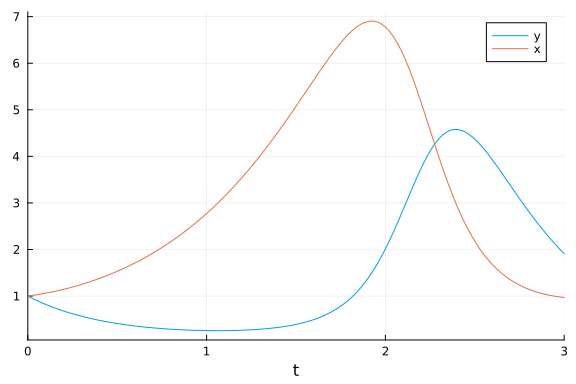
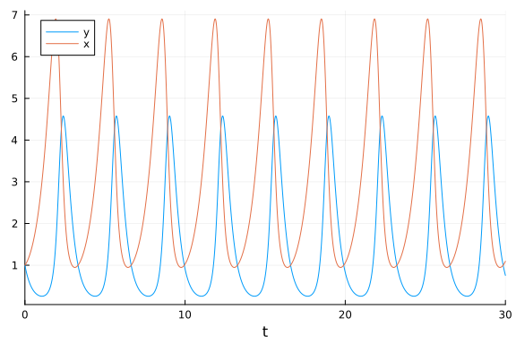

# Parameter estimation of Lotka Volterra model using optimisation methods

```julia
using ParameterizedFunctions, OrdinaryDiffEq, DiffEqParamEstim, Optimization, ForwardDiff
using OptimizationBBO, OptimizationNLopt, Plots, RecursiveArrayTools, BenchmarkTools
using ModelingToolkit
using ModelingToolkitBase
using SciCompDSL
using ModelingToolkit: @mtkbuild, D_nounits as D, t_nounits as t
gr(fmt = :png)
```

```
Plots.GRBackend()
```


```julia
loc_bounds = Tuple{Float64, Float64}[(0, 5), (0, 5), (
    0, 5), (0, 5)]
glo_bounds = Tuple{Float64, Float64}[(0, 10), (0, 10), (
    0, 10), (0, 10)]
loc_init = [1, 0.5, 3.5, 1.5]
glo_init = [5.0, 5.0, 5.0, 5.0]
```

```
4-element Vector{Float64}:
 5.0
 5.0
 5.0
 5.0
```


```julia
@mtkmodel LotkaVolterraTest begin
    @parameters begin
        a = 1.5  # Growth rate of prey
        b = 1.0  # Predation rate
        c = 3.0  # Death rate of predators
        d = 1.0  # Reproduction rate of predators
    end
    @variables begin
        x(t) = 1.0  # Population of prey with initial condition
        y(t) = 1.0  # Population of predators with initial condition
    end
    @equations begin
        D(x) ~ a * x - b * x * y
        D(y) ~ -c * y + d * x * y
    end
end

@mtkbuild f = LotkaVolterraTest()
```

```
Model f:
Equations (2):
  2 standard: see equations(f)
Unknowns (2): see unknowns(f)
  y(t)
  x(t)
Parameters (4): see parameters(f)
  a
  b
  c
  d
```


```julia
u0 = [1.0, 1.0]                          #initial values
tspan = (0.0, 10.0)
p = [1.5, 1.0, 3.0, 1.0]                   #parameters used, these need to be estimated from the data
tspan = (0.0, 30.0)                     # sample of 3000 observations over the (0,30) timespan
prob = ODEProblem(f, u0, tspan, p)
tspan2 = (0.0, 3.0)                     # sample of 3000 observations over the (0,30) timespan
prob_short = ODEProblem(f, u0, tspan2, p)
```

```
ODEProblem with uType Vector{Float64} and tType Float64. In-place: true
Initialization status: FULLY_DETERMINED
Non-trivial mass matrix: false
timespan: (0.0, 3.0)
u0: 2-element Vector{Float64}:
 1.0
 1.0
```


```julia
dt = 30.0/3000
tf = 30.0
tinterval = 0:dt:tf
time_points = collect(tinterval)
```

```
3001-element Vector{Float64}:
  0.0
  0.01
  0.02
  0.03
  0.04
  0.05
  0.06
  0.07
  0.08
  0.09
  ⋮
 29.92
 29.93
 29.94
 29.95
 29.96
 29.97
 29.98
 29.99
 30.0
```


```julia
h = 0.01
M = 300
tstart = 0.0
tstop = tstart + M * h
tinterval_short = 0:h:tstop
t_short = collect(tinterval_short)
```

```
301-element Vector{Float64}:
 0.0
 0.01
 0.02
 0.03
 0.04
 0.05
 0.06
 0.07
 0.08
 0.09
 ⋮
 2.92
 2.93
 2.94
 2.95
 2.96
 2.97
 2.98
 2.99
 3.0
```


```julia
#Generate Data
data_sol_short = solve(prob_short, Tsit5(), saveat = t_short, reltol = 1e-9, abstol = 1e-9)
data_short = convert(Array, data_sol_short)
data_sol = solve(prob, Tsit5(), saveat = time_points, reltol = 1e-9, abstol = 1e-9)
data = convert(Array, data_sol)
```

```
2×3001 Matrix{Float64}:
 1.0  0.980224  0.960888  0.941986  0.923508  …  0.785597  0.770673  0.7560
92
 1.0  1.00511   1.01045   1.01601   1.02179      1.07814   1.08595   1.0939
8
```


#### Plot of the solution

##### Short Solution

```julia
p1 = plot(data_sol_short)
```




##### Longer Solution

```julia
p2 = plot(data_sol)
```




### Local Solution from the short data set

```julia
obj_short = build_loss_objective(prob_short, Tsit5(), L2Loss(t_short, data_short), tstops = t_short)
optprob = OptimizationProblem(obj_short, loc_init, lb = first.(loc_bounds), ub = last.(loc_bounds))
@btime res1 = solve(optprob, BBO_adaptive_de_rand_1_bin(); maxiters = 7e3)
# Lower tolerance could lead to smaller fitness (more accuracy)
```

```
2.881 s (20970947 allocations: 792.10 MiB)
retcode: MaxIters
u: 4-element Vector{Float64}:
 1.500372966437285
 0.9995169076129775
 2.996045968774659
 0.9987631601718622
```


```julia
obj_short = build_loss_objective(
    prob_short, Tsit5(), L2Loss(t_short, data_short), tstops = t_short, reltol = 1e-9)
optprob = OptimizationProblem(obj_short, loc_init, lb = first.(loc_bounds), ub = last.(loc_bounds))
@btime res1 = solve(optprob, BBO_adaptive_de_rand_1_bin(); maxiters = 7e3)
# Change in tolerance makes it worse
```

```
2.879 s (21026114 allocations: 793.81 MiB)
retcode: MaxIters
u: 4-element Vector{Float64}:
 1.5006831204276552
 1.000934796409989
 2.99858130252164
 0.9991802622061451
```


```julia
obj_short = build_loss_objective(prob_short, Vern9(), L2Loss(t_short, data_short),
    tstops = t_short, reltol = 1e-9, abstol = 1e-9)
optprob = OptimizationProblem(obj_short, loc_init, lb = first.(loc_bounds), ub = last.(loc_bounds))
@btime res1 = solve(optprob, BBO_adaptive_de_rand_1_bin(); maxiters = 7e3)
# using the more accurate Vern9() reduces the fitness marginally and leads to some increase in time taken
```

```
4.663 s (42370888 allocations: 1.10 GiB)
retcode: MaxIters
u: 4-element Vector{Float64}:
 1.500407851541787
 0.999569551330911
 2.996805682143512
 0.9991587393436832
```


# Using NLopt

#### Global Optimisation first

```julia
obj_short = build_loss_objective(prob_short, Vern9(), L2Loss(t_short, data_short),
    Optimization.AutoForwardDiff(), tstops = t_short, reltol = 1e-9, abstol = 1e-9)
optprob = OptimizationProblem(obj_short, glo_init, lb = first.(glo_bounds), ub = last.(glo_bounds))
```

```
OptimizationProblem. In-place: true
u0: 4-element Vector{Float64}:
 5.0
 5.0
 5.0
 5.0
```


```julia
opt = Opt(:GN_ORIG_DIRECT_L, 4)
@btime res1 = solve(optprob, opt, maxiters = 10000, xtol_rel = 1e-12)
```

```
6.594 s (59570574 allocations: 1.54 GiB)
retcode: MaxIters
u: 4-element Vector{Float64}:
 1.3219306476960178
 1.1111111111111114
 4.444444444444443
 1.4814814814814825
```


```julia
opt = Opt(:GN_CRS2_LM, 4)
@btime res1 = solve(optprob, opt, maxiters = 10000, xtol_rel = 1e-12)
```

```
6.642 s (59659820 allocations: 1.54 GiB)
retcode: MaxIters
u: 4-element Vector{Float64}:
 1.5000000000702833
 1.0000000000849554
 2.999999999508325
 0.9999999999253558
```


```julia
opt = Opt(:GN_ISRES, 4)
@btime res1 = solve(optprob, opt, maxiters = 10000, xtol_rel = 1e-12)
```

```
6.720 s (59623903 allocations: 1.54 GiB)
retcode: MaxIters
u: 4-element Vector{Float64}:
 1.4027663950956613
 1.0466816378335828
 3.7991416583380633
 1.2271855533521143
```


```julia
opt = Opt(:GN_ESCH, 4)
@btime res1 = solve(optprob, opt, maxiters = 10000, xtol_rel = 1e-12)
```

```
6.652 s (59589420 allocations: 1.54 GiB)
retcode: MaxIters
u: 4-element Vector{Float64}:
 1.3129387866481201
 1.02330140128004
 4.4206065500538925
 1.4434469030558277
```


Now local optimization algorithms are used to verify the global ones. These use the local bounds (`loc_bounds`) and initial values (`loc_init`).

```julia
optprob = OptimizationProblem(obj_short, loc_init, lb = first.(loc_bounds), ub = last.(loc_bounds))
```

```
OptimizationProblem. In-place: true
u0: 4-element Vector{Float64}:
 1.0
 0.5
 3.5
 1.5
```


```julia
opt = Opt(:LN_BOBYQA, 4)
@btime res1 = solve(optprob, opt, maxiters = 10000, xtol_rel = 1e-12)
```

```
327.484 ms (3179520 allocations: 84.24 MiB)
retcode: Success
u: 4-element Vector{Float64}:
 1.5000000000703886
 1.0000000000849636
 2.9999999995077036
 0.9999999999251571
```


```julia
opt = Opt(:LN_NELDERMEAD, 4)
@btime res1 = solve(optprob, opt, maxiters = 10000, xtol_rel = 1e-12)
```

```
307.998 ms (3030955 allocations: 80.30 MiB)
retcode: Success
u: 4-element Vector{Float64}:
 1.50000000007048
 1.0000000000849136
 2.999999999507337
 0.9999999999250451
```


```julia
opt = Opt(:LD_SLSQP, 4)
@btime res1 = solve(optprob, opt, maxiters = 10000, xtol_rel = 1e-12)
```

```
8.093 s (70530530 allocations: 1.87 GiB)
retcode: MaxIters
u: 4-element Vector{Float64}:
 1.500000000070235
 1.0000000000849147
 2.9999999995084474
 0.9999999999254001
```


```julia
opt = Opt(:LN_COBYLA, 4)
@btime res1 = solve(optprob, opt, maxiters = 10000, xtol_rel = 1e-12)
```

```
6.631 s (59540084 allocations: 1.54 GiB)
retcode: MaxIters
u: 4-element Vector{Float64}:
 1.4999991475913865
 0.999999751348316
 3.00000440952992
 1.0000013905975
```


```julia
opt = Opt(:LN_NEWUOA_BOUND, 4)
@btime res1 = solve(optprob, opt, maxiters = 10000, xtol_rel = 1e-12)
```

```
46391.281 s (10425767 allocations: 276.24 MiB)
retcode: Failure
u: 4-element Vector{Float64}:
 1.4999957298677546
 0.9999954574279393
 3.000007111770159
 1.0000010025281418
```


```julia
opt = Opt(:LN_PRAXIS, 4)
@btime res1 = solve(optprob, opt, maxiters = 10000, xtol_rel = 1e-12)
```

```
121.023 ms (1202888 allocations: 31.87 MiB)
retcode: Success
u: 4-element Vector{Float64}:
 1.5000000000699631
 1.000000000084824
 2.9999999995093436
 0.9999999999258158
```


```julia
opt = Opt(:LN_SBPLX, 4)
@btime res1 = solve(optprob, opt, maxiters = 10000, xtol_rel = 1e-12)
```

```
6.802 s (59540066 allocations: 1.54 GiB)
retcode: MaxIters
u: 4-element Vector{Float64}:
 1.4999999301104459
 0.9999999814386067
 3.000000353466034
 1.0000001103210938
```


```julia
opt = Opt(:LD_MMA, 4)
@btime res1 = solve(optprob, opt, maxiters = 10000, xtol_rel = 1e-12)
```

```
15.379 s (118980443 allocations: 3.35 GiB)
retcode: MaxIters
u: 4-element Vector{Float64}:
 1.5000000000653453
 1.0000000000836686
 2.999999999534401
 0.9999999999334743
```


```julia
opt = Opt(:LD_TNEWTON_PRECOND_RESTART, 4)
@btime res1 = solve(optprob, opt, maxiters = 10000, xtol_rel = 1e-12)
```

```
52.318 ms (464474 allocations: 13.46 MiB)
retcode: Success
u: 4-element Vector{Float64}:
 1.500000000070224
 1.0000000000849025
 2.999999999508518
 0.9999999999254164
```


## Now the longer problem is solved for a global solution

The Vern9 solver with reltol=1e-9 and abstol=1e-9 is used, and the dataset is increased to 3000 observations per variable with the same integration time step of 0.01.

```julia
t_concrete = collect(0.0:dt:tf)
obj = build_loss_objective(prob, Vern9(), L2Loss(t_concrete, data),
    tstops = t_concrete, reltol = 1e-9, abstol = 1e-9)
optprob = OptimizationProblem(obj, glo_init, lb = first.(glo_bounds), ub = last.(glo_bounds))
```

```
OptimizationProblem. In-place: true
u0: 4-element Vector{Float64}:
 5.0
 5.0
 5.0
 5.0
```


```julia
@btime res1 = solve(optprob, BBO_adaptive_de_rand_1_bin(), maxiters = 4e3)
```

```
22.484 s (224263251 allocations: 4.63 GiB)
retcode: MaxIters
u: 4-element Vector{Float64}:
 5.959445081578595
 6.934355541855836
 0.6724411495571827
 0.2857305199796635
```


```julia
opt = Opt(:GN_ORIG_DIRECT_L, 4)
@btime res1 = solve(optprob, opt, maxiters = 10000, xtol_rel = 1e-12)
```

```
54.967 s (547530784 allocations: 11.30 GiB)
retcode: MaxIters
u: 4-element Vector{Float64}:
 0.5587857860572962
 0.3703703703710262
 7.777777777777123
 5.212620027435056
```


```julia
opt = Opt(:GN_CRS2_LM, 4)
@btime res1 = solve(optprob, opt, maxiters = 20000, xtol_rel = 1e-12)
```

```
109.492 s (1090289055 allocations: 22.50 GiB)
retcode: MaxIters
u: 4-element Vector{Float64}:
 1.4999999994911342
 1.0000000002373208
 3.0000000017582664
 1.000000000751626
```


```julia
opt = Opt(:GN_ISRES, 4)
@btime res1 = solve(optprob, opt, maxiters = 50000, xtol_rel = 1e-12)
```

```
274.271 s (2728650293 allocations: 56.30 GiB)
retcode: MaxIters
u: 4-element Vector{Float64}:
 0.7613970443665754
 2.14083782782423
 7.490559893349109
 3.8506843934946544
```


```julia
opt = Opt(:GN_ESCH, 4)
@btime res1 = solve(optprob, opt, maxiters = 20000, xtol_rel = 1e-12)
```

```
110.251 s (1091540050 allocations: 22.52 GiB)
retcode: MaxIters
u: 4-element Vector{Float64}:
 0.9579324283876236
 0.6993537279954096
 5.311057861602482
 2.1420403317272325
```


## Local problem

```julia
obj = build_loss_objective(prob, Vern9(), L2Loss(t, data), Optimization.AutoForwardDiff(),
    tstops = t, reltol = 1e-9, abstol = 1e-9)
optprob = OptimizationProblem(obj_short, loc_init, lb = first.(loc_bounds), ub = last.(loc_bounds))
```

```
OptimizationProblem. In-place: true
u0: 4-element Vector{Float64}:
 1.0
 0.5
 3.5
 1.5
```


```julia
opt = Opt(:LN_BOBYQA, 4)
@btime res1 = solve(optprob, opt, maxiters = 10000, xtol_rel = 1e-12)
```

```
326.365 ms (3179520 allocations: 84.24 MiB)
retcode: Success
u: 4-element Vector{Float64}:
 1.5000000000703886
 1.0000000000849636
 2.9999999995077036
 0.9999999999251571
```


```julia
opt = Opt(:LN_NELDERMEAD, 4)
@btime res1 = solve(optprob, opt, maxiters = 10000, xtol_rel = 1e-12)
```

```
309.051 ms (3030955 allocations: 80.30 MiB)
retcode: Success
u: 4-element Vector{Float64}:
 1.50000000007048
 1.0000000000849136
 2.999999999507337
 0.9999999999250451
```


```julia
opt = Opt(:LD_SLSQP, 4)
@btime res1 = solve(optprob, opt, maxiters = 10000, xtol_rel = 1e-12)
```

```
8.247 s (70530530 allocations: 1.87 GiB)
retcode: MaxIters
u: 4-element Vector{Float64}:
 1.500000000070235
 1.0000000000849147
 2.9999999995084474
 0.9999999999254001
```


Parameter estimation on the longer sample proves to be extremely challenging for some of the global optimizers. A few give the accurate values, BlackBoxOptim also performs quite well, while others seem to struggle with accuracy a lot.

# Conclusion

In general we observe that lower tolerances lead to higher accuracy but too low tolerance could affect the convergence time drastically. Also fitting a shorter timespan seems to be easier in comparison (quite intuitively). NLopt methods seem to give great accuracy in the shorter problem with a lot of the algorithms giving 0 fitness, BBO performs very well on it with marginal change with `tol` values. In the case of global optimization for the longer problem, there is some difference in performance among the algorithms with `LD_SLSQP` `GN_ESCH` `GN_ISRES` `GN_ORIG_DIRECT_L` performing among the worst, BBO also gives a bit high fitness in comparison.


## Appendix

These benchmarks are a part of the SciMLBenchmarks.jl repository, found at: [https://github.com/SciML/SciMLBenchmarks.jl](https://github.com/SciML/SciMLBenchmarks.jl). For more information on high-performance scientific machine learning, check out the SciML Open Source Software Organization [https://sciml.ai](https://sciml.ai).

To locally run this benchmark, do the following commands:
```
using SciMLBenchmarks
SciMLBenchmarks.weave_file("benchmarks/ParameterEstimation","LotkaVolterraParameterEstimation.jmd")
```

Computer Information:

```
Julia Version 1.12.7
Commit 6d172b025e4 (2026-08-15 08:05 UTC)
Build Info:
  Official https://julialang.org release
Platform Info:
  OS: Linux (x86_64-linux-gnu)
  CPU: 128 × AMD EPYC 7502 32-Core Processor
  WORD_SIZE: 64
  LLVM: libLLVM-18.1.7 (ORCJIT, znver2)
  GC: Built with stock GC
Threads: 128 default, 1 interactive, 128 GC (on 128 virtual cores)
Environment:
  JULIA_NUM_THREADS = auto

```

Package Information:

```
Status `/julia/github-runners/amdci1-1/_work/SciMLBenchmarks.jl/SciMLBenchmarks.jl/benchmarks/ParameterEstimation/Project.toml`
  [6e4b80f9] BenchmarkTools v1.8.0
  [a134a8b2] BlackBoxOptim v0.6.12
  [a93c6f00] DataFrames v1.8.2
⌃ [1130ab10] DiffEqParamEstim v2.6.1
  [31c24e10] Distributions v0.25.131
  [f6369f11] ForwardDiff v1.4.6
⌃ [961ee093] ModelingToolkit v11.43.0
⌃ [7771a370] ModelingToolkitBase v1.70.0
  [76087f3c] NLopt v1.2.1
⌃ [7f7a1694] Optimization v5.9.0
  [3e6eede4] OptimizationBBO v0.4.12
  [4e6fcdb7] OptimizationNLopt v0.3.18
  [1dea7af3] OrdinaryDiffEq v7.8.1
  [ab63da0c] ParallelParticleSwarms v1.6.2
  [65888b18] ParameterizedFunctions v5.27.0
  [91a5bcdd] Plots v1.41.7
⌃ [731186ca] RecursiveArrayTools v4.5.1
⌃ [91a8cdf1] SciCompDSL v1.0.3
  [31c91b34] SciMLBenchmarks v0.2.1 [loaded: `/julia/github-runners/amdci1-1/_work/SciMLBenchmarks.jl/SciMLBenchmarks.jl/src/SciMLBenchmarks.jl` (v0.2.1) expected `/home/crackauc/.julia/packages/SciMLBenchmarks/ceJyd/src/SciMLBenchmarks.jl` (v0.2.1)]
Info Packages marked with ⌃ have new versions available and may be upgradable.
```

And the full manifest:

```
Status `/julia/github-runners/amdci1-1/_work/SciMLBenchmarks.jl/SciMLBenchmarks.jl/benchmarks/ParameterEstimation/Manifest.toml`
  [47edcb42] ADTypes v1.24.0
  [14f7f29c] AMD v0.5.4
  [6e696c72] AbstractPlutoDingetjes v1.4.1
  [1520ce14] AbstractTrees v0.4.5
  [7d9f7c33] Accessors v0.1.45
⌃ [79e6a3ab] Adapt v4.7.0
  [66dad0bd] AliasTables v1.1.3
  [ec485272] ArnoldiMethod v0.4.0
⌃ [4fba245c] ArrayInterface v7.30.1
⌃ [4c555306] ArrayLayouts v1.12.2
  [a9b6321e] Atomix v1.2.1
⌃ [aae01518] BandedMatrices v1.12.0
  [6e4b80f9] BenchmarkTools v1.8.0
  [e2ed5e7c] Bijections v0.2.2
  [b2a6c25c] BinaryHeaps v1.1.0
  [caf10ac8] BipartiteGraphs v0.1.14
  [a134a8b2] BlackBoxOptim v0.6.12
  [8e7c35d0] BlockArrays v1.10.0
  [70df07ce] BracketingNonlinearSolve v1.12.7
  [fa961155] CEnum v0.5.0
  [d360d2e6] ChainRulesCore v1.26.1
  [35d6a980] ColorSchemes v3.31.0
⌃ [3da002f7] ColorTypes v0.12.1
  [c3611d14] ColorVectorSpace v0.11.0
  [5ae59095] Colors v0.13.1
⌅ [861a8166] Combinatorics v1.0.2
  [38540f10] CommonSolve v0.2.14
  [bbf7d656] CommonSubexpressions v0.3.1
  [f70d9fcc] CommonWorldInvalidations v1.2.2
  [34da2185] Compat v4.18.1
  [b152e2b5] CompositeTypes v0.1.4
  [a33af91c] CompositionsBase v0.1.2
  [2569d6c7] ConcreteStructs v0.2.8
  [88cd18e8] ConsoleProgressMonitor v0.1.2
  [187b0558] ConstructionBase v1.6.0
  [d38c429a] Contour v0.6.3
  [a8cc5b0e] Crayons v4.2.0
  [9a962f9c] DataAPI v1.16.0
  [a93c6f00] DataFrames v1.8.2
  [864edb3b] DataStructures v0.19.6
  [e2d170a0] DataValueInterfaces v1.0.0
  [8bb1440f] DelimitedFiles v1.9.1
  [39dd38d3] Dierckx v0.5.4
⌃ [2b5f629d] DiffEqBase v7.21.1
⌃ [459566f4] DiffEqCallbacks v4.19.3
⌃ [071ae1c0] DiffEqGPU v3.21.0
⌃ [1130ab10] DiffEqParamEstim v2.6.1
  [163ba53b] DiffResults v1.1.0
  [b552c78f] DiffRules v1.16.0
  [a0c0ee7d] DifferentiationInterface v0.7.21
  [31c24e10] Distributions v0.25.131
  [ffbed154] DocStringExtensions v0.9.5
⌃ [5b8099bc] DomainSets v0.8.1
  [7c1d4256] DynamicPolynomials v0.6.8
  [4e289a0a] EnumX v1.0.7
⌃ [7da242da] Enzyme v0.13.203
  [f151be2c] EnzymeCore v0.8.21
  [e2ba6199] ExprTools v0.1.11
  [55351af7] ExproniconLite v0.10.14
  [c87230d0] FFMPEG v0.4.5
  [7034ab61] FastBroadcast v1.4.0
  [9aa1b823] FastClosures v0.3.2
  [a4df4552] FastPower v1.5.0
  [1a297f60] FillArrays v1.17.0
⌃ [64ca27bc] FindFirstFunctions v3.2.1
  [6a86dc24] FiniteDiff v2.33.0
⌅ [53c48c17] FixedPointNumbers v0.8.6
  [1fa38f19] Format v1.3.7
  [f6369f11] ForwardDiff v1.4.6
  [a85aefff] FunctionMaps v0.1.2
  [069b7b12] FunctionWrappers v1.1.3
  [77dc65aa] FunctionWrappersWrappers v1.13.0
⌃ [46192b85] GPUArraysCore v0.2.0
⌅ [61eb1bfa] GPUCompiler v1.23.0
  [28b8d3ca] GR v0.73.27
⌃ [a0844989] Gamma v1.1.0
  [86223c79] Graphs v1.15.0
  [076d061b] HashArrayMappedTries v0.2.0
⌅ [eafb193a] Highlights v0.5.3
  [34004b35] HypergeometricFunctions v0.3.30
  [3263718b] ImplicitDiscreteSolve v2.3.0
  [d25df0c9] Inflate v0.1.5
⌅ [842dd82b] InlineStrings v1.4.6
  [18e54dd8] IntegerMathUtils v0.1.4
  [8197267c] IntervalSets v0.7.14
  [3587e190] InverseFunctions v0.1.17
  [41ab1584] InvertedIndices v1.3.1
  [92d709cd] IrrationalConstants v0.2.6
  [82899510] IteratorInterfaceExtensions v1.0.0
  [1019f520] JLFzf v0.1.11
  [692b3bcd] JLLWrappers v1.8.0
⌅ [682c06a0] JSON v0.21.4
  [ae98c720] Jieko v0.2.1
⌃ [ccbc3e58] JumpProcesses v9.32.3
  [63c18a36] KernelAbstractions v0.9.42
⌃ [ba0b0d4f] Krylov v0.10.9
  [2faa5264] LHLFactorization v2.2.2
  [929cbde3] LLVM v9.13.1
  [b964fa9f] LaTeXStrings v1.4.1
  [23fbe1c1] Latexify v0.16.12
  [73f95e8e] LatticeRules v0.0.2
  [1d6d02ad] LeftChildRightSiblingTrees v0.3.0
⌃ [87fe0de2] LineSearch v0.1.17
⌃ [7ed4a6bd] LinearSolve v5.17.2
⌃ [2ab3a3ac] LogExpFunctions v0.3.29
  [e6f89c97] LoggingExtras v1.2.0
  [d8e11817] MLStyle v0.4.17
  [1914dd2f] MacroTools v0.5.16
  [bb5d69b7] MaybeInplace v0.1.8
  [442fdcdd] Measures v0.3.3
  [e1d29d7a] Missings v1.2.0
⌃ [961ee093] ModelingToolkit v11.43.0
⌃ [7771a370] ModelingToolkitBase v1.70.0
  [6bb917b9] ModelingToolkitTearing v1.20.6
⌅ [2e0e35c7] Moshi v0.3.9
  [46d2c3a1] MuladdMacro v0.2.7
⌃ [102ac46a] MultivariatePolynomials v0.5.19
⌃ [ffc61752] Mustache v1.0.21 [loaded: v1.1.0]
⌃ [d8a4904e] MutableArithmetics v1.8.0
  [76087f3c] NLopt v1.2.1
  [77ba4419] NaNMath v1.1.4
⌃ [8913a72c] NonlinearSolve v4.30.0
⌃ [be0214bd] NonlinearSolveBase v2.49.5
⌃ [5959db7a] NonlinearSolveFirstOrder v2.6.1
  [9a2c21bd] NonlinearSolveQuasiNewton v1.15.3
  [26075421] NonlinearSolveSpectralMethods v1.8.3
  [d8793406] ObjectFile v0.5.1
  [6fe1bfb0] OffsetArrays v1.17.0
⌃ [7f7a1694] Optimization v5.9.0
  [3e6eede4] OptimizationBBO v0.4.12
⌃ [bca83a33] OptimizationBase v5.5.3
  [4e6fcdb7] OptimizationNLopt v0.3.18
⌅ [bac558e1] OrderedCollections v1.8.2 [loaded: v2.0.1]
  [1dea7af3] OrdinaryDiffEq v7.8.1
⌃ [6ad6398a] OrdinaryDiffEqBDF v2.4.8
⌃ [bbf590c4] OrdinaryDiffEqCore v4.17.1
  [50262376] OrdinaryDiffEqDefault v2.6.2
⌃ [4302a76b] OrdinaryDiffEqDifferentiation v3.11.5
⌃ [127b3ac7] OrdinaryDiffEqNonlinearSolve v2.9.6
⌃ [43230ef6] OrdinaryDiffEqRosenbrock v2.7.3
  [b4bd8bb3] OrdinaryDiffEqRosenbrockTableaus v2.4.2
⌃ [2d112036] OrdinaryDiffEqSDIRK v2.9.2
  [b1df2697] OrdinaryDiffEqTsit5 v2.1.4
  [79d7bb75] OrdinaryDiffEqVerner v2.4.1
  [90014a1f] PDMats v0.11.41
  [ab63da0c] ParallelParticleSwarms v1.6.2
  [65888b18] ParameterizedFunctions v5.27.0
  [d96e819e] Parameters v0.13.1
⌅ [69de0a69] Parsers v2.8.8
  [06bb1623] PenaltyFunctions v0.3.0
  [ccf2f8ad] PlotThemes v3.3.0
⌃ [995b91a9] PlotUtils v1.4.4
  [91a5bcdd] Plots v1.41.7
  [e409e4f3] PoissonRandom v0.4.13
  [2dfb63ee] PooledArrays v1.4.3
  [d236fae5] PreallocationTools v1.7.1
  [aea7be01] PrecompileTools v1.3.4
⌃ [21216c6a] Preferences v1.5.2 [loaded: v1.6.0]
  [08abe8d2] PrettyTables v3.4.8
  [27ebfcd6] Primes v0.5.7
  [33c8b6b6] ProgressLogging v0.1.6
  [92933f4c] ProgressMeter v1.11.0
  [43287f4e] PtrArrays v1.4.0
⌃ [0c0d3e7f] PureKLU v1.4.2
  [1fd47b50] QuadGK v2.11.3
  [8a4e6c94] QuasiMonteCarlo v0.4.4
  [988b38a3] ReadOnlyArrays v0.2.0
  [795d4caa] ReadOnlyDicts v1.0.1
  [3cdcf5f2] RecipesBase v1.3.4
  [01d81517] RecipesPipeline v0.6.12
⌃ [731186ca] RecursiveArrayTools v4.5.1
  [189a3867] Reexport v1.2.2
  [05181044] RelocatableFolders v1.0.1
  [ae029012] Requires v1.3.1
  [9fe22ead] RespecializeParams v1.3.0
  [79098fc4] Rmath v0.9.0
  [f2b01f46] Roots v3.0.8
  [7e49a35a] RuntimeGeneratedFunctions v0.5.26
  [9dfe8606] SCCNonlinearSolve v1.15.3
⌃ [91a8cdf1] SciCompDSL v1.0.3
⌃ [0bca4576] SciMLBase v3.53.3
  [31c91b34] SciMLBenchmarks v0.2.1 [loaded: `/julia/github-runners/amdci1-1/_work/SciMLBenchmarks.jl/SciMLBenchmarks.jl/src/SciMLBenchmarks.jl` (v0.2.1) expected `/home/crackauc/.julia/packages/SciMLBenchmarks/ceJyd/src/SciMLBenchmarks.jl` (v0.2.1)]
  [19f34311] SciMLJacobianOperators v0.1.19
  [a6db7da4] SciMLLogging v2.1.0
⌃ [c0aeaf25] SciMLOperators v1.30.0
  [431bcebd] SciMLPublic v1.3.0
  [53ae85a6] SciMLStructures v1.10.5
  [7e506255] ScopedValues v1.6.2
  [6c6a2e73] Scratch v1.3.0
  [91c51154] SentinelArrays v1.4.10
  [efcf1570] Setfield v1.1.2
  [992d4aef] Showoff v1.1.1
  [05bca326] SimpleDiffEq v1.18.0
⌃ [727e6d20] SimpleNonlinearSolve v2.14.3
  [510db2f7] SimpleOptimization v2.0.1
  [699a6c99] SimpleTraits v0.9.6
  [ed01d8cd] Sobol v1.5.0
  [a2af1166] SortingAlgorithms v1.2.3
  [a57abbd0] SparseColumnPivotedQR v2.1.8
  [9f842d2f] SparseConnectivityTracer v1.2.3
  [0a514795] SparseMatrixColorings v0.4.28
  [276daf66] SpecialFunctions v2.9.0
  [860ef19b] StableRNGs v1.0.4
  [0c0c59c1] StarAlgebras v0.3.0
  [64909d44] StateSelection v1.11.1
⌃ [90137ffa] StaticArrays v1.9.20
  [1e83bf80] StaticArraysCore v1.4.4
  [10745b16] Statistics v1.11.5
  [82ae8749] StatsAPI v1.8.0
  [2913bbd2] StatsBase v0.34.13
  [4c63d2b9] StatsFuns v2.2.1
  [69024149] StringEncodings v0.3.7
⌅ [892a3eda] StringManipulation v0.5.0
  [53d494c1] StructIO v0.3.1
  [2efcf032] SymbolicIndexingInterface v0.3.55
  [19f23fe9] SymbolicLimits v1.2.1
⌃ [d1185830] SymbolicUtils v4.46.5
⌃ [0c5d862f] Symbolics v7.39.2
  [3783bdb8] TableTraits v1.0.1
  [bd369af6] Tables v1.14.0
  [ed4db957] TaskLocalValues v0.1.3
  [62fd8b95] TensorCore v0.1.1
  [8ea1fca8] TermInterface v2.0.0
  [5d786b92] TerminalLoggers v0.1.8
⌃ [a759f4b9] TimerOutputs v1.2.1
  [e689c965] Tracy v0.1.6
  [781d530d] TruncatedStacktraces v1.4.0
  [5c2747f8] URIs v1.7.0
  [3a884ed6] UnPack v1.0.2
  [1cfade01] UnicodeFun v0.4.1
  [013be700] UnsafeAtomics v0.3.2
  [41fe7b60] Unzip v0.2.0
  [d30d5f5c] WeakCacheSets v0.1.0
  [44d3d7a6] Weave v0.10.12
⌃ [ddb6d928] YAML v0.4.16 [loaded: v0.4.17]
  [700de1a5] ZygoteRules v0.2.8
  [6e34b625] Bzip2_jll v1.0.9+0
  [83423d85] Cairo_jll v1.18.7+0
  [ee1fde0b] Dbus_jll v1.16.2+0
  [cd4c43a9] Dierckx_jll v0.2.0+0
⌅ [7cc45869] Enzyme_jll v0.0.293+0
  [2702e6a9] EpollShim_jll v0.0.20230411+1
  [2e619515] Expat_jll v2.8.4+0
⌅ [b22a6f82] FFMPEG_jll v8.1.2+0
  [a3f928ae] Fontconfig_jll v2.17.1+0
  [d7e528f0] FreeType2_jll v2.14.3+1
  [559328eb] FriBidi_jll v1.0.17+0
  [0656b61e] GLFW_jll v3.5.1+0
  [d2c73de3] GR_jll v0.73.27+0
⌅ [b0724c58] GettextRuntime_jll v0.22.4+0
  [61579ee1] Ghostscript_jll v9.55.1+0
  [7746bdde] Glib_jll v2.88.3+0
  [3b182d85] Graphite2_jll v1.3.16+0
  [2e76f6c2] HarfBuzz_jll v100.14004.0+0
  [1d5cc7b8] IntelOpenMP_jll v2025.2.0+0
  [aacddb02] JpegTurbo_jll v3.2.0+1
  [c1c5ebd0] LAME_jll v3.100.3+0
  [88015f11] LERC_jll v4.2.0+0
  [dad2f222] LLVMExtra_jll v0.0.47+0
  [1d63c593] LLVMOpenMP_jll v23.1.1+0
  [ad6e5548] LibTracyClient_jll v0.13.1+0
⌅ [e9f186c6] Libffi_jll v3.4.7+0
  [7e76a0d4] Libglvnd_jll v1.7.1+1
  [94ce4f54] Libiconv_jll v1.18.0+0
  [4b2f31a3] Libmount_jll v2.42.0+0
  [89763e89] Libtiff_jll v4.7.3+0
  [38a345b3] Libuuid_jll v2.42.0+0
  [856f044c] MKL_jll v2025.2.0+0
  [079eb43e] NLopt_jll v2.11.0+0
  [e7412a2a] Ogg_jll v1.3.6+0
  [efe28fd5] OpenSpecFun_jll v0.5.6+0
  [91d4177d] Opus_jll v1.6.1+0
  [36c8627f] Pango_jll v1.58.2+0
  [30392449] Pixman_jll v0.46.4+0
  [c0090381] Qt6Base_jll v6.10.2+2
  [629bc702] Qt6Declarative_jll v6.10.2+2
  [ce943373] Qt6ShaderTools_jll v6.10.2+1
  [6de9746b] Qt6Svg_jll v6.10.2+0
  [e99dba38] Qt6Wayland_jll v6.10.2+1
  [f50d1b31] Rmath_jll v0.5.2+0
  [a44049a8] Vulkan_Loader_jll v1.3.243+0
  [a2964d1f] Wayland_jll v1.24.0+0
  [ffd25f8a] XZ_jll v5.8.4+0
  [f67eecfb] Xorg_libICE_jll v1.1.2+0
  [c834827a] Xorg_libSM_jll v1.2.6+0
  [4f6342f7] Xorg_libX11_jll v1.8.13+0
  [0c0b7dd1] Xorg_libXau_jll v1.0.13+0
  [935fb764] Xorg_libXcursor_jll v1.2.4+0
  [a3789734] Xorg_libXdmcp_jll v1.1.6+0
  [1082639a] Xorg_libXext_jll v1.3.8+0
  [d091e8ba] Xorg_libXfixes_jll v6.0.2+0
  [a51aa0fd] Xorg_libXi_jll v1.8.4+0
  [d1454406] Xorg_libXinerama_jll v1.1.7+0
  [ec84b674] Xorg_libXrandr_jll v1.5.6+0
  [ea2f1a96] Xorg_libXrender_jll v0.9.12+0
  [a65dc6b1] Xorg_libpciaccess_jll v0.19.0+0
  [c7cfdc94] Xorg_libxcb_jll v1.17.1+0
  [cc61e674] Xorg_libxkbfile_jll v1.2.0+0
  [e920d4aa] Xorg_xcb_util_cursor_jll v0.1.6+0
  [12413925] Xorg_xcb_util_image_jll v0.4.1+0
  [2def613f] Xorg_xcb_util_jll v0.4.1+0
  [975044d2] Xorg_xcb_util_keysyms_jll v0.4.1+0
  [0d47668e] Xorg_xcb_util_renderutil_jll v0.3.10+0
  [c22f9ab0] Xorg_xcb_util_wm_jll v0.4.2+0
  [35661453] Xorg_xkbcomp_jll v1.4.7+0
  [33bec58e] Xorg_xkeyboard_config_jll v2.47.0+2
  [c5fb5394] Xorg_xtrans_jll v1.6.0+0
  [3161d3a3] Zstd_jll v1.5.7+1
  [35ca27e7] eudev_jll v3.2.14+0
⌅ [214eeab7] fzf_jll v0.61.1+0
⌃ [a4ae2306] libaom_jll v3.14.1+0
  [0ac62f75] libass_jll v0.17.5+0
  [1183f4f0] libdecor_jll v0.2.2+0
  [8e53e030] libdrm_jll v2.4.134+0
  [2db6ffa8] libevdev_jll v1.13.4+0
  [f638f0a6] libfdk_aac_jll v2.0.4+0
  [36db933b] libinput_jll v1.28.1+0
  [b53b4c65] libpng_jll v1.6.58+0
  [9a156e7d] libva_jll v2.23.0+0
  [f27f6e37] libvorbis_jll v1.3.8+0
  [009596ad] mtdev_jll v1.1.7+0
  [1317d2d5] oneTBB_jll v2022.3.0+0
⌅ [1270edf5] x264_jll v10164.0.1+0
  [dfaa095f] x265_jll v4.1.0+0
  [d8fb68d0] xkbcommon_jll v1.13.0+0
  [0dad84c5] ArgTools v1.1.2
  [56f22d72] Artifacts v1.11.0
  [2a0f44e3] Base64 v1.11.0
  [ade2ca70] Dates v1.11.0
  [8ba89e20] Distributed v1.11.0
  [f43a241f] Downloads v1.7.0
  [7b1f6079] FileWatching v1.11.0
  [9fa8497b] Future v1.11.0
  [b77e0a4c] InteractiveUtils v1.11.0
  [ac6e5ff7] JuliaSyntaxHighlighting v1.12.0
  [4af54fe1] LazyArtifacts v1.11.0
  [b27032c2] LibCURL v0.6.4
  [76f85450] LibGit2 v1.11.0
  [8f399da3] Libdl v1.11.0
  [37e2e46d] LinearAlgebra v1.12.0
  [56ddb016] Logging v1.11.0
  [d6f4376e] Markdown v1.11.0
  [a63ad114] Mmap v1.11.0
  [ca575930] NetworkOptions v1.3.0
  [44cfe95a] Pkg v1.12.1
  [de0858da] Printf v1.11.0
  [9abbd945] Profile v1.11.0
  [3fa0cd96] REPL v1.11.0
  [9a3f8284] Random v1.11.0
  [ea8e919c] SHA v0.7.0
  [9e88b42a] Serialization v1.11.0
  [6462fe0b] Sockets v1.11.0
  [2f01184e] SparseArrays v1.12.0
  [f489334b] StyledStrings v1.11.0
  [4607b0f0] SuiteSparse
  [fa267f1f] TOML v1.0.3
  [a4e569a6] Tar v1.10.0
  [8dfed614] Test v1.11.0
  [cf7118a7] UUIDs v1.11.0
  [4ec0a83e] Unicode v1.11.0
  [e66e0078] CompilerSupportLibraries_jll v1.3.1+2
  [deac9b47] LibCURL_jll v8.15.0+0
  [e37daf67] LibGit2_jll v1.9.0+0
  [29816b5a] LibSSH2_jll v1.11.3+1
  [14a3606d] MozillaCACerts_jll v2025.11.4
  [4536629a] OpenBLAS_jll v0.3.29+0
  [05823500] OpenLibm_jll v0.8.7+0
  [458c3c95] OpenSSL_jll v3.5.6+0
  [efcefdf7] PCRE2_jll v10.44.0+1
  [bea87d4a] SuiteSparse_jll v7.8.3+2
  [83775a58] Zlib_jll v1.3.1+2
  [8e850b90] libblastrampoline_jll v5.15.0+0
  [8e850ede] nghttp2_jll v1.64.0+1
  [3f19e933] p7zip_jll v17.7.0+0
Info Packages marked with ⌃ and ⌅ have new versions available. Those with ⌃ may be upgradable, but those with ⌅ are restricted by compatibility constraints from upgrading. To see why use `status --outdated -m`
```

