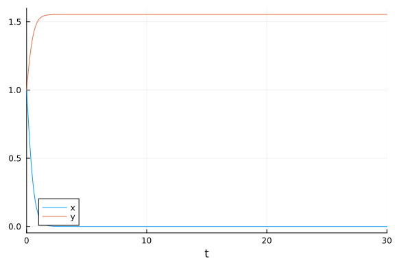

# Parameter estimation of Lotka Volterra model using optimisation methods

```julia
using ParameterizedFunctions, OrdinaryDiffEq, DiffEqParamEstim, Optimization, ForwardDiff
using OptimizationBBO, OptimizationNLopt, Plots, RecursiveArrayTools, BenchmarkTools
gr(fmt=:png)
```

```
Plots.GRBackend()
```


```julia
loc_bounds = Tuple{Float64, Float64}[(0, 5), (0, 5), (0, 5), (0, 5)]
glo_bounds = Tuple{Float64, Float64}[(0, 10), (0, 10), (0, 10), (0, 10)]
loc_init = [1,0.5,3.5,1.5]
glo_init = [5,5,5,5]
```

```
4-element Vector{Int64}:
 5
 5
 5
 5
```


```julia
f = @ode_def LotkaVolterraTest begin
    dx = a*x - b*x*y
    dy = -c*y + d*x*y
end a b c d
```

```
(::Main.var"##WeaveSandBox#15901".LotkaVolterraTest{Main.var"##WeaveSandBox
#15901".var"###ParameterizedDiffEqFunction#15903", Main.var"##WeaveSandBox#
15901".var"###ParameterizedTGradFunction#15904", Main.var"##WeaveSandBox#15
901".var"###ParameterizedJacobianFunction#15905", Nothing, Nothing, Modelin
gToolkit.ODESystem}) (generic function with 1 method)
```


```julia
u0 = [1.0,1.0]                          #initial values
tspan = (0.0,10.0)
p = [1.5,1.0,3.0,1,0]                   #parameters used, these need to be estimated from the data
tspan = (0.0, 30.0)                     # sample of 3000 observations over the (0,30) timespan
prob = ODEProblem(f, u0, tspan,p)
tspan2 = (0.0, 3.0)                     # sample of 3000 observations over the (0,30) timespan
prob_short = ODEProblem(f, u0, tspan2,p)
```

```
ODEProblem with uType Vector{Float64} and tType Float64. In-place: true
timespan: (0.0, 3.0)
u0: 2-element Vector{Float64}:
 1.0
 1.0
```


```julia
dt = 30.0/3000
tf = 30.0
tinterval = 0:dt:tf
t  = collect(tinterval)
```

```
3001-element Vector{Float64}:
  0.0
  0.01
  0.02
  0.03
  0.04
  0.05
  0.06
  0.07
  0.08
  0.09
  ⋮
 29.92
 29.93
 29.94
 29.95
 29.96
 29.97
 29.98
 29.99
 30.0
```


```julia
h = 0.01
M = 300
tstart = 0.0
tstop = tstart + M * h
tinterval_short = 0:h:tstop
t_short = collect(tinterval_short)
```

```
301-element Vector{Float64}:
 0.0
 0.01
 0.02
 0.03
 0.04
 0.05
 0.06
 0.07
 0.08
 0.09
 ⋮
 2.92
 2.93
 2.94
 2.95
 2.96
 2.97
 2.98
 2.99
 3.0
```


```julia
#Generate Data
data_sol_short = solve(prob_short,Tsit5(),saveat=t_short,reltol=1e-9,abstol=1e-9)
data_short = convert(Array, data_sol_short)
data_sol = solve(prob,Tsit5(),saveat=t,reltol=1e-9,abstol=1e-9)
data = convert(Array, data_sol)
```

```
2×3001 Matrix{Float64}:
 1.0  1.00511   1.01045   1.01601   1.02179   …  1.07814   1.08595   1.0939
8
 1.0  0.980224  0.960888  0.941986  0.923508     0.785597  0.770673  0.7560
92
```


#### Plot of the solution

##### Short Solution

```julia
p1 = plot(data_sol_short)
```


##### Longer Solution

```julia
p2 = plot(data_sol)
```




### Local Solution from the short data set

```julia
obj_short = build_loss_objective(prob_short,Tsit5(),L2Loss(t_short,data_short),tstops=t_short)
optprob = OptimizationProblem(obj_short, loc_init, lb = first.(loc_bounds), ub = last.(loc_bounds))
@btime res1 = solve(optprob, BBO_adaptive_de_rand_1_bin(); maxiters = 7e3)
# Lower tolerance could lead to smaller fitness (more accuracy)
```

```
1.032 s (2762858 allocations: 390.28 MiB)
u: 4-element Vector{Float64}:
 1.500687946588001
 0.9997468475517203
 2.99631918063932
 0.999055938484203
```


```julia
obj_short = build_loss_objective(prob_short,Tsit5(),L2Loss(t_short,data_short),tstops=t_short,reltol=1e-9)
optprob = OptimizationProblem(obj_short, loc_init, lb = first.(loc_bounds), ub = last.(loc_bounds))
@btime res1 = solve(optprob, BBO_adaptive_de_rand_1_bin(); maxiters = 7e3)
# Change in tolerance makes it worse
```

```
1.033 s (2758813 allocations: 389.72 MiB)
u: 4-element Vector{Float64}:
 1.499806309458307
 0.9999652297789237
 3.000916290625066
 1.0002900852275367
```


```julia
obj_short = build_loss_objective(prob_short,Vern9(),L2Loss(t_short,data_short),tstops=t_short,reltol=1e-9,abstol=1e-9)
optprob = OptimizationProblem(obj_short, loc_init, lb = first.(loc_bounds), ub = last.(loc_bounds))
@btime res1 = solve(optprob, BBO_adaptive_de_rand_1_bin(); maxiters = 7e3)
# using the moe accurate Vern9() reduces the fitness marginally and leads to some increase in time taken
```

```
1.296 s (2800486 allocations: 398.50 MiB)
u: 4-element Vector{Float64}:
 1.500444780187404
 1.00065812329896
 2.9981559716980475
 0.9994922232817108
```


# Using NLopt

#### Global Optimisation first

```julia
obj_short = build_loss_objective(prob_short,Vern9(),L2Loss(t_short,data_short), Optimization.AutoForwardDiff(), tstops=t_short,reltol=1e-9,abstol=1e-9)
optprob = OptimizationProblem(obj_short, glo_init, lb = first.(glo_bounds), ub = last.(glo_bounds))
```

```
OptimizationProblem. In-place: true
u0: 4-element Vector{Int64}:
 5
 5
 5
 5
```


```julia
opt = Opt(:GN_ORIG_DIRECT_L, 4)
@btime res1 = solve(optprob, opt, maxiters = 10000, xtol_rel = 1e-12)
```

```
682.132 ms (1433251 allocations: 242.18 MiB)
u: 4-element Vector{Float64}:
 1.7283950617224937
 2.22222222222419
 3.580246913586148
 1.1172077427280471
```


```julia
opt = Opt(:GN_CRS2_LM, 4)
@btime res1 = solve(optprob, opt, maxiters = 10000, xtol_rel = 1e-12)
```

```
1.297 s (2694473 allocations: 455.23 MiB)
u: 4-element Vector{Float64}:
 1.5000000000663032
 1.0000000000815237
 2.9999999995188813
 0.9999999999306401
```


```julia
opt = Opt(:GN_ISRES, 4)
@btime res1 = solve(optprob, opt, maxiters = 10000, xtol_rel = 1e-12)
```

```
1.763 s (3670116 allocations: 620.05 MiB)
u: 4-element Vector{Float64}:
 1.5356895229979317
 1.0016879185554783
 2.8301682656247302
 0.9509159623461817
```


```julia
opt = Opt(:GN_ESCH, 4)
@btime res1 = solve(optprob, opt, maxiters = 10000, xtol_rel = 1e-12)
```

```
1.746 s (3670116 allocations: 620.05 MiB)
u: 4-element Vector{Float64}:
 1.614414098261899
 1.0803916081840974
 2.6183925309530016
 0.8609081356295782
```


Now local optimization algorithms are used to check the global ones, these use the local constraints, different intial values and time step

```julia
optprob = OptimizationProblem(obj_short, loc_init, lb = first.(loc_bounds), ub = last.(loc_bounds))
```

```
OptimizationProblem. In-place: true
u0: 4-element Vector{Float64}:
 1.0
 0.5
 3.5
 1.5
```


```julia
opt = Opt(:LN_BOBYQA, 4)
@btime res1 = solve(optprob, opt, maxiters = 10000, xtol_rel = 1e-12)
```

```
49.966 ms (111317 allocations: 18.87 MiB)
u: 4-element Vector{Float64}:
 1.5000000000702955
 1.0000000000848333
 2.9999999995076982
 0.9999999999252087
```


```julia
opt = Opt(:LN_NELDERMEAD, 4)
@btime res1 = solve(optprob, opt, maxiters = 10000, xtol_rel = 1e-12)
```

```
80.779 ms (181047 allocations: 30.65 MiB)
u: 4-element Vector{Float64}:
 1.5000000000705307
 1.000000000085224
 2.999999999507768
 0.9999999999249004
```


```julia
opt = Opt(:LD_SLSQP, 4)
@btime res1 = solve(optprob, opt, maxiters = 10000, xtol_rel = 1e-12)
```

```
13.570 ms (24820 allocations: 4.68 MiB)
u: 4-element Vector{Float64}:
 1.5000000000702354
 1.000000000084916
 2.999999999508495
 0.9999999999254099
```


```julia
opt = Opt(:LN_COBYLA, 4)
@btime res1 = solve(optprob, opt, maxiters = 10000, xtol_rel = 1e-12)
```

```
1.766 s (3670116 allocations: 620.05 MiB)
u: 4-element Vector{Float64}:
 1.499998585072833
 0.9999995756417143
 3.0000072871946215
 1.0000023045858315
```


```julia
opt = Opt(:LN_NEWUOA_BOUND, 4)
@btime res1 = solve(optprob, opt, maxiters = 10000, xtol_rel = 1e-12)
```

```
627.651 ms (333352 allocations: 56.38 MiB)
u: 4-element Vector{Float64}:
 1.500000738607671
 1.0000013474277258
 2.9999923998862905
 0.9999981102014334
```


```julia
opt = Opt(:LN_PRAXIS, 4)
@btime res1 = solve(optprob, opt, maxiters = 10000, xtol_rel = 1e-12)
```

```
35.204 ms (79021 allocations: 13.41 MiB)
u: 4-element Vector{Float64}:
 1.5000000000544165
 1.0000000000849754
 2.9999999996095705
 0.9999999999546978
```


```julia
opt = Opt(:LN_SBPLX, 4)
@btime res1 = solve(optprob, opt, maxiters = 10000, xtol_rel = 1e-12)
```

```
1.754 s (3670116 allocations: 620.05 MiB)
u: 4-element Vector{Float64}:
 1.4999999301104459
 0.9999999814386067
 3.000000353466034
 1.0000001103210938
```


```julia
opt = Opt(:LD_MMA, 4)
@btime res1 = solve(optprob, opt, maxiters = 10000, xtol_rel = 1e-12)
```

```
1.095 s (1817691 allocations: 345.13 MiB)
u: 4-element Vector{Float64}:
 1.4999999999592728
 1.0000000000448461
 3.0000000000407674
 1.000000000097796
```


```julia
opt = Opt(:LD_TNEWTON_PRECOND_RESTART, 4)
@btime res1 = solve(optprob, opt, maxiters = 10000, xtol_rel = 1e-12)
```

```
16.155 ms (28391 allocations: 5.45 MiB)
u: 4-element Vector{Float64}:
 1.5000000000702258
 1.0000000000849023
 2.99999999950852
 0.9999999999254172
```


## Now the longer problem is solved for a global solution

Vern9 solver with reltol=1e-9 and abstol=1e-9 is used and the dataset is increased to 3000 observations per variable with the same integration time step of 0.01.

```julia
obj = build_loss_objective(prob,Vern9(),L2Loss(t,data),tstops=t,reltol=1e-9,abstol=1e-9)
optprob = OptimizationProblem(obj, glo_init, lb = first.(glo_bounds), ub = last.(glo_bounds))
```

```
OptimizationProblem. In-place: true
u0: 4-element Vector{Int64}:
 5
 5
 5
 5
```


```julia
@btime res1 = solve(optprob, BBO_adaptive_de_rand_1_bin(), maxiters = 4e3)
```

```
Error: MethodError: no method matching iterate(::BlackBoxOptim.ContinuousRe
ctSearchSpace)

Closest candidates are:
  iterate(!Matched::Union{LinRange, StepRangeLen})
   @ Base range.jl:880
  iterate(!Matched::Union{LinRange, StepRangeLen}, !Matched::Integer)
   @ Base range.jl:880
  iterate(!Matched::T) where T<:Union{Base.KeySet{<:Any, <:Dict}, Base.Valu
eIterator{<:Dict}}
   @ Base dict.jl:698
  ...
```


```julia
opt = Opt(:GN_ORIG_DIRECT_L, 4)
@btime res1 = solve(optprob, opt, maxiters = 10000, xtol_rel = 1e-12)
```

```
3.568 s (6427692 allocations: 858.47 MiB)
u: 4-element Vector{Float64}:
 8.271604938277504
 7.42112482850273
 7.402834933693231
 3.7037037037056706
```


```julia
opt = Opt(:GN_CRS2_LM, 4)
@btime res1 = solve(optprob, opt, maxiters = 20000, xtol_rel = 1e-12)
```

```
34.207 s (61403205 allocations: 8.01 GiB)
u: 4-element Vector{Float64}:
 10.0
  9.111020078734462
  6.09462964532878
  2.9508145682155584
```


```julia
opt = Opt(:GN_ISRES, 4)
@btime res1 = solve(optprob, opt, maxiters = 50000, xtol_rel = 1e-12)
```

```
85.606 s (153550089 allocations: 20.03 GiB)
u: 4-element Vector{Float64}:
 7.800047719004314
 8.184562461319647
 4.262541015374019
 2.039799546651204
```


```julia
opt = Opt(:GN_ESCH, 4)
@btime res1 = solve(optprob, opt, maxiters = 20000, xtol_rel = 1e-12)
```

```
34.227 s (61420089 allocations: 8.01 GiB)
u: 4-element Vector{Float64}:
 5.007376754848485
 5.579414649328614
 0.8015182621473613
 0.259388496021193
```


## Local problem

```julia
obj = build_loss_objective(prob,Vern9(),L2Loss(t,data),Optimization.AutoForwardDiff(),tstops=t,reltol=1e-9,abstol=1e-9)
optprob = OptimizationProblem(obj_short, loc_init, lb = first.(loc_bounds), ub = last.(loc_bounds))
```

```
OptimizationProblem. In-place: true
u0: 4-element Vector{Float64}:
 1.0
 0.5
 3.5
 1.5
```


```julia
opt = Opt(:LN_BOBYQA, 4)
@btime res1 = solve(optprob, opt, maxiters = 10000, xtol_rel = 1e-12)
```

```
50.319 ms (111317 allocations: 18.87 MiB)
u: 4-element Vector{Float64}:
 1.5000000000702955
 1.0000000000848333
 2.9999999995076982
 0.9999999999252087
```


```julia
opt = Opt(:LN_NELDERMEAD, 4)
@btime res1 = solve(optprob, opt, maxiters = 10000, xtol_rel = 1e-12)
```

```
80.930 ms (181047 allocations: 30.65 MiB)
u: 4-element Vector{Float64}:
 1.5000000000705307
 1.000000000085224
 2.999999999507768
 0.9999999999249004
```


```julia
opt = Opt(:LD_SLSQP, 4)
@btime res1 = solve(optprob, opt, maxiters = 10000, xtol_rel = 1e-12)
```

```
13.595 ms (24820 allocations: 4.68 MiB)
u: 4-element Vector{Float64}:
 1.5000000000702354
 1.000000000084916
 2.999999999508495
 0.9999999999254099
```


#### Parameter estimation on the longer sample proves to be extremely challenging for some of the global optimizers. A few give the accurate values, BlacBoxOptim also performs quite well while others seem to struggle with accuracy a lot.

# Conclusion

In general we observe that lower tolerance lead to higher accuracy but too low tolerance could affect the convergance time drastically. Also fitting a shorter timespan seems to be easier in comparision (quite intutively). NLOpt methods seem to give great accuracy in the shorter problem with a lot of the algorithms giving 0 fitness, BBO performs very well on it with marginal change with `tol` values. In case of global optimization of the longer problem  there is some difference in the perfomance amongst the algorithms with `LD_SLSQP` `GN_ESCH` `GN_ISRES` `GN_ORIG_DIRECT_L` performing among the worse, BBO also gives a bit high fitness in comparison. QuadDIRECT gives accurate results in the case of the shorter problem but doesn't perform very well in the longer problem case.


## Appendix

These benchmarks are a part of the SciMLBenchmarks.jl repository, found at: [https://github.com/SciML/SciMLBenchmarks.jl](https://github.com/SciML/SciMLBenchmarks.jl). For more information on high-performance scientific machine learning, check out the SciML Open Source Software Organization [https://sciml.ai](https://sciml.ai).

To locally run this benchmark, do the following commands:

```
using SciMLBenchmarks
SciMLBenchmarks.weave_file("benchmarks/ParameterEstimation","LotkaVolterraParameterEstimation.jmd")
```

Computer Information:

```
Julia Version 1.9.3
Commit bed2cd540a1 (2023-08-24 14:43 UTC)
Build Info:
  Official https://julialang.org/ release
Platform Info:
  OS: Linux (x86_64-linux-gnu)
  CPU: 128 × AMD EPYC 7502 32-Core Processor
  WORD_SIZE: 64
  LIBM: libopenlibm
  LLVM: libLLVM-14.0.6 (ORCJIT, znver2)
  Threads: 128 on 128 virtual cores
Environment:
  JULIA_CPU_THREADS = 128
  JULIA_DEPOT_PATH = /cache/julia-buildkite-plugin/depots/5b300254-1738-4989-ae0a-f4d2d937f953

```

Package Information:

```
Status `/cache/build/exclusive-amdci3-0/julialang/scimlbenchmarks-dot-jl/benchmarks/ParameterEstimation/Project.toml`
  [6e4b80f9] BenchmarkTools v1.3.2
  [a134a8b2] BlackBoxOptim v0.6.2
  [1130ab10] DiffEqParamEstim v2.0.1
  [31c24e10] Distributions v0.25.100
  [f6369f11] ForwardDiff v0.10.36
⌅ [76087f3c] NLopt v0.6.5
  [7f7a1694] Optimization v3.16.0
  [3e6eede4] OptimizationBBO v0.1.5
  [4e6fcdb7] OptimizationNLopt v0.1.8
  [1dea7af3] OrdinaryDiffEq v6.55.0
  [65888b18] ParameterizedFunctions v5.15.0
  [91a5bcdd] Plots v1.39.0
  [731186ca] RecursiveArrayTools v2.38.7
  [31c91b34] SciMLBenchmarks v0.1.3
Info Packages marked with ⌅ have new versions available but compatibility constraints restrict them from upgrading. To see why use `status --outdated`
Warning The project dependencies or compat requirements have changed since the manifest was last resolved. It is recommended to `Pkg.resolve()` or consider `Pkg.update()` if necessary.
```

And the full manifest:

```
Status `/cache/build/exclusive-amdci3-0/julialang/scimlbenchmarks-dot-jl/benchmarks/ParameterEstimation/Manifest.toml`
  [47edcb42] ADTypes v0.2.1
  [c3fe647b] AbstractAlgebra v0.31.1
  [1520ce14] AbstractTrees v0.4.4
  [79e6a3ab] Adapt v3.6.2
  [ec485272] ArnoldiMethod v0.2.0
  [4fba245c] ArrayInterface v7.4.11
  [30b0a656] ArrayInterfaceCore v0.1.29
  [6e4b80f9] BenchmarkTools v1.3.2
  [e2ed5e7c] Bijections v0.1.4
  [d1d4a3ce] BitFlags v0.1.7
  [62783981] BitTwiddlingConvenienceFunctions v0.1.5
  [a134a8b2] BlackBoxOptim v0.6.2
  [2a0fbf3d] CPUSummary v0.2.3
  [a9c8d775] CPUTime v1.0.0
  [00ebfdb7] CSTParser v3.3.6
  [49dc2e85] Calculus v0.5.1
  [d360d2e6] ChainRulesCore v1.16.0
  [fb6a15b2] CloseOpenIntervals v0.1.12
⌅ [523fee87] CodecBzip2 v0.7.2
  [944b1d66] CodecZlib v0.7.2
  [35d6a980] ColorSchemes v3.23.0
  [3da002f7] ColorTypes v0.11.4
  [c3611d14] ColorVectorSpace v0.10.0
  [5ae59095] Colors v0.12.10
  [861a8166] Combinatorics v1.0.2
  [a80b9123] CommonMark v0.8.12
  [38540f10] CommonSolve v0.2.4
  [bbf7d656] CommonSubexpressions v0.3.0
  [34da2185] Compat v4.9.0
  [b152e2b5] CompositeTypes v0.1.3
  [f0e56b4a] ConcurrentUtilities v2.2.1
  [8f4d0f93] Conda v1.9.1
  [88cd18e8] ConsoleProgressMonitor v0.1.2
  [187b0558] ConstructionBase v1.5.3
  [d38c429a] Contour v0.6.2
  [adafc99b] CpuId v0.3.1
  [a8cc5b0e] Crayons v4.1.1
  [9a962f9c] DataAPI v1.15.0
  [864edb3b] DataStructures v0.18.15
  [e2d170a0] DataValueInterfaces v1.0.0
  [8bb1440f] DelimitedFiles v1.9.1
  [39dd38d3] Dierckx v0.5.3
  [2b5f629d] DiffEqBase v6.128.2
  [459566f4] DiffEqCallbacks v2.29.1
  [1130ab10] DiffEqParamEstim v2.0.1
  [163ba53b] DiffResults v1.1.0
  [b552c78f] DiffRules v1.15.1
  [b4f34e82] Distances v0.10.9
  [31c24e10] Distributions v0.25.100
  [ffbed154] DocStringExtensions v0.9.3
  [5b8099bc] DomainSets v0.6.7
  [fa6b7ba4] DualNumbers v0.6.8
  [7c1d4256] DynamicPolynomials v0.5.2
  [4e289a0a] EnumX v1.0.4
  [460bff9d] ExceptionUnwrapping v0.1.9
  [d4d017d3] ExponentialUtilities v1.24.0
  [e2ba6199] ExprTools v0.1.10
  [c87230d0] FFMPEG v0.4.1
  [7034ab61] FastBroadcast v0.2.6
  [9aa1b823] FastClosures v0.3.2
  [29a986be] FastLapackInterface v2.0.0
  [1a297f60] FillArrays v1.6.1
  [6a86dc24] FiniteDiff v2.21.1
  [53c48c17] FixedPointNumbers v0.8.4
  [59287772] Formatting v0.4.2
  [f6369f11] ForwardDiff v0.10.36
  [069b7b12] FunctionWrappers v1.1.3
  [77dc65aa] FunctionWrappersWrappers v0.1.3
  [46192b85] GPUArraysCore v0.1.5
  [28b8d3ca] GR v0.72.9
  [c145ed77] GenericSchur v0.5.3
  [d7ba0133] Git v1.3.0
  [c27321d9] Glob v1.3.1
  [86223c79] Graphs v1.8.0
  [42e2da0e] Grisu v1.0.2
  [0b43b601] Groebner v0.4.2
  [d5909c97] GroupsCore v0.4.0
  [cd3eb016] HTTP v1.9.14
  [eafb193a] Highlights v0.5.2
  [3e5b6fbb] HostCPUFeatures v0.1.16
  [34004b35] HypergeometricFunctions v0.3.23
  [7073ff75] IJulia v1.24.2
  [615f187c] IfElse v0.1.1
  [d25df0c9] Inflate v0.1.3
  [18e54dd8] IntegerMathUtils v0.1.2
  [8197267c] IntervalSets v0.7.7
  [92d709cd] IrrationalConstants v0.2.2
  [82899510] IteratorInterfaceExtensions v1.0.0
  [1019f520] JLFzf v0.1.5
  [692b3bcd] JLLWrappers v1.5.0
  [682c06a0] JSON v0.21.4
  [98e50ef6] JuliaFormatter v1.0.35
  [ccbc3e58] JumpProcesses v9.7.3
  [ef3ab10e] KLU v0.4.0
  [ba0b0d4f] Krylov v0.9.4
  [b964fa9f] LaTeXStrings v1.3.0
  [2ee39098] LabelledArrays v1.14.0
  [984bce1d] LambertW v0.4.6
⌅ [23fbe1c1] Latexify v0.15.21
  [10f19ff3] LayoutPointers v0.1.14
  [50d2b5c4] Lazy v0.15.1
  [1d6d02ad] LeftChildRightSiblingTrees v0.2.0
  [d3d80556] LineSearches v7.2.0
  [7ed4a6bd] LinearSolve v2.5.1
  [2ab3a3ac] LogExpFunctions v0.3.26
  [e6f89c97] LoggingExtras v1.0.2
  [bdcacae8] LoopVectorization v0.12.165
  [d8e11817] MLStyle v0.4.17
  [1914dd2f] MacroTools v0.5.11
  [d125e4d3] ManualMemory v0.1.8
  [b8f27783] MathOptInterface v1.19.0
  [fdba3010] MathProgBase v0.7.8
  [739be429] MbedTLS v1.1.7
  [442fdcdd] Measures v0.3.2
  [e1d29d7a] Missings v1.1.0
  [961ee093] ModelingToolkit v8.66.0
  [46d2c3a1] MuladdMacro v0.2.4
  [102ac46a] MultivariatePolynomials v0.5.1
  [ffc61752] Mustache v1.0.17
  [d8a4904e] MutableArithmetics v1.3.1
  [d41bc354] NLSolversBase v7.8.3
⌅ [76087f3c] NLopt v0.6.5
  [2774e3e8] NLsolve v4.5.1
  [77ba4419] NaNMath v1.0.2
  [8913a72c] NonlinearSolve v1.10.0
  [6fe1bfb0] OffsetArrays v1.12.10
  [4d8831e6] OpenSSL v1.4.1
  [7f7a1694] Optimization v3.16.0
  [3e6eede4] OptimizationBBO v0.1.5
  [4e6fcdb7] OptimizationNLopt v0.1.8
  [bac558e1] OrderedCollections v1.6.2
  [1dea7af3] OrdinaryDiffEq v6.55.0
  [90014a1f] PDMats v0.11.17
  [65ce6f38] PackageExtensionCompat v1.0.1
  [65888b18] ParameterizedFunctions v5.15.0
  [d96e819e] Parameters v0.12.3
  [69de0a69] Parsers v2.7.2
  [06bb1623] PenaltyFunctions v0.3.0
  [b98c9c47] Pipe v1.3.0
  [ccf2f8ad] PlotThemes v3.1.0
  [995b91a9] PlotUtils v1.3.5
  [91a5bcdd] Plots v1.39.0
  [e409e4f3] PoissonRandom v0.4.4
  [f517fe37] Polyester v0.7.5
  [1d0040c9] PolyesterWeave v0.2.1
  [d236fae5] PreallocationTools v0.4.12
  [aea7be01] PrecompileTools v1.2.0
  [21216c6a] Preferences v1.4.0
  [27ebfcd6] Primes v0.5.4
  [33c8b6b6] ProgressLogging v0.1.4
  [92933f4c] ProgressMeter v1.8.0
  [1fd47b50] QuadGK v2.8.2
  [fb686558] RandomExtensions v0.4.3
  [e6cf234a] RandomNumbers v1.5.3
  [3cdcf5f2] RecipesBase v1.3.4
  [01d81517] RecipesPipeline v0.6.12
  [731186ca] RecursiveArrayTools v2.38.7
  [f2c3362d] RecursiveFactorization v0.2.20
  [189a3867] Reexport v1.2.2
  [05181044] RelocatableFolders v1.0.0
  [ae029012] Requires v1.3.0
  [79098fc4] Rmath v0.7.1
  [7e49a35a] RuntimeGeneratedFunctions v0.5.12
  [fdea26ae] SIMD v3.4.5
  [94e857df] SIMDTypes v0.1.0
  [476501e8] SLEEFPirates v0.6.39
  [0bca4576] SciMLBase v1.95.0
  [31c91b34] SciMLBenchmarks v0.1.3
  [e9a6253c] SciMLNLSolve v0.1.8
  [c0aeaf25] SciMLOperators v0.3.6
  [6c6a2e73] Scratch v1.2.0
  [efcf1570] Setfield v1.1.1
  [992d4aef] Showoff v1.0.3
  [777ac1f9] SimpleBufferStream v1.1.0
  [727e6d20] SimpleNonlinearSolve v0.1.19
  [699a6c99] SimpleTraits v0.9.4
  [ce78b400] SimpleUnPack v1.1.0
  [66db9d55] SnoopPrecompile v1.0.3
  [b85f4697] SoftGlobalScope v1.1.0
  [a2af1166] SortingAlgorithms v1.1.1
  [47a9eef4] SparseDiffTools v2.5.1
  [e56a9233] Sparspak v0.3.9
  [d4ead438] SpatialIndexing v0.1.5
  [276daf66] SpecialFunctions v2.3.1
  [aedffcd0] Static v0.8.8
  [0d7ed370] StaticArrayInterface v1.4.1
  [90137ffa] StaticArrays v1.6.2
  [1e83bf80] StaticArraysCore v1.4.2
  [82ae8749] StatsAPI v1.6.0
⌅ [2913bbd2] StatsBase v0.33.21
  [4c63d2b9] StatsFuns v1.3.0
  [7792a7ef] StrideArraysCore v0.4.17
  [69024149] StringEncodings v0.3.7
  [2efcf032] SymbolicIndexingInterface v0.2.2
⌃ [d1185830] SymbolicUtils v1.2.0
  [0c5d862f] Symbolics v5.5.1
  [3783bdb8] TableTraits v1.0.1
  [bd369af6] Tables v1.10.1
  [62fd8b95] TensorCore v0.1.1
  [5d786b92] TerminalLoggers v0.1.7
  [8290d209] ThreadingUtilities v0.5.2
  [a759f4b9] TimerOutputs v0.5.23
  [0796e94c] Tokenize v0.5.25
  [3bb67fe8] TranscodingStreams v0.9.13
  [a2a6695c] TreeViews v0.3.0
  [d5829a12] TriangularSolve v0.1.19
  [410a4b4d] Tricks v0.1.7
  [781d530d] TruncatedStacktraces v1.4.0
  [5c2747f8] URIs v1.5.0
  [3a884ed6] UnPack v1.0.2
  [1cfade01] UnicodeFun v0.4.1
  [1986cc42] Unitful v1.17.0
  [45397f5d] UnitfulLatexify v1.6.3
  [a7c27f48] Unityper v0.1.5
  [41fe7b60] Unzip v0.2.0
  [3d5dd08c] VectorizationBase v0.21.64
  [81def892] VersionParsing v1.3.0
  [19fa3120] VertexSafeGraphs v0.2.0
  [44d3d7a6] Weave v0.10.12
  [ddb6d928] YAML v0.4.9
  [c2297ded] ZMQ v1.2.2
  [700de1a5] ZygoteRules v0.2.3
  [6e34b625] Bzip2_jll v1.0.8+0
  [83423d85] Cairo_jll v1.16.1+1
  [cd4c43a9] Dierckx_jll v0.1.0+0
  [2e619515] Expat_jll v2.5.0+0
⌃ [b22a6f82] FFMPEG_jll v4.4.2+2
  [a3f928ae] Fontconfig_jll v2.13.93+0
  [d7e528f0] FreeType2_jll v2.13.1+0
  [559328eb] FriBidi_jll v1.0.10+0
  [0656b61e] GLFW_jll v3.3.8+0
  [d2c73de3] GR_jll v0.72.9+1
  [78b55507] Gettext_jll v0.21.0+0
  [f8c6e375] Git_jll v2.36.1+2
  [7746bdde] Glib_jll v2.74.0+2
  [3b182d85] Graphite2_jll v1.3.14+0
  [2e76f6c2] HarfBuzz_jll v2.8.1+1
  [aacddb02] JpegTurbo_jll v2.1.91+0
  [c1c5ebd0] LAME_jll v3.100.1+0
  [88015f11] LERC_jll v3.0.0+1
  [1d63c593] LLVMOpenMP_jll v15.0.4+0
  [dd4b983a] LZO_jll v2.10.1+0
⌅ [e9f186c6] Libffi_jll v3.2.2+1
  [d4300ac3] Libgcrypt_jll v1.8.7+0
  [7e76a0d4] Libglvnd_jll v1.6.0+0
  [7add5ba3] Libgpg_error_jll v1.42.0+0
  [94ce4f54] Libiconv_jll v1.17.0+0
  [4b2f31a3] Libmount_jll v2.35.0+0
  [89763e89] Libtiff_jll v4.5.1+1
  [38a345b3] Libuuid_jll v2.36.0+0
  [079eb43e] NLopt_jll v2.7.1+0
  [e7412a2a] Ogg_jll v1.3.5+1
⌅ [458c3c95] OpenSSL_jll v1.1.22+0
  [efe28fd5] OpenSpecFun_jll v0.5.5+0
  [91d4177d] Opus_jll v1.3.2+0
  [30392449] Pixman_jll v0.42.2+0
  [c0090381] Qt6Base_jll v6.4.2+3
  [f50d1b31] Rmath_jll v0.4.0+0
  [a2964d1f] Wayland_jll v1.21.0+0
  [2381bf8a] Wayland_protocols_jll v1.25.0+0
  [02c8fc9c] XML2_jll v2.10.4+0
  [aed1982a] XSLT_jll v1.1.34+0
  [ffd25f8a] XZ_jll v5.4.4+0
  [4f6342f7] Xorg_libX11_jll v1.8.6+0
  [0c0b7dd1] Xorg_libXau_jll v1.0.11+0
  [935fb764] Xorg_libXcursor_jll v1.2.0+4
  [a3789734] Xorg_libXdmcp_jll v1.1.4+0
  [1082639a] Xorg_libXext_jll v1.3.4+4
  [d091e8ba] Xorg_libXfixes_jll v5.0.3+4
  [a51aa0fd] Xorg_libXi_jll v1.7.10+4
  [d1454406] Xorg_libXinerama_jll v1.1.4+4
  [ec84b674] Xorg_libXrandr_jll v1.5.2+4
  [ea2f1a96] Xorg_libXrender_jll v0.9.10+4
  [14d82f49] Xorg_libpthread_stubs_jll v0.1.1+0
  [c7cfdc94] Xorg_libxcb_jll v1.15.0+0
  [cc61e674] Xorg_libxkbfile_jll v1.1.2+0
  [12413925] Xorg_xcb_util_image_jll v0.4.0+1
  [2def613f] Xorg_xcb_util_jll v0.4.0+1
  [975044d2] Xorg_xcb_util_keysyms_jll v0.4.0+1
  [0d47668e] Xorg_xcb_util_renderutil_jll v0.3.9+1
  [c22f9ab0] Xorg_xcb_util_wm_jll v0.4.1+1
  [35661453] Xorg_xkbcomp_jll v1.4.6+0
  [33bec58e] Xorg_xkeyboard_config_jll v2.39.0+0
  [c5fb5394] Xorg_xtrans_jll v1.5.0+0
  [8f1865be] ZeroMQ_jll v4.3.4+0
  [3161d3a3] Zstd_jll v1.5.5+0
⌅ [214eeab7] fzf_jll v0.29.0+0
  [a4ae2306] libaom_jll v3.4.0+0
  [0ac62f75] libass_jll v0.15.1+0
  [f638f0a6] libfdk_aac_jll v2.0.2+0
  [b53b4c65] libpng_jll v1.6.38+0
  [a9144af2] libsodium_jll v1.0.20+0
  [f27f6e37] libvorbis_jll v1.3.7+1
  [1270edf5] x264_jll v2021.5.5+0
  [dfaa095f] x265_jll v3.5.0+0
  [d8fb68d0] xkbcommon_jll v1.4.1+0
  [0dad84c5] ArgTools v1.1.1
  [56f22d72] Artifacts
  [2a0f44e3] Base64
  [ade2ca70] Dates
  [8ba89e20] Distributed
  [f43a241f] Downloads v1.6.0
  [7b1f6079] FileWatching
  [9fa8497b] Future
  [b77e0a4c] InteractiveUtils
  [b27032c2] LibCURL v0.6.3
  [76f85450] LibGit2
  [8f399da3] Libdl
  [37e2e46d] LinearAlgebra
  [56ddb016] Logging
  [d6f4376e] Markdown
  [a63ad114] Mmap
  [ca575930] NetworkOptions v1.2.0
  [44cfe95a] Pkg v1.9.0
  [de0858da] Printf
  [9abbd945] Profile
  [3fa0cd96] REPL
  [9a3f8284] Random
  [ea8e919c] SHA v0.7.0
  [9e88b42a] Serialization
  [1a1011a3] SharedArrays
  [6462fe0b] Sockets
  [2f01184e] SparseArrays
  [10745b16] Statistics v1.9.0
  [4607b0f0] SuiteSparse
  [fa267f1f] TOML v1.0.3
  [a4e569a6] Tar v1.10.0
  [8dfed614] Test
  [cf7118a7] UUIDs
  [4ec0a83e] Unicode
  [e66e0078] CompilerSupportLibraries_jll v1.0.2+0
  [deac9b47] LibCURL_jll v7.84.0+0
  [29816b5a] LibSSH2_jll v1.10.2+0
  [c8ffd9c3] MbedTLS_jll v2.28.2+0
  [14a3606d] MozillaCACerts_jll v2022.10.11
  [4536629a] OpenBLAS_jll v0.3.21+4
  [05823500] OpenLibm_jll v0.8.1+0
  [efcefdf7] PCRE2_jll v10.42.0+0
  [bea87d4a] SuiteSparse_jll v5.10.1+6
  [83775a58] Zlib_jll v1.2.13+0
  [8e850b90] libblastrampoline_jll v5.8.0+0
  [8e850ede] nghttp2_jll v1.48.0+0
  [3f19e933] p7zip_jll v17.4.0+0
Info Packages marked with ⌃ and ⌅ have new versions available, but those with ⌅ are restricted by compatibility constraints from upgrading. To see why use `status --outdated -m`
Warning The project dependencies or compat requirements have changed since the manifest was last resolved. It is recommended to `Pkg.resolve()` or consider `Pkg.update()` if necessary.
```

