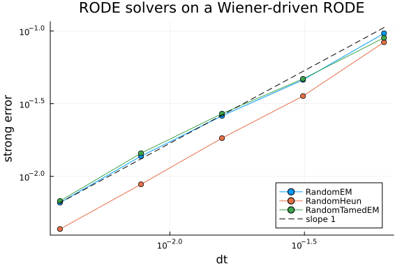
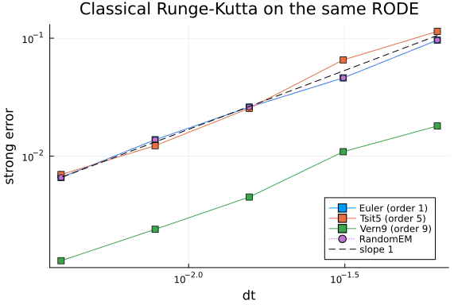
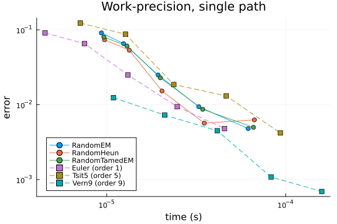

A random ordinary differential equation (RODE) is an ODE whose right-hand side is driven by a
stochastic process sampled pathwise,

$$\frac{du}{dt} = f(u, t, W(t)),$$

with $W$ a Wiener path supplied to the solver. Because each realisation of $W$ is a fixed
function of time, a RODE is a genuine ODE for that realisation, and it is tempting to hand it
to a high-order ODE integrator and expect the usual rate.

That expectation is wrong, and it is wrong in a way that is cheap to measure. A Wiener path is
nowhere differentiable, so the right-hand side is only Hölder-$1/2$ continuous in $t$ and the
Taylor expansion a classical Runge-Kutta method relies on does not exist. Grüne and Kloeden
showed the resulting order loss ([BIT 41, 2001](https://doi.org/10.1023/A:1021995918864)).
Kloeden and Rosa later proved that the Euler scheme still converges with strong order $1$ for
semimartingale noise ([arXiv:2306.15418](https://arxiv.org/abs/2306.15418), ESAIM: M2AN 59,
2025), where the Hölder exponent alone would suggest $1/2$.

This page measures both halves of that statement: the rate the dedicated RODE solvers reach,
and the rate a nominally 5th and 9th order ODE method reaches on the same problem.

```julia
using StochasticDiffEq, DiffEqNoiseProcess, OrdinaryDiffEqLowOrderRK, OrdinaryDiffEqTsit5,
      OrdinaryDiffEqVerner, BenchmarkTools, Plots, Random, Statistics, Printf
gr()

const SEED = 20260921
const TEND = 1.0
const FINE = 2^18
const FDT = TEND / FINE
const GRID = collect(range(0.0, TEND; length = FINE + 1))
const STEPS = [16, 32, 64, 128, 256]
const PATHS = 16
```

```
16
```


## Test problem

The problem is scalar and linear in $u$, which is what makes an accurate reference available:

$$\frac{du}{dt} = -u \cos(5 W(t)), \qquad u(0) = 1,$$

whose solution is $u(t) = \exp\left(-\int_0^t \cos(5W(s))\,ds\right)$. The reference is that
quadrature on the fine grid, so it is only as good as the grid. Every convergence study below
reports a *reference floor*: the change in the reference when the fine grid is coarsened by
four. Measured errors must stay well above that floor, otherwise the fitted slope is describing
the reference rather than the method.

```julia
wiener_path(rng) = (W = zeros(FINE + 1); W[2:end] .= cumsum(sqrt(FDT) .* randn(rng, FINE)); W)

function cumulative_trapezoid(g, dt)
    I = zeros(length(g)); acc = zero(eltype(g))
    @inbounds for k in 1:(length(g) - 1)
        acc += dt * (g[k] + g[k + 1]) / 2
        I[k + 1] = acc
    end
    return I
end

function fitted_slope(ns, errs)
    x = log2.(1 ./ ns); y = log2.(errs); n = length(x)
    return (n * sum(x .* y) - sum(x) * sum(y)) / (n * sum(x .^ 2) - sum(x)^2)
end

rode_f(u, p, t, W) = -u * cos(5W)

# W(t) by linear interpolation of the stored path, the way a practitioner hands a
# sampled path to an ODE solver
function make_W(path)
    return function (t)
        s = t / FDT
        i = clamp(floor(Int, s), 0, FINE - 1)
        theta = s - i
        return (1 - theta) * path[i + 1] + theta * path[i + 2]
    end
end
```

```
make_W (generic function with 1 method)
```


## Strong convergence of the RODE solvers

`RandomEM`, `RandomHeun` and `RandomTamedEM` are measured against the exact pathwise solution,
the error being the maximum over the saved steps, reported as a root-mean-square over
independent paths.

```julia
function strong_errors(solve_one)
    rng = MersenneTwister(SEED)
    E = zeros(PATHS, length(STEPS))
    floors = zeros(PATHS)
    for m in 1:PATHS
        path = wiener_path(rng)
        g = cos.(5 .* path)
        exact = exp.(-cumulative_trapezoid(g, FDT))
        floors[m] = maximum(abs, exp.(-cumulative_trapezoid(g[1:4:end], 4FDT)) .- exact[1:4:end])
        for (j, n) in enumerate(STEPS)
            u = solve_one(path, n)
            stride = FINE ÷ n
            E[m, j] = maximum(abs(u[k + 1] - exact[k * stride + 1]) for k in 0:n)
        end
    end
    return [sqrt(mean(E[:, j] .^ 2)) for j in eachindex(STEPS)], maximum(floors)
end

rode_solver(alg) = (path, n) -> solve(
    RODEProblem{false}(rode_f, 1.0, (0.0, TEND), noise = NoiseGrid(GRID, path)),
    alg, dt = TEND / n, adaptive = false, save_everystep = true).u

rode_algs = ["RandomEM" => RandomEM(), "RandomHeun" => RandomHeun(),
             "RandomTamedEM" => RandomTamedEM()]
rode_results = Dict(name => strong_errors(rode_solver(alg)) for (name, alg) in rode_algs)

for (name, _) in rode_algs
    errs, fl = rode_results[name]
    @printf("%-16s slope %.3f   floor margin %.1fx\n", name,
            fitted_slope(STEPS, errs), minimum(errs) / fl)
end
```

```
RandomEM         slope 0.948   floor margin 157.6x
RandomHeun       slope 1.056   floor margin 103.8x
RandomTamedEM    slope 0.916   floor margin 162.0x
```


All three sit at order 1. `RandomHeun` costs a second right-hand side evaluation per step and
does not convert it into a rate, for the same reason the classical methods below do not: the
second stage is an expansion the path does not support.

```julia
dts = TEND ./ STEPS
plt = plot(xscale = :log10, yscale = :log10, xlabel = "dt", ylabel = "strong error",
           title = "RODE solvers on a Wiener-driven RODE", legend = :bottomright)
for (name, _) in rode_algs
    plot!(plt, dts, rode_results[name][1], marker = :circle, label = name)
end
plot!(plt, dts, dts .* (rode_results["RandomEM"][1][end] / dts[end]),
      linestyle = :dash, color = :black, label = "slope 1")
plt
```




## The same problem given to classical ODE solvers

Now the identical path is handed to `Euler`, `Tsit5` and `Vern9` as an ODE whose right-hand
side happens to call `W(t)`. The solver steps are far coarser than the grid the path is stored
on, so the path is fully resolved beneath every step; nothing here is a sampling artefact.

```julia
ode_solver(alg) = function (path, n)
    Wf = make_W(path)
    odef(u, p, t) = -u * cos(5 * Wf(t))
    return solve(ODEProblem(odef, 1.0, (0.0, TEND)), alg,
                 dt = TEND / n, adaptive = false, save_everystep = true).u
end

ode_algs = ["Euler (order 1)" => Euler(), "Tsit5 (order 5)" => Tsit5(),
            "Vern9 (order 9)" => Vern9()]
ode_results = Dict(name => strong_errors(ode_solver(alg)) for (name, alg) in ode_algs)

for (name, _) in ode_algs
    errs, fl = ode_results[name]
    @printf("%-16s slope %.3f   error at dt=1/256 %.3g\n", name,
            fitted_slope(STEPS, errs), errs[end])
end

@printf("\nmax |Euler - RandomEM| over the step counts: %.3g\n",
        maximum(abs, ode_results["Euler (order 1)"][1] .- rode_results["RandomEM"][1]))
```

```
Euler (order 1)  slope 0.948   error at dt=1/256 0.00659
Tsit5 (order 5)  slope 1.048   error at dt=1/256 0.00698
Vern9 (order 9)  slope 0.978   error at dt=1/256 0.0013

max |Euler - RandomEM| over the step counts: 1.39e-17
```


Nominal orders 1, 5 and 9 all measure close to 1. `Vern9` buys a smaller constant and no rate;
`Tsit5` spends six stages per step to land beside `Euler`. `Euler` on the interpolated path
agrees with `RandomEM` to rounding error, printed above, which is the expected identity: at
order 1 the two formulations coincide.

```julia
plt = plot(xscale = :log10, yscale = :log10, xlabel = "dt", ylabel = "strong error",
           title = "Classical Runge-Kutta on the same RODE", legend = :bottomright)
for (name, _) in ode_algs
    plot!(plt, dts, ode_results[name][1], marker = :square, label = name)
end
plot!(plt, dts, rode_results["RandomEM"][1], marker = :circle, linestyle = :dot,
      label = "RandomEM")
plot!(plt, dts, dts .* (ode_results["Euler (order 1)"][1][end] / dts[end]),
      linestyle = :dash, color = :black, label = "slope 1")
plt
```




## Work-precision

Rate is not the whole story: a method with the same rate and a smaller constant can still be
the right choice. This measures error against wall-clock time for one path, so the question
becomes whether `Vern9`'s smaller constant pays for its stages. Each problem is built once,
outside the timer, and the time is the minimum over BenchmarkTools samples. The RODE solvers
read the path from a `NoiseGrid` of $2^{18}$ points; with DiffEqNoiseProcess 5.36.4, which this
page pins, a solve shares that grid rather than copying it, so their times reflect stepping and
not the length of the stored path.

```julia
rode_problem(alg) = path -> (
    RODEProblem{false}(rode_f, 1.0, (0.0, TEND), noise = NoiseGrid(GRID, path)), alg)
ode_problem(alg) = function (path)
    Wf = make_W(path)
    odef(u, p, t) = -u * cos(5 * Wf(t))
    return ODEProblem(odef, 1.0, (0.0, TEND)), alg
end

function timed_errors(build)
    rng = MersenneTwister(SEED)
    path = wiener_path(rng)
    g = cos.(5 .* path)
    exact = exp.(-cumulative_trapezoid(g, FDT))
    errs = zeros(length(STEPS)); times = zeros(length(STEPS))
    for (j, n) in enumerate(STEPS)
        prob, alg = build(path)
        dt = TEND / n
        u = solve(prob, alg, dt = dt, adaptive = false, save_everystep = true).u
        times[j] = @belapsed solve($prob, $alg, dt = $dt, adaptive = false,
                                   save_everystep = true) seconds = 1
        stride = FINE ÷ n
        errs[j] = maximum(abs(u[k + 1] - exact[k * stride + 1]) for k in 0:n)
    end
    return errs, times
end

wp = Dict{String, Tuple{Vector{Float64}, Vector{Float64}}}()
for (name, alg) in rode_algs
    wp[name] = timed_errors(rode_problem(alg))
end
for (name, alg) in ode_algs
    wp[name] = timed_errors(ode_problem(alg))
end

@printf("%-16s %-14s %-12s\n", "method", "time at dt=1/256", "error")
for (name, _) in vcat(rode_algs, ode_algs)
    @printf("%-16s %-14.3g %-12.3g\n", name, wp[name][2][end], wp[name][1][end])
end

plt = plot(xscale = :log10, yscale = :log10, xlabel = "time (s)", ylabel = "error",
           title = "Work-precision, single path", legend = :bottomleft)
for (name, _) in rode_algs
    plot!(plt, wp[name][2], wp[name][1], marker = :circle, label = name)
end
for (name, _) in ode_algs
    plot!(plt, wp[name][2], wp[name][1], marker = :square, linestyle = :dash, label = name)
end
plt
```

```
method           time at dt=1/256 error       
RandomEM         6.17e-05       0.0048      
RandomHeun       6.68e-05       0.00627     
RandomTamedEM    6.6e-05        0.00499     
Euler (order 1)  4.55e-05       0.0048      
Tsit5 (order 5)  9.33e-05       0.0042      
Vern9 (order 9)  0.000159       0.000694
```





## What this means for choosing a solver

Throwing classical order at a RODE does not raise the rate. Every method above converges at
about order 1, and the differences between them are constants. The three classical tableaus
measured here, of nominal order 1, 5 and 9, all land at order 1 alongside the three RODE
methods: evaluating $W$ at more points inside the step did not raise the rate for any of them.

Getting past order 1 requires the step to use information about $W$ *between* its endpoints,
for example the integral $\int_t^{t+h}(W_s - W_t)\,ds$, which is not a function of the
increment alone. That integral can be recovered when the path is supplied on a grid finer than
the solver steps, which is the case in most applications where the noise is measured data or
generated once at high resolution. Methods of that kind are omitted here because they are not
in a released version of StochasticDiffEq.jl at the time of writing; this page should be
extended when they are.


## Appendix

These benchmarks are a part of the SciMLBenchmarks.jl repository, found at: [https://github.com/SciML/SciMLBenchmarks.jl](https://github.com/SciML/SciMLBenchmarks.jl). For more information on high-performance scientific machine learning, check out the SciML Open Source Software Organization [https://sciml.ai](https://sciml.ai).

To locally run this benchmark, do the following commands:
```
using SciMLBenchmarks
SciMLBenchmarks.weave_file("benchmarks/RODE","rode_convergence.jmd")
```

Computer Information:

```
Julia Version 1.12.7
Commit 6d172b025e4 (2026-08-15 08:05 UTC)
Build Info:
  Official https://julialang.org release
Platform Info:
  OS: Linux (x86_64-linux-gnu)
  CPU: 128 × AMD EPYC 7502 32-Core Processor
  WORD_SIZE: 64
  LLVM: libLLVM-18.1.7 (ORCJIT, znver2)
  GC: Built with stock GC
Threads: 128 default, 1 interactive, 128 GC (on 128 virtual cores)
Environment:
  JULIA_NUM_THREADS = auto

```

Package Information:

```
Status `/julia/github-runners/amdci1-1/_work/SciMLBenchmarks.jl/SciMLBenchmarks.jl/benchmarks/RODE/Project.toml`
  [6e4b80f9] BenchmarkTools v1.8.0
  [77a26b50] DiffEqNoiseProcess v5.36.4
  [1344f307] OrdinaryDiffEqLowOrderRK v2.2.6
  [b1df2697] OrdinaryDiffEqTsit5 v2.1.5
  [79d7bb75] OrdinaryDiffEqVerner v2.4.2
  [91a5bcdd] Plots v1.41.7
  [31c91b34] SciMLBenchmarks v0.2.1 [loaded: `/julia/github-runners/amdci1-1/_work/SciMLBenchmarks.jl/SciMLBenchmarks.jl/src/SciMLBenchmarks.jl` (v0.2.1) expected `/home/crackauc/.julia/packages/SciMLBenchmarks/ceJyd/src/SciMLBenchmarks.jl` (v0.2.1)]
  [10745b16] Statistics v1.11.5
  [789caeaf] StochasticDiffEq v7.2.0
  [de0858da] Printf v1.11.0
  [9a3f8284] Random v1.11.0
```

And the full manifest:

```
Status `/julia/github-runners/amdci1-1/_work/SciMLBenchmarks.jl/SciMLBenchmarks.jl/benchmarks/RODE/Manifest.toml`
  [47edcb42] ADTypes v1.24.0
  [14f7f29c] AMD v0.5.4
  [7d9f7c33] Accessors v0.1.45
⌃ [79e6a3ab] Adapt v4.7.1
  [66dad0bd] AliasTables v1.1.3
  [ec485272] ArnoldiMethod v0.4.0
  [4fba245c] ArrayInterface v7.30.2
  [6e4b80f9] BenchmarkTools v1.8.0
  [b2a6c25c] BinaryHeaps v1.1.0
  [70df07ce] BracketingNonlinearSolve v1.12.8
  [35d6a980] ColorSchemes v3.31.0
  [3da002f7] ColorTypes v0.12.3
  [c3611d14] ColorVectorSpace v0.11.0
  [5ae59095] Colors v0.13.2
  [38540f10] CommonSolve v0.2.14
  [bbf7d656] CommonSubexpressions v0.3.1
  [34da2185] Compat v4.18.1
  [a33af91c] CompositionsBase v0.1.2
  [2569d6c7] ConcreteStructs v0.2.8
  [187b0558] ConstructionBase v1.6.0
  [d38c429a] Contour v0.6.3
  [a8cc5b0e] Crayons v4.2.0
  [9a962f9c] DataAPI v1.16.0
  [a93c6f00] DataFrames v1.8.2
  [864edb3b] DataStructures v0.19.6
  [e2d170a0] DataValueInterfaces v1.0.0
  [8bb1440f] DelimitedFiles v1.9.1
  [2b5f629d] DiffEqBase v7.21.3
  [459566f4] DiffEqCallbacks v4.19.4
  [77a26b50] DiffEqNoiseProcess v5.36.4
  [163ba53b] DiffResults v1.1.0
  [b552c78f] DiffRules v1.16.0
  [a0c0ee7d] DifferentiationInterface v0.7.21
  [31c24e10] Distributions v0.25.131
  [ffbed154] DocStringExtensions v0.9.5
  [4e289a0a] EnumX v1.0.7
⌃ [f151be2c] EnzymeCore v0.8.21
  [e2ba6199] ExprTools v0.1.11
  [c87230d0] FFMPEG v0.4.6
  [7034ab61] FastBroadcast v1.4.0
  [9aa1b823] FastClosures v0.3.2
  [a4df4552] FastPower v1.5.0
  [1a297f60] FillArrays v1.17.1
  [64ca27bc] FindFirstFunctions v3.4.0
  [6a86dc24] FiniteDiff v2.33.0
⌅ [53c48c17] FixedPointNumbers v0.8.6
  [1fa38f19] Format v1.3.7
  [f6369f11] ForwardDiff v1.4.6
  [069b7b12] FunctionWrappers v1.1.3
  [77dc65aa] FunctionWrappersWrappers v1.13.0
  [46192b85] GPUArraysCore v0.2.1
  [28b8d3ca] GR v0.73.27
  [a0844989] Gamma v1.2.0
  [86223c79] Graphs v1.15.0
⌅ [eafb193a] Highlights v0.5.3
  [34004b35] HypergeometricFunctions v0.3.30
  [d25df0c9] Inflate v0.1.5
⌅ [842dd82b] InlineStrings v1.4.6
  [3587e190] InverseFunctions v0.1.17
  [41ab1584] InvertedIndices v1.3.1
  [92d709cd] IrrationalConstants v0.2.6
  [82899510] IteratorInterfaceExtensions v1.0.0
  [1019f520] JLFzf v0.1.11
  [692b3bcd] JLLWrappers v1.8.0
⌅ [682c06a0] JSON v0.21.4
  [ccbc3e58] JumpProcesses v9.33.1
  [ba0b0d4f] Krylov v0.10.10
  [2faa5264] LHLFactorization v2.2.2
  [b964fa9f] LaTeXStrings v1.4.1
  [23fbe1c1] Latexify v0.16.12
  [87fe0de2] LineSearch v0.1.19
  [7ed4a6bd] LinearSolve v5.18.2
  [2ab3a3ac] LogExpFunctions v1.0.2
  [e6f89c97] LoggingExtras v1.2.0
  [1914dd2f] MacroTools v0.5.16
  [bb5d69b7] MaybeInplace v0.1.8
  [442fdcdd] Measures v0.3.3
  [e1d29d7a] Missings v1.2.0
  [46d2c3a1] MuladdMacro v0.2.7
  [ffc61752] Mustache v1.1.0
  [77ba4419] NaNMath v1.1.4
  [8913a72c] NonlinearSolve v4.32.0
  [be0214bd] NonlinearSolveBase v2.54.1
  [5959db7a] NonlinearSolveFirstOrder v2.10.0
  [9a2c21bd] NonlinearSolveQuasiNewton v1.15.3
  [26075421] NonlinearSolveSpectralMethods v1.8.3
⌃ [bac558e1] OrderedCollections v2.0.1 [loaded: v2.0.2]
  [bbf590c4] OrdinaryDiffEqCore v4.18.1
  [4302a76b] OrdinaryDiffEqDifferentiation v3.12.4
  [1344f307] OrdinaryDiffEqLowOrderRK v2.2.6
  [127b3ac7] OrdinaryDiffEqNonlinearSolve v2.9.9
  [b1df2697] OrdinaryDiffEqTsit5 v2.1.5
  [79d7bb75] OrdinaryDiffEqVerner v2.4.2
  [90014a1f] PDMats v0.11.41
⌅ [69de0a69] Parsers v2.8.8
  [ccf2f8ad] PlotThemes v3.3.0
⌃ [995b91a9] PlotUtils v1.5.0
  [91a5bcdd] Plots v1.41.7
  [e409e4f3] PoissonRandom v0.4.13
  [2dfb63ee] PooledArrays v1.4.3
  [d236fae5] PreallocationTools v1.7.1
  [aea7be01] PrecompileTools v1.3.4
  [21216c6a] Preferences v1.6.0
  [08abe8d2] PrettyTables v3.5.0
  [43287f4e] PtrArrays v1.4.0
  [0c0d3e7f] PureKLU v1.6.0
  [1fd47b50] QuadGK v2.11.3
  [3cdcf5f2] RecipesBase v1.4.0
  [01d81517] RecipesPipeline v0.6.12
  [731186ca] RecursiveArrayTools v4.5.3
  [189a3867] Reexport v1.2.2
  [05181044] RelocatableFolders v1.0.1
  [ae029012] Requires v1.3.1
  [ae5879a3] ResettableStacks v1.4.0
  [9fe22ead] RespecializeParams v1.3.0
  [79098fc4] Rmath v0.9.0
⌃ [f2b01f46] Roots v3.0.9
  [7e49a35a] RuntimeGeneratedFunctions v0.5.27
  [0bca4576] SciMLBase v3.57.0
  [31c91b34] SciMLBenchmarks v0.2.1 [loaded: `/julia/github-runners/amdci1-1/_work/SciMLBenchmarks.jl/SciMLBenchmarks.jl/src/SciMLBenchmarks.jl` (v0.2.1) expected `/home/crackauc/.julia/packages/SciMLBenchmarks/ceJyd/src/SciMLBenchmarks.jl` (v0.2.1)]
  [19f34311] SciMLJacobianOperators v0.1.19
  [a6db7da4] SciMLLogging v2.1.0
  [c0aeaf25] SciMLOperators v1.30.2
  [431bcebd] SciMLPublic v1.3.0
  [53ae85a6] SciMLStructures v1.10.5
  [6c6a2e73] Scratch v1.3.0
  [91c51154] SentinelArrays v1.4.10
  [efcf1570] Setfield v1.1.2
  [992d4aef] Showoff v1.1.1
  [727e6d20] SimpleNonlinearSolve v2.14.6
  [699a6c99] SimpleTraits v0.9.6
  [ed01d8cd] Sobol v1.5.0
  [a2af1166] SortingAlgorithms v1.2.3
  [a57abbd0] SparseColumnPivotedQR v2.1.8
  [0a514795] SparseMatrixColorings v0.4.28
  [276daf66] SpecialFunctions v2.9.0
⌃ [90137ffa] StaticArrays v1.9.22
  [1e83bf80] StaticArraysCore v1.4.4
  [10745b16] Statistics v1.11.5
  [82ae8749] StatsAPI v1.8.0
  [2913bbd2] StatsBase v0.34.13
  [4c63d2b9] StatsFuns v2.2.1
  [789caeaf] StochasticDiffEq v7.2.0
  [19c5a474] StochasticDiffEqCore v2.2.3
  [0520c28c] StochasticDiffEqHighOrder v2.2.0
  [ebf54054] StochasticDiffEqIIF v2.1.0
  [5080b986] StochasticDiffEqImplicit v2.2.1
  [aefaaa88] StochasticDiffEqLeaping v2.1.0
  [90dbc90e] StochasticDiffEqLevyArea v2.1.1
  [d15fe365] StochasticDiffEqLowOrder v2.0.5
  [8c95a807] StochasticDiffEqMilstein v2.1.1
  [db241ea8] StochasticDiffEqROCK v2.1.1
  [49714585] StochasticDiffEqRODE v2.2.0
  [af2a2fcd] StochasticDiffEqWeak v2.2.1
  [69024149] StringEncodings v0.3.7
  [892a3eda] StringManipulation v0.6.1
  [2efcf032] SymbolicIndexingInterface v0.3.55
  [3783bdb8] TableTraits v1.0.1
  [bd369af6] Tables v1.14.0
  [62fd8b95] TensorCore v0.1.1
  [a759f4b9] TimerOutputs v1.2.2
  [781d530d] TruncatedStacktraces v1.4.0
  [1cfade01] UnicodeFun v0.4.1
  [41fe7b60] Unzip v0.2.0
  [44d3d7a6] Weave v0.10.12
  [ddb6d928] YAML v0.4.17
  [6e34b625] Bzip2_jll v1.0.9+0
  [83423d85] Cairo_jll v1.18.8+0
  [ee1fde0b] Dbus_jll v1.16.2+0
  [2702e6a9] EpollShim_jll v0.0.20230411+1
  [2e619515] Expat_jll v2.8.4+0
  [b22a6f82] FFMPEG_jll v9.0.2+0
  [a3f928ae] Fontconfig_jll v2.17.1+0
  [d7e528f0] FreeType2_jll v2.14.3+1
  [559328eb] FriBidi_jll v1.0.17+0
  [0656b61e] GLFW_jll v3.5.1+0
  [d2c73de3] GR_jll v0.73.27+0
⌅ [b0724c58] GettextRuntime_jll v0.22.4+0
  [61579ee1] Ghostscript_jll v9.55.1+0
  [7746bdde] Glib_jll v2.88.3+0
  [3b182d85] Graphite2_jll v1.3.16+0
  [2e76f6c2] HarfBuzz_jll v100.14004.0+0
  [1d5cc7b8] IntelOpenMP_jll v2025.2.0+0
  [aacddb02] JpegTurbo_jll v3.2.0+1
  [c1c5ebd0] LAME_jll v3.100.3+0
  [88015f11] LERC_jll v4.2.0+0
  [1d63c593] LLVMOpenMP_jll v23.1.1+0
⌅ [e9f186c6] Libffi_jll v3.4.7+0
  [7e76a0d4] Libglvnd_jll v1.7.1+1
  [94ce4f54] Libiconv_jll v1.18.0+0
  [4b2f31a3] Libmount_jll v2.42.0+0
  [89763e89] Libtiff_jll v4.7.3+0
  [38a345b3] Libuuid_jll v2.42.0+0
  [856f044c] MKL_jll v2025.2.0+0
  [e7412a2a] Ogg_jll v1.3.6+0
  [efe28fd5] OpenSpecFun_jll v0.5.6+0
  [91d4177d] Opus_jll v1.6.1+0
  [36c8627f] Pango_jll v1.58.2+0
  [30392449] Pixman_jll v0.46.4+0
  [c0090381] Qt6Base_jll v6.10.2+2
  [629bc702] Qt6Declarative_jll v6.10.2+2
  [ce943373] Qt6ShaderTools_jll v6.10.2+1
  [6de9746b] Qt6Svg_jll v6.10.2+0
  [e99dba38] Qt6Wayland_jll v6.10.2+1
  [f50d1b31] Rmath_jll v0.5.2+0
  [a44049a8] Vulkan_Loader_jll v1.3.243+0
  [a2964d1f] Wayland_jll v1.24.0+0
  [ffd25f8a] XZ_jll v5.8.4+0
  [f67eecfb] Xorg_libICE_jll v1.1.2+0
  [c834827a] Xorg_libSM_jll v1.2.6+0
  [4f6342f7] Xorg_libX11_jll v1.8.13+0
  [0c0b7dd1] Xorg_libXau_jll v1.0.13+0
  [935fb764] Xorg_libXcursor_jll v1.2.4+0
  [a3789734] Xorg_libXdmcp_jll v1.1.6+0
  [1082639a] Xorg_libXext_jll v1.3.8+0
  [d091e8ba] Xorg_libXfixes_jll v6.0.2+0
  [a51aa0fd] Xorg_libXi_jll v1.8.4+0
  [d1454406] Xorg_libXinerama_jll v1.1.7+0
  [ec84b674] Xorg_libXrandr_jll v1.5.6+0
  [ea2f1a96] Xorg_libXrender_jll v0.9.12+0
  [a65dc6b1] Xorg_libpciaccess_jll v0.19.0+0
  [c7cfdc94] Xorg_libxcb_jll v1.17.1+0
  [cc61e674] Xorg_libxkbfile_jll v1.2.0+0
  [e920d4aa] Xorg_xcb_util_cursor_jll v0.1.6+0
  [12413925] Xorg_xcb_util_image_jll v0.4.1+0
  [2def613f] Xorg_xcb_util_jll v0.4.1+0
  [975044d2] Xorg_xcb_util_keysyms_jll v0.4.1+0
  [0d47668e] Xorg_xcb_util_renderutil_jll v0.3.10+0
  [c22f9ab0] Xorg_xcb_util_wm_jll v0.4.2+0
  [35661453] Xorg_xkbcomp_jll v1.4.7+0
  [33bec58e] Xorg_xkeyboard_config_jll v2.47.0+2
  [c5fb5394] Xorg_xtrans_jll v1.6.0+0
  [3161d3a3] Zstd_jll v1.5.7+1
  [35ca27e7] eudev_jll v3.2.14+0
⌅ [214eeab7] fzf_jll v0.61.1+0
  [a4ae2306] libaom_jll v3.15.1+0
  [0ac62f75] libass_jll v0.17.5+0
  [1183f4f0] libdecor_jll v0.2.2+0
  [8e53e030] libdrm_jll v2.4.134+0
  [2db6ffa8] libevdev_jll v1.13.4+0
  [f638f0a6] libfdk_aac_jll v2.0.4+0
  [36db933b] libinput_jll v1.28.1+0
⌃ [b53b4c65] libpng_jll v1.6.59+0
  [9a156e7d] libva_jll v2.23.0+0
  [f27f6e37] libvorbis_jll v1.3.8+0
  [009596ad] mtdev_jll v1.1.7+0
  [1317d2d5] oneTBB_jll v2022.3.0+0
⌅ [1270edf5] x264_jll v10164.0.1+0
  [dfaa095f] x265_jll v4.1.0+0
  [d8fb68d0] xkbcommon_jll v1.13.0+0
  [0dad84c5] ArgTools v1.1.2
  [56f22d72] Artifacts v1.11.0
  [2a0f44e3] Base64 v1.11.0
  [ade2ca70] Dates v1.11.0
  [8ba89e20] Distributed v1.11.0
  [f43a241f] Downloads v1.7.0
  [7b1f6079] FileWatching v1.11.0
  [9fa8497b] Future v1.11.0
  [b77e0a4c] InteractiveUtils v1.11.0
  [ac6e5ff7] JuliaSyntaxHighlighting v1.12.0
  [4af54fe1] LazyArtifacts v1.11.0
  [b27032c2] LibCURL v0.6.4
  [76f85450] LibGit2 v1.11.0
  [8f399da3] Libdl v1.11.0
  [37e2e46d] LinearAlgebra v1.12.0
  [56ddb016] Logging v1.11.0
  [d6f4376e] Markdown v1.11.0
  [a63ad114] Mmap v1.11.0
  [ca575930] NetworkOptions v1.3.0
  [44cfe95a] Pkg v1.12.1
  [de0858da] Printf v1.11.0
  [9abbd945] Profile v1.11.0
  [3fa0cd96] REPL v1.11.0
  [9a3f8284] Random v1.11.0
  [ea8e919c] SHA v0.7.0
  [9e88b42a] Serialization v1.11.0
  [6462fe0b] Sockets v1.11.0
  [2f01184e] SparseArrays v1.12.0
  [f489334b] StyledStrings v1.11.0
  [4607b0f0] SuiteSparse
  [fa267f1f] TOML v1.0.3
  [a4e569a6] Tar v1.10.0
  [8dfed614] Test v1.11.0
  [cf7118a7] UUIDs v1.11.0
  [4ec0a83e] Unicode v1.11.0
  [e66e0078] CompilerSupportLibraries_jll v1.3.1+2
  [deac9b47] LibCURL_jll v8.15.0+0
  [e37daf67] LibGit2_jll v1.9.0+0
  [29816b5a] LibSSH2_jll v1.11.3+1
  [14a3606d] MozillaCACerts_jll v2025.11.4
  [4536629a] OpenBLAS_jll v0.3.29+0
  [05823500] OpenLibm_jll v0.8.7+0
  [458c3c95] OpenSSL_jll v3.5.6+0
  [efcefdf7] PCRE2_jll v10.44.0+1
  [bea87d4a] SuiteSparse_jll v7.8.3+2
  [83775a58] Zlib_jll v1.3.1+2
  [8e850b90] libblastrampoline_jll v5.15.0+0
  [8e850ede] nghttp2_jll v1.64.0+1
  [3f19e933] p7zip_jll v17.7.0+0
Info Packages marked with ⌃ and ⌅ have new versions available. Those with ⌃ may be upgradable, but those with ⌅ are restricted by compatibility constraints from upgrading. To see why use `status --outdated -m`
```

