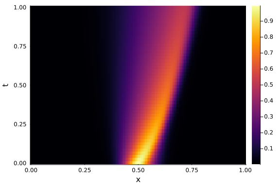
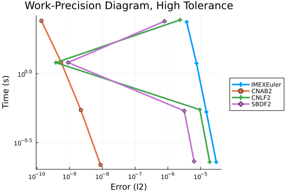
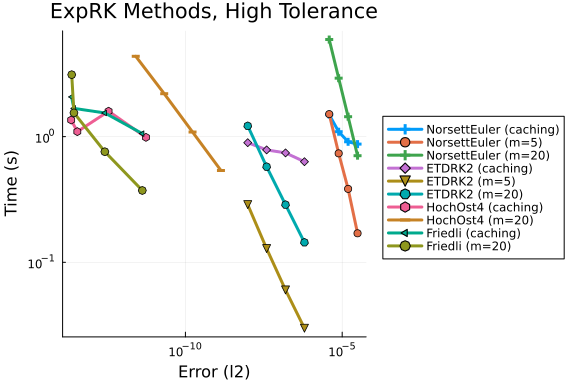
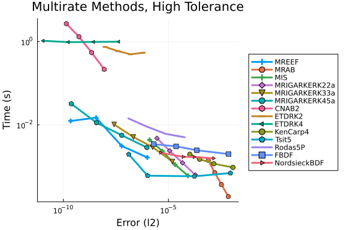
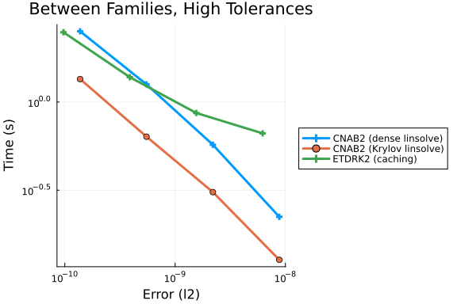
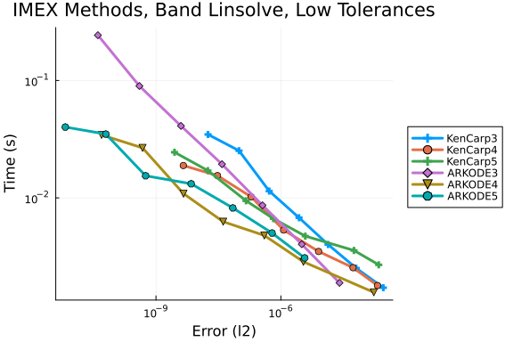
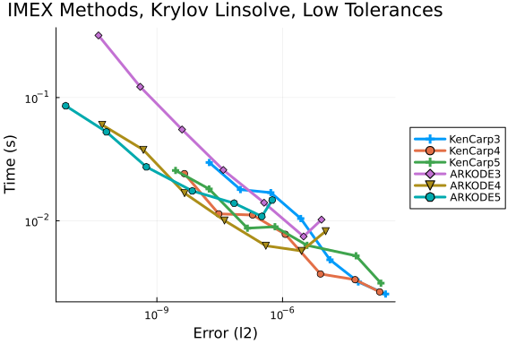
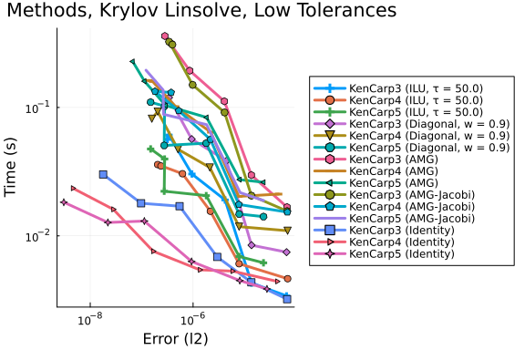
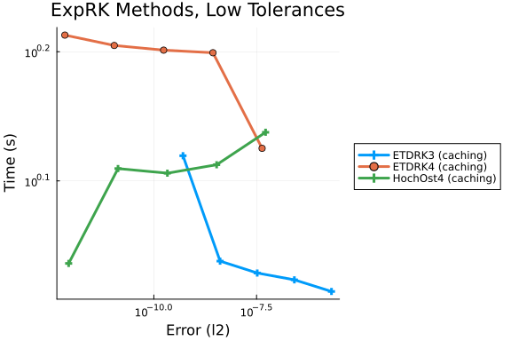
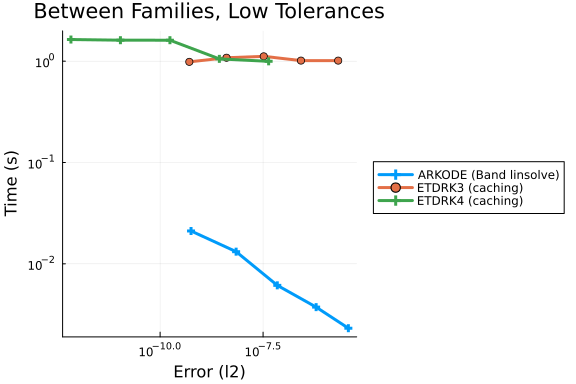

## Problem Description

The Burgers' partial differential equation is solved on the domain $[0, L] \times [0, T] \in \mathbb R \times R,~L = 1,~T = 1$, with the following initial and boundary conditions:
```math
\begin{aligned}
    \partial_t u(t,x) & = -\partial_x u^2(t,x) + \nu \partial_x^2 u(t,x), \\
    u(0,x) & = \exp\left[\frac{(x - 0.5)^2}{2 \times 0.05^2}\right], \\
    u(-L,x) & = u(L,x) = 0.
\end{aligned}
```
The spatial derivative operators are represented via finite difference approximations on an equispaced grid of points $x_s \in [-L, L]$. The diffusion coefficient $\nu = 10^{-2}$ is chosen to produce `interesting' behavior as seen in the reference solution below.
```math
\begin{aligned}
    \frac{du}{dt} & = -D_x u^2(t,x) + \nu D_x^2 u(t,x), \\
    u(0,x_s) & = \exp\left[\frac{(x_s - 0.5)^2}{2 \times 0.05^2}\right], \\
    u(t,-L) & = u(t,L) = 0.
\end{aligned}
```

### Implementation

```julia
using OrdinaryDiffEq
using OrdinaryDiffEqBDF, OrdinaryDiffEqExponentialRK, OrdinaryDiffEqIMEXMultistep, OrdinaryDiffEqMultirate, OrdinaryDiffEqRosenbrock, OrdinaryDiffEqSDIRK
using DiffEqDevTools
using SciMLOperators
using LinearSolve
using LinearAlgebra
using SparseArrays
using Sundials
using SummationByPartsOperators
const SBP = SummationByPartsOperators
using Plots
gr();
```


```julia
nonlinear_convection!(du, u, p, t) = du .= (-p.alpha / 3) * (u .* (p.D1 * u) + p.D1 * (u .^ 2))

# Constructor
function burgers(N, L)
    # Derivative operators
    D1 = derivative_operator(MattssonSvärdNordström2004(); 
                             derivative_order = 1, accuracy_order = 2, 
                             xmin = -L, xmax = L, N = N)
    D2 = derivative_operator(MattssonSvärdNordström2004(); 
                             derivative_order = 2, accuracy_order = 2, 
                             xmin = -L, xmax = L, N = N)
    
    x = LinRange(0, L, N) # Domain discretization
    u0 = @. exp(-(x - 0.5)^2 / (2 * 0.05^2)) # Initial condition
    nu = 1e-2 # Diffusion coefficient
    alpha = 1.0 # Convection coefficient
    p = (; D1, alpha)

    prob = SplitODEProblem(MatrixOperator(nu * sparse(D2)), nonlinear_convection!, u0, (0.0, 1.0), p)

    return x, prob
end;
```


### Reference Solution

Using an adaptive timestepping method to solve the system of ordinary differential equations with high precision.

```julia
N = 128
L = 1.0
xs, prob = burgers(N, L)
sol = solve(prob, AutoVern7(Rodas5(autodiff=AutoFiniteDiff())); abstol=1e-14, reltol=1e-14, adaptive=true)

test_sol = TestSolution(sol); # Reference solution for error estimation

tslices = LinRange(prob.tspan..., 50)
ys = mapreduce(sol, hcat, tslices)
p = heatmap(xs, tslices, ys', xlabel="x", ylabel="t")
```




## Work-Precision Diagrams

### High Tolerances

#### Implicit-Explicit Methods

```julia
abstols = 0.1 .^ (5:8) # all fixed dt methods so these don't matter much
reltols = 0.1 .^ (1:4)
multipliers = 0.5 .^ (0:3)
setups = [
    Dict(:alg => IMEXEuler(), :dts => 1e-4 * multipliers),
    Dict(:alg => CNAB2(), :dts => 1e-4 * multipliers),
    Dict(:alg => CNLF2(), :dts => 1e-4 * multipliers),
    Dict(:alg => SBDF2(), :dts => 1e-4 * multipliers),
]
labels = hcat(
    "IMEXEuler",
    "CNAB2",
    "CNLF2",
    "SBDF2",
)
@time wp = WorkPrecisionSet(prob, abstols, reltols, setups;
    print_names=true, names=labels, numruns=5, error_estimate=:l2,
    save_everystep=false, appxsol=test_sol, maxiters=Int(1e5));

plot(wp, label=labels, markershape=:auto, title="Work-Precision Diagram, High Tolerance")
```

```
IMEXEuler
CNAB2
CNLF2
SBDF2
105.476640 seconds (63.16 M allocations: 27.677 GiB, 8.51% gc time, 34.48% 
compilation time)
```





#### Exponential Integrators

```julia
abstols = 0.1 .^ (5:8) # all fixed dt methods so these don't matter much
reltols = 0.1 .^ (1:4)
multipliers = 0.5 .^ (0:3)
setups = [
    Dict(:alg => NorsettEuler(), :dts => 1e-4 * multipliers),
    Dict(:alg => NorsettEuler(krylov=true, m=5), :dts => 1e-4 * multipliers),
    Dict(:alg => NorsettEuler(krylov=true, m=20), :dts => 1e-4 * multipliers),
    Dict(:alg => ETDRK2(), :dts => 1e-3 * multipliers),
    Dict(:alg => ETDRK2(krylov=true, m=5), :dts => 1e-3 * multipliers),
    Dict(:alg => ETDRK2(krylov=true, m=20), :dts => 1e-3 * multipliers)
]
labels = hcat(
    "NorsettEuler (caching)", 
    "NorsettEuler (m=5)",
    "NorsettEuler (m=20)",
    "ETDRK2 (caching)", 
    "ETDRK2 (m=5)", 
    "ETDRK2 (m=20)"
)
@time wp = WorkPrecisionSet(prob, abstols, reltols, setups;
    print_names=true, names=labels, numruns=5, error_estimate=:l2,
    save_everystep=false, appxsol=test_sol, maxiters=Int(1e5));

plot(wp, label=labels, markershape=:auto, title="ExpRK Methods, High Tolerance")
```

```
NorsettEuler (caching)
NorsettEuler (m=5)
NorsettEuler (m=20)
ETDRK2 (caching)
ETDRK2 (m=5)
ETDRK2 (m=20)
319.574871 seconds (65.42 M allocations: 26.486 GiB, 2.34% gc time, 6.95% c
ompilation time)
```





#### Multirate Methods

The methods from OrdinaryDiffEqMultirate.jl consume the same `SplitODEProblem`:
the first component (the stiff linear diffusion) is advanced with `m` explicit
substeps inside every macro step, while the second component (the nonlinear
convection) is evaluated only at the macro rate. Multirate integration pays off
when the slow component is expensive relative to the fast one. That is not the
case here, since both terms cost a sparse matrix-vector product, so the
substeps buy stability for the diffusion term without saving any slow work,
and the comparison against `CNAB2` and `ETDRK2` from the sections above
measures the price of buying stability this way rather than implicitly or
exactly.

The linear operator has spectral radius about 161 and the macro steps below go
up to `2e-2`, so `m = 4` puts the largest micro step at `2e-2 * 161 / 4`, about
0.8, half of the explicit micro stability bound. In a scan from `m = 2` to
`m = 8` the errors changed by under two percent at every step size, so the
macro error dominates and larger `m` only adds micro work. The multirate
methods are adaptive by default but are run at fixed macro steps here, matching
how the other fixed step methods in this file are measured. The implicit
members of the family (`MRIGARKIRK21a`, `MRIGARKESDIRK34a`,
`MRIGARKESDIRK46a`) treat the slow component implicitly and target a stiff
slow part; the diffusion here is only mildly stiff, so they are benchmarked on
the Kuramoto-Sivashinsky problem instead, where the linear operator is stiff
enough for the implicit treatment to matter.

For cross family context the same five reference methods appear in every
multirate figure of this folder: adaptive `Tsit5`, `Rodas5P`, and `FBDF` on
the joined right hand side (`FBDF` cannot consume the split form), `KenCarp4`
on the split problem, and fixed step `ETDRK4` at the step sizes this file uses
for it elsewhere. `CNAB2` and `ETDRK2` from the sections above stay in as
local references.

```julia
abstols = 0.1 .^ (5:8) # all fixed dt methods so these don't matter much
reltols = 0.1 .^ (1:4)
multipliers = 0.5 .^ (0:3)
# The joined problem calls f1 and f2 through its own buffer: a direct call of the
# SplitFunction uses an internal scratch cache that aliases prob.u0, so it would
# silently overwrite the initial condition of every later solve in the sweep.
joined_rhs! = let stiff_cache = zero(prob.u0)
    (du, u, p, t) -> begin
        prob.f.f1(stiff_cache, u, p, t)
        prob.f.f2(du, u, p, t)
        du .+= stiff_cache
    end
end
prob_joined = ODEProblem(joined_rhs!, copy(prob.u0), prob.tspan, prob.p)
setups = [
    Dict(:alg => MREEF(m = 4, order = 4), :adaptive => false, :dts => 2e-2 * multipliers),
    Dict(:alg => MRAB(k = 2, m = 4), :adaptive => false, :dts => 2e-2 * multipliers),
    Dict(:alg => MIS(m = 4), :adaptive => false, :dts => 2e-2 * multipliers),
    Dict(:alg => MRIGARKERK22a(m = 4), :adaptive => false, :dts => 2e-2 * multipliers),
    Dict(:alg => MRIGARKERK33a(m = 4), :adaptive => false, :dts => 2e-2 * multipliers),
    Dict(:alg => MRIGARKERK45a(m = 4), :adaptive => false, :dts => 2e-2 * multipliers),
    Dict(:alg => CNAB2(), :dts => 1e-4 * multipliers),
    Dict(:alg => ETDRK2(), :dts => 1e-3 * multipliers),
    Dict(:alg => ETDRK4(), :dts => 1e-2 * multipliers),
    Dict(:alg => KenCarp4()),
    Dict(:alg => Tsit5(), :prob_choice => 2),
    Dict(:alg => Rodas5P(autodiff = AutoFiniteDiff()), :prob_choice => 2),
    Dict(:alg => FBDF(autodiff = AutoFiniteDiff()), :prob_choice => 2),
    Dict(:alg => NordsieckBDF(autodiff = AutoFiniteDiff()), :prob_choice => 2),
]
labels = hcat(
    "MREEF",
    "MRAB",
    "MIS",
    "MRIGARKERK22a",
    "MRIGARKERK33a",
    "MRIGARKERK45a",
    "CNAB2",
    "ETDRK2",
    "ETDRK4",
    "KenCarp4",
    "Tsit5",
    "Rodas5P",
    "FBDF","NordsieckBDF",
)
@time wp = WorkPrecisionSet([prob, prob_joined], abstols, reltols, setups;
    print_names=true, names=labels, numruns=5, error_estimate=:l2,
    save_everystep=false, appxsol=[test_sol, test_sol], maxiters=Int(1e5));

plot(wp, label=labels, markershape=:auto, title="Multirate Methods, High Tolerance")
```

```
MREEF
MRAB
MIS
MRIGARKERK22a
MRIGARKERK33a
MRIGARKERK45a
CNAB2
ETDRK2
ETDRK4
KenCarp4
Tsit5
Rodas5P
FBDF
NordsieckBDF
361.330272 seconds (56.18 M allocations: 17.840 GiB, 1.25% gc time, 20.11% 
compilation time)
```





The cross family view narrows the earlier reading of this figure. Adaptive
`Tsit5` on the joined problem is the fastest method in the practical middle of
the range: it holds a near constant 0.4 to 0.5 milliseconds per solve while
its error falls from `9e-3` to `1.3e-7`, because the mild diffusion caps its
step at the stability limit and tightening the tolerance costs it nothing
until error control takes over. `FBDF` runs a clean curve to `2e-6` at about 3
milliseconds and `Rodas5P` to `1.2e-7` at about 12 milliseconds. The multirate
members' real estate is the tight end: `MREEF` reaches `2.2e-10` in about 10
milliseconds and `MRIGARKERK45a` matches it at twice the cost, errors that no
adaptive reference here touches, with fixed step `ETDRK4` the only method
going deeper (`1.1e-11` at a quarter of a second, 25 times slower than
`MREEF` at matched `2e-10`). That tight end margin is still a statement about
step economics rather than multirate structure: the macro steps are 200 times
larger than the fixed steps the older references run at, and four cheap
substeps keep the diffusion stable, so any stabilized explicit treatment of
this split would do as well. `KenCarp4` only reaches `1e-4` at these pairs
and is slower than every multirate member at matched error. `MRAB` remains
the weak member: freezing the slow rate over the macro step caps it at first
order and holds its error above `7e-4` across the sweep.

#### Comparisons Between Families

```julia
abstols = 0.1 .^ (5:8) # all fixed dt methods so these don't matter much
reltols = 0.1 .^ (1:4)
multipliers = 0.5 .^ (0:3)
setups = [
    Dict(:alg => CNAB2(), :dts => 1e-4 * multipliers),
    Dict(:alg => CNAB2(linsolve=KrylovJL_GMRES()), :dts => 1e-4 * multipliers),
    Dict(:alg => ETDRK2(), :dts => 1e-4 * multipliers),
]
labels = hcat(
    "CNAB2 (dense linsolve)",
    "CNAB2 (Krylov linsolve)", 
    "ETDRK2 (caching)",
)
@time wp = WorkPrecisionSet(prob, abstols, reltols, setups;
    print_names=true, names=labels, numruns=5, error_estimate=:l2,
    save_everystep=false, appxsol=test_sol, maxiters=Int(1e5));

plot(wp, label=labels, markershape=:auto, title="Between Families, High Tolerances")
```

```
CNAB2 (dense linsolve)
CNAB2 (Krylov linsolve)
ETDRK2 (caching)
140.035559 seconds (29.63 M allocations: 24.599 GiB, 5.19% gc time, 2.53% c
ompilation time)
```





### Low Tolerances


#### Implicit-Explicit Methods

Dense/banded linear solvers.

```julia
abstols = 0.1 .^ (7:13)
reltols = 0.1 .^ (4:10)
setups = [
    Dict(:alg => KenCarp3()),
    Dict(:alg => KenCarp4()),
    Dict(:alg => KenCarp5()),
    Dict(:alg => ARKODE(Sundials.Implicit(), order=3, linear_solver=:Band, jac_upper=1, jac_lower=1)),
    Dict(:alg => ARKODE(Sundials.Implicit(), order=4, linear_solver=:Band, jac_upper=1, jac_lower=1)),
    Dict(:alg => ARKODE(Sundials.Implicit(), order=5, linear_solver=:Band, jac_upper=1, jac_lower=1))
]
labels = hcat(
    "KenCarp3",
    "KenCarp4",
    "KenCarp5",
    "ARKODE3",
    "ARKODE4",
    "ARKODE5",
)
@time wp = WorkPrecisionSet(prob, abstols, reltols, setups;
    print_names=true, names=labels, numruns=5, error_estimate=:l2,
    save_everystep=false, appxsol=test_sol, maxiters=Int(1e5));

plot(wp, label=labels, markershape=:auto, title="IMEX Methods, Band Linsolve, Low Tolerances")
```

```
KenCarp3
KenCarp4
KenCarp5
ARKODE3
ARKODE4
ARKODE5
 56.029101 seconds (23.20 M allocations: 3.595 GiB, 2.53% gc time, 77.72% c
ompilation time)
```





Krylov linear solvers.
```julia
abstols = 0.1 .^ (7:13)
reltols = 0.1 .^ (4:10)
setups = [
    Dict(:alg => KenCarp3(linsolve=KrylovJL_GMRES())),
    Dict(:alg => KenCarp4(linsolve=KrylovJL_GMRES())),
    Dict(:alg => KenCarp5(linsolve=KrylovJL_GMRES())),
    Dict(:alg => ARKODE(Sundials.Implicit(), order=3, linear_solver=:GMRES)),
    Dict(:alg => ARKODE(Sundials.Implicit(), order=4, linear_solver=:GMRES)),
    Dict(:alg => ARKODE(Sundials.Implicit(), order=5, linear_solver=:GMRES)),
]
labels = hcat(
    "KenCarp3",
    "KenCarp4",
    "KenCarp5",
    "ARKODE3",
    "ARKODE4",
    "ARKODE5",
)
@time wp = WorkPrecisionSet(prob, abstols, reltols, setups;
    print_names=true, names=labels, numruns=5, error_estimate=:l2,
    save_everystep=false, appxsol=test_sol, maxiters=Int(1e5));

plot(wp, label=labels, markershape=:auto, title="IMEX Methods, Krylov Linsolve, Low Tolerances")
```

```
KenCarp3
KenCarp4
KenCarp5
ARKODE3
ARKODE4
ARKODE5
 80.608827 seconds (35.10 M allocations: 4.997 GiB, 2.51% gc time, 81.71% c
ompilation time)
```





Krylov solvers with preconditioners.
```julia
# Weighted diagonal preconditioner
import LinearAlgebra as LA
Base.@kwdef struct WeightedDiagonalPreconBuilder
    w::Float64
end

(builder::WeightedDiagonalPreconBuilder)(A, p) = (builder.w * LA.Diagonal(convert(AbstractMatrix, A)), LA.I)

# Incomplete LU factorization
using IncompleteLU
Base.@kwdef struct IncompleteLUPreconBuilder
    τ::Float64
end
function (builder::IncompleteLUPreconBuilder)(A, p)
    W = convert(AbstractMatrix, A)
    W = W isa SparseMatrixCSC ? W : sparse(W)
    Pl = ilu(W; τ = builder.τ)
    return Pl, LA.I
end

# Algebraic multigrid
using AlgebraicMultigrid
function algebraicmultigrid(A, p)
    W = convert(AbstractMatrix, A)
    W = W isa SparseMatrixCSC ? W : sparse(W)
    Pl = aspreconditioner(ruge_stuben(W))
    return Pl, LA.I
end
function algebraicmultigrid2(A, p)
    W = convert(AbstractMatrix, A)
    W = W isa SparseMatrixCSC ? W : sparse(W)
    Pl = AlgebraicMultigrid.aspreconditioner(AlgebraicMultigrid.ruge_stuben(W,
        presmoother = AlgebraicMultigrid.Jacobi(rand(size(W, 1))),
        postsmoother = AlgebraicMultigrid.Jacobi(rand(size(W, 1)))))
    return Pl, LA.I
end

# Aliases
inc_lu = IncompleteLUPreconBuilder(τ = 50.0)
w_diag = WeightedDiagonalPreconBuilder(w = 0.9)
amg = algebraicmultigrid
amg2 = algebraicmultigrid2

abstols = 0.1 .^ (8:13)
reltols = 0.1 .^ (5:10)
N = length(abstols)
setups = [
    # Dict(:alg => KenCarp3(linsolve=KrylovJL_GMRES(), :dts => 1e-2 * ones(N), :adaptive => true),
    # Dict(:alg => KenCarp4(linsolve=KrylovJL_GMRES(), :dts => 1e-2 * ones(N), :adaptive => true),
    # Dict(:alg => KenCarp5(linsolve=KrylovJL_GMRES(), :dts => 1e-2 * ones(N), :adaptive => true),
    Dict(:alg => KenCarp3(linsolve=KrylovJL_GMRES(; precs = inc_lu), concrete_jac = true), :dts => 1e-2 * ones(N), :adaptive => true),
    Dict(:alg => KenCarp4(linsolve=KrylovJL_GMRES(; precs = inc_lu), concrete_jac = true), :dts => 1e-2 * ones(N), :adaptive => true),
    Dict(:alg => KenCarp5(linsolve=KrylovJL_GMRES(; precs = inc_lu), concrete_jac = true), :dts => 1e-2 * ones(N), :adaptive => true),
    Dict(:alg => KenCarp3(linsolve=KrylovJL_GMRES(; precs = w_diag), concrete_jac = true), :dts => 1e-2 * ones(N), :adaptive => true),
    Dict(:alg => KenCarp4(linsolve=KrylovJL_GMRES(; precs = w_diag), concrete_jac = true), :dts => 1e-2 * ones(N), :adaptive => true),
    Dict(:alg => KenCarp5(linsolve=KrylovJL_GMRES(; precs = w_diag), concrete_jac = true), :dts => 1e-2 * ones(N), :adaptive => true),
    Dict(:alg => KenCarp3(linsolve=KrylovJL_GMRES(; precs = amg), concrete_jac = true), :dts => 1e-2 * ones(N), :adaptive => true),
    Dict(:alg => KenCarp4(linsolve=KrylovJL_GMRES(; precs = amg), concrete_jac = true), :dts => 1e-2 * ones(N), :adaptive => true),
    Dict(:alg => KenCarp5(linsolve=KrylovJL_GMRES(; precs = amg), concrete_jac = true), :dts => 1e-2 * ones(N), :adaptive => true),    
    Dict(:alg => KenCarp3(linsolve=KrylovJL_GMRES(; precs = amg2), concrete_jac = true), :dts => 1e-2 * ones(N), :adaptive => true),
    Dict(:alg => KenCarp4(linsolve=KrylovJL_GMRES(; precs = amg2), concrete_jac = true), :dts => 1e-2 * ones(N), :adaptive => true),
    Dict(:alg => KenCarp5(linsolve=KrylovJL_GMRES(; precs = amg2), concrete_jac = true), :dts => 1e-2 * ones(N), :adaptive => true),
    Dict(:alg => KenCarp3(linsolve=KrylovJL_GMRES()), :dts => 1e-2 * ones(N), :adaptive => true),
    Dict(:alg => KenCarp4(linsolve=KrylovJL_GMRES()), :dts => 1e-2 * ones(N), :adaptive => true),
    Dict(:alg => KenCarp5(linsolve=KrylovJL_GMRES()), :dts => 1e-2 * ones(N), :adaptive => true),
]
labels = hcat(
    # "KenCarp3 (Cholesky)",
    # "KenCarp4 (Cholesky)",
    # "KenCarp5 (Cholesky)",
    "KenCarp3 (ILU, τ = $(inc_lu.τ))",
    "KenCarp4 (ILU, τ = $(inc_lu.τ))",
    "KenCarp5 (ILU, τ = $(inc_lu.τ))",
    "KenCarp3 (Diagonal, w = $(w_diag.w))",
    "KenCarp4 (Diagonal, w = $(w_diag.w))",
    "KenCarp5 (Diagonal, w = $(w_diag.w))",
    "KenCarp3 (AMG)",
    "KenCarp4 (AMG)",
    "KenCarp5 (AMG)",
    "KenCarp3 (AMG-Jacobi)",
    "KenCarp4 (AMG-Jacobi)",
    "KenCarp5 (AMG-Jacobi)",
    "KenCarp3 (Identity)",
    "KenCarp4 (Identity)",
    "KenCarp5 (Identity)",
)
@time wp = WorkPrecisionSet(prob, abstols, reltols, setups;
    print_names=true, names=labels, numruns=5, error_estimate=:l2,
    save_everystep=false, appxsol=test_sol, maxiters=Int(1e5));

plot(wp, label=labels, markershape=:auto, title="IMEX Methods, Krylov Linsolve, Low Tolerances")
```

```
KenCarp3 (ILU, τ = 50.0)
KenCarp4 (ILU, τ = 50.0)
KenCarp5 (ILU, τ = 50.0)
KenCarp3 (Diagonal, w = 0.9)
KenCarp4 (Diagonal, w = 0.9)
KenCarp5 (Diagonal, w = 0.9)
KenCarp3 (AMG)
KenCarp4 (AMG)
KenCarp5 (AMG)
KenCarp3 (AMG-Jacobi)
KenCarp4 (AMG-Jacobi)
KenCarp5 (AMG-Jacobi)
KenCarp3 (Identity)
KenCarp4 (Identity)
KenCarp5 (Identity)
348.889253 seconds (135.07 M allocations: 23.385 GiB, 2.24% gc time, 79.61%
 compilation time)
```





#### Exponential Integrators

```julia
abstols = 0.1 .^ (7:11) # all fixed dt methods so these don't matter much
reltols = 0.1 .^ (4:8)
multipliers = 0.5 .^ (0:4)
setups = [
    Dict(:alg => ETDRK3(), :dts => 1e-2 * multipliers),
    Dict(:alg => ETDRK4(), :dts => 1e-2 * multipliers),
    Dict(:alg => HochOst4(), :dts => 1e-2 * multipliers),
]
labels = hcat(
    "ETDRK3 (caching)",
    "ETDRK4 (caching)",
    "HochOst4 (caching)",
)
@time wp = WorkPrecisionSet(prob, abstols, reltols, setups;
    print_names=true, names=labels, numruns=5, error_estimate=:l2,
    save_everystep=false, appxsol=test_sol, maxiters=Int(1e5));

plot(wp, label=labels, markershape=:auto, title="ExpRK Methods, Low Tolerances")
```

```
ETDRK3 (caching)
ETDRK4 (caching)
HochOst4 (caching)
700.027826 seconds (8.06 M allocations: 16.041 GiB, 0.19% gc time, 1.28% co
mpilation time)
```





#### Comparisons Between Families

```julia
abstols = 0.1 .^ (7:11)
reltols = 0.1 .^ (4:8)
multipliers = 0.5 .^ (0:4)
setups = [
    Dict(:alg => ARKODE(Sundials.Implicit(), order=5, linear_solver=:Band, jac_upper=1, jac_lower=1)),
    Dict(:alg => ETDRK3(), :dts => 1e-2 * multipliers),
    Dict(:alg => ETDRK4(), :dts => 1e-2 * multipliers),
]
labels = hcat(
    "ARKODE (Band linsolve)",
    "ETDRK3 (caching)",
    "ETDRK4 (caching)",
)
@time wp = WorkPrecisionSet(prob, abstols, reltols, setups;
    print_names=true, names=labels, numruns=5, error_estimate=:l2,
    save_everystep=false, appxsol=test_sol, maxiters=Int(1e5));

plot(wp, label=labels, markershape=:auto, title="Between Families, Low Tolerances")
```

```
ARKODE (Band linsolve)
ETDRK3 (caching)
ETDRK4 (caching)
454.507603 seconds (1.19 M allocations: 10.392 GiB, 0.12% gc time)
```





## Appendix

These benchmarks are a part of the SciMLBenchmarks.jl repository, found at: [https://github.com/SciML/SciMLBenchmarks.jl](https://github.com/SciML/SciMLBenchmarks.jl). For more information on high-performance scientific machine learning, check out the SciML Open Source Software Organization [https://sciml.ai](https://sciml.ai).

To locally run this benchmark, do the following commands:
```
using SciMLBenchmarks
SciMLBenchmarks.weave_file("benchmarks/SimpleHandwrittenPDE","burgers_fdm_wpd.jmd")
```

Computer Information:

```
Julia Version 1.10.12
Commit d93beab124c (2026-08-15 10:29 UTC)
Build Info:
  Official https://julialang.org/ release
Platform Info:
  OS: Linux (x86_64-linux-gnu)
  CPU: 128 × AMD EPYC 7502 32-Core Processor
  WORD_SIZE: 64
  LIBM: libopenlibm
  LLVM: libLLVM-15.0.7 (ORCJIT, znver2)
Threads: 128 default, 0 interactive, 64 GC (on 128 virtual cores)
Environment:
  JULIA_DEPOT_PATH = /home/crackauc/github-runners/amdci8-1/.julia
  JULIA_NUM_THREADS = auto

```

Package Information:

```
Status `~/github-runners/amdci8-1/_work/SciMLBenchmarks.jl/SciMLBenchmarks.jl/benchmarks/SimpleHandwrittenPDE/Project.toml`
  [47edcb42] ADTypes v1.24.0
⌃ [2169fc97] AlgebraicMultigrid v2.0.1
  [b30e2e7b] ClassicalOrthogonalPolynomials v0.15.20
⌃ [f3b72e0c] DiffEqDevTools v3.4.0
  [40713840] IncompleteLU v0.2.1
⌃ [7f56f5a3] LSODA v1.1.0
⌃ [7ed4a6bd] LinearSolve v5.15.0
⌃ [1dea7af3] OrdinaryDiffEq v7.7.0
⌃ [6ad6398a] OrdinaryDiffEqBDF v2.4.4
⌃ [bbf590c4] OrdinaryDiffEqCore v4.15.0
⌃ [e0540318] OrdinaryDiffEqExponentialRK v2.3.0
⌃ [5960d6e9] OrdinaryDiffEqFIRK v2.8.0
⌃ [d28bc4f8] OrdinaryDiffEqHighOrderRK v2.2.0
⌃ [9f002381] OrdinaryDiffEqIMEXMultistep v2.2.0
⌅ [d4b830b4] OrdinaryDiffEqMultirate v2.7.0
⌃ [43230ef6] OrdinaryDiffEqRosenbrock v2.7.0
⌃ [2d112036] OrdinaryDiffEqSDIRK v2.9.0
  [358294b1] OrdinaryDiffEqStabilizedRK v2.6.0
  [91a5bcdd] Plots v1.41.7
⌃ [31c91b34] SciMLBenchmarks v0.1.3
  [c0aeaf25] SciMLOperators v1.30.0
⌃ [9f842d2f] SparseConnectivityTracer v1.2.2
  [0a514795] SparseMatrixColorings v0.4.27
  [9f78cca6] SummationByPartsOperators v0.5.96
  [c3572dad] Sundials v6.6.0
  [37e2e46d] LinearAlgebra
  [2f01184e] SparseArrays v1.10.0
Info Packages marked with ⌃ and ⌅ have new versions available. Those with ⌃ may be upgradable, but those with ⌅ are restricted by compatibility constraints from upgrading. To see why use `status --outdated`
```

And the full manifest:

```
Status `~/github-runners/amdci8-1/_work/SciMLBenchmarks.jl/SciMLBenchmarks.jl/benchmarks/SimpleHandwrittenPDE/Manifest.toml`
  [47edcb42] ADTypes v1.24.0
  [14f7f29c] AMD v0.5.3
  [621f4979] AbstractFFTs v1.5.0
  [7d9f7c33] Accessors v0.1.45
  [79e6a3ab] Adapt v4.7.0
⌃ [2169fc97] AlgebraicMultigrid v2.0.1
  [66dad0bd] AliasTables v1.1.3
  [dce04be8] ArgCheck v2.5.0
⌃ [4fba245c] ArrayInterface v7.30.0
  [4c555306] ArrayLayouts v1.12.2
  [15f4f7f2] AutoHashEquals v2.2.0
⌃ [aae01518] BandedMatrices v1.11.0
  [0e736298] Bessels v0.2.8
  [b2a6c25c] BinaryHeaps v1.1.0
  [d1d4a3ce] BitFlags v0.1.10
  [62783981] BitTwiddlingConvenienceFunctions v0.1.6
  [8e7c35d0] BlockArrays v1.10.0
  [ffab5731] BlockBandedMatrices v0.13.5
⌃ [70df07ce] BracketingNonlinearSolve v1.12.5
  [fa961155] CEnum v0.5.0
  [2a0fbf3d] CPUSummary v0.2.7
  [b30e2e7b] ClassicalOrthogonalPolynomials v0.15.20
  [fb6a15b2] CloseOpenIntervals v0.1.13
  [944b1d66] CodecZlib v0.7.9
  [35d6a980] ColorSchemes v3.31.0
  [3da002f7] ColorTypes v0.12.1
  [c3611d14] ColorVectorSpace v0.11.0
  [5ae59095] Colors v0.13.1
  [38540f10] CommonSolve v0.2.14
  [bbf7d656] CommonSubexpressions v0.3.1
  [f70d9fcc] CommonWorldInvalidations v1.2.0
  [34da2185] Compat v4.18.1
  [b152e2b5] CompositeTypes v0.1.4
  [a33af91c] CompositionsBase v0.1.2
  [2569d6c7] ConcreteStructs v0.2.8
  [f0e56b4a] ConcurrentUtilities v2.6.0
  [8f4d0f93] Conda v1.10.3
  [187b0558] ConstructionBase v1.6.0
⌃ [7ae1f121] ContinuumArrays v0.20.9
  [d38c429a] Contour v0.6.3
  [adafc99b] CpuId v0.3.1
  [717857b8] DSP v0.8.6
  [9a962f9c] DataAPI v1.16.0
  [864edb3b] DataStructures v0.19.6
  [e2d170a0] DataValueInterfaces v1.0.0
  [8bb1440f] DelimitedFiles v1.9.1
⌃ [2b5f629d] DiffEqBase v7.18.2
⌃ [f3b72e0c] DiffEqDevTools v3.4.0
⌃ [77a26b50] DiffEqNoiseProcess v5.36.0
  [163ba53b] DiffResults v1.1.0
  [b552c78f] DiffRules v1.16.0
  [a0c0ee7d] DifferentiationInterface v0.7.21
  [31c24e10] Distributions v0.25.131
  [ffbed154] DocStringExtensions v0.9.5
  [5b8099bc] DomainSets v0.8.1
  [4e289a0a] EnumX v1.0.7
  [f151be2c] EnzymeCore v0.8.21
  [460bff9d] ExceptionUnwrapping v0.1.11
⌃ [d4d017d3] ExponentialUtilities v1.35.0
  [e2ba6199] ExprTools v0.1.11
  [c87230d0] FFMPEG v0.4.5
  [7a1cc6ca] FFTW v1.10.0
  [7034ab61] FastBroadcast v1.4.0
  [9aa1b823] FastClosures v0.3.2
  [442a2c76] FastGaussQuadrature v1.3.0
  [a4df4552] FastPower v1.5.0
  [057dd010] FastTransforms v0.17.2
  [1a297f60] FillArrays v1.17.0
  [64ca27bc] FindFirstFunctions v3.2.1
  [6a86dc24] FiniteDiff v2.33.0
⌅ [53c48c17] FixedPointNumbers v0.8.6
  [1fa38f19] Format v1.3.7
  [f6369f11] ForwardDiff v1.4.5
  [a85aefff] FunctionMaps v0.1.2
  [069b7b12] FunctionWrappers v1.1.3
  [77dc65aa] FunctionWrappersWrappers v1.13.0
  [46192b85] GPUArraysCore v0.2.0
⌃ [28b8d3ca] GR v0.73.26
⌃ [a0844989] Gamma v1.1.0
  [a8297547] GenericFFT v0.1.7
⌃ [c145ed77] GenericSchur v0.5.6
  [d7ba0133] Git v1.5.0
  [42e2da0e] Grisu v1.0.2
⌅ [cd3eb016] HTTP v1.11.0
⌅ [eafb193a] Highlights v0.5.3
  [3e5b6fbb] HostCPUFeatures v0.1.18
  [34004b35] HypergeometricFunctions v0.3.30
  [7073ff75] IJulia v1.34.4
  [615f187c] IfElse v0.1.1
  [40713840] IncompleteLU v0.2.1
  [4858937d] InfiniteArrays v0.15.15
  [cde9dba0] InfiniteLinearAlgebra v0.10.3
  [e1ba4f0e] Infinities v0.1.12
  [8197267c] IntervalSets v0.7.14
  [3587e190] InverseFunctions v0.1.17
  [92d709cd] IrrationalConstants v0.2.6
  [c8e1da08] IterTools v1.10.0
  [82899510] IteratorInterfaceExtensions v1.0.0
  [1019f520] JLFzf v0.1.11
  [692b3bcd] JLLWrappers v1.8.0
⌅ [682c06a0] JSON v0.21.4
  [ba0b0d4f] Krylov v0.10.9
⌃ [2faa5264] LHLFactorization v2.2.0
⌃ [7f56f5a3] LSODA v1.1.0
  [b964fa9f] LaTeXStrings v1.4.1
  [23fbe1c1] Latexify v0.16.12
  [10f19ff3] LayoutPointers v0.1.17
  [5078a376] LazyArrays v2.12.0
  [d7e5e226] LazyBandedMatrices v0.11.10
  [87fe0de2] LineSearch v0.1.16
⌃ [7ed4a6bd] LinearSolve v5.15.0
⌃ [2ab3a3ac] LogExpFunctions v0.3.29
  [e6f89c97] LoggingExtras v1.2.0
  [bdcacae8] LoopVectorization v0.12.174
  [1914dd2f] MacroTools v0.5.16
  [d125e4d3] ManualMemory v0.1.8
  [a3b82374] MatrixFactorizations v3.1.3
  [bb5d69b7] MaybeInplace v0.1.8
  [739be429] MbedTLS v1.1.10
  [442fdcdd] Measures v0.3.3
  [e1d29d7a] Missings v1.2.0
  [46d2c3a1] MuladdMacro v0.2.7
  [ffc61752] Mustache v1.0.21
  [77ba4419] NaNMath v1.1.4
⌃ [8913a72c] NonlinearSolve v4.28.0
⌃ [be0214bd] NonlinearSolveBase v2.47.0
⌃ [5959db7a] NonlinearSolveFirstOrder v2.4.0
⌃ [9a2c21bd] NonlinearSolveQuasiNewton v1.15.1
⌃ [26075421] NonlinearSolveSpectralMethods v1.8.0
  [6fe1bfb0] OffsetArrays v1.17.0
  [4d8831e6] OpenSSL v1.6.1
⌅ [bac558e1] OrderedCollections v1.8.2
⌃ [1dea7af3] OrdinaryDiffEq v7.7.0
⌃ [6ad6398a] OrdinaryDiffEqBDF v2.4.4
⌃ [bbf590c4] OrdinaryDiffEqCore v4.15.0
⌃ [50262376] OrdinaryDiffEqDefault v2.5.0
  [4302a76b] OrdinaryDiffEqDifferentiation v3.11.4
⌃ [e0540318] OrdinaryDiffEqExponentialRK v2.3.0
⌃ [5960d6e9] OrdinaryDiffEqFIRK v2.8.0
⌃ [d28bc4f8] OrdinaryDiffEqHighOrderRK v2.2.0
⌃ [9f002381] OrdinaryDiffEqIMEXMultistep v2.2.0
⌃ [1344f307] OrdinaryDiffEqLowOrderRK v2.2.3
⌅ [d4b830b4] OrdinaryDiffEqMultirate v2.7.0
  [127b3ac7] OrdinaryDiffEqNonlinearSolve v2.9.4
⌃ [43230ef6] OrdinaryDiffEqRosenbrock v2.7.0
⌃ [b4bd8bb3] OrdinaryDiffEqRosenbrockTableaus v2.4.1
⌃ [2d112036] OrdinaryDiffEqSDIRK v2.9.0
  [358294b1] OrdinaryDiffEqStabilizedRK v2.6.0
⌃ [b1df2697] OrdinaryDiffEqTsit5 v2.1.3
⌃ [79d7bb75] OrdinaryDiffEqVerner v2.4.0
  [90014a1f] PDMats v0.11.41
⌅ [d96e819e] Parameters v0.12.3
⌅ [69de0a69] Parsers v2.8.7
  [ccf2f8ad] PlotThemes v3.3.0
  [995b91a9] PlotUtils v1.4.4
  [91a5bcdd] Plots v1.41.7
  [e409e4f3] PoissonRandom v0.4.13
  [f517fe37] Polyester v0.7.19
  [1d0040c9] PolyesterWeave v0.2.2
  [c74db56a] PolynomialBases v0.4.28
  [f27b6e38] Polynomials v4.1.1
⌃ [d236fae5] PreallocationTools v1.6.0
⌅ [aea7be01] PrecompileTools v1.2.1
  [21216c6a] Preferences v1.5.2
  [43287f4e] PtrArrays v1.4.0
  [78ab2635] PureGebal v1.1.0
  [0c0d3e7f] PureKLU v1.4.1
  [1fd47b50] QuadGK v2.11.3
  [c4ea9172] QuasiArrays v0.13.10
  [3cdcf5f2] RecipesBase v1.3.4
  [01d81517] RecipesPipeline v0.6.12
  [b889d2dc] RecurrenceRelationshipArrays v0.1.4
  [807425ed] RecurrenceRelationships v0.2.0
⌃ [731186ca] RecursiveArrayTools v4.5.0
  [189a3867] Reexport v1.2.2
  [05181044] RelocatableFolders v1.0.1
  [ae029012] Requires v1.3.1
  [ae5879a3] ResettableStacks v1.4.0
  [9fe22ead] RespecializeParams v1.3.0
  [79098fc4] Rmath v0.9.0
  [47965b36] RootedTrees v2.27.0
⌃ [f2b01f46] Roots v3.0.7
  [7e49a35a] RuntimeGeneratedFunctions v0.5.25
  [94e857df] SIMDTypes v0.1.0
  [476501e8] SLEEFPirates v0.6.46
⌃ [0bca4576] SciMLBase v3.49.2
⌃ [31c91b34] SciMLBenchmarks v0.1.3
⌃ [19f34311] SciMLJacobianOperators v0.1.17
  [a6db7da4] SciMLLogging v2.1.0
  [c0aeaf25] SciMLOperators v1.30.0
  [431bcebd] SciMLPublic v1.3.0
⌃ [53ae85a6] SciMLStructures v1.10.4
  [6c6a2e73] Scratch v1.3.0
  [f8ebbe35] SemiseparableMatrices v0.4.1
  [efcf1570] Setfield v1.1.2
⌃ [992d4aef] Showoff v1.0.3
  [777ac1f9] SimpleBufferStream v1.2.0
⌃ [727e6d20] SimpleNonlinearSolve v2.14.0
  [ce78b400] SimpleUnPack v1.1.0
  [a2af1166] SortingAlgorithms v1.2.3
  [a57abbd0] SparseColumnPivotedQR v2.1.7
⌃ [9f842d2f] SparseConnectivityTracer v1.2.2
  [0a514795] SparseMatrixColorings v0.4.27
  [276daf66] SpecialFunctions v2.9.0
  [860ef19b] StableRNGs v1.0.4
  [aedffcd0] Static v1.4.6
  [0d7ed370] StaticArrayInterface v1.10.0
⌃ [90137ffa] StaticArrays v1.9.19
  [1e83bf80] StaticArraysCore v1.4.4
  [82ae8749] StatsAPI v1.8.0
  [2913bbd2] StatsBase v0.34.13
  [4c63d2b9] StatsFuns v2.2.1
  [7792a7ef] StrideArraysCore v0.5.9
  [69024149] StringEncodings v0.3.7
  [09ab397b] StructArrays v0.7.3
  [9f78cca6] SummationByPartsOperators v0.5.96
  [c3572dad] Sundials v6.6.0
  [2efcf032] SymbolicIndexingInterface v0.3.55
  [3783bdb8] TableTraits v1.0.1
  [bd369af6] Tables v1.14.0
  [62fd8b95] TensorCore v0.1.1
  [8290d209] ThreadingUtilities v0.5.6
⌅ [a759f4b9] TimerOutputs v0.5.29
  [c751599d] ToeplitzMatrices v0.8.5
  [3bb67fe8] TranscodingStreams v0.11.3
  [781d530d] TruncatedStacktraces v1.4.0
  [5c2747f8] URIs v1.7.0
  [3a884ed6] UnPack v1.0.2
  [1cfade01] UnicodeFun v0.4.1
  [9602ed7d] Unrolled v0.1.5
  [41fe7b60] Unzip v0.2.0
  [3d5dd08c] VectorizationBase v0.21.74
  [81def892] VersionParsing v1.3.0
  [44d3d7a6] Weave v0.10.12
  [ddb6d928] YAML v0.4.16
  [c2297ded] ZMQ v1.5.1
  [6e34b625] Bzip2_jll v1.0.9+0
  [83423d85] Cairo_jll v1.18.7+0
  [ee1fde0b] Dbus_jll v1.16.2+0
  [2702e6a9] EpollShim_jll v0.0.20230411+1
  [2e619515] Expat_jll v2.8.3+0
⌅ [b22a6f82] FFMPEG_jll v8.1.2+0
  [f5851436] FFTW_jll v3.3.12+0
  [34b6f7d7] FastTransforms_jll v0.6.4+0
  [a3f928ae] Fontconfig_jll v2.17.1+0
  [d7e528f0] FreeType2_jll v2.14.3+1
  [559328eb] FriBidi_jll v1.0.17+0
⌃ [0656b61e] GLFW_jll v3.4.1+1
⌅ [d2c73de3] GR_jll v0.73.26+0
⌅ [b0724c58] GettextRuntime_jll v0.22.4+0
  [61579ee1] Ghostscript_jll v9.55.1+0
  [020c3dae] Git_LFS_jll v3.7.1+0
  [f8c6e375] Git_jll v2.55.0+0
  [7746bdde] Glib_jll v2.88.3+0
  [3b182d85] Graphite2_jll v1.3.16+0
⌅ [2e76f6c2] HarfBuzz_jll v8.5.1+0
  [1d5cc7b8] IntelOpenMP_jll v2025.2.0+0
  [aacddb02] JpegTurbo_jll v3.2.0+1
  [c1c5ebd0] LAME_jll v3.100.3+0
  [88015f11] LERC_jll v4.1.0+0
  [1d63c593] LLVMOpenMP_jll v22.1.7+0
  [aae0fff6] LSODA_jll v0.1.2+0
⌅ [e9f186c6] Libffi_jll v3.4.7+0
  [7e76a0d4] Libglvnd_jll v1.7.1+1
  [94ce4f54] Libiconv_jll v1.18.0+0
  [4b2f31a3] Libmount_jll v2.42.0+0
  [89763e89] Libtiff_jll v4.7.3+0
  [38a345b3] Libuuid_jll v2.42.0+0
  [856f044c] MKL_jll v2025.2.0+0
  [e7412a2a] Ogg_jll v1.3.6+0
⌅ [656ef2d0] OpenBLAS32_jll v0.3.24+0
  [9bd350c2] OpenSSH_jll v10.5.1+0
⌃ [458c3c95] OpenSSL_jll v3.5.7+0
  [efe28fd5] OpenSpecFun_jll v0.5.6+0
  [91d4177d] Opus_jll v1.6.1+0
⌃ [36c8627f] Pango_jll v1.58.0+0
  [30392449] Pixman_jll v0.46.4+0
  [c0090381] Qt6Base_jll v6.10.2+2
  [629bc702] Qt6Declarative_jll v6.10.2+2
  [ce943373] Qt6ShaderTools_jll v6.10.2+1
  [6de9746b] Qt6Svg_jll v6.10.2+0
  [e99dba38] Qt6Wayland_jll v6.10.2+1
  [f50d1b31] Rmath_jll v0.5.2+0
⌅ [ca45d3f4] SuiteSparse32_jll v5.10.1+0
  [fb77eaff] Sundials_jll v7.5.0+0
  [a44049a8] Vulkan_Loader_jll v1.3.243+0
  [a2964d1f] Wayland_jll v1.24.0+0
  [ffd25f8a] XZ_jll v5.8.3+0
  [f67eecfb] Xorg_libICE_jll v1.1.2+0
  [c834827a] Xorg_libSM_jll v1.2.6+0
  [4f6342f7] Xorg_libX11_jll v1.8.13+0
  [0c0b7dd1] Xorg_libXau_jll v1.0.13+0
  [935fb764] Xorg_libXcursor_jll v1.2.4+0
  [a3789734] Xorg_libXdmcp_jll v1.1.6+0
  [1082639a] Xorg_libXext_jll v1.3.8+0
  [d091e8ba] Xorg_libXfixes_jll v6.0.2+0
  [a51aa0fd] Xorg_libXi_jll v1.8.4+0
  [d1454406] Xorg_libXinerama_jll v1.1.7+0
  [ec84b674] Xorg_libXrandr_jll v1.5.6+0
  [ea2f1a96] Xorg_libXrender_jll v0.9.12+0
  [a65dc6b1] Xorg_libpciaccess_jll v0.19.0+0
  [c7cfdc94] Xorg_libxcb_jll v1.17.1+0
  [cc61e674] Xorg_libxkbfile_jll v1.2.0+0
  [e920d4aa] Xorg_xcb_util_cursor_jll v0.1.6+0
  [12413925] Xorg_xcb_util_image_jll v0.4.1+0
  [2def613f] Xorg_xcb_util_jll v0.4.1+0
  [975044d2] Xorg_xcb_util_keysyms_jll v0.4.1+0
  [0d47668e] Xorg_xcb_util_renderutil_jll v0.3.10+0
  [c22f9ab0] Xorg_xcb_util_wm_jll v0.4.2+0
  [35661453] Xorg_xkbcomp_jll v1.4.7+0
  [33bec58e] Xorg_xkeyboard_config_jll v2.47.0+2
  [c5fb5394] Xorg_xtrans_jll v1.6.0+0
  [8f1865be] ZeroMQ_jll v4.3.6+0
  [3161d3a3] Zstd_jll v1.5.7+1
  [35ca27e7] eudev_jll v3.2.14+0
⌅ [214eeab7] fzf_jll v0.61.1+0
  [a4ae2306] libaom_jll v3.14.1+0
⌃ [0ac62f75] libass_jll v0.17.4+0
  [1183f4f0] libdecor_jll v0.2.2+0
  [8e53e030] libdrm_jll v2.4.134+0
  [2db6ffa8] libevdev_jll v1.13.4+0
  [f638f0a6] libfdk_aac_jll v2.0.4+0
  [36db933b] libinput_jll v1.28.1+0
  [b53b4c65] libpng_jll v1.6.58+0
  [a9144af2] libsodium_jll v1.0.21+0
  [9a156e7d] libva_jll v2.23.0+0
  [f27f6e37] libvorbis_jll v1.3.8+0
  [009596ad] mtdev_jll v1.1.7+0
  [1317d2d5] oneTBB_jll v2022.3.0+0
⌅ [1270edf5] x264_jll v10164.0.1+0
  [dfaa095f] x265_jll v4.1.0+0
  [d8fb68d0] xkbcommon_jll v1.13.0+0
  [0dad84c5] ArgTools v1.1.1
  [56f22d72] Artifacts
  [2a0f44e3] Base64
  [ade2ca70] Dates
  [8ba89e20] Distributed
  [f43a241f] Downloads v1.6.0
  [7b1f6079] FileWatching
  [9fa8497b] Future
  [b77e0a4c] InteractiveUtils
  [4af54fe1] LazyArtifacts
  [b27032c2] LibCURL v0.6.4
  [76f85450] LibGit2
  [8f399da3] Libdl
  [37e2e46d] LinearAlgebra
  [56ddb016] Logging
  [d6f4376e] Markdown
  [a63ad114] Mmap
  [ca575930] NetworkOptions v1.2.0
  [44cfe95a] Pkg v1.10.0
  [de0858da] Printf
  [3fa0cd96] REPL
  [9a3f8284] Random
  [ea8e919c] SHA v0.7.0
  [9e88b42a] Serialization
  [6462fe0b] Sockets
  [2f01184e] SparseArrays v1.10.0
  [10745b16] Statistics v1.10.0
  [4607b0f0] SuiteSparse
  [fa267f1f] TOML v1.0.3
  [a4e569a6] Tar v1.10.0
  [8dfed614] Test
  [cf7118a7] UUIDs
  [4ec0a83e] Unicode
  [e66e0078] CompilerSupportLibraries_jll v1.1.1+0
  [781609d7] GMP_jll v6.2.1+6
  [deac9b47] LibCURL_jll v8.4.0+0
  [e37daf67] LibGit2_jll v1.6.4+0
  [29816b5a] LibSSH2_jll v1.11.0+1
  [3a97d323] MPFR_jll v4.2.0+1
  [c8ffd9c3] MbedTLS_jll v2.28.1010+0
  [14a3606d] MozillaCACerts_jll v2025.12.2
  [4536629a] OpenBLAS_jll v0.3.23+5
  [05823500] OpenLibm_jll v0.8.5+0
  [efcefdf7] PCRE2_jll v10.42.0+1
  [bea87d4a] SuiteSparse_jll v7.2.1+1
  [83775a58] Zlib_jll v1.2.13+1
  [8e850b90] libblastrampoline_jll v5.11.0+0
  [8e850ede] nghttp2_jll v1.52.0+1
  [3f19e933] p7zip_jll v17.6.1+0
Info Packages marked with ⌃ and ⌅ have new versions available. Those with ⌃ may be upgradable, but those with ⌅ are restricted by compatibility constraints from upgrading. To see why use `status --outdated -m`
```

