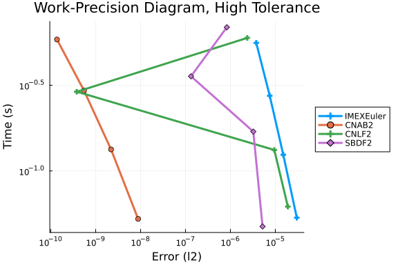
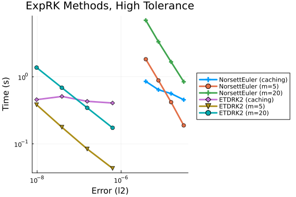
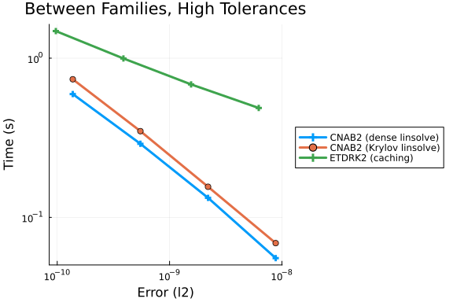
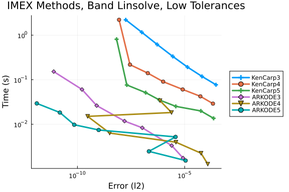
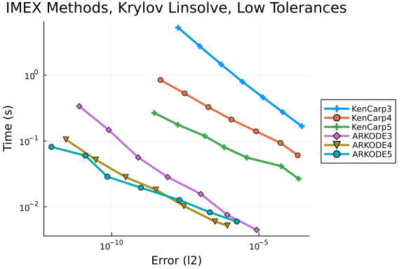
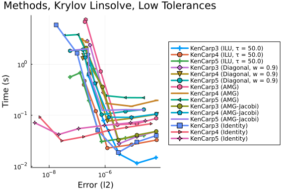
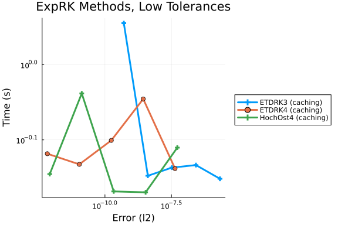
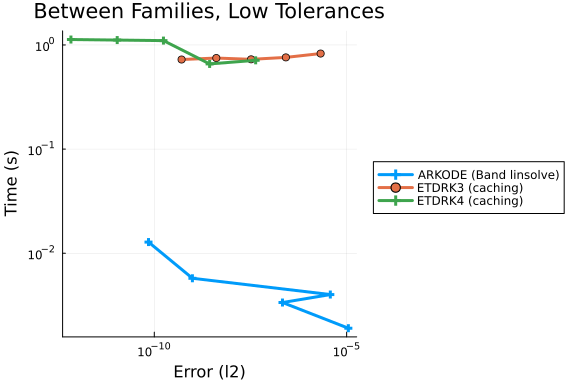

## Problem Description

The Burgers' partial differential equation is solved on the domain $[0, L] \times [0, T] \in \mathbb R \times R,~L = 1,~T = 1$, with the following initial and boundary conditions:
```math
\begin{aligned}
    \partial_t u(t,x) & = -\partial_x u^2(t,x) + \nu \partial_x^2 u(t,x), \\
    u(0,x) & = \exp\left[\frac{(x - 0.5)^2}{2 \times 0.05^2}\right], \\
    u(-L,x) & = u(L,x) = 0.
\end{aligned}
```
The spatial derivative operators are represented via finite difference approximations on an equispaced grid of points $x_s \in [-L, L]$. The diffusion coefficient $\nu = 10^{-2}$ is chosen to produce `interesting' behavior as seen in the reference solution below.
```math
\begin{aligned}
    \frac{du}{dt} & = -D_x u^2(t,x) + \nu D_x^2 u(t,x), \\
    u(0,x_s) & = \exp\left[\frac{(x_s - 0.5)^2}{2 \times 0.05^2}\right], \\
    u(t,-L) & = u(t,L) = 0.
\end{aligned}
```

### Implementation

```julia
using OrdinaryDiffEq
using DiffEqDevTools
using SciMLOperators
using LinearSolve
using LinearAlgebra
using SparseArrays
using Sundials
using SummationByPartsOperators
const SBP = SummationByPartsOperators
using Plots
gr();
```


```julia
nonlinear_convection!(du, u, p, t) = du .= (-p.alpha / 3) * (u .* (p.D1 * u) + p.D1 * (u .^ 2))

# Constructor
function burgers(N, L)
    # Derivative operators
    D1 = derivative_operator(MattssonSvärdNordström2004(); 
                             derivative_order = 1, accuracy_order = 2, 
                             xmin = -L, xmax = L, N = N)
    D2 = derivative_operator(MattssonSvärdNordström2004(); 
                             derivative_order = 2, accuracy_order = 2, 
                             xmin = -L, xmax = L, N = N)
    
    x = LinRange(0, L, N) # Domain discretization
    u0 = @. exp(-(x - 0.5)^2 / (2 * 0.05^2)) # Initial condition
    nu = 1e-2 # Diffusion coefficient
    alpha = 1.0 # Convection coefficient
    p = (; D1, alpha)

    prob = SplitODEProblem(MatrixOperator(nu * sparse(D2)), nonlinear_convection!, u0, (0.0, 1.0), p)

    return x, prob
end;
```


### Reference Solution

Using an adaptive timestepping method to solve the system of ordinary differential equations with high precision.

```julia
N = 128
L = 1.0
xs, prob = burgers(N, L)
sol = solve(prob, AutoVern7(Rodas5(autodiff=false)); abstol=1e-14, reltol=1e-14, adaptive=true)

test_sol = TestSolution(sol); # Reference solution for error estimation

tslices = LinRange(prob.tspan..., 50)
ys = mapreduce(sol, hcat, tslices)
p = heatmap(xs, tslices, ys', xlabel="x", ylabel="t")
```


## Work-Precision Diagrams

### High Tolerances

#### Implicit-Explicit Methods

```julia
abstols = 0.1 .^ (5:8) # all fixed dt methods so these don't matter much
reltols = 0.1 .^ (1:4)
multipliers = 0.5 .^ (0:3)
setups = [
    Dict(:alg => IMEXEuler(), :dts => 1e-4 * multipliers),
    Dict(:alg => CNAB2(), :dts => 1e-4 * multipliers),
    Dict(:alg => CNLF2(), :dts => 1e-4 * multipliers),
    Dict(:alg => SBDF2(), :dts => 1e-4 * multipliers),
]
labels = hcat(
    "IMEXEuler",
    "CNAB2",
    "CNLF2",
    "SBDF2",
)
@time wp = WorkPrecisionSet(prob, abstols, reltols, setups;
    print_names=true, names=labels, numruns=5, error_estimate=:l2,
    save_everystep=false, appxsol=test_sol, maxiters=Int(1e5));

plot(wp, label=labels, markershape=:auto, title="Work-Precision Diagram, High Tolerance")
```

```
IMEXEuler
CNAB2
CNLF2
SBDF2
 44.928949 seconds (61.70 M allocations: 27.523 GiB, 7.41% gc time, 28.08% 
compilation time)
```





#### Exponential Integrators

```julia
abstols = 0.1 .^ (5:8) # all fixed dt methods so these don't matter much
reltols = 0.1 .^ (1:4)
multipliers = 0.5 .^ (0:3)
setups = [
    Dict(:alg => NorsettEuler(), :dts => 1e-4 * multipliers),
    Dict(:alg => NorsettEuler(krylov=true, m=5), :dts => 1e-4 * multipliers),
    Dict(:alg => NorsettEuler(krylov=true, m=20), :dts => 1e-4 * multipliers),
    Dict(:alg => ETDRK2(), :dts => 1e-3 * multipliers),
    Dict(:alg => ETDRK2(krylov=true, m=5), :dts => 1e-3 * multipliers),
    Dict(:alg => ETDRK2(krylov=true, m=20), :dts => 1e-3 * multipliers)
]
labels = hcat(
    "NorsettEuler (caching)", 
    "NorsettEuler (m=5)",
    "NorsettEuler (m=20)",
    "ETDRK2 (caching)", 
    "ETDRK2 (m=5)", 
    "ETDRK2 (m=20)"
)
@time wp = WorkPrecisionSet(prob, abstols, reltols, setups;
    print_names=true, names=labels, numruns=5, error_estimate=:l2,
    save_everystep=false, appxsol=test_sol, maxiters=Int(1e5));

plot(wp, label=labels, markershape=:auto, title="ExpRK Methods, High Tolerance")
```

```
NorsettEuler (caching)
NorsettEuler (m=5)
NorsettEuler (m=20)
ETDRK2 (caching)
ETDRK2 (m=5)
ETDRK2 (m=20)
142.400140 seconds (86.54 M allocations: 61.773 GiB, 6.60% gc time, 6.19% c
ompilation time)
```





#### Comparisons Between Families

```julia
abstols = 0.1 .^ (5:8) # all fixed dt methods so these don't matter much
reltols = 0.1 .^ (1:4)
multipliers = 0.5 .^ (0:3)
setups = [
    Dict(:alg => CNAB2(), :dts => 1e-4 * multipliers),
    Dict(:alg => CNAB2(linsolve=KrylovJL_GMRES()), :dts => 1e-4 * multipliers),
    Dict(:alg => ETDRK2(), :dts => 1e-4 * multipliers),
]
labels = hcat(
    "CNAB2 (dense linsolve)",
    "CNAB2 (Krylov linsolve)", 
    "ETDRK2 (caching)",
)
@time wp = WorkPrecisionSet(prob, abstols, reltols, setups;
    print_names=true, names=labels, numruns=5, error_estimate=:l2,
    save_everystep=false, appxsol=test_sol, maxiters=Int(1e5));

plot(wp, label=labels, markershape=:auto, title="Between Families, High Tolerances")
```

```
CNAB2 (dense linsolve)
CNAB2 (Krylov linsolve)
ETDRK2 (caching)
 47.429863 seconds (40.18 M allocations: 34.580 GiB, 16.82% gc time, 4.29% 
compilation time)
```





### Low Tolerances


#### Implicit-Explicit Methods

Dense/banded linear solvers.

```julia
abstols = 0.1 .^ (7:13)
reltols = 0.1 .^ (4:10)
setups = [
    Dict(:alg => KenCarp3()),
    Dict(:alg => KenCarp4()),
    Dict(:alg => KenCarp5()),
    Dict(:alg => ARKODE(Sundials.Implicit(), order=3, linear_solver=:Band, jac_upper=1, jac_lower=1)),
    Dict(:alg => ARKODE(Sundials.Implicit(), order=4, linear_solver=:Band, jac_upper=1, jac_lower=1)),
    Dict(:alg => ARKODE(Sundials.Implicit(), order=5, linear_solver=:Band, jac_upper=1, jac_lower=1))
]
labels = hcat(
    "KenCarp3",
    "KenCarp4",
    "KenCarp5",
    "ARKODE3",
    "ARKODE4",
    "ARKODE5",
)
@time wp = WorkPrecisionSet(prob, abstols, reltols, setups;
    print_names=true, names=labels, numruns=5, error_estimate=:l2,
    save_everystep=false, appxsol=test_sol, maxiters=Int(1e5));

plot(wp, label=labels, markershape=:auto, title="IMEX Methods, Band Linsolve, Low Tolerances")
```

```
KenCarp3
KenCarp4
KenCarp5
ARKODE3
ARKODE4
ARKODE5
 55.202613 seconds (43.22 M allocations: 5.250 GiB, 1.29% gc time, 16.64% c
ompilation time)
```





Krylov linear solvers.
```julia
abstols = 0.1 .^ (7:13)
reltols = 0.1 .^ (4:10)
setups = [
    Dict(:alg => KenCarp3(linsolve=KrylovJL_GMRES())),
    Dict(:alg => KenCarp4(linsolve=KrylovJL_GMRES())),
    Dict(:alg => KenCarp5(linsolve=KrylovJL_GMRES())),
    Dict(:alg => ARKODE(Sundials.Implicit(), order=3, linear_solver=:GMRES)),
    Dict(:alg => ARKODE(Sundials.Implicit(), order=4, linear_solver=:GMRES)),
    Dict(:alg => ARKODE(Sundials.Implicit(), order=5, linear_solver=:GMRES)),
]
labels = hcat(
    "KenCarp3",
    "KenCarp4",
    "KenCarp5",
    "ARKODE3",
    "ARKODE4",
    "ARKODE5",
)
@time wp = WorkPrecisionSet(prob, abstols, reltols, setups;
    print_names=true, names=labels, numruns=5, error_estimate=:l2,
    save_everystep=false, appxsol=test_sol, maxiters=Int(1e5));

plot(wp, label=labels, markershape=:auto, title="IMEX Methods, Krylov Linsolve, Low Tolerances")
```

```
KenCarp3
KenCarp4
KenCarp5
ARKODE3
ARKODE4
ARKODE5
 84.077624 seconds (37.62 M allocations: 4.646 GiB, 0.76% gc time, 9.96% co
mpilation time)
```





Krylov solvers with preconditioners.
```julia
# Weighted diagonal preconditioner
import LinearAlgebra as LA
Base.@kwdef struct WeightedDiagonalPreconBuilder
    w::Float64
end

(builder::WeightedDiagonalPreconBuilder)(A, du, u, p, t, newW, Plprev, Prprev, solverdata) = (builder.w * LA.Diagonal(convert(AbstractMatrix, A)), LA.I)

# Incomplete LU factorization
using IncompleteLU
Base.@kwdef struct IncompleteLUPreconBuilder
    τ::Float64
end
function (builder::IncompleteLUPreconBuilder)(W, du, u, p, t, newW, Plprev, Prprev, solverdata)
    if newW === nothing || newW
        Pl = ilu(convert(AbstractMatrix, W), τ = builder.τ)
    else
        Pl = Plprev
    end
    Pl, nothing
end

# Algebraic multigrid
using AlgebraicMultigrid
function algebraicmultigrid(W, du, u, p, t, newW, Plprev, Prprev, solverdata)
    if newW === nothing || newW
        Pl = aspreconditioner(ruge_stuben(convert(AbstractMatrix, W)))
    else
        Pl = Plprev
    end
    Pl, nothing
end
function algebraicmultigrid2(W, du, u, p, t, newW, Plprev, Prprev, solverdata)
    if newW === nothing || newW
        A = convert(AbstractMatrix, W)
        Pl = AlgebraicMultigrid.aspreconditioner(AlgebraicMultigrid.ruge_stuben(A,
            presmoother = AlgebraicMultigrid.Jacobi(rand(size(A,
                1))),
            postsmoother = AlgebraicMultigrid.Jacobi(rand(size(A,
                1)))))
    else
        Pl = Plprev
    end
    Pl, nothing
end

# Cholesky
using Preconditioners
function cholesky(W, du, u, p, t, newW, Plprev, Prprev, solverdata)
    W = convert(AbstractMatrix, W)
    if newW === nothing || newW
        Pl = CholeskyPreconditioner(W)
    else
        Pl = Plprev
    end
    Pl, nothing
end

# Aliases
chol = cholesky
inc_lu = IncompleteLUPreconBuilder(τ = 50.0)
w_diag = WeightedDiagonalPreconBuilder(w = 0.9)
amg = algebraicmultigrid
amg2 = algebraicmultigrid2

abstols = 0.1 .^ (8:13)
reltols = 0.1 .^ (5:10)
N = length(abstols)
setups = [
    # Dict(:alg => KenCarp3(linsolve=KrylovJL_GMRES(), :dts => 1e-2 * ones(N), :adaptive => true),
    # Dict(:alg => KenCarp4(linsolve=KrylovJL_GMRES(), :dts => 1e-2 * ones(N), :adaptive => true),
    # Dict(:alg => KenCarp5(linsolve=KrylovJL_GMRES(), :dts => 1e-2 * ones(N), :adaptive => true),
    Dict(:alg => KenCarp3(linsolve=KrylovJL_GMRES(), precs = inc_lu, concrete_jac = true), :dts => 1e-2 * ones(N), :adaptive => true),
    Dict(:alg => KenCarp4(linsolve=KrylovJL_GMRES(), precs = inc_lu, concrete_jac = true), :dts => 1e-2 * ones(N), :adaptive => true),
    Dict(:alg => KenCarp5(linsolve=KrylovJL_GMRES(), precs = inc_lu, concrete_jac = true), :dts => 1e-2 * ones(N), :adaptive => true),
    Dict(:alg => KenCarp3(linsolve=KrylovJL_GMRES(), precs = w_diag, concrete_jac = true), :dts => 1e-2 * ones(N), :adaptive => true),
    Dict(:alg => KenCarp4(linsolve=KrylovJL_GMRES(), precs = w_diag, concrete_jac = true), :dts => 1e-2 * ones(N), :adaptive => true),
    Dict(:alg => KenCarp5(linsolve=KrylovJL_GMRES(), precs = w_diag, concrete_jac = true), :dts => 1e-2 * ones(N), :adaptive => true),
    Dict(:alg => KenCarp3(linsolve=KrylovJL_GMRES(), precs = amg, concrete_jac = true), :dts => 1e-2 * ones(N), :adaptive => true),
    Dict(:alg => KenCarp4(linsolve=KrylovJL_GMRES(), precs = amg, concrete_jac = true), :dts => 1e-2 * ones(N), :adaptive => true),
    Dict(:alg => KenCarp5(linsolve=KrylovJL_GMRES(), precs = amg, concrete_jac = true), :dts => 1e-2 * ones(N), :adaptive => true),    
    Dict(:alg => KenCarp3(linsolve=KrylovJL_GMRES(), precs = amg2, concrete_jac = true), :dts => 1e-2 * ones(N), :adaptive => true),
    Dict(:alg => KenCarp4(linsolve=KrylovJL_GMRES(), precs = amg2, concrete_jac = true), :dts => 1e-2 * ones(N), :adaptive => true),
    Dict(:alg => KenCarp5(linsolve=KrylovJL_GMRES(), precs = amg2, concrete_jac = true), :dts => 1e-2 * ones(N), :adaptive => true),
    Dict(:alg => KenCarp3(linsolve=KrylovJL_GMRES()), :dts => 1e-2 * ones(N), :adaptive => true),
    Dict(:alg => KenCarp4(linsolve=KrylovJL_GMRES()), :dts => 1e-2 * ones(N), :adaptive => true),
    Dict(:alg => KenCarp5(linsolve=KrylovJL_GMRES()), :dts => 1e-2 * ones(N), :adaptive => true),
]
labels = hcat(
    # "KenCarp3 (Cholesky)",
    # "KenCarp4 (Cholesky)",
    # "KenCarp5 (Cholesky)",
    "KenCarp3 (ILU, τ = $(inc_lu.τ))",
    "KenCarp4 (ILU, τ = $(inc_lu.τ))",
    "KenCarp5 (ILU, τ = $(inc_lu.τ))",
    "KenCarp3 (Diagonal, w = $(w_diag.w))",
    "KenCarp4 (Diagonal, w = $(w_diag.w))",
    "KenCarp5 (Diagonal, w = $(w_diag.w))",
    "KenCarp3 (AMG)",
    "KenCarp4 (AMG)",
    "KenCarp5 (AMG)",
    "KenCarp3 (AMG-Jacobi)",
    "KenCarp4 (AMG-Jacobi)",
    "KenCarp5 (AMG-Jacobi)",
    "KenCarp3 (Identity)",
    "KenCarp4 (Identity)",
    "KenCarp5 (Identity)",
)
@time wp = WorkPrecisionSet(prob, abstols, reltols, setups;
    print_names=true, names=labels, numruns=5, error_estimate=:l2,
    save_everystep=false, appxsol=test_sol, maxiters=Int(1e5));

plot(wp, label=labels, markershape=:auto, title="IMEX Methods, Krylov Linsolve, Low Tolerances")
```

```
KenCarp3 (ILU, τ = 50.0)
KenCarp4 (ILU, τ = 50.0)
KenCarp5 (ILU, τ = 50.0)
KenCarp3 (Diagonal, w = 0.9)
KenCarp4 (Diagonal, w = 0.9)
KenCarp5 (Diagonal, w = 0.9)
KenCarp3 (AMG)
KenCarp4 (AMG)
KenCarp5 (AMG)
KenCarp3 (AMG-Jacobi)
KenCarp4 (AMG-Jacobi)
KenCarp5 (AMG-Jacobi)
KenCarp3 (Identity)
KenCarp4 (Identity)
KenCarp5 (Identity)
354.164142 seconds (96.35 M allocations: 23.482 GiB, 0.81% gc time, 8.76% c
ompilation time)
```





#### Exponential Integrators

```julia
abstols = 0.1 .^ (7:11) # all fixed dt methods so these don't matter much
reltols = 0.1 .^ (4:8)
multipliers = 0.5 .^ (0:4)
setups = [
    Dict(:alg => ETDRK3(), :dts => 1e-2 * multipliers),
    Dict(:alg => ETDRK4(), :dts => 1e-2 * multipliers),
    Dict(:alg => HochOst4(), :dts => 1e-2 * multipliers),
]
labels = hcat(
    "ETDRK3 (caching)",
    "ETDRK4 (caching)",
    "HochOst4 (caching)",
)
@time wp = WorkPrecisionSet(prob, abstols, reltols, setups;
    print_names=true, names=labels, numruns=5, error_estimate=:l2,
    save_everystep=false, appxsol=test_sol, maxiters=Int(1e5));

plot(wp, label=labels, markershape=:auto, title="ExpRK Methods, Low Tolerances")
```

```
ETDRK3 (caching)
ETDRK4 (caching)
HochOst4 (caching)
101.746540 seconds (11.47 M allocations: 19.659 GiB, 0.70% gc time, 6.03% c
ompilation time)
```





#### Comparisons Between Families

```julia
abstols = 0.1 .^ (7:11)
reltols = 0.1 .^ (4:8)
multipliers = 0.5 .^ (0:4)
setups = [
    Dict(:alg => ARKODE(Sundials.Implicit(), order=5, linear_solver=:Band, jac_upper=1, jac_lower=1)),
    Dict(:alg => ETDRK3(), :dts => 1e-2 * multipliers),
    Dict(:alg => ETDRK4(), :dts => 1e-2 * multipliers),
]
labels = hcat(
    "ARKODE (Band linsolve)",
    "ETDRK3 (caching)",
    "ETDRK4 (caching)",
)
@time wp = WorkPrecisionSet(prob, abstols, reltols, setups;
    print_names=true, names=labels, numruns=5, error_estimate=:l2,
    save_everystep=false, appxsol=test_sol, maxiters=Int(1e5));

plot(wp, label=labels, markershape=:auto, title="Between Families, Low Tolerances")
```

```
ARKODE (Band linsolve)
ETDRK3 (caching)
ETDRK4 (caching)
 66.256986 seconds (1.76 M allocations: 12.637 GiB, 0.64% gc time, 0.01% co
mpilation time)
```





## Appendix

These benchmarks are a part of the SciMLBenchmarks.jl repository, found at: [https://github.com/SciML/SciMLBenchmarks.jl](https://github.com/SciML/SciMLBenchmarks.jl). For more information on high-performance scientific machine learning, check out the SciML Open Source Software Organization [https://sciml.ai](https://sciml.ai).

To locally run this benchmark, do the following commands:

```
using SciMLBenchmarks
SciMLBenchmarks.weave_file("benchmarks/SimpleHandwrittenPDE","burgers_fdm_wpd.jmd")
```

Computer Information:

```
Julia Version 1.10.10
Commit 95f30e51f41 (2025-06-27 09:51 UTC)
Build Info:
  Official https://julialang.org/ release
Platform Info:
  OS: Linux (x86_64-linux-gnu)
  CPU: 128 × AMD EPYC 7502 32-Core Processor
  WORD_SIZE: 64
  LIBM: libopenlibm
  LLVM: libLLVM-15.0.7 (ORCJIT, znver2)
Threads: 1 default, 0 interactive, 1 GC (on 128 virtual cores)
Environment:
  JULIA_CPU_THREADS = 128
  JULIA_DEPOT_PATH = /cache/julia-buildkite-plugin/depots/5b300254-1738-4989-ae0a-f4d2d937f953

```

Package Information:

```
Status `/cache/build/exclusive-amdci1-0/julialang/scimlbenchmarks-dot-jl/benchmarks/SimpleHandwrittenPDE/Project.toml`
⌅ [2169fc97] AlgebraicMultigrid v0.5.1
  [b30e2e7b] ClassicalOrthogonalPolynomials v0.15.3
  [f3b72e0c] DiffEqDevTools v2.48.0
  [40713840] IncompleteLU v0.2.1
  [7f56f5a3] LSODA v0.7.5
⌃ [7ed4a6bd] LinearSolve v3.26.0
⌃ [1dea7af3] OrdinaryDiffEq v6.101.0
⌃ [91a5bcdd] Plots v1.40.17
  [af69fa37] Preconditioners v0.6.1
  [31c91b34] SciMLBenchmarks v0.1.3
⌃ [c0aeaf25] SciMLOperators v1.4.0
  [9f78cca6] SummationByPartsOperators v0.5.81
  [c3572dad] Sundials v4.28.0
  [37e2e46d] LinearAlgebra
  [2f01184e] SparseArrays v1.10.0
Info Packages marked with ⌃ and ⌅ have new versions available. Those with ⌃ may be upgradable, but those with ⌅ are restricted by compatibility constraints from upgrading. To see why use `status --outdated`
Warning The project dependencies or compat requirements have changed since the manifest was last resolved. It is recommended to `Pkg.resolve()` or consider `Pkg.update()` if necessary.
```

And the full manifest:

```
Status `/cache/build/exclusive-amdci1-0/julialang/scimlbenchmarks-dot-jl/benchmarks/SimpleHandwrittenPDE/Manifest.toml`
⌃ [47edcb42] ADTypes v1.16.0
  [14f7f29c] AMD v0.5.3
  [621f4979] AbstractFFTs v1.5.0
  [7d9f7c33] Accessors v0.1.42
  [79e6a3ab] Adapt v4.3.0
⌅ [2169fc97] AlgebraicMultigrid v0.5.1
  [66dad0bd] AliasTables v1.1.3
  [dce04be8] ArgCheck v2.5.0
  [4fba245c] ArrayInterface v7.19.0
  [4c555306] ArrayLayouts v1.11.2
  [15f4f7f2] AutoHashEquals v2.2.0
  [aae01518] BandedMatrices v1.9.4
  [0e736298] Bessels v0.2.8
  [d1d4a3ce] BitFlags v0.1.9
  [62783981] BitTwiddlingConvenienceFunctions v0.1.6
⌃ [8e7c35d0] BlockArrays v1.7.0
  [ffab5731] BlockBandedMatrices v0.13.4
  [70df07ce] BracketingNonlinearSolve v1.3.0
  [fa961155] CEnum v0.5.0
  [2a0fbf3d] CPUSummary v0.2.7
⌃ [d360d2e6] ChainRulesCore v1.25.2
  [b30e2e7b] ClassicalOrthogonalPolynomials v0.15.3
  [fb6a15b2] CloseOpenIntervals v0.1.13
  [944b1d66] CodecZlib v0.7.8
  [35d6a980] ColorSchemes v3.30.0
  [3da002f7] ColorTypes v0.12.1
  [c3611d14] ColorVectorSpace v0.11.0
  [5ae59095] Colors v0.13.1
  [38540f10] CommonSolve v0.2.4
  [bbf7d656] CommonSubexpressions v0.3.1
  [f70d9fcc] CommonWorldInvalidations v1.0.0
  [34da2185] Compat v4.18.0
  [b152e2b5] CompositeTypes v0.1.4
  [a33af91c] CompositionsBase v0.1.2
  [2569d6c7] ConcreteStructs v0.2.3
  [f0e56b4a] ConcurrentUtilities v2.5.0
  [8f4d0f93] Conda v1.10.2
  [187b0558] ConstructionBase v1.6.0
  [7ae1f121] ContinuumArrays v0.19.3
  [d38c429a] Contour v0.6.3
  [adafc99b] CpuId v0.3.1
  [a8cc5b0e] Crayons v4.1.1
  [717857b8] DSP v0.8.4
  [9a962f9c] DataAPI v1.16.0
⌅ [864edb3b] DataStructures v0.18.22
  [e2d170a0] DataValueInterfaces v1.0.0
  [8bb1440f] DelimitedFiles v1.9.1
⌃ [2b5f629d] DiffEqBase v6.182.1
  [f3b72e0c] DiffEqDevTools v2.48.0
  [77a26b50] DiffEqNoiseProcess v5.24.1
  [163ba53b] DiffResults v1.1.0
  [b552c78f] DiffRules v1.15.1
⌃ [a0c0ee7d] DifferentiationInterface v0.7.4
  [b4f34e82] Distances v0.10.12
  [31c24e10] Distributions v0.25.120
  [ffbed154] DocStringExtensions v0.9.5
  [5b8099bc] DomainSets v0.7.16
  [4e289a0a] EnumX v1.0.5
  [f151be2c] EnzymeCore v0.8.12
  [460bff9d] ExceptionUnwrapping v0.1.11
  [d4d017d3] ExponentialUtilities v1.27.0
  [e2ba6199] ExprTools v0.1.10
  [55351af7] ExproniconLite v0.10.14
  [c87230d0] FFMPEG v0.4.4
  [7a1cc6ca] FFTW v1.9.0
  [7034ab61] FastBroadcast v0.3.5
  [9aa1b823] FastClosures v0.3.2
  [442a2c76] FastGaussQuadrature v1.0.2
  [a4df4552] FastPower v1.1.3
  [057dd010] FastTransforms v0.17.0
  [1a297f60] FillArrays v1.13.0
⌃ [6a86dc24] FiniteDiff v2.27.0
  [53c48c17] FixedPointNumbers v0.8.5
  [1fa38f19] Format v1.3.7
⌃ [f6369f11] ForwardDiff v1.0.1
  [069b7b12] FunctionWrappers v1.1.3
  [77dc65aa] FunctionWrappersWrappers v0.1.3
  [46192b85] GPUArraysCore v0.2.0
  [28b8d3ca] GR v0.73.17
  [a8297547] GenericFFT v0.1.6
  [c145ed77] GenericSchur v0.5.5
⌃ [d7ba0133] Git v1.4.0
  [42e2da0e] Grisu v1.0.2
  [cd3eb016] HTTP v1.10.17
  [eafb193a] Highlights v0.5.3
  [3e5b6fbb] HostCPUFeatures v0.1.17
  [34004b35] HypergeometricFunctions v0.3.28
⌃ [7073ff75] IJulia v1.29.2
  [615f187c] IfElse v0.1.1
  [40713840] IncompleteLU v0.2.1
  [4858937d] InfiniteArrays v0.15.6
  [cde9dba0] InfiniteLinearAlgebra v0.10.0
  [e1ba4f0e] Infinities v0.1.11
  [8197267c] IntervalSets v0.7.11
  [3587e190] InverseFunctions v0.1.17
  [92d709cd] IrrationalConstants v0.2.4
  [c8e1da08] IterTools v1.10.0
  [82899510] IteratorInterfaceExtensions v1.0.0
  [1019f520] JLFzf v0.1.11
  [692b3bcd] JLLWrappers v1.7.1
  [682c06a0] JSON v0.21.4
  [ae98c720] Jieko v0.2.1
  [ba0b0d4f] Krylov v0.10.1
  [7f56f5a3] LSODA v0.7.5
  [b964fa9f] LaTeXStrings v1.4.0
⌃ [23fbe1c1] Latexify v0.16.8
  [10f19ff3] LayoutPointers v0.1.17
  [5078a376] LazyArrays v2.6.2
  [d7e5e226] LazyBandedMatrices v0.11.4
  [f5a24dde] LimitedLDLFactorizations v0.5.2
  [87fe0de2] LineSearch v0.1.4
  [d3d80556] LineSearches v7.4.0
⌃ [7ed4a6bd] LinearSolve v3.26.0
  [2ab3a3ac] LogExpFunctions v0.3.29
  [e6f89c97] LoggingExtras v1.1.0
  [bdcacae8] LoopVectorization v0.12.172
  [1914dd2f] MacroTools v0.5.16
  [d125e4d3] ManualMemory v0.1.8
  [a3b82374] MatrixFactorizations v3.0.1
  [bb5d69b7] MaybeInplace v0.1.4
  [739be429] MbedTLS v1.1.9
  [442fdcdd] Measures v0.3.2
  [e1d29d7a] Missings v1.2.0
  [2e0e35c7] Moshi v0.3.7
  [46d2c3a1] MuladdMacro v0.2.4
  [ffc61752] Mustache v1.0.21
  [d41bc354] NLSolversBase v7.10.0
  [2774e3e8] NLsolve v4.5.1
  [77ba4419] NaNMath v1.1.3
  [8913a72c] NonlinearSolve v4.10.0
  [be0214bd] NonlinearSolveBase v1.14.0
  [5959db7a] NonlinearSolveFirstOrder v1.7.0
  [9a2c21bd] NonlinearSolveQuasiNewton v1.8.0
  [26075421] NonlinearSolveSpectralMethods v1.3.0
  [6fe1bfb0] OffsetArrays v1.17.0
  [4d8831e6] OpenSSL v1.5.0
  [429524aa] Optim v1.13.2
  [bac558e1] OrderedCollections v1.8.1
⌃ [1dea7af3] OrdinaryDiffEq v6.101.0
⌃ [89bda076] OrdinaryDiffEqAdamsBashforthMoulton v1.3.0
⌃ [6ad6398a] OrdinaryDiffEqBDF v1.8.0
⌃ [bbf590c4] OrdinaryDiffEqCore v1.27.0
⌃ [50262376] OrdinaryDiffEqDefault v1.6.0
⌃ [4302a76b] OrdinaryDiffEqDifferentiation v1.11.0
⌃ [9286f039] OrdinaryDiffEqExplicitRK v1.2.0
⌃ [e0540318] OrdinaryDiffEqExponentialRK v1.6.0
⌃ [becaefa8] OrdinaryDiffEqExtrapolation v1.6.0
⌃ [5960d6e9] OrdinaryDiffEqFIRK v1.14.0
⌃ [101fe9f7] OrdinaryDiffEqFeagin v1.2.0
⌃ [d3585ca7] OrdinaryDiffEqFunctionMap v1.3.0
⌃ [d28bc4f8] OrdinaryDiffEqHighOrderRK v1.3.0
⌃ [9f002381] OrdinaryDiffEqIMEXMultistep v1.5.0
⌃ [521117fe] OrdinaryDiffEqLinear v1.4.0
⌃ [1344f307] OrdinaryDiffEqLowOrderRK v1.4.0
⌃ [b0944070] OrdinaryDiffEqLowStorageRK v1.4.0
⌃ [127b3ac7] OrdinaryDiffEqNonlinearSolve v1.12.0
⌃ [c9986a66] OrdinaryDiffEqNordsieck v1.2.0
⌃ [5dd0a6cf] OrdinaryDiffEqPDIRK v1.4.0
⌃ [5b33eab2] OrdinaryDiffEqPRK v1.2.0
⌃ [04162be5] OrdinaryDiffEqQPRK v1.2.0
⌃ [af6ede74] OrdinaryDiffEqRKN v1.3.0
⌃ [43230ef6] OrdinaryDiffEqRosenbrock v1.13.0
⌃ [2d112036] OrdinaryDiffEqSDIRK v1.5.0
⌃ [669c94d9] OrdinaryDiffEqSSPRK v1.4.0
⌃ [e3e12d00] OrdinaryDiffEqStabilizedIRK v1.4.0
⌃ [358294b1] OrdinaryDiffEqStabilizedRK v1.3.0
⌃ [fa646aed] OrdinaryDiffEqSymplecticRK v1.5.0
⌃ [b1df2697] OrdinaryDiffEqTsit5 v1.3.0
⌃ [79d7bb75] OrdinaryDiffEqVerner v1.4.0
  [90014a1f] PDMats v0.11.35
  [d96e819e] Parameters v0.12.3
  [69de0a69] Parsers v2.8.3
  [ccf2f8ad] PlotThemes v3.3.0
  [995b91a9] PlotUtils v1.4.3
⌃ [91a5bcdd] Plots v1.40.17
  [e409e4f3] PoissonRandom v0.4.6
  [f517fe37] Polyester v0.7.18
  [1d0040c9] PolyesterWeave v0.2.2
  [c74db56a] PolynomialBases v0.4.25
  [f27b6e38] Polynomials v4.1.0
  [85a6dd25] PositiveFactorizations v0.2.4
⌃ [d236fae5] PreallocationTools v0.4.29
⌅ [aea7be01] PrecompileTools v1.2.1
  [af69fa37] Preconditioners v0.6.1
⌃ [21216c6a] Preferences v1.4.3
⌅ [08abe8d2] PrettyTables v2.4.0
  [43287f4e] PtrArrays v1.3.0
  [1fd47b50] QuadGK v2.11.2
  [c4ea9172] QuasiArrays v0.12.0
  [74087812] Random123 v1.7.1
  [e6cf234a] RandomNumbers v1.6.0
  [3cdcf5f2] RecipesBase v1.3.4
  [01d81517] RecipesPipeline v0.6.12
  [b889d2dc] RecurrenceRelationshipArrays v0.1.3
  [807425ed] RecurrenceRelationships v0.2.0
⌃ [731186ca] RecursiveArrayTools v3.36.0
  [189a3867] Reexport v1.2.2
  [05181044] RelocatableFolders v1.0.1
  [ae029012] Requires v1.3.1
  [ae5879a3] ResettableStacks v1.1.1
  [79098fc4] Rmath v0.8.0
  [47965b36] RootedTrees v2.23.1
  [7e49a35a] RuntimeGeneratedFunctions v0.5.15
  [94e857df] SIMDTypes v0.1.0
  [476501e8] SLEEFPirates v0.6.43
⌃ [0bca4576] SciMLBase v2.108.0
  [31c91b34] SciMLBenchmarks v0.1.3
  [19f34311] SciMLJacobianOperators v0.1.8
⌃ [c0aeaf25] SciMLOperators v1.4.0
  [53ae85a6] SciMLStructures v1.7.0
  [6c6a2e73] Scratch v1.3.0
  [f8ebbe35] SemiseparableMatrices v0.4.0
  [efcf1570] Setfield v1.1.2
  [992d4aef] Showoff v1.0.3
  [777ac1f9] SimpleBufferStream v1.2.0
  [727e6d20] SimpleNonlinearSolve v2.7.0
  [ce78b400] SimpleUnPack v1.1.0
  [b85f4697] SoftGlobalScope v1.1.0
  [a2af1166] SortingAlgorithms v1.2.2
  [0a514795] SparseMatrixColorings v0.4.21
  [276daf66] SpecialFunctions v2.5.1
  [860ef19b] StableRNGs v1.0.3
  [aedffcd0] Static v1.2.0
  [0d7ed370] StaticArrayInterface v1.8.0
  [90137ffa] StaticArrays v1.9.14
  [1e83bf80] StaticArraysCore v1.4.3
  [82ae8749] StatsAPI v1.7.1
  [2913bbd2] StatsBase v0.34.6
  [4c63d2b9] StatsFuns v1.5.0
⌃ [7792a7ef] StrideArraysCore v0.5.7
  [69024149] StringEncodings v0.3.7
  [892a3eda] StringManipulation v0.4.1
  [09ab397b] StructArrays v0.7.1
  [9f78cca6] SummationByPartsOperators v0.5.81
  [c3572dad] Sundials v4.28.0
⌃ [2efcf032] SymbolicIndexingInterface v0.3.42
  [3783bdb8] TableTraits v1.0.1
  [bd369af6] Tables v1.12.1
  [62fd8b95] TensorCore v0.1.1
  [8290d209] ThreadingUtilities v0.5.5
  [a759f4b9] TimerOutputs v0.5.29
  [c751599d] ToeplitzMatrices v0.8.5
  [3bb67fe8] TranscodingStreams v0.11.3
  [781d530d] TruncatedStacktraces v1.4.0
  [5c2747f8] URIs v1.6.1
  [3a884ed6] UnPack v1.0.2
  [1cfade01] UnicodeFun v0.4.1
  [1986cc42] Unitful v1.24.0
  [45397f5d] UnitfulLatexify v1.7.0
  [9602ed7d] Unrolled v0.1.5
  [41fe7b60] Unzip v0.2.0
  [3d5dd08c] VectorizationBase v0.21.71
  [81def892] VersionParsing v1.3.0
  [44d3d7a6] Weave v0.10.12
  [ddb6d928] YAML v0.4.14
  [c2297ded] ZMQ v1.4.1
  [6e34b625] Bzip2_jll v1.0.9+0
  [83423d85] Cairo_jll v1.18.5+0
  [ee1fde0b] Dbus_jll v1.16.2+0
  [2702e6a9] EpollShim_jll v0.0.20230411+1
⌃ [2e619515] Expat_jll v2.6.5+0
  [b22a6f82] FFMPEG_jll v7.1.1+0
  [f5851436] FFTW_jll v3.3.11+0
  [34b6f7d7] FastTransforms_jll v0.6.3+0
⌃ [a3f928ae] Fontconfig_jll v2.16.0+0
  [d7e528f0] FreeType2_jll v2.13.4+0
  [559328eb] FriBidi_jll v1.0.17+0
  [0656b61e] GLFW_jll v3.4.0+2
  [d2c73de3] GR_jll v0.73.17+0
  [b0724c58] GettextRuntime_jll v0.22.4+0
⌃ [f8c6e375] Git_jll v2.50.1+0
  [7746bdde] Glib_jll v2.84.3+0
  [3b182d85] Graphite2_jll v1.3.15+0
  [2e76f6c2] HarfBuzz_jll v8.5.1+0
  [1d5cc7b8] IntelOpenMP_jll v2025.2.0+0
⌃ [aacddb02] JpegTurbo_jll v3.1.1+0
  [c1c5ebd0] LAME_jll v3.100.3+0
  [88015f11] LERC_jll v4.0.1+0
  [1d63c593] LLVMOpenMP_jll v18.1.8+0
  [aae0fff6] LSODA_jll v0.1.2+0
  [dd4b983a] LZO_jll v2.10.3+0
  [e9f186c6] Libffi_jll v3.4.7+0
  [7e76a0d4] Libglvnd_jll v1.7.1+1
  [94ce4f54] Libiconv_jll v1.18.0+0
⌃ [4b2f31a3] Libmount_jll v2.41.0+0
  [89763e89] Libtiff_jll v4.7.1+0
⌃ [38a345b3] Libuuid_jll v2.41.0+0
  [856f044c] MKL_jll v2025.2.0+0
  [e7412a2a] Ogg_jll v1.3.6+0
  [9bd350c2] OpenSSH_jll v10.0.1+0
  [458c3c95] OpenSSL_jll v3.5.2+0
  [efe28fd5] OpenSpecFun_jll v0.5.6+0
  [91d4177d] Opus_jll v1.5.2+0
  [36c8627f] Pango_jll v1.56.3+0
⌅ [30392449] Pixman_jll v0.44.2+0
  [c0090381] Qt6Base_jll v6.8.2+1
  [629bc702] Qt6Declarative_jll v6.8.2+1
  [ce943373] Qt6ShaderTools_jll v6.8.2+1
  [e99dba38] Qt6Wayland_jll v6.8.2+1
  [f50d1b31] Rmath_jll v0.5.1+0
⌅ [fb77eaff] Sundials_jll v5.2.2+0
  [a44049a8] Vulkan_Loader_jll v1.3.243+0
  [a2964d1f] Wayland_jll v1.24.0+0
  [ffd25f8a] XZ_jll v5.8.1+0
  [f67eecfb] Xorg_libICE_jll v1.1.2+0
  [c834827a] Xorg_libSM_jll v1.2.6+0
  [4f6342f7] Xorg_libX11_jll v1.8.12+0
  [0c0b7dd1] Xorg_libXau_jll v1.0.13+0
  [935fb764] Xorg_libXcursor_jll v1.2.4+0
  [a3789734] Xorg_libXdmcp_jll v1.1.6+0
  [1082639a] Xorg_libXext_jll v1.3.7+0
  [d091e8ba] Xorg_libXfixes_jll v6.0.1+0
  [a51aa0fd] Xorg_libXi_jll v1.8.3+0
  [d1454406] Xorg_libXinerama_jll v1.1.6+0
  [ec84b674] Xorg_libXrandr_jll v1.5.5+0
  [ea2f1a96] Xorg_libXrender_jll v0.9.12+0
  [c7cfdc94] Xorg_libxcb_jll v1.17.1+0
  [cc61e674] Xorg_libxkbfile_jll v1.1.3+0
  [e920d4aa] Xorg_xcb_util_cursor_jll v0.1.5+0
  [12413925] Xorg_xcb_util_image_jll v0.4.1+0
  [2def613f] Xorg_xcb_util_jll v0.4.1+0
  [975044d2] Xorg_xcb_util_keysyms_jll v0.4.1+0
  [0d47668e] Xorg_xcb_util_renderutil_jll v0.3.10+0
  [c22f9ab0] Xorg_xcb_util_wm_jll v0.4.2+0
  [35661453] Xorg_xkbcomp_jll v1.4.7+0
  [33bec58e] Xorg_xkeyboard_config_jll v2.44.0+0
  [c5fb5394] Xorg_xtrans_jll v1.6.0+0
  [8f1865be] ZeroMQ_jll v4.3.6+0
  [3161d3a3] Zstd_jll v1.5.7+1
  [35ca27e7] eudev_jll v3.2.14+0
  [214eeab7] fzf_jll v0.61.1+0
  [a4ae2306] libaom_jll v3.12.1+0
  [0ac62f75] libass_jll v0.17.4+0
  [1183f4f0] libdecor_jll v0.2.2+0
  [2db6ffa8] libevdev_jll v1.13.4+0
  [f638f0a6] libfdk_aac_jll v2.0.4+0
  [36db933b] libinput_jll v1.28.1+0
  [b53b4c65] libpng_jll v1.6.50+0
  [a9144af2] libsodium_jll v1.0.21+0
  [f27f6e37] libvorbis_jll v1.3.8+0
  [009596ad] mtdev_jll v1.1.7+0
  [1317d2d5] oneTBB_jll v2022.0.0+0
  [1270edf5] x264_jll v10164.0.1+0
  [dfaa095f] x265_jll v4.1.0+0
  [d8fb68d0] xkbcommon_jll v1.9.2+0
  [0dad84c5] ArgTools v1.1.1
  [56f22d72] Artifacts
  [2a0f44e3] Base64
  [ade2ca70] Dates
  [8ba89e20] Distributed
  [f43a241f] Downloads v1.6.0
  [7b1f6079] FileWatching
  [9fa8497b] Future
  [b77e0a4c] InteractiveUtils
  [4af54fe1] LazyArtifacts
  [b27032c2] LibCURL v0.6.4
  [76f85450] LibGit2
  [8f399da3] Libdl
  [37e2e46d] LinearAlgebra
  [56ddb016] Logging
  [d6f4376e] Markdown
  [a63ad114] Mmap
  [ca575930] NetworkOptions v1.2.0
  [44cfe95a] Pkg v1.10.0
  [de0858da] Printf
  [3fa0cd96] REPL
  [9a3f8284] Random
  [ea8e919c] SHA v0.7.0
  [9e88b42a] Serialization
  [6462fe0b] Sockets
  [2f01184e] SparseArrays v1.10.0
  [10745b16] Statistics v1.10.0
  [4607b0f0] SuiteSparse
  [fa267f1f] TOML v1.0.3
  [a4e569a6] Tar v1.10.0
  [8dfed614] Test
  [cf7118a7] UUIDs
  [4ec0a83e] Unicode
  [e66e0078] CompilerSupportLibraries_jll v1.1.1+0
  [781609d7] GMP_jll v6.2.1+6
  [deac9b47] LibCURL_jll v8.4.0+0
  [e37daf67] LibGit2_jll v1.6.4+0
  [29816b5a] LibSSH2_jll v1.11.0+1
  [3a97d323] MPFR_jll v4.2.0+1
  [c8ffd9c3] MbedTLS_jll v2.28.2+1
  [14a3606d] MozillaCACerts_jll v2023.1.10
  [4536629a] OpenBLAS_jll v0.3.23+4
  [05823500] OpenLibm_jll v0.8.5+0
  [efcefdf7] PCRE2_jll v10.42.0+1
  [bea87d4a] SuiteSparse_jll v7.2.1+1
  [83775a58] Zlib_jll v1.2.13+1
  [8e850b90] libblastrampoline_jll v5.11.0+0
  [8e850ede] nghttp2_jll v1.52.0+1
  [3f19e933] p7zip_jll v17.4.0+2
Info Packages marked with ⌃ and ⌅ have new versions available. Those with ⌃ may be upgradable, but those with ⌅ are restricted by compatibility constraints from upgrading. To see why use `status --outdated -m`
Warning The project dependencies or compat requirements have changed since the manifest was last resolved. It is recommended to `Pkg.resolve()` or consider `Pkg.update()` if necessary.
```

