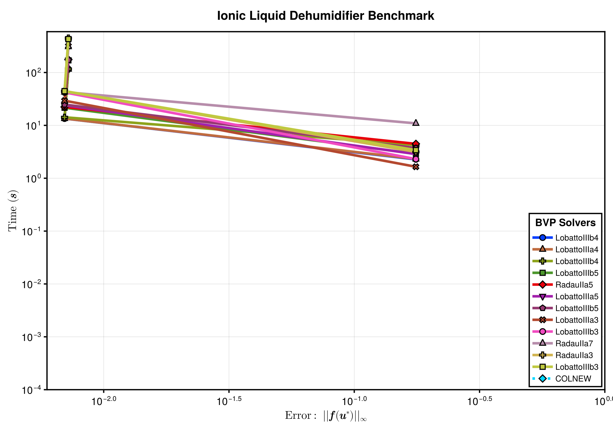

This benchmark compares the runtime and error of BVP solvers, including FIRK solvers and FORTRAN BVP solvers on ionic liquid dehumidifier problem.
For this problem, we test the following solvers:

  - BoundaryValueDiffEq.jl's FIRK nested solvers(including `RadauIIa3`, `RadauIIa5`, `RadauIIa7`, `LobattoIIIa3`, `LobattoIIIa4`, `LobattoIIIa5`, `LobattoIIIb3`, `LobattoIIIb4`, `LobattoIIIb5`, `LobattoIIIc3`, `LobattoIIIc4`, `LobattoIIIc5`).
  - FORTRAN BVP solvers from ODEInterface.jl(including `BVPM2` and `COLNEW`).

# Setup

Fetch required packages.

```julia
using BoundaryValueDiffEq, BracketingNonlinearSolve, ODEInterface, DiffEqDevTools,
      BenchmarkTools,
      Interpolations, StaticArrays, CairoMakie
```


Set up the benchmarked solvers.

```julia
solvers_all = [
    (; pkg = :boundaryvaluediffeq,
        type = :firk,
        name = "RadauIIa3",
        solver = Dict(:alg => RadauIIa3(; nested_nlsolve = true), :dts=>1.0 ./
                                                                        10.0 .^ (2:4))),
    (; pkg = :boundaryvaluediffeq,
        type = :firk,
        name = "RadauIIa5",
        solver = Dict(:alg => RadauIIa5(; nested_nlsolve = true), :dts=>1.0 ./
                                                                        10.0 .^ (2:4))),
    (; pkg = :boundaryvaluediffeq,
        type = :firk,
        name = "RadauIIa7",
        solver = Dict(:alg => RadauIIa7(; nested_nlsolve = true), :dts=>1.0 ./
                                                                        10.0 .^ (2:4))),
    (; pkg = :boundaryvaluediffeq,
        type = :firk,
        name = "LobattoIIIa3",
        solver = Dict(:alg => LobattoIIIa3(; nested_nlsolve = true), :dts=>1.0 ./
                                                                           10.0 .^ (2:4))),
    (; pkg = :boundaryvaluediffeq,
        type = :firk,
        name = "LobattoIIIa4",
        solver = Dict(:alg => LobattoIIIa4(; nested_nlsolve = true), :dts=>1.0 ./
                                                                           10.0 .^ (2:4))),
    (; pkg = :boundaryvaluediffeq,
        type = :firk,
        name = "LobattoIIIa5",
        solver = Dict(:alg => LobattoIIIa5(; nested_nlsolve = true), :dts=>1.0 ./
                                                                           10.0 .^ (2:4))),
    (; pkg = :boundaryvaluediffeq,
        type = :firk,
        name = "LobattoIIIb3",
        solver = Dict(:alg => LobattoIIIb3(; nested_nlsolve = true), :dts=>1.0 ./
                                                                           10.0 .^ (2:4))),
    (; pkg = :boundaryvaluediffeq,
        type = :firk,
        name = "LobattoIIIb4",
        solver = Dict(:alg => LobattoIIIb4(; nested_nlsolve = true), :dts=>1.0 ./
                                                                           10.0 .^ (2:4))),
    (; pkg = :boundaryvaluediffeq,
        type = :firk,
        name = "LobattoIIIb5",
        solver = Dict(:alg => LobattoIIIb5(; nested_nlsolve = true), :dts=>1.0 ./
                                                                           10.0 .^ (2:4))),
    (; pkg = :boundaryvaluediffeq,
        type = :firk,
        name = "LobattoIIIb3",
        solver = Dict(:alg => LobattoIIIc3(; nested_nlsolve = true), :dts=>1.0 ./
                                                                           10.0 .^ (2:4))),
    (; pkg = :boundaryvaluediffeq,
        type = :firk,
        name = "LobattoIIIb4",
        solver = Dict(:alg => LobattoIIIc4(; nested_nlsolve = true), :dts=>1.0 ./
                                                                           10.0 .^ (2:4))),
    (; pkg = :boundaryvaluediffeq,
        type = :firk,
        name = "LobattoIIIb5",
        solver = Dict(:alg => LobattoIIIc5(; nested_nlsolve = true), :dts=>1.0 ./
                                                                           10.0 .^ (2:4))),
    (; pkg = :wrapper, type = :general, name = "COLNEW",
        solver = Dict(:alg => COLNEW(), :dts=>1.0 ./ 10.0 .^ (2:4)))
];
```


Set tolerances.

```julia
abstols = 1.0 ./ 10.0 .^ (1:3)
reltols = 1.0 ./ 10.0 .^ (1:3);
```


# Benchmarks

```julia
iᵥ_ₛₐₜ(T) = 10^(6.697227966814859 - 273.8702703951898 /
                                    (T + 642.1729733423742))

begin
    "Properties Interpolations and Extrapolations"

    const Tⁿᵒᵈᵉˢ = @SVector[x + 273.15 for x in [25.0, 35.0, 60.0, 80.0]]
    const ξⁿᵒᵈᵉˢ_2 = @SVector[x * 0.01 for x in [0.0, 50.0, 70.0, 80.0, 85.0, 90.0, 95.0]]
    const nodes = (Tⁿᵒᵈᵉˢ, ξⁿᵒᵈᵉˢ_2)

    const Δh_data = @SMatrix[0.0 -58000.0 -75000.0 -74000.0 -68000.0 -55000.0 -34000.0
                             0.0 -57000.0 -72000.0 -72000.0 -67000.0 -54000.0 -33000.0
                             0.0 -52000.0 -67000.0 -67000.0 -62000.0 -51000.0 -31000.0
                             0.0 -48000.0 -62000.0 -64000.0 -59000.0 -49000.0 -30000.0]
    # # ================== Interpolation and Extrapolation P_ν ==================
    const a0_p = 12.10
    const a1_p = -28.01
    const a2_p = 50.34
    const a3_p = -24.63
    const b0_p = 1212.67
    const b1_p = 772.37
    const b2_p = 614.59
    const b3_p = 493.33

    @inline function _Pᵥₐₚₒᵣ_ₛₒₗ(T, ξ)
        A = a0_p + a1_p * ξ + a2_p * ξ^2 + a3_p * ξ^3
        B = b0_p + b1_p * ξ + b2_p * ξ^2 + b3_p * ξ^3
        return 10^(A - B / T) * 100.0
    end
    # ================== Interpolation and Extrapolation cp ====================  
    function _cpₛₒₗ(T, ξ)
        return ((0.00476 * T - 4.01) * ξ + 4.21) * 1e3
    end

    @inline function _Δh(T, ξ)
        Δh_interpolated = interpolate(nodes, Δh_data, Gridded(Linear()))
        Δh_extrapolated = extrapolate(Δh_interpolated, Line())
        return Δh_extrapolated(T, ξ)
    end

    @inline function _iₛₒₗ(T, ξ)
        Δh = _Δh(T, ξ)
        i = _cpₛₒₗ(T, ξ) * (T - 273.15) + Δh
        return i
    end

    # ================== Find T given i_sol and ξ ====================
    # Function to find the root, given i_sol and ξ
    @inline function calculate_T_sol(iᵛₛₒₗ, ξ; T_lower = -150.0 + 273.15, T_upper = 95.0 +
                                                                                    273.15)
        f(T, p) = _iₛₒₗ(T, p[2]) - p[1]
        p = @SVector[iᵛₛₒₗ, ξ]
        T_span = (T_lower, T_upper)
        prob = IntervalNonlinearProblem{false}(f, T_span, p)
        result = solve(prob, BracketingNonlinearSolve.ITP())
        return result.u
    end
end

function ionic_liquid_coil_ode!(du, u, p, t)
    # ωₐᵢᵣ, iₐᵢᵣ, ṁₛₒₗ,ξₛₒₗ, iₛₒₗ = u
    # ========================================
    Le = p[1]
    ∂Qᵣ = p[2]
    ṁₐᵢᵣ = p[3]
    NTUᴰₐᵢᵣ = p[4]
    σ = p[5]
    ṁₛₒₗ_ᵢₙ = p[6]
    ξₛₒₗ_ᵢₙ = p[7]
    iₛₒₗ_ᵢₙ = p[8]
    ωₐ_ᵢₙ = p[9]
    iₐ_ᵢₙ = p[10]
    MR = ṁₛₒₗ_ᵢₙ / ṁₐᵢᵣ
    ER = iₛₒₗ_ᵢₙ / iₐ_ᵢₙ
    # ========================================
    Tₛₒₗ = calculate_T_sol(u[5] * iₛₒₗ_ᵢₙ, u[4] * ξₛₒₗ_ᵢₙ)
    Pᵥₐₚₒᵣ_ₛₒₗ = _Pᵥₐₚₒᵣ_ₛₒₗ(Tₛₒₗ, u[4] * ξₛₒₗ_ᵢₙ)
    ωₑ = 0.622 * Pᵥₐₚₒᵣ_ₛₒₗ / (101325.0 - Pᵥₐₚₒᵣ_ₛₒₗ) / ωₐ_ᵢₙ
    iₑ = (1.005 * (Tₛₒₗ - 273.15) + ωₑ * ωₐ_ᵢₙ * (2500.9 + 1.82 * (Tₛₒₗ - 273.15))) / iₐ_ᵢₙ
    iₑ *= 1000
    iᵥₐₚₒᵣ_ₜₛ = iᵥ_ₛₐₜ(Tₛₒₗ) / iₐ_ᵢₙ

    du[1] = σ * NTUᴰₐᵢᵣ * (u[1] - ωₑ)
    du[2] = σ * NTUᴰₐᵢᵣ * Le *
            ((u[2] - iₑ) + (ωₐ_ᵢₙ * iᵥₐₚₒᵣ_ₜₛ * (1 / Le - 1) * (u[1] - ωₑ)))
    du[3] = σ * ωₐ_ᵢₙ * du[1] / MR
    du[4] = (-u[4] / u[3]) * du[3]
    du[5] = (1 / u[3]) *
            (σ * (1.0 / (MR * ER)) * du[2] - u[5] * du[3] - ∂Qᵣ / (ṁₛₒₗ_ᵢₙ * iₛₒₗ_ᵢₙ))
    nothing
end

function bca!(res_a, u_a, p)
    res_a[1] = u_a[3] - 1.0
    res_a[2] = u_a[4] - 1.0
    res_a[3] = u_a[5] - 1.0
    nothing
end

function bcb!(res_b, u_b, p)
    res_b[1] = u_b[1] - 1.0
    res_b[2] = u_b[2] - 1.0
    nothing
end

dt = 0.05
tspan = (0.0, 1.0)

Le = 0.85
σ = 1.0
ṁₛₒₗ_ᵢₙ = 7.466666666666666e-5
ξₛₒₗ_ᵢₙ = 0.8
iₛₒₗ_ᵢₙ = -30235.4128
ωₐ_ᵢₙ = 0.022800264832054707
iₐ_ᵢₙ = 88436.57753410653
∂Qᵣ = -12.416666666666666
ṁₐᵢᵣ_ᵢₙ = 0.0003733333333333333
NTUᴰₐᵢᵣ = 4.678477517542263

p = @SVector[Le, ∂Qᵣ, ṁₐᵢᵣ_ᵢₙ, NTUᴰₐᵢᵣ, σ, ṁₛₒₗ_ᵢₙ, ξₛₒₗ_ᵢₙ, iₛₒₗ_ᵢₙ, ωₐ_ᵢₙ, iₐ_ᵢₙ]

u0 = [0.1, 0.1, 1.0001, 0.9, 1.01]

bvp_fun = BVPFunction(
    ionic_liquid_coil_ode!, (bca!, bcb!);
    bcresid_prototype = (zeros(3), zeros(2)), twopoint = Val(true)
)

prob = TwoPointBVProblem(bvp_fun, u0, tspan, p)
sol = solve(prob, RadauIIa7(nested_nlsolve = true, nested_nlsolve_kwargs = (; abstol = 1e-3, reltol = 1e-3)), dt = dt, abstol = 1e-5)
testsol = TestSolution(sol)
wp_set = WorkPrecisionSet(prob, abstols, reltols, getfield.(solvers_all, :solver);
    names = getfield.(solvers_all, :name), appxsol = testsol, maxiters = Int(1e4))
```

```
WorkPrecisionSet of 13 wps
```


Plot the result

```julia
fig = begin
    LINESTYLES = Dict(:boundaryvaluediffeq => :solid, :simpleboundaryvaluediffeq => :dash, :wrapper => :dot)
    ASPECT_RATIO = 0.7
    WIDTH = 1200
    HEIGHT = round(Int, WIDTH * ASPECT_RATIO)
    STROKEWIDTH = 2.5

    colors = cgrad(:seaborn_bright, length(solvers_all); categorical = true)
    cycle = Cycle([:marker], covary = true)
    plot_theme = Theme(Lines = (; cycle), Scatter = (; cycle))

    with_theme(plot_theme) do
        fig = Figure(; size = (WIDTH, HEIGHT))
        ax = Axis(fig[1, 1], ylabel = L"Time $\mathbf{(s)}$",
            xlabelsize = 22, ylabelsize = 22,
            xlabel = L"Error: $\mathbf{||f(u^\ast)||_\infty}$",
            xscale = log10, yscale = log10, xtickwidth = STROKEWIDTH,
            ytickwidth = STROKEWIDTH, spinewidth = STROKEWIDTH,
            xticklabelsize = 20, yticklabelsize = 20)

        idxs = sortperm(median.(getfield.(wp_set.wps, :times)))

        ls, scs = [], []

        for (i, (wp, solver)) in enumerate(zip(wp_set.wps[idxs], solvers_all[idxs]))
            (; name, times, errors) = wp
            errors = [err.l∞ for err in errors]
            l = lines!(ax, errors, times; linestyle = LINESTYLES[solver.pkg], label = name,
                linewidth = 5, color = colors[i])
            sc = scatter!(
                ax, errors, times; label = name, markersize = 16, strokewidth = 2,
                color = colors[i])
            push!(ls, l)
            push!(scs, sc)
        end

        xlims!(ax; high = 1)
        ylims!(ax; low = 1e-4)

        axislegend(ax, [[l, sc] for (l, sc) in zip(ls, scs)],
            [solver.name for solver in solvers_all[idxs]], "BVP Solvers";
            framevisible = true, framewidth = STROKEWIDTH, position = :rb,
            titlesize = 20, labelsize = 16, patchsize = (40.0f0, 20.0f0))

        fig[0, :] = Label(fig, "Ionic Liquid Dehumidifier Benchmark",
            fontsize = 24, tellwidth = false, font = :bold)
        fig
    end
end
```



```julia
save("ionic_liquid_dehumidifier.svg", fig)
```

```
CairoMakie.Screen{SVG}
```


## Appendix

These benchmarks are a part of the SciMLBenchmarks.jl repository, found at: [https://github.com/SciML/SciMLBenchmarks.jl](https://github.com/SciML/SciMLBenchmarks.jl). For more information on high-performance scientific machine learning, check out the SciML Open Source Software Organization [https://sciml.ai](https://sciml.ai).

To locally run this benchmark, do the following commands:
```
using SciMLBenchmarks
SciMLBenchmarks.weave_file("benchmarks/StiffBVP","ionic_liquid_dehumidifier.jmd")
```

Computer Information:

```
Julia Version 1.11.9
Commit 53a02c0720c (2026-02-06 00:27 UTC)
Build Info:
  Official https://julialang.org/ release
Platform Info:
  OS: Linux (x86_64-linux-gnu)
  CPU: 128 × AMD EPYC 7502 32-Core Processor
  WORD_SIZE: 64
  LLVM: libLLVM-16.0.6 (ORCJIT, znver2)
Threads: 128 default, 0 interactive, 64 GC (on 128 virtual cores)
Environment:
  JULIA_NUM_THREADS = auto

```

Package Information:

```
Status `~/github-runners/amdci3-1/_work/SciMLBenchmarks.jl/SciMLBenchmarks.jl/benchmarks/StiffBVP/Project.toml`
  [6e4b80f9] BenchmarkTools v1.8.0
  [764a87c0] BoundaryValueDiffEq v5.25.0
  [70df07ce] BracketingNonlinearSolve v1.12.6
  [13f3f980] CairoMakie v0.15.13
  [f3b72e0c] DiffEqDevTools v3.6.1
  [a98d9a8b] Interpolations v0.16.3
  [54ca160b] ODEInterface v0.5.2
  [31c91b34] SciMLBenchmarks v0.2.0
  [90137ffa] StaticArrays v1.9.19
```

And the full manifest:

```
Status `~/github-runners/amdci3-1/_work/SciMLBenchmarks.jl/SciMLBenchmarks.jl/benchmarks/StiffBVP/Manifest.toml`
  [47edcb42] ADTypes v1.24.0
  [14f7f29c] AMD v0.5.3
  [621f4979] AbstractFFTs v1.5.0
  [1520ce14] AbstractTrees v0.4.5
  [7d9f7c33] Accessors v0.1.45
  [79e6a3ab] Adapt v4.7.0
  [35492f91] AdaptivePredicates v1.2.0
  [66dad0bd] AliasTables v1.1.3
  [a95523ee] AlmostBlockDiagonals v0.1.10
  [27a7e980] Animations v0.4.2
  [4fba245c] ArrayInterface v7.30.1
  [4c555306] ArrayLayouts v1.12.2
  [67c07d97] Automa v1.2.0
  [13072b0f] AxisAlgorithms v1.1.0
  [39de3d68] AxisArrays v0.4.8
  [aae01518] BandedMatrices v1.12.0
  [18cc8868] BaseDirs v1.4.0
  [6e4b80f9] BenchmarkTools v1.8.0
  [b2a6c25c] BinaryHeaps v1.1.0
  [764a87c0] BoundaryValueDiffEq v5.25.0
  [7227322d] BoundaryValueDiffEqAscher v1.16.1
  [56b672f2] BoundaryValueDiffEqCore v2.8.3
  [85d9eb09] BoundaryValueDiffEqFIRK v1.19.1
  [1a22d4ce] BoundaryValueDiffEqMIRK v1.18.1
  [9255f1d6] BoundaryValueDiffEqMIRKN v1.17.1
  [ed55bfe0] BoundaryValueDiffEqShooting v1.18.2
  [70df07ce] BracketingNonlinearSolve v1.12.6
  [fa961155] CEnum v0.5.0
  [96374032] CRlibm v1.0.2
  [159f3aea] Cairo v1.1.1
  [13f3f980] CairoMakie v0.15.13
  [d360d2e6] ChainRulesCore v1.26.1
  [6b39b394] CodecZstd v0.8.7
  [a2cac450] ColorBrewer v0.4.2
  [35d6a980] ColorSchemes v3.31.0
  [3da002f7] ColorTypes v0.12.1
  [c3611d14] ColorVectorSpace v0.11.0
  [5ae59095] Colors v0.13.1
  [861a8166] Combinatorics v1.1.0
  [38540f10] CommonSolve v0.2.14
  [bbf7d656] CommonSubexpressions v0.3.1
  [34da2185] Compat v4.18.1
  [a33af91c] CompositionsBase v0.1.2
  [95dc2771] ComputePipeline v0.1.8
  [2569d6c7] ConcreteStructs v0.2.8
  [187b0558] ConstructionBase v1.6.0
  [d38c429a] Contour v0.6.3
  [b7a15901] CoreMath v0.1.0
  [a8cc5b0e] Crayons v4.2.0
  [9a962f9c] DataAPI v1.16.0
  [864edb3b] DataStructures v0.19.6
  [e2d170a0] DataValueInterfaces v1.0.0
  [927a84f5] DelaunayTriangulation v1.6.6
  [8bb1440f] DelimitedFiles v1.9.1
  [2b5f629d] DiffEqBase v7.20.0
  [f3b72e0c] DiffEqDevTools v3.6.1
  [77a26b50] DiffEqNoiseProcess v5.36.2
  [163ba53b] DiffResults v1.1.0
  [b552c78f] DiffRules v1.16.0
  [a0c0ee7d] DifferentiationInterface v0.7.21
  [31c24e10] Distributions v0.25.131
  [ffbed154] DocStringExtensions v0.9.5
  [4e289a0a] EnumX v1.0.7
  [f151be2c] EnzymeCore v0.8.21
  [429591f6] ExactPredicates v2.2.9
  [e2ba6199] ExprTools v0.1.11
  [b86e33f2] FFTA v0.3.1
  [9d29842c] FastAlmostBandedMatrices v0.1.12
  [7034ab61] FastBroadcast v1.4.0
  [9aa1b823] FastClosures v0.3.2
  [a4df4552] FastPower v1.5.0
  [5789e2e9] FileIO v1.20.0
  [8fc22ac5] FilePaths v0.9.0
  [48062228] FilePathsBase v0.9.24
  [1a297f60] FillArrays v1.17.0
  [64ca27bc] FindFirstFunctions v3.2.1
  [6a86dc24] FiniteDiff v2.33.0
⌅ [53c48c17] FixedPointNumbers v0.8.6
  [1fa38f19] Format v1.3.7
  [f6369f11] ForwardDiff v1.4.5
  [b38be410] FreeType v4.1.1
  [663a7486] FreeTypeAbstraction v0.10.8
  [069b7b12] FunctionWrappers v1.1.3
  [77dc65aa] FunctionWrappersWrappers v1.13.0
  [46192b85] GPUArraysCore v0.2.0
  [a0844989] Gamma v1.2.0
  [5c1252a2] GeometryBasics v0.5.12
  [a2bd30eb] Graphics v1.1.3
  [3955a311] GridLayoutBase v0.11.2
  [19dc6840] HCubature v1.8.0
⌅ [eafb193a] Highlights v0.5.3
  [34004b35] HypergeometricFunctions v0.3.30
  [2803e5a7] ImageAxes v0.6.12
  [c817782e] ImageBase v0.1.7
  [a09fc81d] ImageCore v0.10.5
  [82e4d734] ImageIO v0.6.10
  [bc367c6b] ImageMetadata v0.9.10
  [9b13fd28] IndirectArrays v1.0.0
  [d25df0c9] Inflate v0.1.5
  [18e54dd8] IntegerMathUtils v0.1.4
  [de52edbc] Integrals v5.5.0
  [a98d9a8b] Interpolations v0.16.3
  [d1acc4aa] IntervalArithmetic v1.0.11
  [8197267c] IntervalSets v0.7.14
  [3587e190] InverseFunctions v0.1.17
  [92d709cd] IrrationalConstants v0.2.6
  [f1662d9f] Isoband v0.1.1
  [c8e1da08] IterTools v1.10.0
  [82899510] IteratorInterfaceExtensions v1.0.0
  [692b3bcd] JLLWrappers v1.8.0
⌅ [682c06a0] JSON v0.21.4
  [b835a17e] JpegTurbo v0.1.6
  [5ab0869b] KernelDensity v0.6.12
  [ba0b0d4f] Krylov v0.10.9
  [2faa5264] LHLFactorization v2.2.2
  [b964fa9f] LaTeXStrings v1.4.1
  [23fbe1c1] Latexify v0.16.12
  [73f95e8e] LatticeRules v0.0.1
  [5078a376] LazyArrays v2.12.0
  [8cdb02fc] LazyModules v0.3.1
  [87fe0de2] LineSearch v0.1.16
  [7ed4a6bd] LinearSolve v5.15.1
  [2ab3a3ac] LogExpFunctions v1.0.1
  [e6f89c97] LoggingExtras v1.2.0
  [1914dd2f] MacroTools v0.5.16
  [ee78f7c6] Makie v0.24.13
  [dbb5928d] MappedArrays v0.4.3
  [0a4f8689] MathTeXEngine v0.6.9
  [a3b82374] MatrixFactorizations v3.1.3
  [bb5d69b7] MaybeInplace v0.1.8
  [e1d29d7a] Missings v1.2.0
  [4886b29c] MonteCarloIntegration v0.2.0
  [e94cdb99] MosaicViews v0.3.4
  [46d2c3a1] MuladdMacro v0.2.7
  [ffc61752] Mustache v1.0.21
  [77ba4419] NaNMath v1.1.4
  [f09324ee] Netpbm v1.1.1
  [be0214bd] NonlinearSolveBase v2.49.2
  [5959db7a] NonlinearSolveFirstOrder v2.5.0
  [54ca160b] ODEInterface v0.5.2
  [510215fc] Observables v0.5.5
  [6fe1bfb0] OffsetArrays v1.17.0
  [52e1d378] OpenEXR v0.3.3
  [bca83a33] OptimizationBase v5.5.3
  [bac558e1] OrderedCollections v2.0.1
  [bbf590c4] OrdinaryDiffEqCore v4.16.0
  [b1df2697] OrdinaryDiffEqTsit5 v2.1.4
  [90014a1f] PDMats v0.11.41
  [f57f5aa1] PNGFiles v0.4.5
  [19eb6ba3] Packing v0.5.1
  [5432bcbf] PaddedViews v0.5.12
⌅ [69de0a69] Parsers v2.8.7
  [eebad327] PkgVersion v0.3.3
  [995b91a9] PlotUtils v1.4.4
  [e409e4f3] PoissonRandom v0.4.13
  [647866c9] PolygonOps v0.1.2
  [d236fae5] PreallocationTools v1.7.1
⌅ [aea7be01] PrecompileTools v1.2.1
  [21216c6a] Preferences v1.5.2
  [08abe8d2] PrettyTables v3.4.8
  [27ebfcd6] Primes v0.5.7
  [92933f4c] ProgressMeter v1.11.0
  [43287f4e] PtrArrays v1.4.0
  [0c0d3e7f] PureKLU v1.4.1
  [4b34888f] QOI v1.0.2
  [1fd47b50] QuadGK v2.11.3
⌅ [8a4e6c94] QuasiMonteCarlo v0.3.11
  [b3c3ace0] RangeArrays v0.3.2
  [c84ed2f1] Ratios v0.4.5
  [3cdcf5f2] RecipesBase v1.3.4
  [731186ca] RecursiveArrayTools v4.5.1
  [189a3867] Reexport v1.2.2
  [05181044] RelocatableFolders v1.0.1
  [ae029012] Requires v1.3.1
  [ae5879a3] ResettableStacks v1.4.0
  [9fe22ead] RespecializeParams v1.3.0
  [79098fc4] Rmath v0.9.0
  [47965b36] RootedTrees v2.27.0
  [f2b01f46] Roots v3.0.7
  [5eaf0fd0] RoundingEmulator v0.2.1
  [7e49a35a] RuntimeGeneratedFunctions v0.5.25
  [fdea26ae] SIMD v3.7.2
  [0bca4576] SciMLBase v3.50.2
  [31c91b34] SciMLBenchmarks v0.2.0
  [19f34311] SciMLJacobianOperators v0.1.18
  [a6db7da4] SciMLLogging v2.1.0
  [c0aeaf25] SciMLOperators v1.30.0
  [431bcebd] SciMLPublic v1.3.0
  [53ae85a6] SciMLStructures v1.10.5
  [6c6a2e73] Scratch v1.3.0
  [efcf1570] Setfield v1.1.2
  [65257c39] ShaderAbstractions v0.5.0
  [73760f76] SignedDistanceFields v0.4.1
  [727e6d20] SimpleNonlinearSolve v2.14.1
  [699a6c99] SimpleTraits v0.9.6
  [45858cf5] Sixel v0.1.5
  [ed01d8cd] Sobol v1.5.0
  [a2af1166] SortingAlgorithms v1.2.3
  [a57abbd0] SparseColumnPivotedQR v2.1.7
  [9f842d2f] SparseConnectivityTracer v1.2.3
  [0a514795] SparseMatrixColorings v0.4.27
  [276daf66] SpecialFunctions v2.9.0
  [860ef19b] StableRNGs v1.0.4
  [cae243ae] StackViews v0.1.2
  [90137ffa] StaticArrays v1.9.19
  [1e83bf80] StaticArraysCore v1.4.4
  [10745b16] Statistics v1.11.4
  [82ae8749] StatsAPI v1.8.0
  [2913bbd2] StatsBase v0.34.13
  [4c63d2b9] StatsFuns v2.2.1
  [69024149] StringEncodings v0.3.7
⌅ [892a3eda] StringManipulation v0.5.0
  [09ab397b] StructArrays v0.7.3
  [2efcf032] SymbolicIndexingInterface v0.3.55
  [3783bdb8] TableTraits v1.0.1
  [bd369af6] Tables v1.14.0
  [62fd8b95] TensorCore v0.1.1
  [731e570b] TiffImages v0.11.9
  [a759f4b9] TimerOutputs v1.2.0
  [3bb67fe8] TranscodingStreams v0.11.3
  [981d1d27] TriplotBase v0.1.0
  [781d530d] TruncatedStacktraces v1.4.0
  [1cfade01] UnicodeFun v0.4.1
  [1986cc42] Unitful v1.28.0
  [44d3d7a6] Weave v0.10.12
  [e3aaa7dc] WebP v0.1.3
  [efce3f68] WoodburyMatrices v1.1.0
  [ddb6d928] YAML v0.4.16
  [6e34b625] Bzip2_jll v1.0.9+0
  [4e9b3aee] CRlibm_jll v1.0.1+0
  [83423d85] Cairo_jll v1.18.7+0
  [a38c48d9] CoreMath_jll v0.1.0+0
⌅ [5ae413db] EarCut_jll v2.2.4+0
  [2e619515] Expat_jll v2.8.3+0
⌅ [b22a6f82] FFMPEG_jll v8.1.2+0
  [a3f928ae] Fontconfig_jll v2.17.1+0
  [d7e528f0] FreeType2_jll v2.14.3+1
  [559328eb] FriBidi_jll v1.0.17+0
⌅ [b0724c58] GettextRuntime_jll v0.22.4+0
  [61579ee1] Ghostscript_jll v9.55.1+0
⌅ [59f7168a] Giflib_jll v5.2.3+0
  [7746bdde] Glib_jll v2.88.3+0
  [3b182d85] Graphite2_jll v1.3.16+0
  [2e76f6c2] HarfBuzz_jll v100.14003.0+0
  [905a6f67] Imath_jll v3.2.2+0
  [1d5cc7b8] IntelOpenMP_jll v2025.2.0+0
  [aacddb02] JpegTurbo_jll v3.2.0+1
  [c1c5ebd0] LAME_jll v3.100.3+0
  [88015f11] LERC_jll v4.1.0+0
  [1d63c593] LLVMOpenMP_jll v22.1.7+0
⌅ [e9f186c6] Libffi_jll v3.4.7+0
  [7e76a0d4] Libglvnd_jll v1.7.1+1
  [94ce4f54] Libiconv_jll v1.18.0+0
  [4b2f31a3] Libmount_jll v2.42.0+0
  [89763e89] Libtiff_jll v4.7.3+0
  [38a345b3] Libuuid_jll v2.42.0+0
  [856f044c] MKL_jll v2025.2.0+0
  [c771fb93] ODEInterface_jll v0.0.2+0
  [e7412a2a] Ogg_jll v1.3.6+0
  [6cdc7f73] OpenBLASConsistentFPCSR_jll v0.3.34+0
  [18a262bb] OpenEXR_jll v3.4.14+0
  [458c3c95] OpenSSL_jll v3.5.8+0
  [efe28fd5] OpenSpecFun_jll v0.5.6+0
  [91d4177d] Opus_jll v1.6.1+0
  [36c8627f] Pango_jll v1.58.2+0
  [30392449] Pixman_jll v0.46.4+0
  [f50d1b31] Rmath_jll v0.5.2+0
  [ffd25f8a] XZ_jll v5.8.3+0
  [4f6342f7] Xorg_libX11_jll v1.8.13+0
  [0c0b7dd1] Xorg_libXau_jll v1.0.13+0
  [a3789734] Xorg_libXdmcp_jll v1.1.6+0
  [1082639a] Xorg_libXext_jll v1.3.8+0
  [d091e8ba] Xorg_libXfixes_jll v6.0.2+0
  [ea2f1a96] Xorg_libXrender_jll v0.9.12+0
  [a65dc6b1] Xorg_libpciaccess_jll v0.19.0+0
  [c7cfdc94] Xorg_libxcb_jll v1.17.1+0
  [c5fb5394] Xorg_xtrans_jll v1.6.0+0
  [3161d3a3] Zstd_jll v1.5.7+1
  [9a68df92] isoband_jll v0.2.3+0
  [a4ae2306] libaom_jll v3.14.1+0
  [0ac62f75] libass_jll v0.17.5+0
  [8e53e030] libdrm_jll v2.4.134+0
  [f638f0a6] libfdk_aac_jll v2.0.4+0
  [b53b4c65] libpng_jll v1.6.58+0
  [075b6546] libsixel_jll v1.10.5+0
  [9a156e7d] libva_jll v2.23.0+0
  [f27f6e37] libvorbis_jll v1.3.8+0
  [c5f90fcd] libwebp_jll v1.6.0+0
  [1317d2d5] oneTBB_jll v2022.3.0+0
⌅ [1270edf5] x264_jll v10164.0.1+0
  [dfaa095f] x265_jll v4.1.0+0
  [0dad84c5] ArgTools v1.1.2
  [56f22d72] Artifacts v1.11.0
  [2a0f44e3] Base64 v1.11.0
  [8bf52ea8] CRC32c v1.11.0
  [ade2ca70] Dates v1.11.0
  [8ba89e20] Distributed v1.11.0
  [f43a241f] Downloads v1.6.0
  [7b1f6079] FileWatching v1.11.0
  [9fa8497b] Future v1.11.0
  [b77e0a4c] InteractiveUtils v1.11.0
  [4af54fe1] LazyArtifacts v1.11.0
  [b27032c2] LibCURL v0.6.4
  [76f85450] LibGit2 v1.11.0
  [8f399da3] Libdl v1.11.0
  [37e2e46d] LinearAlgebra v1.11.0
  [56ddb016] Logging v1.11.0
  [d6f4376e] Markdown v1.11.0
  [a63ad114] Mmap v1.11.0
  [ca575930] NetworkOptions v1.2.0
  [44cfe95a] Pkg v1.11.0
  [de0858da] Printf v1.11.0
  [9abbd945] Profile v1.11.0
  [3fa0cd96] REPL v1.11.0
  [9a3f8284] Random v1.11.0
  [ea8e919c] SHA v0.7.0
  [9e88b42a] Serialization v1.11.0
  [1a1011a3] SharedArrays v1.11.0
  [6462fe0b] Sockets v1.11.0
  [2f01184e] SparseArrays v1.11.0
  [f489334b] StyledStrings v1.11.0
  [4607b0f0] SuiteSparse
  [fa267f1f] TOML v1.0.3
  [a4e569a6] Tar v1.10.0
  [cf7118a7] UUIDs v1.11.0
  [4ec0a83e] Unicode v1.11.0
  [e66e0078] CompilerSupportLibraries_jll v1.1.1+0
  [deac9b47] LibCURL_jll v8.6.0+0
  [e37daf67] LibGit2_jll v1.7.2+0
  [29816b5a] LibSSH2_jll v1.11.0+1
  [c8ffd9c3] MbedTLS_jll v2.28.6+0
  [14a3606d] MozillaCACerts_jll v2023.12.12
  [4536629a] OpenBLAS_jll v0.3.27+1
  [05823500] OpenLibm_jll v0.8.5+0
  [efcefdf7] PCRE2_jll v10.42.0+1
  [bea87d4a] SuiteSparse_jll v7.7.0+0
  [83775a58] Zlib_jll v1.2.13+1
  [8e850b90] libblastrampoline_jll v5.11.0+0
  [8e850ede] nghttp2_jll v1.59.0+0
  [3f19e933] p7zip_jll v17.4.0+2
Info Packages marked with ⌅ have new versions available but compatibility constraints restrict them from upgrading. To see why use `status --outdated -m`
```

