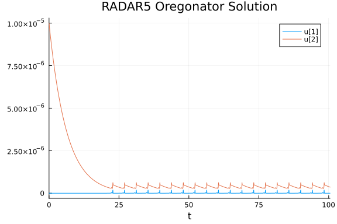
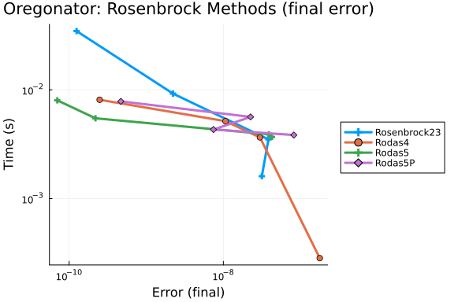
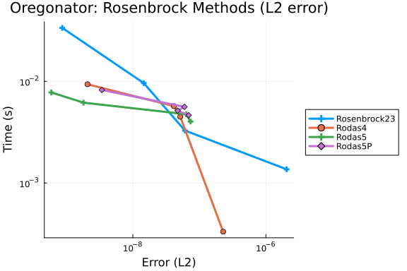
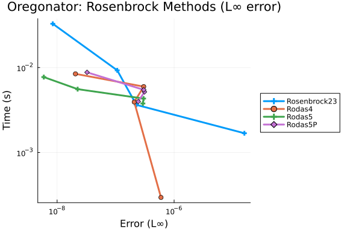
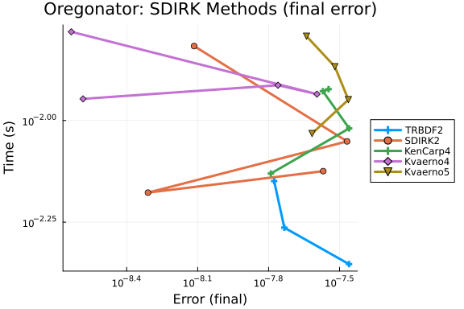
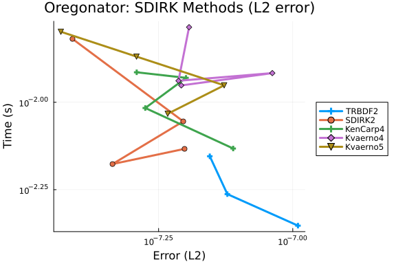
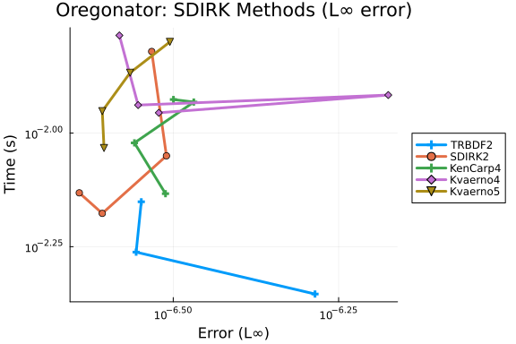
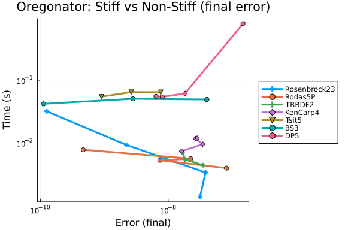
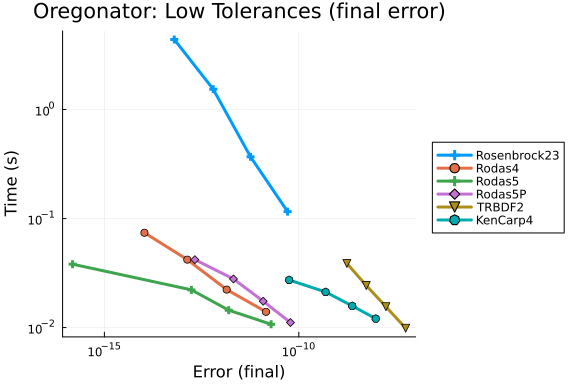
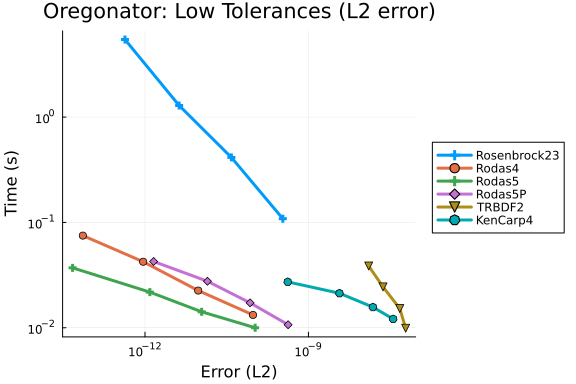

# RADAR5 Oregonator

This is a stiff delay differential equation model from chemical kinetics, taken from the
RADAR5 test suite by Guglielmi and Hairer. The problem is given by

```math
u_1'(t) = k_1 A u_2(t) - k_2 u_1(t) u_2(t - \tau) + k_3 B u_1(t) - 2 k_4 u_1(t)^2
```
```math
u_2'(t) = -k_1 A u_2(t) - k_2 u_1(t) u_2(t - \tau) + f k_3 B u_1(t)
```

for $t \in [0, 100.5]$ with history function $\phi_1(t) = 10^{-10}$, $\phi_2(t) = 10^{-5}$
for $t \leq 0$, where $k_1 = 1.34$, $k_2 = 1.6 \times 10^9$, $k_3 = 8000$,
$k_4 = 4 \times 10^7$, $f = 1$, $A = 0.06$, $B = 0.06$, and $\tau = 0.15$.

This problem is extremely stiff due to the large rate constants ($k_2 = 1.6 \times 10^9$,
$k_4 = 4 \times 10^7$).

## References

Epstein, I. and Luo, Y. (1991). Differential delay equations in chemical kinetics. Nonlinear
models, Journal of Chemical Physics (95), pp. 244-254.

Guglielmi, N. and Hairer, E. (2001). Implementing Radau IIA methods for stiff delay
differential equations, Computing (67), pp. 1-12.

```julia
using DelayDiffEq, DiffEqDevTools, DDEProblemLibrary, Plots
using OrdinaryDiffEqLowOrderRK, OrdinaryDiffEqRosenbrock, OrdinaryDiffEqSDIRK,
    OrdinaryDiffEqTsit5
import DDEProblemLibrary: prob_dde_RADAR5_oregonator
gr()
```

```
Plots.GRBackend()
```


## Reference Solution

We compute a reference solution using `Rodas5P` at very tight tolerances. The solution
components range from about $10^{-11}$ to $10^{-5}$, so absolute tolerances are scaled with the
solution as in the RADAR5 driver (`ATOL = RTOL * 1e-9`). After an initial decay of $u_2$, the
solution settles into periodic relaxation spikes.

```julia
sol = solve(prob_dde_RADAR5_oregonator, MethodOfSteps(Rodas5P());
    reltol = 1e-14, abstol = 1e-21)
test_sol = TestSolution(sol)
plot(sol; title = "RADAR5 Oregonator Solution")
```




## High Tolerances

### Rosenbrock methods

```julia
abstols = 1.0 ./ 10.0 .^ (10:13)
reltols = 1.0 ./ 10.0 .^ (1:4)

setups = [Dict(:alg => MethodOfSteps(Rosenbrock23())),
    Dict(:alg => MethodOfSteps(Rodas4())),
    Dict(:alg => MethodOfSteps(Rodas5())),
    Dict(:alg => MethodOfSteps(Rodas5P()))]
names = ["Rosenbrock23", "Rodas4", "Rodas5", "Rodas5P"]
wp = WorkPrecisionSet(prob_dde_RADAR5_oregonator, abstols, reltols, setups;
    names = names, appxsol = test_sol, maxiters = Int(1e5), error_estimate = :final)
plot(wp; title = "Oregonator: Rosenbrock Methods (final error)")
```



```julia
wp = WorkPrecisionSet(prob_dde_RADAR5_oregonator, abstols, reltols, setups;
    names = names, appxsol = test_sol, maxiters = Int(1e5), error_estimate = :L2)
plot(wp; title = "Oregonator: Rosenbrock Methods (L2 error)")
```



```julia
wp = WorkPrecisionSet(prob_dde_RADAR5_oregonator, abstols, reltols, setups;
    names = names, appxsol = test_sol, maxiters = Int(1e5), error_estimate = :L∞)
plot(wp; title = "Oregonator: Rosenbrock Methods (L∞ error)")
```




### SDIRK methods

At the loosest high-tolerance pair (`abstol = 1e-10`, `reltol = 1e-1`), `TRBDF2` returns
`Unstable` before $t = 100.5$, so that point is omitted from the diagrams. Final errors for the
SDIRK methods stay between about $2\times 10^{-9}$ and $4\times 10^{-8}$ across the
high-tolerance range and are not monotone in the tolerance; on this relaxation oscillator the
final-error estimate is phase-sensitive, so tightening the tolerance does not always improve
it.

```julia
setups = [Dict(:alg => MethodOfSteps(TRBDF2())),
    Dict(:alg => MethodOfSteps(SDIRK2())),
    Dict(:alg => MethodOfSteps(KenCarp4())),
    Dict(:alg => MethodOfSteps(Kvaerno4())),
    Dict(:alg => MethodOfSteps(Kvaerno5()))]
names = ["TRBDF2", "SDIRK2", "KenCarp4", "Kvaerno4", "Kvaerno5"]
wp = WorkPrecisionSet(prob_dde_RADAR5_oregonator, abstols, reltols, setups;
    names = names, appxsol = test_sol, maxiters = Int(1e5), error_estimate = :final)
plot(wp; title = "Oregonator: SDIRK Methods (final error)")
```



```julia
wp = WorkPrecisionSet(prob_dde_RADAR5_oregonator, abstols, reltols, setups;
    names = names, appxsol = test_sol, maxiters = Int(1e5), error_estimate = :L2)
plot(wp; title = "Oregonator: SDIRK Methods (L2 error)")
```



```julia
wp = WorkPrecisionSet(prob_dde_RADAR5_oregonator, abstols, reltols, setups;
    names = names, appxsol = test_sol, maxiters = Int(1e5), error_estimate = :L∞)
plot(wp; title = "Oregonator: SDIRK Methods (L∞ error)")
```




### Stiff vs Non-Stiff Comparison

In the latest run, `Tsit5` and `DP5` are more expensive than `Rosenbrock23` and `Rodas5P` at
every error they reach. `BS3` costs about as much as `Rosenbrock23` at the smallest errors. At
the loosest high-tolerance pair, `Tsit5` and `BS3` return `Unstable` (near $t \approx 68$ and
$t \approx 28$), and `TRBDF2` fails the same way as in the SDIRK diagram; those points are
omitted. `DP5` finishes but with a final error of about $1.5\times 10^{-7}$, roughly 40% of
$u_2$ at $t_{\mathrm{end}}$ ($\approx 3.6\times 10^{-7}$), making it the least accurate point
in the diagram.

```julia
setups = [Dict(:alg => MethodOfSteps(Rosenbrock23())),
    Dict(:alg => MethodOfSteps(Rodas5P())),
    Dict(:alg => MethodOfSteps(TRBDF2())),
    Dict(:alg => MethodOfSteps(KenCarp4())),
    Dict(:alg => MethodOfSteps(Tsit5())),
    Dict(:alg => MethodOfSteps(BS3())),
    Dict(:alg => MethodOfSteps(DP5()))]
names = ["Rosenbrock23", "Rodas5P", "TRBDF2", "KenCarp4", "Tsit5", "BS3", "DP5"]
wp = WorkPrecisionSet(prob_dde_RADAR5_oregonator, abstols, reltols, setups;
    names = names, appxsol = test_sol, maxiters = Int(1e6), error_estimate = :final)
plot(wp; title = "Oregonator: Stiff vs Non-Stiff (final error)")
```




## Low Tolerances

At these tolerances `Rosenbrock23` needs about $7\times 10^4$ to $2.4\times 10^6$ accepted
steps per solve, so this block raises `maxiters` to `Int(1e7)`. The Rodas and SDIRK methods
below complete within $10^5$ iterations.

```julia
abstols = 1.0 ./ 10.0 .^ (14:17)
reltols = 1.0 ./ 10.0 .^ (5:8)

setups = [Dict(:alg => MethodOfSteps(Rosenbrock23())),
    Dict(:alg => MethodOfSteps(Rodas4())),
    Dict(:alg => MethodOfSteps(Rodas5())),
    Dict(:alg => MethodOfSteps(Rodas5P())),
    Dict(:alg => MethodOfSteps(TRBDF2())),
    Dict(:alg => MethodOfSteps(KenCarp4()))]
names = ["Rosenbrock23", "Rodas4", "Rodas5", "Rodas5P", "TRBDF2", "KenCarp4"]
wp = WorkPrecisionSet(prob_dde_RADAR5_oregonator, abstols, reltols, setups;
    names = names, appxsol = test_sol, maxiters = Int(1e7), error_estimate = :final)
plot(wp; title = "Oregonator: Low Tolerances (final error)")
```



```julia
wp = WorkPrecisionSet(prob_dde_RADAR5_oregonator, abstols, reltols, setups;
    names = names, appxsol = test_sol, maxiters = Int(1e7), error_estimate = :L2)
plot(wp; title = "Oregonator: Low Tolerances (L2 error)")
```




## Appendix

These benchmarks are a part of the SciMLBenchmarks.jl repository, found at: [https://github.com/SciML/SciMLBenchmarks.jl](https://github.com/SciML/SciMLBenchmarks.jl). For more information on high-performance scientific machine learning, check out the SciML Open Source Software Organization [https://sciml.ai](https://sciml.ai).

To locally run this benchmark, do the following commands:
```
using SciMLBenchmarks
SciMLBenchmarks.weave_file("benchmarks/StiffDDE","Oregonator_wpd.jmd")
```

Computer Information:

```
Julia Version 1.12.7
Commit 6d172b025e4 (2026-08-15 08:05 UTC)
Build Info:
  Official https://julialang.org release
Platform Info:
  OS: Linux (x86_64-linux-gnu)
  CPU: 128 × AMD EPYC 7502 32-Core Processor
  WORD_SIZE: 64
  LLVM: libLLVM-18.1.7 (ORCJIT, znver2)
  GC: Built with stock GC
Threads: 128 default, 1 interactive, 128 GC (on 128 virtual cores)
Environment:
  JULIA_NUM_THREADS = auto

```

Package Information:

```
Status `/julia/github-runners/amdci1-1/_work/SciMLBenchmarks.jl/SciMLBenchmarks.jl/benchmarks/StiffDDE/Project.toml`
  [f42792ee] DDEProblemLibrary v0.1.10
⌃ [bcd4f6db] DelayDiffEq v6.4.0
  [f3b72e0c] DiffEqDevTools v3.6.3
⌃ [bbf590c4] OrdinaryDiffEqCore v4.17.2
  [d28bc4f8] OrdinaryDiffEqHighOrderRK v2.2.1
⌃ [1344f307] OrdinaryDiffEqLowOrderRK v2.2.5
⌃ [43230ef6] OrdinaryDiffEqRosenbrock v2.7.3
⌃ [2d112036] OrdinaryDiffEqSDIRK v2.9.4
⌃ [b1df2697] OrdinaryDiffEqTsit5 v2.1.4
⌃ [79d7bb75] OrdinaryDiffEqVerner v2.4.1
  [91a5bcdd] Plots v1.41.7
  [31c91b34] SciMLBenchmarks v0.2.1 [loaded: `/julia/github-runners/amdci1-1/_work/SciMLBenchmarks.jl/SciMLBenchmarks.jl/src/SciMLBenchmarks.jl` (v0.2.1) expected `/home/crackauc/.julia/packages/SciMLBenchmarks/ceJyd/src/SciMLBenchmarks.jl` (v0.2.1)]
Info Packages marked with ⌃ have new versions available and may be upgradable.
```

And the full manifest:

```
Status `/julia/github-runners/amdci1-1/_work/SciMLBenchmarks.jl/SciMLBenchmarks.jl/benchmarks/StiffDDE/Manifest.toml`
  [47edcb42] ADTypes v1.24.0
  [14f7f29c] AMD v0.5.4
  [7d9f7c33] Accessors v0.1.45
⌃ [79e6a3ab] Adapt v4.7.0
  [66dad0bd] AliasTables v1.1.3
  [4fba245c] ArrayInterface v7.30.2
  [b2a6c25c] BinaryHeaps v1.1.0
⌃ [70df07ce] BracketingNonlinearSolve v1.12.7
  [35d6a980] ColorSchemes v3.31.0
⌃ [3da002f7] ColorTypes v0.12.1
  [c3611d14] ColorVectorSpace v0.11.0
⌃ [5ae59095] Colors v0.13.1
  [38540f10] CommonSolve v0.2.14
  [bbf7d656] CommonSubexpressions v0.3.1
  [34da2185] Compat v4.18.1
  [a33af91c] CompositionsBase v0.1.2
  [2569d6c7] ConcreteStructs v0.2.8
  [187b0558] ConstructionBase v1.6.0
  [d38c429a] Contour v0.6.3
  [a8cc5b0e] Crayons v4.2.0
  [f42792ee] DDEProblemLibrary v0.1.10
  [9a962f9c] DataAPI v1.16.0
  [864edb3b] DataStructures v0.19.6
  [e2d170a0] DataValueInterfaces v1.0.0
⌃ [bcd4f6db] DelayDiffEq v6.4.0
  [8bb1440f] DelimitedFiles v1.9.1
⌃ [2b5f629d] DiffEqBase v7.21.1
  [f3b72e0c] DiffEqDevTools v3.6.3
⌃ [77a26b50] DiffEqNoiseProcess v5.36.3
  [163ba53b] DiffResults v1.1.0
  [b552c78f] DiffRules v1.16.0
  [a0c0ee7d] DifferentiationInterface v0.7.21
  [31c24e10] Distributions v0.25.131
  [ffbed154] DocStringExtensions v0.9.5
  [4e289a0a] EnumX v1.0.7
  [f151be2c] EnzymeCore v0.8.21
  [e2ba6199] ExprTools v0.1.11
⌃ [c87230d0] FFMPEG v0.4.5
  [7034ab61] FastBroadcast v1.4.0
  [9aa1b823] FastClosures v0.3.2
  [a4df4552] FastPower v1.5.0
⌃ [1a297f60] FillArrays v1.17.0
⌃ [64ca27bc] FindFirstFunctions v3.2.1
  [6a86dc24] FiniteDiff v2.33.0
⌅ [53c48c17] FixedPointNumbers v0.8.6
  [1fa38f19] Format v1.3.7
  [f6369f11] ForwardDiff v1.4.6
  [069b7b12] FunctionWrappers v1.1.3
  [77dc65aa] FunctionWrappersWrappers v1.13.0
⌃ [46192b85] GPUArraysCore v0.2.0
  [28b8d3ca] GR v0.73.27
  [a0844989] Gamma v1.2.0
⌅ [eafb193a] Highlights v0.5.3
  [34004b35] HypergeometricFunctions v0.3.30
  [3587e190] InverseFunctions v0.1.17
  [92d709cd] IrrationalConstants v0.2.6
  [82899510] IteratorInterfaceExtensions v1.0.0
  [1019f520] JLFzf v0.1.11
  [692b3bcd] JLLWrappers v1.8.0
⌅ [682c06a0] JSON v0.21.4
  [ba0b0d4f] Krylov v0.10.10
  [2faa5264] LHLFactorization v2.2.2
  [b964fa9f] LaTeXStrings v1.4.1
  [23fbe1c1] Latexify v0.16.12
⌃ [87fe0de2] LineSearch v0.1.18
⌃ [7ed4a6bd] LinearSolve v5.17.3
⌃ [2ab3a3ac] LogExpFunctions v1.0.1
  [e6f89c97] LoggingExtras v1.2.0
  [1914dd2f] MacroTools v0.5.16
  [bb5d69b7] MaybeInplace v0.1.8
  [442fdcdd] Measures v0.3.3
  [e1d29d7a] Missings v1.2.0
  [46d2c3a1] MuladdMacro v0.2.7
⌃ [ffc61752] Mustache v1.0.21 [loaded: v1.1.0]
  [77ba4419] NaNMath v1.1.4
⌃ [8913a72c] NonlinearSolve v4.30.0
⌃ [be0214bd] NonlinearSolveBase v2.49.5
⌃ [5959db7a] NonlinearSolveFirstOrder v2.6.1
  [9a2c21bd] NonlinearSolveQuasiNewton v1.15.3
  [26075421] NonlinearSolveSpectralMethods v1.8.3
  [bac558e1] OrderedCollections v2.0.1
⌃ [6ad6398a] OrdinaryDiffEqBDF v2.4.9
⌃ [bbf590c4] OrdinaryDiffEqCore v4.17.2
  [50262376] OrdinaryDiffEqDefault v2.6.2
⌃ [4302a76b] OrdinaryDiffEqDifferentiation v3.12.0
  [d3585ca7] OrdinaryDiffEqFunctionMap v2.3.0
  [d28bc4f8] OrdinaryDiffEqHighOrderRK v2.2.1
⌃ [1344f307] OrdinaryDiffEqLowOrderRK v2.2.5
⌃ [127b3ac7] OrdinaryDiffEqNonlinearSolve v2.9.8
⌃ [43230ef6] OrdinaryDiffEqRosenbrock v2.7.3
  [b4bd8bb3] OrdinaryDiffEqRosenbrockTableaus v2.4.2
⌃ [2d112036] OrdinaryDiffEqSDIRK v2.9.4
⌃ [b1df2697] OrdinaryDiffEqTsit5 v2.1.4
⌃ [79d7bb75] OrdinaryDiffEqVerner v2.4.1
  [90014a1f] PDMats v0.11.41
⌅ [69de0a69] Parsers v2.8.8
  [ccf2f8ad] PlotThemes v3.3.0
⌃ [995b91a9] PlotUtils v1.4.4
  [91a5bcdd] Plots v1.41.7
  [e409e4f3] PoissonRandom v0.4.13
  [d236fae5] PreallocationTools v1.7.1
⌃ [aea7be01] PrecompileTools v1.2.1 [loaded: v1.3.4]
  [21216c6a] Preferences v1.6.0
⌃ [08abe8d2] PrettyTables v3.4.8
  [43287f4e] PtrArrays v1.4.0
⌃ [0c0d3e7f] PureKLU v1.5.0
  [1fd47b50] QuadGK v2.11.3
⌃ [3cdcf5f2] RecipesBase v1.3.4
  [01d81517] RecipesPipeline v0.6.12
⌃ [731186ca] RecursiveArrayTools v4.5.1
  [189a3867] Reexport v1.2.2
  [05181044] RelocatableFolders v1.0.1
  [ae029012] Requires v1.3.1
  [ae5879a3] ResettableStacks v1.4.0
  [9fe22ead] RespecializeParams v1.3.0
  [79098fc4] Rmath v0.9.0
  [47965b36] RootedTrees v2.27.0
⌃ [f2b01f46] Roots v3.0.8
⌃ [7e49a35a] RuntimeGeneratedFunctions v0.5.26
⌃ [0bca4576] SciMLBase v3.54.0
  [31c91b34] SciMLBenchmarks v0.2.1 [loaded: `/julia/github-runners/amdci1-1/_work/SciMLBenchmarks.jl/SciMLBenchmarks.jl/src/SciMLBenchmarks.jl` (v0.2.1) expected `/home/crackauc/.julia/packages/SciMLBenchmarks/ceJyd/src/SciMLBenchmarks.jl` (v0.2.1)]
  [19f34311] SciMLJacobianOperators v0.1.19
  [a6db7da4] SciMLLogging v2.1.0
⌃ [c0aeaf25] SciMLOperators v1.30.0
  [431bcebd] SciMLPublic v1.3.0
  [53ae85a6] SciMLStructures v1.10.5
  [6c6a2e73] Scratch v1.3.0
  [efcf1570] Setfield v1.1.2
  [992d4aef] Showoff v1.1.1
⌃ [727e6d20] SimpleNonlinearSolve v2.14.5
  [a2af1166] SortingAlgorithms v1.2.3
  [a57abbd0] SparseColumnPivotedQR v2.1.8
  [0a514795] SparseMatrixColorings v0.4.28
  [276daf66] SpecialFunctions v2.9.0
  [860ef19b] StableRNGs v1.0.4
⌃ [90137ffa] StaticArrays v1.9.20
  [1e83bf80] StaticArraysCore v1.4.4
  [10745b16] Statistics v1.11.5
  [82ae8749] StatsAPI v1.8.0
  [2913bbd2] StatsBase v0.34.13
  [4c63d2b9] StatsFuns v2.2.1
  [69024149] StringEncodings v0.3.7
⌅ [892a3eda] StringManipulation v0.5.0
  [09ab397b] StructArrays v0.7.3
  [2efcf032] SymbolicIndexingInterface v0.3.55
  [3783bdb8] TableTraits v1.0.1
  [bd369af6] Tables v1.14.0
  [62fd8b95] TensorCore v0.1.1
⌃ [a759f4b9] TimerOutputs v1.2.1
  [781d530d] TruncatedStacktraces v1.4.0
  [1cfade01] UnicodeFun v0.4.1
  [41fe7b60] Unzip v0.2.0
  [44d3d7a6] Weave v0.10.12
⌃ [ddb6d928] YAML v0.4.16 [loaded: v0.4.17]
  [6e34b625] Bzip2_jll v1.0.9+0
⌃ [83423d85] Cairo_jll v1.18.7+0
  [ee1fde0b] Dbus_jll v1.16.2+0
  [2702e6a9] EpollShim_jll v0.0.20230411+1
  [2e619515] Expat_jll v2.8.4+0
⌅ [b22a6f82] FFMPEG_jll v8.1.2+0
  [a3f928ae] Fontconfig_jll v2.17.1+0
  [d7e528f0] FreeType2_jll v2.14.3+1
  [559328eb] FriBidi_jll v1.0.17+0
  [0656b61e] GLFW_jll v3.5.1+0
  [d2c73de3] GR_jll v0.73.27+0
⌅ [b0724c58] GettextRuntime_jll v0.22.4+0
  [61579ee1] Ghostscript_jll v9.55.1+0
  [7746bdde] Glib_jll v2.88.3+0
  [3b182d85] Graphite2_jll v1.3.16+0
  [2e76f6c2] HarfBuzz_jll v100.14004.0+0
  [1d5cc7b8] IntelOpenMP_jll v2025.2.0+0
  [aacddb02] JpegTurbo_jll v3.2.0+1
  [c1c5ebd0] LAME_jll v3.100.3+0
  [88015f11] LERC_jll v4.2.0+0
  [1d63c593] LLVMOpenMP_jll v23.1.1+0
⌅ [e9f186c6] Libffi_jll v3.4.7+0
  [7e76a0d4] Libglvnd_jll v1.7.1+1
  [94ce4f54] Libiconv_jll v1.18.0+0
  [4b2f31a3] Libmount_jll v2.42.0+0
  [89763e89] Libtiff_jll v4.7.3+0
  [38a345b3] Libuuid_jll v2.42.0+0
  [856f044c] MKL_jll v2025.2.0+0
  [e7412a2a] Ogg_jll v1.3.6+0
  [efe28fd5] OpenSpecFun_jll v0.5.6+0
  [91d4177d] Opus_jll v1.6.1+0
  [36c8627f] Pango_jll v1.58.2+0
  [30392449] Pixman_jll v0.46.4+0
  [c0090381] Qt6Base_jll v6.10.2+2
  [629bc702] Qt6Declarative_jll v6.10.2+2
  [ce943373] Qt6ShaderTools_jll v6.10.2+1
  [6de9746b] Qt6Svg_jll v6.10.2+0
  [e99dba38] Qt6Wayland_jll v6.10.2+1
  [f50d1b31] Rmath_jll v0.5.2+0
  [a44049a8] Vulkan_Loader_jll v1.3.243+0
  [a2964d1f] Wayland_jll v1.24.0+0
  [ffd25f8a] XZ_jll v5.8.4+0
  [f67eecfb] Xorg_libICE_jll v1.1.2+0
  [c834827a] Xorg_libSM_jll v1.2.6+0
  [4f6342f7] Xorg_libX11_jll v1.8.13+0
  [0c0b7dd1] Xorg_libXau_jll v1.0.13+0
  [935fb764] Xorg_libXcursor_jll v1.2.4+0
  [a3789734] Xorg_libXdmcp_jll v1.1.6+0
  [1082639a] Xorg_libXext_jll v1.3.8+0
  [d091e8ba] Xorg_libXfixes_jll v6.0.2+0
  [a51aa0fd] Xorg_libXi_jll v1.8.4+0
  [d1454406] Xorg_libXinerama_jll v1.1.7+0
  [ec84b674] Xorg_libXrandr_jll v1.5.6+0
  [ea2f1a96] Xorg_libXrender_jll v0.9.12+0
  [a65dc6b1] Xorg_libpciaccess_jll v0.19.0+0
  [c7cfdc94] Xorg_libxcb_jll v1.17.1+0
  [cc61e674] Xorg_libxkbfile_jll v1.2.0+0
  [e920d4aa] Xorg_xcb_util_cursor_jll v0.1.6+0
  [12413925] Xorg_xcb_util_image_jll v0.4.1+0
  [2def613f] Xorg_xcb_util_jll v0.4.1+0
  [975044d2] Xorg_xcb_util_keysyms_jll v0.4.1+0
  [0d47668e] Xorg_xcb_util_renderutil_jll v0.3.10+0
  [c22f9ab0] Xorg_xcb_util_wm_jll v0.4.2+0
  [35661453] Xorg_xkbcomp_jll v1.4.7+0
  [33bec58e] Xorg_xkeyboard_config_jll v2.47.0+2
  [c5fb5394] Xorg_xtrans_jll v1.6.0+0
  [3161d3a3] Zstd_jll v1.5.7+1
  [35ca27e7] eudev_jll v3.2.14+0
⌅ [214eeab7] fzf_jll v0.61.1+0
⌃ [a4ae2306] libaom_jll v3.14.1+0
  [0ac62f75] libass_jll v0.17.5+0
  [1183f4f0] libdecor_jll v0.2.2+0
  [8e53e030] libdrm_jll v2.4.134+0
  [2db6ffa8] libevdev_jll v1.13.4+0
  [f638f0a6] libfdk_aac_jll v2.0.4+0
  [36db933b] libinput_jll v1.28.1+0
⌃ [b53b4c65] libpng_jll v1.6.58+0
  [9a156e7d] libva_jll v2.23.0+0
  [f27f6e37] libvorbis_jll v1.3.8+0
  [009596ad] mtdev_jll v1.1.7+0
  [1317d2d5] oneTBB_jll v2022.3.0+0
⌅ [1270edf5] x264_jll v10164.0.1+0
  [dfaa095f] x265_jll v4.1.0+0
  [d8fb68d0] xkbcommon_jll v1.13.0+0
  [0dad84c5] ArgTools v1.1.2
  [56f22d72] Artifacts v1.11.0
  [2a0f44e3] Base64 v1.11.0
  [ade2ca70] Dates v1.11.0
  [8ba89e20] Distributed v1.11.0
  [f43a241f] Downloads v1.7.0
  [7b1f6079] FileWatching v1.11.0
  [9fa8497b] Future v1.11.0
  [b77e0a4c] InteractiveUtils v1.11.0
  [ac6e5ff7] JuliaSyntaxHighlighting v1.12.0
  [4af54fe1] LazyArtifacts v1.11.0
  [b27032c2] LibCURL v0.6.4
  [76f85450] LibGit2 v1.11.0
  [8f399da3] Libdl v1.11.0
  [37e2e46d] LinearAlgebra v1.12.0
  [56ddb016] Logging v1.11.0
  [d6f4376e] Markdown v1.11.0
  [a63ad114] Mmap v1.11.0
  [ca575930] NetworkOptions v1.3.0
  [44cfe95a] Pkg v1.12.1
  [de0858da] Printf v1.11.0
  [3fa0cd96] REPL v1.11.0
  [9a3f8284] Random v1.11.0
  [ea8e919c] SHA v0.7.0
  [9e88b42a] Serialization v1.11.0
  [6462fe0b] Sockets v1.11.0
  [2f01184e] SparseArrays v1.12.0
  [f489334b] StyledStrings v1.11.0
  [4607b0f0] SuiteSparse
  [fa267f1f] TOML v1.0.3
  [a4e569a6] Tar v1.10.0
  [8dfed614] Test v1.11.0
  [cf7118a7] UUIDs v1.11.0
  [4ec0a83e] Unicode v1.11.0
  [e66e0078] CompilerSupportLibraries_jll v1.3.1+2
  [deac9b47] LibCURL_jll v8.15.0+0
  [e37daf67] LibGit2_jll v1.9.0+0
  [29816b5a] LibSSH2_jll v1.11.3+1
  [14a3606d] MozillaCACerts_jll v2025.11.4
  [4536629a] OpenBLAS_jll v0.3.29+0
  [05823500] OpenLibm_jll v0.8.7+0
  [458c3c95] OpenSSL_jll v3.5.6+0
  [efcefdf7] PCRE2_jll v10.44.0+1
  [bea87d4a] SuiteSparse_jll v7.8.3+2
  [83775a58] Zlib_jll v1.3.1+2
  [8e850b90] libblastrampoline_jll v5.15.0+0
  [8e850ede] nghttp2_jll v1.64.0+1
  [3f19e933] p7zip_jll v17.7.0+0
Info Packages marked with ⌃ and ⌅ have new versions available. Those with ⌃ may be upgradable, but those with ⌅ are restricted by compatibility constraints from upgrading. To see why use `status --outdated -m`
```

